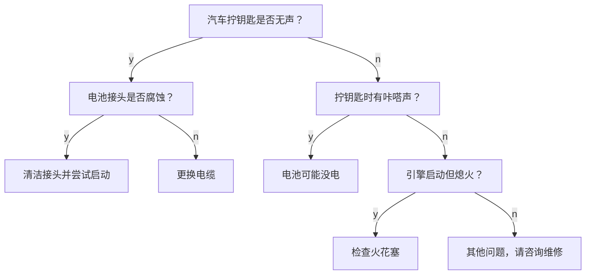
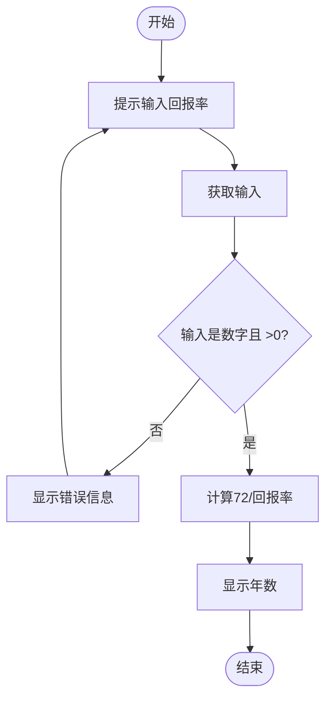

# 《挑战编程技能：57道程序员功力测试题》章节总结

## 书籍信息
- 书名：挑战编程技能：57道程序员功力测试题
- 作者：[美] Brian P. Hogan
- 译者：臧秀涛
- PDF状态：基于扫描版PDF提取，部分OCR可能存在识别误差
- OCR状态：文本可读，少量页码和格式错乱，已尽力恢复

## 目录说明
- 目录识别情况：全书共有10章，外加前言（如何使用本书、目标读者、教育工作者需要注意、本书内容、读者所需、在线资源）、致谢以及最后的“下一步干什么？”。
- 章节对应依据：严格按照原书页码和标题层级整理。
- OCR修复说明：部分图表（如流程图、决策树）依赖文字描述重建为Mermaid格式；个别页眉页脚和页码未纳入总结。

## 全书核心主题
本书是一本面向程序员的练习集，包含57道从易到难的编程题目。核心主题是：通过反复解决实际问题来锤炼软件开发技能。作者强调，编程能力的提升不仅依靠理论学习，更需要大量刻意练习。书中每一道题都模拟了真实开发场景（输入输出处理、计算、决策、函数、数据结构、文件操作、外部服务调用等），并附加约束条件和挑战任务，鼓励读者在不同编程语言中实现，从而培养问题分解、算法设计、测试驱动和代码组织的能力。全书遵循“输入→处理→输出”的基本模型，逐步引入条件判断、循环、函数、数据结构、文件IO、API调用，最终整合为完整的小型应用。

---

## 前言：如何使用本书

### 核心论点
本书旨在帮助新手程序员和有经验的开发者通过解决实际问题来提升编程技能。作者认为，编程能力的精进如同音乐家练习音阶、运动员重复训练一样，需要刻意练习。书中57道练习题难度渐进，覆盖从基本输入输出到复杂系统的完整技能链。

### 关键概念/事件
- **刻意练习**：通过反复解决相同问题（或用不同语言解决）来打磨技术。
- **两类目标读者**：①刚学编程的新手，需要课外开放性问题；②有经验的程序员，希望学习新语言或新范式。
- **教育工作者指南**：适合课堂练习和问题导向学习，不建议作为最终考试。
- **练习结构**：每个问题包含示例输出、约束条件、挑战任务（GUI、输入验证、函数化等）。
- **无解决方案提供**：强调独立思考，鼓励读者自行查找资源。

### 逻辑推演/叙事脉络
作者首先用音乐家、运动员和空手道练习者类比，说明反复训练的价值。然后明确本书不提供现成答案，而是提供真实场景问题。接着阐述练习的设计理念：从简单输入输出开始，逐步加入计算、决策、循环、数据结构、文件操作、外部API，最后整合为完整程序。每个练习都附加“约束”以引导良好编程习惯（如分离输入/处理/输出），并提供“挑战”供进阶练习。

### 经典金句/数据
> “宝剑锋从磨砺出。” (p.7)
> “本书要谈的就是程序员如何锤炼其技能。翻到本书的某一页，打开文本编辑器，敲出上面的程序。可以自己做些修改。” (p.8)
> “本书不会提供这些程序的解决方案。如果你做了足够深入的思考，而且使用了所有可以调配的资源，应该能独立想出解决之道，而这正是本书主旨所在。” (p.11)

---

## 致谢

### 核心论点
作者感谢了编辑、审校者、学生和家人的支持，强调社区反馈和教学实践对本书习题的改进起到了关键作用。

### 关键概念/事件
- 感谢Dave Thomas（理念支持）和Susannah Pfalzer（编辑指导）。
- 感谢10年间参与课程的学生，他们的反馈帮助优化了练习题。
- 感谢众多审校者用不同语言实现习题，找出问题并改进衔接。

---

## 第1章：将问题转变成代码

### 核心论点
本章解决“如何从模糊的需求出发，设计出可运行的代码”这一问题。作者提出一套结构化的问题分解方法：理解问题 → 发现输入/处理/输出 → 用测试驱动设计 → 编写伪代码 → 编写代码。并以小费计算程序为完整案例演示。

### 关键概念/事件
- **理解问题**：通过提问收集需求，写出精确的问题描述。
- **输入、处理、输出（IPO）**：用名词识别输入/输出，动词识别处理步骤。
- **测试驱动设计（TDD简化版）**：编写测试计划（输入+预期结果），至少4个测试用例。
- **伪代码**：用英语类似语法写出算法蓝图，不关心具体语言语法。
- **算法**：一系列有序的操作步骤。
- **约束与挑战**：每个练习后都有硬性约束（如分离关注点）和拓展挑战（GUI、函数化等）。

### 逻辑推演/叙事脉络
作者首先强调不应急于编码，而是先写下来。通过小费计算程序逐步演示：提出澄清问题 → 写出问题描述 → 提取名词动词得到IPO → 设计测试计划（包含边界条件如向上取整）→ 用伪代码描述算法 → 最后编写真实代码。同时说明约束（如百分比输入处理、向上取整）和挑战（输入验证、循环直到合法、GUI等）的意义。

### 流程图（本章无）

### 经典金句/数据
> “如果你才接触编程，可能想知道有经验的开发者是如何看问题以及如何将其转变为可运行的代码的。其实，编写代码只是这个过程中很小的一部分。” (p.19)
> “测试计划会列出程序的输入和预期结果。” (p.23)
> “伪代码语法和英语类似，方便我们思考逻辑，还不用担心纸的问题。” (p.25)

---

## 第2章：输入、处理和输出

### 核心论点
本章通过5个简单程序（问好、字符计数、打印引语、疯狂填词、简单数学、退休计算）训练读者从用户获取输入、进行基本字符串和数值操作、并保持输入/处理/输出的分离。

### 关键概念/事件
- **字符串连接与插值**：练习中要求分别使用连接和插值。
- **内置函数**：如获取字符串长度、获取当前年份。
- **输入转换**：用户输入默认为字符串，需转换为数值才能计算。
- **转义字符**：打印引号时使用反斜杠转义。
- **数值转换与格式化**：货币显示、换行控制。

### 逻辑推演/叙事脉络
六个练习难度递增：先处理纯字符串（问好、字符数、引语、疯狂填词），再引入数值计算（简单数学），最后加入系统时间（退休计算）。每个练习都强调“分离输入、处理和输出”，避免在输出语句中做复杂运算。挑战部分逐渐引入错误处理、GUI和函数。

### 流程图（本章无）

### 经典金句/数据
> “你的计算机知道今年的年份，这意味着可以将该信息加到你的程序中。” (p.35)
> “当程序很简单时，在其输出语句中做点数学运算或字符串连接可能很有诱惑力，但是随着程序愈加复杂，你会发现需要将其分解为可以复用的组件。” (p.36)

---

## 第3章：计算

### 核心论点
本章解决涉及浮点精度、货币舍入、公式转换等真实计算问题。作者强调运算优先级、浮点数精度陷阱（如0.1+0.2≠0.3），以及使用整数表示货币或专门的数值类型来避免错误。

### 关键概念/事件
- **运算优先级**：括号 > 幂 > 乘除 > 加减。
- **浮点数精度问题**：在Ruby/JavaScript中0.1+0.2=0.30000000000000004。
- **货币处理方案**：用整数表示分（125代表1.25），运算后再放回小数点；或使用BigDecimal。
- **常量**：使用常量保存转换因子（如平方英尺到平方米）。
- **向上取整**：涂料计算需要整加仑，使用ceil函数。
- **复利公式**：引入指数运算，公式A = P(1 + r/n)^(nt)。

### 逻辑推演/叙事脉络
本章共7个计算练习：矩形面积、比萨分配、涂料计算、自助结账、货币兑换、单利、复利。每个练习都涉及公式转换和精度处理。作者先警告浮点数问题，然后给出货币处理的最佳实践。在复利部分引入指数运算，并展示测试计划的重要性（如分位舍入）。挑战包括支持更多商品、连接外部汇率API等。

### 流程图（本章无）

### 经典金句/数据
> “一旦涉及货币，情况会更糟。对初学编程的人而言，在尝试使用浮点数表示货币时，有个最常见的问题：浮点数会导致精度错误。” (p.38)
> “常用的一种方案是使用整数表示钱。不用1.25，而用125。” (p.38)
> 转换公式：m² = ft² × 0.09290304 (p.40)
> 复利公式：A = P(1 + r/n)^(nt) (p.48)

---

## 第4章：作出决策

### 核心论点
本章介绍如何使用条件语句（if/else、switch）让程序根据输入做出不同响应。作者强调流程图和伪代码在梳理决策逻辑中的价值，并展示从简单二选一到嵌套决策的逐步复杂化。

### 关键概念/事件
- **if/else 语句**：基本比较，支持嵌套。
- **switch/case**：处理多分支选择。
- **三元运算符**：紧凑的条件赋值。
- **流程图**：用图形表示决策路径，帮助发现遗漏（如忘记类型转换）。
- **比较运算符**：相等(==)、大于(>)、小于(<)、范围判断。
- **逻辑组合**：BMI计算中的区间判断，多州税收中的嵌套决策。

### 逻辑推演/叙事脉络
9个练习覆盖：税额计算（单一州加税）、密码验证（相等比较）、法定驾驶年龄（大小比较）、BAC计算（公式后与阈值比较）、温度转换（选择转换方向）、BMI计算（区间判断及建议）、多州税收（嵌套决策）、数字转月份（switch）、找最大数（手动比较）。最后用汽车故障诊断决策树展示专家系统雏形。每个练习都要求考虑边界条件和无效输入。

### 流程图
#### 决策流程图示例（大于100的数验证）
```mermaid
graph TD
    Start([开始]) --> Prompt[提示用户输入大于100的数]
    Prompt --> GetInput[获取用户输入]
    GetInput --> Check{输入 > 100?}
    Check -- 是 --> DisplayThank[显示 "Thank you."]
    Check -- 否 --> DisplayWrong[显示 "That's not correct."]
    DisplayThank --> End([结束])
    DisplayWrong --> End
```

#### 汽车故障诊断决策树（简化）


### 经典金句/数据
> “流程图可以帮你以图形化方式审视要解决的问题，当你认真考虑决策逻辑时，流程图就派上用场了。” (p.51)
> “代码中的分支越多，可能的结果就越多。” (p.70)

---

## 第5章：函数

### 核心论点
本章讲解如何通过函数将程序分解为可复用的模块，提升代码组织性和可维护性。作者强调函数应封装单一职责，并通过参数传递数据，返回结果。

### 关键概念/事件
- **函数定义**：输入参数，执行操作，返回结果。
- **函数调用**：主程序调用辅助函数。
- **封装**：将复杂逻辑（如异位词检查、密码强度评估、信用卡还款月数计算、输入验证）隐藏在函数内。
- **纯函数**：给定相同输入总是返回相同输出，无副作用。
- **验证函数集合**：为名字、工号、邮编分别编写验证函数，再组合成总验证函数。

### 逻辑推演/叙事脉络
四个练习：字母易位词检查（isAnagram）、密码强度评估（passwordValidator）、信用卡还款月数计算（calculateMonthsUntilPaidOff）、多字段输入验证（validateInput）。每个练习都要求将核心算法放在单独的函数中，主程序只负责调用。作者建议回到前面章节，用函数重写之前的程序。

### 流程图（本章无）

### 经典金句/数据
> “函数就像主程序内更小的程序。” (p.71)
> “较大的函数并不是非常好用，可维护性也不是很好。将程序的逻辑分解为只做一件事的更小的函数，很有意义。” (p.77)
> 信用卡还款月数公式：n = -1/30 × log(1 + b/p × (1 - (1+i)^30)) / log(1+i) (p.75)

---

## 第6章：重复

### 核心论点
本章解决如何用循环（重复结构）避免代码冗余，处理批量输入、生成表格、游戏循环等。作者介绍了计数循环（for）、条件循环（while）、递归（某些函数式语言）以及嵌套循环。

### 关键概念/事件
- **计数循环**：固定次数重复，如求5个数的和。
- **条件循环**：直到满足条件才停止，如验证输入直到合法。
- **嵌套循环**：循环内嵌循环，用于生成乘法表。
- **步长控制**：循环变量可不为1，如心率表格从55%到95%步长5%。
- **随机数生成**：猜数字游戏中使用随机数。
- **输入验证循环**：拒绝非数字和0值，重复提示。

### 逻辑推演/叙事脉络
5个练习：数字相加（固定次数）、错误输入处理（72法则，循环直到有效输入）、乘法表（嵌套循环）、卡蒙内心率表（步长循环）、猜数字游戏（游戏循环+难度选择）。作者展示了流程图如何帮助识别循环结构，并强调在循环前必须初始化计数器。

### 流程图
#### 输入验证循环（直到输入合法）


### 经典金句/数据
> “如何让计算机反复做同样的事？当然不必把代码敲上很多遍，对不对？” (p.79)
> “结构化程序理论：顺序、选择和循环。” (p.79)
> 卡蒙内心率公式：TargetHeartRate = ((220 - age) - restingHR) × intensity + restingHR (p.87)

---

## 第7章：数据结构

### 核心论点
本章介绍如何使用数组（列表）和映射（字典/哈希）来组织批量数据。作者展示如何存储、随机访问、添加、删除、过滤、排序记录，以及结合循环处理集合。

### 关键概念/事件
- **数组**：有序的元素列表，通过索引访问。
- **映射**：键值对集合，通过键访问值。
- **数组与映射的组合**：存储一组记录（如员工表），每条记录是一个映射。
- **迭代**：使用for、foreach或each遍历数组。
- **随机选择**：结合随机数生成器从数组中选元素（神奇8号球、抽奖优胜者）。
- **删除元素**：按值或索引删除，注意有些语言需要创建新数组。
- **统计计算**：平均值、最小值、最大值、标准差。
- **过滤**：从数组中选出满足条件的元素（如偶数）。
- **排序**：按指定字段（如姓氏）排序。

### 逻辑推演/叙事脉络
8个练习：神奇8号球（随机响应）、删除员工（数组删除）、选择优胜者（收集输入后随机选）、计算统计信息（响应时间分析）、密码生成器（从字符列表随机组合）、过滤偶数（从列表选偶数）、排序记录（员工表按姓氏排序）、过滤记录（按搜索字符串查找）。练习难度逐步提升，从简单数组操作到组合数据结构处理真实数据集。

### 流程图（本章无）

### 经典金句/数据
> “只有最简单的程序能够侥幸靠将数据保存在变量中解决。” (p.91)
> “数组是保存一系列值的数据结构……映射是一个将键映射到值的数据结构。” (p.91-92)
> “标准差公式：计算每个值与平均值的差的平方，再计算这些平方的平均值，最后取平方根。” (p.99)

---

## 第8章：使用文件

### 核心论点
本章讲解如何从文件读取数据、处理数据并写回文件。作者强调不同语言的文件操作API差异，并演示了CSV解析、文件排序、文件生成、JSON解析、文本替换和词频统计。

### 关键概念/事件
- **文件读取**：一次性读入所有行或逐行处理。
- **文件写入**：将结果输出到新文件。
- **CSV解析**：手动拆分逗号分隔的值，不使用第三方库。
- **JSON解析**：使用内置JSON解析器读取结构化数据。
- **字符串替换**：查找并替换文本中的单词。
- **词频统计**：统计单词出现次数并按频率排序输出直方图。
- **目录/文件夹操作**：创建文件夹、生成网站骨架。

### 逻辑推演/叙事脉络
6个练习：姓名排序（读姓名列表，排序后写入新文件）、解析CSV（格式化表格输出）、网站生成器（创建文件夹和HTML文件）、产品搜索（从JSON文件读库存并交互查询）、单词替换（将"utilize"替换为"use"）、词频统计（读文本文件生成直方图）。每个练习都涉及文件输入输出，并鼓励挑战如处理大文件、使用CSV库对比、配置文件映射等。

### 流程图（本章无）

### 经典金句/数据
> “我们处理过的所有程序都是从终端用户那里获得输入，或是使用硬编码的值。但是很多程序使用文件来存储数据。” (p.107)
> “如果是在浏览器中使用 JavaScript，因为浏览器会阻止读写本地文件系统，所以无法在不加修改的情况下做这些练习题。不过可以使用 Node.js。” (p.108)

---

## 第9章：使用外部服务

### 核心论点
本章介绍如何通过API与外部服务交互，获取数据或提交数据。作者强调API密钥的安全存储、JSON解析、HTTP请求的构造，以及将外部数据集成到程序中的通用模式。

### 关键概念/事件
- **API（应用编程接口）**：服务提供的数据交互端点。
- **HTTP请求**：GET（获取数据）、POST（提交数据）。
- **JSON格式**：大多数现代API返回的数据格式。
- **API密钥**：需注册获取，不能硬编码在客户端代码中，应使用服务器端代理或配置文件。
- **公开API示例**：OpenNotify（太空人员）、Flickr（照片搜索）、Rotten Tomatoes（电影信息）、Firebase（数据存储）。
- **自建API**：创建简单的JSON时间服务。

### 逻辑推演/叙事脉络
6个练习：谁在太空中（获取并显示国际空间站人员）、抓取天气（需注册API）、Flickr照片搜索（GUI显示图片）、电影推荐（集成烂番茄API）、向Firebase提交笔记（命令行工具，REST API）、创建自己的时间服务（用任意语言实现JSON API，再编写客户端调用）。挑战包括缓存数据、按字母排序人名（处理空格）、图形化显示海报等。

### 流程图（本章无）

### 经典金句/数据
> “会使用提供数据的外部服务，这是程序员具备的最重要的技能之一。” (p.119)
> “如果是在浏览器中使用JavaScript，可不能直接把密钥信息放到JavaScript代码中，因为运行该程序的所有人都能查看全部源代码，并窃取到密钥。” (p.119)

---

## 第10章：完整的程序

### 核心论点
本章提供5个综合性编程项目，要求整合前面所学所有技能（输入输出、决策、循环、数据结构、文件、外部服务、前端/后端）。作者鼓励读者通过解决实际痛点来巩固知识，并建议学习测试驱动开发、Git版本控制和开源贡献。

### 关键概念/事件
- **待完成事项清单**：命令行应用，支持添加、显示、删除任务，持久化到外部数据源（Redis/Firebase/IndexedDB）。
- **短网址服务**：Web应用，生成短链接，记录访问次数和统计页面。
- **文本分享服务**：类似Pastebin，支持保存、生成URL、编辑和版本记录。
- **财产记录程序**：支持录入物品、序列号、价格，导出HTML/CSV报表，可选照片保存。
- **多选项事问答应用**：从文件读入问题/选项/答案，随机出题，记录得分，支持难度递进。

### 逻辑推演/叙事脉络
作者先列出5个完整项目，每个项目都有详细功能要求和约束（持久化、输入验证、API设计等）。然后给出“下一步干什么？”的建议：用这本书的练习来学习新语言、尝试测试驱动开发、学习Git、参与开源项目。

### 流程图（本章无）

### 经典金句/数据
> “本章的练习需要你把前面学到的所有知识汇总到一起。” (p.130)
> “想想生活中想要解决的问题，或者试试重写某个现有应用。编写自己的卡路里计算应用、番茄钟定时器或购物清单应用。” (p.135)

---

## 后记：下一步干什么？

### 核心论点
作者鼓励读者继续深化技能：学习测试驱动开发（单元测试、验收测试）、掌握Git版本控制并将代码托管到GitHub、参与开源项目。同时建议当学习一门新语言时，重新使用本书的练习题来实践。

### 关键概念/事件
- **测试驱动开发（TDD）**：编写测试先于代码。
- **版本控制（Git）**：保存历史、协作开发。
- **开源贡献**：通过阅读他人代码和提交补丁来成长。

### 经典金句/数据
> “当学习下一门语言时，可以再拿起这本书，从头开始，不过要结合新的思考方式来解决类似的问题。编码愉快！” (p.136)