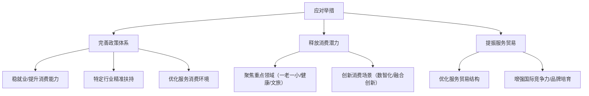

# 《提振服务业，推动服务业优质高效发展》章节总结

## 书籍信息
- 书名：提振服务业，推动服务业优质高效发展（中国宏观经济专题报告 第118期）
- 作者：中国人民大学国家发展与战略研究院、中国人民大学经济学院、中诚信国际信用评级有限责任公司（主办）；中国人民大学经济研究所（承办）；报告发布人：孙浦阳等；论坛嘉宾：毛振华、孙学工、彭泗清、崔艳新、程强等
- PDF 状态：文本可识别，含目录、正文、图表、专家发言
- OCR 状态：良好，无明显错漏

## 目录说明
- 目录识别完整，按以下结构：
  - 一、政策背景
  - 二、现实背景
  - 三、发展堵点
  - 四、应对举措
  - 论坛第二单元（专家讨论）
- 附录包含部分专家观点整理
- 报告以“一个总目标、四个着力点、三大发展任务”为核心框架

## 全书核心主题
本报告围绕“提振服务业，推动服务业优质高效发展”展开，分析2026年全国服务业大会及“十五五”规划对服务业的战略定位。报告指出：服务业已占GDP半壁江山，服务消费成为内需新引擎，但面临消费能力不足、供给质量不高、体制机制不完善等堵点。对策包括完善政策体系、释放消费潜力、提振服务贸易并打造“中国服务”品牌。专家进一步探讨了独立第三方机构、公共服务扩面、数智赋能等关键议题。

---

## 第一部分：政策背景

### 核心论点
本章回答：国家对服务业发展的最新指示是什么？作者观点：服务业发展需以“高质量”为核心，通过需求牵引、改革攻坚、科技赋能、开放合作四个着力点，实现生产性服务业高端化、生活性服务业品质化、培育“中国服务”品牌三大任务。

### 关键概念/事件
- 全国服务业大会（2026年4月7-8日）：新时代首次聚焦服务业发展的全国性大会，习近平总书记作出最新指示。
- 一个总目标：努力开创服务业高质量发展新局面。
- 四个着力点：①需求牵引（服务消费为核心）；②改革攻坚（破除要素流动壁垒）；③科技赋能（推动技术与模式创新）；④开放合作（高水平对外开放）。
- 三大发展任务：生产性服务业向专业化和价值链高端延伸；生活性服务业向高品质多样化便利化发展；培育“中国服务”品牌。

### 逻辑推演
报告从政策顶层设计切入，首先引用总书记指示明确服务业高质量发展的总目标。随后将总目标分解为四个着力点：需求牵引强调服务消费是基础；改革攻坚针对行业与区域壁垒；科技赋能要求将数据、数字技术融入服务业；开放合作聚焦服务贸易。最后提出三大发展任务，形成“目标→路径→任务”的政策逻辑链。

### 经典金句/数据
> “一个总目标：努力开创服务业高质量发展新局面。”
> “服务消费是需求基础、市场牵引和升级动力。”
> “从‘规模扩张’转向‘品牌引领’。”

---

## 第二部分：“十五五”规划纲要的重要部署

### 核心论点
本章阐述“十五五”规划对服务业的战略定位与具体部署。作者认为：服务业是“推动增长的主力军、调优结构的主引擎、模式创新的主阵地、吸纳就业的主渠道、扩大开放的主战场”，大力提振国内外服务消费需求是推动服务业从被动配套转向主动赋能的关键。

### 关键概念/事件
- 服务业战略定位（“十五五”规划第六章）：五大“主”角色。
- 大力提振消费（第十五章）：将扩大服务消费作为扩大内需战略的重要抓手，提高发展型消费比重。
- 发展服务贸易（第二十二章）：鼓励服务出口，发展知识密集型服务贸易，以更高水平开放促进服务业提质增效。

### 逻辑推演
从“十五五”规划纲要的具体章节出发，先定义服务业的战略地位，再明确消费和贸易两个具体抓手。指出只有抓住服务消费这一核心引擎，才能实现服务业优质高效发展，完成从被动配套到主动赋能的转型。

### 经典金句/数据
> “推动增长的主力军、调优结构的主引擎、模式创新的主阵地、吸纳就业的主渠道、扩大开放的主战场。”
> “只有抓住服务消费这一核心引擎，才能真正实现服务业优质高效发展。”

---

## 第三部分：现实背景——现状与问题

### 核心论点
本章基于数据展示我国服务业及服务消费的成就与不足。作者认为：服务业规模、增长、就业、质量、动力均表现良好，服务消费稳步扩容，服务贸易量质齐升，但与发达国家相比仍有较大提升空间。

### 关键概念/事件
- 规模：2025年服务业增加值首次突破80万亿元，占GDP比重57.7%，连续11年第一大产业；对经济增长贡献率61.4%。
- 就业：2024年服务业就业人员3.6亿人，占全国就业总量48.8%。
- 质量：信息传输、软件和信息技术服务业增加值增长11.1%，连续9年两位数增长。
- 动力转换：服务业固定资产投资增速显著低于制造业，摒弃投资拉动模式。
- 服务消费占比：2025年人均服务性消费支出占居民消费支出46.1%，服务零售同比增长5.5%，快于商品零售。
- 旅游反弹：2025年国内出游人次突破65亿，花费超6.3万亿，全面超越2019年。
- 文化娱乐：规模以上文化企业营业收入突破14万亿元，文化新业态增长14.3%。
- 服务贸易：2025年进出口总额突破8万亿元，逆差主要来自出境旅游；入境游客1.545亿人次，增长17.1%。

### 逻辑推演
从总量、结构、质量、动力四个维度呈现服务业现状，接着聚焦服务消费的占比提升、结构升级（旅游、文娱、线上消费），然后指出与发达国家（如美国）相比仍有差距。服务贸易部分强调规模扩大与结构优化（新兴服务、高科技服务、文化出海“新三样”），同时提及政策体系加强（负面清单管理）。

### 流程图（如存在）
原报告无复杂流程图，但有数据对比图（中美服务消费占比、人口年龄结构图等）。此处不重建。

### 经典金句/数据
> “2025年，我国服务业增加值首次突破80万亿元，同比增长5.4%；占GDP比重升至57.7%。”
> “人均服务性消费支出占居民人均消费支出的比重提升3.5个百分点，2025年达到46.1%。”
> “国内出游人次和国内旅游收入已经全面超越2019年，标志着国内旅游业已从复苏周期全面转向增长周期。”
> “以网文、网剧、网游为代表的文化出海‘新三样’，带动我国文化服务出口快速增长。”

---

## 第四部分：发展堵点

### 核心论点
本章识别当前服务业发展的三大堵点：消费能力与意愿不足、供给质量与效率不高、体制机制不完善。作者认为：服务消费的发展缺陷制约了服务业提质增效。

### 关键概念/事件
- 堵点一：服务消费能力与意愿不足——收入增速放缓、预防性储蓄强；医疗/养老/住房刚性支出大；社保体系不完善影响消费信心。
- 堵点二：供给质量与效率不高——“低端过剩”与“高端短缺”并存；城乡、区域服务资源分布不均。
- 堵点三：体制机制不完善——市场准入与退出存在行政壁垒；监管模式滞后于新业态；配套政策体系不成熟（如用地规划）。

### 逻辑推演
分别从需求侧、供给侧、制度侧三个层面分析堵点。需求侧强调居民消费能力受限和预防性储蓄；供给侧指出结构性失衡和区域不均；制度侧列举牌照审批、监管盲区、用地规划等具体障碍。三者相互关联，共同制约服务业高质量发展。

### 经典金句/数据
> “‘低端过剩’与‘高端短缺’并存的结构性矛盾，同质化竞争严重，高质量服务供给不足（医疗、养老等）。”
> “政府部门仍主要沿用‘按行业或职能划分’的传统监管模式，引起监管盲区或范围交叉。”

---

## 第五部分：应对举措

### 核心论点
本章提出三大应对举措：完善提振服务消费政策体系组合拳、释放服务消费潜力（聚焦重点领域与创新场景）、提振服务贸易并打造“中国服务”品牌。作者认为：通过稳就业、减负、定向扶持、优化环境、创新场景、开放合作等综合手段，可推动服务业优质高效发展。

### 关键概念/事件
- 举措一：稳就业、提升消费能力（职业技能培训、减轻住房支出）；特定行业精准扶持（养老托育、体育康养）；优化服务消费环境（标准、信用监管、消费者权益保护）。
- 举措二：扩大优质服务供给（“一老一小”服务、健康医疗、文旅体）；创新消费场景（数智化、融合创新，如“体育+”）。
- 举措三：优化服务贸易结构（知识密集型、文化娱乐、旅行服务）；增强国际竞争力（标准引领、培育“中国服务”品牌）。

### 逻辑推演
从“能力→供给→环境”三方面构建政策组合拳，再以“重点领域+场景创新”释放消费潜力，最后通过贸易结构优化和品牌培育提升国际竞争力。形成“国内消费提振→供给升级→国际服务输出”的闭环逻辑。

### 流程图（如存在）

### 经典金句/数据
> “持续推进保障性租赁住房建设，减轻居住支出压力，特别是降低青年群体在住房方面的支出压力。”
> “数字技术，破除服务业‘面对面、同时同地交付’的限制问题。”
> “建立国家级服务品牌培育名录；支持服务企业开展国际商标注册、品牌并购和全球营销活动。”

---

## 第六部分：论坛专家观点摘要

### 核心论点
多位专家从独立第三方机构、公共服务、服务消费难点、生活性服务业潜力等角度补充建议。核心共识：需从制度、监管、开放、技术、品牌等多维度协同推进。

### 关键概念/事件
- 毛振华（中诚信）：独立第三方机构（标准制定、检验检测、信用评级等）是服务业短板，应纳入国家规划，依托香港国际化，加大政策支持。
- 孙学工（中国宏观经济研究院）：公共服务扩面提质（长期照护、灵活就业社保、城乡居民养老保险）；解除中高端服务限制性措施（高端医疗、低空经济、数字消费）；数智赋能服务业；完善监管与政策支持体系。
- 彭泗清（北京大学）：服务消费五大难点（价值低估、诚信不足、过高期望、平等文化缺失、人的因素复杂）；八大对策（舆论环境、法治、开放、管理、信任、技术创新、公共服务、AI+服务）。
- 崔艳新（商务部研究院）：改善供给（品牌/标准/信用体系、数字化、跨界融合、国际化环境）；破除体制机制障碍（简化审批、放宽准入、破除区域壁垒、优化监管、保障要素）。
- 程强（德邦证券）：清理不合理限制（准入转过程监管、统一标准、信用维权体系）；优化供给（分层供给、创新业态、品牌口碑、服务出海、制造业融合）；行业化发展健康/教育/养老/家政。

### 逻辑推演
五位专家分别从不同侧面深化报告主题：毛振华强调第三方机构作为生产性服务业的“守门人”作用；孙学工聚焦公共服务与中高端消费限制；彭泗清剖析服务消费的深层难点与系统性对策；崔艳新提出供给改善与制度破除并重；程强则从清理限制、优化供给、行业化发展三个维度给出操作性建议。整体形成从宏观到微观、从制度到场景的完整讨论。

### 经典金句/数据
> “独立第三方机构是市场经济体系中兼具服务支持与社会监督功能的‘守门人’。”（毛振华）
> “服务消费和商品消费有一个很大不同，商品消费更多是私人消费，而服务消费中有相当大的比例与公共服务支出相关。”（孙学工）
> “用实物消费的逻辑来理解服务消费，用旧的思维解决新的问题，是一个误区。”（彭泗清）
> “服务消费领域既要‘放得活’又要‘管得好’。”（崔艳新）
> “清理限制性措施的关键，是要坚持实事求是、与时俱进。”（程强）

---

## 全书总结
本报告系统梳理了2026年中国服务业的政策背景、现实基础、发展堵点与应对策略，明确提出以“服务消费”为核心引擎推动服务业优质高效发展。通过数据展示了服务业已成为国民经济第一大产业、就业主渠道和内需新引擎，但也面临消费能力不足、供给错配、制度障碍等挑战。对策涵盖政策组合拳、供给侧改革、贸易开放与品牌建设。专家讨论进一步聚焦第三方机构、公共服务、数智化、行业化等关键领域。整体为中国服务业高质量发展提供了完整的分析框架与政策建议。

---