# 《操作系统》结构化解读与总结

## 书籍信息

- **书名**：操作系统（基于网络资料整理，原文件标题为“操作系统.pdf”）
- **作者**：未知（源自微信公众号等网络来源）
- **PDF状态**：扫描/图片型PDF，部分文字为OCR识别结果，存在少量错漏和重复。
- **OCR状态**：部分页面识别不完整，尤其图片中的文本。本总结基于可识别的文本内容进行结构化整理。

## 目录说明

根据原PDF内容，全书结构大致如下（按出现顺序整理）：

1. 认识操作系统
2. 计算机硬件简介
3. 操作系统博物馆
4. 操作系统概念
5. 系统调用
6. 操作系统结构
7. 进程和线程
8. 进程间通信（IPC）
9. 调度
10. 内存管理（无存储器抽象、地址空间、交换、虚拟内存、分页、页面置换算法）
11. 文件系统
12. I/O设备
13. 死锁
14. 操作系统面试题与名词解释

> 说明：原PDF中存在大量重复标题（如“认识操作系统”出现两次），部分图表无法完整还原，以下总结基于可识别的逻辑内容。

## 全书核心主题

本书全面介绍了现代操作系统的基本概念、原理和实现技术。内容涵盖操作系统的作用与分类、计算机硬件基础、进程与线程管理、内存管理、文件系统、I/O系统、死锁处理等核心模块。书中结合UNIX/Linux和Windows的实际例子，详细讲解了系统调用、进程间通信、调度算法、页面置换、文件系统布局与日志等关键机制。最后附有面试题和名词解释，适合作为操作系统入门与复习资料。

---

## 第1章：认识操作系统

### 核心论点

- **问题**：程序员无法直接管理复杂硬件，需要一层软件来简化硬件控制并提高资源利用率。
- **观点**：操作系统是运行在内核态的系统软件，负责管理硬件资源、为用户程序提供抽象接口（如进程、地址空间、文件），并实现多道程序并发执行。

### 关键概念

- **操作系统**：介于硬件与用户程序之间的软件，控制硬件、提供执行环境。
- **内核态与用户态**：CPU的两种运行模式，内核态可执行特权指令，用户态受限。
- **Shell/GUI**：用户与操作系统交互的界面，Shell是命令行，GUI是图形界面。
- **资源管理**：操作系统对CPU、内存、I/O设备进行分配与回收。
- **抽象**：进程（CPU抽象）、地址空间（内存抽象）、文件（存储抽象）。

### 逻辑推演

本章从计算机系统的分层结构出发，指出硬件复杂且多样，用户程序无法直接操作所有设备。操作系统作为硬件之上的第一层软件，运行在内核态，提供系统调用接口。用户程序通过系统调用请求服务，操作系统协调资源，实现多道程序并发执行。随后概述了操作系统的分类（大型机、服务器、PC、嵌入式、实时等）和核心概念（进程、地址空间、文件、保护等），为后续章节奠定基础。

### 流程图

#### 操作系统所处位置

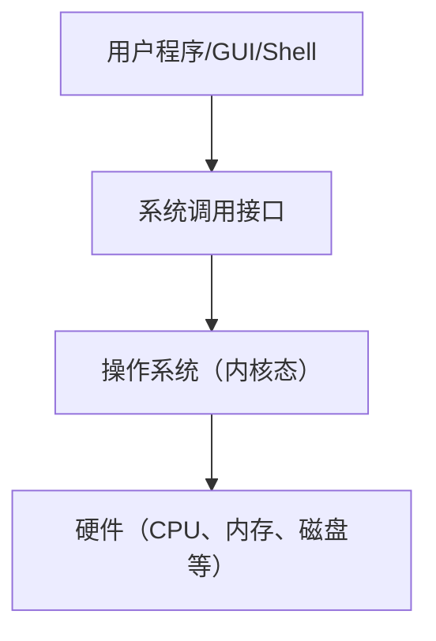

### 经典金句

> “操作系统扩展了计算机指令集并管理计算机的资源。”
> 
> “没有进程的抽象，现代操作系统将不复存在。”

---

## 第2章：计算机硬件简介

### 核心论点

- **问题**：操作系统必须了解硬件细节才能有效管理资源。
- **观点**：现代计算机由CPU、内存、I/O设备、总线等组成，通过存储层次（寄存器→缓存→主存→磁盘）平衡速度与成本。

### 关键概念

- **CPU**：包含程序计数器(PC)、堆栈指针(SP)、程序状态字(PSW)，支持多线程和多核。
- **存储层次**：寄存器 > L1/L2/L3缓存 > 主存(RAM) > 磁盘(SSD/HDD)。
- **内存映射I/O与端口I/O**：两种访问设备寄存器的方式。
- **中断**：设备完成操作后通知CPU的机制，分精确中断和不精确中断。
- **DMA**：直接内存访问，允许设备绕过CPU直接与内存传输数据。

### 逻辑推演

本章详细描述了CPU的指令执行周期、流水线与超标量技术、内核态与用户态的切换机制（通过系统调用和TRAP指令）。介绍了存储层次的设计动机：寄存器最快但容量小，磁盘慢但容量大，中间用缓存和主存缓冲。内存管理单元(MMU)支持虚拟内存。I/O部分讲解了设备控制器、驱动程序、三种I/O方式（忙等待、中断驱动、DMA）以及总线结构（PCIe、USB、SATA等）。最后简述了计算机启动过程（BIOS→引导扇区→加载操作系统）。

### 流程图

#### 存储层次结构

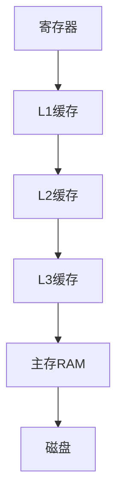

#### 中断处理流程

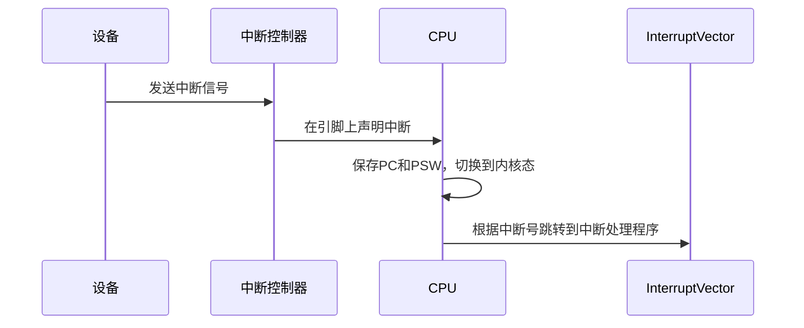

### 经典金句

> “任何复杂的东西都可以加一层代理来解决。”
> 
> “缓存是解决问题的一种好的方式。”

---

## 第3章：操作系统博物馆

### 核心论点

- **问题**：操作系统发展历史中有哪些不同类型的操作系统？
- **观点**：根据应用场景，操作系统分为大型机OS、服务器OS、多处理器OS、个人计算机OS、掌上计算机OS、嵌入式OS、传感器节点OS、实时OS、智能卡OS等。

### 关键概念

- **大型机操作系统**：高I/O容量，用于数据中心。
- **服务器操作系统**：如Solaris、FreeBSD、Linux、Windows Server。
- **实时操作系统**：硬实时和软实时，用于工业控制、多媒体。
- **嵌入式操作系统**：如Linux、QNX、VxWorks，运行在ROM中。
- **智能卡操作系统**：资源极度受限，常包含Java虚拟机。

> 本章主要为分类介绍，无复杂论证。

---

## 第4章：操作系统概念

### 核心论点

- **问题**：操作系统提供哪些核心抽象？
- **观点**：进程、地址空间、文件、保护、Shell是操作系统的核心概念，它们共同构成用户与系统的接口。

### 关键概念

- **进程**：运行中的程序实例，包含地址空间和资源集。进程表记录进程状态。
- **地址空间**：进程可寻址的内存地址集合，通过MMU映射到物理内存。
- **文件**：持久化存储的字节序列，通过文件系统管理。
- **保护**：使用9位rwx权限（UNIX）或ACL控制访问。
- **Shell**：命令解释器，不是操作系统的一部分，但展示系统调用用法。

### 逻辑推演

通过进程树示意图说明进程的创建与层次；通过文件系统目录树说明路径名和工作目录；通过UNIX的rwx位说明保护机制；最后以Shell为例展示如何通过fork、exec、waitpid、pipe等系统调用执行命令和重定向。

### 流程图

#### 进程树示意图

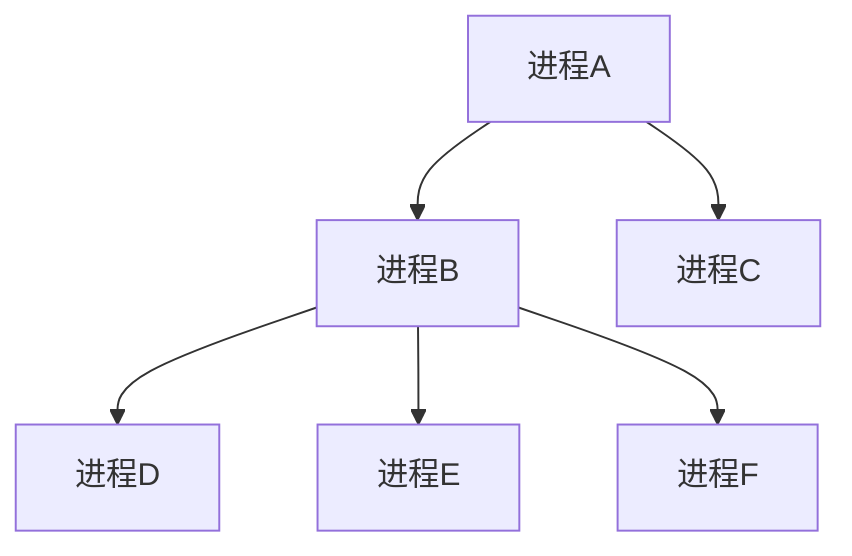

#### 文件系统目录树示例

```mermaid
graph TD
    Root[/] --> Faculty[Faculty]
    Root --> Students[Students]
    Faculty --> ProfBrown[Prof.Brown]
    ProfBrown --> Courses[Courses]
    Courses --> CS101[CS101]
```

---

## 第5章：系统调用

### 核心论点

- **问题**：用户程序如何请求内核服务？
- **观点**：系统调用是用户态进入内核态的唯一入口，通过TRAP指令实现，参数传递和返回值有固定规范。

### 关键概念

- **系统调用**：如read、write、fork、exec、exit、open、close等。
- **POSIX**：可移植操作系统接口标准。
- **Win32 API**：Windows的系统调用接口，与UNIX设计不同。
- **系统调用过程**：压栈→库函数→TRAP→内核检查编号→分派→返回。

### 逻辑推演

以read系统调用为例，详细描述了11个步骤：用户程序压入参数，调用C库，库函数将系统调用号放入寄存器，执行TRAP指令，CPU切换到内核态并跳转到固定地址，内核根据编号调用对应处理函数，执行完成后返回用户态。对比了UNIX和Windows在进程创建上的差异（fork+exec vs CreateProcess）。

### 流程图

#### 系统调用read的步骤

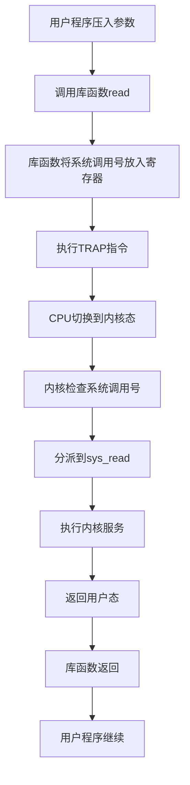

---

## 第6章：操作系统结构

### 核心论点

- **问题**：操作系统内部如何组织？
- **观点**：主要结构有单体系统（整个内核在一个大程序中）、分层系统（THE系统）、微内核（仅保留最小内核，服务在用户态）、客户-服务器模式。

### 关键概念

- **单体系统**：所有系统调用服务过程在一个二进制中，效率高但故障易崩溃。
- **分层系统**：THE系统的6层，每层只依赖下层。
- **微内核**：如MINIX 3，内核只提供IPC、基本调度，文件系统、驱动等在用户态，高可靠性。
- **客户-服务器模式**：客户端发送消息请求服务，服务器响应。

### 逻辑推演

从单体系统的三层模型（主程序、服务过程、实用程序）出发，指出其缺陷，引出分层设计。随后分析微内核的优势（错误隔离），并以MINIX 3为例说明用户态驱动和服务器、再生服务器等机制。最后将微内核思想推广到网络环境下的客户-服务器模式。

---

## 第7章：进程和线程

### 核心论点

- **问题**：进程和线程分别是什么？如何实现并发？
- **观点**：进程是资源容器，线程是CPU调度实体。线程共享进程地址空间，轻量且高效，但需同步机制。

### 关键概念

- **进程模型**：顺序进程，状态（运行、就绪、阻塞）。
- **进程创建**：系统初始化、fork、用户请求、批处理。
- **进程终止**：正常退出、错误、严重错误、被杀死。
- **进程层次**：UNIX进程树（init为根），Windows无层次。
- **线程模型**：共享地址空间、寄存器、栈等，有用户级、内核级、混合实现。
- **POSIX线程(pthread)**：pthread_create、join、yield等。
- **线程实现**：用户空间（快速但阻塞问题）、内核空间（慢但可靠）、混合（多路复用）。

### 逻辑推演

从多道程序的需求引出进程抽象，描述进程状态转换。对比UNIX和Windows的进程创建。然后提出线程概念：同一地址空间内多个控制流，解决服务器高并发问题。以Web服务器为例比较单线程、多线程和有限状态机三种方案。详细讨论用户级线程与内核级线程的优缺点，最后介绍pthread接口。

### 流程图

#### 进程状态转换图

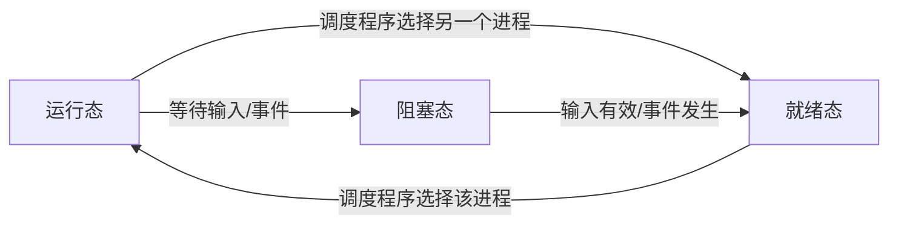

#### 用户级线程 vs 内核级线程

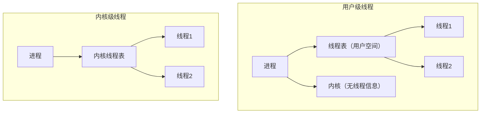

---

## 第8章：进程间通信（IPC）

### 核心论点

- **问题**：进程/线程如何安全地交换数据？
- **观点**：需要同步机制防止竞态条件，常用方法有临界区、信号量、互斥量、管程、消息传递、屏障等。

### 关键概念

- **竞态条件**：多个进程同时读写共享数据导致结果不确定。
- **临界区**：访问共享资源的代码段，需互斥进入。
- **忙等互斥方案**：屏蔽中断、锁变量、严格轮询、Peterson算法、TSL/XCHG指令。
- **睡眠与唤醒**：解决忙等浪费CPU的问题，但有唤醒丢失风险。
- **信号量**：整型变量，down和up操作原子化，解决生产者-消费者问题。
- **互斥量**：简化的二进制信号量，可用于用户态线程。
- **管程**：高级同步原语，由编译器保证互斥，配合条件变量wait/signal。
- **消息传递**：send和receive原语，适用于分布式系统。
- **屏障**：同步一组进程，全部到达后才能继续。
- **RCU**：读-复制-更新，免锁并发读。

### 逻辑推演

从打印机后台目录的并发错误引出竞态条件。分析多种互斥方案：屏蔽中断（只适合内核）、锁变量（仍会竞态）、严格轮询（浪费CPU且违反条件）、Peterson算法（正确但有忙等）、TSL/XCHG（硬件支持，仍忙等）。为解决忙等引入sleep/wakeup，但生产者-消费者例子中出现唤醒丢失。信号量通过累加唤醒次数解决丢失问题，给出生产者-消费者信号量解法。互斥量用于用户线程，结合thread_yield避免忙等。管程（如Java synchronized + wait/notify）提供更安全的抽象。消息传递用于分布式，需处理命名、丢失、重复等问题。最后介绍屏障和RCU。

### 流程图

#### 生产者-消费者问题（信号量解法）

```mermaid
graph TD
    Producer[生产者] -->|down(&empty)| Empty[空槽位减1]
    Empty -->|down(&mutex)| Mutex1[加锁]
    Mutex1 --> Insert[放入数据]
    Insert -->|up(&mutex)| Unlock1[解锁]
    Unlock1 -->|up(&full)| Full[满槽位加1]
    Consumer[消费者] -->|down(&full)| Full2[满槽位减1]
    Full2 -->|down(&mutex)| Mutex2[加锁]
    Mutex2 --> Remove[取出数据]
    Remove -->|up(&mutex)| Unlock2[解锁]
    Unlock2 -->|up(&empty)| Empty2[空槽位加1]
```

---

## 第9章：调度

### 核心论点

- **问题**：当多个进程/线程就绪时，CPU应该先运行哪个？
- **观点**：调度算法需根据系统类型（批处理、交互式、实时）权衡吞吐量、周转时间、响应时间、公平性等目标。

### 关键概念

- **进程行为**：CPU密集型 vs I/O密集型。
- **调度时机**：进程创建、退出、阻塞、I/O中断、时钟中断。
- **非抢占 vs 抢占**：进程主动放弃 vs 时间片用完强制切换。
- **批处理调度**：FCFS、SJF、SRTN。
- **交互式调度**：轮询(RR)、优先级调度、多级队列、最短进程优先(SPN)、保证调度、彩票调度、公平分享调度。
- **实时调度**：速率单调调度(RMS)、最早截止时间优先(EDF)，需满足可调度性条件∑(Ci/Pi) ≤ 1。
- **调度机制与策略分离**：内核提供机制，用户进程决定策略。
- **线程调度**：用户级线程由线程库调度，内核级线程由内核调度。

### 逻辑推演

首先定义调度问题的边界（何时调度、抢占性）。然后针对三类系统分别介绍算法：批处理中FCFS简单但效率低，SJF最优但需预知运行时间，SRTN是抢占版。交互式系统中RR通过时间片实现公平，优先级调度可动态调整，多级队列（如CTSS）结合轮转与优先级，彩票调度用随机抽奖实现资源份额，公平分享按用户分配CPU。实时系统需保证截止时间，周期性任务可调度性条件。最后强调用户级线程调度无需内核介入，而内核级线程切换开销大但能利用多核。

### 流程图

#### 轮询调度（RR）过程

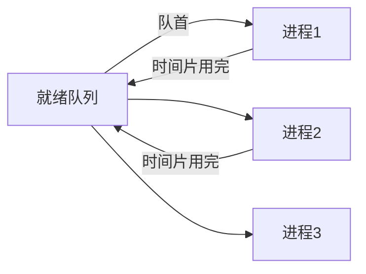

---

## 第10章：内存管理

### 核心论点

- **问题**：如何管理有限的物理内存，支持多程序并发？
- **观点**：从无存储器抽象到地址空间、交换、虚拟内存（分页、分段），一步步提高内存利用率和隔离性。

### 关键概念

- **无存储器抽象**：程序直接操作物理内存，只能单道运行。
- **地址空间**：进程独立的虚拟地址范围，通过基址寄存器+界限寄存器实现动态重定位。
- **交换**：将整个进程换入换出内存，产生空闲区碎片，需紧缩。
- **空闲内存管理**：位图法、链表法（首次适配、下次适配、最佳适配、最差适配、快速适配）。
- **虚拟内存**：允许程序部分加载，以页为单位，缺页时从磁盘调入。
- **分页**：MMU将虚拟页映射到物理页框，页表加速（TLB）。
- **多级页表**：节省内存，支持大地址空间。
- **倒排页表**：以物理页框为索引，适合64位。
- **页面置换算法**：最优、NRU、FIFO、第二次机会、时钟、LRU、老化、工作集、WSClock。

### 逻辑推演

从早期单道程序引出问题：多道运行时需要隔离和重定位。基址+界限寄存器实现简单重定位但仍有外部碎片。交换技术引入空闲区管理（位图/链表）。进一步，虚拟内存通过分页解决大程序运行和碎片问题：页表映射虚拟页到物理页框，缺页时从磁盘调入。TLB加速地址转换。多级页表和倒排页表解决大页表问题。最后讨论页面置换算法：最优不可实现，NRU/FIFO简单但效果差，第二次机会/时钟改进，LRU理想但难实现，老化近似LRU，工作集算法基于局部性，WSClock是实用组合。

### 流程图

#### 虚拟地址到物理地址转换

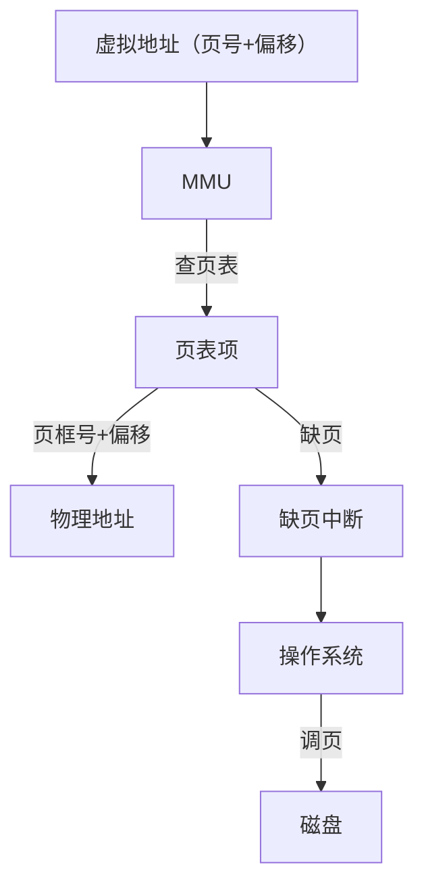

#### 时钟页面置换算法

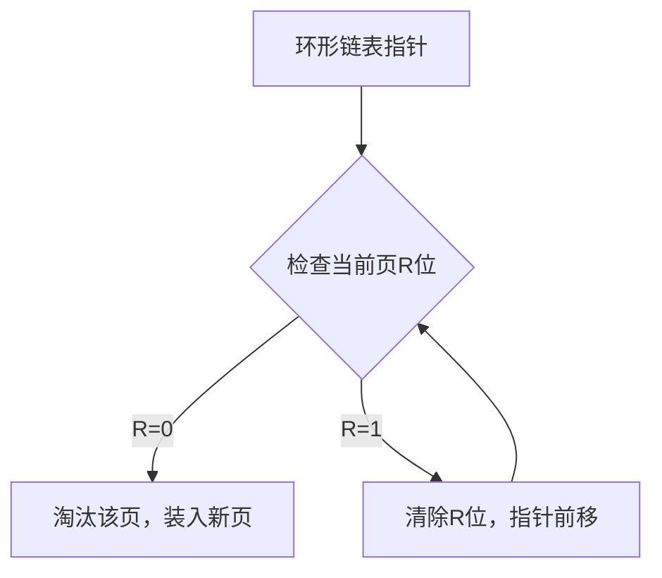

---

## 第11章：文件系统

### 核心论点

- **问题**：如何持久存储并组织大量数据？
- **观点**：文件系统提供文件和目录的抽象，通过inode、目录项、空闲空间管理等数据结构实现，并支持日志、缓存、备份等优化。

### 关键概念

- **文件命名**：扩展名（UNIX约定，Windows强制关联）。
- **文件结构**：字节流、记录序列、树形记录。
- **文件类型**：常规文件、目录、特殊文件（块/字符设备）。
- **文件访问**：顺序访问、随机访问（seek）。
- **目录**：一级目录、层次目录、路径名（绝对/相对）。
- **文件系统布局**：引导块、超级块、空闲空间位图/inode区、数据区。
- **文件实现**：连续分配（简单但有碎片）、链表分配（FAT表）、索引分配（inode，支持直接/间接块）。
- **目录实现**：固定大小目录项或可变长度文件名，使用哈希表加速。
- **共享文件**：硬链接（inode引用计数）和软链接（符号链接）。
- **日志结构文件系统(LFS)**：将所有写入追加到日志，定期清理。
- **日志文件系统**：先写日志再提交，崩溃后恢复。
- **虚拟文件系统(VFS)**：统一接口支持多种文件系统。
- **磁盘配额**：限制用户文件数量与块数。
- **备份**：物理转储与逻辑转储。
- **一致性**：fsck检查块和文件的一致性。
- **性能优化**：块高速缓存、提前读、磁盘臂移动优化、簇、柱面组、碎片整理。

### 逻辑推演

从持久化需求出发，定义文件系统需解决命名、结构、保护、访问等问题。介绍文件命名、扩展名、文件结构（UNIX采用字节流）。目录层次帮助组织文件，路径名定位。文件系统布局：超级块、空闲空间（位图/链表）、inode区、数据区。文件实现对比连续、链表、索引（inode）三种方式，inode通过直接和间接块支持大文件。目录实现：固定/可变长度项，哈希优化。共享文件通过链接实现，硬链接和软链接各有优劣。日志结构文件系统（LFS）和日志文件系统（ext3/NTFS）提高可靠性。VFS层抽象具体文件系统。磁盘配额、备份（转储）、一致性检查（fsck）是管理手段。最后讨论性能优化：缓存、提前读、磁盘布局、碎片整理。

### 流程图

#### 文件系统布局


#### inode结构（直接+间接块）

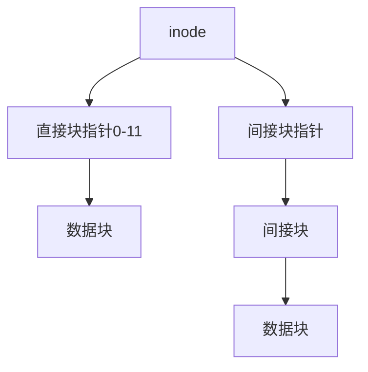

---

## 第12章：I/O设备

### 核心论点

- **问题**：操作系统如何统一管理种类繁多的I/O设备？
- **观点**：通过设备驱动程序、中断处理、DMA、缓冲等技术，提供块设备与字符设备的抽象，并实现设备独立性。

### 关键概念

- **块设备**：如磁盘，以块为单位寻址，支持随机访问。
- **字符设备**：如键盘、打印机，以字符流为单位，不可寻址。
- **设备控制器**：电子部件，负责与CPU通信，控制设备。
- **内存映射I/O与端口I/O**：两种访问设备寄存器的方式。
- **中断**：异步通知，分精确和不精确中断。
- **DMA**：直接内存访问，减轻CPU负担。
- **I/O软件层次**：中断处理程序、设备驱动程序、设备无关OS软件、用户空间I/O。
- **缓冲**：解决CPU与设备速度不匹配问题，如双缓冲、循环缓冲。
- **假脱机(spooling)**：如打印机守护进程，避免死锁。
- **磁盘**：盘片、磁头、磁道、扇区、柱面，RAID级别，磁盘臂调度算法（FCFS、SSF、电梯算法）。
- **稳定存储器**：使用多副本和ECC实现高可靠性。
- **时钟**：硬件时钟与软定时器。

### 逻辑推演

从I/O设备分类（块/字符）入手，说明设备控制器的作用。比较内存映射I/O和端口I/O。介绍三种I/O方式：程序控制（忙等待）、中断驱动、DMA。中断过程从硬件到软件逐层处理。驱动程序作为内核模块，需适配具体设备。设备无关I/O软件实现统一命名、错误处理、缓冲等。用户空间I/O库提供标准接口。磁盘部分重点讨论构造、格式化、RAID、调度算法（FCFS、SSF、电梯）。最后介绍时钟硬件和软定时器实现。

### 流程图

#### DMA工作流程

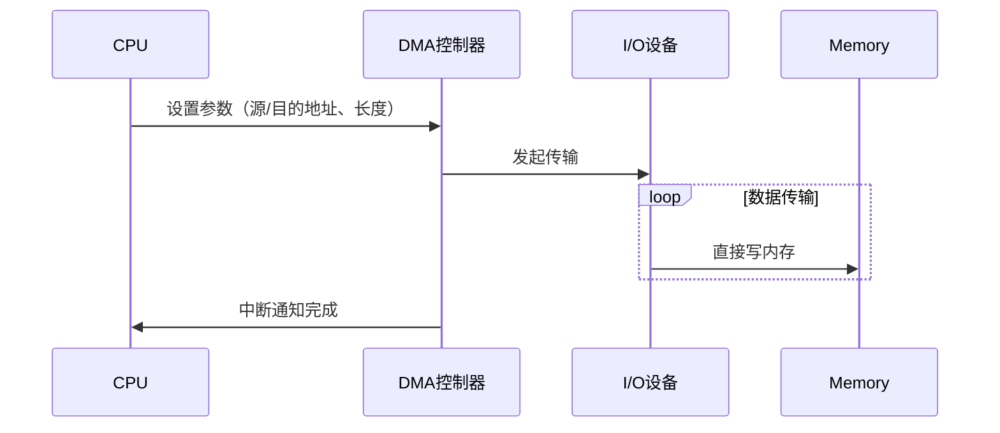

#### 电梯调度算法（SCAN）


---

## 第13章：死锁

### 核心论点

- **问题**：多个进程因互相等待资源而无限阻塞，如何处理？
- **观点**：死锁发生的四个必要条件（互斥、持有并等待、不可抢占、循环等待）。处理策略：鸵鸟算法、检测与恢复、死锁避免（银行家算法）、死锁预防。

### 关键概念

- **资源**：可抢占（CPU）与不可抢占（锁、文件）。
- **死锁模型**：资源分配图。
- **鸵鸟算法**：忽略死锁，简单但风险高。
- **检测与恢复**：每种类型一个/多个资源的检测算法，通过回滚、杀死进程恢复。
- **死锁避免**：银行家算法，检查分配是否安全。
- **死锁预防**：破坏四个条件之一（如所有资源一次申请、按序申请）。
- **其他问题**：两阶段加锁（数据库）、通信死锁、活锁、饥饿。

### 逻辑推演

从资源获取的基本流程（请求→使用→释放）出发，定义死锁。给出四个必要条件，并通过资源分配图判断死锁。然后分类介绍处理策略：鸵鸟算法（简单）、检测与恢复（周期性运行检测算法，找到后回滚或杀进程）、避免（银行家算法，需要预知最大需求）、预防（破坏互斥、持有等待、不可抢占、循环等待）。最后讨论两阶段加锁、活锁和饥饿的区别。

### 流程图

#### 死锁检测（资源分配图）

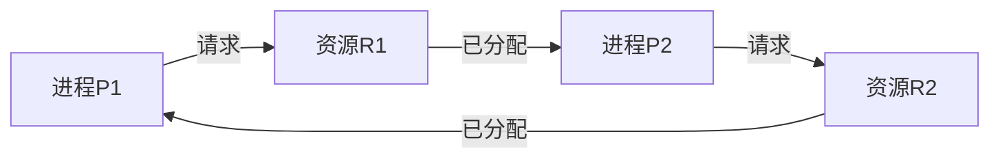

---

## 第14章：操作系统面试题与名词解释

本章汇总了常见面试问题和术语定义，如“什么是操作系统”、“什么是内核”、“什么是实时系统”、“什么是虚拟内存”、“进程与线程的区别”、“调度算法”、“页面置换算法”、“RAID级别”、“DMA”等。可作为复习清单。

> 说明：原书中此部分以问题列表和名词列表形式呈现，未展开详细答案。本总结不再重复罗列，可参考前文各章节概念。

---

# 附录：《MIT6.828操作系统课程》xv6教材结构化总结

> 说明：以下内容基于第二份PDF《MIT6.828操作系统课程book-rev11.pdf》整理。该书是对xv6教学操作系统的详细注释。

## 书籍信息

- **书名**：xv6: a simple, Unix-like teaching operating system
- **作者**：Russ Cox, Frans Kaashoek, Robert Morris
- **版本**：draft (2018)
- **PDF状态**：清晰文本，完整可读。

## 全书核心主题

xv6是一个用于教学的操作系统，模仿早期UNIX v6，运行于x86多处理器平台。本书通过逐行分析xv6源代码，讲解操作系统的核心机制：系统调用接口、进程管理、内存管理（页表）、陷阱与中断处理、锁机制、调度、文件系统（日志、inode、目录、缓冲）等。旨在帮助读者理解实际操作系统的工作原理。

## 目录与章节总结（缩写）

由于本书已有清晰目录，以下仅提取各章核心要点。

### 第0章：操作系统接口

- **系统调用**：fork, exec, exit, wait, open, read, write, close, dup, pipe, chdir等。
- **进程与内存**：fork创建子进程，exec加载新程序，sbrk扩展内存。
- **I/O与文件描述符**：0/1/2为标准输入/输出/错误，重定向通过close+open实现。
- **管道**：提供进程间通信，比临时文件高效。
- **文件系统**：路径名，目录，inode，链接（link/unlink），设备文件。

### 第1章：操作系统组织

- **抽象物理资源**：用户态/内核态，系统调用是边界。
- **内核组织**：宏内核（xv6） vs 微内核。
- **进程概述**：进程状态（UNUSED, EMBRYO, RUNNING, RUNNABLE, SLEEPING, ZOMBIE），内核栈，页表。
- **第一个地址空间**：entrypgdir映射KERNBASE以上到物理地址0。
- **第一个进程创建**：userinit, allocproc, 初始化内核栈和陷阱帧，运行initcode.S。
- **第一个系统调用**：exec，加载/init，启动shell。

### 第2章：页表

- **分页硬件**：x86二级页表，PTE标志（P, W, U）。
- **进程地址空间**：用户地址0~KERNBASE，内核地址>KERNBASE。
- **创建地址空间**：setupkvm, mappages, walkpgdir。
- **物理内存分配器**：kalloc/kfree，空闲链表。
- **sbrk**：growproc调用allocuvm/deallocuvm。
- **exec**：加载ELF，分配栈，参数复制，处理页错误。

### 第3章：陷阱、中断与驱动

- **三种陷阱**：系统调用（int）、异常、设备中断。
- **x86保护机制**：IDT，DPL，特权级切换。
- **陷阱处理程序**：vectors（Perl生成），alltraps保存寄存器，trap分发。
- **系统调用**：syscall根据eax调用sys_*，参数提取（argint/argptr/argstr）。
- **中断**：IOAPIC/LAPIC，时钟中断，磁盘中断。
- **IDE驱动**：ideinit, iderw, idestart, ideintr，使用队列和睡眠唤醒。

### 第4章：锁

- **竞态条件**：并发插入链表导致丢失更新。
- **自旋锁**：acquire/release，使用xchg原子操作，内存屏障。
- **锁顺序**：避免死锁，如ptable.lock与idelock。
- **中断与锁**：自旋锁必须关闭中断（pushcli/popcli）。
- **睡眠锁**：允许长时间持有并让出CPU，用于文件系统。
- **锁的局限性**：不能解决等待事件问题，需sleep/wakeup。

### 第5章：调度

- **上下文切换**：swtch保存/恢复寄存器，切换内核栈。
- **调度循环**：scheduler寻找RUNNABLE进程，调用swtch。
- **mycpu/myproc**：获取当前CPU和进程，需禁用中断。
- **sleep/wakeup**：避免丢失唤醒，需传递锁，循环检查条件。
- **管道实现**：pipewrite/piperead使用睡眠锁和条件循环。
- **wait/exit/kill**：进程终止为ZOMBIE，父进程wait清理。kill设置p->killed，由trap检查退出。

### 第6章：文件系统

- **分层**：磁盘层、缓冲区缓存、日志层、inode层、目录层、路径名层、文件描述符层。
- **缓冲区缓存**：bread/bwrite，LRU回收，睡眠锁。
- **日志层**：begin_op/log_write/end_op，提交后恢复，组提交。
- **块分配器**：balloc/bfree，位图。
- **inode层**：dinode（磁盘）和inode（内存），iget/ilock/iunlock/iput。
- **目录层**：dirlookup/dirlink。
- **路径名**：namex递归查找。
- **文件描述符层**：filealloc/filedup/fileclose，fileread/filewrite。
- **系统调用实现**：sys_link, sys_open, sys_pipe等。

### 第7章：总结

- 通过xv6代码学习操作系统核心思想，系统调用接口的成功，抽象与隔离的重要性。

### 附录A：PC硬件

- CPU、内存、I/O端口、内存映射I/O、中断控制器等基本知识。

### 附录B：引导加载程序

- BIOS加载引导扇区，实模式切换到保护模式，加载ELF内核到0x100000，跳转到entry。

---

> 注：本书未包含明确的Prompt模板，故不生成Prompt汇总部分。以上为xv6教材的结构化摘要。