# 《数据中台实战：手把手教你搭建数据中台》章节总结

## 书籍信息
- **书名**：数据中台实战：手把手教你搭建数据中台
- **作者**：董超华
- **出版信息**：电子工业出版社，2020年10月，ISBN:9787121393860
- **PDF状态**：扫描件/OCR识别，部分页面存在识别不完整或错位
- **OCR状态**：整体可读，部分表格、代码块需人工整理

## 目录说明
- 目录识别情况：基于PDF正文章节标题，识别出完整的11章及下属小节，与正文内容基本对应。
- 章节对应依据：正文页码（第12页起）与目录逻辑一致。
- OCR修复说明：部分表格、代码段、图表说明存在字符错乱或缺失，已基于上下文语义进行合理恢复；无法确定的内容已标注“说明：该部分PDF识别不完整”。

## 全书核心主题
本书系统讲解数据中台从0到1的搭建过程。作者基于自身在富力集团等企业的实战经验，提出数据中台的核心工作为“采集、存储、打通、使用”四个环节。全书围绕这四个环节展开：首先介绍数据中台的基本概念、人员构成与开发流程；然后分别讲解数据采集（用户行为数据与业务数据）、数据存储与计算（指标定义、分层建模、数据计算）；接着重点阐述数据打通（标签平台、用户画像）；之后从用户分析、商品分析、流量分析、交易分析四个维度展示数据中台的数据应用；最后深入介绍自助分析平台、自动化营销平台和推荐平台三个高阶数据智能应用。本书强调数据中台的最终目标是实现企业“数据智能”，即由机器代替人工决策，提升效率与收入。

---

## 第1章：数据中台入门攻略

### 核心论点
本章解决“什么是数据中台、为什么要搭建数据中台、什么企业适合搭建”等问题。作者认为：中台分为业务中台（能力复用）和数据中台（数据资产化与智能应用），其最终目标是帮助企业实现数据智能。

### 关键概念/事件
- **中台**：源于Supercell游戏公司，将通用能力沉淀为可复用平台。
- **业务中台**：中心化的能力复用平台，例如用户中心、商品中心、交易中心、支付中心、营销中心；目标是“一切业务数据化”。
- **数据中台**：承担公司所有产品线的数据分析工作，包括采集、存储、打通、使用；目标是“一切数据业务化”。
- **数据智能**：由机器代替人工决策的标志，数据中台是达成数据智能的手段。
- **适合搭建中台的企业**：至少有三条以上产品线，且各产品线之间有可复用的功能；初创公司不适合。

### 逻辑推演 / 叙事脉络
作者先从Supercell案例引出中台概念，区分业务中台与数据中台的关系。接着以自身公司（服装批发产业互联网）为例，展示三条产品线（打版、电商、快递物流）如何通过双中台打通上下游。然后剖析数据中台的人员构成（10种角色）、开发流程（11个步骤）以及内外合作机制。最后强调中台建设是“一把手工程”，需跨部门强力协作。

### 流程图

#### 图1-1 经典中台架构（重建）
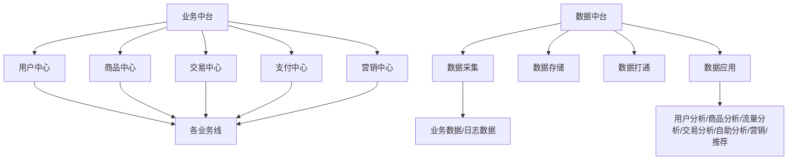

#### 图1-2 公司中台架构（原图文字描述）
三条产品线（打版服务、电商服务、快递/物流服务）共同依赖底层的业务中台和数据中台。

#### 图1-3 业务中台架构（重建）
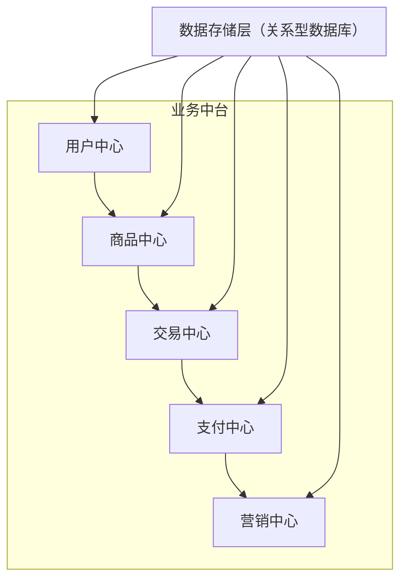

#### 图1-4 数据中台架构（重建）
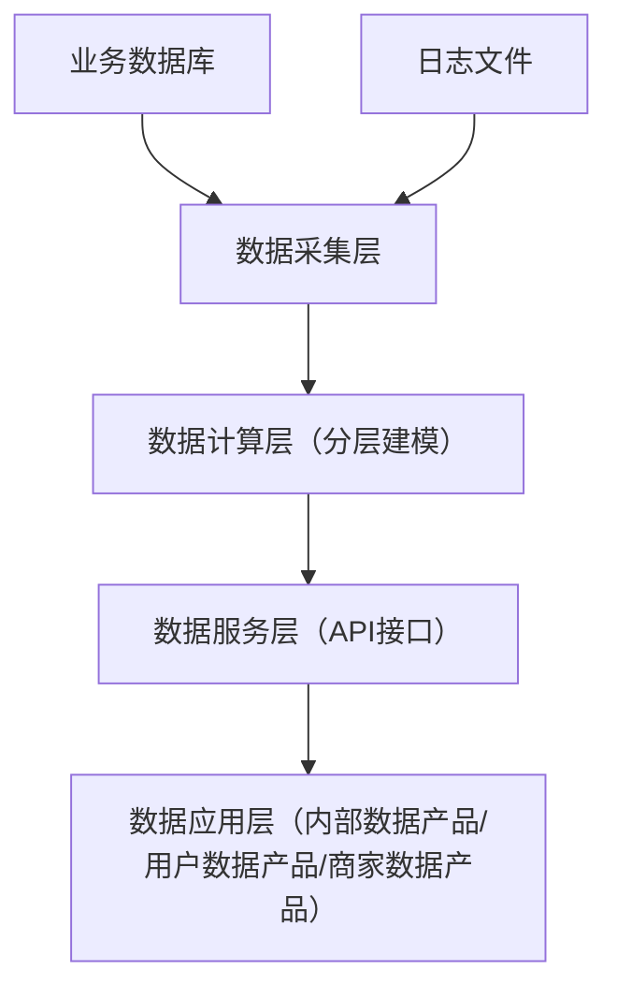

#### 图1-5 数据中台组织架构（文字描述）
公司高层 → 中台负责人（总监）→ 业务中台负责人 & 数据中台负责人 → 各执行角色。

#### 图1-6 数据中台人员构成（列表）
架构师、项目经理、模型设计师、数据开发工程师、后端开发工程师、前端开发工程师、UI设计师、测试工程师、产品经理等10种角色。

#### 图1-7 数据中台开发流程
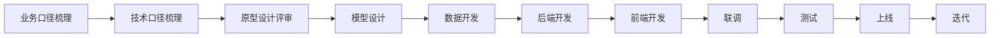

#### 图1-8 数据中台与其他部门的依赖关系
运营人员/产品经理提出需求 → 数据中台产品经理 → 模型设计师/数据开发工程师 → 数据应用支持。

### 经典金句/数据
> “数据中台的最终目标就是帮助企业实现数据智能。” (p.14)
> “业务中台的目的是让一切业务数据化；数据中台的目的是让一切数据业务化。” (p.14)
> 一个指标的开发需要经历11个步骤，涉及多个角色。 (p.23-26)

---

## 第2章：数据采集

### 核心论点
本章解决“数据中台需要采集哪些数据、如何采集”的问题。作者认为：数据是数据中台的燃料，采集用户行为数据和业务数据是搭建数据中台的基础，并对比了三种用户行为数据采集方式的优劣。

### 关键概念/事件
- **用户行为数据**：浏览数据、点击数据，通过异步传输到采集服务器；用于挖掘用户兴趣。
- **业务数据**：存储在业务数据库或业务中台，如订单、加购、收藏等。
- **三种采集方式**：
  1. 与第三方移动应用统计合作（如百度移动统计）：开发量小，但无法获取业务数据，数据难同步到中台。
  2. 前后端埋点结合：可打通行为数据和业务数据，但工作量大，依赖多角色。
  3. 可视化埋点+后端埋点：降低普通页面/按钮的埋点成本，重要页面仍需代码埋点。
- **后端埋点**：解决加购到下单之间的来源追溯问题，将来源信息存入订单。

### 逻辑推演 / 叙事脉络
先分类数据，然后逐一分析三种采集方式的优缺点。重点讲解前后端埋点结合的方式：定义公共字段、页面浏览事件、点击事件、后端埋点JSON格式。最后给出数据采集的典型技术流程（Ngnix→Flume→Kafka→数据中台），并以商品详情页埋点为例展示实战。

### 流程图

#### 图2-5 用户行为数据采集流程（重建）
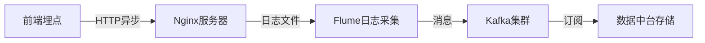

#### 图2-6 业务数据采集流程（重建）
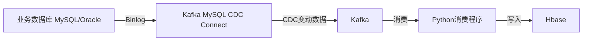

### 经典金句/数据
> “数据是数据中台的燃料。” (p.32)
> 前端埋点会有5%左右的数据丢失率。 (p.186)
> 埋点接口文档需要定义公共字段、页面事件、点击事件、特殊参数。

---

## 第3章：数据存储与计算

### 核心论点
本章解决“如何标准化存储和计算数据，使其成为数据资产”的问题。作者提出：通过统一的指标定义规范和分层建模体系，可以打造高效、无歧义的数据指标体系，避免数据资源浪费。

### 关键概念/事件
- **数据资产**：有价值、可被组织利用的数据，例如用于推荐系统的用户行为、业务数据。
- **指标拆解方法**：业务板块→数据域→业务过程→原子指标/派生指标→时间周期→修饰词→维度→属性。
- **虚荣指标 vs 增长指标**：虚荣指标（PV、UV、总用户数）只能监控；增长指标（转化率、留存率）可指导行动促进交易额。
- **数据库 vs 数据仓库**：数据库存储业务数据，数据仓库存储汇总后的报表数据。
- **分层建模**：ODS层（操作数据层）、DIM层（维度层）、DWD层（明细数据层）、DWS层（汇总数据层）、ADS层（应用数据层）。分层带来灵活性和可扩展性。

### 逻辑推演 / 叙事脉络
先说明指标统一的重要性，然后给出指标拆解方法（原子指标+派生指标）。举例“最近三个月iOS端下单金额”的拆解过程。接着区分虚荣指标与增长指标。再解释数据库与数据仓库的区别，强调数据仓库分层建模的优势（应对口径变化和维度增加）。最后以电商主路径指标为例，详细设计ODS/DWD/DWS/ADS层的表结构。

### 流程图

#### 图3-4 分层建模体系（重建）
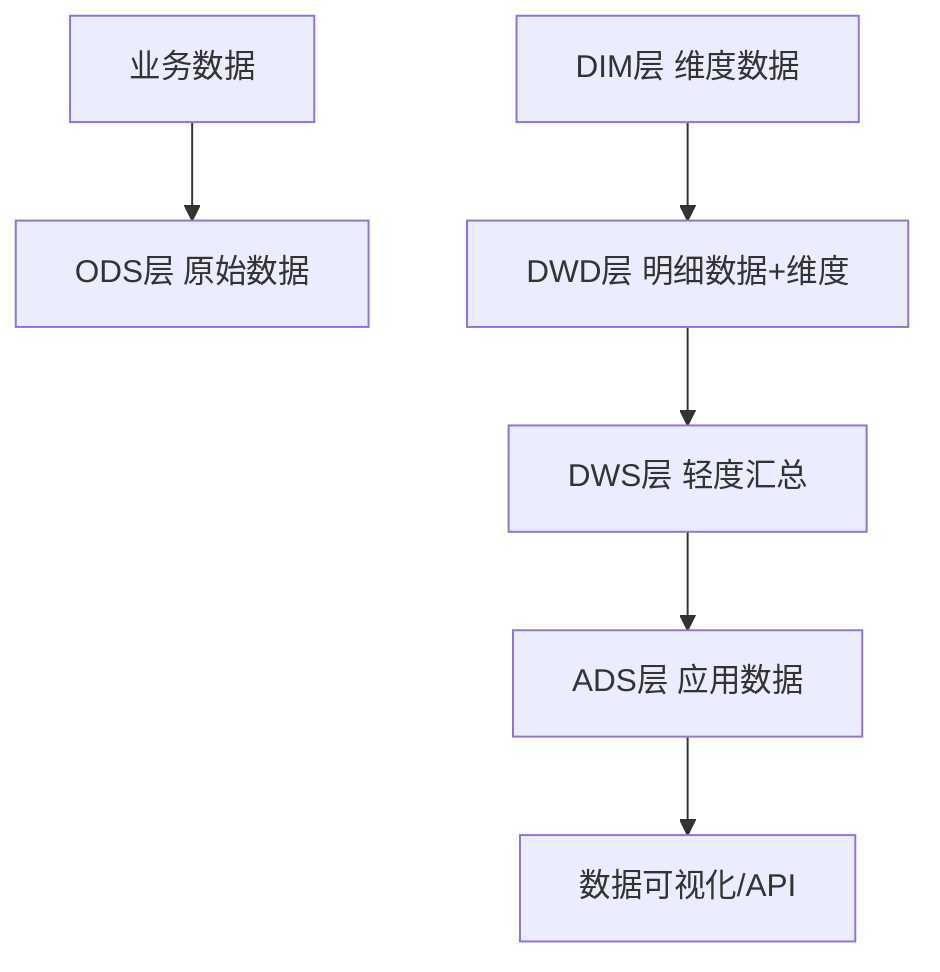

### 经典金句/数据
> “数据能成为数据资产就说明它一定是有价值的数据。” (p.56)
> “派生指标 = 原子指标 + 时间周期 + 修饰词。” (p.59)
> 分层建模后，指标口径变化只需修改DWS层，无需变动ADS层接口。 (p.65-66)

---

## 第4章：数据打通

### 核心论点
本章解决“如何通过标签平台打通用户行为数据、业务数据以及多条产品线之间的数据孤岛”的问题。作者认为：标签平台是用户画像和推荐系统的基础，通过数据宽表、标签体系、标签工厂、人群圈选等功能，可以释放数据的最大化价值。

### 关键概念/事件
- **标签平台的建设条件**：公司有一定用户规模和积累，有多条产品线、数据分散。
- **四大挑战及解法**：
  1. 自动化打标签 → 标签可配置化，按产品线独立建立标签。
  2. 不同角色（需求端/供应端）→ 抽象为“人”，统一角色标签体系。
  3. 用户标签 vs 商品标签 → 分别定义类型。
  4. 潜客 vs 注册会员 → 增加“是否潜客”标签，从CRM同步潜客状态。
- **数据宽表**：将用户/商品的所有指标汇总到一张表，包括基础信息、行为信息、业务信息。
- **标签体系**：多层结构（一级到四级），统一公司标准。
- **标签工厂**：通过选择平台、维度、标签层级，基于宽表字段和简单规则生成标签。
- **人群圈选**：基于客观标签、用户行为、主观标签三种方式组合，支持“且/或”运算。
- **用户画像**：个人用户画像（基础信息+关键指标+标签+访问路径+偏好）和群体用户画像（透视+对比分析+TGI指数）。

### 逻辑推演 / 叙事脉络
先说明标签平台的价值（实现千人千面），然后分析哪些公司适合建设。接着提出四条建设目标，给出技术方案：数据宽表 → 标签体系 → 标签工厂 → 人群圈选。详细展示标签体系的多级结构（基础信息、业务标签如RFM）。介绍标签工厂的生成步骤和人群圈选的三种方式及标签有效性管理方案。最后讲解个人和群体用户画像的具体内容。

### 流程图

#### 图4-2 标签平台功能搭建流程（重建）
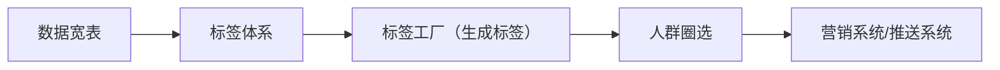

### 经典金句/数据
> “Amazon创始人Jeff Bezos：‘如果我有一百万个用户，我就会做一百万个不同的网站！’” (p.104)
> RFM模型将用户分为8类，资源应向重要价值用户倾斜。 (p.127)
> 标签平台的建设最少需要2~3个月，是研发成本较高的功能。 (p.104)

---

## 第5章：用户分析

### 核心论点
本章解决“如何通过数据指标监控和提升用户生命周期的各环节”的问题。作者基于AARRR模型（拉新、活跃、留存、转化、裂变）和用户生命周期（新用户→未激活→活跃→沉默→流失），给出用户运营的核心数据指标和分析方法。

### 关键概念/事件
- **AARRR模型**：获取（拉新）、激活（活跃）、留存、收入（转化）、推荐（裂变）。
- **拉新**：渠道注册码管理、注册量、注册转化率、拉新ROI模型。
- **活跃**：日活（区分新老用户）、主路径转化率（首页→商品列表→详情→加购→下单→支付）。
- **留存**：访问留存率、购买留存率；“40-20-10”法则（社交产品参考）。
- **转化**：首单人数、复购人数、首单率、复购率；RFM用户分群。
- **裂变**：K因子 = 邀请数量 × 转化率；用户传播链路图。
- **用户生命周期**：新用户（注册N天内未支付）、未激活（注册超N天未支付）、活跃（最近M天有支付）、沉默（最近M~Q天无支付）、流失（超Q天无支付）。

### 逻辑推演 / 叙事脉络
从AARRR模型出发，分别讲解每个环节的关键指标。拉新部分强调渠道注册码管理和转化率分析，并引入ROI判断渠道价值。活跃部分指出日活是虚荣指标，应关注主路径转化率。留存部分给出“40-20-10”法则和拆解维度。转化部分强调首单和复购的重要性及RFM应用。裂变部分说明产品价值是裂变的基础，K因子决定传播效果。最后构建用户生命周期模型，给出每个状态的定义及运营策略。

### 流程图

#### 图5-1 AARRR模型（重建）
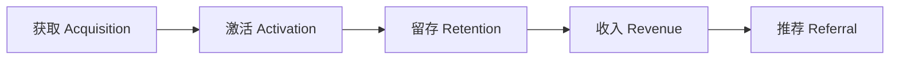

#### 图5-8 用户生命周期逻辑关系（重建）
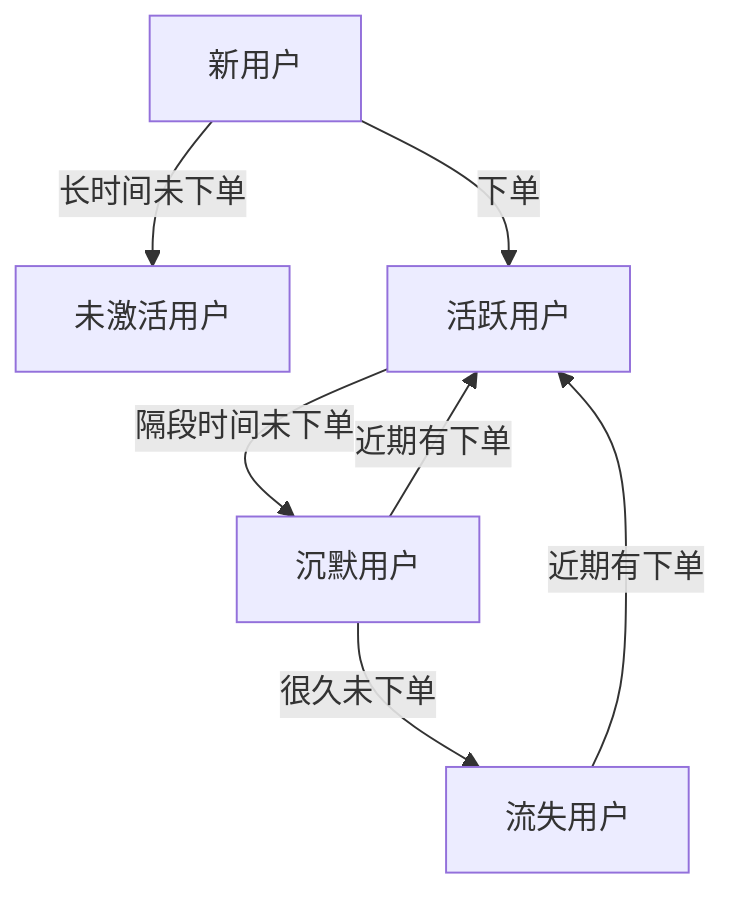

### 经典金句/数据
> “北极星指标：让新注册用户在第一周内购买首单并复购1~2次。” (p.141)
> “留存率‘40-20-10’法则：次日留存40%，7日20%，30日10%。” (p.139)
> 用户90天内复购率 >30% 则为忠诚者模式。 (p.141)

---

## 第6章：商品分析

### 核心论点
本章解决“如何通过商品分析保证提供给用户的都是好货”的问题。作者认为：对于电商产品，商品是核心价值，应从售前、售中、售后全生命周期进行数据化运营，重点包括供应商筛选、商品定位、数量规划、上架分析、销售分析、售后指标等。

### 关键概念/事件
- **商品生命周期**：售前（供应商选择、商品定位、数量规划、上架）→ 售中（销售分析、品类价格段、商品明细）→ 售后（次品率、48小时发货率、退货率）。
- **供应商分级动态管理系统**：A级战略、B级核心、C级优秀、D级合作；依据工厂数、员工数、档口数、设计师人数、月成交额、48小时发货率、次品率等评分。
- **商品定位 vs 市场定位**：市场定位选目标消费者，商品定位选满足需求的商品。
- **四类商品**：引流款、跑量款、四季常青款、高利润款。
- **K-Means聚类算法**：自动划分品类价格段，剔除异常值，周期性重新计算。
- **售后指标**：次品率（含缺货）、48小时发货率、退货率。

### 逻辑推演 / 叙事脉络
先指出商品是电商产品的核心价值，然后从售前、售中、售后三阶段展开。售前重点：供应商严格筛选（打分表）、商品定位、商品数量规划（根据活跃用户和浏览需求计算上架款数）、买手上架款数监控。售中重点：转化率判断商品潜力、品类价格段聚类、商品明细全方位数据。售后重点：次品率、48小时发货率、退货率，并反向优化供应商。

### 图表

#### 图6-5 不同类型商品（重建）
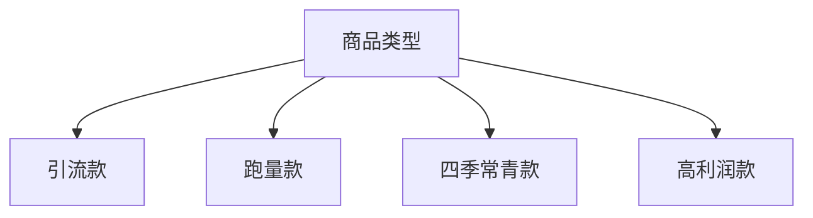

### 经典金句/数据
> “用户分析指标无法提高产品的价值，商品才是传递公司价值的核心。” (p.147)
> “动销率 = 有销售记录的商品款数 / 在售商品数。” (p.159)
> 通过K-Means聚类算法自动化划分品类价格段，避免人工划分。 (p.155-156)

---

## 第7章：流量分析

### 核心论点
本章解决“如何监测网页流量、用户路径、坑位效果”的问题。作者认为：流量分析的核心是网页分析（PV、UV、浏览时长、跳出率）、路径分析（桑基图、主路径转化率）和坑位分析（坑位PV、UV、交易额、转化率），这些功能通用且依赖埋点数据。

### 关键概念/事件
- **网页分析**：PV、UV、浏览时长、跳出率；推广页需关注转化率，商品详情页关注时长和跳出率。
- **路径分析**：基于会话（20分钟间隔）切割用户访问序列，通过桑基图展示主要路径和各步转化率。
- **坑位分析**：坑位需统一管理（可配置化），坑位ID埋点；坑位转化率 = 坑位下单人数 / 坑位访问人数；交易额需通过后端埋点（加购时携带坑位ID）。

### 逻辑推演 / 叙事脉络
先强调流量分析要解决三个问题：网页流量、用户路径、坑位效果。然后分别讲解网页分析需要管理网页名称、关注推广页和商品详情页的特殊指标；路径分析需要定义会话、绘制桑基图、预设主路径看板；坑位分析需要坑位管理系统、埋点携带坑位ID、后端埋点保证交易来源追溯。最后给出数据存储和明细数据示例。

### 流程图

#### 图7-2 访问路径桑基图（重建）
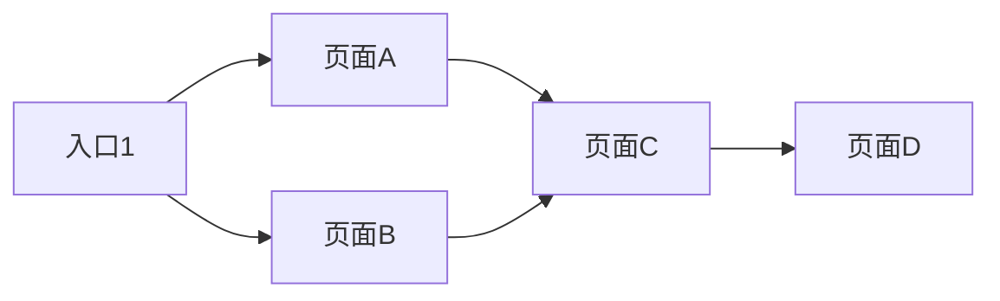

### 经典金句/数据
> “用户访问日志的数据量较大，一般保存近6个月的统计数据。” (p.170)
> “坑位转化率 = 坑位下单人数 / 坑位访问人数，是衡量坑位性价比的重要指标。” (p.172)
> 订单中需预留来源字段（JSON格式），记录坑位ID、搜索关键词、推荐算法ID等。 (p.187)

---

## 第8章：交易分析

### 核心论点
本章解决“如何为领导层和产品/运营人员设计交易分析看板”的问题。作者区分两类用户：领导层关注大盘（交易额、总用户数、收入、完成率），需实时、移动端、短信、大屏；产品/运营人员关注明细数据（渠道、来源、购物频次、间隔），需多维度筛选和导出。

### 关键概念/事件
- **领导层指标**：全年交易额/收入、每日交易额、总用户数、各产品线KPI完成率。采用实时计算（每5秒刷新）。
- **移动端设计**：小程序内嵌H5，展示总交易额、总用户数、总收入，以及部门绩效（基于人、货、场拆解）。
- **自动化短信推送**：每日推送前一天数据，可设置预警。
- **数据大屏**：实时数据、热力地图、热销排行、销售趋势。
- **产品/运营人员指标**：年度/月度目标完成率、组员绩效、渠道交易额、交易来源（客户端/坑位/搜索/分类）、购物频次分布、购物间隔（注册到首单、首单到复购）。
- **“魔法数字N”**：用户注册N天内下单效率最高，应在此窗口期促使用户完成2~3次购买。

### 逻辑推演 / 叙事脉络
先区分两类用户的不同需求。领导层部分：设计移动端看板（实时数据、绩效拆解）、短信推送（每日绩效、预警）、数据大屏（炫酷展示）。产品/运营人员部分：权限控制、总览（目标完成率）、渠道交易分析（通过供应商关联部门）、交易来源分析（通过订单来源字段区分客户端和坑位等）、购物频次分析（用户粘性）、购物间隔分析（找到魔法数字N）。

### 流程图

#### 图8-2 基于人、货、场的部门绩效拆分（重建）
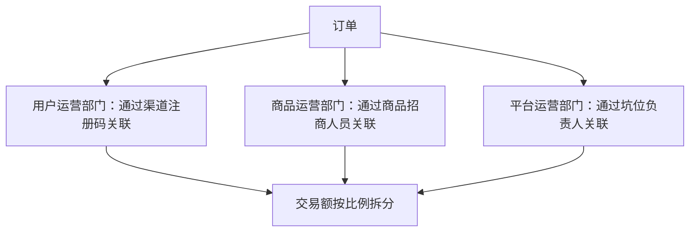

### 经典金句/数据
> “公司总用户数以手机号为唯一ID统计。” (p.175)
> “交易来源分析：订单中记录坑位ID、搜索关键词等，可实现精准归因。” (p.186-187)
> “用户注册当天下单效率最高；首单后1~30天内复购概率最大。” (p.190-191)

---

## 第9章：自助分析平台

### 核心论点
本章解决“如何用自助分析工具提升数据中台的开发效率，实现看板千人千面”的问题。作者认为：引入自助分析平台（如帆软、达芬奇、Superset）可以让数据中台专注于模型设计和数据开发，业务人员通过拖曳配置看板，减少前后端开发工作量。

### 关键概念/事件
- **自助分析平台的价值**：降低数据指标开发的人员成本，实现看板的“千人千面”。
- **三种产品对比**：
  - 帆软：商用，体验好，预算充足可采购。
  - 达芬奇：开源，折中方案，有看板制作器和看板管理器，适合集成。
  - Superset：开源，偏技术，适合数据分析师，灵活但难上手。
- **集成步骤**：部署 → 账号互通 → 数据源管理 → 数据表管理（SQL处理字段）→ 看板制作（拖曳维度/指标）→ 看板管理（菜单）→ 移动端适配。
- **权限管理**：数据表权限（字段级）、图表权限（分享）。

### 逻辑推演 / 叙事脉络
先指出传统开发模式的瓶颈（需求多、周期长）。然后提出自助分析平台的解决方案，对比三种主流产品。接着以达芬奇为例，详细讲解集成过程：部署、登录互通、数据源连接、SQL生成产品人员可理解的表、制作看板、移动端集成。最后给出一个PV/UV看板的实战案例。

### 流程图

#### 图9-17 达芬奇PC端“我的看板”功能集成到移动端（重建）
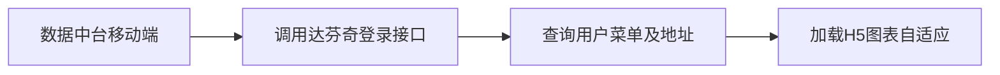

### 经典金句/数据
> “有了自助看板功能，无论数据中台接入多少条产品线，都不需逐一开发前端界面，节省大量开发资源。” (p.194)
> 帆软、达芬奇、Superset是市场成熟解决方案，达芬奇需二次开发以满足公司需求。 (p.202-203)

---

## 第10章：自动化营销平台

### 核心论点
本章解决“如何搭建全渠道、自动化的营销平台，支撑高频次营销活动”的问题。作者提出：将营销活动抽象为“活动策划→圈人→做活动→看效果”四个步骤，其中圈人由数据中台标签平台负责，做活动由业务中台营销中心和消息中心负责，看效果由数据中台分析负责，实现营销自动化闭环。

### 关键概念/事件
- **通用活动流程**：活动策划（目的、玩法）→ 圈人（目标用户）→ 做活动（内容、渠道）→ 看效果（实时监控、复盘）。
- **双中台协作**：业务中台提供优惠券管理、消息中心（短信、App推送）；数据中台提供标签圈选和效果分析。
- **常规营销内容**：优惠券（满减/直减）、H5小游戏（接入第三方）、H5营销页面（拖曳配置）。
- **触达方式**：短信（自定义内容/模板推送）、App推送（站内/站外）。
- **效果分析**：活动中（触达人数、访问人数、参与人数、分享人数）；活动后（新增用户数、活动交易额、漏斗转化）。
- **实战案例**：高复购意向用户发优惠券（圈选规则R>7天且最近访问<3天）；周期性短信触达未首单用户（按注册天数1/3/7/15/30/60/90天不同文案）。

### 逻辑推演 / 叙事脉络
先说明传统营销活动耗时久，引出自动化营销平台的价值。将活动抽象为四步，明确双中台各自职责。然后介绍平台主体功能界面（活动、任务）。接着详细讲解三种营销内容制作：优惠券（对接营销中心）、H5小游戏（对接第三方，需处理登录和发券）、H5页面（拖曳制作）。再讲人群圈选对接标签平台、触达任务（短信模板、App推送配置）。最后给出两个实战案例，强调自动化运行和机器决策。

### 流程图

#### 图10-1 活动的通用流程（重建）
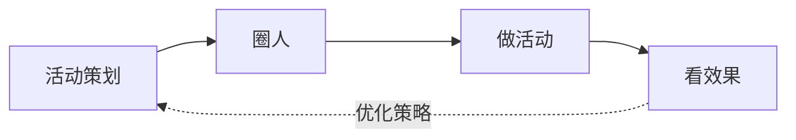

#### 图10-2 自动化营销平台功能划分（重建）
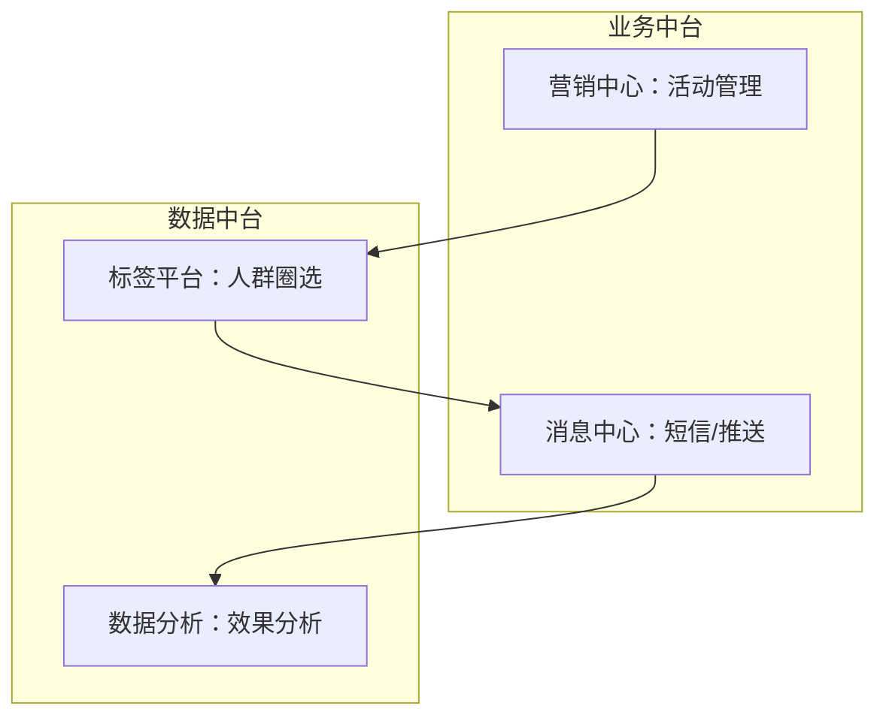

### 经典金句/数据
> “自动化营销平台的最终目的是帮助企业实现营销活动的数据智能，减少人工决策。” (p.236)
> “数据智能的标志是由机器代替人工去决策。” (p.14)
> 短信推送需提前审核模板，自定义内容短信每次审核；模板推送只需审核一次。 (p.227-228)

---

## 第11章：推荐平台

### 核心论点
本章解决“如何从0到1搭建推荐系统，实现人货匹配”的问题。作者认为：推荐系统通过用户数据（隐性行为数据+显性业务数据）计算用户感兴趣的商品，核心架构包括召回、过滤、排序，并给出了离线推荐和实时推荐的实施路径。

### 关键概念/事件
- **推荐系统价值**：解决电商平台海量用户和商品的人货匹配问题，提升转化率。
- **隐性数据 vs 显性数据**：隐性=埋点行为（浏览、点击）；显性=业务数据（下单、加购、收藏）及用户属性。
- **推荐系统功能架构**：召回（多种召回引擎）→ 过滤（去重、去低质）→ 排序（统一打分）。
- **召回算法**：基于用户的协同过滤（找相似用户喜欢的物品）、基于物品的协同过滤（找相似物品）、基于内容的推荐（物品属性/分词）。
- **排序算法**：GBDT+LR（梯度提升决策树+逻辑回归），自动组合特征，预测点击率。
- **冷启动**：用户冷启动（利用注册信息、让用户选择偏好、推荐热门商品）；物品冷启动（利用内容信息、分词标签）。
- **评测指标**：商业指标（曝光次数、点击率、支付转化率）；算法指标（准确率、召回率、覆盖率）。
- **离线推荐系统**：采用基于物品的协同过滤+基于商品分词+热度保底，排序用GBDT+LR，每天计算两次（匹配商品上架时间）。
- **实时推荐系统**：基于用户近几次行为（加权得分），通过品类/价格段/店铺优先级实时召回，与离线推荐结果交叉显示。

### 逻辑推演 / 叙事脉络
先定义推荐系统及其价值，区分隐性/显性数据。然后给出推荐系统的功能架构和技术架构。接着介绍两种经典推荐算法（User-based CF, Item-based CF）并对比。再说明评测指标和冷启动解决方案。最后分两个阶段：离线推荐系统的设计（算法选型、开发过程、测试方法）和实时推荐系统的进阶（实时行为捕获、流式计算、结果融合）。

### 流程图

#### 图11-3 推荐系统功能架构（重建）
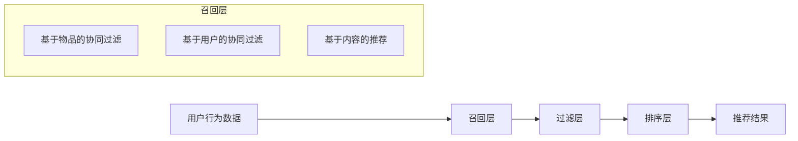

#### 图11-4 推荐系统技术架构（重建）
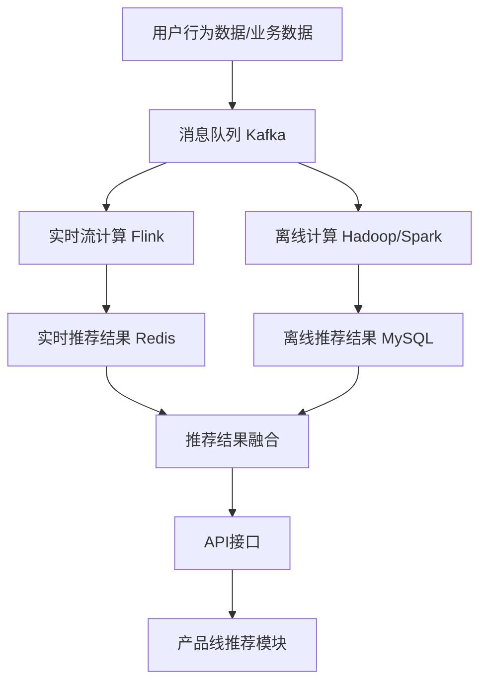

### 经典金句/数据
> “推荐系统就是用数学的方法计算并预测用户到底需要什么商品。” (p.237)
> “基于物品的协同过滤算法更适合电商产品，因为物品数量通常少于用户数量，且物品相似度变化较慢。” (p.248)
> 离线推荐系统建设约需两个月（一个月算法开发，一周方案，一周开发推荐位，一周测试）。 (p.263)
> 实时推荐中，可设置权重：访问1分，收藏2分，加购5分，下单7分。 (p.266)

---

## 附录：反侵权盗版声明（略，无实质内容）

> 说明：本书内容完整，OCR识别基本可读，部分表格和代码块存在字符错乱，已根据上下文语义进行合理修正。

