# 《数据中心基础设施运行管理与维护指导》章节总结

## 书籍信息
- 书名：数据中心基础设施运行管理与维护指导
- 编者：玉溪融建信息技术有限公司
- 出版：云南科技出版社，2022年10月第1版
- ISBN：978-7-5587-4680-2
- PDF状态：基于文字识别内容（非扫描图像），可完整提取文本
- OCR状态：良好，无明显错漏

## 目录说明
- 目录识别情况：完整识别，包含从第一章到第十一章及参考标准、前言等全部章节
- 章节对应依据：按照书中目录结构逐章整理
- OCR修复说明：无需要修复的内容

## 全书核心主题
本书是一部面向数据中心基础设施运维管理的实操性指导手册，由玉溪融建信息技术有限公司基于玉溪政务云数据中心（国内首个通过Uptime Tier III设计及建造双认证的数据中心）的运维实践编写而成。全书旨在填补业内对数据中心基础设施维护规程、方法、指标、周期等缺乏统一标准的空白。内容涵盖运维组织建设、人员要求、管理制度、运维流程，以及供电、制冷、监控、消防、安防、综合布线等具体系统的维护操作。核心目标是帮助数据中心业主和运维团队提升维护质量与效率，降低运营成本，保障数据中心安全、稳定、可靠运行。

---

## 前言

### 核心论点
随着数字技术与经济社会深度融合，数据中心作为“新基建”核心组成部分重要性日益突出。然而，新建数据中心大量投入运营的同时，具备新设备运维能力的技术人员严重缺乏，业内缺乏统一的维护规程和标准。本书汇集多年实践经验，编写了一本具有全面性、可操作性的运维指导书，旨在帮助提升维护管理质量和效率。

### 关键概念/事件
- 数据中心运维管理：对场地基础设施进行日常运行和维护，确保系统安全稳定。
- Uptime Tier III双认证：玉溪政务云数据中心是全国第一个通过Uptime Institute Tier III设计认证和建造认证的数据中心。
- 运维团队：拥有获得Uptime Institute ATD、ATS、AOS证书的工程师驻场运维。

### 逻辑推演/叙事脉络
前言首先阐述数据中心作为战略性基础资源的重要性，以及“新基建”背景下的发展态势。接着指出当前行业面临的两大矛盾：新建数据中心激增 vs 专业运维人员匮乏；缺乏统一的维护规程和标准。然后介绍玉溪融建公司的实践基础，说明本书的编写目的和内容框架。最后强调本书旨在指导业主和用户提升维护效率、降低成本。

### 经典金句/数据
> “建立一支训练有素、技能全面、维护规范、管理严格、标准统一的数据中心运维团队是保障数据中心安全、稳定、可靠运行的首要任务。”

---

## 第一章：总则

### 核心论点
本章定义数据中心基础设施运维管理所涉及的核心术语、编写原则、系统界面划分和适用范围。问题：如何统一运维管理的语言和边界？观点：明确术语定义和维护界面是高效运维的基础，本书以玉溪政务云数据中心为运维对象，参考互联网和电信运营商最佳实践，符合国家政策与标准。

### 关键概念/事件
- 数据中心基础设施：包括供电、制冷、消防、安防、监控、路由等配套设施。
- 可用性：数据中心在规定时间内处于能执行要求功能状态的能力，计算公式为 `可用性 = MTBF / (MTBF + MTTR)`。
- PUE值：数据中心总能耗与IT设备能耗之比，越接近1越绿色。
- SOP / MOP / EOP：标准操作程序、维护操作程序、应急操作程序。
- 系统界面划分：明确供配电、制冷、BA、动环、防雷、安防、消防等系统的维护责任边界。

### 逻辑推演/叙事脉络
本章首先定义数据中心及其基础设施涵盖的范围，列出暖通、供配电、UPS、柴油发电机、BA、动环、防雷、安防、消防等子系统的术语。然后提出编写原则：符合国家政策、符合行业标准、参考最佳实践、结合玉溪政务云数据中心实际。接着明确各系统的维护界面划分，最后说明本书适用的数据中心类型。

### 流程图（如存在）
无独立流程图。

### 经典金句/数据
> “可用性=平均无故障时间/（平均无故障时间+平均故障修复时间）”
> “PUE=数据中心总设备能耗/IT设备能耗”

---

## 第二章：数据中心运维管理

### 核心论点
本章系统阐述数据中心运维管理的目标、对象、人员组织、流程管理、运行管理、维护管理、安全管理和资源管理。问题：如何科学地“用好、管好”已建设交付的数据中心？观点：运维管理必须实现合规性、可用性、经济性、服务性四大目标，依托流程化、制度化的管理框架，覆盖人员、工具、系统、IT设备、基础设施五大对象。

### 关键概念/事件
- 运维管理五大对象：人员、管理工具、系统与数据、IT设备、基础设施。
- 事件管理：管控可能引起服务中断的活动，包括故障和服务请求，按优先级处理。
- 问题管理：找出事件根本原因，防止再次发生，强调根源诊断而非快速恢复。
- 故障分级：重大、严重、一般、提示四级，对应不同响应要求。
- 变更管理：确保以受控方式评估、批准、实施和评审所有变更。
- 全生命周期管理：设备分为磨合期、稳定期、损耗期，分别制定管理策略。
- 能效管理：通过运行模式选择、谐波治理、休眠功能、三相平衡等手段降低PUE。

### 逻辑推演/叙事脉络
本章从运维管理的四大目标入手，明确运维对象。然后详细展开人员组织架构（主管工程师、巡检技术员、维护技术员）及岗位职责。流程管理部分，给出事件、问题、故障、应急、变更五个子流程的流程图和规则。运行管理部分覆盖质量、值班、环境、用电、场地配置、设备运行、全生命周期管理。维护管理部分强调MOP作业计划和能效优化方案。安全管理区分人身、资产、信息安全，并给出进出管理制度。资源管理涵盖备品备件、工具仪表、文档资料、容量管理。

### 流程图（如存在）

**事件处理流程图**

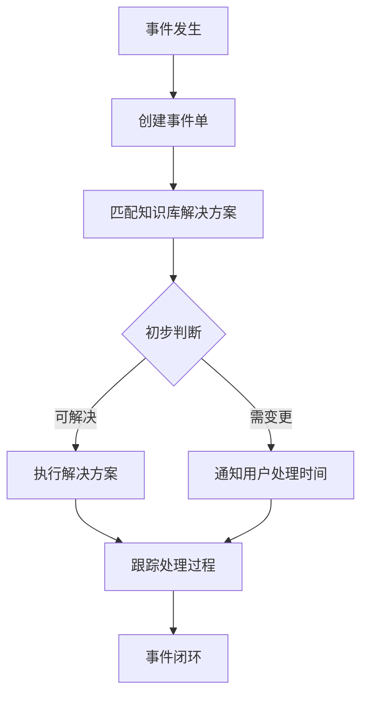

**故障处理流程图**

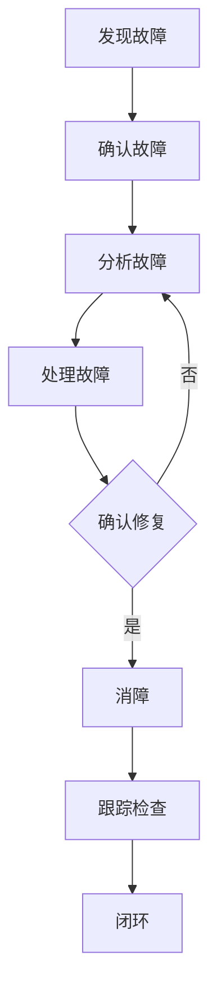

**应急保障流程图**

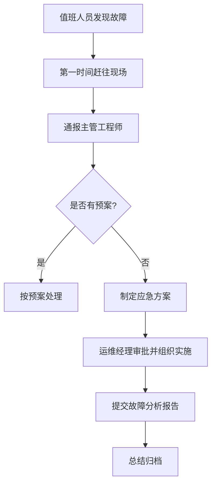

### 经典金句/数据
> “运维管理就是用好、管好已建设交付的数据中心。”
> “设备磨合期故障率较高，稳定期趋于低定值，损耗期故障率再次上升。”
> “PUE=（IT设备能耗+制冷用电负荷+供配电能耗+其他能耗）/IT设备能耗 = 1+制冷能耗因子+供电能耗因子+其他能耗因子”
> “降低数据中心PUE值的核心：降低空调能耗因子、降低供电能耗因子、降低其他能耗因子。”

---

## 第三章：暖通空调系统

### 核心论点
本章全面介绍数据中心暖通空调系统的组成、运行管理和维护作业。问题：如何确保为机房提供7×24小时恒温恒湿环境，同时实现节能？观点：通过冷冻水系统、直膨系统、新风自然冷却系统的分类维护，以及故障分级响应，可以保障制冷可靠性和能效优化。

### 关键概念/事件
- 暖通空调系统分类：电制冷、混合制冷、完全自然冷却。
- 冷冻水系统设备：冷水机组、板式换热器、冷却塔、循环水泵、水处理设备、末端精密空调、加湿器。
- 直膨式空调：风冷型、氟泵循环型。
- 冷水机组维护重点：趋近温度（蒸发趋近温度=冷冻水出水温度-吸气压力温度；冷凝趋近温度=排气饱和温度-冷却水出水温度）。
- 故障分级：重大故障（制冷中断，10分钟内恢复）、严重故障（冗余降低，1个工作日内修复）、一般故障（不影响制冷，1小时内响应）。
- 常用工具仪器：个人防护用具、维修工具、测量仪器（万用表、钳形表、热成像仪、风速仪等）。

### 逻辑推演/叙事脉络
本章首先介绍暖通空调系统的总体分类和冷冻水系统工作原理。然后逐一展开冷水机组、板式换热器、冷却塔、循环水泵、水处理设备、管路仪表、末端精密空调、加湿器的运行管理和预防性维护计划。接着介绍直膨式空调（风冷和氟泵循环）的维护保养。之后说明新风自然冷却系统的维护方法。最后给出故障分级与处理要求，以及常用工具仪器清单。

### 流程图（如存在）

**冷冻水系统工作原理图**

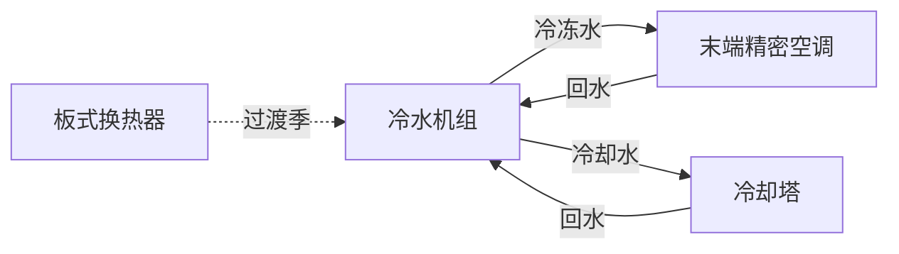

**螺杆冷水机组系统流程图**

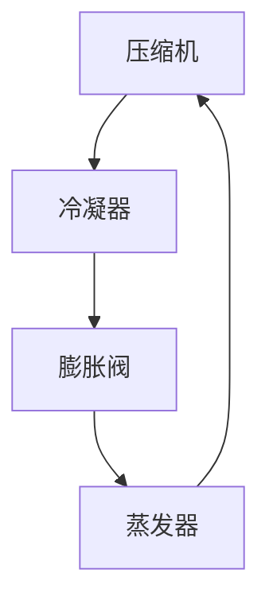

### 经典金句/数据
> “制冷性能系数cop=Q（制冷量）/P（电功率），数据中心常用离心式、螺杆式、磁悬浮冷水机组，cop≥6.5。”
> “重大故障：10分钟之内恢复制冷；严重故障：1个工作日内完成更换；一般故障：1小时内消除告警。”
> “冷却塔风机运行数量需根据水温控制：冷却水供水温度22～30℃，回水温度25～35℃。”

---

## 第四章：供配电系统

### 核心论点
本章详细说明数据中心供配电系统的组成、分级规定、维护要求和故障响应。问题：如何保障IT设备电力供应的连续性和电能质量？观点：采用分级冗余配置（A/B/C三级），通过高低压变配电、柴油发电机、UPS、蓄电池等子系统的规范化维护，实现无断电故障、高容错、在线维护。

### 关键概念/事件
- 供配电分级：A级（容错，2N或N+1冗余，电池≥15分钟）、B级（冗余，N+1）、C级（基本）。
- 低压配电方式：放射式、树干式、链式。
- 柴油发电机组：主用功率、波形畸变率、瞬态电压偏差、频率偏差、自动保护功能。
- UPS工作模式：主路逆变、电池逆变、静态旁路、外置维修旁路。
- 蓄电池：阀控密封铅酸蓄电池，浮充电压2.23~2.27V/cell，每年核对性放电20%~30%。
- 容量预警：变压器、柴油发电机、UPS负载容量比超过80%为黄色预警，超过100%为红色预警。

### 逻辑推演/叙事脉络
本章首先介绍供配电系统的重要性及涵盖设备（高压柜、变压器、柴油发电机、低压柜、UPS、蓄电池、列头柜、PDU）。然后给出A/B/C三级数据中心的具体规定。接着说明基本维护要求（绝缘垫、防护用具、停电检修程序）。之后分节详述高低压变配电系统、柴油发电机组、UPS系统、蓄电池组的运行维护、巡检内容、维护计划表。再给出UPS电池配置计算方法（恒功率法）。最后论述容量预警、故障分级与响应、节能措施和常用工具。

### 流程图（如存在）

**模块化UPS配置图**

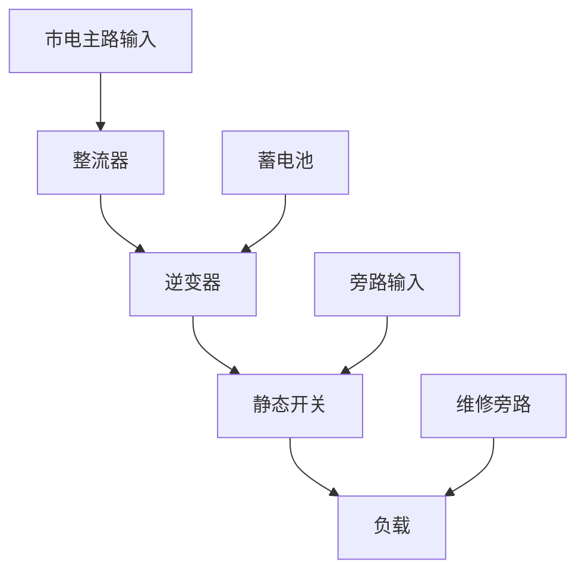

**数据中心配电系统流程图**

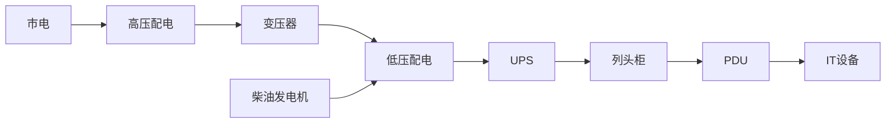

### 经典金句/数据
> “A级数据中心：双路不同回路市电+备用电源，低压配变电M(1+1)冗余，UPS 2N或M(N+1)冗余，电池后备时间不小于15分钟。”
> “UPS负载容量比预警：N+1系统80%~100%黄色预警，>100%红色预警；2(N+1)系统40%~50%黄色预警，>50%红色预警。”
> “蓄电池浮充电压：12V蓄电池为2.23~2.27V/cell，各电池端电压最大差值不超过480mV。”
> “重大故障：10分钟内解决或隔离；严重故障：1个工作日内消除；一般故障：1小时内修复。”

---

## 第五章：动力与环境监控系统

### 核心论点
本章阐述动环监控系统的功能、组成、运行维护要求。问题：如何实现数据中心基础设施的远程集中监控和告警管理？观点：通过采集子系统、传输子系统和软件子系统，对动力设备（配电、UPS、蓄电池）和环境设备（空调、温湿度、漏水、烟雾）进行遥测、遥信、遥调、遥控，提升运维效率。

### 关键概念/事件
- 动环监控系统组成：采集单元（传感器、变送器）、传输网络（光纤/网线）、软件平台（服务器、数据库、应用软件）。
- 四遥功能：遥测、遥信、遥调、遥控。
- 告警四级：紧急、重要、次要、提示（不同颜色标识）。
- 监控内容：动力设备（配电、UPS、蓄电池、油机）、环境设备（精密空调、新风机）、环境参数（温湿度、水浸、烟雾、气体）。
- 维护周期：日常巡检、月度、季度、年度维护内容。

### 逻辑推演/叙事脉络
本章先介绍动环监控系统的总体价值（集中监控、能效管理、降低成本）。然后详细说明系统三大部分：采集子系统（传感器、变送器、监控模块）、传输子系统（光纤/网线、交换机）、软件子系统（服务器、数据库、应用软件）。接着描述系统运行要求（全天实时监控、组态配置、告警设置与上报、报表功能）。再给出维护基本要求（双人操作、断电验电、防静电）和维护内容（传感器、服务器、传输网络、功能测试）。最后论述运行管理、能效管理、安全管理、权限管理、配置更新管理。

### 流程图（如存在）

**动环监控系统架构图**

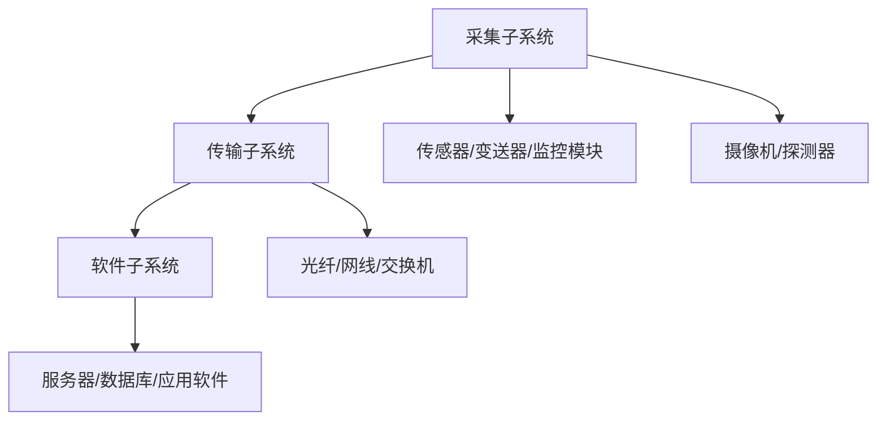

### 经典金句/数据
> “动环监控系统全年24小时实时监控基础设施运行状态。”
> “系统告警规划：紧急（导致业务退服）、重要（可能影响性能）、次要（部件故障不影响整体）、提示（维护性信息）。”
> “维护之前做好维护隔离，避免维护产生人为告警误动作。”

---

## 第六章：楼宇自控BA系统

### 核心论点
本章介绍BA系统在数据中心制冷系统自动控制中的应用。问题：如何实现对冷机、水泵、冷却塔、阀门等设备的集中自动监控与节能控制？观点：BA系统采用分散控制、集中管理，通过冷机模式和板换模式的自动切换，实现供回水压差恒定、流量恒定、温度恒定，并支持远程主机控制和本地手动控制双备份。

### 关键概念/事件
- BA系统组成：主控制器、现场控制器（DDC）、传感器件、执行机构、软件。
- 监控对象：空调新风机组、送排风机、集水坑、电梯、电动阀门、水泵、冷机、电伴热等。
- 两种工作模式：冷机模式（冷机制冷）、板换模式（冷却塔+板式换热器自然冷却）。
- 控制方式：远程主机控制（自动）、本地手动控制（应急/维护）。
- 应急控制：设备故障切换、冷冻水温度输出冗余、远程失效时手动启动。

### 逻辑推演/叙事脉络
本章先阐述BA系统的价值（全面自动控制、减少运维工作量、节能）。然后介绍系统基本构成（主控制器、DDC、传感器、执行器）和功能（数据采集、启停控制、参数监控、报警、节能控制）。接着详细说明两种工作模式下的控制逻辑（压差控制、流量控制、温度控制）。再给出本地手动控制和应急控制的操作要求。最后论述系统维护（环境要求、巡检、预防性维护）和系统管理（操作、安全、权限、告警、资料、联动）。

### 流程图（如存在）

**冷机模式控制逻辑**

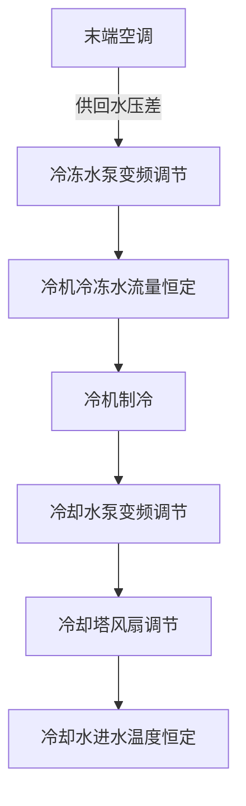

**板换模式控制逻辑**

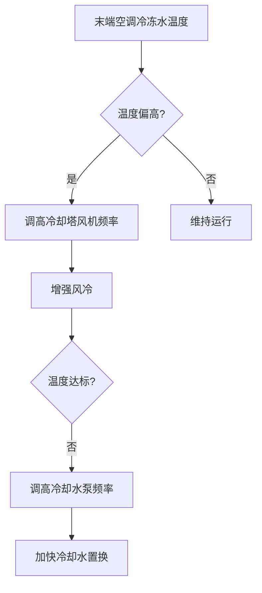

### 经典金句/数据
> “BA系统采用分散控制、集中监控与管理，关键在传感技术与接口控制技术。”
> “系统本地手动控制顺序：阀门准备 → 水流传输（水泵）→ 冷机制冷 → 冷却塔 → 蓄冷罐投入。”
> “远程自动控制失效时，要求运维人员能迅速转换为本地手动控制模式，保证制冷供冷正常运行。”

---

## 第七章：门禁系统

### 核心论点
本章概述门禁系统的组成、维护内容和运行管理。问题：如何实现对数据中心人员进出的数字化管理和安全控制？观点：通过门禁控制器、读卡器、电控锁、管理服务器的网络化部署，实现分区分级权限管理、刷卡记录、消防联动。

### 关键概念/事件
- 门禁系统组成：门禁控制器、读卡器、电控锁、管理服务器、管理软件。
- 功能：普通/高级门禁功能、开门时间及权限分配、分区分级管理、消防联动（火灾时远程开门）。
- 维护内容：控制器除尘、门磁机构校准、闭门器力矩调整、线缆标识更新。
- 运行管理：基础管理（日常巡检、分区控制）、业务管理（日志查询、数据库备份）、权限管理（用户/角色/安全设置）、通信管理。

### 流程图（如存在）

**门禁监控系统架构图**

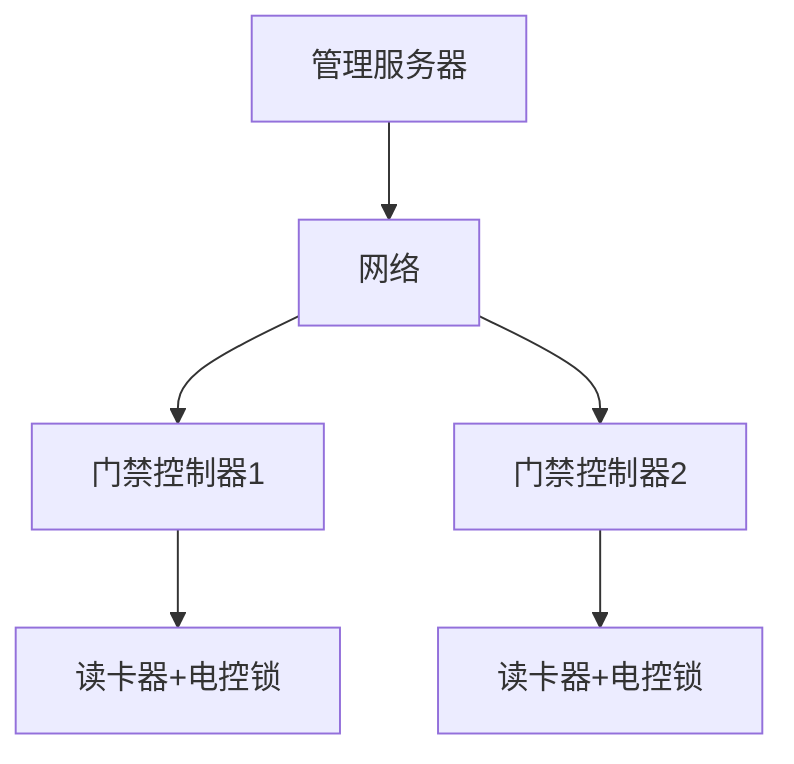

### 经典金句/数据
> “数据中心区域应根据重要等级和功能区划分相应的控制区域，出入权限应实行分区、分级管理。”
> “门禁监控系统应与消防控制系统联动，发生区域火灾时能远程打开门禁逃生。”
> “维护周期：日常巡检、月度、季度、年度维护。”

---

## 第八章：数据中心综合布线

### 核心论点
本章介绍数据中心综合布线的配线区划分、施工规范、日常维护和故障分析。问题：如何规范数据中心的线缆布放和维护？观点：通过主配线区、中间配线区、水平配线区、区域配线区、设备配线区的层级划分，遵循“三线分离”（直流电源线、交流电源线、信号线分离）原则，保证线缆可维护性和电磁兼容。

### 关键概念/事件
- 配线区五级：主配线区（中心交叉连接）、中间配线区（第二级主干）、水平配线区（连接设备）、区域配线区（灵活对接）、设备配线区（终端设备）。
- 布线方式：地板布线、吊顶布线。
- 施工要求：强弱电间距≥5cm，金属管敷设（弯头≤3个），接地铜排。
- 日常维护：定期清理灰尘、检查标签、三线分离检查、管孔试通。
- 常见故障：线缆断裂、连接器松动、标签脱落、水浸、鼠害。

### 流程图（如存在）

**配线区域划分图**

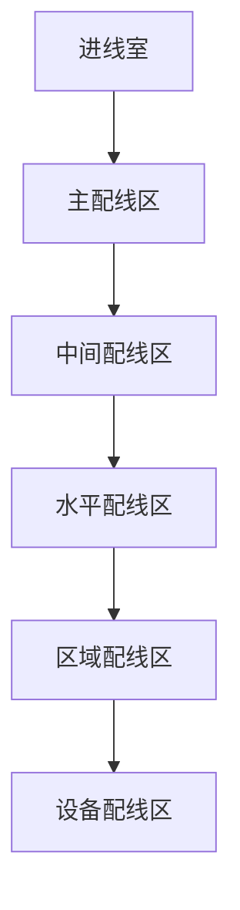

### 经典金句/数据
> “综合布线包括电源布线、弱电布线和接地布线；电源线槽和弱电线槽间距应保持至少5cm以上，防止电磁干扰。”
> “三线分离：直流电源线、交流电源线和信号线布放于不同槽道。”
> “当进线室管孔使用率超过80%或面积过小无法满足维护需要时，应进行改扩建。”

---

## 第九章：防雷接地系统

### 核心论点
本章阐述数据中心防雷接地的原理、组成和维护要求。问题：如何防止直击雷和感应雷对数据中心设备的损害？观点：采用联合接地系统（防雷、保护、工作接地连接在一起），通过接闪器、引下线、接地体、电涌保护器（SPD）的多级防护，将雷电流泄放入地，接地电阻≤1Ω。

### 关键概念/事件
- 防雷接地两个概念：防雷（泻放雷电流）、接地（设备保护）。
- 联合接地：将防雷接地、保护接地、工作接地连接成一个公共地网。
- 主要构件：接闪器（避雷针/带）、引下线、接地体（极）、接地装置、接地网。
- 感应雷：由雷电电磁感应产生，通过电力线路、信号馈线入侵，是机房设备损坏的主要原因。
- 维护项目：地网接地电阻测试（≤1Ω）、设备地线连接检查、防雷器工作状态检查。

### 流程图（如存在）

**防雷原理图**

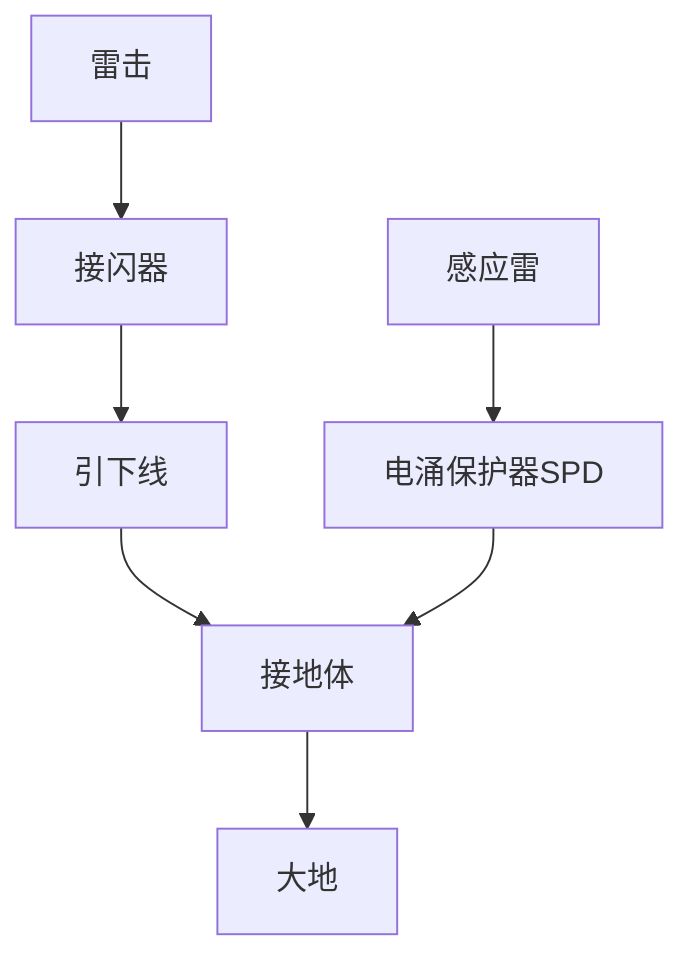

### 经典金句/数据
> “联合接地系统容易均衡建筑物内各部分的电位，降低接触电压和跨步电压，接地电阻更小。”
> “由雷电感应和雷电波侵入造成的雷电电磁脉冲（LEMP）是机房设备损坏的主要原因。”
> “防范原则：‘整体防御、综合治理、多重保护’。”
> “接地电阻要求≤1Ω，测试应选择没有下雨的天气进行。”

---

## 第十章：消防系统

### 核心论点
本章全面介绍数据中心的消防系统设计、组成、运行维护和安全管理。问题：如何在保护设备和人员安全的前提下有效防火灭火？观点：采用多层次的消防体系，包括消火栓、水喷淋（预作用）、细水雾、气体灭火、灭火器，配合火灾自动报警系统和消防联动控制，同时强调消防控制室24小时值班、定期演练。

### 关键概念/事件
- 消防系统组成：消火栓系统、水喷淋系统（预作用）、细水雾系统、气体灭火系统、灭火器（干粉、水基、二氧化碳）。
- 气体灭火系统特点：对设备无损害，但要求保护区密闭，不得用于有人职守机房。
- 吸气式烟雾探测系统（极早期）：主动采集空气样品，适用于高气流、开放式环境。
- 消防控制室：24小时双人值班，持证上岗，与城市火灾自动报警系统联网。
- 消防演练：每半年至少一次，包括发现火情、启动气体灭火、报警、疏散、灭火等模块。

### 流程图（如存在）

**火灾报警、灭火处理流程图**

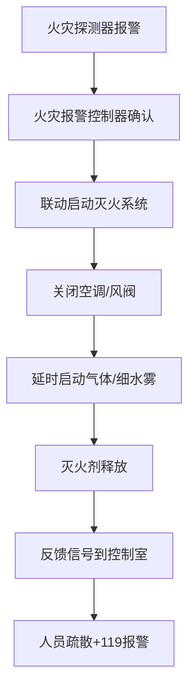

**消防系统分类图**

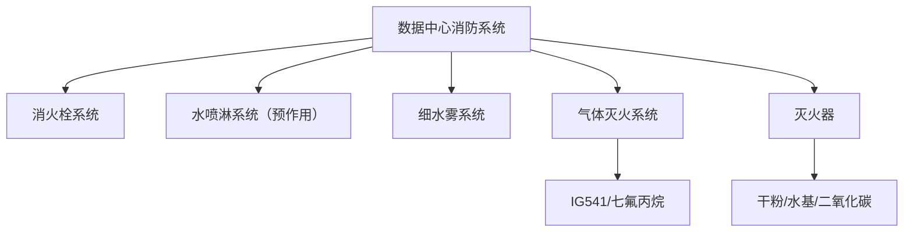

### 经典金句/数据
> “A级数据中心的主机房应设置气体灭火系统，也可设置细水雾灭火系统。”
> “气体灭火系统不得用于有人职守的机房。”
> “消防控制室应当实行24小时值班制度，每班人员不少于2人。”
> “吸气式烟雾探测系统能为用户赢得宝贵时间，对即将发生的火灾做出及时响应。”

---

## 第十一章：安防系统

### 核心论点
本章介绍数据中心综合安防系统的设计、等级划分、运维规范和各子系统维护。问题：如何建立多层次、立体化的安全防范体系？观点：按安全保障等级（一级至四级）配置视频监控、出入口控制、入侵报警、电子巡更等子系统，实现外部侵入保护、重要区域保护、特定目标保护。

### 关键概念/事件
- 四个安全保障等级：一级（数据机房模块、ECC）、二级（机电设备区）、三级（运维办公区）、四级（园区周界）。
- 安防子系统：视频安防监控、出入口控制（门禁）、入侵报警、电子巡更。
- 技术措施：生物识别门禁、多鉴报警、防冲撞装置、电子围栏、视频联动。
- 运维基本要求：7×24小时专业工程师值守，定期除尘、防潮、防腐、防雷、防干扰。
- 维护内容：摄像机清洁、门禁读卡器测试、报警探测器灵敏度调整、巡更路线评估。

### 流程图（如存在）

**数据中心安防系统图**

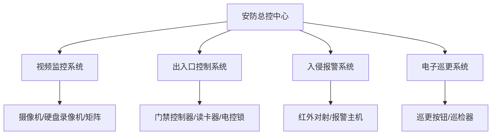

### 经典金句/数据
> “安全防范系统是一个基于客户端或服务器、分布式的网络管理平台。”
> “一级安全保障等级区：安装生物识别电子门禁、摄像监控、多鉴报警设备；所有出入口设防，门禁及红外报警系统联动。”
> “防潮、防尘、防腐、防雷、防干扰是安防设备维护的重点。”
> “发生火灾时，应确保门禁电源全部切除，所有门保持打开状态，确保人员安全疏散。”

---

## 参考标准

本章列出了本书引用的主要国家标准和行业规范，包括数据中心设计、供配电、暖通空调、防雷接地、消防、安防、综合布线等领域的GB、GB/T、YD/T等标准，共约50余项。具体清单详见原书末尾。

> 说明：参考标准部分为列表形式，无进一步结构化内容。主要标准包括GB 50174-2017《数据中心设计规范》、GB 50052-2020《供配电系统设计规范》、GB 50057-2019《建筑物防雷设计规范》、GB 50116-2019《火灾自动报警系统设计规范》等。