# 《数据产品经理：实战进阶》章节总结

## 书籍信息
- **书名**：数据产品经理：实战进阶
- **作者**：杨楠楠 等著（李凯东、陈新涛、萧饭饭、胡玉婷、曹畅、谷坤明、俞京江、赫子敬、贺园、刘扬、朱诗倩）
- **ISBN**：978-7-111-66239-6
- **出版信息**：机械工业出版社，2020年出版
- **PDF/OCR状态**：基于完整EPUB文本内容提取，识别清晰，无OCR错漏。

## 目录说明
- 目录识别完整，与原书一致。
- 章节顺序：序一、序二、作者简介、前言、第1章～第11章、后记。
- 每章内小节层级清晰，按原结构整理。

## 全书核心主题
本书系统阐述了数据产品经理的知识体系与实战方法。全书从数据产品的定义、类型、衡量标准入手，明确数据产品经理的能力模型与分类。随后，深入讲解数据分析方法论（全链路分析、组成因子分解、影响因子拆解、枚举法等）和产品路线图规划。在数据建设方面，覆盖了埋点体系、数据中台（战略、组织、产品形态）、指标体系、A/B测试系统、数据管理（主数据、元数据）、数据服务等核心模块。最后，以搜索系统和用户画像为例，详解策略产品经理的思维、分析方法和实践流程。本书旨在帮助数据产品经理构建完整的知识结构，从初级到高级进阶，实现数据驱动业务的价值。

---

## 序一（张溪梦，GrowingIO CEO）
### 核心论点
数据驱动是企业增长的关键，数据产品经理是帮助企业落地数据驱动实践的重要角色。本书作者们通过实践与思考反哺行业，期待更多数据产品经理帮助企业高效增长。

### 关键概念/事件
- **数据像水资源**：在企业中流动，准确、高效、易用。
- **数据驱动**：涉及流程、用户体验、商业、数据四个维度的集合。

### 逻辑推演/叙事脉络
作者从服务上千家客户的经验出发，指出粗放式经营失效，企业需要直连用户、沉淀数据资产。数据产品经理在其中发挥核心作用。

### 经典金句
> “数据驱动，表面上看是个执行问题，但背后反映的是流程、用户体验、商业、数据四个维度的集合。”

---

## 序二（马宏彬，快手高级副总裁）
### 核心论点
数据产品经理直接决定业务负责人和分析团队获取数据的速度、准确度及方式。数据产品经理与数据分析师之间的界限日趋模糊，本书基于一线实践总结，对从业者有巨大帮助。

### 经典金句
> “这个行业越来越被强烈需要，这个行业刚刚开始，这本书来得非常及时。”

---

## 作者简介
12位作者均为资深数据产品经理/专家，来自京东、转转、美团、字节跳动、阿里、GrowingIO等公司，擅长领域涵盖数据中台、策略产品、用户画像、A/B测试、数据管理等。

---

## 前言
### 核心论点
数据产品经理的成长分为两个阶段：初级/中级阶段关注如何在团队中发挥更大作用；中级/高级阶段关注如何让数据为公司业务创造价值。本书旨在帮助读者构建数据产品经理的知识结构，渡过第一阶段。

### 关键概念/事件
- **数据产品经理职责**：围绕数据构建解决方案，从埋点到数据治理，从可视化到策略产品。
- **两大阶段**：初级/中级（团队价值）→ 中级/高级（业务创造价值）。
- **本书内容框架**：通用能力（数据分析、产品路线图）→ 数据建设（埋点、中台、指标体系、A/B测试、数据管理、数据服务）→ 策略产品（搜索、用户画像）。

### 经典金句
> “产品管理的主动权应该是产品经理自己争取来的，而不能等待别人给你。”

---

## 第1章：全面认识数据产品经理
### 1. 核心论点
本章解决“什么是数据产品”“数据产品经理需要哪些能力”的问题。作者认为数据产品是降低用户使用数据门槛、发挥数据价值的产品类型；数据产品经理需具备产品经理通用能力、数据专业能力和软能力，并分为平台型、应用型、策略型三类。

### 2. 关键概念/事件
- **数据产品定义**：降低用户使用数据门槛，发挥或提高数据价值的产品类型。
- **数据产品四组成部分**：采集清洗、计算管理、分析展示、挖掘应用。
- **数据产品三大类型**：用户数据产品（指数型、统计型、生活型）、商用数据产品、企业数据产品（平台型、应用型）。
- **数据产品衡量维度**：准确性、及时性、全面性、易用性（重要性依次递减）。
- **数据产品经理能力模型**：产品经理能力（需求定义、解决方案）、数据专业能力（数据产品设计、数据分析、数据仓库、大数据架构）、软能力（商业认知、沟通协调、项目管理）。
- **数据产品经理分类**：平台型（通用能力/方案）、应用型（特定业务场景）、策略型（搜索、推荐、风控等策略）。
- **应聘与招聘**：职业规划、简历梳理、面试技巧；招聘流程（需求确认、筛选面试、人才跟进）。
- **案例**：Domo商用数据产品分析；数据产品经理面试案例。

### 3. 逻辑推演/叙事脉络
从数据产品的定义出发，拆解其组成和类型，进而引出数据产品经理的能力模型和分类。然后分别从应聘者和招聘者角度给出实用建议。最后通过Domo案例展示商用数据产品的设计逻辑，通过面试案例展示能力考察点。

### 4. 流程图
#### 数据产品组成四部分

#### 数据产品类型
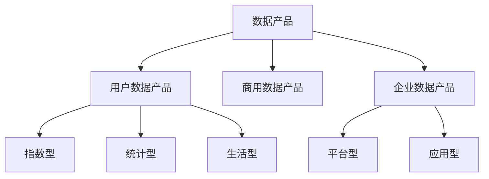

### 5. 经典金句/数据
> “数据是一种降低用户使用数据的门槛，并发挥或提高数据价值的产品类型。”
> “准确性是数据产品的根本，是最重要的评价维度。”
> “数据产品经理的核心职责是利用企业数据资产发挥价值，包括降低使用门槛和管理数据资产等。”

---

## 第2章：数据分析方法论
### 1. 核心论点
本章解决“如何通过数据分析驱动业务增长”的问题。作者认为，真正的数据产品经理要发挥数据价值，必须掌握数据分析基础流程（发现问题→定位问题→分析问题→提出有价值结论），并熟练运用全链路分析、组成因子分解、影响因子拆解、枚举法等高级分析方法。

### 2. 关键概念/事件
- **有价值的数据结论**：只有两类——增加收益和减少损失（增减思路）。
- **全链路分析**：梳理链路关键节点，确定节点指标，进行节点洞察（如漏斗分析、AARRR模型）。
- **组成因子分解**：将整体指标按分类标准拆分为不同因子，整体等于因子之和。
- **影响因子拆解**：列出对结果有影响的定性因子，逐个分析（常用于PPT框架）。
- **枚举法**：将所有数据一一列举，结合排序思维和随机抽样进行分析（策略产品经理最常用）。
- **案例**：大型车购买转化率分析（全链路+组成因子+枚举）；教育公司需求点挖掘（减少成本→增加收益）。

### 3. 逻辑推演/叙事脉络
先讲数据分析基础流程（发现问题→定位问题→分析问题→提出结论），强调“有价值结论”必须是增减收益。然后详细讲解四种高阶分析方法，每种都给出定义、步骤和案例。最后用两个综合案例展示多种方法组合使用。

### 4. 流程图
#### 全链路分析（广告平台）

#### 枚举法分析过程
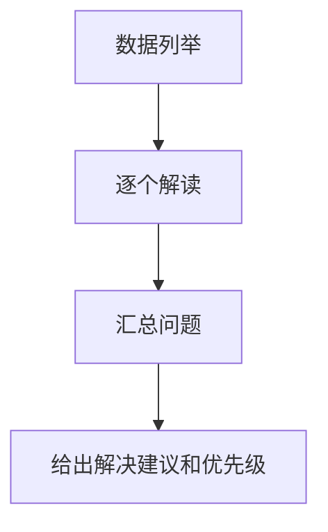

### 5. 经典金句/数据
> “优秀的数据分析绝对不是图表堆积的产物，它一定有明确有价值的结论。”
> “数据不分大小，关键是思路要多。”
> “如何进行组成因子分解，代表着思考问题的第一维度，直接影响能否得到有用的结论。”

---

## 第3章：产品路线图
### 1. 核心论点
本章解决“如何制定数据产品的路线图”的问题。作者认为，产品路线图是从产品战略目标出发，通过需求收集、优先级排序、规划迭代计划的一系列过程，需要结合产品愿景、产品目标、版本迭代和任务分解。

### 2. 关键概念/事件
- **产品路线图**：将短期和长期业务目标与具体产品创新解决方案匹配的计划，动态文档。
- **产品战略目标层级**：产品愿景 → 产品目标 → 产品路线图 → 产品迭代计划与任务。
- **需求收集方式**：用户反馈、竞品分析、销售/客服、行业分析、头脑风暴、数据反馈。
- **优先级确定方法**：价值与复杂度模型、加权评分、KANO模型、SWOT分析、四象限分析法。
- **路线图规划**：包含版本目标、核心需求、时间周期、里程碑。

### 3. 逻辑推演/叙事脉络
从制定产品战略目标（愿景、目标、路线图、迭代计划）开始，然后介绍需求收集的多种渠道，接着讲解如何用多种方法确定需求优先级，最后给出路线图规划的要素和实际案例（TAPD工具使用）。

### 4. 流程图
#### 四象限分析法
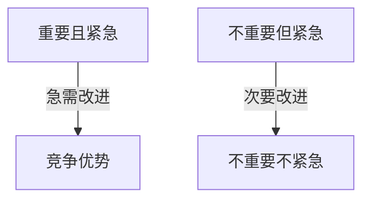

### 5. 经典金句/数据
> “不要做‘我觉得’的产品经理，而要去做‘因为（数据分析）……所以应该（产品规划）……然后才会（数据验证）……’的数据驱动型产品经理。”

---

## 第4章：数据埋点体系
### 1. 核心论点
本章解决“如何规范地进行数据埋点”的问题。作者认为，埋点是数据价值的起点，只有合理埋点、规范上报，数据才会产生价值。要做好埋点，需要目标收集（必要且全面）、字典管理（埋有所编、便于检索）、埋点管理平台（可视化、状态监控、测试）。

### 2. 关键概念/事件
- **埋点**：针对用户行为或事件进行捕获、处理和上报的技术。
- **埋点类型**：Web埋点（JavaScript）、App埋点（有埋点/无埋点）、接口埋点。
- **目标收集要义**：“谁对什么做了什么”（用户、目标、事件）。
- **字典管理**：埋点编码由技术部门建立全公司规范，编码遵循“页面_模块_元素_事件”全路径原则。
- **埋点管理平台**：包含字典管理、可视化管理、状态监控、测试模块。
- **埋点技术选择**：初创公司可选无埋点；业务复杂、流量大时需有埋点和无埋点联合使用，并自建管理平台。

### 3. 逻辑推演/叙事脉络
先解释埋点的定义和意义，然后介绍Web、App、接口三种埋点类型。接着详细讲解如何做好埋点：目标收集（必要全面）、字典管理（编码规范）、埋点管理平台（可视化、监控、测试）。最后对比有埋点与无埋点技术的优缺点，并给出不同阶段的技术选择建议。

### 4. 流程图
#### 埋点管理系统主要模块
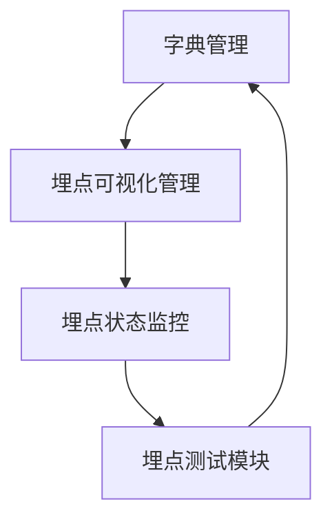

### 5. 经典金句/数据
> “如果说数据仓库是兵工厂，各种数据产品是枪炮，那么埋点就是钢和铁。”
> “埋点不是越全越好，只有能够产生业务意义的事件及相关信息才需要上报。”

---

## 第5章：数据中台
### 1. 核心论点
本章解决“数据中台是什么、如何构建”的问题。作者认为，数据中台不是技术产品，而是一种企业战略，由CEO制定，涉及组织协同、业务深入、统一建设（3个唯一+4个统一）、服务共享，最终以业务效果评价。

### 2. 关键概念/事件
- **数据中台的由来**：解决企业成长期后出现的“烟囱式”开发、数据不一致、效率低下等问题。
- **中台是战略**：自上而下的整体性规划，资源价值最大化。
- **数据中台产品形态**：统一指标平台、统一标签平台、可视化报表平台、智慧营销平台。
- **构建数据中台步骤**：定战略（一把手工程）→ 改组织（独立技术线）→ 深业务（收集诉求）→ 做统一（3个唯一+4个统一）→ 享服务（对外输出）→ 业务评价。
- **3个唯一**：唯一的数据源、唯一的ETL、唯一的数据资产管理。
- **4个统一**：统一的集市、统一的指标、统一的口径、统一的标签。
- **黄埔军校式数据中台**：为业务部门培养核心数据人才，而不是权力中心。

### 3. 逻辑推演/叙事脉络
从企业生命周期问题引出数据中台的由来，澄清中台不是技术而是战略。然后讲解中台下的组织协同、技术与业务结合。接着详细介绍数据中台的五种产品形态及产品思维（统一、标准、分层、共享、价值驱动）。最后给出构建数据中台的七步法，并以业务评价和人才输出作为结尾。

### 4. 流程图
#### 数据中台技术架构图（示意）
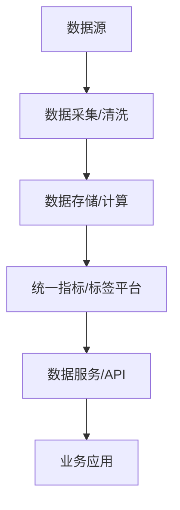

#### 构建数据中台步骤

### 5. 经典金句/数据
> “中台不是一种产品，并不能被直接购买，实施之后完成搭建。”
> “数据中台是因业务而起，也因为业务而定。”
> “数据中台的负责人要有企业发展的格局，不要让数据中台成为自己的权力中心，而应让它成为整个企业的黄埔军校。”

---

## 第6章：数据指标体系
### 1. 核心论点
本章解决“如何构建科学的数据指标体系”的问题。作者认为，数据指标体系是数据中台的重要一环，能全面支持决策、指导业务运营、驱动用户增长、统一统计口径。建设方法包括北极星指标法、AARRR模型（海盗指标法）、GSM模型。

### 2. 关键概念/事件
- **数据指标构成**：维度、汇总方式、量度。
- **指标类型**：基础指标（原子）、复合指标、派生指标。
- **数据指标分类**：埋点数据、业务数据、财务数据、复合数据（如CPA、GMV、ARPU、ROI等）。
- **指标体系设计原则**：用户第一、典型性、系统性、动态性。
- **建设方法**：
  - 北极星指标：体现产品核心价值的唯一关键指标。
  - AARRR模型：获取→激活→留存→营收→引荐。
  - GSM模型：目标→表现→指标（适用于H5活动效果分析）。
- **建设步骤**：确立核心指标 → 确定用户行为关键指标 → 业务需求多维拆解 → 优先级系统性整合。
- **行业应用**：电子商务（GMV、转化率、复购率等）、内容文娱（阅读章节数、使用时长等）、在线教育（课程销售额、付费转化率等）。

### 3. 逻辑推演/叙事脉络
先定义数据指标和指标体系的概念及价值，然后讲解指标的分类（技术分类和业务分类）。接着阐述指标体系的设计原则，并重点介绍三种建设方法（北极星、AARRR、GSM）和四步建设步骤。最后给出电商、内容文娱、在线教育三个行业的指标体系示例。

### 4. 流程图
#### AARRR模型（海盗指标法）

#### GSM模型
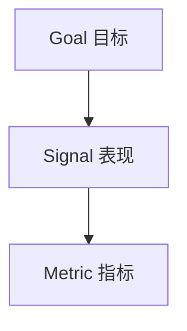

### 5. 经典金句/数据
> “数据指标体系就像是水，孕育着生命，承载着万物。”
> “北极星指标会指引我们根据业务构建指标体系的方向，告诉我们什么是最重要且最能反映业务的指标。”

---

## 第7章：A/B测试系统搭建
### 1. 核心论点
本章解决“如何从0到1设计A/B测试系统”的问题。作者认为，A/B测试是一种先验的科学试验方法，通过随机分组、假设检验来判断不同变量的效果差异。一个完整的A/B测试系统需包含试验管理、分流模块、业务接入、数据采集和结果分析五大模块。

### 2. 关键概念/事件
- **A/B测试定义**：将试验对象随机分组，给予不同变量刺激，采集数据并用假设检验判断效果显著性的科学方法。
- **A/B测试特点**：先验性、科学性、严谨性、成效性、并行性、持续性。
- **应用场景**：界面试验、功能试验、人群试验、算法试验。
- **A/B测试流程**：需求洞察 → 需求发起 → 方案设计 → 需求落实 → 效果分析。
- **系统核心功能**：试验管理、分流模块（Hash算法、流量分配）、业务接入（分离URL、编程代码、可视化）、数据采集、结果分析（置信区间、t检验）。
- **设计要点**：科学的流量分配、足够的用户数据、严谨的结果分析、持续的迭代更新。
- **案例**：奥巴马竞选网站（转化率提升40.6%）、电商详情页相似推荐（人均UV价值提升）。
- **经验建议**：培养数据驱动文化；小公司可采购第三方工具。

### 3. 逻辑推演/叙事脉络
从A/B测试的起源、特点、场景切入，然后详细介绍五步流程。接着讲解系统的五大核心功能和设计方案（含原型设计示例）。通过两个案例展示实际应用，最后给出自研或第三方工具的选择建议。

### 4. 流程图
#### A/B测试流程

#### 分流结构示例
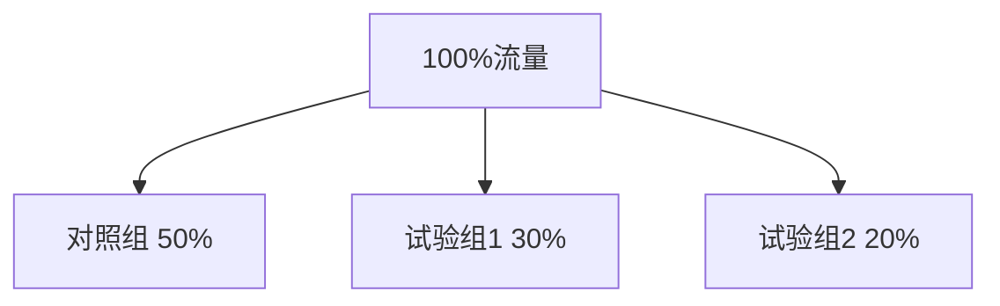

### 5. 经典金句/数据
> “A/B测试的核心意义并不在于某一次试验的成功或者失败，而是这种通过试验和数据驱动产品不断进化的过程。”
> “经验主义未必可靠，保持空杯心态，试试才知道。”

---

## 第8章：数据管理
### 1. 核心论点
本章解决“如何管理企业数据（主数据和元数据）”的问题。作者认为，企业数据管理主要涉及主数据（描述核心业务实体）和元数据（描述数据的数据），需要从业务定义、流程、人员职责、工具易用性四要素入手，构建产品化解决方案。

### 2. 关键概念/事件
- **数据类型**：主数据（缓慢变化）、业务数据（交易类事实）、元数据（描述数据的数据）。
- **主数据管理**：解决主责部门不清晰、数据定义不明确、维护流程不统一、数据共享不及时、数据状态不可控、数据属性不完备等问题。
- **主数据管理四要素**：实体模型、业务定义及流程、人员职责与权限、工具易用性。
- **主数据产品功能**：源数据接入、实体建模、属性规则、实体关系维护、统一编码、数据填报、数据质量校验、流程与权限、监控日志、分发订阅服务。
- **元数据管理**：元数据是“描述数据的数据”，分为业务元数据和技术元数据。
- **元数据管理标准**：MARC、XML、RDF、ISO11179、都柏林核心等。
- **元数据管理功能**：血缘分析、影响分析、数据稽核。

### 3. 逻辑推演/叙事脉络
先区分主数据、业务数据、元数据三类数据的特点和用途。然后重点讲解主数据管理的四要素和产品化解决方案（功能矩阵、核心模块）。接着介绍元数据管理的概念、应用价值、标准框架（内容层→描述语言层→描述框架层），以及元数据管理的策略、过程和功能设计。

### 4. 流程图
#### 主数据产品系统架构
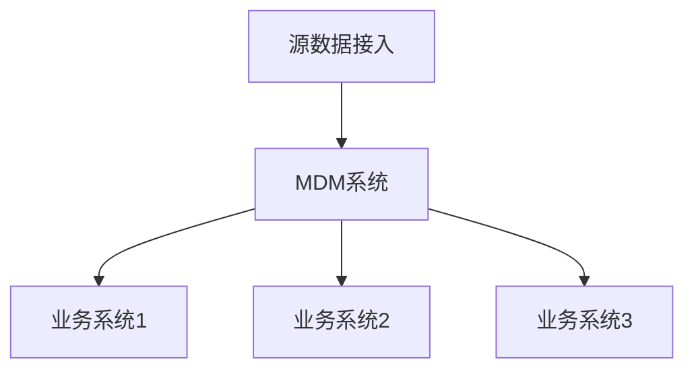

#### 元数据管理业务架构
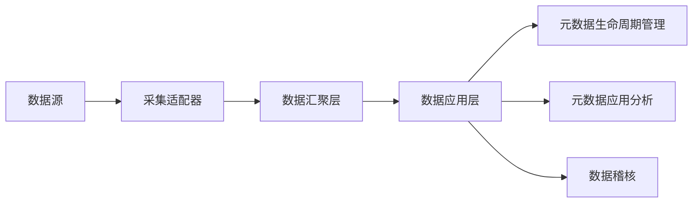

### 5. 经典金句/数据
> “业务数据一旦发生即是事实，我们不希望也不能够管理一个已经发生的事实。”
> “元数据将一个组织中的语义进行了统一化的定义。”

---

## 第9章：数据服务
### 1. 核心论点
本章解决“如何高效、安全、便捷地开放数据”的问题。作者认为，数据服务是数据中台的核心组成部分，通过API将数据开放出去，包括基于标准指标的数据服务和基于Hive表的数据服务两种模式，旨在提升数据消费效率和数据一致性。

### 2. 关键概念/事件
- **数据服务定义**：数据API的生产工厂与管理空间，承上启下（数据开发→数据消费）。
- **两大模式**：
  - 基于标准指标的数据服务：API服务（开发→测试→市场→应用管理→资产管理→数据血缘）和指标池服务。
  - 基于Hive表的数据服务：可视化模式（选择字段）和自定义SQL模式。
- **核心挑战**：数据内容的一致性、准确性、公共维度建设、选表逻辑、数据安全、权限控制。
- **数据服务构想**：打造公司统一API网关，作为数据API的统一管理与出口平台。

### 3. 逻辑推演/叙事脉络
先介绍数据服务的定义、价值（打破烟囱式开发）和利益相关者。然后详细讲解基于标准指标的数据服务（API开发平台、测试平台、API市场、应用管理、资产管理、数据血缘）和指标池服务。接着介绍基于Hive表的两种模式及对比。最后讨论数据服务的局限性、数据内容问题、公共维度、选表逻辑、安全与权限，并提出未来构想。

### 4. 流程图
#### 数据产品架构图（服务层位置）
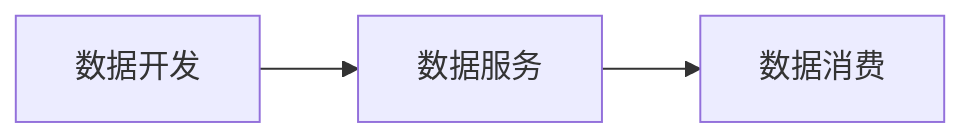

#### API服务用户路径

### 5. 经典金句/数据
> “数据服务的核心定位是作为公司内的数据管理与出口平台。”
> “基于标准指标的数据服务的核心就在于基于标准指标制作一致、标准、准确、稳定的数据API。”

---

## 第10章：策略产品详解：以搜索系统为例
### 1. 核心论点
本章解决“策略产品经理如何思考和维持搜索系统的迭代”的问题。作者认为，策略产品经理是依托新技术架构、以策略输出为核心、以指标达成为目标的产品经理。需要具备分类、下钻、量化、抽象、极限、理想态等思维方式，以及session分析、DCG打分、badcase分析、query分析等方法。搜索系统的迭代可从整体架构（query理解、召回排序、内容、前端）、用户需求、具体问题、业务发展四个维度入手。

### 2. 关键概念/事件
- **策略产品经理定义**：依托新技术架构，以策略输出为核心，以指标达成为目标。
- **思维体系**：了解架构懂原理、面向用户+后台的产品综合思维、以数据为基础以指标为目标。
- **常用思维方式**：分类、下钻、量化、抽象、极限、理想态。
- **常用分析方法**：session分析、DCG打分法、badcase分析、query分析。
- **搜索系统迭代维度**：
  - 整体架构：query理解（分词、纠错、实体识别、意图识别）、召回（文本、标签、协同、embedding、多模态）、排序（相关性、时效性、权威性、个性化）、业务规则、展示规则、内容层（丰富度、质量度、热点）。
  - 用户需求：显性表达（直接反馈、query）、隐性表达（用户行为）。
  - 具体问题：日常数据监控、专项分析。
  - 业务发展：竞品分析、行业动向。
- **案例**：电商搜索无点击行为分析（需求分类→原因分析→数据采集→定标准→汇总问题→解决方案）。

### 3. 逻辑推演/叙事脉络
先定义策略产品经理及其思维体系，再介绍常用思维方式（分类、下钻等）和分析方法（session、DCG等）。然后以搜索系统为例，详细讲解从整体架构（query理解→召回→排序→内容→前端）、用户需求、具体问题、业务发展四个维度维持迭代。最后通过一个电商搜索无点击行为的完整分析案例，展示方法论落地。

### 4. 流程图
#### 搜索系统整体架构

#### session分析流程
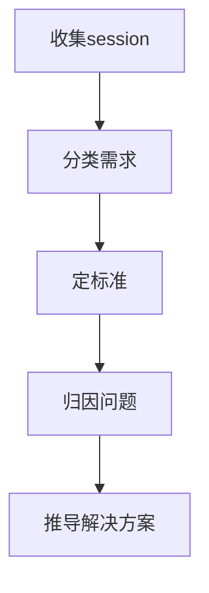

### 5. 经典金句/数据
> “策略产品经理因指标而生，也因指标的达成而体现价值。”
> “决定搜索上限的并不是算法和策略，而是内容。”

---

## 第11章：用户画像
### 1. 核心论点
本章解决“如何从0到100构建用户画像系统”的问题。作者认为，用户画像是一个多层级、多维度的标签树，用于全面刻画用户。标签分为直采型、统计型、挖掘型、预测型。构建思路从框架设计（8个维度）到逐步完善（基于统计、营销、算法三大用途）。单个标签的生产需经过定义、行为获取、模型设计、计算、评估。最后介绍效果验收方法（算法指标、分布验证、交叉验证、抽样评测）和注意事项（MVP机制、时间用法）。

### 2. 关键概念/事件
- **用户画像**：以用户标志为主key的标签树，用于全面刻画用户的属性和行为信息。
- **标签类型**：直采型（直接采集）、统计型（规则统计）、挖掘型（算法挖掘）、预测型（算法预测，如流失概率）。
- **画像框架8维度**：基本属性、平台属性、行为属性、产品偏好、兴趣偏好、敏感度、消费属性、用户生命周期及用户价值。
- **标签生产流程**：标签定义 → 用户行为获取（内容结构化、数据质量检查） → 模型设计 → 标签计算 → 标签评估。
- **案例一**：类目偏好标签（算法标签的一般生产流程：标注数据→训练集建模→测试集验证→画像加工）。
- **案例二**：宠物行业偏好标签（加入内容标签的用户标签生产流程：内容标签制作→用户标签模型设计）。
- **效果验收**：算法指标（AUC）、分布验证、交叉验证、抽样评测。
- **MVP测试机制**：用最小可行性工具快速验证标签效果。

### 3. 逻辑推演/叙事脉络
先介绍用户画像的基本概念、标签类型和生命周期管理。然后给出从0到1的框架设计（8个维度）和从1到100的完善思路（基于统计、营销、算法三大用途）。接着详细讲解单个标签的生产流程，并通过两个案例（类目偏好算法标签、宠物行业偏好加入内容标签）展示实操。最后介绍效果验收方法和注意事项（MVP机制、时间用法）。

### 4. 流程图
#### 用户画像整体架构示例
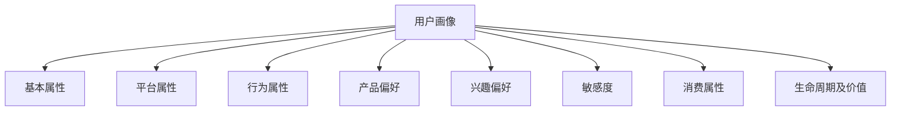

#### 算法标签生产流程

### 5. 经典金句/数据
> “画像是标签的总成，用户标签是具体刻画用户的结构化信息。”
> “画像不是目的，而是手段。画像本身不能独立产生业务价值。”
> “用户画像系统既可以支持推荐、广告、push等营销类场景，也可以支持产品部加强对市场和用户的洞察。”

---

## 后记：一个老数据人的杂谈
### 核心论点
数据产品经理入行门槛高，但可通过主动实践（从小厂或传统企业转型、与程序员合作、使用开源或阿里Dataphin、与业务搭伙）积累经验。成长路线：初级阶段（数据仓库、报表、Excel分析）→ 中级阶段（增长策略、搜索/推荐/广告）→ 高级阶段（行业级思维、梯队建设）。

### 关键概念/事件
- **入行建议**：大厂难进，可先从小厂或传统企业（手机厂商、房地产商）积累经验。
- **成长路线**：
  - 初级（2年以内）：数据仓库、指标报表、Excel分析。
  - 中级（2-3年）：增长策略、搜索/推荐/广告、分析体系。
  - 高级：行业级解决方案、数据产品梯队建设。
- **实践方法**：
  - 数据仓库方向：与程序员搭伙，或用阿里Dataphin。
  - 报表方向：与业务配合搭建漏斗和分层模型。
  - 策略方向：与运营搭伙，沉淀增长方法论。
- **推荐书籍**：《产品逻辑之美》《推荐系统实践》。

### 经典金句
> “数据产品经理是最近几年才独立出来的岗位，真正设立这个岗位的公司并不多。”
> “虽然如今数据产品经理越来越火，需求也不断增多，但是要拿到好职位还是非常难的。”