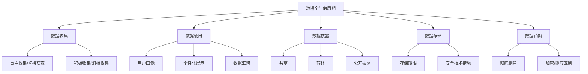
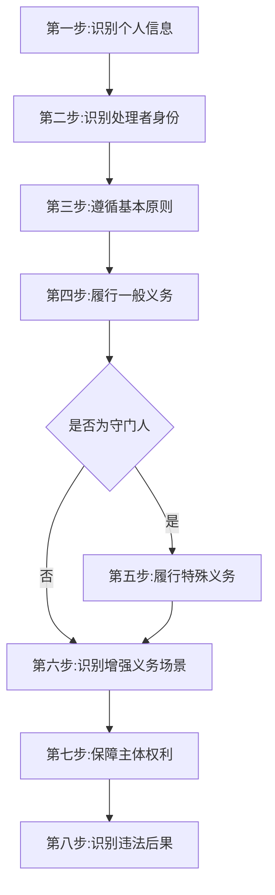
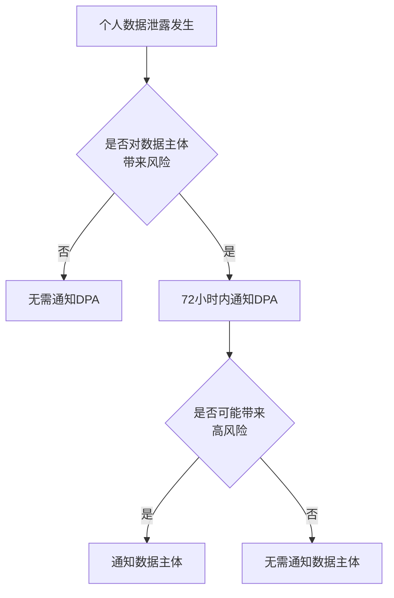
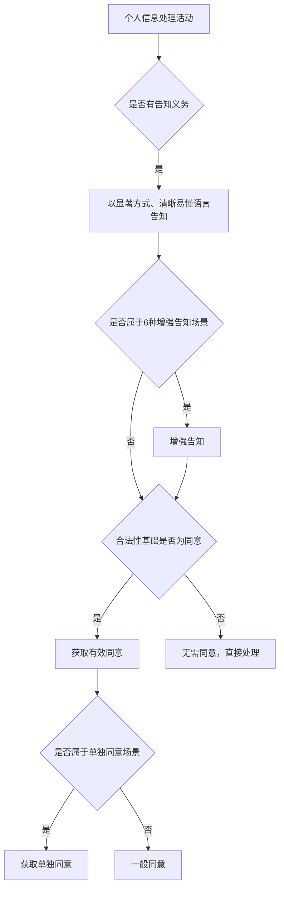
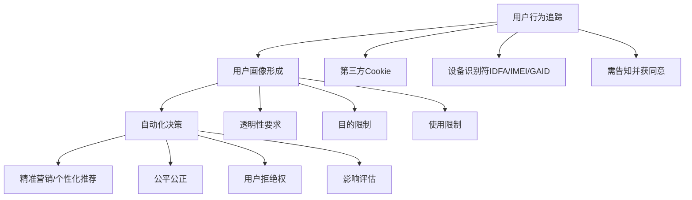
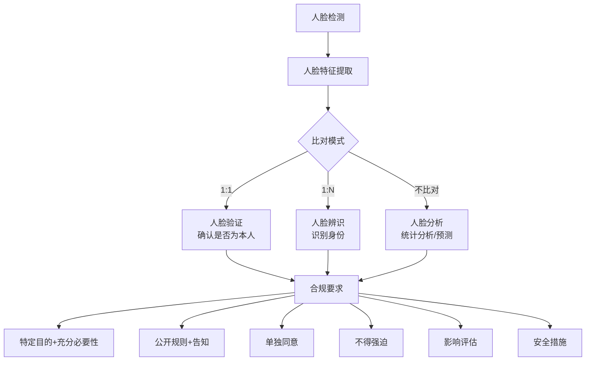
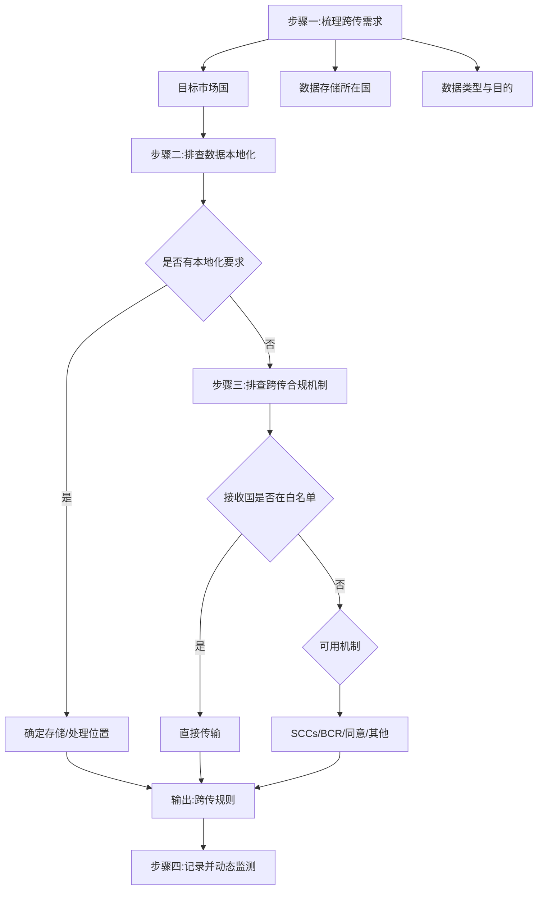
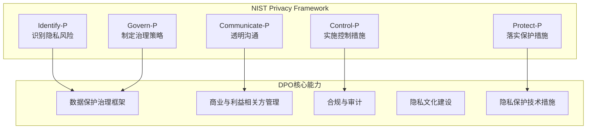

# 《数据合规：入门、实战与进阶》章节总结

## 书籍信息
- **书名**：数据合规：入门、实战与进阶
- **作者**：孟洁、薛颖、朱玲凤
- **出版社**：机械工业出版社
- **出版年份**：2022年
- **PDF状态**：可识别（基于扫描文本）
- **OCR状态**：存在部分识别偏差（如个别文字模糊），但整体结构完整

## 目录说明
- **目录识别情况**：完整，共十六章，分为开篇、入门篇、进阶篇、高阶篇及附录
- **章节对应依据**：严格依据原书目录层级
- **内容说明**：该书以“白晓萌萌”的成长为主线，系统介绍数据合规的入门知识、进阶场景及高阶挑战

## 全书核心主题
本书通过虚构人物“白晓萌萌”的成长历程，系统梳理了数据合规领域的基础概念、核心法规、典型场景和高级挑战。核心主题包括：个人信息的定义与全生命周期管理、全球主要法域（中国、欧盟、美国）的立法体系与监管要求、“告知同意”规则、隐私政策开发、账号注销、员工信息保护、精准营销与个性化推荐、数据共享与交易、人脸识别合规、数据跨境传输、企业上市中的数据合规准备，以及数据合规律师的职业发展路径。

---

## 开篇 小白入职“数据合规”法务岗位，一头雾水怎么办

### 核心论点
本章为全书导引，提出新人进入数据合规领域的核心问题：管哪些数据、管哪些事儿、怎么做合规、有哪些底线。作者强调，理解基础范畴和合规红线是入门难点，决定了后续工作的有效性。

### 关键概念/事件
- **数据合规三问**：管哪些数据、管哪些活动、如何做合规
- **白晓萌萌角色**：新人律师，从零开始成长
- **升级打怪之路**：全书以成长脉络展开

### 逻辑推演
开篇设定主角“白晓萌萌”入职互联网公司法务部，被指定负责数据合规。她面临不知如何下手的困境。作者借其视角提出三个核心问题：要管哪些数据、要管数据的哪些事儿、数据合规岗位通常需要做哪些事。通过这些问题，引出后续各章内容。

---

## 第一章 “数据合规”都管哪些事儿

### 核心论点
本章界定数据合规的核心客体——**个人信息**，并明确需覆盖**数据全生命周期**（收集、使用、存储、披露、销毁）。作者强调，数据合规不仅是法律文本工作，还需与技术、管理、政策研究结合。

### 关键概念/事件
- **个人信息**：以电子或其他方式记录的与已识别或可识别的自然人有关的各种信息，不包括匿名化处理后的信息
- **敏感个人信息**：一旦泄露或非法使用，易导致人格尊严受损或人身、财产受危害的信息（如生物识别、医疗健康、行踪轨迹等）
- **匿名化 vs 去标识化**：匿名化后信息不再属于个人信息；去标识化后仍属于个人信息
- **隐私 vs 个人信息**：隐私核心是“私密性”，个人信息核心是“可识别性”，二者存在重叠但不同
- **数据全生命周期**：收集、使用、存储、披露、销毁五个阶段
- **数据合规四大工作模块**：政策研究、合规评估（个人信息保护影响评估）、管理体系、技术措施

### 逻辑推演
作者首先通过业务访谈引出“用户数据”“个人信息”“隐私”三个术语的混用问题，然后从法律规定出发定义“个人信息”，并辨析其与隐私、匿名化/去标识化的关系。接着，以数据全生命周期为框架，逐一说明各阶段的风险点和合规要点。最后，结合《个人信息保护法》规定的企业义务，将数据合规工作拆解为政策研究、评估、管理、技术四大模块，并明确各部门的协作关系。

### 方法流程图

### 经典金句/数据
> “个人信息是以电子或者其他方式记录的与已识别或者可识别的自然人有关的各种信息，不包括匿名化处理后的信息。” (p.13)

> “隐私是自然人的私人生活安宁和不愿为他人知晓的私密空间、私密活动、私密信息。” (p.14)

> “敏感个人信息是一旦泄露或者非法使用，容易导致自然人的人格尊严受到侵害或者人身、财产安全受到危害的个人信息。” (p.13)

---

## 第二章 数据合规之避坑预警

### 核心论点
本章识别数据合规领域的常见“雷区”，分为**产品端在线协议**和**内部管控**两大维度。作者认为，提前识别风险并建立制度性防控措施，比事后“灭火”更重要。

### 关键概念/事件
- **产品端雷区**：隐私政策抄袭、告知不充分、存储期限不明确、更新机制缺失
- **内部管控雷区**：部门职责不清、权限控制缺失、第三方协议不完备、安全事件响应不规范
- **关键岗位背景调查**：HR需核验员工背景，避免违规任职
- **数据安全事件应急流程**：事前（预案/演练）→事中（补救/通知）→事后（复盘/追责）

### 逻辑推演
作者从“业务先行”的现实问题出发，指出产品端在线协议是最危险的雷区。然后分别梳理外部协议（用户协议、隐私政策、儿童保护声明）的起草要点，以及内部管控的七大危险源及对应解决方案。最后强调，合规工作需要制度性保障而非临时“救火”。

### 方法流程图

### 经典金句/数据
> “在线协议在一定程度上代表公司的合规脸面。” (p.27)

> “一份证书是无法挡住攻击者的攻击的。” (p.31)

---

# 入门篇 对症下药，小白必知的合规要求

## 第三章 我国数据合规立法体系与监管要求

### 核心论点
本章系统梳理中国数据合规立法体系的**综合性、创新性、多层级性**三大特点，并对比不同法律法规对“个人信息”定义的差异。作者强调，国家标准虽非法律，但已成为执法重要参考。

### 关键概念/事件
- **立法三大特点**：综合性（网络运营+数据安全）、创新性（等保制度、关键信息基础设施）、多层级性（法律→行政法规→部门规章→国家标准）
- **个人信息定义演进**：从《网络安全法》到《个人信息保护法》，从“识别自然人身份”扩展为“与已识别或可识别的自然人有关”
- **三个常见误区**：个人信息不一定识别“你是谁”、个人信息不一定等于隐私、脱敏手机号仍属个人信息
- **数据出境法规**：《个人信息出境安全评估办法（征求意见稿）》→《数据出境安全评估办法（征求意见稿）》
- **App合规核心文件**：《App违法违规收集使用个人信息行为认定方法》《常见类型App必要个人信息范围规定》

### 逻辑推演
作者从立法机构层级出发，按时间轴梳理2017-2022年的核心法规。然后对比《网络安全法》《民法典》《个人信息保护法》对个人信息的定义差异，指出三个常见误区。接着分析数据出境和App合规两个重点领域的法规演进。最后通过七个典型案例（年度账单事件、爬虫违法、员工泄密、庞先生案等）说明违规后果。

### 经典金句/数据
> “个人信息能够识别出‘特定’个人，无论是识别出该特定自然人的身份（你是谁），还是只识别出一个自然人的行为活动（做了啥）、终端设备（用的啥）等。” (p.49)

> “直到目前为止，我国数据合规领域的立法体系呈现出‘下位阶支撑上位阶’的特点。” (p.37)

---

## 第四章 如何让《个人信息保护法》在业务中落地

### 核心论点
本章提供《个人信息保护法》落地的**八步法**：识别个人信息→识别主体身份→遵循基本原则→遵守一般义务→遵守特殊义务（守门人）→履行增强义务→保障主体权利→识别违法后果。作者强调，场景化识别和分步落实是关键。

### 关键概念/事件
- **八步法框架**：覆盖从数据识别到违法后果的全流程
- **处理者三类**：一般处理者、守门人处理者（大型互联网平台）、受托处理者
- **合法性基础7种**：同意、合同必需、法定义务、紧急情况、公共利益、已公开信息、法律规定的其他情形
- **单独同意5种场景**：向其他处理者提供、公开个人信息、公共场所人脸识别、处理敏感信息、数据出境
- **个人信息保护影响评估**：需评估的5种场景，评估报告保存至少3年
- **数据可携权**：有限的可携权，需符合网信部门规定
- **双罚制**：企业罚款+个人罚款，最高上一年度营业额5%

### 逻辑推演
作者以《个人信息保护法》生效为背景，提出“八步法”落地框架。第一步是识别个人信息及敏感个人信息；第二步是识别企业属于一般处理者、守门人还是受托处理者；第三步是遵循七大基本原则；第四步是履行一般义务（制度、技术、组织措施）；第五步是守门人的四项特殊义务；第六步是特定场景的增强义务（单独同意、敏感信息、影响评估、自动化决策、跨境传输）；第七步是保障个人信息主体的九项权利；第八步是识别违法后果的阶梯性规定。

### 方法流程图

### 经典金句/数据
> “《个人信息保护法》下的‘个人信息’是非常宽泛的，既能够从‘个人’指向‘信息’，也包括从‘信息’直接识别或结合识别到‘个人’。” (p.62)

> “同意规则在两个层面极大丰富了：从外延上扩充了无需‘同意’的其他合法性基础；从内涵上明确了同意规则的一系列要件。” (p.67)

---

## 第五章 欧盟数据保护立法体系与监管要求

### 核心论点
本章介绍欧盟GDPR的核心架构：**7项数据处理原则、6种合法性基础、8项数据主体权利、两级罚款制度**。作者指出，GDPR的“可问责性”原则（Accountability）是其核心特征。

### 关键概念/事件
- **GDPR适用范围**：营业地标准 + 针对性标准（向欧盟用户提供服务/监控行为）
- **7项数据处理原则**：合法性/合理性/透明性、目的限制、数据最小化、准确性、限期存储、完整性与保密性、可问责性
- **特殊类别个人数据**：种族、政治观点、宗教信仰、工会成员、健康、性取向、遗传数据、生物特征数据
- **数据保护官（DPO）**：大规模处理特殊类别数据或系统性监控时须任命
- **标准合同条款（SCCs）**：跨境传输的常用机制，Schrems II案后需补充评估
- **WhatsApp被罚2.25亿欧元**：因未满足透明性要求，涉及非注册用户数据处理、信息质量不足等问题

### 逻辑推演
作者从GDPR的立法背景出发，说明其取代《数据保护指令》并直接适用于所有成员国。然后介绍监管机构体系（EDPB、DPA、EDPS），再分别说明实体范围、地域范围、7项原则、6种合法性基础、重要定义、8项主体权利、隐私声明要求、直接营销规则、数据共享规则、儿童保护、可问责性措施（DPIA、记录、DPO）、跨境传输机制、安全事件通知。最后通过WhatsApp被罚2.25亿欧元的案例，深入解析透明性要求的实践标准。

### 方法流程图

### 经典金句/数据
> “匿名化是一个法律概念，不能仅仅通过技术上的判断得到认定。” (p.94) —— WhatsApp案启示

> “履行透明性原则应当考虑用户‘会不会困惑’‘能不能理解应当告知的内容’，以及‘能不能顺利地行使自己的权利’。” (p.94)

---

## 第六章 美国数据保护立法体系及监管要求

### 核心论点
本章介绍美国**无联邦统一隐私法**的特色，以CCPA/CPRA为核心，强调FTC的执法权力和消费者权利的强化。作者指出，美国法律更侧重“消费者权益保护”而非“个人信息保护”。

### 关键概念/事件
- **联邦层面零散立法**：GLBA（金融）、HIPAA（医疗）、FCRA（信用）、COPPA（儿童）、ECPA（电子通信）
- **州层面**：CCPA（2020）、CPRA（修正CCPA）、弗吉尼亚、科罗拉多、犹他州法案
- **CCPA核心权利**：知情权、删除权、选择退出权（不出售个人信息）、免受歧视权、访问权、数据携带权
- **FTC执法**：基于《联邦贸易委员会法》第5条（禁止不公平或欺骗行为）
- **Facebook-剑桥分析案**：50亿美元罚款 + 整改要求
- **Equifax案**：1.47亿人数据泄露，和解金至少5.75亿美元

### 逻辑推演
作者从联邦与州两个层级展开：联邦层面无统一立法，各行业有专门法律，FTC为主要执法机构；州层面以CCPA为代表，赋予消费者多项权利。然后详细说明CCPA的适用范围（年收入超2500万美元等）、个人信息定义、主体权利、隐私声明要求。接着介绍直接营销规则（反垃圾信息法、电话消费者保护法）、儿童保护（COPPA）、安全事件通知。最后通过Facebook和Equifax两个案例说明执法力度。

### 经典金句/数据
> “FTC执法手段包括罚款、强制执行完善隐私和安全制度、禁止使用个人信息、要求企业赔偿消费者损失、删除非法获取的消费者信息。” (p.99)

> “Facebook与FTC达成50亿美元罚款的和解协议。” (p.104)

---

# 进阶篇 不得不知，小白最常遇到的普通场景

## 第七章 “告知同意”就是用户“点击同意隐私政策”吗

### 核心论点
本章拆解“告知同意”规则为**独立的“告知”义务和“同意”规则**。作者认为，告知适用的场景远多于同意，而同意规则的核心变化是：从唯一的合法性基础变为多种合法性基础之一，并引入“单独同意”破解一揽子授权。

### 关键概念/事件
- **告知规则**：处理前以显著方式、清晰易懂语言告知；一般性告知内容+6种增强告知场景
- **合法性基础7种**：同意、合同必需、法定义务、紧急情况、公共利益、已公开信息、法律规定的其他
- **同意通用要件**：充分知情、自愿、明确；可便捷撤回
- **单独同意5种场景**：向其他处理者提供、公开、公共场所人脸识别、处理敏感信息、数据出境
- **撤回同意的效果**：不溯及既往，但触发删除义务

### 逻辑推演
作者首先回顾“告知同意”规则在中国法中的法典化历程（1.0→2.0→2.5→3.0）。然后区分“告知”和“同意”两个独立规则：告知是前提，适用于所有处理活动；同意只是7种合法性基础之一。接着详细阐述告知的方式要求、一般性内容、6种增强告知场景和豁免情形。再阐述同意的通用要件（充分知情、自愿、明确）、变更场景要求、撤回机制、儿童监护人同意。最后重点分析“单独同意”的增强要求（告知强化、颗粒度小、动作主动）及其5种法定情形，并通过iOS ATT框架示例说明产品端落地。

### 方法流程图

### 经典金句/数据
> “告知规则的适用范围要远大于‘同意’规则。” (p.113)

> “单独同意能够有力破解‘一揽子授权’的困境。” (p.119)

> “无论何时都不能把‘告知同意’规则提升为个人信息处理的‘帝王’规则，尤其是不能在任何意义上代替、减弱‘必要性’原则。” (p.123)

---

## 第八章 隐私政策不能抄！那该怎么办

### 核心论点
本章将隐私政策定位为**法律侧代码**，必须与产品技术代码（功能设计）适配。作者提出隐私政策开发的五步法：尽调→评估→文本+界面设计→上线布放→迭代更新。

### 关键概念/事件
- **隐私政策的法律性质**：兼具公法（履行公示义务）和私法（服务合同条款）意义
- **三大认知误区**：可以抄、写完发给技术即可、上线后不用管
- **隐私政策开发五步法**：尽调→影响评估→文本+设计→上线布放→迭代更新
- **“3W+H”法**：Who（谁处理）、What（收集什么）、Where（存储/传输到哪里）、How（如何收集/使用/保护）
- **Code is Code**：技术侧代码决定法律侧代码，隐私政策必须适配产品功能

### 逻辑推演
作者首先回应“隐私政策为什么不能抄”的问题，从法律性质（公法+私法）和多层作用（toC/toG/toB）说明其必要性。然后列举隐私政策的规范性要求（正面清单+负面清单）和基本架构。接着强调隐私政策的交互落地页设计比文本本身更能触达用户。最后详细阐述五步开发流程：前置问题（如单一政策还是集团政策）→尽调（数据流摸排）→影响评估→文本+界面设计→上线布放与测试→在线版本更新。

### 方法流程图

### 经典金句/数据
> “产品不同，说明书就不同；业务不同，合同也就不同。因此，隐私政策不仅不能直接从网上摘抄而成，也并非由法务或律师自行编写。” (p.128)

> “汝果欲学诗，功夫在诗外。” (p.139)

---

## 第九章 账号注销，落实起来不容易

### 核心论点
本章强调**账号注销是用户法定权利**，企业必须提供便捷的注销入口和流程。作者指出，注销后的数据删除/留存是高风险区，需平衡删除义务和法定留存要求。

### 关键概念/事件
- **法律依据**：《消费者权益保护法》《电子商务法》《电信和互联网用户个人信息保护规定》《个人信息保护法》
- **注销条件设置**：身份核验条件 + 账号状态条件，但不得设置不合理条件
- **多账号体系处理**：中心账号 vs 单一应用账号，需提供不同注销方式
- **注销应答期限**：15个自然日内受理，15个工作日内完成处理
- **法定数据留存**：不同行业有不同留存期限要求（电商3年、网络日志6个月、病历15-30年等）
- **后注销义务**：删除或匿名化数据 + 隔离存储留存数据 + 不再使用

### 逻辑推演
作者先回应“企业是否必须允许注销”的问题，列举法律依据和执法案例。然后针对多产品共用账号、无独立账号体系等复杂场景给出解决方案。接着详细分析注销流程中的常见难点：产品端交互页面设计、注销条件的合理设置（避免“不必要或不合理”条件）、应答期限要求。最后重点讨论注销后的数据处置：删除义务、法定留存要求（表格列举各行业留存期限）、技术上难以删除的处理、消极义务（隔离存储、不再使用）。

### 经典金句/数据
> “确保用户注销账号的权利，这个必须有。” (p.142)

> “用户在前台完成注销后，企业对用户账号下数据的删除和留存乃是另一个高风险区。” (p.152)

---

## 第十章 员工个人信息保护，这事儿不能忘

### 核心论点
本章按员工入职流程（投递→面试→入职→在职→离职）逐一分析个人信息保护风险点。作者强调，雇用欧盟/加州员工还需遵守GDPR/CCPA的额外要求。

### 关键概念/事件
- **简历投递**：自主提供视为授权；第三方获取需核实来源合法性
- **入职阶段**：体检报告需书面授权；合同需明确双方数据保护义务；门禁打卡（指纹/人脸）需单独同意
- **工作中产生的信息**：向第三方提供需员工明示同意
- **特殊场景**：配合执法需书面文件；内部核查需提前在劳动合同/员工手册中授权
- **欧盟员工**：GDPR适用条件（员工位于欧盟境内）；需注意“同意”有效性（雇佣关系不平等）
- **H&M被罚3530万欧元**：过度收集员工信息、非法监控隐私

### 逻辑推演
作者按照员工进入公司的正常流程：简历投递→面试→入职（体检、合同签署、规章制度、门禁打卡）→工作中产生的信息→特殊行业监控→违法情形处理，逐一分析各环节的风险点和合规要点。然后分别讨论雇用欧盟员工（GDPR适用条件、合法利益作为合法性基础）和加州员工（CCPA的知情权、删除权、选择退出权、不得差别对待）的额外要求。最后说明境外分支机构雇员的适用规则。

### 经典金句/数据
> “在GDPR体系下，在雇用关系场景中，企业以员工同意作为唯一基础处理个人信息可能会存在合规风险，因为员工可能会迫于职位的压力或其他不得已的原因做出同意。” (p.161)

> “H&M被罚约3530万欧元。” (p.161-162)

---

# 高阶篇 见招拆招，小白化身数据合规专家应对高难场景

## 第十一章 更懂你的精准营销和个性化推荐

### 核心论点
本章拆解精准营销和个性化推荐的**技术原理与合规要求**。作者指出，核心风险在于：用户行为追踪（跨站/跨App）、用户画像形成、自动化决策、复杂的数据供应链。合规重点是透明性、用户控制权、算法公平。

### 关键概念/事件
- **用户行为追踪**：通过第三方Cookie、设备识别符（IDFA/IMEI/GAID/OAID）实现跨站/跨App追踪
- **用户画像**：收集、汇聚、分析个人信息，形成个人特征模型的过程
- **自动化决策**：通过计算机程序自动分析评估，进行决策的活动（《个人信息保护法》定义）
- **程序化广告**：通过DSP、SSP、DMP等多方参与的实时竞价广告，个人信息在众多参与方间传输
- **数据供应链角色**：需区分数据控制者和数据处理者，责任不同
- **算法风险**：歧视/杀熟、操纵、信息茧房/回声效应
- **意大利Foodinho案**：因未告知算法逻辑、违反公平原则、自动化决策无人工审查被罚260万欧元

### 逻辑推演
作者首先以“约翰和艾玛的一天”故事说明精准营销的运作流程。然后分析三个核心环节：用户行为追踪（第三方Cookie、设备识别符）、用户画像与自动化决策（透明性要求、目的限制、使用限制、公平公正要求、影响评估）、数据供应链（程序化广告中多参与方的数据控制者/处理者认定）。接着分析个性化推荐的特殊合规要求（透明度、显著区分、退出机制、画像自主控制）。最后深入算法风险的本质——算法本身无好坏，需规制的是构建算法的人，并介绍《算法推荐管理规定》的核心要求。

### 方法流程图

### 经典金句/数据
> “算法没有好坏的根本原因：算法仅在意目标和指令，而无法对解决问题负责；算法不能对数据负责。” (p.191)

> “规制算法的核心在于规制构建算法的人。” (p.191)

---

## 第十二章 数据要素效能发挥：数据共享与交易

### 核心论点
本章分析数据共享与交易的三大障碍：**信任困局、合规风险、数据治理问题**。作者提出，隐私计算（联邦学习、安全多方计算、可信执行环境）和交易所模式是破局方向。

### 关键概念/事件
- **数据孤岛三原因**：不愿共享（产权不清）、不敢共享（法律风险）、不能共享（接口不统一）
- **共享合规核心**：用户控制权（告知+同意+撤回）、合作方可归责性、数据安全
- **三种法律关系**：委托处理、共享/转让、第三方接入，责任分配不同
- **信任困局**：数据价值难以在交易前评估，买方获知后可复制
- **隐私计算**：联邦学习（数据不出本地）、安全多方计算（密文计算）、可信执行环境（TEE硬件保护）
- **北京国际大数据交易所**：提供登记、交易、运营、资产化、科技五类服务
- **反垄断关注**：数据积累可能影响市场支配地位认定（如阿里巴巴案182亿罚款）

### 逻辑推演
作者从数据作为生产要素的宏观背景出发，指出数据孤岛问题。然后分析共享/交易的合规要求：保障用户控制权（告知+同意+撤回）、明晰合作方责任（委托处理/共享/转让三种模式区分）、可归责性（尽职调查+记录+持续监控）、数据安全。接着分析信任困局的本质（信息经济学问题），并提出三种破局方案：基于信任的共享框架（新加坡PDPC模型）、第三方交易平台（北京国际大数据交易所）、隐私计算（联邦学习、安全多方计算、TEE）。最后分析平台企业的反垄断风险：数据积累本身不构成垄断，但可能影响市场支配地位认定，需防范滥用行为（拒绝交易、搭售、差别待遇）。

### 经典金句/数据
> “数据孤岛：不愿共享、不敢共享、不能共享。” (p.196)

> “信息（数据）与一般商品迥异，有着难以捉摸的特质，买方在购买前因为不了解该信息（数据）而无法确定信息的价值，而买方一旦获知该信息（数据），就可以复制，从而不会购买。” (p.202)

> “阿里巴巴被罚182亿元。” (p.206)

---

## 第十三章 生物识别技术的发展：人脸识别的恐慌与合规

### 核心论点
本章解析人脸识别的技术原理（人脸检测→特征提取→比对匹配）和合规要点。作者强调，人脸信息属于敏感个人信息，需满足**特定目的、充分必要性、单独同意、严格保护措施**四重条件。

### 关键概念/事件
- **人脸识别三种模式**：人脸验证（1:1比对）、人脸辨识（1:N比对）、人脸分析（不比对，仅特征分析）
- **关键参数**：训练数据、注册数据库、匹配阈值（阈值高低影响误报率）
- **合规要点**：特定目的+充分必要性、公开规则+告知、单独同意、不得强迫、影响评估、安全措施、不得违规共享
- **公共场所限制**：只能用于公共安全目的（《个人信息保护法》第26条）
- **3·15曝光案例**：售楼处人脸识别，未经同意收集人脸信息
- **人脸识别第一案**：杭州野生动物世界案，法院认定强制人脸识别入园侵权
- **死者近亲属权利**：《个人信息保护法》第49条 + 《人脸识别司法解释》第15条

### 逻辑推演
作者首先解析人脸识别的技术原理：人脸检测→特征提取→比对匹配（1:1验证 vs 1:N辨识）。然后映射到数据合规要求：特定目的和充分必要性、公开规则并告知、单独同意、不得强迫（保障选择权）、个人信息保护影响评估、技术安全措施（加密存储、逻辑隔离、不存储原始图像）、不得违规共享、公共场所只能用于公共安全目的。接着讨论人脸分析的侵入性风险（如通过人脸分析政治倾向）。最后分析民事责任和举证责任倒置。

### 方法流程图

### 经典金句/数据
> “在公共场所安装图像采集、个人身份识别设备，应当为维护公共安全所必需。” (p.62)

> “人脸识别第一案：法院认定强制人脸识别入园侵权。” (p.219)

---

## 第十四章 出海业务中如何跨境传输数据才不碰雷

### 核心论点
本章提出数据跨境传输的**两步排查法**：第一步判断目标市场是否有数据本地化要求，第二步判断是否符合跨境传输合规机制。作者强调，不同国家的本地化要求和传输机制差异巨大，需逐国排查。

### 关键概念/事件
- **数据本地化两种程度**：本地化存储（境内存副本）vs 本地化处理（所有处理在境内）
- **常见跨境传输机制**：充分性认定（白名单）、标准合同条款（SCCs）、BCR、同意、履行合同必需、国际协定（APEC CBPR）
- **Schrems II案**：欧盟-美国隐私盾被判定无效，SCCs仍需补充评估
- **俄罗斯案例**：公民数据必须在境内处理，违规可导致服务被禁
- **三步走路线图**：梳理需求→制定传输规则→记录并动态监测

### 逻辑推演
作者从LinkedIn在俄罗斯被禁的案例出发，提出数据跨境传输的两道“雷”：数据本地化和跨境传输合规机制。第一步使用排查清单判断目标市场是否有数据本地化要求（数据型别、严苛程度、违法后果）。第二步分析跨境传输的常见机制：充分性认定（白名单）、标准合同条款（SCCs，Schrems II案后需补充评估）、国际协定（APEC CBPR）、同意、履行合同必需、重大利益、公共利益。最后给出三步走路线图：梳理跨传需求→制定传输规则（结合本地化要求和传输机制）→记录并动态监测。

### 方法流程图

### 经典金句/数据
> “数据跨境传输的两道‘雷’：数据本地化和跨境传输合规机制。” (p.226)

> “Schrems II案：欧盟-美国隐私盾被判定无效。” (p.233)

---

## 第十五章 企业上市中的数据合规：全面布局

### 核心论点
本章梳理证监会对拟上市企业数据合规的**审核要点**，包括数据收集合法性、商业化变现合规性、内控制度、安全措施、事件响应等。作者强调，数据合规已成为IPO的“必答题”。

### 关键概念/事件
- **审核高频问题**：数据收集合法性、商业化变现合规性、内控制度、安全措施、数据泄露事件、App整改情况
- **不同行业关注点**：App/SDK运营者（过度收集、SDK风险）、AI/IoT（隐私泄露）、大数据公司（数据来源合法性）、IDC/云服务（安全制度）、金融（财产信息保护）
- **个人信息维度**：全生命周期合规、主体权利保障（尤其账号注销）、安全能力建设（等保、权限控制、加密）、事件响应、内部制度（隐私政策+第三方协议）
- **重要数据维度**：业务连续性、组织人员、数据安全治理、密码安全、风险评估、安全事件、投诉举报
- **网络安全审查**：掌握超100万用户信息的平台赴国外上市须申报
- **天气App IPO被否**：首例因数据合规问题被否的案例

### 逻辑推演
作者以天气App IPO被否为引，说明数据合规已成上市审核核心问题。然后按行业类型（App/SDK、AI/IoT、大数据、IDC/云、金融）分别梳理关注重点。接着从两条主线展开：个人信息维度（全生命周期合规、主体权利、安全能力、事件响应、制度协议）和重要数据维度（业务连续性、组织人员、安全治理、密码安全、风险评估、投诉举报）。最后说明上市后的合规保健：定期更新政策、落实内控制度、开展培训评估，并强调网络安全审查要求（超100万用户赴国外上市须申报）。

### 经典金句/数据
> “数据合规不再是IPO的加分项，而是实实在在的必得分项。” (p.240)

> “掌握超过100万用户个人信息的网络平台运营者赴国外上市的，必须向网络安全审查办公室申报网络安全审查。” (p.250)

---

## 第十六章 月薪10万元是个小目标：职业跨越式发展

### 核心论点
本章提出数据合规律师的**两条职业路径**：深耕法律专业 vs 跨界成为数据保护官（DPO）。作者认为，DPO需要五项核心能力：数据保护治理框架、商业与利益相关方管理、合规与审计、隐私文化建设、隐私保护技术措施。

### 关键概念/事件
- **两条路径**：法律专业深耕 vs 技能组合跨越
- **亚当斯模型**：将两项技能练到世界前25%并组合，可取得卓越成就
- **DPO法定职责**（《个人信息保护法》第52条）：监督个人信息处理活动及保护措施
- **NIST Privacy Framework**：Identify-P、Govern-P、Control-P、Communicate-P、Protect-P五大模块
- **隐私文化构建**：公司隐私日、新员工培训、专业知识讲座
- **PrivacyOps**：Securiti.ai的七模块解决方案
- **新加坡PDPC DPO能力模型**：数据治理、数据共享、设计考量

### 逻辑推演
作者从数据合规行业的人才背景多样化出发，提出两条职业路径：一是深耕法律专业，专注数据合规法务/律师；二是跨界成为数据保护官（DPO）。引用亚当斯“技能组合”理论，说明DPO需要将法律、管理、技术多项技能组合。然后详细介绍DPO的职责范围和五项核心能力：数据保护治理框架（如NIST Privacy Framework）、商业与利益相关方管理、合规与审计、隐私文化建设、隐私保护技术措施（如PrivacyOps、隐私计算）。最后展望数字化转型和人工智能时代对DPO的更高要求：促进数据驱动创新。

### 方法流程图

### 经典金句/数据
> “如果可以选择两项技能，每项技能练就达到世界前25%的水平，然后将这两项技能组合起来做一件事，就可能取得了不起的成就。” (p.258)

> “DPO应当具备促进数据驱动创新的能力。” (p.263)

---

## 附录

### 附录A 名词解释
> 说明：该部分PDF识别不完整，以下内容基于可见文本整理。

包含数据合规领域的核心术语定义，如个人信息、敏感个人信息、匿名化、去标识化、数据控制者、数据处理者等。

### 附录B 与数据保护相关的常用法规、规章与规范性文件
> 说明：该部分PDF识别不完整，以下内容基于可见文本整理。

按层级整理：法律（《网络安全法》《数据安全法》《个人信息保护法》《民法典》《电子商务法》等）、行政法规、部门规章、国家标准（GB/T 35273-2020等）。

### 附录C 数据保护领域单行专项法律
> 说明：原文标注“详细内容将作为线上资源提供”，PDF中仅有目录。

### 附录D 综合性法律中的数据保护专条
> 说明：该部分PDF识别不完整，以下内容基于可见文本整理。

收录《民法典》《刑法》《消费者权益保护法》《电子商务法》《网络安全法》等综合性法律中涉及数据保护的专门条款。

### 附录E 关于数据本地化和出境要求的规范汇总
> 说明：该部分PDF识别不完整，以下内容基于可见文本整理。

按领域分层：水平层面（《网络安全法》《个人信息保护法》《数据安全法》《数据出境安全评估办法（征求意见稿）》等）、医疗健康、金融审计、气象地理、电信服务、交通出行、其他。

---

## 后记

### 核心内容
作者致谢：感谢机械工业出版社华章分社的杨洁老师；感谢协助成稿的同事；感谢业务线同事的提问和反馈；感谢家人的支持；感谢周汉华老师的指导。作者表示，数据合规领域仍在快速发展，期待读者指正。

### 经典金句/数据
> “怕什么真理无穷，进一寸有进一寸的欢喜。” (p.9) —— 自序引语

> “成书亦为终章，亦为起点。” (p.265)