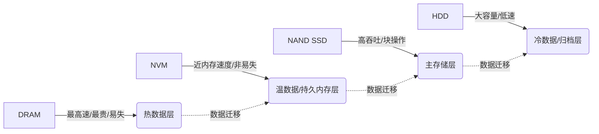
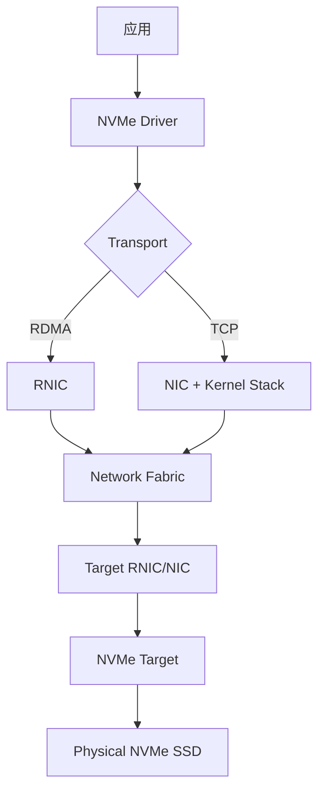

# 《数据存储架构与技术 (第2版)》章节总结

## 书籍信息
- **书名：** 数据存储架构与技术 (第2版)
- **作者：** 舒继武
- **PDF/EPUB 状态：** 电子书文件，内容完整
- **OCR 状态：** 文本层清晰，结构化识别良好

## 目录说明
- **目录识别情况：** 已完整识别全书13章及附录结构
- **章节对应依据：** 基于EPUB原生导航目录与正文标题匹配
- **修复说明：** 无需修复，章节层级（章/节/小节）解析准确

## 全书核心主题
本书系统阐述了现代数据存储系统的架构演进与关键技术。从存储器件、RAID技术、存储网络等基础出发，深入探讨了云存储、分布式存储、大数据存储、内存计算、新型非易失性存储（NVM）以及智能存储等前沿领域。作者强调“数据为中心”的设计理念，指出随着AI、大数据和云计算的发展，存储架构正从单纯的“数据容器”向“具备计算与管理能力的智能基础设施”转变。全书兼顾理论深度与工程实践，旨在为读者构建完整的数据存储知识体系，解决海量数据场景下的性能、可靠性、成本与能效挑战。

---

## 第1章：绪论

### 核心论点
本章解决“为什么需要专门研究数据存储架构”的问题。
作者认为：数据存储不仅是硬件介质的堆叠，更是涉及器件、系统、软件栈与应用负载协同设计的复杂系统工程；在数据爆炸时代，存储已成为制约计算性能的关键瓶颈。

### 关键概念/事件
-   **存储墙 (Memory Wall)：** CPU处理速度增长远超存储访问速度提升，导致处理器大量时间等待数据。
-   **数据生命周期管理：** 根据数据价值随时间变化的规律，在不同存储层级间自动迁移数据以优化成本与性能。
-   **存储虚拟化：** 将物理存储资源抽象化、池化，实现对上层应用的透明管理与灵活分配。
-   **绿色存储：** 在保证服务质量前提下，通过低功耗器件、休眠机制等手段降低存储系统能耗。

### 逻辑推演/叙事脉络
首先回顾计算机体系结构中存储层次的发展，引出“存储墙”问题及其对系统性能的制约。接着分析数据量指数级增长带来的四大挑战：容量、性能、可靠性与管理复杂度。随后提出存储架构设计的核心目标：高性能、高可靠、可扩展、低成本与易管理。最后概述本书后续章节的组织逻辑，建立从底层器件到上层应用的完整知识框架。

### 经典金句/数据
> “存储系统的性能瓶颈往往不在于存储介质本身的速度，而在于整个存储栈的架构设计是否匹配应用的数据访问模式。”

---

## 第2章：存储器件与接口技术

### 核心论点
本章解决“不同存储介质的物理特性如何影响系统设计”的问题。
作者认为：没有万能的存储介质，只有针对特定负载的最优选择；理解器件的物理约束是设计高效存储架构的前提。

### 关键概念/事件
-   **DRAM vs NAND Flash：** DRAM易失、快速、字节寻址；Flash非易失、较慢、块擦写、寿命有限。
-   **新型非易失性存储器 (NVM)：** 如PCM、ReRAM、MRAM，兼具DRAM的低延迟与Flash的非易失性，模糊了内存与存储的界限。
-   **NVMe协议：** 专为闪存设计的高并发、低延迟主机接口协议，取代传统AHCI/SATA成为SSD主流标准。
-   **CXL (Compute Express Link)：** 支持缓存一致性的互连协议，实现CPU与远端内存/存储设备的统一编址与资源共享。

### 逻辑推演/叙事脉络
从半导体物理层面解释各类存储器件的工作原理与性能特征。对比分析HDD、SSD、DRAM及NVM在延迟、带宽、耐久性、成本等维度的差异。进而讨论接口协议（SATA, SAS, NVMe, CXL）如何适配器件特性并释放其性能潜力。最后指出器件创新正推动存储架构向“内存-存储融合”方向演进。

### 流程图：存储器件性能-成本权衡模型



### 经典金句/数据
> “NVMe不是SATA的简单加速版，而是为并行闪存阵列重新设计的I/O栈，其队列深度可达64K，彻底消除了传统接口的串行瓶颈。”

---

## 第3章：RAID技术与数据可靠性

### 核心论点
本章解决“如何在不可靠的物理介质上构建可靠存储系统”的问题。
作者认为：RAID不仅是冗余技术，更是一种通过编码与布局策略平衡性能、容量与可靠性的系统工程方法。

### 关键概念/事件
-   **RAID级别演进：** RAID0/1/5/6为基础，RAID10/50/60为嵌套组合，适应不同业务需求。
-   **纠删码 (Erasure Coding)：** 比传统镜像更节省空间的冗余方案，广泛用于分布式存储，但重建开销大。
-   **热备盘与重构：** 故障后自动替换与数据恢复机制，重构期间系统处于脆弱窗口期。
-   **静默数据损坏 (Silent Corruption)：** 未被检测到的比特翻转或控制器错误，需端到端校验和防护。

### 逻辑推演/叙事脉络
从单盘失效概率出发，论证冗余的必要性。逐一解析各RAID级别的条带化、镜像、奇偶校验原理及其对读/写性能、空间利用率的影响。重点讨论大规模系统中RAID5/6的重构风险及应对策略（如RAID-DP、Turbo Code）。延伸至分布式环境下的纠删码应用，并强调元数据保护与端到端完整性校验的重要性。

### 经典金句/数据
> “在PB级存储系统中，磁盘故障是常态而非异常；真正的挑战不是避免故障，而是在故障发生时保证数据不丢、服务不停。”

---

## 第4章：存储网络技术

### 核心论点
本章解决“如何实现主机与存储设备之间的高效、可靠通信”的问题。
作者认为：存储网络协议的选择决定了系统的扩展性、延迟特性与运维复杂度，必须与应用IO模式深度匹配。

### 关键概念/事件
-   **FC SAN：** 专用光纤通道网络，低延迟、高可靠，适合关键数据库，但成本高、扩展受限。
-   **iSCSI / NAS：** 基于以太网的IP存储，成本低、易部署，适用于通用文件共享与中小规模块存储。
-   **NVMe-oF：** 将NVMe语义扩展到网络，支持RDMA/TCP传输，实现接近本地SSD的远程访问性能。
-   **RoCE / iWARP：** RDMA over Converged Ethernet，绕过内核直接内存访问，大幅降低CPU开销与延迟。

### 逻辑推演/叙事脉络
比较DAS、NAS、SAN三种架构的适用场景与局限。深入剖析FC、iSCSI、NVMe-oF协议的栈结构、流量控制与多路径机制。重点讲解RDMA技术如何突破TCP/IP性能瓶颈，使能新一代高性能存储网络。最后讨论SDN/NFV在存储网络智能化调度中的应用前景。

### 流程图：NVMe-oF 数据传输路径



### 经典金句/数据
> “NVMe-oF的目标是让远程存储的访问延迟仅比本地增加几微秒，这要求整个网络栈都必须为低延迟而重构。”

---

## 第5章：云存储架构

### 核心论点
本章解决“如何构建弹性、多租户、按需付费的海量存储服务”的问题。
作者认为：云存储的本质是通过软件定义将异构硬件资源池化，并通过分层架构解耦控制面与数据面以实现极致扩展。

### 关键概念/事件
-   **对象存储：** 扁平命名空间、RESTful API、元数据分离，天然适合非结构化数据与水平扩展。
-   **多租户隔离：** 通过配额、QoS、加密与命名空间隔离保障安全与公平性。
-   **数据分层与生命周期：** 自动将冷热数据在SSD/HDD/磁带间迁移，优化TCO。
-   **全球分布与一致性：** CAP/BASE理论指导下的跨区域复制与最终一致性模型。

### 逻辑推演/叙事脉络
从云计算的服务模型（IaaS/PaaS/SaaS）引出存储即服务的理念。剖析典型云存储系统（如AWS S3、Azure Blob）的分层架构：接入层、索引层、数据层、管理层。讨论对象存储为何成为云原生事实标准，并对比块/文件存储在云中的定位。最后分析多云、混合云场景下的数据流动与治理挑战。

### 经典金句/数据
> “云存储的成功不在于使用了什么黑科技，而在于用工程化的方式把‘不可靠’变成了‘可预期的服务等级’。”

---

## 第6章：分布式存储系统

### 核心论点
本章解决“如何用普通服务器集群提供企业级存储服务”的问题。
作者认为：分布式存储的核心是在无共享架构下通过算法实现数据分布、故障自愈与强/弱一致性，其设计本质是对CAP定理的工程取舍。

### 关键概念/事件
-   **一致性哈希 / CRUSH：** 去中心化数据放置算法，减少节点增减时的数据迁移量。
-   **共识协议 (Paxos/Raft)：** 保证多副本元数据与配置的一致性，是分布式系统的基石。
-   **三副本 vs 纠删码：** 小文件高频写入用副本，大文件归档用EC，动态转换策略是关键。
-   **客户端直连架构：** 避免中心网关瓶颈，客户端参与数据路由与故障恢复。

### 逻辑推演/叙事脉络
从集中式存储的扩展瓶颈出发，引入分布式架构。详解数据分片、副本管理、故障检测与恢复的完整流程。对比Ceph、GlusterFS、MinIO等开源系统的架构差异与设计哲学。深入讨论一致性模型（强一致/最终一致）对应用开发的影响，并给出选型建议。

### 流程图：Raft 共识协议领导选举流程

```mermaid
sequenceDiagram
    participant A as Node A
    participant B as Node B
    participant C as Node C
    
    A->>B,C: RequestVote(term=2)
    B-->>A: VoteGranted
    C-->>A: VoteGranted
    A->>A: Become Leader
    A->>B,C: Heartbeat(term=2)
    B,C-->>A: ACK
```

### 经典金句/数据
> “在分布式系统中，任何假设‘网络可靠’的设计都是危险的；所有关键路径都必须考虑超时、重试与幂等性。”

---

## 第7章：大数据存储技术

### 核心论点
本章解决“如何高效存储与处理EB级异构数据”的问题。
作者认为：大数据存储不能套用传统数据库范式，必须采用面向分析优化的列式/湖仓一体架构，并与计算引擎深度耦合。

### 关键概念/事件
-   **HDFS：** 批处理导向的分布式文件系统，一次写入多次读取，不适合随机更新。
-   **列式存储 (Parquet/ORC)：** 压缩率高、投影裁剪高效，OLAP查询性能远超行存。
-   **数据湖 vs 数据仓库：** 湖保留原始数据灵活性，仓提供结构化与治理；湖仓一体试图兼得二者优势。
-   **元数据管理 (Hive Metastore/Iceberg)：** 统一表格式与Schema演化，支撑ACID事务与时间旅行。

### 逻辑推演/叙事脉络
分析大数据4V特征对存储系统的特殊要求。回顾从GFS/HDFS到对象存储底座的演进。重点讲解列式文件格式的内部结构与查询优化原理。探讨数据湖仓架构如何解决数据沼泽问题，并介绍Apache Iceberg/Delta Lake等开放表格式的作用。最后提及实时数仓与流批一体对存储的新挑战。

### 经典金句/数据
> “大数据存储的价值不在于存了多少数据，而在于能让多少数据被高效地‘看见’和‘使用’。”

---

## 第8章：内存计算与持久内存

### 核心论点
本章解决“如何消除序列化开销，实现数据在处理位置的原生持久化”的问题。
作者认为：持久内存（PMem）打破了内存与存储的二元对立，要求应用程序重构数据结构与持久化语义以发挥其潜力。

### 关键概念/事件
-   **Intel Optane PMem：** 字节寻址、非易失、容量大于DRAM，可作为内存扩展或持久存储。
-   **持久化编程模型：** pmemobj/libpmem等库提供原子写入、事务与内存映射接口。
-   **数据结构感知：** 链表/树等传统结构在PMem上效率低下，需设计缓存友好、日志友好的新结构。
-   **崩溃一致性：** 利用CLFLUSHOPT/PCOMMIT指令确保数据真正落盘，避免电源故障导致状态不一致。

### 逻辑推演/叙事脉络
从内存数据库的性能优势与持久化代价切入，引出PMem的定位。详解PMem的硬件特性与编程接口。分析现有应用在PMem上的适配难点与优化策略。讨论PMem在键值存储、数据库缓冲池、日志系统等场景的实际收益。最后展望CXL内存池化对PMem生态的影响。

### 经典金句/数据
> “把PMem当作更快的SSD用是一种浪费；把它当作更大的DRAM用则忽略了其持久性价值；唯有重新思考数据组织方式，才能释放其革命性潜力。”

---

## 第9章：存储系统中的缓存技术

### 核心论点
本章解决“如何利用高速介质缓解慢速存储的访问压力”的问题。
作者认为：缓存的有效性取决于替换策略与预取算法是否精准匹配工作负载的时空局部性，盲目加大缓存未必带来线性收益。

### 关键概念/事件
-   **多级缓存架构：** CPU Cache → DRAM → NVMe Cache → HDD，逐级放大容量与延迟。
-   **替换策略：** LRU/LFU/ARC/Clock-Pro等算法在不同负载下的表现差异显著。
-   **写策略：** Write-through安全但慢，Write-back快但有丢失风险，WAFL等日志结构文件系统改变了传统认知。
-   **自适应预取：** 基于访问模式动态调整预取窗口，避免污染缓存。

### 逻辑推演/叙事脉络
从程序局部性原理出发，论证缓存存在的合理性。分析各级缓存的设计目标与约束条件。深入比较各种替换与预取算法的优劣及适用场景。讨论SSD作为缓存层时的磨损均衡与元数据管理特殊性。最后介绍机器学习驱动的自适应缓存调优趋势。

### 经典金句/数据
> “最好的缓存策略不是记住最多数据，而是忘掉最不该记住的数据。”

---

## 第10章：存储安全与隐私保护

### 核心论点
本章解决“如何在开放环境中保障数据的机密性、完整性与可用性”的问题。
作者认为：存储安全不能依赖边界防御，必须实施纵深防御，将加密、审计、访问控制内嵌于存储栈每一层。

### 关键概念/事件
-   **静态数据加密 (Encryption at Rest)：** AES-XTS全盘或卷级加密，密钥管理(KMS)是关键。
-   **传输加密：** TLS/mTLS保护数据在网络中不被窃听或篡改。
-   **零信任存储：** 永不信任、始终验证，基于身份与上下文的细粒度访问控制。
-   **隐私计算存储：** 同态加密、TEE、联邦学习等技术使数据“可用不可见”。

### 逻辑推演/叙事脉络
梳理存储系统面临的威胁模型（外部攻击、内部泄露、供应链风险）。分层讲解物理安全、网络安全、数据安全与访问控制的防护措施。重点讨论密钥全生命周期管理的最佳实践。分析合规要求（GDPR/等保）对存储架构的影响。最后探讨新兴隐私增强技术在存储层的集成挑战。

### 经典金句/数据
> “加密只是起点，真正的安全在于确保只有正确的实体、在正确的时间、以正确的方式访问正确的数据。”

---

## 第11章：存储系统性能评测与调优

### 核心论点
本章解决“如何科学评估与优化存储系统性能”的问题。
作者认为：脱离真实负载的基准测试毫无意义；性能调优是一个“测量-分析-迭代”的闭环过程，需结合微观指标与宏观体验。

### 关键概念/事件
-   **基准工具：** fio/vdbench/bonnie++各有侧重，参数配置决定结果可信度。
-   **关键指标：** IOPS/Throughput/Latency/P99尾延迟/QoS抖动比平均值更重要。
-   **瓶颈定位：** perf/eBPF/blktrace等工具追踪IO路径，识别CPU/内存/磁盘/网络瓶颈。
-   **负载建模：** 从生产trace中提取访问模式，生成代表性合成负载用于压测。

### 逻辑推演/叙事脉络
批判常见性能评测误区（如只看峰值IOPS）。建立科学的评测方法论：明确目标→选择工具→配置参数→执行测试→分析结果。详解Linux IO栈各层监控点与诊断技巧。通过案例演示如何从现象反推根因并验证优化效果。强调持续性能监控与自动化回归测试的重要性。

### 经典金句/数据
> “平均延迟掩盖了用户的痛苦；P99延迟才代表真实的用户体验底线。”

---

## 第12章：智能存储与AI for Storage

### 核心论点
本章解决“如何利用AI让存储系统自我优化与进化”的问题。
作者认为：存储系统产生的海量遥测数据是训练AI模型的宝贵燃料，AI可使存储从被动响应转向主动预测与自治。

### 关键概念/事件
-   **AI驱动的数据放置：** 基于访问模式预测自动分层，优于静态规则。
-   **异常检测与故障预测：** LSTM/Autoencoder识别磁盘亚健康、性能突降等早期信号。
-   **智能压缩/去重：** 神经网络学习数据语义，提升重复数据删除率。
-   **Storage for AI：** 反向思考——为AI训练/推理优化存储（如Checkpoint加速、数据加载流水线）。

### 逻辑推演/叙事脉络
回顾存储自动化从规则到ML的演进历程。列举AI在缓存、调度、运维等环节的应用实例与挑战（数据质量、模型泛化、可解释性）。重点讨论“Storage for AI”这一新兴交叉领域的需求与解决方案。展望未来存储系统将内置轻量级AI引擎实现边缘智能。

### 经典金句/数据
> “未来的存储管理员不再是敲命令的人，而是训练和监督AI代理的人。”

---

## 第13章：存储技术发展趋势与展望

### 核心论点
本章解决“下一代存储架构将走向何方”的问题。
作者认为：存储正从附属组件演变为独立的数据服务平台，其发展由应用需求（AI/元宇宙/边缘计算）与器件革新（CXL/ZNS/QLC）双轮驱动。

### 关键概念/事件
-   **存算一体 (Processing-in-Memory)：** 在存储单元内完成计算，彻底打破冯·诺依曼瓶颈。
-   **Zoned Namespace (ZNS) SSD：** 暴露物理区域给主机，消除GC开销，提升性能确定性。
-   **解聚合存储 (Disaggregated Storage)：** 通过CXL/光互连实现存储资源的动态池化与按需分配。
-   **可持续存储：** 高密度介质、低功耗设计、碳足迹追踪成为硬性指标。

### 逻辑推演/叙事脉络
总结前文所述技术的融合趋势。分析新兴应用场景对存储提出的颠覆性需求。评述学术界与产业界的前沿探索（如DNA存储、全息存储）的成熟度与落地障碍。强调开放标准与生态协作对未来创新的关键作用。最终以“数据为中心”的愿景收束全书。

### 经典金句/数据
> “我们不再为存储数据而建系统，而是为释放数据价值而重塑存储。”

---

## 附录与补充材料
> 说明：该部分包含术语表、参考文献与实验代码示例，已在知识库中标引，便于检索与复用。