# 《数据科学实战》章节总结

## 书籍信息
- 书名：数据科学实战（Doing Data Science）
- 作者：[美] Rachel Schutt, Cathy O’Neil
- 译者：冯凌秉，王群锋
- PDF 状态：扫描版，部分页面存在图像化文本，OCR 识别基本完整，少数图表标注不清晰。
- OCR 状态：可识别主体文字内容，部分图表说明文字及页眉页脚存在错漏，已基于可见文本整理。

## 目录说明
- 目录识别情况：完整识别，共16章及前言、作者介绍、封面图说明、版权信息等。
- 章节对应依据：按原书页码顺序与目录标题对应。
- OCR 修复说明：部分图表（如图3-9、图6-3等）的文字说明被保留，Mermaid 流程图根据原文逻辑重建；个别页面存在乱码（如Page 2大量重复二进制数字），已忽略。

## 全书核心主题
本书脱胎于哥伦比亚大学“数据科学导论”课程讲义，旨在界定数据科学的研究范畴，从人文主义角度全面介绍数据科学的实践方法。全书围绕数据科学工作流程展开，涵盖统计推断、探索性数据分析、机器学习算法（线性回归、k近邻、k均值、朴素贝叶斯、逻辑回归）、时间序列与金融建模、特征选择、推荐系统、数据可视化、社交网络分析、因果关系、流行病学、数据泄漏、数据工程（MapReduce/Hadoop）以及数据科学家的职业道德与职业发展。核心观点：数据科学是统计学、计算机科学、领域知识与人文关怀的交叉学科，成功的团队需要多技能协作，同时必须警惕数据泄漏、过拟合和因果谬误。

---

## 前言

### 核心论点
问题：什么是数据科学？为何要开设这门课程？
观点：作者Rachel Schutt在哥伦比亚大学开设“数据科学导论”课程，旨在让学生了解业界数据科学家的工作方式，并掌握数据科学技术。数据科学不仅是工具和算法，更包含人文主义考量——尊重个人价值观、注重道德判断。

### 关键概念/事件
- **课程起源**：2012年开设，因三大原因：① 传授业界实践经验；② 推动数据科学成为独立学科；③ 挑战“数据科学无法在课堂教授”的说法。
- **客座讲师制度**：邀请业界与学术界专家分享不同技能。
- **博客同步**：Cathy O'Neil在mathbabe.org同步课程内容，后集结成书。
- **人文主义数据科学**：建模时认识到人的作用，思考模型对他人的影响。

### 逻辑推演/叙事脉络
作者从自身在谷歌的工作经历出发，发现学术界统计学与工业界实践存在鸿沟。她决定开设课程，通过邀请不同背景的讲师、布置真实数据作业，让学生体会数据科学的多学科协作本质。Cathy的博客记录推动了本书的诞生。

### 经典金句/数据
> “没有人是全知全能的，但集合所有人的智慧，我们就做到‘无所不能’。” (p.34)
> “数据科学家是软件工程师中最好的统计学家，是统计学家中最好的软件工程师。” ——Josh Wills (p.41)

---

## 第1章：简介：什么是数据科学

### 核心论点
问题：在媒体炒作下，数据科学的本质是什么？
观点：数据科学并非旧瓶装新酒，而是融合统计学、计算机科学、机器学习、可视化、领域知识等的新兴领域。数据科学家需要多技能协作，团队比个人更关键。

### 关键概念/事件
- **数据科学韦恩图（Drew Conway）**：黑客技能、数学与统计学知识、实质专长三者的交集。
- **数据科学家的知识结构**：包含数学、统计学、计算机科学、机器学习、领域知识、沟通演讲、数据可视化。
- **数据科学团队**：由不同技能的人叠加而成，技能应与问题匹配。
- **聚类算法定义子领域**：Harlan Harris等人基于调查，用聚类算法描述数据科学子领域。

### 逻辑推演/叙事脉络
作者先剖析媒体炒作带来的迷雾（术语含混、缺乏敬意、统计学家不满等），然后通过自身经历（统计学博士到谷歌）说明数据科学的实际需求。通过课堂思维实验（用数据科学定义数据科学）和知识结构卡片活动，逐步引出数据科学团队的概念。

### 流程图
#### 数据科学知识结构图（概念）
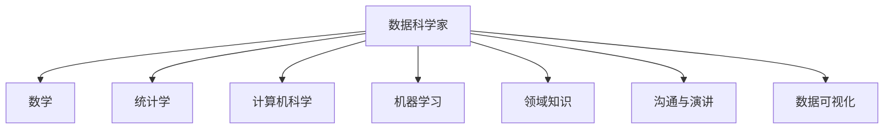

#### 数据科学团队知识结构叠加（概念）
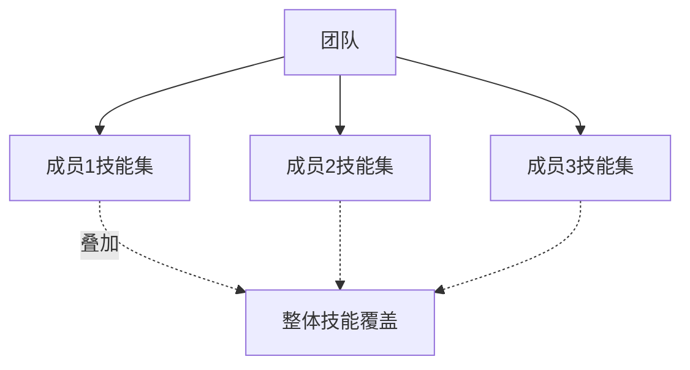

### 经典金句/数据
> “数据科学家是软件工程师中最好的统计学家，是统计学家中最好的软件工程师。” (p.41)
> “没有人会是完美的数据科学家，所以我们需要团队。” (p.4)

---

## 第2章：统计推断、探索性数据分析和数据科学工作流程

### 核心论点
问题：大数据时代，传统统计推断和EDA如何应用？
观点：统计推断关注从随机过程数据中提取信息，EDA是建模的第一步，强调理解数据而非证明假设。数据科学工作流程包括：原始数据 → 处理 → 清洗 → EDA → 建模 → 解释/产品 → 反馈循环。

### 关键概念/事件
- **总体与样本**：大数据时代N=all的假设常是错误的，样本偏差依然存在。
- **大数据4V**：容量、种类、速度、价值。
- **探索性数据分析（EDA）**：John Tukey创立，使用图表和汇总统计量，目的是理解数据形状，不向他人证明。
- **数据科学工作流程**：包含数据收集、处理、EDA、建模、产品/反馈。
- **过拟合**：模型在样本内表现好，但在样本外失效。

### 逻辑推演/叙事脉络
从统计推断的基本概念（总体、样本、偏差）出发，指出大数据并不意味着能忽略采样问题。然后强调EDA的价值（调试数据、发现模式、避免盲目建模）。最后给出数据科学工作流程，并以RealDirect公司案例说明数据策略的制定。

### 流程图
#### 数据科学工作流程
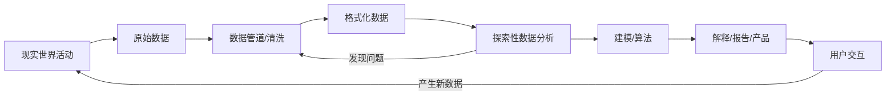

### 经典金句/数据
> “与其担心如何说服别人，不如先了解到底发生了什么。” ——Andrew Gelman (p.27)
> “面对那些我们坚信存在或不存在的事物时，探索性数据分析代表了一种态度。” ——John Tukey (p.26)

---

## 第3章：算法

### 核心论点
问题：数据科学中最基础的机器学习算法有哪些？如何选择？
观点：三大基本算法——线性回归（预测连续值）、k近邻（分类）、k均值（聚类）。算法的选择取决于问题属性（监督/非监督、输出类型、数据规模）。

### 关键概念/事件
- **线性回归**：最小二乘法估计参数，假设线性关系、误差正态独立同分布。用于预测或解释。
- **k近邻（k-NN）**：基于距离度量，让k个最近邻投票分类。需要选择k和距离定义（欧氏距离、余弦相似度、Jaccard等）。
- **k均值聚类**：非监督学习，迭代更新中心点，将数据聚成k类。需选择k，可能存在不收敛或解释困难。
- **过拟合与交叉验证**：将数据分为训练集和测试集，评估模型泛化能力。

### 逻辑推演/叙事脉络
先区分算法与模型，然后介绍线性回归的数学原理、假设和评估（R方、p值）。接着通过信用评分实例讲解k近邻的步骤：距离定义、训练/测试分割、选择最优k。最后以二维散点图示例讲解k均值聚类过程（随机选中心点→分类→更新中心点→迭代）。

### 流程图
#### k近邻分类流程
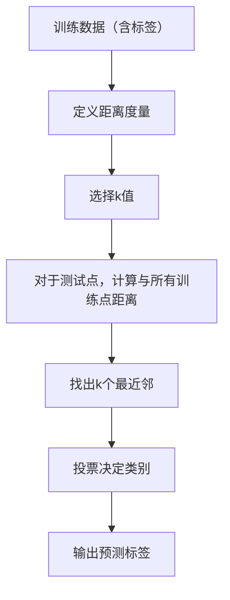

#### k均值聚类流程
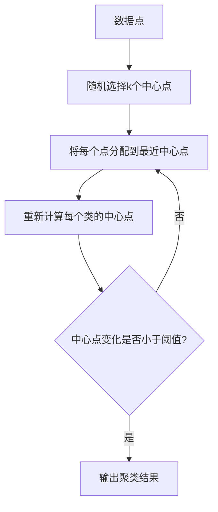

### 经典金句/数据
> “数据科学家是软件工程师中最好的统计学家，是统计学家中最好的软件工程师。” (p.41)
> “如果你只会线性回归，你会觉得所有问题都是线性问题。” (p.41)

---

## 第4章：垃圾邮件过滤器、朴素贝叶斯与数据清理

### 核心论点
问题：如何用朴素贝叶斯模型构建垃圾邮件过滤器？
观点：朴素贝叶斯基于贝叶斯法则和特征独立性假设，通过计算单词在垃圾/正常邮件中出现的概率来分类。它简单、高效、易更新，优于线性回归和k近邻解决此类高维稀疏问题。

### 关键概念/事件
- **贝叶斯法则**：P(A|B) = P(B|A)P(A)/P(B)
- **朴素贝叶斯**：假设单词出现相互独立，将联合概率分解为各单词概率的乘积。
- **拉普拉斯平滑**：为避免零概率，添加伪计数（超参数α, β）。
- **高维诅咒**：k近邻在高维空间中难以找到真正近邻。
- **安然（Enron）邮件数据集**：用于训练和测试垃圾邮件过滤器。

### 逻辑推演/叙事脉络
先通过思维实验说明线性回归和k近邻为何不适用（输出非连续、维度灾难）。然后引入贝叶斯法则，从单单词过滤器扩展到多单词朴素贝叶斯模型，推导出对数线性形式。接着介绍拉普拉斯平滑作为最大后验估计。最后比较朴素贝叶斯与k近邻，并展示Bash脚本实现。

### 流程图
#### 朴素贝叶斯垃圾邮件分类流程
```mermaid
graph TD
    A[训练邮件集（已标记spam/ham）] --> B[计算P(spam)和P(ham)]
    A --> C[统计每个单词在spam和ham中出现次数]
    C --> D[计算P(word|spam)和P(word|ham)（拉普拉斯平滑）]
    D --> E[对新邮件，提取单词]
    E --> F[计算P(spam|words) ∝ P(spam)*∏P(word|spam)]
    F --> G[比较P(spam|words)与P(ham|words) 决定分类]
```

### 经典金句/数据
> “数据清理是数据科学家最常做的工作，熟能生巧。” ——Jake Hofman (p.74)
> “朴素贝叶斯模型足够简单，效果也足够好。” (p.80)

---

## 第5章：逻辑回归

### 核心论点
问题：逻辑回归如何用于二元分类？与线性回归有何不同？
观点：逻辑回归通过反逻辑函数将线性组合映射到[0,1]区间，输出概率。参数估计使用最大似然估计（牛顿法或随机梯度下降）。模型评价需根据业务目标选择ROC/AUC、提升度、准确度等。

### 关键概念/事件
- **反逻辑函数（inverse-logit）**：p(t)=1/(1+e^{-t})，将实数映射到(0,1)。
- **逻辑回归模型**：logit(P(Y=1|X)) = α + βX。
- **参数估计**：无解析解，使用凸优化（牛顿法、随机梯度下降）。
- **ROC曲线与AUC**：评价分类器排序能力。
- **M6D点击模型**：根据用户网页访问历史预测广告点击概率。

### 逻辑推演/叙事脉络
通过思维实验讨论数据科学是否值得称为“科学”。然后比较分类器的选择因素（运行时间、可解释性、可扩展性）。以M6D广告点击为例，构建逻辑回归模型，解释数学形式、参数估计方法（牛顿法和随机梯度下降），最后详细讨论模型评价指标（准确度、精确度、召回率、F1、ROC/AUC、提升度、均方误差等）及A/B测试。

### 流程图
#### 逻辑回归模型构建流程
```mermaid
graph TD
    A[训练数据（特征X，二元Y）] --> B[假设 logit(P)=α+βX]
    B --> C[定义似然函数（伯努利）]
    C --> D[使用牛顿法或随机梯度下降最大化似然]
    D --> E[得到估计参数α̂, β̂]
    E --> F[对新数据，计算 P=1/(1+e^{-(α̂+β̂X)})]
    F --> G[根据阈值输出分类结果]
```

### 经典金句/数据
> “数据科学之所以称作科学，是因为没有绝对普适的答案，我们需要经历一个迷宫一样的过程。” (p.93)
> “模型的评价没有一个统一标准，它既取决于分析的数据，也和模型本身有关。” (p.102)

---

## 第6章：时间戳数据与金融建模

### 核心论点
问题：如何分析带时间戳的用户行为数据和金融时间序列？
观点：时间戳数据记录用户行为的精确时序，EDA需要绘制单用户时间序列、汇总统计、注意时区等。金融建模中必须严格区分样本期内/外，避免因果颠倒；使用对数收益率、指数平滑法估计波动率。

### 关键概念/事件
- **GetGlue对偶图**：用户-物品二分图，可扩展用户-用户、物品-物品连接。
- **EDA for 时间戳**：绘制单个用户行为序列，发现异常模式（如所有用户同时点赞可能为系统故障）。
- **样本期内/外**：金融建模中只能使用过去数据预测未来，严禁使用未来信息。
- **对数收益率**：具有可加性和对称性，高频下近似百分比收益率。
- **指数平滑法**：波动率估计中，新数据权重指数衰减，公式 V_new = s*V_old + (1-s)*r0^2。
- **累积PnL图**：评价金融模型的实际盈亏表现。

### 逻辑推演/叙事脉络
Kyle Teague介绍GetGlue的时间戳数据结构（用户、动作、节目、时间戳）。然后详细讲解EDA方法：单个用户时间序列、汇总统计、颜色编码动作类型。Cathy O'Neill接着讲金融建模，强调样本期内外分离的重要性，介绍对数收益率、波动率估计（指数平滑），以及带有先验信息的回归（惩罚项与平滑先验）。

### 流程图
#### 金融建模样本期内外分离
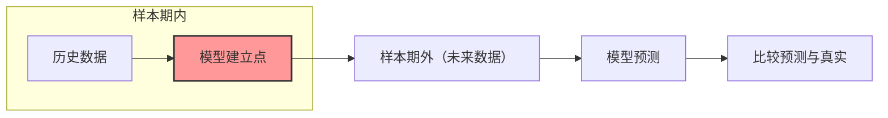

#### 指数平滑波动率估计
```mermaid
graph TD
    A[初始化 V_old] --> B[新收益率 r0]
    B --> C[V_new = s*V_old + (1-s)*r0^2]
    C --> D[更新 V_old = V_new]
    D --> B
```

### 经典金句/数据
> “永远不要拿未来的数据去预测过去。” (p.120)
> “市场每日的记忆能力只有3%。” (p.128)

---

## 第7章：从数据到结论

### 核心论点
问题：如何从数据中提取有效信息、进行特征选择，并构建可解释或高精度的模型？
观点：特征选择分为过滤型、包装型和嵌入型（决策树、随机森林）。决策树以信息增益为标准分裂节点，可解释性强；随机森林通过bagging集成决策树，提高精度但牺牲可解释性。领域知识与数据科学并非对立。

### 关键概念/事件
- **Kaggle模式**：数据科学竞赛平台，客户提供数据与奖金，参赛者提交预测结果，排名驱动模型优化。
- **特征选择三类**：过滤型（单变量统计量）、包装型（搜索最优子集）、嵌入型（模型内建选择，如决策树）。
- **熵与信息增益**：H(X) = -∑p log2(p)，信息增益 = H(Y) - H(Y|X)。
- **决策树算法**：递归选择最大信息增益的特征进行分裂，剪枝防过拟合。
- **随机森林**：多个决策树在bootstrap样本上构建，每棵树随机选择部分特征，对过拟合不敏感。
- **谷歌社交研究**：定量与定性结合，小数据访谈指导大数据分析。

### 逻辑推演/叙事脉络
William Cukierski先介绍数据竞赛与众包模式。然后深入特征选择：以“留住用户”为例，生成大量特征，再用过滤、包装、嵌入方法筛选。重点讲解决策树：熵、信息增益、算法步骤、连续性变量处理。接着介绍随机森林。最后David Huffaker展示谷歌如何混合定性与定量研究（调查、访谈、日志分析）来设计Google+圈子功能。

### 流程图
#### 决策树构建（信息增益准则）
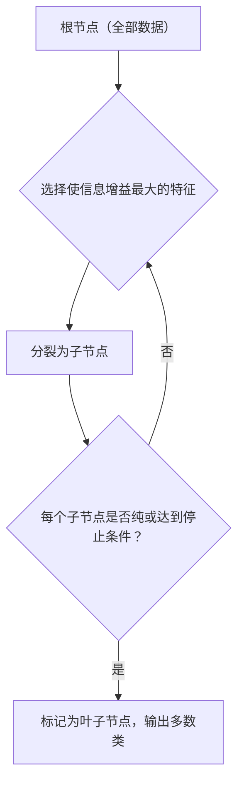

### 经典金句/数据
> “专家的知识基本上毫无用处，我们根本不需要。” ——Jeremy Howard（引起争议）(p.143)
> “特征提纯和选择对于机器学习的重要性经常被人忽视，但却是其中最为重要的一环。” ——Will Cukierski (p.144)

---

## 第8章：构建面向大量用户的推荐引擎

### 核心论点
问题：如何构建可扩展的推荐系统？
观点：基于用户-物品矩阵的协同过滤，可从最近邻模型出发，但面临维度诅咒和过拟合。使用矩阵分解（SVD、交替最小二乘法）降维，提取隐含特征，可处理大规模稀疏数据并实现并行计算。

### 关键概念/事件
- **二分图推荐**：用户节点与物品节点，边代表交互。
- **奇异值分解（SVD）**：X = U S V^T，通过保留前d个奇异值降维。
- **主成分分析（PCA）**：等价于SVD的某种形式，最小化重构误差。
- **交替最小二乘法（ALS）**：固定U更新V，固定V更新U，迭代收敛，可并行。
- **隐含变量（latent feature）**：如“品味”，从数据中自动学习，互不相关。

### 逻辑推演/叙事脉络
Matt Catts介绍Hunch公司推荐系统。先回顾最近邻模型的已知问题（维度诅咒、过拟合、稀疏性等）。然后提出基于矩阵分解的方法：用U和V的乘积近似原始矩阵，最小化观测值的平方误差。通过固定一个矩阵、求解另一个的交替最小二乘法实现优化，并可并行处理用户或物品。最后讨论模型更新的权衡。

### 流程图
#### 交替最小二乘法（ALS）
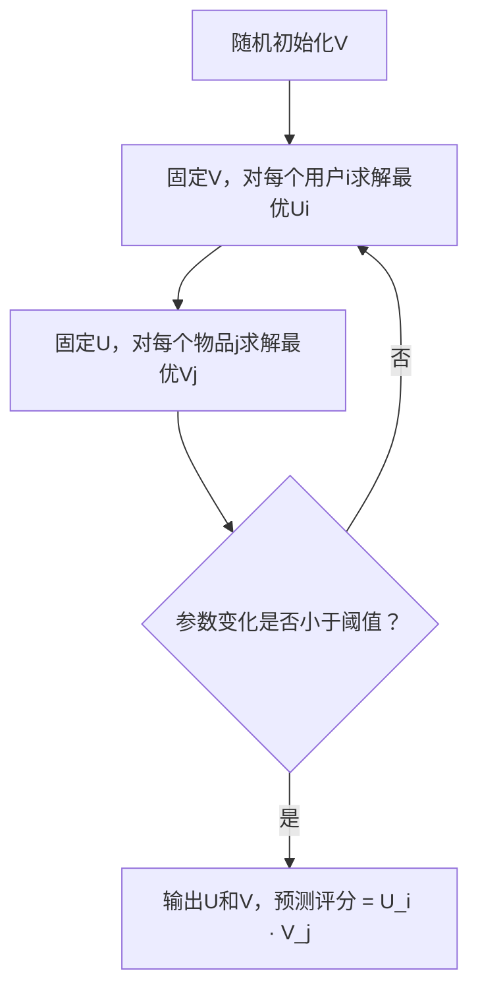

### 经典金句/数据
> “一个人不可能完成所有工作，组建数据团队就像召集十一罗汉一样，个个都得身怀绝技。” (p.166)

---

## 第9章：数据可视化与欺诈侦测

### 核心论点
问题：数据可视化如何与数据科学结合？欺诈侦测中如何平衡机器学习与可视化？
观点：可视化不仅是展示工具，更是探索和沟通的手段。Mark Hansen展示了艺术与数据的结合（Moveable Type, Cascade等）。Ian Wong在Square公司结合机器学习和可视化进行实时欺诈侦测，强调模型可解释性、代码质量和团队协作。

### 关键概念/事件
- **Tarde的预言**：未来信息将成为自然的一部分，实时数据将包围我们。
- **Processing语言**：面向艺术家和设计师的编程语言。
- **Moveable Type**：《纽约时报》大厅可视化，560个文本盒展示新闻内容模式。
- **Cascade项目**：可视化Twitter上《纽约时报》链接的分享传播路径。
- **Square风险模型**：半监督学习，特征变量包括支付数据、卖家数据、结算数据，用ROC和精确度/召回率评估。
- **结对编程**：驾驶员与副驾驶模式，提高代码质量。

### 逻辑推演/叙事脉络
Mark Hansen从社会学视角（Tarde, Latour）出发，强调可视化改变了我们观察世界的方式。展示多个艺术性可视化项目（Nuage Vert, One Tree, Dusty Relief, 百万美元街区等）。然后详细讲解自己的项目（Moveable Type, Cascade, Cronkite广场, eBay图书, 莎士比亚机）。Ian Wong接着从商业角度讲欺诈侦测：数据流程、监督/半监督学习、模型评价（混淆矩阵、精确度/召回率）、特征选择挑战，并给出建模小贴士（代码结构化、结对编程、模型产品化等）。

### 流程图
#### Square风险管理流程
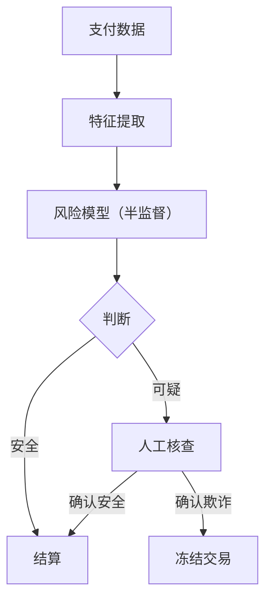

### 经典金句/数据
> “数据就是生活，它无处不在。” ——Mark Hansen (p.193)
> “机器学习不等于写R程序，数据可视化不仅仅是一张好图。” ——Ian Wong (p.193-194)

---

## 第10章：社交网络与数据新闻学

### 核心论点
问题：社交网络分析的核心概念与测度是什么？数据新闻学如何利用数据讲故事？
观点：社交网络分析关注节点（参与者）和边（关系），向心性测度包括自由度、紧密度、中间性和特征向量向心度。网络可视为随机图模型（ERGM）。数据新闻学要求结合可视化、统计学、编程和沟通技巧，以数据驱动叙事。

### 关键概念/事件
- **向心性测度**：自由度（degree）、紧密度（closeness）、中间性（betweenness）、特征向量向心度（eigenvector centrality，如PageRank）。
- **ERGM（指数随机图模型）**：用网络统计量（边数、三角形数、k星等）建模网络概率分布。
- **隐空间模型**：引入不可观测的潜在因素解释网络结构。
- **博客圈可视化**：Fruchterman-Reigngold算法布局，颜色代表国家/主题。
- **数据新闻学**：Jon Bruner强调提问、数据采集、分析、可视化、写作的全栈能力。

### 逻辑推演/叙事脉络
John Kelly对比案例-属性数据与社交网络数据，指出网络分析能揭示影响力传播和群体结构。然后介绍基本术语（节点、边、二分图、自我中心网络）及各种向心性测度。接着展示阿拉伯博客圈和英语博客圈的可视化案例，说明中观视角的价值。从统计学角度介绍随机网络模型（Erdos-Renyi, ERGM, 隐空间模型）。最后Jon Bruner讲解数据新闻学的历史与实践建议。

### 流程图
#### 特征向量向心度迭代计算
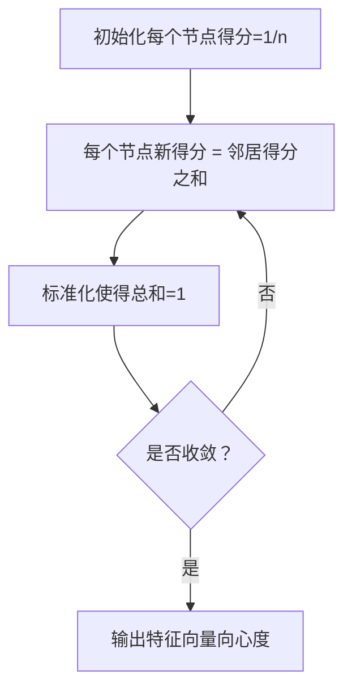

### 经典金句/数据
> “民意不仅仅是单个个体意见的线性组合，要找到有影响力的组织或个人。” ——John Kelly (p.208)
> “数据新闻工作类似于探索性数据分析，我们要时刻准备好改变主意。” ——Jon Bruner (p.221)

---

## 第11章：因果关系研究

### 核心论点
问题：如何从观测数据中推断因果关系？
观点：相关性不等于因果关系。黄金标准是随机化临床实验（A/B测试）。当不可行时，使用观察性研究，需警惕干扰因子（辛普森悖论），可采用倾向性得分匹配法（PSM）模拟随机分组。

### 关键概念/事件
- **干扰因子（confounder）**：同时影响处理变量和结果变量，导致伪相关。
- **辛普森悖论**：分组分析时方向可能与汇总结果相反。
- **鲁宾因果关系模型**：定义个体因果效应为 Yi(1)-Yi(0)，但无法同时观测。
- **倾向性得分匹配（PSM）**：用逻辑回归估计个体接受处理的概率，匹配处理组和对照组。
- **A/B测试**：互联网领域的随机实验，需注意重叠实验基础设施。

### 逻辑推演/叙事脉络
通过冰激凌与泳衣销售额、OK Cupid搭讪邮件等例子说明相关不蕴涵因果。引入干扰因子概念。介绍随机化实验作为黄金标准及其局限性（道德、成本）。然后转向观察性研究，讲解辛普森悖论、鲁宾模型、因果图表示。重点讲解倾向性得分匹配的两步法：计算倾向分→匹配→分析。

### 流程图
#### 倾向性得分匹配流程
```mermaid
graph TD
    A[观测数据] --> B[以处理变量为Y，拟合逻辑回归模型]
    B --> C[得到每个个体的倾向得分P(T=1|X)]
    C --> D[将处理组与对照组按倾向得分匹配]
    D --> E[匹配后的样本视为随机化实验，直接比较结果]
```

### 经典金句/数据
> “相关性并不代表因果关系。” (p.223)
> “随机化实验的绝妙之处在于，不单是我们能想到的，就连那些我们很难考虑到的无数其他干扰因子的影响，也被排除了。” (p.227)

---

## 第12章：流行病学

### 核心论点
问题：流行病学中观察性研究的可靠性如何？如何处理干扰因子？
观点：现有流行病学方法（分层法）不能完全解决干扰因子问题。OMOP项目对5000种模型在10个大型数据库上进行验证，发现AUC仅0.64，接近随机猜测，说明很多医学观测研究结论不可靠。

### 关键概念/事件
- **OMOP项目**：投入2500万美元，评估不同模型在药物副作用检测中的表现。
- **ROC曲线**：价值2500万美元的ROC曲线显示最佳模型AUC=0.64。
- **分层法的局限**：可能导致因果估计方向逆转，且无法考虑所有干扰因子。
- **数据库选择影响**：同一课题在不同数据库上可能得到完全相反的结论。

### 逻辑推演/叙事脉络
David Madigan指出传统统计学习惯于闭门造车，现在更需与应用结合。他以“口服磷酸双酯与癌症风险”为例，展示观察性研究结论的矛盾。解释辛普森悖论和分层法的问题。然后详细介绍OMOP项目：选取10个数据库、14个模型、5000种参数组合，验证已知药物副作用，结果显示大多数模型表现仅比随机猜测略好。强调需要更好的方法论。

### 流程图
#### OMOP验证流程
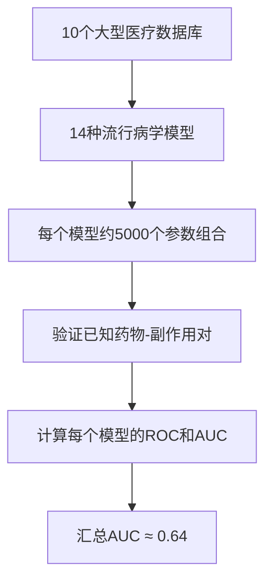

### 经典金句/数据
> “价值2500万美元的ROC曲线图。” (p.244)
> “0.64的AUC是其中效果最好的模型。” (p.245)

---

## 第13章：从竞赛中学到的：数据泄漏和模型评价

### 核心论点
问题：数据挖掘竞赛中常犯的错误是什么？如何避免数据泄漏并正确评价模型？
观点：数据泄漏（使用未来信息或不应获得的信息）是竞赛和现实建模中的大敌。模型评价不能只看准确度，应根据业务目标选择ROC/AUC、提升度、精确度/召回率等。有时将问题分解（如先预测是否捐赠，再预测捐赠额）效果更好。

### 关键概念/事件
- **数据泄漏案例**：① 市场预测（AUC=0.999）因使用了未来信息；② 亚马逊“免费送货”变量实为结果；③ 珠宝抽样问题（只包含购买用户）；④ IBM客户锁定（主页出现websphere意味已购买）；⑤ 乳腺癌检测（患者ID泄露医院特征）；⑥ 肺炎预测（诊断码-1泄露标签）。
- **模型评价**：准确度不适合不平衡数据；概率预测比0/1输出更有信息；ROC/AUC评价排序能力；标定图评价概率准确性。
- **分解建模**：将“捐赠意愿”和“捐赠金额”分开建模可提升收益。

### 逻辑推演/叙事脉络
Claudia Perlich分享她作为数据竞赛常胜将军的经验。先定义数据泄漏（时空错乱），然后列举多个真实案例。提出避免泄漏的方法：去除未来信息、理解数据生成过程、采用“学习和预测分离”流程。接着讨论模型评价：准确度有缺陷，推荐ROC/AUC和提升度，并展示决策树和逻辑回归的标定图差异。最后以慈善募捐为例，说明分解建模的优势。

### 流程图
#### 避免数据泄漏的两步法
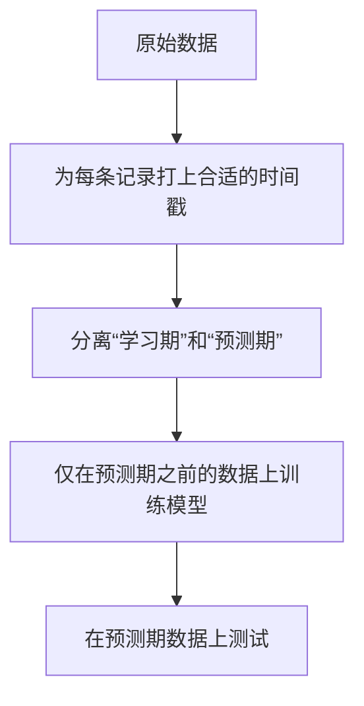

### 经典金句/数据
> “数据泄漏是参赛者最好的朋友，也是组织者和出题者的噩梦。” (p.250)
> “人类不是生来就懂数据的，我们命中注定只能理解语言。” (p.260)

---

## 第14章：数据工程：MapReduce、Pregel、Hadoop

### 核心论点
问题：如何处理一台机器装不下的“大数据”？
观点：MapReduce是一种分布式计算框架，将任务分解为map（键值对生成）和reduce（聚合）阶段，自动处理容错和并行。Hadoop是开源实现。Pregel适用于图计算。数据工程师需要设计数据管道，并权衡字节价值。

### 关键概念/事件
- **MapReduce**：mapper输出(key, value)，框架排序后，reducer聚合每个key的所有value。
- **单词计数示例**：map输出(word,1)，reduce求和。
- **分布式容错**：通过数据备份（默认3份）和任务重新执行实现。
- **Hadoop**：HDFS + MapReduce开源实现；Cloudera提供商业支持。
- **Pregel**：基于图的计算模型，超级步骤传递消息，适用于PageRank等。
- **字节价值经济学**：存储一字节的成本与从中获取的价值之比。

### 逻辑推演/叙事脉络
David Crawshaw以“如何在一台机器上计数单词”开始，逐步增加机器数量，揭示容错和并行化的复杂性。然后介绍MapReduce抽象，用单词计数演示mapper和reducer。讨论MapReduce不能做什么（迭代算法）。Josh Wills补充Hadoop生态（Hive, Pig, Mahout）及经济账，强调数据科学家90%时间花在数据准备上。

### 流程图
#### MapReduce单词计数流程
```mermaid
graph TD
    A[输入文档] --> B[Mapper: 每个单词输出 (word,1)]
    B --> C[Shuffle & Sort: 按word分组]
    C --> D[Reducer: 对每个word的1列表求和]
    D --> E[输出 (word, count)]
```

### 经典金句/数据
> “大数据指不能使用一台计算机处理的数据。” (p.263)
> “我让数据发光发热。” ——Josh Wills (p.269)

---

## 第15章：听听学生们怎么说

### 核心论点
问题：数据科学课程的学生学到了什么？
观点：数据科学重在过程而非现成答案；需掌握多种工具，跨学科协作；社区和结对学习至关重要；从真实混乱数据中锻炼能力。

### 关键概念/事件
- **知识结构星型图**：学生自我评估多技能。
- **Kaggle竞赛作业**：论文自动评分系统，特征包括拼写错误、Dale-Chall词表、TF-IDF等。
- **协作学习**：自发组队，互相补足技能短板。
- **数据科学社区**：Stack Overflow, Twitter, 博客等提供支持。

### 逻辑推演/叙事脉络
多位学生分享学习体验：从最初的困惑（朴素贝叶斯实现耗时40小时）到逐步掌握工具（R, Python, SQL, Git），认识到团队协作的价值。他们绘制了数据科学技能星型图和大学流行程度星座图，展示社区中不同背景的人如何互补。

### 经典金句/数据
> “每一个算法都是一篇文章。” ——Emily Bell (p.273)
> “数据科学本质上是一门需要合作的学科。” (p.276)

---

## 第16章：下一代数据科学家、自大狂和职业道德

### 核心论点
问题：数据科学家应具备哪些软技能和道德准则？
观点：下一代数据科学家应成为解决问题的人，培养软技能（持之以恒、同理心、提问能力），保持谦逊和怀疑精神。必须遵守职业道德，警惕模型的社会影响，不滥用数据。推荐“建模者的希波克拉底誓言”。

### 关键概念/事件
- **数据科学家的技能清单**：EDA、可视化、数据工程、预测、编程、讲故事、因果推断等。
- **达克效应**：无知者容易高估自己，知识削弱自信。
- **建模者希波克拉底誓言**（Emanuel Derman）：不迷信数学，如实陈述模型假设和局限。
- **DataKind**：志愿者用数据科学服务社会公益。
- **避免过拟合**：保持谦逊，接受挑战，设计实验验证。

### 逻辑推演/叙事脉络
回顾全书内容，重新定义数据科学为“可推广到所有数据问题的科技公司最佳实践”。然后讨论下一代数据科学家应具备的品质：成为解决问题的人、培养软技能、成为提问者、保持怀疑态度。最后强调道德责任，引用Matthew Jones关于“数据与自大狂”的文章，警告不要被算法冲昏头脑，要回归人文艺术本质。

### 经典金句/数据
> “在我的时代，那些最聪明的人都在思考怎么让用户点击广告……这简直弱爆了。” ——Jeff Hammerbacher (p.283)
> “数据科学家从不将使用一项技术的可能性和必要性混为一谈。” ——Matthew Jones (p.289)

---

## 附录与补充阅读（书中提及）

### 补充阅读列表（原文推荐）
- **数学**：Linear Algebra and Its Applications (Strang); Convex Optimization (Boyd); A First Course in Probability (Ross)
- **编程**：R in a Nutshell; Learning Python; Python for Data Analysis; The Art of R Programming
- **数据分析与统计推断**：Statistical Inference (Casella&Berger); Bayesian Data Analysis (Gelman); The Elements of Statistical Learning (Hastie)
- **人工智能与机器学习**：Pattern Recognition and Machine Learning (Bishop); Programming Collective Intelligence (Segaran)
- **实验设计**：Field Experiments (Gerber&Green)
- **可视化**：The Elements of Graphing Data (Cleveland); Visualize This (Yau)

### 数据科学技能清单（第16章）
包含探索性数据分析、可视化、数据工程、预测建模、编程、条件概率、优化、算法、讲故事、提问题、实验设计、因果推断等30余项。

> 说明：本书无单独附录章节，补充阅读资料散见于前言及各章脚注。以上为整理后的主要推荐书目。