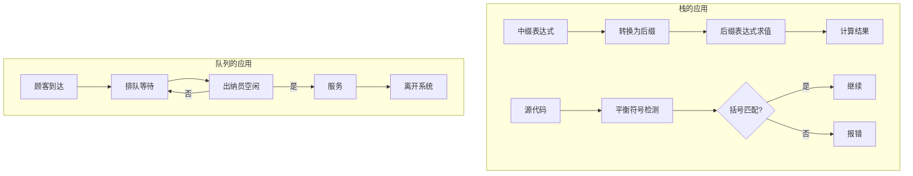
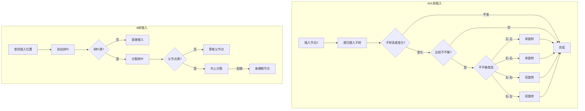

# 《数据结构与算法分析 Java语言描述》章节总结

## 书籍信息

- **书名**：数据结构与算法分析 Java语言描述
- **作者**：Mark Allen Weiss（马克·艾伦·维斯）
- **版本**：第2版 / 第3版（基于两份PDF内容整合）
- **PDF状态**：两份PDF均为扫描识别版，部分页面存在识别不完整或页码标记混乱的情况
- **OCR状态**：文本层可提取，但部分公式、图表、页眉页脚存在识别误差

## 目录说明

- **目录识别情况**：两份PDF均包含完整目录（第2版至Page 13，第3版至Page 10），章节层级清晰
- **章节对应依据**：第3版为更新版本，新增了布谷鸟散列、跳房子散列、后缀数组等高级内容
- **OCR修复说明**：正文中的公式符号、特殊字符、图片引用部分需根据语义补全

## 全书核心主题

本书系统性地介绍了数据结构（组织大量数据的方法）和算法分析（对算法运行时间的估计）两大核心内容。作者以Java语言作为实现工具，从抽象数据类型（ADT）出发，依次讲解了表、栈、队列、树、散列表、优先队列（堆）等基础数据结构，并深入分析了插入排序、希尔排序、堆排序、归并排序、快速排序等经典排序算法。

本书强调算法效率的重要性——一个低效算法可能耗费数天，而精心设计的算法可在秒级内完成。书中贯穿递归思想的应用，覆盖了AVL树、伸展树、B树等平衡树结构，以及图论算法、算法设计技巧（贪婪、分治、动态规划、随机化、回溯）、摊还分析等高级主题。第3版新增了布谷鸟散列、跳房子散列、后缀数组/后缀树等现代数据结构内容。

---

## 第1章：引论

### 1. 核心论点

本章主要解决“为什么需要关注算法效率”以及“本书将要讨论什么内容”两个问题。作者核心观点是：**写出一个能工作的程序并不够，当程序在巨大数据集上运行时，运行时间成为重要问题**。通过选择问题和字谜游戏两个例子，说明即便是正确的算法，如果效率低下，在处理大规模输入时也会变得完全不切实际。

### 2. 关键概念

- **选择问题（Selection Problem）**：从N个数中找出第k个最大者。直观解法（排序后取第k个）在N较大时效率极低，需要更高效的算法。
- **字谜游戏（Word Puzzle）**：在字母二维数组中找出给定单词表中的单词（水平、垂直或对角线方向）。同样存在直观但低效的解法。
- **递归（Recursion）**：函数用自身定义自身。Java支持递归，但必须满足：基准情形、不断推进、设计法则、合成效益法则。
- **泛型（Generic Mechanism）**：Java 5之前的泛型实现使用Object和接口类型，Java 5之后引入类型参数、自动装箱/拆箱、通配符等特性。
- **函数对象（Function Object）**：通过将函数放入对象内部来传递函数，用于实现Comparator等比较策略。

### 3. 逻辑推演

作者首先提出两个具体问题（选择问题和字谜游戏），演示直观解法在输入规模增大时的失败——它们虽然正确，但需要“若干天”才能完成。由此引出全书的核心关切：算法效率。

接着复习必要的数学基础（指数、对数、级数、模运算、证明方法），为后续算法分析做准备。递归部分强调四个基本法则，并通过整数打印的例子演示递归实现。泛型部分详细对比了Java 5前后的实现差异，包括Object表示、包装类、接口类型、协变数组问题，以及Java 5的类型擦除和泛型限制。

最后通过函数对象的概念，说明如何将比较逻辑从被比较对象中分离出来，为实现灵活的比较策略提供基础。

### 4. 经典金句/数据

> “写出一个工作程序并不够。如果这个程序在巨大的数据集上运行，那么运行时间就变成了重要的问题。” (p.2/第1章)

> “递归的第四条法则——合成效益法则：在求解一个问题的同一实例时，切勿在不同的递归调用中做重复性的工作。” (p.5-6/第1章)

> 选择问题示例：一千万个元素的随机文件 + k=5,000,000，直观算法需要“若干天”，而第7章的算法“在一秒钟左右给出问题的解”。 (p.1/第1章)

---

## 第2章：算法分析

### 1. 核心论点

本章解决“如何估计程序运行时间”的问题。作者核心观点是：**算法分析关注的是相对增长率（大O分析），而非精确时间**。通过忽略常数因子和低阶项，可以在不实际编码的情况下比较算法效率，并识别瓶颈。

### 2. 关键概念

- **大O记号（Big-Oh Notation）**：T(N) = O(f(N)) 表示存在常数c和n₀使得当N≥n₀时T(N) ≤ c·f(N)，即f(N)是T(N)的上界。
- **Ω记号 / Θ记号 / 小o记号**：分别表示下界、紧确界、严格上界。
- **最大子序列和问题**：给定整数序列（可能有负），求连续子序列的最大和。书中给出四种算法，复杂度分别为O(N³)、O(N²)、O(N log N)、O(N)。
- **折半查找（Binary Search）**：在已排序数组中查找元素，每次将搜索范围减半，时间复杂度O(log N)。
- **欧几里得算法**：计算最大公因数，通过连续取余，时间复杂度O(log N)。
- **幂运算**：通过分治策略（偶数时Xⁿ = (Xⁿ/²)²，奇数时Xⁿ = X·(X⁽ⁿ⁻¹⁾/²)²）实现O(log N)次乘法。

### 3. 逻辑推演

作者从数学定义出发建立分析框架（大O、Ω、Θ、小o），然后明确分析模型（简单指令顺序执行，每操作一个时间单位）。通过最大子序列和问题，演示同一问题不同算法的巨大性能差异：O(N³)算法在N=10,000时无法完成，而O(N)算法仅需0.003秒。

递归分析部分，以斐波那契数列的递归实现为例，展示违反“合成效益法则”导致的指数级时间复杂度。对数运行时间部分，通过折半查找、欧几里得算法、幂运算三个例子，归纳出一般规律：**用常数时间将问题规模缩减为原问题的一部分（如1/2），则该算法为O(log N)**。

分析结果验证部分，建议通过实际运行时间与理论值的比值收敛性来判断分析是否正确。

### 4. 经典金句/数据

> “如果一个算法用常数时间(O(1))将问题的大小削减为其一部分(通常是1/2)，那么该算法就是O(log N)。” (p.33/第2章)

> N=10,000时，O(N³)算法“NA”（无法完成），O(N²)需1.2329秒，O(N log N)需0.005712秒，O(N)需0.000317秒。(p.26/第2章)

> 斐波那契递归：T(N)=T(N-1)+T(N-2)+2，运行时间指数增长，Fib(40)左右即“效率低得吓人”。(p.28/第2章)

### 5. 方法流程图

```mermaid
graph TD
    A[输入整数序列] --> B{算法选择}
    B --> C[算法1: 三重循环]
    B --> D[算法2: 二重循环]
    B --> E[算法3: 分治递归]
    B --> F[算法4: 线性扫描]
    
    C --> G[O(N³)]
    D --> H[O(N²)]
    E --> I[O(N log N)]
    F --> J[O(N)]
    
    G --> K{输入规模}
    H --> K
    I --> K
    J --> K
    
    K -->|N=1000| L[算法1: 2.28秒<br>算法2: 0.010秒<br>算法3: 0.0005秒<br>算法4: 0.00003秒]
    K -->|N=100000| M[算法1: NA<br>算法2: 135秒<br>算法3: 0.0646秒<br>算法4: 0.0032秒]
```

---

## 第3章：表、栈和队列

### 1. 核心论点

本章介绍三种最基本的数据结构——表、栈和队列。作者核心观点是：**抽象数据类型（ADT）将实现与功能分离，程序只需知道操作“做什么”而不必知道“如何做”**。通过对ArrayList和LinkedList两种表实现的对比分析，说明不同操作在不同数据结构上的时间复杂度差异。

### 2. 关键概念

- **抽象数据类型（ADT）**：带有一组操作的一些对象的集合，数学抽象，不涉及实现细节。
- **表（List）**：形如A₀, A₁, …, A_{N-1}的元素序列，支持find、insert、remove、printList等操作。
- **ArrayList vs LinkedList**：ArrayList基于可增长数组实现，get/set为O(1)，插入删除为O(N)；LinkedList基于双链表实现，插入删除为O(1)（已知位置），get为O(N)。
- **栈（Stack）**：LIFO（后进先出）表，只允许在栈顶进行push（插入）和pop（删除）操作，可用于平衡符号、后缀表达式求值、中缀转后缀、方法调用等。
- **队列（Queue）**：FIFO（先进先出）表，在一端（队尾）插入（enqueue），在另一端（队头）删除（dequeue），用于排队模拟、图论算法等。
- **迭代器（Iterator）**：用于遍历集合的对象，遵循“若对正在迭代的集合进行结构性改变，则迭代器非法”的基本法则。

### 3. 逻辑推演

作者首先定义ADT概念，然后以表为切入点，对比数组实现和链表实现。数组实现中，插入/删除需要移动元素，代价高昂；链表通过节点间的链引用实现非连续存储，插入/删除只需修改常数个指针。

Java Collections API部分，详细讲解Collection、Iterator、List接口，并通过“删除表中的偶数”这一具体例子，演示不同实现的性能差异：ArrayList为O(N²)，LinkedList为O(N)。关键技巧是使用迭代器自身的remove方法而非Collection的remove方法。

ArrayList和LinkedList的完整实现代码展示了底层机制：ArrayList的扩容策略（每次2倍+1）、LinkedList的头节点和尾节点设计、嵌套类和内部类的使用（迭代器与外部类的关联）。

栈的应用部分包括：平衡符号检测（使用栈匹配括号）、后缀表达式求值（遇操作数压栈，遇运算符弹出两个计算后压回）、中缀转后缀（操作符栈处理优先级）、方法调用（活动记录栈帧）。

### 4. 经典金句/数据

> “对于LinkedList，对该迭代器的remove方法的调用只花费常数时间，因为迭代器位于需要被删除的节点（或在其附近）。” (p.51/第3章)

> 删除表中偶数的实验：400,000项时，LinkedList耗时0.031秒，ArrayList耗时约2.5分钟；800,000项时，LinkedList耗时0.062秒，ArrayList耗时约10分钟。(p.51/第3章)

> “栈很可能是在计算机科学中在数组之后的最基本的数据结构。” (p.65/第3章)

### 5. 方法流程图



---

## 第4章：树

### 1. 核心论点

本章解决“如何实现对大量数据的快速查找和插入”的问题。作者核心观点是：**二叉查找树（Binary Search Tree）能够以O(log N)平均时间支持大部分操作**，但对于排序输入会退化为链表，因此需要AVL树、伸展树、B树等平衡方案来保证性能。

### 2. 关键概念

- **树（Tree）**：由根节点和若干子树组成的递归结构，N个节点有N-1条边。
- **二叉查找树（BST）**：每个节点的左子树中所有项小于该节点，右子树中所有项大于该节点。
- **AVL树**：平衡二叉树，每个节点的左右子树高度差最多为1，通过单旋转和双旋转维持平衡。
- **伸展树（Splay Tree）**：自调整树，每次访问后将节点通过“展开”操作旋转到根，保证M次操作的总时间为O(M log N)。
- **B树**：平衡M路查找树，用于磁盘存储场景，所有数据存储在树叶上，非叶节点存储分支关键字，保证磁盘访问次数极少。
- **TreeSet / TreeMap**：Java Collections API中的有序集合和映射实现，基于红黑树。

### 3. 逻辑推演

作者从树的递归定义出发，通过UNIX文件系统的目录列表（先序遍历）和磁盘空间计算（后序遍历）展示树的实用场景。二叉查找树部分详细实现contains、findMin/Max、insert、remove操作——其中删除有两个儿子的节点是最复杂的情形（用右子树最小节点替换）。

AVL树解决BST在排序输入下的退化问题：插入后从插入点向上检查平衡，遇到不平衡则通过单旋转（左-左或右-右情况）或双旋转（左-右或右-左情况）修复。平衡条件保证树高为O(log N)。

伸展树采用更激进的策略：每次访问后将被访问节点旋转到根。虽然单次操作可能O(N)，但M次操作的摊还时间为O(M log N)，且编程比AVL树简单。

B树面向磁盘场景：节点大小匹配磁盘区块（如8192字节），每个非叶节点有M-1个关键字和M个分支，树叶存储L个数据项。插入时若节点满则分裂并向上传递，删除时若节点不满则领养或合并。保证树高极小（如4层可处理1000万条记录）。

### 4. 经典金句/数据

> “对于大量的输入数据，链表的线性访问时间太慢，不宜使用。本章讨论一种简单的数据结构，其大部分操作的运行时间平均为O(log N)。” (p.71/第4章第3版)

> AVL树高度最多为1.44 log(N+2)-1.328，实际略大于log N。(p.93/第4章)

> B树示例：M=228，L=32，1000万记录→最坏情形树叶在第4层，磁盘访问约log_{M/2}N次。(p.102-103/第4章第3版)

### 5. 方法流程图



---

## 第5章：散列

### 1. 核心论点

本章解决“如何以常数平均时间执行插入、删除和查找”的问题。作者核心观点是：**散列表（Hash Table）通过散列函数将关键字映射到数组位置，配合冲突解决策略，可实现O(1)平均时间的核心操作**，但不支持需要排序信息的操作（如findMin/findMax）。

### 2. 关键概念

- **散列函数（Hash Function）**：将关键字映射到0~TableSize-1范围的函数。理想情况下简单、均匀分配。对于字符串常用多项式散列（如h = Σ key[chars]·37ⁱ）。
- **分离链接法（Separate Chaining）**：将散列到同一值的所有元素保存在一个链表中。装填因子λ ≈ 1时性能良好。
- **开放定址法（Open Addressing）**：冲突时探测其他单元。包括线性探测（f(i)=i）、平方探测（f(i)=i²）、双散列（f(i)=i·hash₂(x)）。
- **再散列（Rehashing）**：当表过满时建立约两倍大的新表，用新散列函数重新插入所有元素，开销O(N)但不常发生。
- **可扩散列（Extendible Hashing）**：用于磁盘存储的动态散列，通过目录和树叶实现两次磁盘访问完成查找。
- **布谷鸟散列（Cuckoo Hashing）**：使用两个（或多个）散列函数和两张表，插入时踢出现有元素，保证最坏情形O(1)查找。
- **跳房子散列（Hopscotch Hashing）**：限定探测序列长度为常数MAX_DIST，通过替换机制维持近邻位置。

### 3. 逻辑推演

作者从散列的基本思想（关键字→数组下标映射）出发，分析散列函数的选择原则。对字符串，简单求和（只占表的小部分）效果差，多项式散列（Horner法则）效果更好但计算开销较大。

冲突解决方案中，分离链接法最简单（链表数组），但涉及额外内存分配。开放定址法（线性/平方/双散列）完全使用数组，但需要懒惰删除且装填因子需低于0.5。平方探测解决了线性探测的一次聚集问题，但会产生二次聚集；双散列几乎与随机冲突解决方法性能相同。

再散列是维持性能的关键：当装填因子超过阈值时扩大表。分离链接法通常在λ≈1时再散列，开放定址法通常在λ≈0.5时再散列。

第3版新增的布谷鸟散列和跳房子散列实现了最坏情形O(1)查找。布谷鸟散列通过两个散列函数和踢出机制，查找只需检查两个位置；跳房子散列通过限定探测距离为常数MAX_DIST（如32）并维护Hop信息数组，保证元素在散列位置附近的有限范围内。

### 4. 经典金句/数据

> “散列是一种用于以常数平均时间执行插入、删除和查找的技术。但是，那些需要元素间任何排序信息的树操作将不会得到有效的支持。” (p.117/第5章第3版)

> 装填因子λ=0.5时，线性探测插入平均2.5次探测，成功查找平均1.5次探测；λ=0.9时，插入平均50次探测。(p.124-125/第5章)

> 完美散列定理：若N个球放入M=N²个盒子，无冲突概率不小于1/2；二级散列表总容量期望值≤2N。(p.134-135/第5章第3版)

### 5. 方法流程图

```mermaid
graph TD
    subgraph 分离链接法
        A[hash(x)] --> B[定位链表]
        B --> C[链表操作]
    end
    
    subgraph 平方探测法
        D[hash(x)] --> E[位置 = hash(x)+i² mod TableSize]
        E --> F{该位置为空?}
        F -->|否| G[i++]
        G --> E
        F -->|是| H[插入]
    end
    
    subgraph 布谷鸟散列
        I[hash1(x)] --> J{表1位置空?}
        J -->|是| K[插入表1]
        J -->|否| L[踢出现有元素y]
        L --> M[hash2(y)插入表2]
        M --> N{表2位置空?}
        N -->|否| O[递归踢出]
    end
```

---

## 第6章：优先队列（堆）

### 1. 核心论点

本章解决“如何高效获取集合中的最小（或最大）元素”的问题。作者核心观点是：**二叉堆（Binary Heap）以数组实现的完全二叉树支持O(log N)的插入和删除最小元操作**，且buildHeap可在O(N)时间内构建；对于需要合并的场景，左式堆、斜堆和二项队列提供O(log N)的合并操作。

### 2. 关键概念

- **二叉堆（Binary Heap）**：完全二叉树 + 堆序性质（每个节点小于等于其子节点）。用数组存储，位置i的左子为2i，右子为2i+1，父为⌊i/2⌋。
- **上滤（Percolate Up）**：插入操作时，在下一个可用位置创建空穴，将新元素向上移动直到找到正确位置。
- **下滤（Percolate Down）**：删除最小元时，将根置空，将最后一个元素移到根位置后向下移动，每次与较小子节点交换。
- **左式堆（Leftist Heap）**：支持合并的链式堆，每个节点记录零路径长（npl），左子npl ≥ 右子npl，保证右路径长度为O(log N)。
- **斜堆（Skew Heap）**：左式堆的自调节版本，无条件交换左右子，实现简单，摊还时间为O(log N)。
- **二项队列（Binomial Queue）**：二项树的集合（每高度至多一棵），支持合并、插入（均摊O(1)）、deleteMin（O(log N)）。

### 3. 逻辑推演

作者从优先队列的应用场景（操作系统调度、事件模拟）出发，评价各种简单实现（无序链表、有序链表、BST）的优劣。二叉堆利用完全二叉树的结构性质，可在数组中高效存储和操作。

insert操作：在数组末尾创建空穴，新元素上滤。deleteMin操作：返回根元素，将最后一个元素移到根后下滤。buildHeap通过从最后一个非叶节点到根逐节点下滤，可在O(N)时间内完成——所有节点高度和约为N。

对于merge操作，二叉堆无能为力（需Θ(N)拷贝）。左式堆通过平衡条件（左子npl ≥ 右子npl）确保右路径短，合并时递归合并右路径，再交换左右子以维持左式性质。斜堆简化了条件判断，无条件交换，实现更简单。二项队列最复杂但也最精妙，将优先队列表示为二项树的集合，二进制表示N的大小，合并操作类似二进制加法。

事件模拟示例：C个顾客、k个出纳员，运行时间O(C log(k+1))。

### 4. 经典金句/数据

> “堆是一棵被完全填满的二叉树，有可能的例外是在底层，底层上的元素从左到右填入。这样的树称为完全二叉树。” (p.157/第6章第3版)

> buildHeap：对N=2ᵏ个节点的完全树，所有节点高度和约2N，故时间复杂度O(N)。(p.165-166/第6章)

> 左式堆定理：右路径有r个节点的左式树至少有2ʳ-1个节点，故N个节点的左式树右路径长度≤log(N+1)。(p.168/第6章)

### 5. 方法流程图

```mermaid
graph TD
    subgraph 二叉堆插入
        A[新元素X] --> B[在数组末尾创建空穴]
        B --> C{空穴=根?}
        C -->|是| D[放入X]
        C -->|否| E{X < 父节点?}
        E -->|是| F[父节点移入空穴]
        F --> G[空穴上移]
        G --> C
        E -->|否| D
    end
    
    subgraph 二叉堆deleteMin
        H[返回根元素] --> I[最后一个元素移到根]
        I --> J[从根开始下滤]
        J --> K{有子节点且>较小子?}
        K -->|是| L[较小子上移, 空穴下移]
        L --> K
        K -->|否| M[将元素放入空穴]
    end
    
    subgraph 左式堆合并
        N[比较根, 较小为H1] --> O[H1.right = merge(H1.right, H2)]
        O --> P{H1.left.npl < H1.right.npl?}
        P -->|是| Q[交换左右子]
        Q --> R[更新npl]
    end
```

---

## 第7章：排序

### 1. 核心论点

本章解决“如何对数组中的元素进行高效排序”的问题。作者核心观点是：**基于比较的排序算法存在Ω(N log N)的一般下界**，而插入排序、希尔排序、堆排序、归并排序、快速排序分别在不同场景下有各自的优势——快速排序是实践中最快的通用排序算法，堆排序提供最坏情形O(N log N)且无需额外空间，归并排序虽需O(N)额外空间但稳定且分治结构清晰。

### 2. 关键概念

- **插入排序（Insertion Sort）**：O(N²)，但输入接近有序时退化为O(N)，稳定排序。
- **逆序（Inversion）**：满足i<j但a[i]>a[j]的序偶。平均逆序数为N(N-1)/4，相邻交换排序需Ω(N²)时间。
- **希尔排序（Shellsort）**：通过递减增量进行插入排序，Hibbard增量的最坏情形为O(N^{3/2})，Sedgwick增量为O(N^{4/3})。
- **堆排序（Heapsort）**：先buildHeap（O(N)），再反复deleteMin得到有序序列，最坏情形O(N log N)，无需额外空间。
- **归并排序（Mergesort）**：分治递归，合并两个有序子数组，时间O(N log N)，需O(N)额外空间。
- **快速排序（Quicksort）**：选取枢纽元（pivot），分割成两部分递归排序。平均O(N log N)，最坏O(N²)但通过三数中值分割可避免。
- **桶排序/基数排序（Bucket/Radix Sort）**：非比较排序，利用关键字分布特性可实现O(N)时间。
- **外部排序（External Sorting）**：数据量大无法装入主存时，使用多路合并和多相合并，运行时间由磁盘I/O主导。

### 3. 逻辑推演

作者从插入排序入手，通过逆序概念证明相邻交换排序必须Ω(N²)。希尔排序突破这一限制，通过远距离交换消除多个逆序。堆排序利用堆结构实现选择排序的改进（避免线性扫描）。归并排序的分治策略清晰，是外部排序的基础。快速排序是最精妙的——枢纽元选择（三数中值）、分割策略（双向扫描）、小数组优化（改用插入排序）等细节决定实际性能。

排序下界证明：比较排序可建模为决策树，有N!种可能输出，树高至少log(N!) ≈ N log N，故任何比较排序在 worst-case 需要Ω(N log N)次比较。桶排序和基数排序利用关键字有限或可分解的特点，在线性时间内完成。

外部排序部分，替换选择生成初始顺串（平均长度2M），多路合并（败者树）将多个顺串合并。多相合并通过斐波那契分布减少合并趟数。

### 4. 经典金句/数据

> “任何通用的排序算法均需要Ω(N log N)次比较。” (p.186/第7章第3版)

> 快速排序平均约1.44 N log N次比较，是三数中值分割时的精确常数。(p.205/第7章)

> 希尔排序：Hibbard增量最坏情形O(N^{3/2})，平均猜测O(N^{5/4})；Sedgwick增量最坏情形O(N^{4/3})。(p.200-201/第7章第2版)

### 5. 方法流程图

```mermaid
graph TD
    subgraph 快速排序框架
        A[数组a, 左边界left, 右边界right] --> B{left + CUTOFF <= right?}
        B -->|否| C[插入排序]
        B -->|是| D[三数中值分割, 得枢纽元pivot]
        D --> E[分割: i从左向右, j从右向左]
        E --> F{while(a[i] < pivot) i++}
        F --> G{while(a[j] > pivot) j--}
        G --> H{i <= j?}
        H -->|是| I[交换a[i]和a[j]]
        I --> F
        H -->|否| J[递归排序左子数组]
        J --> K[递归排序右子数组]
    end
    
    subgraph 归并排序
        L[分割数组] --> M[递归排序左半]
        M --> N[递归排序右半]
        N --> O[合并两个有序子数组]
    end
    
    subgraph 堆排序
        P[对数组buildHeap] --> Q[for i = N-1 downto 1]
        Q --> R[交换a[0]和a[i]]
        R --> S[对a[0..i-1]下滤]
    end
```

---

## 第8章：不相交集类

### 1. 核心论点

本章解决“如何高效维护动态等价关系（并查集）”的问题。作者核心观点是：**通过“按秩求并”和“路径压缩”两种优化，不相交集（Union-Find）的M次操作几乎可在O(M)时间内完成**——确切上界为O(M·α(M,N))，其中α是增长极慢的Ackermann反函数。

### 2. 关键概念

- **等价关系（Equivalence Relation）**：自反、对称、传递。动态等价性问题：初始每个元素自成一类，支持union（合并两类）和find（返回类代表）操作。
- **按秩求并（Union by Rank）**：union时使较浅的树成为较深树的子树，避免树过高。等价于按大小或高度求并。
- **路径压缩（Path Compression）**：find操作时，将被查找节点路径上的所有节点直接指向根，显著加速后续操作。
- **Ackermann函数**：增长极快的函数，α(N)是其反函数，对于实际输入N，α(N) ≤ 4。

### 3. 逻辑推演

作者从等价关系的定义出发，给出不相交集的基本数据结构（数组表示，parent[i] = -1表示根，绝对值表示树高或大小）。基本union（无优化）可使树高达到N，导致find O(N)。按秩求并将树高控制在O(log N)。路径压缩进一步使树几乎扁平化。

最坏情形分析非常复杂，需要引入Ackermann函数。最终结论：M次union/find操作的时间为O(M·α(M,N))，其中α增长极慢（α(2^65536) ≤ 5）。这意味着对于任何实际规模，可视为O(M)。

应用部分：Kruskal最小生成树算法中，用并查集检测加入边是否会形成环。

### 4. 经典金句/数据

> “路径压缩和按秩求并的组合效果是几乎线性的——确切地说，M次操作的时间为O(M·α(M,N))，其中α(M,N)是Ackermann函数的反函数，增长极其缓慢。” (p.234/第8章第3版)

> 按秩求并：union时让较浅的树成为较深树的子树，树高不超过⌊log₂N⌋。(p.232/第8章)

> 路径压缩实现：find(x) = (parent[x] == -1) ? x : (parent[x] = find(parent[x]))。(p.233/第8章)

### 5. 方法流程图

```mermaid
graph TD
    subgraph 不相交集操作
        A[初始化: parent[i] = -1] --> B[find(x)]
        B --> C{parent[x] < 0?}
        C -->|是| D[返回x]
        C -->|否| E[parent[x] = find(parent[x])]
        E --> D
        
        F[union(x, y)] --> G[rootX = find(x), rootY = find(y)]
        G --> H{rootX == rootY?}
        H -->|是| I[return]
        H -->|否| J{parent[rootX] < parent[rootY]?}
        J -->|是| K[parent[rootY] = rootX]
        J -->|否| L[parent[rootX] = rootY]
        K --> M[若高度相等, parent减1]
        L --> M
    end
```

---

## 第9章：图论算法

### 1. 核心论点

本章解决“如何解决图论中的经典问题（拓扑排序、最短路径、网络流、最小生成树、深度优先搜索应用）”的问题。作者核心观点是：**图论算法的运行时间强烈依赖于数据结构的恰当使用**——例如，Dijkstra算法用优先队列可优化到O(E log V)，拓扑排序可用队列在线性时间内完成。

### 2. 关键概念

- **拓扑排序（Topological Sort）**：对有向无环图（DAG）的顶点排序，使每条边(u,v)满足u在v之前。可用入度法（零入度顶点入队）实现O(E+V)。
- **最短路径算法**：无权图用BFS（O(E+V)）；有权无负边用Dijkstra算法（O(E log V)使用优先队列）；负边可用Bellman-Ford（O(VE)）；无圈图可按拓扑序处理（O(E+V)）；所有点对用Floyd算法（O(V³)）。
- **网络流（Network Flow）**：最大流问题，Ford-Fulkerson方法通过增广路径逐步增加流量。
- **最小生成树（MST）**：Prim算法（类似Dijkstra，O(E log V)）和Kruskal算法（用并查集检测环，O(E log E)）。
- **深度优先搜索（DFS）**：用于寻找无向图的双连通分量（割点/桥）、欧拉回路、有向图的强连通分量（Tarjan算法）。

### 3. 逻辑推演

作者从图的基本定义（顶点和边）出发，先介绍拓扑排序——这是许多依赖问题（课程安排、编译顺序）的基础解法。最短路径是图论的核心问题：无权图用BFS，带权无负边用Dijkstra（贪心策略，需证明），负边存在时Bellman-Ford可检测负环。

网络流最大流问题与最短路径紧密相关，Ford-Fulkerson的增广路径可通过BFS/DFS寻找，Edmonds-Karp算法（BFS）保证O(VE²)时间。最小生成树的Prim算法从单点生长，Kruskal按边权递增添加（用并查集避免成环）。

深度优先搜索的应用最为丰富：无向图的割点和桥通过lowlink值判断；欧拉回路（一笔画问题）存在性条件（所有顶点度数为偶数或有且仅有两个奇度数顶点）；有向图的强连通分量用Tarjan算法或Kosaraju算法。

NP-完全性部分简要介绍P、NP、NP-Complete的定义，说明许多图论问题（如旅行商问题、哈密顿回路）是NP-完全的，尚无多项式时间解法。

### 4. 经典金句/数据

> “图论算法的吸引力不仅因为它们在实践中经常发生，而且还因为它们的运行时间强烈地依赖于数据结构的恰当使用。” (p.237/第9章第2版)

> Dijkstra算法：用二叉堆实现优先队列，时间复杂度O(E log V)；用斐波那契堆可优化到O(E + V log V)。(p.254-257/第9章)

> 拓扑排序算法：计算每个顶点的入度，将入度为0的顶点入队，出队时“删除”该顶点并将其邻接点入度减1。(p.248-249/第9章)

### 5. 方法流程图

```mermaid
graph TD
    subgraph Dijkstra算法
        A[初始化: dist[s]=0, 其余∞] --> B[将所有顶点插入优先队列]
        B --> C[队列非空]
        C -->|是| D[弹出dist最小的顶点v]
        D --> E[标记v已知]
        E --> F[遍历v的邻接点w]
        F --> G{dist[v] + weight < dist[w]?}
        G -->|是| H[更新dist[w], 更新堆]
        G -->|否| F
        F --> C
        C -->|否| I[结束]
    end
    
    subgraph Kruskal最小生成树
        J[将所有边按权值排序] --> K[初始化并查集]
        K --> L[遍历边(u,v)]
        L --> M{find(u) != find(v)?}
        M -->|是| N[union(u,v), 加入MST]
        M -->|否| L
    end
```

---

## 第10章：算法设计技巧

### 1. 核心论点

本章解决“如何系统性地设计高效算法”的问题。作者核心观点是：**五大算法设计策略——贪婪算法、分治算法、动态规划、随机化算法、回溯算法——各自适用于不同特征的问题**，理解这些策略的适用条件（如贪心需证明最优子结构、动态规划需重叠子问题）是解决复杂问题的关键。

### 2. 关键概念

- **贪婪算法（Greedy Algorithm）**：在每一步选择当前最优解，需证明贪心选择性质。应用：调度问题（最小化平均完成时间）、哈夫曼编码（最优前缀码）、近似装箱问题（首次适应递减、最佳适应递减）。
- **分治算法（Divide and Conquer）**：将问题分成两个大致相等的子问题递归求解，再合并。应用：最近点问题（O(N log N)）、选择问题（快速选择，平均O(N)）、算术问题（Strassen矩阵乘法、大整数乘法）。
- **动态规划（Dynamic Programming）**：将问题分解为重叠子问题，用表格记录中间结果避免重复计算。应用：斐波那契数、矩阵乘法顺序安排（O(N³)）、最优二叉查找树（O(N³)）、所有点对最短路径（Floyd算法）。
- **随机化算法（Randomized Algorithm）**：在算法中引入随机性，简化分析或避免最坏情形。应用：随机数发生器（线性同余）、跳跃表（概率平衡的BST替代品）、素性测试（Miller-Rabin）。
- **回溯算法（Backtracking）**：通过试错搜索解空间，分支限界剪枝。应用：收费公路重建问题（已知距离集合，重建点集）、博弈（极小极大算法、α-β剪枝）。

### 3. 逻辑推演

作者从五个角度分别展开：贪婪算法最简单直接，但必须证明贪心选择不会导致错误——哈夫曼编码的正确性依赖于最优前缀码的性质。分治算法体现了“分而治之”的哲学，最近点问题通过按x坐标排序和条带剪枝实现O(N log N)。

动态规划与分治的区别在于子问题的重叠性——分治的子问题不相交，动态规划的子问题大量重叠。通过矩阵乘法顺序安排的例子，演示如何构建DP表（m[i][j]表示从第i矩阵乘到第j的最小乘法次数）。

随机化算法中，跳跃表通过随机层数保证期望O(log N)查找时间，素性测试通过费马小定理和二次探测定理判断素数（可快速验证但有一定误差）。回溯算法用于NP难问题的求解，如博弈树搜索，通过α-β剪枝大幅减少搜索节点。

### 4. 经典金句/数据

> “动态规划的主要思想是：将问题分解为子问题，用一个表格记录子问题的解，避免重复计算。” (p.307/第10章第3版)

> 哈夫曼编码：最优性证明的关键是——频率最小的两个字符必然在最深的叶子节点上。(p.290-293/第10章)

> 跳跃表：以概率1/2选择层数，期望查找时间O(log N)，平均每节点约2个指针，实现比平衡树简单得多。(p.315-319/第10章)

### 5. 方法流程图

```mermaid
graph TD
    subgraph 哈夫曼编码
        A[字符频率统计] --> B[创建单节点树优先队列]
        B --> C[队列大小>1]
        C -->|是| D[弹出两个最小频率的树]
        D --> E[合并为新树, 频率和]
        E --> B
        C -->|否| F[得到哈夫曼树]
    end
    
    subgraph 动态规划-矩阵乘法
        G[初始化m[i][i]=0] --> H[对链长L=2..n]
        H --> I[对i=1..n-L+1]
        I --> J[j=i+L-1, m[i][j]=∞]
        J --> K[对k=i..j-1]
        K --> L[计算m[i][k]+m[k+1][j]+p[i-1]*p[k]*p[j]]
        L --> M[更新最小值m[i][j]]
    end
```

---

## 第11章：摊还分析

### 1. 核心论点

本章解决“如何分析自调整数据结构（如伸展树、斜堆）的整体性能”的问题。作者核心观点是：**摊还分析（Amortized Analysis）保证任意M次连续操作的总时间为O(M·f(N))，即使单次操作可能退化为O(N)**。通过势能法（Potential Method）可证明伸展树、斜堆、斐波那契堆的摊还时间复杂度界。

### 2. 关键概念

- **摊还分析（Amortized Analysis）**：分析操作序列的平均时间复杂度，而非单次最坏情形。常见方法：聚合分析、记账法、势能法。
- **势能法（Potential Method）**：定义势函数Φ，操作i的实际时间 + Φ_{i-1} - Φ_i = 摊还时间。选择合适的Φ可推导摊还界。
- **斐波那契堆（Fibonacci Heap）**：支持decreaseKey在O(1)摊还时间内完成，使Dijkstra算法达到O(E + V log V)。通过“级联剪切”维护堆结构。
- **伸展树分析**：势函数定义为所有节点的秩之和（秩 = log(子树大小)），展开操作的摊还时间为O(log N)。

### 3. 逻辑推演

作者从一个智力问题（拳击锦标赛）开始，引入摊还思想——即使个别比赛可能耗时，但总比赛次数有上界。二项队列分析中，势函数为树的数量，插入的摊还时间为O(1)。斜堆分析更复杂，势函数为右重节点的数量，合并的摊还时间为O(log N)。

斐波那契堆的分析最为精细——它允许decreaseKey后通过“剪除”子树并标记，实现摊还O(1)。势函数包括根树的数量和已标记节点的数量。级联剪切保证标记节点数不失控。

伸展树的分析证明：对深度为d的节点进行展开后，势能减少量足以补偿访问代价，最终摊还代价为O(log N)。

### 4. 经典金句/数据

> “摊还时间界保证对任意M次操作的总最坏情形运行时间为O(M log N)，即使个别操作可能达到O(N)。” (p.340/第11章第3版)

> 斐波那契堆：所有操作（除deleteMin和delete外）摊还时间为O(1)，deleteMin为O(log N)。(p.350/第11章)

> 伸展树势函数：Φ = Σ log S(i)，其中S(i)是节点i的子树大小。展开操作的摊还时间最多为3 log N + 1。(p.352-353/第11章)

---

## 第12章：高级数据结构及其实现

### 1. 核心论点

本章提供AVL树、伸展树、红黑树、treap、后缀数组/后缀树、k-d树、配对堆等高级数据结构的完整实现。作者核心观点是：**在实际实现中，自顶向下（Top-Down）的算法设计往往比自底向上（Bottom-Up）更简洁、更高效**——例如自顶向下伸展树、自顶向下红黑树减少了双旋转和回溯，代码更易编写。

### 2. 关键概念

- **自顶向下伸展树（Top-Down Splay Tree）**：在向下查找过程中就进行旋转，无需父节点指针，最后将左中右三棵树合并。
- **红黑树（Red-Black Tree）**：每个节点红色或黑色，满足：根黑、红节点子黑、从根到叶的所有路径黑节点数相同。自顶向下实现避免回溯。
- **treap（树堆）**：每个节点带随机优先级，BST性质按key，堆性质按priority，期望平衡。
- **后缀数组/后缀树（Suffix Array / Suffix Tree）**：处理字符串问题的强大工具（子串查找、最长公共子串、重复子串）。
- **k-d树（k-d Tree）**：多维空间的二叉查找树，通过交替使用不同维度分割空间，支持范围查询和最近邻搜索。
- **配对堆（Pairing Heap）**：多路堆，用左子/右兄弟表示，合并O(1)，deleteMin O(log N)（摊还），实现极简。

### 3. 逻辑推演

本章是全书代码量最大的一章，提供多种高级数据结构的Java实现。自顶向下伸展树在查找过程中维护三棵树（左、中、右），最后合并，避免了递归和父节点指针。自顶向下红黑树通过颜色翻转和旋转在下降过程中维持平衡，插入后无需向上回溯。

后缀数组和k-d树解决了特殊场景下的问题：后缀数组通过倍增算法在O(N log N)内构建，配合LCP数组可高效解决子串问题；k-d树是处理二维/三维空间查询的标准数据结构。

配对堆结构极其简单——每个节点只有左子、前驱、后继三个指针，合并O(1)，deleteMin时需要合并所有子节点（两两合并不定顺序），分析较困难但实践性能良好。

### 4. 经典金句/数据

> “后缀数组和后缀树是处理字符串问题的最强大工具之一，可用于精确或近似子串匹配、最长公共子串、最长重复子串等。” (p.370/第12章第3版)

> k-d树查询：最近邻搜索的平均时间复杂度为O(log N)，但最坏情况可达O(N)；范围查询的平均时间为O(K + log N)。(p.385-386/第12章)

> 配对堆：对比二叉堆，合并操作是明确的优势；deleteMin的实现需要合并子树，简单实现为两两合并。(p.387-390/第12章)

---

## 结语

本书是数据结构与算法分析领域的经典教材，其核心价值体现在：

1. **理论深度与实践结合**：不仅给出各种数据结构的算法，还提供完整的Java实现代码，并对关键操作（如AVL树旋转、散列冲突解决、快速排序分割）进行详细的图示化讲解。

2. **分析严谨**：每章都包含算法复杂度分析，对关键定理（如二叉查找树平均深度、排序下界、并查集几乎线性时间、伸展树摊还分析）都有严格的证明或论证。

3. **现代内容更新**：第3版新增了布谷鸟散列、跳房子散列、后缀数组/后缀树等近年来实用的数据结构，反映了算法领域的最新进展。

4. **可读性强**：作者以递归作为贯穿全书的核心技术，通过大量实例（UNIX目录、表达式树、字谜游戏）让抽象概念具象化。

本书适合作为数据结构与算法课程的高年级本科生/研究生教材，或程序员的进阶参考书。