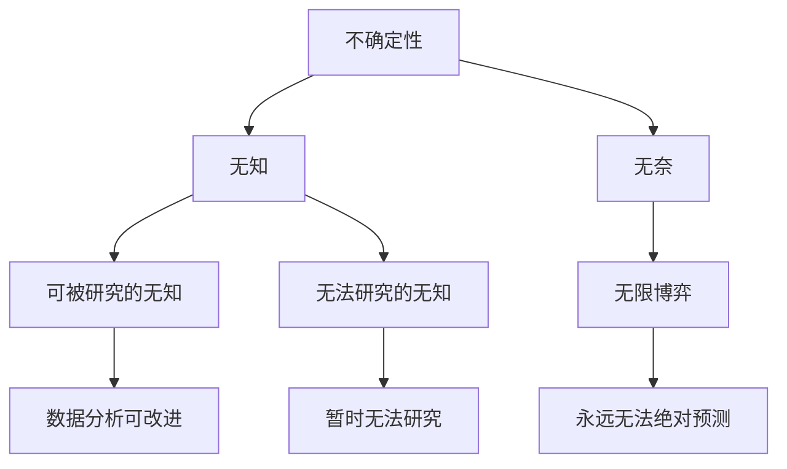
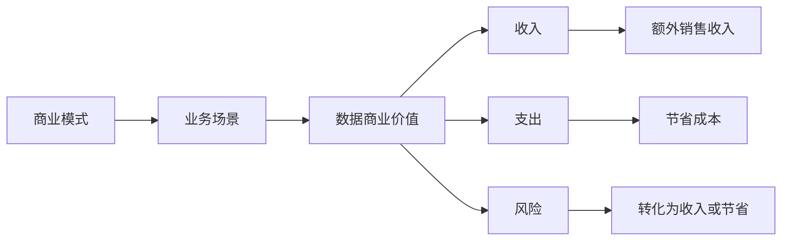
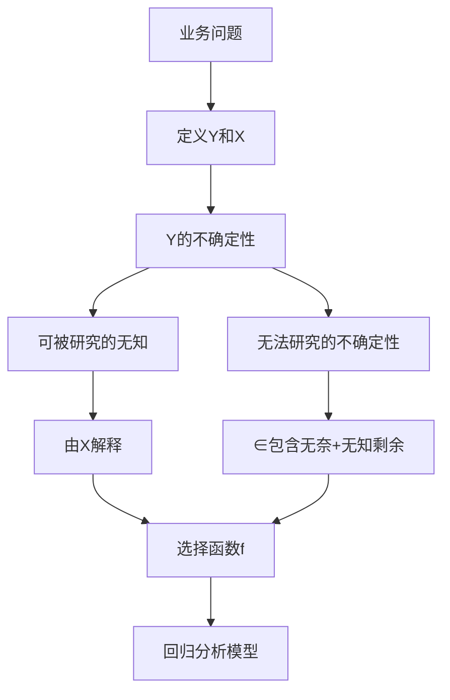
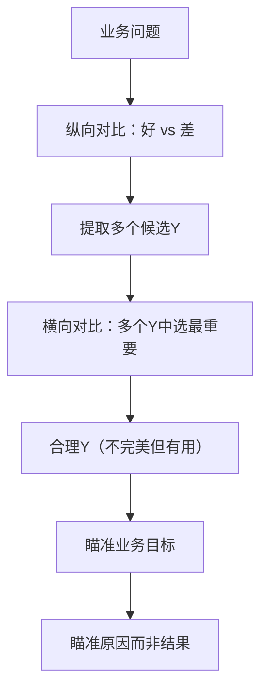
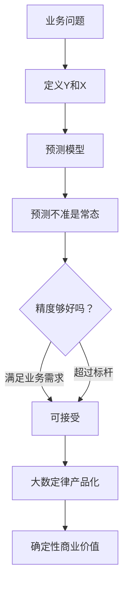
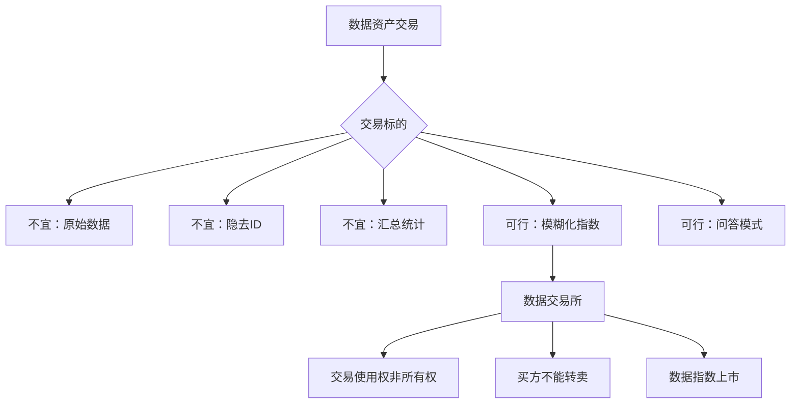
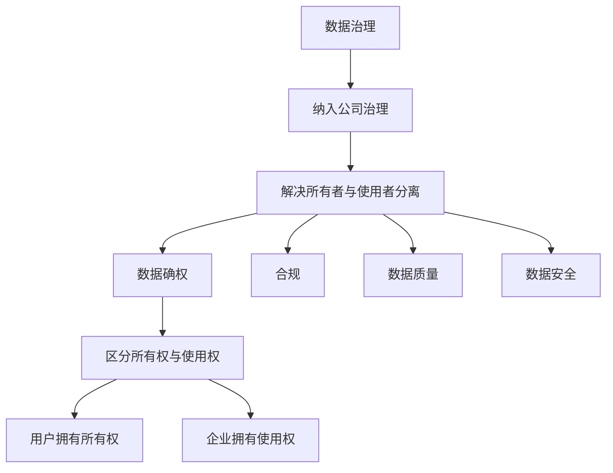

# 《数据资产论》章节总结

## 书籍信息
- 书名：数据资产论
- 作者：王汉生
- PDF 状态：完整电子版（来源于安娜的档案，共215页，正文202页）
- OCR 状态：良好，图像已嵌入，文本层可识别

## 目录说明
- 目录识别情况：完整，共十章，每章有若干小节。
- 章节对应依据：基于PDF页码和章节标题。
- OCR 修复说明：部分页面图像识别略有偏差，但内容可读，未影响核心知识提取。

## 全书核心主题
本书系统探讨了数据如何产生商业价值、如何成为可定价可交易的资产。作者认为：数据分析的核心不是算法或数据本身，而是不确定性；数据价值的实现依赖业务场景，场景第一，数据第二，算法最后。通过回归分析的“道”与“术”，将抽象业务问题转化为数据可分析问题（Y与X）。书中深入讨论了数据确权、数据资产定价与交易，提出了数据资产交易所的构想。最后强调数据治理是数据产业健康发展的制度保障。

---

## 前言/引言（第5-9页）

### 核心论点
问题：数据真的是资产吗？如何让数据产生价值？  
观点：只有能够产生商业价值的数据才能称为资产。数据价值离不开业务场景，场景为王，数据次之，算法最后。数据分析的第一步是分析业务，而非分析数据。

### 关键概念/事件
- 数据资产定义：企业拥有或控制的、预期带来经济利益的数据资源。
- 业务场景：数据产生价值的必要条件。
- 预测不准是常态：不确定性由无知和无奈组成，无奈导致永远无法绝对准确预测。
- 隐私保护的根本：数据确权与合规。
- 数据资产定价：依赖交易市场，而非数学公式。

### 逻辑推演/叙事脉络
作者从大众对大数据时代的迷思出发，指出不是所有数据都是资产。通过“场景为王”引出数据分析的难点在于将业务问题转化为数据可分析问题。接着谈到预测不准的常态，以及隐私保护的根本解决路径。最后预告全书将讨论数据确权、定价、交易形态等核心议题。

### 经典金句/数据
> “只有那些能够产生商业价值的数据才可以称为资产。” (p.5)
> “场景为王，数据次之，算法最后。” (p.6)
> “预测不准是常态，预测过度准确才是一个让人非常担忧的‘变态’。” (p.6)
> “数据资产与实物资产的不同在于，复制成本几乎为零。” (p.9)

---

## 第一章：不确定性的无知与无奈

### 核心论点
问题：数据分析的目标是什么？为什么不确定性如此重要？  
观点：数据分析的目标是在不确定性的业务场景下践行数据商业价值。不确定性产生于无知（可通过学习化解）和无奈（源于人类对稀缺资源的无限博弈，无法消除）。

### 关键概念/事件
- 不确定性（uncertainty）：个体无法绝对准确预测某事件的结果。
- 确定性事件：个体能绝对准确预测。
- 无知：可通过数据、算法、知识逐步降低的不确定性。
- 无奈：由无限博弈导致，永远无法消除。
- 不确定性的广泛存在：婚姻、职业、健康、消费行为、企业命运等。

### 逻辑推演/叙事脉络
作者首先定义不确定性，区分其与随机性的不同。然后列举大量个人、企业、自然界的例子说明不确定性无处不在。接着论证不确定性推动科研（孟德尔遗传学、流感病毒发现、牛顿力学）和创造商机（股票投资、个性化推荐）。最后分析不确定性产生的原因：无知和无奈，并以天气、股价、血压为例说明二者综合存在。结论：数据分析应聚焦“可被研究的无知”，坦然接受预测不准。

### 流程图

### 经典金句/数据
> “乱世出英雄：‘乱世’就是不确定性，‘英雄’就是数据商业价值。” (p.16)
> “无知所对应的不确定性，可以通过数据的无限积累、算法的不停改进、知识的持续增加逐步降低；无奈所对应的不确定性将长期广泛存在，甚至不会衰减。” (p.17)
> “几乎所有的不确定性现象都可以一分为二：一部分对应于无知，一部分对应于无奈。” (p.34)

---

## 第二章：数据的时代特征

### 核心论点
问题：什么是数据？数据的时代特征是什么？  
观点：数据就是电子化记录。数据的内涵随记录技术手段的变化而变化，具有强烈的时代特征。文本、声音、图像只有在能被电子化记录后才成为数据。

### 关键概念/事件
- 数据的朴素定义：电子化记录。
- 规模化应用：边际成本几乎为零的应用（如互联网应用）。
- 运营商数据：覆盖面广、精准到个人、内容丰富、集中度高、合作意愿强。
- 支付交易数据：银联、支付宝、微信等产生的消费流水。
- 手机数据：来自运营商、制造商、APP的三类数据，暴露位置、购物、社交。
- 社交网络数据：拓扑结构+节点/边属性，可用于信用评估、流失预警。
- 位置轨迹数据：GPS定位，支撑O2O产业。
- 浏览日志数据：关乎网络安全和消费者画像。

### 逻辑推演/叙事脉络
作者通过对比传统艺术创作与数码生成艺术的边际成本，引出规模化应用的关键是电子化记录。随后分别讨论文本、声音、图像在古今的不同地位，强调技术成熟使它们成为数据。接着详细分门别类介绍运营商数据、支付交易数据、手机数据、社交网络数据、位置轨迹数据、浏览日志数据的特点和商业潜力。

### 经典金句/数据
> “数据就是电子化记录，电子化记录就是数据。” (p.25)
> “在手机面前人们没有隐私可言。” (p.35)
> “社交网络数据分析的时代终于到来了。” (p.37)

---

## 第三章：朴素的数据价值观

### 核心论点
问题：数据分析的价值体现在哪里？如何衡量？  
观点：数据商业价值体现在收入、支出、风险三个方面。价值需要可量化的参照系来感知。纯粹的数据不产生价值，必须依赖业务场景。数据价值的归因往往模糊，广告效果难以准确归因。

### 关键概念/事件
- 价值三方面：增加收入、节省支出、控制风险。
- 参照系：量化对比标杆（如模型改进前的准确度）。
- 业务场景：价值创造所必需的业务元素与条件的集合。
- 商业模式决定数据价值方向（加盟vs直营案例）。
- 可被归因的价值：广告效果难以归因，限制了数据企业的发展天花板。

### 逻辑推演/叙事脉络
作者先纠正“数据量大、方法高大上就有价值”的误区，提出价值三方面。通过流失预警模型、车联网UBI、设备故障预测等案例说明参照系的重要性。强调业务场景第一，并指出连锁酒店加盟模式导致数据对总店价值不大，而直营物流企业则高度认可油耗分析。最后以互联网广告为例说明价值归因的困难。

### 流程图

### 经典金句/数据
> “数据分析的对象不是数据本身，而是数据所描述的那种不确定性。” (p.43)
> “场景第一，数据第二，算法最后。” (p.52)
> “我们的广告费一大半都被浪费掉了，但是不知道浪费在哪里。” (p.63)

---

## 第四章：回归分析的“道”与“术”

### 核心论点
问题：回归分析的本质是什么？如何将业务问题转化为数据可分析问题？  
观点：统计学研究的是不确定性，而非统计本身。回归分析之“道”是业务分析，将业务问题转化为Y和X的问题；“术”是技术模型。回归分析三部曲：定义Y和X → 拆分不确定性（可研究+不可研究）→ 选择模型设定(f)。

### 关键概念/事件
- 回归分析定义（业务层面）：将抽象不确定性业务问题转化为Y和X的数据可分析问题。
- 因变量Y：业务核心诉求。
- 自变量X：业务洞见，决定竞争优势。
- 可被研究的无知：由X解释；无法研究的不确定性：包含无知剩余和无奈，用∈表示。
- 回归五式：线性回归、0-1回归、定序回归、计数回归、生存回归。

### 逻辑推演/叙事脉络
作者先批判“统计学是收集数据、分析数据的科学”等定义，提出统计学研究不确定性。然后以老王卖老鼠药为例，逐步展示如何将销售预测问题转化为Y（销售收入）和X（广告投入），并拆分不确定性。接着讨论回归分析与管理决策的关系，区分可控型X和不可控型X。最后简要介绍回归五式的适用场景。

### 流程图

### 经典金句/数据
> “统计学不研究统计，研究的是不确定性！” (p.69)
> “回归分析的‘道’才是最重要的部分，而且极具挑战。” (p.70)
> “所有模型都是错的，但其中有可借鉴的地方。” (p.129)

---

## 第五章：因变量与业务诉求

### 核心论点
问题：如何准确定义因变量Y？  
观点：Y是业务的核心诉求，定义Y是数据分析最重要的一步。不存在完美定义的Y，只需合理、对业务有帮助。Y要瞄准真实的业务目标（原因而非结果）。

### 关键概念/事件
- 纵横对比两步法：纵向对比（好坏对比提炼Y）→横向对比（多个Y中选最重要）。
- 不存在完美Y：航线运营、车联网违章、贷款违约、客户流失等定义都有边界模糊。
- 瞄准原因而非结果：购物中心应以客流量（原因）而非租金（结果）为Y；设备维护应以电流（原因）而非故障时间（结果）为Y。

### 逻辑推演/叙事脉络
作者通过航空公司航线效率、VIP会员效果评估、车联网驾驶行为等案例，说明Y定义错误会导致分析方向错误。提出纵横对比两步法作为可复制方法论。强调Y的不完美性是正常的，只要对业务有帮助即可。最后警示：不要定义结果性Y（如过去是否进国家队），而要定义原因性Y（如提高战斗力的直接指标）。

### 流程图

### 经典金句/数据
> “定义一个准确的Y，不仅重要，而且常常是不平凡的。” (p.88)
> “没有任何业务的Y是可以完美定义的。” (p.96)
> “Y应该是业务的原因，而不是结果。” (p.103)

---

## 第六章：解释性变量与业务洞见

### 核心论点
问题：如何寻找有效的X变量？  
观点：X是业务洞见，独特而精准的X决定竞争优势。X来源于深刻的业务分析、运营实践和制度设计。通过轮岗等制度让数据分析师深入一线，才能获得独特X。

### 关键概念/事件
- X决定房价：地段（到市中心距离、交通便利、医疗、商业、学区等）的多种量化指标。
- X决定车险竞争优势：车联网数据提供通勤路况风险等新X。
- 互联网征信：不同企业（BAT、银联、运营商）拥有不同X，形成差异化优势。
- 运营实践产生X：4S店未记录优惠活动导致X无效的教训。
- 制度设计保障X：数据分析师轮岗电销一线，获得独特X。

### 逻辑推演/叙事脉络
作者以房价评估为例，展示如何将一个抽象概念“地段”具体化为几十个X变量。强调X越独特、竞争对手越难获得，竞争优势越大。通过车联网保险、征信联盟说明X就是竞争壁垒。指出许多企业不沉淀运营X变量是理念问题。最后提出制度设计（如轮岗）是持续获得独特X的关键。

### 经典金句/数据
> “X就是业务洞见。” (p.107)
> “产生X的过程，其实就是梳理我们对业务问题深刻见解的过程。” (p.111)
> “独特的X在哪里？在一线业务员的脑袋里，在一线业务战场上。” (p.123)

---

## 第七章：预测精度与产品设计

### 核心论点
问题：预测不准是常态，如何评价和改进预测精度？如何实现商业价值？  
观点：预测不准源于无奈，永远无法消除。改进预测精度的根本是增加新的X变量。业务需求或对比标杆可界定精度是否够用。借助大数定律，将不确定性的商业价值转化为确定性的产品（如Farecast保险模式）。

### 关键概念/事件
- 预测不准是常态：不确定性中的无奈部分永远无法预测。
- 随机性与不确定性：随机事件是更严格的假设，但便于建模。
- 改进精度的关键：增加X信息量，而非仅改进模型或样本量。
- 业务需求标杆：量化投资只需微超随机、征信需保证不亏钱。
- 对比标杆：当前状况、竞争对手。
- 大数定律与产品化：Farecast的票价预测保险产品，将平均节省转化为确定性收益。

### 逻辑推演/叙事脉络
作者重申预测不准是常态，并通过猜花生米故事说明随机建模是对真实不确定性的近似。指出内部交易者因拥有独特X而预测更准，从而论证X是精度改进核心。然后讨论如何界定“够好”的精度：业务需求或打败标杆。最后以Farecast为例，说明通过保险产品和大数定律，将不完美的预测转化为确定性的商业模式。

### 流程图

### 经典金句/数据
> “预测不准是常态，预测准确是变态！” (p.126)
> “改进预测精度的根本在于信息量即X变量的增加。” (p.132)
> “大数定律的本质就是从不确定性到确定性。” (p.144)

---

## 第八章：数据资产定价

### 核心论点
问题：数据资产如何定价？面临哪些挑战？  
观点：数据资产定价的必要性来自数据交易和投融资。三大挑战：数据确权、交易标的（复制成本几乎为零）、价值测算（依赖场景）。数据资产定价的微观基础是交易市场。

### 关键概念/事件
- 数据资产定义：符合会计准则（预期经济利益）的数据资源。
- 挑战一：数据确权（用户vs平台，利益共享）。
- 挑战二：交易标的（原始数据不宜交易，因为可零成本复制）。
- 挑战三：价值测算（同一数据在不同场景价值不同）。
- 价值测算方法：对比有无该数据时的净收益增量（理想场景）。

### 逻辑推演/叙事脉络
作者先提出数据并非天然是资产，必须满足预期经济利益。然后指出数据交易和投融资两个场景急需定价模型。通过狗熊商城虚构案例，逐一分析三大挑战：确权困境（用户与平台共有）、标的困境（复制成本零导致盗版）、价值困境（场景依赖）。最后指出，虽然绝对定价难，但通过市场交易、对比替代品，可以形成相对合理的价格。

### 经典金句/数据
> “数据就是资产”听起来很有道理，其实经不起推敲。” (p.147)
> “数据资产定价的基础是交易！” (p.165)
> “价格是由价值驱动的，而不是生产成本。” (p.160)

---

## 第九章：数据资产交易

### 核心论点
问题：数据资产如何交易？交易标的和形式是什么？  
观点：不宜直接交易原始数据。可行方案：数据模糊化（如征信得分）和问答模式（验证信息）。数据资产之间存在大量替代性，套利交易极易实现。可构想一个数据交易所，交易数据指数（使用权而非所有权）。

### 关键概念/事件
- 方案1：隐藏用户ID → 对业务价值大打折扣。
- 方案2：数据汇总（用户军团）→ 无法支撑个体级业务。
- 思路1：数据模糊化（如芝麻信用分）。
- 思路2：问答模式（验证谁是谁、验证通话关系）。
- 可替代性与套利：性别可用购物记录、APP使用等替代，套利比实物资产更容易。
- 假想数据交易所：交易数据指数（模糊化、精确到ID、使用权），类似股票交易所但买方不能转卖。

### 逻辑推演/叙事脉络
作者先否定直接交易原始数据或脱敏ID的方案，提出模糊化指数（如信用分）和问答模式是现实可行的。然后论证数据资产之间具有高度可替代性（如性别可用多种行为预测），套利交易极易发生，这有助于价格合理化。最后脑洞大开地构想一个数据交易所：企业将数据指数“上市”，买方购买使用权不能转卖，市场驱动数据高效利用。

### 流程图

### 经典金句/数据
> “数据交易最原始的冲动是希望获得精确到ID的指标。” (p.168)
> “对于数据资产而言，套利交易极其容易。” (p.176)
> “一个规范高效的数据交易市场会驱动数据交易合法化。” (p.182)

---

## 第十章：数据治理与价值创造

### 核心论点
问题：数据治理的内涵是什么？与公司治理的关系？  
观点：数据治理应纳入公司治理范畴。数据治理的核心是解决数据资产所有者与实际控制者分离产生的矛盾，包括数据确权、合规、质量、安全。人才团队的培养是数据治理成功的制度保障。

### 关键概念/事件
- 公司治理：解决资产所有者和实际经营者分离的矛盾。
- 数据治理的特殊性：数据产权复杂（用户与平台共有），需区分所有权和使用权。
- 数据治理内容：确权、合规、质量、安全、生命周期管理。
- 人才培养：需要数据分析师懂业务、懂数据、懂治理。

### 逻辑推演/叙事脉络
作者以银保监会《数据治理指引》为引，通过老王科技从一人公司到300人公司的故事解释公司治理的必要性。类比到数据治理：数据的所有者（用户）与使用者（企业）分离，需要制度安排。提出数据治理应包含确权、合规、质量、安全等内容。最后强调数据资产价值创造离不开专业人才团队。

### 流程图

### 经典金句/数据
> “数据治理应该纳入公司治理的范畴。” (p.185)
> “公司治理就是要解决公司实践中资产所有者和实际经营者分离所产生的矛盾。” (p.188)
> “数据作为一种新兴资产，它的治理工作有独特、重要、具体的内容。” (p.186)

---

## 后记/讨论与总结（第201页）

### 核心论点
作者总结全书的思考：数据产业的核心是践行数据商业价值，实现数据资源资产化。希望本书能起到“抛砖引玉”的作用，吸引更多学者和从业者共同探索。

### 经典金句/数据
> “我想以此书为践行数据商业价值的同行加油喝彩，为我国的数据产业讴歌，为数据资源资产化的伟大历程做忠实记录！” (p.9)
> “不经历荒诞，不尝试谬误，不蹚平陷阱，哪来的康庄大道？” (p.9)