# 《数据资源管理》章节总结

## 书籍信息
- **书名**：数据资源管理
- **作者**：陈忆金、奉国和
- **出版社**：机械工业出版社
- **出版时间**：2023年11月
- **ISBN**：9787111743217
- **字数**：250千字
- **PDF 状态**：完整文本（基于 EPUB 转换）
- **OCR 状态**：良好，可直接提取

## 目录说明
- 目录识别情况：完整，包含前言、10个章节及每章章前案例、思考题
- 章节对应依据：原书目录结构
- OCR 修复说明：无明显错漏

## 全书核心主题
本书系统阐述了数字化转型背景下数据资源管理的理论、方法与应用。围绕数据成为关键生产要素这一核心命题，从数据架构、存储、组织、分析、元数据管理、质量控制、安全管理到机构设置，构建了完整的数据资源管理知识体系。强调数据从资源到资产的转化过程，以及技术与业务的深度融合，旨在培养学生在数据管理领域的综合能力。

---

## 前言

### 核心论点
在大数据、人工智能环境下，数据资源管理成为关注焦点。本书作为信息管理与信息系统专业基础课教材，介绍数字化转型背景下数据资源管理的理论、方法与应用，贴近社会经济发展需求。

### 关键概念/事件
- 编写团队：华南师范大学经济与管理学院
- 参与学生：蔡亚芳、刘任铧、牛庆萱等
- 编写时间：2022年11月于广州

---

## 第1章：数字化转型

### 章前案例：华为数字化转型

#### 核心论点
华为从2016年正式启动数字化转型战略，面临数据标准不一致、系统复杂、服务对象多样化等挑战。通过转意识、转组织、转文化、转方法、转模式五个方面，构建前中后台架构和数据湖，实现运营效率提升与客户体验优化。

#### 关键概念/事件
- **转型背景**：业务从运营商扩展到企业业务，IT系统受冲击
- **五大转变**：转意识、转组织、转文化、转方法、转模式
- **技术架构**：前中后台架构 + 数据湖 + 数据中台
- **安全模式**：“以云治云”

#### 逻辑推演
案例先描述华为发展历程中的信息化痛点，接着分析2016年启动转型的必要性，然后详细展开五个转变的具体内容，最后总结横向三大业务流和纵向IT架构的协同。结论：数字化转型需要业务与技术双轮驱动，长期迭代。

#### 经典金句/数据
> “华为的IT投资占到了销售收入的2%～2.5%，IT从职能部门转到了生产力部门。”
> “拥有19万名员工、15万个合作伙伴，在170个国家开展业务。”

---

### 1.1 数字化转型概述

#### 核心论点
问题：什么是数字化转型？作者认为数字化转型是利用数字技术构建数据采集、传输、存储、处理、反馈闭环，打通数据壁垒，构造新产业形态、商业模式和组织结构，提升效率与用户体验的系统过程。

#### 关键概念/事件
- **数字化**：模拟信息编码为0/1的过程
- **数字化转型定义**：四种学者观点 + 国务院发展研究中心定义
- **目标**：政府（治理创新）、企业（管理精细化、产品差异化、服务精准化、决策科学化、客户体验个性化）、社会（智慧治理）
- **特征**：长期战略、数据要素驱动、业务与技术双轮驱动、规划与局部建设协同
- **战略意义**：政府（全球竞争）、企业（泛在感知、智能决策、社会化协同）、社会（技术发展必然产物）

#### 逻辑推演
从“数字地球”概念引入，通过中国数字经济总量增长数据说明转型必要性，再综合多种定义得出作者定义。然后分层阐述政府、企业、社会三大主体的转型目标，提炼四大特征，最后从政府、企业、社会三个维度说明战略意义。

#### 经典金句/数据
> “2002—2018年间，中国数字经济总量从1.2万亿元增加到31.3万亿元，年均增长率达到22.6%。”
> “数据是继土地、劳动力、资本、技术之后的第五大生产要素。”

---

### 1.2 数字化转型机理与过程

#### 核心论点
问题：数字化转型如何发生？作者认为转型由技术驱动、需求倒逼、管理创新、文化变革四个方面组成，路径分为基础信息化、应用数字化、全面系统化、智慧生态化四个阶段。

#### 关键概念/事件
- **技术驱动**：物联网、云计算、大数据、区块链、5G（ABCD5）
- **需求倒逼**：用户参与生产过程，倒逼企业向柔性化、定制化转型
- **管理创新**：打破组织边界，从“市场内竞争”转向“市场间竞争”
- **文化变革**：组织文化是关键保障
- **华为方法论**：1个目标、2个对象、3个阶段、4A架构、5个转变
- **转型路径**：基础信息化 → 应用数字化 → 全面系统化 → 智慧生态化

#### 流程图

**数字化转型机理图（图1.1）**

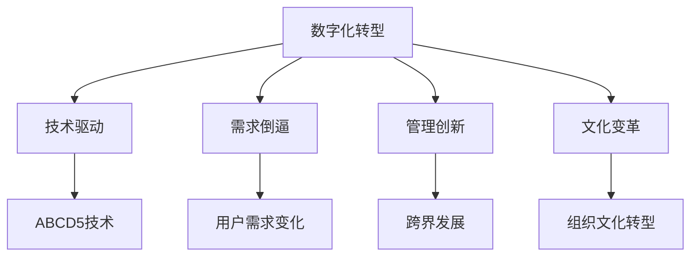

**数字化转型路径（图1.3）**

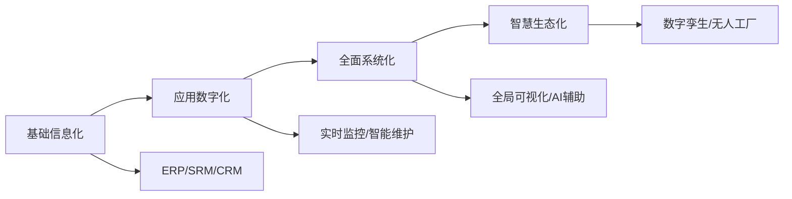

#### 经典金句/数据
> “数据驱动是将企业的数据资产梳理清楚，对之进行集成、共享、挖掘，从而发现问题，驱动创新。”
> “数字化转型不仅是技术部门的事情，更需要技术部门和业务部门之间强有力的配合。”

---

### 1.3 数据成为重要战略资源

#### 核心论点
问题：数据为何成为战略资源？作者认为数据已被国家列为第五大生产要素，数据要素市场加速培育，数据确权与交易成为关键，数据价值需要通过价值链实现。

#### 关键概念/事件
- **国家战略里程碑**：2015年大数据上升为国家战略 → 2019年数据列为生产要素 → 2020年要素市场化配置意见 → 2021年《数据安全法》《个人信息保护法》
- **数据要素特征**：需求性、不可替代性、稀缺性；非物质性、共享性、非均质性、外部性
- **数据确权难点**：产权界定复杂、原始与衍生数据权属不清、法律不完善
- **数据交易类型**：基于数据集的交易、基于数据分析衍生品的交易
- **数据价值链**：数据获取 → 数据存储 → 数据分析 → 数据应用
- **数据定价方法**：成本法、收益法、市场法、条件价值法、隐私价值法

#### 数据价值链图（图1.4）

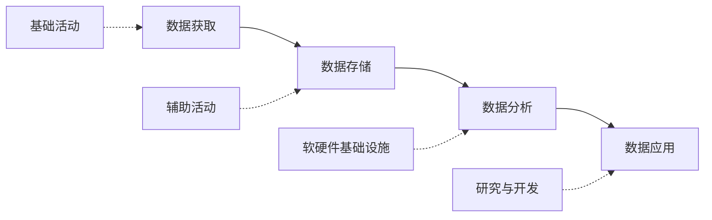

#### 经典金句/数据
> “数据正成为企业进行决策、生产、营销、交易、配送、服务等商务活动所必不可少的投入品和重要的战略性资产。”
> “截至2019年年底，我国数据交易平台超50个。”

---

## 第2章：数据与数据资源管理

### 章前案例：汉王科技“从数据到智慧”

#### 核心论点
汉王科技通过手写识别、OCR识别、NLP技术，构建“从数据到智慧”的战略蓝图，解决国家大数据中心建设中的数据智能采集问题。

#### 关键概念/事件
- 核心技术：手写识别、OCR、NLP
- 应用场景：文本分类、聚类、知识抽取、知识图谱
- 战略路径：数据 → 信息 → 知识 → 智慧

---

### 2.1 数据、信息、知识与智慧（DIKW框架）

#### 核心论点
问题：数据、信息、知识、智慧如何区分与转化？作者基于DIKW金字塔框架，阐述四者的定义、类型与特征，强调知识是经过组织处理的数据与信息，智慧是知识积累后指导正确行动的能力。

#### 关键概念/事件
- **数据**：事实或观察结果，未经加工的原始素材（如“1949年”）
- **信息**：有意义的、可处理的数据（如“新中国成立于1949年”）
- **知识**：经过组织和处理的数据与信息，可用于决策（如“国庆节知识”）
- **智慧**：根据价值驱动的智能行为，将知识应用于新情境
- **数据分类**：内部/外部、结构化/非结构化、基础数据/主数据、事务/观测/规则/报告/元数据
- **信息特征**：普遍性、广延性、传递性、载体独立性、相对性、共享性、不可变换性、时效性
- **知识分类**：显性/隐性、Know-what/why/how/who
- **智慧分类**：理性/感性、常规/应变、个人/一般、道德/非道德、德慧/物慧

#### DIKW框架逻辑

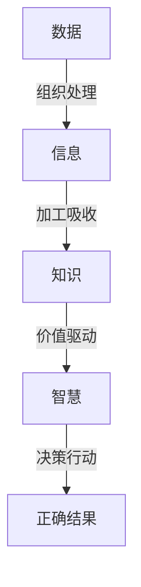

#### 经典金句/数据
> “信息是用来减少随机不确定性的东西，信息的价值是确定性的增加。”——克劳德·香农
> “知识是数据和信息的组合，再加上专家意见、技能和经验，形成可用于辅助决策的宝贵资产。”

---

### 2.2 数据管理

#### 核心论点
问题：数据管理是什么？作者认为数据管理是利用计算机技术对数据进行有效存储、处理和应用的活动，目标是理解数据需求、确保数据质量、保护隐私、为组织增值。

#### 关键概念/事件
- **DAMA定义**：数据管理是开发、执行和监督计划、政策、方案等，以交付、控制、保护、提升数据资产价值
- **管理目标**：可衡量、可执行、现实的、及时的
- **数据管理技术**：
  - 存储技术：文件系统（GFS）、层次/网状数据库、关系型数据库、数据仓库、大数据管理系统（NoSQL）
  - 存取技术：视图、索引、查询（Hadoop/Probery）
  - 应用技术：区块链、知识图谱、机器学习

#### 流程图

**GFS系统架构（图2.1）**

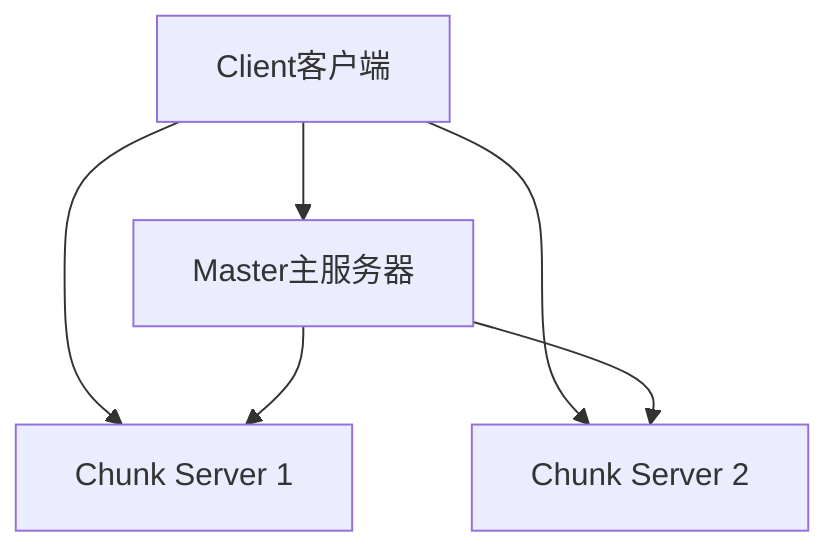

#### 经典金句/数据
> “数据管理是指利用计算机技术对数据进行有效且高效的存储、处理和应用。”

---

### 2.3 数据资源管理

#### 核心论点
问题：数据资源管理与数据管理有何区别？作者认为数据资源管理是在数据管理基础上，挑选对企业运营有价值的数据进行加工处理，使数据支持运营决策。数据资源管理包括数据识别与采集、描述、组织、控制、分析五个步骤。

#### 关键概念/事件
- **数据资源**：具有潜在利用价值的数据，包括政府、企业、公共数据资源
- **数据资源管理定义**：应用数据库管理、数据仓库等技术，对数据资源进行组织、规划、协调、配置和控制
- **五大流程**：识别与采集 → 描述 → 组织 → 控制 → 分析
- **管理方法与技术**：事务处理系统(TPS)、管理信息系统(MIS)、决策支持系统(DSS)、知识管理系统(KMS)、关联数据、数据中台、数据挖掘、商务智能(BI)、企业资源计划(ERP)
- **发展历程**：人工管理 → 文件管理 → 数据库管理 → 分布式/面向对象 → 数据湖
- **研究视角**：技术、社会、经济、行政法律、伦理

#### 数据资源管理流程图（图2.2）

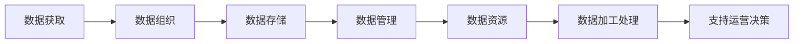

#### 经典金句/数据
> “数据资源管理是在数据管理的基础之上开展的，数据管理完成了数据获取、组织、存储等工作。”
> “数据湖的概念最早在2010年由Dixon提出。”

---

## 第3章：数据架构与设计

### 章前案例：产业链协同云服务平台（汽车行业）

#### 核心论点
汽车产业链协同云服务平台通过独立数据架构和共享数据架构两种模式，解决多租户表单差异化定制问题，支撑13家整车制造企业和8000多家上下游企业业务协作。

#### 关键概念/事件
- **两种架构**：独立数据架构（为每个联盟创建独立数据库实例）、共享数据架构（基于名称键值对+XML）
- **应用效果**：降低企业信息化门槛、提高业务协同效率
- **技术支撑**：表单定制技术、XML数据配置

#### 流程图

**独立数据架构（图3.1）**

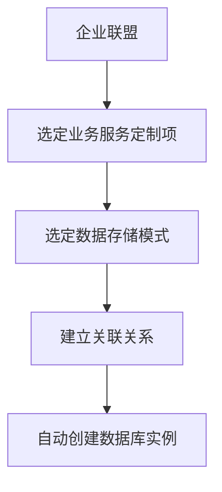

**共享数据架构（图3.2）**

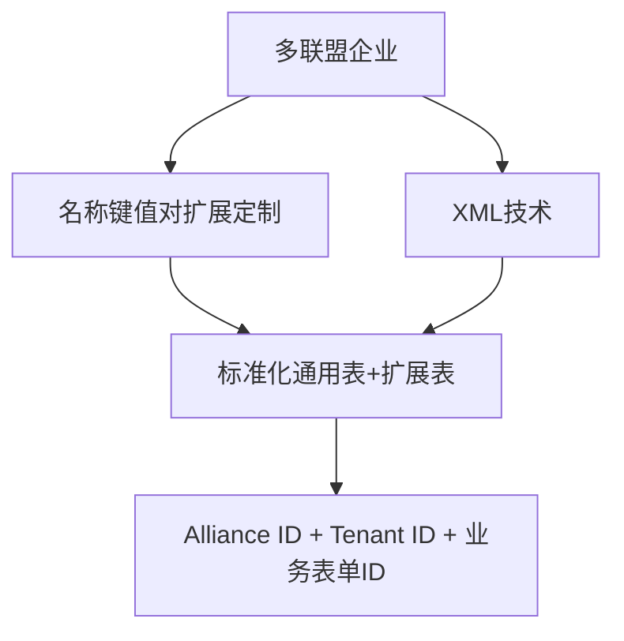

---

### 3.1 数据架构概述

#### 核心论点
问题：数据架构是什么？作者认为数据架构是数据资源规划的基础，包括元数据管理、数据模型和数据分布，目标是将业务需求转化为数据和系统需求，构建统一数据标准，提高企业运营效率。

#### 关键概念/事件
- **DAMA定义**：识别数据需求，设计总蓝图，指导数据集成
- **华为定义**：以结构化方式描述业务运作和管理决策所需信息及其关系
- **五大基本原则**：数据质量、数据治理、定期审核数据来源、区分数据属性、了解属性粒度
- **大数据架构原则**：集中式数据管理、自定义界面、通用词汇、受限数据移动、数据管理、系统安全
- **华为五原则**：数据按对象管理、企业视角定义、遵从分类框架、业务对象结构化数字化、数据服务化同源共享

#### 经典金句/数据
> “数据架构是为了更好的数据组织。”
> “成熟的数据架构可以迅速地将企业的业务需求转换为数据和应用需求。”

---

### 3.2 数据分层结构

#### 核心论点
问题：数据如何分层组织？作者提出主题域、业务对象、逻辑数据实体、属性四个层次，形成数据仓库的分层设计。

#### 关键概念/事件
- **主题域**：宏观分析领域，如销售分析、财务分析
- **主题域划分方式**：按业务/过程、按需求方、按功能/应用、按部门
- **业务对象**：数据架构的基石，分为实体、过程、事件三类
- **逻辑数据实体**：业务对象属性的分组
- **属性**：信息架构的最小粒度

#### 主题域划分示例图（图3.4-3.7）

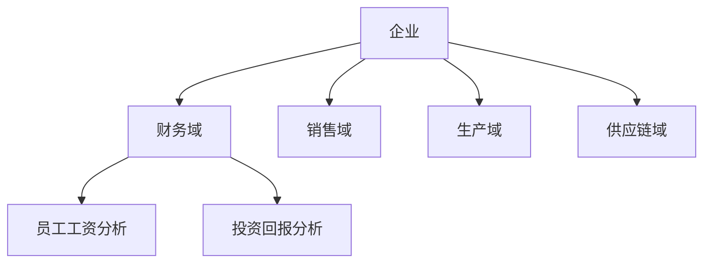

---

### 3.3 数据建模

#### 核心论点
问题：数据模型如何构建？作者详细介绍数据模型组件（实体、关系、属性、域）、模型级别（概念、逻辑、物理）以及六种建模方法（关系、维度、面向对象、基于事实、基于时间、非关系型）。

#### 关键概念/事件
- **实体**：可相互区分的事物，如学生、课程
- **关系**：实体之间的关联，有一元、二元、三元关系
- **属性**：描述实体性质的特征
- **键**：唯一标识实体的属性集合（主键、外键、代理键等）
- **域**：属性的技术属性集合（数据类型、长度、取值范围）
- **概念模型**：E-R图
- **逻辑模型**：层次、网状、关系、面向对象
- **物理模型**：存储结构、索引、分区
- **维度建模四步骤**：选择业务过程 → 声明粒度 → 确认维度 → 确认事实
- **星形/雪花/星座模型**

#### 关系建模示例（E-R图）

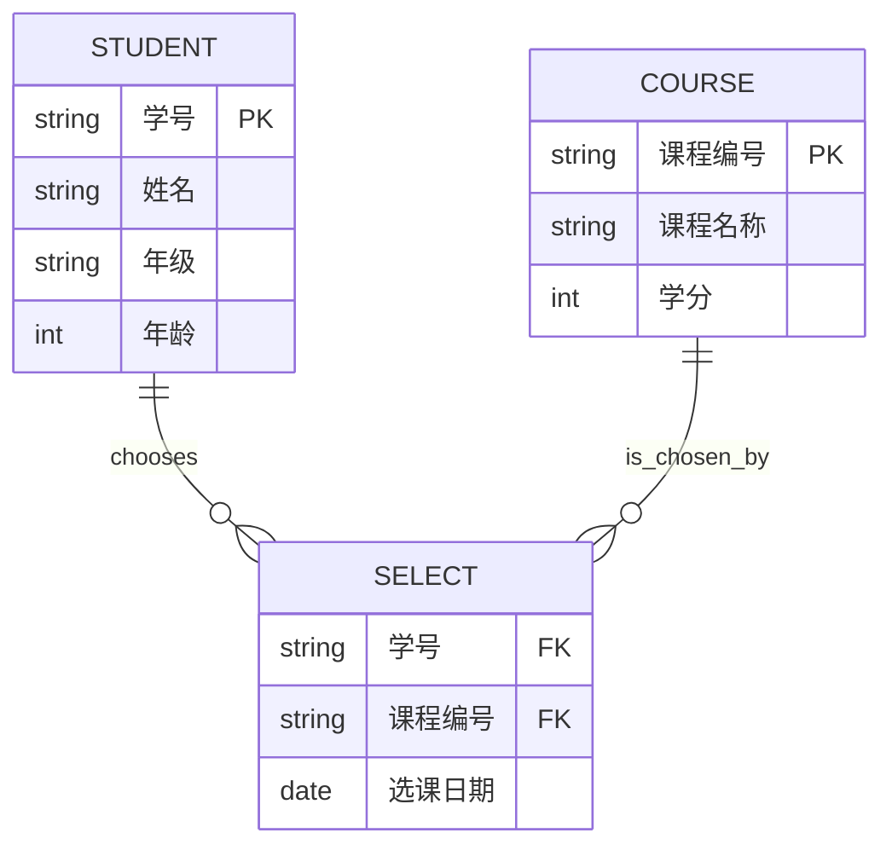

#### 维度建模星形模型（图3.19）

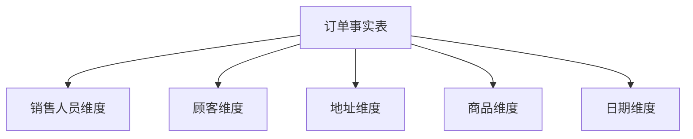

---

### 3.4 数据感知

#### 核心论点
问题：数据如何采集和感知？作者将数据来源分为应用程序数据、模拟信号数据和外部数据，并介绍各自的采集技术。

#### 关键概念/事件
- **应用程序数据采集**：埋点（代码、可视化、全埋点）、日志数据、网络爬虫
- **模拟信号数据采集**：条形码/二维码、磁卡、RFID/NFC、OCR/ICR、图像/音频/视频、传感器、工业设备
- **外部数据来源**：数据公司、直复营销组织、零售商、信用卡公司、信用调查公司、政府机构等

---

## 第4章：数据存储与管理

### 章前案例：环境大数据数据湖

#### 核心论点
环境大数据具有多源异构、数据孤岛等特点。采用数据湖架构，通过资源管理层、存储层、分析层三层结构，支持读时模式，实现灵活的数据存储与分析。

#### 关键概念/事件
- **数据湖优势**：保存原始格式、支持结构化/半结构化/非结构化、读时模式
- **三层架构**：资源管理层（数据流入）→ 存储层（OSS对象存储）→ 分析层（读时模式+数据回流）
- **数据迁移工具**：DataX、OSSutil

#### 数据湖架构图（图4.1）

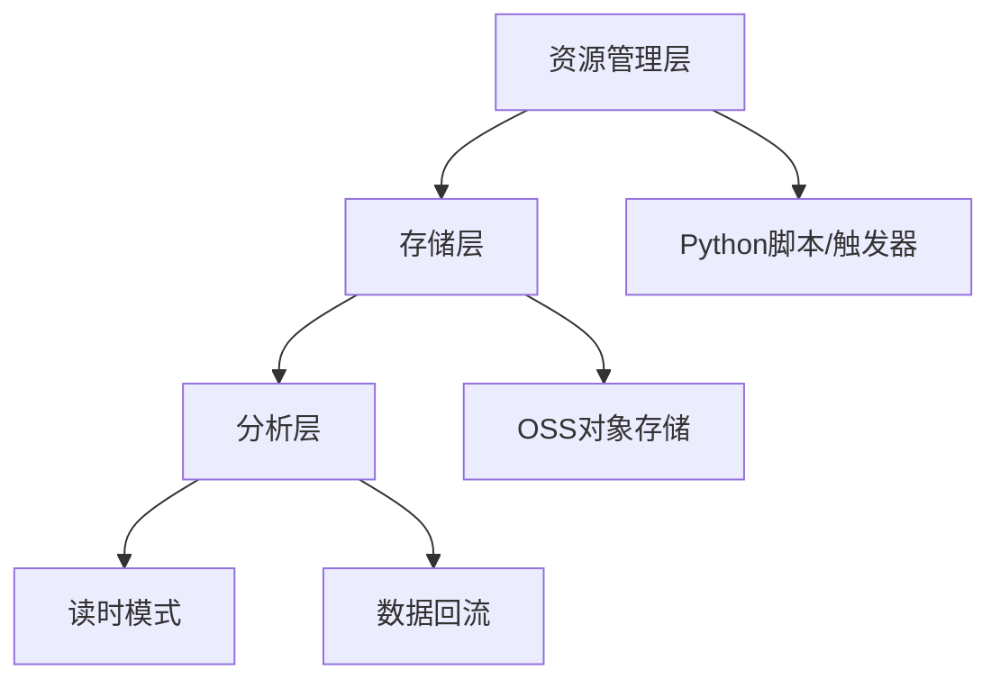

---

### 4.1 数据存储基本理论

#### 核心论点
问题：数据存储有哪些方式和发展阶段？作者介绍在线/离线/近线存储，以及文件存储、关系型数据库、非关系型数据库、内存数据库、分布式数据库五个发展阶段。

#### 关键概念/事件
- **在线存储**：随时可读取（磁盘）
- **离线存储**：备份用，速度慢（磁带）
- **近线存储**：性能较低，容量大
- **DNA存储**：新兴技术，敦煌壁画存入DNA，可保存千年
- **发展阶段**：文件系统 → 关系型数据库（Oracle/MySQL）→ NoSQL（键值/列/文档/图）→ 内存数据库（Redis）→ 分布式数据库（TDSQL/GaussDB/Oceanbase）

---

### 4.2 数据湖

#### 核心论点
问题：数据湖是什么？与数据仓库有何区别？作者定义数据湖为存储原始格式数据的集中式存储库，具有海量化、兼容化、多样化、高速化、增值化特点。

#### 关键概念/事件
- **数据湖定义**：James Dixon 2010年提出
- **与数据仓库对比**：存储结构（所有类型 vs 结构化）、模式（读时 vs 写入）、成本（低 vs 高）、灵活性（高 vs 低）、用户（高级用户 vs 业务分析师）
- **入湖数据类型**：模拟信号数据、应用程序数据、非结构化文本数据
- **数据湖体系结构**：原始数据区、加工区、访问区、管辖区
- **数据流转**：数据存储 → 数据融合 → 数据检索与分析 → 数据归档

#### 数据湖体系结构图（图4.4）

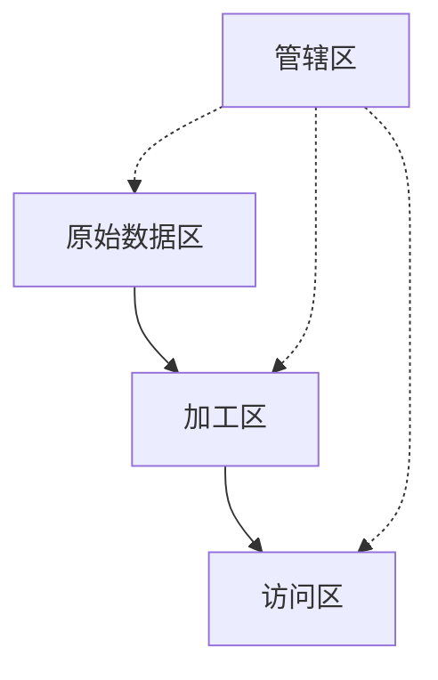

#### 经典金句/数据
> “数据湖是一个数据存储库，将来自于多个数据源的数据以它们原生态的方式进行存储。”
> “数据湖的存储空间海量化、存储格式兼容化、数据类型多样化、数据处理高速化、数据价值增值化。”

---

## 第5章：数据组织

### 章前案例：智慧党建

#### 核心论点
智慧党建通过合理组织人员数据、党组织数据、政策数据等，建立数据关联，发现党建工作问题，提供决策支持。

#### 关键概念/事件
- 数据类型：人员、党组织、政策、历史与发展数据
- 组织目标：从“档案室资料”变为“爆发性价值”

---

### 5.1 数据组织基础

#### 核心论点
问题：数据组织是什么？作者认为数据组织是按一定方式和规则对数据进行归并、存储与处理，形成综合数据集合的过程，需遵循系统性、可扩展性、目的性、有序性原则。

#### 关键概念/事件
- **数据组织**：分为物理组织和逻辑组织
- **原则**：系统性、可扩展性、目的性、有序性
- **目标**：便于检索、提高效率、节约存储、易于分析挖掘
- **与信息组织、知识组织区别**：信息组织关注外部/内容特征，知识组织关注知识单元和关联

---

### 5.2 数据组织工具

#### 核心论点
问题：有哪些数据组织工具？作者介绍六种工具：代码表法、分类法、标签法、元数据法、本体、知识图谱。

#### 关键概念/事件
- **代码表法**：用字母/数字代表数据，如行业代码表（A农、林、牧、渔业）
- **分类法**：按科学性、稳定性、实用性、扩展性原则分类（政府/企业/个人/行业/数据类型/等级等视角）
- **标签法**：从原数据加工的特征标识，分事实/规则/模型标签
- **元数据法**：关于数据的数据，包括业务、技术、操作元数据
- **本体**：共享概念模型的明确形式化规范，分顶层/领域/任务/应用本体
- **知识图谱**：实体-关系-实体三元组结构，用于语义搜索、智能问答

#### 本体构建七步法（图5.4）


#### 知识图谱构建流程（图5.16）

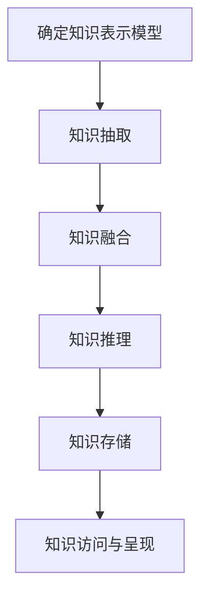

#### 经典金句/数据
> “标签是面向业务的数据资产载体，每一个标签都会与底层数据字段相映射。”
> “本体是概念模型的明确的规范说明。”——Gruber

---

### 5.3 数据湖中的数据组织

#### 核心论点
问题：数据湖中不同类型数据如何组织？作者将数据湖分为初始数据池、模拟信号数据池、应用程序数据池、文本数据池和归档数据池，针对不同类型采取不同的组织策略。

#### 关键概念/事件
- **初始数据池**：数据进入第一站，快速分发
- **模拟信号数据池**：数据缩减（切除、聚类、压缩、平滑、插值、采样、舍入、编码）
- **应用程序数据池**：数据整合、建立数据模型
- **文本数据池**：语境化处理（NLP、MapReduce）、分类、本体、知识图谱
- **归档数据池**：保存不常用但未来可能用到的数据

#### 数据池间关系（图5.19）

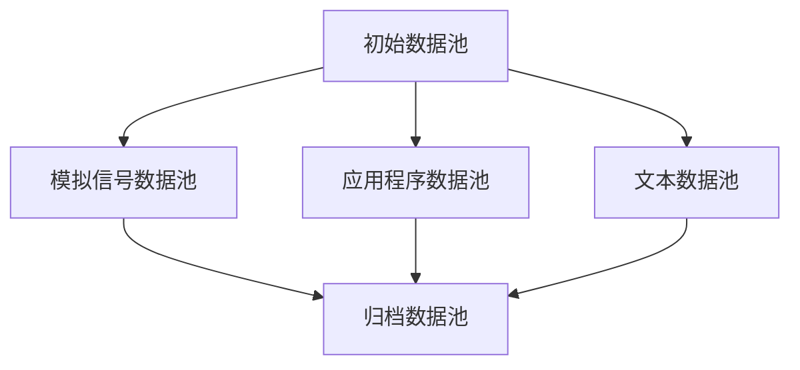

---

## 第6章：数据分析与服务

### 章前案例：华为数据服务

#### 核心论点
华为将数据服务分为“数据集服务”和“数据API服务”，提出“服务+自助”模式，各业务部门可调用已建好的数据服务进行自助分析，缩短报表开发周期。

#### 关键概念/事件
- **数据集服务**：提供方被动公开数据集，消费方自行决定处理逻辑
- **数据API服务**：响应随机数据事件，提供执行结果
- **自助服务**：面向业务分析师、数据科学家、IT开发人员提供差异化服务
- **多租户管理**：租户隔离与个性化定制

---

### 6.1 数据分析概论

#### 核心论点
问题：数据分析是什么？作者认为数据分析是用适当统计方法对数据进行处理、建模、提取有用信息并辅助决策的过程，包括关联分析、对比分析、聚类分析、留存分析、帕累托分析、象限分析、ABtest、漏斗分析、路径分析等方法。

#### 关键概念/事件
- **关联分析**：购物篮分析，支持度、置信度、提升度
- **对比分析**：横向、纵向、目标、时间对比
- **聚类分析**：K-means、谱聚类、层次聚类
- **留存分析**：次日/3日/7日/14日/30日留存
- **帕累托分析**：80/20法则，ABC分类
- **象限分析**：RFM模型、波士顿矩阵
- **ABtest**：对照实验
- **漏斗分析**：AARRR模型
- **路径分析**：用户行为路径追踪

#### 漏斗模型示例（图6.9）

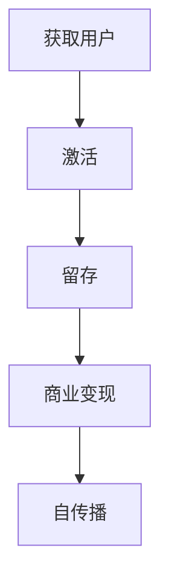

---

### 6.2 数据可视化

#### 核心论点
问题：数据可视化如何实现？作者定义数据可视化是将数据以视觉形式呈现，过程包括数据采集、清洗、连接数据源、创建图表、布局排版、页面预览与共享。

#### 关键概念/事件
- **数据清洗**：处理无效值、缺失值（删除或插补）
- **图表类型**：条形图、直方图、饼图、折线图、箱形图、散点图、地图
- **可视化方法**：面积与尺寸、颜色、图形、地域空间、概念可视化
- **布局原则**：左上角最重要，沿对角线递减

#### 数据可视化流程（图6.12）

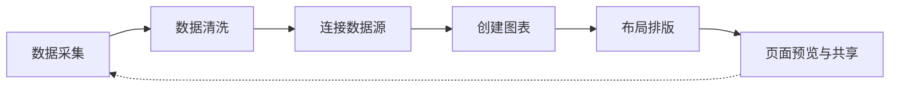

---

### 6.3 数据服务

#### 核心论点
问题：数据服务如何分类？作者将数据服务分为数据集服务和数据API服务（企业），以及基础数据服务、标签画像服务、算法模型服务（数据中台），强调以用户体验为中心的自助服务。

#### 关键概念/事件
- **数据自助服务步骤**：发现和理解数据 → 建立信任 → 数据预置 → 为分析准备数据 → 分析和可视化
- **数据目录**：业务术语与数据集关联，支持标签搜索
- **信任三维度**：数据质量、血缘、管理员
- **可视化工具**：Tableau、Qlik、Arcadia Data、AtScale

---

## 第7章：元数据管理

### 章前案例：华为元数据管理

#### 核心论点
华为建立公司级元数据管理机制，打通业务元数据与技术元数据，确保数据“入湖有依据，出湖可检索”，解决数据找不到、读不懂、不可信的问题。

#### 关键概念/事件
- **痛点场景**：数据分析师面对几十个IT系统不知道从哪里拿数据；超过40个数据表和1000个字段难以理解
- **元数据价值环节**：数据消费侧、服务侧、主题侧、数据湖侧、数据源侧

---

### 7.1 元数据管理概述

#### 核心论点
问题：元数据是什么？作者定义元数据为“关于数据的数据”，作用是描述、定位、检索、管理、评估、交互。元数据管理是元数据定义、收集、管理和发布的方法、工具及流程的集合。

#### 关键概念/事件
- **元数据定义**：数据的数据，如图书馆卡片、版权说明
- **作用**：描述、定位、检索、管理、评估、交互
- **在数据仓库中的作用**：帮助理解数据、辅助生命周期管理、提供监控、辅助质量管理
- **在银行领域作用**：帮助理解数据、实现业务与技术映射、支持系统升级、降低风险、促进数据交换

---

### 7.2 元数据类型与架构

#### 核心论点
问题：元数据有哪些类型和架构？作者分为业务元数据、技术元数据、操作元数据三类，架构分为集中式、分布式、混合式三种。

#### 关键概念/事件
- **业务元数据**：业务定义、术语、指标、规则
- **技术元数据**：表名、列名、字段类型、血缘关系、SQL脚本
- **操作元数据**：数据所有者、访问方式、权限、日志
- **元数据标准**：DC（都柏林核心）、MARC、VRA、CDWA

#### 元数据架构对比

| 类型 | 特点 | 优点 | 缺点 |
|------|------|------|------|
| 集中式 | 单一元数据存储 | 统一、一致、质量高 | 依赖中心 |
| 分布式 | 无集中存储，实时获取 | 最新有效 | 未标准化 |
| 混合式 | 部分存储部分实时 | 折中 | 设计复杂 |

---

### 7.3 元数据管理流程

#### 核心论点
问题：元数据管理如何操作？作者提出元数据创建、维护、查询、分析四个流程，重点介绍血缘分析、影响分析、冷热度分析、关联度分析。

#### 关键概念/事件
- **元数据创建**：确定范围 → 接入 → 建立标准
- **元数据维护**：新增、修改、删除、发布，需走审批流程
- **元数据查询**：关键字检索、类别浏览、高级检索、二次检索；支持本体语义查询
- **血缘分析**：追溯数据来源和加工过程，DAG有向无环图可视化
- **影响分析**：定位元数据修改影响的下游范围

#### 数据血缘分析示例（图7.3）

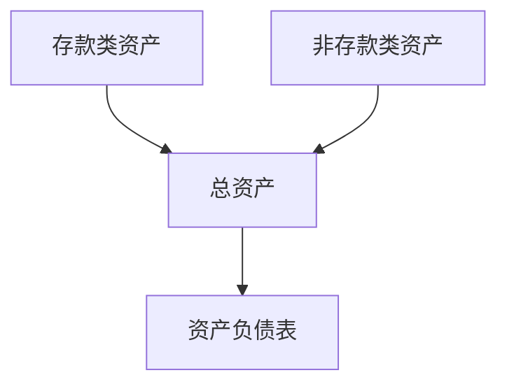

---

### 7.4 元数据管理策略

#### 核心论点
问题：如何管理元数据？作者介绍传统集中结构、分散结构、邦联结构，以及HANDLE通用元数据模型。

#### 关键概念/事件
- **集中结构**：单一中心元数据库
- **分散结构**：局部自治，共享子集
- **邦联结构**：局部数据库 + 共享交换接口
- **HANDLE模型**：支持多粒度、灵活集成、数据湖特性、标签分类

#### HANDLE核心模型（图7.6）

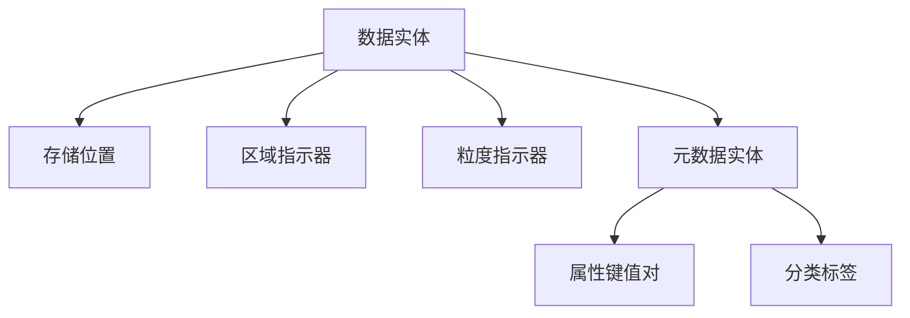

---

## 第8章：数据质量控制

### 章前案例：浦发银行数据质量管理

#### 核心论点
浦发银行从管理、科技、业务三方面“融入”数据质量管控：高层管理机制、优化开发流程、规范业务操作，实现“精、准、快”的数据要求。

#### 关键概念/事件
- **管理融入**：成立数据治理工作领导小组，纳入绩效考核
- **科技融入**：融入信息化全流程和数据全生命周期
- **业务融入**：定制宣贯培训，优化业务流程表单

---

### 8.1 数据质量控制概述

#### 核心论点
问题：数据质量是什么？作者认为数据质量是数据适合使用的程度，包含准确性、完整性、一致性、及时性四个要素。数据质量控制是对数据生命周期中可能引发的质量问题识别、度量、监控、预警的管理活动。

#### 关键概念/事件
- **准确性**：语义准确与语法准确
- **完整性**：记录完整，无缺失
- **一致性**：格式统一，逻辑一致
- **及时性**：数据延时在合理范围
- **数据质量控制定义**：对数据计划、收集、记录、存储、回收、分析、展示各阶段进行管理

---

### 8.2 数据质量控制过程

#### 核心论点
问题：数据质量控制分哪些阶段？作者分为事前预防控制、事中过程控制、事后监督控制三个阶段，以及设计目标、控制原始数据、选择采集手段、数据准备、过程监控、结果控制六个环节。

#### 关键概念/事件
- **事前预防**：建立数据标准化模型、元数据管理、根本原因分析
- **事中过程**：强化标准化生产、数据质量预警机制
- **事后监督**：设置质量规则、检查任务、问题报告、改进方案、评估考核
- **Krantz理论**：用于数据质量维度的定量测量

#### 数据质量控制流程（图8.1）

```mermaid
graph LR
    A[设计质量控制目标] --> B[控制原始数据质量]
    B --> C[选择采集手段]
    C --> D[数据准备]
    D --> E[过程监控]
    E --> F[结果控制]
```

---

### 8.3 数据质量评估与改进

#### 核心论点
问题：如何评估和改进数据质量？作者提出六步评估法（分析需求、确定对象、选取维度、执行评估、撰写报告、定期重复），以及五种改进方法。

#### 关键概念/事件
- **评估六步骤**：分析需求 → 确定对象 → 选取质量维度和指标 → 执行评估 → 撰写报告 → 定期重复
- **改进方法**：
  1. 明确业务需求，源头控制
  2. 建立质量控制机制（自动发现问题、跟踪整改）
  3. 将质量规则构建到数据集成过程中
  4. 检查异常并完善规则
  5. 建立第三方数据认证机制

---

### 8.4 数据湖数据质量控制

#### 核心论点
问题：数据湖中如何控制数据质量？作者提出从单向数据湖改造为多向数据湖，需要元数据、整合图谱、语境、元过程四个基础组件。

#### 关键概念/事件
- **单向数据湖问题**：数据被掩藏，元数据缺失，关系丢失
- **四个基础组件**：
  - 元数据：描述数据的标签
  - 整合图谱：数据整合规范
  - 语境：文本上下文
  - 元过程：数据处理信息
- **数据调整**：模拟信号（数据缩减）、应用程序（数据整合）、文本（文本消歧）、外部数据（合规优先等原则）

---

### 8.5 异常数据监控

#### 核心论点
问题：如何监控异常数据？作者构建数据异常监控体系，包括异常检测、异常定位、归因验证、异常处理，并介绍多种监控方法。

#### 关键概念/事件
- **异常检测**：制定数据质量规则（单列/跨列/跨行/跨表）、异常值检测（业务预期+合群预期）、异常值预警
- **异常定位**：确认来源准确性 → 确定异常时间段 → 维度拆分 → 外部/内部归因（PEST分析法 + 生产者/参与者/加工者模型）
- **归因验证**：AB实验
- **监控方法**：
  - 单变量：简单统计量、3σ准则、Z-score、箱形图
  - 时间序列：恒定阈值、相对值（同比/环比）、移动平均、STL分解、ARMA模型
  - 多变量：聚类模型（K-means）、孤立森林、One-Class SVM

#### 数据异常监控体系（图8.4）

```mermaid
graph TD
    A[数据异常检测] --> B[数据异常定位]
    B --> C[归因验证]
    C --> D[异常处理]
    A --> A1[制定规则/检测/预警]
    B --> B1[来源/时间段/维度/归因]
    C --> C1[AB实验]
    D --> D1[建议策略/追踪]
```

#### 3σ准则概率密度函数（图8.5）

```mermaid
graph LR
    subgraph 正态分布
        A[μ-3σ] --- B[μ-2σ] --- C[μ-σ] --- D[μ] --- E[μ+σ] --- F[μ+2σ] --- G[μ+3σ]
    end
    style D fill:#f9f,stroke:#333
```

---

## 第9章：数据安全管理

### 章前案例：国家安全部公布三起危害重要数据安全案例

#### 核心论点
境外间谍情报机关通过网络攻击、咨询调查公司、私自架设气象观测设备等方式窃取我国航空数据、航运数据、气象敏感数据，数据安全管理具有紧迫性和必要性。

#### 关键概念/事件
- **案件一**：某航空公司信息系统遭网络武器攻击，乘客出行记录被窃取
- **案件二**：境外咨询调查公司与间谍情报机关关系密切，搜集航运数据
- **案件三**：私自架设气象观测设备，数据传送至境外

---

### 9.1 数据安全管理概述

#### 核心论点
问题：数据安全是什么？作者从体制、形态、内容、主体、操作五个维度定义数据安全，提出数据安全管理的规划（建立安全组织、制定制度规范、建立技术架构）和流程（需求分析、对象识别、风险评估、治理规划、持续改善）。

#### 关键概念/事件
- **数据安全四维度**：物理、人员、程序、技术
- **主要威胁**：数据被滥用、误用、窃取
- **数据安全与数据治理差异**：发起部门、目标、产出、资产管理不同
- **数据安全与信息安全差异**：信息安全更强调内容合法性
- **数据分类分级**：国家建立分类分级保护制度（核心数据、重要数据、一般数据）
- **数据安全管理规划**：安全组织、制度规范、技术架构
- **数据安全管理流程**：需求分析 → 对象识别 → 风险评估 → 治理规划 → 持续改善
- **数据安全风险评估**：数据生命周期评估 + 场景化评估
- **管理工具**：身份认证、授权访问控制、资产保护、监察审计、区块链、沙盒

#### 数据安全管理核心理念（图9.1）

```mermaid
graph TD
    A[一个组织] --> B[两个分支]
    B --> C[三个体系]
    C --> C1[治理体系]
    C --> C2[防护体系]
    C --> C3[监控体系]
```

#### 权限鉴权流程（图9.9）

```mermaid
graph LR
    A[用户请求] --> B[身份认证]
    B --> C[鉴权授权]
    C --> D[访问控制]
    D --> E[数据访问]
    E --> F[审计日志]
```

---

### 9.2 新时代的数据安全管理

#### 核心论点
问题：大数据时代数据安全面临哪些新挑战？作者指出传统保护方法不适用于大数据环境，难点包括基础设施不可控、数据集中增加泄露风险、开放流通导致滥用、攻击手段多样化、个人数据问题突出。

#### 关键概念/事件
- **大数据安全难点**：核心技术不可控、集中存储风险、开放流通风险、攻击多样化、个人隐私问题
- **数据共享安全**：国内成果（政策、技术、管理、教育、产业、国际合作）与不足（法律挑战、行业良莠不齐、安全风险突出、技术创新滞后）
- **国外经验**：管辖范围更细、明确权责、加强个人信息保护、明确跨境传输要求、严厉处罚
- **加强措施**：加强立法、建设管理制度、研发应用安全技术
- **以元数据为基础的安全管理**：元数据承载安全策略，如泰康在线大数据平台权限管理

---

### 9.3 数据安全相关法律法规

#### 核心论点
问题：国内外数据安全立法现状如何？作者介绍中国《数据安全法》《网络安全法》《个人信息保护法》，欧盟GDPR，以及美国分行业立法模式。

#### 关键概念/事件
- **中国立法**：《网络安全法》（2016）、《数据安全法》（2021）、《个人信息保护法》（2021）
- **《数据安全法》内容**：七章五十五条，包括数据安全与发展、制度、保护义务、政务数据安全与开放、法律责任
- **地方立法**：贵州、广东、贵阳、深圳、宁波等地先行探索
- **GDPR**：2018年实施，直接适用于欧盟，最大罚单1.8339亿英镑（英国航空）
- **GDPR特点**：执行力强、域外效力扩展、侧重数据保护、兼顾中小微企业、技术中立、以私权强化公权
- **美国立法**：分行业模式，如GLBA（金融）、HIPAA（健康）、COPPA（儿童隐私）、FCRA（信用报告）等

#### 中外数据安全立法对比

| 维度 | 中国 | 欧盟(GDPR) | 美国 |
|------|------|------------|------|
| 立法模式 | 统一基础法+行业法规 | 统一条例，直接适用 | 分行业分散立法 |
| 保护客体 | 所有数据记录 | 自然人的个人数据 | 各行业特定数据 |
| 跨境流动 | 限制出境 | 可流动但需同等保护 | 支持自由流动+个案审查 |
| 处罚力度 | 最高1000万元 | 最高2000万欧元或4%全球营收 | 各行业不同 |

---

## 第10章：数据资源管理机构

### 章前案例：各地数据管理机构组建

#### 核心论点
2015年《促进大数据发展行动纲要》后，沈阳、广州、成都、上海、北京等多地组建数据管理机构，形成“大数据管理中心”“数据管理中心”等名称，以统筹数据资源管理和应用。

#### 关键概念/事件
- **早期组建城市**：沈阳、广州、成都、保山、兰州、厦门、石家庄、黄石（2015年后）
- **2016年**：咸阳、宁波、江门、贵阳、银川、青岛
- **2018年**：上海、北京、南宁、大连、天津、常州等12个城市
- **组建方式**：重组新部门、下设事业单位、原有部门挂牌

---

### 10.1 数据资源管理参与者

#### 核心论点
问题：数据资源管理涉及哪些主体？作者从企业、科研、政府三个领域分析参与者及其角色与责任。

#### 关键概念/事件
- **企业参与者**：数据架构者、数据产生管理者、数据应用管理者、数据所有者
  - 公司数据所有者：制定战略、营造文化、裁决争议
  - 各数据所有者：负责信息架构、数据质量、数据底座、争议裁决
- **科研参与者**：数据中心、IT部门、图书馆、数据管理员、数据经理、研究软件工程师、数据科学家、数据拥护者
- **政府参与者**：政策制定部门、政策执行部门、政策监督部门、政府公职人员
- **数据要素利益相关方**：
  - 确定型：股东、管理者、员工（企业）；科研机构、数据出版商、高校、图书馆（科研）；立法/管理/实施机构（政府）
  - 预期型：政府、债权人、消费者（企业）；国家及相关部门（科研）；市场类、社会组织、社会公众（政府）
  - 潜在型：供应商、分销商、社区（企业）；科研资助机构（科研）

---

### 10.2 数据资源管理机构设置

#### 核心论点
问题：不同类型机构如何设置数据管理组织？作者分别介绍政府、企业、科研的数据管理机构。

#### 关键概念/事件
- **政府机构**：立法机构（政策表决）、管理机构（顶层战略）、数据实施机构（信息化小组、网信办、发改委）
- **企业机构**：信息技术战略规划委员会（最高决策）、信息技术主管（领导）、信息化战略办公室（制定计划）、信息中心（开发运维）
  - **华为案例**：公司级数据管理部 + 数据管控组织 + CFO组织 + 内控部门 + 内审部门
  - **建设银行案例**：“一委、一部、一中心”三层结构（数据治理委员会 → 数据管理部 → 上海大数据智慧中心）
- **科研机构**：政策制定机构、科研资助机构、科研活动机构、数据管理机构、出版机构、数据生产机构

#### 华为数据管理组织架构

```mermaid
graph TD
    A[公司数据所有者] --> B[各领域数据所有者]
    B --> C[数据管家]
    A --> D[公司数据管理部]
    D --> E[体系建设者]
    D --> F[能力中心]
    D --> G[业务数据伙伴]
    D --> H[文化倡导者]
    I[内控部门] --> A
    J[内审部门] --> A
```

#### 经典金句/数据
> “谁创建（录入）数据，谁对数据质量负责。”
> “中国建设银行建成了以‘一委、一部、一中心’为主的三层数据管理组织结构体系。”

---

> 说明：本书每章末尾均配有“本章思考题”，由于思考题为开放式问题且不构成核心知识结构，此处未逐一收录。如需完整内容，可参考原书。


# 《数据资源管理》章节总结

## 书籍信息
- **书名**：数据资源管理
- **作者**：杭州市数据资源管理局 等 编著
- **出版信息**：浙江大学出版社，2020年5月第1版
- **ISBN**：978-7-308-19700-7
- **PDF 状态**：部分识别，第7章之后内容缺失（数据安全、数据销毁、应用章节文本不可用）
- **OCR 状态**：存在少量格式错乱，但整体可读

## 目录说明
- **目录识别情况**：完整识别，共10章 + 引子 + 序 + 前言
- **章节对应依据**：按原书页码顺序整理
- **OCR 修复说明**：部分图表文本描述已保留，流程图已用Mermaid重建

## 全书核心主题
本书以“数据资源”为核心概念，定义数据资源为“在一定的技术经济条件下，已经被人类所利用和可预见的未来能被人类利用的数据”。全书围绕数据资源管理的全生命周期（数据采集、传输、存储、处理、共享与交换、分析、安全、销毁）展开，结合杭州市政务数据管理实践，系统阐述了各环节的理论、技术和案例。作者强调：数据资源管理的本质是对数据的资源化管理，目标是价值最大化。本书既适合大数据从业人员、政府信息化管理人员，也适合高校学生作为入门教材。

---

## 引子：就餐系统与最多跑一次

### 核心论点
通过两个生活化案例（智能就餐系统、不动产登记“最多跑一次”）说明数据资源如何连接顾客、餐厅、供应商以及政府与群众，实现价值传递和服务提升。

### 关键概念/事件
- **智能就餐系统**：顾客扫码点餐、餐厅智能排菜、供应商自动补货，数据交互实现三方共赢。
- **最多跑一次**：浙江衢江区不动产登记改革，整合房屋交易、不动产登记、地税征收，实现一窗受理、并联审批。
- **数据归集共享**：将纸质证明材料电子化，形成统一管理、赋权调用的电子数据资源。

### 逻辑推演/叙事脉络
引子先描述王先生通过网上排号、扫码点餐、自助结算的便捷就餐体验，点出餐厅通过会员数据提供生日惊喜、后厨自动接单、库存生成进货订单的智能化管理。接着转向政务场景：王女士过去办不动产登记需跑多个窗口、多次录入，改革后15分钟完成。两个案例共同说明：数据资源的共享与交换是提升效率、优化体验的关键。

### 经典金句/数据
> “自助服务，店客双赢” (p.19)
> “最多跑一次不仅是一句口号，更是一场创新性的便民利民行动” (p.20-21)

---

## 第1章：概述

### 核心论点
本章解决“什么是数据资源”以及“为什么要对其进行生命周期管理”的问题。作者认为：数据资源是能够被人类利用并创造价值的数据集合，其特征包括价值传递、时空流通、继以求新等，需要通过8个环节的生命周期管理实现价值最大化。

### 关键概念/事件
- **数据资源的定义**：在一定技术经济条件下，已经被人类所利用和可预见的未来能被人类利用的数据，是人类社会的重要产物。
- **数据资源 vs 大数据**：大数据强调海量、高速、多样等特征；数据资源更普适，强调价值体现和可持续发展。
- **数据资源管理生命周期**：8个环节——数据采集、数据传输、数据存储、数据处理、数据共享与交换、数据分析、数据安全、数据销毁。
- **三元世界**：物理世界、人类社会、信息空间，数据是连接三者的纽带。
- **数据资源的分类**：按领域（城市、行业、科技等）、按产权（政府、企业、社会）、按格式（结构化、半结构化、非结构化）。

### 逻辑推演/叙事脉络
从数据的产生（物理世界、人类社会、信息空间）切入，引出数据资源定义的争议与本书定义。接着详细分类，归纳特征（价值传递、时空流通等），然后提出生命周期管理框架，并指出理论基础包括信息资源管理理论、大数据理论、数据科学和生命周期理论。

### 流程图

#### 数据资源管理生命周期图

```mermaid
graph LR
    A[数据采集] --> B[数据传输]
    B --> C[数据存储]
    C --> D[数据处理]
    D --> E[数据共享与交换]
    E --> F[数据分析]
    F --> G[数据安全]
    G --> H[数据销毁]
    G -.-> A
    G -.-> B
    G -.-> C
    G -.-> D
    G -.-> E
    G -.-> F
```

### 经典金句/数据
> “数据资源首先是一种资源，资源最大的本质就是它的价值体现。” (p.24)
> “数据资源以广泛且大量的数据为基础，与大数据的概念颇为相似，但两者不可混为一谈。” (p.24)
> 2018年Google每分钟搜索388万次，YouTube用户每分钟观看433万个视频 (p.32)

---

## 第2章：数据采集

### 核心论点
本章解决“数据如何被获取”的问题。作者认为：数据采集是生命周期的起点，没有高效、先进的采集手段，后续分析应用的价值就无从谈起。采集技术分为直接调查与设备采集、物联网与非物联网、遥感与接触式等多种维度。

### 关键概念/事件
- **按是否使用设备**：直接调查（人工问询、观察等）和用设备采集。
- **物联网设备采集**：智能手环等自动传输数据。
- **GNSS空间定位**：GPS、北斗等系统，单点定位与差分定位。
- **遥感技术**：卫星遥感、航空遥感（含无人机）、激光测距、声呐技术。
- **智能安全小区采集系统**：电子周界、人员出入管理、车辆出入管理、智慧门禁、视频监控等八大系统。

### 逻辑推演/叙事脉络
先对数据采集进行多种分类（是否使用设备、是否自动传输、信息类别、是否接触实体、信息来源主被动），然后重点介绍GNSS原理（坐标系统、卫星信号、观测值与误差、单点与差分定位），物联网技术架构（感知层、网络层、应用层），遥感技术（卫星、航空、激光、声呐）。最后用智能农业（温湿度传感器）、矿山监测（无人机+GNSS）、智能安全小区三个案例展示实际应用。

### 流程图

#### 矿山监测项目技术流程

```mermaid
graph TD
    A[收集控制点] --> B[布设像控点]
    B --> C[无人机航拍]
    C --> D[生成DOM/DEM]
    D --> E[比较DEM差异]
    E --> F[编制DLG]
    F --> G[制作图表与报告]
```

### 经典金句/数据
> “没有高效、先进的数据采集手段，就没有丰富、准确的数据资源。” (p.33)
> GNSS差分定位可实现厘米级精度 (p.47)
> 智能小区采集数据分为登记类（住户、车辆）和感知轨迹类（门禁、道闸、视频） (p.57)

---

## 第3章：数据传输

### 核心论点
本章解决“数据如何从采集端传送到处理/存储端”的问题。作者认为：数据传输的本质是通过介质将数据从一处传送到另一处，传输技术的演进（从电路到光路、从低速到高速）决定了数据资源的扩散速度和共享基础。

### 关键概念/事件
- **接入网 vs 传输网**：接入网是骨干网络到用户终端的“最后一公里”；传输网包括骨干和城域网络。
- **有线接入**：铜线（ADSL等）、光纤（AON/PON）、混合光纤/同轴（HFC）。
- **无线接入**：移动通信（1G→5G）、物联网（NB-IoT、Wi-Fi、蓝牙、NFC、eMTC）、微波通信、卫星通信。
- **LTE核心技术**：OFDM、SON、MIMO。
- **5G关键技术**：NOMA、FBMC、毫米波、大规模MIMO、超密度异构网络。
- **传输网技术**：OTN（光传送网）、PTN（分组传输网），两者联合组网。
- **NB-IoT优势**：海量连接、超低功耗、深度覆盖、低成本。

### 逻辑推演/叙事脉络
从宏观数据传输网络划分（接入网+传输网）入手，分别介绍有线接入（铜线、光纤、HFC）和无线接入（移动通信代际演进、物联网各类技术、微波/卫星）。接着讲述传输网的演进（模拟→数字→IP→IT化），重点介绍OTN和PTN的技术分层、优势及联合组网。最后用智慧消防烟感系统（NB-IoT）和电子政务视联网系统（V2V视联网技术）两个案例展示实际部署。

### 流程图

#### NB-IoT智慧烟感系统架构

```mermaid
graph TB
    subgraph 终端层
        A[烟感探测器]
    end
    subgraph 网络层
        B[NB-IoT基站]
    end
    subgraph 平台层
        C[IoT平台]
    end
    subgraph 应用层
        D[报警/联动/自检/大数据分析]
    end
    A --> B --> C --> D
```

### 经典金句/数据
> “数据传输网络划分为接入网和传输网。” (p.59)
> NB-IoT每小区可达10万连接，比2G/3G/4G高50~100倍 (p.65)
> 5G网络不是单一的无线接入技术，而是真正的网络融合 (p.63)

---

## 第4章：数据存储

### 核心论点
本章解决“数据如何持久、可靠、高效地保存”的问题。作者认为：数据存储是资源管理的基石，需从容量、性能、可靠性、可用性、成本五个维度设计，并合理选择存储介质、架构和备份策略。

### 关键概念/事件
- **存储性能指标**：访问延迟、吞吐率、IOPS。
- **可靠性/可用性**：MTBF、MTTR，可用性=MTBF/(MTBF+MTTR)。
- **存储介质**：磁带（低成本、离线备份）、光盘（CD/DVD/蓝光）、磁盘（温彻斯特结构、CHS/LBA寻址）、闪存盘（SSD）。
- **RAID技术**：RAID0（条带，无冗余）、RAID1（镜像）、RAID5（分布式奇偶校验）、RAID6（双奇偶校验）、RAID1+0。
- **存储架构**：DAS（直接连接）、SAN（存储区域网络，FC SAN/IP SAN/FCoE）、NAS（网络连接存储，CIFS/NFS）、OSD（对象存储）。
- **统一存储与虚拟化**：整合块、文件、对象存储，支持虚拟资源调配。
- **数据备份**：完整备份、增量备份、累积备份。
- **数据管理**：非结构化（GFS）、结构化（C-Store列存储）、半结构化（Bigtable）。

### 逻辑推演/叙事脉络
从存储基本概念（容量、性能、可靠性、成本）出发，介绍各类存储介质的原理与优劣。接着详细讲解RAID技术（关键技术分条、镜像、奇偶校验）及常用等级对比。然后按DAS→SAN→NAS→OSD的顺序梳理存储架构演进，并介绍统一存储与虚拟化。再讲数据备份的粒度、恢复方法和体系结构。最后用非结构化（GFS）、结构化（C-Store）、半结构化（Bigtable）三种数据管理机制作为理论支撑，并以某市政务云数据中心案例收尾。

### 流程图

#### RAID5 写入性能分析（4次I/O操作）

```mermaid
graph LR
    A[更新数据块 C4] --> B[读取旧数据块 C4]
    A --> C[读取旧奇偶校验块 P]
    B --> D[计算新奇偶校验]
    C --> D
    D --> E[写入新数据块 C4]
    D --> F[写入新奇偶校验块 P]
```

### 经典金句/数据
> “数据存储系统首要功能就是可靠、完整地保存数据。” (p.66)
> 可用性5个9的标准意味着平均年故障时间5分15秒 (p.67)
> GFS选择64MB作为数据块大小，减少Master节点通信压力 (p.112)
> C-Store采用列存储，支持高效OLAP查询 (p.114)

---

## 第5章：数据处理

### 核心论点
本章解决“原始数据质量差、不能直接用于分析”的问题。作者认为：数据质量是数据的生命，80%的数据分析工作量都在预处理阶段。数据清理、集成、变换、规约和标签化是提升数据质量的核心方法。

### 关键概念/事件
- **数据质量问题**：缺失、重复、不一致、噪声。
- **数据预处理流程**：收集→分析→预处理→质量评估→挖掘→二次处理。
- **数据质量评估维度**：准确性、完整性、一致性、及时性。
- **数据清理方法**：分箱平滑、聚类检测离群点、回归拟合。
- **缺失值处理**：填充（均值、最可能值、线性趋势）、删除、不处理。
- **数据集成**：模式集成、冗余检测、值冲突处理、数据融合。
- **数据变换**：平滑、聚集、泛化、规格化（最小-最大、零均值、小数定标）、属性构造、转换。
- **数据规约**：属性规约（逐步向前/向后、决策树、主成分）、数量规约（直方图、聚类、抽样）、离散化与概念分层。
- **数据标签化**：固有属性标签、统计推测标签、用户行为推测标签、模型挖掘标签。

### 逻辑推演/叙事脉络
先阐述数据质量问题的来源（缺失、重复、不一致、噪声），强调预处理的重要性（IBM统计：30%时间辨别坏数据）。然后给出数据处理六步流程和四维质量评估。重点展开数据清理、集成、变换、规约、标签化五种预处理形式，每种配以具体技术（分箱、聚类、回归、填充方法等）。最后用城市公积金数据处理、智慧城市交通数据处理、无人机遥感影像数据处理三个实例展示实际应用。

### 流程图

#### 数据处理流程

```mermaid
graph LR
    A[数据收集与整理] --> B[原始数据分析]
    B --> C[数据预处理]
    C --> D[数据质量评估]
    D --> E[模型构建与数据挖掘]
    E --> F[结果分析与二次处理]
    F -.-> C
```

### 经典金句/数据
> “根据IBM统计，数据分析员每天有30%的时间浪费在辨别数据是否是‘坏数据’上，80%的工作量都是用来预处理数据的。” (p.128)
> 数据质量直接决定了数据是否具有价值及其价值的高低 (p.130)

---

## 第6章：数据共享与交换

### 核心论点
本章解决“不同部门/系统之间如何互通数据”的问题。作者认为：数据只有在共享与交换中才能实现增值，需解决规范标准、模式映射、协议选择等问题。政务数据共享交换体系包括目录体系和交换体系。

### 关键概念/事件
- **数据共享 vs 数据集成 vs 数据交换**：共享是远程可访问；集成是构建全局虚模式查询；交换是将数据物化到目标模式。
- **模式映射与模式匹配**：映射是源模式到目标模式的规则集合；匹配是通过相似度找到元素对应关系。
- **匹配方法**：基于名称（字符串、语言学）、基于结构（内部约束、关系结构）、基于实例、基于语义。
- **交换协议**：XML、SOAP、WSDL、UDDI。
- **交换模式**：集中交换、分布交换、混合模式。
- **交换方式**：批量交换 vs 单条交换；实时 vs 非实时；轮询、订阅发布、调用。
- **交换接口**：基于消息中间件、基于异构数据库访问、基于Web服务。
- **政务信息资源目录**：四级分类（基础信息类、主题信息类、部门信息类等）。

### 逻辑推演/叙事脉络
先以电子政务为例说明共享与交换的必要性（部门内、平级跨部门、跨层级跨区域）。然后给出典型交换流程（发现→申请→审核→审批→实施）。接着引入模式映射和模式匹配的理论（GAV/LAV、匹配分类体系）。再介绍交换协议（XML/SOAP/WSDL/UDDI）、交换模式（集中/分布/混合）、交换方式（批量/单条、实时/非实时）、交换接口（中间件/异构数据库/Web服务）。最后用批量数据交换（企业信息）和单条交换（社保参保证明）两个实例展示。

### 流程图

#### 数据交换完整流程

```mermaid
graph TD
    A[数据使用方提出发现请求] --> B[交换中心匹配资源]
    B --> C{是否发现?}
    C -->|否| D[与数据资源提供方接洽]
    D --> E[数据资源管理局协调归集]
    C -->|是| F[向提供方提出交换申请]
    F --> G[提供方审核]
    G --> H[数据资源管理局审批]
    H --> I[交换中心组织实施]
```

### 经典金句/数据
> “数据资源只有在共享与交换中才能实现增值和创造价值。” (p.157)
> 社保参保证明接口日均调用量3万多次 (p.174)

---

## 第7章：数据分析

### 核心论点
本章解决“如何从数据中提取有用信息和规律”的问题。作者认为：数据分析是发挥数据价值的关键环节，包括操作型分析、统计分析和数据挖掘分析三大类，其中数据挖掘（回归、分类、聚类、关联规则）是核心，可视化分析帮助理解结果。

### 关键概念/事件
- **数据分析四种类型**：描述型（发生了什么）、诊断型（为什么发生）、预测型（将来会发生什么）、指导型（需要做什么）。
- **操作型数据分析**：事务处理（增删改查），如POS系统。
- **数据统计分析**：描述统计（均值、标准差等）与推断统计（参数估计、假设检验）。
- **回归分析**：一元/多元线性回归，最小二乘估计，t检验/F检验/R²，多重共线性问题与岭回归/LASSO。
- **分类方法**：Logistic回归、KNN、决策树（ID3/C4.5）、朴素贝叶斯。
- **聚类分析**：K-means、EM算法、DBSCAN、OPTICS。
- **关联规则**：支持度、置信度、频繁项目集、Apriori算法、FP-Growth算法。
- **数据可视化**：将分析结果转化为图形（柱状图、饼图、散点图、漏斗图等），帮助理解。

### 逻辑推演/叙事脉络
先定义数据分析的四种类型（金字塔结构）和三大类（操作型、统计型、挖掘型），强调意义（从现象到本质）。然后介绍分析即服务的发展趋势和实时性、分布式要求。重点展开技术：回归（最小二乘、检验、变量选择、多重共线性处理）、分类（Logistic、KNN、决策树、朴素贝叶斯）、聚类（K-means、EM、DBSCAN、OPTICS）、关联规则（Apriori、FP-Growth）。最后说明可视化的重要性（“一图胜千言”）。

> **说明**：该部分PDF识别不完整，7.3.4数据可视化分析及后续内容（第8章数据安全、第9章数据销毁、第10章应用）在提供的文本中缺失。以下仅列出已知章节标题，内容无法提取。

---

## 第8章：数据安全（内容缺失）

> 说明：该部分PDF未提供可识别的文本内容。根据目录，本章应包含数据安全的重要性、涵盖内容、安全技术（密码技术、访问控制、隐私保护）、安全管理及典型实例。

---

## 第9章：数据销毁（内容缺失）

> 说明：该部分PDF未提供可识别的文本内容。根据目录，本章应包含数据销毁的重要性、类型（磁盘销毁、云端销毁）、技术现状与实现技术、常见工具及典型实例。

---

## 第10章：应用（内容缺失）

> 说明：该部分PDF未提供可识别的文本内容。根据目录，本章应包含五个应用案例：政务数据共享交换平台、智慧城市交通信号配时中心、小客车调控管理信息系统、企业信用联动监管平台、房地产监测分析系统。

---

## 后记

> 说明：原书无单独后记章节，结束于第10章。书籍前言、序言已在前文整理。