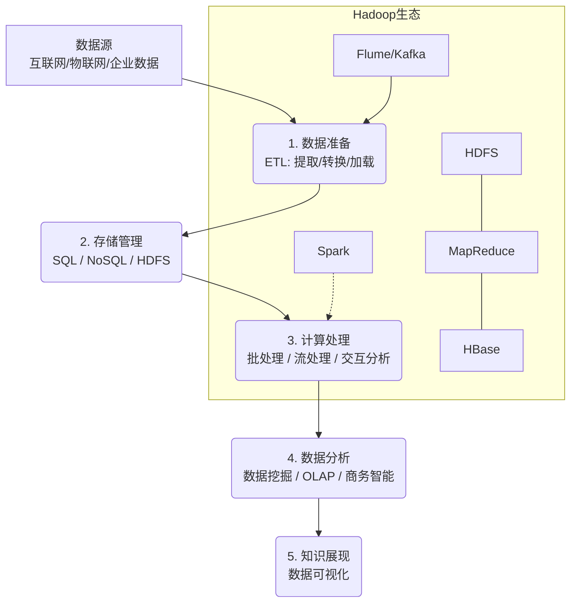
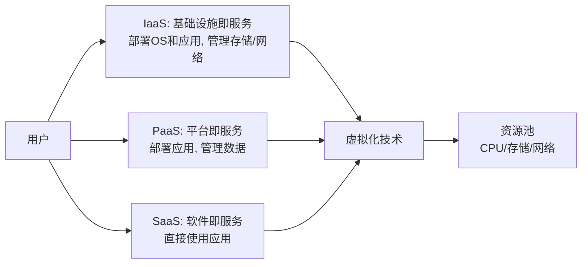
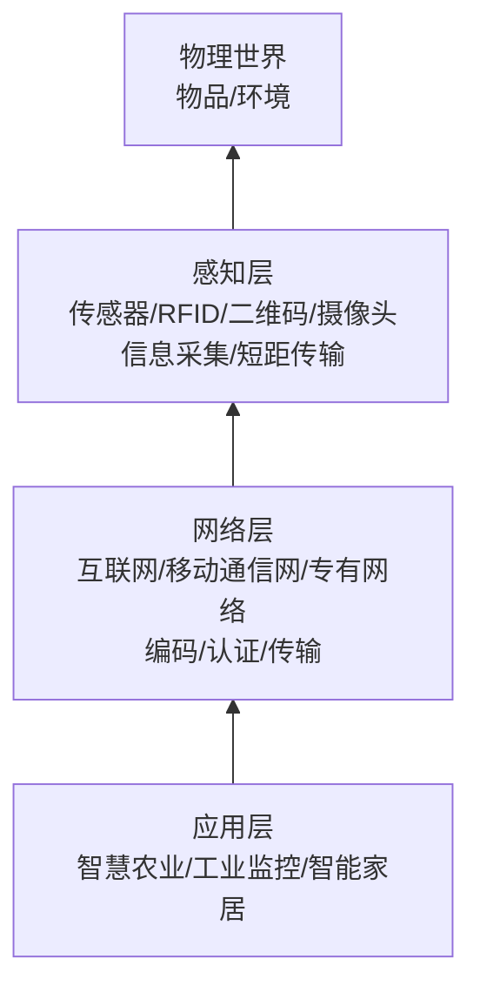
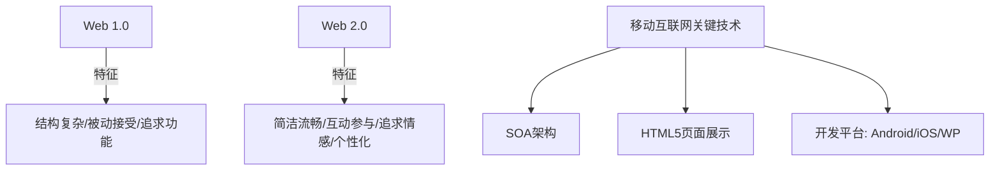
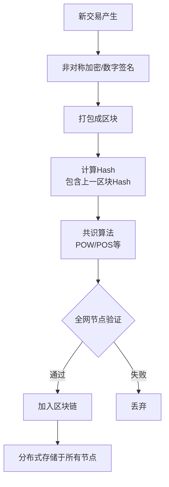
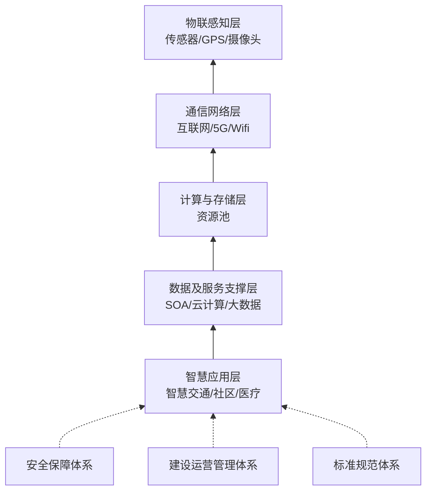
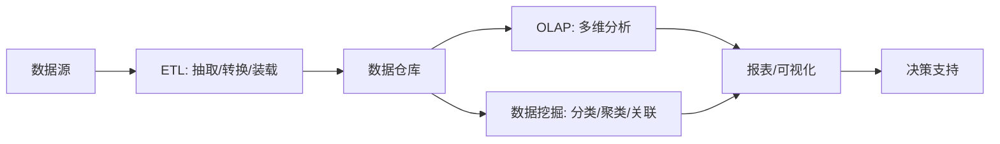
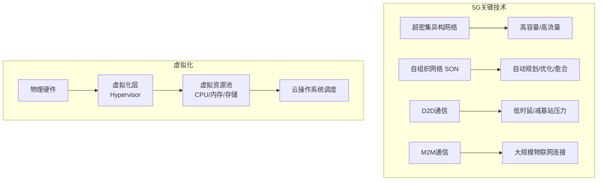

# 《新技术知识》章节总结

## 书籍信息

- **书名**：新技术知识（全国计算机技术与软件专业技术资格考试辅导资料）
- **授课人/作者**：王建平
- **来源机构**：51CTO学院
- **PDF 状态**：文本提取完整，结构清晰，包含思维导图、正文、例题及解析。
- **OCR 状态**：良好，少量格式错乱已修正。

## 目录说明

- **目录识别情况**：基于提供的文本内容，识别出主要技术模块包括：大数据、云计算、物联网、移动互联网、人工智能、区块链、互联网+、智慧城市、数据仓库与商业智能、虚拟化、5G通信技术。
- **章节对应依据**：按照文本中出现的标题层级进行逻辑分章。
- **OCR 修复说明**：部分图表描述（如Hadoop生态图、物联网架构图）已转化为Mermaid流程图或结构化列表；例题中的选项错位已根据上下文逻辑修正。

## 全书核心主题

本书旨在为参加全国计算机技术与软件专业技术资格考试的考生提供关于当前主流新兴技术的系统性知识梳理。内容涵盖大数据、云计算、物联网、移动互联网、人工智能、区块链、互联网+、智慧城市、数据仓库、虚拟化及5G通信等十大核心领域。

全书重点阐述了各技术的定义、核心特征、关键架构、关键技术及应用场景。通过对比分析（如网格计算与云计算、Web1.0与Web2.0、Hadoop与Spark），帮助读者理解技术演进逻辑。此外，书中结合大量考试真题与解析，强化了知识点在应试中的应用，旨在构建考生对新一代信息技术的整体认知框架，提升决策力与技术选型能力。

---

## 第1章：大数据 (Big Data)

### 1. 核心论点

本章解决如何定义和理解大数据及其处理体系的问题。作者认为大数据不仅是海量数据，更是一种需要新处理模式才能具有更强决策力、洞察发现力和流程优化能力的信息资产，其核心在于“4V”特征及从采集到展现的全链路处理架构。

### 2. 关键概念/事件

- **4V特征**：
    - **Volume (大量)**：数据体量从TB跃升至PB、EB甚至ZB级别。
    - **Variety (多样)**：数据类型繁多，包括结构化、非结构化和半结构化数据。
    - **Value (价值)**：价值密度低，与数据总量成反比。
    - **Velocity (高速)**：处理速度快，是区别于传统数据挖掘的显著特征。
    - *(注：文中还提及 Veracity 真实性)*
- **Hadoop生态系统**：
    - **HDFS**：分布式文件系统，负责存储，高容错、高吞吐。
    - **MapReduce**：分布式并行计算框架，核心思想是Map（映射）和Reduce（归约）。
    - **HBase**：面向列的分布式数据库，适合非结构化数据存储。
    - **Spark**：基于内存的计算引擎，适合迭代计算，比MapReduce效率更高。
    - **Flume/Kafka**：日志采集与消息队列系统。
- **大数据处理流程**：数据准备（ETL）→ 存储管理（SQL/NoSQL）→ 计算处理（批/流/交互）→ 数据分析（挖掘/OLAP）→ 知识展现（可视化）。

### 3. 逻辑推演/叙事脉络

本章首先定义大数据并详述其5个特点（4V+真实性）。接着展示大数据的整体架构，从数据源到最终的知识展现分为五个层次。随后深入关键技术环节，分别介绍数据采集（ETL）、存储（HDFS/HBase）、管理（MapReduce）和分析挖掘。最后通过对比Hadoop与Spark的机制差异（磁盘vs内存），以及列举Flume、Kafka等组件的功能，构建了完整的大数据技术栈认知，并通过例题巩固对组件归属（如HDFS属于存储技术）的理解。

### 4. 经典金句/数据

> “大数据指无法在一定时间范围内用常规软件工具进行捕捉、管理和处理的数据集合。”

> “Spark的中间数据存放在内存中，对于迭代运算而言，效率更高。”

### 5. 方法流程图

---

## 第2章：云计算 (Cloud Computing)

### 1. 核心论点

本章解决云计算的服务模式与技术本质的问题。作者指出云计算是一种按需服务、虚拟化、高可靠且廉价的计算资源池，其核心服务模式分为IaaS、PaaS和SaaS，关键技术依赖于网格计算和虚拟化。

### 2. 关键概念/事件

- **三大服务模式**：
    - **IaaS (基础设施即服务)**：提供计算、存储、网络等基础资源。用户控制操作系统和应用，不管理底层设施。（比喻：提供厨房和炉子，用户烤披萨）
    - **PaaS (平台即服务)**：提供操作系统、数据库、Web服务器等平台。用户部署应用，不管理底层设施。（比喻：提供饼皮和酱料，用户加配料烤制）
    - **SaaS (软件即服务)**：提供应用软件。用户直接使用，无需关心开发和维护。（比喻：直接购买成品披萨）
- **核心技术**：
    - **虚拟化**：基础设施虚拟化（计算、网络、存储），打破实体障碍，提高资源利用率。
    - **网格计算**：并行计算理论，任务分解分布式执行，侧重重计算、弱交互。
- **部署模式**：公有云、私有云、混合云。

### 3. 逻辑推演/叙事脉络

本章首先列举云计算的六大特点（超大规模、虚拟化、高可靠性、通用性、高可扩展性、按需服务/廉价）。接着通过“做披萨”的生动比喻详细区分IaaS、PaaS和SaaS三种服务模式的边界与用户控制权。随后阐述云计算的核心构成（资源池、云操作系统、接口）及关键技术（网格计算与虚拟化），并通过表格对比网格计算与云计算在应用场景和任务特色上的差异。最后介绍三种云部署模式。

### 4. 经典金句/数据

> “云可以像自来水、电、煤气那样计费。”

> “虚拟化是基础设施的虚拟化，核心是传统已经成熟的集群计算和分区计算的结合。”

### 5. 方法流程图

---

## 第3章：物联网 (IoT)

### 1. 核心论点

本章解决物联网的定义、架构层次及关键技术问题。作者认为物联网是物物相连的互联网，其架构分为感知层、网络层和应用层，核心在于通过传感设备实现智能化识别与管理。

### 2. 关键概念/事件

- **三层架构**:
    - **感知层**：核心能力，负责信息采集（传感器、RFID、二维码、摄像头）和短距离传输。关键在于精确感知、低功耗、小型化。
    - **网络层**：基础设施，负责数据传输（互联网、移动通信网、专网）。标准化程度最高，最成熟。
    - **应用层**：根本目标，行业融合解决方案（智能家居、智能交通、远程医疗等）。
- **关键技术**:
    - **RFID vs 条形码**：RFID可远距离读取、容量大、难复制、成本高；条形码容量小、成本低、易复制、需光学接触。
    - **嵌入式技术 & 传感器技术**。

### 3. 逻辑推演/叙事脉络

本章首先定义物联网为“物物相连的互联网”，强调其两层含义（基础是互联网，延伸至物品间通信）。接着详细拆解物联网的三层架构：感知层（采集与短距传输）、网络层（编码认证与长距传输）、应用层（行业智能化）。特别对比了RFID与条形码的技术特性。最后列举了各层级的公共技术（编码、标识、安全等）及典型应用领域。

### 4. 经典金句/数据

> “物联网的核心和基础仍然是互联网，是在互联网基础上的延伸和扩展的网络。”

> “感知层是实现物联网全面感知的核心能力……关键在于具备更精确、更全面的感知能力，并解决低功耗、小型化和低成本的问题。”

### 5. 方法流程图

---

## 第4章：移动互联网

### 1. 核心论点

本章解决移动互联网的定义、特征及关键技术体系问题。作者指出移动互联网是移动通信网络与互联网内容的结合，具有接入移动性、时间碎片性等特征，HTML5和SOA是其重要支撑技术。

### 2. 关键概念/事件

- **定义**：移动互联网 = 移动通信网络 + 互联网内容和应用。
- **四大特征**：接入移动性、时间碎片性、生活相关性、终端多样性。
- **关键技术**:
    - **SOA (面向服务架构)**：粗粒度、松耦合，Web Service是主要实现技术。
    - **HTML5**：扩展API，使Web应用成为RIA（富互联网应用），支持离线、互动、多媒体。
    - **Web 2.0**：强调个性化、高参与度、互动性，区别于Web 1.0的被动接受。
- **开发平台**：Android (开源, Java), iOS (闭源, Objective-C/Swift), Windows Phone。

### 3. 逻辑推演/叙事脉络

本章从定义入手，明确移动互联网是桌面互联网的补充和延伸。接着分析其区别于传统互联网的四个新特征。随后梳理技术体系，重点介绍SOA架构理念、HTML5带来的体验革新以及Web 2.0的思维模式转变。通过表格对比Web 1.0与Web 2.0在页面风格、个性化、用户体验等方面的差异。最后简述主流移动操作系统开发生态。

### 4. 经典金句/数据

> “移动互联网不仅是互联网的延伸，而且是互联网的发展方向。”

> “HTML5最大优势可以在网页上直接调试和修改，具有高度互动性、丰富用户体验。”

### 5. 方法流程图

---

## 第5章：人工智能 (AI)

### 1. 核心论点

本章解决人工智能的定义、发展规划及主要成果问题。作者认为AI是赋予机器模拟人类思维、决策和学习能力的技术，国家战略分三步走，主要成果体现在语音识别、视觉、机器学习等领域。

### 2. 关键概念/事件

- **定义**：高效能自动化处理人的思维、决策、问题求解和学习的技术；包含自识别和自学习能力。
- **发展战略 (中国)**：
    - 2020年：与世界先进水平同步。
    - 2025年：部分技术领先，成为产业升级动力。
    - 2030年：总体世界领先，成为主要创新中心。
- **主要成果/技术**:
    - **语音识别**：语音转文本。
    - **计算机视觉**：图像识别物体/场景。
    - **机器学习**：模拟人类学习行为。
    - **自然语言处理 (NLP)**：理解运用人类语言。
    - **机器人技术**：人机协作。
    - **知识工程**：专家系统、智能搜索。

### 3. 逻辑推演/叙事脉络

本章首先给出AI的多维度定义，强调其模拟人类智能行为的本质。接着引用《新一代人工智能发展规划》，明确2020-2030年的三步走战略目标。随后列举AI的主要技术成果，包括语音、视觉、机器学习、NLP等，并特别指出AlphaGo、自动驾驶等案例体现了“自学习”和“自识别”能力。最后简述知识工程的范畴。

### 4. 经典金句/数据

> “人工智能是赋予机器同人的能力，进行更深度的维度思考能力。”

> “到2030年人工智能理论、技术与应用总体达到世界领先水平，成为世界主要人工智能创新中心。”

---

## 第6章：区块链技术

### 1. 核心论点

本章解决区块链的定义、核心特征及技术原理问题。作者认为区块链是一种分布式账本技术，通过共识机制、加密算法解决信任和安全问题，具有去中心化、不可篡改、匿名性等特征。

### 2. 关键概念/事件

- **核心定义**：分布式数据存储、点对点传输、共识机制、加密算法的新型应用模式。
- **四大核心技术**:
    - **分布式账本/去中心化**：无中心节点，少数服从多数，篡改需超过51%节点。
    - **哈希加密/防篡改**：区块包含上一区块Hash，形成链式结构。
    - **非对称加密/数字签名**：保证交易真实性，私钥签名。
    - **共识算法**：POW (工作量证明，如比特币挖矿)、POS (权益证明)。解决拜占庭将军问题。
- **主要特征**：去中心化、自治性、集体维护、开放性、安全性、匿名性、完全透明。
- **应用场景**：数字货币、智能合约、防伪溯源、版权确权。

### 3. 逻辑推演/叙事脉络

本章首先定义区块链并解释共识机制的作用。接着详细剖析其四大核心技术支柱：分布式账本如何实现去中心化，哈希链如何保证不可篡改，非对称加密如何确保身份与交易真实，共识算法如何达成全局一致。随后总结区块链的七大特点，并列举其在金融、供应链等领域的应用，特别提到智能合约是自动执行的代码承诺。

### 4. 经典金句/数据

> “所谓共识机制是区块链系统中实现不同之间建立信任、获取权益的数学算法。”

> “如果要篡改里面的数据，除非篡改51%的结点，篡改单一结点无效。”

### 5. 方法流程图

---

## 第7章：互联网+

### 1. 核心论点

本章解决“互联网+”的内涵、特征及发展趋势问题。作者认为“互联网+”不是简单相加，而是互联网与传统行业的深度融合，旨在优化资源配置，重塑经济形态，具有跨界融合、创新驱动等六大特征。

### 2. 关键概念/事件

- **定义**：“互联网+各个传统行业”，利用ICT和互联网平台，深度融合，创造新生态。
- **六大特征**：跨界融合、创新驱动、重塑结构、尊重人性、开放生态、连接一切。
- **两化融合**：信息化与工业化融合。包括战略融合、资源融合、虚实经济融合、技术装备融合。
- **制造业服务化**：价值链由以制造为中心向以服务为中心转变（投入服务化、产出服务化）。

### 3. 逻辑推演/叙事脉络

本章首先澄清“互联网+”并非简单加法，而是深度融合的新社会形态和经济形态。接着列出其六大核心特征，并通过滴滴、美团等案例说明。随后回顾政策背景，指出其推动移动互联网、云计算等与现代制造业结合。重点阐述“两化融合”的四个层次以及制造业服务化的两个方向，强调互联网由消费领域向生产领域拓展的趋势。

### 4. 经典金句/数据

> “‘互联网+’代表着一种新的经济形态……以优化生产要素、更新业务体系、重构商业模式等途径来完成经济转型和升级。”

> “制造业服务化就是制造企业为了获取竞争优势，将价值链由以制造为中心向以服务为中心转变。”

---

## 第8章：智慧城市

### 1. 核心论点

本章解决智慧城市的定义、参考模型及支撑体系问题。作者认为智慧城市是利用新一代信息技术感知、整合城市资源，提供泛在服务的城市形态，其建设遵循五层参考模型和三个支撑体系。

### 2. 关键概念/事件

- **定义**：利用新技术感知、监测、分析、整合城市资源，迅速反应，提供绿色、和谐、高效服务的城市形态。
- **五层参考模型**:
    1.  **物联感知层**：采集城市基础设施、环境、交通等数据（传感器、GPS）。
    2.  **通信网络层**：互联网、电信网、无线网等传输基础设施。
    3.  **计算与存储层**：软件、计算、存储资源。
    4.  **数据及服务支撑层**：利用SOA、云计算、大数据技术，融合数据与服务，支撑上层应用。
    5.  **智慧应用层**：智慧交通、社区、医疗等行业应用。
- **三个支撑体系**：安全保障体系、建设和运营管理体系、标准规范体系。

### 3. 逻辑推演/叙事脉络

本章首先定义智慧城市，描述其从数据采集到知识应用的闭环过程。接着详细介绍智慧城市建设参考模型的五层架构，自下而上分别为感知、网络、计算存储、数据服务支撑、应用层，并明确指出数据及服务支撑层利用了SOA和大数据技术。最后补充说明保障智慧城市运行的三大支撑体系（安全、运维、标准）。

### 4. 经典金句/数据

> “智慧城市建设参考模型包括有依赖关系的五层和对建设有约束关系的三个支撑体系。”

> “数据及服务支撑层：利用SOA、云计算、大数据等技术……提供应用所需的各种服务和共享资源。”

### 5. 方法流程图

---

## 第9章：数据仓库与商业智能

### 1. 核心论点

本章解决数据仓库的特性、数据挖掘方法及商业智能（BI）实施流程问题。作者指出数据仓库具有面向主题、集成、稳定、反映历史变化的特点，BI通过ETL、OLAP和数据挖掘支持决策分析。

### 2. 关键概念/事件

- **数据仓库特点**：面向主题、集成的、相对稳定的、反映历史变化。
- **数据挖掘功能**：
    - **分类**：预测类标号（决策树、SVM、神经网络）。
    - **聚类**：物以类聚（K-means, DBSCAN）。
    - **关联规则**：发现数据间关系（Apriori）。
    - **离群点分析**：异常检测。
- **OLAP (联机分析处理)**：多维分析，支持决策。类型：ROLAP (关系型), MOLAP (多维型), HOLAP (混合型)。
- **BI实施步骤**：需求分析 → 数据仓库建模 → 数据抽取 (ETL) → 建立报表 → 培训测试 → 改进完善。

### 3. 逻辑推演/叙事脉络

本章首先介绍数据仓库的架构及四大核心特点，区别于操作型数据库。接着深入数据挖掘，分类介绍分类、聚类、关联分析等主要功能及典型算法（如K-means与DBSCAN的区别）。随后引出商业智能（BI），解释OLAP作为多维分析工具在BI中的作用及其三种实现方式。最后梳理BI系统的四个主要阶段和实施的具体步骤，强调从数据预处理到可视化的全过程。

### 4. 经典金句/数据

> “OLAP是数据仓库系统的一个主要应用，支持复杂的分析操作，侧重决策支持，并且提供直观易懂的查询结果。”

> “数据仓库的特点：面向主题、集成的、相对稳定的、反应历史变化的。”

### 5. 方法流程图

---

## 第10章：虚拟化与5G通信技术

### 1. 核心论点

本章解决虚拟化技术的本质及5G通信的关键特性与应用问题。作者指出虚拟化是云计算的核心，通过软件整合硬件资源；5G则具有高速率、低时延、大连接的特点，关键技术包括超密集异构网络和D2D通信。

### 2. 关键概念/事件

- **虚拟化**：
    - 定义：将服务器、网络、内存等实体资源抽象、封装，打破物理障碍。
    - 作用：提高资源利用率，是云计算的核心技术。
    - **VPN (虚拟专用网)**：在公用网络上建立专用网络，利用隧道技术，非物理专用链路。
- **5G (第五代移动通信)**：
    - **性能目标**：高数据速率 (峰值10Gbit/s, 体验1Gbit/s)、低时延 (<1ms)、大连接 (千亿设备)。
    - **关键技术**：
        - **超密集异构网络**：减小小区半径，增加低功率节点。
        - **自组织网络 (SON)**：自规划、自配置、自优化、自愈合。
        - **D2D (设备到设备通信)**：近距离直接传输，减轻基站压力。
        - **M2M**：机器对机器通信，物联网基础。
    - **应用领域**：车联网、远程手术、智能电网。

### 3. 逻辑推演/叙事脉络

本章分为两部分。第一部分简述虚拟化，强调其作为云计算核心技术的地位，通过Vmware等实例说明资源整合原理，并纠正关于VPN是“私有物理网络”的错误认知，明确其为公网上的逻辑专用网。第二部分重点介绍5G，对比4G阐述其三大优势（高速、低延、广连），列举八大特点，并详细解析超密集组网、D2D、M2M等关键技术，最后展望其在垂直行业的应用前景。

### 4. 经典金句/数据

> “5G区别于前几代移动通信的关键，是移动通信从以技术为中心逐步向以用户为中心转变的结果。”

> “5G空中接口时延水平需要在1ms左右……用户体验速率达到100Mbit/s (连续覆盖下)。”

### 5. 方法流程图

