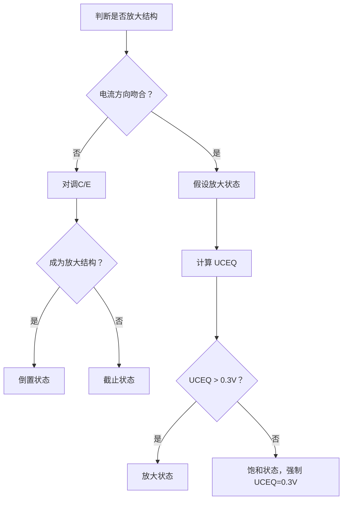
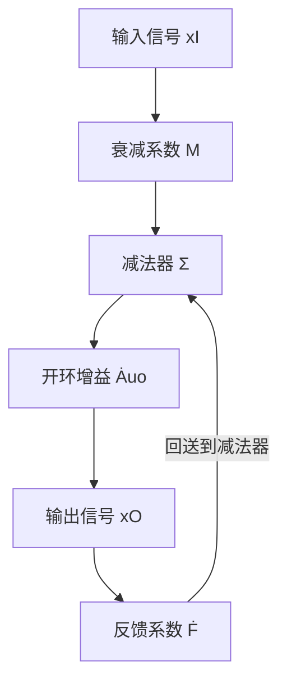
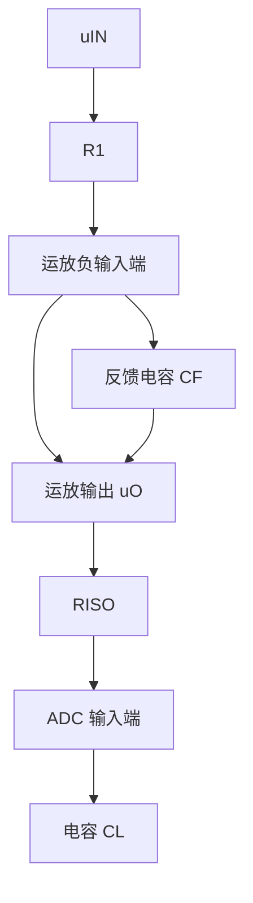
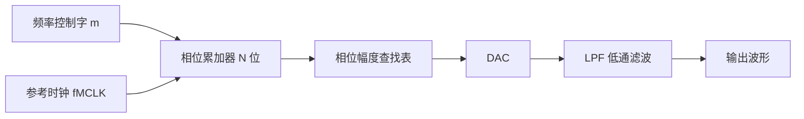

# 《新概念模拟电路》与《Altium Designer 19 电子设计速成实战宝典》章节总结

## 书籍信息
- 书名1：《新概念模拟电路》(电子版 第一版)
- 作者1：杨建国
- 书名2：《Altium Designer 19 (中文版) 电子设计速成实战宝典》
- 作者2：郑振宇、黄勇、刘仁福 (凡亿教育 组织编写)
- PDF 状态：文字版/扫描版混合，整体可识别
- OCR 状态：良好

## 目录说明
- 目录识别情况：清晰
- 章节对应依据：按照书籍原始页码顺序整理
- OCR 修复说明：部分图表识别不完整，已根据上下文逻辑重建

## 全书核心主题

本书为两册PDF合集。

**第一册《Altium Designer 19 电子设计速成实战宝典》**：以 Altium Designer 19 软件为工具，按照电子设计流程化思路，从工程创建、元件库设计、原理图设计到 PCB 设计、生产文件输出，全面讲解电路板设计的实战方法。以“真实产品为载体，实际项目流程为导向”，包含 2 层、4 层、6 层电路板设计实例，适合电子设计初学者及进阶者。

**第二册《新概念模拟电路》**：系统讲解模拟电子技术的核心知识，从晶体管基础、放大电路、负反馈、运算放大器，到滤波器、信号处理电路、信号源和电源。以“理论推导+仿真验证+实验实证”为学习方法，注重实用性，包含大量仿真实验和设计实例，是模拟电子技术的系统性教材。

---

## 《Altium Designer 19 电子设计速成实战宝典》章节总结

### 第1章：Altium Designer 19 全新功能

#### 1. 核心论点
本章介绍 Altium Designer 19 相对于旧版本的全新功能和改进，帮助读者了解新特性并决定是否升级。核心观点：新版本在布线效率、设计灵活性、用户体验等方面有显著提升。

#### 2. 关键概念
- **ActiveRoute**：高效的交互式自动布线技术，支持多网络布线、长度调整、管脚交换。
- **机械层**：AD19 支持无限制增加机械层，用于定义 PCB 外形、装配说明等。
- **微孔技术**：支持盲孔、埋孔，加速 HDI 设计。
- **元器件回溯功能**：移动已布线元器件时，走线自动跟随重新布线。
- **多板设计 2.0**：支持多块 PCB 在一个装配件系统中设计。
- **高级层叠管理器**：集成阻抗计算、材料库，支持带状线、微带线等阻抗管理。

#### 3. 逻辑推演
本章按功能模块组织：主题切换 → ActiveRoute 改进 → 焊盘/过孔局部设置 → 布线改进 → Draftsman 改进 → 机械层 → 微孔 → 元器件回溯 → 多板设计 → 层叠管理器。每个功能说明使用方法与应用场景。

---

### 第2章：Altium Designer 19 软件及电子设计概述

#### 1. 核心论点
本章讲解 AD19 的安装、激活、系统参数设置，以及电子设计整体流程。核心观点：正确配置软件环境是高效设计的基础。

#### 2. 关键概念
- **系统配置要求**：64 位操作系统，推荐 2.8GHz 以上 CPU，1GB 以上内存。
- **安装选项**：PCB Design + Importers/Exporters 为必选。
- **系统参数设置**：中英文切换、高亮方式、交叉选择模式、自动备份（30 分钟）。
- **原理图参数**：General（优化走线、元件割线）、Graphical Editing（光标类型）、Compiler（错误颜色）。
- **PCB 参数**：General（在线 DRC、旋转步进）、Display、Interactive Routing（布线冲突方案、自动终止布线）。
- **电子设计流程**：项目立项 → 元件建库 → 原理图设计 → PCB 建库 → PCB 设计 → 生产文件输出 → PCB 加工。

#### 3. 逻辑推演
从安装配置开始，逐步深入到系统参数、原理图参数、PCB 参数，最后给出电子设计整体流程图，帮助读者建立系统化设计思维。

---

### 第3章：工程的组成及完整工程的创建

#### 1. 核心论点
本章讲解 AD 工程的组成结构及完整工程的创建方法。核心观点：良好的工程文件管理是专业电子工程师的基本素质。

#### 2. 关键概念
- **工程组成**：元件库(.SchLib)、原理图(.SchDoc)、PCB 库(.PcbLib)、PCB(.PcbDoc)、生产文件。
- **常见文件后缀**：.PrjPcb（工程）、.SchDoc（原理图）、.PcbDoc（PCB）、.SchLib（元件库）、.PcbLib（PCB 库）。
- **工程创建**：文件 → 新的 → 项目 → PCB 工程。
- **文件管理原则**：所有相关文件放置在同一路径下，工程内文件保持唯一性。

---

### 第4章：元件库开发环境及设计

#### 1. 核心论点
本章讲解如何创建原理图元件库，包括单部件元件和多子件元件的创建方法。核心观点：元件符号中的管脚序号和名称必须与数据手册严格对应。

#### 2. 关键概念
- **元件符号组成**：元件边框、管脚（序号+名称）、元件名称、元件说明。
- **单部件元件创建**：放置矩形框 → 放置管脚 → 设置属性（Designator、Name、Electrical Type）。
- **多子件元件创建**：工具 → 新器件 → 新部件，分配管脚到不同子件。
- **元件检查**：报告 → 器件规则检查，检查重复管脚、缺失封装等。
- **元件复制**：在 SCH Library 面板中选中元件 → 复制 → 粘贴到目标库。

#### 3. 逻辑推演
从元件库编辑器界面介绍开始，依次讲解单部件元件创建、多子件元件创建、元件检查与报告，最后以电容、ADC08200、放大器三个实例演示完整创建过程。

---

### 第5章：原理图开发环境及设计

#### 1. 核心论点
本章系统讲解原理图设计的完整流程，从页面设置到电气连接、层次原理图设计、编译检查。核心观点：原理图设计是电子设计的核心环节，直接影响 PCB 设计的质量。

#### 2. 关键概念
- **原理图准备**：页面大小设置、栅格设置（建议 10mil）、模板应用。
- **元件放置**：通过 SCH Library 面板放置元件，设置 Designator、Comment、Footprint。
- **电气连接**：导线、网络标签、电源端口、总线、差分标识、No ERC 检查点。
- **层次原理图**：自上而下（先母图后子图）和自下而上（先子图后母图）。
- **原理图编译**：工程 → Compile PCB Project，检查重复位号、悬浮网络、单端网络等。
- **BOM 表**：报告 → Bill of Materials，可导出 Excel 格式。
- **原理图打印**：智能 PDF 输出。

#### 3. 逻辑推演
从原理图编辑界面开始，按设计流程逐步讲解：准备 → 放置元件 → 电气连接 → 非电气对象 → 全局编辑 → 层次原理图 → 编译检查 → BOM 输出 → 打印输出，最后以 AT89C51 实例完整演示。

---

### 第6章：PCB 库开发环境及设计

#### 1. 核心论点
本章讲解 PCB 封装（ footprint ）的创建方法，包括标准封装、异形封装、3D 封装。核心观点：封装必须按照数据手册精确绘制，考虑补偿值。

#### 2. 关键概念
- **PCB 封装组成**：焊盘、管脚序号、元件丝印、阻焊、1 脚/极性标识。
- **向导创建法**：工具 → 元件向导，适用于规范封装（如 DIP、SOP）。
- **手工创建法**：放置焊盘 → 设置属性 → 阵列/坐标排列 → 绘制丝印 → 放置 1 脚标识。
- **异形焊盘**：放置圆弧/多边形 → 复制到阻焊层和钢网层。
- **PCB 封装规范**：SMD 封装补偿公式、插件封装钻孔尺寸、阻焊单边开窗 2.5mil、丝印与焊盘保持 6mil 以上间隙。
- **3D 封装**：放置 3D 元件体（Mechanical 层）→ 设置高度/颜色 → 导入 STEP 模型。

#### 3. 逻辑推演
从 PCB 库编辑器界面开始，讲解向导法和手工法创建 2D 封装，再到异形焊盘、封装规范、3D 封装创建，最后讲解集成库的创建与离散。

---

### 第7章：PCB 设计开发环境及快捷键

#### 1. 核心论点
本章介绍 PCB 设计工作界面、常用面板、系统快捷键及自定义快捷键方法。核心观点：熟练掌握快捷键可大幅提升设计效率。

#### 2. 关键概念
- **常用面板**：PCB、PCB Filter、PCB List。
- **常用快捷键**：L（层设置）、S（选择）、Q（英寸/毫米切换）、Shift+S（单层显示）、空格（翻转）、Shift+空格（改走线模式）、Shift+W（线宽选择）。
- **快捷键自定义**：菜单栏右键 → Customize → 选择命令 → 输入快捷键。

---

### 第8章：流程化设计——PCB 前期处理

#### 1. 核心论点
本章讲解 PCB 设计前的准备工作，包括原理图封装完整性检查、网表生成、PCB 导入、板框定义、层叠设计。核心观点：前期准备充分是保证后期设计准确性的基础。

#### 2. 关键概念
- **封装管理器**：工具 → 封装管理器，批量添加/修改封装。
- **库路径全局指定**：封装管理器 → 全选元件 → 右键 → 改变 PCB 库 → 选择“任意”。
- **网表生成**：Protel 网表（Design → Create Netlist）或 Altium 网表（设计 → 工程的网络表）。
- **PCB 导入**：直接导入法（设计 → Update PCB Document）或网表对比导入法。
- **板框定义**：导入 DXF 结构图 → 选择闭合板框 → 设计 → 板子形状 → 按照选中对象定义。
- **层叠结构**：4 层板推荐方案 2 或 3；6 层板推荐方案 3 或 4；8 层板优选方案 1 和 2。
- **正片与负片**：正片为走线层，负片为默认铺铜层（分割线处无铜）。

---

### 第9章：流程化设计——PCB 布局

#### 1. 核心论点
本章讲解 PCB 布局的原则和方法，包括模块化布局、交互式布局、布局常用操作。核心观点：布局好坏直接影响板子的成败。

#### 2. 关键概念
- **布局约束原则**：元件排列（同一面、整齐、间距）、信号走向（从左到右/从上到下）、防止电磁干扰（屏蔽罩、垂直布局）、抑制热干扰（发热元件远离热敏元件）。
- **模块化布局**：原理图选中模块元件 → 工具 → 器件摆放 → 在矩形区域排列。
- **交互式布局**：原理图和 PCB 同时开启交叉选择模式，实现双向映射。
- **布局操作**：全局修改丝印大小、对齐（AL/AR/AT/AB）、移动（M）。

---

### 第10章：流程化设计——PCB 布线

#### 1. 核心论点
本章系统讲解 PCB 布线的方法，包括类与类的创建、规则设置、阻抗计算、扇孔、铺铜、蛇形走线、等长处理。核心观点：布线是 PCB 设计中比重最大、要求最高的环节。

#### 2. 关键概念
- **类（Class）**：网络类、差分类、元件类等，用于统一规则约束。
- **常用规则**：间距（Clearance）、线宽（Width）、过孔（Routing Via）、阻焊（Solder Mask Expansion）、内电层连接（Power Plane Connect Style）。
- **区域规则**：放置 Room → 设置 WithinRoom 代码 → 单独设置 BGA 区域规则。
- **差分规则**：设置线宽、间距、组误差。
- **阻抗计算**：微带线、带状线模型，使用层叠管理器计算。
- **扇孔**：BGA 扇出，推荐直接 BGA 扇出。
- **铺铜**：多边形铺铜 → 设置网络 → 修整铺铜 → 移除孤铜。
- **蛇形走线**：工具 → 交互式长度调整（T+R）。
- **等长处理**：T 形结构（从 T 点分支等长）、From-To 等长、xSignals 等长。

---

### 第11章：PCB 的 DRC 与生产输出

#### 1. 核心论点
本章讲解 PCB 设计完成后的 DRC 检查、尺寸标注、丝印调整、生产文件输出。核心观点：DRC 检查是设计阶段的最后把关，生产文件输出是衔接生产的关键。

#### 2. 关键概念
- **DRC 检查项**：电气性能（间距）、布线、Stub 线头、丝印上阻焊、元件高度、元件间距。
- **丝印位号调整**：原则为清晰可读，推荐字符高度 0.8-1.0mm，线宽 0.15mm。
- **生产文件**：Gerber 文件（各层图形）、钻孔文件（NC Drill）、IPC 网表、贴片坐标文件。
- **Gerber 输出**：文件 → 制造输出 → Gerber Files，选择层和格式（2:3 或 2:4）。

---

### 第12章：Altium Designer 高级设计技巧及应用

#### 1. 核心论点
本章讲解 AD 的高级设计技巧，包括 FPGA 管脚调整、相同模块布局布线、孤铜移除、PCB Logo 添加、3D 模型导出、软件互转。核心观点：高级技巧可进一步提升设计效率和质量。

#### 2. 关键概念
- **相同模块布局布线**：先设计一个模块 → 复制布局和布线 → 粘贴到其他模块。
- **孤铜移除**：正片（铺铜管理器 → 移除死铜），负片（双击负片层 → 移除死铜）。
- **Logo 添加**：运行脚本（RunScript）→ PCB Logo Creator → 导入 BMP 图片。
- **3D 模型导出**：文件 → 导出 → STEP 3D。
- **软件互转**：支持 Altium、PADS、OrCAD、Allegro 之间的原理图和 PCB 互转。

---

### 第13章：入门实例——2 层 STM32 开发板的设计

#### 1. 核心论点
本章通过一个 STM32 开发板的完整设计流程，将前面所学知识融会贯通。核心观点：理论与实践结合是掌握电子设计的最佳途径。

#### 2. 逻辑推演
按完整流程组织：工程创建 → 元件库创建（STM32F103C8T6、数码管、LED）→ 原理图设计 → PCB 封装制作（LQFP48）→ PCB 设计（封装匹配、导入、板框、布局、规则、扇孔、布线、铺铜）→ DRC → 生产输出。

---

### 第14章：入门实例——4 层核心板的 PCB 设计

#### 1. 核心论点
本章讲解 4 层板的设计方法，重点突出 2 层板与 4 层板的区别。核心观点：多层板设计关键是层叠结构和内电层处理。

#### 2. 关键概念
- **层叠设置**：TOP、GND02、SIN03、PWR04、BOTTOM（4 层推荐方案）。
- **内电层**：负片层分割（Place → Line 画封闭多边形 → 双击设置网络）。
- **布局原则**：对接座子靠近板边，SDRAM、Flash 靠近主控。
- **电源处理**：电源分割、回流地过孔。

---

### 第15章：进阶实例——RK3288 平板电脑的设计

#### 1. 核心论点
本章以 RK3288 平板电脑为例，讲解高速 PCB 设计的方法。核心观点：高速 PCB 设计需遵循 3W、20H 原则，模块化设计，注意信号完整性。

#### 2. 关键概念
- **3W 原则**：线间距 ≥ 3 倍线宽，减少串扰。
- **20H 原则**：电源层比地层内缩 20H，减少边缘辐射。
- **模块化设计**：CPU、PMU、存储器（LPDDR2、NAND/EMMC）、摄像头、SD 卡、USB、音频、WIFI/BT 分模块设计。
- **屏蔽罩规划**：扰源或易受干扰模块加屏蔽罩，良好接地。
- **散热处理**：发热元件布置在利于散热位置。

---

### 第16章：常见问题解答集锦

#### 1. 核心论点
本章收集了设计中常见的 42 个问题，以问答形式呈现。核心观点：通过问题导向学习，快速解决实际设计中的疑难。

---

## 《新概念模拟电路》章节总结

### 绪言

#### 1. 核心论点
绪言介绍了晶体管的发展历史和电子技术的分类。核心观点：晶体管是 20 世纪最伟大的发明，模拟电子技术是电子工作者的看家本领。

#### 2. 关键概念
- **电子技术三层**：器件级（集成电路设计）、电路板级（功能电路设计）、系统级（系统集成）。
- **信息电子技术**：分为模拟电子技术和数字电子技术。
- **模拟信号 vs 数字信号**：模拟信号连续（时间+幅度），数字信号离散（采样+量化）。

#### 3. 学习方法
1. 熟练掌握仿真软件（Multisim、TINA、PSPICE）。
2. 理论估算 → 仿真验证 → 对比分析。
3. 注重实验，珍惜实验与仿真的差异。
4. 预习，每章结束完成习题。

---

### 第1章：晶体管基础

#### Section1. 电压信号如何放大——晶体管的引入

##### 1. 核心论点
引入双极型晶体管（BJT）作为流控电流源（CCCS），用于信号放大。核心观点：晶体管是实现信号放大的核心器件。

##### 2. 关键概念
- **受控源类型**：VCVS、CCVS、CCCS、VCCS。BJT 是 CCCS（iC = β·iB）。
- **NPN vs PNP**：NPN（肉夹馍），PNP（馍夹肉）。箭头向外为 NPN，向内为 PNP。
- **洗澡器类比**：凉水 = iB，热水 = iC，温水 = iE = iB + iC。

##### 3. 经典金句
> “iC = β·iB 是电子世界最为伟大的公式，没有之一。”

---

#### Section2. NPN 型晶体管的伏安特性

##### 1. 核心论点
介绍晶体管的输入和输出伏安特性，以及静态和动态的概念。核心观点：晶体管有三个工作区：放大区、饱和区、截止区。

##### 2. 关键概念
- **输入伏安特性**：iB 与 uBE 的关系，呈指数曲线，uBE > 0.7V 时电流明显。
- **输出伏安特性**：iC 与 uCE 的关系，分为放大区（iC = β·iB）、饱和区（uCE < UCES ≈0.3V）、截止区（iB = 0）。
- **静态 vs 动态**：静态是输入为 0 时的工作状态（下标 Q），动态是变化量之间的关系。
- **静态电阻 vs 动态电阻**：静态电阻 = UQ/IQ，动态电阻 = ΔU/ΔI。

##### 3. 经典金句
> “在放大区，集电极电流 iC 恒等于基极电流 iB 的 β 倍，与 uCE 无关。”

---

#### Section3-4. 用 NPN 晶体管构建放大电路 / 静态和信号耦合

##### 1. 核心论点
构建基本放大电路需要解决两个问题：确定合适的静态工作点，以及实现信号的输入/输出耦合。核心观点：静态工作点是保证放大电路正常工作的基础。

##### 2. 关键概念
- **静态工作点（Q 点）**：晶体管各管脚电流和电压的集合，应处于放大区中心。
- **阻容耦合**：用电容隔直通交，不影响静态工作点，但无法放大直流信号。
- **直接耦合**：无电容，可放大直流信号，但静态相互影响。

---

#### Section6. 给定电路求解静态

##### 1. 核心论点
通过估算（假设 UBEQ = 0.7V）求解晶体管电路的静态工作点，判断工作状态。核心观点：判断工作状态的标准流程是先假设放大状态，再验证。

##### 2. 判断流程



##### 3. 经典金句
> “晶体管静态估算的核心，就是假设 UBEQ 约等于 0.7V。”

---

#### Section9. 动态求解方法——以硅稳压管为例

##### 1. 核心论点
引入动态求解法，用微变等效电路分析电路的变化量。核心观点：动态等效电路中，电压不变点接地，电流不变支路开路，非线性器件用动态电阻代替。

##### 2. 关键概念
- **动态等效规则**：输入信号只保留变化量；电压不变点接地；电流不变支路开路；非线性器件在工作点处用动态电阻代替。
- **硅稳压管动态模型**：击穿区用 rZ（动态电阻）代替。

---

#### Section10-11. 双极型晶体管的动态模型 / 放大电路的动态分析

##### 1. 核心论点
建立晶体管的微变等效模型（低频），并求解放大电路的三大动态指标：电压放大倍数 Au、输入电阻 ri、输出电阻 ro。

##### 2. 关键概念
- **微变等效模型**：b-e 间用 rbe（动态电阻，rbe = rbb' + UT/IBQ），c-e 间用受控电流源 β·ib。
- **三大指标**：
  - Au = uo/ui
  - ri = ui/ii
  - ro = u_v / i_v（外加电压源法）
- **动态分析步骤**：画动态等效电路 → 求解 Au → 求解 ri → 求解 ro。

---

#### Section13. 共基极、共集电极放大电路和 PNP 管电路

##### 1. 核心论点
介绍三种基本放大组态：共射极、共基极、共集电极，以及 PNP 管电路的分析方法。核心观点：不同组态适用于不同场景——共射极高增益，共基极高频特性好，共集电极（射极跟随器）输入电阻大、输出电阻小。

##### 2. 各组态对比

| 组态 | 输入 | 输出 | 电压增益 | 输入电阻 | 输出电阻 | 特点 |
|------|------|------|----------|----------|----------|------|
| 共射极 | b | c | 高（反相） | 中 | 中 | 最常用 |
| 共基极 | e | c | 高（同相） | 小 | 大 | 高频特性好 |
| 共集电极 | b | e | ≈1（同相） | 大 | 小 | 阻抗匹配、扩流 |

##### 3. 经典金句
> “射极跟随器虽然不具备电压放大能力，但具有电流放大能力，以及输入电阻大、输出电阻小的特点，在扩流、阻抗匹配中获得了广泛应用。”

---

#### Section15. 放大电路的综合分析

##### 1. 核心论点
综合静态分析、动态分析和失真分析，通过多个例题巩固所学知识。核心观点：4 电阻静态电路具有更好的温度稳定性和抗分散性。

##### 2. 关键概念
- **4 电阻静态电路**：当 (1+β)RE >> RB 时，UCEQ 与 β 无关，稳定性好。
- **失真电压裕度**：UOP = min(UOPS, UOPC)，其中 UOPS = UCEQ - UCES，UOPC = ICQ×(RC // RL)。
- **静态与动态分离**：用电容器将静态电路和动态电路分离，使增益可独立调节。

---

### 第3章：负反馈和运算放大器基础

#### Section56-57. 理想运算放大器和负反馈电路

##### 1. 核心论点
引入理想运算放大器的概念及其组成的负反馈放大电路。核心观点：深度负反馈下，闭环增益约等于 M/F，与开环增益无关。

##### 2. 理想运放特点
- 开环增益 Auo = ∞
- 输入阻抗 = ∞
- 输出阻抗 = 0
- uO = Auo(u+ - u-)

##### 3. 深度负反馈公式



**闭环增益**：Ȧuf ≈ Ṁ / Ḟ

---

#### Section60-61. 负反馈电路的方框图分析法

##### 1. 核心论点
方框图分析法是求解负反馈放大电路的有效方法。核心观点：通过求解衰减系数 M 和反馈系数 F，可直接得到闭环增益。

##### 2. 求解方法
- **Ṁ**：将输出置 0，求运放输入端电压与输入信号的比值。
- **Ḟ**：将输入置 0，求运放负输入端与输出信号的比值（减去正输入端贡献）。

---

#### Section64-65. 虚短的来源 / 虚短虚断法

##### 1. 核心论点
虚短（两个输入端电位近似相等）是深度负反馈的结果，而非运放的天生特性。核心观点：虚短需要两个条件：① 必须是负反馈；② 运放有足够的输出能力。

##### 2. 关键概念
- **虚短条件**：负反馈 + 运放输出能力足够。
- **虚断**：来自运放输入端天生高阻。
- **虚短虚断法应用**：加法器、减法器、仪表放大器、积分器、微分器、模拟乘法器。

---

### 第4章：运放电路的频率特性和滤波器

#### Section74. 从开环到闭环

##### 1. 核心论点
分析运放的开环增益随频率变化的规律，以及闭环增益带宽的计算方法。核心观点：闭环带宽 = F × GBW（-3dB 带宽）。

##### 2. 关键公式
- **开环增益简化**：Ȧuo(jf) = -j × GBW / f
- **闭环增益**：Ȧuf(jf) = M/F × 1/[1 + jf/(F×GBW)]
- **-ydB 带宽**：fHf-ydB = F×GBW × √(1-k²)/k，k = 10^(-y/20)

---

#### Section78-79. 滤波器概述 / 一阶滤波器

##### 1. 核心论点
滤波器是对不同频率信号实施不同增益和相移的电路。一阶滤波器是最基本的滤波单元。核心观点：滤波器的阶数越高，越接近理想砖墙式滤波器。

##### 2. 关键概念
- **滤波器分类**：低通、高通、带通、带阻、全通。
- **一阶低通**：Ȧ(jf) = Am × 1/(1 + jf/f0)，f0 = 1/(2πRC)
- **一阶高通**：Ȧ(jf) = Am × 1/(1 - jf0/f)
- **一阶全通**：增益恒为 1，相移 φ = -2arctan(f/f0)

---

#### Section81-82. 二阶滤波器分析

##### 1. 核心论点
二阶滤波器的品质因数 Q 决定了其频率特性：Q=0.707（巴特沃斯，最平坦），Q>0.707（切比雪夫，过渡带陡峭但有隆起），Q<0.707（贝塞尔，线性相移）。核心观点：Q 值越大，过渡带越陡峭，但通带内起伏越大。

##### 2. 关键公式
- **二阶低通**：Ȧ(jΩ) = Am × 1/[1 + (1/Q)jΩ + (jΩ)²]，Ω = f/f0
- **特征频率 f0**：分母实部为 0 的频率点
- **截止频率与特征频率关系**：K = fc/f0 = [√(4Q²-2+√(4-16Q²+32Q⁴)]/(2Q)

---

#### Section84-87. 运放组成的低通滤波器（SK 型、MFB 型）

##### 1. 核心论点
SK 型和 MFB 型是运放组成二阶滤波器的两种主要结构。MFB 型适合反相应用，SK 型适合同相应用。核心观点：MFB 型没有高频馈通现象，SK 型在高频时可能出现增益回升。

##### 2. 关键概念
- **SK 型 4 元件低通**：Am = 1，f0 = 1/(2π√(C1C2R1R2))，Q = √(C1C2R1R2)/[C2(R1+R2)]
- **MFB 型低通**：Am = -R2/R1，f0 = 1/[2π√(R2R3C1C2)]，Q = √(R2R3C1C2)/[C1(R2+R3(1-Am))]
- **高频馈通**：SK 型在高频时信号通过 R1 和 C1 直接馈送到输出端，导致滤波效果变差。

---

#### Section108. 峰值检测和精密整流电路

##### 1. 核心论点
峰值检测电路用于捕获信号的最大值，精密整流电路用于将交流信号转变成单一极性的直流信号。核心观点：将二极管置于反馈环中可以消除其导通压降的影响。

##### 2. 关键概念
- **峰值检测**：二极管 + 电容，改进电路将二极管置于反馈环中。
- **半波精密整流**：两个反向二极管支路，正负半周分别导通。
- **全波精密整流**：半波整流输出与原始信号加权相加。

---

#### Section109. 有效值检测芯片（RMS-DC）

##### 1. 核心论点
有效值检测芯片（AD637、AD737）可将任意波形的输入信号的有效值转换为直流输出。核心观点：核心原理是平方 → 平均 → 开平方。

##### 2. 关键概念
- **AD637 原理**：绝对值转电流 → 平方/除法电路 → 低通滤波 → 开平方
- **AD737 原理**：电流模绝对值 → 平方运算 → 平均 → 输出
- **频率限制**：输入信号幅度越小，可测量的频率上限越低。

---

#### Section110-111. 程控增益放大器 / 压控增益放大器

##### 1. 核心论点
程控增益放大器（PGA）增益由数字逻辑控制，压控增益放大器（VCA）增益由外部电压连续控制。核心观点：PGA 适用于离散增益切换，VCA 适用于连续可调增益。

##### 2. 关键概念
- **PGA 类型**：管脚控制（如 PGA103、PGA204）、SPI 写入（如 PGA112、AD8253）。
- **VCA 类型**：dB 线性（VCA810）和倍数线性（LMH6503）。
- **VCA810**：0V~-2V 控制电压，增益从 -40dB~40dB，带宽 35MHz。

---

#### Section112-114. 比较器

##### 1. 核心论点
比较器用于判断两个输入电压的高低关系，输出为数字电平。迟滞比较器可避免输入信号在基准附近抖动引起的误翻转。核心观点：集成比较器速度远快于运放，但失调电压较大。

##### 2. 关键概念
- **迟滞比较器**：两个翻转阈值（UR+ 和 UR-），窗口电压 UWD = (VCC+VEE)×R1/(R1+R2)
- **集成比较器**：LM393（集电极开路）、AD790（45ns 延迟）、LT1394（7ns）、LTC6752（2.9ns）
- **关键参数**：失调电压 VOS、传输时延 tPD、过驱电压、输入电压范围。

---

### 第5章：信号处理电路

#### Section119-121. 仪表放大器及其应用

##### 1. 核心论点
仪表放大器（INA）具有高输入阻抗、高共模抑制比（CMRR），适用于传感器信号检测。核心观点：仪表放大器的失效图（钻石图）用于判断输入共模电压和输出范围是否合理。

##### 2. 关键概念
- **三运放仪表放大器**：G = (1+2R1/RG)×R3/R2
- **失效图**：因内部运放饱和导致，输入共模电压和输出电压必须处于图内区域。
- **高共模应用**：仪表放大器不能承受高共模电压，需用减法器或专用高共模器件（AD629、AD8479）。
- **右腿驱动**：检测人体共模信号，反相放大后回送，抑制工频干扰。

##### 3. 方法流程图

```mermaid
graph TD
    A[传感器差分输出] --> B[仪表放大器]
    B --> C[高共模抑制]
    C --> D[输出 = G×(uIN+ - uIN-)]
    D --> E[ADC 或后级处理]
```

---

#### Section124-125. ADC 驱动电路

##### 1. 核心论点
ADC 前端需要驱动电路的主要原因：输入范围调整、输入类型转换、低阻输出、抗混叠滤波、电源级保护。核心观点：驱动电路的设计决定了 ADC 的精度和稳定性。

##### 2. 关键概念
- **采样误差**：采样时间 TSAM 必须满足 TSAM ≥ 0.693×(N+1)×RS×CSAM
- **抗混叠滤波**：fH 应满足 fsignal ≪ fH ≪ fs/2
- **移位型驱动电路**：将双极性信号转换为单极性信号（骑在 VOCM 上）。
- **传递型驱动电路**：输入和输出均为单极性，仅改变增益。

##### 3. ADC 典型驱动电路（反馈电容补偿）



---

#### Section126-127. 全差分运放 ADC 驱动电路

##### 1. 核心论点
全差分运放（FDA）可实现单端转差分、差分转差分，适用于全差分输入 ADC。核心观点：FDA 的输出共模电压由 VOCM 脚独立控制。

##### 2. 关键概念
- **FDA 特性**：uOUT+ + uOUT- = 2×VOCM，虚短、虚断成立。
- **单转差直接耦合**：需满足对称电阻条件 RA = RX + (RS//RY)
- **单转差交流耦合**：计算更简单，无需考虑静态对称性。
- **MFB 型全差分滤波器**：适用于二阶低通和高通。

---

#### Section128. 复合放大器

##### 1. 核心论点
复合放大器将精密运放和高速/高压运放组合，实现优势互补。核心观点：串联型可拓展带宽、增加输出电流/电压，并联型可降低输出失调电压。

##### 2. 关键概念
- **串联型**：A1（精密）+ A2（高速），增益 G = 1+RF/RG，带宽拓展为 G2 倍。
- **并联型方法一**：A2（主放大器）+ A1（从放大器），A1 检测输出失调并校正。
- **并联型方法二**：A2（主放大器）+ A1（从放大器），A1 检测主放大器负输入端并校正。

---

#### Section129. 程控增益和自动增益控制（AGC）

##### 1. 核心论点
程控增益（PGA）可通过开关选择电阻实现，自动增益控制（AGC）通过检测输出幅度自动调节增益，保持输出稳定。核心观点：AGC 的核心是负反馈——输出幅度越大，增益越小。

##### 2. 关键概念
- **节点型 PGA**：开关只取电位，无电流，不受导通电阻影响。
- **乘法型 DAC 实现 PGA**：G = Din/2ⁿ 或 G = 2ⁿ/Din。
- **AGC 参量**：欠幅区、稳幅区、超幅区、稳幅动态范围、输出等幅性。
- **AGC 结构**：压控增益放大器 + 幅度检测 + 比较控制。

---

### 第6章：源电路——信号源和电源

#### Section132-133. 方波三角波发生器

##### 1. 核心论点
利用迟滞比较器和积分器可实现方波和三角波发生器。核心观点：蓄积翻转思想（蚂蚁爬翘翘板）是理解振荡电路的关键。

##### 2. 关键公式
- **方波周期**：T = 2RC × ln(1+2R2/R1)
- **方波三角波周期**：T = 4R2RC/R1

---

#### Section135. 压控振荡器（VCO）

##### 1. 核心论点
压控振荡器的输出频率受外部控制电压控制，VFC320 是典型的压频转换芯片。核心观点：VCO 的核心是积分器充电速率受控于控制电压。

##### 2. 关键公式
- **VFC320 输出频率**：fOUT = e1/(7.5×R1×C1)

---

#### Section136-137. RC 型正弦波发生器（文氏电桥）

##### 1. 核心论点
RC 型正弦波发生器利用文氏电桥选频网络，配合放大器和稳幅电路实现自激振荡。核心观点：起振需要环路增益 >1，稳幅需要环路增益自动调整为 1。

##### 2. 关键概念
- **文氏电桥**：R、C 串联与 R、C 并联组成，f0 = 1/(2πRC)
- **起振条件**：放大倍数 >3，环路增益 >1
- **稳幅方式**：二极管稳幅、灯丝稳幅、JFET 稳幅、AGC 稳幅

---

#### Section138-139. LC 型正弦波发生器 / 晶体振荡器

##### 1. 核心论点
LC 型正弦波发生器利用 LC 并联谐振选频，晶体振荡器利用石英晶体的压电效应实现高频率稳定性。核心观点：晶体振荡器的频率稳定性远优于 LC 和 RC 振荡器。

##### 2. 关键概念
- **LC 并联谐振**：f0 = 1/(2π√(LC))，谐振时阻抗最大、相移 0°
- **电容三点式**：C1、C2、L 组成谐振网络，f0 = 1/[2π√(L×C1C2/(C1+C2))]
- **晶体振荡器**：石英晶体具有极高的 Q 值，频率稳定性可达 ppm 级。

---

#### Section140-142. 直接数字合成技术（DDS）

##### 1. 核心论点
DDS 通过相位累加器和查找表实现频率可编程的正弦波/三角波/方波发生。核心观点：输出频率 fOUT = (m/2ⁿ)×fMCLK，频率分辨率为 fMCLK/2ⁿ。

##### 2. 关键概念
- **DDS 核心**：相位累加器（N 位）→ 查找表（相位→幅度）→ DAC → 输出
- **频率控制字**：步长 m 越大，输出频率越高。
- **输出频率**：fOUT = (m/2ⁿ)×fMCLK
- **最大输出频率**：fOUT_max = fMCLK/2（满足奈奎斯特定律）

##### 3. 结构图



---

#### Section143-146. 线性稳压电源 / LDO

##### 1. 核心论点
线性稳压电源由变压器、整流、滤波、稳压四部分组成。LDO（低压差稳压器）使用 PNP 或 PMOS 调整管，跌落电压可低至几十 mV。核心观点：LDO 的输出电容 ESR 必须在规定范围内，否则可能引起自激振荡。

##### 2. 关键概念
- **串联型稳压电路**：基准 + 采样 + 比较放大 + 调整管（串联于输入输出之间）。
- **跌落电压**：调整管 C/E 间最小压差，标准三端稳压器约 2-2.5V，LDO 可低至 10mV。
- **LDO 类型**：PNP 型（地电流较大）、PMOS 型（地电流极小）。
- **ESR 要求**：输出电容的等效串联电阻必须在规定范围内，否则环路不稳定。

---

#### Section147-148. 基准电压源 / 基准电流源

##### 1. 核心论点
基准电压源提供高精度、高稳定性的参考电压，用于 ADC/DAC。基准电流源（如 REF200）提供恒定的电流输出。核心观点：基准源的初始容差、温度漂移、长期稳定性是关键指标。

##### 2. 关键概念
- **基准源类型**：分流模式（2 脚，类似稳压管）、串联模式（3 脚，类似 LDO）。
- **关键指标**：初始容差（±0.02%）、温度漂移（ppm/℃）、线路调整率（μV/V）、负载调整率（μV/mA）。
- **REF200**：双 100μA 电流源 + 电流镜，完全浮空。
- **开尔文接法**：SENSE 端直接接负载，消除导线压降。

---

### 后记

《新概念模拟电路》是杨建国教授历时 4 年完成的模拟电子技术巨著，内容涵盖晶体管基础、放大电路、负反馈、运放电路、滤波器、信号处理、信号源和电源。全书以“理论推导+仿真验证+实验实证”为学习方法，注重实用性，包含大量仿真实验和设计实例。作者特别强调：“本书内容选择完全以模拟电子技术应涵盖的内容为准，且包容了大量最新的知识……描写和推导细致，对知识点的来龙去脉、理论基础，甚至细到如何解题，本书不吝篇幅。”

> 本书由 ADI 公司（亚德诺半导体）提供电子版代理权支持。