# 《智能体设计模式：智能系统构建实战指南》章节总结

## 书籍信息
- **书名**：智能体设计模式：智能系统构建实战指南  
- **作者**：Antonio Gulli  
- **PDF 状态**：文本可识别，部分页面可能存在 OCR 误差或格式错位。  
- **OCR 状态**：整体可读，但少量字符、代码缩进和图表描述可能不完整，已基于可见内容整理。

## 目录说明
- 目录识别完整：从“简介”、“智能体的特征”到 21 个设计模式章节，再到“结论”、“术语表”、“FAQ”及 7 个附录，顺序与原始书籍一致。  
- 章节对应依据：PDF 文本中的页码标记与标题层级综合判断。  
- OCR 修复说明：部分代码示例中的注释或输出可能缺少换行，但不影响逻辑理解；图表描述已转换为 Mermaid 示意。

## 全书核心主题
本书系统介绍了构建现代智能体（Agent）系统的 21 种设计模式。作者强调，大语言模型（LLM）本身不是智能体，但可作为推理核心。真正的智能体需要具备规划、工具使用、记忆、反思、多智能体协作等能力。全书从基础顺序模式（提示链、路由、并行）到高级自我进化模式（反思、学习与适应），再到工程化保障（评估、监控、护栏、异常处理），最后展望了未来智能体的五大趋势（通才化、个性化、具身化、经济驱动、自变形系统）。核心观点是：**设计模式组合使用，才能在技术“画布”上构建可靠、自主、协作的智能系统**。

---

## 第1章：提示链

### 核心论点
**问题**：单一复杂提示容易导致模型忽略部分指令、丢失上下文或产生幻觉。  
**观点**：通过将复杂任务拆解为一系列小型的、聚焦的子任务（链式执行），每一步输出作为下一步输入，可以显著提升可靠性和可控性。

### 关键概念
- **提示链（Prompt Chaining）**：也叫流水线模式，将问题分解为多个顺序步骤。  
- **结构化输出**：要求模型输出 JSON/XML 等格式，保证步骤间数据完整性。  
- **分而治之**：每步只做一件事，降低模型认知负担。  
- **上下文工程**：不仅优化提示词，还要系统性地构建模型所需的多层上下文（系统提示、检索文档、工具输出、用户历史等）。

### 逻辑推演
作者首先指出单一提示的局限（容易出错、忽略细节），然后提出链式方案：以“市场报告分析+邮件撰写”为例，先摘要、再提取趋势、最后生成邮件。每一步通过独立提示完成，并可插入外部工具调用。最后强调结构化输出的重要性——JSON 格式确保后续步骤可解析。

### 流程图

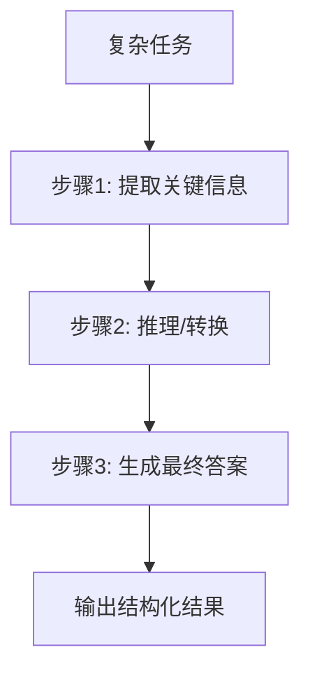
```mermaid
graph TD
    A[复杂任务] --> B[步骤1: 提取关键信息]
    B --> C[步骤2: 推理/转换]
    C --> D[步骤3: 生成最终答案]
    D --> E[输出结构化结果]
```

### 经典金句/数据
> “提示链的意义远超简单问题求解，它是构建复杂智能体的基础技术。”  
> “没有结构化输出，提示链的可靠性会大打折扣。”

---

## 第2章：路由

### 核心论点
**问题**：固定线性流程无法根据输入上下文动态选择不同处理路径。  
**观点**：引入路由模式，让智能体根据条件（如查询意图）将请求导向最合适的子智能体、工具或处理链。

### 关键概念
- **基于 LLM 的路由**：用提示让模型输出分类标识（如 “booker” / “info”）。  
- **基于嵌入的路由**：计算查询向量，匹配最相似的预定义路径。  
- **基于规则的路由**：if-else / switch 快速决策。  
- **协调者（Coordinator）**：接收用户请求，分析意图并委托给专用子智能体。

### 逻辑推演
从客服机器人场景出发：需要区分订单状态查询、产品信息、技术支持等。作者展示两种实现（LangChain 的 RunnableBranch 和 Google ADK 的子智能体委托）。ADK 通过 instruction 和 sub_agents 自动完成路由，而 LangChain 需显式构建条件分支。

### 流程图

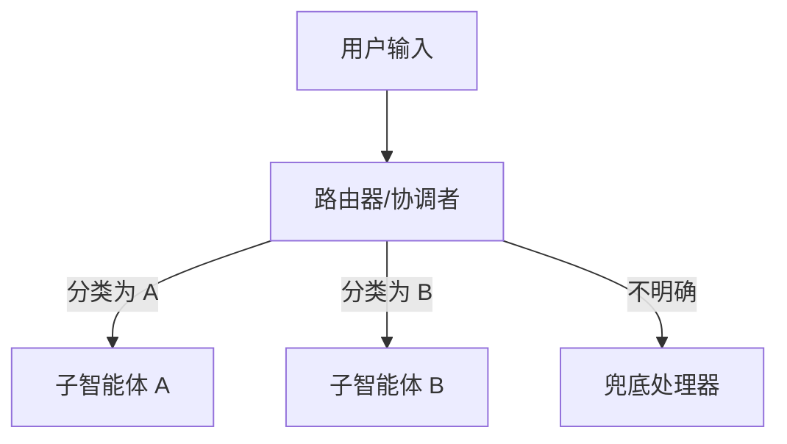
```mermaid
graph TD
    U[用户输入] --> R[路由器/协调者]
    R -- 分类为 A --> A[子智能体 A]
    R -- 分类为 B --> B[子智能体 B]
    R -- 不明确 --> C[兜底处理器]
```

### 经典金句/数据
> “路由模式使智能体能够超越简单线性流程，动态响应更广泛的输入和状态变化。”

---

## 第3章：并行化

### 核心论点
**问题**：串行执行独立任务会导致效率低下，尤其当涉及多个外部 API 调用时。  
**观点**：识别无依赖关系的子任务，并行执行它们以大幅降低总延迟。

### 关键概念
- **并行执行**：同时发起多个 LLM 调用、工具调用或子智能体。  
- **RunnableParallel**（LangChain）：将多个 runnable 组合并同时执行。  
- **ParallelAgent**（Google ADK）：内置并行能力，协调多个子智能体并发运行。  
- **汇总节点**：等待所有并行任务完成后，合并结果。

### 逻辑推演
以研究智能体为例：需要同时搜索多个来源、生成摘要、提取关键词。串行需依次等待，并行则缩短到最慢任务的耗时。作者给出 LangChain 的 RunnableParallel 示例和 ADK 的 ParallelAgent 示例，强调并发与真正的并行（受 GIL 限制）的区别，但异步 I/O 仍能显著提速。

### 流程图

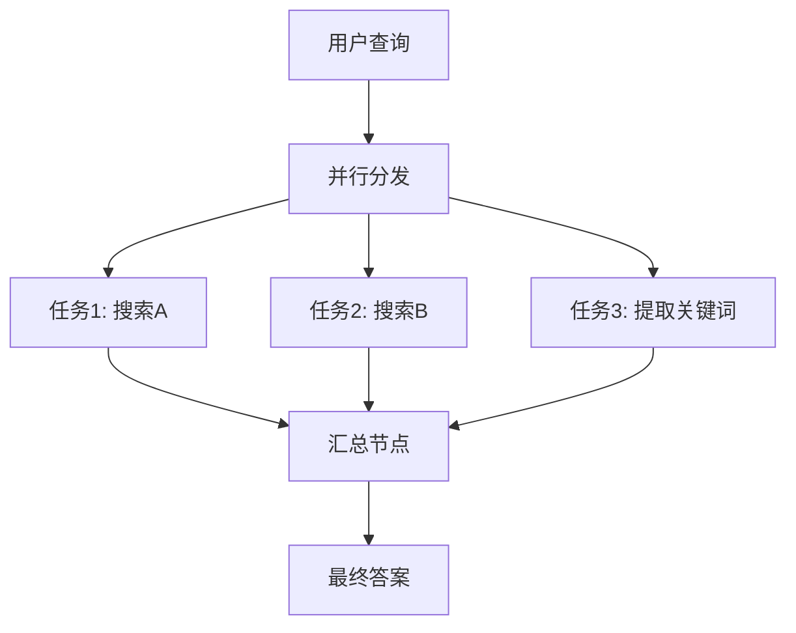
```mermaid
graph TD
    Q[用户查询] --> PAR[并行分发]
    PAR --> T1[任务1: 搜索A]
    PAR --> T2[任务2: 搜索B]
    PAR --> T3[任务3: 提取关键词]
    T1 --> JOIN[汇总节点]
    T2 --> JOIN
    T3 --> JOIN
    JOIN --> FINAL[最终答案]
```

### 经典金句/数据
> “并行化可显著降低整体延迟，让智能体系统在复杂任务下更具响应性。”  
> “识别无依赖关系的独立任务是成功并行的关键。”

---

## 第4章：反思

### 核心论点
**问题**：智能体初次输出可能不理想、不准确或不完整，缺乏自我纠错机制。  
**观点**：引入反思循环——智能体（或独立批评者）评估自身输出，根据反馈优化，迭代提升质量。

### 关键概念
- **生成者–批评者模型**：一个智能体生成初稿，另一个专门评审并提供结构化反馈。  
- **迭代优化**：可多次重复“生成→批判→优化”循环直至满意或达到最大次数。  
- **自我纠错**：通过内部反思减少幻觉，提升事实准确性。  
- **LangGraph 与 ADK 实现**：LangChain 示例中用一个 LLM 同时扮演生产者和批评者（通过不同 prompt），ADK 则用 SequentialAgent 串行两个专门 Agent。

### 逻辑推演
作者首先区分单智能体自我反思与双智能体分工，并指出后者更客观。代码示例展示编写阶乘函数的迭代优化过程：生成代码 → 以“资深工程师”身份批判 → 根据批判优化 → 重复。最后强调反思虽提升质量，但增加延迟与成本。

### 流程图

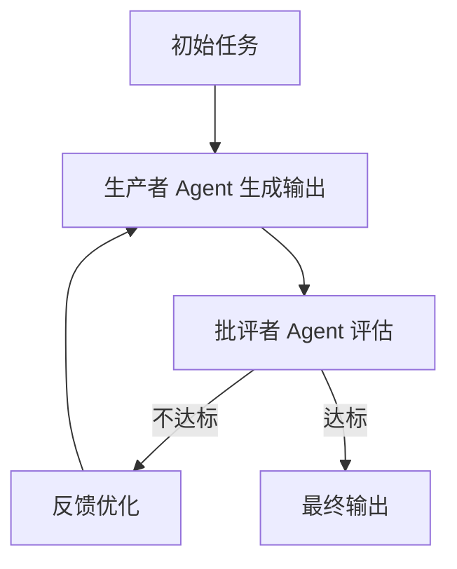
```mermaid
graph TD
    A[初始任务] --> B[生产者 Agent 生成输出]
    B --> C[批评者 Agent 评估]
    C -- 不达标 --> D[反馈优化]
    D --> B
    C -- 达标 --> E[最终输出]
```

### 经典金句/数据
> “反思模式让智能体具备元认知能力，能够从自身输出中学习。”  
> “独立批评者智能体比自我评审更客观。”

---

## 第5章：工具使用

### 核心论点
**问题**：LLM 受限于训练数据，无法获取实时信息或执行动作。  
**观点**：通过函数调用（工具使用）模式，让智能体能够调用外部 API、数据库、代码解释器等，突破静态知识限制。

### 关键概念
- **函数调用**：LLM 生成结构化请求（如 JSON），指定工具名称和参数。  
- **工具定义**：向 LLM 描述工具的功能、参数及使用方式。  
- **工具执行器**：智能体框架拦截调用，实际执行并返回结果。  
- **内置工具**：Google ADK 提供 Google 搜索、代码执行、Vertex AI Search 等。  
- **CrewAI 工具**：通过 @tool 装饰器定义。

### 逻辑推演
从“智能体需要与外界交互”出发，讲解典型流程：用户问“伦敦天气” → LLM 识别需要天气工具 → 生成函数调用 → 框架执行天气 API → 结果返回 LLM → LLM 生成最终回答。展示了 LangChain、CrewAI 和 ADK 三种实现，特别强调 ADK 的 BuiltInCodeExecutor 和 Vertex AI Search 工具。

### 流程图

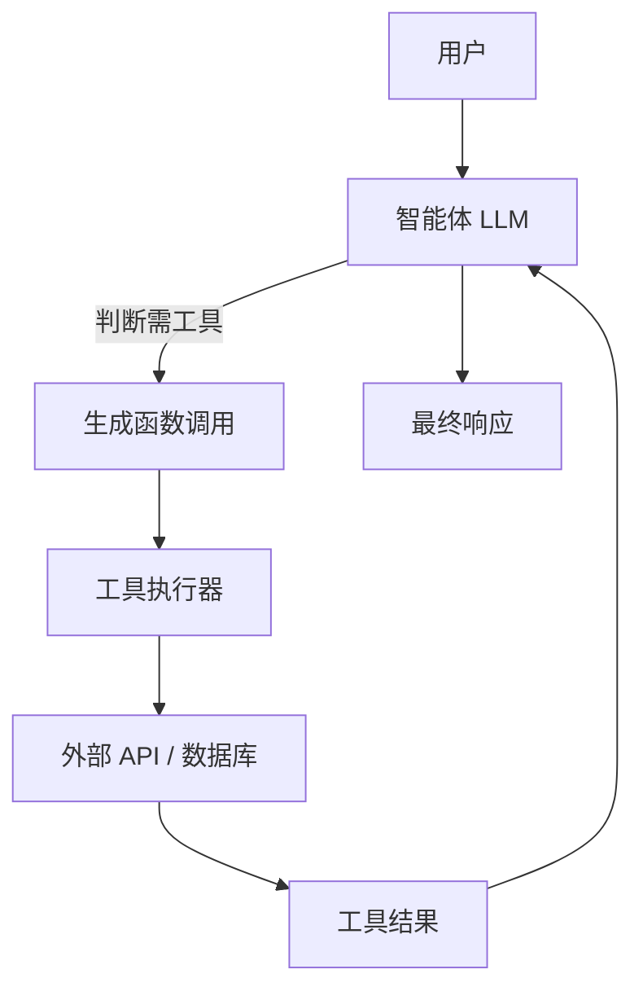
```mermaid
graph TD
    U[用户] --> A[智能体 LLM]
    A -- 判断需工具 --> B[生成函数调用]
    B --> C[工具执行器]
    C --> D[外部 API / 数据库]
    D --> E[工具结果]
    E --> A
    A --> F[最终响应]
```

### 经典金句/数据
> “工具使用模式是连接 LLM 推理能力与丰富外部功能的技术桥梁。”  
> “Google ADK 内置了 Google 搜索、代码执行、企业搜索等实用工具。”

---

## 第6章：规划

### 核心论点
**问题**：复杂任务无法通过单一行动完成，需要前瞻性思考和步骤拆解。  
**观点**：规划模式让智能体将高层目标自动分解为一系列可执行的子任务（计划），并按顺序或动态执行。

### 关键概念
- **规划者智能体**：先制定计划，再执行计划中的每一步。  
- **动态规划**：根据新信息调整计划，适应变化。  
- **Google Deep Research**：一个自动迭代搜索、反思、生成结构化报告的智能体系统。  
- **OpenAI Deep Research API**：支持自主网络搜索并生成带引用的研究报告。

### 逻辑推演
从“组织团建”的比喻出发：用户定义目标，智能体自主制定步骤（预算、场地、餐饮等）。然后通过 CrewAI 示例（规划+写作）和 Google/OpenAI 的深度研究产品，说明规划模式在实际产品中的应用。规划不是死板剧本，而是自适应导航。

### 流程图

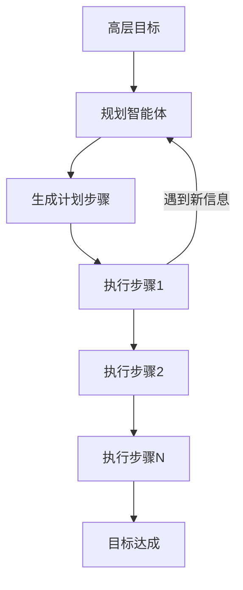
```mermaid
graph TD
    A[高层目标] --> B[规划智能体]
    B --> C[生成计划步骤]
    C --> D[执行步骤1]
    D --> E[执行步骤2]
    E --> F[执行步骤N]
    F --> G[目标达成]
    D -- 遇到新信息 --> B
```

### 经典金句/数据
> “规划使智能体从被动反应者转变为战略型、目标导向的执行者。”  
> “Google Deep Research 可以将用户查询转化为多页结构化报告，附有来源引用。”

---

## 第7章：多智能体协作

### 核心论点
**问题**：单一智能体难以处理需要多领域知识或并行协作的复杂任务。  
**观点**：构建多个独立且专用的智能体团队，通过分工、通信和协作，共同完成单个智能体无法完成的目标。

### 关键概念
- **顺序交接**：一个智能体输出作为下一个智能体输入。  
- **并行处理**：多个智能体同时处理问题不同部分。  
- **层级结构**：监督者智能体分派任务给工作智能体。  
- **辩论与共识**：多个智能体从不同视角讨论，达成更优结果。  
- **CrewAI**：通过 Agent、Task、Crew 定义角色和流程。  
- **Google ADK**：提供 SequentialAgent、ParallelAgent、LoopAgent 等预制结构。

### 逻辑推演
作者列出多智能体系统的优势（模块化、可扩展、健壮），并介绍六种协作模型（单智能体、网络型、监督者、工具型监督者、层级型、定制型）。代码示例展示 CrewAI 的研究员+写手协作，以及 ADK 的层级智能体（父智能体协调子智能体）、LoopAgent 迭代、ParallelAgent 并行、Agent 作为工具等模式。

### 流程图

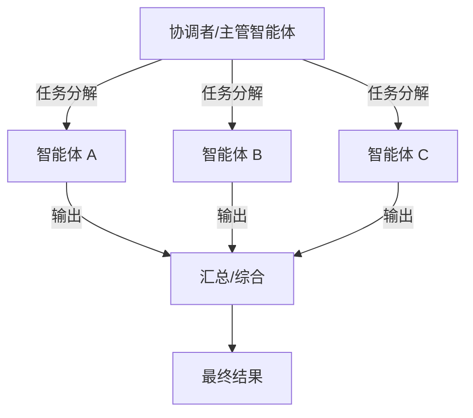
```mermaid
graph TD
    C[协调者/主管智能体] -->|任务分解| A[智能体 A]
    C -->|任务分解| B[智能体 B]
    C -->|任务分解| D[智能体 C]
    A -->|输出| E[汇总/综合]
    B -->|输出| E
    D -->|输出| E
    E --> F[最终结果]
```

### 经典金句/数据
> “多智能体系统的整体性能远超任何单一智能体。”  
> “Google ADK 通过 sub_agents 参数建立父子关系，自动管理委托。”

---

## 第8章：记忆管理

### 核心论点
**问题**：智能体需要保留上下文（短期）和长期知识才能完成多轮对话、个性化交互和学习。  
**观点**：区分短期记忆（上下文窗口、session state）和长期记忆（外部向量数据库、MemoryService），通过结构化组件进行管理。

### 关键概念
- **短期记忆**：当前会话的 events 和 state，受上下文窗口限制。  
- **长期记忆**：跨会话的知识，存储在向量数据库或知识图谱中，通过语义检索访问。  
- **Session**：单个聊天线程，记录消息和临时状态。  
- **State**：session.state 字典，存储当前会话的动态数据（支持 user: / app: / temp: 前缀）。  
- **MemoryService**（ADK）：管理长期知识的接口，如 InMemoryMemoryService 和 VertexAiRagMemoryService。  
- **LangChain 记忆**：ConversationBufferMemory、ChatMessageHistory 等。

### 逻辑推演
从“人类需要记忆”类比开始，说明短期记忆用于连贯对话，长期记忆用于个性化。ADK 部分详细讲解 SessionService 和 State 的更新方式（推荐通过 output_key 或 EventActions.state_delta），以及如何用 MemoryService 进行语义检索。LangChain 部分展示 ConversationBufferMemory 与 LLMChain 集成。

### 流程图

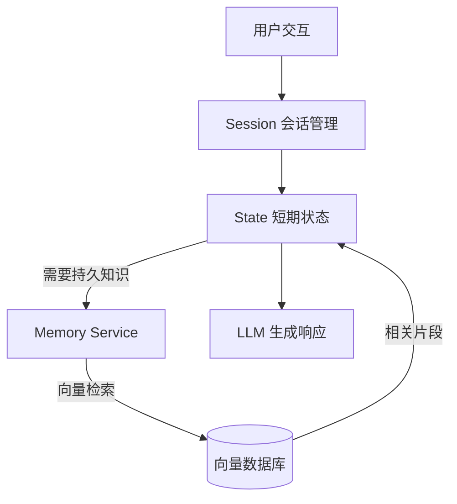
```mermaid
graph TD
    U[用户交互] --> S[Session 会话管理]
    S --> ST[State 短期状态]
    ST -->|需要持久知识| M[Memory Service]
    M -->|向量检索| VDB[(向量数据库)]
    VDB -->|相关片段| ST
    ST --> LLM[LLM 生成响应]
```

### 经典金句/数据
> “没有记忆，智能体就是无状态的，无法保持对话上下文或学习。”  
> “ADK 的 VertexAiRagMemoryService 利用 Google Cloud RAG 实现可扩展语义检索。”

---

## 第9章：学习与适应

### 核心论点
**问题**：静态智能体无法根据新经验自主改进，面对动态环境会性能下降。  
**观点**：赋予智能体学习与适应能力——通过强化学习、监督学习、自我代码修改（如 SICA）或进化算法（AlphaEvolve），使智能体持续优化自身行为。

### 关键概念
- **SICA（自我改进编码智能体）**：能够修改自身源代码，迭代优化编码能力。  
- **AlphaEvolve / OpenEvolve**：结合 LLM 和进化算法，自动发现新算法。  
- **强化学习（PPO、DPO）**：通过奖励或偏好优化策略。  
- **上下文窗口结构**：系统提示、核心提示、助手消息的精细化设计。

### 逻辑推演
介绍 SICA 的工作原理：回顾历史版本→选出最好版本→自我修改代码→重新基准测试→循环。并展示了在编码任务上的性能提升（开发出智能编辑器、AST 符号定位器等）。AlphaEvolve 则用于数据中心调度优化、矩阵乘法发现等。最后强调学习与适应模式适用于不确定、需个性化的环境。

### 流程图

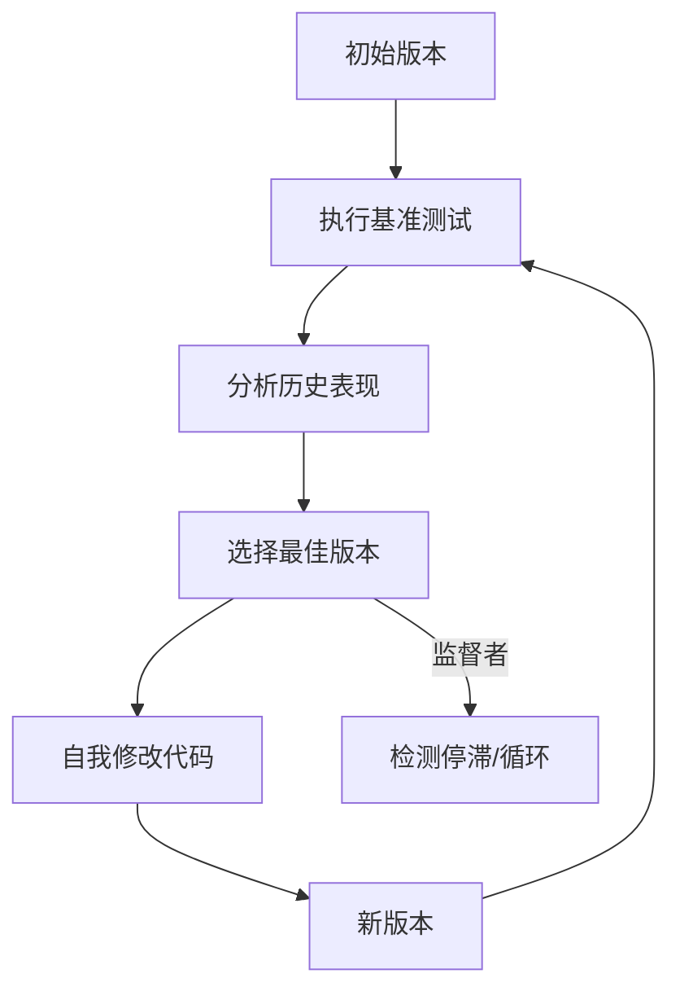
```mermaid
graph TD
    A[初始版本] --> B[执行基准测试]
    B --> C[分析历史表现]
    C --> D[选择最佳版本]
    D --> E[自我修改代码]
    E --> F[新版本]
    F --> B
    D -->|监督者| G[检测停滞/循环]
```

### 经典金句/数据
> “SICA 既是修改者也是被修改者，通过迭代优化自身代码提升表现。”  
> “AlphaEvolve 帮助 Google 数据中心节省 0.7% 的全球算力资源。”

---

## 第10章：模型上下文协议（MCP）

### 核心论点
**问题**：LLM 与外部系统集成没有统一标准，每次定制开发成本高、难复用。  
**观点**：MCP 作为开放协议，定义 LLM 与外部工具、数据源、资源的标准化通信方式（客户端-服务器架构），促进互操作性。

### 关键概念
- **MCP 服务器**：暴露资源（数据）、提示模板和工具（可执行功能）。  
- **MCP 客户端**：LLM 应用或智能体，发现并调用服务器能力。  
- **FastMCP**：简化 Python 工具开发为 MCP 服务器的高级框架。  
- **与函数调用的区别**：函数调用是专有的一对一；MCP 是开放、可发现的通用框架。

### 逻辑推演
对比 MCP 与工具函数调用：MCP 更像“通用电源插座”，任何合规工具都可接入。给出 ADK 连接本地文件系统 MCP 服务器的示例（使用 npx 运行官方 filesystem 服务器），以及用 FastMCP 创建自定义工具（greet）并通过 HTTP 暴露。最后强调安全性（认证、授权）和可发现性。

### 流程图

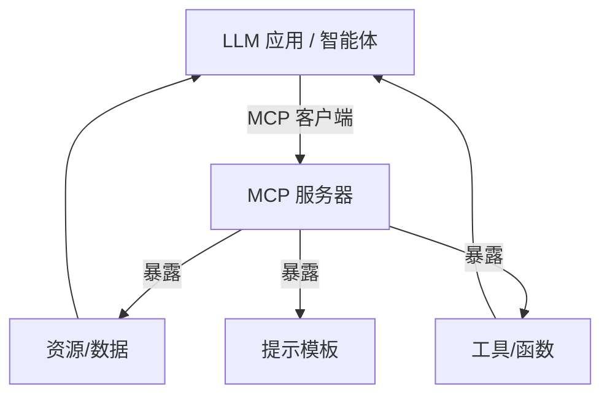
```mermaid
graph TD
    A[LLM 应用 / 智能体] -->|MCP 客户端| B[MCP 服务器]
    B -->|暴露| C[资源/数据]
    B -->|暴露| D[工具/函数]
    B -->|暴露| E[提示模板]
    C --> A
    D --> A
```

### 经典金句/数据
> “MCP 就像一个通用适配器，让任何 LLM 都能无缝连接到任何外部系统。”  
> “使用 FastMCP，只需装饰器即可将 Python 函数暴露为 MCP 工具。”

---

## 第11章：目标设定与监控

### 核心论点
**问题**：智能体缺乏方向感和自我评估机制，难以自主完成复杂多步任务。  
**观点**：为智能体设定明确、可衡量的目标，并持续监控进度，形成反馈回路，使智能体能主动调整行为以达成目标。

### 关键概念
- **SMART 目标**：具体、可衡量、可达成、相关、有时限。  
- **自我评估**：智能体或专用批评者定期检查是否接近目标。  
- **代码生成迭代示例**：LLM 根据目标列表反复生成、评估、优化代码，直到满足所有目标。

### 逻辑推演
用“旅行规划”引入目标状态与初始状态的对比。然后给出 LangChain 实例：编写一个 AI 程序员，用户提供编程问题+目标清单（如“简单”、“已测试”），智能体循环生成代码→自我评审→判断目标是否达成→未达成则优化。最终输出符合所有目标的代码文件。

### 流程图

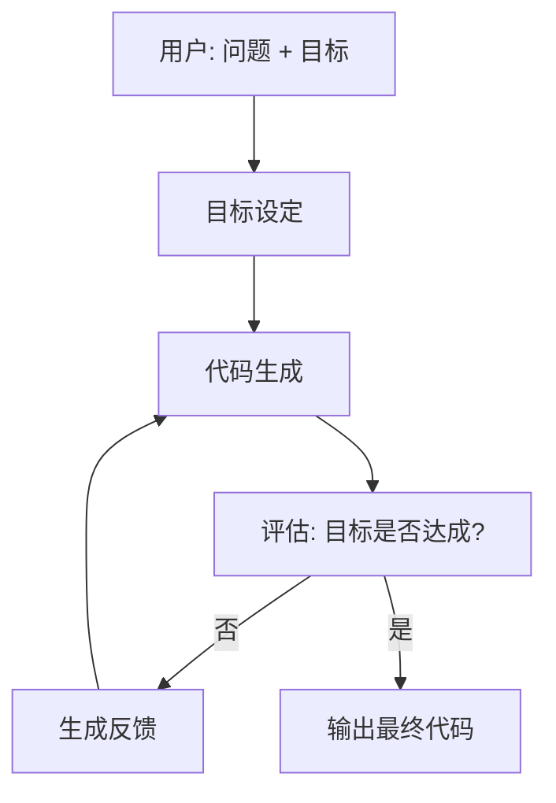
```mermaid
graph TD
    U[用户: 问题 + 目标] --> G[目标设定]
    G --> C[代码生成]
    C --> E[评估: 目标是否达成?]
    E -- 否 --> F[生成反馈]
    F --> C
    E -- 是 --> O[输出最终代码]
```

### 经典金句/数据
> “目标设定与监控将简单响应式智能体转变为主动、可靠的自主系统。”  
> “更健壮的做法是将不同职责分配给多个智能体（编程助手、评审员、测试员等）。”

---

## 第12章：异常处理与恢复

### 核心论点
**问题**：真实环境中智能体必然会遇到工具错误、API 超时、数据异常等问题，若无处理机制则容易崩溃。  
**观点**：建立异常检测、处理（重试、回退、降级）和恢复（状态回滚、升级人工）的完整模式，保证智能体健壮性。

### 关键概念
- **错误检测**：验证工具输出、检查 API 状态码、超时监控。  
- **处理策略**：重试、备用方案、优雅降级、日志记录、通知。  
- **恢复机制**：状态回滚、自我修正、升级至人工。  
- **ADK SequentialAgent 示例**：主工具失败后，备用工具自动接管。

### 逻辑推演
从客服机器人遇到数据库故障、交易机器人资金不足等场景切入。展示 ADK 代码：primary_handler 尝试获取精确位置信息，若失败（状态变量标记），fallback_handler 提取城市并用通用区域工具，最终 response_agent 输出结果或致歉。体现了分层异常处理。

### 流程图

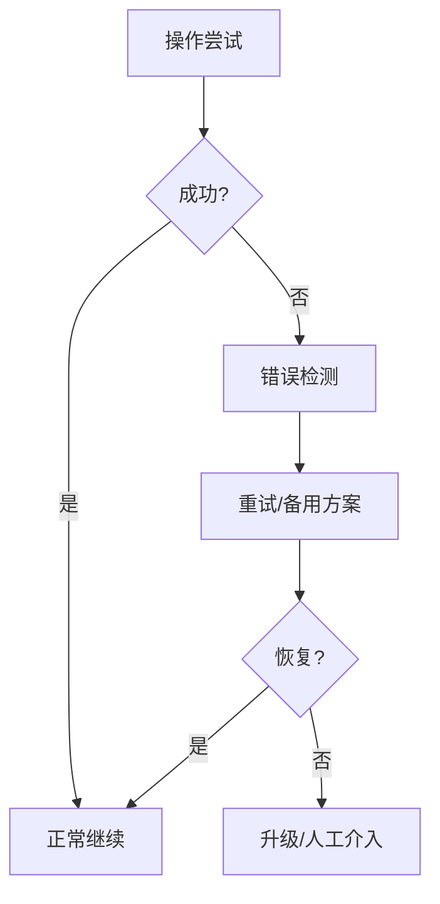
```mermaid
graph TD
    A[操作尝试] --> B{成功?}
    B -- 是 --> C[正常继续]
    B -- 否 --> D[错误检测]
    D --> E[重试/备用方案]
    E --> F{恢复?}
    F -- 是 --> C
    F -- 否 --> G[升级/人工介入]
```

### 经典金句/数据
> “异常处理与恢复模式将智能体从脆弱不可靠转变为坚实可靠的组件。”  
> “ADK 的 SequentialAgent 可以轻松构建分层容错流程。”

---

## 第13章：人类参与环节

### 核心论点
**问题**：完全自主的 AI 在高风险、模糊或伦理敏感领域可能犯错，导致严重后果。  
**观点**：Human-in-the-Loop（HITL）模式战略性地引入人类监督、干预和反馈，确保安全、合规和高质量决策。

### 关键概念
- **人类监督**：监控智能体行为和输出，通过日志或仪表盘。  
- **干预与纠正**：智能体遇到模糊场景时请求人类介入。  
- **升级策略**：当任务超出能力范围，自动转交人工。  
- **反馈用于学习**：收集人类反馈优化模型（RLHF）。  
- **决策增强**：AI 提供分析，人类做最终决定。

### 逻辑推演
列举内容审核、自动驾驶、金融欺诈检测等场景，说明为何需要 HITL。ADK 代码示例：技术支持智能体，在复杂问题无法解决时调用 escalate_to_human 工具，并附带客户个性化信息。最后讨论 HITL 的可扩展性挑战和隐私问题。

### 流程图

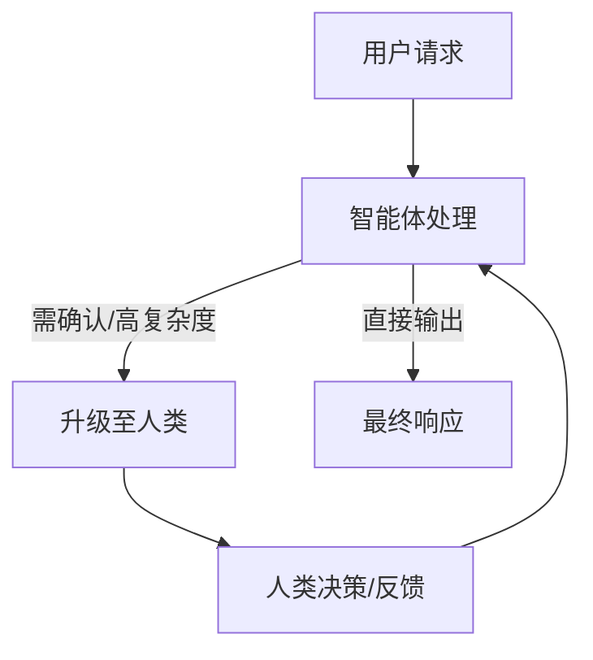
```mermaid
graph TD
    A[用户请求] --> B[智能体处理]
    B -- 需确认/高复杂度 --> C[升级至人类]
    C --> D[人类决策/反馈]
    D --> B
    B -- 直接输出 --> E[最终响应]
```

### 经典金句/数据
> “HITL 不旨在取代人类，而是通过人类理解确保关键决策质量。”  
> “主要缺点是可扩展性不足，需在准确性与处理量之间权衡。”

---

## 第14章：知识检索（RAG）

### 核心论点
**问题**：LLM 知识静态且限于训练数据，无法访问实时或专有信息。  
**观点**：RAG 模式在生成响应前先从外部知识库检索相关信息，增强提示，使输出更准确、可验证、基于最新数据。

### 关键概念
- **嵌入**：文本的向量表示，用于语义相似度计算。  
- **向量数据库**：存储嵌入并支持高效相似性搜索（如 Pinecone、Weaviate）。  
- **文档分块**：将长文档拆分为更小片段以便检索。  
- **GraphRAG**：利用知识图谱进行多跳推理，回答复杂问题。  
- **智能体 RAG**：引入推理层，主动评估检索结果、解决冲突、调用外部工具。

### 逻辑推演
从“闭卷考试”与“开卷考试”的比喻出发，解释 RAG 流程：查询 → 检索相关块 → 增强提示 → LLM 生成。介绍嵌入、向量数据库、分块等技术基础。然后对比 GraphRAG 和智能体 RAG 的优缺点，并展示 ADK 的 VertexAiRagMemoryService 和 LangChain 的完整 RAG 链。

### 流程图

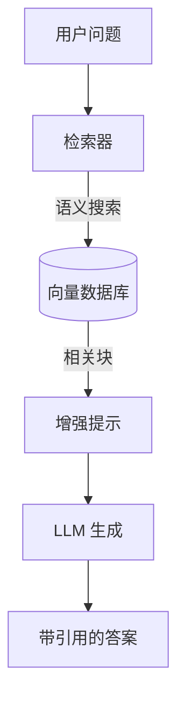
```mermaid
graph TD
    Q[用户问题] --> R[检索器]
    R -->|语义搜索| DB[(向量数据库)]
    DB -->|相关块| E[增强提示]
    E --> LLM[LLM 生成]
    LLM --> A[带引用的答案]
```

### 经典金句/数据
> “RAG 让 LLM 从‘闭卷’推理者变为‘开卷’推理者。”  
> “智能体 RAG 可以主动验证来源、调和知识冲突，显著提升可靠性。”

---

## 第15章：智能体间通信（A2A）

### 核心论点
**问题**：不同框架构建的智能体无法互操作，形成孤岛。  
**观点**：Google A2A 协议作为开放标准，定义智能体间的发现、通信和任务委托机制，实现跨框架协作（如 ADK、LangGraph、CrewAI）。

### 关键概念
- **AgentCard**：智能体的数字身份（JSON），包含能力、技能、端点、认证方式。  
- **发现机制**：well-known URI、注册表、直接配置。  
- **任务与消息**：异步任务模型，支持流式（SSE）和轮询。  
- **与 MCP 对比**：MCP 是智能体与工具的通信，A2A 是智能体与智能体的通信。

### 逻辑推演
首先指出多智能体协作需要标准化通信。然后介绍 A2A 的核心组件：AgentCard、任务生命周期、同步/异步交互。给出一个日历智能体的 A2A 服务器实现（使用 Starlette + ADK），以及客户端如何发现并调用。最后对比 A2A 和 MCP 的互补关系。

### 流程图

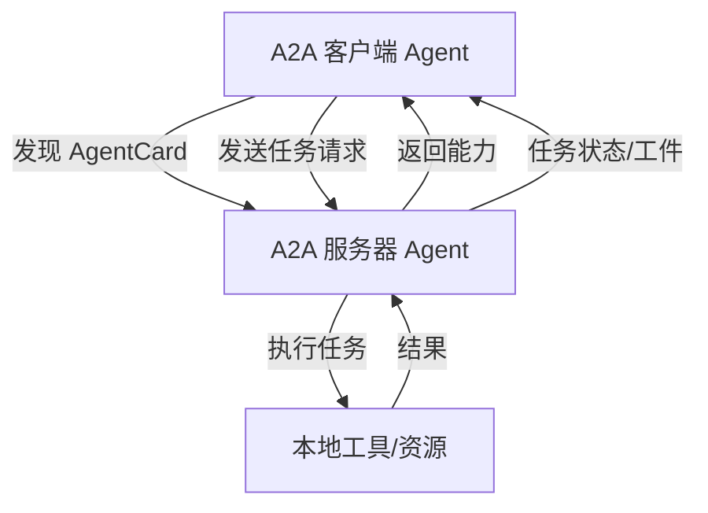
```mermaid
graph TD
    A[A2A 客户端 Agent] -->|发现 AgentCard| B[A2A 服务器 Agent]
    B -->|返回能力| A
    A -->|发送任务请求| B
    B -->|执行任务| C[本地工具/资源]
    C -->|结果| B
    B -->|任务状态/工件| A
```

### 经典金句/数据
> “A2A 得到 Atlassian、Box、LangChain、Salesforce、SAP 等多家公司支持。”  
> “A2A 与 MCP 互为补充：MCP 连接工具，A2A 连接智能体。”

---

## 第16章：资源感知优化

### 核心论点
**问题**：LLM 调用有成本、延迟和资源消耗，不加区分地使用最强模型不经济。  
**观点**：智能体动态监控并优化资源使用——根据任务复杂度选择不同模型（如简单问题用 Gemini Flash，复杂问题用 Gemini Pro），实现成本与性能的平衡。

### 关键概念
- **动态模型切换**：路由智能体根据查询分类（simple / reasoning / internet_search）分配低成本或高成本模型。  
- **批判智能体**：评估响应质量，反馈给路由逻辑，持续优化资源分配。  
- **回退机制**：主模型不可用时自动切换到备选模型。  
- **OpenRouter**：提供统一 API，支持自动模型选择和顺序回退。

### 逻辑推演
从金融分析师需要快速概览 vs 深度预测的场景引出资源感知的必要性。代码示例展示一个问答系统：先分类问题（简单/推理/需搜索），然后选择对应的 OpenAI 模型（gpt-4o-mini / o4-mini / gpt-4o），如需搜索则调用 Google Custom Search。还介绍了 OpenRouter 的自动模型选择与回退功能。

### 流程图

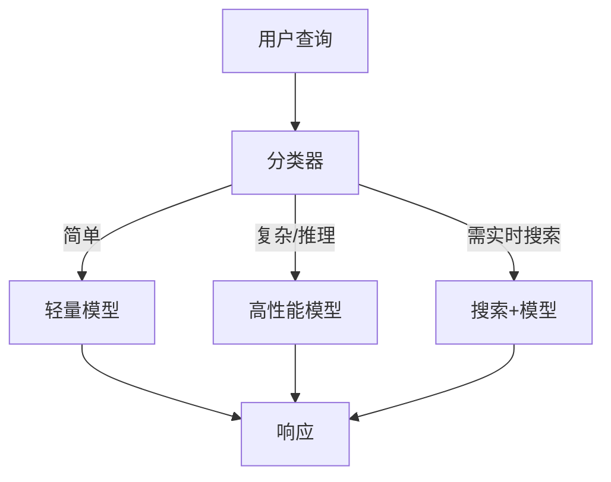
```mermaid
graph TD
    Q[用户查询] --> C[分类器]
    C -- 简单 --> M1[轻量模型]
    C -- 复杂/推理 --> M2[高性能模型]
    C -- 需实时搜索 --> M3[搜索+模型]
    M1 --> R[响应]
    M2 --> R
    M3 --> R
```

### 经典金句/数据
> “推理扩展定律表明：小模型在充足‘思考时间’下可超越简单推理的大模型。”  
> “OpenRouter 的顺序回退机制确保服务连续性。”

---

## 第17章：推理技术

### 核心论点
**问题**：复杂问题需要多步逻辑推理，而简单问答无法满足。  
**观点**：显式化智能体的“思考过程”，通过链式思维（CoT）、树式思维（ToT）、ReAct 等技术，让模型分解问题、探索多路径、结合工具使用，提升推理准确性和可解释性。

### 关键概念
- **链式思维（CoT）**：要求模型输出中间推理步骤。  
- **树式思维（ToT）**：同时探索多条推理路径，回溯选择最佳。  
- **ReAct**：交替进行“思考”和“行动”（调用工具），动态调整。  
- **自我纠错**：模型评估自己的推理，修正错误。  
- **推理扩展定律**：推理阶段分配更多计算资源（更长思考时间）可显著提升性能。  
- **MASS 框架**：自动优化多智能体系统的提示和拓扑结构。

### 逻辑推演
从“智能体如何思考”问题开始，逐一介绍 CoT、ToT、ReAct、PALM（程序辅助模型）等。提供 CoT 提示示例和自我纠错示例。最后讨论推理扩展定律，并用 Google DeepSearch（开源项目）展示如何结合反思和搜索实现复杂调研。

### 流程图

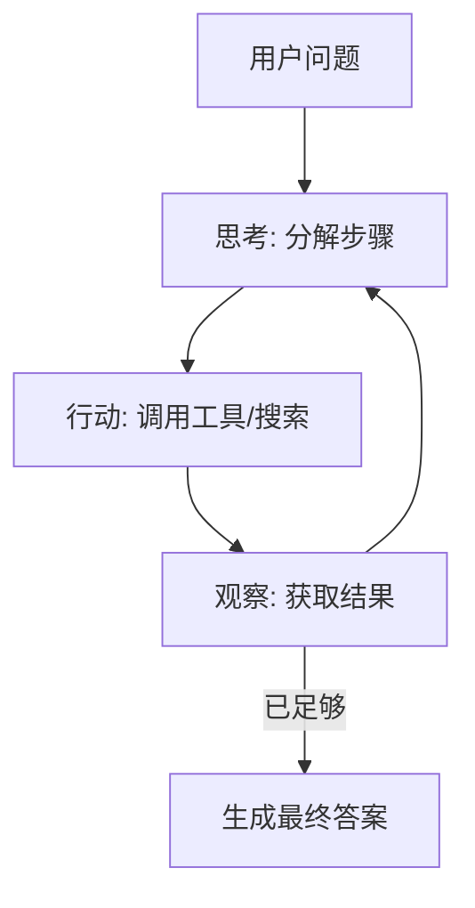
```mermaid
graph TD
    A[用户问题] --> B[思考: 分解步骤]
    B --> C[行动: 调用工具/搜索]
    C --> D[观察: 获取结果]
    D --> B
    D -->|已足够| E[生成最终答案]
```

### 经典金句/数据
> “ReAct 框架赋予智能体核心操作循环：思考 → 行动 → 观察。”  
> “在 GPQA 基准上，推理扩展可使小模型准确率从 50% 提升到 78%。”

---

## 第18章：护栏与安全模式

### 核心论点
**问题**：自主智能体可能生成有害、偏见、违规或错误内容，存在被提示注入攻击的风险。  
**观点**：建立多层护栏（输入验证、输出过滤、行为约束、工具限制、人工介入），确保智能体安全、合规、可控。

### 关键概念
- **输入护栏**：使用轻量模型或规则检测恶意提示（如越狱攻击、禁止内容）。  
- **输出护栏**：后处理过滤有毒、偏见或不安全的生成内容。  
- **工具调用回调**：在工具执行前校验参数（如用户 ID 一致性）。  
- **可观测性**：结构化日志记录所有行为和决策。  
- **最小权限原则**：智能体只获得完成任务所需的最小权限。

### 逻辑推演
从客服机器人可能泄露隐私、金融交易系统需防攻击等场景出发。展示 CrewAI 的护栏示例：一个专门的“内容政策执行者”智能体，根据详细的安全政策指令对用户输入进行分类（合规/不合规），并输出结构化 JSON。同时给出 Vertex AI 的 before_tool_callback 示例，校验工具参数。最后总结工程化可靠智能体的其他原则（模块化、检查点、可观测性）。

### 流程图

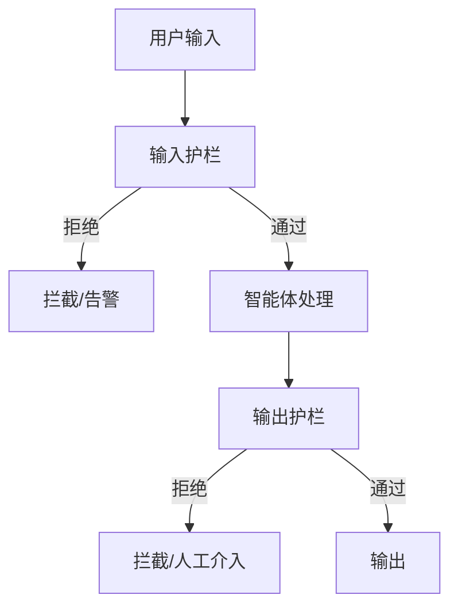
```mermaid
graph TD
    U[用户输入] --> G1[输入护栏]
    G1 -- 拒绝 --> REJECT[拦截/告警]
    G1 -- 通过 --> A[智能体处理]
    A --> G2[输出护栏]
    G2 -- 拒绝 --> REJECT2[拦截/人工介入]
    G2 -- 通过 --> O[输出]
```

### 经典金句/数据
> “护栏不是限制智能体，而是确保其运行稳健、可信且有益。”  
> “推荐使用如 Gemini Flash 这类快速、低成本模型作为额外防线。”

---

## 第19章：评估与监控

### 核心论点
**问题**：智能体的概率性和非确定性使传统测试难以保障可靠性，需要持续评估性能、合规性和效率。  
**观点**：建立多维评估框架（准确率、延迟、token 用量、轨迹分析、LLM 作为评审），并提供自动化测试工具（ADK 的 pytest 集成、eval 命令行）。

### 关键概念
- **LLM-as-a-Judge**：用强大模型评估智能体输出的主观质量（如有用性、中立性）。  
- **轨迹评估**：比较智能体实际执行步骤与理想路径，发现低效或错误。  
- **测试文件 vs evalset**：前者用于单元测试（单次交互），后者用于多轮集成测试。  
- **承包商模型**：用正式“合同”代替简单提示，明确定义交付物、范围和验证标准，将智能体升级为可问责系统。

### 逻辑推演
首先说明评估的重要性（生产环境性能追踪、A/B 测试、漂移检测）。然后展示简单的准确率比较函数、延迟监控和 token 追踪。重点介绍 LLM 作为评审的代码（法律调查问卷质量评估）。最后介绍 Google ADK 的评估工具：adk web 交互测试、pytest 集成、adk eval 命令行。

### 流程图

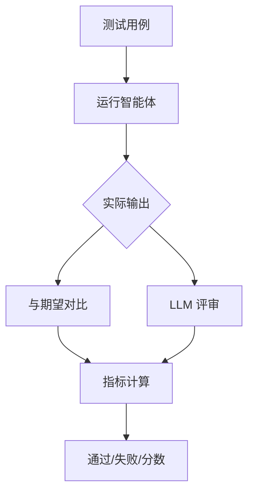
```mermaid
graph TD
    A[测试用例] --> B[运行智能体]
    B --> C{实际输出}
    C --> D[与期望对比]
    D --> E[指标计算]
    C --> F[LLM 评审]
    F --> E
    E --> G[通过/失败/分数]
```

### 经典金句/数据
> “智能体评估不仅仅是输出正确性，还要分析轨迹、资源消耗和主观质量。”  
> “ADK 的 evalset 文件可以定义多轮对话、工具调用和参考答案。”

---

## 第20章：优先级排序

### 核心论点
**问题**：智能体在动态环境下面临多个冲突任务，若无排序机制会效率低下。  
**观点**：引入优先级排序模式——根据紧急性、重要性、依赖关系、资源可用性等标准，动态评估并选择下一步行动。

### 关键概念
- **优先级标准**：紧急性、重要性、依赖关系、成本/收益、用户偏好。  
- **动态调整**：环境变化时重新排序（如新紧急事件插入）。  
- **LangChain 项目管理者示例**：智能体根据用户请求的紧急程度分配 P0/P1/P2 优先级，并分派给工作人员。

### 逻辑推演
从人类团队管理者类比出发。代码展示一个项目管理者智能体：用户输入“紧急实现登录系统，分配给 Worker B”，智能体创建任务 → 分配优先级 P0 → 分配给指定人员 → 列出所有任务。对于普通任务则默认 P1。体现了基于规则的自动优先级分配。

### 流程图

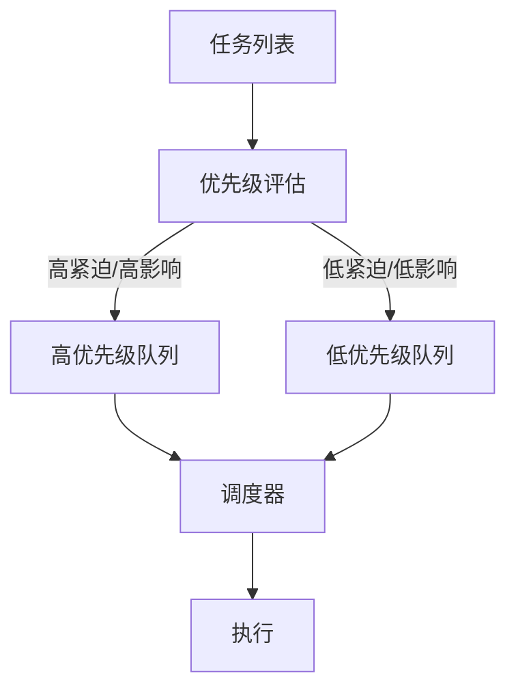
```mermaid
graph TD
    T[任务列表] --> P[优先级评估]
    P -->|高紧迫/高影响| H[高优先级队列]
    P -->|低紧迫/低影响| L[低优先级队列]
    H --> S[调度器]
    L --> S
    S --> E[执行]
```

### 经典金句/数据
> “优先级排序让智能体在复杂多元环境下高效运作，是自我管理能力的关键。”  
> “动态优先级调整使智能体能根据实时变化自主调整关注重点。”

---

## 第21章：探索与发现

### 核心论点
**问题**：被动响应式智能体无法发现“未知的未知”，难以在开放、复杂领域创新。  
**观点**：构建自主探索与发现的智能体系统（如 Google Co-Scientist、Agent Laboratory），通过多智能体协作（生成、反思、排序、进化）主动提出新假设、设计实验、发现新知识。

### 关键概念
- **Google Co-Scientist**：多智能体系统（生成者、反思者、排序者、进化者、邻近者、元评审者）模拟科学方法，生成并验证假设。  
- **Agent Laboratory**：自动化科研工作流（文献综述、实验、报告撰写、知识共享）。  
- **AgentRxiv**：去中心化自主研究成果库。  
- **测试时计算扩展**：动态分配更多计算资源以迭代优化输出。

### 逻辑推演
从科学研究需要海量文献分析和假设生成出发。详细拆解 Co-Scientist 的六个智能体角色及其协作流程（生成→辩论→进化→排名）。验证案例：药物再利用（发现 KIRA6 治疗 AML）、肝纤维化新靶点、抗菌耐药性机制复现。Agent Laboratory 部分展示三智能体评审机制和教授/博士后/工程师角色分工。

### 流程图

```mermaid
graph TD
    A[科学问题] --> G[生成者: 提出初步假设]
    G --> R[反思者: 评审]
    R --> E[进化者: 优化假设]
    E --> S[排序者: 模拟辩论排名]
    S --> M[元评审者: 综合反馈]
    M --> G
    S --> O[输出高价值假设]
```

### 经典金句/数据
> “AI 联合科学家在 GPQA 钻石级难题上 top-1 准确率达 78.4%。”  
> “系统在两天内独立复现了需要十多年实验验证的抗菌耐药性机制。”

---

## 结论

### 核心论点
回顾全书 21 种设计模式，强调它们可以组合成更复杂的智能系统（如研究助手同时使用规划、工具调用、多智能体协作、反思、记忆管理）。展望未来：智能体将更具自主性，生态标准化（MCP、A2A 成为行业标准），同时需要加强安全与对齐研究。

### 关键要点
- 智能体设计模式是“调色板”，组合使用才能创作复杂系统。  
- 未来方向：通才智能体、主动目标发现、具身化、智能体经济、自变形多智能体系统。  
- 挑战：安全性、对齐性、健壮性、可扩展性。

### 经典金句
> “智能体 AI 是技术领域最令人兴奋且发展最快的方向之一，我们不再是 AI 的使用者，而是智能系统的架构师。”

---

## 附录 A：高级提示工程技术

### 核心内容
- 核心原则：清晰、具体、简洁、正面指令、迭代实验。  
- 基础技术：零样本、单样本、少样本提示。  
- 结构化技巧：系统提示、角色提示、分隔符、上下文工程。  
- 结构化输出：要求 JSON/XML，并用 Pydantic 校验。  
- 推理技术：链式思维（CoT）、自洽性、反思提示、思维树（ToT）。  
- 行动技术：工具使用/函数调用、ReAct 框架。  
- 高级技术：自动提示工程（APE）、迭代精炼、负面示例、类比、任务拆分、RAG、用户画像、Google Gems、用 LLM 优化提示（元方法）。  
- 特定任务：代码提示、多模态提示。

### 流程图（ReAct）

```mermaid
graph TD
    A[用户输入] --> B[思考: 下一步计划]
    B --> C[行动: 调用工具]
    C --> D[观察: 获取结果]
    D --> B
    D --> E[最终答案]
```

---

## 附录 B：智能体交互：从 GUI 到现实世界环境

### 核心内容
- **智能体-计算机接口（ACI）**：通过视觉感知 GUI 元素，像人类一样操作软件。  
- **代表性项目**：ChatGPT Operator、Google Project Mariner、Anthropic Computer Use、Browser Use。  
- **现实世界交互**：Google Project Astra（多模态环境感知）、Gemini Live、OpenAI GPT-4o、Seeing AI。  
- **Vibe Coding**：通过直觉式对话与 AI 协作开发，关注“做什么”而非“怎么做”。

---

## 附录 C：智能体框架速览

| 框架 | 核心抽象 | 适用场景 |
|------|----------|----------|
| LangChain | LCEL 链（线性） | 简单、可预测流程 |
| LangGraph | 状态图（支持循环） | 复杂、动态、多智能体 |
| Google ADK | 智能体团队（Sequential/Parallel） | 生产级协作编排 |
| CrewAI | 角色 + 任务 + Crew | 团队模拟、顺序/层级流程 |
| AutoGen | 对话驱动 | 动态多智能体交互 |
| LlamaIndex | 数据索引/检索 | RAG 密集型应用 |
| MetaGPT | 预设 SOP | 代码生成等专业领域 |
| Semantic Kernel | 插件 + 规划器 | 企业应用集成 |

---

## 附录 D：使用 AgentSpace 构建智能体

### 核心内容
- AgentSpace 是 Google Cloud 上的无代码/低代码智能体构建平台。  
- 集成多种服务（日历、Gmail、Jira、Outlook、ServiceNow）。  
- 支持预设提示词库和自定义提示词。  
- 提供企业知识图谱、Web 界面、分析功能。  
- 通过 Agent Designer 可视化构建智能体。

---

## 附录 E：命令行上的智能体

### 核心工具
- **Claude Code (Anthropic)**：深度理解代码库，支持大规模重构、API 集成。  
- **Gemini CLI (Google)**：开源，多模态，内置 Google Cloud 集成，支持 MCP。  
- **Aider**：Git 原生，自动提交变更，支持 TDD。  
- **GitHub Copilot CLI**：与 GitHub 深度集成，可自动解决 Issue 并提交 PR。  
- **Terminal-Bench**：评估智能体在命令行执行复杂任务的基准框架。

---

## 附录 F：探秘引擎：智能体推理引擎的内部解析

### 核心内容
向六大模型（Gemini、ChatGPT、Grok、Kimi、Claude、DeepSeek）提问“你如何推理？”。各模型的自我解析高度一致：  
1. 解析输入（意图、关键概念、约束）。  
2. 激活相关知识（模式匹配，非数据库检索）。  
3. 选择推理策略（演绎/归纳/类比）。  
4. 链式思考（逐步推演）。  
5. 生成结构化答案。  
6. 复查优化。  

强调：LLM 的推理本质是高级模式匹配与概率预测，不是真正的意识或理解，但足以作为智能体的可靠推理引擎。

---

## 附录 G：编程智能体

### 核心内容
- **Vibe Coding**：快速原型生成，克服“空白页”问题。  
- **人机协作团队框架**：人类开发者作为编排者，专业智能体负责脚手架、测试、文档、优化、评审。  
- **上下文至上**：为每个智能体准备完整的任务简报（代码库、外部文档、人类指令）。  
- **环境搭建**：配置前沿模型 API、本地上下文编排工具、版本化提示库、Git 钩子集成。  
- **原则**：保持架构主导权、精通任务简报艺术、成为终极质量门槛、开展迭代对话。

### 流程图

```mermaid
graph TD
    H[人类开发者/编排者] -->|任务+上下文| A1[脚手架智能体]
    H -->|任务+上下文| A2[测试工程师]
    H -->|任务+上下文| A3[文档智能体]
    H -->|任务+上下文| A4[优化智能体]
    H -->|任务+上下文| A5[评审智能体]
    A1 -->|代码| H
    A2 -->|测试| H
    A3 -->|文档| H
    A4 -->|重构建议| H
    A5 -->|批判+反思| H
```

--- 

> 说明：以上内容基于 PDF 可见文本整理，部分代码和图表因 OCR 限制可能未完全还原，但逻辑和核心信息已全部保留。