# 《智能硬件产品：从0到1的方法与实践》章节总结

## 书籍信息
- **书名**：智能硬件产品：从0到1的方法与实践
- **作者**：少宇
- **出版社**：机械工业出版社
- **出版时间**：2021-04-01
- **ISBN**：9787111679240
- **PDF 状态**：完整（扫描版/数字版混合，部分OCR痕迹）
- **OCR 状态**：可识别，部分图表/页码有偏移，正文内容完整

---

## 目录说明
- **目录识别情况**：完整识别，共18章+前言+版权信息
- **章节对应依据**：基于PDF内嵌目录与正文标题对齐
- **OCR 修复说明**：部分页码识别错位（如重复Page 20-28），正文未丢失；图表描述完整，但原始图像未恢复，已按文本描述重建逻辑

---

## 全书核心主题

本书系统阐述了智能硬件产品从概念创意到产品上市（从0到1）的完整研发流程与方法论。

作者少宇认为，智能硬件产品的成功不仅依赖技术能力，更需要系统化的产品思维。全书按照产品研发的自然顺序展开：从市场机会识别、市场细分与分析、产品定位、用户研究与画像构建，到需求解析与优先级排序、概念生成与选择、工业设计、原型制作、可用性测试，再到法律安规、定价决策、上市策划。

每一章都提供了结构化的方法论和实用工具（如KANO模型、MoSCoW方法、RWW自测清单、SWOT分析、PESTEL分析、波特五力模型等），并结合案例说明。书中强调：智能硬件不同于纯软件产品，必须兼顾硬件成本、生产周期、安规认证、专利保护等现实约束。

---

## 版权信息

- 书名：智能硬件产品：从0到1的方法与实践
- 作者：少宇
- 出版社：机械工业出版社
- 出版时间：2021-04-01
- ISBN：9787111679240

---

## 前言

### 核心论点

作者阐述写作本书的动机：智能硬件产品设计与研发流程尚未标准化，行业内缺少系统化的方法论指导。本书旨在为智能硬件产品经理、创业者、工程师提供从创意到产品落地的完整路线图。

### 关键概念

- **目标读者**：智能硬件行业的产品经理、创业者、项目经理；希望转行的互联网产品经理；高等院校学生。
- **书籍特点**：
  1. 提供完整的产品设计和研发流程
  2. 覆盖领域全面（设计、研发、用户研究、营销、定位、用户体验）
  3. 提供系统化的方法论
  4. 辅以案例说明
  5. 涵盖产品经理的思维方式、能力模型、沟通方法
- **核心提醒**：每个企业的资源、能力、面临的风险各不相同，读者应充分理解每个研发环节的价值和意义，根据实际情况灵活应用，而非生搬硬套。

### 逻辑推演

作者从对比互联网产品与智能硬件产品的差异切入：互联网产品的方法论已相对标准化，而智能硬件仍缺乏系统指导。随着5G、AI、云计算等技术的成熟，智能硬件产业需要更多人才。因此，作者将个人经验与知识系统化，按产品研发流程的顺序组织全书，从概念到上市逐章讲解。

---

## 第1章：智能硬件：产品、技术与盈利模式

### 核心论点

本章解决“什么是智能硬件”以及“智能硬件与物联网、5G、云计算、AI等高新技术的关系”的问题。作者认为：智能硬件是传统设备被先进技术改造后具备感知、连接、交互能力的智能终端，是物联网的关键组成要素。

### 关键概念

1. **智能硬件定义**：与软件相结合，被先进科学技术（传感器、AI、大数据等）改造后具备智能的传统设备。智能指：连接能力、感知能力、交互能力。
2. **智能硬件基本结构**：
   - 微控制器（MCU/单片机）：“大脑”，协调指挥设备工作
   - 输入设备：传感器，获取自身/环境/用户操作信息
   - 输出设备：通过图像、声音、行为等形式反馈信息
   - 网络接口：有线/Wi-Fi/蜂窝网络连接服务器或控制端
3. **物联网（IoT）**：万物相连的互联网，将终端设备从电脑/手机延伸到物品与物品之间的信息交换和通信。
4. **物联网基础框架**：
   - 感知层：通过传感器获取环境信息
   - 网络层：通过网络进行信息传输
   - 应用层：通过云计算平台进行信息处理并提供应用
5. **智能硬件企业的8种盈利模式**：
   - 通过硬件盈利
   - 通过内容盈利
   - 通过服务盈利
   - 通过配件盈利
   - 通过耗材盈利
   - 通过广告盈利
   - 通过数据盈利
   - 混合盈利模式

### 逻辑推演

作者从“什么是智能硬件”的基本概念入手，通过智能水杯的改造示例说明传统设备智能化的大致思路（增加传感器→网络通信→云端数据处理→App交互）。接着将智能硬件置于物联网框架中，说明二者相辅相成的关系。然后分别阐述5G（高速度、低时延、多连接）、云计算（降低设备成本、增强智能）、人工智能（自主行动、预测分析）对智能硬件的积极影响。最后分析发展现状（政策、经济、社会、技术四类驱动因素）和分类，并系统介绍8种盈利模式。

### 流程图

#### 智能水杯工作示意图

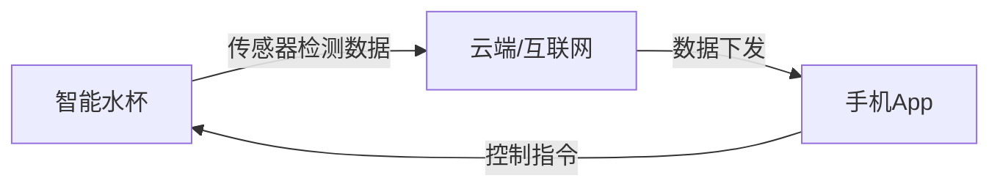

#### 物联网基础框架

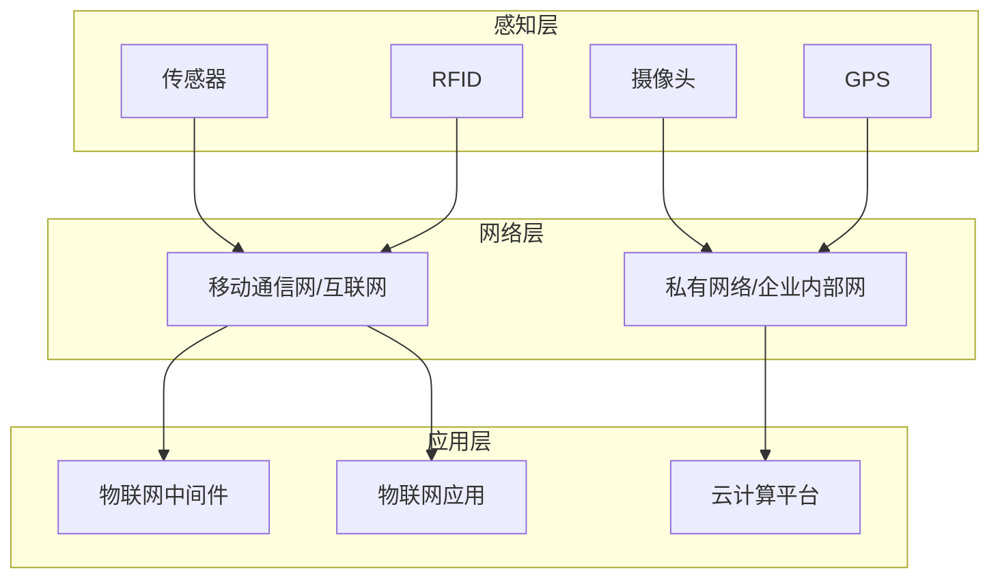

### 经典金句/数据

> “智能硬件是物联网的关键组成要素，与物联网相辅相成，互为支撑。如果没有智能硬件的承载，就没有物与物之间的信息传输，这样物联网就无法延伸和拓展。” (p.28)

> “据IDC预测，到2025年，物联网中的智能硬件设备将超过400亿台。” (p.28)

> “物联网被称为继计算机、互联网之后世界信息产业发展的第三次浪潮。” (p.28)

---

## 第2章：识别机会：发现和分析创新的想法

### 核心论点

本章解决“如何系统地发现、筛选和验证市场机会”的问题。作者认为：市场机会识别不是灵光一现，而是可以通过结构化的5步法来完成的。

### 关键概念

1. **市场机会**：存在于特定经营环境下，企业能够通过商业活动发现、分析、选择、利用并创造利润和价值的市场需求。
2. **市场机会分类（二维法）**：
   - 第一象限（低风险）：已有需求 + 已有解决方案 → 产品改进
   - 第二象限（中风险）：新需求 + 新解决方案 → 差异化定位
   - 第三象限（高风险）：新需求 + 全新方案 → 创新产品
   - 第四象限（高风险）：已有技术但需求不明确 → 技术驱动型（需警惕）
3. **产品创新章程（PIC）**：企业高层编制的策略性文件，包含背景、焦点/战场、短期/中长期目标、守则，回答“谁、什么、何地、何时、为什么”。
4. **RWW市场机会自测清单**：Real（真实吗？）→ Win（能赢吗？）→ Worth（值得做吗？）三阶段评估框架。
5. **Timmons创业机会评审框架**：8个维度53项指标评估市场机会。

### 逻辑推演

作者首先定义市场机会，并用二维坐标系将机会分为四类，提示企业根据自身战略选择合适的机会类型。然后详细展开“识别市场机会的5个步骤”：
1. 确立产品创新章程（战略方向）
2. 发掘大量市场机会（发散思维：分析竞争对手、观察用户问题、分析自身优势、把握趋势、与用户沟通）
3. 初步筛选（4种方法：价值评估矩阵、Pass/Fail评估法、评分法、问卷法）
4. 验证市场机会（验证需求、定价、法规假设，用最小成本排除不确定性）
5. 选出最佳市场机会（RWW + Timmons框架）

每一步都配有具体工具和案例（戴森吸尘器、吉列剃须刀、Dropbox概念视频等）。

### 流程图

#### 市场机会分类的二维坐标系

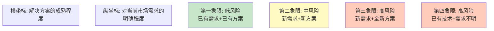

#### 市场机会价值评估矩阵

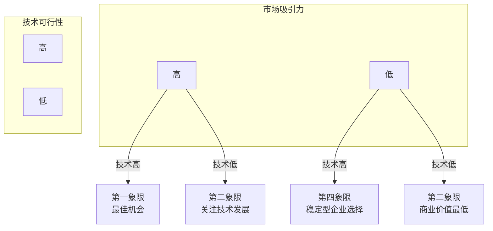

### 经典金句/数据

> “有调查显示，在市场机会识别阶段，每3000个机会中只有14个能进入研发阶段，最终成功实现商业化的只有1个而已。” (p.73)

> “如果我问顾客想要什么，他们可能会说自己想要一匹快马。”——亨利·福特 (p.419)

> “企业应避免技术驱动的思想，即先研发技术，再为技术去寻找市场，而应该从市场出发，深入了解用户的需求，之后再去寻找或研发相关的技术。” (p.65)

---

## 第3章：市场细分：找出消费群体间的差异

### 核心论点

本章解决“为什么需要市场细分以及如何细分”的问题。作者认为：企业资源有限，无法满足所有用户，必须通过市场细分识别出最有利可图的细分市场，集中资源提供匹配的产品和服务。

### 关键概念

1. **市场细分**：按照某种分类标准将总体市场中的用户划分成若干个用户群体的过程。同一细分市场内用户需求相似，不同细分市场间需求存在明显差异。
2. **市场细分的意义**：
   - 有利于更好地选择目标市场
   - 有利于制定差异化的市场营销策略
   - 有利于对市场机会和威胁快速做出反应
   - 有利于企业减少资源浪费，提升经济收益
3. **5种细分方式**：
   - 地理细分：按地理位置、气候、地形
   - 人口统计细分：按性别、年龄、收入、教育、职业、家庭规模等
   - 心理细分：按生活方式、社会阶层、性格、价值观
   - 行为细分：按使用情况、购买模式、忠诚度、利益追求
   - 多维度细分：组合多个标签，形成初步用户画像
4. **市场细分的4个步骤**：
   - 确定市场范围
   - 初步细分市场
   - 深入细分市场
   - 细分市场有效性评估（可测量性、可进入性、可盈利性、稳定性、差异性、可执行性）

### 逻辑推演

作者从市场细分的定义和目的出发，解释为什么要细分（资源限制+用户需求多样化）。然后逐一介绍5种细分方式，每种方式都有具体分类标准和示例（如公路自行车vs山地自行车、可口可乐零度可乐案例等）。作者特别强调多维度细分的价值——通过组合多个标签形成用户画像。最后给出4个步骤和6个有效性评估标准，确保细分出的市场是有意义的。

### 经典金句/数据

> “有效的市场细分始终是市场外部的用户需求异质，内部的用户需求同质。” (p.154)

> “糟糕的市场细分是在浪费企业的时间、金钱和人力。在糟糕的细分市场中开发卓越的产品是可笑的。” (p.155)

---

## 第4章：市场分析：选择最合适的目标市场

### 核心论点

本章解决“如何分析细分市场并选择最适合企业的目标市场”的问题。作者认为：市场分析需要从市场规模、市场趋势、市场增长率、市场竞争、企业内部环境5个维度综合评估。

### 关键概念

1. **市场分析维度**：市场规模、市场趋势、市场竞争、企业目标和资源
2. **市场规模计算**：
   - 公式：市场规模 = 目标用户数量 × 每个用户购买数量 × 销售单价
   - 3种方法：自上而下分析法、自下而上分析法、竞品推算法
   - TAM/SAM/SOM：潜在市场/可服务市场/可获得市场
3. **PESTEL分析模型**：政治、经济、社会、技术、环境、法律
4. **波特五力分析模型**：供方议价能力、买方议价能力、新进入者威胁、替代品威胁、竞争对手竞争强度
5. **SWOT分析模型**：优势、劣势、机会、威胁
6. **利基市场**：被市场领先者忽略的细分市场，需求未被完全满足，市场规模小但聚焦。

### 逻辑推演

作者将市场分析拆解为5个步骤，每个步骤对应一种分析维度：
1. 市场规模分析：计算TAM/SAM/SOM，避免过度乐观
2. 市场趋势分析：使用PESTEL识别宏观环境变化
3. 市场增长率分析：判断产品生命周期阶段
4. 市场竞争分析：使用波特五力模型 + 五步法分析竞争对手（识别→目标→战略→优劣势→反应预测）
5. 企业内部环境分析：VRIO框架评估资源价值，SWOT整合内外部分析

在第5步基础上，企业可以综合评估各细分市场的吸引力，选择目标市场。本章最后介绍了3种目标市场策略（无差别、差异化、集中性）及其选择依据。

### 流程图

#### PESTEL分析模型

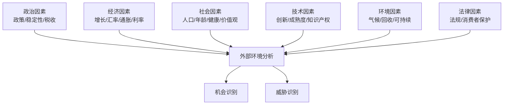

#### 波特五力分析模型

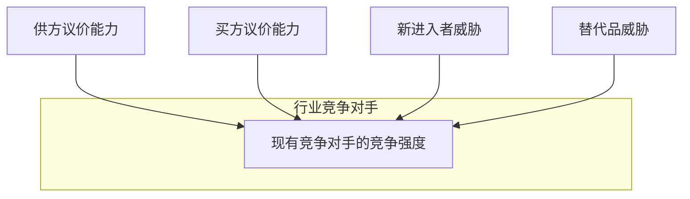

#### SWOT分析示意图

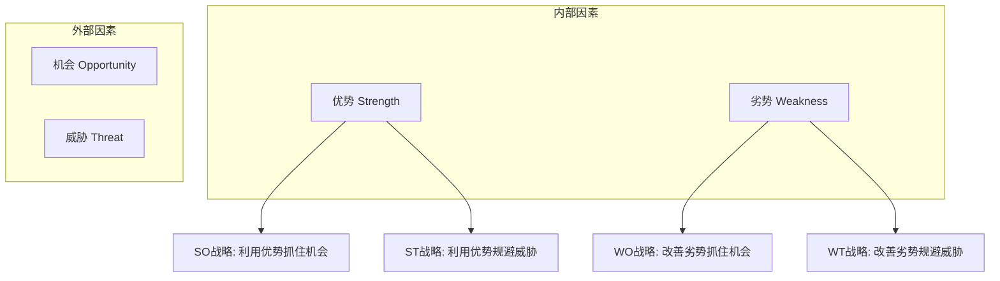

### 经典金句/数据

> “SOM代表产品或服务的短期销售潜力，SAM代表产品或服务的目标市场份额，TAM代表产品或服务的潜在规模。” (p.163-164)

> “如果企业无法在细分市场获得成功，那么要占据更大的市场就无从谈起了。” (p.164)

> “知己知彼，百战不殆”——市场竞争分析的重要性 (p.167)

---

## 第5章：产品定位：占据用户的心智模型

### 核心论点

本章解决“如何在用户心目中为产品塑造独特形象”的问题。作者认为：产品定位不是产品之间的战争，而是用户认知的战争。产品在工厂中生产，但定位在用户心智中塑造。

### 关键概念

1. **市场定位 vs 产品定位**：市场定位是选择目标用户群体；产品定位是将目标市场与企业产品结合，在用户心中占据位置。
2. **产品定位的5个步骤**：
   - 了解竞争对手的产品定位（感知地图、雷达图）
   - 找出能带来优势的差异点
   - 确定产品的定位策略
   - 撰写产品的定位声明
   - 传播与分享定位声明
3. **8种定位策略**：比附定位、场景定位、档次定位、情感定位、用户定位、USP定位、比较定位、品类定位。
4. **产品定位的4项原则**：
   - 不求更好，但求不同
   - 争做用户心目中的第一
   - 创造新品类并成为第一
   - 成为一个代名词

### 逻辑推演

作者首先区分市场定位与产品定位的关系（市场定位是前置条件）。然后通过感知地图和雷达图两种工具，指导读者分析竞争对手的定位。接着说明如何找出差异点并筛选出具备价值的差异点（5个筛选问题）。之后介绍8种定位策略，每种都有典型案例（七喜“非可乐”、红牛功能性饮料、小米“为发烧而生”等）。最后提出定位声明模板（杰弗里·摩尔模板）和4项原则，强调“不求更好，但求不同”的核心思想。

### 流程图

#### 产品定位的5个步骤

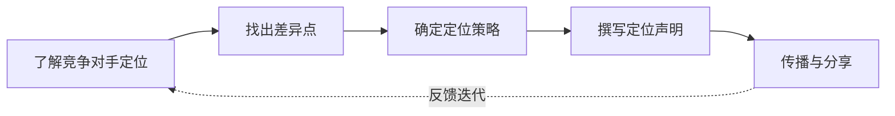

#### 感知地图示例

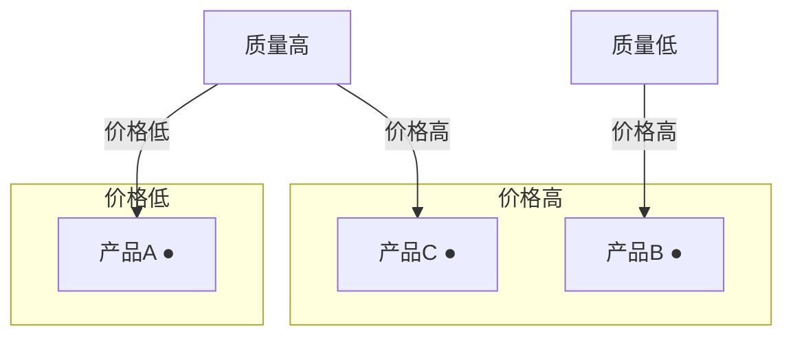

#### 雷达图对比示例

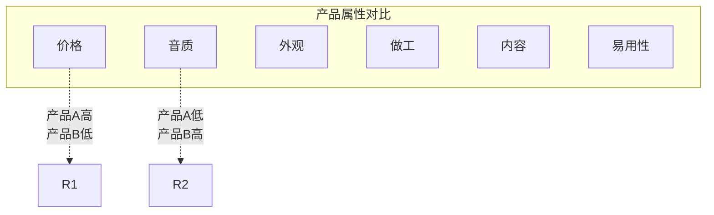

### 经典金句/数据

> “产品虽然是在工厂中生产，但是产品定位却是在用户的心智模型中塑造的。” (p.255)

> “不求更好，但求不同”——产品定位第一条原则 (p.295)

> “用户真正想知道的是：企业的产品和其他同类产品相比有什么区别？什么是只有这款产品可以做到，而别的产品做不到的？” (p.295)

> “市场定位是一场关于用户认知的战争，而非产品之间的战争。” (p.296)

---

## 第6章：用户研究：洞察用户的需求和动机

### 核心论点

本章解决“如何通过系统化方法深入了解用户需求和动机”的问题。作者认为：用户研究不是一次性的工作，而是贯穿产品整个生命周期的持续过程。产品研发团队必须走出办公室，走到用户中间去观察和倾听。

### 关键概念

1. **客户之声（VoC）**：用户对产品或服务的看法、态度和期望的描述，能够帮助企业了解用户想通过产品达成什么目标。
2. **市场调研 vs 用户研究**：市场调研范围更广（包括市场规模、竞争态势等）；用户研究聚焦用户的需求、行为、经验和动机。
3. **一级市场调研 vs 次级市场调研**：
   - 次级：整理二手数据，快速了解宏观信息
   - 一级：收集原始数据，深入洞察，竞争对手无法获取
4. **定性调研 vs 定量调研**：
   - 定性：了解“为什么”（用户访谈、焦点小组、观察法）
   - 定量：了解“有多少”（问卷调查、数据分析）
5. **5种常见用户研究方法**：
   - 用户反馈研究：通过售后、社交媒体、调研活动收集
   - 观察法：自然/实验/掩饰/参与观察
   - 用户访谈：结构化/非结构化/半结构化
   - 问卷调查：纸质/电子，代填/自填
   - 焦点小组：6-10人，主持人引导讨论

### 逻辑推演

作者从“客户之声”概念切入，说明收集用户反馈的系统化方法。然后区分市场调研和用户研究的关系，强调用户研究在产品全生命周期的价值（概念生成、方案比对、原型测试、发布后评估）。接着介绍用户研究的一般流程（4步：确定目标→制定计划→执行→输出报告）。之后按观察研究、调查研究、实验研究三大类介绍20+种方法。最后详细展开5种最常用的方法（用户反馈、观察法、访谈、问卷、焦点小组），每种方法都包含概述、类型、流程、注意事项、优缺点。

### 流程图

#### 用户研究的一般流程

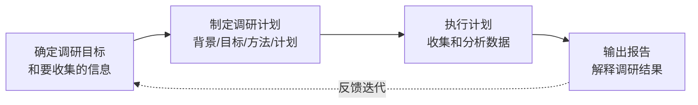

#### 定性调研与定量调研的关系

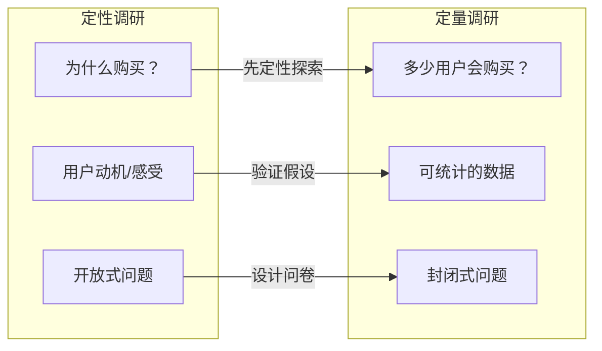

### 经典金句/数据

> “你不是最终用户，不要为自己设计产品。” (p.315)

> “缺乏对用户需求的了解，拿自己当用户，是绝大多数产品失败的主要原因。” (p.315)

> “做一些用户研究总比完全不做要好，在每个产品研发阶段通过用户研究创造的价值远大于所投入的成本。” (p.315)

> 用户访谈时的注意事项：建立融洽氛围、问题清晰易懂、避免引导性问题、每次只问一个问题。(p.346-347)

---

## 第7章：用户画像：创建典型用户的虚拟形象

### 核心论点

本章解决“如何将用户研究数据转化为可指导设计的用户画像”的问题。作者认为：产品无法满足所有人的需求，最佳方案是使一部分人感到非常满意，而不是让全部用户都感到一般满意。

### 关键概念

1. **用户描述（User Profile） vs 用户画像（Persona）**：
   - 用户描述：客观描述真实用户的自然属性和社会属性（标签化）
   - 用户画像：基于用户描述虚构出来的具有代表性的用户，探索需求、动机、决策方式
2. **用户画像的价值**：
   - 加深对用户需求的理解
   - 以用户为中心进行设计
   - 避免争论，帮助决策
   - 预测目标用户的行为
   - 更好地排列产品需求优先级
   - 提升效率，节省时间
3. **创建用户画像的5个步骤**：
   - 收集用户数据（调研问卷、访谈、日志）
   - 整合用户画像（合并相似特征的用户）
   - 完善用户画像（名称、照片、座右铭、人口统计、个性特征、动机、使用习惯、目标与挫折、当前解决方案、了解产品的途径、关注点）
   - 选择主要用户画像（优先级排序）
   - 分享用户画像

### 逻辑推演

作者首先区分User Profile和Persona两个概念，澄清用户描述是标签化的客观记录，而用户画像是虚构但有代表性的角色。然后列举用户画像的6大价值，强调“使一部分人非常满意”的设计理念。之后详细展开5个创建步骤，每一步都有具体操作指南（如何收集数据、如何合并、画像应包含哪些内容、如何选择主要画像、如何分享）。最后提醒：用户画像是动态的，应随着对用户了解的深入不断调整。

### 经典金句/数据

> “产品无法满足所有人的需求，所以最佳方案是使一部分人感到非常满意，而不是让全部用户都感到一般满意。” (p.393)

> “用户画像的应用不限于用户调研阶段，而是贯穿整个产品研发过程。它应当成为企业制定所有决策的出发点。” (p.396)

---

## 第8章：需求解析：定义产品的功能和规格

### 核心论点

本章解决“如何将用户反馈和用户需求转化为可执行的产品需求和产品规格”的问题。作者认为：用户反馈不等于用户需求，用户需求也不等于产品需求。产品经理必须经过需求解析，不能直接将用户建议当作产品功能。

### 关键概念

1. **需求的3种概念**：
   - 用户反馈：用户的原始信息/建议
   - 用户需求：用户想要达成的目标
   - 产品需求：产品需要实现的功能或特性
2. **功能性需求 vs 非功能性需求**：
   - 功能性需求：产品应该做什么（功能和服务）
   - 非功能性需求：产品是什么样子（性能、可用性、可靠性、尺寸、重量、颜色、材质、安规认证等）
3. **解析需求的3个步骤**：
   - 将用户反馈解析为用户需求
   - 过滤掉毫无价值的用户需求（是否符合定位、是否目标用户、是否普遍需求、是否技术可行）
   - 将用户需求解析为产品需求
4. **产品功能定义的3个步骤**：
   - 列出能够满足用户需求的功能清单
   - 列出竞品的功能清单
   - 设定产品的目标功能清单（理想范围 + 可接受范围）
5. **产品规格定义的3个步骤**：
   - 列出产品的度量指标清单
   - 列出竞品的度量指标清单
   - 为每个度量指标设置理想值和可接受值
6. **高质量产品需求的8个特征**：可行性、准确性、一致性、优先级、可验证性、可修改性、可追溯性、完整性。
7. **状态转换图**：用UML图展示系统状态之间的转换，包含状态、事件、转换关系。

### 逻辑推演

作者通过川崎水上摩托的失败案例说明“不解析用户反馈”的后果：用户说要加填充材料（用户反馈），真实需求是提升舒适感（用户需求），竞争对手的解决方案是加座位（产品需求）。然后系统讲解解析需求的3个步骤。接着分别阐述产品功能定义和产品规格定义的方法，强调在产品概念未确定前不应涉及设计实现细节。最后介绍高质量需求的8个特征和状态转换图的绘制方法（以智能洗衣机为例）。

### 流程图

#### 解析需求的3个步骤

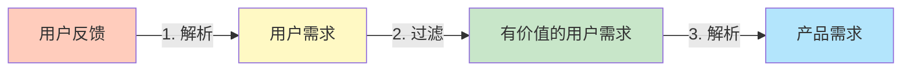

#### 状态转换图示例（洗衣机）

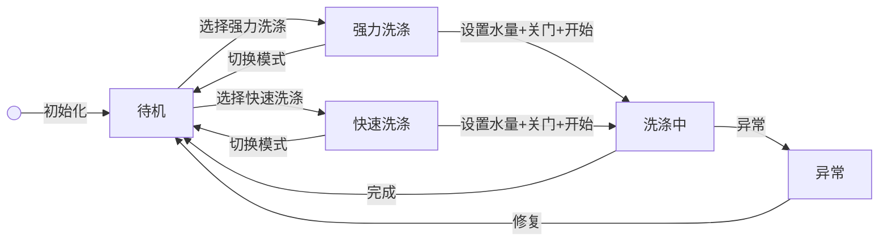

### 经典金句/数据

> “如果我问顾客想要什么，他们可能会说自己想要一匹快马。”——亨利·福特 (p.419)

> “顾客根本不知道自己想要什么。”——史蒂夫·乔布斯 (p.419)

> 川崎水上摩托案例：用户反馈是“在水上摩托的两侧增加填充材料”，用户需求是“提升驾驶水上摩托的舒适感”，川崎得出的产品需求是增加填充材料，而竞争对手得出的产品需求是增加座位。结果竞争对手胜出。(p.419)

---

## 第9章：优先级：排列产品需求的实现顺序

### 核心论点

本章解决“在有限资源下如何决定哪些需求优先实现”的问题。作者认为：并非所有需求都同等重要，有效的优先级排序能够使产品研发团队在资源约束下尽快交付最重要的价值。

### 关键概念

1. **优先级排序的意义**：提高用户满意度、降低浪费风险、更好地管理项目进度和研发资源投入。
2. **影响优先级的14个关键因素**：价值、成本、投资回报、风险、实现难度、紧急程度、需求之间的依赖关系、与产品战略的匹配度、资源可用性、损失、法律法规、确定性、使用频率、来源。
3. **4种优先级排序方法**：
   - 马斯洛需求层次理论（生理→安全→情感→尊重→自我实现）
   - 设计需求层次理论（功能性→可靠性→可用性→熟练性→创造性）
   - KANO模型（基本型→期望型→兴奋型→无差异型→反向型）
   - MoSCoW方法（Must have → Should have → Could have → Won‘t have）

### 逻辑推演

作者从精益创业的MVP理念切入，说明优先级排序是快速迭代的前提。然后提醒读者：优先级排序应从产品定位和产品原则出发，避免主观臆断。接着列出14个影响优先级的因素（帮助读者全面思考）。之后详细介绍4种排序方法：马斯洛理论帮助理解人类需求层次；设计需求层次将马斯洛映射到产品设计领域；KANO模型通过Better-Worse系数计算和可视化排序；MoSCoW方法用4个分类快速划分需求优先级。

### 流程图

#### KANO模型示意图

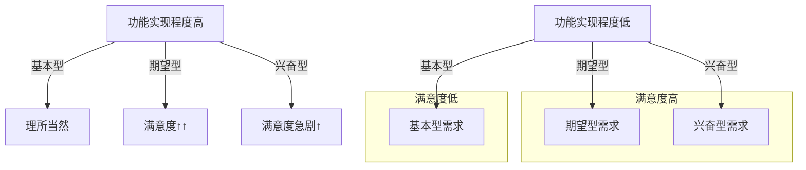

#### Better-Worse系数象限图

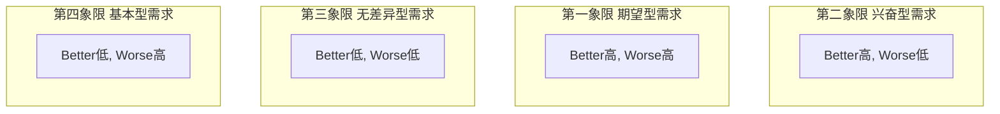

#### MoSCoW方法分类

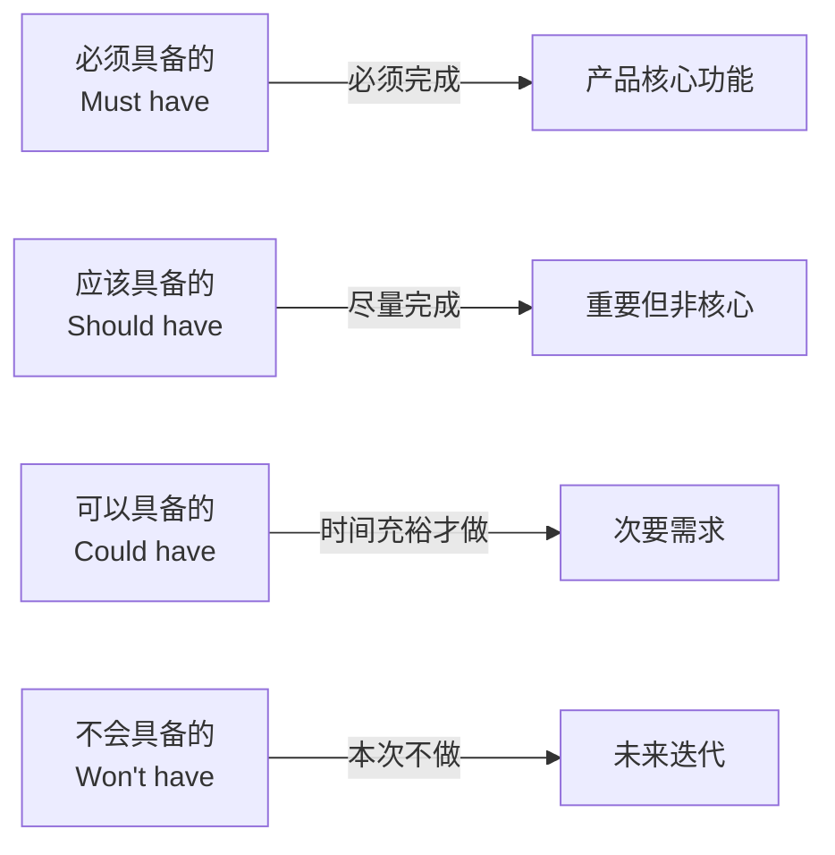

### 经典金句/数据

> “如果产品需求全部是高优先级的，或者完成优先级排列后，几乎所有产品需求的优先级都相同，那么就相当于没有排优先级。” (p.486)

> “优先级最高的产品需求能提供最大比例的产品价值，并投入最小比例的实现成本。” (p.486-487)

---

## 第10章：概念生成：构思满足产品需求的方案

### 核心论点

本章解决“如何系统化地生成满足产品需求的各种解决方案”的问题。作者认为：概念生成必须结构化，避免仅凭灵感或个人经验就确定产品概念。

### 关键概念

1. **产品概念定义**：对产品形态、功能、技术工作原理、如何满足用户需求的大致描述。
2. **概念生成中常见的问题**：
   - 只考虑了较少的产品概念就进入开发
   - 思考不够全面，仅凭借有限经验
3. **结构化的概念生成4步骤**：
   - 澄清问题（通过功能建模/关键路径/集中精力于关键子问题）
   - 外部搜索（领先用户研究、专家咨询、专利检索、文献检索、标杆管理）
   - 内部搜索（头脑风暴、SCAMPER方法、思维导图法、6-3-5方法）
   - 系统搜索（概念分类树、概念组合表）
4. **黑箱模型**：将产品整体功能视为黑箱子，只关注输入和输出，避免过早陷入实现细节。
5. **标杆管理3步**：立标（确定标杆）→ 对标（设定基准）→ 达标和创标（超越标杆）。

### 逻辑推演

作者先定义产品概念及其重要性（质量决定产品成败）。然后指出概念生成中的两个常见问题。接着提出结构化的4步法：第一步澄清问题——通过功能建模（黑箱模型+功能分解）和关键路径分析，将复杂问题分解为子问题；第二步外部搜索——从企业外部收集现有解决方案（领先用户、专家、专利、文献、标杆）；第三步内部搜索——通过头脑风暴、SCAMPER、思维导图、6-3-5等方法激发团队创意；第四步系统搜索——使用概念分类树和概念组合表整理和组合解决方案，收敛到少数几个产品概念。

### 流程图

#### 黑箱模型

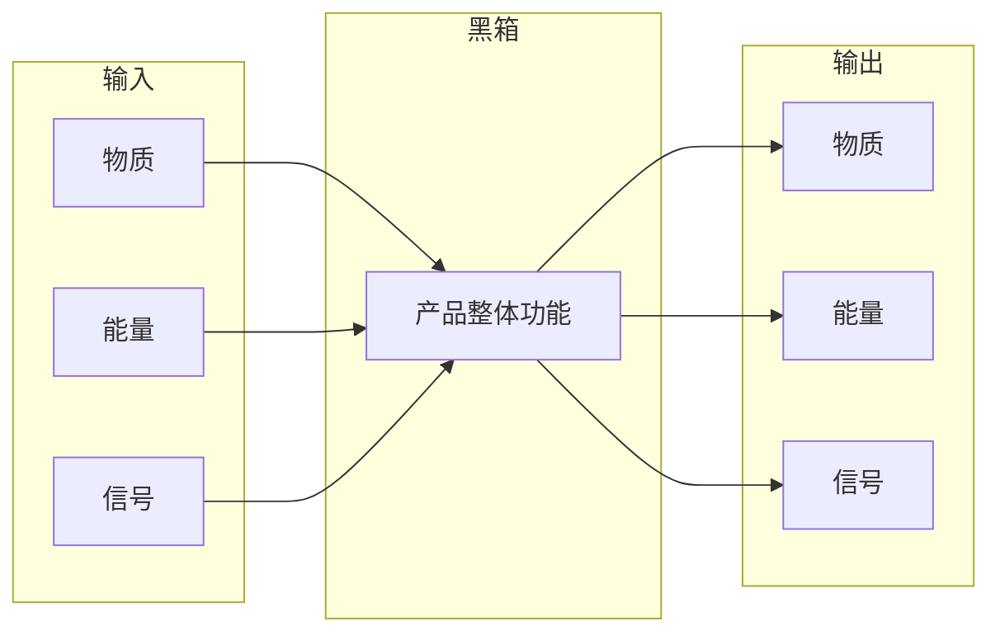

#### 结构化的概念生成流程

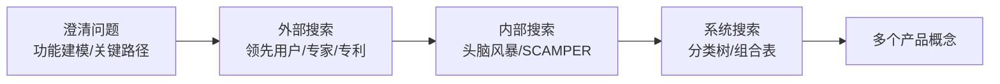

### 经典金句/数据

> “很多成功的产品概念并非源自最初的想法，而是从几十个想法中筛选并迭代出来的。” (p.537)

> “戴森真空吸尘器：詹姆斯·戴森用了5年时间，制作了5127个模型，之后发明了双气旋真空吸尘器。” (p.72)

> “在构思产品概念时，产品研发团队不能仅凭借个人经验，更不能傲慢地认为，凭借一个小团队的经验和智慧就能够发现绝佳的创意，其实还有很多外部资源值得去利用。” (p.537)

---

## 第11章：概念选择：评估并选出最佳的概念

### 核心论点

本章解决“如何从多个产品概念中客观地选出最佳概念”的问题。作者认为：概念选择必须结构化和量化，避免仅凭直觉或个人喜好决策。

### 关键概念

1. **概念选择的定义**：对比分析已生成的产品概念的优劣，选出一个或多个优质概念进行细化、研究和测试。
2. **常见的概念选择方法**：直觉决策、外部决策、领导决策、投票决策、原型测试、矩阵决策。
3. **概念选择中的注意事项**：
   - 对解决方案的有效性要做出正确评估
   - 对解决方案的各个分支进行全面考虑
4. **概念筛选法（定性）**：
   - 建立评估基准（5-10个维度）
   - 建立决策矩阵
   - 使用“+”“-”“s”评估
   - 概念排序（+的数量 - -的数量）
   - 整合优化概念
   - 选择产品概念
5. **概念评分法（定量）**：
   - 为评估基准分配权重
   - 使用1-5或1-10评分
   - 计算加权总分
   - 敏感性分析

### 逻辑推演

作者先定义概念选择的意义（收敛思维）。然后介绍常见方法和注意事项。之后详细展开两种结构化方法：概念筛选法（定性对比）和概念评分法（定量加权）。两种方法都基于决策矩阵，前者快速粗略，后者细致耗时。作者建议将两者结合：先用筛选法排除不可行的概念，再用评分法对剩余概念进行精细评估。最后强调敏感性分析的重要性——不仅要看总分，还要评估不确定性。

### 流程图

#### 概念选择流程（筛选法+评分法组合）

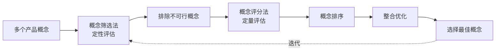

#### 概念筛选决策矩阵示例

```mermaid
graph TD
    subgraph 评估基准
        B1[技术可行性]
        B2[成本]
        B3[开发周期]
        B4[满足需求程度]
    end
    
    B1 -->|+| C1[概念A优于基准]
    B1 -->|-| C2[概念B劣于基准]
    B2 -->|s| C3[概念C与基准持平]
```

### 经典金句/数据

> “概念选择是具有一定风险的。产品研发团队在概念选择阶段选择了错误的产品概念，将浪费大量的时间和财力。” (p.611)

> “在选择产品概念时，产品研发团队不仅要看产品概念的综合排名和加权总分，还要对产品概念进行敏感性分析。” (p.643)

---

## 第12章：概念测试：获取用户对概念的反应

### 核心论点

本章解决“如何在投入研发前验证产品概念的市场吸引力”的问题。作者认为：未经过概念测试就对产品概念投入研发是一种高风险行为，智能硬件产品必须在研发前尽早进行概念测试。

### 关键概念

1. **产品概念测试定义**：将产品概念展示给目标用户，获取他们对概念的反应，选出最具成功潜力的概念或进行改进。
2. **概念测试的意义**：
   - 越早测试，改错成本越低
   - 降低产品的市场风险
   - 智能硬件无法像互联网产品那样快速迭代
3. **概念测试的6个步骤**：
   - 明确概念测试的目的
   - 确定产品的种子用户
   - 明确产品的价值
   - 确定概念的测试方案（展示形式+测试方式）
   - 开展产品概念测试
   - 整理并分析测试结果
4. **产品概念展示形式**：文字描述、图片、故事板、视频、数字原型、交互式多媒体、实物模型、工程样机。
5. **产品价值传达技巧**：
   - 聚焦用户利益诉求，而非技术参数
   - 量化产品价值
   - 对比现有解决方案

### 逻辑推演

作者首先强调概念测试对智能硬件的必要性（研发周期长、生产成本高，无法像软件那样发布后迭代）。然后详细展开6个步骤：明确目的（验证假设）→ 确定种子用户（客户开发概念）→ 明确产品价值（聚焦利益诉求）→ 确定测试方案（选择展示形式和测试方式）→ 开展测试（注意价格测试的重要性）→ 分析结果（选出最佳概念、修正、确定最终规格）。最后提供一个完整的智能电动车概念测试问卷案例。

### 流程图

#### 概念测试流程

```mermaid
graph LR
    A[明确测试目的] --> B[确定种子用户]
    B --> C[明确产品价值]
    C --> D[确定测试方案]
    D --> E[开展测试]
    E --> F[分析结果]
    F --> G[选出/修正概念]
```

### 经典金句/数据

> “未经过产品概念测试就对产品概念投入研发，然后直接对外发布，是一种高风险行为。在将产品概念投入研发阶段前以及在将产品投入市场前进行概念测试是非常有必要的，而且越早越好。” (p.662)

> “即使只进行一点概念测试也比完全不做概念测试要好。” (p.662)

> “在展示产品价值时，产品研发团队应聚焦于目标用户的利益诉求，而不是罗列产品使用了哪些高端技术或采用了何种巧妙的设计。” (p.666)

---

## 第13章：工业设计：构建产品的形式与功能

### 核心论点

本章解决“如何通过工业设计将产品概念转化为具有吸引力、可生产的实体产品”的问题。作者认为：工业设计不是艺术，而是一种商业活动，其核心是解决问题，创造差异化，提升企业竞争力。

### 关键概念

1. **设计的定义**：有目标和计划地开展创作行为及创意活动，首要目的是解决问题，而非表达情感。
2. **工业设计分类**：广义（一切使用现代化手段进行生产和服务的设计）vs 狭义（产品设计）。
3. **工业设计的价值**：
   - 帮助企业打造品牌形象
   - 提升企业市场竞争力
   - 为企业创造无形财富
   - 帮助企业应对市场变化
4. **工业设计流程（6步）**：
   - 明确设计问题
   - 产品设计分析（5W2H）
   - 构思产品概念（草图）
   - 深化产品概念（外观+结构细节）
   - 设计方案评审（ID评审+结构评审）
   - 生产前准备
5. **常用材料与工艺**：
   - 塑料：注塑、压塑、挤塑、吹塑、吸塑等
   - 金属：铸造成型、塑性成型、切削加工、焊接
6. **三大设计原则体系**：
   - 好设计的10项原则（迪特·拉姆斯）
   - 德雷福斯的5项工业设计原则
   - 界面设计的8项黄金原则（本·施奈德曼）

### 逻辑推演

作者先区分设计与艺术，强调设计的目标导向和问题解决属性。然后介绍工业设计的概念和价值（企业层面+宏观层面）。之后详细展开6步工业设计流程，说明工业设计师与机械工程师如何协作。接着介绍常用材料（塑料、金属）及其成型工艺。最后总结三大设计原则体系，为设计评审提供参考标准。

### 流程图

#### 工业设计流程

```mermaid
graph LR
    A[明确设计问题] --> B[产品设计分析<br/>5W2H]
    B --> C[构思产品概念<br/>草图]
    C --> D[深化产品概念<br/>外观+结构]
    D --> E[设计方案评审<br/>ID+结构评审]
    E --> F[生产前准备]
    F -.->|迭代| C
```

### 经典金句/数据

> “设计不是艺术。艺术虽然也是一种创造，但其主要目的是表达情感或思想。虽然设计也可以表达情感或思想，但设计的首要目的往往是解决问题。” (p.702)

> “据美国工业设计协会测算，在工业设计上每投入1美元，可以带来1500美元的收益。” (p.705)

> 好设计的10项原则（迪特·拉姆斯）：好的设计是创新的、实用的、美的、易于理解的、不引人注目的、诚实的、持久的、细致的、环保的、尽可能少的设计。(p.738)

---

## 第14章：产品原型：验证设计方案与产品概念

### 核心论点

本章解决“如何通过原型快速、低成本地验证产品概念和设计方案”的问题。作者认为：成功的产品不是通过突发奇想的创意一蹴而就的，而是通过对产品概念和设计方案不断进行验证和迭代创造出来的。

### 关键概念

1. **产品原型定义**：以物理或数字形式表达产品概念或设计方案，是最终产品的模拟或演示版本。
2. **产品原型的价值**：
   - 验证想法，了解事实
   - 完善产品，优化设计
   - 演示产品，高效沟通
   - 启发思路，获得灵感
3. **软件原型分类**：
   - 低保真原型：纸质原型、线框图（成本低、快速）
   - 高保真原型：具备最终产品的视觉效果和交互（可用于可用性测试）
4. **硬件原型分类**：
   - 数字原型（3D模型）
   - 概念验证原型（纸板、泡沫）
   - 电子硬件原型（PCB、开发板）
   - 外观原型（手板）
   - Alpha原型（首个最接近最终产品的原型）
   - Beta原型（功能完整，可用于可用性测试）
   - 试生产原型（大批量生产前最后验证）
5. **构建原型的3个步骤**：明确目的 → 选择合适种类 → 选择工具并设计

### 逻辑推演

作者用“学习杂耍用豆子口袋代替石头”的类比说明原型的价值——低成本试错。然后定义原型并列举四大价值。接着分别深入讲解软件原型（低保真→高保真，纸质原型→线框图）和硬件原型（从数字原型到试生产原型的完整演进路径）。之后给出构建原型的通用3步法。最后专门介绍制作软件原型、硬件原型、电子硬件原型的详细流程。

### 流程图

#### 硬件原型演进路径

```mermaid
graph LR
    A[数字原型] --> B[概念验证原型]
    B --> C[电子硬件原型]
    C --> D[外观原型]
    D --> E[Alpha原型]
    E --> F[Beta原型]
    F --> G[试生产原型]
    G --> H[大批量生产]
```

#### 软件原型保真度演进

```mermaid
graph LR
    A[手绘草图] --> B[纸质原型]
    B --> C[可点击线框图]
    C --> D[高保真原型]
    D --> E[最终产品]
```

### 经典金句/数据

> “戴森吸尘器的诞生：詹姆斯·戴森用了5年时间，构建了5127个硬件原型，成功地做出了无尘袋吸尘器。” (p.786)

> “能通过简单的原型进行验证就没必要制作复杂的原型。” (p.814)

> “尽早地准备申请专利。” (p.814)

---

## 第15章：可用性测试：让产品易于理解和使用

### 核心论点

本章解决“如何发现和修复产品的可用性问题，使产品易于理解和使用”的问题。作者认为：可用性测试不是在产品设计完成后才开始的工作，而应在整个产品研发周期内反复进行。

### 关键概念

1. **可用性定义（雅各布·尼尔森）**：可学习性、效率、可记忆性、错误、满意度。
2. **可用性测试的分类**：
   - 探索性可用性测试（新产品，确定应包含什么）
   - 评估性可用性测试（发布前/后，确保体验）
   - 比较性可用性测试（对比两种或更多设计）
3. **分析法 vs 实验法**：
   - 分析法：专家基于经验评估（启发式评估、认知走查）
   - 实验法：真实用户参与测试（面对面测试、远程测试、A/B测试）
4. **启发式评估10项原则**：系统状态可见性、系统与现实世界匹配、用户控制和自由、一致性和标准化、预防错误、识别而不是回忆、灵活性和效率、审美和极简主义设计、帮助用户识别/诊断/修复错误、帮助文档。
5. **用户测试的8个步骤**：设计关键任务 → 招募测试用户 → 进行测试准备 → 进行试点测试 → 观察和访谈 → 分析测试数据 → 重新进行设计 → 输出可用性报告。

### 逻辑推演

作者先定义可用性和可用性测试，强调其在产品研发中的价值（了解真实用户行为、发现修改方案）。然后区分分析法和实验法，说明两者互补关系。之后重点介绍启发式评估（10项原则 + 6个步骤）和用户测试（3种方法：发声思考、回顾法、性能测试 + 8个步骤）。在用户测试部分，详细讲解了任务设计原则（选择核心功能、创建场景、明确起点终点、避免提供线索）、招募5人法则（尼尔森）、测试准备、观察技巧、数据分析（问题影响度分析表）等实操内容。

### 流程图

#### 可用性测试流程（用户测试8步）

```mermaid
graph LR
    A[设计关键任务] --> B[招募测试用户]
    B --> C[测试准备]
    C --> D[试点测试]
    D --> E[观察和访谈]
    E --> F[分析数据]
    F --> G[重新设计]
    G --> H[输出报告]
    H -.->|迭代| A
```

#### 测试用户数量与发现问题的关系

```mermaid
graph LR
    subgraph 用户数量与发现问题率
        U1[1人: ~35%]
        U3[3人: ~65%]
        U5[5人: ~85%]
        U10[10人: ~95%]
    end
```

### 经典金句/数据

> “如果你等到产品发布之前才想到可用性测试，就没有时间去修复任何问题。更糟糕的是，你可能会以错误的方式浪费大量精力开发可用性很差的产品。” (p.868)

> “雅各布·尼尔森法则：有5人参加的用户测试即可发现大多数（85%）的产品可用性问题。” (p.841-842)

> “不要干扰用户执行任务。用户测试的主角是用户，测试人员应安静地观察用户的操作并记录。” (p.843)

---

## 第16章：法律安规：产品的专利与安规认证

### 核心论点

本章解决“如何通过专利和认证保护产品知识产权并满足市场准入要求”的问题。作者认为：智能硬件产品面临一系列法律、安规、进出口问题，必须在研发前期就进行谨慎考虑。

### 关键概念

1. **知识产权特征**：时间性、地域性、排他性。
2. **知识产权类别**：
   - 著作权（版权）
   - 工业产权（专利权、商标权）
   - 商业秘密
3. **专利类型**：
   - 发明专利（20年）：产品发明、方法发明
   - 实用新型专利（10年）：产品的形状、构造
   - 外观设计专利（10年）：形状、图案、色彩
4. **专利的4个使用技巧**：善用专利检索、尽早申请专利、提前公布专利、利用专利维权。
5. **产品认证**：
   - 3C认证（中国强制性产品认证）
   - CE认证（欧盟）
   - RoHS认证（有害物质限制）
   - WEEE认证（报废电子电气设备）
   - UL认证（美国安全认证）
   - FCC认证（美国电磁兼容）
   - FDA认证（美国食品和药物管理局）

### 逻辑推演

作者先介绍知识产权的概念、特征和类别。然后深入讲解产品专利（专利权人权利、专利优劣势、中国三种专利类型及其审批流程）。之后给出4个专利使用技巧。接着介绍产品认证的概念、分类（体系认证/产品认证、强制性/非强制性）和价值。最后列举7种常见认证及其适用范围，并给出申请认证的时机建议（Alpha原型时评估、基本定型后送测）。

### 流程图

#### 发明专利申请审批流程

```mermaid
graph LR
    A[受理] --> B[初审]
    B --> C[公布]
    C --> D[实质审查]
    D --> E[授权]
    
    B1[缴纳申请费] --> B
    D1[提出实质审查请求] --> D
    E1[缴纳相关费用] --> E
```

### 经典金句/数据

> “据不完全统计，有50%的智能硬件产品在首次进行测试时未能通过EMC测试。” (p.925)

> “产品需要申请何种类型的专利，最好由专利工程师或第三方专利代理公司进行专业的判断。” (p.877)

> “专利法遵循的是最先申请原则，即两个以上的申请人分别就同样的发明创造申请专利时，专利权授予最先申请的人。” (p.879)

---

## 第17章：定价决策：制定产品价格与定价策略

### 核心论点

本章解决“如何为产品制定具有市场竞争力的价格策略”的问题。作者认为：产品的成本决定了价格的下限，用户的价值感知决定了价格的上限。定价策略不是一次性的工作，而是一个持续的过程。

### 关键概念

1. **定价策略的思路**：综合考虑内部因素（成本、目标、定位）和外部因素（用户价值感知、市场趋势、竞争价格）。
2. **5种定价策略**：
   - 基于产品成本定价（成本导向）
   - 基于目标用户定价（需求导向）
   - 基于竞争对手定价（竞争导向）
   - 市场撇脂定价（高价法）
   - 市场渗透定价（低价法）
3. **成本定价的方法**：成本加成定价法、边际成本定价法、目标利润定价法、盈亏平衡定价法。
4. **目标用户定价的方法**：认知价值定价法、需求差异定价法、逆向定价法。
5. **竞争对手定价的方法**：产品差别定价法、随行就市定价法、密封投标定价法。

### 逻辑推演

作者从价格对利润的影响切入（麦肯锡数据：价格提高1%，运营利润增加11%）。然后强调定价策略应从市场分析阶段就开始规划，并持续调整。之后分别详细讲解5种定价策略：每种策略都包括概述、方法、适用条件、优势和劣势。重点对比了市场撇脂定价（高价快速回收成本）和市场渗透定价（低价占领市场）的差异。

### 流程图

#### 产品定价策略选择框架

```mermaid
graph TD
    A[产品定价] --> B[基于成本定价]
    A --> C[基于用户定价]
    A --> D[基于竞争定价]
    A --> E[市场撇脂定价]
    A --> F[市场渗透定价]
    
    B --> B1[成本加成/边际/目标利润/盈亏平衡]
    C --> C1[认知价值/需求差异/逆向定价]
    D --> D1[产品差别/随行就市/密封投标]
```

### 经典金句/数据

> “麦肯锡公司研究数据表明，在需求保持不变的假设下，将产品价格提高1%，平均每家公司的运营利润将增加11%。” (p.929)

> “产品的成本决定了产品价格的下限，产品在用户心目中的价值决定了产品价格的上限。” (p.927)

> 市场撇脂定价案例：TESLA Model 3从35.58万元降至27.15万元；市场渗透定价案例：小米手机1999元进入市场。(p.950, p.960)

---

## 第18章：上市策划：产品发布前的准备工作

### 核心论点

本章解决“产品发布前需要做好哪些准备工作”的问题。作者认为：产品发布不是一次性的活动，而是一段旅程。成功的产品发布活动通常在研发早期阶段就开始准备了。

### 关键概念

1. **产品发布检查清单**：记录产品发布前需要完成的所有工作，确保无遗漏。内容包括：产品生产、产品培训、产品资料、发布计划。
2. **产品白皮书**：对产品信息进行公开说明的官方文档，是市场营销和销售资料的大纲。
3. **产品FAQ**：常见问题与解答，至少能回答80%的用户问题。
4. **新闻稿**：向媒体宣布新产品的官方声明，需站在媒体和用户角度撰写。
5. **产品视频分类**：产品宣传视频、功能演示视频、售后维护视频。
6. **产品着陆页**：与营销活动关联的专题页面，促成用户转化行为（CTA设计）。
7. **新品发布会策划6步**：明确主题 → 寻找场地 → 准备资料 → 确定参会名单 → 规划预热活动 → 规划流程细节。
8. **产品众筹**：通过众筹平台向大众筹集资金，有助于验证产品概念、接触早期用户。

### 逻辑推演

作者从产品发布检查清单开始，强调清单的价值（避免遗漏、跨部门沟通）。然后逐一介绍关键准备工作：产品白皮书（官方文档基础）→ FAQ（解决用户80%问题）→ 新闻稿（媒体传播）→ 产品视频（宣传/教学/售后）→ 着陆页（转化设计）→ 发布策略（发布会/众筹）→ 售后服务策略（全面/特殊/适当）。每个模块都有详细的撰写/制作步骤和注意事项。

### 流程图

#### 产品发布检查清单框架

```mermaid
graph TD
    subgraph 产品生产
        P1[通过测试/认证]
        P2[生产运输计划]
    end
    
    subgraph 产品培训
        T1[销售团队培训]
        T2[售后团队培训]
        T3[营销团队培训]
    end
    
    subgraph 产品资料
        D1[白皮书/FAQ]
        D2[新闻稿]
        D3[营销材料]
        D4[产品页面]
    end
    
    subgraph 发布计划
        L1[明确目标/日期]
        L2[用户跟踪计划]
        L3[体验流程审查]
        L4[风险评估]
    end
```

#### 新品发布会策划流程

```mermaid
graph LR
    A[明确主题] --> B[寻找场地]
    B --> C[准备资料]
    C --> D[确定参会名单]
    D --> E[规划预热活动]
    E --> F[规划流程细节]
    F --> G[举办发布会]
```

### 经典金句/数据

> “产品发布是在一段时间内开展的一系列活动，而不是一次性的活动。它更像是一段旅程，而不是一个终点。” (p.972)

> “飞机在起飞前，即便是最优秀的飞行员也会对着检查清单逐一进行核对，以确保飞行安全。” (p.973)

> “奈飞戈帕·克里希南：一个产品功能或视频内容如果无法在90秒之内获取用户的注意，用户很可能就会失去兴趣。” (p.1010)

> “真正的销售始于售后。” (p.1024)

---

## 全书总结

《智能硬件产品：从0到1的方法与实践》是一本系统化的智能硬件产品研发指南。全书按产品从概念到上市的自然顺序组织，每一章都提供了可操作的方法论和实用工具。

**核心脉络**：市场机会识别 → 市场细分与分析 → 产品定位 → 用户研究与画像 → 需求解析 → 优先级排序 → 概念生成与选择 → 概念测试 → 工业设计 → 原型制作 → 可用性测试 → 法律安规 → 定价决策 → 上市策划。

**三大核心理念**：
1. **用户为中心**：用户研究贯穿全生命周期，用户画像是所有决策的出发点
2. **结构化的方法论**：每个环节都有系统化的步骤和工具，而非依赖灵感
3. **低成本试错**：概念测试、原型制作、可用性测试都是“用豆子口袋代替石头”的实践

**实用工具汇总**：RWW自测清单、KANO模型、MoSCoW方法、SWOT分析、PESTEL分析、波特五力模型、感知地图、雷达图、状态转换图、概念分类树、概念组合表、启发式评估、用户测试8步法等。