# 《构建Agentic AI系统：打造能推理、可规划、自适应的AI智能体》章节总结

## 书籍信息
- **书名**：构建Agentic AI系统：打造能推理、可规划、自适应的AI智能体（Building Agentic AI Systems: Create intelligent, autonomous AI agents that can reason, plan, and adapt）
- **作者**：安贾纳瓦·比斯瓦斯（Anjanava Biswas）、里克·塔鲁克达尔（Wrick Talukdar）
- **译者**：茹炳晟、殷海英
- **出版社**：清华大学出版社
- **PDF 状态**：非完整扫描，为文本提取版本，部分页面连续，但存在 OCR 识别不完整、页码混乱、图表缺失等问题。
- **OCR 状态**：基本可读，但部分公式、代码片段、图表描述不完整，部分表格内容错位。

## 目录说明
- **目录识别情况**：从文本中可识别出全书共11章，分为三部分。部分章节标题完整，部分副标题或节标题缺失。习题、参考文献等附属内容存在但内容不连续。
- **章节对应依据**：基于正文中的章节标题（如“第1章 生成式AI基础”）以及目录页（页码26-41）的提示。
- **OCR 修复说明**：部分代码示例中的缩进和注释丢失，表格形式被简化，Mermaid 图未提供原始代码。以下总结基于可识别的文本内容，无法还原的部分已标注。

## 全书核心主题
本书系统阐述如何利用大语言模型（LLM）构建具备推理、规划、自适应能力的智能体（Agent）系统。作者从生成式AI的基础模型出发，逐步深入到智能体的知识表示、推理机制、学习能力、反思与自省、工具使用与规划算法，进而介绍多智能体协作的“协调者-工作者-委派者”（CWD）设计模式以及高效的工程化设计技术。全书后半部分聚焦于信任建立、安全管理、伦理考量以及实际应用案例，最后展望了通用人工智能（AGI）的未来趋势与挑战。核心观点是：智能体系统不仅是生成式AI的高级应用，更是一种能够自主决策、持续进化、负责任地与人类协作的新型智能化系统。

---

## 第1部分：生成式AI和智能体系统的基础

### 第1章：生成式AI基础

#### 1. 核心论点
本章主要解决“什么是生成式AI、有哪些主要模型类型、有哪些应用和局限性”的问题。作者认为：生成式AI通过学习已有数据的分布规律，能够生成与训练数据相似的全新内容（文本、图像、音频等），是推动智能体系统自主性和创造力的关键技术基础，但同时面临数据偏见、高计算成本、伦理挑战等问题。

#### 2. 关键概念/事件
- **生成式AI**：能够生成多种形式内容（文本、图像、音频、视频）的AI技术，通过学习输入数据背后的模式、结构和分布，生成相似的新数据。
- **变分自编码器（VAE）**：学习数据与潜在空间的概率映射，既压缩又重构数据，用于生成新样本。包括Beta-VAE和条件变分自编码器（CVAE）。
- **生成对抗网络（GAN）**：由生成器和判别器两个神经网络对抗训练，生成极其逼真的伪造数据。包括DCGAN、WGAN、StyleGAN。
- **自回归模型与Transformer架构**：逐点生成数据，每个点依赖前一个点。Transformer通过自注意力机制、多头注意力、位置编码等组件，彻底改变自然语言处理。代表模型：GPT系列、BERT、T5。
- **基于LLM的AI智能体**：以指令微调LLM为基础，融合工具使用、规划、强化学习等能力的高级应用。示例：航班预订助手聊天机器人。

#### 3. 逻辑推演/叙事脉络
本章首先定义生成式AI并简要回顾其发展历程。然后分类介绍VAE、GAN、自回归模型和Transformer的工作原理及变体。接着展示生成式AI在图像视频生成、文本内容生成、音乐音频、医疗药物发现、代码生成、自主工作流等领域的应用。最后讨论数据质量与偏见、数据隐私、计算资源、伦理社会影响以及泛化能力不足等挑战。通过航班预订助手的对话案例，自然引出LLM驱动的智能体概念。

#### 4. 流程图（如存在）
本章无明确流程图，但包含Transformer架构的关键组件描述，可重构为：


#### 5. 经典金句/数据
> “生成式AI就是通过学习已有数据的规律、结构和分布，生成与这些数据的特征相似的新内容。”
> 训练GPT-3的计算资源成本为400万到500万美元。
> “LLM智能体并不能简单归入某一个单一类别，因为它本质上是LLM技术的高级应用形式。”

---

### 第2章：智能体系统的原理

#### 1. 核心论点
本章解决“什么是智能体系统、智能体有哪些核心特征、有哪些架构模式、多智能体系统如何协作”的问题。作者认为：智能体系统通过自我管理、能动性和自主性，能够感知环境、做出决策并采取行动；慎思型、响应型和混合型架构各有优劣；多智能体系统通过合作、协调和协商机制可解决单一智能体难以应对的复杂问题。

#### 2. 关键概念/事件
- **自我管理**：系统自主管理或控制自身，包括自组织、自调节、自适应、自优化、自决定。
- **能动性**：独立行动和做出选择的能力，包含决策权、意图性、责任。
- **自主性**：系统独立运行的程度，分为操作自主性、功能自主性、层级自主性。
- **智能体特征**：响应性、主动性、社交能力，以及学习和适应能力、推理和规划能力。
- **慎思型架构**：依赖知识表示和推理机制，遵循感知-规划-执行周期。
- **响应型架构**：基于刺激-响应，使用条件-动作规则，强调速度和鲁棒性。
- **混合架构**：结合慎思层（高层推理）和响应层（快速响应）。
- **多智能体系统（MAS）**：多个自主智能体通过合作、协调、协商共同实现目标。

#### 3. 逻辑推演/叙事脉络
首先通过旅行预订助手的算法示例说明能动性和自主性。然后系统定义智能体的特征，对比慎思型、响应型、混合型架构的优缺点。接着引入多智能体系统，阐述其自主性、互动性、适应性、分布式控制等特征，并详细说明合作、协调、协商三种互动机制。最后以旅行预订的多智能体系统算法（航空公司、酒店、旅行社智能体）为例，展示如何通过MAS实现复杂的旅行套餐预订。

#### 4. 流程图（如存在）
慎思型架构感知-规划-执行周期：

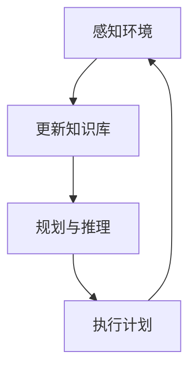

响应型架构：


多智能体系统中的协调机制：

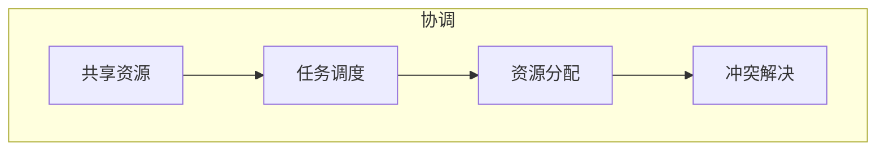

#### 5. 经典金句/数据
> “智能体是一个复杂的、能够自我管理的实体，它感知环境并采取行动以实现某些目标或任务。”
> “慎思型架构在处理需要复杂推理、规划和决策的任务时表现优异，尤其是在定义明确的环境中。”
> “响应型架构设计的目标是快速响应环境变化。”
> “混合架构通过合理利用这两种架构的优势，实现了两者的协调与平衡。”

---

### 第3章：智能体的基本组成部分

#### 1. 核心论点
本章解决“智能体由哪些核心组件构成、如何表示知识、如何推理、如何学习、如何决策与规划”的问题。作者认为：知识表示（语义网络、框架、基于逻辑）、推理（演绎、归纳、溯因）、学习机制（监督、无监督、强化学习）以及效用函数和规划算法是智能体的基本骨架；生成式AI可以增强这些组件，使智能体具备更强的上下文理解和创造力。

#### 2. 关键概念/事件
- **知识表示**：语义网络（图结构节点-边）、框架（属性-值结构，支持继承）、基于逻辑的表示（命题/一阶逻辑）。
- **推理类型**：演绎（自上而下，必然结论）、归纳（自下而上，概率结论）、溯因（最佳解释推理）。
- **学习机制**：监督学习（带标签数据）、无监督学习（发现隐藏模式）、强化学习（试错+奖励）。
- **效用函数**：将状态或结果映射为效用值，量化智能体偏好，指导决策。
- **规划算法**：基于图的规划（图搜索、最优路径）、启发式搜索、蒙特卡洛树搜索（MCTS）、层次化规划（HTN）、约束满足（CSP）。
- **生成式AI增强智能体**：数据增强、上下文理解、自然语言处理、创意问题解决。

#### 3. 逻辑推演/叙事脉络
首先介绍语义网络、框架、逻辑表示三种知识表示方法，并给出示例（如“狗”的关系网络、疾病语义网络）。然后分别说明演绎、归纳、溯因推理的工作方式与适用场景。接着讨论监督、无监督、强化学习在智能体中的应用。之后引出效用函数和规划算法，以旅行方案评估为例展示效用函数编码。最后通过一个简单的旅行预订智能体代码（使用OpenAI API和函数调用）展示如何将生成式AI与基本组件结合。

#### 4. 流程图（如存在）
效用函数决策流程：

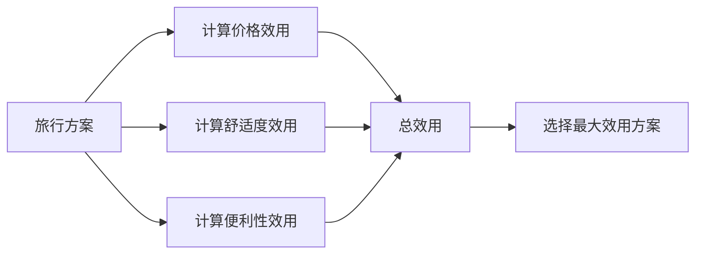

#### 5. 经典金句/数据
> “效用函数通过将结果映射到效用值来量化智能体的偏好，使得智能体能够比较并选择那些能够最大化期望效用的行动。”
> “生成式人工智能正在改变智能体的发展，它通过提高学习效率、增强环境理解能力，以及通过生成式模型实现更复杂的互动。”
> 示例：旅行智能体使用`book_flight`工具，通过函数调用完成航班预订。

---

## 第2部分：设计与实现基于生成式人工智能的智能体

### 第4章：智能体的反思与自省能力

#### 1. 核心论点
本章解决“为什么智能体需要反思与自省能力、如何实现这些能力”的问题。作者认为：反思（审视自身思维过程）和自省（分析自身认知过程）使智能体能够从经验中学习、调整行为、增强决策能力、提升适应性、增加伦理考量并优化人机交互。实现技术包括元推理、自我解释和自我建模。

#### 2. 关键概念/事件
- **反思**：智能体审视自己的思维过程、评估行动、调整策略。例如：改变解题方法、调整沟通方式、请求更多信息。
- **元推理**：监控和控制推理活动，动态调整策略和资源分配。示例：根据用户反馈调整推荐权重。
- **自我解释**：智能体用语言表达其推理过程，增强透明度和促进学习。分为面向用户的透明度解释和面向内部的学习解释。
- **自我建模**：智能体维护对自身目标、信念和知识的内部表征，支持目标管理和知识更新。
- **CrewAI框架示例**：使用`preference_agent`和`meta_agent`，通过`recommend_destination`和`update_weights_on_feedback`工具实现元推理。

#### 3. 逻辑推演/叙事脉络
首先阐述反思对增强决策、提高适应性、伦理考量和优化人机交互的重要性。然后定义自省能力。接着详细讲解三种实现技术：传统推理与元推理的对比（以旅行推荐为例，展示基于反馈调整权重的代码）；自我解释的透明度和学习用途（酒店推荐示例）；自我建模中的目标管理和知识更新。最后通过客户服务聊天机器人、个性化营销智能体、金融交易系统、预测智能体、电子商务定价策略等实际应用场景说明反思能力的价值。

#### 4. 流程图（如存在）
元推理流程（CrewAI示例）：

```mermaid
graph TD
    A[用户偏好权重] --> B[preference_agent 推荐目的地]
    B --> C[用户反馈 (1/-1)]
    C --> D[meta_agent 计算调整因子]
    D --> E[update_weights_on_feedback 更新内部权重]
    E --> F[优化后续推荐]
```

自我解释透明度流程：


#### 5. 经典金句/数据
> “反思型智能体可以自省自身表现，识别改进方向，并相应地调整策略。”
> “自我解释有两个不同的目的：增强透明度和促进学习。”
> 示例：CrewAI中`meta_agent`根据反馈将冒险性权重从0.94调整为0.34。

---

### 第5章：赋予智能体使用工具与进行规划的能力

#### 1. 核心论点
本章解决“智能体如何使用外部工具、有哪些规划算法、如何整合工具与规划”的问题。作者认为：工具调用（函数调用）使智能体能够突破内置知识限制，获取实时数据、执行专业任务；规划算法（特别是基于LLM的规划和HTN）适合语言模型场景；将工具使用与规划整合，智能体可以完成复杂的多步骤任务。

#### 2. 关键概念/事件
- **工具调用与函数调用**：LLM生成结构化响应指示使用哪个工具及参数，由智能体控制器实际执行。工具通过文档字符串或JSON模式定义。
- **工具类型**：API、数据库工具、实用函数、集成工具、硬件接口工具。
- **规划算法实用性分级**：
  - 实用性有限：STRIPS、A*规划、GraphPlan、MCTS（因状态空间巨大、成本高）。
  - 具备一定实用性：FF（需改造）。
  - 实用性最强：基于LLM的规划、HTN。
- **基于LLM的规划**：利用LLM生成高层级计划，自然灵活。示例：CrewAI中旅行规划策略师与研究员协作。
- **HTN规划**：将复杂任务分层分解为子任务，直至原始任务。示例：`buy_groceries_task`分解为`go_to_store`、`select_items`等。
- **框架对比**：CrewAI（基于装饰器工具、层级管理）、AutoGen（轮询群组对话、多智能体协作）、LangGraph（状态机图工作流）。

#### 3. 逻辑推演/叙事脉络
首先通过天气查询对比封闭智能体与工具增强智能体的行为差异。然后详细说明工具调用的机制（结构响应、参数传递）和定义方式。接着分类介绍各类工具，并以旅行预订为例展示CrewAI中`@tool`装饰器的使用。之后分析规划算法的实用性，重点阐述基于LLM的规划和HTN，给出CrewAI中层级化处理（manager_llm）的代码。最后讨论如何对工具进行推理和制订工具使用计划，并对比三个框架的实现模式。

#### 4. 流程图（如存在）
工具调用流程：

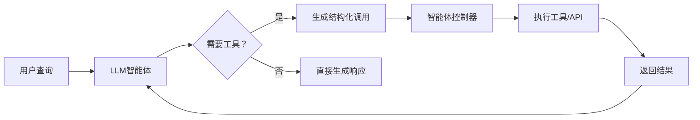

HTN任务分解：

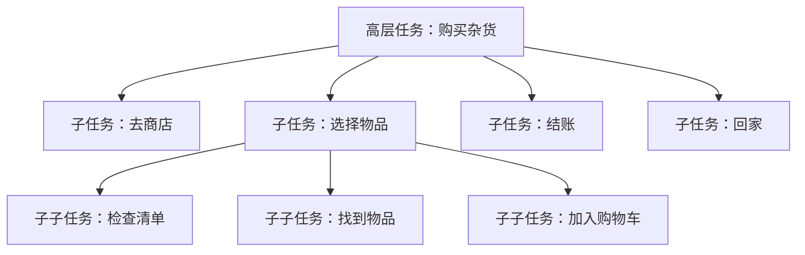

#### 5. 经典金句/数据
> “智能体使用工具的核心在于，LLM智能体能够利用外部资源或工具来增强其固有的功能和决策过程。”
> “当大语言模型调用工具或函数时，它本身并不执行任何代码，而是生成一个结构化的响应。”
> “HTN规划将复杂任务分解为更简单的子任务，从而创建一个行动的层级结构。”
> 示例：CrewAI中`TravelTools`类包含`search_flights`、`check_hotels`等工具。

---

### 第6章：探索“协调者-工作者-委派者”设计模式

#### 1. 核心论点
本章解决“如何组织多智能体系统以实现高效协作、任务分配和资源管理”的问题。作者认为：“协调者-工作者-委派者”（CWD）模型通过职责分离、层级化组织、信息流与反馈回路、适应性与韧性等关键原则，能够有效管理复杂任务，提升系统的可扩展性和鲁棒性。

#### 2. 关键概念/事件
- **协调者**：负责战略监督、任务分解、进度监控、资源管理和整体工作流。
- **工作者**：专业智能体，执行具体任务，如机票预订、酒店预订、活动规划、交通安排、数据分析、反思优化、探索新机会。
- **委派者**：连接协调者和工作者，负责任务分配、负载均衡、性能优化。
- **CWD关键原则**：职责分离、层级化组织、双向信息流、动态资源分配、容错冗余、负载均衡、运行时角色重分配。
- **旅行系统应用**：协调者（旅行规划执行）、工作者（航班/酒店/活动/交通/分析/反思/探索）、委派者（旅行运营编排）。

#### 3. 逻辑推演/叙事脉络
首先介绍CWD模型的三个角色及其职责。然后阐述关键原则，并以旅行规划系统为例，详细说明从客户请求到最终旅行计划的9个步骤。接着展示如何为每个智能体设计角色和背景故事（使用CrewAI的`Agent`定义），包括协调者、核心旅行工作者、分析与情报工作者、委派者。最后说明智能体之间的沟通与协作机制：通信协议、协调机制、协商与冲突解决、知识共享，并给出实施CWD模式的技术要点（系统提示词、指令格式化、交互模式）。

#### 4. 流程图（如存在）
CWD模型高层结构：

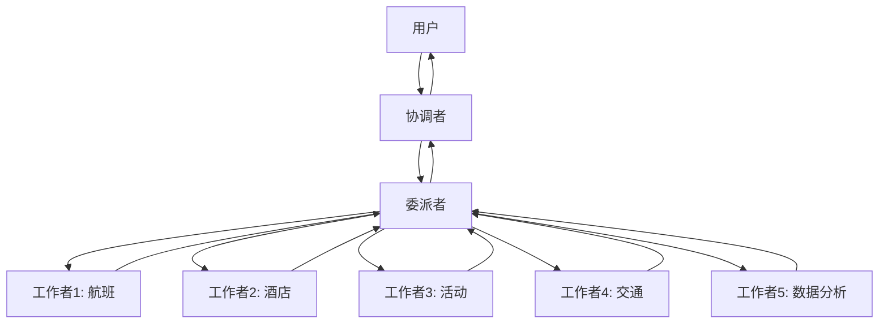

旅行规划CWD工作流步骤：

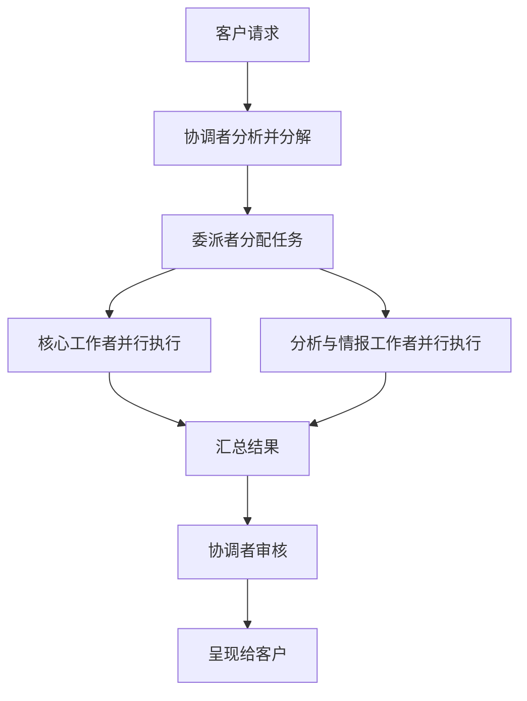

#### 5. 经典金句/数据
> “CWD模型从组织心理学和管理学理论中汲取灵感，将经过验证的人类协作原则应用于智能体领域。”
> “通过使智能体各司其职，每个智能体只负责处理旅行规划流程中的一个特定方面，这种方法确保了所有旅行需求都被全面覆盖。”
> 示例：协调者角色为“Travel Planning Executive”，背景故事为“15年奢华旅行规划经验”。

---

### 第7章：高效的智能体系统设计技术

#### 1. 核心论点
本章解决“如何通过聚焦式指令、状态空间建模、记忆架构和工作流优化来设计高效的智能体系统”的问题。作者认为：清晰的系统提示和任务规范、合理的状态空间与环境建模、分层记忆（短期、长期、情景）以及顺序/并行工作流的动态优化，是构建可靠、可扩展智能体系统的关键技术。

#### 2. 关键概念/事件
- **聚焦式系统提示**：定义目标、任务规范、上下文感知。包括个性化、解决问题、高效沟通、持续改进。
- **状态空间表示**：维护客户档案状态、旅行上下文状态、预订状态等。
- **环境建模**：静态元素（业务规则、系统接口）和动态元素（资源可用性、系统性能）。
- **记忆架构**：
  - 短期记忆（工作记忆）：当前交互上下文，临时存储。
  - 长期记忆（知识库）：持久存储客户档案、旅行知识等。
  - 情景记忆：记录特定交互事件，用于模式识别和学习。
- **上下文管理**：全局上下文、会话上下文、任务上下文，支持上下文切换。
- **工作流优化**：顺序处理（依赖任务）与并行处理（独立任务）的动态选择，包括任务分类、资源管理、负载均衡。

#### 3. 逻辑推演/叙事脉络
首先讨论聚焦式系统提示的重要性，通过旅行智能体的目标定义、任务规范（客户互动、航班预订步骤）和上下文感知（目的地情报、动态适应、文化适配性）来说明。然后介绍状态空间表示（客户档案、旅行上下文、预订状态）和环境建模（静态与动态元素），给出集成模式（事件驱动更新、状态验证）的代码示例。接着详细阐述三种记忆架构及其Python类实现（`WorkingMemory`、`CustomerMemory`、`TravelKnowledge`、`EpisodicMemory`）。最后分析顺序处理与并行处理的应用场景，并给出工作流优化的完整策略（依赖分析、优先级分配、资源管理、动态调整）。

#### 4. 流程图（如存在）
上下文感知层级整合：

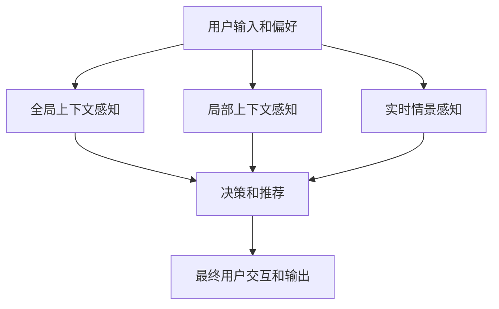

顺序处理 vs 并行处理：

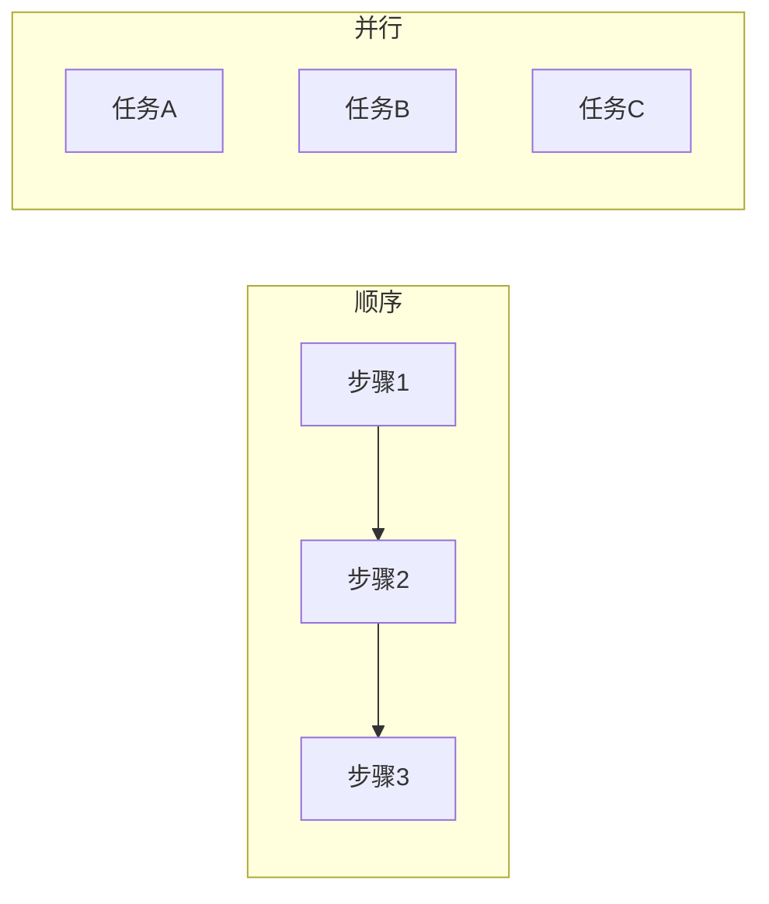

#### 5. 经典金句/数据
> “短期记忆是智能体当前的认知工作空间，用于临时存储和管理与当前交互或任务相关的信息。”
> “长期记忆是智能体的持久知识存储库，用于保存跨多次交互和会话仍具相关性和价值的信息。”
> “情景记忆是一种特殊记忆形式，用于捕获和存储特定交互、事件及其结果作为离散片段。”
> 示例：`TravelAgentState`类中的`update_booking_status`方法处理`FLIGHT_CHANGE`和`WEATHER_ALERT`事件。

---

## 第3部分：信任、安全、伦理和应用

### 第8章：构建生成式AI系统的信任

#### 1. 核心论点
本章解决“如何建立用户对生成式AI系统的信任”的问题。作者认为：信任是AI系统成功应用的关键，需要通过透明度和可解释性（如注意力可视化、显著性图、自然语言解释）、处理不确定性和偏见、高效输出沟通、用户控制与同意权以及伦理化开发来构建。

#### 2. 关键概念/事件
- **透明度与可解释性**：算法层面（公开模型架构、训练数据）和呈现层面（向用户解释推理）。XAI技术包括注意力可视化、显著性图、自然语言解释。
- **不确定性与偏见处理**：概率建模、贝叶斯推断、去偏算法、对抗训练、人工监督。
- **高效输出沟通**：标记AI生成内容、提供背景信息和来源、使用指南。
- **用户控制与同意权**：允许用户调整参数（旅行风格、预算等），明确征求数据使用同意。
- **伦理化开发**：公平性、隐私保护、知识产权尊重。

#### 3. 逻辑推演/叙事脉络
首先通过旅行社场景说明信任的重要性。然后逐一介绍建立信任的技术：透明度和可解释性部分，给出使用BERT模型生成注意力热图和显著性图的Python代码示例；不确定性和偏见部分讨论量化不确定性和缓解偏见的方法；输出沟通部分强调标记和指南；用户控制部分展示自定义参数的能力；伦理开发部分强调公平、隐私和IP。最后总结实施这些技术的必要性。

#### 4. 流程图（如存在）
XAI注意力可视化流程：


#### 5. 经典金句/数据
> “信任是AI系统(包括生成式AI)成功落地和获得认可的关键要素。”
> “可解释AI(XAI)技术在实现这种透明度中发挥着关键作用。”
> 示例：使用`bert-base-uncased`和`output_attentions=True`提取注意力权重，生成热图。

---

### 第9章：安全管理与伦理考量

#### 1. 核心论点
本章解决“生成式AI和智能体系统面临哪些安全风险和伦理挑战，如何应对”的问题。作者认为：对抗攻击、偏见与歧视、错误信息与幻觉、数据隐私侵犯、知识产权风险是主要挑战；需要通过行动边界、决策验证、回滚能力、实时监控、RLHF等安全措施，以及以人为本的设计、可追溯性、隐私保护、多元化利益相关者参与等伦理框架来确保负责任的AI。

#### 2. 关键概念/事件
- **对抗攻击**：通过精心设计的输入操纵智能体决策，导致有害输出或数据泄露。
- **偏见与歧视**：训练数据中的偏见被智能体系统放大，导致算法歧视。
- **幻觉**：生成事实错误信息，在智能体系统中可能直接导致错误行动。
- **数据隐私侵犯**：训练数据或操作数据中的个人信息被暴露或滥用。
- **知识产权风险**：自主智能体可能侵犯版权、专利等，尤其在创意和代码生成领域。
- **安全措施**：行动边界（RBAC、上下文权限）、决策验证（神经符号推理、蒙特卡洛模拟）、回滚能力（事件溯源）、实时监控（异常检测）、RLHF。
- **伦理框架**：以人为本的设计、可追溯性与责任、隐私与数据保护（“设计即隐私”）、多元化利益相关者参与。

#### 3. 逻辑推演/叙事脉络
首先分五个子节详细阐述潜在风险和挑战，每个都给出旅游行业或医疗行业的实例。然后讨论确保安全且负责任的AI的策略，包括行动边界、决策验证、回滚能力、实时监控、RLHF、渐进自主、上下文安全界限等，并以企业旅行管理系统为例。接着探索伦理准则与框架：以人为本的设计、可追溯性、隐私与数据保护（联邦学习、同态加密等）、多元化利益相关者参与。最后讨论解决隐私与安全问题的具体措施（数据治理、访问控制、安全测试、事件响应）。

#### 4. 流程图（如存在）
智能体系统安全措施（以差旅管理为例）：

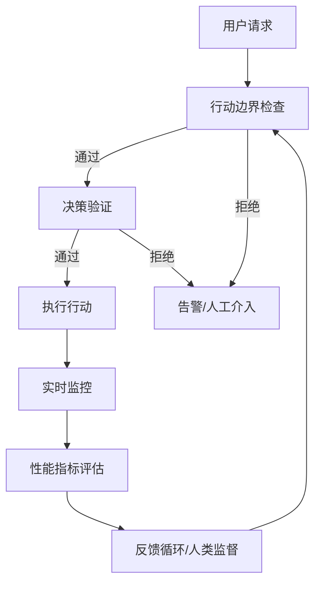

#### 5. 经典金句/数据
> “当这些漏洞在智能体系统中被利用时，影响可能超出内容生成，延伸到现实世界的行动和决策。”
> “解决智能体AI系统中的偏见问题需要采用比传统生成式AI更全面的策略。”
> “智能体系统不仅处理和生成信息，还在自主操作中积极访问、操作并做出关于个人数据的决策。”
> 案例：2022年对Stability AI的诉讼，凸显训练数据版权争议。

---

### 第10章：常见用例与应用场景

#### 1. 核心论点
本章展示智能体系统在创意艺术、自然语言处理、机器人技术、决策支持与优化四大领域的实际应用。作者认为：智能体不仅仅是内容生成工具，更是能够理解上下文、维持创意方向、与人类协作、自主决策的合作伙伴，正在变革各行各业的工作方式。

#### 2. 关键概念/事件
- **创意与艺术**：协作式电影前期可视化（导演智能体、技术总监智能体、可视化智能体）、音乐创作（旋律、和声、配器智能体）。
- **自然语言处理与对话**：企业知识管理系统（查询理解、知识导航、响应整合智能体）。
- **机器人技术与自主系统**：柔性制造单元协调（规划与协调、机器人控制、质量与优化、异常处理智能体）。
- **决策支持与优化**：全球供应链优化（战略规划、运营优化、风险管理、可持续性优化智能体）。

#### 3. 逻辑推演/叙事脉络
每个领域均按“问题陈述 → 智能体实现方法 → 环境与外部系统 → 为何更好”的结构展开。创意部分以电影前期可视化为详细用例；NLP部分以企业知识管理为例；机器人部分以制造单元协调为例；决策支持部分以供应链优化为例。每个用例都列出多个专业智能体及其协作方式，并与传统方法对比优势。

#### 4. 流程图（如存在）
电影前期可视化多智能体协作：

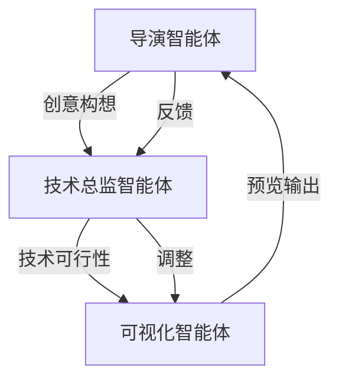

柔性制造单元智能体协作：

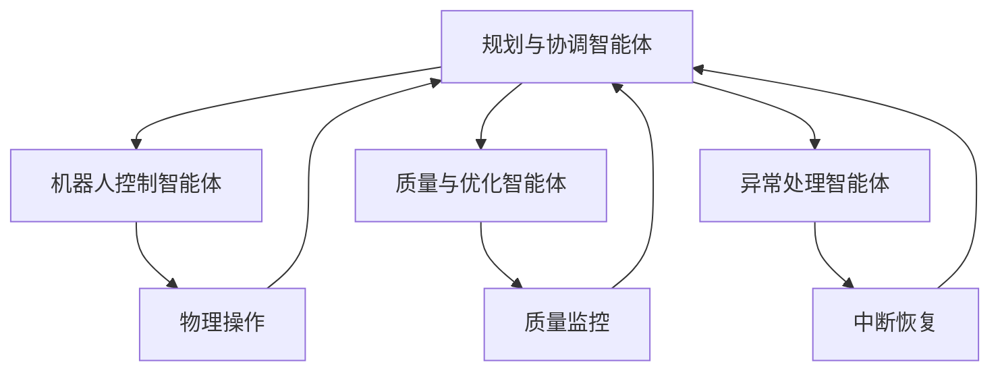

#### 5. 经典金句/数据
> “智能体系统正在成为有价值的合作伙伴，而不仅仅是工具。”
> “这种方法通过实现智能的、上下文感知的决策，从根本上改变了供应链管理。”
> 案例：Adobe Firefly、环球音乐集团AI音乐系统、Salesforce Agentforce、波士顿动力Atlas、摩根大通LOXM。

---

### 第11章：结论与未来展望

#### 1. 核心论点
本章回顾全书核心要点，展望AI智能体的前沿趋势（多模态、高级语言理解、经验式学习）、通用人工智能（AGI）的挑战与机遇。作者认为：AGI要求系统具备学会学习、理解真实世界、知识迁移、常识推理等能力；未来需要在可扩展性、可解释性、可靠性、人类友好性之间取得平衡，负责任地推动技术发展。

#### 2. 关键概念/事件
- **多模态智能**：同时处理文本、图像、音频、视频。示例：GPT-4o、DALL-E。
- **高级语言理解**：少样本学习、增强上下文、领域专家、自然对话。示例：OpenAI o1模型。
- **经验式学习**：强化学习创新（自我修炼、知错能改、实践成长）。示例：DeepMind RoboCat。
- **AGI核心挑战**：学会学习（抽象、迁移、常识、持续学习）、理解真实世界（感知、处理脏数据、读懂言外之意、应对意外）。
- **元学习、迁移学习、少样本学习**：作为解决数据效率问题的新方法。
- **可解释性**：注意力图、显著性图等XAI技术。

#### 3. 逻辑推演/叙事脉络
首先快速回顾全书核心要点（生成式AI基础、智能体原理、基本组件、反思自省、工具规划、CWD模式、高效设计、信任安全、应用案例）。然后展望前沿趋势：多模态智能、高级语言理解、经验式学习，并说明对医疗、金融、娱乐、艺术的实际影响。接着深入讨论AGI的宏伟愿景与核心挑战，强调将AGI与智能体系统结合可能带来的革命性变化。最后总结挑战与机遇，呼吁在推动创新的同时负责任地开发AI。

#### 4. 流程图（如存在）
AGI能力要求：

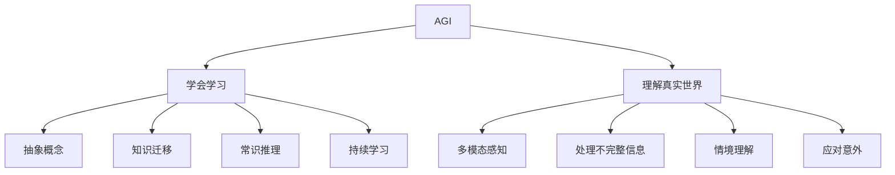

#### 5. 经典金句/数据
> “通用人工智能——能像人类一样思考和学习的AI——可能看起来像一个遥远的梦想。但我们今天在构建这些能够推理、学习和适应的自主系统方面所做的工作，正在为那个未来奠定基础。”
> “AI的未来不是要取代人类智能，而是要创造能增强人类自身能力并帮助人类以新方式解决问题的工具。”
> “未来的关键不仅仅在于这些系统能做什么，更在于我们选择用它们来做什么。”

---

## 附录与后记（基于可识别内容）

> 说明：PDF末尾包含“打造能推理、可规划、自适应的AI智能体”宣传页、译者后记（茹炳晟撰写于2025年9月22日）、作者献词、推荐序等。以下为关键摘录。

### 译者后记（茹炳晟）
- 反思与内省能力的实现触及技术与哲学的交叉。
- 多智能体协作（CWD模式）勾勒了未来智能生态的图景。
- 信任、安全、伦理是构建负责任AI的基石。
- “我们携手，以负责任的态度和创新的精神，一步步走进那个智能体与人类协同共进的新时代。”

### 作者献词
- 安贾纳瓦·比斯瓦斯：献给已故父亲、母亲、妻子和儿子。
- 里克·塔鲁克达尔：献给父母、儿子、妻子和所有支持者。

### 推荐序（摘录）
- 马修·R.斯科特（Minset.ai首席技术官）：本书分为三部分，强调透明性、可解释性、安全性和伦理治理。
- 亚历克斯·阿塞罗博士（美国国家工程院院士）：智能体系统的精髓在于不仅告诉用户怎么做，还会亲自执行任务。

---

> **整体说明**：本总结基于PDF文本提取，原始文档存在页码不连续、OCR错漏、部分代码片段丢失、表格和图表未完整呈现等问题。凡属无法确认的内容均已省略或标注。Mermaid流程图根据文本描述重建，可能与原书图示存在细节差异。建议读者结合原书纸质版或完整电子版进行核对。