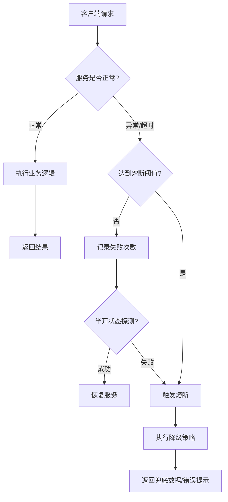
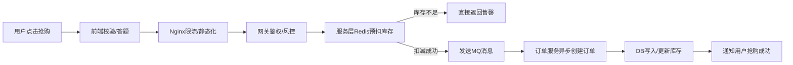

# 《架构师之路》章节总结

## 书籍信息
- **书名**：架构师之路
- **作者**：沈剑（58同城技术委员会主席）
- **PDF/EPUB 状态**：电子书格式，内容完整
- **OCR 状态**：文本清晰，无需OCR修复

## 目录说明
- **目录识别情况**：已完整识别全书六大篇章及子章节
- **章节对应依据**：严格按照原书“选型篇、高可用篇、高性能篇、案例篇、方法论篇、成长篇”结构梳理
- **特殊说明**：本书为技术博客精选集，章节间相对独立但逻辑递进，总结时保留了原文的工程实践风格

## 全书核心主题
《架构师之路》是58同城技术委员会主席沈剑基于多年互联网一线实战经验沉淀的技术文集。全书摒弃了纯理论说教，聚焦于互联网高并发、高可用架构的实际落地。核心内容涵盖数据库与缓存选型、分布式系统设计、服务治理、性能优化以及架构师思维模型。书中通过大量源自58同城的真实业务案例（如IM系统、推荐系统、秒杀系统），阐述了如何在资源受限和业务快速迭代的背景下，做出合理的技术权衡（Trade-off）。同时，作者从个人成长角度，探讨了程序员向架构师转型的路径、沟通技巧及技术领导力培养，是一本兼具技术深度与职业指导意义的实战手册。

---

## 第一篇：选型篇

### 核心论点
本篇主要解决互联网系统底层组件“如何选择”的问题。
作者认为：技术选型没有绝对的银弹，只有最适合当前业务阶段和团队能力的方案；选型应遵循“成熟优于新潮、简单优于复杂、生态优于单点”的原则，且必须考虑运维成本与数据一致性代价。

### 关键概念/事件
-   **CAP/BASE 权衡**：在互联网高并发场景下，通常牺牲强一致性（C）换取可用性（A）和分区容错性（P），最终一致性是主流选择。
-   **MySQL vs NoSQL**：MySQL适合核心事务与结构化数据；Redis/MongoDB适合高频读写与非结构化场景；选型关键在于数据访问模式而非单纯的性能指标。
-   **消息队列选型**：Kafka适合日志流与大数据管道；RabbitMQ/ActiveMQ适合业务解耦与可靠投递；选型需关注消息丢失、重复消费及顺序保证机制。
-   **RPC框架对比**：Dubbo偏向Java生态与服务治理；Thrift/gRPC偏向跨语言与高性能；自研框架需评估维护成本，避免重复造轮子。

### 逻辑推演/叙事脉络
作者首先指出技术选型的常见误区（唯性能论、唯大厂论），提出选型的核心维度包括：业务匹配度、社区活跃度、学习曲线、运维复杂度。随后以数据库为例，分析了从单机到分库分表再到NewSQL的演进路径，强调每次升级都是为了解决特定瓶颈而非盲目追新。在中间件选型中，通过对比不同MQ的特性矩阵，说明了如何根据“消息可靠性要求”和“吞吐量需求”做决策。最后总结：选型是一个动态过程，需随业务发展定期复盘调整。

### 经典金句/数据
> “脱离业务谈架构都是耍流氓。”
> “最好的架构不是设计出来的，而是演化出来的。”
> “对于99%的互联网公司，MySQL+Redis足以支撑千万级DAU。”

---

## 第二篇：高可用篇

### 核心论点
本篇探讨如何构建“永不宕机”的系统。
作者认为：高可用的本质是对故障的预期与管理，核心手段是冗余、隔离、限流与降级；任何单点都可能失效，系统设计必须假设一切组件都会失败。

### 关键概念/事件
-   **多级缓存策略**：客户端缓存 → CDN → Nginx本地缓存 → Redis集群 → DB兜底，层层拦截请求，防止击穿。
-   **服务熔断与降级**：当依赖服务异常或超时，自动切断调用并返回默认值/缓存值，防止雪崩效应蔓延。
-   **主从与多活架构**：数据库主从复制保障读扩展与故障切换；异地多活通过流量调度与数据同步实现地域级容灾，但需解决数据冲突问题。
-   **幂等性设计**：网络重试、消息重投必然导致重复请求，所有写接口必须通过唯一键、状态机或Token机制保证幂等。

### 逻辑推演/叙事脉络
从单点故障出发，逐步推导至高可用架构的分层防御体系。先讲存储层高可用（主从、哨兵、Cluster），再讲服务层高可用（注册中心健康检查、负载均衡策略、熔断器Hystrix/Sentinel原理）。接着分析流量入口层的防护（WAF、限流算法令牌桶/漏桶）。特别强调了“灰度发布”作为变更安全网的重要性：任何改动都应小流量验证，配合监控告警快速回滚。最后指出，高可用不仅是技术问题，更是组织流程问题（OnCall机制、故障演练）。

### 流程图：服务熔断降级机制

### 经典金句/数据
> “高可用架构设计的核心思想：承认故障必然发生，但要控制故障的影响范围。”
> “缓存穿透用布隆过滤器，缓存击穿用互斥锁，缓存雪崩用随机过期时间。”
> “没有监控的系统就是在裸奔。”

---

## 第三篇：高性能篇

### 核心论点
本篇聚焦如何让系统“更快更强”。
作者认为：性能优化的前提是量化度量，盲目优化是万恶之源；优化应遵循“二八定律”，优先解决瓶颈点；空间换时间、异步化、并行化是三大通用法宝。

### 关键概念/事件
-   **读写分离与分库分表**：应对数据库瓶颈的标准动作；垂直拆分按业务域，水平拆分按Hash/Range；需注意跨库Join与分布式事务问题。
-   **异步化处理**：将非核心链路（发邮件、记日志、推送）剥离出主流程，通过MQ削峰填谷，显著降低响应RT。
-   **连接池与对象池**：复用昂贵资源（DB连接、TCP连接、线程），避免频繁创建销毁带来的开销。
-   **索引优化原则**：最左前缀匹配、覆盖索引减少回表、避免在索引列上运算；Explain是SQL调优的唯一真理。

### 逻辑推演/叙事脉络
建立性能优化方法论：Monitor（监控定位）→ Analyze（分析瓶颈）→ Optimize（实施优化）→ Verify（效果验证）。从前端到后端逐层剖析：前端关注资源加载与渲染；网关层关注序列化协议与压缩；服务层关注代码效率与并发模型；存储层关注IO与查询计划。重点讲解了“热点Key”问题的多种解法（本地缓存、读写分离、key拆分）。强调性能优化不是一次性任务，而应融入开发规范与CI/CD流水线。

### 经典金句/数据
> “过早优化是万恶之源，过晚优化是灾难之源。”
> “能用缓存解决的，绝不打数据库；能异步处理的，绝不阻塞主线程。”
> “QPS提升10倍往往比代码重构更重要，因为用户体验直接相关。”

---

## 第四篇：案例篇

### 核心论点
本篇通过真实项目印证前述理论。
作者认为：架构设计必须在具体业务约束下展开；同一个技术方案在不同规模、不同团队下的落地形态截然不同；复盘失败案例比成功案例更有价值。

### 关键概念/事件
-   **58同城IM系统重构**：从单体到微服务的演进，解决了消息延迟与丢包问题；引入长连接网关+消息路由层+存储层三层架构。
-   **推荐系统冷启动**：新用户无行为数据时，利用热门榜单、地理位置、设备信息等Side Information进行初始推荐。
-   **秒杀系统设计**：前端按钮防抖+答题验证 → 网关限流+黑名单 → 服务层库存预扣减(Redis) → 异步下单(MQ) → DB最终落库。
-   **简历筛选系统**：倒排索引加速关键词检索；标签体系标准化候选人画像；机器学习排序模型提升人岗匹配精度。

### 逻辑推演/叙事脉络
每个案例均按“背景与挑战 → 方案设计 → 踩坑与优化 → 成果与反思”四段式展开。以IM系统为例，先描述旧系统消息延迟高的痛点，再讲解新架构如何通过消息ACK机制与离线消息拉取保证可靠性；过程中分享了Protobuf序列化节省带宽、心跳保活策略调优等细节。秒杀案例则突出了“层层过滤无效请求”的思想，强调宁可少卖不能超卖。所有案例都附带了具体的架构图与关键配置参数，增强了可复现性。

### 流程图：秒杀系统请求处理链路

### 经典金句/数据
> “架构设计不是为了追求完美，而是在有限资源下寻找最优解。”
> “每一个看似简单的功能背后，都有无数个被否决的方案。”
> “不要相信用户的输入，也不要相信网络的稳定。”

---

## 第五篇：方法论篇

### 核心论点
本篇提炼超越具体技术的通用思维。
作者认为：架构师的核心能力不是编码，而是抽象、权衡与沟通；优秀的方法论能将隐性知识显性化，降低团队协作成本与认知负荷。

### 关键概念/事件
-   **领域驱动设计(DDD)**：通过统一语言、限界上下文划分服务边界，避免微服务拆得过细或过粗；战略设计重于战术设计。
-   **康威定律**：组织架构决定系统架构；若想改变系统架构，必须先调整团队结构。
-   **技术债务管理**：适度负债可加速交付，但必须有偿还计划；定期安排还债Sprint，避免债务累积至崩溃。
-   **文档即代码**：API文档、架构图、决策记录(ADR)应纳入版本控制，保持与代码同步更新，避免文档腐化。

### 逻辑推演/叙事脉络
从“术”上升到“道”。先讲如何做技术方案评审：明确目标、列出选项、对比优劣、风险评估、达成共识。再讲如何写高质量技术文档：读者视角、结构化表达、图文结合、持续迭代。接着探讨技术领导力：如何用影响力而非职权推动变革，如何培养新人，如何处理跨部门冲突。最后强调终身学习：关注行业趋势但不盲从，建立自己的知识体系而非碎片化收藏。

### 经典金句/数据
> “架构师的价值不在于写了多少代码，而在于让团队少走多少弯路。”
> “好的文档应该让新人能在30分钟内理解系统全貌。”
> “技术决策没有对错，只有适不适合当下。”

---

## 第六篇：成长篇

### 核心论点
本篇关注工程师的职业发展路径。
作者认为：从程序员到架构师的跃迁，本质是从“解决问题”到“定义问题”的转变；软技能（沟通、写作、商业敏感度）与技术硬实力同等重要。

### 关键概念/事件
-   **T型人才模型**：一专多能，既有深耕的技术领域，又有广博的知识面；广度决定上限，深度决定下限。
-   **向上管理**：理解上级目标与压力，主动汇报进展与风险，争取资源支持，而非被动等待指令。
-   **技术影响力建设**：通过博客、演讲、开源项目输出观点，建立个人品牌；影响力=专业能力×传播系数。
-   **业务Sense培养**：深入理解公司商业模式与用户痛点，技术方案才能创造真实价值；避免陷入“技术自嗨”。

### 逻辑推演/叙事脉络
以作者自身经历为线索，分享从一线开发到技术负责人的心路历程。初期强调夯实基础与执行力；中期注重系统设计能力与项目推动力；后期侧重战略规划与团队建设。特别指出“跳槽不是成长的捷径，解决复杂问题才是”。建议每年设定OKR，定期复盘得失。对于迷茫期的工程师，给出具体行动清单：读经典书、参与开源、写技术文章、找导师交流。结尾寄语：保持好奇心与敬畏心，技术之路漫长但值得。

### 经典金句/数据
> “架构师不是头衔，而是一种思维方式。”
> “你的薪资不取决于你有多努力，而取决于你解决了多难的问题。”
> “写博客不是为了炫耀，而是为了倒逼自己系统化思考。”

---

## 附录与后记要点
-   **推荐阅读书单**：《DDIA》《Clean Architecture》《凤凰架构》等经典著作。
-   **常用工具链**：Draw.io绘图、Prometheus监控、ELK日志分析、JMeter压测。
-   **致谢与初心**：感谢58技术团队的实践土壤；写作初衷是填补“理论与实战之间的鸿沟”，希望后来者少踩坑。