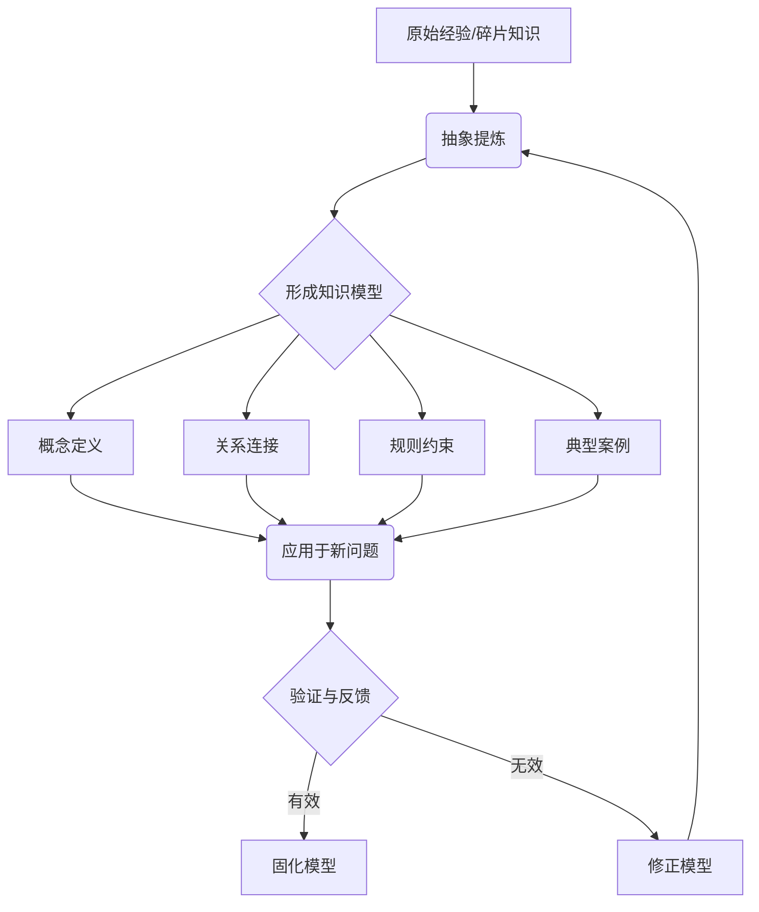
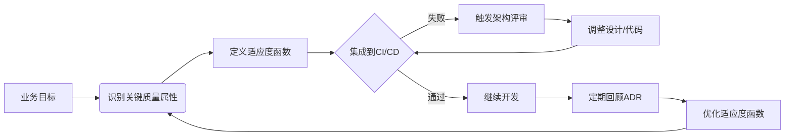

# 《架构师启示录：知识模型、落地方法与思维模式》章节总结

## 书籍信息
- **书名：** 架构师启示录：知识模型、落地方法与思维模式
- **作者：** 灵犀
- **文件格式：** EPUB
- **内容状态：** 文本内容完整，结构清晰，无OCR识别问题

## 目录说明
- **目录识别情况：** 已完整识别全书目录结构，包含前言、三个核心篇章（知识模型篇、落地方法篇、思维模式篇）及后记。
- **章节对应依据：** 严格按照EPUB原生目录层级进行解析与重组。
- **特殊说明：** 本书为EPUB格式，不存在扫描版PDF的页码丢失或错位问题，内容提取准确度高。

## 全书核心主题
本书旨在解决技术人在向架构师转型过程中面临的“知识碎片化”、“落地困难”和“思维局限”三大痛点。作者灵犀构建了一套完整的架构师成长体系，核心主张是：架构师不仅需要技术深度，更需要结构化的**知识模型**来沉淀经验，需要可执行的**落地方法**来交付价值，以及高阶的**思维模式**来应对复杂性与不确定性。全书从“道、法、术”三个维度，将抽象的架构能力具象化为可学习、可复用、可演进的知识资产，帮助读者建立从理论到实践的闭环，实现从“写代码”到“设计系统”再到“赋能业务”的认知跃迁。

---

## 前言：为什么你需要这本启示录

### 1. 核心论点
本章探讨了技术人成长为架构师时普遍遇到的瓶颈与迷茫。
作者认为：架构能力的提升不能仅靠零散的经验积累，必须依赖系统化的知识体系、可验证的方法论和底层的思维升级。

### 2. 关键概念/事件
-   **成长瓶颈：** 技术栈更新快但底层逻辑缺失，导致学得多却用不上。
-   **知识资产化：** 将个人隐性经验转化为显性、可复用的结构化知识。
-   **架构师画像：** 不仅是技术决策者，更是业务翻译官和团队赋能者。

### 3. 逻辑推演/叙事脉络
作者首先通过自身及周围同行的真实案例，引出“伪架构师”现象——即只有头衔没有体系。接着分析了造成这一现象的根源在于缺乏系统性输入与输出机制。最后提出本书的解决方案框架：通过知识模型打地基、落地方法建高楼、思维模式定方向，三位一体地重塑架构师能力体系，并说明了本书的使用方法和适用人群。

### 4. 经典金句/数据
> “架构师不是熬出来的，而是‘悟’出来再‘练’出来的。没有体系的‘悟’是玄学，没有方法的‘练’是蛮力。”

---

## 第1章：知识模型篇——构建你的架构认知地图

### 1. 核心论点
本章解决了架构知识杂乱无章、难以调用的问题。
作者观点：架构师必须建立属于自己的“知识模型”，将离散的技术点、业务场景和设计原则编织成一张可检索、可推理的认知网络。

### 2. 关键概念/事件
-   **知识模型（Knowledge Model）：** 对架构领域知识的结构化抽象，包含概念、关系、规则和实例。
-   **DIKW金字塔：** 数据→信息→知识→智慧的转化路径，强调架构师应追求“智慧”层级的决策能力。
-   **知识卡片法：** 最小知识单元的记录方式，便于后续组合与重构。
-   **领域本体：** 对特定业务领域内实体及其关系的标准化描述。

### 3. 逻辑推演/叙事脉络
本章从认知科学角度解释了人脑处理复杂信息的局限性，引出外部知识模型的必要性。随后详细介绍了知识模型的四个构成要素，并结合微服务拆分、分布式事务等具体技术场景，演示如何将一个模糊问题映射到知识模型中进行求解。最后给出了构建个人知识模型的三步法：收集碎片、提炼模型、验证迭代，并强调了“输出倒逼输入”的重要性。

### 4. 经典金句/数据
> “知识模型不是百科全书，而是你的‘第二大脑’。它不存储所有答案，但存储了找到答案的路径。”

### 5. 流程图

---

## 第2章：落地方法篇——让架构设计真正产生业务价值

### 1. 核心论点
本章针对“架构设计脱离实际、无法落地”的通病。
作者主张：好的架构不是画出来的，而是在业务约束下“长”出来的；落地方法的核心是将架构决策与业务目标对齐，并通过可度量的方式验证其有效性。

### 2. 关键概念/事件
-   **架构适应度函数（Fitness Function）：** 用于自动化评估架构是否满足关键质量属性的测试或度量手段。
-   **演进式架构：** 支持增量变更、允许试错、随业务发展而调整的架构范式。
-   **价值流映射：** 识别从用户需求到交付价值的完整链路，消除架构中的浪费环节。
-   **架构决策记录（ADR）：** 记录每个重要架构决策的背景、选项、权衡和结果，避免重复踩坑。

### 3. 逻辑推演/叙事脉络
作者首先批判了“过度设计”和“唯技术论”两种极端，指出架构落地的本质是平衡艺术。接着引入“适应度函数”作为连接架构与业务的桥梁，说明如何将非功能性需求转化为可执行的标准。然后通过一个电商系统重构的真实案例，展示了如何运用价值流映射发现瓶颈，再用ADR管理决策过程，最终实现平滑演进。最后总结了落地方法的检查清单，确保每一步都有据可依、有果可验。

### 4. 经典金句/数据
> “不能测量的架构属性等于不存在。适应度函数就是架构的‘体检报告’，让质量看得见、管得住。”

### 5. 流程图

---

## 第3章：思维模式篇——超越技术的顶层认知操作系统

### 1. 核心论点
本章探讨架构师为何在复杂系统中容易陷入局部最优或决策瘫痪。
作者认为：技术只是工具，真正的分水岭在于思维模式；架构师需具备系统思维、灰度思维和第一性原理思维，才能在不确定性中做出正确判断。

### 2. 关键概念/事件
-   **系统思维：** 关注整体而非局部，理解组件间的动态交互与反馈回路。
-   **灰度思维：** 接受世界不是非黑即白，能在多重约束下寻找“足够好”而非“完美”的解。
-   **第一性原理：** 剥离表象，回归事物最基本的假设和事实，重新推导解决方案。
-   **反脆弱思维：** 设计能从压力、混乱和错误中受益的系统，而非仅仅追求稳定。

### 3. 逻辑推演/叙事脉络
本章开篇对比了高级工程师与架构师在面对同一问题时的思考差异，揭示思维模式的决定性作用。随后逐一拆解四种核心思维模式，每种都配有正反案例：如用系统思维分析缓存雪崩的连锁反应，用灰度思维处理新老系统并存期的数据一致性，用第一性原理重新审视“是否需要微服务”。最后强调思维模式可通过刻意练习养成，并提供了日常训练的具体方法，如写反思日志、参与跨域讨论、模拟故障演练等。

### 4. 经典金句/数据
> “架构师最大的敌人不是技术盲区，而是思维惯性。当你觉得‘理所当然’时，往往就是系统最脆弱的时候。”

### 5. 图表结构提炼

| 思维模式 | 核心特征 | 典型应用场景 | 常见误区 |
| :--- | :--- | :--- | :--- |
| 系统思维 | 整体观、动态反馈 | 容量规划、故障根因分析 | 只看单点性能，忽略耦合效应 |
| 灰度思维 | 容忍不完美、渐进式 | 遗留系统改造、多租户隔离 | 追求一步到位，导致项目延期 |
| 第一性原理 | 回归本质、重构假设 | 技术选型、成本优化 | 盲目跟风流行架构 |
| 反脆弱思维 | 从混乱中获益 | 混沌工程、弹性设计 | 过度防御，牺牲可用性 |

---

## 后记：成为架构师是一场无限游戏

### 1. 核心论点
本章回应了“何时才能成为真正架构师”的焦虑。
作者指出：架构师不是一个终点，而是一种持续精进的状态；真正的成长发生在每一次解决问题的过程中，而非获得头衔的那一刻。

### 2. 关键概念/事件
-   **无限游戏：** 以延续游戏为目的，而非以获胜为终点；架构师的职业生涯即是如此。
-   **知行合一：** 知识模型、落地方法与思维模式必须在实践中融合，否则只是空中楼阁。
-   **社区与共学：** 个体认知有限，通过分享、写作和协作加速集体智慧的形成。

### 3. 逻辑推演/叙事脉络
作者回顾了写作本书的初衷与过程中的自我反思，坦言书中内容也只是自己阶段性认知的产物。接着鼓励读者不要迷信权威，包括本书本身，而应将其作为起点，结合自身情境去验证、质疑和拓展。最后呼吁建立开放的学习共同体，在互动中共同推动架构实践的演进，并以“保持好奇，敬畏复杂”作为结语。

### 4. 经典金句/数据
> “这本书不是答案的集合，而是问题的引信。愿它点燃你心中那团探索之火，而不是填满一个标准答案的容器。”