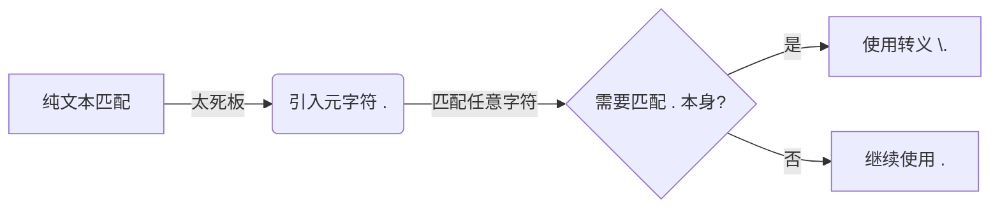

# 《正则表达式必知必会》章节总结

## 书籍信息

- **书名**：正则表达式必知必会 (Sams Teach Yourself Regular Expressions in 10 Minutes)
- **作者**：[美] Ben Forta
- **译者**：杨涛 等
- **出版社**：人民邮电出版社
- **PDF 状态**：完整识别，OCR 质量良好，部分特殊符号（如 `\b`, `\$`）需结合上下文校对。
- **知识截止**：2026年（本书为经典入门教材，核心语法至今通用）。

## 目录说明

- **目录识别情况**：目录结构清晰，包含引言、10个正文章节及3个附录。
- **章节对应依据**：严格遵循原书目录顺序，从基础匹配到高级特性（回溯引用、前后查找、嵌入条件）。
- **OCR 修复说明**：已修正部分因排版导致的断行错误，统一了代码块格式，确保了正则表达式语法的准确性。

## 全书核心主题

本书是一本针对初学者的正则表达式速成指南。作者 Ben Forta 强调正则表达式并非高深莫测的理论，而是解决文本搜索与替换问题的实用工具。全书摒弃了晦涩的理论推导，通过“10分钟一章”的结构，循序渐进地介绍了从纯文本匹配、元字符、字符集合、重复匹配、位置匹配，到子表达式、回溯引用、前后查找及嵌入条件等核心概念。

书中特别注重实战应用，提供了大量简明示例，并针对不同编程语言（JavaScript, .NET, Java, PHP, ColdFusion 等）的差异进行了说明。其核心理念是：**掌握正则表达式的关键不在于记忆多少特殊字符，而在于学会如何将实际问题分解为可匹配的模式，并立即应用于实践。**

---

## 引言

### 核心论点

引言指出了正则表达式学习的主要障碍：缺乏高质量、简明实用的入门资料。作者主张通过解决实际问题的方式来学习，而非死记硬语法。

### 关键概念/事件

- **正则表达式的用途**：主要用于两种基本操作——**搜索**（查找特定信息）和**替换**（查找并编辑特定信息）。
- **目标读者**：初次接触正则表达式、希望快速掌握基本用法、需要处理Web表单验证或文本处理的开发人员。
- **学习建议**：实践是关键，建议读者亲自运行书中的每一个示例。

### 逻辑推演/叙事脉络

作者首先列举了日常开发中常见的文本处理难题（如大小写不敏感的单词搜索、URL链接化、邮箱验证等），指出传统编程方法（循环+if判断）的复杂性。随后引入正则表达式作为更简洁、强大的解决方案。最后说明了本书的结构优势：精选最常用知识，语言平台中立，每章短小精悍，旨在让读者迅速上手。

### 经典金句/数据

> “正则表达式是一种威力无比强大的武器，可以完成各种复杂的文本处理工作，被称为程序员的‘瑞士军刀’。”

> “在学习和使用正则表达式的时候，重要的并不是你知道多少个特殊字符，而是你会不会运用它们去解决实际问题。”

---

## 第1章：正则表达式入门

### 核心论点

本章定义了正则表达式，并阐述了其基本用途：搜索和替换。它不是独立的程序，而是内置于其他语言或工具中的“迷你”语言。

### 关键概念/事件

- **正则表达式定义**：一些用来匹配和处理文本的字符串，由正则表达式语言创建。
- **搜索 vs 替换**：
    - **搜索**：在文本中查找匹配项（如验证邮箱格式）。
    - **替换**：找到匹配项并进行修改（如将URL转换为HTML链接）。
- **平台差异**：不同语言/工具对正则表达式的支持程度和语法细节略有不同，需注意兼容性。

### 逻辑推演/叙事脉络

本章从具体场景出发（如搜索单词 "car" 但不包括 "scar"），引出正则表达式的需求。接着解释了正则表达式的本质：一种用于文本匹配的微型语言。最后提醒读者，虽然语法通用，但具体实现（如函数调用方式、标志位设置）因环境而异，建议查阅附录了解特定平台的细节。

### 经典金句/数据

> “正则表达式语言并不是一种完备的程序设计语言……更准确地说，正则表达式语言是内置于其他语言或软件产品里的‘迷你’语言。”

---

## 第2章：匹配单个字符

### 核心论点

本章介绍了最基本的匹配方式：纯文本匹配和任意字符匹配。重点讲解了元字符 `.` 和转义字符 `\` 的使用。

### 关键概念/事件

- **纯文本匹配**：正则表达式可以直接包含普通文本，如 `Ben` 匹配 "Ben"。
- **`.` (点号)**：匹配除换行符以外的**任意单个字符**。例如 `c.t` 可匹配 "cat", "cot"。
- **`\` (反斜杠)**：转义元字符。若要匹配 `.` 本身，需使用 `\.`；若要匹配 `\` 本身，需使用 `\\`。
- **大小写敏感**：默认情况下，正则表达式区分大小写（`Ben` 不匹配 `ben`）。

### 逻辑推演/叙事脉络

从最简单的静态文本匹配开始，指出其局限性（无法处理变化内容）。引入 `.` 来匹配未知字符，但发现 `.` 也会匹配到不想要的字符（如文件名中的非数字部分）。进而引出问题：如何匹配特殊字符本身？从而引入转义字符 `\` 的概念，为后续更复杂的匹配打下基础。

### 流程图/图表处理



### 经典金句/数据

> “`.` 字符可以匹配任何一个单个的字符、字母、数字甚至是 `.` 字符本身。”

> “在正则表达式里，`\` 字符永远出现在一个有着特殊含义的字符序列的开头。”

---

## 第3章：匹配一组字符

### 核心论点

当需要匹配特定范围内的字符而非任意字符时，使用字符集合 `[]`。本章讲解了字符集合、区间 `-` 和取非 `^` 的用法。

### 关键概念/事件

- **字符集合 `[]`**：匹配方括号内的**任意一个**字符。例如 `[ns]` 匹配 'n' 或 's'。
- **字符区间 `-`**：简化连续字符的定义。`[0-9]` 等价于 `[0123456789]`，`[a-z]` 匹配所有小写字母。
- **取非 `^`**：放在字符集合开头，表示匹配**不在**集合中的字符。`[^0-9]` 匹配任何非数字字符。
- **注意事项**：`-` 只有在 `[]` 内部才作为元字符；在 `[]` 外部只需匹配连字符本身。

### 逻辑推演/叙事脉络

回顾第2章中 `.` 匹配过于宽泛的问题（如 `ca1.xls` 被误匹配）。提出解决方案：限制匹配范围。引入 `[]` 定义特定字符集。进一步发现列举所有字符繁琐，引入 `-` 定义区间。最后讨论反向需求：排除某些字符，引入 `^` 进行取非匹配。

### 经典金句/数据

> “字符集合通常用来指定一组必须匹配其中之一的字符。但在某些场合，我们需要反过来做，给出一组不需要得到的字符。”

> “`^` 的效果将作用于给定字符集合里的所有字符或字符区间，而不是仅限于紧跟在 `^` 字符后面的那一个字符。”

---

## 第4章：使用元字符

### 核心论点

本章系统介绍了预定义的元字符类，用于匹配特定类型的字符（如数字、字母、空白符），简化正则表达式的编写。同时介绍了 POSIX 字符类。

### 关键概念/事件

- **转义回顾**：元字符（如 `.`, `[`, `]`）需转义才能匹配其本身。
- **空白字符元字符**：
    - `\t`: 制表符
    - `\n`: 换行符
    - `\r`: 回车符
- **字符类元字符**：
    - `\d`: 数字 (等价于 `[0-9]`)
    - `\D`: 非数字
    - `\w`: 字母、数字、下划线 (等价于 `[a-zA-Z0-9_]`)
    - `\W`: 非字母数字下划线
    - `\s`: 空白字符 (空格、Tab、换行等)
    - `\S`: 非空白字符
- **POSIX 字符类**：如 `[[:digit:]]`, `[[:alpha:]]`。注意 JavaScript 不支持 POSIX 类。

### 逻辑推演/叙事脉络

指出手动编写 `[0-9]` 或 `[a-zA-Z]` 虽然可行但繁琐且易错。引入预定义的简写元字符（如 `\d`, `\w`）以提高可读性和编写效率。接着介绍处理不可见字符（空白符）的需求，列出 `\t`, `\n` 等。最后补充介绍 POSIX 标准字符类，指出其兼容性问题（特别是 JavaScript）。

### 经典金句/数据

> “类元字符并不是必不可少的东西……但用它们构造出来的正则表达式简明易懂，在实践中很有用。”

> “JavaScript 不支持在正则表达式里使用 POSIX 字符类。”

---

## 第5章：重复匹配

### 核心论点

实际文本中字符往往重复出现。本章介绍了控制重复次数的元字符：`+` (一次或多次), `*` (零次或多次), `?` (零次或一次), 以及 `{}` (精确次数/区间)。同时引入了贪婪与懒惰匹配的概念。

### 关键概念/事件

- **`+`**：匹配前一个字符/集合 **1次或多次**。
- **`*`**：匹配前一个字符/集合 **0次或多次**。
- **`?`**：匹配前一个字符/集合 **0次或1次**（可选）。
- **`{n}`**：精确匹配 n 次。
- **`{n, m}`**：匹配 n 到 m 次。
- **`{n,}`**：至少匹配 n 次。
- **贪婪型 vs 懒惰型**：
    - 默认元字符（`*`, `+`）是**贪婪**的，尽可能多匹配。
    - 加上 `?` 后缀（`*?`, `+?`）变为**懒惰**，尽可能少匹配。

### 逻辑推演/叙事脉络

从匹配电子邮件地址的例子入手，发现固定长度模式无法适应不同长度的用户名。引入 `+` 解决“至少一个”的问题。接着处理“可有可无”的情况（如 http/https），引入 `?`。为了更精确控制（如IP地址段、日期格式），引入 `{}` 语法。最后通过 HTML 标签匹配案例，展示贪婪匹配导致的“过度匹配”问题，并引出懒惰匹配作为解决方案。

### 流程图/图表处理

```mermaid
graph TD
    A[需要重复匹配] --> B{重复次数要求?}
    B -->|至少1次| C[使用 +]
    B -->|0次或多次| D[使用 *]
    B -->|0次或1次| E[使用 ]
    B -->|精确或区间| F[使用 {n,m}]
    C & D & F --> G{是否过度匹配?}
    G -->|是| H[转换为懒惰型: +, *?, {n,m}?]
    G -->|否| I[保持贪婪型]
```

### 经典金句/数据

> “`*` 和 `+` 都是所谓的‘贪婪型’元字符……它们会尽可能地从一段文本的开头一直匹配到这段文本的末尾。”

> “懒惰型元字符的写法很简单，只要给贪婪型元字符加上一个 `?` 后缀即可。”

---

## 第6章：位置匹配

### 核心论点

有时我们需要匹配特定位置的文本（如行首、单词边界），而不仅仅是字符内容。本章介绍了边界元字符 `\b`, `^`, `$` 以及多行模式 `(?m)`。

### 关键概念/事件

- **单词边界 `\b`**：匹配单词的开始或结束位置（位于 `\w` 和 `\W` 之间）。`\B` 匹配非单词边界。
- **字符串边界**：
    - `^`：匹配字符串开头。
    - `$`：匹配字符串结尾。
- **多行模式 `(?m)`**：启用后，`^` 和 `$` 不仅匹配整个字符串的首尾，还匹配每一行的首尾（即换行符后的位置）。
- **注意**：`^` 在 `[]` 内表示取非，在 `[]` 外表示行首。

### 逻辑推演/叙事脉络

通过搜索单词 "cat" 却匹配到 "scattered" 中的 "cat" 的问题，引出单词边界 `\b` 的需求。接着讨论如何确保 XML 声明 `<?xml>` 出现在文档最开头，引入 `^`。同理，检查 HTML 闭合标签是否在末尾，引入 `$`。最后解决多行文本中每行注释的匹配问题，引入 `(?m)` 标志改变 `^` 和 `$` 的行为。

### 经典金句/数据

> “`\b` 匹配且只匹配一个位置，不匹配任何字符。”

> “在分行匹配模式下，`^` 不仅匹配正常的字符串开头，还将匹配行分隔符（换行符）后面的开始位置。”

---

## 第7章：使用子表达式

### 核心论点

子表达式允许将部分模式分组，以便作为一个整体进行重复操作或逻辑选择。使用 `()` 定义子表达式。

### 关键概念/事件

- **子表达式 `()`**：将多个字符或元字符组合成一个单元。
- **用途 1：控制重复作用域**。例如 `(ab)+` 匹配 "abab"，而 `ab+` 匹配 "abb"。
- **用途 2：逻辑或 `|` 的分组**。例如 `(19|20)\d{2}` 匹配 19xx 或 20xx 年份，若无括号则逻辑不同。
- **嵌套子表达式**：子表达式可以嵌套，用于构建复杂逻辑（如合法 IP 地址的严格匹配）。

### 逻辑推演/叙事脉络

通过匹配 HTML 非换行空格 `&nbsp;` 重复出现的例子，展示 `{2,}` 仅作用于前一个字符 `;` 的错误，引出需要用 `()` 将 `&nbsp;` 整体括起来。接着通过 IP 地址匹配，展示如何用子表达式简化重复模式 `(\d{1,3}\.){3}`。最后通过年份匹配和严格 IP 地址匹配，展示子表达式在逻辑或 `|` 和复杂嵌套逻辑中的关键作用。

### 流程图/图表处理

```mermaid
graph LR
    A[复杂模式] --> B[划分逻辑单元]
    B --> C[使用 () 包裹]
    C --> D[作为整体重复或选择]
    D --> E[嵌套处理更复杂逻辑]
```

### 经典金句/数据

> “子表达式是一个更大的表达式的一部分……目的是为了把那些子表达式当作一个独立元素来使用。”

> “把必须匹配的情况考虑周全并写出一个匹配结果符合预期的正则表达式很容易，但把不需要匹配的情况也考虑周全并确保它们都将被排除在匹配结果以外往往要困难得多。”

---

## 第8章：回溯引用：前后一致匹配

### 核心论点

回溯引用允许在正则表达式后半部分引用前半部分子表达式匹配到的**具体文本**，确保前后一致性。常用于匹配成对标签或重复单词。

### 关键概念/事件

- **回溯引用 `\n`**：`\1` 引用第1个子表达式匹配的内容，`\2` 引用第2个，以此类推。
- **应用场景**：
    - 匹配重复单词：`(\w+) \1`
    - 匹配成对 HTML 标签：`<([hH][1-6])>.*?</\1>`
- **替换中的回溯引用**：在替换字符串中使用 `$1` (JS/.NET) 或 `\1` (其他) 来重用匹配内容。
- **大小写转换**：部分引擎支持 `\U` (转大写), `\L` (转小写) 等在替换中使用。

### 逻辑推演/叙事脉络

通过匹配 HTML 标题标签的问题，指出简单模式 `<[hH][1-6]>.*</[hH][1-6]>` 无法保证开始标签和结束标签级别一致（如 `<h1>...</h2>` 也会匹配）。引入回溯引用 `\1`，强制结束标签的数字必须与开始标签捕获的数字相同。接着展示在替换操作中，如何利用回溯引用重新格式化文本（如电话号码、邮件链接化）。

### 经典金句/数据

> “回溯引用指的是模式的后半部分引用在前半部分中定义的子表达式。”

> “你们可以把回溯引用想像成变量。”

---

## 第9章：前后查找

### 核心论点

前后查找（Lookaround）用于匹配特定位置，该位置的前面或后面必须符合某种模式，但该模式本身**不包含**在最终匹配结果中（零宽度匹配）。

### 关键概念/事件

- **向前查找 `(?=...)`**：匹配后面跟着指定模式的位置。
- **向后查找 `(?<=...)`**：匹配前面是指定模式的位置。（注意：并非所有引擎支持，JS 早期版本不支持）
- **负向前查找 `(?!...)`**：匹配后面**不**跟着指定模式的位置。
- **负向后查找 `(?<!...)`**：匹配前面**不是**指定模式的位置。
- **特点**：只匹配位置，不“消费”字符，结果中不包含查找条件。

### 逻辑推演/叙事脉络

通过提取 HTML `<TITLE>` 标签内容的例子，指出传统匹配会包含标签本身。使用子表达式虽可提取，但效率低。引入向前查找和向后查找，只定位标签之间的文本位置，而不匹配标签本身。接着通过提取价格（带 `$` 但不返回 `$`）和数量（不带 `$`）的例子，展示正向和负向查找的区别及应用。

### 流程图/图表处理

```mermaid
graph TD
    A[前后查找] --> B{方向?}
    B -->|向前| C[Lookahead]
    B -->|向后| D[Lookbehind]
    C --> E{正/负?}
    D --> F{正/负?}
    E -->|正 (?=)| G[后面必须是...]
    E -->|负 (?! )| H[后面必须不是...]
    F -->|正 (?<=)| I[前面必须是...]
    F -->|负 (?<!)| J[前面必须不是...]
```

### 经典金句/数据

> “向前查找指定了一个必须匹配但不在结果中返回的模式……这被称为‘不消费’。”

> “向后查找模式只能是固定长度——这是一条几乎所有的正则表达式实现都遵守的限制。”

---

## 第10章：嵌入条件

### 核心论点

嵌入条件允许根据某个子表达式是否匹配成功，或者根据前后查找的结果，来决定执行哪一部分正则表达式。语法为 `(?(condition)true-regex|false-regex)`。

### 关键概念/事件

- **回溯引用条件**：`(?(1)true-regex)`，如果第1个子表达式匹配成功，则执行 true-regex。
- **前后查找条件**：`(?(?=pattern)true-regex)`，如果向前查找成功，则执行 true-regex。
- **Else 分支**：`(?(condition)true-regex|false-regex)`，提供条件不满足时的备选模式。
- **应用案例**：匹配北美电话号码，处理括号可选但必须配对的情况。

### 逻辑推演/叙事脉络

通过北美电话号码格式的复杂性（有括号则必须成对，无括号则用连字符）引出问题。简单的可选匹配 `\(?\d{3}\)?` 无法防止 `(123-456...` 这种半括号情况。引入嵌入条件：如果匹配到了左括号 `(?(1)`，则必须匹配右括号 `\)`；否则 `|`，必须匹配连字符 `-`。展示了条件逻辑在解决互斥格式问题上的强大能力。

### 经典金句/数据

> “嵌入条件语法也使用了 `?`……因为嵌入条件不外乎以下两种情况：根据一个回溯引用来进行条件处理；根据一个前后查找来进行条件处理。”

---

## 附录A：常见应用软件和编程语言中的正则表达式

### 核心论点

不同平台和语言对正则表达式的支持存在差异，开发者需了解所用环境的具体实现细节。

### 关键概念/事件

- **JavaScript**：支持 `g`, `i`, `m` 标志。不支持 POSIX 类。回溯引用在替换中用 `$1`。
- **.NET/C#**：功能强大，支持命名捕获 `(?<name>...)`。替换中用 `${name}`。不支持 POSIX。
- **Java**：1.4+ 支持 `java.util.regex`。不支持嵌入条件。
- **PHP**：使用 PCRE 库。支持 Perl 兼容语法。
- **MySQL**：仅支持搜索，不支持替换。不支持回溯引用。
- **ColdFusion**：不支持向后查找和条件处理。

### 逻辑推演/叙事脉络

逐一列举主流语言和工具的正则表达式特性、限制和特殊语法。重点指出差异点，如回溯引用的语法（`\1` vs `$1`）、对 POSIX 类的支持、对高级特性（如向后查找、条件）的支持情况。旨在帮助读者在实际开发中避免兼容性陷阱。

---

## 附录B：常见问题的正则表达式解决方案

### 核心论点

提供了一系列常见数据格式验证的正则表达式模板，可直接复用或作为参考。

### 关键概念/事件

- **北美电话**：`\(?[2-9]\d\d\)?[-. ]?[2-9]\d\d[-. ]?\d{4}`
- **美国 ZIP 码**：`\d{5}(-\d{4})?`
- **IP 地址**：严格匹配 0-255 范围的复杂嵌套表达式。
- **URL**：`https?://[-\w.]+(:\d+)?(/([\w/_.]*)?)?`
- **电子邮件**：`(\w+\.)*\w+@(\w+\.)+[A-Za-z]+`
- **信用卡**：分别针对 Visa, MasterCard, Amex 等的前缀和长度进行匹配。

### 逻辑推演/叙事脉络

针对每种数据类型，分析其结构规则，给出相应的正则表达式。对于复杂格式（如 IP 地址、信用卡），解释了如何通过分段匹配和逻辑或组合来实现精确验证。强调了这些模式是“实用起点”，可根据具体需求调整严格程度。

---

## 附录C：正则表达式测试器

### 核心论点

推荐使用工具辅助学习和调试正则表达式。

### 关键概念/事件

- **Regular Expression Tester**：书中提供的 Web 版测试工具，支持查找和替换操作。
- **使用方法**：输入正则表达式、源文本，查看匹配结果或替换效果。
- **价值**：即时反馈，帮助理解模式行为，验证兼容性。

### 逻辑推演/叙事脉络

简要介绍测试器的功能和使用步骤，鼓励读者动手实践。提供下载链接和资源指引。