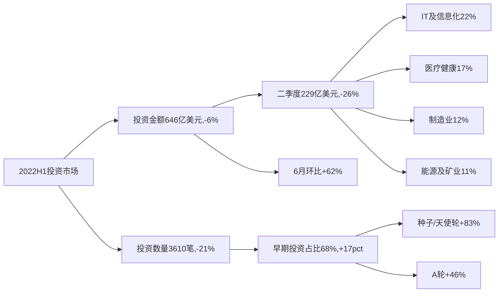
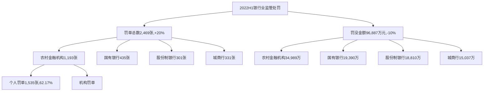
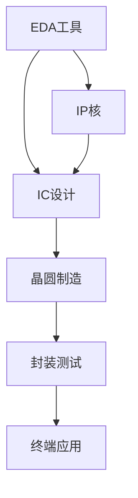
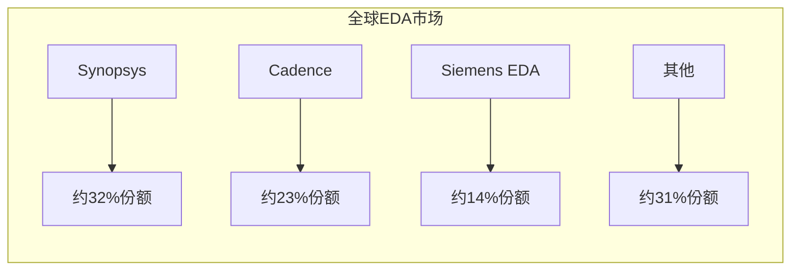
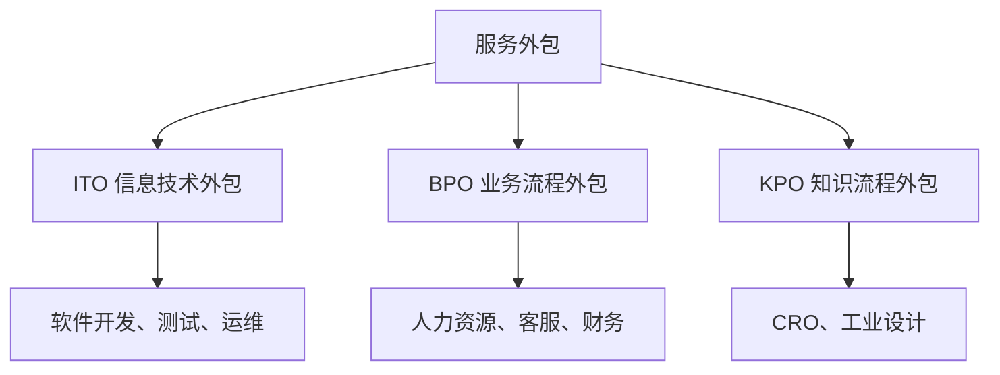
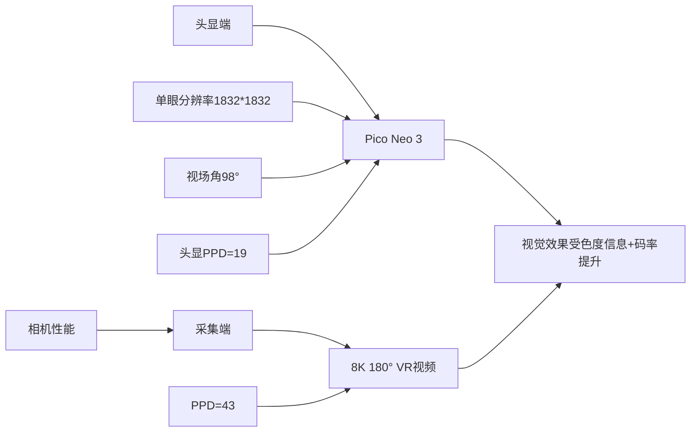
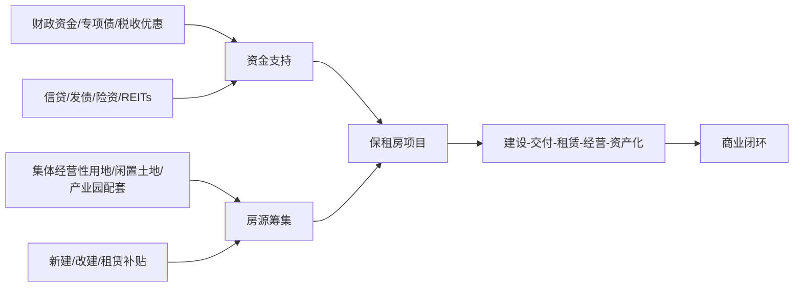
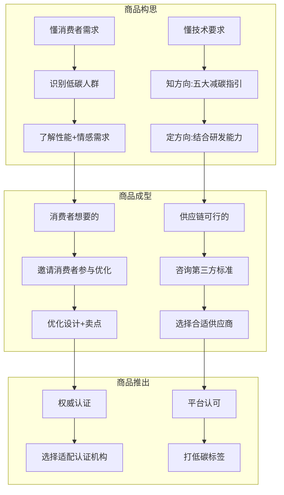
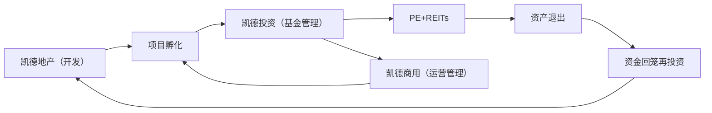
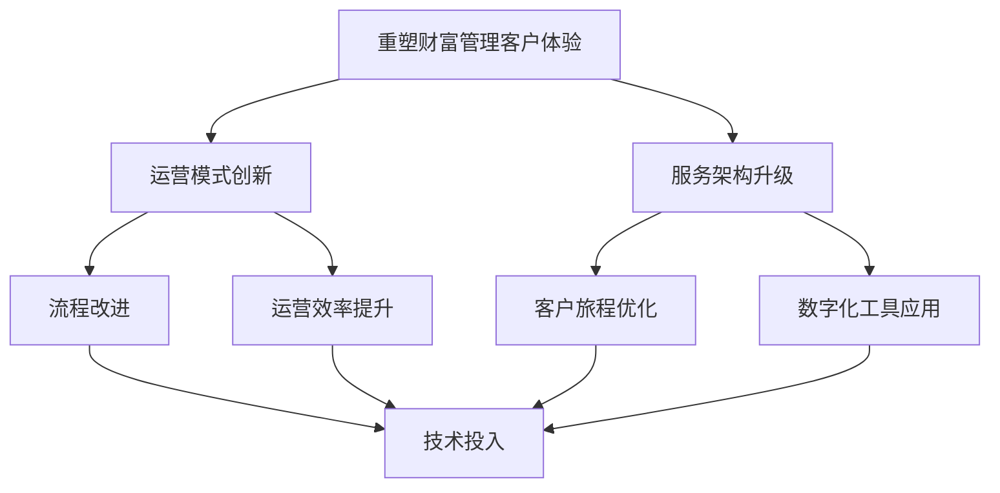

# 《毕马威-2022年上半年中国股权投资动态》章节总结

## 书籍信息
- 书名：中国股权投资动态（2022年上半年）
- 作者：毕马威
- PDF 状态：完整
- OCR 状态：良好

## 目录说明
- 目录识别情况：完整，包含摘要、募资、投资、退出、趋势展望及附录
- 章节对应依据：按原报告目录顺序整理
- OCR 修复说明：无明显错漏

## 全书核心主题
本报告系统分析了2022年上半年中国PE/VC市场的募资、投资、退出情况。受疫情反复、经济增速放缓和国际形势影响，市场整体承压，但6月以来逐步回暖。募资端新成立基金数量小幅增长但总规模下降，政府引导基金和母基金表现亮眼；投资端金额和数量双降，但早期投资显著增加，半导体、高端制造、清洁能源等赛道活跃；退出端IPO占比进一步提升，美股遇冷，A股成为主要退出渠道。报告展望了国际资本持续看好中国、政策支持硬科技和ESG投资、投早投小趋势等方向。

---

## 摘要
### 核心论点
2022年上半年PE/VC市场募资、投资、退出均受不同程度影响，但6月后市场信心修复，下半年有望持续回暖。

### 关键概念
- PE/VC：私募股权/风险投资
- 政府引导基金：政府主导成立，吸引社会资本投资扶持产业
- 专精特新：专业化、精细化、特色化、新颖化的小巨人企业
- IPO退出：通过首次公开募股实现投资退出

### 逻辑推演
报告先概述宏观环境对创投市场的影响，然后分募资、投资、退出三大部分展开。募资部分指出新成立基金数量增3%但规模降8%，政府引导基金规模翻倍；投资部分指出金额降6%但早期投资占比上升，IT、医疗健康、制造业位居前三；退出部分指出IPO占比76%，A股占92%，美股无退出。最后展望国际资本、政策支持、投早投小三大趋势。

### 经典金句/数据
> “2022年上半年，PE/VC市场新成立基金共4,683只，比去年同期小幅增长3%；新成立基金规模3,069亿美元，同比减少8%。”
> “2022年上半年PE/VC市场总投资规模为646亿美元，较去年同期下降6%。”
> “种子轮、天使轮和A轮等早期投资数量显著增加，投资笔数占投资总数量的68%，同比上升17个百分点。”
> “2022H1共有397家‘专精特新’小巨人企业获得不同轮次的投资，已经超过去年全年的284家。”

---

## 第1章：募资
### 1. 核心论点
募资市场结构向头部聚集，新成立基金数量微增但总规模下降，政府引导基金和母基金增长显著。

### 2. 关键概念
- 成长型基金：投资于有较大升值潜力的企业
- 政府引导基金：政府主导，带动社会资本投资扶持产业
- 母基金：投资于其他基金的基金

### 3. 逻辑推演
报告首先给出总体数据：新成立基金4,683只（+3%），规模3,069亿美元（-8%）。然后分析基金类型：成长型占比65%，政府引导基金规模456亿美元（同比翻番），母基金324亿美元（+29%）。接着分析币种：人民币基金规模下降21%，外币基金上升84%（主要因安宏资本、华平投资的大额基金）。最后分析地区：江苏、江西、浙江、四川募资超200亿美元；嘉兴、深圳、九江等城市基金数量领先。

### 4. 经典金句/数据
> “新成立政府引导基金规模达456亿美元，是2021年同期的两倍。”
> “1亿美金以下的新成立基金占比88%，但资金总额占比只有12%。”
> “50亿美金以上的基金数量占比仅0.2%，但金额占比达23%。”
> “上海2022H1新成立基金数量29只，同比减少50%；目标募资额17亿美元，同比下降92%。”

---

## 第2章：投资
### 1. 核心论点
投资金额和数量双降，但早期投资显著增加，半导体、高端制造、清洁能源等赛道受青睐。

### 2. 关键概念
- 专精特新小巨人：专注于细分市场、创新能力强、市场占有率高、掌握关键核心技术的中小企业
- 双碳目标：碳达峰、碳中和
- 区块链：分布式账本技术

### 3. 逻辑推演
报告给出总投资规模646亿美元（-6%），二季度环比下降但6月反弹62%。投资数量3,610笔（-21%）。轮次分布：种子轮、天使轮、A轮投资笔数占比68%（+17pct），金额也同比上升。行业分布：IT及信息化（22%）、医疗健康（17%）、制造业（12%）、能源及矿业（11%）位居前四。区块链投资增长近十倍。地区分布：广东、北京、上海前三，但交易金额均下降；重庆、安徽逆势上涨。专精特新企业获投397家，超去年全年。

### 4. 流程图

### 5. 经典金句/数据
> “投资金额前十行业占PE/VC投资市场的比重为92%，比2019年提升13个百分点。”
> “区块链投资额由去年同期的3.6亿美元增加至今年上半年的31亿美元，增长近十倍。”
> “重庆市交易金额从1亿美元增加到16亿美元，同比增幅高达1381%。”
> “2022H1共有397家‘专精特新’小巨人企业获得不同轮次的投资，而去年全年仅284家。”

---

## 第3章：退出
### 1. 核心论点
退出交易数量下降44%，IPO方式占比提升至76%，A股成为绝对主导，美股退出为零。

### 2. 关键概念
- IPO：首次公开募股
- 渗透率：IPO企业中有PE/VC背景的比例

### 3. 逻辑推演
报告给出退出交易1,404例（-44%）。退出方式：IPO占76%（+17pct），并购占22%。市场分布：A股占92%，港股占8%，美股无退出。板块分布：科创板35%，创业板34%，合计69%。退出回报率：企业服务24.27倍，IT及信息化11.38倍。PE/VC在IPO中的渗透率67%。

### 4. 经典金句/数据
> “2022H1，PE/VC退出交易数量1,404例，较2021年同期下降44%。”
> “通过首次公开募股（IPO）方式退出的交易1,073例，占比76%。”
> “受中美贸易关系复杂多变等因素的影响，中概股在美股市场遇冷，上半年没有获投企业在美股市场实现退出。”
> “在科创板与创业板上市的获投企业占比分别为35%与34%，两者合计占比高达69%。”

---

## 第4章：趋势展望
### 1. 核心论点
国际资本持续看好中国，政策支持高端制造、硬科技、清洁能源投资，投早投小趋势明显。

### 2. 关键概念
- ESG：环境、社会和治理
- 北交所：北京证券交易所

### 3. 逻辑推演
报告提出三大趋势：一是巨大市场潜力和对外开放吸引国际资本，外资私募增至43家；二是政策支持下高端制造、半导体、清洁能源投资热度不减；三是投早投小趋势明显，机构与专精特新企业共同成长。

### 4. 经典金句/数据
> “截至2022年6月，外商直接投资累计同比增长22%。”
> “上半年包括半导体芯片在内的IT、制造业、能源及矿业投资额分别位居第一、第三和第四。”
> “超七成IPO企业集中在机械制造、半导体及电子设备、生物技术/医疗健康、化工原料及加工和IT五大行业。”

---

# 《毕马威-2022年上半年银行业监管处罚分析洞察》章节总结

## 书籍信息
- 书名：鉴过知来 向往而新：2022上半年银行业监管处罚分析洞察
- 作者：毕马威
- PDF 状态：完整
- OCR 状态：良好

## 全书核心主题
报告分析了2022年上半年银保监会、人民银行、外汇管理局对银行业金融机构的处罚情况。罚单数量2,469张（+20%），罚没金额96,887万元（-10%）。信贷业务是处罚最集中的领域（罚单六成、金额七成），反洗钱领域处罚数量金额双增，消费者权益保护领域处罚增长三倍以上。报告还分析了处罚区域、对象、类型、案由，并对大额罚单进行了重点解读。

---

## 第1章：监管处罚态势分析
### 1. 核心论点
2022年上半年银行业强监管态势不减，但罚款力度有所减弱，千万级罚单数量显著减少。信贷业务、合规管理、运营管理是处罚最集中的领域。

### 2. 关键概念
- 反洗钱：预防和打击洗钱活动的监管要求
- 消费者权益保护：保护金融消费者的合法权益
- “双罚制”：既处罚机构也处罚个人

### 3. 逻辑推演
报告先给出总体趋势：罚单2,469张（+20%），罚没96,887万元（-10%）。然后指出处罚最集中的前三大业务领域：信贷业务（罚单千余张，占罚没金额七成）、合规管理（反洗钱、员工行为、消费者权益）、运营管理（账户、假币、印章）。接着分析重点趋势：信贷业务中“贷后资金流向监控不到位”占半数以上；人民银行处罚数量金额双增，“客户身份识别不到位”成第一大案由；消费者权益保护处罚数量金额增长三倍以上。

### 4. 经典金句/数据
> “信贷业务涉及罚单千余张，占整体罚没金额的七成有余。”
> “未按规定履行客户身份识别义务”一跃成为第一大处罚案由。
> “消费者权益保护相关处罚数量及金额均增长三倍以上。”

---

## 第2章：监管处罚总体情况
### 1. 核心论点
农村金融机构处罚金额及数量居首，个人罚单数量持续上升，“警告”和“禁止进入相关行业”翻倍增长。

### 2. 关键概念
- 农村金融机构：农商行、农信社等
- 国有银行：工、农、中、建、交、邮储
- 股份制银行：招商、兴业、浦发等

### 3. 逻辑推演
报告按机构类型分析：农村金融机构罚单1,193张，处罚金额34,989万元，均居首位；国有银行、股份制银行、城商行紧随其后。处罚区域：黑龙江、山东、浙江罚单数量前三；浙江、山东、广东罚没金额前三。处罚类型：个人罚单1,535张（占62.17%），“警告”和“禁止进入相关行业”翻倍增长。前十大处罚案由：未按规定履行客户身份识别义务（349张）、违反审慎经营规则（297张）、信贷资金被挪用（267张）等。

### 4. 流程图

### 5. 经典金句/数据
> “农村金融机构收到公司治理相关罚单数量占比超20%，显著高于其他银行业金融机构。”
> “近三年来，‘警告’和‘禁止进入相关行业’的罚单数量呈翻倍式增长。”
> “未按规定履行客户身份识别义务以349张的罚单数量，一跃成为上半年处罚数量最多的案由。”

---

## 第3章：监管处罚重点分析
### 1. 核心论点
信贷业务处罚集中于贷后管理，反洗钱处罚聚焦客户身份识别，消费者权益保护处罚聚焦个人信息使用。

### 2. 关键概念
- 贷后管理：贷款发放后的资金用途监控
- 客户身份识别：反洗钱中的KYC要求
- 个人金融信息：消费者的敏感个人信息

### 3. 逻辑推演
信贷业务：罚单1,441张，金额69,304万元，贷后阶段罚单1,026张。重点案由：资金流向监控不到位、资产质量分类不准确、征信管理违规。反洗钱：罚单423张，金额20,040万元，“未按规定履行客户身份识别义务”349张。消费者权益保护：罚单148张，金额12,438万元，近70%集中于违规使用消费者金融信息。

### 4. 经典金句/数据
> “与‘资产质量分类与拨备计提’相关的罚单数量同比增长115%。”
> “征信管理罚单数量同比增长97%，罚没金额同比增长238%。”
> “近70%的消费者权益保护罚单集中于人民银行针对违规使用金融消费者信息做出的处罚。”

---

# 《第一财经&CBNData-2022中国新消费品牌增长力白皮书》章节总结

## 书籍信息
- 书名：2022中国新消费品牌增长力白皮书
- 作者：第一财经商业数据中心(CBNData)
- PDF 状态：完整
- OCR 状态：良好

## 全书核心主题
白皮书探讨了2022年中国新消费品牌面临的复杂环境：疫情反复、资本退潮、传统巨头反扑。提出“向真”成为市场主旋律，品牌需要回归真实需求、锻造真实力（产品、技术、供应链、组织力等）。全书从消费者新需求、技术创新、产品力、全域营销、线下体验、组织力六个维度展开分析，并发布了新消费品牌增长力评价体系。

---

## 第1章：2022年消费市场步入新阶段，“向真”成为市场主旋律
### 1. 核心论点
消费市场从“由快到稳”，新消费品牌增速放缓，求稳发展，行业竞争格局被不断改写。

### 2. 关键概念
- 新消费品牌：依托新渠道、新媒介、新产品崛起的消费品牌
- 内需拉动：最终消费支出对经济增长的贡献率

### 3. 逻辑推演
报告指出内需对经济增长贡献率达79.1%，但消费热门品类发生转移：美妆个护热度首次超越食品饮料。线上零售增长迎来拐点（占比24.5%，近十年首次下降），线下市场热度升温，餐饮成为最热门赛道。新消费品牌增速放缓，逸仙电商、奈雪的茶、泡泡玛特等“第一股”股价下跌，七成企业预期未来三年复合增长率在60%以下。传统巨头（如可口可乐、百事）对新品牌形成合围。

### 4. 经典金句/数据
> “2021年社会消费品零售总额突破40万亿大关，高达44.1万亿元，同比增长12.5%。”
> “MAT2022周期内美妆护肤资本热度首次超越食品及保健品。”
> “实物商品网上零售额占社会消费品零售总额的比重为24.5%，较2020年下降0.4个百分点，近十年首次下降。”
> “64%的受访企业2021年营收增长率在60%以上，但七成企业对未来三年营收复合增长率的预期在60%以下。”

---

## 第2章：新形势下消费者的“真”需求
### 1. 核心论点
后疫情时代消费者呈现出安全至上、回归理性、灵活便利、体验消费、定制升级、绿色责任六大新需求。

### 2. 关键概念
- 临期食品：临近保质期的折扣食品
- 即时零售：外卖跑腿到送万物
- 情绪价值：产品带来的情感体验

### 3. 逻辑推演
报告通过消费者调研识别六大需求趋势：安全意识渗入消费决策（清洁消毒、健康属性）；性价比仍是各年龄层首要因素（超六成）；即时配送订单量复合增长近60%，消费者追求“送万物”；体验消费兴起，香氛、盲盒等情绪价值产品受青睐；有限定制催生小众品牌（如LemonBox定制维生素）；可持续消费意愿攀升但可信度不足。

### 4. 经典金句/数据
> “超七成彩瞳用户会出现眼部健康问题，产品的健康性与舒适度是影响选购的两大重要条件。”
> “性价比仍是各个年龄层消费者主要考虑的因素，意愿占比均超过六成。”
> “2021年即时履约订单量达到308.5亿单，2014-2021年复合增长率接近60%。”
> “情绪健康（26%）、身材管理（22%）、睡眠改善（14%）是90后的前三大健康诉求。”

---

## 第3章：技术创新是“真”增量
### 1. 核心论点
新消费品牌补齐产品研发力，加大对研发的投入已成为共识，医疗保健和化妆品企业是研发“先行军”。

### 2. 关键概念
- 发明专利：技术创新的核心指标
- 研发中心：品牌自建的研发实验室
- 替代蛋白：植物基、微生物蛋白等

### 3. 逻辑推演
报告指出中国消费品企业整体研发实力有待提升，重外观实用、轻研发现象普遍。但新消费品牌正积极申请发明专利、建设研发中心。医疗保健和化妆品企业研发强度比肩国际巨头（贝泰妮研发费用率与欧莱雅持平）。食品饮料企业加大研发投入，Oatly研发费用率高于国内同行。研发对象向上游迁移，替代蛋白、可持续原材料成为布局重点。

### 4. 经典金句/数据
> “发明专利数量占比超过50%的企业与存续时间的长短呈现U型的关联，年轻企业在研发投入上加速追赶前辈。”
> “贝泰妮的研发费用率与欧莱雅大致持平。”
> “Oatly的研发费用率远高于国内同赛道的企业。”
> “到2035年，替代蛋白质消费量将从2020年的2%大幅增长至22%。”

---

## 第4章：产品力是“真”实力
### 1. 核心论点
产品推陈出新考验品牌持续打造爆品的能力，消费品牌加快建设供应链能力以应对原料涨价和供应中断风险。

### 2. 关键概念
- 爆品：销量极高的明星单品
- 大单品策略：集中资源打造核心产品
- 供应链数字化：用数据预测需求、优化采购

### 3. 逻辑推演
报告分析各品类上新情况：潮玩文创、服装鞋包上新多但占比低；小家电、食品饮料、线下餐饮新品数量占比高。大小家电、潮玩文创爆款频出，美妆个护依赖大单品。生产供应方面，原料涨价潮波及所有品类，消费品纷纷提价。品牌加强供应链建设：招募供应链人才（岗位招聘量增34.2%），采用数字化、分布式供应链降低风险，自建工厂解决“卡脖子”问题。

### 4. 经典金句/数据
> “元气森林2021年共推出超50款新品。”
> “美的、海尔、格力‘三足鼎立’，TOP3品牌市占率高达44.9%。”
> “MAT2022周期内消费行业对供应链相关岗位的招聘需求大幅增长，整体涨幅达34.2%。”
> “锅圈食汇拥有超700种SKU，与之匹配的是超600家上游ODM和OEM工厂。”

---

## 第5章：全域营销是“真”考验
### 1. 核心论点
商品售卖渠道极致丰富，品牌需要构建线上线下立体营销场景，营销迈入精耕细作阶段。

### 2. 关键概念
- 即时零售：美团闪购、京东到家等
- 货架营销：线下渠道作为增量货架
- 内容力：通过优质内容攫取自然流量

### 3. 逻辑推演
报告分线上、线下、新零售三条主线分析渠道多元化。线上渠道极致细分，抖音、快手构建电商闭环，淘宝加码短视频。线下渠道中，仓储会员店热度第三，品牌入驻旗舰店、快闪店、美容诊所。新零售业态中，即时零售和无人货柜成新增量。营销方面，品牌流量营销进入挖掘增量阶段（关注腰尾部达人、内容提质），同时加速传统营销方式布局（演员代言、体育明星、剧综植入）。

### 4. 经典金句/数据
> “2021年品牌在抖音、小红书和淘宝三大平台的营销投入明显增多，超过70%的品牌选择抖音重点投入。”
> “CHALI茶里人群资产总量从300万跃升到6000万。”
> “2021年上海、北京、成都成为全国首店数量TOP3城市。”
> “瑞幸咖啡签约谷爱凌，冬奥会期间搜索指数达到小高潮。”

---

## 第6章：线下体验升级是“真”机遇
### 1. 核心论点
线下市场热度回升，人群、品牌、地产、城市互融共生，重塑线下消费新景象。

### 2. 关键概念
- 首店经济：品牌开设首家门店带动消费
- 策展型零售：TX淮海为代表，通过活动吸引客流
- 在地化：品牌与城市文化结合

### 3. 逻辑推演
报告指出主要城市新开购物中心数量上涨，年轻人向新一线城市汇集（成都、长沙、武汉成为新消费网红城市）。奢侈品消费回流境内，高端购物中心业绩增长。特色街区（上海安福路、成都宽窄巷子）热度超越传统商业街。商业地产打造个性化体验（TX淮海一年近300场活动）。品牌展开在地化布局（茶颜悦色、文和友等）。

### 4. 经典金句/数据
> “2021年上海、苏州、成都等8城的新开购物中心增幅超100%。”
> “2021年中国境内个人奢侈品市场规模预计增长36%，达到4710亿元人民币。”
> “TX淮海一年内先后举办了近300场活动，平均每月有25场。”
> “超过50%的00后、95后认为，与朋友社交闲逛、体验新店才是线下购物的主要吸引力。”

---

## 第7章：组织力是“真”底气
### 1. 核心论点
消费企业进入内部“攒肌肉”竞赛，能力模型更新迭代，企业文化建设提上日程。

### 2. 关键概念
- 组织力：人才招聘、培养、管理、企业文化等综合能力
- 创始人迭代：创始人不断提升认知

### 3. 逻辑推演
报告指出新消费品牌进入创始人自我迭代关键期（如海澜之家二代接班）。人才结构调整：新消费行业招聘量增速21.4%，传统行业人才向新消费流入。差异化管理和企业文化建设成为重点，字节跳动、逸仙电商等重视企业文化。社会责任成为评估品牌重要维度，七成消费者表示企业公益行为影响消费决策。

### 4. 经典金句/数据
> “新消费行业招聘量整体呈现出增长态势，增速达21.4%。”
> “新消费品牌招聘人员的平均薪资由9396元上升到10677元。”
> “MAT2022周期内，品牌组织及人才管理以及品牌内宣及企业文化相关岗位的招聘数量增速分别为26.6%和24.3%。”
> “大多数消费者表示会因为企业在疫情、洪水等事件中的公益行为影响其消费决策。”

---

# 《电子书-投资项目可行性研究指南》章节总结

## 书籍信息
- 书名：投资项目可行性研究指南（试用版）
- 作者：中国国际工程咨询公司（编写组）
- PDF 状态：完整
- OCR 状态：良好

## 全书核心主题
本书是国家计委委托编写的指导投资项目可行性研究工作的规范性文件。第一部分系统阐述了可行性研究的内容与方法，涵盖项目兴建理由、市场预测、资源评价、建设规模、场址选择、技术方案、设备方案、工程方案、原材料燃料供应、总图运输、环境影响评价、劳动安全卫生、组织机构、实施进度、投资估算、融资方案、财务评价、国民经济评价、社会评价、风险分析等二十个方面。第二部分提供了各类项目可行性研究报告编制大纲。附件包含市场预测方法、交通量预测、经济评价报表、风险分析等工具。

---

## 第一部分：可行性研究内容与方法

### 一、项目兴建理由与目标
#### 1. 核心论点
项目兴建理由包括国民经济和社会发展宏观层面、项目建设自身微观层面；预期目标应与理由吻合且具有合理性与现实性。

#### 2. 关键概念
- 项目兴建理由：国民经济要求、市场需求、产业政策、资源优化配置等
- 项目预期目标：建设内容、规模、技术装备水平、经济效益等

#### 3. 逻辑推演
先分析项目兴建理由（宏观+微观），再论证预期目标是否吻合，最后分析项目建设基本条件（市场、资源、技术、资金、环境、社会、施工、法律等）。

---

### 二、市场预测
#### 1. 核心论点
市场预测围绕产品市场容量、价格、竞争力、风险进行分析，为确定建设规模与产品方案提供依据。

#### 2. 关键概念
- 市场现状调查：供应现状、需求现状、价格现状
- 产品供需预测：供应预测、需求预测、供需平衡分析
- 竞争力分析：优势劣势对比、营销策略研究
- 市场风险分析：技术进步、新竞争者、价格波动

#### 3. 逻辑推演
先调查市场现状（容量、价格、竞争力），再预测供需（考虑影响因素），接着进行价格预测（回归法、比价法），然后分析竞争力（优势劣势对比、营销策略），最后进行市场风险分析。

#### 4. 经典金句/数据
> “价格预测时，不应低估投入品的价格和高估产出品的价格，避免预测的项目经济效益失真。”
> “充分竞争性产品的价格应按国际市场价格预测。”

---

### 三、资源条件评价
#### 1. 核心论点
资源开发项目需评价资源开发利用的合理性、可利用量、自然品质、赋存条件、开发价值。

#### 2. 关键概念
- 资源总体开发规划：煤田区域开发规划、流域综合开发规划
- 资源综合利用：多金属共生矿、油气混合矿
- 资源可采储量：矿产资源储量委员会批准的储量

#### 3. 逻辑推演
先提出资源开发利用的基本要求（符合总体规划、综合利用、节约、保护生态、勘探深度），然后进行资源评价（合理性、可利用量、自然品质、赋存条件、开发价值）。

---

### 四、建设规模与产品方案
#### 1. 核心论点
建设规模与产品方案需在市场预测和资源评价基础上比选，合理经济规模应使投入产出比处于较优状态。

#### 2. 关键概念
- 合理经济规模：投入产出比较优、资源资金充分利用
- 建设规模：年产量、加工量、装机容量等
- 产品方案：主要产品、辅助产品、副产品的合理组合

#### 3. 逻辑推演
先分析影响建设规模的因素（合理经济规模、市场容量、环境容量、资金原材料、外部协作），再分析产品方案影响因素（市场需求、产业政策、专业化协作、资源综合利用、环境条件、原材料燃料供应、技术设备条件等），最后进行比选。

---

### 五、场址选择
#### 1. 核心论点
场址选择需节约用地、减少拆迁、有利于场区合理布置和安全运行，并进行工程条件和经济性比较。

#### 2. 关键概念
- 工程选址：具体坐落位置选择
- 场址方案比选：工程条件（占地、地形、地质、地震、拆迁等）和经济性条件（建设投资、运营费用）

#### 3. 逻辑推演
先提出基本要求（节约用地、减少拆迁、有利于合理布置、保护环境），然后研究具体内容（位置、占地面积、地形地貌、地震、工程地质水文地质、征地拆迁、交通运输、水电、环保、法律、生活设施、施工条件），最后进行方案比选（工程条件+经济性条件），推荐方案并绘制地理位置图。

#### 4. 经典金句/数据
> “建设用地应因地制宜，优先考虑利用荒地、劣地、山地和空地，尽可能不占或少占耕地。”

---

### 六、技术方案、设备方案和工程方案
#### 1. 核心论点
技术方案需先进适用、可靠安全、经济合理；设备方案应与建设规模、产品方案和技术方案相适应；工程方案需满足生产使用功能并经济合理。

#### 2. 关键概念
- 技术方案先进性：产品质量、使用寿命、物耗能耗、劳动生产率
- 设备方案比选：运营成本比较、寿命周期费用比较、差额投资回收期比较
- 工程方案：建筑物构筑物结构、基础工程、抗震设防

#### 3. 逻辑推演
先选择技术方案（生产方法、工艺流程），进行比选论证；然后选择主要设备方案（规格型号、数量、来源），进行比选；最后选择工程方案（建筑特征、结构型式、基础工程），列出工程一览表。同时提出节能措施和节水措施。

#### 4. 经典金句/数据
> “项目所采用的技术和设备，应经过生产、运行的检验，并有良好的可靠性记录。”
> “节能措施：应采用先进的技术和设备，提高能源利用效率。”

---

### 七、原材料燃料供应
#### 1. 核心论点
需对原材料和燃料的品种、规格、成分、数量、价格、来源及供应方式进行研究论证。

#### 2. 关键概念
- 物料储备总量：经常储备量+保险储备量+季节储备量
- 供应方式：市场采购、投资建立原料基地、投资供货企业

#### 3. 逻辑推演
先研究主要原材料供应方案（品种质量数量、供应来源方式、运输方式、价格），再研究燃料供应方案（品种质量数量、运输方式来源、价格），最后进行比选（满足生产要素程度、可靠程度、价格经济性）。

---

### 八、总图运输与公用辅助工程
#### 1. 核心论点
总图布置需满足生产工艺要求，场内外运输需物料流向合理，公用工程应尽可能依托社会。

#### 2. 关键概念
- 总图布置方案：平面布置、竖向布置、管线综合
- 场内外运输：运输量计算、运输方式选择、运输设备选择
- 公用工程：给排水、供电通信、供热、空分空压制冷、维修、仓储

#### 3. 逻辑推演
先研究总图布置方案（平面布置、竖向布置、管线综合），进行功能比选和费用比选；再研究场内外运输方案（计算运输量、选择运输方式、选择运输设备）；最后研究公用工程与辅助工程方案（给水排水、供电通信、供热、空分空压制冷、维修、仓储）。

---

### 九、环境影响评价
#### 1. 核心论点
环境影响评价需分析污染和破坏因素，提出治理措施，坚持“三同时”原则。

#### 2. 关键概念
- 污染环境因素：废气、废水、固体废弃物、噪声、粉尘
- 破坏环境因素：地形地貌、森林植被、社会环境
- 治理措施：冷凝吸附、物理化学法、生物法、除尘、隔音

#### 3. 逻辑推演
先说明基本要求（符合环保法规、总量控制、三同时、环境效益与经济效益统一），然后调查环境条件（自然、生态、社会、特殊环境），接着分析影响环境因素（污染因素和破坏因素），最后提出环境保护措施方案并进行比选。

---

### 十、劳动安全卫生与消防
#### 1. 核心论点
需分析生产和建设过程中的不安全因素和火灾隐患，提出防范措施和消防设施方案。

#### 2. 关键概念
- 危害因素：有毒有害物品、危险性作业
- 安全措施：选用安全工艺、安全防护、合理安全间距
- 消防设施：火灾危险性分析、消防等级确定、消防设施配置

#### 3. 逻辑推演
先分析危害因素和危害程度（有毒有害物品、危险性作业），再提出安全措施方案；然后分析火灾危险性，调查场址周围消防设施状况，提出消防措施和设施。

---

### 十一、组织机构与人力资源配置
#### 1. 核心论点
需合理确定项目组织机构、人力资源配置和员工培训方案。

#### 2. 关键概念
- 组织机构设置：项目法人组建、管理层次、职能部门
- 人力资源配置：工作制度、员工数量、劳动技能、工资福利
- 员工培训：培训岗位、内容、时间、费用

#### 3. 逻辑推演
先研究组织机构设置及适应性分析（是否符合公司法、是否具备指挥能力等），再研究人力资源配置（依据、内容、方法：按劳动效率、按设备、按劳动定额、按岗位、按比例、按组织机构职责），最后提出员工培训计划。

---

### 十二、项目实施进度
#### 1. 核心论点
需确定建设工期和实施进度方案，科学组织各阶段工作，保证按期建成投产。

#### 2. 关键概念
- 建设工期：从永久性工程开工到全面建成投产的时间
- 实施进度：土建施工、设备采购安装、生产准备、设备调试、联合试运转、交付使用

#### 3. 逻辑推演
先参考工期定额确定建设工期，然后按各阶段工作量和时间安排时序，编制项目实施进度表（横线图）。

---

### 十三、投资估算
#### 1. 核心论点
投资估算包括建设投资和流动资金，需分步估算建筑工程费、设备购置费、安装工程费、工程建设其他费用、预备费、建设期利息、流动资金。

#### 2. 关键概念
- 静态投资：建筑工程费、设备工器具购置费、安装工程费、工程建设其他费用、基本预备费
- 动态投资：涨价预备费、建设期利息
- 流动资金估算：分项详细估算法、扩大指标估算法

#### 3. 逻辑推演
先说明建设投资估算内容（构成、静态动态区分），然后按步骤估算：建筑工程费（单位建筑工程投资估算法、单位实物工程量估算法、概算指标估算法）、设备及工器具购置费（国内设备、进口设备）、安装工程费、工程建设其他费用、基本预备费、涨价预备费、建设期利息。然后估算流动资金（分项详细估算法：应收账款、存货、现金、应付账款），最后汇总项目投入总资金及分年投入计划。

---

### 十四、融资方案
#### 1. 核心论点
需明确融资主体（既有项目法人或新设项目法人），选择资金来源（自有资金、财政资金、信贷资金、证券资金等），进行融资结构、融资成本和融资风险分析。

#### 2. 关键概念
- 融资组织形式：既有项目法人融资、新设项目法人融资
- 资本金筹措：政府财政性资金、企业入股、社会团体个人入股等
- 债务资金筹措：信贷融资、债券融资、融资租赁
- 融资风险：资金供应风险、利率风险、汇率风险

#### 3. 逻辑推演
先选择融资组织形式，然后选择资金来源（直接融资和间接融资），再筹措资本金和债务资金，最后进行融资方案分析（资金来源可靠性、融资结构合理性、融资成本、融资风险）。

#### 4. 经典金句/数据
> “国家对经营性项目试行资本金制度，规定了各行业项目资本金的最低比例要求。”

---

### 十五、财务评价
#### 1. 核心论点
财务评价是在现行财税制度和市场价格体系下，分析盈利能力、偿债能力和抗风险能力，判断项目财务可行性。

#### 2. 关键概念
- 财务评价指标：财务内部收益率(FIRR)、财务净现值(FNPV)、投资回收期(Pt)、投资利润率
- 偿债能力指标：借款偿还期、利息备付率、偿债备付率
- 不确定性分析：敏感性分析、盈亏平衡分析

#### 3. 逻辑推演
先选取基础数据与参数（财务价格、税费、利率、汇率、计算期、生产负荷、基准收益率），估算销售收入与成本费用（总成本费用、经营成本、固定成本、可变成本），编制财务报表（现金流量表、损益表、资金来源与运用表、借款偿还计划表），进行盈利能力分析（FIRR、FNPV、Pt、投资利润率），偿债能力分析（借款偿还期、利息备付率、偿债备付率），不确定性分析（敏感性分析、盈亏平衡分析），最后编写财务评价报告。

---

### 十六、国民经济评价
#### 1. 核心论点
国民经济评价从国家整体角度分析项目的经济合理性，采用影子价格、社会折现率等参数，计算经济内部收益率(EIRR)和经济净现值(ENPV)。

#### 2. 关键概念
- 影子价格：反映资源真实经济价值的价格
- 社会折现率：衡量资金时间价值的重要参数（目前取值10%）
- 影子汇率：反映外汇真实价值的汇率（换算系数1.08）
- 影子工资：劳动力机会成本+新增资源耗费（技术工种系数1，非技术工种0.8）

#### 3. 逻辑推演
先区分效益与费用（直接、间接、转移支付），选取影子价格（市场定价货物、政府调控货物、特殊投入物），编制国民经济评价报表（在财务评价基础上调整），计算经济内部收益率(EIRR)和经济净现值(ENPV)，最后得出结论。

---

### 十七、社会评价
#### 1. 核心论点
社会评价分析项目对当地社会的影响和当地社会条件对项目的适应性，评估社会风险，提出协调措施。

#### 2. 关键概念
- 社会影响分析：居民收入、生活水平、就业、不同利益群体、弱势群体、文化教育、基础设施、少数民族风俗
- 互适性分析：项目与当地社会环境的相互适应关系
- 社会风险分析：识别可能诱发社会矛盾的因素

#### 3. 逻辑推演
先说明社会评价作用与范围（适用于移民搬迁、水利、交通、矿产、扶贫、公益性项目），然后进行社会影响分析、互适性分析、社会风险分析，最后按步骤进行社会评价（调查社会资料、识别社会因素、论证比选方案），可采用快速社会评价法或详细社会评价法。

---

### 十八、风险分析
#### 1. 核心论点
风险分析识别主要风险因素（市场、资源、技术、工程、资金、政策、外部协作、社会），评估风险程度，提出防范对策。

#### 2. 关键概念
- 风险等级：一般风险、较大风险、严重风险、灾难性风险
- 风险评估方法：专家评估法、风险因素取值评定法、概率分析、蒙特卡洛模拟
- 风险防范对策：风险回避、风险控制、风险转移、风险自担

#### 3. 逻辑推演
先识别风险因素（9类），然后进行风险评估（等级划分、简单估计法、概率分析、蒙特卡洛模拟），最后提出风险防范对策。

---

### 十九、研究结论与建议
#### 1. 核心论点
在各项研究论证基础上，归纳总结推荐方案，进行总体论证，提出项目和方案是否可行的明确结论。

#### 2. 关键概念
- 推荐方案总体描述：主要内容和论证结果、不同意见和存在的问题
- 主要比选方案描述：未被推荐方案的主要内容、优缺点和未被推荐的原因
- 结论与建议：明确结论、下一步工作建议

---

## 第二部分：可行性研究报告编制大纲

### 核心论点
提供了一般工业项目、水利水电、铁路、公路、港口、民航机场、城市轨道交通、城市基础设施、公共建筑、农业综合开发、种植业、畜牧养殖等12类项目的可行性研究报告编制大纲，以及初步可行性研究报告与可行性研究报告内容深度比较。

### 关键概念
- 编制步骤：签订委托协议、组建工作小组、制定工作计划、调查研究收集资料、方案编制与优化、项目评价、编写报告、与委托单位交换意见
- 深度要求：满足决策者定方案定项目、满足预订货、满足初步设计、满足信贷决策、反映重大分歧
- 文本格式：封面、封一（资格证书）、封二（负责人）、封三（编制人）、目录、正文、附图附表附件

---

## 附件

### 核心论点
提供了市场预测方法、交通量需求预测方法、场址选择基础资料调查提纲、经济评价报表格式、交通运输项目国民经济效益计算方法、企业财务报表与财务状况分析方法、多方案经济比较方法、风险概率分析方法、项目建设征用土地审批及补偿办法。

### 关键方法
- 市场预测方法：特尔斐法、回归分析法、趋势外推法、弹性分析法、投入产出分析法、移动平均法、指数平滑法、时间序列分解法、产品终端消费法、马尔可夫转移概率矩阵法、比价法
- 交通量预测：出行生成模型（回归模型、分类模型）、交通分布模型（增长率模型、效用最大化模型、机会模型）、方式分担模型、交通量分配模型（最短路径配流、容量约束配流、比例配流、随机配流）
- 经济评价报表格式：15类表格
- 企业财务报表：资产负债表、损益表、现金流量表
- 风险概率分析：概率树分析、蒙特卡洛模拟

---

# 《EDA行业研究框架-华福证券》章节总结

## 书籍信息
- 书名：EDA行业研究框架
- 作者：华福证券（分析师：钱劲宇）
- PDF 状态：完整
- OCR 状态：良好

## 全书核心主题
本报告系统分析了EDA（电子设计自动化）行业的产业链、市场规模、竞争格局、发展历程和核心玩家。EDA是半导体工业皇冠上的明珠，虽然市场规模仅百亿美元，但却是集成电路设计的最上游和基石。全球EDA市场由Synopsys、Cadence、Siemens EDA三巨头垄断，CR3约70%。中国EDA发展历经坎坷，2008年后重新获得政策扶持，涌现出华大九天、概伦电子等本土企业，但整体市场份额仍较小。

---

## 第1章：EDA：半导体工业皇冠上的明珠
### 1. 核心论点
EDA是集成电路设计的最上游，也是整个电子信息产业的基石。EDA工具的发展极大提高了芯片设计效率，2011年若不考虑EDA技术进步，设计成本可能高达77亿美元（实际约4000万美元），效率提升近200倍。

### 2. 关键概念
- EDA：电子设计自动化，用于辅助集成电路设计的软件工具
- PPD：角分辨率（Pixels Per Degree），衡量VR清晰度的指标（报告中有提及，但本章核心是EDA）
- 芯片设计成本：随着制程提升呈指数级上升

### 3. 逻辑推演
报告先展示EDA产业链上下游（从EDA/IP到IC设计、晶圆制造、封测，再到终端应用），然后说明EDA在集成电路产业链中的位置（最上游）。接着指出2020年EDA市场规模仅115亿美元，但在整个集成电路产业中占比虽小，却是基石。最后通过Andrew Kahng教授的测算证明EDA技术进步让设计效率提升近200倍。

### 4. 流程图

### 5. 经典金句/数据
> “EDA软件和IP核研发则位于IC设计的最上游。”
> “2020年整个EDA的市场规模仅为115亿美元。”
> “如果不考虑1993年至2009年的EDA技术进步，相关设计成本可能高达77亿美元，EDA技术进步让设计效率提升近200倍。”

---

## 第2章：行业分析
### 1. 核心论点
全球EDA市场规模从2012年的65.36亿美元增长至2020年的114.67亿美元（CAGR 7.28%），三巨头（Synopsys、Cadence、Siemens EDA）寡头垄断，CR3约70%。中国EDA历经坎坷，2008年后重新起步，2020年国务院首次将EDA写入国家产业政策。

### 2. 关键概念
- 三巨头：Synopsys（新思科技）、Cadence（铿腾电子）、Siemens EDA（西门子EDA，原Mentor Graphics）
- 并购史：EDA行业30年发生近300次并购
- 熊猫ICCAD系统：中国第一款自主知识产权的全流程EDA系统（1990年代初）

### 3. 逻辑推演
报告分四个阶段回顾EDA发展史：技术积累期（1964-1978）、成长期（1979-1992）、成熟期（1993-2001）、格局重构期（2002至今）。然后分析三巨头成长史：均优先发展部分点工具后逐步布局全流程。Synopsys在数字芯片设计、静态时序验证优势；Cadence在模拟/混合信号定制化电路优势；Siemens EDA在后端验证、可测试性设计优势。并购是巨头发展的重要手段。中国EDA历程：1986年自主研发，1994年国外工具进入导致发展停滞，2008年国家科技重大专项重启扶持，2020年政策利好。

### 4. 流程图

### 5. 经典金句/数据
> “全球EDA市场规模已从2012年的65.36亿美元，提升至2020年的114.67亿美元，CAGR达7.28%。”
> “2015-2020年，全球EDA行业CR3分别为66.48%/63.59%/63.59%/64.10%/64.54%/69.54%。”
> “2020年，国务院印发《新时期促进集成电路产业和软件产业高质量发展的若干政策》，首次将EDA写入国家集成电路产业政策中。”

---

## 第3章：EDA行业的核心玩家
### 1. 核心论点
详细介绍Synopsys、Cadence、Siemens EDA三巨头以及中国本土EDA代表企业华大九天、概伦电子的业务、财务和发展历程。

### 2. 关键概念
- 全流程EDA：覆盖模拟/数字/平板显示/晶圆制造等完整设计流程
- 点工具：仅覆盖某一环节的EDA工具
- 器件建模：为半导体器件建立数学模型，用于仿真

### 3. 逻辑推演
报告分别介绍五家核心企业：
- Synopsys：全球第一，2021年收入42.04亿美元，净利润7.575亿美元，研发费用率约30%，并购90次。
- Cadence：全球第二，2021年收入29.88亿美元，净利润6.96亿美元，研发费用率约36%，并购48次。
- Siemens EDA：全球第三，原Mentor Graphics，2016年被西门子收购。
- 华大九天：中国本土EDA龙头，可实现模拟电路设计全流程，2021年收入6.2亿元，研发费用率52.6%。
- 概伦电子：中国本土EDA点工具企业，器件建模和电路仿真领域有优势，2021年收入1.9亿元，研发费用率约40%。

### 4. 经典金句/数据
> “Synopsys 2021年收入为42.042亿美元，净利润为7.575亿美元。”
> “Cadence 2021年收入为29.88亿美元，净利润为6.96亿美元。”
> “华大九天2020年超过Ansys和Keysight Eesof成为我国第四大EDA软件供应商，市场份额6%左右。”
> “华大九天研发费用率分别为52.5%/44.2%/52.6%，高于可比公司平均水平。”

---

# 《Fastdata极数-2022年中国足球球迷营销价值报告》章节总结

## 书籍信息
- 书名：2022年中国足球球迷营销价值报告（释放卡塔尔世界杯营销魔力）
- 作者：Fastdata极数
- PDF 状态：完整
- OCR 状态：良好

## 全书核心主题
本报告系统分析了全球及中国足球球迷的市场规模、球迷画像、消费价值，以及卡塔尔世界杯的营销机遇。全球足球球迷34.6亿，中国球迷2.89亿（全球最大）。近一半中国球迷月入过万，商业价值较高。报告还分析了足球运动发展现状、球员社交媒体影响力、俱乐部价值、初创企业融资，并对卡塔尔世界杯的媒体营销进行了展望。

---

## 第1章：全球足球运动发展现状分析
### 1. 核心论点
足球是全球最普及的运动，全球球迷34.6亿。女性球迷群体持续扩大，70%女性认为男足世界杯有吸引力。中国拥有全球最大的球迷群体，足球消费潜力巨大。

### 2. 关键概念
- 球迷渗透率：对足球感兴趣的人口比例
- 球迷数：对足球“感兴趣”或“非常感兴趣”的人口

### 3. 逻辑推演
报告先给出全球球迷34.6亿的数据，然后分析女性球迷：31%女性对足球感兴趣，70%认为男足世界杯有吸引力。接着对20个足球主要市场球迷渗透率排名：阿联酋、泰国、智利前三。指出中国和印度虽未进入TOP20，但巨大人口基数使其拥有最多的球迷（中国2.28亿城市球迷）。足球在北美、中国、印度持续发展。

### 4. 经典金句/数据
> “全球足球球迷34.6亿。”
> “70%的女性发现男足世界杯‘很吸引人’。”
> “仅统计城市人口，中国就拥有2.28亿人对足球运动‘感兴趣’或‘非常感兴趣’。”
> “中国拥有全球最庞大的球迷群体，是足球运动商业变现的最重要市场之一。”

---

## 第2章：球员、俱乐部与世界杯
### 1. 核心论点
足球运动员在社交媒体上拥有巨大影响力，C罗、梅西、内马尔粉丝数领先。皇家马德里以51亿美元位列全球最具价值足球俱乐部第一。2022年卡塔尔世界杯将是品牌营销的重要舞台。

### 2. 关键概念
- 俱乐部价值：福布斯评估的球队价值
- 转会窗口：球员转会的交易期
- 国际足联世界杯：四年一度全球最受欢迎的体育赛事

### 3. 逻辑推演
报告先展示足球巨星社交媒体粉丝排名（Facebook、Twitter、Instagram）。然后分析俱乐部价值：皇马51亿美元、巴萨50亿美元、曼联46亿美元。收入排名：曼城6.45亿欧元居首。社交媒体粉丝：皇马、巴萨、曼联前三。转会市场：2022年冬窗转会费10.3亿美元（+74.6%）。最后介绍卡塔尔世界杯：预计观看人数45亿人，中国企业赞助热情高涨（万达、海信、蒙牛、vivo）。

### 4. 经典金句/数据
> “皇家马德里以51亿美元的俱乐部价值位列冠军。”
> “曼城俱乐部在2021/22赛季的收入为6.45亿欧元，增长了17%。”
> “2022年1月的冬窗期，转会费总额为10.3亿美元，与2021年1月相比增加了74.6%。”
> “卡塔尔世界杯预计观看人数45亿人。”

---

## 第3章：中国足球球迷营销价值
### 1. 核心论点
中国广义球迷2.89亿，近九成为男性，70后及80后是主力，近一半球迷月入过万，商业价值显著。

### 2. 关键概念
- 广义球迷：对足球感兴趣或观看足球内容的人群
- 资深球迷：每月看球超过5次的球迷

### 3. 逻辑推演
报告给出中国球迷2.89亿，近九成男性，70后及80后是主力（合计超60%）。近八成球迷生活在城市，近一半拥有大专及以上学历，近一半月入过万。超一半球迷每月看球少于一次，手机超越电视成为最重要看球方式（93.7%）。央视体育、咪咕、PP体育、爱奇艺体育、懂球帝、直播吧是主要平台。梅西、C罗、内马尔最受喜爱，王霜、王珊珊、唐佳丽是国内球星前三。

### 4. 经典金句/数据
> “中国广义球迷达2.89亿，拥有全球最大的球迷群体。”
> “近一半球迷月入过万，足球球迷平均消费能力显著高于平均水平。”
> “手机观赛比例93.7%。”
> “梅西、C罗与内马尔最受中国资深球迷喜爱。”

---

# 《IT外包，数字化转型的基石-方正证券》章节总结

## 书籍信息
- 书名：IT外包：数字化转型的基石
- 作者：方正证券（分析师：方闻干）
- PDF 状态：完整
- OCR 状态：良好

## 全书核心主题
本报告系统分析了IT服务外包（ITO）、业务流程外包（BPO）、知识流程外包（KPO）的定义、市场规模、商业模式和投资价值。全球离岸服务外包市场规模达万亿美元，数字化转型和疫情常态化驱动高景气度。报告对比了产品型和服务型公司的商业模式，强调转换成本是服务型公司最重要的竞争壁垒。重点分析了埃森哲、Infosys、中软国际等国内外IT外包龙头，提出首选头部厂商、专注高景气赛道、布局离岸外包等投资策略。

---

## 第1章：服务外包：ITO/BPO/KPO
### 1. 核心论点
服务外包分为信息技术外包(ITO)、业务流程外包(BPO)和知识流程外包(KPO)。ITO附加值最低，KPO最高。中国厂商在全球KPO（如CRO）领域已有较强竞争力。

### 2. 关键概念
- ITO：软件开发、测试、运维等IT服务外包
- BPO：客户关系管理、人力资源、财务等流程外包
- KPO：生物医药CRO、工业设计等高知识含量外包
- 微笑曲线：需求分析和运维附加值最高，编码和测试最低

### 3. 逻辑推演
报告先定义ITO、BPO、KPO，然后以软通动力为例说明ITO业务（软件与数字技术服务），以科锐国际为例说明BPO（人力资源外包），以药明康德为例说明KPO（CRO）。接着对比三者：ITO市场规模最大，KPO附加值最高且全球化能力最强，BPO最本土化。相同点：人力驱动，满足降本增效需求。

### 4. 流程图

### 5. 经典金句/数据
> “2020年全球离岸服务外包市场规模为1.4万亿美元，预计到2025年将达2.0万亿美元。”
> “CRO企业人力成本比大型药企低20%-30%，有CRO参与的研发环节能够缩短20%-30%的研发周期。”

---

## 第2章：市场规模：全球服务外包达万亿美金
### 1. 核心论点
全球离岸服务外包市场达万亿美元，ITO占43.8%。美国、西欧、日本为三大发包方，印度、中国、巴西为三大接包方。中国IT外包市场规模将达千亿美元，内资企业成为主力。

### 2. 关键概念
- 离岸外包：跨国界的外包服务
- 在岸外包：国内的外包服务
- 发包方/接包方：服务外包的需求方/供给方

### 3. 逻辑推演
报告先给出全球离岸服务外包市场1.4万亿美元，ITO占43.8%。发包方：美国、西欧、日本占80%以上。接包方：印度、中国、巴西占近90%。中国离岸服务外包2020年首次突破千亿美元，IT外包市场规模800.6亿美元（CAGR 10.8%）。内资企业占服务外包执行额的65.3%。美国、欧盟、日本为中国主要发包方。

### 4. 经典金句/数据
> “2020年全球离岸服务外包市场规模为1.4万亿美元。”
> “中国IT外包市场规模从531.5亿美元稳步提升至800.6亿美元，复合增速为10.8%。”
> “内资企业成为承接服务外包业务的主力，2019年占比65.3%。”
> “2020年，中国承接美国、欧盟、日本及中国香港四大贸易伙伴服务达到2651.8亿美元，合计占比高达62.8%。”

---

## 第3章：商业模式：产品型VS服务型
### 1. 核心论点
计算机公司分为产品型和服务型。可复制性和边际成本是核心差异。转换成本是服务型公司最重要的竞争壁垒。IT服务商能够向用户持续收费，具备更强的用户粘性。

### 2. 关键概念
- 产品型：以套装软件、硬件产品为主，边际成本低
- 服务型：以咨询、外包、集成、运维为主，人力驱动
- 转换成本：客户更换服务商所需的成本

### 3. 逻辑推演
报告先对比产品型和服务型商业模式（可复制性、边际成本、市场结构、客户关系等）。强调转换成本是服务型公司的竞争壁垒：埃森哲前100名客户中有98家合作超过10年。然后分析三类IT服务（咨询、技术服务、运营服务）的毛利率差异（咨询20-50%，技术服务5-25%，运营服务10-15%）。数字化转型驱动IT服务高景气，国内IT服务占比远低于全球平均水平。疫情下降本增效需求加剧，埃森哲、Infosys等龙头增速高于行业平均。

### 4. 经典金句/数据
> “埃森哲的前100名客户中就有98家已经和埃森哲有超过10年的时间的合作。”
> “全球IT服务龙头埃森哲近十年收入复合增速稳定在10%以内。”
> “国内IT支出中硬件和网络占比较高，而服务及软件的占比要远低于全球平均水平。”
> “埃森哲当前PEX2022达28倍，估值水平要高于Oracle等产品型公司。”

---

## 第4章：如何投资：国内外IT外包公司综合比较
### 1. 核心论点
投资IT外包公司应首选头部厂商（中软国际、软通动力），看好专注高景气赛道（保险IT、银行IT、智能汽车）的厂商，离岸外包（对日）利润率更高。

### 2. 关键概念
- 头部IT服务商：与核心客户深度绑定，转换成本高
- 行业Know-How：垂直行业的专业知识积累
- 离岸外包：对日外包毛利率普遍高于在岸

### 3. 逻辑推演
报告先提出三条投资主线。然后对比国内外包厂商：中软国际和软通动力收入规模第一梯队（2022年有望达200亿），华为和互联网行业驱动增长。毛利率普遍25-35%，净利率5-10%。离岸外包（凌志软件）人均创利远高于在岸。海外厂商人均创收约为国内的2倍，人均创利为4倍。现金流质量高于IT行业平均。

### 4. 经典金句/数据
> “中软国际和软通动力在规模上处于第一梯队，预计2022年有望达到200亿收入体量。”
> “华为对中软国际和软通动力的收入贡献比例均超过50%。”
> “凌志软件人均创利达10万元，而中软和软通均在1-2万元之间。”
> “海外厂商人均创收约为国内厂商的2倍，人均创利是国内厂商的4倍。”

---

## 第5章：发展历史：Infosys与印度IT产业复盘
### 1. 核心论点
Infosys从低端软件外包起家，通过全球交付模式(GDM)、严控大客户收入占比、获得CMM5认证、垂直行业运营、发展咨询业务，成长为全球IT服务领导厂商。印度政府的大力支持和英语语言优势是其成功基石。

### 2. 关键概念
- 全球交付模式(GDM)：将项目分解，在岸、近岸、离岸协同完成
- CMM5：软件能力成熟度模型最高级
- 服务产品化：开发可复用的软件产品（如Finacle银行核心系统）

### 3. 逻辑推演
报告复盘Infosys发展历程：1981年成立，1995年终止与通用电气合作（控制大客户收入占比），1999年获CMM5认证，2001年垂直化运营（零售、通信传媒），2008年后发展咨询业务。印度政策支持（1984年后放松管制，1991年经济自由化），软件工程师薪资仅为美国1/3，英语官方语言。Infosys全球交付模式(GDM)大幅提升效率。

### 4. 经典金句/数据
> “Infosys从低端软件外包业务起家，逐渐成长为全球领先的IT咨询及解决方案提供商。”
> “1999年，Infosys获得CMM5级认证，成为全球第21家、印度首家。”
> “印度的软件工程师平均薪资仍不到美国的1/3。”
> “1980年印度软件出口额只有400万美元，2000年达到60亿美元，年复合增速61.7%。”

---

## 第6章：投资逻辑与风险提示
### 1. 核心论点
推荐标的：软通动力、中软国际、东软集团、中科软、法本信息、京北方、博彦科技、凌志软件等。风险：人力成本上升、中美贸易关系、客户粘性降低、疫情、市场拓展不及预期、行业竞争加剧。

### 2. 关键概念
- 估值：PE（市盈率）
- 人效：人均创收、人均创利

### 3. 逻辑推演
报告给出重点公司估值表（中软国际、软通动力、中科软、东软集团、京北方、博彦科技、凌志软件）。然后分别介绍各公司：
- 软通动力：国内综合型软件外包龙头，华为第一大客户
- 中软国际：国内IT服务领导者，华为收入占比53.7%
- 东软集团：智能汽车成为新增长点
- 中科软：保险IT行业龙头
- 法本信息：迅速成长的新兴外包厂商
- 京北方：深耕银行IT
- 博彦科技：国内金融IT外包
- 凌志软件：对日软件外包头部厂商

### 4. 经典金句/数据
> “软通动力2021年收入166.2亿元，2017-2021年复合增速24.1%。”
> “中科软在保险行业IT解决方案市场份额连续多年排名第一。”
> “法本信息近五年收入复合增速达到64%。”
> “京北方客户覆盖六大行和十二家股份制银行。”

---

# 《Pico：VR直播迎来“抖音时刻” -方正证券》章节总结

## 书籍信息
- 书名：Pico：VR直播迎来“抖音时刻”
- 作者：方正证券（分析师：杨晓峰）
- PDF 状态：完整
- OCR 状态：良好

## 全书核心主题
本报告分析了VR直播行业的技术拐点和增长逻辑。Pico举办的汪峰VR演唱会实现破圈，8K 180° VR直播PPD已达43（跨越30的颗粒感临界值），体验迎来拐点。UGC模式促进大量“8K VR内容”生产，相机性能提升是核心驱动。VR才艺直播有望复制早期抖音的发展路径，字节跳动在用户转化、资源对接、内容创作方面具有巨大优势。我国5G网速已匹配100Mbps的VR直播带宽需求。

---

## 第1章：VR：演唱会树立“技术标杆”，“才艺直播”紧随其后
### 1. 核心论点
Pico汪峰VR演唱会微博曝光超1.9亿，带动VR直播出圈。8K 180° VR视频PPD达43，多视角选择和虚拟互动技术带来全新沉浸式体验。微信视频号演唱会出圈逻辑可复制。

### 2. 关键概念
- PPD（Pixels Per Degree）：角分辨率，衡量VR清晰度的核心指标
- 8K 180° VR：8K分辨率、180度视场角的VR视频
- 多视角：用户可自由切换不同机位

### 3. 逻辑推演
报告复盘Pico三场VR演唱会（王晰、郑钧、汪峰）：清晰度、观影视角、场景互动不断突破。8K 180° VR视频PPD=43，远超30的颗粒感临界值。汪峰演唱会设置5大视角，虚拟场景+弹幕互动提升体验。微信视频号通过情怀演唱会（西城男孩、崔健、周杰伦等）实现破圈，Pico可邀请更年轻化的明星。

### 4. 经典金句/数据
> “汪峰VR演唱会微博曝光已超1.9亿。”
> “8K 180°的VR视频已能达到43 PPD。”
> “PPD达到30时，人眼已无法看出像素颗粒。”
> “微信视频号西城男孩演唱会观看人次超2700万。”

---

## 第2章：体验为何迎来拐点？UGC模式促进大量“8KVR内容”，突破临界PPD30
### 1. 核心论点
相机性能提升使8K VR内容成为可能。180°相机比360°相机更适用于演唱会，清晰度提高2倍。Pico Neo 3头显PPD为19，低于8K视频的43，但色度信息和码率提升带来更好视觉效果。

### 2. 关键概念
- 超采样：用12K像素拍摄压缩成8K输出，画质进一步提升
- 色度抽样：高分辨率视频带来更丰富的色彩信息
- 码率：单位时间传送的数据位数，8K视频码率为4K的4倍

### 3. 逻辑推演
报告先分析VR直播清晰度影响因素：采集端（相机分辨率）和硬件端（头显分辨率）。PPD计算公式=视频分辨率/视场角。8K 180° PPD=43，4K 180° PPD=21。180°相机更省码率、更易控制拍摄。西顾视频FMDUO相机支持12K/30fps，采用超采样技术。Pico Neo 3头显PPD=19，但8K视频的色度信息和码率优势使视觉感知更清晰。未来需12K屏幕才能达到60 PPD的视网膜分辨率。

### 4. 流程图

### 5. 经典金句/数据
> “8K 180° VR视频的PPD则为43，较Pico Neo 3高出近1倍的PPD。”
> “FMDUO相机支持12K超采样8K 3D VR直播。”
> “Pico Neo 3的PPD = 1832 / 98 = 19。”
> “为达到人眼视网膜分辨率60 PPD，需12K屏幕。”

---

## 第3章：“VR才艺直播”有望带动Pico进入早期抖音的发展路径
### 1. 核心论点
VR才艺直播与早期抖音发展逻辑一致。字节在用户转化、资源对接、内容创作方面具有巨大优势。我国5G网速已匹配8K 180° 3D VR直播的100Mbps带宽需求。

### 2. 关键概念
- 抖音早期：依靠才艺直播起家
- 虚拟偶像A-SOUL：字节跳动和乐华娱乐联合推出
- H.266视频编码：火山引擎即将推出，可大幅降低带宽需求

### 3. 逻辑推演
报告指出Pico视频已上线VR才艺直播（主播均来自抖音），功能仍在完善中。抖音早期也是依靠才艺直播实现高速增长。字节优势：抖音用户均为视频偏好用户，对VR接受度超60%；明星资源丰富（5593位入驻）；虚拟偶像A-SOUL粉丝画像与VR用户吻合。网速方面：5G平均下载速率304.8Mbps，Wi-Fi 179.7Mbps，已匹配100Mbps需求。火山引擎将推出H.266解决方案。

### 4. 经典金句/数据
> “抖音粉丝数量超100万的直播达人已达9668位。”
> “虚拟偶像团体A-SOUL首播报名超8000人，超汪峰演唱会。”
> “2022年Q1我国5G网络平均下载速率304.8Mbps。”
> “8K 180° 3D VR直播对网络带宽的典型需求为100Mbps。”

---

## 第4章：投资建议与风险提示
### 1. 核心论点
VR直播有望打开VR用户天花板，用户空间不限于游戏用户，更包括广泛的抖音娱乐用户。关注硬件版块（三利谱、紫电集团、创维数字）和内容版块（宝通科技、恺英网络、三七互娱、吉比特）。风险：设备性能提升不及预期、网速提升不及预期、行业竞争加剧。

---

# 《THE+ONE黑皮书-保障性租赁住房专题研报》章节总结

## 书籍信息
- 书名：保障性租赁住房2022房地产市场黑皮书专题研报（政策理解及西安）
- 作者：THEONE壹万
- PDF 状态：完整
- OCR 状态：良好

## 全书核心主题
本报告系统解读了保障性租赁住房（保租房）的政策背景、开发建设模式和商业闭环。保租房是“十四五”期间住房保障体系的核心，取代棚改成为绝对主力。政策已构建“投融建管退”的商业闭环，通过财政资金、专项债、税收优惠、信贷、REITs等支持。报告还分析了西安保租房市场：十四五期间建设30万套，占新增住房供应30%以上，国企入局扩表迎来窗口期。

---

## 第1章：保租房政策理解
### 1.1 宏观形势判断
#### 核心论点
保租房是“十四五”住房保障体系的建设核心，已从棚改手中接过接力棒。40个重点城市十四五计划新增650万套，实际规划已超723万套。

#### 关键概念
- 保租房：保障性租赁住房，解决新市民、青年人阶段性住房困难
- 公租房：兜底低保/低收入住房困难家庭
- 共有产权房：改善性住房，降低首次购房门槛

#### 逻辑推演
报告指出2022年两会再定调保租房加快发展，住建部列为工作重点。十四五期间40个重点城市计划新增650万套，2021年已筹集93.6万套。43个城市实际规划723.47万套，超规划11.3%。保租房将替代经济适用房、廉租房、棚改等历史保障类型。预计十四五期间全国新增800-900万套，建筑面积4-4.5亿平方米。

#### 经典金句/数据
> “十四五”期间40个重点城市计划新增保障性租赁住房650万套（间）。
> “2022年3月，全国已有43个城市发布‘十四五’期间保障性租赁住房规划目标，总计达到723.47万套（间），超规划目标11.3%。”

### 1.2 重新定义保租房对象
#### 核心论点
新保体系（公租房、保租房、共有产权房）为不同类型居民提供分级住房供给。政策促进保障范围从本地人口向外来人口扩增。

#### 关键概念
- 分级供给：公租房（兜底）、保租房（阶段性）、共有产权房（改善）
- 保障对象：公租房保障“双困家庭”，保租房保障“新市民、青年人”

#### 经典金句/数据
> “公租房已经基本实现对双困家庭的应保尽保。”
> “保障性租赁住房主要集中在人口流入多、房价高的城市，重点解决城市新青年的住房需求。”

### 1.3 保租房的多层级供给
#### 核心论点
保租房需满足从一张床、一间房到一套房的多层级需求，服务对象包括新市民、新青年、企业宿舍、适老等多元化主体。

#### 经典金句/数据
> “保租房项目，不仅仅是多人间，也会有单间，也会有酒店式公寓。”

### 1.4 解读开发建设模式
#### 核心论点
保租房并非简单的“建设-交付”二元模式，政策已构建“建设-交付-租赁-经营-资产化”的商业闭环，具备盈利可能性。

#### 关键概念
- 钱从哪来：中央补助、专项债、地方财政、税收优惠、信贷、发债、险资、公募REITs
- 房从哪来：新建（集体经营性用地、企事业单位闲置土地、产业园区配套用地）、改建、租赁补贴

#### 流程图

#### 经典金句/数据
> “政策已具备商业盈利可能性的闭环模型。”

---

## 第2章：西安保租房发展及方向预判
### 2.1 全新赛道
#### 核心论点
西安“十四五”期间保租房占新增住房供应总量30%，未来五年每4套新竣工房屋中就有1套是保租房。房价收入比超20倍，租金持续上涨，市场需求旺盛。

#### 经典金句/数据
> “西安‘十四五’期间将建设保障性租赁住房30万套，占新增住房供应总量的30%以上。”
> “2022年筹建8.8万套。”

### 2.2 任务与机遇叠加
#### 核心论点
保租房建设既是迎难而上的保障任务，又是国企新业务的始发站。政策扶持力度最大的依然是国企，闲置土地利用是新业务的起点。

### 2.3 入局国企扩表窗口期
#### 核心论点
闲置土地开发利用虽然不能销售，但资产规模膨胀将带来新一轮扩表。经营性现金流回正周期约5-8年。

### 2.4 蓝海西安恰逢时
#### 核心论点
西安城市生命周期向上，优质住房租赁市场需求扩容。目前小户型、低租金房源短缺，70平方米以下房源仅占27.4%。西咸新区、高新区、经开区是筹建主力。

#### 经典金句/数据
> “西安市小户型、低租金房源短缺，70平方米以下小户型房源占比27.4%。”
> “西咸新区、高新区各2.8万套(间)，经开区1.2万套(间)。”

---

# 《阿里&埃森哲-减碳友好行动指南》章节总结

## 书籍信息
- 书名：减碳友好行动指南
- 作者：阿里巴巴、埃森哲（联合编撰）
- PDF 状态：完整
- OCR 状态：良好

## 全书核心主题
本指南聚焦消费领域的减碳行动，提出“减碳友好行动3+1”攻略：低碳商品、低碳物流、低碳营销三大场景，以及一个数智基建。品牌减碳不仅是践行公益，更是满足消费者新期待、创造新增长的机会。指南提供了从商品构思（“双螺旋”模型）、低碳物流（“一条龙”模型）到低碳营销（“滚雪球”模型）的具体落地方法，并附有大量品牌案例。

---

## 第1章：破局蝶变（全球减碳共识与品牌阻力）
### 核心论点
消费相关价值链碳排放占比较大，品牌对消费者及供应商的引导不可或缺。减碳可创造新需求、实现营收增长、成本节降和品牌力提升。但品牌面临低碳商品开发、低碳物流、低碳消费心智等多重阻力。

### 关键概念
- 范围三排放：品牌自身运营之外的上下游排放
- 高性能且好用的低碳：兼顾减碳与产品性能
- 有意义且时尚的低碳：传递低碳消费的意义和价值

### 经典金句/数据
> “消费品行业约有80%-90%的碳排在品牌自身运营之外。”
> “六大与消费相关的价值链占全球排放量约40%。”
> “83%的中国消费者认为商家应为低碳购买和消费提供便利。”

---

## 第2章：谋定后战（3+1攻略）
### 2.1 低碳商品规模化：“双螺旋”模型
#### 核心论点
低碳商品开发需兼顾消费者需求和低碳技术要求，形成“双螺旋”模型：商品构思（懂需求、懂技术）、商品成型（消费者想要的、供应链可行的）、商品推出（权威认证、平台认可）。

#### 流程图

#### 经典金句/数据
> “五大减碳指引：原材料低碳、包装低碳、节能省电、回收利用、全链路碳中和。”

### 2.2 低碳物流更省心：“一条龙”模型
#### 核心论点
物流碳排放主要来源于仓储、包装和运输三大领域。品牌应选择具备全面减碳举措的物流服务商，并通过碳数据管理系统实现可追踪可优化。

#### 关键概念
- 低碳仓储：用能优化（光伏）、运营提效（智能机器人）、规划升级（选址合理、低碳建材）、数字化
- 低碳包装：减少不必要包装、提高包材利用效率、促进可循环利用
- 低碳运输：运输工具电动化、运输模式创新（多式联运、甩挂运输、统仓共配）、运输距离优化
- 碳数据管理：环节建模、全盘计算、及时调整、持续优化

#### 经典金句/数据
> “菜鸟国内安装光伏发电设备的物流园区有6个，所产绿色电能的35%自用，65%输送国家电网。”
> “智能合单将多个小包裹打包合成一个，减少不必要的包装材料的使用。”
> “甩挂运输可减少油耗20%至30%。”

### 2.3 低碳营销建心智：“滚雪球”模型
#### 核心论点
低碳营销应在数字技术加持下，立足现有低碳消费者，影响带动更多消费者，以“滚雪球”方式提升品牌低碳消费者资产和绿色品牌力。

#### 关键概念
- 数智洞察：平台数字化能力实现精准人群策略
- 碳账户：1+N碳账户体系，消费者可通过减碳行为积累碳积分兑换权益
- 回收营销：菜鸟联动品牌打造回收体验，吸引高价值会员

#### 经典金句/数据
> “菜鸟在全国建有20万+驿站和30万+寄件网点，覆盖323城市3000区县。”

---

## 第3章：同心同德（共同推出可落地可持续的减碳计划）
### 核心论点
减碳友好行动成员企业将立足自身优势，在商品、物流、营销三大场景深度协作，共同攻克低碳商品标准统一、低碳物流多供应商适配、低碳营销覆盖更多场景等难题。

### 经典金句/数据
> “减碳友好行动所有发起成员：百事、宝洁、博世、飞利浦、高露洁、金光、康师傅、可口可乐、立白、联合利华、良品铺子、玛氏、蒙牛、伊利、欧莱雅、雀巢、亿滋、中国飞鹤、资生堂、阿里巴巴。”

---

# 《艾瑞咨询-2022年中国商办资产运营行业研究报告》章节总结

## 书籍信息
- 书名：中国商办资产运营行业研究报告
- 作者：艾瑞咨询
- PDF 状态：完整
- OCR 状态：良好

## 全书核心主题
本报告分析了中国商办资产运营行业的诞生背景、发展动因、行业生态和典型模式。城镇化发展推动商办行业从增量开发转入存量运营，供过于求、空置率高企、产业聚集导致非核心区域物业闲置。国家城市更新政策、REITs发展、轻资产运营模式崛起推动行业从粗放物业管理向专业化全周期运营转型。报告分析了自持经营模式（卓越集团）、投资管理主导模式（凯德集团）、菜单型服务模式（国际五大行）、复合型运营管理模式（ATLAS寰图）四类典型模式。

---

## 第1章：引言：中国商办资产运营行业发展概况
### 1.1 诞生背景
#### 核心论点
城镇化率从2010年到2021年持续攀升，办公楼市场从增量开发转向存量运营。一线城市驶入成熟期，但大部分城市仍处于发展初步阶段，大量办公楼项目需要释放价值。

#### 经典金句/数据
> “仅北京、上海、深圳的优质办公楼市场规模超过1000万平方米。”

### 1.2 发展动因
#### 核心论点
商办市场供过于求，一线城市空置率10-20%，二线城市更高。产业聚集导致非核心区域空置。国家城市更新政策鼓励存量资产改造。开发红利不再，三条红线收紧融资。REITs加速资产证券化。轻资产运营模式崛起。企业对灵活办公、健康福祉的需求促使运营多元化。

#### 经典金句/数据
> “2022年中国甲级写字楼市场将突破750万平方米的新增供应。”
> “自2017年，北京通过‘商改办’、‘酒改办’创造大量新入市的乙级写字楼。”

### 1.3 发展方向
#### 核心论点
中国市场从粗放单一的物业管理向专业化的全周期运营转型，覆盖项目“投融管退”的运营服务。

---

## 第2章：生态：中国商办资产运营行业生态
### 核心论点
围绕“投融建管退”全生命周期提供运营服务，服务链条长、触点多，存在信息壁垒及费用叠加问题。目前覆盖全生命周期的标杆运营商较少。

### 关键概念
- 资产持有方的内部商办运营团队：自主开发运营，缺乏精细化管理
- 国际五大行：围绕交易职能，覆盖全链条（仲量联行、戴德梁行、高力国际、世邦魏理仕、第一太平洋戴维斯）
- 联合办公/二房东：改造运营，但管理粗放
- 全周期运营商：稀缺，如ATLAS寰图

---

## 第3章：标杆：商办资产运营典型模式
### 3.1 自持经营模式（卓越集团）
#### 核心论点
卓越集团从单一开发拓展至投资服务、商办空间运营、企业服务，形成“投融建管”闭环。投融资业务孵化项目，商办运营专业管理，商企服务提供运营支撑。

### 3.2 投资管理主导模式（凯德集团）
#### 核心论点
凯德集团采用“PE+REITs”双基金模式，打通“投融管退”全流程。凯德投资负责基金管理，凯德地产负责开发，运营主体输出管理，实现资产再循环。

#### 流程图

### 3.3 菜单型服务模式（五大行）
#### 核心论点
五大行以“交易”为核心，覆盖商业地产全链条业务，提供一次性咨询或代理服务。需多次采购，费用叠加。

### 3.4 复合型运营管理模式（ATLAS寰图）
#### 核心论点
寰图围绕“价值重塑”整合全链条服务，覆盖投融资、空间规划改造、招商运营、资本退出。以服务串联业主、租户、个人，打造“办公+生活+社交”生态。

#### 关键概念
- 资管+运营+价值实现三位一体
- 前策咨询、规划设计、工程服务、招商运营、办公运营、资产增值、生活空间服务、资产交易及融资

---

## 第4章：预见：中国商办资产运营行业的引领方向
### 核心论点
存量规模持续增长，政策及行业环境赋能运营能力提升。打造业态融合的办公生态（灵活办公产品、生活社交空间）为存量资产增值。商办资产运营逐步探索向全生命周期运营服务模式转变。

### 经典金句/数据
> “全生命周期运营将成为趋势热点。”

---

# 《艾瑞咨询-艾瑞观潮系列：文旅行业季度观察》章节总结

## 书籍信息
- 书名：文旅行业季度观察
- 作者：艾瑞咨询
- PDF 状态：完整
- OCR 状态：良好

## 全书核心主题
本报告观察了后疫情时代文旅行业的消费新趋势：微度假蓬勃发展、民宿数量逆势上扬、精致露营热度犹在、疗愈式康养旅游增长、虚拟人和数字藏品热度仍在。消费者旅游意愿提升，但呈现安全、健康、个性化、体验化等新特征。报告还分析了各细分领域的消费者画像、市场数据和未来发展方向。

---

## 第1章：消费意愿提升下，计划增加旅游支出
### 核心论点
后疫情时代旅游意愿提升，但呈现微度假、康养度假、个性化旅游新特征。旅游人次已恢复至疫情前8成，收入恢复至6成。

### 经典金句/数据
> “2021年至今，旅游人次已恢复至疫情前8成，收入恢复至6成。”

---

## 第2章：微度假再度火爆，成为在地经济的新增长点
### 核心论点
85后及90后人群更偏好微度假，亲子游是主要主题。主题乐园承载微度假需求，细分、下沉、产业链延伸是发展关键词。

### 关键概念
- 微度假：短时间、近距离的休闲度假
- 主题乐园：本地文化/历史故事二次演绎成主流

### 经典金句/数据
> “85后及90后人群更偏好微度假。”
> “从2018至2020年，以本地文化/历史故事传说进行二次演绎的主题乐园新增占五成以上。”

---

## 第3章：民宿数量逆势上扬
### 核心论点
西北地区民宿数量增长明显（宁夏+175%），乡村民宿增速快，游客平均停留3天。“民宿+”通过民宿将文化和流量联系起来，与当地资源深度融合。

### 经典金句/数据
> “2021年中国民宿数量增长TOP10省份：宁夏175.0%、新疆144.4%、青海128.6%。”
> “80后、90后预订乡村民宿的占比达到60%以上。”

---

## 第4章：露营太过精致，趋势可否延续？
### 核心论点
精致露营热度带动相关产品增长，1-3线的30岁以上人群是核心消费群体。露营需建立行业规范、呈出多种“露营+”模式。

### 关键概念
- 精致露营：带装备、带服务的露营体验
- 露营+：露营+运动、+亲子、+景区、+演艺等

### 经典金句/数据
> “自带装备露营消费者TOP5露营动机：亲近自然、放松心情、朋友聚会、亲子活动、拍照打卡。”

---

## 第5章：疗愈式康养旅游逐渐增长
### 核心论点
健康标准从不生病提升至“精气神”。精神好、抵抗力好、睡得好是三大健康标签。安全、卫生、可持续是康养旅游重要关注因素。

### 经典金句/数据
> “精神好（62.7%）、抵抗力好（54.4%）、睡得好是健康三大标签。”
> “2019年全球精神康养产业市场规模约1.2万亿美元。”

---

## 第6章：虚拟旅游尚未普及，虚拟人和数字藏品热度仍在
### 核心论点
虚拟旅游帮助消费者重唤旅游信心。文旅企业布局虚拟人（虚拟导游、虚拟偶像），景区/博物馆通过挖掘文化IP布局数字藏品。

### 经典金句/数据
> “张家界成立‘元宇宙研究中心’，西安启动虚拟旅游项目《大唐开元》。”
> “迪士尼发布‘元宇宙战略’。”

---

# 《安永-财富私行机构如何打造下一代财富管理解决方案》章节总结

## 书籍信息
- 书名：千帆竞发，恒进者胜——财富私行机构如何打造下一代财富管理解决方案
- 作者：安永
- PDF 状态：完整
- OCR 状态：良好

## 全书核心主题
本报告探讨了财富管理机构与私人银行面临的挑战与变革方向。投资者正在经历谨慎义务、数据与算法、个性化、公开透明、价值提升、可及性六个方面的体验变革。机构需超越客户预期、适应需求变迁、融合人力与数字化、打造智能化投资建议能力。报告提出了重塑运营模式和平台架构的方法论，并通过国内两个银行案例展示了数字化赋能的实践。

---

## 第1章：挑战与变革
### 核心论点
财富管理和私人银行业务面临六大变革：明确的谨慎义务、智能的数据和算法、真正的“量体裁衣”、公开透明的服务、量化的价值创造、更高的服务可及性。

### 关键概念
- 谨慎义务：所有建议和服务以客户最佳利益为基础
- 直接指数化投资、私人资产投资、分式产权投资、代币化投资（新兴需求方向）

### 经典金句/数据
> “顾问主导的客户服务渠道将降至所有客户服务渠道的50%以下。”

---

## 第2章：未来与洞见
### 核心论点
财富管理机构需覆盖从大众富裕到超高净值的全客群，满足不同客户对复杂产品和数字化工具的偏好。客户愿意为更高频的咨询、专属数字化服务、定制化教育支付更高费用。

### 关键概念
- 客户细分：按财富规模、态度、偏好差异进行分层分群
- 数字化工具：年轻客群认为数字化工具带来的好处尤为明显

### 经典金句/数据
> “客户愿意支付更多费用的服务功能包括：更高质量的顾问咨询、更优质的数字化服务、定制化金融教育。”

---

## 第3章：应对与构建
### 核心论点
机构需在重塑运营模式、改善客户体验、加速数字化转型方面发力。安永的运营模式及平台架构方法论可助力搭建全新运营模式。

### 流程图

### 经典金句/数据
> “大部分的机构都有意在未来提高技术投入预算，并主要用于改善客户体验。”

---

## 第4章：他山之石（国内案例）
### 案例1：某银行打造“有温度”的私行财富管理服务
#### 核心论点
该银行以客户分层分群经营为核心，增加客户分层（3变5），聚焦8个主打客群。打造“AI+T+Offline”人机协同模式，推出智能展业平台赋能队伍能力提升。

### 案例2：某银行数字化升级赋能“人家企社”综合服务平台
#### 核心论点
该行从个人财富管理转型为“人家企社”综合化服务，以私行APP“尊享版”为统一入口，嵌入智能投顾、智能客服，覆盖客户全生命周期。

---

# 《百度营销x数说故事-2022食品饮品趋势报告》章节总结

## 书籍信息
- 书名：发现·抢占下一个心智窗口期——2022食品饮品趋势报告
- 作者：百度营销、数说故事
- PDF 状态：完整
- OCR 状态：良好

## 全书核心主题
本报告基于百度大数据和数说故事社媒数据，分析了2022年上半年食品饮品行业的品类趋势、产品趋势和营销趋势。食品品类保持增长，饮品增速放缓；咖啡液、速食菜高速发展。产品趋势包括消费场景多元化（露营咖啡、节日汤圆）、健康升级（蛋白质、钙、营养型糖果）、风味创新（酒味冰激凌、小众水果味）、包装风格（迷你、国风）。营销趋势包括知识营销、虚拟偶像/AR互动、渠道分层运营。

---

## 第1章：品类趋势
### 核心论点
食品在社媒端与搜索端呈现较快增长，饮品在社媒端有所下滑。茶饮料和碳酸饮料趋于成熟，速食菜与咖啡液高速发展。

### 关键概念
- 咖啡液：便捷使用，受年轻消费者青睐（TGI 307）
- 速食菜：让消费者在家吃到餐厅级料理

### 经典金句/数据
> “速食菜让消费者在家里也能轻松吃到营养健康的餐厅级料理。”
> “永璞咖啡通过‘有温度’的沟通传递给消费者。”

---

## 第2章：产品趋势
### 2.1 消费场景多元化
#### 核心论点
消费者对一日三餐之外的场景有了更多讨论：节日场景（汤圆新吃法）、露营场景（咖啡增添仪式感）。

### 2.2 健康升级
#### 核心论点
功能营养素补充与肠道健康成为新关注点。液态奶中的蛋白质和钙持续升级，营养型糖果成为新趋势（围绕女性和儿童）。

### 2.3 风味创新
#### 核心论点
果味依旧是主流，小众高端风味（白茶、黑松露、朗姆酒、桑葚、芭乐等）增长快。酒味冰激凌走红，高端酒味带来高价值感。

### 2.4 包装风格
#### 核心论点
迷你风格和国风包装逐渐成为主流。迷你风格在碳酸饮料与冰激凌中流行，拿捏消费者情绪；万物皆可国潮，高民族认同感带来高满意度。

---

## 第3章：营销趋势
### 核心论点
消费者有三大诉求：知识求知、科技好奇、价值沉淀。营销趋势包括：知识营销（如茅台×大川不识字）、虚拟偶像/AR互动（希加加×麦当劳）、合理用户分层科学度量营销。

### 经典金句/数据
> “虚拟偶像希加加携手麦当劳成为特定产品‘推荐官’。”
> “百度度星选链接品牌和优质内容创作者，打造知识内容种草。”

---

# 《半导体、计算机行业月报》章节总结

## 书籍信息
- 书名：半导体、计算机行业月报：半导体终端产品销售低迷，软件领域网络安全将成投资重点
- 作者：红塔证券（分析师：肖立成、崔源）
- PDF 状态：完整
- OCR 状态：良好

## 全书核心主题
本报告分析了2022年6月半导体和计算机行业的市场表现与投资机会。半导体行业终端需求疲软，手机、PC库存高企，存储芯片价格下跌，代工订单有下滑预期。汽车芯片仍供不应求。计算机行业反弹延续，网络安全板块受中国移动入主启明星辰事件催化，数字政府建设指导意见出台，信创和网络安全成为投资重点。

---

## 第1章：半导体行业
### 1.1 低速市场开始传导到上游制造业
#### 核心论点
4月全球半导体销售额509亿美元，连续5个月持平。PC需求下降，代工订单面临减少。晶圆代工产能年增约14%，2022年下半年产能投放高峰，产能不足将大幅缓解。

#### 经典金句/数据
> “IDC预计今年个人电脑的需求将下降8%。”
> “2021-2024年全球晶圆代工产能年复合成长率达11%。”

### 1.2 供给过剩，存储厂商开始降价去库存
#### 核心论点
2022Q3 DRAM价格预计下跌3-8%，NAND Flash价格下跌0-5%。PC和智能手机DRAM跌幅可能超过8%。存储厂商降价去库存。

### 1.3 手机市场库存高企，汽车市场逐步恢复
#### 核心论点
5月手机出货量2080.5万部，同比下降9.4%。国内手机行业库存3000万部（成品2000万部）。汽车产量199.3万辆（-4.9%），新能源汽车50万辆（+110%）。汽车芯片仍供不应求。

#### 经典金句/数据
> “国内手机行业已经出现了3000万部智能手机库存，其中成品库存超过2000万部。”

---

## 第2章：计算机行业
### 2.1 市场表现
#### 核心论点
6月计算机行业指数上涨8.48%，跑输沪深300。估值处于近5年12.43%百分位，历史低位。

### 2.2 行业观点
#### 2.2.1 中国移动入主启明星辰，关注网络安全行业投资机会
#### 核心论点
中国移动以41.4亿元入主启明星辰，持股23.08%。中移动拥有大量网络安全开支需求，有望与公司在数据安全、云安全、工控安全等场景深入合作。国资整合有望提升行业集中度。网络安全板块估值低位，下半年有望修复。

#### 关键概念
- 国资整合：中电科入主绿盟科技、国投入主美亚柏科、中国电子战投奇安信

#### 2.2.2 国务院印发《关于加强数字政府建设的指导意见》
#### 核心论点
到2025年数字政府顶层设计更加完善，到2035年基本建成。强调数据赋能政府治理、安全可信技术应用创新、自主可控。信创和政务信息化领域建议关注中国软件、中科曙光、金山办公、中国长城、新点软件等。

### 2.3 公司动态
列举了中国软件、四维图新、金现代、安博通、中科星图、中新赛克、朗新科技、普联软件、南威软件、首都在线、赛意信息、拓维信息、神州数码、安恒信息、金证股份、海量数据、中望软件、国联股份等公司的公告动态。

### 2.4 风险提示
国际政治形势恶化、支持政策落地不及预期、宏观经济情况不及预期。

---

# 《宝宝树-2022母婴行业洞察报告》章节总结

## 书籍信息
- 书名：2022母婴行业洞察报告
- 作者：宝宝树、尼尔森IQ
- PDF 状态：完整
- OCR 状态：良好

## 全书核心主题
本报告通过尼尔森IQ零售研究数据和在线问卷调研（N=1919），分析了母婴行业现状、重点品类趋势、母婴人群画像、购物及种草行为、线上行为趋势。母婴市场规模持续扩大，2021年达4.78万亿元。国潮品牌向高线城市发力，成分党、功能党驱动品类增长，消费周期向幼童阶段延伸，高端化趋势明显。90后妈妈占49%，家庭月均收入2.2万元。母婴APP（宝宝树）是知识获取和种草首选渠道。

---

## 第1章：母婴行业现状及趋势分析
### 1.1 母婴市场宏观趋势
#### 核心论点
母婴市场规模2021年达4.78万亿元。2022年上半年母婴销售额同比下降5%，线上渠道领涨。低线城市人口红利明显，成为线下母婴渠道主力市场。国潮品牌在高线城市母婴店表现优异。

#### 经典金句/数据
> “2021年母婴市场规模达到4.78万亿元。”
> “2022年母婴销售额上半年同比下降5%。”
> “国产品牌全线抢占外资品牌份额，并逐步占领高线母婴群体心智。”

### 1.2 重点品类趋势分析
#### 核心论点
- 婴儿奶粉：有机、A2、抗过敏成分市场份额提升，溢价空间更高。
- 婴儿尿裤：拉拉裤份额提升，高科技面料单品热销。
- 婴儿洗护：二合一浴液、抑菌湿巾销量增长。
- 消费周期延伸：四段奶粉销量增幅最大，XXXL码拉拉裤年增长率达90%。
- 高端化：高端及超高端产品驱动增长，低线城市高端奶粉消费能力拉升。

#### 经典金句/Data
> “有机奶粉平均单价324.4元/千克，非有机269.7元。”
> “抗过敏奶粉平均单价458.7元/千克，其他274.9元。”
> “XXXL码拉拉裤年增长率达到90%。”

---

## 第2章：母婴人群画像
### 核心论点
90后妈妈占49%，家庭月均收入约2.2万元（较去年+22%）。53%宝妈宝爸希望孩子年龄差3-4岁。经济条件改善和可支配产假/育儿时间增加是提升生育意愿的主要因素。87%宝妈孕育期更换安全成分护肤品，40%坚持化妆。

### 经典金句/数据
> “90后妈妈占到总体的49%。”
> “母婴家庭平均月收入约2.2万元，相较去年提升22%。”
> “53%宝妈宝爸希望孩子年龄差3-4岁。”
> “57%受访者表示家庭内外部条件改善后会生下一胎。”

---

## 第3章：母婴人群购物及种草行为
### 核心论点
线下母婴店、线上综合电商是主要购物渠道。线上线下购买差异化：线下买吃的（奶粉、辅食），线上买用的（尿裤、洗护）。泛母婴消费：近6成家庭为孩子的到来购置/置换新车。综合电商平台、母婴APP是首要种草渠道。

### 经典金句/数据
> “母婴店是最优先选择的渠道。”
> “综合网上购物平台和母婴APP是线上两大主流渠道。”

---

## 第4章：母婴人群线上行为趋势
### 核心论点
母婴APP主要满足学习知识、交流育儿经、孕育工具、消费购物；短视频平台满足休闲解压。看直播逐渐成为学习知识和消费购物的重要形式（超50%一周看4次以上）。宝宝树在认知度、使用率、使用频率、推荐意愿上均领先。

### 经典金句/数据
> “超过50%一周看4次或更多次母婴直播。”
> “宝宝树品牌价值显著高于行业平均水平10%以上。”

---

# 《被迫解除劳动合同通知书》总结

## 文件性质
这是一份个人向用人单位发出的“被迫解除劳动合同通知书”，不是书籍或研究报告。

## 核心内容
通知人姚高兆于2022年7月3日入职贵阳柏乐口腔门诊部有限公司，担任人事专员。因公司未依法缴纳社会保险费，依据《劳动合同法》第三十八条，决定于2022年8月15日解除劳动合同。要求公司在收到通知三日内结清工资、支付经济补偿金，否则将提起劳动仲裁及投诉。

## 法律依据
- 《劳动合同法》第38条：用人单位未及时足额支付劳动报酬、未缴纳社保等，劳动者可解除合同
- 《劳动合同法》第46条：劳动者依据第38条解除合同的，用人单位应支付经济补偿

> 说明：该文件为个人法律文书，非结构化知识总结对象。以上仅为内容摘要。