# 《测试驱动开发的三项修炼——走出TDD丛林》章节总结

## 书籍信息

- **书名**：测试驱动开发的三项修炼——走出TDD丛林
- **作者**：王晓毅
- **PDF 状态**：完整（扫描版，文字可识别）
- **OCR 状态**：良好

---

## 全书核心主题

本书通过寓言故事“张大花是一只猫”引出TDD实践的核心困境，提出TDD实践需要三项基础修炼：**结构化与敏捷开发方法论**（克罗托篇）、**单元测试与自动化测试**（拉克罗斯篇）、**重构与设计能力**（阿特罗波斯篇）。作者强调，TDD实践失败的根本原因不是方法论本身的问题，而是实践者缺乏必要的基础积累。只有经过这三项修炼，才能真正走出TDD实践的丛林。

---

## 目录说明

根据书籍PDF内容，全书目录结构完整识别如下：

### 混沌篇

- 第1章：丛林中的TDD神火之光

### 开天篇

- 第2章：TDD基础——一个简单的胜利

### 第I部分：TDD三项修炼之克罗托篇——转动“结构化”和“敏捷”的罗盘

- 第3章：结构化开发方法
- 第4章：敏捷开发方法
- 第5章：开发方法评估，踏入平衡之美自由道路

### 第II部分：TDD三项修炼之拉克罗斯篇——单元测试之星火燎原

- 第6章：摘下有色眼镜后的测试
- 第7章：单元测试火种的力量
- 第8章：单元测试方法谈
- 第9章：单元测试用例设计
- 第10章：单元测试工具实践图谱
- 第11章：自动化测试与每日构建
- 第12章：单元测试管理实践

### 第III部分：TDD三项修炼之阿特罗波斯篇——练就重构的精妙剑术

- 第13章：重构时机
- 第14章：重构塑型
- 第15章：意图导向编程

### TDD升华篇

- 第16章：丛林中哲人的足迹

### 演练篇

- 第17章：演练
- 第18章：再次演练，一个真实的项目

### 豁然开朗篇

- 第19章：走出TDD丛林

---

## 混沌篇

### 第1章：丛林中的TDD神火之光

#### 核心论点

**问题**：为什么TDD看上去很美，实践中却困难重重，许多团队最终放弃？

**观点**：TDD实践失败的根源不是方法论本身的问题，而是实践者缺乏必要的基础知识和技能积累。正如金字塔上的神像光芒四射是因为金字塔本身的伟岸，TDD的光芒也需要扎实的基础支撑。

#### 关键概念/事件

| 概念/事件       | 解释                                                         |
| --------------- | ------------------------------------------------------------ |
| TDD实施失败案例 | 公司花100多万美元转型失败（只关注开发团队，未考虑销售、财务等部门影响）；Josef的项目因部门经理反对而失败；Caroline的公司因忽视持续改进而停滞 |
| TDD常见反对意见 | “TDD只适合小规模团队”“写测试浪费时间”“开发人员不懂测试”“需求总在变动不适合我们”等 |
| 金字塔神像比喻  | 作者父亲讲的书法故事：练习草书必须先有楷书基础。没有一二层的基础，何来第三层楼？ |
| 团队调查结果    | 90%认为TDD重要，但60%不熟悉V模型，30%只是了解过敏捷，对TDD、单元测试、重构等技术知之甚微 |

#### 逻辑推演/叙事脉络

作者通过故事主角Jack的视角展开叙述。Jack是A公司技术经理，负责新产品M开发，面临需求不稳定、缺陷难以控制、团队离职率高等问题。过程改进经理Joyce建议采用TDD，但团队内部反对声音强烈（Robin坚决反对，认为TDD不适用）。

Jack与技术总监沟通后，决定在一期开发积累TDD准备和试验，二期完全采用TDD。然而在实践培训中，开发人员反映“即使面对完整的需求规格说明书也难以编写测试框架”。

Jack焦虑中做了一个梦，梦见自己成为武士寻找TDD神火，途中遇到命运女神三姐妹。醒来后收到Joyce发来的“锦囊”——一个团队调查表。调查结果显示：团队成员缺乏TDD基础知识和技能积累。

作者通过父亲讲的故事点明核心：**金字塔上神像的光芒四射是因为金字塔的伟岸**。TDD实践需要循序渐进的基础修炼。

#### 经典金句/数据

> “金字塔上神像的光芒，更多的是由于金字塔本身的伟岸。”

> “TDD实践是否也需要我们循序渐进，经过一些基础的修炼后再进行呢？”

> “90%的人都认为测试驱动开发和单元测试很好，而且很重要，但是有甚至60%的人都不熟悉V字开发模型，30%的人只是了解过敏捷。”

---

## 开天篇

### 第2章：TDD基础——一个简单的胜利

#### 核心论点

**问题**：TDD的基本原理是什么？为什么简单的原理实践起来却如此困难？

**观点**：TDD虽然原理简单（先写测试→编码→重构），但需要扎实的基础修炼。TDD= TFD + Refactoring，包含无数“红-绿”小循环。

#### 关键概念/事件

| 概念/事件        | 解释                                                         |
| ---------------- | ------------------------------------------------------------ |
| TDD定义          | 在开发功能代码之前，先编写单元测试用例代码，测试代码确定需要编写什么产品代码 |
| 红-绿-金三色步骤 | 红（写测试，编译失败）→绿（写代码使测试通过）→金（重构）     |
| TDD两大步骤      | TDD = TFD（测试先行开发）+ Refactoring（重构）               |
| 研究数据         | 96%认为TDD减少了调试花费；92%认为提高了代码质量；88%认为可以更好地理解需求；82%认为TDD实践困难；71%认为需要较高基础 |

#### 逻辑推演/叙事脉络

本章首先定义TDD的基本概念和步骤，强调“战略上蔑视，战术上重视”。TDD的核心循环是：写单一测试→编译失败→添加代码使编译通过→运行测试→重构→增加下一个测试。

接着阐述TDD的价值：对开发人员（减少文档压力、提高代码自信、应对需求变化）和对管理者（控制成本、提高质量）。

然后指出TDD实践的困境：82%认为TDD实践比较困难，71%认为需要开发人员有较高基础。

最后通过“武士梦”引出TDD三项修炼的框架：**结构化与敏捷方法论（指南针）→单元测试与自动化测试（火种）→重构与设计（宝剑）**。

作者引用古希腊神话中命运三女神的比喻：

- **克罗托**：开启生命之线的金梭 → 结构化与敏捷方法论基础
- **拉克罗斯**：转动纺锤 → 单元测试与自动化测试
- **阿特罗波斯**：决定生命线长短 → 重构的修炼

#### 流程图

##### TDD开发循环图

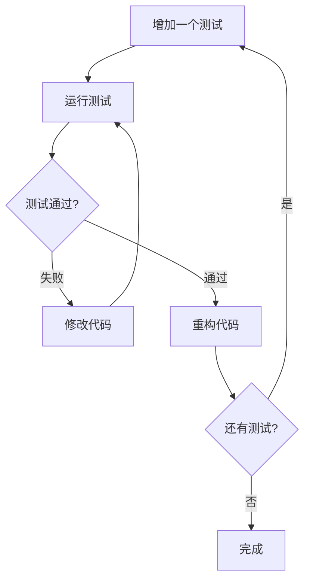

##### TDD两大步骤

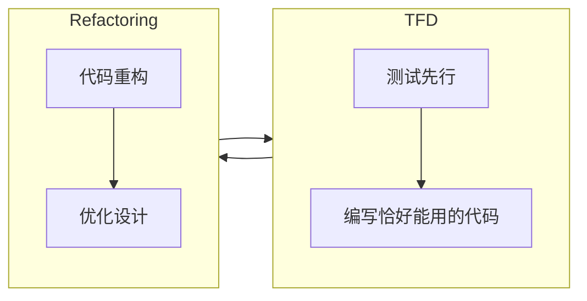

##### 开发方法评估框架

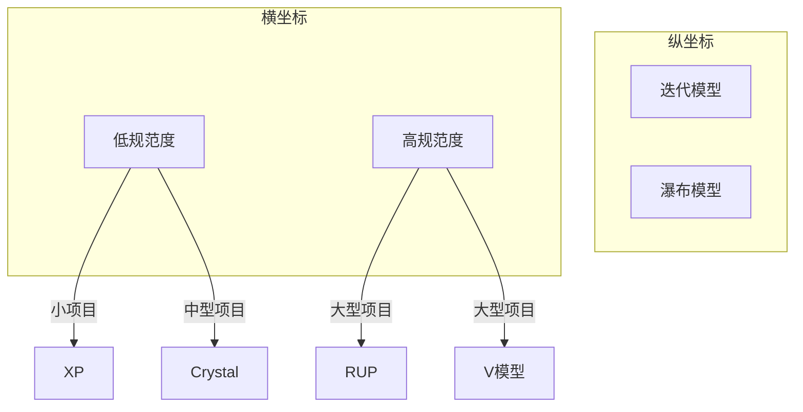

#### 经典金句/数据

> “TDD = TFD + Refactoring”

> “测试驱动开发循环的红-绿-金(重构)三色步骤”

> “金字塔上神像的光芒四射是因为金字塔的伟岸”

> “TDD减少了调试的花费(96%)；TDD提高了代码质量(92%)；TDD可以更好地理解需求(88%)；TDD实践比较困难(82%)；TDD需要开发人员有较高基础(71%)。”

---

## 第I部分：TDD三项修炼之克罗托篇——转动“结构化”和“敏捷”的罗盘

### 第3章：结构化开发方法

#### 核心论点

**问题**：软件开发应遵循什么样的过程框架？不同开发方法的优缺点是什么？

**观点**：软件开发需要规范的过程定义，瀑布、V模型、原型、螺旋、RUP等结构化方法各有适用场景，可通过裁剪适应具体项目。

#### 关键概念/事件

| 概念/事件      | 解释                                                         |
| -------------- | ------------------------------------------------------------ |
| 软件生命周期   | 策划→需求分析→设计→编码→测试→运行维护                        |
| 瀑布模型       | 自上而下、相互衔接的结构化开发过程，强调文档和阶段评审       |
| V模型          | 瀑布的变形，核心是“测试提前”，测试在需求阶段就开始介入       |
| 原型及螺旋模型 | 通过原型迭代降低需求不确定风险，螺旋模型强调风险分析         |
| RUP            | 迭代的、以架构为中心的、用例驱动的开发方法，4阶段（初始、细化、构造、移交） |
| X项目案例      | 采用瀑布模型，因设计、编码一再延期，测试时间不足，系统上线后频繁瘫痪 |

#### 逻辑推演/叙事脉络

本章从软件开发过程的基本概念入手，介绍软件生命周期的6个步骤（策划、需求分析、设计、编码、测试、运行维护）。然后逐一剖析结构化开发方法：

**瀑布模型**：需求→设计→编码→测试，强调阶段评审和文档控制。X项目案例展示了瀑布模型的典型问题：需求后期变更代价大，测试人员最后介入，时间和质量失控。

**V模型**：提出“测试提前”理念，将系统测试、集成测试、单元测试计划分别与需求、概要设计、详细设计对应。实际常用V变形模型（同步进行）。

**原型及螺旋模型**：通过原型与用户沟通确认需求，螺旋模型沿螺线旋转，每圈开发一个更完善的版本，强调风险分析和迭代。

**RUP**：二维结构（横轴时间，纵轴内容），4阶段（初始、细化、构造、移交），用例驱动，架构为中心。包含4+1场景（Use Case、Logic、Process、Implementation、Deployment）。

最后介绍结构化开发方法的质量保证（需求追溯表）和过程裁剪（根据项目规模和团队技能水平裁剪标准过程）。

#### 流程图

##### V模型结构图

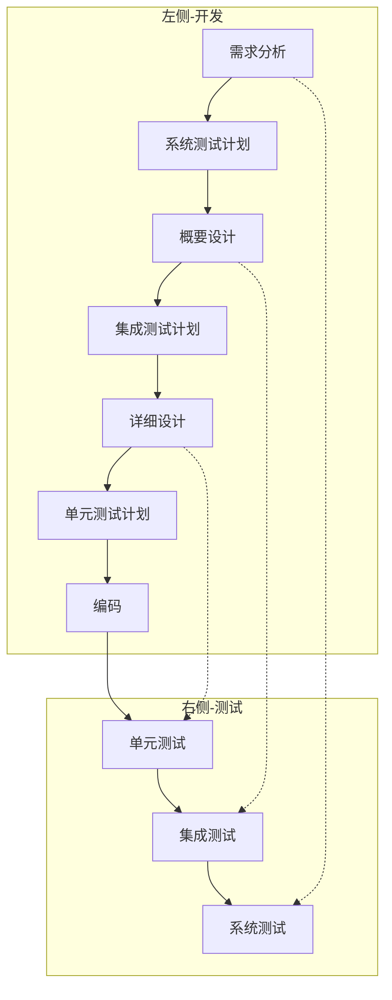

##### RUP过程框架

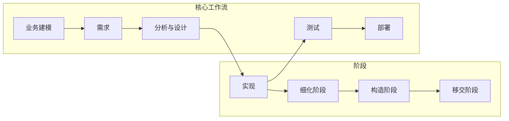

#### 经典金句/数据

> “瀑布模型使得开发中的很多关键成员例如开发、测试处于长期空闲状态。”

> “如果一个类包含了太多其他功能，很明显违反了单一职责原则。”

> “RUP提供了详细的指导、示例和适用于整个软件生命周期的模板。”

---

### 第4章：敏捷开发方法

#### 核心论点

**问题**：敏捷方法如何解决结构化开发方法的局限性？敏捷的核心价值观和实践是什么？

**观点**：敏捷强调“个体和交互胜过过程和工具”，通过XP等核心实践，以持续迭代和快速反馈应对需求变化。

#### 关键概念/事件

| 概念/事件          | 解释                                                         |
| ------------------ | ------------------------------------------------------------ |
| 三个和尚的敏捷故事 | 机制创新（接力挑水）、管理创新（竞争加奖励）、技术创新（竹子引水）→敏捷团队的三种能力 |
| 敏捷宣言           | 个体和交互＞过程和工具；可工作的软件＞面面俱到的文档；客户协作＞合同谈判；响应变化＞遵循计划 |
| XP 13个核心实践    | 现场客户、规划策略、客户测试、小发行版本、简单设计、结对编程、TDD、重构、持续集成、集体代码所有权、编码标准、系统隐喻、可接受的步伐 |
| 面向对象设计原则   | SRP、OCP、LSP、DIP、ISP、REP、CCP、CRP、ADP、SDP、SAP        |

#### 逻辑推演/叙事脉络

本章以“三个和尚的敏捷故事”开篇，引出机制创新、管理创新、技术创新三种能力。然后阐述敏捷宣言的4条价值观和12条原则。

敏捷的七种兵器：SCRUM、Crystal Methods、FDD、ASD、DSDM、轻量型RUP、XP。其中XP最受关注。

XP的13个核心实践详细展开：

- **现场客户**：客户作为团队成员坐在一起
- **规划策略**：发布计划+迭代计划
- **客户测试**：自动化的验收测试
- **小发行版本**：每次迭代发布可运行软件
- **简单设计**：保持设计刚好满足当前功能
- **结对编程**：两人一台机器共同编程
- **测试驱动开发**：测试优先
- **重构**：持续改进设计
- **持续集成**：每天构建多次
- **集体代码所有权**：任何人可修改任何代码
- **编码标准**：统一风格
- **系统隐喻**：对程序运作的共识描述
- **可接受的步伐**：可持续的开发速度

最后阐述TDD与XP的关系：TDD是XP中必须遵行的方法，是XP能够做到每天代码都是Production Code的关键。

#### 流程图

##### XP实践从小范围到整个团队的扩散图

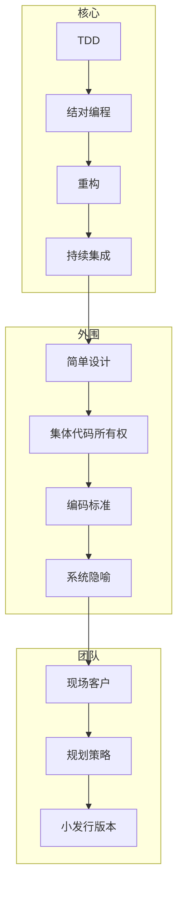

##### TDD在XP中的位置

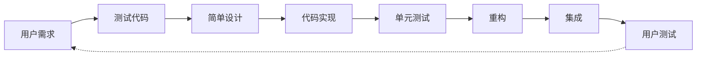

#### 经典金句/数据

> “敏捷开发就是在一个高度协作的环境中，不断地使用反馈进行自我调整和完善。”

> “极限编程的实践是相互支持的，它们会比各自独立时更为强壮。”

> “所有的产品软件都是由两个程序员并排坐在一起，在同一台机器上共同完成的。”

---

### 第5章：开发方法评估，踏入平衡之美自由道路

#### 核心论点

**问题**：如何在结构化方法和敏捷方法之间做出选择？如何为具体项目定制合适的开发过程？

**观点**：开发方法的选择应根据项目规模、技术难度、团队紧密度等因素动态调整，在结构化和敏捷之间找到平衡点。“适合的就是最好的”。

#### 关键概念/事件

| 概念/事件         | 解释                                                         |
| ----------------- | ------------------------------------------------------------ |
| 开发方法评估框架  | 二维坐标：纵轴（瀑布→迭代），横轴（低规范度→高规范度）       |
| 过程裁剪          | 根据项目特点对标准软件过程进行裁剪，形成适合项目的个性化过程 |
| 案例（W项目）     | 需求管理失败导致项目延期，通过界面原型、DENIM工具、平台复用等实践实现快速开发 |
| 原型设计工具DENIM | 可以手绘网页雏形，输出带Link的完整网站，方便与客户沟通确认   |

#### 逻辑推演/叙事脉络

本章提出开发方法的二维评估框架：横坐标是规范度（低→高），纵坐标是开发模型（瀑布→迭代）。不同方法适用于不同项目：

- **低规范度+高迭代**：XP、Crystal → 小规模、技术含量不高的项目
- **高规范度+高迭代**：RUP → 大型复杂项目
- **高规范度+瀑布**：V模型 → 外包业务常用

CMM/CMMI与开发方法的关系：CMM倾向于瀑布，CMMI倾向于迭代。

项目过程裁剪的基本步骤：

1. 项目任务分析
2. 质量目标分解
3. 组织标准软件过程裁剪（根据团队技能水平、项目规模、开发模式）
4. 里程碑及输出工作产品划分

**W项目案例**（需求沟通丛林中的快速开发实践）展示了结构化V模型、原型、迭代以及敏捷方法的综合运用：

- 场景一：欲速则不达，需求规格书直接开发导致返工
- 场景二：原型迭代降低风险
- 场景三：平台级复用加快开发

解决方案：DENIM工具实现界面原型设计，让用户参与确认；PowerDesigner进行数据库设计；平台级代码复用。

#### 流程图

##### 开发方法评估框架

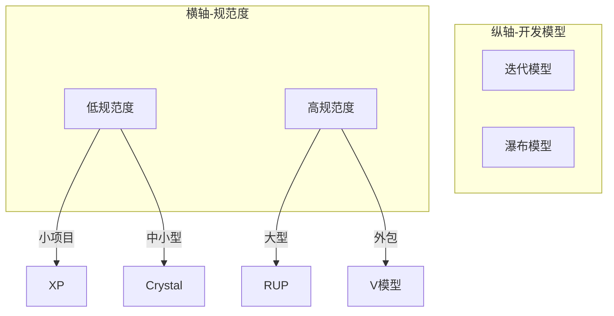

#### 经典金句/数据

> “适合的就是最好的。”

> “沟通形式，我们知道向领导汇报工作以及给客户展示产品时，我们会用图表说话。”

> “界面原型法就是展现用户需求及得到用户确认最理想的方式。”

---

## 第II部分：TDD三项修炼之拉克罗斯篇——单元测试之星火燎原

### 第6章：摘下有色眼镜后的测试

#### 核心论点

**问题**：开发人员应该如何正确理解测试？广义测试与狭义测试的区别是什么？

**观点**：测试不是低水平的重复劳动。软件测试贯穿软件生命周期各个阶段，包括需求分析、概要设计、详细设计以及程序编码。

#### 关键概念/事件

| 概念/事件        | 解释                                                         |
| ---------------- | ------------------------------------------------------------ |
| 99.9%质量的含义  | 每天120个新生儿被错交、每天两架飞机安全不保、今年20000个误开的处方 |
| 广义测试         | 发现并指出软件系统缺陷的整个过程，贯穿软件生命周期           |
| V模型测试活动    | 系统测试计划（需求）、集成测试计划（概要设计）、单元测试计划（详细设计） |
| 系统测试（狭义） | 黑盒测试，检查程序是否符合功能和非功能性需求                 |
| 系统测试类型     | 功能测试、UI测试、性能测试、安全性测试、故障转移测试、配置测试、安装测试、多语种测试等 |

#### 逻辑推演/叙事脉络

本章以“99.9%质量”的数据开篇，引发对质量标准的思考。然后区分广义测试和狭义测试：

**广义测试**：贯穿软件生命周期，测试对象包括需求规格说明、概要设计说明、详细设计说明、源程序。包含相对应的系统测试、集成测试和单元测试。

**狭义测试（系统测试）**：黑盒测试，测试人员完全不考虑程序内部逻辑结构和内部特性，只依据需求规格说明书。

系统测试人员应关注：功能遗漏、数据参数传递、数据结构错误、性能要求、初始化或终止性错误等。

#### 经典金句/数据

> “如果我们把缺陷都解决了，那不是让测试人员失业吗？——我是天才的开发人员，我不会产生有缺陷的程序。”

> “事后控制不如事中控制，事中控制不如事前控制。”

> “测试不是证明软件没有问题，而是证明软件存在错误。”

---

### 第7章：单元测试火种的力量

#### 核心论点

**问题**：单元测试为什么是TDD实践的核心基础？单元测试的经济价值是什么？

**观点**：单元测试是唯一有保证能够代码覆盖率达到100%的测试，是整个软件测试过程的基础和前提。大约80%的错误是在设计阶段之前注入的。

#### 关键概念/事件

| 概念/事件        | 解释                                                         |
| ---------------- | ------------------------------------------------------------ |
| 扁鹊三兄弟故事   | 长兄治病于病情发作之前（事前控制），中兄治病于病情初起之时（事中控制），扁鹊治病于病情严重之时（事后控制） |
| 单元测试任务     | 模块接口测试、局部数据结构测试、独立执行通路测试、错误处理通路测试、边界条件测试 |
| 缺陷发现成本曲线 | 错误发现得越晚，修复费用越高，且呈指数增长                   |
| X项目案例        | 单元测试仅占4%工作量，集成测试和系统测试时间紧张，系统上线后频繁瘫痪 |

#### 逻辑推演/叙事脉络

本章通过扁鹊三兄弟的故事类比测试：单元测试是“事前控制”，性价比最高。

**单元测试的任务**：

1. 模块接口测试（数据能否正确流入/流出）
2. 局部数据结构测试（检查临时存储数据）
3. 独立执行通路测试（每条语句至少执行一次）
4. 错误处理通路测试（预设出错条件）
5. 边界条件测试（极限情况）

**X项目案例**：单元测试仅占4%工作量，编码完成后急于系统测试，测试人员比率小，项目进度和质量失控。

XP中的单元测试：开发过程是由连续的小迭代组成，每一个迭代都是“用户需求→测试代码→简单设计→代码实现→单元测试→重构→集成→用户测试”的过程。“测试先行”原则迫使开发人员从用户角度思考问题。

#### 流程图

##### 无测试 vs 有测试的软件实现过程

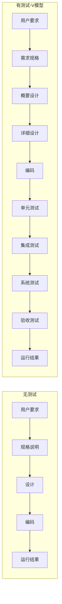

##### 工作量分布图（问题案例）

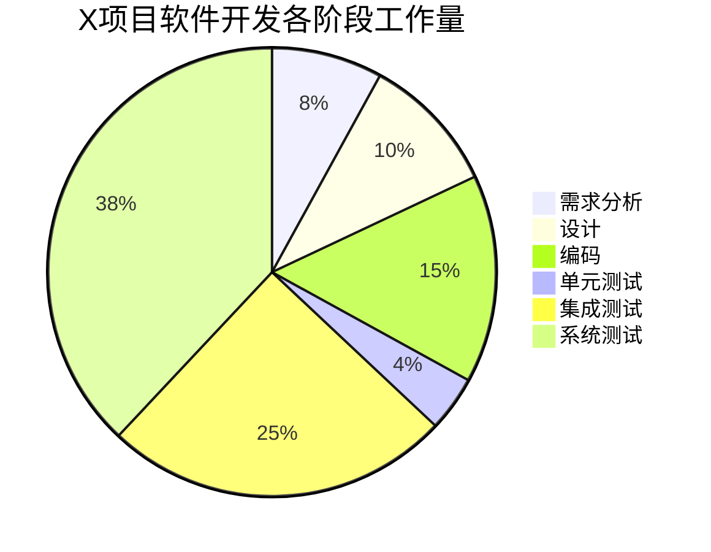

#### 经典金句/数据

> “事后控制不如事中控制，事中控制不如事前控制。”

> “单元测试是唯一有保证能够代码覆盖率达到100%的测试，是整个软件测试过程的基础和前提。”

> “单元测试实际上是把发现和修改bug的工作量前移。”

---

### 第8章：单元测试方法谈

#### 核心论点

**问题**：单元测试有哪些具体方法？如何进行有效的单元测试？

**观点**：单元测试方法包括代码复查（人工检查）、静态测试（不运行程序分析源代码）、动态测试（测试用例驱动运行）。一般以白盒测试为主、黑盒测试为辅。

#### 关键概念/事件

| 概念/事件        | 解释                                                         |
| ---------------- | ------------------------------------------------------------ |
| 代码复查         | 预排（非正式，程序员主导控制讨论）和检查（更正式，小组核对代码） |
| 静态测试         | 通过分析源程序检查正确性，包括代码静态分析、编程规范检查等   |
| 动态测试         | 测试用例驱动下运行被测单元，记录覆盖率                       |
| 黑盒测试         | 从用户观点出发，测试功能是否符合需求                         |
| 白盒测试         | 逻辑驱动测试，必须由程序设计和开发人员完成                   |
| 静态测试关注对象 | 数据结构、算法逻辑、模块接口、参数正确性、出错处理等11项     |

#### 逻辑推演/叙事脉络

本章介绍三种单元测试方法：

**代码复查**：最好在编码完成后、编译和测试之前进行。包含预排（非正式）和检查（更正式）两种。Fagan实验得出10%~30%的系统错误可通过代码复查发现。

**静态测试**：不运行被测程序，通过分析源程序检查正确性。关注算法逻辑正确性、清晰性、规范性、一致性、算法高效性。常用工具：CheckStyle、Logiscrope Audit等。人工静态检查法能够有效发现30%~70%的逻辑设计和编码错误。

**动态测试**：测试用例驱动下运行被测单元。包括白盒测试和黑盒测试。单元测试一般综合两者，以白盒测试为主、黑盒测试为辅。

#### 经典金句/数据

> “代码复查是一种能快速找到缺陷的方法。”

> “经验表明，缺少参数正确性检查的代码是造成软件系统不稳定的主要原因之一。”

> “人工静态检查法能够有效地发现30%~70%的逻辑设计和编码错误。”

> “代码中仍会有大量的隐性错误无法通过视觉检查发现，必须通过跟踪调试法细心分析才能够捕捉到。”

---

### 第9章：单元测试用例设计

#### 核心论点

**问题**：如何设计有效的单元测试用例？测试用例设计的方法和原则是什么？

**观点**：测试用例应由测试输入数据和预期输出结果两部分组成，包含合理的输入条件和不合理的输入条件。设计方法包括黑盒测试用例设计（等价类、边界值、因果图、错误推测）和白盒测试用例设计（逻辑覆盖、基本路径）。

#### 关键概念/事件

| 概念/事件      | 解释                                                     |
| -------------- | -------------------------------------------------------- |
| 测试用例三要素 | 测试数据、支撑程序（驱动+桩）、期望结果                  |
| 等价类法       | 将众多可能输入值划分为等价类，每类选一个代表             |
| 边界值法       | 等价类划分的扩展，选取边界值（正好小于、等于、大于界限） |
| 因果图法       | 考虑输入条件之间组合，画出因果图→判定表→测试用例         |
| 错误推测法     | 靠经验和直觉推测可能存在的错误                           |
| 逻辑覆盖法     | 语句覆盖、分支覆盖、条件覆盖、组合条件覆盖、循环覆盖     |
| 基本路径法     | 基于程序控制流图，导出基本可执行路径集合                 |

#### 逻辑推演/叙事脉络

本章系统讲解测试用例设计方法：

**黑盒测试用例设计**：

- 等价类法：根据功能项的输入输出划分等价类
- 边界值法：选取边界值（数组的第一个和最后一个、循环的第0次和最后一次）
- 因果图法：原因→因果图→判定表→测试用例
- 错误推测法：列举可能错误，针对性编写检查例子

**白盒测试用例设计**：

- 逻辑覆盖法：语句覆盖（100%）、分支覆盖（每个分支都执行）、条件覆盖、组合条件覆盖、循环覆盖（0次、1次、2次、m次、n-1次、n次、n+1次）
- 基本路径法：控制流图→环路复杂性→基本路径集→测试用例

**测试驱动和桩设计**：驱动（Driver）调用被测单元，桩（Stub）仿真被调模块。策略包括自顶向下（无需驱动，桩工作量大）、自底向上（易于黑盒测试，驱动工作量大）、完全隔离（测试覆盖率高，驱动桩工作量大）。

#### 流程图

##### 基本路径法控制流图示例

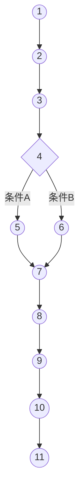

##### 驱动(Driver)和桩(Stub)关系

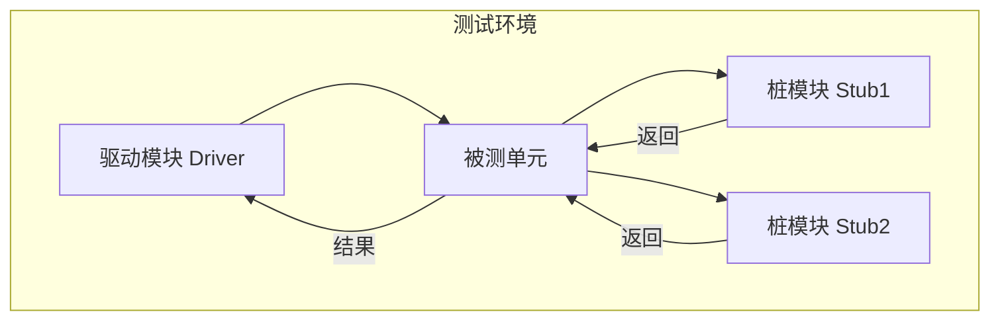

#### 经典金句/数据

> “一个好的测试用例在于能够发现至今没有发现的错误。”

> “测试用例决不是一个一个的孤岛，而是按照逻辑关系组合到一起，由数据构成的逻辑包。”

> “覆盖率测试指标实践要求：分支覆盖率要求100%，语句覆盖率100%。”

---

### 第10章：单元测试工具实践图谱

#### 核心论点

**问题**：XUnit系列单元测试工具（JUnit、CppUnit、NUnit）如何使用？有什么经验技巧？

**观点**：XUnit是测试驱动开发的基础框架，通过TestCase、TestSuite、TestRunner三要素组织测试，遵循“setup→测试方法→teardown”的处理流程。

#### 关键概念/事件

| 概念/事件        | 解释                                                         |
| ---------------- | ------------------------------------------------------------ |
| XUnit家族        | JUnit(Java)、CppUnit(C++)、CUnit(C)、NUnit(.NET)、DBUnit(数据库)、DUnit(Delphi)、PyUnit(Python)等 |
| 测试框架核心概念 | TestCase（测试用例）、TestSuite（测试套）、TestRunner（测试执行器）、Fixture（测试装置） |
| XUnit处理流程    | setup() → try{测试函数()} catch{异常处理} → teardown()       |
| JUnit运行模式    | text ui、swing ui、awt ui三种图形/文本格式                   |
| TestSuite条件    | 测试用例必须是公有类、继承TestCase、测试方法必须是公有void、以test开头、无参数 |
| CppUnit运行模式  | TextUi、QtUi、MfcUi                                          |
| NUnit            | .net单元测试工具，通过[TestFixture]和[Test]属性标记          |

#### 逻辑推演/叙事脉络

本章详细介绍三种主流XUnit工具：

**JUnit**：由Erich Gamma和Kent Beck编写。核心包junit.framework。运行模式有三种：text ui、swing ui、awt ui。通过TestSuite可以聚合多个TestCase。JUnit经验宝典：不要用构造函数初始化，用setUp/tearDown；测试要小、执行快；避免编写有副作用的TestCase。

**CppUnit**：面向C++的测试框架。需要配置include路径和lib路径。使用CPPUNIT_TEST_SUITE宏定义测试。

**NUnit**：.net单元测试工具。通过[TestFixture]标记测试类，[Test]标记测试方法，[SetUp]和[TearDown]标记初始化和清理。

数据库单元测试：DBUnit用于数据库测试，Mock Object用于模拟对象。

#### 流程图

##### XUnit处理流程

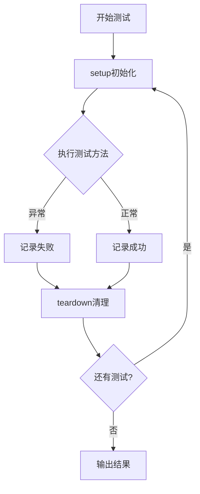

##### JUnit TestSuite组织

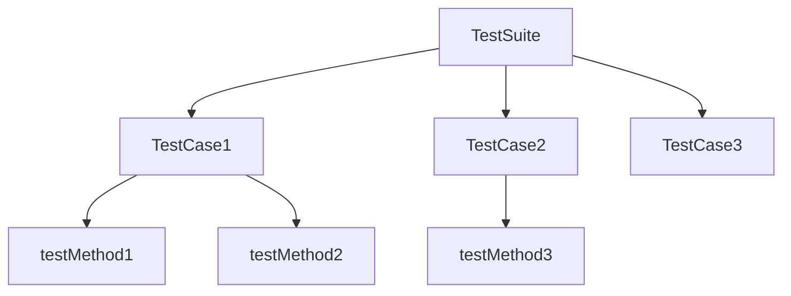

#### 经典金句/数据

> “测试要尽可能地小，执行速度快。”

> “不要用 TestCase 的构造函数初始化，而要用 setUp() 和 tearDown() 方法。”

> “避免编写有副作用的 TestCase。”

---

### 第11章：自动化测试与每日构建

#### 核心论点

**问题**：如何实现自动化构建和持续集成？自动化测试的价值是什么？

**观点**：自动化构建和每日构建是持续集成的核心。通过Ant、CCNet等工具实现“拉式”系统，每次代码签入后自动构建和测试，确保集成问题尽早暴露。

#### 关键概念/事件

| 概念/事件          | 解释                                     |
| ------------------ | ---------------------------------------- |
| 软件构建和发布     | 从源代码创建可执行程序的过程             |
| 自动化构建意义     | 确保每次修改后系统可编译、可运行、可测试 |
| 持续集成           | 频繁集成代码，避免“大爆炸式集成”         |
| .NET自动化构建工具 | CCNet（CruiseControl.NET）+ MSBuild      |
| Java自动化构建工具 | Ant、Maven                               |

#### 逻辑推演/叙事脉络

本章阐述自动化测试与每日构建的重要性：

**软件构建和发布**：构建是软件生命周期中的核心活动，贯穿开发到发布的整个过程。每日构建是行业最佳实践，持续集成则更进一步。

**自动化构建的意义**：

- 保证系统随时可以发布
- 立即发现集成问题
- 避免“集成地狱”

**.NET自动化构建实践**：

- CCNet（CruiseControl.NET）：持续集成服务器
- MSBuild：.NET平台的构建工具
- NAnt：.NET平台的Ant移植

**Java自动化构建工具**：Ant是Java平台最流行的构建工具，通过build.xml定义构建任务。

#### 流程图

##### 自动化构建流程

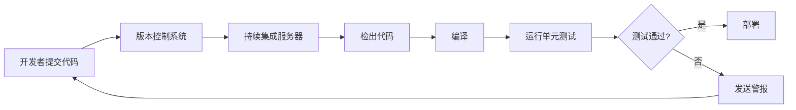

##### Ant构建脚本结构

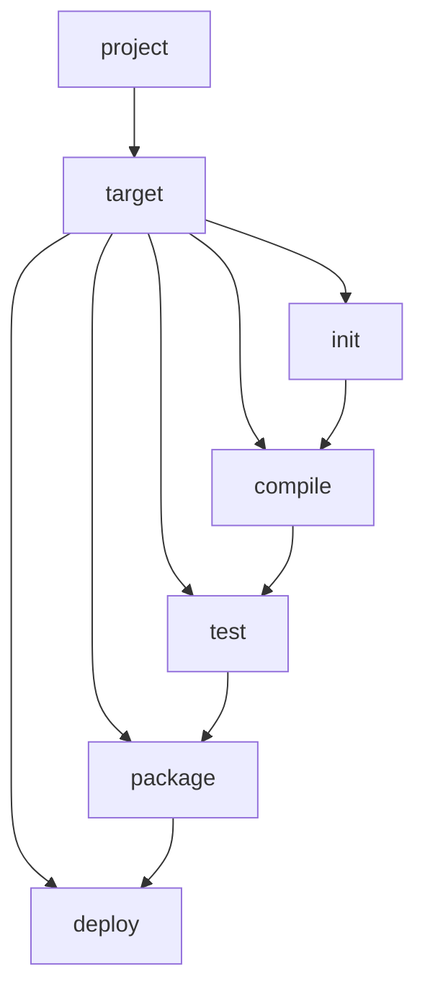

#### 经典金句/数据

> “我们说每日建构版本是为弱者提供的：XP团队每天都要构建系统很多次。”

> “极少进行集成会给软件项目带来一系列的问题。”

---

### 第12章：单元测试管理实践

#### 核心论点

**问题**：如何系统化管理单元测试活动？单元测试的策略和退出准则是什么？

**观点**：单元测试需要制定测试方案、测试策略和退出准则。单元测试计划应根据软件开发计划制定，测试用例设计根据详细设计完成。

#### 关键概念/事件

| 概念/事件        | 解释                                       |
| ---------------- | ------------------------------------------ |
| 单元测试方案     | 明确测试目标、范围、方法、工具、资源、进度 |
| 单元测试策略     | 自顶向下、自底向上、孤立法、三明治法       |
| 单元测试退出准则 | 测试完成标准，如覆盖率、缺陷率等           |
| 案例描述         | 数据列表分页功能的单元测试全过程           |

#### 逻辑推演/叙事脉络

本章介绍单元测试的系统化管理：

**单元测试方案**：制定测试计划、测试用例设计、测试执行、测试评价、测试总结的完整流程。

**单元测试策略**：

- 自顶向下：先测上层模块，下层用桩
- 自底向上：先测底层模块，上层用驱动
- 孤立法：每个模块独立测试
- 三明治法：结合自顶向下和自底向上

**单元测试退出准则**：测试覆盖率要求、所有测试用例通过、严重缺陷全部修复等。

**案例**：数据列表分页功能的单元测试全过程，包括确定测试目标、制定测试计划、测试用例设计、测试总结报告。

#### 经典金句/数据

> “软件测试最终的目的是保证软件质量，因此软件测试的流程需要根据软件开发流程的各个阶段具体任务来制定。”

> “单元测试计划是根据软件开发计划，项目进度来制定单元测试的计划。”

> “测试评价是度量软件测试执行效率和有效性的过程。”

---

## 第III部分：TDD三项修炼之阿特罗波斯篇——练就重构的精妙剑术

### 第13章：重构时机

#### 核心论点

**问题**：何时应该进行重构？如何识别需要重构的信号？

**观点**：重构是持续改进代码设计的过程，通过识别代码中的“腐化味”（重复代码、过长方法、过深嵌套等）触发重构。

#### 关键概念/事件

| 概念/事件    | 解释                                           |
| ------------ | ---------------------------------------------- |
| 重构定义     | 改变代码的结构，而不改变代码的行为             |
| 重构触发时机 | 增加功能时、修复bug时、代码复审时              |
| 代码腐化味   | 重复代码、过长方法、过深嵌套、大类、参数过多等 |
| 童子军规则   | 离开营地时比发现它的时候更干净                 |

#### 逻辑推演/叙事脉络

本章阐述重构的时机识别：

**什么是重构**：改变代码结构而不改变外部行为。重构不是随意修改，而是有纪律的、小步快跑的持续改进。

**重构的触发时机**：

- 增加新功能之前：先重构使添加更容易
- 修复bug时：理解代码过程中发现可改进之处
- 代码复审时：团队共同发现重构机会

**需要重构的信号**：

- 重复代码：相同的代码出现在多处
- 过长方法：超过一屏的方法难以理解
- 过深嵌套：if-else层次超过3层
- 大类：承担了过多职责
- 参数过多：超过3个参数
- 注释过多：注释在解释混乱的代码

#### 经典金句/数据

> “美国童子军有一个简单的规则：离开野营地时比你发现它的时候更干净。”

> “重构是指改变代码的结构，而不是代码的行为。”

> “如果计划要做的重构相当大，以至于要停掉产品负责人需要的新功能，那么这个重构本身可能就应该放入产品Backlog。”

---

### 第14章：重构塑型

#### 核心论点

**问题**：如何具体执行重构？有哪些常见的重构方法？

**观点**：重构方法包括提取方法、移动方法、重命名、引入解释变量等，每种方法都有特定的应用场景和操作步骤。

#### 关键概念/事件

| 概念/事件    | 解释                                           |
| ------------ | ---------------------------------------------- |
| 提取方法     | 将一段代码提取为独立方法，用方法名解释代码意图 |
| 移动方法     | 将方法移动到更合适的类中                       |
| 重命名       | 给变量、方法、类起更清晰的名字                 |
| 内联         | 将简单方法的内容内联到调用处                   |
| 引入解释变量 | 用有意义的变量名解释复杂表达式                 |

#### 逻辑推演/叙事脉络

本章介绍具体的重构方法：

**提取方法（Extract Method）**：将一段代码提取为独立方法，用方法名解释代码意图。这是最常用的重构方法。

**移动方法（Move Method）**：当方法使用的数据更多地在另一个类中时，将方法移动到那个类。

**重命名（Rename）**：给变量、方法、类起更清晰的名字。好的命名是最好的文档。

**内联（Inline）**：当方法体比方法名更能说明意图时，将方法内联到调用处。

**引入解释变量（Introduce Explaining Variable）**：用有意义的变量名解释复杂表达式。

重构的规律之美：重构不是随意修改，而是遵循一定模式的有序操作。

#### 经典金句/数据

> “重构的规律之美：代码应该是亮堂的，不应该有黑暗死角。”

> “好的命名是最好的文档。”

> “重构是软件开发中不可或缺的一部分——编码永远没有真正意义上的‘结束’。”

---

### 第15章：意图导向编程

#### 核心论点

**问题**：什么是意图导向编程？它与TDD的关系是什么？

**观点**：意图导向编程主张先写测试代码，用测试表达意图，然后写实现代码满足测试。TDD正是意图导向编程的实践体现。

#### 关键概念/事件

| 概念/事件      | 解释                                   |
| -------------- | -------------------------------------- |
| 意图导向编程   | 先写测试代码，考虑如何使用，再写实现   |
| 测试优先       | 在写产品代码之前先写单元测试           |
| 红-绿-重构循环 | 测试驱动开发的标准节奏                 |
| YANGI原则      | 不是真正需要的时候，不应该实现这个功能 |

#### 逻辑推演/叙事脉络

本章阐述意图导向编程与TDD的关系：

**意图导向编程**：先写测试代码，考虑如何使用、如何测试，然后写实现代码满足测试。这与传统“先实现后测试”相反。

**TDD正是意图导向编程的实践**：

1. 写一个测试（表达意图）
2. 运行测试，失败（红）
3. 写最少代码使测试通过（绿）
4. 重构（金）
5. 重复

**YANGI原则**：You Aren't Gonna Need It。不是真正需要的时候，不应该实现这个功能。

**井字棋游戏案例**：通过TDD一步步设计，从Player类简化到简单的布尔类型属性，展示了TDD如何防止过度设计。

#### 流程图

##### 测试驱动开发循环


#### 经典金句/数据

> “好的设计并不意味着需要更多的类。”

> “YANGI原则：你可能永远都不需要它。”

> “任何一个设计都可以被改进。”

---

## TDD升华篇

### 第16章：丛林中哲人的足迹

#### 核心论点

**问题**：如何在用户故事、CRC卡、测试用例、重构频率之间建立整体实践框架？

**观点**：User Story是需求描述工具，CRC卡是设计工具，验收测试是验证工具，重构是持续改进工具。四者形成完整的TDD实践闭环。

#### 关键概念/事件

| 概念/事件             | 解释                                             |
| --------------------- | ------------------------------------------------ |
| User Story            | 描述系统外在行为的需求工具，格式：名称+事件序列  |
| 例事点（Story Point） | 估算用户故事工作量的单位                         |
| CRC卡                 | Class-Responsibility-Collaboration，快速设计工具 |
| 验收测试              | 验证系统是否实现用户故事的测试                   |
| 迭代周期计划编制      | 根据团队实际速率调整迭代内容                     |

#### 逻辑推演/叙事脉络

本章建立TDD实践的整体框架：

**User Story**：从客户角度描述系统外在行为，忽略内部动作。例事点用于估算工作量，通过第一个迭代周期测定团队实际速率。

**CRC卡**：Class-Responsibility-Collaboration，每张卡代表一个类，包含类名、职责、协作者。卡片空间小，防止给类太多职责（不超过4个）。主要用于探索设计阶段，完成后可丢弃。

**验收测试（Acceptance Test）**：测试系统外部行为，忽略内部实现。自动验收测试通过Command模式实现，测试文件可以让客户看懂。

**重构频率**：每次完成功能后、每次修改代码前都应该考虑重构。

#### 流程图

##### 发布计划与迭代计划关系

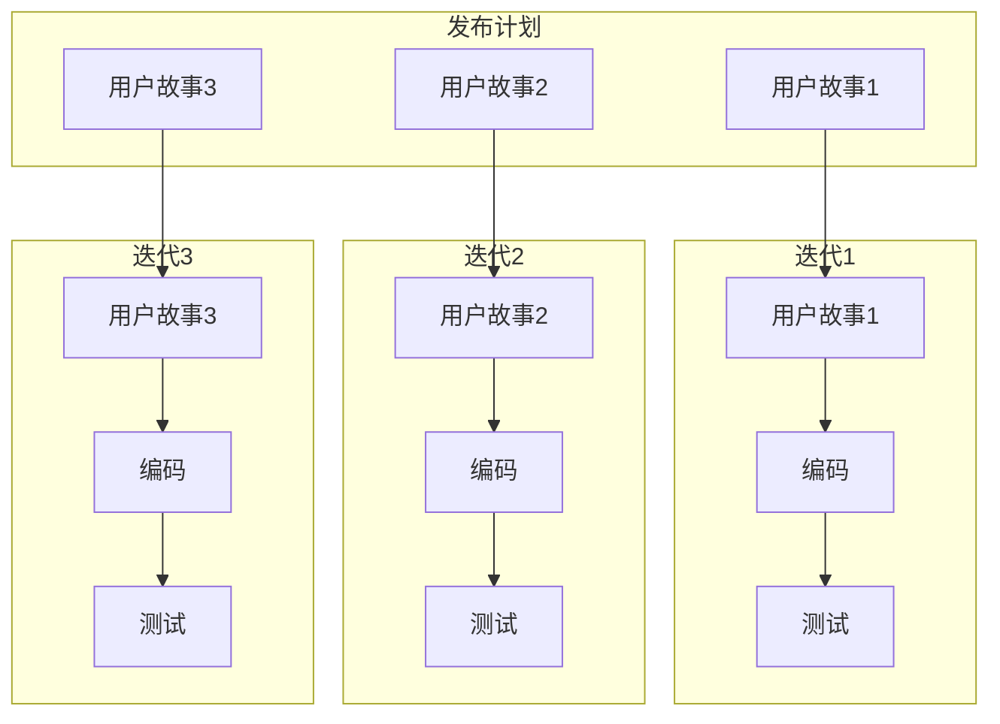

#### 经典金句/数据

> “一个用户例事只是以客户能够明白的方式，描述了一个系统的外在行为，它完全忽略了系统的内部动作。”

> “CRC卡主要是用来快速的组织设计。我们不应该花很长的时候在做CRC卡上。”

> “验收测试属于客户的，我们没有权利决定验收测试的内容。单元测试属于我们。”

---

## 演练篇

### 第17章：演练（Java/C# TDD实践）

#### 核心论点

**问题**：如何通过具体编程语言实践TDD？Java和C#环境下TDD的典型流程是什么？

**观点**：通过Java和C#的TDD演练，展示“先写测试→写实现→重构”的标准流程，重点在于测试用例设计而非具体语言语法。

#### 关键概念/事件

| 概念/事件    | 解释                                     |
| ------------ | ---------------------------------------- |
| Java TDD演练 | 使用JUnit框架，从测试开始编写代码        |
| C# TDD演练   | 使用NUnit框架，[TestFixture]和[Test]属性 |
| 红-绿-重构   | 标准TDD节奏                              |
| 测试用例设计 | 先设计测试用例再写实现代码               |

#### 逻辑推演/叙事脉络

本章通过具体的编程语言演练TDD实践：

**Java TDD演练**：使用JUnit框架，从创建测试类开始，先写测试方法（assert断言），再写实现代码使测试通过，最后重构。

**C# TDD演练**：使用NUnit框架，通过[TestFixture]标记测试类，[Test]标记测试方法，[SetUp]和[TearDown]标记初始化和清理。

核心要点：

1. 先写测试，让测试失败
2. 写最少代码让测试通过
3. 重构代码
4. 重复循环

#### 经典金句/数据

> “在写实现代码前，运行了一个测试，然后看着它通不过。”

> “如果我们弄出了一个bug，它会马上被发现，然后很容易定位到出错源。”

---

### 第18章：再次演练，一个真实的项目

#### 核心论点

**问题**：如何在真实项目中应用TDD？TDD实战中需要注意什么？

**观点**：通过课程选修系统的真实案例，展示TDD在复杂业务逻辑中的应用。关键是将大任务拆分为小测试，逐个实现。

#### 关键概念/事件

| 概念/事件           | 解释                                                         |
| ------------------- | ------------------------------------------------------------ |
| EnrollmentSet类设计 | 选修课程功能的核心类，需要检查学生注册、课程空位、交费正确性 |
| 测试优先设计        | 用接口隔离外部依赖（StudentRegistryChecker、ClassSizeGetter、ReservationCounter等） |
| TODO列表管理        | 记录待实现的测试，防止遗漏                                   |
| 调用日志测试        | 使用StringBuffer记录方法调用顺序                             |

#### 逻辑推演/叙事脉络

本章通过课程选修系统的完整TDD过程展示真实项目实践：

**用户故事**：学生可以选修课程，需检查学生已注册、课程有空位、交费正确、考虑父课程选修情况、考虑预订情况。

**TDD实施步骤**：

1. 创建Enrollment和EnrollmentSet的骨架
2. 先写最简单的测试（addToStorage）
3. 逐步增加验证测试（学生注册检查、课程空位检查、预订检查、交费检查）
4. 使用接口隔离外部依赖（StudentRegistryChecker、ClassSizeGetter、ReservationCounter、CourseFeeLookup）
5. 使用调用日志验证方法调用顺序
6. 通过TODO列表管理未完成功能

**关键技巧**：

- 不要在测试中包含多余的数据
- 用接口代替具体实现，便于单元测试
- 不要一次性将所有测试弄坏（先保留旧构造函数）
- 每做完一个小改动就要运行所有测试
- 任何时候脑中都要有完整的概念

#### 流程图

##### EnrollmentSet验证流程

```mermaid
graph TD
    A[add(enrollment)] --> B[assertStudentRegistered]
    B --> C[assertHasSeat]
    C --> D[assertPaymentCorrect]
    D --> E[addToStorage]
    
    B --> B1[检查学生ID是否存在]
    C --> C1[检查课程空位]
    C1 --> C2[检查已选修人数]
    C1 --> C3[检查预订人数]
    D --> D1[检查交费金额]
```

##### 测试驱动设计中的接口隔离

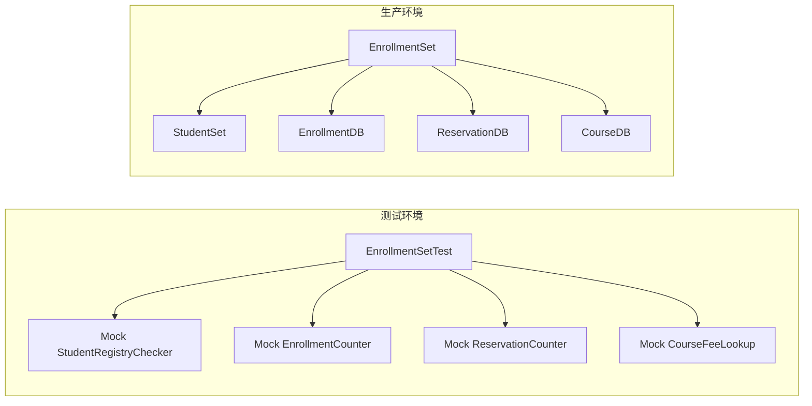

#### 经典金句/数据

> “不要在测试里面包含多余的数据。”

> “不要一次性将所有的测试弄坏。”

> “任何时候，脑中都要有个完整的概念。”

> “经常的换搭档是好事。”

---

## 豁然开朗篇

### 第19章：走出TDD丛林

#### 核心论点

**问题**：TDD实践的核心经验是什么？如何真正走出TDD实践丛林？

**观点**：走出TDD丛林需要坚持三项修炼（结构化与敏捷方法论、单元测试、重构），并在团队中建立持续改进的文化。

#### 关键概念/事件

| 概念/事件    | 解释                                               |
| ------------ | -------------------------------------------------- |
| 三项修炼总结 | 方法论基础（指南针）→单元测试（火种）→重构（宝剑） |
| 走出丛林条件 | 掌握基础、坚持实践、持续改进                       |
| 团队文化建设 | 结对编程、代码复查、持续集成、共享知识             |

#### 逻辑推演/叙事脉络

本章是全书的总结，呼应开篇的武士寻找TDD神火的故事。

**三项修炼回顾**：

1. **克罗托篇**：结构化与敏捷方法论基础——指引方向的罗盘
2. **拉克罗斯篇**：单元测试与自动化测试——点燃希望的火种
3. **阿特罗波斯篇**：重构的修炼——手中的宝剑

**走出丛林的核心条件**：

- 掌握必要的基础知识和技能
- 坚持TDD的“红-绿-重构”节奏
- 建立持续改进的团队文化
- 使用自动化测试工具支撑
- 进行代码复查和结对编程

**TDD的价值重申**：

- 规范需求规格，避免镀金
- 建立可持续构建的测试框架
- 测试框架成为设计文档
- 建立质量保证框架
- 提高开发ROI

#### 经典金句/数据

> “一灯能除千年暗，一智能灭万年愚。”——慧能，中国禅宗第6代祖师

> “一个重大的错误应该被当作是一次学习而不是指责他人的机会。”

> “指责不会修复bug。把矛头对准问题的解决办法，而不是人。”

> “提供你和团队学习的更好平台。通过午餐会议可以增进每个人的知识和技能。”

---

## 附录

### 附录A：某公司的系统测试流程

（PDF中此部分内容不完整，附录A列出了系统测试流程图和工作模板说明）

**主要内容**：

- 系统测试计划
- 测试用例设计
- 测试执行
- 缺陷跟踪
- 测试报告

### 附录B：测试过程中的各种文档

测试过程中需要产生的文档类型：

- 测试计划
- 测试用例
- 测试日志
- 缺陷报告
- 测试总结报告

### 附录C：以C++/C为例的代码审查表

代码审查检查表包含：

- 数据结构使用是否正确
- 算法逻辑正确性
- 模块接口正确性
- 参数正确性检查
- 出错处理
- SQL语句正确性
- 常量/全局变量使用
- 命名规范
- 代码风格
- 神秘数字处理
- 代码优化
- 注释完整性

### 参考文献

- 《程序员》杂志相关文章
- 敏捷开发相关书籍
- 单元测试相关技术资料
- JUnit、CppUnit、NUnit官方文档

---

> 说明：本总结基于PDF识别内容整理。部分图表（如详细的测试流程图、附录完整内容）因PDF识别限制，未能100%还原，但核心逻辑已保留。

---

**文档结束**

