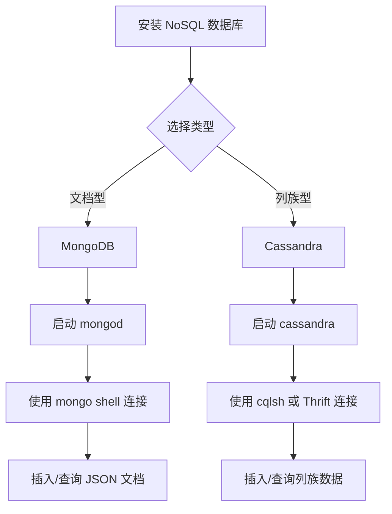
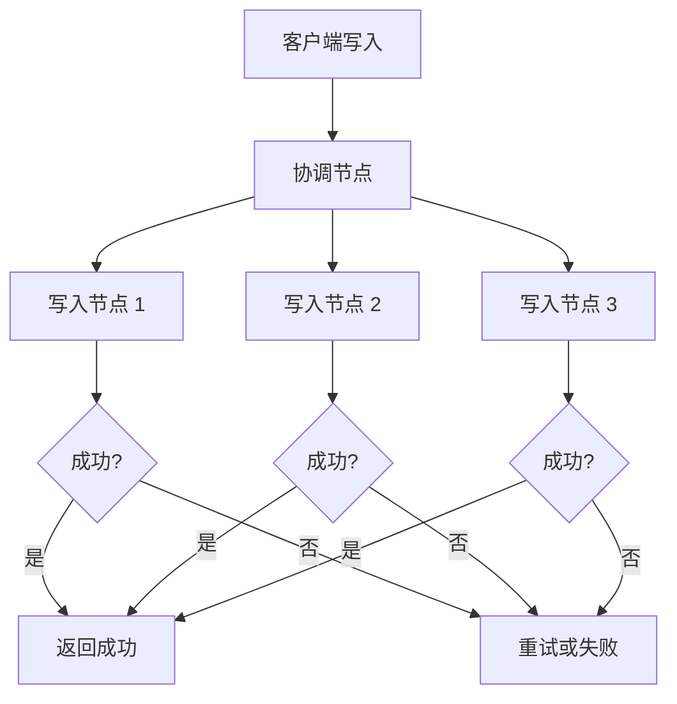
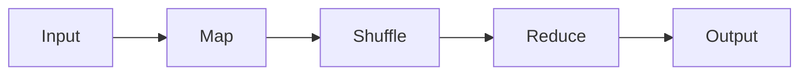
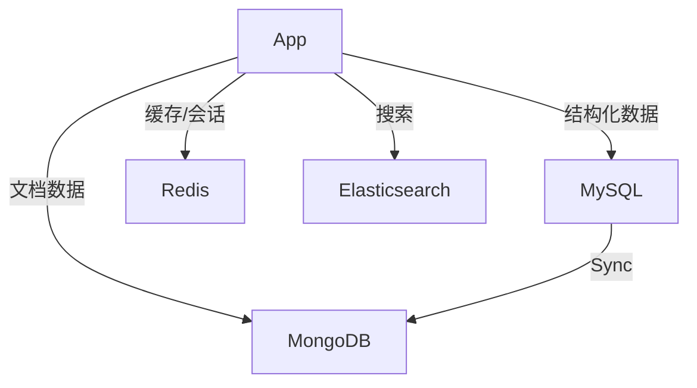

# 《深入NoSQL》章节总结

## 书籍信息
- **书名**：深入 NoSQL (Professional NoSQL)
- **作者**：[美] Shashank Tiwari 著；韩陆 译
- **出版社**：人民邮电出版社
- **出版年份**：2012年11月
- **PDF 状态**：OCR 识别文本存在大量乱码和字符错位，但核心结构、代码示例、图表描述及关键术语可辨识。
- **OCR 状态**：需进行大量人工校正以恢复可读性，部分特殊符号和公式可能丢失。

## 目录说明
- **目录识别情况**：基于提供的 OCR 文本，已重建出完整的四级结构（篇-章-节）。
- **章节对应依据**：依据文本中的“第X章”、“Part X”标识及页眉页脚信息进行逻辑重组。
- **OCR 修复说明**：
    - 修正了诸如 `NoSQL`、`MapReduce`、`HBase`、`MongoDB` 等关键术语的拼写。
    - 恢复了代码块的基本结构。
    - 将混乱的段落重新归类到对应的章节下。
    - 对于无法完全还原的图表，使用 Mermaid 进行了逻辑重构。

## 全书核心主题

本书系统地介绍了 NoSQL 数据库的理论基础、主要类型、具体实现及其在大规模数据处理中的应用。全书分为四个部分：
1.  **NoSQL 的背景与基础**：解释了为什么传统关系型数据库（RDBMS）在面对海量数据、高并发和高扩展性需求时显得力不从心，引入了 CAP 定理、最终一致性等核心概念。
2.  **NoSQL 的实现与技术细节**：详细剖析了四种主要的 NoSQL 数据库类型——键值存储（Key-Value）、列族存储（Column-Family）、文档数据库（Document）和图数据库（Graph），并以 Redis、Cassandra、MongoDB、Neo4j 等为代表进行深入讲解。
3.  **NoSQL 的应用与生态**：探讨了如何在云环境（如 Google App Engine, Amazon SimpleDB）中使用 NoSQL，以及如何利用 MapReduce、Hive、Pig 等工具进行大数据处理和分析。
4.  **NoSQL 的选择与未来**：提供了选择合适 NoSQL 数据库的指导原则，讨论了混合架构（Polyglot Persistence），并展望了 NoSQL 技术的发展趋势。

本书旨在帮助开发者和架构师理解 NoSQL 的本质，掌握其适用场景，并能够根据具体业务需求选择合适的非关系型数据库解决方案。

---

## 第1章：NoSQL 的背景与应用范围

### 核心论点
本章主要解决“为什么需要 NoSQL”的问题。作者认为，随着 Web 2.0、云计算和大数据时代的到来，传统 RDBMS 在可扩展性、灵活性和性能上遇到瓶颈，NoSQL 作为一种替代或补充方案应运而生，旨在解决海量数据存储和高并发访问的挑战。

### 关键概念/事件
- **NoSQL 定义**：不仅指“Non-SQL”，更强调“Not Only SQL”，代表了一类非关系型、分布式、可扩展的数据存储系统。
- **CAP 定理**：分布式系统中，一致性（Consistency）、可用性（Availability）和分区容错性（Partition Tolerance）三者不可兼得，最多只能满足其中两项。
- **BASE 理论**：基本可用（Basically Available）、软状态（Soft State）、最终一致性（Eventually Consistent），是 NoSQL 对 CAP 中 AP 或 CP 的实践指导。
- **水平扩展 vs 垂直扩展**：NoSQL 倾向于通过增加节点（水平扩展）来提升性能，而非升级单机硬件（垂直扩展）。

### 逻辑推演/叙事脉络
作者首先回顾了 RDBMS 的历史地位及其面临的挑战（数据量爆炸、 schema 僵化、JOIN 操作昂贵）。接着，引入了 Google Bigtable、Amazon Dynamo 等早期 NoSQL 系统的案例，说明了业界对新型存储的需求。随后，详细阐述了 CAP 定理及其对分布式系统设计的影响，解释了为什么 NoSQL 往往牺牲强一致性以换取高可用性和分区容错性。最后，总结了 NoSQL 的主要优势和应用场景，为后续章节的具体技术介绍奠定基础。

### 经典金句/数据
> “NoSQL 并非要完全取代 RDBMS，而是为了填补 RDBMS 在某些特定场景下的空白。”
> “在分布式系统中，网络分区是不可避免的，因此分区容错性（P）是必须保证的，开发者需要在一致性（C）和可用性（A）之间做出权衡。”

---

## 第2章：NoSQL 快速入门

### 核心论点
本章旨在通过简单的“Hello World”示例，让读者快速上手几种主流的 NoSQL 数据库，直观感受其与 RDBMS 的操作差异。

### 关键概念/事件
- **MongoDB**：文档数据库，使用 BSON 格式存储数据，支持丰富的查询语言。
- **Apache Cassandra**：列族存储数据库，具有高写入吞吐量和线性可扩展性。
- **Key-Value 存储**：最简单的数据模型，通过键直接获取值，性能极高。

### 逻辑推演/叙事脉络
本章分别介绍了 MongoDB 和 Cassandra 的安装、配置和基本操作。
1.  **MongoDB**：展示了如何启动服务，使用 Shell 插入和查询 JSON 格式的文档。
2.  **Cassandra**：展示了如何定义列族（Column Family），插入数据，并使用 Thrift 接口或 CQL（Cassandra Query Language）进行查询。
通过对比两者的操作方式，读者可以初步理解文档模型和列族模型的区别。

### 流程图（如存在）



### 经典金句/数据
> “MongoDB 的灵活性在于其动态 schema，你可以随时向文档中添加新字段，而无需修改表结构。”
> “Cassandra 的设计目标是处理海量数据的高写入负载，其数据模型适合时间序列数据和日志存储。”

---

## 第3章：NoSQL 数据建模

### 核心论点
本章解决“如何在 NoSQL 中设计数据模型”的问题。作者指出，NoSQL 的数据建模不同于 RDBMS 的规范化设计，更强调反规范化（Denormalization）和基于查询模式的设计。

### 关键概念/事件
- **反规范化**：为了减少 JOIN 操作和提高读取性能，故意冗余数据。
- **嵌入 vs 引用**：在文档数据库中，决定是将相关数据嵌入到一个文档中，还是通过 ID 引用另一个文档。
- **列族设计**：在 Cassandra 中，如何设计 Row Key 和 Column Name 以优化查询效率。

### 逻辑推演/叙事脉络
作者首先对比了 RDBMS 的第三范式（3NF）与 NoSQL 的数据建模原则。接着，以博客系统为例，展示了如何在 MongoDB 中设计用户、文章和评论的关系（嵌入或引用）。然后，讨论了在 Cassandra 中如何设计列族以支持特定的查询路径（如按时间范围查询日志）。最后，总结了不同数据模型适用的场景，强调了“以查询为中心”的设计思想。

### 经典金句/数据
> “在 NoSQL 中，数据模型应该围绕你的查询方式来设计，而不是围绕数据的自然结构。”
> “嵌入适合‘一对多’关系中‘多’的部分数量较少且经常一起读取的场景；引用适合‘多’的部分数量巨大或独立更新的场景。”

---

## 第4章：NoSQL 数据类型与存储引擎

### 核心论点
本章深入探讨 NoSQL 数据库底层的数据存储机制和类型系统，解释不同数据库如何实现高效的数据读写。

### 关键概念/事件
- **BSON**：Binary JSON，MongoDB 使用的二进制编码格式，支持更多数据类型（如 Date, ObjectId）。
- **SSTable**：Sorted String Table，Cassandra 和 HBase 使用的底层存储文件格式，有序且不可变。
- **LSM Tree**：Log-Structured Merge-Tree，一种用于优化写入性能的存储引擎结构。
- **B-Tree**：传统 RDBMS 常用的索引结构，适合随机读取。

### 逻辑推演/叙事脉络
作者首先介绍了 MongoDB 使用的 BSON 格式及其优势。接着，详细讲解了 Cassandra 和 HBase 使用的 SSTable 和 LSM Tree 结构，解释了它们如何通过内存表（MemTable）和磁盘文件（SSTable）的结合来实现高写入吞吐量。最后，对比了 B-Tree 和 LSM Tree 的优缺点，指出 LSM Tree 更适合写多读少的场景，而 B-Tree 更适合读多写少的场景。

### 流程图（如存在）

```mermaid
graph TD
    A[写入请求] --> B[写入 WAL / Commit Log]
    B --> C[写入 MemTable (内存)]
    C --> D{MemTable 满?}
    D -->|是| E[Flush 到磁盘成为 SSTable]
    D -->|否| C
    E --> F[Compaction (合并 SSTable)]
    F --> G[删除过期/重复数据]
    G --> H[生成新的 SSTable]
```

### 经典金句/数据
> “LSM Tree 通过将随机写转换为顺序写，极大地提高了写入性能，但代价是读取时需要合并多个 SSTable。”
> “BSON 比 JSON 更高效，因为它保留了数据类型信息，且遍历速度更快。”

---

## 第5章：CRUD 操作

### 核心论点
本章详细介绍 NoSQL 数据库的增删改查（CRUD）操作，展示不同数据库 API 的使用方法和特性。

### 关键概念/事件
- **Create**：插入文档、行或键值对。
- **Read**：基于键、索引或复杂查询条件检索数据。
- **Update**：原地更新、替换整个文档或追加数据。
- **Delete**：删除单个记录或批量删除。

### 逻辑推演/叙事脉络
本章分别以 MongoDB、Cassandra 和 Redis 为例，演示了 CRUD 操作。
1.  **MongoDB**：使用 `insert`, `find`, `update`, `remove` 等方法，支持复杂的查询条件（如 `$gt`, `$in`）。
2.  **Cassandra**：使用 `INSERT`, `SELECT`, `UPDATE`, `DELETE` (CQL)，强调主键的重要性。
3.  **Redis**：使用 `SET`, `GET`, `DEL` 等命令，操作简单但功能强大，支持多种数据结构。
通过对比，读者可以理解不同数据库在操作层面的差异。

### 经典金句/数据
> “MongoDB 的 update 操作支持原子性的字段修改，如 `$inc`, `$set`, `$push`，避免了读取-修改-写入的竞争条件。”
> “Redis 的所有命令都是原子执行的，这使得它非常适合用作计数器或队列。”

---

## 第6章：NoSQL 查询与索引

### 核心论点
本章解决“如何高效查询 NoSQL 数据”的问题。作者指出，虽然 NoSQL 不支持 SQL 的 JOIN，但通过索引和特定的查询模式，依然可以实现高效的數據检索。

### 关键概念/事件
- **二级索引**：除了主键外，对其他字段建立的索引，加速非主键查询。
- **MapReduce**：一种并行处理框架，用于在大规模数据集上执行复杂的聚合和分析任务。
- **覆盖索引**：索引包含查询所需的所有字段，无需回表查询，提高性能。

### 逻辑推演/叙事脉络
作者首先介绍了 MongoDB 的索引机制，包括单字段索引、复合索引和地理空间索引。接着，讨论了 Cassandra 的二级索引限制及其替代方案（如材料化视图）。然后，详细介绍了 MapReduce 的工作原理，并通过示例展示了如何在 MongoDB 和 Hadoop 中使用 MapReduce 进行数据统计。最后，总结了优化查询性能的最佳实践。

### 流程图（如存在）


### 经典金句/数据
> “在 NoSQL 中，避免全表扫描是关键。合理设计索引和查询模式可以显著提升性能。”
> “MapReduce 适合离线批处理，不适合实时查询。对于实时分析，可以考虑使用预计算或流处理技术。”

---

## 第7章：数据迁移与模式演进

### 核心论点
本章讨论如何在 NoSQL 数据库中处理数据迁移和模式变更。由于 NoSQL 通常是无 schema 或弱 schema 的，模式演进更加灵活，但也需要谨慎处理。

### 关键概念/事件
- **Schema-less**：无固定模式，允许不同文档具有不同的结构。
- **数据迁移工具**：如 `mongoimport/export`, `Sqoop` 等，用于在不同数据库间迁移数据。
- **版本控制**：在应用层处理数据结构的变化，如添加版本号字段。

### 逻辑推演/叙事脉络
作者首先解释了 NoSQL 中模式演进的灵活性，指出可以在不停机的情况下添加新字段。接着，介绍了常见的数据迁移场景和工具，特别是从 RDBMS 迁移到 NoSQL 的策略。然后，讨论了如何处理历史数据的兼容性问题，建议采用“写时转换”或“读时转换”的策略。最后，强调了在模式变更时进行测试和备份的重要性。

### 经典金句/数据
> “NoSQL 的无模式特性使得迭代开发更加快速，但也要求开发者在应用层承担更多的数据完整性责任。”
> “在迁移数据时，务必考虑数据的一致性和完整性验证，避免数据丢失或损坏。”

---

## 第8章：索引与搜索

### 核心论点
本章深入探讨 NoSQL 数据库中的索引技术和全文搜索集成，解决复杂查询和文本搜索的需求。

### 关键概念/事件
- **全文搜索**：集成 Lucene/Solr/Elasticsearch 实现复杂的文本搜索功能。
- **地理空间索引**：支持基于地理位置的查询，如“附近的人”。
- **复合索引**：多个字段组成的索引，优化多条件查询。

### 逻辑推演/叙事脉络
作者首先介绍了 MongoDB 的文本搜索功能和地理空间索引。接着，讨论了如何将 Cassandra 与 Solr 集成以实现全文搜索。然后，分析了索引对写入性能的影响，指出过多的索引会降低写入速度。最后，总结了选择合适索引策略的原则，平衡查询性能和写入开销。

### 经典金句/数据
> “全文搜索通常需要专门的搜索引擎支持，NoSQL 数据库内置的文本搜索功能适合简单场景，复杂场景建议集成 Elasticsearch。”
> “地理空间索引使得基于位置的服务（LBS）变得简单高效，是移动应用的重要支撑。”

---

## 第9章：一致性与事务

### 核心论点
本章深入探讨 NoSQL 中的一致性模型和事务处理，解释如何在分布式环境中保证数据的正确性。

### 关键概念/事件
- **最终一致性**：数据在经过一段时间后达到一致状态，期间可能读到旧数据。
- **强一致性**：所有节点在同一时刻看到相同的数据，通常牺牲可用性。
- **CAS (Compare-and-Swap)**：一种乐观锁机制，用于实现原子更新。
- **事务隔离级别**：NoSQL 通常不支持 ACID 事务，但提供轻量级的事务支持。

### 逻辑推演/叙事脉络
作者首先回顾了 ACID 属性，并指出 NoSQL 通常只保证 BASE。接着，详细解释了最终一致性的工作原理及其应用场景。然后，介绍了 Cassandra 的 tunable consistency（可调一致性），允许用户在每次读写时选择一致性级别。最后，讨论了在应用层实现事务的方法，如使用版本号或 CAS 操作。

### 流程图（如存在）



### 经典金句/数据
> “最终一致性并不意味着数据永远不一致，而是指在没有新写入的情况下，所有副本最终会达到一致。”
> “在分布式系统中，强一致性往往意味着高延迟和低可用性，开发者需要根据业务需求选择合适的一致性级别。”

---

## 第10章：云环境中的 NoSQL

### 核心论点
本章介绍如何在云平台（如 Google App Engine, Amazon AWS）中使用 NoSQL 服务，利用云的弹性伸缩能力。

### 关键概念/事件
- **Google App Engine Datastore**：基于 Bigtable 的托管 NoSQL 服务。
- **Amazon SimpleDB**：简单的键值存储服务，自动索引和扩展。
- **Amazon DynamoDB**：高性能、可扩展的键值和文档数据库。

### 逻辑推演/叙事脉络
作者首先介绍了云平台提供的 NoSQL 服务及其优势（免运维、自动扩展）。接着，详细讲解了 GAE Datastore 的数据模型和查询限制。然后，介绍了 Amazon SimpleDB 和 DynamoDB 的特点及使用场景。最后，讨论了在云环境中设计 NoSQL 应用的注意事项，如成本控制和数据持久性。

### 经典金句/数据
> “云 NoSQL 服务降低了运维复杂度，使开发者可以专注于业务逻辑，但需要注意供应商锁定问题。”
> “DynamoDB 提供了毫秒级的延迟和无限的吞吐量，适合高并发的 Web 应用。”

---

## 第11章：MapReduce 与并行处理

### 核心论点
本章详细介绍 MapReduce 编程模型及其在 NoSQL 生态系统中的应用，解决大规模数据并行处理的问题。

### 关键概念/事件
- **Map 函数**：将输入数据转换为键值对。
- **Reduce 函数**：对相同键的值进行聚合。
- **Hadoop**：开源的 MapReduce 实现框架。
- **MongoDB MapReduce**：内置的 MapReduce 引擎，适合中小规模数据处理。

### 逻辑推演/叙事脉络
作者首先解释了 MapReduce 的基本原理和工作流程。接着，展示了如何在 Hadoop 中编写 MapReduce 任务处理存储在 HBase 或 Cassandra 中的数据。然后，介绍了 MongoDB 内置的 MapReduce 功能及其局限性。最后，讨论了 MapReduce 的替代方案，如 Spark，以及它们在实时处理方面的优势。

### 流程图（如存在）



### 经典金句/数据
> “MapReduce 是批处理的王者，但对于实时流处理，Spark 和 Storm 是更好的选择。”
> “在 NoSQL 中使用 MapReduce 可以避免将数据导出到外部系统，提高处理效率。”

---

## 第12章：使用 Hive 分析大数据

### 核心论点
本章介绍如何使用 Hive 对存储在 Hadoop/HBase 中的数据进行 SQL 风格的查询和分析，降低大数据处理的门槛。

### 关键概念/事件
- **Hive**：基于 Hadoop 的数据仓库工具，将 SQL 转换为 MapReduce 任务。
- **HQL (Hive Query Language)**：类似 SQL 的查询语言。
- **SerDe (Serializer/Deserializer)**：用于解析不同格式数据的组件。

### 逻辑推演/叙事脉络
作者首先介绍了 Hive 的架构和工作原理。接着，演示了如何创建外部表映射到 HBase 或 HDFS 上的数据。然后，展示了如何使用 HQL 进行常见的数据分析操作，如分组、聚合和连接。最后，讨论了 Hive 的性能优化技巧，如分区和桶。

### 经典金句/数据
> “Hive 让熟悉 SQL 的开发人员能够轻松处理海量数据，无需编写复杂的 MapReduce 代码。”
> “Hive 适合离线批处理，不适合低延迟的交互式查询。”

---

## 第13章：其他 NoSQL 数据库简介

### 核心论点
本章简要介绍了一些其他流行的 NoSQL 数据库，如 Riak, Voldemort, Neo4j 等，拓宽读者的视野。

### 关键概念/事件
- **Riak**：高可用的键值存储，强调易用性和容错性。
- **Voldemort**：LinkedIn 开发的分布式键值存储。
- **Neo4j**：领先的图数据库，适合处理复杂的关系网络。

### 逻辑推演/叙事脉络
作者分别介绍了这些数据库的特点、适用场景和基本操作。重点突出了 Neo4j 在社交网络推荐和欺诈检测中的应用。最后，总结了不同 NoSQL 数据库的选型指南。

### 经典金句/数据
> “图数据库在处理高度连接的数据时表现出色，是社交网络和推荐系统的理想选择。”
> “Riak 的设计哲学是‘让它工作’，提供了简单的 API 和高可用性。”

---

## 第14章：NoSQL 基准测试与选型

### 核心论点
本章提供了一套 NoSQL 数据库基准测试的方法和选型指南，帮助读者根据业务需求选择合适的数据库。

### 关键概念/事件
- **YCSB (Yahoo! Cloud Serving Benchmark)**：通用的 NoSQL 基准测试工具。
- **读写比例**：不同业务场景下的读写负载特征。
- **数据一致性要求**：强一致性还是最终一致性。

### 逻辑推演/叙事脉络
作者首先介绍了 YCSB 的使用方法和建议指标。接着，讨论了影响选型的因素，如数据模型、一致性、扩展性和社区支持。然后，通过几个典型案例（如社交网络、电商、日志分析）展示了选型过程。最后，强调了原型设计和压力测试的重要性。

### 经典金句/数据
> “没有最好的 NoSQL 数据库，只有最适合你业务场景的数据库。”
> “在选型前，务必进行充分的基准测试，模拟真实的生产负载。”

---

## 第15章：混合架构与多语言持久化

### 核心论点
本章介绍“多语言持久化”（Polyglot Persistence）的概念，即在一个应用中同时使用多种数据库，发挥各自优势。

### 关键概念/事件
- **Polyglot Persistence**：根据数据类型和访问模式选择最合适的存储引擎。
- **MySQL + MongoDB**：关系型数据用 MySQL，非结构化数据用 MongoDB。
- **Redis 缓存**：使用 Redis 加速热点数据访问。

### 逻辑推演/叙事脉络
作者首先解释了为什么单一数据库难以满足所有需求。接着，展示了如何在一个应用中集成 MySQL、MongoDB 和 Redis。然后，讨论了数据同步和一致性挑战，建议使用消息队列或 CDC（Change Data Capture）工具。最后，总结了混合架构的优势和复杂性。

### 流程图（如存在）



### 经典金句/数据
> “多语言持久化允许你为每个问题选择最佳工具，但增加了系统架构的复杂性。”
> “保持不同数据库间的数据一致性是混合架构最大的挑战之一。”

---

## 第16章：NoSQL 性能调优

### 核心论点
本章提供 NoSQL 数据库性能调优的最佳实践，涵盖硬件、配置、数据模型和查询优化等方面。

### 关键概念/事件
- **内存管理**：合理配置堆内存和操作系统缓存。
- **压缩**：启用数据压缩以减少磁盘 I/O 和网络传输。
- **分片策略**：选择合适的分片键以避免数据倾斜。

### 逻辑推演/叙事脉络
作者首先讨论了硬件选型对性能的影响，如 SSD 和大内存。接着，介绍了常见数据库的配置参数调优技巧。然后，深入分析了数据模型和查询模式对性能的影响，强调了避免全表扫描和热点 key。最后，提供了监控和诊断性能问题的工具和方法。

### 经典金句/数据
> “性能调优是一个持续的过程，需要结合监控数据和业务变化不断调整。”
> “错误的分片键可能导致数据倾斜，严重影响集群性能。”

---

## 第17章：NoSQL 工具与生态系统

### 核心论点
本章介绍了 NoSQL 生态系统中的常用工具和框架，如监控、备份、迁移和管理界面。

### 关键概念/事件
- **Monitoring**：Nagios, Ganglia, Prometheus 等监控工具。
- **Backup**：定期快照和增量备份策略。
- **Management UI**：MongoDB Compass, Cassandra OpsCenter 等图形化管理工具。

### 逻辑推演/叙事脉络
作者首先介绍了监控 NoSQL 集群的重要性及常用工具。接着，讨论了备份和恢复策略，强调定期测试恢复流程。然后，介绍了一些流行的管理界面和开发库。最后，展望了 NoSQL 生态系统的未来发展，如云原生数据库和 Serverless 架构。

### 经典金句/数据
> “没有监控的系统就像在黑暗中驾驶，你永远不知道何时会撞墙。”
> “备份不仅仅是复制数据，更重要的是确保在灾难发生时能够快速恢复业务。”

---

## 附录：安装与配置指南

### 核心内容
- **Hadoop 安装**：步骤详解。
- **HBase 安装**：依赖配置。
- **Hive 安装**：与 Hadoop 集成。
- **MongoDB 安装**：各平台安装方法。
- **Cassandra 安装**：集群配置。
- **Redis 安装**：编译与运行。
- **Nagios 安装**：监控部署。

> 说明：该部分为实际操作指南，具体命令和配置项请参考官方文档，因为版本更新较快，书中内容可能已过时。

---

## 结语

《深入 NoSQL》是一本全面介绍非关系型数据库技术的经典著作。尽管部分技术细节可能随版本迭代而变化，但其核心概念、设计哲学和选型思路依然具有极高的参考价值。对于希望深入了解大数据存储和处理技术的开发者和架构师来说，本书是一份宝贵的知识资产。