# 《深入React技术栈》章节总结

## 书籍信息

- 书名：《深入React技术栈》
- 作者：陈屹
- PDF 状态：文字版（可直接提取）
- OCR 状态：良好，页码连续

## 目录说明

- 目录识别情况：完整
- 章节对应依据：原书目录结构
- OCR 修复说明：无

## 全书核心主题

本书从四个维度深入介绍React技术栈：一是作为View库的组件化实现与底层原理；二是Flux与Redux应用架构的设计思想与实践；三是React与服务端渲染的结合（同构）；四是React在可视化领域的应用与优势。全书旨在帮助开发者从“会用”走向“精通”，理解React的设计哲学与底层运行机制。

---

## 第1章：初入React世界

### 核心论点

本章解决“React是什么、如何开始使用”的问题。作者认为React的核心价值在于：专注视图层、通过Virtual DOM提升性能、以函数式编程思想构建可组合的组件。本章目标是带领读者完成基本的React组件开发。

### 关键概念/事件

- **Virtual DOM**：将真实DOM树转换为JavaScript对象树，通过diff算法对比变化后批量更新真实DOM，减少性能开销。
- **JSX语法**：类XML语法的ECMAScript扩展，允许在JavaScript中直接书写类似HTML的标签结构，通过Babel编译为React.createElement调用。
- **React组件构建方法**：React.createClass（传统）、ES6 classes（推荐）、无状态函数（stateless function，纯渲染）。
- **props与state**：props是父组件向子组件传递数据的只读通道；state是组件内部管理的可变状态，通过setState更新。
- **React生命周期**：分为挂载（MOUNTING）、更新（RECEIVE_PROPS）、卸载（UNMOUNTING）三个阶段，包含componentWillMount、componentDidMount、shouldComponentUpdate等关键方法。

### 逻辑推演/叙事脉络

1. 从React的基本概念（专注视图层、Virtual DOM、函数式编程）切入
2. 介绍JSX语法及其与createElement的关系
3. 通过Tabs组件实例，逐步讲解组件的构建、数据流（props/state）、生命周期
4. 展示如何使用ReactDOM将组件渲染到真实DOM
5. 最后给出完整的Tabs组件代码作为本章实践总结

### 流程图

**React组件生命周期整体流程**

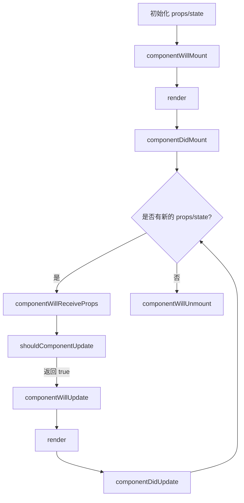

**React与DOM操作关系**

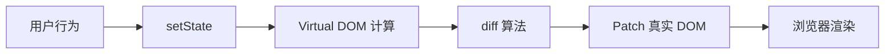

### 经典金句/数据

> “React把用户界面抽象成一个组件，如按钮组件Button、对话框组件Dialog、日期组件Calendar。” (p.1)

> “Virtual DOM最大的好处在于方便和其他平台集成，比如react-native是基于Virtual DOM渲染原生控件。” (p.2)

> “函数式编程才是React的精髓。” (p.3)

> “React组件的生命周期根据广义定义描述，可以分为挂载、渲染和卸载这几个阶段。” (p.29)

---

## 第2章：漫谈React

### 核心论点

本章解决“React组件开发中如何应对复杂场景”的问题。作者认为：掌握事件系统、表单处理、样式管理、组件间通信、性能优化、动画和自动化测试，是构建高质量React应用的必备能力。

### 关键概念/事件

- **合成事件（SyntheticEvent）**：React基于Virtual DOM实现的跨浏览器事件层，支持事件委派与自动绑定，符合W3C标准。
- **受控组件与非受控组件**：受控组件的表单值由React state控制；非受控组件使用ref直接操作DOM，是一种反模式。
- **CSS Modules**：通过webpack的css-loader实现样式的局部化，解决命名冲突与全局污染，支持composes组合样式。
- **高阶组件（HOC）**：接受React组件作为输入，输出增强后的新组件。实现方式有属性代理（props proxy）和反向继承（inheritance inversion）。
- **PureRender与Immutable**：PureRender通过浅比较props/state避免不必要的渲染；Immutable.js提供持久化数据结构，配合PureRender大幅提升性能。

### 逻辑推演/叙事脉络

1. 事件系统：合成事件的绑定方式、实现机制（委派+自动绑定）、与原生事件的混用风险
2. 表单处理：受控/非受控组件的区别与应用场景
3. 样式处理：基本样式设置、CSS Modules原理与实践
4. 组件间通信：父子（props/回调）、跨级（context，不推荐）、无嵌套关系（发布/订阅模式）
5. 组件间抽象：mixin的缺陷 → 高阶组件的优势（属性代理、反向继承）
6. 性能优化：纯函数原则 → PureRender → Immutable → key值优化 → react-addons-perf量化
7. 动画：ReactCSSTransitionGroup、React Motion、缓动函数（物理缓动、cubic-bezier）
8. 自动化测试：Jest（快照测试）、Enzyme（类jQuery语法）、CI集成
9. 以优化后的Tabs组件收尾，综合应用CSS Modules、Immutable、React Motion等

### 流程图

**高阶组件（属性代理）结构**

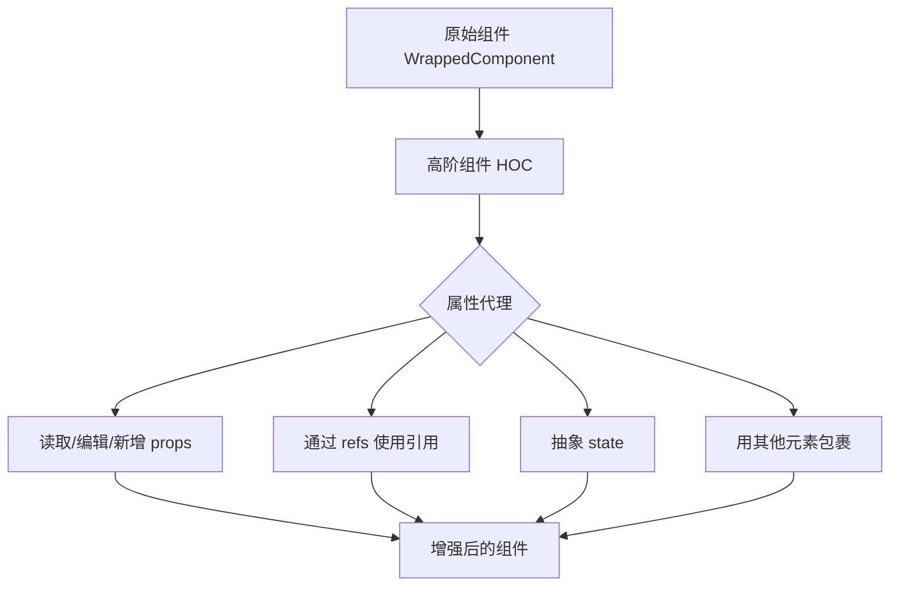

**PureRender 浅比较逻辑**

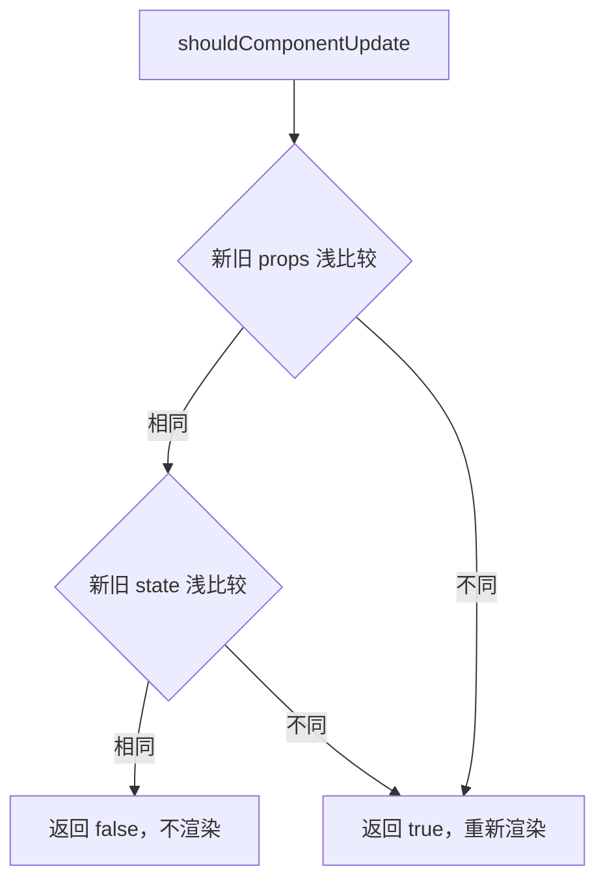

### 经典金句/数据

> “React基于Virtual DOM实现了一个SyntheticEvent（合成事件）层，我们所定义的事件处理器会接收到一个SyntheticEvent对象的实例，它完全符合W3C标准。” (p.48)

> “在React中，数据是自顶向下单向流动的，即从父组件到子组件。这条原则让组件之间的关系变得简单且可预测。” (p.21)

> “如果需要传递一些全局性的信息，且不会更改，例如界面主题、用户信息等，可以考虑使用context。” (p.80)

> “Immutable Data就是一旦创建，就不能再更改的数据。对Immutable对象进行修改、添加或删除操作，都会返回一个新的Immutable对象。” (p.104)

---

## 第3章：解读React源码

### 核心论点

本章解决“React底层是如何运转的”问题。作者通过分析React 15.0源码，揭示了Virtual DOM模型、生命周期管理、setState机制、diff算法和Patch方法的实现原理。核心观点：React的性能优势源于Virtual DOM + 高效的diff算法 + 批量更新策略。

### 关键概念/事件

- **Virtual DOM模型**：ReactNode分为ReactElement（DOM元素/组件元素）、ReactFragment、ReactText。createElement返回ReactElement实例。
- **生命周期管理**：分为MOUNTING、RECEIVE_PROPS、UNMOUNTING三个阶段，通过mountComponent、updateComponent、unmountComponent三个方法管理。
- **setState机制**：异步更新，通过事务（Transaction）机制批量处理状态变更。enqueueSetState将partialState放入队列，最终通过批量更新策略执行。
- **diff算法**：基于三个策略（跨层级移动少、同类组件结构相似、key标识子节点）进行优化。复杂度从O(n³)降至O(n)。
- **React Patch**：将diff计算出的DOM差异队列更新到真实DOM节点上，包括INSERT_MARKUP、MOVE_EXISTING、REMOVE_NODE等操作。

### 逻辑推演/叙事脉络

1. 初探React源码组织结构（addons、isomorphic、renderers、shared等）
2. Virtual DOM模型详解：创建React元素 → 初始化组件入口 → 文本组件 → DOM标签组件 → 自定义组件
3. 生命周期管理艺术：mountComponent（挂载）→ updateComponent（更新）→ unmountComponent（卸载）
4. 解密setState：为什么异步 → 事务机制 → 批量更新 → 循环调用风险
5. diff算法详解：tree diff、component diff、element diff，以及key的优化作用
6. Patch方法：将差异队列批量应用到真实DOM

### 流程图

**React diff 算法流程图**

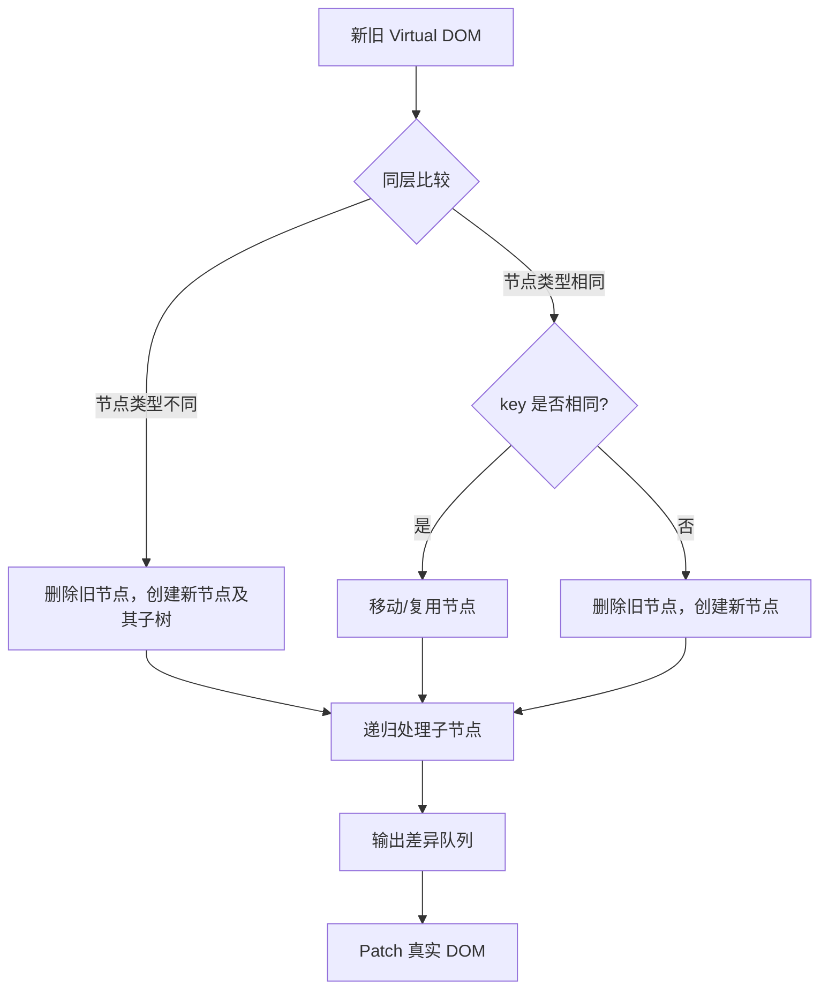

**setState 事务机制**

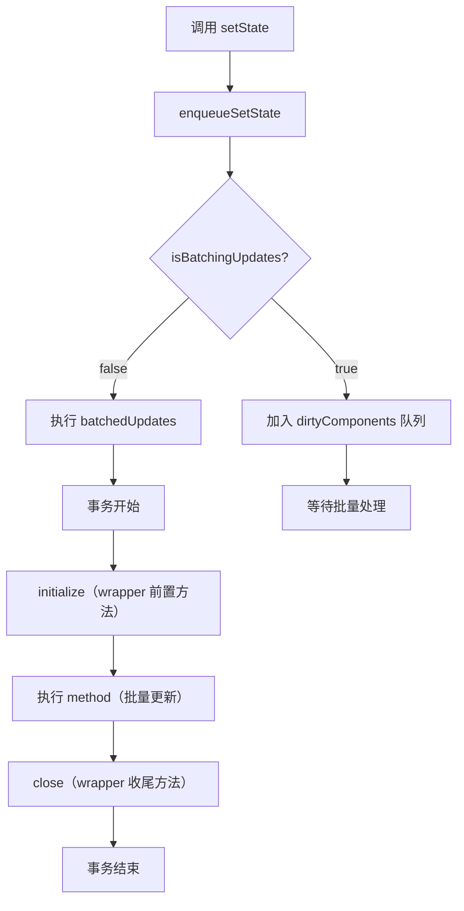

### 经典金句/数据

> “VirtualDOM是React的核心与精髓所在，而reconciler就是实现VirtualDOM的主要源码。” (p.136)

> “React利用更新队列this._pendingStateQueue以及更新状态this._pendingReplaceState和this._pendingForceUpdate来实现setState的异步更新机制。” (p.155)

> “传统diff算法通过循环递归对节点进行依次对比，效率低下，算法复杂度达到O(n³)。” (p.172)

> “React对树的算法进行了简洁明了的优化，即对树进行分层比较，两棵树只会对同一层次的节点进行比较。” (p.173)

---

## 第4章：认识Flux架构模式

### 核心论点

本章解决“React应用如何组织数据流与业务逻辑”的问题。作者认为：传统MVC架构存在数据流动混乱的问题；Flux通过单向数据流（Action → Dispatcher → Store → View）解决了这一痛点，使应用状态变得可预测、可追溯。

### 关键概念/事件

- **MVC的问题**：Model可以随意改变View，View也可以随意改变Model，且一个Model改变可能触发无数change事件，导致数据流动不可控。
- **Flux核心组成**：Dispatcher（中央事件分发器）、Store（保存数据、响应事件）、View（订阅Store数据并渲染）。
- **单向数据流**：Action → Dispatcher → Store → View，路线单向不可逆，各个角色之间没有交错的连线。
- **对比MVC**：Flux没有明确职责的Controller，而是用controller-view负责绑定store与view。

### 逻辑推演/叙事脉络

1. 从React独立架构实现评论功能开始，引出业务逻辑整合到组件中的问题
2. 分析MVC/MVVM的局限性：数据流动混乱、难以调试
3. 介绍Flux的解决方案：Action → Dispatcher → Store → View 单向流动
4. 详细讲解Flux各组件：dispatcher与action、store、controller-view、view、actionCreator
5. 通过评论功能的Flux重构实例，展示实际应用
6. 总结Flux的核心思想（中心化控制）与不足（冗余代码多、松散约定）

### 流程图

**Flux 单向数据流**

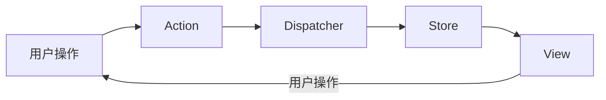

**Flux vs MVC 数据流对比**

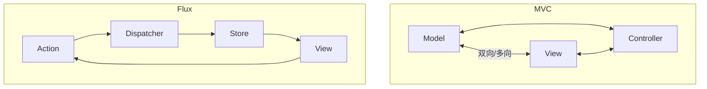

### 经典金句/数据

> “Flux的核心思想就是数据和逻辑永远单向流动。” (p.193)

> “在Flux中，store对外只暴露getter而不暴露setter，这意味着在store之外你只能读取store中的数据而不能进行任何修改。” (p.196)

> “Flux把action做了统一归纳，提高了系统抽象程度。不论action是由用户触发的，从服务端发起的，还是应用本身的行为，对于我们而言，它都只是一个动作而已。” (p.206)

---

## 第5章：深入Redux应用架构

### 核心论点

本章解决“如何使用Redux构建可预测的React应用”的问题。作者认为：Redux是Flux思想的进化版，通过三大原则（单一数据源、状态只读、纯函数修改状态）使应用状态管理变得可预测、可追溯、可调试。

### 关键概念/事件

- **Redux三大原则**：单一数据源（整个应用状态保存在一个对象中）、状态是只读的（只能通过dispatch action触发修改）、状态修改均由纯函数完成（reducer）。
- **核心API**：createStore(reducer, initialState)生成store；store提供getState()、dispatch(action)、subscribe(listener)、replaceReducer(nextReducer)。
- **Middleware**：在action到达reducer之前提供第三方扩展点，通过applyMiddleware加载。常见middleware有redux-thunk（处理异步action）、redux-promise、redux-saga。
- **react-redux绑定**：Provider组件作为顶层组件接收store；connect方法将React组件与Redux store绑定，mapStateToProps和mapDispatchToProps分别映射状态和操作。
- **Redux异步流**：通过middleware（如redux-thunk）使action支持函数形式，实现异步请求；更复杂的异步流可使用redux-saga（基于generator）。

### 逻辑推演/叙事脉络

1. Redux简介与三大原则
2. 核心API详解（createStore、reducer、middleware）
3. Redux middleware机制：函数式编程设计（currying）→ 分发store → 组合串联 → 调用dispatch
4. 异步流处理：redux-thunk、redux-promise、redux-composable-fetch、redux-saga
5. Redux与路由：react-router-redux实现路由状态与store绑定
6. 容器型组件与展示型组件的划分
7. 完整的博客系统实例（从项目初始化到连接Redux、Ajax请求、页面跳转、单元测试）
8. 引入Redux Devtools实现时间旅行调试

### 流程图

**Redux 数据流动**

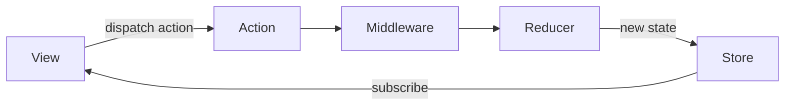

**Redux Middleware 组合机制**

```mermaid
graph TD
    A[applyMiddleware(m1, m2, m3)] --> B[创建 store]
    B --> C[chain = [m1(api), m2(api), m3(api)]]
    C --> D[dispatch = compose(...chain)(store.dispatch)]
    D --> E[新 dispatch 执行：f1(f2(f3(store.dispatch)))]
```

### 经典金句/数据

> “Redux把自己定位成一个‘可预测的状态容器’。” (p.208)

> “Redux三大原则：单一数据源、状态是只读的、状态修改均由纯函数完成。” (p.209-210)

> “middleware提供了一个分类处理action的机会。在middleware中，你可以检阅每一个流过的action，挑选出特定类型的action进行相应操作。” (p.212)

> “Redux DevTools可以方便地查看action的触发记录以及数据的更改情况，这就是传说中的‘时间旅行’调试方式。” (p.250)

---

## 第6章：Redux高阶运用

### 核心论点

本章解决“如何在复杂企业级应用中高效使用Redux”的问题。作者认为：通过高阶reducer、表单处理方案、CRUD实战技巧、性能优化（Reselect、Immutable）、以及深入理解react-redux源码，可以构建健壮、可维护的大型Redux应用。

### 关键概念/事件

- **高阶reducer**：将reducer作为参数或返回值的函数。用于reducer复用（通过prefix保证actionType全局唯一）和reducer增强（如redux-undo实现撤销/重做）。
- **Redux表单方案**：redux-form-utils（减少冗余代码）、redux-form（支持同步/异步验证）、react-redux-form（通过高阶reducer为现有模块引入表单功能）。
- **CRUD实战**：使用Ant Design的Table和Modal组件，结合Redux完成增删改查；利用promise管理异步事件流（如删除确认后的请求）。
- **性能优化**：Reselect（缓存selector计算结果）、Immutable Redux（使用redux-immutable的combineReducers）、Reducer性能优化（logSlowReducers、specialActions、batchActions）。
- **react-redux源码解读**：Provider通过context传递store；connect通过mapStateToProps/mapDispatchToProps/margeProps/options四个参数实现组件与Redux的绑定。

### 逻辑推演/叙事脉络

1. 高阶reducer：复用场景（prefix保证唯一性）→ 增强场景（redux-undo实现撤销/重做）
2. Redux与表单：redux-form-utils → redux-form（异步验证）→ react-redux-form（高阶reducer方式）
3. CRUD实战：查（Table组件+搜索）→ 增/改（Modal组件+表单）→ 删（确认弹窗+promise）
4. 性能优化：Reselect缓存 → Immutable Redux → Reducer级别优化（慢日志、批量action）
5. 源码解读：Redux的createStore（参数归一化、getState、subscribe、dispatch、replaceReducer）→ react-redux的Provider和connect

### 流程图

**高阶 Reducer 增强（redux-undo）**

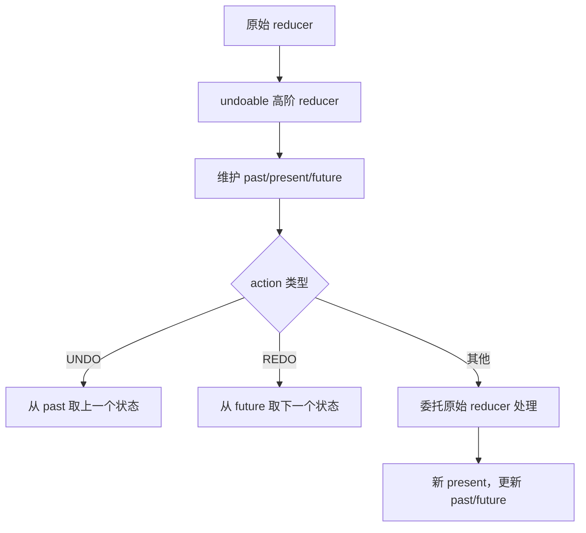

**Reselect 缓存机制**

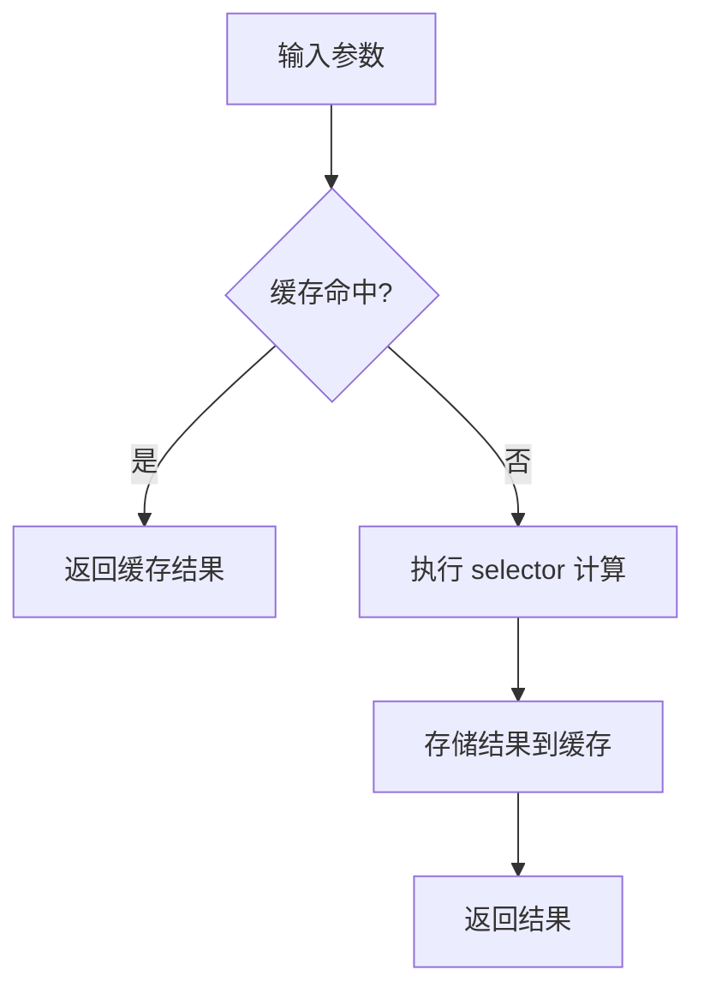

### 经典金句/数据

> “高阶 reducer 就是指将 reducer 作为参数或者返回值的函数。” (p.259)

> “redux-form-utils 利用高阶组件的特性为表单的每个字段提供 value 和 onChange 等必须值，而无需你手动创建。” (p.263)

> “在 Redux 中，通常称 store 中的数据为‘源数据’。我们会在 connect 的 mapStateToProps 中把 state 中的数据做一些转换和合并，生成的‘衍生数据’通过 props 提供给组件。” (p.280)

> “Reselect 库中已经自带了缓存特性，如果纯函数的参数不变的话，可以把之前用同样的参数计算出来的结果直接返回。” (p.281)

---

## 第7章：React服务端渲染

### 核心论点

本章解决“如何实现React应用的服务端渲染（同构）”的问题。作者认为：通过ReactDOMServer提供的renderToString/renderToStaticMarkup方法，配合Koa等服务端框架，可以实现首屏加速、SEO优化和代码复用的同构应用。

### 关键概念/事件

- **服务端渲染的好处**：利于SEO（搜索引擎可读取meta信息）、加速首屏渲染（用户下载时已是渲染好的页面）、服务端和客户端共享代码。
- **核心API**：renderToString（带reactid，支持客户端再次渲染）和renderToStaticMarkup（简化版，无reactid，适合静态文本）。
- **react-view插件**：Koa框架的view层插件，将React作为模板引擎。核心是通过require加载组件，然后用ReactDOMServer渲染。
- **同构路由**：服务端使用createMemoryHistory，客户端使用browserHistory，通过同一套Route配置实现路由同步。
- **同构数据处理**：通过组件的statics（静态方法）定义fetchData，在服务端调用获取数据后传递给组件。

### 逻辑推演/叙事脉络

1. 服务端渲染的概念与优势
2. ReactDOMServer的renderToString和renderToStaticMarkup
3. react-view插件源码解读：配置、渲染、cache（require缓存问题）、Babel
4. 基于Koa的完整实例：从搭建Node服务到React组件作为模板
5. 路由同构：react-router与koa-router统一，通过createMemoryHistory和browserHistory区分环境
6. 数据处理同构：通过组件静态方法fetchData，服务端调用并注入props

### 流程图

**React 同构渲染流程**

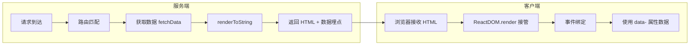

### 经典金句/数据

> “服务端渲染可以让搜索引擎更容易读取页面的meta信息以及其他SEO的相关信息，大大增加了网站在搜索引擎中的可见度。” (p.295)

> “renderToString方法把React元素转成一个HTML字符串并在服务端标识reactid。所以在浏览器端再次渲染时，React只是做事件绑定等前端相关的操作，而不会重新渲染整个DOM树。” (p.296)

> “React是有生命周期的，我们绑定Model并获取数据的过程应在componentDidMount方法里完成。在服务端，React是不会去执行componentDidMount方法的。” (p.306)

---

## 第8章：玩转React可视化

### 核心论点

本章解决“如何在React中实现数据可视化”的问题。作者认为：Canvas适合复杂图形和动画，SVG适合图标和图表组件化。通过封装已有可视化库、使用D3的算法配合React渲染UI、或采用声明式图表库（如Recharts），可以在React中构建灵活的可视化组件。

### 关键概念/事件

- **Canvas vs SVG**：Canvas基于像素，通过脚本绘制，适合复杂动画和图像处理；SVG基于XML，支持事件和CSS，适合图标和图表。React对SVG标签有完善支持。
- **React中的Canvas**：通过ref获取DOM节点，在componentDidMount和componentDidUpdate中调用Canvas API绘制。
- **React中的SVG**：可以直接使用SVG标签（circle、rect、path等）作为React组件；可实现内联图标、网站Logo动画（stroke-dashoffset）。
- **可视化组件构建方法**：方法一：包装已有库（如echarts）；方法二：使用D3绘制UI部分（直接操作DOM）；方法三：使用React绘制UI部分，D3只负责算法（如scale、曲线生成）。
- **Recharts组件化原理**：声明式标签（如<LineChart><XAxis/><Line/>）、贴近原生SVG配置项、接口式API（通过tick属性自定义刻度）。

### 逻辑推演/叙事脉络

1. Canvas与SVG的比较及在React中的基本用法
2. React中Canvas的组件化实现（生命周期与Canvas API融合）
3. React中SVG的应用：基础图形、贝塞尔曲线、内联图标、Logo动画
4. 可视化组件的三种构建方法：包装已有库、D3绘制UI、React绘制UI+D3算法
5. Recharts源码分析：声明式标签（通过displayName识别子组件）、原生配置项传递、自定义渲染接口

### 流程图

**Canvas 组件在 React 中的生命周期整合**

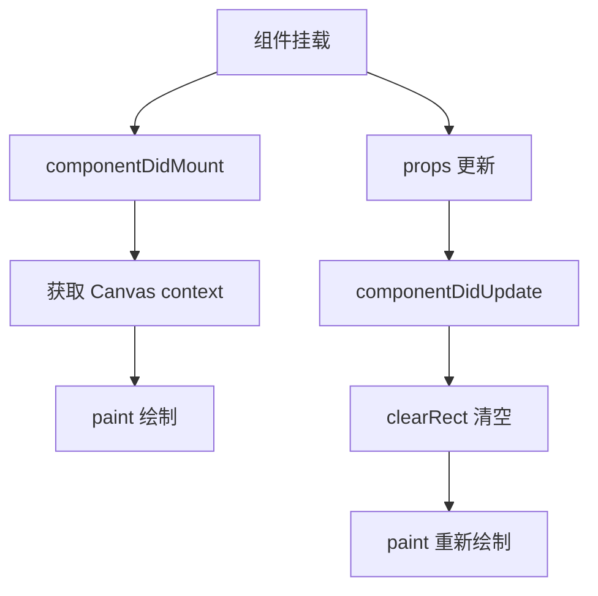

**Recharts 声明式图表解析机制**

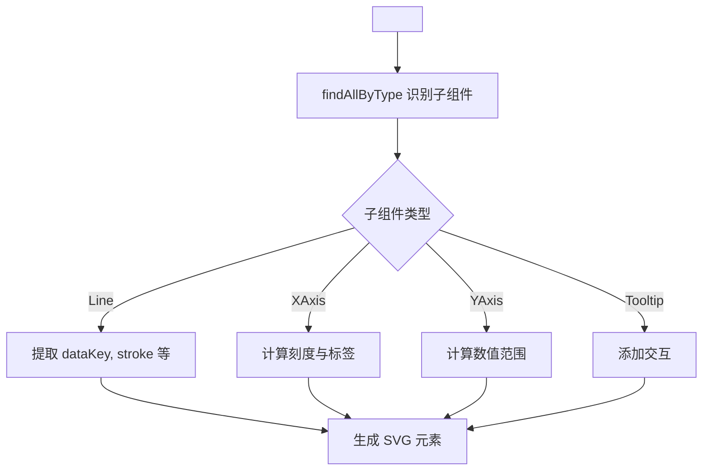

### 经典金句/数据

> “Canvas基于像素，提供2D绘制函数，只能通过脚本来绘制图形。因此，React与Canvas并没有直接的联系。对于React来说，Canvas标签只是普通HTML标签而已。” (p.308)

> “SVG是一组组嵌套的标签，我们可以通过配置标签的属性来得到想要的图形元素；而Canvas需要用JavaScript来生成。” (p.311)

> “Recharts组件化的核心思想：声明式的标签，让写图表和写HTML一样简单；贴近原生SVG的配置项；接口式的API，解决各种个性化的需求。” (p.322-323)

---

# 附录摘要

## 附录A：开发环境

### 核心论点

搭建React开发环境需要Node.js、Babel、Sass、Karma、webpack等工具链的配合，以及React核心库的安装。通过合理配置，可以实现开发与生产环境的分离、热重载、自动化测试等工程化能力。

### 关键概念

- **Node.js + NVM**：管理Node.js版本，使用CommonJS模块规范
- **Babel**：将ES6/ES7/JSX代码编译为ES5，通过preset（es2015、react）配置
- **Sass/SCSS**：CSS预处理器，支持变量、嵌套、mixin等
- **Karma**：测试任务管理工具，配合Mocha、Chai进行单元测试
- **webpack**：模块打包器，支持loader（babel-loader、css-loader、sass-loader）和插件（热重载、代码压缩）

### 流程图

**webpack 开发环境与生产环境配置对比**

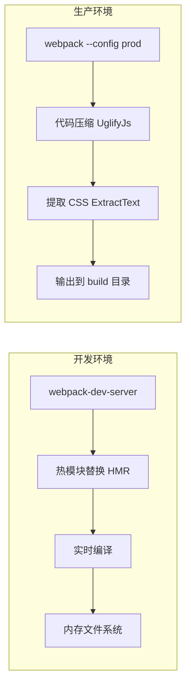

---

## 附录B：编码规范

### 核心论点

统一的编码规范可以大大降低团队协作中阅读代码的成本。ESLint配合Airbnb JavaScript规范，以及EditorConfig的编辑器配置，是React项目标准化的最佳实践。

### 关键概念

- **ESLint**：可扩展的Lint工具，支持JSX，可配置规则等级，通过babel-eslint解析ES6
- **Airbnb规范**：业界公认的JavaScript编码规范
- **EditorConfig**：跨编辑器的基础配置（缩进、换行、字符集）

---

## 附录C：Koa middleware

### 核心论点

Koa的middleware采用generator函数实现，通过compose组合，配合co库管理执行流程。其核心思想与Redux middleware相似，都是通过组合方式形成处理管道（pipeline）。

### 流程图

**Koa middleware 组合执行流程**

```mermaid
graph TD
    A[app.use(m1)] --> B[app.use(m2)]
    B --> C[app.use(m3)]
    C --> D[compose 组合]
    D --> E[执行顺序: m1 -> m2 -> m3]
    E --> F[yield next 控制流转]
```

### 经典金句

> “无论是Redux还是Koa，它们的核心思想都在于将middleware进行组合，将当前middleware执行一遍作为参数传给下一个middleware去执行。” (p.351)