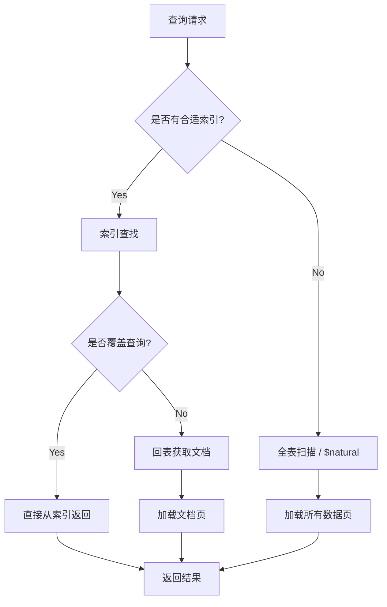

# 《深入学习MongoDB》章节总结

## 书籍信息
- **书名**：深入学习MongoDB (Scaling MongoDB & 50 Tips and Tricks for MongoDB Developers)
- **作者**：[美] Kristina Chodorow
- **译者**：巨成、程显峰
- **出版社**：人民邮电出版社 (图灵程序设计丛书)
- **PDF 状态**：完整识别，包含两部分内容（《Scaling MongoDB》与《50 Tips and Tricks for MongoDB Developers》）
- **OCR 状态**：良好，结构清晰

## 目录说明
本书由两本O'Reilly短篇著作合并而成：
1. **第一部分：MongoDB扩展技术 (Scaling MongoDB)** - 第1章至第6章
2. **第二部分：MongoDB开发技巧50例 (50 Tips and Tricks for MongoDB Developers)** - 第1章至第5章（对应技巧1-50）

## 全书核心主题
本书旨在解决MongoDB在大规模数据场景下的扩展性、高可用性及高性能应用设计问题。
第一部分重点阐述**分片（Sharding）**机制，包括集群架构（mongos, Config Server, Shard）、数据分布策略（Chunk, Balance）、片键选择原则以及集群的运维管理（备份、监控、故障处理）。核心目标是构建一个对应用透明、自动均衡且易于扩展的分布式数据库系统。
第二部分提供50个实战技巧，涵盖**应用设计**（范式化vs反范式化、嵌入vs引用）、**实现细节**（数据类型、ID选择、GridFS）、**性能优化**（索引策略、内存管理、查询优化）、**数据安全**（复制、日志、写入关注）及**运维管理**。核心思想是结合业务场景权衡一致性、可用性与性能，利用MongoDB文档模型特性优化读写效率。

---

## 第一部分：MongoDB扩展技术

## 第1章：欢迎来到分布式计算的世界

### 1. 核心论点
本章主要讨论为何需要分布式数据库集群以及MongoDB分片的核心目标。
作者认为：当单台服务器无法满足存储容量或吞吐量需求时，必须建立集群；MongoDB通过分片机制试图解决分布式系统的复杂性，实现集群对应用“不可见”、高可用及易扩展。

### 2. 关键概念
- **分片 (Sharding)**：将大型集合分割到不同服务器（集群）上的方法，由MongoDB自动维护数据均衡。
- **mongos**：路由进程，作为集群入口，对应用表现为单个mongod实例，负责请求转发和响应拼装。
- **高可用性**：通过冗余（副本集）确保部分节点失效时集群仍可读写。
- **易扩展性**：支持按需动态添加或移除服务器，自动重新平衡数据。

### 3. 逻辑推演 / 叙事脉络
作者首先指出单点数据库的局限性（非启即停），引入多节点带来的依赖复杂性（通信、故障、备份难点）。接着定义分片的概念，强调其与关系型数据库分区的区别在于“自动化”。最后提出分片的三大目标：对应用透明（通过mongos抽象）、保证持续可读写（通过冗余和迁移技巧）、易于扩展（动态增减容量）。

### 4. 经典金句 / 数据
> “如果一台服务器可以满足需求，那就能避免很多问题。但是如果想要存储大量数据或者想以高于单服务器处理能力的频率来访问这些数据，则建立一个集群是不可避免的。”

> “MongoDB的优势之一正是试图帮助你解决上面列出的许多问题……只要告诉MongoDB要分配数据，它就能自动维护数据在不同服务器之间的均衡。”

---

## 第2章：理解分片

### 1. 核心论点
本章深入解析分片的工作原理，特别是数据如何被分割、分配和平衡。
作者观点：MongoDB采用基于区间的块（Chunk）划分和多区间分布策略，以避免数据迁移时的级联效应，并通过平衡器（Balancer）自动化管理数据分布。

### 2. 关键概念
- **块 (Chunk)**：数据的逻辑子集，默认大小200MB。块是迁移的基本单位，而非物理连续存储。
- **片键 (Shard Key)**：决定数据分布的字段或字段组合。
- **平衡器 (Balancer)**：后台进程，当分片间块数量差异超过阈值（默认9个）时触发迁移，以最小化数据传输量为目标。
- **配置服务器 (Config Server)**：存储集群元数据（分片、块分布等），所有配置服务器必须在线才能进行元数据变更。

### 3. 逻辑推演 / 叙事脉络
作者首先对比了“一分片一区间”（导致级联迁移，效率低）和“一分片多区间”（MongoDB采用的策略，灵活迁移）两种数据分配方式。接着详细解释了块的创建过程（初始大块分裂为小块）和类型排序规则。随后阐述了平衡器的工作机制及其保守策略（避免频繁抖动）。最后介绍了mongos的路由逻辑和配置服务器的作用，构建了集群的三大组件模型。

### 4. 流程图重建

```mermaid
graph TD
    Client[客户端应用] --> Mongos[mongos 路由进程]
    Mongos -->|查询元数据| ConfigServers[配置服务器集群]
    Mongos -->|路由读写请求| ShardA[分片 A (副本集)]
    Mongos -->|路由读写请求| ShardB[分片 B (副本集)]
    
    subgraph "数据分布"
    Chunk1[Chunk 1: Range A] --> ShardA
    Chunk2[Chunk 2: Range B] --> ShardB
    end
    
    Balancer[平衡器] -->|监控负载| ConfigServers
    Balancer -->|触发迁移| ShardA
    Balancer -->|触发迁移| ShardB
```

### 5. 经典金句 / 数据
> “块是一个逻辑概念，而非物理实现。一个块中的文档在物理上并不连续存储于磁盘上或以任何形式聚集在一起。”

> “平衡器的目标不仅是要保持数据均匀分布，还要最小化被移动的数据量……要触发一轮平衡，一个分片必须比块最少的分片多出至少9个块。”

---

## 第3章：建立集群

### 1. 核心论点
本章指导如何选择合适的片键并搭建集群。
作者强调：片键选择至关重要，错误的片键会导致热点或无法扩展；好的片键应兼顾数据局部性和分布均匀性（如粗粒度升序+随机搜索键）。

### 2. 关键概念
- **小基数片键 (Low-Cardinality)**：取值有限的字段（如洲名），导致块无法分裂，形成巨大不可移动块，**应避免**。
- **升序片键 (Ascending)**：如时间戳、ObjectId，导致所有写入集中在最后一个块（热点），**应避免**（除非配合粗粒度前缀）。
- **随机片键 (Random)**：如MD5，分布均匀但缺乏局部性，导致频繁磁盘IO和索引浪费。
- **组合片键 (Compound Shard Key)**：`{coarseLocality: 1, search: 1}`，既保证近期数据在内存（局部性），又保证写入分散（均匀性）。

### 3. 逻辑推演 / 叙事脉络
作者首先列举三种糟糕的片键选择（小基数、纯升序、纯随机）并分析其弊端（无法分裂、热点、IO压力）。随后提出理想的片键公式：粗粒度局部性字段 + 高频查询字段。接着给出搭建集群的具体步骤：启动配置服务器 -> 启动mongos -> 添加分片（推荐副本集） -> 启用数据库分片 -> 指定集合片键。最后讨论扩容（提前添加分片）和缩容（draining）的注意事项。

### 4. 经典金句 / 数据
> “选择一个好的片键非常关键。如果选择了一个糟糕的片键，它可以立马或者在访问量变大时毁了你的应用程序……如果你选择了一个好片键……MongoDB就会确保一直正确地运行下去。”

> “我们真正需要的是一种将访问模式也考虑进去的方案……{coarseLocality: 1, search: 1}”

---

## 第4章：使用集群

### 1. 核心论点
本章探讨在分片集群上进行查询、更新和MapReduce时的特殊行为及限制。
作者指出：集群失去了全局原子性和即时一致性快照的特性，开发者需处理计数偏差、唯一索引限制及更新约束。

### 2. 关键概念
- **针对性查询 (Targeted Query)**：查询条件包含片键，mongos仅路由到特定分片，效率高。
- **广播查询 (Scatter-Gather)**：查询不包含片键，mongos向所有分片发送请求，效率较低。
- **计数偏差**：迁移过程中文档可能同时存在于源分片和目标分片，导致count结果偏大。
- **唯一索引限制**：除片键外，无法保证全局唯一性（因为跨分片检查成本高）。
- **更新约束**：单文档更新必须在查询条件中包含片键，否则报错。

### 3. 逻辑推演 / 叙事脉络
作者首先说明查询通常与单机一致，但存在例外。接着详细解释了计数不准的原因（迁移期间的双重存在）。然后深入分析唯一索引在分布式环境下的竞态条件问题，得出“仅片键或片键前缀可保证唯一”的结论。随后指出单文档更新必须携带片键以定位具体分片。最后简述MapReduce在集群中的并行执行机制及临时集合清理问题。

### 4. 经典金句 / 数据
> “使用集群时，就不能把整个集合看做是一个‘即时快照’（snapshot in time）了。”

> “除片键以外任何键都难以保证唯一性……可以保证片键的唯一性是因为特定文档只能属于一个数据块。”

---

## 第5章：管理

### 1. 核心论点
本章介绍集群的监控、备份及故障应对策略。
作者建议：通过mongos进行常规管理，利用mongostat监控，采用队列（Moat）架构缓冲流量，并制定针对分片、配置服务器宕机的应急预案。

### 2. 关键概念
- **mongostat**：全面的监控工具，可发现集群所有成员状态。
- **备份难题**：运行时备份需停止平衡器并锁定，否则恢复时可能数据不一致或缺失。
- **应急站点 (Emergency Site)**：独立于主集群的只读或静态站点，用于维护期间服务用户。
- **护城河 (Moat)**：使用消息队列（如RabbitMQ）隔离应用与数据库，吸收流量峰值和处理中断。

### 3. 逻辑推演 / 叙事脉络
作者首先介绍通过shell查看集群状态（printShardingStatus）和config库细节。接着强调监控的重要性，推荐mongostat。随后指出备份的复杂性，建议从单个分片备份或停机备份。在架构建议中，提出建立应急站点和使用队列解耦。最后详细分析了各种故障场景（分片宕机、配置服务器宕机、mongos宕机）的表现及应对方法，强调应用层的错误处理和降级能力。

### 4. 经典金句 / 数据
> “队列不仅在容灾中非常有用，而且在常规的突发流量下也非常有用……队列能够在外部世界和数据库之间架起一座非常有价值的桥梁。”

> “保持镇定，呵护好你的集群。”

---

## 第二部分：MongoDB开发技巧50例

## 第1章：应用设计技巧 (技巧1-13)

### 1. 核心论点
本章聚焦数据建模，核心是在范式化（一致性）与反范式化（性能）之间做出权衡，并根据访问模式设计文档结构。
作者主张：大多数Web应用应优先追求读取性能，采用反范式化和嵌入策略，但需接受最终一致性；文档应自给自足，减少JOIN。

### 2. 关键概念
- **反范式化 (Denormalization)**：冗余数据以提高读取速度，牺牲写入原子性和即时一致性（如订单中嵌入商品快照）。
- **嵌入 vs 引用**：一对一或一对少且共同查询时嵌入；一对多且无限增长时引用。
- **时间点数据**：历史快照数据（如订单时的价格、地址）应嵌入，不受后续修改影响。
- **预填充 (Pre-allocation)**：预先创建含默认值的文档或字段，避免运行时动态扩展带来的性能开销。
- **数组 vs 子文档**：需匿名访问或条件查询内部元素时用数组；已知固定键名时用子文档。

### 3. 逻辑推演 / 叙事脉络
作者通过购物车案例对比范式化与反范式化的优劣，得出“高读低写场景适合反范式化”的结论。接着讨论未来适应性，指出多数应用无需过度设计。随后提出“应用单元”概念，主张一次请求对应一次查询，通过嵌入关联数据实现。针对不断增长的数据（如评论），建议独立存放。最后介绍预填充、垃圾字段占位、自给自足文档（冗余计数字段）等优化手段，并警告$where的性能陷阱。

### 4. 经典金句 / 数据
> “极高的性能和瞬间一致性不可兼得。所以必须要想清楚哪个才是应用最需要的特性。”

> “文档要自给自足……避免让MongoDB做些能在客户端完成的计算。”

---

## 第2章：实现技巧 (技巧14-20)

### 1. 核心论点
本章关注底层实现细节，强调正确使用数据类型、ID策略及二进制数据存储方式，以节省空间并提高兼容性。
作者建议：使用原生类型（Date, ObjectId），避免不必要的数据库引用和小文件GridFS，妥善处理驱动层的网络异常。

### 2. 关键概念
- **数据类型**：数字用Number，日期用Date（模糊日期用字符串），ObjectId勿存为字符串。
- **_id选择**：若有自然唯一键且有序，可替换ObjectId以节省索引空间；否则保留ObjectId以获得有序插入优势。
- **数据库引用 (DBRef)**：除非集合动态变化，否则直接用_id引用更节省空间。
- **GridFS**：仅用于超过16MB或流式传输的大文件；小二进制数据直接嵌入文档。
- **故障切换处理**：驱动不会自动重试写入，应用层需捕获异常并决定重试或降级。

### 3. 逻辑推演 / 叙事脉络
作者逐一分析常见实现误区。首先强调类型匹配对排序和空间的影响。接着讨论_id的权衡：自定义唯一键省空间但可能破坏B树插入顺序。随后否定DBRef的过度使用和小文件GridFS的低效（两次查询）。最后深入驱动层，解释网络错误处理的复杂性，指出应用必须显式处理“not master”等异常，实现平滑降级或重试。

### 4. 经典金句 / 数据
> “ObjectId就要作为ObjectId存储，千万不要存成字符串……字符串表示的ObjectId要多占两倍磁盘空间。”

> “GridFS是用来存放大数据的——至少得是一个文档放不下的数据。”

---

## 第3章：优化技巧 (技巧21-28)

### 1. 核心论点
本章核心是减少磁盘IO，主要通过索引优化和查询策略调整实现。
作者观点：内存远快于磁盘，优化的本质是让数据留在内存中；索引能大幅减少扫描页面，但需警惕过度索引和全表扫描的场景。

### 2. 关键概念
- **内存 vs 磁盘**：内存访问比磁盘快百万倍，优化目标是最大化内存命中率。
- **索引覆盖查询 (Covered Index)**：查询结果字段均在索引中，无需回表，极速。
- **复合索引顺序**：遵循最左前缀原则；AND查询将选择性高的条件前置；OR查询将匹配多的条件前置。
- **自然排序 ($natural)**：强制禁用索引进行全表扫描，适用于返回大部分数据的查询。
- **分级文档**：通过嵌套结构减少无关字段的遍历，加速无索引查询。

### 3. 逻辑推演 / 叙事脉络
作者首先量化内存与磁盘的速度差异，引出减少磁盘访问的目标。接着详解索引原理（B树），展示索引如何将千万级页面扫描降至几十页。随后警告索引并非万能：返回大量数据时索引反而增加IO（索引+回表）。介绍覆盖查询以消除回表。接着讨论复合索引的设计策略，针对不同查询模式（AND/OR）调整字段顺序。最后提出通过文档嵌套结构优化无索引查询的效率。

### 4. 流程图重建



### 5. 经典金句 / 数据
> “内存的读取速度比磁盘快一百万倍……读磁盘要消耗很长时间。”

> “索引一般用在返回结果只是总体数据的一小部分的时候。根据经验，一旦要大约返回集合一半的数据就不要使用索引了。”

---

## 第4章：数据安全性和一致性 (技巧29-38)

### 1. 核心论点
本章探讨如何在性能与数据持久性之间取得平衡，主要通过复制（Replication）和日志（Journaling）机制。
作者建议：生产环境必须使用复制或日志；通过w参数控制写入确认级别，并设置超时以防阻塞；避免滥用fsync。

### 2. 关键概念
- **复制 vs 日志**：复制提供高可用和多副本；日志提供单机崩溃恢复。两者可结合但影响写入性能。
- **getlasterror / w参数**：控制写入确认的节点数。w=1（主节点确认），w=majority（多数节点确认，防回滚）。
- **wtimeout**：必须设置写入确认超时，防止因从节点滞后导致主线程无限等待。
- **fsync**：强制刷盘，性能极差，仅用于极端一致性需求或备份前锁定，日常写入禁用。
- **Repair风险**：repair命令可能丢失损坏数据，优先从备份恢复或重新同步。

### 3. 逻辑推演 / 叙事脉络
作者首先对比无保护、仅日志、仅复制、两者兼用四种模式的性能与安全性。推荐混合架构（主/热备无日志以保性能，备份节点开日志保安全）。接着深入写入确认机制，解释w参数的含义及majority的重要性。强调wtimeout的必要性，避免因网络分区或从节点故障导致应用挂起。最后警告repair的危险性，提倡正常重启利用日志自愈，或通过备份恢复。

### 4. 经典金句 / 数据
> “理想情况下，所有的写入都能立刻执行并永久地保留在磁盘上……可惜现实情况并不是这样，要么需多花时间确保数据安全，要么只能加快速度但使数据不怎么安全。”

> “不要每次写入都调用fsync……每100毫秒只能插入一次。这比MongoDB普通插入不知慢了多少倍。”

---

## 第5章：管理技巧 (技巧39-50)

### 1. 核心论点
本章提供高级运维技巧和Shell使用指南，旨在简化日常管理和故障排查。
作者主张：熟练掌握JavaScript Shell，利用内置函数和自定义脚本自动化任务；理解底层连接机制以避免“读取自身写入”问题。

### 2. 关键概念
- **孤悬块清理**：GridFS上传中断可能导致chunks无files引用，需定期清理。
- **压缩数据库**：使用repair或mongodump/restore整理碎片，释放空间。
- **复制组重置**：在无主节点时，通过修改local.system.replset手动重置配置。
- **Shell增强**：学习JavaScript，使用connect连接多节点，load加载脚本，tab补全。
- **连接池与顺序**：同一连接内操作有序；不同连接间无序。读取刚写入的数据需确保同一连接或使用getlasterror。

### 3. 逻辑推演 / 叙事脉络
作者首先介绍GridFS孤儿数据清理和数据库压缩方法。接着讲解复制组投票权误区和极端情况下的配置重置流程。随后强调Shell的重要性，展示如何通过JavaScript扩展Shell功能（自定义函数、启动文件）。最后解释MongoDB连接模型，指出多连接并发时的顺序不确定性，建议在需要强一致性读取时使用单连接或安全写入机制。

### 4. 经典金句 / 数据
> “即便你用的语言有很好的shell……也应该熟悉JavaScript shell。这种信息存取方式最快捷，且JavaScript是所有MongoDB开发者通用的语言。”

> “请求在同一个连接内能保证处理顺序，但是在不同的连接中就无法保证了。”