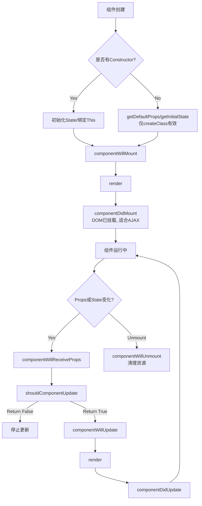
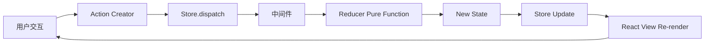
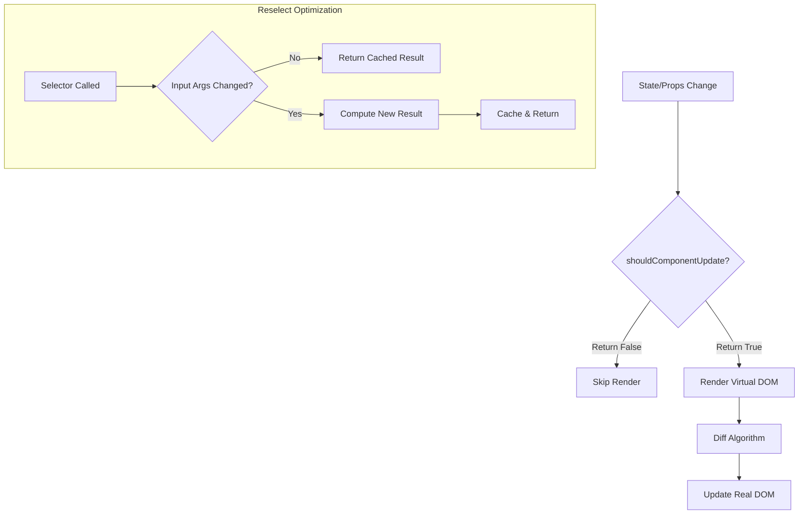
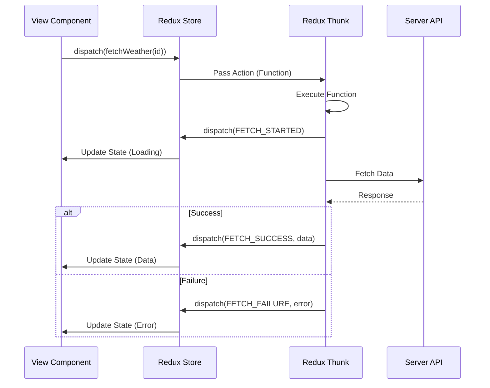
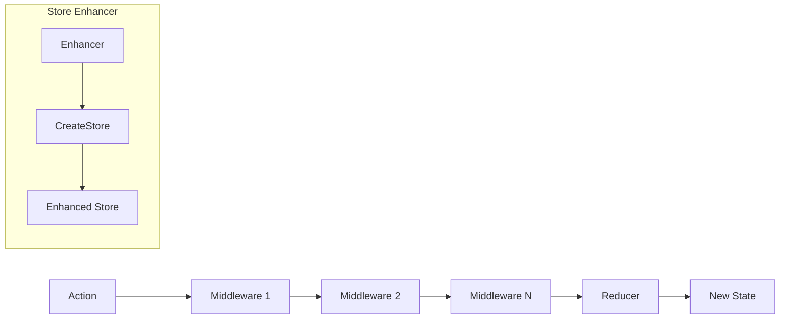
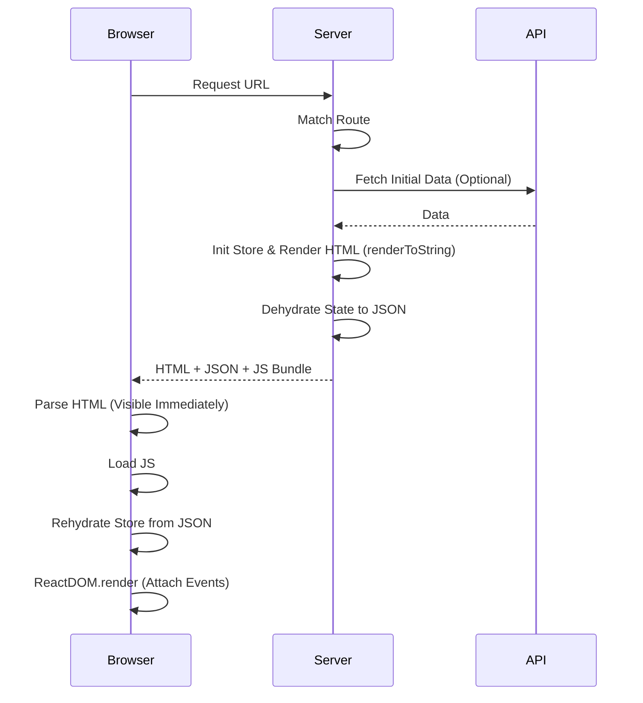

# 《深入浅出React和Redux (实战)》章节总结

## 书籍信息
- **书名**：深入浅出React和Redux (实战)
- **作者**：程墨
- **ISBN**：978-7-111-56563-5
- **出版年份**：2017年（机械工业出版社）
- **PDF 状态**：文本清晰，结构完整
- **OCR 状态**：良好，无需大量修复

## 目录说明
- **目录识别情况**：完整识别，共12章及前言、结语。
- **章节对应依据**：严格遵循原书目录结构，从React基础到Redux进阶，再到高级应用（路由、同构、测试等）。
- **OCR 修复说明**：部分代码片段中的空格和特殊符号已根据上下文逻辑进行标准化处理，确保代码可读性。

## 全书核心主题
本书旨在通过实战案例，深入解析 React 和 Redux 的核心原理与最佳实践。作者强调“限制”带来的工程化优势，主张通过单向数据流、纯函数、组件化设计来构建可维护的大型前端应用。全书从 React 的组件思维出发，对比 jQuery 和 MVC 的缺陷，引入 Flux 架构，进而详细阐述 Redux 的三大原则（唯一数据源、状态只读、纯函数改变状态）。书中不仅涵盖了基础的状态管理、生命周期、性能优化，还深入探讨了高阶组件、异步操作中间件、单元测试、代码分片以及服务器端渲染（同构）等高级话题，提供了一套完整的现代前端开发方法论。

---

## 第1章：React新的前端思维方式

### 核心论点
本章解决传统 DOM 操作（如 jQuery）在大型应用中难以维护的问题。作者核心观点是：React 通过声明式 UI 和 Virtual DOM，让开发者关注“UI 是什么”而非“如何修改 DOM”，从而提升开发效率和代码可维护性。

### 关键概念/事件
- **JSX**：JavaScript 的语法扩展，允许在 JS 中编写类 HTML 结构，实现高内聚（逻辑、样式、结构在一起）。
- **Virtual DOM**：内存中的轻量级 DOM 树，通过 Diff 算法最小化真实 DOM 操作，提升性能。
- **组件化**：将应用分解为独立、可重用的单元，遵循“分而治之”策略。
- **UI = render(data)**：React 的核心理念，界面是数据的纯函数映射。

### 逻辑推演/叙事脉络
首先介绍如何使用 `create-react-app` 快速初始化项目，降低配置门槛。接着通过一个点击计数器实例，展示 React 组件的基本结构。随后，对比 jQuery  imperative（命令式）编程模式与 React declarative（声明式）编程模式，指出 jQuery 在复杂状态下容易导致代码纠缠。最后，深入解释 Virtual DOM 的工作原理，说明 React 如何通过比对虚拟树差异来高效更新真实 DOM。

### 经典金句/数据
> “React 是一个聪明的建筑工人……你所要做的就是告诉这个工人‘我想要什么样子’……他会替你搞定一切。”

> “UI＝render（data）……用户看到的界面（UI），应该是一个函数（在这里叫render）的执行结果，只接受数据（data）作为参数。”

---

## 第2章：设计高质量的React组件

### 核心论点
本章解决如何构建易维护、高内聚低耦合组件的问题。作者核心观点是：明确区分 `prop`（外部接口）和 `state`（内部状态），并充分利用组件生命周期函数来管理资源。

### 关键概念/事件
- **Prop vs State**：Prop 是父组件传递的数据，不可变；State 是组件内部数据，可变且驱动重新渲染。
- **PropTypes**：运行时类型检查工具，用于规范组件接口，防止错误用法。
- **生命周期**：
    - **Mounting**：`constructor` -> `componentWillMount` -> `render` -> `componentDidMount`
    - **Updating**：`componentWillReceiveProps` -> `shouldComponentUpdate` -> `render` -> `componentDidUpdate`
    - **Unmounting**：`componentWillUnmount`
- **组件通信**：子组件通过回调函数（作为 prop 传递）向父组件传递数据。

### 逻辑推演/叙事脉络
首先定义高质量组件的标准（高内聚低耦合）。接着详细剖析 `prop` 和 `state` 的区别及使用场景，强调 state 必须通过 `setState` 更新。然后，逐一讲解装载、更新、卸载三个过程中的生命周期函数及其适用场景（如 `componentDidMount` 适合发起 AJAX 请求）。最后，通过 ControlPanel 和 Counter 案例，演示父子组件间的数据流向及状态提升带来的数据冗余问题，引出对全局状态管理的需求。

### 流程图


### 经典金句/数据
> “差劲的程序员操心代码，优秀的程序员操心数据结构和它们之间的关系。” —— Linus Torvalds

> “组件不应该改变 prop 的值，而 state 存在的目的就是让组件来改变的。”

---

## 第3章：从Flux到Redux

### 核心论点
本章解决多组件间状态同步困难和数据流混乱的问题。作者核心观点是：引入 Flux 架构实现单向数据流，并进一步采用 Redux 简化 Store 管理，通过“唯一数据源”和“纯函数 Reducer”保证状态可预测性。

### 关键概念/事件
- **Flux**：包含 Dispatcher、Store、Action、View 四部分，解决 MVC 中 View 与 Model 双向依赖导致的复杂性。
- **Redux 三原则**：
    1.  **唯一数据源**：整个应用只有一个 Store。
    2.  **状态只读**：不能直接修改 state，必须 dispatch action。
    3.  **纯函数修改**：Reducer 必须是纯函数 `(state, action) => newState`。
- **容器组件与展示组件**：容器组件负责逻辑和数据获取，展示组件负责 UI 渲染。
- **Context**：用于跨层级传递 Store，避免 Props Drilling。
- **React-Redux**：官方绑定库，提供 `Provider` 和 `connect`。

### 逻辑推演/叙事脉络
首先回顾 MVC 在大型应用中的缺陷（网状依赖），引出 Flux 的单向数据流理念。通过实例展示 Flux 的实现，指出其多 Store 依赖管理的复杂性。接着引入 Redux，解释其如何通过单一 Store 和 Reducer 组合简化架构。随后，介绍如何将 React 组件拆分为容器组件和展示组件，并利用 Context 机制传递 Store。最后，引入 `react-redux` 库，展示如何使用 `connect` 高阶组件简化代码，实现 React 与 Redux 的完美融合。

### 流程图


### 经典金句/数据
> “如果你愿意限制做事方式的灵活度，你几乎总会发现可以做得更好。” —— John Carmack

> “Redux 名字的含义是 Reducer + Flux。”

---

## 第4章：模块化React和Redux应用

### 核心论点
本章解决大型应用代码组织和状态树设计的问题。作者核心观点是：按“功能”而非“角色”组织代码文件，保持状态树扁平且范式化，通过模块接口隔离依赖。

### 关键概念/事件
- **按功能组织**：将同一功能的 actions、reducers、components 放在同一目录下，提高内聚性。
- **模块接口**：通过 `index.js` 统一导出模块内容，隐藏内部实现细节。
- **状态树设计原则**：
    1.  一个状态节点只属于一个模块。
    2.  避免冗余数据。
    3.  树形结构扁平。
- **combineReducers**：将多个 reducer 合并为一个根 reducer。
- **Key 属性**：列表渲染时必须使用唯一 key，帮助 React 识别元素身份，优化 Diff 算法。

### 逻辑推演/叙事脉络
首先对比“按角色组织”（MVC 风格）和“按功能组织”的优劣，推荐后者以利于模块化。接着，定义模块边界，通过 `index.js` 暴露接口。重点讨论 Store 状态树的设计，强调扁平化和避免冗余。通过 Todo 应用实例，展示如何定义 ActionTypes、Actions、Reducers，并使用 `combineReducers` 组装。最后，介绍视图层的实现，包括动态列表渲染中 `key` 的重要性，以及开发辅助工具（Redux DevTools, Immutable State Invariant）的配置。

### 经典金句/数据
> “在最理想的情况下，我们应该通过增加代码就能增加系统的功能，而不是通过对现有代码的修改来增加功能。” —— Robert C. Martin

---

## 第5章：React组件的性能优化

### 核心论点
本章解决 React 应用中的渲染性能瓶颈问题。作者核心观点是：通过 `shouldComponentUpdate` 避免不必要的渲染，利用 `reselect` 缓存派生状态，并正确理解 React 的 Reconciliation 算法。

### 关键概念/事件
- **shouldComponentUpdate**：通过浅比较 props 和 state，返回 false 以跳过渲染。
- **React-Redux 优化**：`connect` 生成的容器组件默认实现了浅比较优化。
- **引用一致性**：避免在 render 中创建新的对象或函数作为 props，导致浅比较失效。
- **Reconciliation**：React 的 Diff 算法，时间复杂度 O(N)。
- **Key 的作用**：帮助 React 识别移动、添加或删除的子组件，避免错误复用。
- **Reselect**：创建记忆化选择器，仅在输入参数变化时重新计算派生数据。

### 逻辑推演/叙事脉络
首先使用 React Perf 工具发现性能浪费（不必要的 Virtual DOM 计算）。接着，解释 `shouldComponentUpdate` 的作用及 `react-redux` 的默认实现。指出常见陷阱：在 JSX 中直接定义匿名函数或对象会导致浅比较失败，引发无效渲染。提出解决方案：将事件处理函数绑定到实例或在 `mapDispatchToProps` 中处理。随后，深入讲解 React 的调和算法，强调 Key 的重要性。最后，引入 `reselect` 库，展示如何通过缓存机制优化从 Store 获取数据的性能，特别是对于范式化状态树的查询。

### 流程图


### 经典金句/数据
> “过早的优化是万恶之源……我们应该关心对性能影响最关键的那另外3%的代码。” —— 高德纳

---

## 第6章：React高级组件

### 核心论点
本章解决代码复用和逻辑抽象的问题。作者核心观点是：利用高阶组件（HOC）和“以函数为子组件”模式，在不侵入原有组件逻辑的前提下增强功能或提取通用逻辑。

### 关键概念/事件
- **高阶组件 (HOC)**：一个函数，接收组件作为参数，返回增强后的新组件。
    - **代理方式**：新组件包裹旧组件，控制 props 和生命周期（推荐）。
    - **继承方式**：新组件继承旧组件，可修改生命周期（不推荐，耦合度高）。
- **以函数为子组件 (Function as Child)**：组件的 children 是一个函数，父组件调用该函数并传入数据，子组件决定如何渲染。
- **Mixin**：已被废弃的代码复用方式，因命名冲突和隐式依赖被 HOC 取代。

### 逻辑推演/叙事脉络
首先定义 HOC 的概念，区分代理方式和继承方式，强调优先使用组合（代理）。列举 HOC 的应用场景：操纵 props、访问 ref、抽取状态（如 `connect`）、包装样式。接着，指出 HOC 的局限性（props 契约固定），引入“以函数为子组件”模式。通过 Countdown 倒计时组件实例，展示该模式如何提供极大的灵活性，允许父组件完全控制渲染逻辑。最后，讨论该模式的性能注意事项。

### 经典金句/数据
> “优先考虑组合，然后才考虑继承。” (Composition over Inheritance)

---

## 第7章：Redux和服务器通信

### 核心论点
本章解决 Redux 应用中异步操作（如 API 请求）的处理问题。作者核心观点是：使用中间件（如 `redux-thunk`）拦截 action，在 action creator 中执行异步逻辑，并通过 dispatch 多个 action 来管理加载、成功、失败状态。

### 关键概念/事件
- **Redux Thunk**：允许 action creator 返回函数而非对象。函数接收 `dispatch` 和 `getState`，可执行异步操作。
- **异步 Action 模式**：
    - `FETCH_STARTED`：显示加载状态。
    - `FETCH_SUCCESS`：更新数据。
    - `FETCH_FAILURE`：处理错误。
- **Promise 中间件**：另一种处理异步的方式，action 包含 promise 字段，中间件自动 dispatch 对应状态的 action。
- **请求中止**：通过序列 ID 忽略过时请求的结果，解决竞态条件。

### 逻辑推演/叙事脉络
首先对比 React 组件直接 fetch 数据与 Redux 管理数据的优劣，指出后者更利于状态追踪。介绍 `redux-thunk` 中间件原理：拦截函数类型的 action，执行后再 dispatch 普通 action。通过天气应用实例，展示如何定义异步 action creator，处理三种状态。讨论竞态条件问题（快速切换城市），提出通过序列 ID 丢弃旧请求结果的解决方案。最后，简要提及 `redux-saga` 等其他异步方案及其选型考量。

### 流程图


---

## 第8章：单元测试

### 核心论点
本章解决 React 和 Redux 代码的可测试性问题。作者核心观点是：利用纯函数特性（Reducer, Action Creators）简化测试，使用 Enzyme 渲染组件，利用 Mock Store 隔离依赖。

### 关键概念/事件
- **Jest**：Facebook 出品的测试框架，内置断言和模拟功能。
- **Enzyme**：Airbnb 出品的 React 测试工具，支持 `shallow`（浅渲染）、`mount`（全渲染）、`render`（静态 HTML）。
- **Redux Mock Store**：模拟 Store，记录 dispatched actions，用于测试异步 action。
- **Sinon**：用于 stub/spy 函数，模拟外部依赖（如 fetch）。

### 逻辑推演/叙事脉络
首先介绍单元测试原则和 Jest 环境搭建。接着，分模块讲解测试方法：
1.  **Action Creators**：测试返回的对象结构。
2.  **Async Actions**：使用 Mock Store 和 Sinon stub fetch，验证 dispatch 的顺序和类型。
3.  **Reducers**：测试纯函数，给定 state 和 action，验证新 state。
4.  **Components**：
    -   **无状态组件**：使用 `shallow` 渲染，验证输出结构。
    -   **连接组件**：使用 `mount` 和 Provider，验证与 Store 的交互和 DOM 更新。

### 经典金句/数据
> “我发现写单元测试实际上提高了我的编程速度。” —— Martin Fowler

---

## 第9章：扩展Redux

### 核心论点
本章解决 Redux 功能定制和扩展问题。作者核心观点是：通过中间件扩展 dispatch 行为，通过 Store Enhancer 增强 Store 整体能力（如替换 reducer、重置状态）。

### 关键概念/事件
- **中间件接口**：`({ dispatch, getState }) => next => action => { ... }`。
- **自定义中间件**：如 Promise 中间件，自动处理 promise 类型的 action。
- **Store Enhancer**：高阶函数，接收 `createStore`，返回增强的 `createStore`。
- **Reset Enhancer**：示例增强器，提供 `reset` 方法，动态替换 reducer 和初始状态，适用于模块热替换或路由切换。

### 逻辑推演/叙事脉络
首先解析中间件的函数式接口和管道机制，通过编写一个简单的日志中间件和一个 Promise 中间件来加深理解。接着，介绍 Store Enhancer 的概念，指出 `applyMiddleware` 本身就是一个 Enhancer。通过实现一个 `reset` 增强器，展示如何在不刷新页面的情况下动态替换 reducer 和状态，为后续的同构和多页面应用打下基础。

### 流程图


---

## 第10章：动画

### 核心论点
本章解决 React 应用中的动画实现问题。作者核心观点是：简单动画使用 CSS3 Transition 配合 `ReactCSSTransitionGroup`，复杂物理动画使用 `react-motion` 库，利用“以函数为子组件”模式实现声明式动画。

### 关键概念/事件
- **ReactCSSTransitionGroup**：基于 CSS3 class 切换（enter/leave/active）实现装载/卸载动画。
- **React-Motion**：基于弹簧物理模型（stiffness, damping），通过 JS 逐帧计算样式。
- **Motion 组件**：接收 `style` 和 `defaultStyle`，子组件为函数，接收 interpolated styles。
- **TransitionMotion**：处理列表项的进入和离开动画。

### 逻辑推演/叙事脉络
首先对比 CSS3 动画（高性能但调试难、不灵活）和 JS 脚本动画（灵活但性能开销大）。介绍 `ReactCSSTransitionGroup` 的使用，强调 CSS 类名规范和超时时间设置。接着，引入 `react-motion`，解释其弹簧物理模型的优势（自然中断、流畅）。通过 Todo 列表动画实例，展示如何使用 `TransitionMotion` 和 `spring` 函数实现平滑的增删动画，体现“以函数为子组件”模式在动画领域的强大表现力

### 经典金句/数据
> “友好的 API 比性能更重要……只要性能足够好。”

---

## 第11章：多页面应用

### 核心论点
本章解决单页应用（SPA）的路由管理和代码分割问题。作者核心观点是：使用 `React-Router` 管理 URL 与组件映射，结合 Webpack 实现按需加载（Code Splitting），动态注入 Reducer 以支持模块化路由。

### 关键概念/事件
- **React-Router**：`Router`, `Route`, `Link`, `IndexRoute`。
- **嵌套路由**：父 Route 渲染子 Route 组件作为 `children`。
- **代码分片**：使用 `require.ensure` 或动态 `import` 将代码拆分到不同 chunk。
- **getComponent**：React-Router v3 支持的异步组件加载属性。
- **动态 Reducer 注入**：结合第 9 章的 `reset` enhancer，在加载页面时动态注册该页面所需的 reducer。

### 逻辑推演/叙事脉络
首先介绍 SPA 的概念及 React-Router 的基本用法（路由配置、链接、嵌套）。接着，讨论大型应用的性能优化——代码分片。展示如何配置 Webpack 和使用 `require.ensure` 将页面组件拆分为独立 chunk。重点解决分片后 Reducer 缺失的问题：在异步加载页面组件时，同时获取其 reducer，并通过 Store Enhancer 动态合并到根 reducer 中，实现真正的模块化懒加载。

### 流程图
```mermaid
graph TD
    User[User Clicks Link] --> Router[React Router Match]
    Router --> Check{Chunk Loaded?}
    Check -- No --> Load[Load Chunk (JS/CSS)]
    Load --> Inject[Inject Reducer to Store]
    Inject --> Render[Render Component]
    Check -- Yes --> Render
```

---

## 第12章：同构

### 核心论点
本章解决首屏加载性能（TTFP）和 SEO 问题。作者核心观点是：通过服务器端渲染（SSR）生成 HTML，配合“脱水/注水”机制同步客户端状态，实现同构应用。

### 关键概念/事件
- **同构 (Isomorphic)**：同一份 React 代码在服务器和浏览器运行。
- **renderToString**：React 服务端渲染 API，生成 HTML 字符串。
- **脱水 (Dehydrate)**：服务器将初始 Store 状态序列化为 JSON，嵌入 HTML。
- **注水 (Rehydrate)**：客户端读取 JSON，初始化 Store，避免重复 API 请求并确保 DOM 一致。
- **Express + Node.js**：构建 SSR 服务器。
- **匹配路由**：服务器端使用 `match` 函数确定当前 URL 对应的组件。

### 逻辑推演/叙事脉络
首先对比 CSR（客户端渲染）和 SSR 的优劣，指出 SSR 在 TTFP 和 SEO 上的优势。接着，搭建 Node.js + Express 服务器，配置 Webpack 热加载。核心部分是实现同构流程：
1.  服务器接收请求，使用 `match` 匹配路由。
2.  预取数据（如需），初始化 Store。
3.  使用 `renderToString` 生成 HTML。
4.  将 Store 状态“脱水”注入 HTML。
5.  客户端加载 JS，读取“脱水”数据“注水”初始化 Store。
6.  使用 `ReactDOM.render` 挂载组件，React 校验 checksum 后接管事件。
最后，讨论动态路由下的同构挑战及解决方案。

### 流程图


### 经典金句/数据
> “限制”在这里绝不是贬义词，恰恰相反，是对技术框架的最高夸奖，因为限制能够确保程序按照可控的方式进化。

---

## 结语

### 核心论点
作者总结全书，强调 React 和 Redux 的核心价值在于通过“限制”和“规矩”来对抗软件复杂性，确保工程化的可控性和可维护性。

### 经典金句/数据
> “作为程序员，我们一直追求工具的‘强大’。但最后可能会发现所谓的‘强大’，并不是这个工具能够帮我们做所有的事情，而是这个工具能够保证所有人按照一个有纪律有规矩的方式去完成任务。”