# 《深入浅出React和Redux》章节总结

## 书籍信息
- **书名**：深入浅出React和Redux
- **作者**：程墨
- **PDF状态**：扫描版，部分页面可能识别不完整
- **OCR状态**：基于文本层提取，存在一定识别偏差但整体可读

## 目录说明
- **目录识别情况**：完整识别，共12章+前言+结语
- **章节对应依据**：基于PDF页码和目录结构对应
- **OCR修复说明**：部分特殊字符（如箭头、符号）已基于上下文还原

## 全书核心主题

本书系统介绍了React和Redux前端开发框架的核心原理与实践方法。作者从React组件化开发思维出发，逐步深入到Redux状态管理、性能优化、高级组件模式、服务器通信、单元测试、动画实现、多页面应用和同构渲染等高级主题。

全书遵循“从原理到实践”的脉络，强调理解框架设计思想比掌握API更重要。核心公式为 **UI = render(state)**，即界面是数据的纯函数映射。Redux进一步强化了单向数据流，通过唯一数据源、状态只读、纯函数修改三大原则，使大型应用的状态变化变得可预测、可追溯。

---

## 第1章：React新的前端思维方式

### 1. 核心论点

本章主要解决“React与传统jQuery开发方式有何本质不同”的问题。作者认为：React不是另一种DOM操作库，而是一种全新的声明式编程范式。开发者只需描述“界面应该长什么样”，React负责“如何高效地实现”。

### 2. 关键概念/事件

- **create-react-app**：Facebook官方提供的React项目脚手架工具，免去手动配置Babel、Webpack等复杂流程。
- **JSX**：JavaScript的语法扩展，允许在JavaScript中编写类似HTML的代码，最终被转译为React.createElement调用。
- **组件（Component）**：React应用的基本构建单元，每个组件专注于单一功能，可组合、可复用。
- **Virtual DOM**：React在内存中维护的DOM树抽象，通过对比前后差异实现最小化DOM操作。
- **单向数据流**：React的数据从父组件流向子组件，通过props传递，状态变化驱动重新渲染。

### 3. 逻辑推演/叙事脉络

本章首先引导读者通过create-react-app快速创建一个可运行的React项目。随后逐步添加ClickCounter组件，在实践过程中自然引出JSX语法。接着，作者通过对比jQuery实现相同功能的代码，揭示两种思维模式的根本差异：jQuery是命令式的“怎么做”，React是声明式的“长什么样”。

进一步，作者用建筑工人的比喻阐明React的工作方式——开发者只需给出设计图（数据），React工人会自动完成最小的必要修改。最后，通过分析create-react-app的“弹射”功能，让读者初步了解React底层技术栈（Babel、Webpack）的作用。

### 4. 流程图

#### React与jQuery工作方式对比

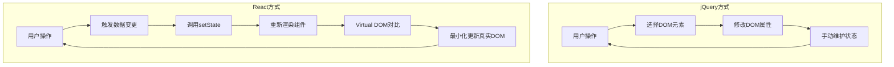

#### React程序流程

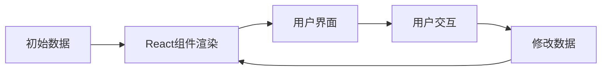

### 5. 经典金句/数据

> “React是一个聪明的建筑工人，而jQuery是一个比较傻的建筑工人，开发者你就是一个建筑的设计师。” (p.12)

> “UI = render(data)” (p.12)

> “React利用函数式编程的思维来解决用户界面渲染的问题，最大的优势是开发者的效率会大大提高，开发出来的代码可维护性和可阅读性也大大增强。” (p.14)

---

## 第2章：设计高质量的React组件

### 1. 核心论点

本章讨论“如何设计易于维护、高内聚低耦合的React组件”。作者认为：优秀组件的核心在于清晰界定prop（对外接口）和state（内部状态）的职责，并正确运用生命周期函数管理组件行为。

### 2. 关键概念/事件

- **prop**：组件的对外接口，从父组件接收数据，不可在组件内部修改。类型可以是字符串、数字、函数、对象等任意JavaScript类型。
- **state**：组件的内部状态，通过this.setState修改，每次修改触发组件重新渲染。
- **propTypes**：React提供的prop类型检查机制，在开发阶段帮助发现接口使用错误。
- **defaultProps**：为可选的prop设置默认值。
- **生命周期**：组件从创建到销毁经历的过程，分为装载（Mount）、更新（Update）、卸载（Unmount）三个阶段。

### 3. 逻辑推演/叙事脉络

本章以ControlPanel和Counter组件组合为例，首先明确组件拆分的“高内聚、低耦合”原则。随后详细对比prop和state的差异：prop是外部传入的只读数据，state是内部可变的记忆。

生命周期部分是本章核心，作者按时间顺序解析了装载过程（constructor → componentWillMount → render → componentDidMount）、更新过程（componentWillReceiveProps → shouldComponentUpdate → componentWillUpdate → render → componentDidUpdate）和卸载过程（componentWillUnmount）。特别强调了shouldComponentUpdate对性能优化的关键作用。

最后，通过让子组件Counter向父组件ControlPanel传递数据的实例，展示了组件间通信的方式——将函数作为prop传递。同时指出这种方式的局限：多级传递会导致数据冗余和状态不一致，为下一章引入Flux/Redux埋下伏笔。

### 4. 流程图

#### React组件生命周期

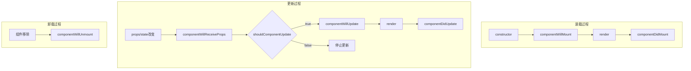

#### 组件状态管理困局

```mermaid
graph LR
    subgraph 问题：数据冗余
        A[Counter组件 state.count] --> B[ControlPanel组件 state.sum]
        A -.->|数据不一致风险| B
    end
    
    subgraph 解决方案：全局状态
        C[全局Store] --> D[Counter组件]
        C --> E[ControlPanel组件]
    end
```

### 5. 经典金句/数据

> “差劲的程序员操心代码，优秀的程序员操心数据结构和它们之间的关系。”——Linus Torvalds (p.17)

> “prop是组件的对外接口，state是组件的内部状态，对外用prop，内部用state。” (p.18)

> “组件不应该改变prop的值，而state存在的目的是让组件来改变的。” (p.24)

---

## 第3章：从Flux到Redux

### 1. 核心论点

本章追溯Redux的思想起源，通过对比Flux和Redux的异同，回答“为什么需要单向数据流框架”以及“Redux相比Flux改进了什么”。作者认为：MVC框架在大型前端应用中的失败源于View和Model的直接对话，Flux用强制单向数据流解决了这个问题，而Redux进一步通过单一数据源、纯函数Reducer简化了状态管理。

### 2. 关键概念/事件

- **Flux**：Facebook与React同时推出的应用架构，包含Dispatcher、Store、Action、View四部分，强调单向数据流。
- **Dispatcher**：Flux的核心调度器，接收Action并分发给所有注册的Store。
- **waitFor**：Dispatcher的方法，用于解决Store之间的依赖关系。
- **Redux三大原则**：唯一数据源（Single Source of Truth）、状态只读（State is read-only）、数据改变只能通过纯函数（Changes are made with pure functions）。
- **Reducer**：Redux中的纯函数，接收当前state和action，返回新的state。
- **容器组件与傻瓜组件**：容器组件负责与Redux Store交互，傻瓜组件只负责渲染UI。
- **Context**：React提供的跨层级传递数据的机制，react-redux的Provider基于此实现。
- **react-redux**：官方提供的React绑定库，提供connect和Provider两个核心功能。

### 3. 逻辑推演/叙事脉络

本章首先剖析MVC框架的缺陷——View和Model之间形成复杂的“蜘蛛网”依赖，导致代码难以维护。Flux通过强制单向数据流（Action → Dispatcher → Store → View）打破这种混乱。

随后，作者用Flux重新实现ControlPanel应用，展示了Dispatcher、Action、Store、View四部分的协作。在实践过程中，暴露了Flux的两个问题：Store之间的依赖需要waitFor机制，服务器端渲染困难。

接着引入Redux，用三个版本（基础版、容器/傻瓜组件拆分版、Context版、最终react-redux版）逐步改进ControlPanel，清晰展示了Redux如何简化状态管理。核心改进包括：用单一Store代替多个Store、用纯函数Reducer处理状态更新、用Provider+Context替代手动传递Store。

最后总结：Redux不是功能的增加，而是通过“限制”换来了代码的可预测性和可维护性。

### 4. 流程图

#### MVC的缺陷

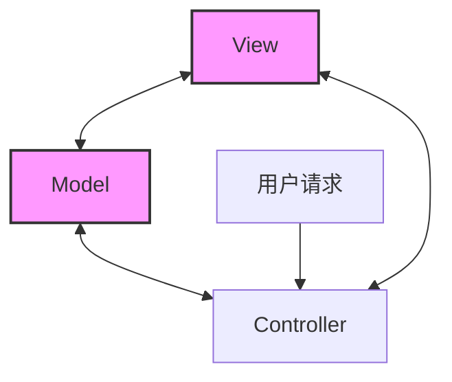

#### Flux单向数据流

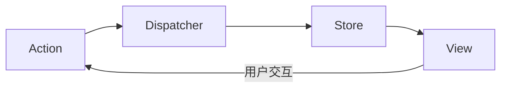

#### Redux三大原则

```mermaid
graph TD
    subgraph 原则1：唯一数据源
        A1[Store] --> A2[状态树]
    end
    
    subgraph 原则2：状态只读
        B1[View] -->|派发Action| B2[Reducer]
        B2 -->|返回新状态| B1
    end
    
    subgraph 原则3：纯函数修改
        C1[旧状态 + Action] --> C2[Reducer纯函数] --> C3[新状态]
    end
```

#### 容器组件与傻瓜组件

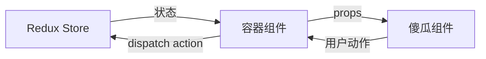

### 5. 经典金句/数据

> “如果你愿意限制做事方式的灵活度，你几乎总会发现可以做得更好。”——John Carmark (p.58)

> “Redux并没有阻止一个应用拥有多个Store，只是，在Redux的框架下，让一个应用拥有多个Store不会带来任何好处。” (p.56)

> “connect是react-redux提供的一个方法，这个方法接收两个参数mapStateToProps和mapDispatchToProps，执行结果依然是一个函数，所以才可以在后面又加一个圆括号。” (p.72)

---

## 第4章：模块化React和Redux应用

### 1. 核心论点

本章解决“如何组织大型React/Redux应用的代码结构和状态树”的问题。作者提出三大要点：按功能组织代码文件、明确模块边界、精心设计状态树结构（一个模块控制一个状态节点、避免冗余数据、树形结构扁平）。

### 2. 关键概念/事件

- **按角色组织vs按功能组织**：MVC传统是按角色（controllers/models/views）组织，Redux更适合按功能（todoList/filter等模块）组织。
- **模块边界**：每个功能模块的index.js作为统一接口，内部细节对外不可见。
- **combineReducers**：Redux提供的函数，用于将多个reducer合并为一个，每个reducer管理状态树的一个分支。
- **ref**：React提供的直接访问DOM元素的“逃生舱”，应谨慎使用。
- **React Devtools / Redux Devtools / React Perf**：Chrome扩展，React/Redux开发的必备辅助工具。
- **redux-immutable-state-invariant**：开发环境下检测reducer是否违反纯函数原则的中间件。

### 3. 逻辑推演/叙事脉络

本章从“开始新项目必须考虑的三件事”出发：代码组织结构、模块边界、状态树设计。对比了“按角色组织”和“按功能组织”两种方式，明确指出按功能组织更利于大型应用的维护。

随后构建Todo应用实例，按功能划分为todos和filter两个模块。从状态树设计（todos数组 + filter枚举）开始，逐步实现actionTypes、actions、reducer（使用扩展操作符处理不可变更新）、视图组件。

在视图部分，特别讨论了ref的使用场景和替代方案（onChange事件 + 组件状态绑定），强调应尽量避免ref。最后介绍了开发辅助工具（Chrome扩展、中间件、Store Enhancer）的配置方法。

### 4. 流程图

#### 按功能组织 vs 按角色组织

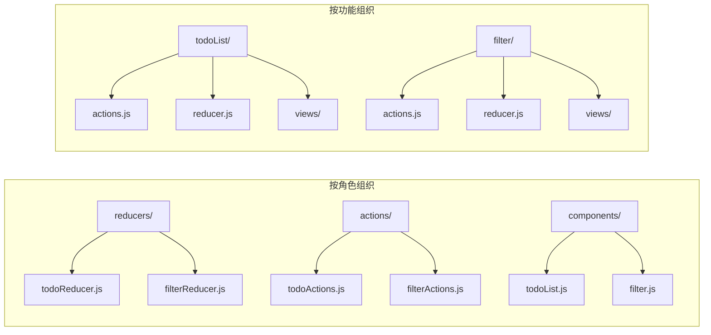

#### reducer组合原理

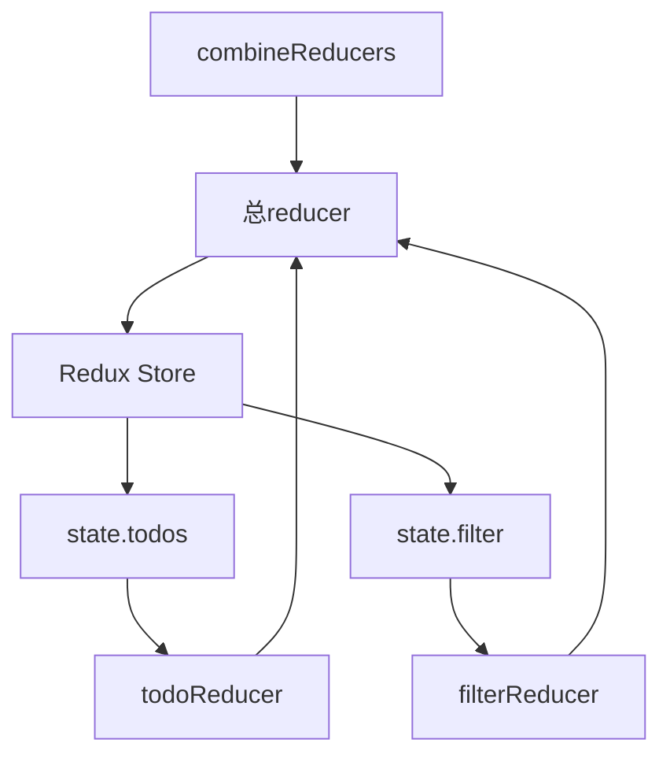

### 5. 经典金句/数据

> “在最理想的情况下，我们应该通过增加代码就能增加系统的功能，而不是通过对现有代码的修改来增加功能。”——Robert C. Martin (p.79)

> “工欲善其事，必先利其器。——《论语·卫灵公》” (p.100)

> “在product开发中，应该尽量避免ref的使用，而换用这种状态绑定的方法来获取元素的值。” (p.100)

---

## 第5章：React组件的性能优化

### 1. 核心论点

本章讨论“如何通过最小化不必要的渲染来提高React应用性能”。作者从单个组件优化（shouldComponentUpdate）、多个组件优化（Reconciliation算法、key属性）和数据获取优化（reselect）三个层面，系统阐述了性能优化的方法论。

### 2. 关键概念/事件

- **shouldComponentUpdate**：决定组件是否需要重新渲染的生命周期函数，默认返回true。通过浅比较props和state可以避免无效渲染。
- **Reconciliation（调和）**：React对比新旧Virtual DOM并计算最小DOM操作的过程。时间复杂度为O(N)而非O(N³)。
- **key**：用于帮助React识别动态子组件列表中每个元素的唯一标识，避免因位置变化导致的无效重新渲染。
- **浅层比较（shallow compare）**：react-redux使用的比较策略，只比较对象的第一层引用，要求函数和对象类型的prop保持同一引用。
- **reselect**：创建“记忆化”选择器的库，通过两阶段计算（先取子状态，再计算派生数据）避免重复计算。
- **范式化状态树**：参照关系型数据库设计原则，减少数据冗余，配合reselect可兼顾性能和一致性。

### 3. 逻辑推演/叙事脉络

本章从React Perf工具发现Todo应用的“浪费渲染”开始，引出性能优化的话题。作者引用高德纳的名言，区分了“97%的无关紧要优化”和“3%的关键优化”。

第一个优化点是单个组件：利用react-redux的connect自动为组件添加智能的shouldComponentUpdate（浅层比较）。但即使如此，TodoItem仍存在浪费，原因是传递给子组件的函数prop每次都是新创建的。解决方案是让函数prop保持同一引用，或让子组件自己处理action派发。

第二个优化点是多个组件：详细解释了React的Reconciliation算法。当节点类型不同时，整个子树被销毁重建；当类型相同时，对比属性和内容；对于子组件列表，默认按位置比较，这会导致插入操作引发大量无效更新——因此必须使用稳定的key。

第三个优化点是数据获取：reselect通过“记忆化”避免重复计算，其核心是先快速提取子状态，如果子状态未变则直接返回缓存结果。配合范式化状态树（如用typeId代替嵌套的type对象），可在保持数据一致性的同时保证性能。

### 4. 流程图

#### React Reconciliation算法

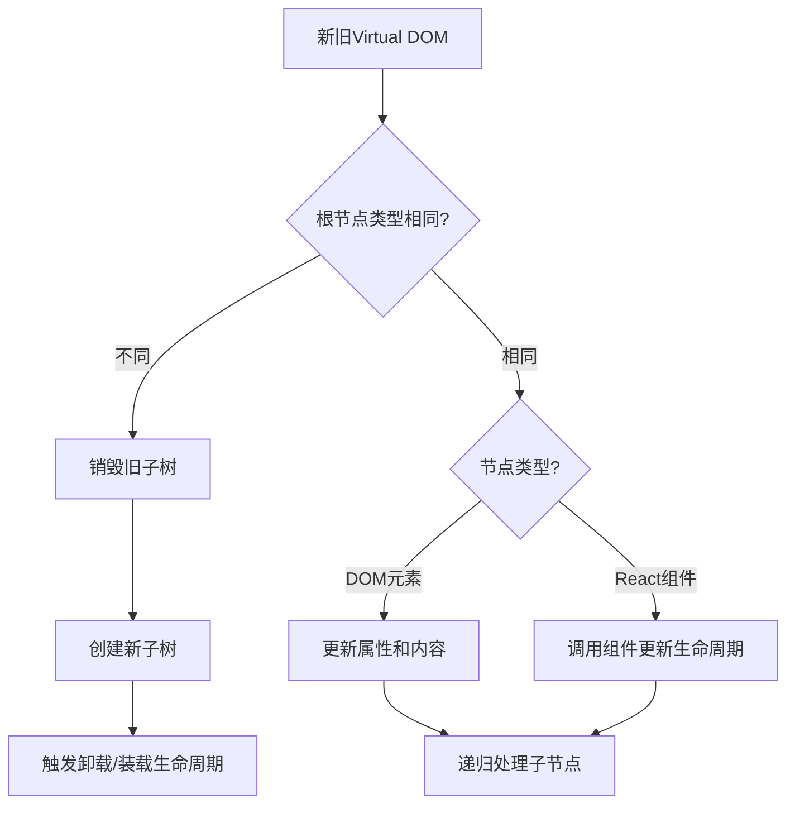

#### key属性的作用

```mermaid
graph LR
    subgraph 无key（按位置比较）
        A1[Item0] --> B1[Item0'（误认为同一实例）]
        A2[Item1] --> B2[Item1']
        A3[--] --> B3[新增Item]
    end
    
    subgraph 有key（按标识比较）
        C1[key=0 Item0] --> D1[新增key=0]
        C2[key=1 Item1] --> D2[key=1保持不变]
        C3[--] --> D3[key=2新增]
    end
```

#### reselect两阶段计算

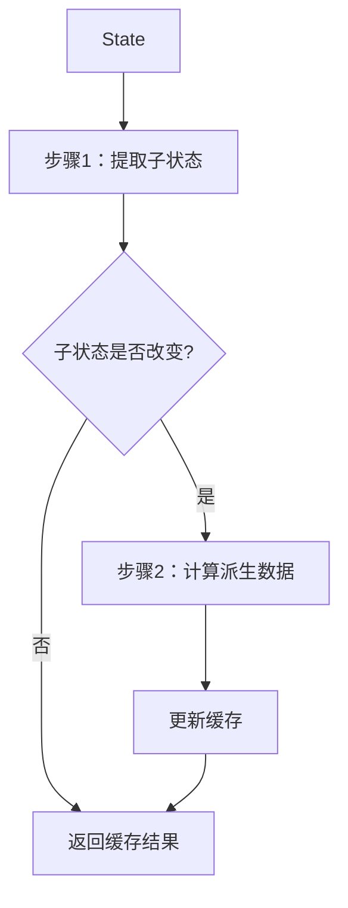

### 5. 经典金句/数据

> “过早的优化是万恶之源。”——高德纳（完整版：97%的情况下如此，另外3%的关键优化不嫌早）(p.107)

> “我们应该忘记忽略很小的性能优化，可以说97%的情况下，过早的优化是万恶之源，而我们应该关心对性能影响最关键的那另外3%的代码。” (p.107)

> “用数组下标作为key，看起来key值是唯一的，但是却不是稳定不变的……这就让React彻底乱套了。” (p.122)

---

## 第6章：React高级组件

### 1. 核心论点

本章解决“如何在多个组件间复用非UI逻辑”的问题。作者介绍了两种高级组件模式：高阶组件（HOC）和“以函数为子组件”。核心观点是：优先考虑组合而非继承，代理方式的高阶组件优于继承方式。

### 2. 关键概念/事件

- **高阶组件（HOC）**：一个函数，接受一个组件作为参数，返回一个增强后的新组件。分为代理方式和继承方式。
- **代理方式HOC**：返回的新组件继承自React.Component，在render中渲染被包裹组件，可操作props、访问ref、抽取状态、包装组件。
- **继承方式HOC**：返回的新组件继承自被包裹组件，通过super.render()渲染，可操作生命周期函数。
- **displayName**：为HOC设置可读的组件名，便于调试（如`Connect(DemoComponent)`）。
- **以函数为子组件**：一种模式，组件将函数作为children，在render中调用该函数并传递数据，实现最大灵活性。
- **Mixin（已废弃）**：React早期的代码复用方式，只能在React.createClass中使用，已被官方废弃。

### 3. 逻辑推演/叙事脉络

本章首先通过一个简单的removeUserProp HOC示例，解释HOC的基本形态：接受WrappedComponent，返回新组件。随后将HOC分为代理和继承两大类。

代理方式HOC是重点，详细展示了四种应用场景：操纵prop（增删改）、访问ref（通过linkRef获取子组件实例）、抽取状态（模拟react-redux的connect）、包装组件（添加样式div）。这些场景的共同特点是：新组件和被包裹组件是独立的，通过props传递数据。

继承方式HOC则不同，新组件继承自WrappedComponent，可以重写生命周期函数（如根据loggedIn决定是否渲染），但这种方式更复杂且不推荐。作者引用“优先考虑组合，然后才考虑继承”的原则，明确推荐代理方式。

接着介绍了“以函数为子组件”模式，以CountDown倒计时组件为例，展示了其极致灵活性——子组件函数可以自由处理传入的数据（直接显示、转换prop名、传递给其他组件）。但此模式存在性能问题：无法像HOC那样利用shouldComponentUpdate，且JSX中的匿名函数会每次都创建新函数。

最后简述了已废弃的Mixin，作为历史背景。

### 4. 流程图

#### 高阶组件（代理方式）工作原理

```mermaid
graph TD
    A[WrappedComponent] --> B[HOC函数]
    B --> C[NewComponent]
    C --> D[render函数]
    D --> E[操作props/访问ref等]
    E --> F[<WrappedComponent {...newProps} />]
```

#### “以函数为子组件”模式

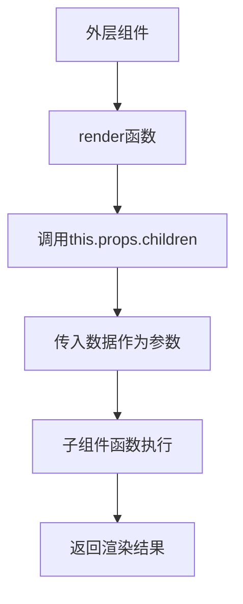

#### CountDown组件示例

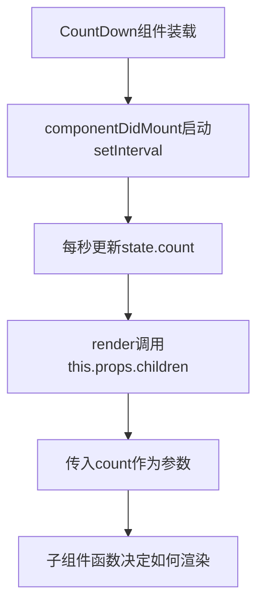

### 5. 经典金句/数据

> “重复是优秀系统设计的大敌。”——Robert C. Martin (p.129)

> “优先考虑组合，然后才考虑继承。”(Composition over Inheritance) (p.139)

> “这种‘以函数为子组件’的模式非常适合于制作动画，类似CountDown这样的例子决定动画每一帧什么时候绘制，绘制的时候是什么样的数据。” (p.145)

---

## 第7章：Redux和服务器通信

### 1. 核心论点

本章解决“在Redux架构中如何处理异步服务器请求”的问题。作者认为：异步操作应在action被reducer处理前介入，通过中间件（如redux-thunk）拦截函数类型的action，在异步操作完成后派发普通同步action。

### 2. 关键概念/事件

- **fetch**：浏览器原生网络请求API，返回Promise对象，需配合proxy解决跨域问题。
- **redux-thunk**：Redux异步中间件，检查action是否为函数，若是则执行该函数并传入dispatch和getState。
- **异步action三种状态**：进行中（FETCH_STARTED）、成功（FETCH_SUCCESS）、失败（FETCH_FAILURE），对应视图的LOADING/SUCCESS/FAILURE三种状态。
- **异步操作中止**：通过请求序列号（seqId）判断，丢弃过时请求的结果。
- **其他异步方案**：redux-saga、redux-observable、redux-promise等，各有优劣。

### 3. 逻辑推演/叙事脉络

本章从“React组件直接访问服务器”开始，以天气应用为例展示在componentDidMount中发起fetch请求，通过代理解决跨域问题。这种方法简单直观，但将状态和逻辑都放在组件中，不利于大型应用。

随后转向Redux方案，核心问题是：Redux单向数据流是同步的，如何插入异步？答案是通过中间件。redux-thunk检查action是否为函数，若是则执行该函数，函数内部可异步获取数据，完成后用dispatch派发同步action。

完整的异步action模式包含三个动作类型和三个状态。以fetchWeather为例：首先派发FETCH_STARTED（视图显示“加载中”），然后发起fetch请求，成功则派发FETCH_SUCCESS（更新视图），失败则派发FETCH_FAILURE（显示错误）。

最后讨论异步操作的中止问题：快速切换城市可能导致旧请求覆盖新结果。解决方案是为每次请求生成seqId，只有seqId与最新请求一致时才dispatch结果。

### 4. 流程图

#### Redux异步action处理流程

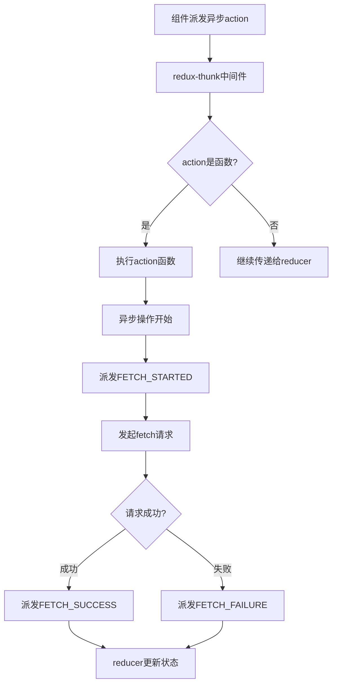

#### 异步操作中止机制

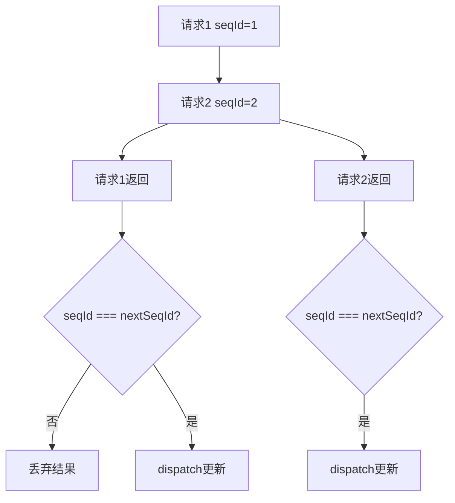

### 5. 经典金句/数据

> “不要相信任何返回结果。” (p.153)

> “redux-thunk的实现极其简单，只有几行代码。” (p.154)

> “在Redux的单向数据流中，在action对象被reducer函数处理之前，是插入异步功能的时机。” (p.155)

---

## 第8章：单元测试

### 1. 核心论点

本章讨论“如何对React和Redux应用进行高效的单元测试”。作者认为：由于React组件被设计为纯函数（无状态组件），Redux的reducer和普通action也是纯函数，整个应用的可测试性非常高。测试的核心是验证输入到输出的映射，而非复杂的内部状态。

### 2. 关键概念/事件

- **Jest**：Facebook出品的测试框架，create-react-app默认集成，自带断言和覆盖率报告。
- **Enzyme**：Airbnb贡献的React组件测试库，支持shallow（浅渲染）、mount（完整渲染）、render（静态HTML）三种渲染方式。
- **sinon.js**：用于创建“间谍”和“存根”的工具，可模拟（stub）函数行为（如fetch）。
- **redux-mock-store**：模拟Redux Store，用于测试异步action构造函数，可记录所有派发的action。
- **测试套件结构**：describe嵌套组织，beforeEach/afterEach管理测试环境。

### 3. 逻辑推演/叙事脉络

本章首先明确单元测试的原则：可测试性来自良好的架构。React/Redux的函数式设计天然具备高可测试性。

随后搭建测试环境：Jest作为框架，Enzyme辅助测试组件，sinon模拟依赖，redux-mock-store测试异步action。

测试实例涵盖五个方面：
1. **普通action构造函数**：验证返回对象的type和payload。
2. **异步action构造函数**：使用redux-mock-store + sinon.stub模拟fetch，验证是否按顺序派发了STARTED/SUCCESS/FAILURE action。
3. **reducer**：纯函数测试，输入state和action，验证输出。
4. **无状态React组件**：使用Enzyme的shallow方法，验证渲染结果是否包含预期的子组件。
5. **被连接的组件**：使用mount + Provider，验证派发action后DOM是否正确更新。

### 4. 流程图

#### 单元测试结构

```mermaid
graph TD
    subgraph 测试套件
        A[describe('模块名')] --> B[beforeEach 准备环境]
        B --> C[it('测试用例1')]
        B --> D[it('测试用例2')]
        D --> E[afterEach 清理环境]
    end
```

#### 异步action测试流程

```mermaid
graph TD
    A[sinon.stub模拟fetch] --> B[创建redux-mock-store]
    B --> C[派发异步action]
    C --> D[等待Promise完成]
    D --> E[store.getActions()]
    E --> F[断言action序列]
```

### 5. 经典金句/数据

> “我发现写单元测试实际上提高了我的编程速度。”——Martin Fowler (p.168)

> “单元测试覆盖率达到了100%，也不表示程序是没有bug的。” (p.169)

> “重要的不是代码容易测试，而是程序的结构非常简单，简单到单元测试都显得没有必要的地步。” (p.181)

---

## 第9章：扩展Redux

### 1. 核心论点

本章讨论“如何通过中间件和Store Enhancer扩展Redux功能”。作者认为：Redux的强大不仅在于其核心，更在于其生态系统的可扩展性。中间件用于增强dispatch函数，Store Enhancer则可以深度定制Store的所有接口。

### 2. 关键概念/事件

- **中间件接口**：`({dispatch, getState}) => next => action => {}`，三层箭头函数嵌套，符合函数式编程风格。
- **applyMiddleware**：Redux提供的函数，将中间件转换为Store Enhancer。
- **Promise中间件**：自定义中间件示例，拦截包含promise字段的action对象，自动处理PENDING/DONE/FAIL三种状态。
- **Store Enhancer接口**：`createStore => (reducer, preloadedState, enhancer) => {}`，可返回增强版的store。
- **reset增强器**：自定义示例，为store增加reset方法，可动态替换reducer和整个状态树。

### 3. 逻辑推演/叙事脉络

本章从中间件接口的剖析开始。一个中间件是三层函数：第一层接收dispatch和getState，第二层接收next（下一个中间件），第三层接收action并处理。这种设计使得中间件可以组合成“管道”，action依次流过。

redux-thunk的实现只有几行：检查action是否为函数，是则执行并传入dispatch/getState，否则调用next交给下一个中间件。

随后开发自定义Promise中间件：拦截包含promise和types字段的action，自动派发PENDING action，等待Promise完成后派发SUCCESS或FAILURE。相比redux-thunk，这减少了重复代码。

Store Enhancer更为强大。applyMiddleware本身就是Enhancer。自定义reset增强器为store添加reset方法，可动态替换reducer和整个状态树——通过创建包装reducer（特殊action类型@@RESET）和replaceReducer实现。

### 4. 流程图

#### Redux中间件管道

```mermaid
graph TD
    A[action对象] --> B[中间件1]
    B -->|next(action)| C[中间件2]
    C -->|next(action)| D[中间件3]
    D -->|next(action)| E[reducer]
    B -.->|可选：dispatch新action| F[重新进入管道]
```

#### Promise中间件工作流程

```mermaid
graph TD
    A[action包含promise和types] --> B[提取PENDING/DONE/FAIL]
    B --> C[dispatch PENDING action]
    C --> D[等待promise完成]
    D --> E{成功?}
    E -->|成功| F[dispatch DONE action]
    E -->|失败| G[dispatch FAIL action]
```

#### reset增强器原理

```mermaid
graph TD
    A[调用store.reset] --> B[创建包装reducer]
    B --> C[replaceReducer]
    C --> D[dispatch @@RESET action]
    D --> E[包装reducer捕获]
    E --> F[返回resetState]
    F --> G[状态树重置完成]
```

### 5. 经典金句/数据

> “redux-thunk极其简单，代码如下：`function createThunkMiddleware(extraArgument) { return ({dispatch, getState}) => next => action => { if (typeof action == 'function') { return action(dispatch, getState, extraArgument); } return next(action); } }`” (p.185)

> “中间件是独立的函数；中间件可以组合使用；中间件有一个统一的接口。” (p.183)

---

## 第10章：动画

### 1. 核心论点

本章介绍“在React中实现动画的两种方式”。作者对比了CSS3方式（ReactCSSTransitionGroup）和脚本方式（React-Motion），认为CSS3方式性能更好但调试困难，脚本方式更灵活但消耗更多CPU，开发者需根据场景权衡。

### 2. 关键概念/事件

- **CSS3 Transition**：定义时间（transition-duration）和速度曲线（transition-timing-function），浏览器原生支持，可启用GPU加速。
- **ReactCSSTransitionGroup**：React官方动画辅助库，用于处理组件的装载（enter）和卸载（leave）动画。需要配合CSS类（如.fade-enter、.fade-enter-active）。
- **requestAnimationFrame**：浏览器原生API，以最优帧率（约60fps）调用回调，比setInterval更精确。
- **React-Motion**：第三方动画库，采用脚本方式，使用“刚度（stiffness）”和“阻尼（damping）”代替时间和速度曲线，大量使用“以函数为子组件”模式。
- **TransitionMotion**：React-Motion中处理组件列表装载/卸载的组件，对应ReactCSSTransitionGroup。

### 3. 逻辑推演/叙事脉络

本章首先对比CSS3和脚本两种动画实现方式。CSS3性能好但难以调试（动画一闪而过），且中断控制不精确；脚本方式灵活但更耗资源。

React官方提供ReactCSSTransitionGroup，专用于装载和卸载过程的动画。以Todo应用为例，为TodoItem添加淡入淡出效果。核心规则：transitionName决定CSS类前缀（如fade），类名分为-enter/-enter-active/-leave/-leave-active，通过分两次添加类触发CSS3 transition。

React-Motion则以不同哲学设计：不依赖CSS，完全用JavaScript控制。使用spring函数定义动画参数（刚度和阻尼），配合Motion和TransitionMotion组件。TransitionMotion的styles属性定义目标状态，willEnter定义初始状态，willLeave定义离开状态——所有状态值都用spring包裹。

两种方式各有适用场景：简单动画用CSS3，复杂交互动画用React-Motion。

### 4. 流程图

#### ReactCSSTransitionGroup工作流程

```mermaid
graph TD
    A[子组件加入] --> B[添加-enter类]
    B --> C[下一时钟周期添加-enter-active类]
    C --> D[CSS3 transition执行]
    D --> E[transitionEnd后移除类]
    
    F[子组件移除] --> G[添加-leave类]
    G --> H[添加-leave-active类]
    H --> I[CSS3 transition执行]
    I --> J[transitionEnd后移除DOM]
```

#### React-Motion TransitionMotion工作流程

```mermaid
graph TD
    A[styles数组定义目标状态] --> B[willEnter定义初始状态]
    B --> C[TransitionMotion渲染]
    C --> D[调用子组件函数]
    D --> E[传入插值后的style]
    E --> F[子组件渲染]
    F --> G[组件移除时调用willLeave]
    G --> H[返回结束状态spring值]
    H --> I[动画完成后移除]
```

### 5. 经典金句/数据

> “为什么要选择16毫秒？因为每秒渲染60帧（60fps）会给用户带来足够流畅的视觉体验，1000 ÷ 60 ≈ 16。” (p.198)

> “React-Motion提出用另外两个参数来定义动画，一个是刚度（stiffness），另一个是阻尼（damping）。” (p.205)

> “Motion并不直接参与动画的绘制，它只是提供参数。具体的绘制过程，由作为子组件的绘制函数来完成。” (p.206)

---

## 第11章：多页面应用

### 1. 核心论点

本章解决“如何用React构建多页面单页应用（SPA）”以及“如何通过代码分片优化性能”的问题。作者认为：React-Router是实现路由的官方方案，通过配置路径到组件的映射实现“可收藏”的单页应用；当应用变大时，必须用webpack的代码分片实现按需加载。

### 2. 关键概念/事件

- **单页应用（SPA）**：只有一个HTML页面，通过JavaScript动态更新内容，URL变化通过History API实现，页面不刷新。
- **React-Router**：官方路由库，核心组件包括Router、Route、IndexRoute、Link。
- **browserHistory**：使用浏览器History API的路由模式，URL看起来像正常路径（如/home），而非hash模式（#/home）。
- **嵌套路由**：Route可嵌套，外层Route的组件通过children prop渲染内层组件，实现布局复用。
- **代码分片（Code Splitting）**：webpack将代码拆分为多个chunk，按需加载。核心是require.ensure或动态import。
- **CommonsChunkPlugin**：webpack插件，提取多个chunk的共同模块到单独文件（如common.js）。

### 3. 逻辑推演/叙事脉络

本章首先定义单页应用的两个目标：页面切换不刷新、URL与内容一致。React-Router通过Router + Route实现路径到组件的映射。

简单示例包含Home、About、NotFound三个页面。使用Link组件代替`<a>`标签，避免页面跳转。通过嵌套路由，将TopMenu放在外层App组件中，所有页面自动拥有顶栏。IndexRoute定义根路径的默认页面。

集成Redux时，需让Provider在外层（包住Router），或通过Router的createElement属性为每个Route组件包裹Provider。react-router-redux可将路由状态同步到Redux Store，实现“时间旅行”调试。

当应用变大后，需代码分片。先执行`npm run eject`暴露webpack配置，修改output的chunkFilename和添加CommonsChunkPlugin。然后在路由中使用`require.ensure`异步加载页面组件，配合Route的`getComponent`属性。最终效果是访问首页只下载common.js + bundle.js + home.chunk.js，切换到about页才下载about.chunk.js。

最后处理动态加载reducer的问题：通过reset增强器，在加载页面时同时合并新reducer和初始状态。

### 4. 流程图

#### React-Router路由匹配

```mermaid
graph TD
    A[URL: /about] --> B[Router遍历Route]
    B --> C{匹配 / ?}
    C -->|是| D[渲染App组件]
    D --> E{剩余路径 about?}
    E -->|是| F[渲染About组件作为children]
    E -->|否| G[继续匹配其他Route]
```

#### webpack代码分片原理

```mermaid
graph TD
    subgraph 模块依赖图
        A[entry.js] --> B[module1]
        A --> C[module2]
        C --> D[module3]
        C --> E[module4]
        D --> F[module5]
    end
    
    subgraph 打包结果
        G[bundle.js] --> G1[module1]
        G --> G2[module2]
        H[common.js] --> H1[module3]
        I[pageA.chunk.js] --> I1[module4]
        J[pageB.chunk.js] --> J1[module5]
    end
```

#### 动态加载模块流程

```mermaid
graph TD
    A[访问/counter页面] --> B[匹配Route]
    B --> C[调用getComponent]
    C --> D[require.ensure]
    D --> E[webpack加载counter.chunk.js]
    E --> F[获取page/reducer/stateKey/initState]
    F --> G[store.reset合并新reducer和状态]
    G --> H[callback返回page组件]
    H --> I[渲染页面]
```

### 5. 经典金句/数据

> “在大型应用中，因为功能很多，若把所有页面的JavaScript打包到一个bundle.js中，那么用户访问任何一个网页，都需要下载整个网站应用的功能。” (p.222)

> “提高网页性能的另一个重要原则是减少HTTP请求数，虽然代码分片减少了每个页面的代码下载量，却也增加了引用的JavaScript资源数，但是这只影响用户访问的第一个页面。” (p.223)

---

## 第12章：同构

### 1. 核心论点

本章讨论“如何让React组件既能在浏览器端渲染，也能在服务器端渲染（同构）”。作者分析了服务器端渲染的优劣：缩短TTFP（首屏时间）、利于SEO，但增加服务器压力。核心实现需要处理：服务器端渲染HTML（renderToString）、数据脱水和注水、每个请求独立的Redux Store、服务器端路由匹配。

### 2. 关键概念/事件

- **TTFP（Time To First Paint）**：从HTTP请求发出到用户看到第一个有意义内容的时间。服务器端渲染比浏览器端渲染少1-2个HTTP往返。
- **同构（Isomorphic）**：同一份React代码在服务器和浏览器端都能运行。
- **renderToString**：ReactDOMServer提供的函数，将React组件渲染为HTML字符串。
- **脱水（Dehydrate）与注水（Rehydrate）**：服务器端渲染时将store状态内嵌到HTML（脱水），浏览器端读取该状态初始化store（注水）。
- **热加载（Hot Load）**：代码修改后不刷新页面，只替换组件逻辑，保持状态不变。需要webpack-dev-middleware + webpack-hot-middleware + react-hot-loader。
- **match函数**：React-Router提供的服务器端路由匹配函数，根据URL和routes返回匹配结果。

### 3. 逻辑推演/叙事脉络

本章首先对比服务器端渲染和浏览器端渲染的历史与优劣。服务器端渲染返回完整HTML，TTFP更短，利于SEO；浏览器端渲染减少服务器压力，但首屏需等待多个请求。React同构可以“鱼与熊掌兼得”。

第一步：搭建Express服务器，替代create-react-app的默认服务器。开发模式需支持热加载，使用webpack-dev-middleware（实时编译）和webpack-hot-middleware（推送更新到浏览器）。产品模式读取asset-manifest.json获取带hash的文件名。

第二步：实现同构核心。服务器端使用renderToString将React组件渲染为HTML字符串，同时从store.getState()获取“脱水数据”内嵌到页面。浏览器端读取window.DEHYDRATED_STATE变量作为store的初始状态，用render方法“注水”。

第三步：处理服务器端特有逻辑。每个请求创建独立的Redux Store（通过configureStore函数）。使用React-Router的match函数进行路由匹配，而非依赖浏览器URL。对于需要异步初始化数据的页面（如CounterPage），通过initState函数获取数据后设置store状态。

最终实现了：直接访问/counter时，服务器端获取初始值100，渲染完整HTML并脱水；从其他页面点击链接进入/counter时，浏览器端通过API获取初始值并渲染。

### 4. 流程图

#### 服务器端渲染 vs 浏览器端渲染时间线

```mermaid
graph TD
    subgraph 浏览器端渲染
        A1[请求HTML] --> B1[返回空HTML]
        B1 --> C1[请求JS]
        C1 --> D1[执行JS]
        D1 --> E1[请求API]
        E1 --> F1[渲染内容]
    end
    
    subgraph 服务器端渲染
        A2[请求HTML] --> B2[服务器获取数据]
        B2 --> C2[服务器渲染HTML]
        C2 --> D2[返回完整HTML]
        D2 --> E2[浏览器请求JS]
        E2 --> F2[注水/事件绑定]
    end
```

#### 同构数据流（脱水/注水）

```mermaid
graph TD
    subgraph 服务器端
        A[Redux Store] --> B[renderToString]
        B --> C[HTML字符串]
        A --> D[store.getState]
        D --> E[脱水数据JSON]
        C --> F[返回给浏览器]
        E --> F
    end
    
    subgraph 浏览器端
        F --> G[解析HTML]
        G --> H[显示内容]
        F --> I[读取DEHYDRATED_STATE]
        I --> J[创建Store并注水]
        J --> K[React.render]
        K --> L[事件绑定完成]
    end
```

#### 服务器端请求处理流程

```mermaid
graph TD
    A[HTTP请求] --> B[match路由匹配]
    B --> C{匹配成功?}
    C -->|否| D[返回404]
    C -->|是| E[创建新Store]
    E --> F[调用页面的initState]
    F --> G[等待Promise完成]
    G --> H[store.reset合并reducer和状态]
    H --> I[renderToString]
    I --> J[获取脱水数据]
    J --> K[渲染EJS模板]
    K --> L[返回HTML]
```

### 5. 经典金句/数据

> “React被发明出来就是为了满足浏览器端渲染的需要，Facebook已经明确说React并不是给服务器端渲染设计的，Facebook本身也没有在实际产品中应用React的服务器端渲染。” (p.238-239)

> “服务器端渲染产出了HTML，但是在交给浏览器的网页中不光要有HTML，还需要有‘脱水数据’，也就是在服务器渲染过程中给React组件的输入数据。” (p.248)

> “使用脱水数据要防止跨站脚本攻击（XSS Attack），因为脱水数据有可能包含用户输入的内容。” (p.249)

---

## 结语

### 核心论点

作者在结语中升华主题：React和Redux最宝贵的不是“强大”或“灵活”，而是“限制”。正是这些限制——单向数据流、纯函数Reducer、不可变状态——让大型应用的状态变化变得可预测、可追溯、可维护。

### 经典金句

> “让我告诉你我想到的词语，那就是‘限制’。” (p.258)

> “限制在这里绝不是贬义词，恰恰相反，是对技术框架的最高夸奖，因为限制能够确保程序按照可控的方式进化。” (p.258)

> “以往我们以为靠惯例可以实现纪律，事实证明不行，程序员也是人，人就会违反惯例，所以，与其苦口婆心说服程序员遵守规则，不如让技术框架本身施加限制。” (p.258-259)

> “在电影《黑客帝国》系列故事的最后，主角‘救世主’尼奥终于面对了母体的架构师……在现实世界里，我们通常都尊崇同为人类的尼奥，但在软件开发的世界里，程序员的角色更应该像是尼奥，还是母体的架构师呢？” (p.259)