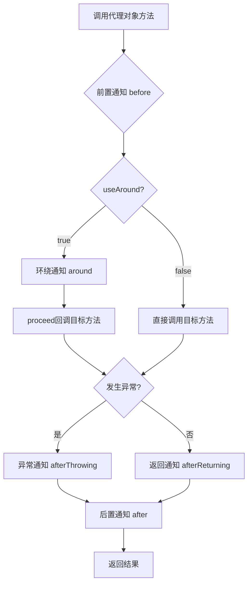
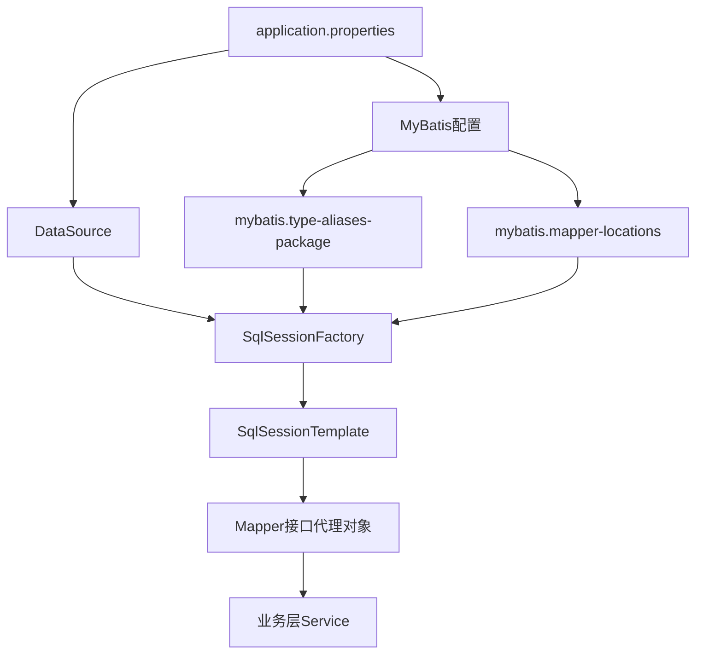
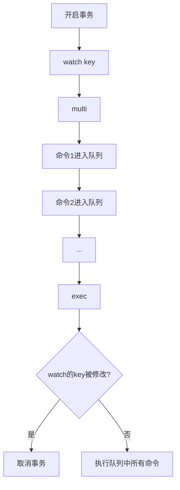
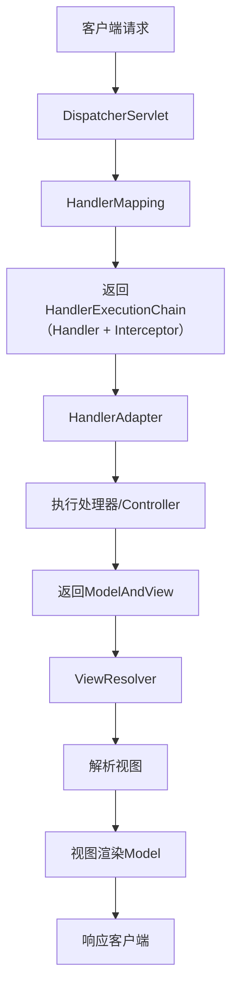
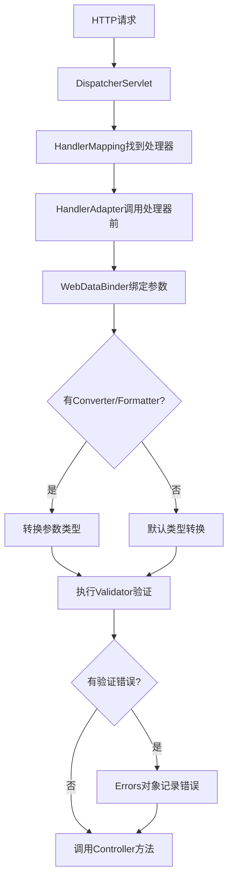
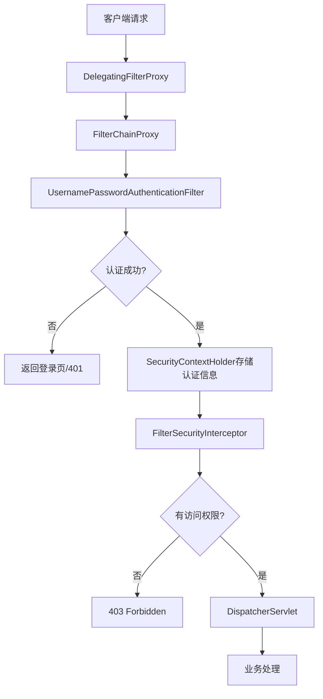
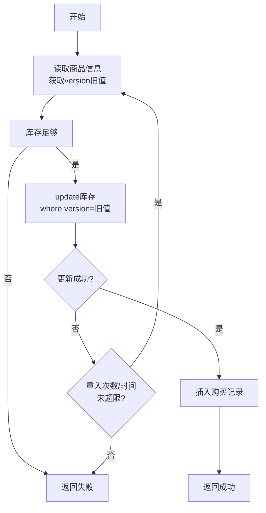
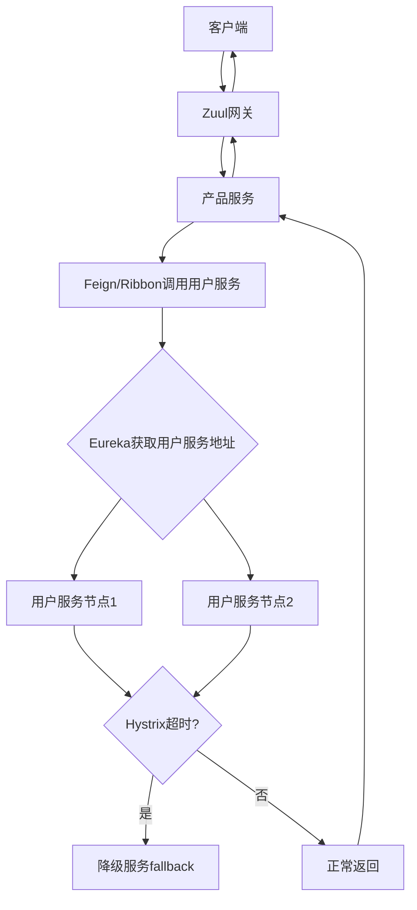

# 《深入浅出Spring Boot 2.x》章节总结

## 书籍信息
- **书名**：深入浅出Spring Boot 2.x
- **作者**：杨开振
- **出版信息**：人民邮电出版社，2018年8月第1版
- **PDF状态**：扫描版PDF，部分内容可能识别不完整
- **OCR状态**：已进行OCR识别，存在少量文字错位或丢失

## 目录说明
- **目录识别情况**：完整识别全书17章及附录结构
- **章节对应依据**：基于PDF原始页码和目录页（第10-14页）
- **OCR修复说明**：部分代码清单格式可能不完整，已基于可见文本恢复

## 全书核心主题

本书系统讲解Spring Boot 2.x企业级开发技术。作者从传统Spring与Spring Boot的对比入手，阐述Spring Boot“约定优于配置”的核心思想。全书以全注解方式贯穿，覆盖Spring IoC、AOP、数据库编程（JDBC/JPA/MyBatis）、事务管理、NoSQL（Redis/MongoDB）、Spring MVC、REST风格、安全控制（Spring Security）、异步消息、WebSocket、新版WebFlux响应式框架等核心内容。第15章以抢购商品为实战案例，深入讲解高并发场景下的锁机制（悲观锁/乐观锁）和Redis解决方案。第16-17章涵盖部署、测试、监控及Spring Cloud分布式开发入门。附录补充了内嵌服务器切换、自定义启动商标、自动装配原理等知识点。

---

## 第1章：Spring Boot来临

### 1. 核心论点

**问题**：传统Spring开发（尤其是XML配置）烦琐复杂，影响开发效率；企业需要更快速、简洁的微服务开发框架。

**观点**：Spring Boot通过“约定优于配置”原则，结合内嵌服务器、自动配置和starter依赖机制，极大简化Spring应用开发、部署和测试，成为微服务时代的主流框架。

### 2. 关键概念/事件

- **Spring起源**：Rod Johnson在2002年提出Spring概念，2004年推出1.0版本，以IoC和AOP两大核心理念颠覆了EJB时代。
- **注解 vs XML**：Spring早期以XML为主，JDK 5引入注解后，Spring逐步支持注解，到Spring 4.x可完全脱离XML，全注解开发成为主流。
- **Spring Boot诞生**：2014年Pivotal团队推出Spring Boot 1.0，2018年3月推出2.0 GA版本（基于Spring 5，支持Java 9）。
- **约定优于配置**：Spring Boot的核心思想，提供默认配置和starter依赖，开发者只需少量自定义即可运行项目。
- **与传统Spring MVC对比**：传统开发需要配置DispatcherServlet、视图解析器、适配器等，而Spring Boot只需添加依赖和启动类即可运行。

### 3. 逻辑推演/叙事脉络

作者首先回顾Spring历史：从EJB时代的繁重配置，到Rod Johnson提出Spring框架，再到IoC和AOP成为事实标准。接着指出Spring早期以XML配置为主，注解出现后形成“XML配置公共Bean + 注解配置业务Bean”的混合模式。随着注解功能增强，Spring 4.x后全注解成为可能。Pivotal团队基于此开发Spring Boot，进一步简化开发。作者通过传统Spring MVC项目（需要配置DispatcherServlet、WebConfig、Controller等）与Spring Boot项目（只需pom依赖 + 一个启动类）的对比，直观展示Spring Boot的简洁性：无需配置XML、无需单独下载服务器、无需部署WAR包，即可通过Java Application运行Web应用。

### 4. 流程图

#### 传统Spring MVC配置流程 vs Spring Boot启动流程

```mermaid
graph TD
    subgraph 传统Spring MVC
    A1[配置web.xml] --> A2[配置DispatcherServlet]
    A2 --> A3[配置Spring IoC容器]
    A3 --> A4[配置视图解析器]
    A4 --> A5[开发Controller]
    A5 --> A6[部署到Tomcat等服务器]
    end
    
    subgraph Spring Boot
    B1[添加spring-boot-starter-web依赖] --> B2[编写启动类@SpringBootApplication]
    B2 --> B3[编写Controller]
    B3 --> B4[运行main方法]
    B4 --> B5[内嵌Tomcat自动启动]
    end
```

### 5. 经典金句/数据

> “Spring Boot不是代替Spring，而是让Spring框架更加容易得到快速的使用。”

> “约定优于配置，这是Spring Boot的主导思想。”

> “Spring Boot致力于在蓬勃发展的快速应用开发领域（rapid application development）借助Java EE在企业互联网的强势地位成为业界领导者。”

---

## 第2章：聊聊开发环境搭建和基本开发

### 1. 核心论点

**问题**：如何搭建Spring Boot开发环境并理解其自动配置机制？

**观点**：通过IDE插件（STS或IntelliJ IDEA）可快速创建Spring Boot工程，核心依赖由starter管理，自动配置类（如DispatcherServletAutoConfiguration）根据classpath和配置文件自动装配Bean，开发者只需在application.properties中进行少量自定义即可。

### 2. 关键概念/事件

- **STS插件**：Eclipse的Spring Tool Suite插件，支持通过向导创建Spring Boot项目并选择starter。
- **spring-boot-starter-parent**：Maven父项目，统一管理依赖版本。
- **@SpringBootApplication**：组合注解，包含@Configuration、@EnableAutoConfiguration、@ComponentScan。
- **application.properties**：Spring Boot核心配置文件，支持自定义（如server.port=8090）。
- **配置文件加载顺序**：命令行参数 > JNDI属性 > 系统属性 > 环境变量 > 外部配置文件 > 内部配置文件 > @PropertySource > 默认属性。

### 3. 逻辑推演/叙事脉络

作者首先介绍Eclipse和IntelliJ IDEA两种IDE下创建Spring Boot项目的方法：通过STS插件或Spring Initializr选择starter（如AOP、Web），IDE自动生成pom.xml、启动类和Servlet初始化类。然后深入分析Spring Boot的自动配置原理：以spring-boot-starter-web为例，查看其pom发现依赖了tomcat、spring-webmvc等；再查看spring-boot-autoconfigure包中的DispatcherServletAutoConfiguration，发现其通过@Conditional系列注解（如@ConditionalOnClass）在满足条件时自动创建DispatcherServlet等Bean。最后演示如何通过application.properties自定义配置（如修改端口、配置视图解析器前缀后缀），并开发一个简单的JSP视图控制器，展示Spring Boot“开箱即用、按需修改”的特点。

### 4. 经典金句/数据

> “Spring Boot内部已经自动为我们做了很多关于DispatcherServlet的配置，这些注解能够读入配置文件的内容来自定义自动初始化所需的内容。”

> “spring.mvc.view.prefix和spring.mvc.view.suffix是Spring Boot与我们约定的视图前缀和后缀配置。”

---

## 第3章：全注解下的Spring IoC

### 1. 核心论点

**问题**：在全注解方式下，Spring IoC容器如何管理Bean及其依赖关系？

**观点**：通过@Configuration、@Bean、@ComponentScan、@Autowired等注解，可实现完全无XML的Bean装配、依赖注入和生命周期管理。Spring Boot基于此实现全注解开发。

### 2. 关键概念/事件

- **BeanFactory vs ApplicationContext**：BeanFactory是顶级容器接口，提供getBean等基础方法；ApplicationContext是其子接口，扩展了国际化、事件发布、资源解析等功能。
- **AnnotationConfigApplicationContext**：基于注解的IoC容器实现类，Spring Boot内部使用类似机制。
- **@ComponentScan**：扫描指定包下的@Component（及派生注解如@Service、@Repository）类，自动注册为Bean。
- **@Autowired**：按类型注入依赖，存在多个同类型Bean时可按名称匹配或结合@Qualifier消除歧义。
- **生命周期接口**：BeanNameAware、BeanFactoryAware、ApplicationContextAware、InitializingBean、DisposableBean，以及@PostConstruct、@PreDestroy。
- **@Profile**：根据环境激活不同的Bean配置。
- **Spring EL**：支持在@Value中使用表达式（如#{...}）进行运算、方法调用、属性引用。

### 3. 逻辑推演/叙事脉络

作者从IoC容器基本概念入手，解释“通过描述管理Bean”和“管理Bean间依赖关系”两大功能。通过AnnotationConfigApplicationContext演示Java配置类（@Configuration + @Bean）装配Bean。随后转向扫描装配（@ComponentScan + @Component），并详细讲解@ComponentScan的配置项（basePackages、includeFilters、excludeFilters）。依赖注入部分重点分析@Autowired的机制（byType → byName）、@Primary和@Qualifier消除歧义。生命周期部分通过实现多个Aware接口和生命周期接口，配合BeanPostProcessor演示Bean初始化完整流程。属性文件部分介绍@Value、@ConfigurationProperties和@PropertySource的使用。条件装配通过@Conditional + Condition接口实现。作用域（@Scope）区分singleton和prototype等。最后补充@Profile切换环境、@ImportResource引入XML配置、Spring EL增强表达能力。

### 4. 流程图

#### Spring Bean生命周期初始化流程（简化）

```mermaid
graph TD
    A[Bean定义扫描] --> B[依赖注入]
    B --> C[setBeanName<br>BeanNameAware]
    C --> D[setBeanFactory<br>BeanFactoryAware]
    D --> E[setApplicationContext<br>ApplicationContextAware]
    E --> F[@PostConstruct<br>自定义初始化]
    F --> G[afterPropertiesSet<br>InitializingBean]
    G --> H[Bean初始化完成]
    H --> I[@PreDestroy<br>自定义销毁]
    I --> J[destroy<br>DisposableBean]
```

### 5. 经典金句/数据

> “Spring最成功的是其提出的理念，而不是技术本身。它所依赖的两个核心理念，一个是控制反转（IoC），另一个是面向切面编程（AOP）。”

> “@Primary的含义告诉Spring IoC容器，当发现有多个同样类型的Bean时，请优先使用我进行注入。”

> “Spring Boot不拒绝使用XML配置Bean，使用@ImportResource可以引入对应的XML文件。”

---

## 第4章：开始约定编程——Spring AOP

### 1. 核心论点

**问题**：Spring AOP如何实现“约定编程”，将横切逻辑（如事务、日志）与业务逻辑分离？

**观点**：AOP的本质是动态代理，通过约定（切点、通知、切面）将开发者代码织入预定义流程。Spring AOP采用@AspectJ注解方式，支持@Before、@After、@Around、@AfterReturning、@AfterThrowing五种通知类型。

### 2. 关键概念/事件

- **约定编程**：通过提供ProxyBean和Interceptor接口，约定前置/后置/环绕/异常等方法的执行顺序，开发者遵循约定即可将代码织入流程。
- **动态代理**：JDK动态代理（要求目标类有接口）和CGLIB（无接口要求）是实现AOP的底层技术。
- **连接点（Join Point）**：被拦截的具体方法。
- **切点（Pointcut）**：通过表达式（如execution）匹配一组连接点。
- **切面（Aspect）**：包含切点和通知的模块，使用@Aspect标注。
- **引入（Introduction）**：通过@DeclareParents为现有类动态添加新接口实现。
- **织入（Weaving）**：生成代理对象并将通知织入约定流程的过程。

### 3. 逻辑推演/叙事脉络

作者别出心裁地从“约定编程”入手，避免直接讲解晦涩的AOP术语。先定义HelloService接口和Interceptor接口，再通过ProxyBean实现动态代理，约定before/around/after/afterReturning/afterThrowing的执行顺序。读者理解约定编程后，自然过渡到AOP术语：连接点、切点、通知、切面等。随后以@AspectJ方式开发完整AOP示例，定义UserService及其printUser方法作为连接点，通过@Pointcut定义切点表达式，用@Before/@After/@AfterReturning/@AfterThrowing标注通知方法。环绕通知（@Around）可完全控制目标方法执行。引入功能通过@DeclareParents为UserService动态增加UserValidator校验能力。最后测试多个切面的执行顺序，通过@Order控制优先级（前置通知从小到大，后置通知从大到小）。

### 4. 流程图

#### Spring AOP约定流程



### 5. 经典金句/数据

> “AOP最大的好处是处理数据库事务时，你没有看到烦人的try...catch...finally...语句，也没有看到大量冗余的代码。”

> “Spring AOP也是基于动态代理技术，通过约定规则把代码织入流程中。”

> “环绕通知是所有通知中最为强大的通知，强大也意味着难以控制。”

---

## 第5章：访问数据库

### 1. 核心论点

**问题**：Spring Boot如何整合主流持久层框架（JdbcTemplate、JPA、MyBatis）进行数据库访问？

**观点**：Spring Boot通过starter和自动配置大幅简化数据源配置和持久层整合。MyBatis因其灵活性和SQL可控性成为移动互联网时代的主流选择，Spring Boot通过mybatis-spring-boot-starter和@MapperScan实现无缝集成。

### 2. 关键概念/事件

- **数据源自动配置**：依赖spring-boot-starter-data-jpa后，Spring Boot默认配置内存数据库（h2等）；通过application.properties可自定义MySQL、DBCP2等数据源。
- **JdbcTemplate**：Spring提供的基础数据库操作模板，Spring Boot自动配置，但实际使用较少。
- **JPA/Hibernate**：通过@Entity、@Table、@Id等注解映射ORM，继承JpaRepository可获得CRUD方法，支持JPQL和命名查询。
- **MyBatis**：半自动化持久层框架，不屏蔽SQL，支持动态SQL和接口式编程。核心组件包括SqlSessionFactory、Mapper接口、XML映射文件。
- **@MapperScan**：MyBatis社区提供的注解，扫描指定包下的Mapper接口并注册为Spring Bean。
- **TypeHandler**：MyBatis中处理Java类型与JDBC类型转换的组件，常用于枚举类型映射。

### 3. 逻辑推演/叙事脉络

作者先概述Java持久层发展历程：JDBC烦琐 → EJB失败 → Hibernate全映射 → MyBatis因其SQL可控和高性能成为互联网主流。随后讲解Spring Boot数据源配置：通过application.properties配置spring.datasource.url等属性，可切换Tomcat连接池或DBCP2。接着演示JdbcTemplate的使用（虽然简单但较少使用）。JPA部分：通过@Entity定义实体，继承JpaRepository获得基础CRUD，支持@Query JPQL和命名方法查询（如findByUserNameLike）。重点讲解MyBatis整合：先添加mybatis-spring-boot-starter依赖，配置mybatis.mapper-locations和type-aliases-package；通过@Mapper或@Repository + @MapperScan扫描接口；XML映射文件定义SQL；使用@Alias定义别名；通过@MappedTypes和@MappedJdbcTypes自定义TypeHandler处理枚举类型。最后介绍MyBatis高级配置（如plugins拦截器），可通过mybatis.config-location指定XML配置文件或用代码动态添加。

### 4. 流程图

#### Spring Boot整合MyBatis架构



### 5. 经典金句/数据

> “MyBatis是一个不屏蔽SQL且提供动态SQL、接口式编程和简易SQL绑定POJO的半自动化框架。”

> “在当前移动互联网时代，MyBatis的占有率不断提升，Hibernate不断萎缩。”

> “Spring Boot通过@MapperScan允许我们通过扫描加载MyBatis的Mapper。”

---

## 第6章：聊聊数据库事务处理

### 1. 核心论点

**问题**：在高并发场景下，Spring如何通过声明式事务保证数据一致性？如何选择合适的隔离级别和传播行为？

**观点**：Spring声明式事务基于AOP，通过@Transactional注解将业务代码织入事务流程。隔离级别（ISOLATION）解决丢失更新、脏读、不可重复读、幻读问题，需在一致性和性能间平衡；传播行为（PROPAGATION）定义事务方法间的调用策略，常用REQUIRED、REQUIRES_NEW、NESTED。

### 2. 关键概念/事件

- **ACID**：原子性、一致性、隔离性、持久性。
- **丢失更新**：第一类丢失更新（事务回滚覆盖已提交）已被克服；第二类丢失更新（多个事务提交相互覆盖）是关注重点。
- **隔离级别**：未提交读（脏读）、读写提交（不可重复读）、可重复读（幻读）、串行化（性能最差）。MySQL默认可重复读，Oracle默认读写提交。
- **@Transactional配置**：isolation、propagation、timeout、readOnly、rollbackFor等。
- **传播行为**：REQUIRED（沿用当前或新建）、REQUIRES_NEW（挂起当前，创建新事务）、NESTED（保存点技术，子事务回滚不影响主事务）。
- **自调用失效**：类内部方法调用@Transactional方法时，因走的是this调用而非代理对象，事务注解失效。

### 3. 逻辑推演/叙事脉络

作者从JDBC事务代码（手动管理连接、提交、回滚）的冗余问题切入，引出Spring AOP事务约定流程：@Transactional标注 → 事务管理器根据配置设置隔离级别/传播行为 → 执行业务代码 → 异常时根据rollbackFor决定回滚/提交 → 释放资源。随后详细讲解隔离级别：通过商品库存示例，分别演示脏读（未提交读）、不可重复读（读写提交）、幻读（可重复读）的场景，强调隔离级别越高数据一致性越好但性能越差，推荐读写提交+乐观锁方案。传播行为部分，通过批量插入用户的案例，演示REQUIRED（共用事务）、REQUIRES_NEW（独立事务）、NESTED（保存点）的区别。最后解决自调用失效问题，提供两种方案：分离Service类或从IoC容器获取代理对象。

### 4. 流程图

#### Spring声明式事务执行流程

```mermaid
graph TD
    A[调用@Transactional方法] --> B[事务拦截器启动]
    B --> C[根据传播行为决定事务策略]
    C --> D[设置隔离级别/超时/只读]
    D --> E[执行业务代码]
    E --> F{发生异常?}
    F -->|否| G[提交事务]
    F -->|是| H{异常是否回滚?}
    H -->|是| I[回滚事务]
    H -->|否| G
    G --> J[释放资源]
    I --> J
```

### 5. 经典金句/数据

> “选择隔离级别时，既需要考虑数据的一致性避免脏数据，又要考虑系统性能的问题。”

> “读写提交（read committed）是最常用的隔离级别，能够防止脏读，但不能避免不可重复读和幻读。”

> “REQUIRES_NEW传播行为会挂起当前事务，创建新事务运行子方法；NESTED使用保存点技术，子事务回滚不影响主事务。”

> “自调用会使@Transactional失效，因为调用的是this对象的方法，没有经过代理。”

---

## 第7章：使用性能利器——Redis

### 1. 核心论点

**问题**：Spring Boot如何整合Redis并利用其高性能特性（事务、流水线、Lua脚本、发布订阅）加速系统？

**观点**：Spring通过spring-data-redis提供RedisTemplate封装，Spring Boot自动配置RedisConnectionFactory和RedisTemplate。使用SessionCallback可实现同连接下执行多个命令；流水线（Pipeline）可10倍提升批量操作性能；Lua脚本利用Redis原子性保证高并发下数据一致性；发布订阅用于系统间异步通信。

### 2. 关键概念/事件

- **RedisTemplate序列化器**：默认使用JdkSerializationRedisSerializer，导致Redis中键值二进制不可读；推荐设置KeySerializer为StringRedisSerializer。
- **SessionCallback/RedisCallback**：在同一Redis连接中执行多个命令，避免多次获取/释放连接。
- **流水线（Pipeline）**：批量命令一次性发送到Redis服务器，减少网络往返，性能提升约10倍。
- **Redis事务**：通过watch/multi/exec实现，事务中命令进入队列而非立即执行，exec时检查watch的key是否被修改。
- **Lua脚本**：Redis 2.6后支持，执行具有原子性，适合高并发场景下的复杂逻辑（如扣库存）。
- **发布订阅**：通过MessageListener监听指定频道（Channel），使用RedisMessageListenerContainer管理监听器。

### 3. 逻辑推演/叙事脉络

作者先介绍spring-data-redis项目设计：RedisConnectionFactory → RedisConnection → RedisTemplate。通过对比默认序列化器和StringRedisSerializer，说明为何需要自定义序列化器。接着演示Spring Boot配置Redis（application.properties中配置连接池、host、port等），并在@PostConstruct中修改RedisTemplate的KeySerializer。然后详细展示对string、hash、list、set、zset五种数据类型的操作（通过opsForXXX方法）。Redis高级特性部分：使用SessionCallback实现事务（watch/multi/exec），使用executePipelined实现流水线批量操作（10万次读写约400-600ms），开发MessageListener和RedisMessageListenerContainer实现发布订阅。Lua脚本部分，通过DefaultRedisScript和RedisTemplate.execute执行Lua，利用原子性解决高并发扣库存问题。最后介绍Spring缓存注解（@Cacheable、@CachePut、@CacheEvict）整合Redis，通过RedisCacheManager配置超时时间和键前缀。

### 4. 流程图

#### Redis事务执行流程



### 5. 经典金句/数据

> “Redis是基于内存的，运行速度很快，大约是关系数据库几倍到几十倍的速度。在我的测试中，Redis可以在1s内完成10万次的读写。”

> “使用流水线后可以提升大约10倍的速度，它十分适合大数据量的执行。”

> “执行Lua脚本在Redis中还具备原子性，在高并发需要保证数据一致性时，Lua脚本方案比使用Redis自身提供的事务要更好一些。”

> “Spring缓存注解@Cacheable先从缓存中通过定义的键查询，如果可以查询到数据则返回，否则执行该方法并将结果保存到缓存。”

---

## 第8章：文档数据库——MongoDB

### 1. 核心论点

**问题**：Spring Boot如何整合MongoDB进行文档存储和查询？与Redis相比，MongoDB适合哪些场景？

**观点**：MongoDB是接近关系数据库的NoSQL，支持复杂查询、条件筛选和统计分析。Spring Boot通过spring-boot-starter-data-mongodb自动配置MongoTemplate，并支持基于MongoRepository的JPA编程。适合需要缓存且需要按条件查询分析的场景，弥补Redis计算能力有限的不足。

### 2. 关键概念/事件

- **MongoTemplate**：Spring Data MongoDB核心操作类，提供save、findById、find、updateFirst、remove等方法。
- **@Document**：标识MongoDB文档实体，对应集合。
- **@Field**：自定义Java属性与MongoDB字段的映射关系（如userName → user_name）。
- **Criteria + Query**：构建查询条件，支持正则模糊查询、and/or连接、分页（skip/limit）。
- **MongoRepository**：类似JPA的接口，继承后获得基础CRUD，支持命名方法查询（如findByUserNameLike）。
- **@EnableMongoRepositories**：扫描MongoRepository接口并注册为Spring Bean。
- **自定义实现**：接口名+Impl类可实现自定义复杂查询，Spring自动识别。

### 3. 逻辑推演/叙事脉络

作者从MongoDB的JSON文档模型出发，指出其与Redis的差异：Redis适合简单键值读写，计算能力弱；MongoDB支持条件查询、统计分析，更接近关系数据库。配置部分：通过application.properties设置spring.data.mongodb.host/port/username/password/database，Spring Boot自动创建MongoTemplate、MongoClient等Bean。使用MongoTemplate操作文档：通过@Document定义实体，@Id标记主键，@Field映射字段名。CRUD示例：save（存在则更新）、findById（主键查询）、find（Query+Criteria条件查询）、updateFirst（部分更新）、remove（删除）。JPA方式：继承MongoRepository，利用命名方法（如findByUserNameLike）自动实现查询，使用@Query支持JSON查询语句，通过“接口名+Impl”类实现复杂自定义查询。

### 4. 经典金句/数据

> “MongoDB是一个最接近于关系数据库的NoSQL，对于那些需要统计、按条件查询和分析的数据，MongoDB提供了支持。”

> “MongoDB将数据存储为一个文档，数据结构由键值（key-value）对组成，类似于JSON数据集。”

> “@EnableMongoRepositories通过basePackages指定JPA接口所在的包，Spring就能够将接口扫描为对应的Spring Bean。”

---

## 第9章：初识Spring MVC

### 1. 核心论点

**问题**：Spring MVC的核心组件和请求处理流程是什么？Spring Boot如何简化Spring MVC配置？

**观点**：Spring MVC围绕DispatcherServlet设计，核心组件包括HandlerMapping、HandlerAdapter、ViewResolver。Spring Boot通过WebMvcAutoConfiguration自动配置这些组件，开发者只需开发Controller并配置少量属性即可启动Web应用。

### 2. 关键概念/事件

- **DispatcherServlet**：前端控制器，所有请求的入口，负责调度其他组件。
- **HandlerMapping**：维护请求URI到处理器的映射，在启动时扫描@RequestMapping注解并存储。
- **HandlerExecutionChain**：包含处理器（Handler）和拦截器（Interceptor）链。
- **HandlerAdapter**：适配不同处理器类型（如@RequestMapping方法、Controller接口），执行处理器逻辑。
- **ModelAndView**：封装数据模型（Model）和视图名称/视图对象。
- **ViewResolver**：根据逻辑视图名称解析为具体视图（如InternalResourceViewResolver将字符串解析为JSP路径）。

### 3. 逻辑推演/叙事脉络

作者先对比Struts1/2与Spring MVC：Struts耦合页面内容，在移动互联网时代不再适用；Spring MVC松散组合，易于转换为JSON/XML等格式。然后以Spring MVC设计图引入MVC分层思想。核心流程部分，详细讲解DispatcherServlet如何协调组件：请求到达 → DispatcherServlet调用HandlerMapping获取HandlerExecutionChain → 通过HandlerAdapter执行处理器 → 控制器返回ModelAndView → ViewResolver解析视图 → 视图渲染数据模型。通过一个用户详情实例，演示@Controller、@RequestMapping、ModelAndView的使用，以及视图解析器配置（spring.mvc.view.prefix/suffix）。最后对比JSON视图（MappingJackson2JsonView）和JSP视图的流程差异，指出@ResponseBody会由处理器内部HttpMessageConverter直接转换JSON，跳过视图解析过程。

### 4. 流程图

#### Spring MVC请求处理完整流程



### 5. 经典金句/数据

> “Spring MVC一开始就定位于一个较为松散的组合，展示给用户的视图、控制器返回的数据模型、定位视图的视图解析器和处理适配器等内容都是独立的。”

> “图9-2十分重要，它是Spring MVC运行的全流程，其中图中的阿拉伯数字是其执行的流程，这是Spring MVC开发的基础。”

---

## 第10章：深入Spring MVC开发

### 1. 核心论点

**问题**：Spring MVC如何实现参数绑定、数据验证、文件上传、拦截器、国际化等高级功能？

**观点**：Spring MVC通过Converter/Formatter/GenericConverter体系实现参数转换，支持@RequestParam、@RequestBody、@PathVariable等多种参数获取方式。结合JSR-303注解或自定义Validator进行数据验证。拦截器（HandlerInterceptor）可对处理器进行前置/后置/完成处理。国际化通过MessageSource + LocaleResolver实现，支持SessionLocaleResolver让用户切换语言。

### 2. 关键概念/事件

- **@RequestMapping属性**：value/path（路径）、method（HTTP方法）、params（参数限定）、headers（请求头限定）、consumes/produces（媒体类型限定）。
- **参数获取**：无注解（参数名一致）、@RequestParam（映射不同名称）、@RequestBody（JSON转对象）、@PathVariable（URL参数）、@RequestHeader（请求头参数）。
- **Converter/Formatter**：Converter（任意类型转换）、Formatter（字符串格式化，如日期）、GenericConverter（数组/集合转换）。实现接口后Spring Boot自动注册。
- **数据验证**：JSR-303注解（@NotNull、@Min、@Max、@Email等）+ @Valid + Errors/BindingResult；或实现Validator接口，通过@InitBinder绑定。
- **视图**：View接口 + AbstractPdfView等实现类，可自定义PDF/Excel导出。
- **拦截器**：HandlerInterceptor接口，preHandle（前置）、postHandle（后置）、afterCompletion（完成后）。多个拦截器形成责任链。
- **国际化**：MessageSource加载properties文件，LocaleResolver确定区域（SessionLocaleResolver），LocaleChangeInterceptor切换语言。
- **@ControllerAdvice**：全局控制器增强，结合@InitBinder（参数绑定）、@ExceptionHandler（异常处理）、@ModelAttribute（数据模型）。

### 3. 逻辑推演/叙事脉络

作者首先分析@RequestMapping源码，介绍其配置项。然后通过大量实例演示参数获取：无注解、@RequestParam、数组、JSON（@RequestBody）、URL参数（@PathVariable）、格式化参数（@DateTimeFormat）。参数转换底层原理部分，讲解HttpMessageConverter接口及WebDataBinder机制，以及Converter/Formatter/GenericConverter的注册和调用流程。数据验证部分，先用JSR-303注解验证POJO，再自定义UserValidator实现Validator接口，通过@InitBinder绑定验证器。文件上传配置spring.servlet.multipart属性，演示Part和MultipartFile参数的使用。拦截器通过实现HandlerInterceptor，注册到InterceptorRegistry，演示单个和多个拦截器的执行顺序（责任链）。国际化通过配置MessageSource和SessionLocaleResolver，配合LocaleChangeInterceptor实现语言切换。最后补充@ResponseBody转JSON原理（MappingJackson2HttpMessageConverter）、重定向（RedirectAttributes传递对象）、@SessionAttribute/@SessionAttributes操作会话、@ControllerAdvice全局异常处理、@RequestHeader获取请求头。

### 4. 流程图

#### Spring MVC参数绑定和验证流程



### 5. 经典金句/数据

> “@InitBinder注解允许在进入控制器方法前修改WebDataBinder机制。”

> “Spring MVC的验证机制中，Validator接口定义了supports和validate两个方法，supports返回true时Spring会使用当前验证器的validate方法去验证POJO。”

> “多个拦截器的执行顺序是责任链模式：处理器前方法先注册先执行，处理器后和完成方法先注册后执行。”

> “@ControllerAdvice可以定义控制器的通知类，允许定义一些关于增强控制器的各类通知和限定增强哪些控制器功能。”

---

## 第11章：构建REST风格网站

### 1. 核心论点

**问题**：如何遵循REST风格设计URI并使用Spring MVC开发RESTful Web服务？

**观点**：REST风格将资源抽象为URI（名词），通过HTTP动作（GET/POST/PUT/PATCH/DELETE）操作资源。Spring 4.3后提供@GetMapping、@PostMapping、@PutMapping、@PatchMapping、@DeleteMapping简化开发，配合@PathVariable、@RequestBody、@ResponseBody实现REST端点。RestTemplate用于客户端调用REST服务。

### 2. 关键概念/事件

- **REST核心名词**：资源（URI标识）、表现层（JSON/XML等）、状态转换（HTTP动作）。
- **HTTP动作**：GET（获取）、POST（创建）、PUT（全量更新）、PATCH（部分更新）、DELETE（删除）。
- **@RestController**：组合@Controller和@ResponseBody，默认将返回对象转为JSON。
- **ResponseEntity**：封装响应体、响应头、状态码，用于精细控制REST响应。
- **@ResponseStatus**：为方法指定HTTP状态码（如201 CREATED、404 NOT_FOUND）。
- **@ControllerAdvice + @ExceptionHandler**：统一处理REST异常，返回自定义错误JSON。
- **RestTemplate**：客户端调用REST服务的模板类，支持getForObject、postForEntity、exchange等方法。

### 3. 逻辑推演/叙事脉络

作者先阐述REST风格三个核心概念（资源、表现层、状态转换），指出设计误区（URI中不应有动词，不应带版本号）。然后演示Spring MVC对REST的支持：使用@GetMapping等注解定义HTTP动作，@PathVariable提取URL参数，@RequestBody接收JSON请求体，@ResponseBody返回JSON。通过用户资源的CRUD完整示例展示：POST /user（创建）、GET /user/{id}（获取）、PUT /user/{id}（全量更新）、PATCH /user/{id}/{userName}（部分更新）、DELETE /user/{id}（删除）。使用@RestController简化代码。响应处理部分：ResponseEntity设置状态码201和自定义响应头；@ControllerAdvice + @ExceptionHandler统一处理资源不存在异常，返回500状态码和错误信息。客户端部分，使用RestTemplate的getForObject、postForEntity、exchange等方法调用REST服务，支持传递请求体和获取响应状态码/响应头。

### 4. 流程图

#### REST请求处理流程（含异常处理）

```mermaid
graph TD
    A[客户端REST请求] --> B[DispatcherServlet]
    B --> C[HandlerMapping匹配@GetMapping等]
    C --> D[HandlerAdapter执行]
    D --> E{业务逻辑异常?}
    E -->|是| F[@ControllerAdvice拦截异常]
    F --> G[返回错误JSON+错误状态码]
    E -->|否| H[返回ModelAndView/对象]
    H --> I{@ResponseBody或@RestController?}
    I -->|是| J[HttpMessageConverter转JSON]
    I -->|否| K[ViewResolver解析视图]
    J --> G
    K --> G
```

### 5. 经典金句/数据

> “在REST风格中，每一个资源都只是对应着一个网址，而一个代表资源网址应该是一个名词，而不存在动词。”

> “@GetMapping、@PostMapping、@PutMapping、@PatchMapping、@DeleteMapping等注解主要是针对HTTP的动作而言的，通过它们就能够有效地支持REST风格的规范。”

> “ResponseEntity可以有效封装错误消息和状态码，通过@ResponseStatus可以配置指定的响应码给客户端。”

---

## 第12章：安全——Spring Security

### 1. 核心论点

**问题**：Spring Security如何为Web应用提供认证和授权功能？如何自定义用户认证和请求权限控制？

**观点**：Spring Security基于过滤器链（FilterChainProxy）实现安全拦截，通过继承WebSecurityConfigurerAdapter覆盖configure方法，可自定义用户服务（内存/数据库/自定义）、密码编码器、请求路径权限、登录页面等。

### 2. 关键概念/事件

- **安全过滤器链**：DelegatingFilterProxy → FilterChainProxy，包含多个Security Filter（如UsernamePasswordAuthenticationFilter）。
- **WebSecurityConfigurerAdapter**：核心配置类，提供configure(AuthenticationManagerBuilder)、configure(HttpSecurity)、configure(WebSecurity)三个方法。
- **AuthenticationManagerBuilder**：配置用户认证服务，支持inMemoryAuthentication（内存）、jdbcAuthentication（数据库）、userDetailsService（自定义）。
- **PasswordEncoder**：密码编码器，Spring Security 5要求必须配置，常用BCryptPasswordEncoder、Pbkdf2PasswordEncoder。
- **UserDetailsService**：自定义用户认证服务接口，实现loadUserByUsername方法。
- **HttpSecurity**：配置请求权限，支持antMatchers + hasRole/hasAuthority，支持Spring表达式（access），支持formLogin、httpBasic、logout、rememberMe、csrf等。
- **@EnableWebSecurity**：启用Spring Security（Spring Boot自动配置）。

### 3. 逻辑推演/叙事脉络

作者先介绍Spring Security基本原理：基于Servlet过滤器，DelegatingFilterProxy委托给FilterChainProxy执行安全过滤。Spring Boot引入spring-boot-starter-security后自动启用安全，默认生成随机密码，提供登录页面。自定义部分：继承WebSecurityConfigurerAdapter，覆盖configure(AuthenticationManagerBuilder)配置用户。演示三种用户服务：内存用户（inMemoryAuthentication）、数据库用户（jdbcAuthentication+自定义SQL）、自定义UserDetailsService（从Redis/数据库混合读取）。密码编码器使用BCryptPasswordEncoder或Pbkdf2PasswordEncoder（加盐）。授权配置：覆盖configure(HttpSecurity)，使用antMatchers限定URL权限（hasRole/hasAuthority），支持Spring表达式（如hasRole('ADMIN') and isFullyAuthenticated()）。自定义登录页面（loginPage）和记住我（rememberMe）。登出配置logoutUrl和logoutSuccessUrl。CSRF防护默认开启，需要在表单中添加_csrf参数。

### 4. 流程图

#### Spring Security认证授权流程



### 5. 经典金句/数据

> “Spring Security是一个能够为基于Spring生态圈，提供安全访问控制解决方案的框架。”

> “在Spring 5的Security中都要求使用密码编码器，否则会发生异常。”

> “@EnableWebSecurity就可以驱动Spring Security。而在Spring Boot中，只需配置spring-boot-starter-security依赖，它便会自动启动Spring Security。”

---

## 第13章：学点Spring其他的技术

### 1. 核心论点

**问题**：Spring如何支持异步任务、消息队列（ActiveMQ/RabbitMQ）、定时任务和WebSocket？

**观点**：通过@EnableAsync + @Async实现异步线程池；spring-boot-starter-activemq和amqp提供JMS和AMQP消息支持；@EnableScheduling + @Scheduled实现定时任务；@EnableWebSocket + @ServerEndpoint或STOMP协议实现WebSocket通信。

### 2. 关键概念/事件

- **异步线程池**：实现AsyncConfigurer接口配置线程池（ThreadPoolTaskExecutor），@EnableAsync启用异步，@Async标注异步方法。
- **ActiveMQ（JMS）**：通过spring-boot-starter-activemq配置连接，JmsTemplate发送消息，@JmsListener接收消息。支持点对点和发布订阅（spring.jms.pub-sub-domain=true）。
- **RabbitMQ（AMQP）**：通过spring-boot-starter-amqp配置，RabbitTemplate发送消息，@RabbitListener接收消息。支持ConfirmCallback确认机制。
- **定时任务**：@EnableScheduling启用，@Scheduled支持fixedRate、fixedDelay、cron表达式。cron表达式包含6-7个时间元素（秒 分 时 天 月 星期 年）。
- **WebSocket**：原生WebSocket使用@ServerEndpoint定义端点，通过Session进行双向通信。STOMP子协议兼容不支持WebSocket的浏览器，使用@EnableWebSocketMessageBroker + AbstractWebSocketMessageBrokerConfigurer配置，@MessageMapping定义消息映射，SimpMessagingTemplate发送消息。

### 3. 逻辑推演/叙事脉络

作者先通过报表生成场景，说明耗时操作需要异步处理，避免阻塞用户请求。异步线程池配置：@EnableAsync + 实现AsyncConfigurer定义ThreadPoolTaskExecutor，@Async标注方法，Spring使用线程池中的线程执行。消息队列部分：ActiveMQ配置spring.activemq.broker-url，JmsTemplate发送字符串或对象（需配置信任包），@JmsListener监听队列。RabbitMQ配置spring.rabbitmq.host/port，RabbitTemplate发送消息，@RabbitListener监听队列，通过ConfirmCallback确认消息是否成功消费。定时任务：@EnableScheduling + @Scheduled，详细讲解cron表达式各字段含义和示例（如"0 0 23 * * ?"表示每天23点执行）。WebSocket：原生方式通过@ServerEndpoint定义端点，@OnOpen/@OnClose/@OnMessage处理连接和消息，客户端通过WebSocket API连接。STOMP方式：@EnableWebSocketMessageBroker配置端点和消息前缀，@MessageMapping处理客户端消息，@SendTo转发到订阅地址，SimpMessagingTemplate.convertAndSendToUser发送给特定用户。

### 4. 流程图

#### STOMP WebSocket消息流转

```mermaid
graph TD
    A[客户端1连接ws://host/endpoint] --> B[订阅/sub/chat]
    C[客户端2发送消息到/request/send] --> D[@MessageMapping方法处理]
    D --> E[@SendTo('/sub/chat')]
    E --> B
    B --> F[客户端1收到消息]
```

### 5. 经典金句/数据

> “异步线程池的getAsyncExecutor方法返回自定义线程池，这样Spring就会使用这个线程池作为其异步调用的线程。”

> “cron表达式有6~7个空格分隔的时间元素，按顺序依次是‘秒 分 时 天 月 星期 年’。”

> “WebSocket协议实现了浏览器与服务器全双工通信，允许服务器主动发送信息给客户端。”

---

## 第14章：Spring 5新框架——WebFlux

### 1. 核心论点

**问题**：Spring WebFlux响应式编程框架如何应对高并发、非阻塞场景？开发方式与传统Spring MVC有何异同？

**观点**：WebFlux基于Reactor模型（事件驱动 + 非阻塞），通过Flux（0-N数据流）和Mono（0-1数据流）封装异步序列。支持两种开发模式：注解式（类似Spring MVC）和函数式路由（Router Functions），适合高并发、对数据一致性要求不高的场景（如游戏、新闻、视频）。

### 2. 关键概念/事件

- **响应式宣言**：灵敏的、可恢复的、可伸缩的、消息驱动的。
- **Reactor模型**：Selector线程轮询事件，路由到Handler处理，非阻塞。
- **Flux/Mono**：Reactor提供的响应式数据流类型，Flux支持0-N个元素，Mono支持0-1个元素。
- **WebFlux主要组件**：DispatcherHandler（替代DispatcherServlet）、HandlerMapping、HandlerAdapter、HandlerResultHandler。
- **注解式开发**：@Controller、@GetMapping等与Spring MVC完全兼容，但返回Flux/Mono类型。
- **函数式路由**：RouterFunction定义路由，HandlerFunction处理请求，更接近函数式编程。
- **WebClient**：响应式客户端，替代RestTemplate，支持非阻塞调用、背压、请求头自定义、异常处理。

### 3. 逻辑推演/叙事脉络

作者首先解释响应式编程的背景：传统多线程模型在大量耗时操作下会导致线程阻塞，而Reactor模型通过Selector事件轮询和非阻塞处理提升并发能力。WebFlux基于Reactor，支持Spring MVC注解，但底层使用非阻塞容器（Netty）。注解式开发示例：使用@RestController、@GetMapping返回Mono<User>或Flux<User>，通过MongoDB的ReactiveMongoRepository实现非阻塞数据访问（注意关系数据库暂不支持响应式）。客户端WebClient：通过WebClient.create创建，使用Mono.block()（实际开发中应避免阻塞）或订阅方式获取结果，支持onStatus处理错误状态码。函数式路由：使用RouterFunctions.route()定义路由，HandlerFunction处理请求，返回Mono<ServerResponse>，通过filter方法添加全局过滤器（如验证请求头）。最后指出WebFlux适合高并发、低数据一致性要求的场景，不能完全替代传统Spring MVC。

### 4. 流程图

#### WebFlux请求处理流程（注解式）

```mermaid
graph TD
    A[HTTP请求] --> B[DispatcherHandler]
    B --> C[HandlerMapping]
    C --> D[找到@Controller方法]
    D --> E[HandlerAdapter执行]
    E --> F[返回Flux/Mono]
    F --> G[HandlerResultHandler处理结果]
    G --> H[响应客户端]
```

### 5. 经典金句/数据

> “响应式编程中存在数据流（data streams）、异步（asynchronous）和消息三个关键词。”

> “Flux是存放0~N个数据流序列，响应式框架会一个接一个地（请注意不是一次性）将它们发送到客户端；Mono则是存放0~1个数据流序列。”

> “@RestController在WebFlux中代表采用REST风格的控制器，Spring就知道将返回的内容转换为JSON数据序列。”

---

## 第15章：实践一下——抢购商品

### 1. 核心论点

**问题**：高并发抢购场景下如何避免商品超发现象？如何平衡数据一致性和系统性能？

**观点**：高并发下不加锁会出现超发；悲观锁（for update）可保证一致性但性能差；乐观锁（版本号+重入）性能好但有失败率；Redis + Lua脚本利用内存速度和原子性，性能最佳，但需定时将数据持久化到数据库。

### 2. 关键概念/事件

- **超发现象**：多线程同时读取库存，扣减时未感知其他线程修改，导致库存变为负数。
- **悲观锁**：使用select ... for update锁定记录，其他事务阻塞等待。优点：保证一致性；缺点：大量线程挂起，性能差。
- **乐观锁**：增加版本号字段，更新时检查版本号是否变化。优点：非阻塞；缺点：并发冲突导致失败率高，需重入机制。
- **重入机制**：乐观锁失败后重试（限制时间或次数），降低失败率。
- **Redis原子扣库存**：Lua脚本中读取库存、判断、扣减、记录购买信息，利用Redis单线程特性保证原子性。
- **定时持久化**：@Scheduled定时任务将Redis中的购买记录批量写入数据库，使用Propagation.REQUIRES_NEW独立事务。

### 3. 逻辑推演/叙事脉络

作者以商品抢购为案例，搭建SSM（Spring + Spring MVC + MyBatis）工程，设计产品表和购买记录表。初始版本不加锁，测试发现超发（3万商品卖出30004件）。悲观锁方案：在getProduct SQL中加入for update，测试超发消失但耗时33秒，性能差。乐观锁方案：在product表中增加version字段，减库存SQL改为update ... set stock=stock-#{quantity}, version=version+1 where id=#{id} and version=#{version}。业务层先查询version，扣减时传入version，返回0表示版本冲突，重试（限制100ms或3次）。测试超发消失，耗时27秒，失败率高但通过重入降低。Redis方案：编写Lua脚本，在Redis中扣库存并记录购买信息，通过jedis.evalsha执行，性能极快（6秒）。定时任务（@Scheduled）每天凌晨1点从Redis读取购买记录批量写入数据库，使用独立事务避免全局回滚。

### 4. 流程图

#### 乐观锁扣库存流程（含重入）



### 5. 经典金句/数据

> “在高并发的环境下，系统会出现超发现象，也就是原有的30000件产品，发放了30004件。”

> “悲观锁使用数据库内部的锁对记录进行加锁，使得其他事务等待，性能低；乐观锁使用版本号机制，不阻塞线程，性能高。”

> “Redis方案不需要任何数据库的操作，性能提高数倍，但Redis存储不稳定，需定时刷入数据库。”

---

## 第16章：部署、测试和监控

### 1. 核心论点

**问题**：Spring Boot项目如何打包部署、进行单元测试/集成测试、并通过Actuator监控运行状态？

**观点**：Spring Boot支持Maven打包为jar/war，通过java -jar运行或部署到外部容器。spring-boot-starter-test提供JUnit、Mockito等测试支持。Actuator提供health、info、metrics等端点监控应用状态，可通过Spring Security保护敏感端点，支持自定义端点（@Endpoint）和健康指标（HealthIndicator）。

### 2. 关键概念/事件

- **打包部署**：mvn package生成jar/war，通过java -jar运行，支持命令行参数覆盖配置（如--server.port=9080）。部署到外部Tomcat需继承SpringBootServletInitializer并重写configure方法。
- **热部署**：spring-boot-devtools支持自动重启，配合LiveReload。
- **单元测试**：@SpringBootTest启动Spring上下文，@Test定义测试方法，Assert断言。
- **REST测试**：TestRestTemplate调用REST端点，支持随机端口（webEnvironment=RANDOM_PORT）。
- **Mock测试**：@MockBean创建虚拟对象，BDDMockito指定方法返回值。
- **Actuator端点**：health、info、beans、env、mappings、metrics等，默认只暴露health和info，通过management.endpoints.web.exposure.include配置。
- **自定义端点**：@Endpoint + @ReadOperation，实现自定义监控逻辑。
- **健康指标**：实现HealthIndicator接口，提供自定义健康检查（如Ping百度判断网络）。

### 3. 逻辑推演/叙事脉络

作者先介绍Maven打包（mvn compile → mvn install），生成war/jar。运行方式：java -jar直接运行（内嵌Tomcat），或部署到外部Tomcat（需继承SpringBootServletInitializer）。热部署：添加spring-boot-devtools依赖，修改文件即自动重启。测试：@SpringBootTest启动上下文，@Autowired注入Bean进行业务测试；使用TestRestTemplate + 随机端口测试REST接口；@MockBean模拟外部依赖（如产品微服务未完成时返回虚拟数据）。监控：引入spring-boot-starter-actuator，访问/actuator/health查看应用状态；配置management.endpoints.web.exposure.include暴露所有端点；使用Spring Security保护敏感端点（要求ADMIN角色）；自定义端点@Endpoint检查数据库连接；自定义HealthIndicator监测百度连通性；通过jconsole进行JMX监控。

### 4. 经典金句/数据

> “Actuator提供了一组端点（endpoints）来监控Spring Boot的运行状况，包括health、info、beans、env、mappings、metrics等。”

> “Mock测试是在测试过程中，对于某些不容易构造或者不容易获取的对象，用一个虚拟的对象来创建以便测试的测试方法。”

> “@Endpoint注解会同时提供JMX监控和Web监控，@ReadOperation对应HTTP GET请求。”

---

## 第17章：分布式开发——Spring Cloud

### 1. 核心论点

**问题**：Spring Cloud如何解决微服务架构中的服务注册发现、负载均衡、声明式调用、断路器、API网关等核心问题？

**观点**：Spring Cloud封装Netflix开源组件（Eureka、Ribbon、Feign、Hystrix、Zuul），以Spring Boot风格提供声明式配置，快速构建高可用、弹性伸缩的分布式微服务系统。

### 2. 关键概念/事件

- **Eureka服务治理**：@EnableEurekaServer启动注册中心，@EnableDiscoveryClient（新版可选）将服务注册到Eureka。多个注册中心可相互注册实现高可用。
- **Ribbon客户端负载均衡**：@LoadBalanced注解RestTemplate，通过服务ID（如http://USER/）调用，默认轮询策略分摊请求到多个节点。
- **Feign声明式调用**：@EnableFeignClients + @FeignClient("服务ID")定义接口，Spring自动生成代理，支持@GetMapping、@PostMapping等注解。
- **Hystrix断路器**：@EnableCircuitBreaker + @HystrixCommand(fallbackMethod="error")，超时或故障时执行降级方法。Hystrix Dashboard监控断路状态。
- **Zuul API网关**：@EnableZuulProxy，自动将请求路由到对应服务（如/user/** → 用户服务），支持自定义过滤器（pre/route/post/error）进行请求拦截、验证码校验等。
- **@SpringCloudApplication**：组合@SpringBootApplication、@EnableDiscoveryClient、@EnableCircuitBreaker。

### 3. 逻辑推演/叙事脉络

作者先构建分布式架构图：服务治理中心（Eureka）两个节点、用户服务两个节点、产品服务两个节点。Eureka配置：通过@EnableEurekaServer和application.properties（register-with-eureka=false，fetch-registry=false）启动单节点；多节点相互注册实现高可用。服务注册：产品/用户服务引入eureka-client，配置eureka.client.serviceUrl.defaultZone指向注册中心。Ribbon：在RestTemplate上添加@LoadBalanced，通过服务ID调用用户服务，自动实现轮询负载均衡。Feign：@EnableFeignClients + @FeignClient定义接口，声明式调用，代码更简洁。Hystrix：产品服务调用用户服务超时时，@HystrixCommand的fallbackMethod返回降级响应，避免线程积压。Zuul：@EnableZuulProxy启动网关，配置路由规则（面向服务或URL），自定义ZuulFilter（shouldFilter、run）实现验证码校验，拦截无效请求。

### 4. 流程图

#### Spring Cloud微服务调用链路（含网关和断路器）



### 5. 经典金句/数据

> “Spring Cloud是一套组件，可以细分为服务发现、配置中心、消息总线、负载均衡、断路器和数据监控等。”

> “@LoadBalanced注解RestTemplate，使得它实现负载均衡，请求会被分摊到微服务的各个节点上。”

> “Feign是一个基于接口的编程方式，开发者只需要声明接口和配置注解，在调度接口方法时，Spring Cloud就根据配置来调度对应的REST风格的请求。”

> “断路器就如同电路中的保险丝，如果电器耗电大，导致电流过大，那么保险丝就会熔断，从而保证用电的安全。”

---

## 附录：Spring Boot知识点补充

### 1. 核心论点

**问题**：Spring Boot还有哪些实用的补充知识点？如何选择内嵌服务器、自定义启动商标、理解自动装配原理？

**观点**：Spring Boot允许切换内嵌服务器（Jetty/Undertow）、自定义启动商标（banner.txt或banner.jpg），其自动装配机制基于@Conditional系列注解，通过AutoConfigurationImportSelector加载META-INF/spring.factories中的配置类。

### 2. 关键概念/事件

- **切换内嵌服务器**：排除tomcat依赖，引入jetty或undertow。
- **自定义启动商标**：在resources目录下放banner.txt或banner.jpg（gif/png），可通过banner.charset、banner.location等属性配置。
- **自动装配原理**：spring-boot-autoconfigure包中定义大量@Configuration类（如RedisAutoConfiguration），使用@ConditionalOnClass、@ConditionalOnMissingBean、@ConditionalOnProperty等条件注解，根据classpath和配置决定是否装配Bean。
- **spring.factories**：META-INF/spring.factories文件中配置了EnableAutoConfiguration的key，Spring Boot启动时读取该文件加载自动配置类。

### 3. 逻辑推演/叙事脉络

作者补充三个实用知识点：内嵌服务器切换（排除tomcat，添加jetty/undertow依赖）；启动商标自定义（banner.txt文字或banner.jpg图片，可关闭spring.main.banner-mode=off）；自动装配原理分析：以RedisAutoConfiguration和RedisRepositoriesAutoConfiguration为例，展示@ConditionalOnClass（类存在时生效）、@ConditionalOnProperty（配置存在时生效）、@AutoConfigureAfter（指定顺序）等注解，说明Spring Boot如何根据依赖和配置智能装配Bean。

### 4. 流程图

#### Spring Boot自动装配加载流程

```mermaid
graph TD
    A[SpringApplication.run] --> B[加载META-INF/spring.factories]
    B --> C[读取EnableAutoConfiguration配置类列表]
    C --> D[遍历配置类]
    D --> E{@Conditional条件满足?}
    E -->|是| F[创建配置类中@Bean]
    E -->|否| G[跳过]
    F --> H[注入IoC容器]
```

### 5. 经典金句/数据

> “spring-boot-autoconfigure包提供自动配置的功能，相关配置类可以在官方文档查看。”

> “@ConditionalOnClass注解表示当某个类在classpath中存在时才创建该Bean，@ConditionalOnMissingBean表示当不存在自定义Bean时才使用默认配置。”

> “META-INF/spring.factories文件中配置了EnableAutoConfiguration的key，Spring Boot启动时读取该文件加载自动配置类。”