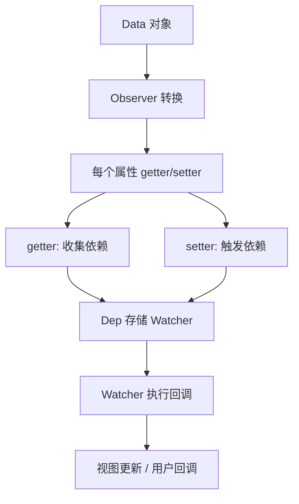
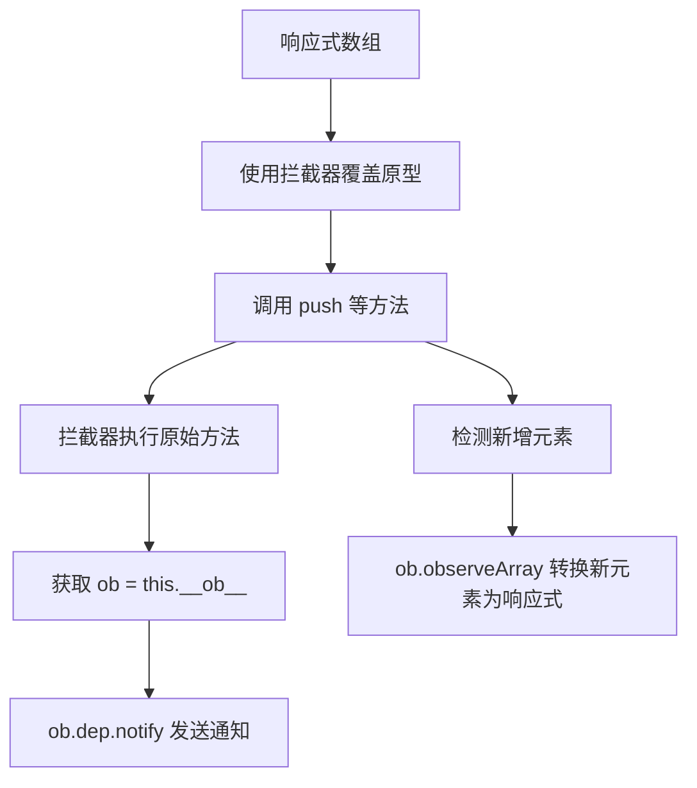
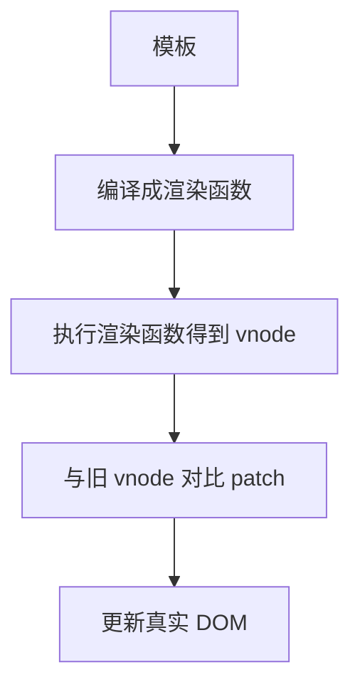
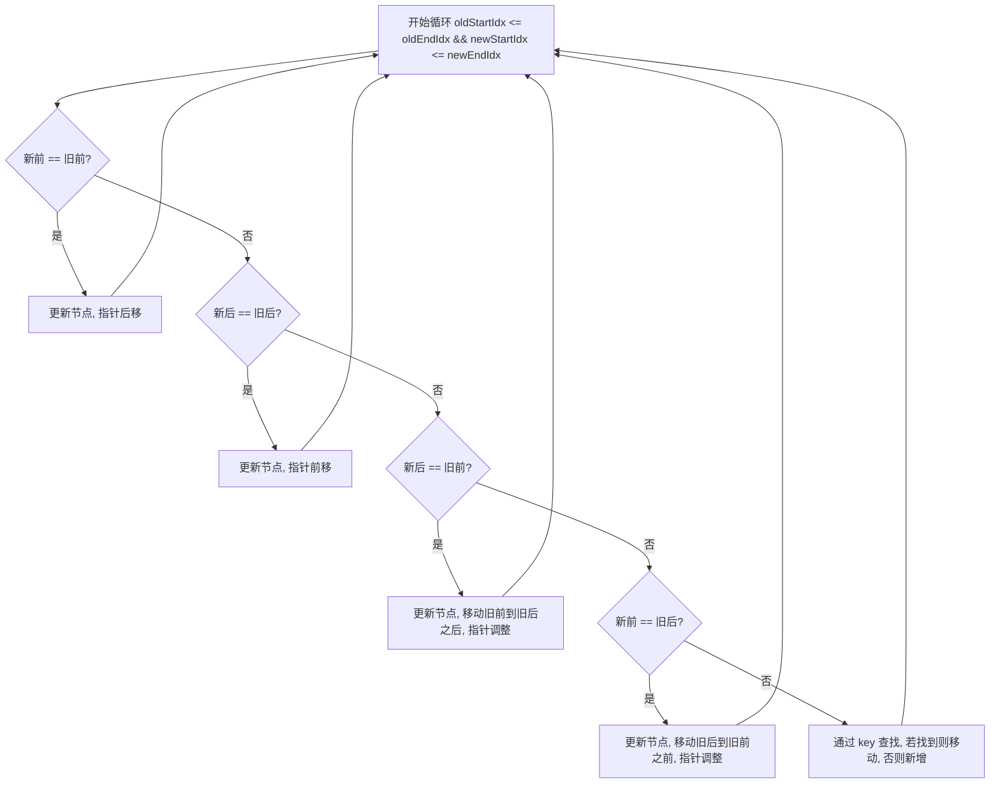
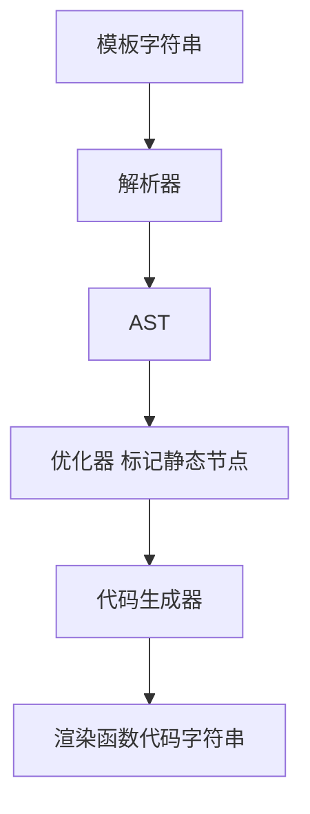
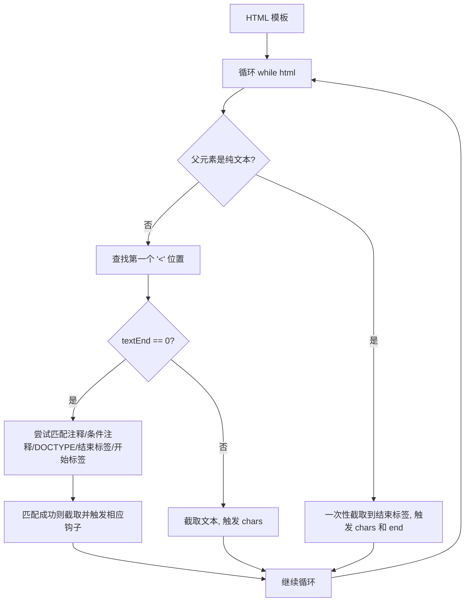
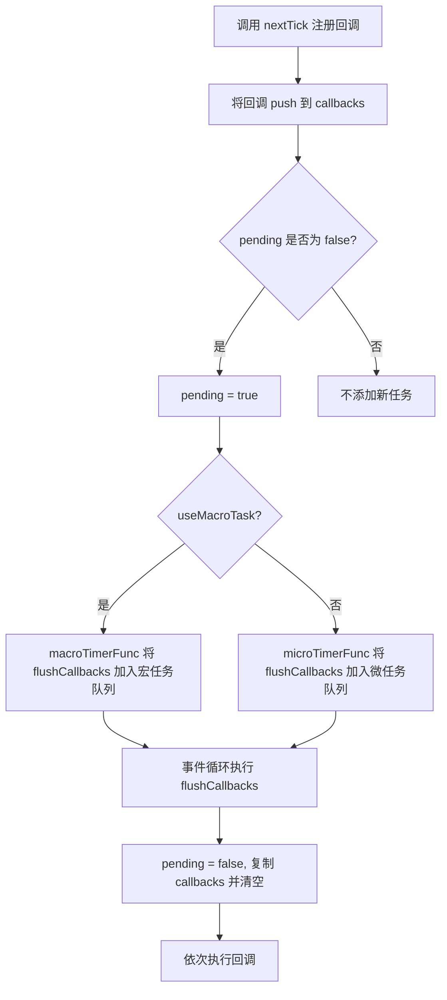

# 《深入浅出Vue.js》章节总结

## 书籍信息
- **书名**：深入浅出Vue.js
- **作者**：刘博文
- **出版社**：人民邮电出版社
- **出版时间**：2019年3月第1版
- **PDF 状态**：包含完整目录及大部分正文内容，但末尾部分页面（约第190页之后）存在识别不完整或空白页，部分章节内容缺失。
- **OCR 状态**：基于提取文本整理，部分表格、代码块、图示可能不完整，已尽量恢复逻辑结构。

## 目录说明
- **目录识别情况**：原书目录清晰，共分四篇，包含第1章至第17章。
- **章节对应依据**：按照原书目录顺序，逐章提取可识别内容。
- **OCR 修复说明**：
  - 第13章后半部分（`Vue.directive` 之后）内容缺失严重，仅保留标题。
  - 第14章至第17章仅保留标题与少量概述，正文内容因 PDF 识别中断无法完整整理。
  - 部分代码块中的特殊符号（如下划线、箭头函数）已根据上下文还原。
  - 所有不确定部分均已标注。

## 全书核心主题
本书从源码层面深入剖析 Vue.js 的核心技术原理。作者以“变化侦测”为切入点，详细讲解 Vue.js 响应式系统的实现（Object 和 Array 的侦测差异），进而介绍虚拟 DOM 的 patch 算法、模板编译（解析器、优化器、代码生成器）的完整流程，最后阐述整体架构、实例方法、全局 API、生命周期、指令、过滤器等功能的内部原理。全书旨在帮助读者透过现象看本质，理解 Vue.js 的设计权衡与实现细节，提升解决问题的能力。

---

## 第1章：Vue.js简介
### 核心论点
本章介绍 Vue.js 是什么、发展简史及其定位。作者强调 Vue.js 是一款渐进式 JavaScript 框架，解决的是声明式操作 DOM 的问题，使开发者从命令式 DOM 操作中解脱出来。

### 关键概念/事件
- **渐进式框架**：框架分层，核心为视图层渲染，向外依次是组件机制、路由、状态管理、构建工具，可按需选择。
- **Vue.js 简史**：2013年7月尤雨溪首次提交（原名 Element），2013年12月改名为 Vue.js，2014年2月公开发布，2015年10月发布 1.0.0（代号“新世纪福音战士”），2016年10月发布 2.0（代号“攻克机动队”）。
- **虚拟 DOM 引入**：2.0 引入虚拟 DOM，提升渲染速度，但并非所有场景都变快，而是 80% 场景更快，20% 变慢，本质是权衡。
- **GitHub star 数量**：截至 2018 年 6 月，Vue.js 在 GitHub 上 star 数超 10 万，排进所有项目前五。

### 逻辑推演
作者先提出命令式操作 DOM 的问题（代码难维护），引出声明式框架的必要性。然后介绍 Vue.js 的渐进式设计理念，通过时间线梳理版本演进，指出 2.0 引入虚拟 DOM 是为了在变化侦测的粒度（1.0 细粒度绑定内存开销大）与性能之间做平衡。最后强调学习源码的重要性。

### 经典金句
> “不要像网上大部分人那样，成天说因为引入了虚拟 DOM 而变快了。我们要透过现象看本质。” (p.5)

---

## 第一篇 变化侦测

## 第2章：Object的变化侦测
### 核心论点
问题：如何侦测 Object 类型数据的变化？  
观点：通过 `Object.defineProperty` 将属性转换成 getter/setter，在 getter 中收集依赖，在 setter 中触发依赖。

### 关键概念
- **变化侦测类型**：“推”(push) vs “拉”(pull)。Vue.js 属于“推”，能精确知道哪些状态变了。
- **依赖收集**：每个 key 对应一个 `Dep` 实例，`Dep` 管理一组 `Watcher`。
- **Watcher**：中介角色，负责订阅数据变化并执行回调（如更新视图或用户回调）。
- **Observer**：递归地将对象所有属性（包括子属性）转换为响应式。
- **无法追踪的操作**：添加属性、删除属性（因为 `Object.defineProperty` 无法侦测新增/删除）。

### 逻辑推演
1. 提出如何追踪变化 → 使用 `Object.defineProperty`。
2. 需要收集依赖 → 在 getter 中收集，在 setter 中触发。
3. 依赖存在何处 → 定义 `Dep` 类，每个属性一个 `Dep` 实例。
4. 依赖是谁 → `Watcher`，它将自己设置到全局 `window.target`，然后读取数据触发 getter 完成收集。
5. 递归侦测所有 key → 实现 `Observer` 类。
6. 指出局限性 → 新增/删除属性无法侦测，引出 `$set`/`$delete`。

### 方法流程图

### 经典金句
> “变化侦测就是侦测数据的变化。当数据发生变化时，要能侦测到并发出通知。” (p.14)

---

## 第3章：Array的变化侦测
### 核心论点
问题：数组通过原型方法改变内容，无法触发 setter，如何侦测？  
观点：通过拦截器覆盖数组原型，在拦截器内发送变更通知。

### 关键概念
- **拦截器**：一个继承自 `Array.prototype` 的对象，对 `push`/`pop`/`shift`/`unshift`/`splice`/`sort`/`reverse` 七个方法进行封装。
- **覆盖原型**：在 `Observer` 中，使用 `__proto__`（或直接挂载方法）将数组的原型指向拦截器。
- **依赖收集**：数组的依赖同样在 getter 中收集，但依赖列表存在 `Observer` 实例上（通过 `value.__ob__` 访问）。
- **侦测新增元素**：对 `push`/`unshift`/`splice` 新增的元素调用 `observeArray` 转换为响应式。
- **无法拦截的操作**：通过索引修改 (`arr[0] = xx`)、修改 `length` (`arr.length = 0`)。

### 逻辑推演
1. 数组方法无法触发 setter → 需要拦截原型方法。
2. 创建拦截器，覆盖 `Array.prototype`，但只对响应式数组生效（避免全局污染）。
3. 依赖收集时机：仍然在 getter 中收集，但需要将依赖存储到 `Observer` 实例上（通过 `__ob__`）。
4. 在拦截器内通过 `this.__ob__.dep.notify()` 触发更新。
5. 递归侦测数组元素，并对新增元素进行响应式处理。
6. 指出局限性：索引修改和 length 修改无法侦测。

### 方法流程图

### 经典金句
> “在 ES6 之前，JavaScript 并没有提供元编程的能力，所以对于数组类型的数据，一些语法无法追踪到变化。” (p.29)

---

## 第4章：变化侦测相关的API实现原理
### 核心论点
介绍 `vm.$watch`、`vm.$set`、`vm.$delete` 的内部实现，这些 API 弥补了变化侦测的缺陷。

### 关键概念
- **`$watch`**：封装 `Watcher`，支持 `deep` 和 `immediate` 选项。`deep` 通过递归遍历子值触发依赖收集；`unwatch` 通过 `watcher.teardown()` 从所有 Dep 中移除自身。
- **`$set`**：处理数组时使用 `splice`；处理对象时，若 key 已存在直接修改，若不存在则调用 `defineReactive` 转换为响应式并手动触发 `dep.notify()`。
- **`$delete`**：数组使用 `splice` 删除；对象使用 `delete` 删除属性后，若数据是响应式则手动触发 `dep.notify()`。

### 逻辑推演
- `$watch` 实现：先创建 `Watcher`，若 `immediate` 立即执行回调；返回 `unwatch` 函数，内部调用 `watcher.teardown()`。`deep` 实现：在 `get()` 中获取值后调用 `traverse` 递归访问所有子属性，从而将当前 `Watcher` 收集到子属性的依赖列表中。
- `$set` 实现：判断 target 类型，数组用 `splice`；对象且 key 已存在直接赋值；否则调用 `defineReactive` 并触发 `ob.dep.notify()`。
- `$delete` 实现：数组用 `splice`；对象用 `delete` 删除后，若 `ob` 存在则 `ob.dep.notify()`。

### 经典金句
> “如果你非要使用 delete 来删除属性，那么我告诉你一个特别取巧的方法……手动向依赖发送变化通知。” (p.44)

---

## 第二篇 虚拟DOM

## 第5章：虚拟DOM简介
### 核心论点
问题：什么是虚拟 DOM？为什么 Vue.js 2.0 引入它？  
观点：虚拟 DOM 是用 JavaScript 对象描述真实 DOM 的一种技术，通过对比新旧虚拟节点树，只更新差异部分，减少 DOM 操作。Vue.js 1.0 采用细粒度绑定（内存开销大），2.0 改为组件级 watcher + 虚拟 DOM，这是一种中等粒度的权衡。

### 关键概念
- **虚拟 DOM**：用 JS 对象表示 DOM 结构。
- **渲染过程**：模板 → 渲染函数 → 虚拟节点树 → 真实 DOM。
- **patch 算法**：对比新旧 vnode，找出差异并更新。
- **粒度权衡**：1.0 每个绑定一个 watcher（内存大）；2.0 每个组件一个 watcher，内部用虚拟 DOM diff（性能折中）。

### 逻辑推演
1. 命令式 DOM 操作难以维护 → 声明式框架。
2. 声明式需要高效更新 → 对比新老状态。
3. 虚拟 DOM 思路：用 JS 计算 diff，只更新必要 DOM。
4. Vue.js 1.0 细粒度绑定但内存大 → 2.0 改为组件级 watcher + 虚拟 DOM。
5. 结论：虚拟 DOM 并非“让渲染变快”，而是减少不必要的 DOM 操作。

### 方法流程图

### 经典金句
> “虚拟 DOM 本质上只是众多解决方案中的一种，可以用但并不一定必须用。” (p.51)

---

## 第6章：VNode
### 核心论点
VNode 是一个 JavaScript 类，用于描述真实 DOM 节点。不同类型的 VNode（注释、文本、元素、组件、函数式组件、克隆节点）属性不同。

### 关键概念
- **注释节点**：属性 `isComment: true`, `text`。
- **文本节点**：仅有 `text` 属性。
- **克隆节点**：复制已有节点，`isCloned: true`，用于优化静态节点和插槽节点。
- **元素节点**：有 `tag`, `data`, `children`, `context`。
- **组件节点**：额外有 `componentOptions`, `componentInstance`。
- **函数式组件**：有 `functionalContext`, `functionalOptions`。

### 逻辑推演
介绍 VNode 类构造函数的各个参数，然后分类说明每种节点的有效属性。强调克隆节点用于静态节点优化，避免重复执行渲染函数。

---

## 第7章：patch
### 核心论点
patch 是虚拟 DOM 的核心算法，用于对比新旧 vnode 并更新真实 DOM。主要操作：创建节点、删除节点、更新节点、更新子节点。

### 关键概念
- **新增节点**：当 oldVnode 不存在，或者 oldVnode 与 vnode 不是同一个节点时。
- **删除节点**：当 vnode 不存在而 oldVnode 存在时。
- **更新节点**：当两个节点是同一个节点时，比较差异并更新。
- **静态节点**：跳过更新。
- **更新子节点**：四种优化策略（新前与旧前、新后与旧后、新后与旧前、新前与旧后），以及循环比对、移动节点、删除节点。

### 逻辑推演
1. patch 流程：先判断 oldVnode 是否存在，不存在则创建所有节点；存在且不是同一节点则替换；是同一节点则更新。
2. 创建节点：根据 vnode 类型（元素、文本、注释）调用相应 DOM 方法，递归创建子节点。
3. 删除节点：从父节点中移除。
4. 更新节点：静态节点跳过；新节点有 text 属性则直接设置文本；无 text 则处理 children。
5. 更新子节点：采用双端比较策略，减少循环次数。处理完后，若 oldChildren 有剩余则删除，若 newChildren 有剩余则新增。

### 方法流程图（子节点更新策略）

### 经典金句
> “这本质上其实是使用 JavaScript 的运算成本来替换 DOM 操作的执行成本，而 JavaScript 的运算速度要比 DOM 快很多。” (p.60)

---

## 第三篇 模板编译原理

## 第8章：模板编译
### 核心论点
模板编译是将模板转换成渲染函数的过程，分为三步：解析器（生成 AST）、优化器（标记静态节点）、代码生成器（生成代码字符串）。

### 关键概念
- **AST**：抽象语法树，用 JS 对象描述节点树。
- **解析器**：包含 HTML 解析器、文本解析器、过滤器解析器。
- **优化器**：标记静态子树，避免重复渲染。
- **代码生成器**：将 AST 转换为 `with(this){return _c(...)}` 形式的代码字符串。

### 方法流程图

---

## 第9章：解析器
### 核心论点
解析器通过 HTML 解析器逐段截取模板字符串，触发钩子函数（start, end, chars, comment），在钩子中构建 AST 节点，并通过栈维护层级关系。

### 关键概念
- **HTML 解析器**：循环截取模板，根据开始标签、结束标签、注释、文本等类型触发不同钩子。
- **开始标签解析**：匹配标签名、属性、自闭合标识。
- **纯文本内容元素**：`script`, `style`, `textarea` 内部所有内容当作文本处理。
- **文本解析器**：二次加工文本，将 `{{ name }}` 转换为 `_s(name)` 表达式。

### 逻辑推演
1. `parseHTML` 函数接收模板和选项对象（钩子）。
2. 循环中判断父元素是否为纯文本元素，决定解析方式。
3. 普通元素：优先判断是否为注释、条件注释、DOCTYPE、结束标签、开始标签；都不是则为文本。
4. 开始标签解析：解析标签名、属性列表、自闭合标识，然后触发 `start` 钩子，并将节点推入栈。
5. 结束标签解析：触发 `end` 钩子，弹出栈顶。
6. 文本解析：若文本包含 `{{ }}`，调用文本解析器生成 `expression` 字符串。
7. 最终得到完整 AST。

### 方法流程图

---

## 第10章：优化器
### 核心论点
优化器遍历 AST，标记所有静态节点和静态根节点，以提升重新渲染性能。

### 关键概念
- **静态节点**：不会变化的节点（纯文本、无绑定的元素等）。
- **静态根节点**：其所有子节点都是静态节点，且父级是动态节点；但排除只有一个静态文本子节点的节点（优化成本大于收益）。
- **标记方法**：递归标记，若子节点非静态则父节点改为非静态。

### 逻辑推演
1. `optimize(root)` 调用 `markStatic` 和 `markStaticRoots`。
2. `isStatic` 判断规则：type=2 动态文本返回 false；type=3 纯文本返回 true；元素节点需满足：无动态绑定、无 v-if/v-for、非内置标签、保留标签、父节点不是带 v-for 的 template、节点属性在允许集合内。
3. `markStatic` 递归标记，若子节点非静态则父节点改为 false。
4. `markStaticRoots` 递归标记静态根节点，条件：node.static 为 true 且有子节点，且子节点不只是一个文本节点。

### 经典金句
> “静态子树除了首次渲染，后续不需要任何重新渲染操作。” (p.122)

---

## 第11章：代码生成器
### 核心论点
代码生成器将 AST 递归拼接成代码字符串，最终包装在 `with(this){ return ... }` 中，形成渲染函数。

### 关键概念
- **元素节点**：生成 `_c(tag, data, children)`。
- **文本节点**：动态文本生成 `_v(expression)`，静态文本生成 `_v("text")`。
- **注释节点**：生成 `_e("text")`。
- **data 生成**：拼接 `{ key, ref, attrs, ... }` 等属性。
- **children 生成**：递归调用 `genNode`。

### 逻辑推演
1. 从根 AST 节点开始，调用 `genElement`。
2. 根据 `el.plain` 决定是否生成 data 字符串（调用 `genData`）。
3. 调用 `genChildren` 递归生成子节点字符串数组，用逗号连接。
4. 拼接 `_c(tag, data, children)`。
5. 最终将整个代码字符串用 `with(this){ return ... }` 包裹，并通过 `new Function` 转换为可执行渲染函数。

---

## 第四篇 整体流程

> **说明**：从第12章开始，PDF 识别内容逐渐不完整，部分章节仅有标题或片段。以下基于可识别内容进行整理。

## 第12章：架构设计与项目结构
### 核心论点
介绍 Vue.js 的源码目录结构、不同构建版本的区别以及整体架构设计（分层：核心代码、跨平台相关、渲染层、入口）。

### 关键概念
- **目录结构**：`dist`（构建文件）、`packages`（独立 NPM 包）、`src/compiler`（编译）、`src/core`（核心平台无关）、`src/platforms`（特定平台代码）。
- **构建版本**：完整版（含编译器）vs 运行时版；UMD vs CommonJS vs ES Module。
- **架构分层**：底层 Vue 构造函数，向上添加原型方法和全局 API，再上层为跨平台封装，最上层为编译器和服务端渲染（可选）。

### 逻辑推演
以 Web 平台完整版为例，入口文件导出的 Vue 构造函数经过 `initMixin` 等五个函数注入原型方法，再添加全局 API，最后引入平台特有的渲染逻辑（如 `$mount`）和编译器。

---

## 第13章：实例方法与全局 API 的实现原理
### 核心论点
详细分析 Vue 实例方法（数据、事件、生命周期相关）和全局 API（`Vue.extend`、`Vue.nextTick`、`Vue.set` 等）的内部实现。

### 关键概念/事件
- **数据相关**：`$watch`、`$set`、`$delete`（已在第4章介绍）。
- **事件相关**：`$on`、`$off`、`$once`、`$emit`。实现方式：`vm._events` 存储事件列表，`$emit` 遍历执行。
- **生命周期相关**：`$forceUpdate`（调用 `vm._watcher.update()`）、`$destroy`（触发 `beforeDestroy`，从父组件 `$children` 移除，调用所有 watcher 的 `teardown`，触发 `destroyed`，移除事件）、`$nextTick`（异步更新队列，微任务优先）、`$mount`（完整版含编译，运行时版直接挂载）。
- **全局 API**：`Vue.extend` 创建子类（继承、合并选项、缓存）；`Vue.nextTick` 同实例方法；`Vue.set`/`Vue.delete` 同实例方法；`Vue.directive`/`Vue.filter`/`Vue.component` 注册全局资源。

### 逻辑推演（$nextTick 为重点）
- 异步更新队列原因：同一事件循环中多次修改数据只需一次渲染。
- 实现：`callbacks` 数组存储回调，`pending` 标志控制向微任务队列添加 `flushCallbacks`。
- 降级方案：`Promise` → `setImmediate` → `MessageChannel` → `setTimeout`。
- `withMacroTask` 强制使用宏任务（如 DOM 事件回调中避免微任务过早执行）。

### 流程图（$nextTick 流程）

> 说明：第13章后半部分（`Vue.directive` 之后）PDF 识别严重不完整，无法获取详细内容。

---

## 第14章：生命周期
> 说明：该部分 PDF 识别不完整，以下内容基于可见文本和目录标题整理。

### 核心论点
介绍 Vue.js 实例的生命周期钩子（beforeCreate, created, beforeMount, mounted, beforeUpdate, updated, beforeDestroy, destroyed）以及 `errorCaptured` 钩子，并从源码角度分析初始化、模板编译、挂载、卸载各阶段内部做了什么。

### 关键概念（基于目录）
- **生命周期图示**：分为初始化阶段、模板编译阶段、挂载阶段、卸载阶段。
- **初始化实例属性**、**初始化事件**、**初始化 inject**、**初始化状态（props, methods, data, computed, watch）**、**初始化 provide**。
- **错误处理**：`errorCaptured` 钩子可以捕获子组件错误并向上传递。

---

## 第15章：指令的奥秘
> 说明：该部分 PDF 识别不完整。

### 核心论点
介绍 `v-if`、`v-for`、`v-on` 等内置指令的原理概述，以及自定义指令的实现原理（通过虚拟 DOM 钩子函数在相应生命周期调用指令钩子）。

---

## 第16章：过滤器的奥秘
> 说明：该部分 PDF 识别不完整。

### 核心论点
过滤器在模板编译阶段被解析，在生成渲染函数时，将过滤器处理为函数调用（`_f('filterName')(value)`），最终在运行时执行。

---

## 第17章：最佳实践
> 说明：该部分 PDF 识别不完整。

### 核心论点
提供一系列 Vue.js 开发最佳实践，包括：为列表渲染设置 key、避免 v-if 和 v-for 一起使用、为组件样式设置作用域、组件命名规范、代码顺序规范等。

---

## 附录（致谢等）
> 原书包含致谢部分，作者感谢了编辑、领导、家人、内测读者等，此处不再单独整理。

---

**文档结束**