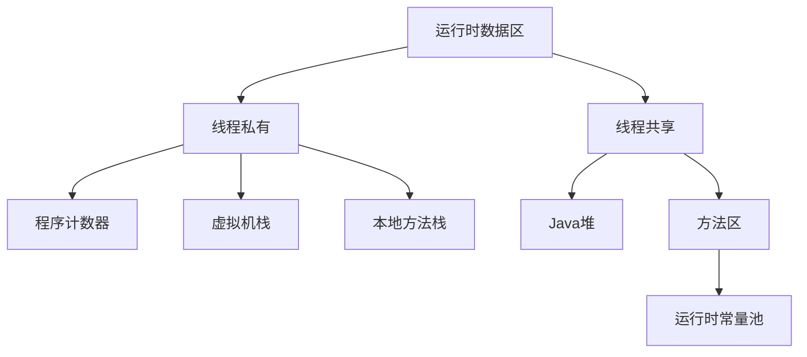
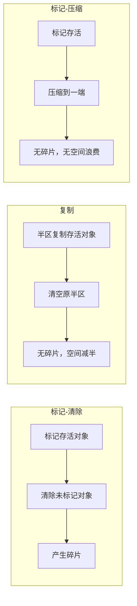
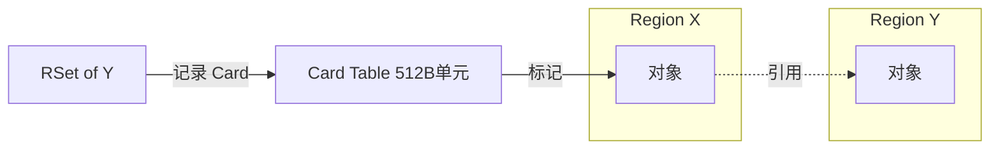
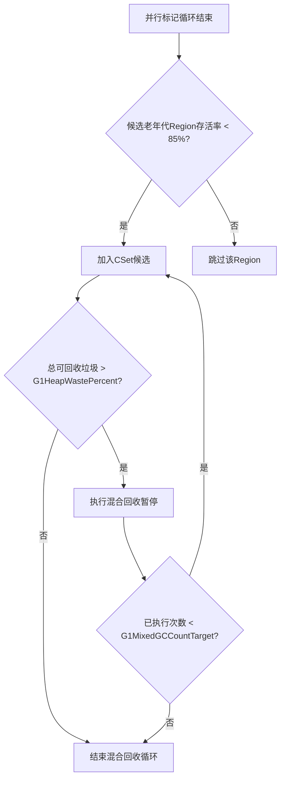
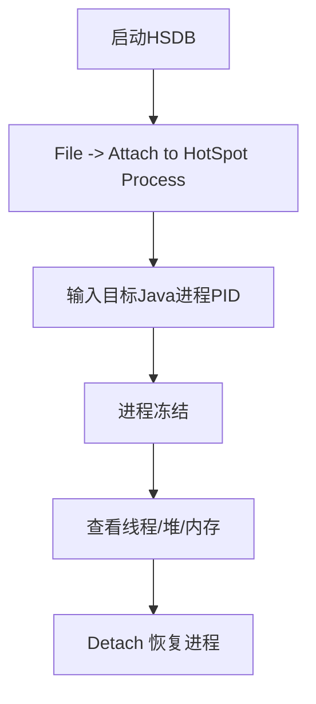

# 《深入理解JVM & G1 GC》章节总结

## 书籍信息
- 书名：深入理解 JVM & G1 GC
- 作者：周明耀
- PDF 状态：三个部分文件，内容连贯，覆盖全书
- OCR 状态：文本可识别，部分页码及格式存在轻微错位，但核心内容完整

## 目录说明
- 目录识别情况：完整识别，共6章，含序、前言、正文及附录性质章节
- 章节对应依据：依据原书目录页（第5-8页）及正文实际标题
- OCR 修复说明：无重大错漏，直接使用提取文本

## 全书核心主题
本书系统讲解 JVM 内存模型、传统垃圾回收（GC）算法与收集器（Serial、Parallel、CMS），并重点深入 G1 GC 的设计理念、核心机制（Region、RSet、CSet、SATB 标记等）、分代管理、混合回收、性能调优方案。最后介绍 SA、JConsole、VisualVM 等诊断工具。作者强调 G1 通过将堆划分为独立 Region，实现可预测停顿、避免 Full GC 频繁发生，适用于大内存、低延迟场景。

---

## 序（吴骏）
### 核心论点
作者以“只有卓越才能生存”类比 GC 淘汰垃圾对象的重要性。G1 引入 Region 概念，使堆从物理连续变为逻辑连续，提升灵活性。

### 经典金句
> “随着 G1 GC 的出现，GC 从传统的连续堆内存布局设计，逐渐走向不连续内存块，这是通过引入 Region 概念实现的。” (p.9)

---

## 前言
### 核心论点
作者表明本书面向 Java 学生及初级程序员，覆盖 JVM 基础、GC 基础、G1 GC 深入、调优及 JDK 工具。基于 JDK8，强调性能调优是“艺术”，需要不断实践。

### 经典金句
> “你若顽强到底，一切皆有可能。” (p.11)

---

## 第1章：JVM & GC 基础知识
### 1. 核心论点
本章解决：为什么需要了解 JVM 和 GC？统一术语定义，为后续学习打基础。作者认为不了解起源就无法找到正确方法。

### 2. 关键概念/事件
- **JVM 发展史**：1999年 HotSpot 发布；Serial GC、Parallel GC、CMS 陆续出现；G1 因“追求更短停顿”而诞生。
- **G1 名称由来**：Garbage First，优先回收垃圾最多的 Region。
- **基本术语**：毫秒/纳秒、MB、JVM 参数配置、并行/并发、进程/线程、内存泄漏、四种引用（强/软/弱/虚）、finalization、SA、Interned String、LinkedList、对象头、JIT 编译器、JMC、JFR、UNIX/Linux 目录结构。
- **GC 通用术语**：HotSpot VM、垃圾回收定义、枚举根节点、吞吐量、堆内存快照、根集合、崩溃文件、回收算法（标记-清除、复制、标记-整理、分代收集）、年轻代/老年代、对象提升、永久代、Full GC / Minor GC、Stop‑the‑World、对象存活判断、加权平均、阈值、System.gc()、堆外内存、finalize() 影响、markOop、JVM 虚拟化前景。
- **G1 专用术语**：Metaspace、Mixed GC、Reclaimable、RSet、CSet、G1 Pause Time Target、Root Region Scan、PLAB、TLAB、Lock‑free、Region、Ergonomics、Evacuation Failure、TAMS。

### 3. 逻辑推演/叙事脉络
从 JVM 历史引入，说明 GC 必要性；然后分层定义 Java 术语 → JVM/GC 通用术语 → G1 特有术语，确保读者统一认知。最后简述 G1 四个操作阶段（年轻代回收、后台并行循环、混合回收、Full GC）。

### 4. 经典金句/数据
> “G1 GC 提出了不确定性 Region，每个空闲 Region 不是为某个固定年代准备的，它是灵活的，需求驱动的，所以 G1 GC 代表了先进性。” (p.4)
> “性能调优在很大程度上是一门艺术。解决的 GC 性能问题越多，技艺才会越精湛。” (p.11)

---

## 第2章：JVM & GC 深入知识
### 1. 核心论点
本章深入 JVM 内存模型（程序计数器、虚拟机栈、本地方法栈、Java 堆、方法区）及常见垃圾收集算法，并分类介绍各 GC（Serial、ParNew、Parallel、CMS、G1），为理解 G1 做知识储备。

### 2. 关键概念/事件
- **内存模型**：线程私有（程序计数器、虚拟机栈、本地方法栈）与线程共享（堆、方法区）。
- **逃逸分析**：对象未逃逸时可栈上分配，减少 GC 压力。
- **垃圾收集算法**：引用计数（缺陷：循环引用）、根搜索算法、标记-清除（碎片）、复制（空间浪费）、标记-压缩（无碎片）、增量算法、分代收集。
- **GC 分类**：串行/并行、并发/独占、压缩/非压缩、年轻代/老年代。
- **具体收集器**：Serial（单线程）、ParNew（多线程年轻代）、Parallel（吞吐量优先）、CMS（低延迟，标记-清除，有碎片）、G1（Region + 可预测停顿）。

### 3. 逻辑推演/叙事脉络
先解释 JVM 各内存区域的作用及异常；然后介绍逃逸分析优化；接着系统讲解七种垃圾收集算法；再按时间顺序介绍各 GC 的特性、适用场景及关键参数；最后解答常见问题（jmap 不能用、YGC 变慢、永久代移除）。

### 4. 流程图

#### Java 虚拟机内存模型


#### 标记-清除 vs 复制 vs 标记-压缩


### 5. 经典金句/数据
> “Java 堆区是 GC 的重点回收区域，极有可能成为系统性能瓶颈。” (p.85)
> “CMS 天生为并发而生，低延迟是它的优势。” (p.102)
> “G1 的一个最大的贡献是它可以让我们设置最大停顿时间。” (p.106)

---

## 第3章：G1 GC 应用示例
### 1. 核心论点
通过范例程序（GreenhouseScheduler）演示 G1 GC 及相关的数十个命令行选项，解释每个选项的含义、默认值及运行输出，帮助读者动手实践。

### 2. 关键概念/事件
- **常用选项**：`-XX:+PrintGCDetails`、`-Xloggc`、`-XX:+UseG1GC`、`-XX:MaxGCPauseMillis`、`-XX:G1HeapRegionSize`、`-XX:ConcGCThreads`、`-XX:G1HeapWastePercent`、`-XX:+G1PrintRegionLivenessInfo`、`-XX:StringDeduplicationAgeThreshold` 等。
- **输出解读**：区分 `DefNew`、`ParNew`、`PSYoungGen`、`Garbage-First heap` 对应不同收集器。
- **诊断选项**：需 `-XX:+UnlockDiagnosticVMOptions` 解锁。
- **商业特性**：`-XX:+UnlockCommercialFeatures` 开启 JFR 等。

### 3. 逻辑推演/叙事脉络
给出完整 Java 范例程序 → 按顺序列出 G1 GC 相关选项，每个选项给出命令行示例、运行输出及解释 → 对比不同 GC 的输出特征 → 强调 G1 输出更简洁（Region 信息）。

### 4. 经典金句/数据
> “G1 GC 的日志输出和其他 GC 有所不同，它更加简洁。” (p.132)
> “Region 的大小默认为堆大小的 1/2000。” (p.135)

---

## 第4章：深入 G1 GC
### 1. 核心论点
深入讲解 G1 GC 的核心设计：Region 分区、RSet 维护、CSet 选择、年轻代回收、大对象处理、混合回收、并行标记循环（SATB 算法）、评估失败与 Full GC。目标：实现可预测停顿与大内存高吞吐。

### 2. 关键概念/事件
- **Region**：堆分成等大小区域（1~32MB），逻辑连续，动态分配用途（Eden/Survivor/Old/Humongous）。
- **RSet**：每个 Region 记录外部指向本 Region 的引用，避免全堆扫描。
- **CSet**：本次 GC 待回收的 Region 集合。
- **大对象 (Humongous)**：超过 Region 大小 50% 的对象，存放在连续 Region 中。
- **年轻代回收**：复制存活对象到 Survivor/Old，动态调整年轻代大小（5%~60%）。
- **混合回收**：年轻代 + 部分老年代 Region 一起回收，由 IHOP（默认 45%）触发。
- **SATB 标记**：Snapshot-At-The-Beginning，并发标记时创建对象图快照，避免 CMS 重标记长时间停顿。
- **TAMS**：每个 Region 的两个指针（prev/next），区分标记前后的对象。
- **评估失败**：拷贝时无空闲 Region → 触发单线程 Full GC（尽量避免）。

### 3. 逻辑推演/叙事脉络
从 G1 背景（替代 CMS）出发 → 介绍 Region 设计灵感（类比 HBase 分区）→ 分代管理（年轻代、大对象、混合回收）→ RSet 结构与更新机制 → 详细拆解并行标记循环的五个阶段（初始标记、根区间扫描、并发标记、重标记、清除）→ 评估失败与 Full GC 保护机制 → 引用 G1 论文原文部分摘要。

### 4. 流程图

#### G1 并行标记循环
```mermaid
graph TD
    A[IHOP 触发] --> B[初始标记 (STW, 常与年轻代GC合并)]
    B --> C[根区间扫描 (并发)]
    C --> D[并发标记 (SATB, 多线程)]
    D --> E[重标记 (STW, 处理剩余日志)]
    E --> F[清除 (回收空Region, 更新RSet)]
    F --> G{候选老年代Region?}
    G -->|有垃圾| H[混合回收]
    G -->|无| I[返回年轻代收集]
```

#### RSet 与 Card Table 关系


### 5. 经典金句/数据
> “G1 可以只选取部分区域进行内存回收，缩小了回收的范围，因此对于全局停顿情况的发生也能得到较好的控制。” (p.168)
> “SATB 算法聚焦于标记清洗 GC 的并行标记阶段，解决了 CMS 重标记暂停延迟时间较长的缺陷。” (p.182)
> “完全回收是单线程执行的，当堆内存很大时势必耗时很长，所以需要谨慎使用。” (p.186)

---

## 第5章：G1 GC 性能优化方案
### 1. 核心论点
本章提供 G1 GC 的具体优化方法：年轻代回收调优、并行标记阶段优化、混合回收参数调整、避免 GC 失败（to-space exhausted）、引用处理优化。

### 2. 关键概念/事件
- **年轻代优化**：`-XX:MaxGCPauseMillis` 目标停顿时间；`-XX:G1NewSizePercent` / `-XX:G1MaxNewSizePercent` 控制年轻代大小；`-XX:+PrintAdaptiveSizePolicy` 查看自适应决策。
- **并行标记优化**：`-XX:InitiatingHeapOccupancyPercent` 调低可提早触发标记，避免“to-space exhausted”；增大 `-XX:ConcGCThreads` 加快标记。
- **混合回收优化**：`-XX:G1HeapWastePercent`（默认5%）控制停止混合回收的垃圾比例；`-XX:G1MixedGCCountTarget`（默认8）控制混合回收次数；`-XX:G1OldCSetRegionThresholdPercent`（默认10%）限制每次混合回收的最大老年代 Region 数；`-XX:G1MixedGCLiveThresholdPercent`（默认85%）过滤存活率过高的 Region。
- **避免 GC 失败**：适当增大堆、合理设置 `-XX:G1HeapRegionSize`、`-XX:G1ReservePercent`（默认10%）。
- **引用处理优化**：`-XX:+ParallelRefProcEnabled` 多线程处理引用；`-XX:+PrintReferenceGC` 查看各引用类型耗时；`-XX:SoftRefLRUPolicyMSPerMB` 调整软引用存活时间。

### 3. 逻辑推演/叙事脉络
从年轻代日志解析开始 → 分析各阶段耗时（Update RS、Scan RS、Object Copy 等）→ 给出调整目标停顿时间、年轻代大小的效果对比 → 讲解并行标记周期如何影响混合回收 → 列出混合回收关键参数及日志示例 → 总结避免 Full GC 的四种措施 → 最后专门讨论引用处理瓶颈及解法。

### 4. 流程图

#### 混合回收决策逻辑


### 5. 经典金句/数据
> “G1 的设计目标是让更多的停顿时间花费在拷贝存活对象上面。” (p.197)
> “如果你在 GC 日志里看到了 ‘to-space exhausted’，就说明回收失败了。” (p.206)
> “宁可选择早一点进入并行标记循环阶段，也不要选择迟点进入。” (p.207)

---

## 第6章：JVM 诊断工具使用介绍
### 1. 核心论点
介绍 Serviceability Agent (SA) 工具集（HSDB/CLHSDB）的使用方法，包括绑定本地进程、分析 Core Dump、连接调试服务器；并简要介绍 GCHisto、JConsole、VisualVM 等辅助工具。

### 2. 关键概念/事件
- **SA 基础**：HotSpot 内部调试代码集合，用于分析 JVM 底层状态（堆、栈、线程、内存快照）。
- **HSDB**：图形化界面，可查看线程栈内存、堆内存、RSet 等。
- **CLHSDB**：命令行版本，适合远程或 Core 文件分析。
- **启动方式**：`java -cp sa-jdi.jar sun.jvm.hotspot.HSDB`。
- **绑定进程**：输入 PID，进程冻结，分析后 detach。
- **Core 文件分析**：用 `jmap` 生成 dump，然后 HSDB 打开。
- **其他工具**：GCHisto（离线 GC 日志分析）、JConsole（JMX 监控）、VisualVM（多合一，需装插件）。

### 3. 逻辑推演/叙事脉络
从 SA 工具的用途（调试 JVM 本身）开始 → 介绍 HSDB/CLHSDB 区别 → 详细图文演示安装、环境变量设置、绑定本地进程、查看线程栈 → 演示生成与分析 Core Dump → 远程调试服务器配置 → 补充 GCHisto、JConsole、VisualVM 的使用场景。

### 4. 流程图

#### HSDB 绑定本地进程流程


### 5. 经典金句/数据
> “SA 工具对于定位应用程序停顿、内存泄漏、程序崩溃、不符合常规理解的错误等严重问题很有效。” (p.215)
> “当我们绑定这个应用程序进程的时候，该应用程序进程是挂起的，即不会动的、暂停了、冰冻了。” (p.222)