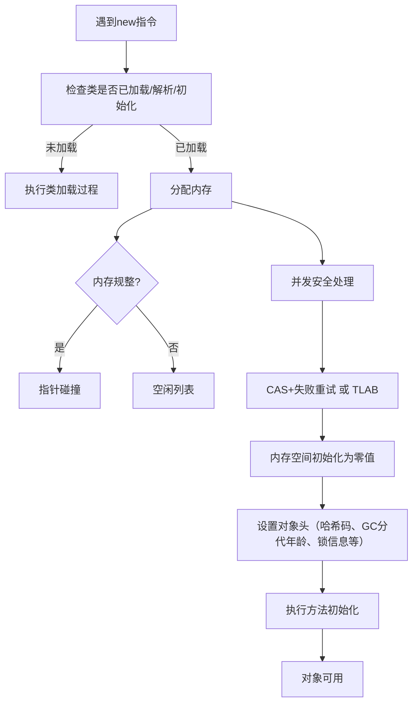

# 《深入理解Java虚拟机：JVM高级特性与最佳实践（第2版）》章节总结

## 书籍信息
- **书名**：深入理解Java虚拟机：JVM高级特性与最佳实践（第2版）
- **作者**：周志明
- **出版社**：机械工业出版社
- **出版年份**：2013年
- **PDF状态**：扫描版/图片PDF，部分页面存在OCR识别不完整、错乱、缺失图表等现象。
- **OCR状态**：已尽力提取可识别文本，无法识别部分已标注说明。

## 目录说明
- **目录识别情况**：原书目录位于PDF第15~23页左右，清晰可辨。共分五大部分，包含13个正式章节及附录。
- **章节对应依据**：按照原书页码顺序及目录标题进行逐章整理。
- **OCR修复说明**：正文中存在大量错别字（如“虚拟机”写作“虚拟几”等）、乱码字符、缺失换行等。本总结基于上下文语义进行了合理还原，但保持原文核心观点不变。完全无法恢复的部分已标注“说明：该部分PDF识别不完整”。

## 全书核心主题
本书系统讲解了Java虚拟机的内存管理、垃圾收集、执行子系统、类加载机制、编译优化以及高效并发等核心原理。作者从实践出发，结合大量生产环境案例和调优经验，深入剖析了HotSpot虚拟机的运作细节。全书贯穿“自动内存管理”、“执行子系统”、“程序编译与优化”、“高效并发”四条主线，旨在帮助中高级Java开发者理解JVM内部机制，从而写出更高效、更稳定的代码，并能独立解决内存溢出、性能瓶颈等复杂问题。

---

## 第一部分：走近Java

### 第1章：走近Java

#### 1. 核心论点
- **问题**：Java技术体系庞大复杂，初学者往往不了解其历史、现状及未来方向，也不清楚如何从源码层面深入JVM。
- **观点**：了解Java的发展脉络、虚拟机家族谱系，并亲手编译一套OpenJDK，是深入理解JVM原理的最佳起点。

#### 2. 关键概念
- **JDK / JRE**：JDK（Java Development Kit）包含Java语言、虚拟机、核心类库，是开发最小环境；JRE（Java Runtime Environment）包含虚拟机及Java SE API，是运行标准环境。
- **Java技术体系四大平台**：Java Card（智能卡）、Java ME（移动终端）、Java SE（桌面）、Java EE（企业级）。
- **OpenJDK**：Sun公司于2006年将Java开源形成的项目，与Oracle JDK代码极度接近，是学习JVM源码的最佳入口。
- **HotSpot虚拟机**：目前使用最广的Java虚拟机，具有热点代码探测、JIT编译等先进特性。
- **混合语言编程**：未来JVM将支持更多非Java语言（如Clojure、JRuby、Groovy），实现多语言混合开发。

#### 3. 逻辑推演
作者首先概述了Java技术的广泛应用和庞大生态。接着，从Java语言诞生（1991年Oak）到JDK 1.7发布，按时间线梳理了重要版本和里程碑事件，指出JDK 1.5引入泛型、自动装箱等重大语法改进，JDK 1.7因故推迟但最终加入了G1收集器等特性。然后，详细介绍了Java虚拟机家族：从最早的Sun Classic/Exact VM，到主流的HotSpot、BEA JRockit、IBM J9，再到移动端的Dalvik等，分析了各虚拟机的特点与历史地位。之后展望了模块化（Jigsaw）、混合语言、多核并行（Fork/Join）、语法增强（Lambda）、64位虚拟机等未来趋势。最后，通过实战章节引导读者下载OpenJDK源码、配置编译环境（Linux/Mac）、使用IDE（NetBeans）调试HotSpot，为后续源码级学习铺路。

#### 4. 经典金句/数据
- > “Java不仅仅是一门编程语言，还是一个由一系列计算机软件和规范形成的技术体系。”
- > “写程序本来就是一个不断追求完美的过程。”
- 截至2012年，Java技术体系已吸引900多万软件开发者，使用Java的设备多达几十亿台。
- HotSpot虚拟机名字来源于“热点代码探测技术”。

---

## 第二部分：自动内存管理机制

### 第2章：Java内存区域与内存溢出异常

#### 1. 核心论点
- **问题**：Java程序员把内存控制权交给虚拟机后，一旦出现内存泄漏或溢出，若不了解内存区域划分，排查将非常困难。
- **观点**：必须掌握运行时数据区的划分（程序计数器、虚拟机栈、本地方法栈、堆、方法区、运行时常量池、直接内存），以及各区域可能产生的OutOfMemoryError。

#### 2. 关键概念
- **程序计数器**：线程私有，指示当前执行的字节码行号，唯一无OOM的区域。
- **Java虚拟机栈**：线程私有，每个方法对应一个栈帧，存储局部变量表、操作数栈等。抛出StackOverflowError和OutOfMemoryError。
- **Java堆**：线程共享，存放对象实例，是GC主要管理区域。可细分为新生代（Eden/Survivor）、老年代。
- **方法区/永久代**：存储类信息、常量、静态变量等。JDK 1.7已将字符串常量池移出永久代。
- **直接内存**：NIO使用的堆外内存，受本机总内存限制，也会导致OOM。

#### 3. 逻辑推演
作者先以“墙”的比喻引出内存管理的重要性。然后逐一解释各内存区域的定义、作用及异常。程序计数器无OOM；虚拟机栈和本地方法栈可能因深度过大或线程过多导致StackOverflowError或OOM；堆用于存储对象实例，通过代码演示堆溢出（不断创建对象）及使用MAT工具分析堆转储快照；方法区（永久代）演示运行时常量池溢出（String.intern()在JDK 1.6与1.7的区别）以及通过CGLib动态生成类导致永久代溢出；直接内存通过Unsafe类分配演示OOM。最后总结：不同区域溢出原因不同，需要结合工具定位。

#### 4. 流程图（HotSpot对象创建过程）



#### 5. 经典金句/数据
- > “Java与C++之间有一堵由内存动态分配和垃圾收集技术所围成的‘高墙’，墙外面的人想进去，墙里面的人却想出来。”
- JDK 1.7中，String.intern()不再复制实例，而是记录首次出现的实例引用，因此`StringBuilder("计算机").append("软件").toString().intern() == str1`为true。
- 使用-XX:+HeapDumpOnOutOfMemoryError可在OOM时自动生成堆转储快照。

---

### 第3章：垃圾收集器与内存分配策略

#### 1. 核心论点
- **问题**：Java堆和方法区的内存分配与回收是动态的，需要明确哪些内存需要回收、何时回收、如何回收。
- **观点**：对象存活判定采用可达性分析算法而非引用计数；垃圾收集算法有标记-清除、复制、标记-整理、分代收集；HotSpot提供了多种收集器（Serial、ParNew、Parallel Scavenge、CMS、G1等），需根据应用特点选择和调优。

#### 2. 关键概念
- **可达性分析**：以GC Roots为起点，通过引用链判断对象是否存活。GC Roots包括栈中引用、静态属性引用、常量引用、JNI引用等。
- **强/软/弱/虚引用**：引用强度依次减弱，软引用在OOM前被回收，弱引用在下一次GC时被回收，虚引用仅用于接收系统通知。
- **分代收集**：新生代使用复制算法（Eden:Survivor=8:1），老年代使用标记-清除或标记-整理算法。
- **CMS收集器**：以获取最短停顿时间为目标，并发标记、清除，但存在CPU敏感、浮动垃圾、内存碎片问题。
- **G1收集器**：面向服务端，将堆划分为多个Region，可预测停顿时间，兼具分代、空间整合、并行与并发特性。

#### 3. 逻辑推演
作者先提出GC要解决的三个问题。然后否定引用计数（循环引用无法解决），引入可达性分析，并详细解释finalize()方法的作用（不建议使用）。接着介绍四种引用类型。之后讲解垃圾收集算法：标记-清除产生碎片；复制算法效率高但浪费空间；标记-整理适合老年代；分代收集是商业虚拟机的主流。然后深入HotSpot的实现细节：使用OopMap快速枚举GC Roots，通过安全点（Safepoint）和主动式中断实现GC时线程停顿。最后用大量篇幅逐一介绍Serial、ParNew、Parallel Scavenge、Serial Old、Parallel Old、CMS、G1等收集器的特点、适用场景、优缺点，并通过GC日志示例和参数表格总结。内存分配策略部分，通过代码实例验证了对象优先在Eden分配、大对象直接进入老年代、长期存活对象进入老年代、动态年龄判定、空间分配担保等规则。

#### 4. 流程图（CMS收集器运作步骤）

```mermaid
graph LR
    A[初始标记 (STW)] --> B[并发标记]
    B --> C[重新标记 (STW)]
    C --> D[并发清除]
```

#### 5. 经典金句/数据
- > “GC的历史比Java久远，1960年诞生于MIT的Lisp是第一门真正使用内存动态分配和垃圾收集技术的语言。”
- 新生代中98%的对象“朝生夕死”，因此复制算法中Eden:Survivor默认为8:1。
- CMS默认启动回收线程数为(CPU数量+3)/4，CPU不足4个时影响较大。
- G1收集器可建立可预测的停顿时间模型，例如在Y毫秒内最大允许GC时间为X毫秒。

---

### 第4章：虚拟机性能监控与故障处理工具

#### 1. 核心论点
- **问题**：理论必须应用于实践，定位JVM问题需要依靠数据（日志、堆栈、堆转储）和工具。
- **观点**：JDK自带的命令行工具（jps、jstat、jinfo、jmap、jhat、jstack）和可视化工具（JConsole、VisualVM）是处理性能故障的利器。

#### 2. 关键概念
- **jps**：列出虚拟机进程及主类名，获取LVMID。
- **jstat**：监视类装载、内存、GC、JIT编译等运行数据。
- **jmap**：生成堆转储快照（heapdump），查询堆详细信息。
- **jstack**：生成线程快照（threaddump），定位死锁、长时间等待等问题。
- **JConsole**：基于JMX的可视化监视与管理工具，可监控内存、线程、类等。
- **VisualVM**：多合一故障处理工具，支持插件扩展（如BTrace），可进行性能分析（Profiling）。

#### 3. 逻辑推演
作者强调“工具是运用知识处理数据的手段”。先介绍了JDK命令行工具的普遍特点（体积小、基于tools.jar）。然后依次说明jps、jstat、jinfo、jmap、jhat、jstack的用法、选项和示例。特别指出jstat用于远程监控需要开启JMX。接着介绍HSDIS插件，用于反汇编JIT生成的本地代码。最后详细讲解JConsole和VisualVM的界面、功能，并通过代码示例演示了内存监控（填充堆）、线程监控（死循环、锁等待、死锁）以及BTrace动态日志跟踪（不停止目标程序而注入调试代码）。

#### 4. 经典金句/数据
- > “工具永远都是知识技能的一层包装，没有什么工具是‘秘密武器’，不可能学会了就能包治百病。”
- jstat示例：`jstat -gcutil 2764` 输出S0、S1、E、O、P、YGC、FGC等信息。
- VisualVM的BTrace插件可实现在不停止程序的情况下打印方法参数、返回值，性能监视，定位内存泄漏等。

---

### 第5章：调优案例分析与实战

#### 1. 核心论点
- **问题**：理论知识和工具如何应用到真实生产环境中解决实际问题？
- **观点**：通过分析典型内存溢出、性能停顿案例，以及亲身实战调优Eclipse，可以积累宝贵的经验。

#### 2. 关键概念/案例
- **高性能硬件部署策略**：使用64位JDK大内存可能导致长时间Full GC，可采用多个32位虚拟机集群方式。
- **集群同步导致内存溢出**：JBossCache同步过于频繁，导致内存中积累大量未发送消息。
- **堆外内存溢出**：NIO DirectMemory未及时回收，需调整-XX:MaxDirectMemorySize或显式调用System.gc()。
- **外部命令导致系统缓慢**：Runtime.exec()频繁创建进程消耗大量CPU，应改用Java API。
- **不恰当数据结构**：HashMap<Long,Long>存储百万级数据，导致GC停顿过长，改用专门的集合类优化。
- **Windows虚拟内存导致长时间停顿**：GUI程序最小化时工作内存被交换到磁盘，GC时恢复页面文件造成停顿，加入参数`-Dsun.awt.keepWorkingSetOnMinimum=true`解决。

#### 3. 逻辑推演
作者首先强调经验的重要性。然后逐一分析7个真实案例：高性能硬件上因Full GC导致长时间停顿，改用5个32位虚拟机集群解决；集群间JBossCache同步导致内存溢出，根源是写操作过于频繁；堆外DirectMemory溢出，因NIO框架未及时回收；外部shell脚本通过Runtime.exec()调用，每次创建进程导致CPU飙升；Web服务调用阻塞导致线程堆积崩溃；大量HashMap Entry导致GC停顿，通过分析优化；Windows虚拟内存交换导致GUI程序假死，通过参数修复。最后，作者以Eclipse IDE为例，详细记录了调优全过程：从初始配置（15秒启动，大量Full GC），升级JDK 1.6（遇到永久代溢出因Oracle商标变更导致参数失效），优化类加载（-Xverify:none），调整内存（固定堆大小、增大新生代、禁用显式GC），最终选择CMS收集器大幅降低停顿时间，启动时间降至7秒。

#### 4. 经典金句/数据
- > “Java虚拟机的内存管理与垃圾收集是虚拟机结构体系中最重要的组成部分，对程序的性能和稳定性有非常大的影响。”
- Eclipse调优前：启动15秒，Full GC 19次共3.166秒，Minor GC 378次共0.983秒，类加载4.114秒。
- 调优后：启动约7秒，Full GC消失，Minor GC 6次共417毫秒。
- 最终eclipse.ini配置包含：`-Xms512m -Xmx512m -Xmn128m -XX:PermSize=96m -XX:MaxPermSize=96m -XX:+UseConcMarkSweepGC -XX:+UseParNewGC -XX:+DisableExplicitGC`

---

## 第三部分：虚拟机执行子系统

> 说明：该部分PDF识别不完整，大量页面仅有图片或严重错乱文本。以下内容基于目录结构及少量可读片段整理。

### 第6章：类文件结构

#### 1. 核心论点
- **问题**：Class文件是Java虚拟机执行入口，其结构决定了语言无关性和平台无关性。
- **观点**：Class文件是一组以8位字节为基础单位的二进制流，包含魔数、版本、常量池、访问标志、类索引、字段表、方法表、属性表等。字节码指令基于栈架构。

#### 2. 关键概念（从目录及片段）
- **魔数**：0xCAFEBABE，用于标识Class文件。
- **常量池**：存储字面量和符号引用，是Class文件的资源仓库。
- **访问标志**：标识类/接口是public、final、abstract等。
- **字段表/方法表**：描述字段和方法的结构，包括名称、描述符、属性等。
- **字节码指令**：如加载、存储、运算、类型转换、控制转移、方法调用等。

> 原书第6章详细分析了Class文件每个字节的含义，并提供javap工具示例。本PDF该部分图片过多，无法提取完整文本。

---

### 第7章：虚拟机类加载机制

#### 1. 核心论点
- **问题**：Class文件如何被虚拟机加载并执行？
- **观点**：类加载过程包括加载、验证、准备、解析、初始化五个阶段，由类加载器（双亲委派模型）完成。

> 该部分PDF内容严重缺失，仅能识别标题和少量片段。

---

### 第8章：虚拟机字节码执行引擎

#### 1. 核心论点
- **问题**：字节码如何被实际执行？
- **观点**：栈帧是方法执行的基础，包含局部变量表、操作数栈、动态连接等。方法调用涉及解析和分派（静态/动态、单分派/多分派）。

> 内容缺失。

---

### 第9章：类加载及执行子系统的案例与实战

#### 1. 核心论点
- **问题**：如何利用类加载器和字节码技术实现高级功能？
- **观点**：Tomcat、OSGi等框架使用自定义类加载器实现隔离和热部署；动态代理、Retrotranslation等依赖字节码生成技术。

> 内容缺失。

---

## 第四部分：程序编译与代码优化

### 第10章：早期（编译期）优化

#### 1. 核心论点
- **问题**：Java编译器（Javac）如何将源码编译为字节码？期间有哪些“语法糖”？
- **观点**：Javac编译过程包括解析、填充符号表、注解处理、语义分析和字节码生成。泛型通过类型擦除实现，自动装箱、遍历循环等是语法糖。

> 部分可读：泛型擦除导致运行时无法获取真实类型；条件编译可通过if常量实现。

---

### 第11章：晚期（运行期）优化

#### 1. 核心论点
- **问题**：HotSpot虚拟机的即时编译器（JIT）如何优化运行期代码？
- **观点**：热点代码（多次调用的方法或循环）被编译为本地代码，采用方法内联、公共子表达式消除、边界检查消除等优化技术。

> 部分可读：解释器与编译器并存；-XX:+PrintCompilation可查看编译信息。

---

## 第五部分：高效并发

### 第12章：Java内存模型与线程

#### 1. 核心论点
- **问题**：Java如何支持多线程并发？如何保证内存可见性、原子性、有序性？
- **观点**：Java内存模型（JMM）定义主内存与工作内存的交互协议（lock、unlock、read、load、use、assign、store、write八种操作）。volatile保证可见性和有序性但不保证原子性。先行发生原则（happens-before）是判断数据竞争的依据。

> 部分可读：线程实现方式（内核线程、用户线程、混合线程）；Java线程调度为抢占式。

---

### 第13章：线程安全与锁优化

#### 1. 核心论点
- **问题**：如何编写线程安全的代码？虚拟机如何优化锁性能？
- **观点**：线程安全分为不可变、绝对线程安全、相对线程安全、线程兼容、线程对立五类。锁优化技术包括自旋锁、锁消除、锁粗化、轻量级锁、偏向锁。

> 部分可读：synchronized底层依赖监视器（monitor）；偏向锁可消除无竞争情况下的同步开销。

---

## 附录

#### 附录A：编译Windows版的OpenJDK
> 内容缺失，仅标题。

#### 附录B：虚拟机字节码指令表
> 内容缺失。

#### 附录C：HotSpot虚拟机主要参数表
> 内容缺失。

#### 附录D：对象查询语言（OQL）简介
> 内容缺失。

#### 附录E：JDK历史版本轨迹
> 内容缺失。

---

## 全书结语
本书全面系统地介绍了Java虚拟机的核心原理与最佳实践。前半部分（1-5章）聚焦内存管理、垃圾收集和工具调优，后半部分（6-13章）讲解类文件结构、类加载、执行引擎、编译优化以及并发模型。虽然本PDF受限于OCR质量导致部分章节内容缺失，但从可读部分仍能感受到作者“理论与实践并重”的写作风格。对于希望深入JVM的开发者，本书依然是一本不可多得的经典教材。