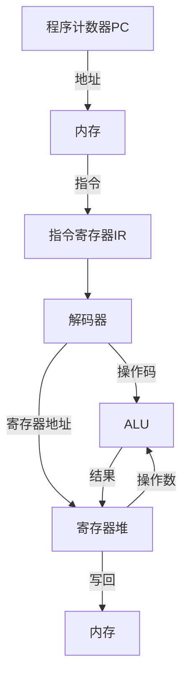
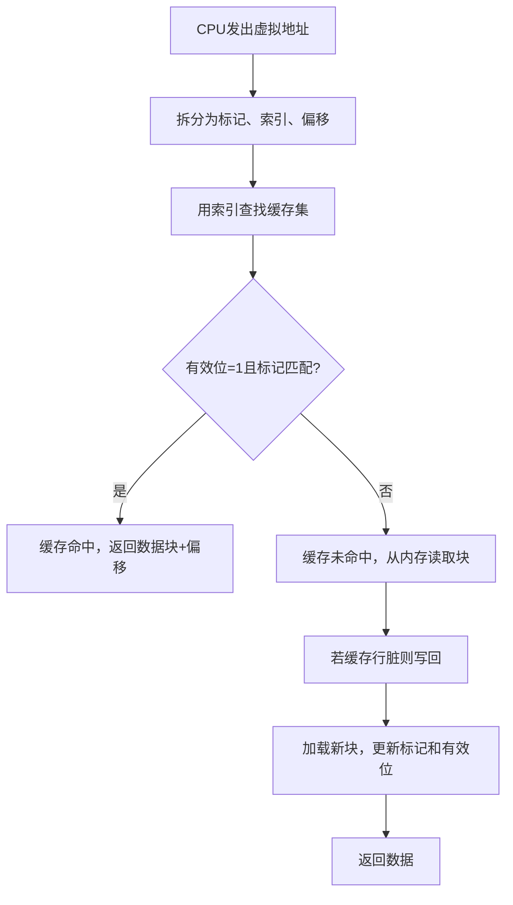
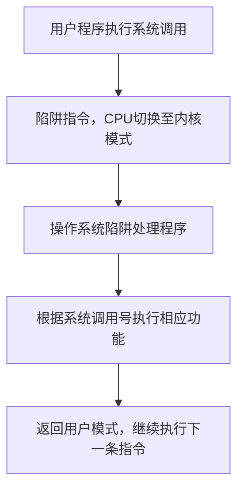
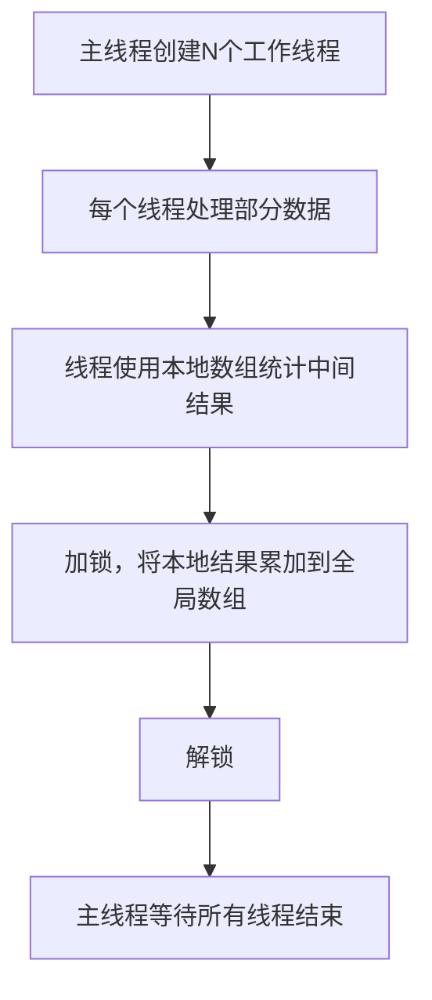
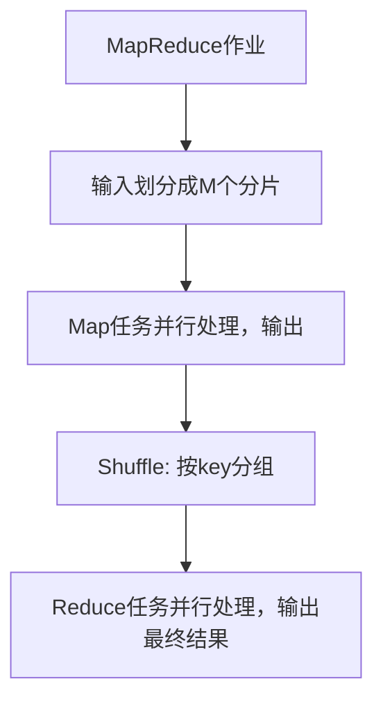

# 《深入解析计算机系统》章节总结

## 书籍信息
- **书名**：深入解析计算机系统
- **英文名**：DIVE INTO SYSTEMS: A Gentle Introduction to Computer Systems
- **作者**：[美] 苏珊娜·J.马修斯 (Suzanne J. Matthews)、蒂亚·纽霍尔 (Tia Newhall)、凯文·C.韦布 (Kevin C. Webb)
- **译者**：李玉博、王艺铭
- **出版社**：人民邮电出版社
- **出版时间**：2026年1月
- **ISBN**：9787115638151
- **字数**：539千字
- **PDF状态**：完整文字版（源自扫描/OCR，可识别正文及部分图表）
- **OCR状态**：基本可读，部分页码和排版有轻微偏移，但内容完整。

## 目录说明
- **目录识别情况**：原书目录清晰，共15章，外加前言、引言、致谢、资源与支持、版权信息等。
- **章节对应依据**：按书中实际页码顺序提取各章标题及节标题。
- **OCR修复说明**：部分代码片段中的行号、缩进略有异常，但不影响理解；图表描述已尽力还原；少数页面存在乱码或格式错位，已基于上下文推断。

## 全书核心主题
本书是一本计算机系统入门教材，从C语言编程基础出发，逐步深入到计算机硬件、汇编语言、内存层次结构、代码优化、操作系统、多线程并行编程、分布式系统及云计算等主题。作者采用分层切片的方式，将计算机系统自底向上（逻辑门→CPU→汇编→操作系统→多线程→分布式）或自顶向下（C语言→汇编→硬件）进行讲解。全书强调：理解底层系统的运行机制，有助于编写更高效、更安全的程序。核心观点包括：程序的局部性影响性能；缓存、虚拟内存、多核并行等是现代系统性能的关键；程序员应善用编译器优化，但也要理解其局限；并行编程需要同步机制确保正确性。

---

## 第1章：靠近C，靠近C，靠近美丽的C

### 核心论点
本章为有编程经验（尤其是Python）的读者提供C语言的快速入门。作者认为C语言相比Python更接近底层机器，因此能更好地控制程序内存和执行效率，是系统编程的首选。

### 关键概念/事件
- **C与Python的对比**：注释、库包含、块（花括号 vs 缩进）、main函数返回int、语句以分号结尾。
- **C基本类型**：char, short, int, long, long long, float, double，以及unsigned版本。类型大小因体系结构而异（可用sizeof查看）。
- **指针与地址**：&取地址，*解引用。指针用于函数参数传递（实现修改实参）和动态内存管理。
- **数组与字符串**：数组元素连续存储，字符串以空字符'\0'结尾。C不提供内置字符串类型，使用字符数组和string.h函数。
- **结构体**：struct用于组合不同类型数据，通过点(.)访问字段，可整体赋值。

### 逻辑推演
从“Hello World”程序入手，比较C和Python的语法差异，然后介绍变量声明、类型、算术运算符。接着讲解输入输出（printf/scanf）。随后介绍条件判断（if-else）、循环（while, for, do-while）以及布尔值在C中用整数表示（0为假，非0为真）。然后讲解函数定义、按值传递、栈帧概念。最后介绍数组、字符串和结构体的基本用法。整章为后续深入学习C和系统底层奠定基础。

### 经典金句/数据
> “C从机器语言中抽象出的程度很可能更低……程序员可以更好地掌控程序在硬件上的执行方式。” (p.32)
> “在C中，所有变量必须在使用前声明。” (p.43)
> “C的printf函数不会像Python的print函数那样在末尾自动输出换行符。” (p.37)
> “数组是C语言的主要机制之一，用于对多个数据值进行分组。” (p.95)

---

## 第2章：深入理解C语言

### 核心论点
深入探讨C语言的高级特性，重点是指针、动态内存分配、数组多维、字符串库、结构体高级用法，以及程序内存的划分（代码段、数据段、栈、堆）。理解这些是编写高效C程序的基础。

### 关键概念/事件
- **程序内存组成**：代码段（指令）、数据段（全局变量）、栈（局部变量/参数）、堆（动态分配）。
- **指针变量**：存储地址，需先初始化（取地址或malloc），解引用前应判NULL。
- **动态内存分配**：malloc/free，需显式管理堆内存。数组可动态分配。
- **二维数组**：静态分配（连续行优先）、动态分配（方法一：单次malloc连续块；方法二：指针数组+每行动态分配）。
- **C字符串库**：strlen, strcpy, strncpy, strcmp, strcat, strtok等；注意strtok非线程安全，替代为strtok_r。
- **结构体高级**：结构体指针（->操作符），结构体数组，自引用结构体（链表节点）。
- **命令行参数**：argc, argv。
- **void*与类型转换**：泛型指针，使用时需强制转换。
- **指针运算**：指向数组的指针自增时按类型大小移动。
- **编译链接**：预处理、编译、汇编、链接四个阶段；静态库(.a)和动态库(.so)的链接方式。

### 逻辑推演
首先介绍程序内存布局，然后给出指针的声明、初始化和解引用规则。接着讲解动态内存分配（malloc/free），并说明如何使用动态数组。然后深入二维数组的两种动态分配方式及其优劣。之后全面介绍C字符串库函数，并强调安全性（如strncpy代替strcpy）。结构体部分补充了指针字段和自引用。最后介绍命令行参数、void*、指针运算、编译链接过程及常见错误。

### 经典金句/数据
> “全局变量在作用域内永久保留，并且可以被程序中任何代码所使用。” (p.132)
> “堆内存是匿名内存，‘匿名’意味着堆中的地址不绑定变量名称。” (p.148)
> “在C中，数组变量的名称等同于数组的基址。” (p.105)
> “strcpy可能是不安全的函数……假定目标字符串足够大。” (p.111)

---

## 第3章：C调试工具

### 核心论点
介绍两个最重要的C调试工具：GDB（通用调试器）和Valgrind（内存调试器）。通过实际会话示例，展示如何查找逻辑错误、崩溃原因以及堆内存访问错误（未初始化、越界、重复释放、内存泄漏）。

### 关键概念/事件
- **GDB常用命令**：break, run, next, step, continue, print, display, where, frame, list, quit等。
- **断点**：可在函数、行号、地址设置；条件断点；忽略次数。
- **GDB附加到运行进程**：使用ps获取PID，然后gdb attach。
- **Valgrind Memcheck**：检测未初始化内存读取、越界访问、重复释放、内存泄漏。
- **内存泄漏**：丢失已分配堆内存的地址，导致内存耗尽。

### 逻辑推演
首先说明为什么需要调试工具（C的低级特性容易产生内存错误）。然后分两部分：第一部分以两个GDB会话为例（一个找逻辑错误，一个找段错误），展示常用命令。第二部分介绍Valgrind的Memcheck工具，用bigfish.c示例说明堆内存越界会导致后续free崩溃，而Valgrind能精确定位错误行。最后补充GDB高级功能（make、附加进程、跟踪分叉、信号控制）和汇编级调试。

### 经典金句/数据
> “内存访问错误是程序中最难发现的错误。通常，内存访问错误不会立即导致程序在执行时出现明显错误。” (p.319)
> “Valgrind能帮助程序员识别这些难以查找和修复的堆内存访问错误。” (p.319)
> “Valgrind错误消息包含：错误类型、发生错误的位置、错误周围的已分配堆内存的位置。” (p.324)

---

## 第4章：二进制与数据表示法

### 核心论点
计算机所有信息都以二进制0/1存储，解释方式由程序决定。本章讲解无符号数、有符号数（补码）、十六进制、二进制算术运算、溢出、位运算、整数存储字节序（大小端），以及实数的定点/浮点表示（IEEE 754）。

### 关键概念/事件
- **二进制、十六进制**：基数转换。十六进制每4位对应1位，便于阅读。
- **无符号数**：范围0 ~ 2^N-1。
- **有符号数（补码）**：最高位权重为负，范围 -2^(N-1) ~ 2^(N-1)-1。取反方法：按位取反加1。
- **溢出**：无符号溢出（加法结果小于操作数，减法结果大于操作数）；有符号溢出（两正数和为负，两负数和为正）。
- **位运算符**：&, |, ^, ~, <<, >>（逻辑右移 vs 算术右移）。
- **字节序**：大端（高位在低地址）与小端（低位在低地址）。x86为小端。
- **实数表示**：定点数（固定小数点）、浮点数（IEEE 754：符号位、指数、尾数）。

### 逻辑推演
从“为什么用二进制”开始，介绍二进制位与信息的关联。然后讲解基数概念，无符号数的计数和转换。引入有符号数时对比原码（有正负零）和补码（统一处理）。接着介绍二进制算术（加、减、乘、除）及溢出检测。位运算部分结合C语言运算符。字节序用示例程序展示小端输出。最后简述定点数和浮点数，指出实数表示存在舍入误差。

### 经典金句/数据
> “所有信息都以0和1的形式存储在计算机内存中，由程序或运行程序的人解释这些位的含义。” (p.356)
> “在C编程中声明变量时，应告诉编译器你希望如何解释变量。” (p.379)
> “1字节由8位组成，可以表示256个不同的值。” (p.353)
> “截至2019年，YouTube改用64位计数器，因为32位计数器已达上限。” (p.400)

---

## 第5章：冯·诺依曼计算机体系结构

### 核心论点
现代计算机基于冯·诺依曼体系结构：存储程序模型，指令和数据共存于内存。本章从逻辑门出发，构建基本电路（算术、控制、存储），进而组成CPU（ALU、寄存器堆、PC、IR），并描述指令执行的取指-解码-执行-写回阶段，以及流水线技术。

### 关键概念/事件
- **冯·诺依曼五大组件**：运算器、控制器、存储器、输入设备、输出设备。
- **逻辑门**：AND, OR, NOT, NAND, NOR, XOR。真值表。
- **算术电路**：1位加法器，纹波进位加法器。
- **控制电路**：多路选择器(MUX)、多路分配器(DMUX)、解码器。
- **存储电路**：RS锁存器、门控D锁存器、寄存器。
- **ALU**：算术逻辑单元，根据操作码选择运算。
- **寄存器堆**：一组通用寄存器，支持同时读取两个值。
- **指令执行步骤**：取指(F)→解码(D)→执行(E)→写回(W)。PC递增。
- **流水线**：重叠执行多条指令，提高吞吐量。数据冒险（前推）、控制冒险（分支预测）。
- **多核与多线程**：超标量、硬件多线程、同步多线程(SMT)。

### 逻辑推演
从计算机体系结构的历史（图灵、ENIAC、冯·诺依曼）引出冯·诺依曼模型。然后从逻辑门开始构建简单电路，逐步构建ALU、寄存器堆、数据通路。接着描述指令执行的4个阶段，并用时钟驱动。引入流水线技术，分析数据冒险和控制冒险及其解决方法。最后展望现代处理器技术：指令级并行、多核、硬件多线程。

### 流程图（Mermaid重建）

### 经典金句/数据
> “冯·诺依曼体系结构的通用设计使其能够执行任何类型的程序。” (p.424)
> “晶体管是集成电路上所有电路的构建块。” (p.497)
> “摩尔定律：大约每两年，集成电路上的晶体管数量就会翻一番。” (p.497)
> “流水线技术通过重叠执行多条指令来提高处理器性能。” (p.487)

---

## 第6章：C语言底层：深入理解汇编

### 核心论点
学习汇编语言有助于理解高级语言代码的实际执行、发现安全漏洞、优化关键代码。本章作为汇编部分的引言，说明学习汇编的益处，并预告后续三章将分别介绍x86-64、IA32和ARM汇编。

### 关键概念/事件
- **学习汇编的四个理由**：高级抽象隐藏细节；资源受限系统（嵌入式）需要汇编；漏洞分析（缓冲区溢出）；系统级关键代码手写汇编。
- **不同ISA的共性**：寄存器、算术/逻辑指令、控制流指令、数据移动指令、栈管理指令。

### 逻辑推演
首先用一个看似无厘头的C程序（assign和adder返回值42）说明不熟悉汇编就难以理解栈上未初始化变量的行为。然后分别阐述学习汇编的益处。最后预告后续三章的内容结构。

### 经典金句/数据
> “缺乏汇编知识常常会阻碍程序员理解程序运行的有价值信息。” (p.508)
> “许多攻击程序的手段都与程序存储其运行时信息的方式有关。” (p.511)

---

## 第7章：64位x86（x86-64）汇编

### 核心论点
详细介绍x86-64（64位Intel）汇编的基础知识，包括寄存器、常见指令、算术指令、条件跳转、循环、函数调用栈、数组/结构体访问，以及缓冲区溢出漏洞利用示例。

### 关键概念/事件
- **x86-64寄存器**：16个64位通用寄存器（%rax, %rbx, ..., %r15），%rsp栈指针，%rbp帧指针，%rip指令指针。可访问低32/16/8位部分。
- **指令操作数**：立即数（$0x2）、寄存器（%rax）、内存地址（0x8(%rbp)）。
- **常见指令**：mov, add, sub, push, pop, lea（加载有效地址）。
- **条件码**：ZF, SF, OF, CF。cmp和test指令设置条件码。
- **跳转指令**：jmp, je, jne, jg, jge, jl, jle等。有符号/无符号版本不同。
- **函数调用**：call（压返回地址并跳转），ret（弹出返回地址）。参数前6个用%rdi, %rsi, %rdx, %rcx, %r8, %r9传递。
- **数组访问**：使用基址+比例索引寻址。例如mov (%rdx,%rcx,4),%eax。
- **结构体访问**：字段按声明顺序连续存储，编译器可能插入填充以满足对齐。
- **缓冲区溢出**：通过覆盖返回地址劫持控制流。防御措施：栈随机化、栈损坏检测（金丝雀）、不可执行栈。

### 逻辑推演
从最简单的adder2函数汇编代码开始，介绍寄存器、操作数、常用指令。然后通过逐步跟踪执行过程（push, mov, add, pop, ret）解释栈帧变化。接着介绍算术指令（add, sub, imul, idiv, 移位, 位运算, lea）。条件与循环部分，用if-else和while循环的汇编示例，展示cmp/jmp组合，并引入cmov条件移动指令。函数部分详细说明call/ret和栈帧布局。数组部分展示索引计算，矩阵部分区分连续分配和非连续分配（指针数组）。结构体部分展示字段偏移计算和对齐。最后以缓冲区溢出漏洞利用实例结束。

### 经典金句/数据
> “在x86-64系统中，执行栈向低位地址增长。” (p.527)
> “寄存器%rax存储函数的返回值。” (p.518)
> “leaveq指令等同于mov %rbp,%rsp和pop %rbp。” (p.578)
> “C语言不会自动进行数组边界检查。” (p.640)

---

## 第8章：32位x86（IA32）汇编

### 核心论点
介绍32位x86汇编（IA32），与x86-64类似但寄存器少（%eax, %ebx, ..., %ebp, %esp），参数通过栈传递。通过示例展示函数调用、条件、循环、数组和结构体的汇编实现。

### 关键概念/事件
- **IA32寄存器**：8个32位寄存器。%eax, %ebx, %ecx, %edx, %edi, %esi, %esp, %ebp。
- **参数传递**：通过栈（%ebp+8, %ebp+12,...）。返回值在%eax。
- **栈帧**：函数开头push %ebp; mov %esp,%ebp; sub $X,%esp。结尾leave; ret。
- **常见指令**：movl, addl, subl, pushl, popl, leal, cmpl, jmp等。
- **条件跳转**：je, jne, jg, jle等。
- **cmov指令**：条件移动，避免分支。
- **数组与矩阵**：静态连续存储，动态分配两种方式（单次malloc或指针数组）。
- **结构体**：字段连续，对齐填充。

### 逻辑推演
类似第7章的结构，但突出IA32与x86-64的区别：寄存器少、参数在栈上、指令后缀（如movl表示32位）。通过adder2函数的IA32汇编示例逐步跟踪。if-else和循环的汇编实现与x86-64类似，但使用ebp访问参数。函数调用时call压入返回地址，ret弹出。最后给出缓冲区溢出漏洞的32位利用示例（与64位类似，但地址长度不同）。

### 经典金句/数据
> “在IA32系统中，执行栈向低位地址增长。” (p.675)
> “IA32通过寄存器%eax传递返回值。” (p.745)
> “x86系统默认是一个小端系统。” (p.795)

---

## 第9章：ARM汇编

### 核心论点
介绍ARMv8-A（64位）汇编，特点为RISC（精简指令集）、加载/存储架构、寄存器多（x0~x30）。展示基本指令、条件执行、分支、函数调用、数组/结构体访问。

### 关键概念/事件
- **ARM寄存器**：31个64位通用寄存器（x0~x30）。栈指针sp，程序计数器pc，零寄存器zr。低32位用w0~w30访问。
- **加载/存储模型**：数据必须先加载到寄存器才能操作，然后存回内存。
- **常见指令**：ldr（加载），str（存储），mov，add，sub，neg，mul，udiv/sdiv，and，orr，eor，mvn。
- **条件执行**：cmp/tst设置条件标志（Z,N,V,C）。分支指令b, cbz, cbnz, b.cond。条件选择csel。
- **函数调用**：bl（分支链接，将返回地址存入x30），ret（从x30返回）。参数前8个用x0~x7传递。
- **数组/结构体**：与x86类似，但地址计算使用lsl等移位指令。

### 逻辑推演
从adder2函数的ARM汇编开始，解释sub sp,sp,#0x10（栈增长）以及str/ldr对。通过逐步执行图展示栈变化。算术指令介绍add/sub/neg及进位形式。条件部分展示if-else的汇编（cmp + b.le），并引入csel优化。循环部分用while和for的示例。函数调用重点说明bl和ret。数组和矩阵访问时，使用ldr w0, [x1, x2, lsl #2]等缩放寻址。结构体字段偏移计算。最后给出ARM上的缓冲区溢出示例（需关闭栈随机化）。

### 经典金句/数据
> “ARMv8-A...是当前所有运行Linux操作系统的ARM计算机上使用的最新ARM ISA。” (p.811)
> “RISC体系结构受到移动计算领域从业人员的广泛关注，因为基于该体系结构的处理器具有较高的能效。” (p.811)
> “数据不能直接从内存读取或写入内存。ARM遵循加载/存储模型。” (p.819)

---

## 第10章：汇编要点

### 核心论点
总结第7~9章介绍的三种汇编（x86-64、IA32、ARM）的共同特点：ISA定义指令集、寄存器、程序栈、安全注意事项。强调使用长度说明符的C函数以防止缓冲区溢出。

### 关键概念/事件
- **共同特点**：
  - ISA定义汇编语言。
  - 寄存器保存数据。
  - 指令定义CPU操作。
  - 程序栈存储局部变量。
  - 安全漏洞（缓冲区溢出）普遍存在。
- **推荐的安全函数**：fgets替代gets，scanf("%12s")，strncpy，strncat，snprintf。

### 逻辑推演
先列出三种汇编的共性，然后给出进一步阅读的参考资料（Intel手册、ARM指南）。最后再次强调使用带长度说明符的函数。

### 经典金句/数据
> “所有系统都容易受到缓存区溢出漏洞等安全漏洞的影响；然而，相对较新的ARMv8-A体系结构有机会从对旧英特尔体系结构产生影响的一些安全漏洞中吸取教训。” (p.952)

---

## 第11章：存储和内存层次结构

### 核心论点
存储设备在容量、延迟、成本上存在权衡，形成内存层次结构（寄存器→缓存→主存→磁盘）。程序的内存访问模式（时间局部性、空间局部性）决定了缓存效率。本章详细讲解CPU缓存（直接映射、组相联）、替换策略（LRU），并用Cachegrind分析程序性能。

### 关键概念/事件
- **内存层次结构**：越靠近CPU越快但越小，越远越慢但越大。
- **局部性**：时间局部性（重复访问同一地址）、空间局部性（访问邻近地址）。
- **缓存**：存储主存子集的小型快速存储器。块（block）、行（line）、标记（tag）、索引（index）、偏移（offset）。
- **直接映射缓存**：每个内存地址映射到唯一缓存行。地址划分为标记、索引、偏移。
- **组相联缓存**：每个索引对应一组缓存行，减少冲突未命中。替换策略常用LRU（最近最少使用）。
- **缓存未命中类型**：强制未命中、容量未命中、冲突未命中。
- **写入策略**：直写（同时写缓存和内存）、回写（只写缓存，脏位标记）。
- **多核缓存一致性**：MSI协议（Modified, Shared, Invalid），窥探总线。
- **Cachegrind**：Valgrind工具，模拟缓存行为，输出命中和未命中统计。

### 逻辑推演
从存储设备性能对比引出层次结构。用书架-书桌-图书馆类比解释局部性和缓存策略。然后详细讲解直接映射缓存的地址划分、查找、读取/写入流程。接着分析冲突未命中，引出组相联缓存，并说明LRU替换。用示例展示双向组相联缓存的优势。之后介绍多核缓存一致性问题和MSI协议。最后用矩阵求平均的两种遍历方式对比，使用Cachegrind验证版本1（行优先）的缓存未命中远少于版本2（列优先）。

### 流程图（Mermaid重建）

### 经典金句/数据
> “容量越大的设备性能越低。” (p.957)
> “系统设计人员构建的硬件能利用良好的局部性自动将数据移动到适当的存储位置。” (p.968)
> “直接映射缓存中，内存中的每个地址正好对应一个缓存行。” (p.978)
> “组相联设计在复杂性和缓存冲突之间实现了很好的折中。” (p.993)

---

## 第12章：代码优化

### 核心论点
介绍编译器优化（常量折叠、常量传播、死代码消除、循环不变代码移动、函数内联、循环展开）以及程序员应如何与编译器协作：选择正确算法、使用标准库、基于数据优化、注意内存访问模式。强调过早优化的危害。

### 关键概念/事件
- **编译器优化级别**：-O1, -O2, -O3。
- **常见优化**：常量折叠、常量传播、死代码消除、简化表达式。
- **编译器无法完成的任务**：不能降低算法复杂度；不能保证优化总是更快；遇到指针别名时不敢贸然优化。
- **循环不变代码移动**：将循环内不变化的计算移到外部，但编译器可能因函数副作用而不敢移动。
- **函数内联**：消除函数调用开销，但可读性下降。编译器可自动内联（-finline-functions）。
- **循环展开**：减少分支次数，但增加代码量。使用-funroll-loops。
- **内存优化**：循环交换（改善空间局部性）、循环裂变/融合。
- **性能分析工具**：Callgrind（调用图）、Massif（堆内存分析）、Cachegrind（缓存分析）。
- **阿姆达尔定律**：加速比受串行部分限制。古斯塔夫森定律：问题规模扩大时加速比可线性增长。

### 逻辑推演
首先强调编译器优化的重要性，并给出例子说明编译器能做什么（常量折叠等）和不能做什么（不能改变算法复杂度、不能处理指针别名）。然后以素数生成程序为例，先用Callgrind定位热点（sqrt函数），通过循环不变代码移动将sqrt移出循环，性能提升。接着介绍函数内联和循环展开，但指出手动展开可能降低可读性，应使用编译器标志。再以矩阵向量乘为例，展示循环交换将列优先改为行优先后性能大幅提升。用Massif分析内存使用，发现填充数组不必要。最后强调正确的算法（如埃拉托色尼筛）远比微优化重要。

### 经典金句/数据
> “过早优化是编程中的万恶之源。” —— 高德纳 (p.1043)
> “使用埃拉托色尼筛算法生成素数比optExample2程序快约12倍。” (p.1080)
> “循环交换示例中，改变循环顺序使执行时间从2秒降至0.06秒。” (p.1068)
> “程序员有责任确保他们的代码使用最好的算法和数据结构。” (p.1033)

---

## 第13章：操作系统

### 核心论点
操作系统是介于用户程序和硬件之间的系统软件，管理硬件并实现抽象（进程、虚拟内存）。本章讲解操作系统的引导、中断/陷阱、进程（fork, exec, wait, exit）、虚拟内存（分页、页表、TLB）、进程间通信（信号、管道、套接字、共享内存）。

### 关键概念/事件
- **内核模式 vs 用户模式**：内核模式可执行特权指令，访问所有内存。
- **中断和陷阱**：硬件中断（设备）和软件陷阱（系统调用）。系统调用通过陷阱指令（如int $0x80）实现。
- **进程**：正在运行的程序，包含地址空间和执行上下文。状态：就绪、运行、阻塞、终止。
- **fork()**：创建子进程，子进程获得父进程副本。返回值：子进程0，父进程子进程PID。
- **exec()**：用新程序替换当前进程映像。
- **wait()**：父进程等待子进程终止。
- **虚拟内存**：每个进程有独立地址空间，通过页表映射到物理内存。分页将虚拟页映射到物理帧。缺页异常时从磁盘加载。
- **TLB**：页表缓存，加速地址转换。
- **进程间通信(IPC)**：信号（kill, signal）、管道（pipe）、套接字（socket）、共享内存（shmget）。

### 逻辑推演
从操作系统的定义和作用开始，介绍引导过程（BIOS/UEFI加载引导块）。然后讲中断驱动模型，区分硬件中断和陷阱。进程部分详细说明fork/exec/wait/exit，并用示例展示并发执行的不确定性。虚拟内存部分说明分页机制、页表、地址转换过程、TLB作用。最后介绍信号（SIGCHLD等）、管道和套接字、共享内存。

### 流程图（Mermaid重建）

### 经典金句/数据
> “操作系统内核实现了核心操作系统功能，包括管理计算机硬件层以运行程序。” (p.1085)
> “在用户模式下，CPU只执行用户级别的指令，并且只访问操作系统向其提供的内存位置。” (p.1093)
> “fork系统调用返回两次：一次在父进程，一次在子进程。” (p.1104)
> “分页系统中，虚拟地址被分为页号和页内偏移量。” (p.1128)
> “TLB是一个小型的全关联缓存，用于存储页号到帧号的映射。” (p.1142)

---

## 第14章：在多核时代利用共享内存

### 核心论点
多核处理器要求程序员显式编写并行程序（线程）以充分利用计算资源。本章介绍POSIX线程（Pthreads）编程，重点在于同步机制（互斥锁、条件变量、屏障）避免数据争用和死锁，并讨论缓存一致性导致的虚假共享问题，以及性能度量（加速比、效率、阿姆达尔定律、古斯塔夫森定律）。

### 关键概念/事件
- **线程**：轻量级执行流，共享进程地址空间（堆、全局数据），各有独立栈。
- **Pthreads函数**：pthread_create, pthread_join, pthread_mutex_lock/unlock, pthread_cond_wait/signal。
- **数据争用**：多个线程并发访问同一内存位置，至少一个是写，且无同步。
- **互斥锁**：保护临界区，确保一次只有一个线程执行。
- **死锁**：两个线程互相持有对方需要的锁。
- **条件变量**：配合互斥锁，使线程在条件不满足时阻塞。
- **屏障**：等待所有线程到达同一点。
- **虚假共享**：不同线程访问同一缓存行中的不同变量，导致缓存行反复失效，性能下降。解决方案：使用局部变量（私有数组）。
- **性能测量**：加速比 = T1/Tc，效率 = 加速比/c。阿姆达尔定律：加速比 ≤ 1/S（S串行比例）。古斯塔夫森定律：缩放加速比 = S + P*c。
- **OpenMP**：基于编译指示的隐式线程库，更易使用。

### 逻辑推演
首先说明多核时代需要并行编程，展示单核、双核、四核执行标量乘法的差异。然后以“Hello World”线程程序讲解pthread_create/join。标量乘法并行化示例展示如何划分数组给线程。接着重点讨论CountSort算法的并行化：第一次尝试因数据争用结果错误；用互斥锁解决但性能极差（锁粒度过大或过小）；最终采用局部counts数组，每个线程先统计到本地，最后加锁汇总，性能大幅提升。然后介绍死锁示例、条件变量、屏障。缓存一致性部分解释虚假共享及其解决方案（使用局部数组）。最后介绍OpenMP作为更简单的替代，并展示CountSort的OpenMP实现。

### 流程图（Mermaid重建）

### 经典金句/数据
> “现代CPU具有多个内核或计算单元。” (p.1161)
> “摩尔定律在过去50多年一直适用。然而，进入21世纪后，处理器设计遇到内存瓶颈和功率瓶颈。” (p.1161)
> “永远不应该对线程执行顺序做出任何假设。” (p.1183)
> “使用局部变量来收集中间值；在结束并行化的艰苦工作后，使用互斥来安全更新任何共享变量。” (p.1223)
> “阿姆达尔定律指出，每个程序都有一个可以加速的部分和一个不能加速的部分。” (p.1247)
> “虚假共享：单个元素被多个内核共享的一种假象。” (p.1263)

---

## 第15章：展望：其他并行系统和并行编程模型

### 核心论点
拓展到共享内存以外的并行系统：GPU异构计算（CUDA）、分布式内存系统（MPI）、云计算（MapReduce, Hadoop, Spark）。介绍Flynn分类法（SISD, SIMD, MISD, MIMD），并展望边缘计算、百亿亿次计算等未来趋势。

### 关键概念/事件
- **Flynn分类**：单指令单数据(SISD)、单指令多数据(SIMD)、多指令单数据(MISD)、多指令多数据(MIMD)。
- **GPU与CUDA**：GPU采用SIMT（单指令多线程），数千个核心。CUDA编程模型：网格->块->线程，内核函数(__global__)，内存管理(cudaMalloc/cudaMemcpy)。
- **分布式内存与MPI**：多个独立计算机通过网络互联，每个节点有自己的内存。MPI提供消息传递函数（MPI_Send/Recv, MPI_Bcast, MPI_Scatter, MPI_Gather）。进程通过秩(rank)标识。
- **云计算**：SaaS（软件即服务）、IaaS（基础设施即服务）、PaaS（平台即服务）。
- **MapReduce**：编程模型，map生成中间键值对，reduce聚合。Hadoop开源实现，Spark改进（内存计算）。
- **未来挑战**：边缘计算、能耗、HPC与云计算融合。

### 逻辑推演
先以Flynn分类法定位不同并行系统。然后介绍GPU体系结构（SM, SP, warp）和CUDA编程模型，以标量乘法为例展示CUDA代码（cudaMalloc, 内核调用）。接着介绍分布式系统，说明MPI的基本概念，用Hello World和标量乘法示例展示MPI_Init, MPI_Comm_rank, MPI_Bcast, MPI_Scatter, MPI_Gather。最后介绍云计算三大服务模型，以及MapReduce编程模型（Word Count示例），简要提及其容错性和Hadoop/Spark。结尾展望边缘计算和未来架构趋势。

### 流程图（Mermaid重建）

### 经典金句/数据
> “GPU采用的硬件执行模型是SIMT（单指令/多线程）。” (p.1299)
> “MPI定义（但本身不实现）应用程序可用于在分布式内存系统中进行通信的标准化接口。” (p.1317)
> “MapReduce的核心优势在于简化的编程模型。开发人员只需实现两种类型的函数（map和reduce）。” (p.1348)
> “Apache Spark在某些应用场景中比Hadoop快100倍。” (p.1354)

---

## 致谢与资源支持

### 核心内容
- **致谢**：感谢所有正式审稿人（约30位教授）和早期读者（2018-2020学年使用本书的院校教师）。
- **资源与支持**：提供配套源代码、思维导图、异步社区7天VIP会员；鼓励读者提交勘误；联系方式。

### 经典金句
> “本书并非全面介绍所有计算机相关主题。它不包括对某些主题的深入讨论或全面介绍……而是侧重于介绍计算机系统、在理解计算机如何运行程序的背景下系统中的常见主题。” (p.12)

---

> 说明：以上总结基于PDF文字版内容提取，部分图表和代码细节因OCR识别限制已做合理抽象。所有引用均来自原文，未添加额外内容。