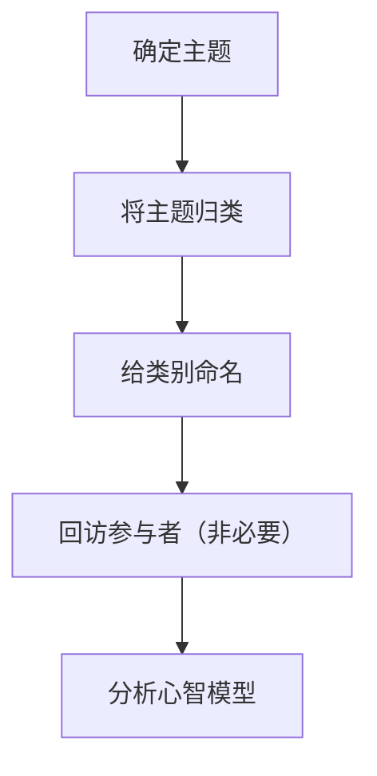
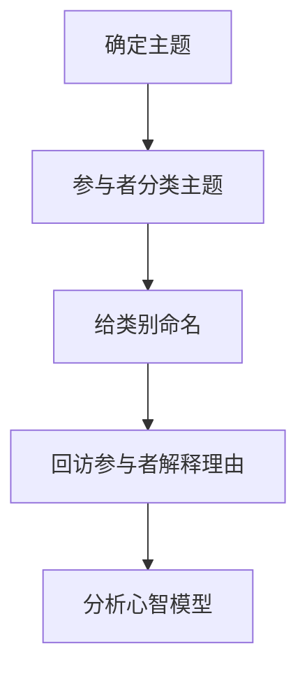
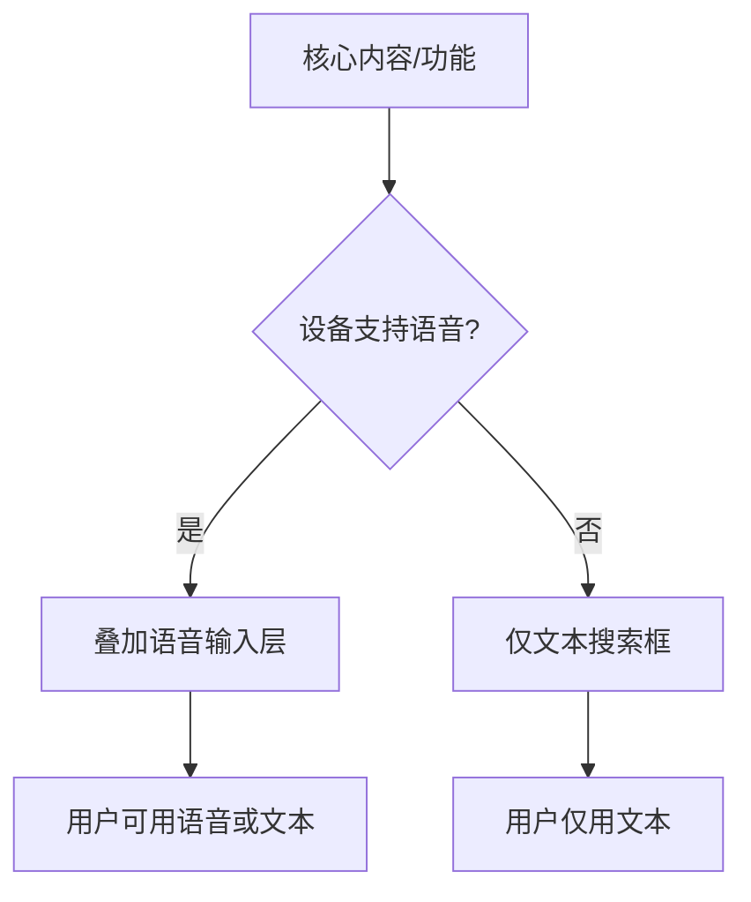
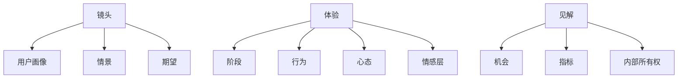
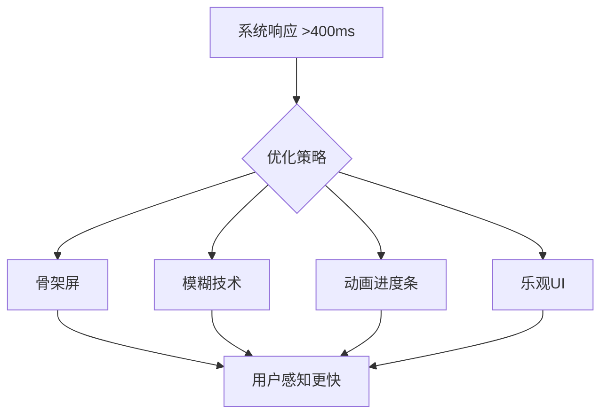
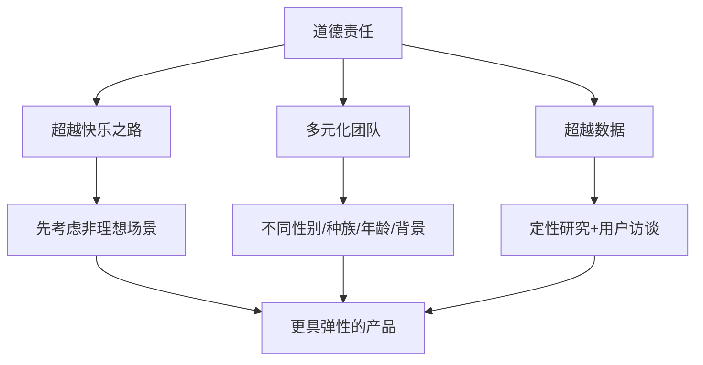
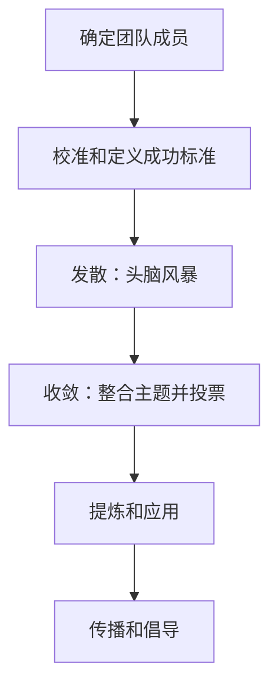
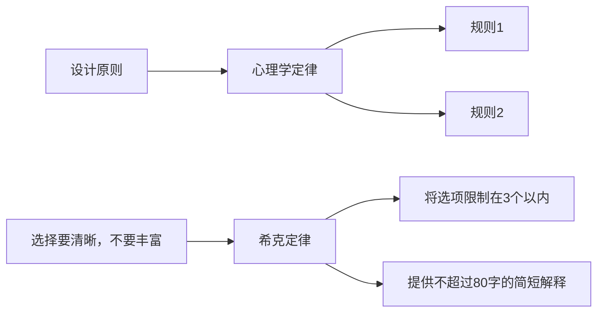

# 《用户体验定律：简单好用的产品设计法则》章节总结

## 书籍信息
- 书名：用户体验定律：简单好用的产品设计法则
- 作者：【美】乔恩·亚布隆斯基（Jon Yablonski）
- 译者：胡晓
- 出版社：人民邮电出版社
- 出版时间：2023年6月
- ISBN：9787115614889
- PDF状态：基于EPUB文本解析，内容完整可识别
- OCR状态：良好，无显著错漏

## 目录说明
- 目录识别情况：完整识别，包含中文版序、译者序、前言、第1章至第12章、关于作者、关于译者、致谢。
- 章节对应依据：依据原书目录顺序整理。
- OCR修复说明：无需修复。

## 全书核心主题
本书系统介绍了用户体验设计中最重要的心理学定律，旨在帮助设计师理解人类认知和行为的基本规律，并将其应用于数字产品和服务的设计实践。作者从雅各布定律、菲茨定律、希克定律等经典定律出发，阐述了如何利用心智模型、认知负荷、记忆组块等心理学概念来提升界面的易用性和用户满意度。书中不仅包含每条定律的起源、案例和关键考虑因素，还探讨了技术如何塑造用户行为以及设计师应承担的道德责任。最后一章提供了将心理学定律融入团队设计原则的具体方法。全书强调：优秀的设计不是强迫用户适应技术，而是基于对人性的深刻理解来创造直观、高效、愉悦的体验。

---

## 中文版序

### 核心论点
问题：如何让设计师更容易理解复杂的心理学启发法？
观点：作者创建Laws of UX网站并将其扩展为本书，目的是将心理学定律以实用指南的形式呈现，帮助设计师创造更直观的产品和体验。

### 关键概念/事件
- **目标梯度效应**：接近目标的趋势随着接近目标的程度而增强。
- **同域定律**：共享有明确边界区域的元素往往被视为一组。
- **接近定律**：彼此接近的元素往往会被分为一组。
- **完形定律**：人们会以最简单的形式感知模糊或复杂的图像。
- **相似性定律**：人眼倾向于将相似的元素感知为完整的组。
- **连通性定律**：视觉上连贯的元素比不连贯的元素关联性更强。
- **奥卡姆剃刀**：预测效果相同时，选择假设最少的假设。
- **帕累托法则**：大约80%的影响由20%的原因所致。
- **帕金森定律**：任何工作都会扩展直到耗尽可用时间。
- **系列位置效应**：用户对系列中的第一项和最后一项印象最深刻。
- **蔡加尼克效应**：人们更清楚地记得中断或未完成的任务。

### 逻辑推演/叙事脉络
作者最初建立Laws of UX网站是为了记录心理学与用户体验设计的交叉知识，该网站意外影响了全球众多设计师。本书是对网站的扩展，旨在让设计师更容易理解复杂的心理学启发法。作者挑选了在其职业生涯中应用最广泛、最深入的心理学定律，并通过实际案例展示这些概念如何用于每天交互的产品中。本书不是百科全书，而是一本实用指南。

### 经典金句/数据
> “我很荣幸看到中文版正式出版。” 
> “我真诚地希望你能在阅读本书的过程中获得巨大的乐趣。”

---

## 译者序

### 核心论点
问题：产品设计决策如何验证合理性？
观点：通过对用户心理进行研究，掌握控制能力，建立平衡功能与视觉的生态，将掌控权交还给用户，与用户相互成就。

### 关键概念/事件
- 产品设计需要标准化数据和用户心理学知识作为支撑。
- 本书从用户心理学基础知识入手，延伸到案例解读和设计管理，适合任何注重用户体验的设计师和产品经理。

### 逻辑推演/叙事脉络
译者指出，设计从业者需要确保用户获得能产生更高价值的积极体验。然而业内能参考的标准化数据很少，验证设计决策合理性成为难题。用户心理学研究成为关键。本书系统性地介绍了用户心理学知识，配以简约图形，帮助读者快速形成方法论。

### 经典金句/数据
> “产品设计不能是从业者的独欢，一切对用户的喜好全凭猜测。”

---

## 前言

### 核心论点
问题：在没有数据支持的情况下，如何证明设计决策的合理性？
观点：心理学能够提供经验证据，帮助设计师理解人们的行为习惯及其背后的原因，从而构建更直观、以人为本的产品和体验。

### 关键概念/事件
- **Laws of UX网站**：作者创建的资源库，记录心理学和用户体验设计的交叉领域。
- **心理学与设计交叉**：作者认为了解基础的心理学知识是每个设计师都应拥有的技能。

### 逻辑推演/叙事脉络
作者接手了一个困难项目，在没有数据的情况下需要证明设计决策的合理性。他转向行为心理学和认知心理学寻找支撑，发现这是一个知识宝库。但互联网上缺乏对设计师友好的资源，于是他创建了Laws of UX网站。本书是对该网站的扩展，专门介绍能推动设计工作的各种心理学原理和概念。作者认为，设计师可以利用心理学原则按照用户习惯的方式进行设计，而不是强迫用户适应产品的设计。

### 经典金句/数据
> “心理学和用户体验设计的交叉领域变得愈发重要。”
> “了解基础的心理学知识才是每个设计师都应拥有的技能。”

---

## 第1章：雅各布定律

### 核心论点
问题：用户如何使用新网站或新产品？
观点：用户已经花费大量时间使用某些网站，并且使用得相当娴熟，他们自然希望你的网站和那些他们熟悉的网站尽可能相似。利用现有的心智模型可以创造更好的用户体验。

### 关键概念/事件
- **雅各布定律**：由易用性专家雅各布·尼尔森于2000年提出，指用户期待在新的网站上看到熟悉的设计惯例。
- **心智模型**：人们基于对某个系统的了解而建立的模型，会将其应用到类似的新系统上。
- **心智模型失衡**：用户熟悉的产品突然发生改变时产生的困惑和不满。案例：Snapchat 2018年改版导致用户流失。
- **用户画像**：基于聚合数据构建的目标受众虚拟画像，包含信息、详情、见解模块。

### 逻辑推演/叙事脉络
熟悉感让用户能够瞬间知道如何使用数字产品，节省脑力，减少认知负荷。设计师应使用通用或约定俗成的设计模式（如导航栏、搜索框），让用户立刻上手。雅各布定律源于心智模型心理学概念。案例展示了控制面板与表单控件的对应关系、Snapchat改版失败、谷歌允许用户选择切换到新版、Etsy利用熟悉购买流程、汽车座椅控件设计等。结论：不是所有网站都要相同，但应从常见模式开始，只有在必要时才放弃。

### 方法流程图：卡片分类法（技巧）



### 经典金句/数据
> “用户已经花费了大量时间使用某些网站，并且使用得相当娴熟，他们自然希望你的网站和那些他们熟悉的网站尽可能相似。”
> “Snapchat的错误就在于没能将新的设计与用户的心智模型相匹配，这种失衡引发了用户的强烈抵制。”
> “符合预期的设计让用户可以利用经验，找到熟悉的感觉，并专注于更重要的事情。”

---

## 第2章：菲茨定律

### 核心论点
问题：如何让用户轻松、精准地选中交互目标？
观点：移动到目标所需的时间取决于当前位置与目标之间的距离和目标的大小。触控目标应足够大、间距足够大、置于界面的特定区域。

### 关键概念/事件
- **菲茨定律**：由美国心理学家保罗·菲茨于1954年提出，预测移动到目标区域的时间是目标距离与目标宽度之比的函数。
- **难度指数（ID）**：ID = log₂(2D/W)，其中D是到目标中心的距离，W是目标的宽度。
- **触控目标尺寸建议**：Apple 44pt，微软 9mm，谷歌 48dp，Fitts定律建议至少10mm。
- **成人手指平均直径**：16mm～20mm（麻省理工学院触控实验室研究）。

### 逻辑推演/叙事脉络
易用性是区分设计好坏的关键。菲茨定律指出目标越大、距离越近，选中越快。设计师应确保触控目标足够大（参考各公司建议），间距足够（至少8dp），并将重要控件放在易触及区域（如屏幕中央）。案例：文本框标签关联扩大点击区域；“提交”按钮靠近最后一个文本框；LinkedIn按钮间距过小导致易误触；特斯拉Model 3底部导航栏充足间距；iPhone“可达性”功能将顶部内容移到下半屏。

### 方法流程图：菲茨定律示意图

```mermaid
graph LR
    A[当前位置] -->|距离 D| B[目标]
    B -->|宽度 W| C[选中时间 T]
    C -->|公式| D[T = a + b log₂(2D/W)]
```

### 经典金句/数据
> “移动到目标所需的时间，取决于当前位置与目标之间的距离和目标的大小。”
> “设计师的主要职责是让界面能够拓展用户的能力，提升用户的体验，而不是分散用户的注意力或阻碍用户的使用。”

---

## 第3章：希克定律

### 核心论点
问题：如何减少用户的决策时间？
观点：选择越多、越复杂，决策所需的时间就越长。应尽量减少选项、分解复杂任务、突出推荐选项、使用渐进式引导。

### 关键概念/事件
- **希克定律**：由威廉·埃德蒙·希克和雷·海曼于1952年提出。反应时间 RT = a + b log₂(n)，其中n是选项数量。
- **认知负荷**：理解界面并与之交互所需的脑力劳动总量。可类比手机内存：超载会导致性能下降。
- **工作记忆缓冲区**：有限槽位存储与当前任务相关的信息。
- **卡片分类法**：一种调研方法，让用户在不同类别下列出最感兴趣的话题，以识别信息架构。

### 逻辑推演/叙事脉络
设计师应整合信息并以易接受的方式呈现。选项过多会延长决策时间、增加认知负荷。案例：老人友好型遥控器简化按钮；智能电视遥控器只保留必要按钮；谷歌搜索在搜索后才显示过滤选项；Slack渐进式引导新用户。关键考虑因素：过度简化可能导致抽象（如图标含义模糊），添加文本标签可提高识别性。结论：减少不能帮助用户实现目标的元素。

### 方法流程图：卡片分类法步骤（技巧）



### 经典金句/数据
> “选择越多、越复杂，决策所需的时间就越长。”
> “简化界面或流程有助于减轻用户的心理压力，但设计师必须添加上下文信息。”
> “用户需要考虑的越少，他们就越有可能实现目标。”

---

## 第4章：米勒定律

### 核心论点
问题：米勒定律的“神奇数字7”应该如何正确理解？
观点：普通人的工作记忆容量为7（±2）项内容，但这不是硬性限制。重点在于将内容组织成较小的“组块”，以帮助用户处理、理解和记忆信息。

### 关键概念/事件
- **米勒定律**：认知心理学家乔治·米勒1956年发表《神奇数字7，加/减2》指出记忆广度大约在7以内。
- **组块**：熟悉单元的集合，被组合在一起并存储在记忆中。组块大小不重要，重要的是组块的数量。
- **误用案例**：将导航菜单链接数量限制在7个以内——实际上导航菜单是随时可见的，不需要记忆。

### 逻辑推演/叙事脉络
许多设计师误用米勒定律来限制导航项数量。米勒的真正贡献在于“组块”概念。组块化使内容更易理解。案例：格式化电话号码（如(123) 456-7890）更容易记忆；“文本墙”通过标题、空行、下划线等分层改进；电子商务网站用接近性原则组块化产品信息；Nike导航菜单链接远超7个但依然清晰。结论：米勒定律教导我们使用组块组织内容，而不是教条地限制数量。

### 经典金句/数据
> “普通人的工作记忆容量为7（±2）项内容。”
> “不要使用‘神奇数字7’来为不必要的设计限制找借口。”
> “将内容组织成较小的组块，以便用户轻松处理、理解和记忆。”

---

## 第5章：波斯特尔定律

### 核心论点
问题：如何设计适应不同用户输入和环境的系统？
观点：输出保守，输入多元。系统应可靠可用，同时接受各种输入格式、设备、网络条件，具有弹性。

### 关键概念/事件
- **波斯特尔定律（稳健性原则）**：由计算机科学家乔恩·波斯特尔在TCP规范中提出。发送数据应严格符合规范，接收数据应足够稳健以接受不合规输入。
- **响应式Web设计**：Ethan Marcotte 2010年提出，利用流动网格、灵活图像和媒体查询适应不同浏览环境。
- **渐进式增强**：Steve Champeon和Nick Finck 2003年提出，先确保所有用户都能访问核心内容，再渐进叠加样式和交互。
- **设计系统**：可重复使用的组件和模式集合，使设计可扩展。

### 逻辑推演/叙事脉络
人类与机器不同，容易出错。设计师应使系统可靠可用（输出保守），同时接受多种输入（输入多元）。案例：表单信息录入应只索要必要信息；Face ID提供无密码认证；响应式Web设计适应任何屏幕；渐进式增强的搜索框支持语音输入；设计系统接受多元输入但输出保守。关键考虑因素：设计的弹性——考虑国际化文本长度扩展（英语到意大利语可扩展3倍）、默认字号自定义等。

### 方法流程图：渐进式增强



### 经典金句/数据
> “输出保守，输入多元。”
> “良好的用户体验意味着良好的人类体验。”
> “在设计时预测和规划的因素越多，设计的弹性越大。”

---

## 第6章：峰终法则

### 核心论点
问题：用户如何评价一段体验？
观点：用户对一段体验的评价大多基于他们在“峰”和“终”的体验，而非基于所有时刻的平均体验值。应密切关注关键时刻。

### 关键概念/事件
- **峰终法则**：Daniel Kahneman等1993年首次提出。实验表明参与者更愿意重复持续时间更长但结束更舒适的体验。
- **结肠镜研究**：Redelmeier和Kahneman 1996/2003年发现患者根据最糟糕时刻和最后时刻的疼痛程度评估经历。
- **认知偏差**：人们在思维中犯的系统性错误。峰终法则属于记忆偏差。
- **近因效应**：更容易回忆序列尾部的项目。
- **旅程地图**：可视化用户完成特定任务的过程，包含镜头、体验、见解三部分。

### 逻辑推演/叙事脉络
人们记住的是一系列情绪快照，而非整段经历。积极和消极的高峰时刻及结束时刻决定整体评价。案例：Mailchimp在发送邮件关键时刻用吉祥物Freddie的动画缓解压力，并提供击掌彩蛋；Uber Express POOL通过动画、预计到达时间、步骤解释改善等待体验。消极峰值可转化为机会（如404错误页面用幽默强化品牌）。结论：在情绪高峰和结束时刻给人留下持久好印象至关重要。

### 方法流程图：旅程地图结构（技巧）



### 经典金句/数据
> “用户对于一段体验的评价大多基于他们在‘峰’和‘终’的体验。”
> “我们的记忆很少能完全准确地记录事件。”
> “在情绪的高峰时刻和结束时刻给人留下持久的好印象至关重要。”

---

## 第7章：美学易用性效应

### 核心论点
问题：美观的设计会影响用户对易用性的感知吗？
观点：用户通常认为美观的设计更易用。美观的设计能引起积极情绪反应，增强认知能力，提升信任度。

### 关键概念/事件
- **美学易用性效应**：黑须正明和鹿志村香1995年研究，252名参与者测试26种ATM界面，发现美观与内在易用性相关性更强。
- **自动认知加工**：系统1（快思考，冲动、无意识）和系统2（慢思考，需要脑力劳动），Daniel Kahneman《思考，快与慢》。
- **50毫秒第一印象**：Lindgaard等2006年研究表明，用户在50毫秒内形成对网站的看法，视觉吸引力是决定性因素。

### 逻辑推演/叙事脉络
美观的设计不只关乎外观，还能强化易用性。研究证明了美观与易用性感知的相关性。案例：博朗SK4唱片机（“白雪公主的灵柩”）体现功能极简主义与精致美学平衡；Apple产品延续博朗传统，优雅界面使其成为全球最受欢迎品牌之一。关键考虑因素：美学可能掩盖易用性问题（Sonderegger和Sauer 2010年实验），影响易用性测试。应观察用户实际行为而非仅听取评价。

### 经典金句/数据
> “用户通常认为美观的设计更易用。”
> “在看到网站后，人们在50毫秒内就形成了对它的看法，其中视觉吸引力是决定性因素。”
> “美观的设计可能在一定程度上掩盖易用性问题。”

---

## 第8章：冯·雷斯托夫效应

### 核心论点
问题：如何让重要信息更容易被记住？
观点：当多个相似事物同时出现时，最与众不同的事物最容易被记住。应在视觉上突出重要信息或关键行为。

### 关键概念/事件
- **冯·雷斯托夫效应**：德国精神病学家黑德维希·冯·雷斯托夫1933年发现，隔离范式下最与众不同的物品最易被记忆。
- **选择性注意**：人类专注于相关信息而忽略无关信息，是一种生存本能。
- **横幅盲症**：用户认为某些元素是广告时往往会忽略它们（Nielsen Norman Group 2018）。
- **变化盲视**：当缺乏足够视觉提示或注意力在别处时，人们忽略重大变化。

### 逻辑推演/叙事脉络
人类天生善于发现差异。视觉对比可以快速吸引用户注意力。案例：按钮设计中通过颜色、图标等突出重要操作；谷歌Material Design浮动操作按钮（FAB）；Dropbox定价表通过颜色、形状、位置强调“高级”选项；通知图标吸引注意力；新闻网站用不同比例强调特色内容。关键考虑因素：适度使用对比，避免元素竞争；考虑可访问性（色觉缺陷、视力低下、前庭功能障碍等）。

### 经典金句/数据
> “当多个相似事物同时出现时，最与众不同的事物最容易被记住。”
> “过犹不及，过多的对比不仅会削弱突出内容的力量，还会让人眼花缭乱。”
> “设计师必须慎重考虑何时及如何使用动画，以确保用户不会受到负面影响。”

---

## 第9章：特斯勒定律

### 核心论点
问题：设计中的复杂性由谁承担？
观点：任何系统都有一定程度的复杂性，且复杂性无法简化，只能从一处转移到另一处。设计师应尽可能承担复杂性，而不是转嫁给用户。

### 关键概念/事件
- **特斯勒定律（复杂性守恒定律）**：施乐帕克研究中心计算机科学家拉里·特斯勒于20世纪80年代中期提出。应用程序中存在无法消除的固有复杂性，必须在开发环节和用户交互环节之间转移。

### 逻辑推演/叙事脉络
每个环节都存在固有复杂性，无法进一步降低时，要么转移到用户界面，要么由设计人员和开发人员承担。案例：电子邮件需要发件人和收件人信息，现代客户端自动填写发件邮箱并提供收件建议；Gmail“智能撰写”利用AI补全句子；电商网站付款时允许账单信息复用为送货信息；Apple Pay简化支付流程；亚马逊Go商店无需排队结账，背后集成机器学习、计算机视觉等复杂技术。关键考虑因素：避免过度简化到抽象程度（如图标歧义）。

### 经典金句/数据
> “任何系统都有一定程度的复杂性，且复杂性无法简化。”
> “设计师有责任消除界面固有的复杂性，不然就只能将这种复杂性传递给用户。”
> “当界面被简化到抽象的程度时，就不再有足够的信息可供用户做出明智的决策。”

---

## 第10章：多尔蒂阈值

### 核心论点
问题：系统响应速度多快才能让用户保持专注？
观点：系统需要在400毫秒内对使用者的操作做出响应，这样才能够让使用者保持专注，提高生产效率。

### 关键概念/事件
- **多尔蒂阈值**：IBM员工Walter Doherty和Ahrvind Thadani 1982年提出，当阈值低于400毫秒时，“生产效率与响应时间成反比”。
- **页面负载增长**：HTTP Archive数据显示桌面平均页面负载从2010年608.7KB增至2019年近2MB。
- **骨架屏**：在内容加载前显示占位块，弱化等待印象（Facebook使用）。
- **模糊技术**：先加载低分辨率图像并高斯模糊，高分辨率图像后台加载后替换（Medium使用）。
- **进度条**：研究（Myers 1985）表明，无论准确性如何，进度条让等待变得不那么难熬。
- **乐观UI**：操作后立即提供成功反馈，后台实际处理（Instagram评论发布）。

### 逻辑推演/叙事脉络
高性能是用户体验关键特征。页面负载增加导致等待时间变长。人类可察觉100-300ms延迟，超过1秒会分散注意力。当处理时间超过400ms时，可通过骨架屏、模糊技术、动画、进度条、乐观UI改善感知性能。案例：Facebook骨架屏、Medium模糊技术、Gmail动画加载、Apple更新页面预计时间、Instagram乐观评论。关键考虑因素：响应时间太短也可能导致用户忽略变化或不信任（Facebook安全检查流程有意延长以建立信任）。

### 方法流程图：感知性能优化策略



### 经典金句/数据
> “系统需要在400毫秒内对使用者的操作做出响应，这样才能够让使用者保持专注，提高生产效率。”
> “页面负载增加意味着人们需要等待更长的时间，而人们并不喜欢等待。”
> “当系统响应速度快于用户预期时，也可能产生一些问题。”

---

## 第11章：能力带来责任

### 核心论点
问题：设计师利用心理学塑造用户行为时，应承担怎样的道德责任？
观点：技术可以塑造行为，设计师必须对工作负责，确保产品和体验支持用户目标和福祉，而非利用人类弱点。

### 关键概念/事件
- **操作性条件反射**：B.F.斯金纳研究，通过在行为和结果之间建立联系来习得行为。正强化（食物奖励）和负强化（切断电流）增加重复行为概率。
- **间歇性可变奖励**：随机强化最有效塑造行为（斯金纳箱实验）。
- **行为塑造技术**：
  - 间歇性可变奖励（滑动刷新）
  - 无限循环（自动播放视频、无限滚动）
  - 社会肯定（点赞、评论）
  - 默认设置（Facebook隐私设置仅37%符合用户期望）
  - 清除障碍（亚马逊Dash按钮）
  - 互惠（LinkedIn技能认可）
  - 黑暗设计模式（稀缺性提示等，2019年研究在11,000个购物网站发现1818个实例）
- **科技副作用**：智能手机存在降低认知能力（Ward等2017）；社交媒体与抑郁、孤独感增加相关（Hunt等2018）。

### 逻辑推演/叙事脉络
能力带来责任。技术以微妙方式塑造行为：可变奖励、无限循环、社会肯定、默认设置、清除障碍、互惠、黑暗设计模式。虽然公司出于善意，但可能产生意想不到的后果（如点赞功能成瘾）。道德规范必须是设计不可或缺的一部分。设计师应：超越“快乐之路”，先考虑边缘情况；建立多元化团队；超越数据，与用户交谈获取定性反馈。

### 方法流程图：道德设计实践框架



### 经典金句/数据
> “能力带来了责任。”
> “在发明新技术时，就算公司出于善意，也有可能产生意想不到的后果。”
> “设计师是时候直面这种矛盾，承担作为设计师的责任，创造支持并符合用户目标和福祉的产品和体验了。”

---

## 第12章：设计中的心理学

### 核心论点
问题：如何将心理学定律内化到设计团队的日常工作中？
观点：通过建立意识（海报、展示和讲述）和设计原则，将心理学定律与团队目标、优先级联系起来，形成可操作的规则框架。

### 关键概念/事件
- **建立意识的方法**：
  - 能见度：在工作场所张贴心理学定律海报
  - 展示和讲述：定期分享知识，促进对话
- **设计原则**：体现团队优先级和目标的指导方针，帮助做出一致决策，避免设计把关人成为瓶颈。
- **设计原则定义步骤**：确定团队成员 → 校准和定义 → 发散 → 收敛 → 提炼和应用 → 传播和倡导。
- **设计原则最佳实践**：不是陈词滥调；解决实际问题；有明确观点；令人难忘。
- **原则-定律-规则框架**：将设计原则与心理学定律关联，建立具体规则。示例：“选择要清晰，不要丰富”→希克定律→“将选项限制在3个以内”+“提供简短解释”。

### 逻辑推演/叙事脉络
要内化心理学定律，首先建立意识：张贴海报、举办展示和讲述活动。其次，随着团队壮大，需要设计原则来保持一致性。设计原则的建立通过研讨会完成：确定成员、校准、发散、收敛、提炼、传播。好的设计原则直接、可操作、有观点、令人难忘。最后，将每条设计原则与心理学定律关联，并建立具体规则，形成完整的指导框架。

### 方法流程图：设计原则定义流程



### 方法流程图：设计原则-定律-规则框架示例



### 经典金句/数据
> “对设计师来说，难点在于如何掌握深入了解用户行为的方法，并使其成为设计过程的一部分。”
> “设计原则可以作为‘启明星’，体现团队对‘优秀设计’的整体标准。”
> “要在设计过程中利用心理学定律，最有效的方法是将其融入日常决策过程中。”

---

## 关于作者

乔恩·亚布隆斯基（Jon Yablonski）是资深用户体验设计师、设计大会演讲嘉宾、作家和数字创作者，现任Mixpanel公司高级产品设计师。他的项目Laws of UX斩获The State of UX“2019年度最佳项目”大奖。他专注于用户体验设计和前端开发，并时常将这两个领域结合起来解决数字世界的问题。

---

## 关于译者

胡晓，教授级高级工程师，国际体验设计大会（IXDC）主席，广东省善易交互设计研究院院长，美啊设计平台（MEIA）总经理。拥有20多年专业经验，推动中国交互设计、体验设计、服务设计、工业设计行业发展。兼任中国工业设计协会常务理事、广东省工业设计协会副会长等职务。曾获中国设计业十大杰出青年、大湾区设计力设计领袖奖等荣誉。

---

## 致谢

作者感谢妻子Kristen、母亲、James Rollins以及所有设计同事（Jonathan Patterson, Ross Legacy, Xtian Miller, Jim Rampton等）的支持和鼓励。感谢Jessica Haberman看到作者成为作家的潜力，感谢Angela Rufino在出版过程中的建议和耐心。