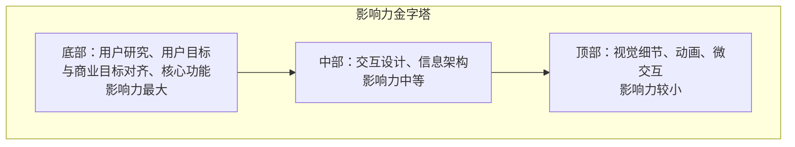
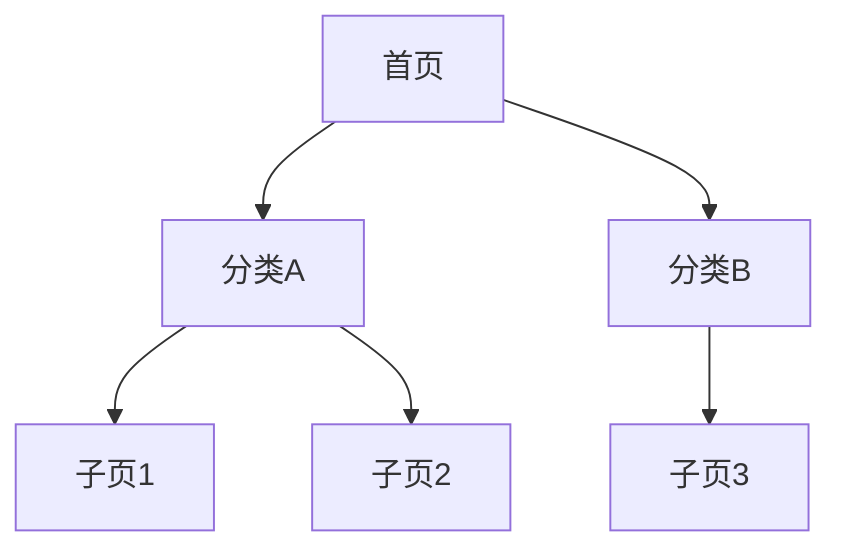
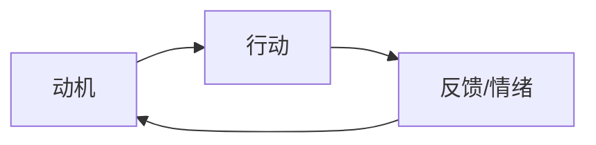
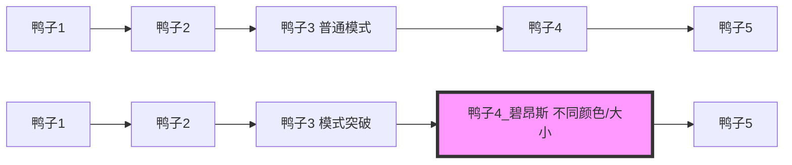
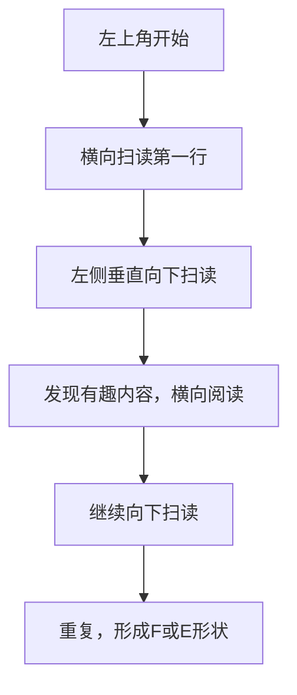
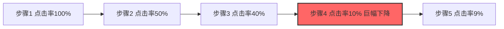

# 《用户体验设计：100堂入门课》章节总结

## 书籍信息
- 书名：用户体验设计：100堂入门课（UX for Beginners: A Crash Course in 100 Short Lessons）
- 作者：[瑞典] 乔尔·马什（Joel Marsh）
- 译者：王沛
- PDF状态：扫描版/文字层部分可识别，部分图像文本已提取
- OCR状态：存在少量文本错位，但整体可读；部分插图描述保留，部分图表需手动重建

## 目录说明
- 目录识别情况：完整，共14章，100堂课
- 章节对应依据：按原书目录顺序（核心概念→开始之前→行为基础→用户研究→思维限制→信息架构→设计行为→视觉设计原则→线框图和原型→易用性心理→内容→关键时刻→给设计师的数据→无业游民，找份工作吧）
- OCR修复说明：部分段落及页码因扫描偏移，已基于可识别文本重新组织；缺失的插图逻辑以Mermaid图重建

## 全书核心主题
本书是用户体验设计的入门速成课，将真实项目中的UX设计流程拆解为100个小课程。核心主题包括：UX设计的五大要素（心理、易用性、设计、文案、分析）；用户心理与动机（14种普遍动机、认知偏差、情绪与记忆）；用户研究方法（访谈、问卷、卡片分类等）；信息架构与设计行为（流程、游戏机制、信任）；视觉设计原则（视觉重量、颜色、模式、张力）；线框图与原型；易用性与内容策略；数据分析和A/B测试；以及UX求职指南。作者强调UX是有目的的、科学的设计过程，核心是让用户更高效，而非单纯让用户开心。

---

## 第1章：核心概念（第1-6堂课）

### 核心论点
本章回答“什么是UX”以及UX设计的基本框架。作者认为：UX不是创造体验，而是让现有体验变得更好；UX设计的核心目标是让用户更高效，而非仅仅让用户开心。

### 关键概念
- **UX的定义**：设计用户体验的过程，通过研究、想法、解决方案和衡量效果来解决问题。
- **UX的五大要素**：心理、易用性、设计、文案写作、分析。
- **你的视角**：设计师必须意识到自己的需求和知识对用户不重要，需要共情和承认自己“知道得太多”。
- **用户视角的三个“什么”**：这是什么？这对我有什么好处？我该做什么？
- **解决方案与想法**：UX中的想法必须是解决问题的、对他人有意义且可测试的。
- **UX影响力的金字塔**：位于底部的层级（如用户目标、商业目标）价值最大，顶部（如按钮样式）价值较小。

### 逻辑推演
作者首先打破“UX就是让用户开心”的迷思，提出效率才是核心。然后介绍五大要素作为设计过程中的检查清单。接着强调设计师要克服自我视角，通过共情了解用户，并承认用户知道得少。用户视角的三个“什么”是任何好设计都必须回答的问题。最后区分想法与解决方案，并用金字塔模型说明不同设计活动的影响力层级，引导新手把精力放在底层基础。

### 金字塔模型图（Mermaid）

### 经典金句
> “世间万物都有用户体验。你的任务不是创造它，而是让它变得更好。” (p.19)
> “UX设计师的目标是让用户更加高效。” (p.19)
> “解决方案就是对他人有意义的想法。” (p.29)

---

## 第2章：开始之前（第7-10堂课）

### 核心论点
在动手设计前，必须明确用户目标和商业目标，理解UX是一个贯穿始终的流程，收集各方需求，并达成共识。

### 关键概念
- **用户目标与商业目标**：UX设计师的真正考验是将两者合二为一。例如YouTube通过广告赚钱，用户想看视频，于是将广告插在视频中或页面旁，同时优化搜索推荐。
- **UX是一个流程**：不是一次性事件或任务，而是贯穿项目的科学过程。每个公司都有自己的流程，设计师需要适应并不断质疑、改进流程。
- **收集需求**：与利益相关者（营销、程序员、行政等）讨论，明确可以解决的问题和无法改变的限制。需求能防止犯错，但不要把“期望”当成“需求”。
- **达成共识**：设计师必须用研究、理论和数据来捍卫设计，不能在UX上说谎。

### 逻辑推演
作者强调，很多失败的设计源于没有明确两个目标或让它们对立。然后解释UX流程与公司大流程的关系，鼓励新人主动参与早期阶段。收集需求不是听命于他人，而是理解约束，避免浪费时间。最后，说服他人需要专业证据，而非主观喜好。

### 经典金句
> “UX设计师面临的真正考验在于将这两个目标合二为一的程度——在达成用户目标的同时又能实现商业利益（而不是相反）。” (p.33)
> “UX不允许胡说八道。” (p.39)

---

## 第3章：行为基础（第11-21堂课）

### 核心论点
人类行为部分可预测，部分不可预测。本章介绍心理与文化的二分模型，以及14种动机，帮助设计师理解用户行为背后的原因。

### 关键概念
- **心理与文化**：心理（大脑共性）可预测，文化（个体差异）需定制。设计时应先利用心理因素（如收集欲），再考虑文化定制（如个性化兴趣）。
- **用户体验的六大部分**：感受、想要、思考、信任、记忆、未意识到的东西。
- **有意识与无意识体验**：愉悦感需要有意识注意，但信任和易用性往往是无意识的。
- **情绪**：分“得”与“失”，是反应而非目标。时间使情绪复杂化（预期、恐惧、愤怒）。
- **14种普遍动机**：逃避死亡、避免疼痛、空气/水/食物、体内平衡、睡眠、性、爱、保护儿童、归属感、状态/地位、公正、求知欲（好奇心）。
- **好奇心三规则**：用户必须知道自己会在13种动机上经历得失；得失越大越有趣；不要和盘托出。

### 逻辑推演
作者从心理学基础出发，指出设计师可预测但不可完全控制用户。体验的六个部分层层递进，尤其强调用户未意识到的东西（如信息架构）是优秀设计师的体现。情绪与动机的关系是：动机驱动行为，情绪是对得失的反馈。14种动机中，性与爱、归属感、状态、公正、好奇心在UX中最常用，并给出具体设计建议（如利用好奇心时要避免“赢取iPhone”这类无效激励）。

### 经典金句
> “在锤子眼里，全世界都是钉子。” (p.47)
> “你的直觉一直在欺骗你。” (p.46)
> “毁掉人们好奇心的最佳做法就是给他提供那13种动机以外的东西。” (p.66)

---

## 第4章：用户研究（第22-31堂课）

### 核心论点
用户研究是UX的核心。本章区分主观与客观信息，介绍研究方法（访谈、问卷、卡片分类）、样本量、如何正确提问和观察，以及创建用户概要和考虑设备差异。

### 关键概念
- **主观与客观**：主观是感受、观点（需提问）；客观是事实、可测量（需统计）。传闻不是证据。
- **样本量**：问题越不明显，需要研究的用户越多。一个影响1/3用户的问题，3-5个用户可发现；影响1/20的问题，需30-40个用户。
- **如何问问题**：开放、引导、封闭三类。以相同方式问每个人，不提示答案，注意用户会说谎。
- **观察技巧**：录像、做笔记、体会言外之意、不帮忙、记住用户会为得到认可而撒谎。
- **访谈**：可补充追问，但受限于社交压力。
- **问卷**：可匿名、大规模，但不能追问，需精心设计。
- **卡片分类**：让用户对概念卡片进行分组，帮助设计信息架构。
- **用户概要**：基于研究的目标、期望、动机和行为描述，而非人口统计或刻板印象。
- **设备考虑**：手指vs鼠标；移动优先；设备特殊功能；响应式设计；多屏互动。

### 逻辑推演
作者先破除“用户研究就是测试用户”的误解，强调是用户在测试设计。然后按方法逐一讲解优缺点，特别提醒分组座谈的弊端。创建用户概要时，要避免“35-45岁男性”这类无用描述，而应给出可否定功能点的行为信息。最后，设备设计六步法帮助新手从移动端开始，考虑响应式和多屏场景。

### 经典金句
> “用户不是用来寻找答案的水晶球。” (p.72)
> “如果你只有5个用户，很可能只发现菜单问题而遗漏定价问题。” (p.74)
> “好记性不如烂笔头。” (p.78)

---

## 第5章：思维限制（第32-37堂课）

### 核心论点
设计师的直觉常常出错。本章介绍直觉、认知偏差、选择的错觉、注意力、记忆和双曲贴现，帮助设计师理解大脑的系统性缺陷，并利用或规避它们。

### 关键概念
- **直觉**：建立在经验之上，而非与生俱来。设计师的任务是为他人的直觉设计，而不是自己的。
- **认知偏差**：大脑的系统缺陷。锚定效应（第一个数字影响后续）、从众效应（人越多越信）、诱导效应（诱饵选项使目标选项更划算）。
- **选择的错觉**：选项越多越难选（选择的悖论）；用户只考虑提供的选项；默认选项很重要；比较决定一切。
- **注意力**：大脑一次只能有意识地做一件事。移动、惊讶、大号文本、声音、对比与颜色可以吸引注意力。但获得注意力的代价是牺牲其他事物。
- **记忆**：不可靠、可重构、有虚假记忆。设计师可以通过提醒优秀部分、创造习惯、个性化来“设计”记忆。
- **双曲贴现**：当下比未来更重要。易用性就是让人们尽早得到想要的。

### 逻辑推演
作者逐一打破“相信直觉”的迷思，用认知偏差证明直觉会犯错。然后给出实用建议：利用锚定效应设定高建议捐款额；利用从众效应展示点赞数；利用诱导效应设计定价页面。注意力部分强调机会成本，好的UX是做减法。记忆部分警告不要全信用户回忆。双曲贴现解释了为什么用户偏好短期利益，UX要让正确行为更容易。

### 经典金句
> “人们常说：‘相信你的直觉。’这是个愚蠢的建议。” (p.91)
> “UX并不是要创造出一个完美的世界，而是要消除任何阻碍你实现自己和用户目标的事物。” (p.98)
> “记忆中的体验是不完全、不精确、不可靠，有时候甚至完全是虚假的。” (p.100)

### 诱导效应定价示例（Mermaid）

---

## 第6章：信息架构（第38-43堂课）

### 核心论点
信息架构（IA）是设计解决方案的第一步，通过组织内容形成网站地图。本章介绍IA类型、用户故事、静态/动态页面、流程设计，并纠正“三次点击法则”的误解。

### 关键概念
- **IA定义**：赋予信息以结构。通常用网站地图（树状图）表示。
- **深 vs 平**：深架构点击次数多但菜单简单；平架构菜单庞大但点击少。既深又平很糟糕。
- **IA类型**：类别（如零售）、任务（如银行操作）、搜索（如YouTube）、时间（如收件箱）、人物（如Facebook）。
- **用户故事**：描述用户可能采取的短小完整路径，用于沟通流程而非UI。
- **静态 vs 动态页面**：静态对所有用户相同；动态根据用户或内容改变。动态页设计的是容器而非内容。
- **流程**：用户移动的路径。不要计算点击数，要避免死胡同，确保总有去处。
- **用户不走回头路**：用户只有迷茫时才点返回按钮。设计循环（A→B→C→A）可让用户一直向前。

### 逻辑推演
作者从网站地图开始，解释深与平的权衡。然后给出多种IA类型，帮助新手根据内容选择。用户故事强调它是描述而非命令。静态与动态部分提醒设计容器时要考虑极端情况（超长标题、空状态）。流程设计反对“三次点击”教条，强调清晰比点击次数重要。最后指出返回按钮是失败信号，设计循环可减少决策负担。

### 网站地图示例（Mermaid）

### 经典金句
> “你也许听说过这么一句话：应该始终保证所有页面都能在三次点击之内到达。说这话的人可能是在20世纪90年代学习的UX。” (p.109)
> “用户只有在迷茫时才会往回走——这种情况很糟糕。” (p.117)

---

## 第7章：设计行为（第44-50堂课）

### 核心论点
UX设计是有目的地影响用户行为。本章讲解如何通过奖励与惩罚、条件反射、游戏机制、社交病毒式结构、信任创造和经验变化来设计行为。

### 关键概念
- **有目的地设计**：让用户想做的事和你想让他们做的事变成同一件事。
- **奖励与惩罚**：都是感受而非实物。通过联想，用户可以形成信念和行为习惯。
- **条件反射与上瘾**：经典条件反射（信号→行为）、操作条件反射（随机行为→奖惩）。上瘾 = 做有奖励，不做有惩罚。
- **游戏机制**：反馈循环（动机→行动→反馈→再动机）和渐进式挑战（越来越难的目标）。
- **社交/病毒式结构**：用户A的行为 = 给用户B的反馈 = 呈现给用户C的内容。需突出分享按钮。
- **创造信任**：专业性、非绝对正面（有差评更可信）、民主化（用户投票）、可靠性（实名或匿名）、从容处理负面反馈、让用户知情、用词简洁。
- **经验如何改变体验**：新用户与深度用户不同。要为心不在焉的傻子设计，而非专注的天才。隐藏功能会降低使用率，但过多选择会吓跑新手。使用识别而非回忆，提供快捷方式。

### 逻辑推演
作者首先强调UX设计是行为设计，不是艺术。然后从奖惩开始，解释联想学习。条件反射部分，“第一口免费”是核心，随机奖励最易上瘾。游戏机制不是徽章而是心理循环。病毒式结构需要将分享行为放在显眼位置。信任的七条原则都很实操。最后，经验部分指出：新手需要核心功能可见，超级用户需要快捷方式，而大多数用户是“心不在焉的傻子”。

### 反馈循环图（Mermaid）

### 经典金句
> “第一口免费：没人会对他们从未尝试的东西上瘾。” (p.125)
> “如果上帝是一位UX设计师的话，那你就会被关在一间又小又黑而且隔音的房间里。” (p.98)
> “如果你想让用户走回头路，那就打造一个循环。” (p.117)

---

## 第8章：视觉设计原则（第51-56堂课）

### 核心论点
视觉设计原则帮助引导用户注意力，但不依赖艺术审美。本章讲解视觉重量（对比与大小）、颜色、重复与模式突破、线张力与角张力、排列方式与接近性，以及动态效果。

### 关键概念
- **视觉重量**：通过对比（明暗差异）、大小、景深（模糊/阴影）使重要元素更“重”，吸引注意力。
- **颜色**：具有含义（红=警告/热，蓝=冷/后退）。前进色（红、橙）使元素凸显，后退色（蓝、绿）使元素后退。线框图尽量黑白，只在必要时用颜色表达功能。
- **重复与模式突破**：重复创建模式，用户会从左到右（或从上到下）扫视。打破模式（如一个不同颜色的按钮）会吸引大量注意力。
- **线张力与角张力**：排列成线或角会使用户感知到形状，并将注意力引向空缺处。
- **排列方式与接近性**：排列整齐的元素被认为相关；距离近的元素被认为是一组。
- **动态效果**：最能吸引注意力，但需谨慎使用。直线运动引导视线向终点，曲线运动使眼睛跟随路径。

### 逻辑推演
作者用小橡皮鸭插图直观展示每个原则。视觉重量是基础，颜色增加含义和层次，模式突破用于强调重要按钮。线张力和角张力可创造无形路径。排列和接近性让界面更有组织。动态效果虽强但容易过度，需确保不增加等待时间或分散核心任务。

### 模式突破图（Mermaid）

### 经典金句
> “首要的东西通常要比次要的东西更大。” (p.142)
> “如果你不需要借助颜色来表达含义，那就让UI设计师来配色。” (p.144)
> “动态效果最能吸引注意力。” (p.152)

---

## 第9章：线框图和原型（第57-70堂课）

### 核心论点
线框图是技术性文档（建筑蓝图），不是草图或艺术品。本章讲解线框图是什么、不是什么，工具选择，设计模式，布局细节（Z形/F形模式、导航、首屏、表单、按钮），响应式设计，以及触摸与鼠标的区别。

### 关键概念
- **线框图**：展示如何运作，而非外观。九成思考，一成绘画。只有完成和未完成状态。
- **什么不是线框图**：不是基础草图、不是分阶段展示、不是展览品、不应被轻视。
- **工具**：使用最简单的工具（纸笔、Keynote、Illustrator）。要学习技术，而非工具。
- **避免省事儿的案例**：考虑极端情况（超长标题、空状态、删除内容）。空白状态也要设计。
- **设计模式**：常见解决方案（如汉堡菜单），但不要盲从。汉堡菜单常是懒人做法。
- **Z形模式与F形模式**：用户扫读模式。Z形用于无层次页面，F形用于搜索结果类页面。左上角点击最多。
- **布局**：先设计导航和页脚。主菜单顺序从最常用到最不常用。子菜单不要太大。
- **首屏**：60-80%用户会滚动，但要给提示。情感图片和标题可引导视线。
- **交互轴线**：按钮放在视觉边缘或线上更容易被点击。
- **表单**：一个长页面还是多个短页面取决于复杂性。标签贴近控件，使用内联错误处理。常规问题标签在上方（快速），复杂问题标签在左侧（减少错误）。
- **主要/次要按钮**：主要按钮高对比、在轴线上；次要按钮低对比、远离轴线。危险操作用警告色。
- **响应式 vs 适应性**：适应性是多个固定设计；响应式是单一设计随窗口伸缩，使用布局断点。
- **触摸 vs 鼠标**：鼠标精确、可悬停、右键菜单；手指直接、有物理反馈、手势操作。为两者分别优化。

### 逻辑推演
作者花了大量篇幅纠正对线框图的误解，强调其严肃性。然后给出布局实战技巧：Z/F形模式是用户眼球追踪的成果；首屏需要给滚动提示；交互轴线决定按钮位置。表单部分非常实操，包括标签对齐方式与速度/错误率的关系。主要/次要按钮的样式和位置有明确区分。触摸与鼠标对比帮助设计跨设备体验。

### F形扫读模式图（Mermaid）

### 经典金句
> “线框图的九成在于思考，一成在于绘画。” (p.156)
> “如果你的设计适用于90%的用户，那它就行不通。” (p.161)
> “不要计算点击数或页面数……重要的是能在恰当的时间为人们提供正确的信息。” (p.116)

---

## 第10章：易用性心理（第71-76堂课）

### 核心论点
易用性不等于美观，它本质上是认知负荷。本章解释真正的易用性，区分简单、容易、快速、极简，探讨浏览/搜索/发现三种用户行为，一致性与预期，反向UX（欺骗性设计），以及可访问性。

### 关键概念
- **真正的易用性**：认知负荷（大脑处理总量）。易用性通过用户行为测量，而非他们说的。美观会让人感觉好用，但不一定真易用。
- **启发法**：简单（步骤少）、容易（步骤明确）、快速（时间短）、极简（功能少）。各有利弊，需综合运用。
- **浏览、搜索、发现**：浏览者扫读图片，设计要情绪化；搜索者寻找属性，设计要结构化；发现新事物需将新内容与正在寻找的内容关联（如“喜欢这个也会喜欢那个”）。
- **一致性与预期**：一致性帮助学习，但不同页面（如着陆页与付款页）可以不同。模式必须一致。
- **反向UX**：用UX原则让用户做违背意愿的事（如取消订阅流程繁琐）。这是不道德的，会损害信任。例子：RyanAir默认勾选保险。
- **可访问性**：为视觉障碍、色盲、语言障碍者设计。大号字体、屏幕阅读器支持、简单语法、多语言。

### 逻辑推演
作者先打破“好看=好用”的迷思，指出认知负荷是核心。四种启发法帮助设计师针对不同场景选择策略。浏览/搜索/发现的区分非常实用：不要把想让用户发现的东西放在主菜单或横幅广告上。一致性不是死规矩，反向UX虽有效但应避免。可访问性是对所有用户的体贴。

### 经典金句
> “如果在相对更丑的设计里，购买某件东西的人数更多，这说明该设计更易用。” (p.189)
> “丑并不代表易用。” (p.190)
> “不要做那种烂事。永远不要。” (p.184)

---

## 第11章：内容（第77-83堂课）

### 核心论点
文案是UX的重要组成部分。本章区分UX文案与品牌文案，给出行动号召公式、标签和按钮文案最佳实践、着陆页设计、易读性、劝诱八步公式，以及如何激励用户分享。

### 关键概念
- **UX文案 vs 品牌文案**：UX文案关注易用性（清晰、直接、可遗忘）；品牌文案创造联想（情感、风格）。两者相辅相成，但冲突时易用性优先。
- **行动号召公式**：动词 + 好处 + 紧急的时间/地点。例如“立即下载第2版！”。避免“点击这里”。
- **指示文字、标签、按钮**：要简短、确切、直接。标签用最常见词汇（如“家庭地址”而非“你的心在哪里”）。按钮标签要能脱离上下文理解（如“不保存更改”而非“确认”）。
- **着陆页**：回答三个“什么”（这是什么？对我有什么用？我该做什么？）。只有一个焦点，不要主菜单。每个流量来源可设计不同着陆页。跳出率是重要指标。
- **易读性**：字号够大、字间距、行间距（1.5倍）、栏宽（45-75字符）、减少干扰。
- **劝诱公式**（八步）：信誉、了解受众、开放心态/卸下心防、建立和谐关系、隔离、说服、完成交易、有倾向性地总结。
- **激励分享**：不要直接求助，要让用户分享时感觉自己很了不起。例如“你被拒绝得最惨的一次是什么情况？”比“这样被拒绝正常吗？”更能激发参与。

### 逻辑推演
作者强调文案是UX的一部分，不是装饰。行动号召公式经过数据验证，可大幅提升点击率。着陆页设计要专注，避免菜单分散注意力。易读性部分给出具体数值。劝诱公式是将心理学步骤化。分享激励部分用Reddit案例说明：让用户觉得自己在赢。

### 经典金句
> “完美的UX文案让人一眼就能看明白，达成其目的之后又能马上被遗忘。” (p.190)
> “我曾经仅仅改动了一下文字就让某个按钮的点击率增长了400%。” (p.192)
> “不要直接向别人寻求帮助或搜集例子，要在搜集例子的时候让他们觉得自己的例子很了不起。” (p.204)

---

## 第12章：关键时刻（第84堂课）

### 核心论点
每一次发布都是一场实验。UX设计遵循科学方法：问题→假设→预测→实验→结果→解释。

### 关键概念
- **科学方法**：先通过研究发现问题，然后设计解决方案（假设），预测变化，发布实验，收集结果，解释并迭代。
- **发布不是终点**：产品发布后才真正开始学习。不要仅因喜欢就认为设计好，要数据验证。
- **UX与科学**：UX不是品味，是结果。

### 逻辑推演
作者指出许多团队庆祝发布却忘记检验设计是否有效。科学方法使UX区别于艺术。预测步骤尤其重要——你需定义怎样算成功。

### 经典金句
> “改变你的态度：每一次发布都是一场实验而不是结果。” (p.208)
> “UX并不关乎品味，而是关乎结果。” (p.208)

---

## 第13章：给设计师的数据（第85-97堂课）

### 核心论点
数据测量用户行为，是客观的。本章介绍分析工具、图表形状、关键统计指标（会话/用户、初访/回访、页面浏览量、时间、跳出/退出率）、交互概率、结构与选择、A/B测试和多变量测试。

### 关键概念
- **衡量灵魂**：感受产生行为，行为可衡量。群体数据可靠，个体不可靠。
- **分析工具**：Google Analytics、A/B测试、眼球追踪、屏幕捕获/热点图、搜索日志。
- **图表形状**：流量图（一般趋势、随机事件、周期性模式）；结构化行为图（指数曲线/长尾、存在意外变化、超级用户隆起、转化问题导致的巨幅下降）。
- **关键指标**：会话数vs用户数（区分访问次数与独立设备）；初访者vs回访者（健康网站应有更多回访者）；页面浏览量（依目标而定，Google希望少，Facebook希望多）；时间（长可能是参与或困惑）；跳出率（越低越好，10-30%很好）；退出率（对比页面，异常高或低需关注）。
- **交互概率**：没有100%，90%就代表所有人。转化率要考虑漏斗：10%点击×80%购买=8%，不如40%点击×40%购买=16%。
- **结构与选择**：顺序影响点击（左侧/顶部更多）。动画会夺走注意力。
- **A/B测试**：同时运行两个版本，测量哪个更好。一次只改一处细节。
- **多变量测试**：测试多个元素组合（如标题×图片），需更多用户。

### 逻辑推演
作者从“能否衡量感受”切入，论证行为数据可代替主观报告。然后逐一讲解分析工具和图表解读，特别强调不要只看绝对值（如3个会话好不好）。转化率部分纠正常见误解：高转化率但低流量可能总销售额更低。A/B测试和多变量测试是验证心理策略的唯一可靠方法。

### 指数曲线（转化问题）图（Mermaid）

### 经典金句
> “数据从不撒谎，它们讲的是科学！数据没有来龙去脉。” (p.214)
> “马什定律：‘每个功能最终都会被最大程度地滥用。’” (p.233)
> “有时A/B测试是唯一能让你知道确切结果的方式。” (p.242)

---

## 第14章：无业游民，找份工作吧（第98-100堂课）

### 核心论点
UX设计师的日常工作并非幻想中的全权掌控，而是大量沟通、会议和文档。本章介绍UX设计师的典型工作分配、不同类型的UX岗位（UI、IA、IxD、策划、研究）、公司类型（机构、内部团队、初创企业）以及简历撰写建议。

### 关键概念
- **日常工作**（作者幽默估算）：内部会议30%，文档10%，线框图10%，讨论需求6%，分析数据5%，与开发讨论3%，宣讲3%……实际用户调查仅1%。
- **UI vs UX**：UI是看到的东西，UX是为什么去看。警惕“UI/UX”职位（通常是一人做两份工）。
- **多面手 vs 专家**：新手建议做多面手，5年后专攻。
- **专业领域**：IA（大型内容结构）、IxD（交互细节）、UX（大局与业务）、UX策划（营销+UX）、UX调查（研究与数据）。
- **公司类型**：机构（项目多样、时间紧）、内部团队（长期深耕一个产品）、初创企业（责任大、风险高、资源少）。
- **简历建议**：受众可能不懂UX。讲述简短的视觉故事，聚焦问题、见解和结果。无经验时可做案例研究（分析现有产品）、解决实际问题、对自己网站做A/B测试。展示草图、线框图、数据截屏。保持个性。

### 逻辑推演
作者先以白日梦场景讽刺对UX设计师的夸大幻想，然后给出真实时间分配（大部分是沟通）。接着帮助新人选择合适的岗位，强调没有“最好的”工作，只有适合的。简历部分很务实：不要放一堆漂亮截图，而要展示你的思考过程和可衡量的结果。无经验时通过个人项目积累作品。

### 经典金句
> “UX设计师整天都在做些什么？……内部会议（大多不必要）30%。” (p.245)
> “如果你的老板是个UX行家，那么他们将会很欣赏你清晰的思路。” (p.251)
> “UX是九成靠想，一成靠做。” (p.253)

---

*本书总结基于可识别的PDF文本内容，所有图表为逻辑重建，页码仅供参考。部分OCR错漏已尽力还原。*