# 《用户思维+：好产品让用户为自己尖叫》章节总结

## 书籍信息

- **书名**：用户思维+：好产品让用户为自己尖叫（Badass: Making Users Awesome）
- **作者**：[美] Kathy Sierra
- **译者**：石航
- **PDF 状态**：完整（共310页，包含封面、版权、正文、致谢）
- **OCR 状态**：可识别，存在少量页面标记但整体可用

## 目录说明

- 目录识别情况：完整识别，包含序幕、三大主要部分、尾声及附录
- 章节对应依据：基于PDF页面顺序与标题层级
- OCR 修复说明：部分页面存在“图灵社区会员”水印标记，不影响内容理解；个别图表需要基于文本描述重建

## 全书核心主题

本书的核心论点是：**可持续成功的产品不是让用户觉得“这个产品很棒”，而是让用户在使用产品后觉得“我自己很棒”**。

作者Kathy Sierra提出，真正的成功秘诀不在于产品特性、营销预算或品牌参与度，而在于**成就用户（make users awesome）**——帮助用户在更大的应用场景中变得更加出色、更加熟练、拥有更高的清晰度。当用户因为使用你的产品而取得卓越成果时，他们会自发地进行口碑传播和事实传播，这才是可持续成功的真正驱动力。

全书围绕“如何成就卓越用户”展开，涵盖：专业能力的科学（刻意练习与感性接触）、帮助用户跨越障碍、设计成长路径与回报循环、以及维护用户稀缺的认知资源。作者强调，企业应该从“打造更好的产品”转向“打造更好的用户”。

---

## 挑战 序幕

### 1. 核心论点

**问题**：在没有巨额营销预算、没有低价策略、不依赖运气的情况下，如何打造一款可持续成功的产品？

**观点**：可持续成功的产品不是由产品特性决定的，而是由**用户在使用产品后的成果**决定的。成功的关键不在产品中，而在用户身上。

### 2. 关键概念

- **口碑传播 vs 事实传播**：口碑传播是用户主动推荐；事实传播是用户的卓越表现本身成为最好的广告。
- **愿望驱动成功**：用户对产品的强烈愿望（而非产品质量本身）是成功的核心驱动力。
- **缺陷容忍度**：用户越喜欢产品，就越能容忍其缺陷。
- **表现卓越的用户**：成功用户的共同特征是他们在某个领域表现得更加出色。

### 3. 逻辑推演

作者通过一系列反问引出核心问题：畅销产品与普通产品的本质区别是什么？如果排除运气、营销和价格，质量是否真的驱动愿望？通过观察可持续成功的产品，作者发现它们都有一个共同点：**真实的、可信赖的推荐**。那么，什么驱动了推荐？答案是：用户在使用产品后觉得自己变棒了。用户不是因为喜欢产品而说喜欢，而是因为他们喜欢使用产品后的自己。

### 4. 经典金句

> “用户并不关心你的产品有多棒，他们关心的是使用产品时自己有多棒。”

> “他们说喜欢这个产品，其实是因为他们喜欢自己。”

> “可持续成功的关键特征并不存在于产品之中。该关键特征是在用户身上。”

> “产品沐浴在用户（用产品而产生的）出色成果的光环之中。”

---

## 关于成就用户的思考

### 1. 核心论点

**问题**：如何将“成就用户”的理念转化为可操作的行动指南？

**观点**：为“后用户体验”而设计——关注用户离开产品之后发生的事情，关注用户的朋友、家人和同行如何看待他们。

### 2. 关键概念

- **后用户体验**：用户在使用产品之后的活动、成果和对话。
- **用户的用户**：产品设计不仅要考虑用户本身，还要考虑用户与之互动的人（如晚餐聚会上的朋友）。
- **查找与替换思维实验**：用“我们的用户”替换“我们”来重新思考问题。
- **不要打造更好的[X]，要打造更好的[X]用户**：不要打造更好的照相机，要打造更好的摄影师。

### 3. 逻辑推演

作者提出了三个思维实验来帮助读者实践“后用户体验”理念：
1. **纪录片实验**：想象摄像机跟踪用户使用产品后的活动，记录他们的成果和对话。
2. **晚餐聚会实验**：如何帮助用户在社交场合变得更风趣？
3. **查找与替换**：用“我们的用户”替换“我们”重新思考品牌问题。

作者进一步提出：竞争优势不应是“我们的产品比他们的好”，而应是“我们的用户比他们的用户更出色”。

### 4. 经典金句

> “最重要的不是点击之前所发生的事，而是点击之后所发生的事。”

> “为后用户体验的用户体验而设计就意味着，不仅要为你的用户设计，而且要为你的用户的用户设计。”

> “好的观点价值80分智商。好的观点同样价值一大笔市场营销预算。”

> “不要打造更好的[照相机]，要打造更好的[摄影师]。”

---

## 用户之旅

### 1. 核心论点

**问题**：用户从初学者到专家的成长路径是怎样的？如何帮助用户持续进步？

**观点**：用户成长曲线应该持续向右上方移动。关键门槛有两个：跨越入门线和跨越卓越线。用户停滞在“中等水平地带”是最大的风险。

### 2. 关键概念

- **用户成长曲线**：横轴为时间/经验，纵轴为能力/成果，目标是将用户快速推向“右上方”。
- **工具曲线 vs 应用场景曲线**：工具本身的学习曲线和更大应用场景的能力曲线。
- **困难区**：初学者必须跨越的痛苦区域。
- **停滞区/中等技能困境**：用户掌握了基本技能后停止进步的危险地带。
- **自动模式陷阱**：让用户停留在舒适区但无法进步的功能。

### 3. 逻辑推演

作者首先绘制了用户成长曲线，强调目标是让用户持续向右上方移动。关键门槛是入门线（用户能做事了）和卓越线（用户表现卓越）。作者警告：用户一旦越过入门线，就不愿再回到困难区，这导致他们对升级产生抵触。更危险的是停滞区——用户停留在“中等水平”，虽能使用产品但不再进步。对于只生产入门级产品的公司，作者建议专注于应用场景的特定部分，帮助用户在无需高级工具的情况下提升技能。

### 4. 经典金句

> “没人情愿回到困难区。”

> “如果你的工具非常复杂，有着极具挑战性的专业曲线，你首先要为你的工具绘制一条标有重要里程碑的学习曲线，然后再为具有吸引力的应用场景绘制一条标有重要里程碑的学习曲线。”

> “不必让用户成为我们的Chuck Norris。为了体验高清晰度的知识、技能及成果所带来的内在奖励，用户不一定非要成为世界级行家。”

---

## 专家如何做：表现卓越的科学

### 1. 核心论点

**问题**：成为专家的科学原理是什么？如何帮助用户从初学者成长为专家？

**观点**：专家的两个核心特征是：（1）他们练习得更好（刻意练习）；（2）他们接触了更多高质量的专家实例（感性接触）。天赋的作用被严重高估。

### 2. 关键概念

- **专业能力**：不是指知道什么，而是指能反复做什么。
- **专家定义**：给定一项具有代表性的任务，专家的完成情况更好、更可靠。
- **刻意练习**：目标明确、形式清晰、在一到三组45-90分钟练习中达到95%精通度的练习方式。
- **感性接触**：通过大量高质量实例的接触和反馈，让大脑“无意识地”发现深层模式。
- **一万小时定律的澄清**：仅限于刻意练习，且不是充分必要条件。

### 3. 逻辑推演

作者首先澄清“天赋”的误区：在绝大多数非体育领域，天赋不是高水平专业能力的必要条件。专家的真正差异在于练习质量和环境质量。

**刻意练习**的核心规则：选择细粒度的子技能，在一到三组练习中达到95%精通度。如果达不到，说明任务划分不够细或标准太高。错误的练习（项目型、教程式）反而会强化平庸技能。

**感性接触**的典型案例：小鸡性别鉴定、二战飞机侦察员、飞行仪表识别。这些案例表明，通过大量实例+即时反馈，大脑可以“发现”连专家自己都无法描述的深层模式。

### 4. 流程图

#### 专家 vs 有经验的非专家

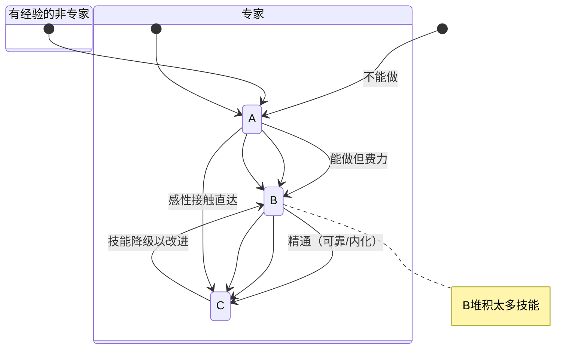

#### 刻意练习流程

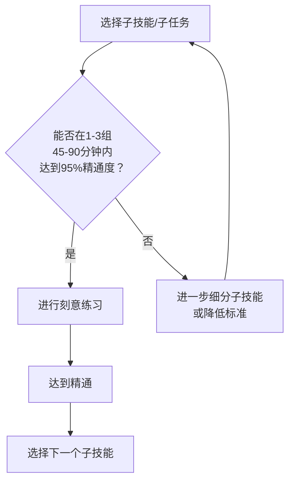

#### 感性接触流程

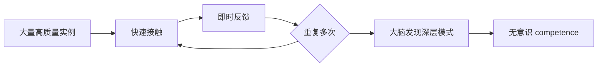

### 5. 经典金句

> “专家不是指他们知道什么，而是指他们能反复做什么。”

> “精通半个技能完胜一堆半生不熟的技能。”

> “如果你无法在一到三组练习中达到95%的精通度，请停止练习。你需要重新设计子技能。”

> “不要只是升级你的产品，你应该升级你的用户。”

> “练习造成的影响是永久性的。”

> “正确的练习方法往往在感觉上是错的。”

---

## 构建技能

### 1. 核心论点

**问题**：如何系统性地构建从初学者到专家的技能体系？

**观点**：技能发展不是简单的线性过程（A→B→C），而是动态的、循环的过程。专家会不断地增加新技能、改进现有技能，甚至会故意将精通的技能“降级”以便改进。

### 2. 关键概念

- **技能三阶段**：A=不能做，B=能做但费力（不可靠），C=精通（可靠、已内化）
- **技能降级**：专家故意将精通的技能带回意识层面以便改进
- **中等技能困境**：已内化的技能如果不加审视，会成为进步的障碍
- **用进废退的误区**：仅仅使用技能是不够的，必须有意识地练习

### 3. 逻辑推演

作者纠正了常见的技能发展线性模型。真正的专家发展模型是动态的：专家从不停止增加新技能；专家会有意识和无意识地构建技能；专家会改进现有技能（包括将C级技能降回B级以重新审视）。中等技能困境的典型案例是滑雪教练Lito Tejada-Flores的方法：改变一项已精通的技能（通常是重心转移）就能突破平台期。

### 4. 流程图

#### 正确的技能构建模型

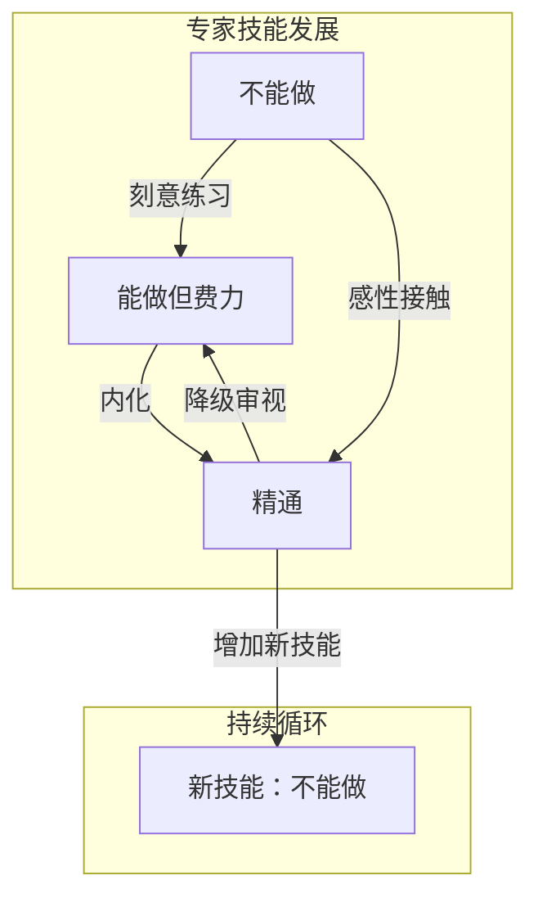

---

## 感性接触

### 1. 核心论点

**问题**：除了刻意练习，还有什么方法能帮助用户获得“专家直觉”？

**观点**：感性接触（大量高质量实例+即时反馈）能让大脑自动发现深层模式，将技能直接从A（不能做）移动到C（精通），无需有意识地知道“怎么做到的”。

### 2. 关键概念

- **感性知识**：大脑知道但无法用语言表达的知识（专家直觉）
- **小鸡性别鉴定效应**：专家无法解释自己怎么做到的，但新手通过大量猜测+反馈可以习得相同能力
- **飞行仪表识别实验**：非飞行员经过2小时感性接触，读仪表能力超越有1000小时经验的飞行员
- **模式发现**：大脑通过大量多样化实例自动识别“不变的特征”
- **不良实例的危险**：大脑不区分好坏，会积极学习看到最多的内容

### 3. 逻辑推演

作者通过三个典型案例论证感性接触的力量：小鸡性别鉴定、二战飞机侦察员、飞行仪表识别。这些案例的共同点是：专家无法解释自己的判断依据，但新手通过“猜测+反馈”的循环，在相对短的时间内获得了接近专家的能力。

关键是：大脑会自动发现深层模式，前提是提供**大量、多样化、高质量的实例**和**及时的反馈**。展示不良实例是危险的，因为大脑会不加区分地学习。如果必须展示不良实例，应该用视觉标记（如粗糙滤镜）唤起“不适感”。

### 4. 流程图

#### 感性接触的机制

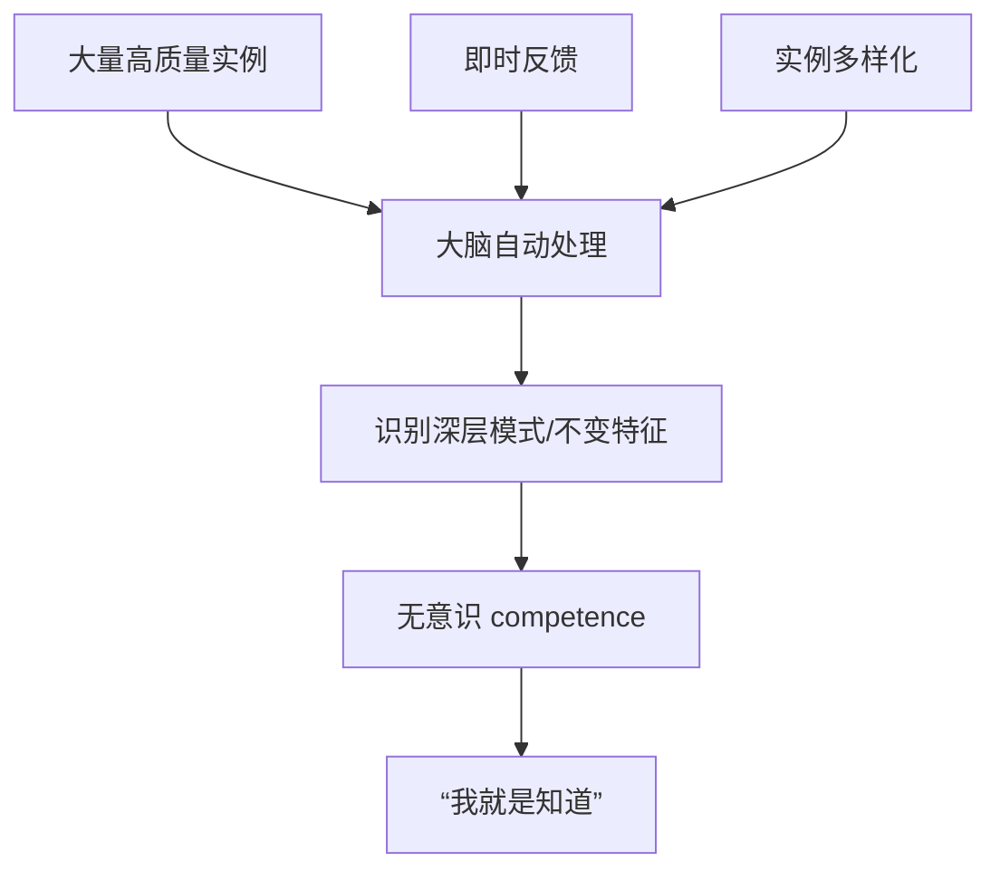

#### 设计最小可行感性接触体验

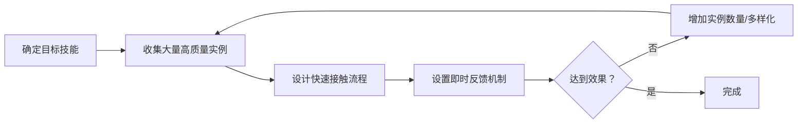

### 5. 经典金句

> “发现模式常常是下意识的。即使他们没法描述‘学到了’什么，我们也可以利用测试的方法来检验大脑的学习情况。”

> “大脑在获取信息方面的表现非常出色，但与此同时，它不对好坏加以区分。”

> “通过培养和强化他们对优秀的、对的以及正确的实例的辨识能力，才是教授他们识别低劣的、错误的以及不良的实例的最佳方法。”

---

## 帮助用户前进：排除障碍

### 1. 核心论点

**问题**：用户已经拥有动机，为什么还是会放弃？

**观点**：关键问题不是“什么吸引他们前进”，而是“什么让他们停了下来”。帮助用户排除障碍比增加额外动机更有效。

### 2. 关键概念

- **技能鸿沟**：用户想做的事情与他们当前能力之间的差距
- **关系鸿沟**：用户关注的应用场景与购买后被迫关注的工具之间的断裂
- **正常化困难**：告诉用户“第一天的困难是正常的”可以防止放弃
- **预测与补偿**：既然无法时刻陪伴用户，就要预测他们可能遇到的问题并提前补偿
- **诚实的力量**：承认问题（即使是自己的问题）比掩盖更能建立信任

### 3. 逻辑推演

作者区分了两类干扰性鸿沟：技能鸿沟（想做但做不到）和关系鸿沟（关注点从应用场景转移到工具）。用户放弃不是因为缺乏动机，而是因为不知道困难是正常的。

典型案例：滑雪者第一天极度痛苦，但第二天还会回来——因为有人告诉他们“第一天就是这样”。解决方案极其简单：**把事实告诉他们**。在产品包装、手册、网站上明确告知用户“这个阶段会很难，这是正常的，坚持过去就会变好”。

作者提出“预测与补偿”策略：假设用户会遇到困难，提前设计解决方案。论坛是发现用户痛点的最佳场所。

### 4. 流程图

#### 用户放弃的根本原因

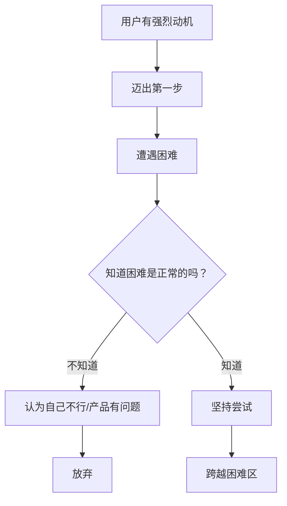

#### 预测与补偿框架

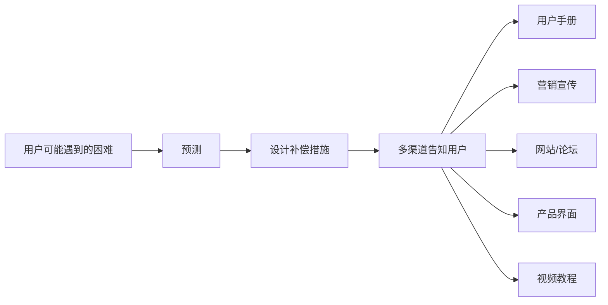

### 5. 经典金句

> “他们放弃不是因为他们遇到了困难，而是因为他们没有意识到，困难只是暂时的，也是正常的。”

> “你不需要完美。你需要诚实。”

> “比劣质用户手册更糟糕的情况是什么？让用户以为，这份手册没有问题，其他人都可以很好地使用它。”

> “如果他们不知道在这一阶段遭遇困难是一件很正常的事，他们就没有理由相信事情有改善的可能。”

---

## 进步 + 回报

### 1. 核心论点

**问题**：如何让用户在成长过程中持续保持渴望成功的愿望？

**观点**：用户需要清晰的成长路径图（知道现在在哪里、下一步去哪）和及时的回报（能在早期就做有意义的事情）。回报应该是内在激励体验（高清晰度、心流），而非外在奖励。

### 2. 关键概念

- **成长路径图**：清晰的成长步骤、当前状态评估、可信的成功理由（如武术段位制）
- **有意义的第一时间**：用户在第一个30分钟内能做些什么让他们感到“我很棒”
- **降低门槛**：将“做有意义事情”的门槛降低到用户能够触及的位置
- **内在激励 vs 外在激励**：内在激励（高清晰度、心流）带来长期动机；外在奖励（徽章、报酬）效果短暂且有副作用
- **心流**：挑战难度与当前能力匹配时产生的“最优体验”，完全沉浸其中
- **专业术语的价值**：领域特定术语不是障碍，而是一种“超能力”，能实现更高效的交流

### 3. 逻辑推演

作者强调：成为专家的好处不能只体现在最后阶段。用户需要知道：我现在在哪个阶段？我现在能做什么？

成长路径图（如武术段带）的作用不是段带本身，而是提供**有意义的进步**的证据。研究表明，每天取得小进步（即使是小胜利）是激励的最强驱动力。

用户第一个30分钟的体验至关重要。如果用户能在第一时间做“有意义”的事情（即使是很小的事情），他们会感到自己很棒，而不是产品很棒。关键是降低“做有意义事情”的门槛。

作者区分了内在激励和外在激励。内在激励（高清晰度、心流）才是可持续动机的来源。外在奖励（徽章、积分）往往弊大于利，会削弱内在动机。

### 4. 流程图

#### 激励性成长循环

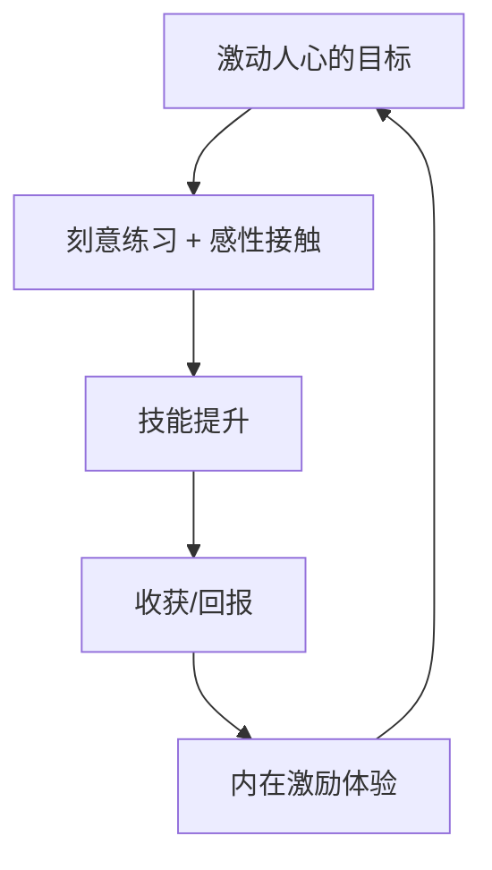

#### 心流状态条件

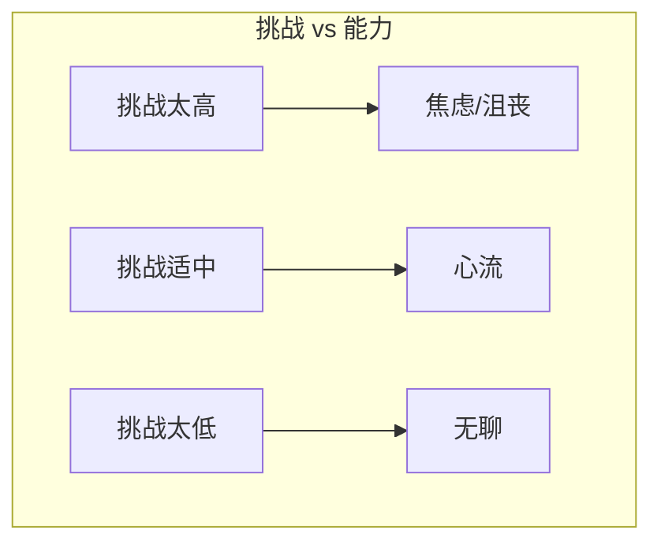

### 5. 经典金句

> “在所有那些能够激发情感、动机以及感知的日常活动中，最重要的事情就是能够取得有意义的进步。”——Teresa M. Amabile & Steven J. Kramer

> “段带本身不是重点。重点在于段带的意义和作用。重点在于有意义的进步。”

> “帮助他们相信他们将会变得更出色，这很重要。帮助他们真的变得更出色，这很重要。帮助他们意识到他们正在变得更出色，这很重要。”

> “外在激励体验与内在激励体验的差别，其实就是短期动机与长期动机的差别。”

> “不要阻碍专业术语的使用。你应该拥抱专业术语、教授专业术语、创造新的专业术语。”

---

## 维护认知资源：设计

### 1. 核心论点

**问题**：为什么用户有时会做出看似不理性的选择（如放弃学习选择蛋糕）？

**观点**：意志力和认知加工能力共享同一个稀缺资源池。设计不良的产品会消耗用户的认知资源，削弱他们的意志力和学习能力。

### 2. 关键概念

- **共享资源池**：意志力与认知加工能力从同一个资源池获取能量
- **7位数实验**：记忆7位数的参与者选择蛋糕的可能性是记忆2位数的两倍——因为认知负荷耗尽了自控力
- **认知泄漏**：未完成的任务（蔡加尼克效应）、不确定性、糟糕的设计都会持续消耗认知资源
- **蔡加尼克效应**：大脑为未完成的任务保留“后台进程”，持续消耗资源
- **认知微泄漏**：来自不确定性的微小认知消耗（如“我锁门了吗？”）
- **功能可见性**：让正确的行为变得自然、明显，减少认知开销

### 3. 逻辑推演

作者通过Baba Shiv的著名实验揭示了一个反直觉的事实：认知任务会耗尽意志力。记忆7位数的人更难抵制蛋糕的诱惑——不是因为大脑需要热量，而是因为意志力被消耗了。

这意味着：设计不良的产品不仅是“麻烦”，它实际上**消耗了用户用于学习、练习和自我控制的资源**。每一次困惑、每一次不确定、每一次需要回忆操作步骤，都是在从稀缺资源池中取款。

作者提出一系列减少认知泄漏的策略：将知识委托给外部世界（不要让用户记忆）、设计高功能可见性（让正确的事情变得自然）、减少不必要的选择、帮助用户内化技能、传授实用技巧、减少对意志力的需求（构建习惯、体验内在激励）。

### 4. 流程图

#### 认知资源管理

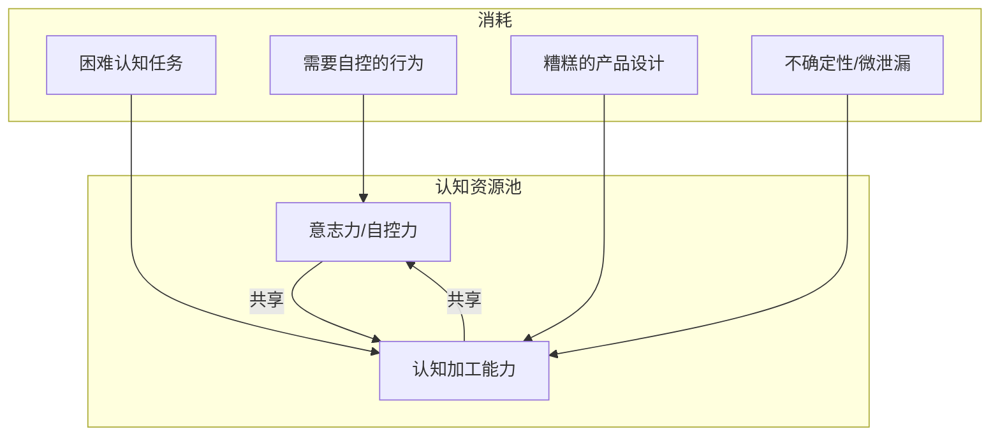

#### 蔡加尼克效应

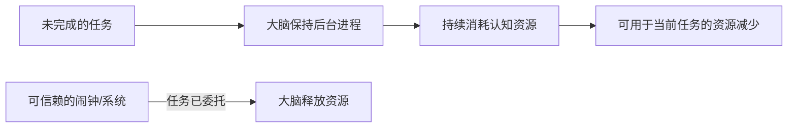

#### 功能可见性原则

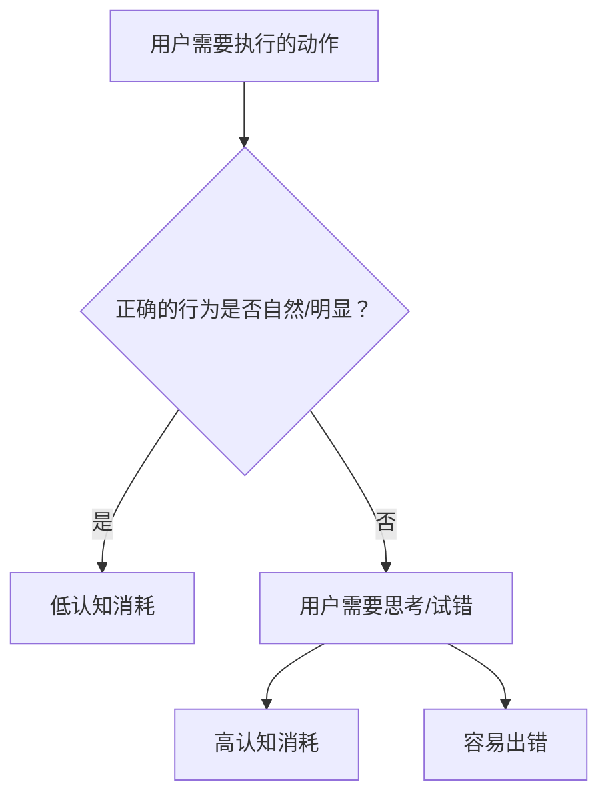

### 5. 经典金句

> “那个App会让我发胖。是的，在某种程度上，也许就是这样。”

> “确保用户把稀缺、易耗的认知资源用在正确的事情上。”

> “选择是一种代价昂贵的认知开销。”

> “有选择和必须选择差异巨大。”

> “意志力与认知加工能力从同一个资源池中获取能量。”

---

## 减少认知泄漏

### 1. 核心论点

**问题**：具体有哪些方法可以减少认知泄漏？

**观点**：将认知工作委托给外部世界、减少用户需要做的选择、帮助内化技能、传授实用技巧、管理意志力需求。

### 2. 关键概念

- **委托给外部世界**：将知识“存储”在产品本身（如清晰的按钮标识），而不是用户的大脑
- **大脑中的知识 vs 外部世界的知识**（Donald Norman）：前者学习成本高但使用快速，后者随时可查但依赖外部
- **习惯的力量**：习惯几乎不需要意志力，是管理认知资源的有效工具
- **内在激励减少意志力需求**：当更大的应用场景成为身份象征时，枯燥的工作也变得不那么依赖意志力
- **外在奖励的危险**：会削弱内在动机，尤其是当奖励与行为直接关联时

### 3. 逻辑推演

作者提出了多个具体策略：

**委托**：不要让用户记忆不常用的信息。设计清晰的标识、提供备查手册、让知识“长”在产品上。

**减少选择**：选择消耗认知资源。给用户提供默认/推荐选项，自信地说：“根据你的情况，这是最佳选择。”

**帮助内化**：技能内化到C级后消耗很少认知资源。每次只精通一个子技能，快速释放资源。

**管理意志力**：假设意志力不存在，围绕这个假设设计——构建习惯、体验内在激励、让更大的应用场景成为身份象征。

关于动机，作者引用了Daniel Pink的观点：外在奖励往往弊大于利。唯一安全的外在奖励是完全出乎意料的、不与行为直接关联的感谢。

### 4. 流程图

#### 意志力管理策略

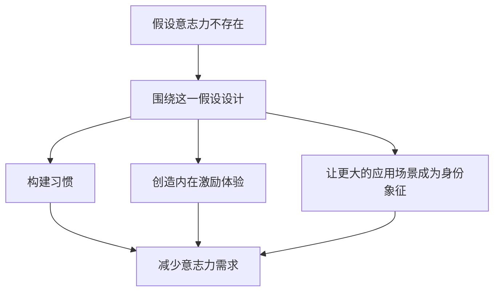

#### 认知资源分配优先级

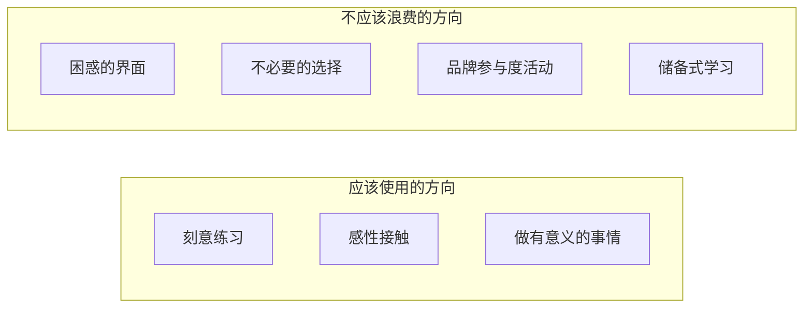

### 5. 经典金句

> “管理意志力的秘诀就是……假设它根本不存在。”

> “刻意练习从来不会成为一种习惯（它们需要刻意的努力），但是，围绕刻意练习的许多其他事项是可以变成习惯的。”

> “外在奖励往往弊大于利。由于外在奖励在开始阶段具有一定的激励作用，因此它们尤其危险。”

> “当更大的应用场景成为你的身份象征时，那些艰难但必要的工作几乎就会变得像内在激励体验一样具有激励性。”

---

## 穿越大脑的垃圾过滤器

### 1. 核心论点

**问题**：如何让用户的大脑关注我们想要他们学习的内容，而不是将其当作“垃圾”过滤掉？

**观点**：大脑有一个“垃圾过滤器”，只让情感相关、惊奇、威胁、面部表情、婴儿/幼小事物等内容通过。要穿越过滤器，必须给大脑一个“这很重要”的理由。

### 2. 关键概念

- **大脑的垃圾过滤器**：大脑自动区分“信号”和“噪声”，枯燥的内容被当作垃圾处理
- **触发情感**：任何情感反应（即使是细微的）都能让内容穿越过滤器
- **为什么？那又怎样？谁会在意？策略**：从结果/后果开始，而不是从细节开始
- **储备式学习 vs 即学即用式学习**：前者难以通过过滤器，后者更容易
- **知识验证**：用“技能映射”测试每个知识点是否真的必要

### 3. 逻辑推演

大脑关注的内容类型包括：威胁/恐惧、面部表情（尤其是强烈情感）、幼小的/无助的事物、能触发情感的事物、怪异/惊奇/出人意料的事物、未完待续的故事（蔡加尼克效应）。

作者提出“为什么？那又怎样？谁会在意？”策略：不要从操作步骤开始，而是从“如果不这样做会发生什么可怕的事”开始。这能给大脑一个“这很重要”的理由。

关于知识学习：储备式学习（现在学以后用）很难通过过滤器。即学即用式学习（需要时再学）更容易。大多数知识可以推迟到真正需要时再学。

作者提出“技能映射”方法验证知识必要性：每个知识点必须能映射到一项技能。无法映射的知识应该删除或放入附录。

### 4. 流程图

#### 大脑垃圾过滤器

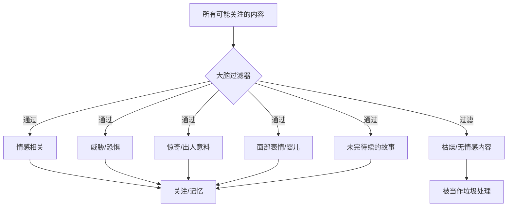

#### “为什么？那又怎样？谁会在意？”策略

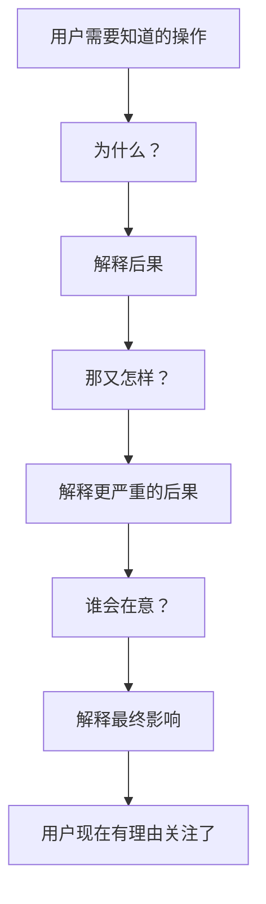

#### 技能映射验证知识必要性

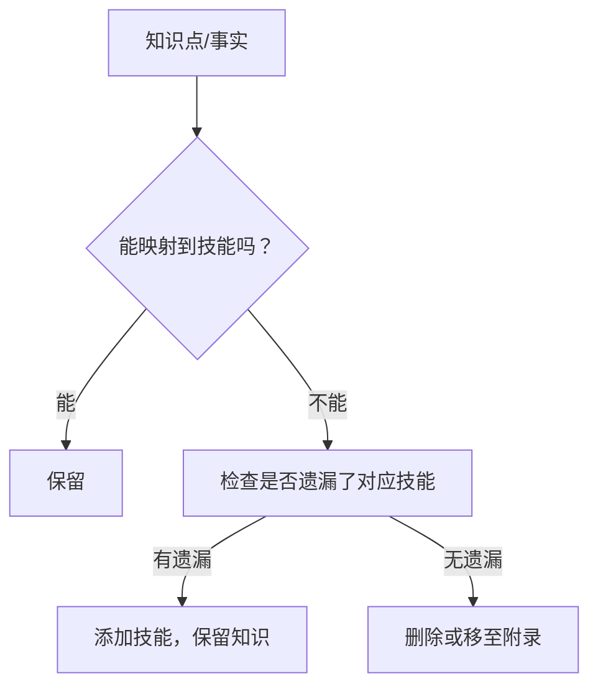

### 5. 经典金句

> “大脑不愿意把稀缺资源浪费在那些‘小’的思维跳跃上。”

> “对于大脑来说，枯燥、无聊、情感匮乏的内容都是垃圾。”

> “储备式学习有时候看起来用处不大。等到你确实需要知道这些的时候，再学习也不迟。”

> “我们的职责就是帮助用户过滤知识——帮助他们取得进步，而不只是帮助他们学得更多。”

> “勇敢些，删掉那些不需要的知识。永远不要忘记，认知资源真的很稀缺、很有限。”

---

## 尾声

### 1. 核心论点

**问题**：品牌参与度活动到底是帮助还是伤害用户？

**观点**：典型的“品牌参与度”策略（社交媒体互动、竞赛、病毒视频）消耗用户稀缺的认知资源，却对用户成长没有帮助。真正关心用户的企业应该将品牌活动设计为**同时有益于品牌和用户**——帮助用户学习、练习和成长。

### 2. 关键概念

- **品牌参与度的零和博弈**：用户花在品牌互动上的时间和认知资源，无法同时用于学习、练习和成长
- **例外情况**：当“与品牌互动”本身就能帮助用户在应用场景中变得更出色时，才是有益的
- **成就卓越的人生**：最终目标不仅是成就卓越用户，更是帮助人们成就卓越的人生

### 3. 逻辑推演

作者回到开篇提到的“品牌参与度”问题，指出：与竞争对手在品牌参与度上竞争，不仅让企业感到疲惫，更重要的是**消耗了用户有限的认知资源**。用户花在点赞、分享、参加竞赛上的每一分钟，都是从学习、练习、成长中偷走的。

唯一的例外是：如果品牌活动本身就是帮助用户学习、练习和尝试的活动（如教学视频、练习工具、社区讨论），那么它同时有益于品牌和用户。但这不是当前大多数品牌活动的核心。

### 4. 经典金句

> “当你长大后，你会参与很多品牌活动！——没有人会在临终时说：‘如果我能够参与更多的品牌活动就好了。’”

> “鱼与熊掌不可兼得。你不能期望用户在花时间与你的品牌互动的同时，还能利用剩余时间学习、练习以及更好地成长。”

> “如果我们真的关心用户，必须帮助他们做他们想做的事情，而不是我们想做的事情。”

> “你有机会帮助人们成为更有技能、更有知识、更有能力的人。你有机会帮助这个世界变得更为清晰。”

---

## 致谢（实质性内容摘录）

作者感谢Tim O’Reilly敦促她写这本书，感谢众多专家和社区成员的帮助。特别提到Bert Bates在刻意练习方面的专业知识，以及所有在社交媒体上支持她的朋友。作者还提到了帮助她度过艰难时刻的人（Anil Dash、Sarah Winge等），以及她的两个女儿Skyler和Eden、姐姐Sherry。

---

## 附录：核心方法论汇总

### 成功准则总览

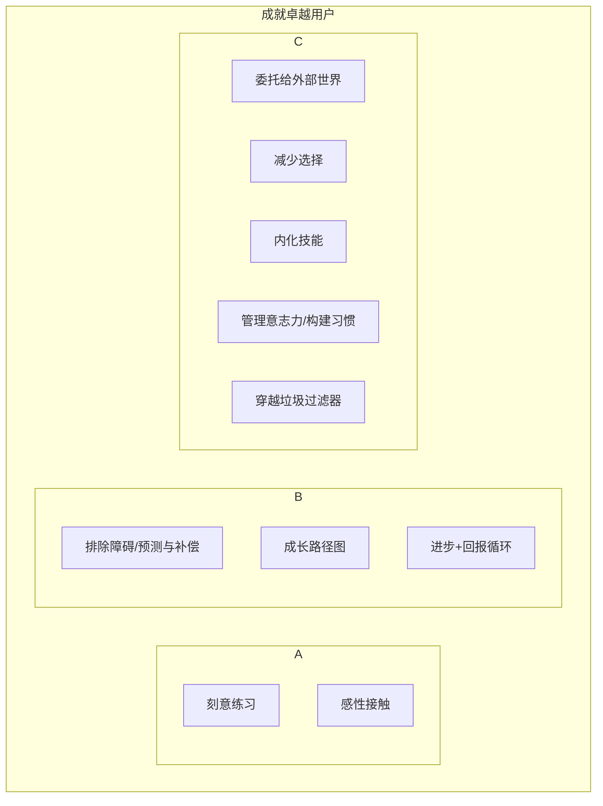

### 核心检查清单

| 问题 | 对应策略 |
|------|----------|
| 用户为什么放弃？ | 预测与补偿，告知“困难是正常的” |
| 用户为什么不进步？ | 提供成长路径图，设计小胜利 |
| 用户为什么不升级？ | 理解“没人愿意回到困难区” |
| 用户为什么记不住？ | 储备式学习→即学即用式学习 |
| 用户为什么选择蛋糕？ | 减少认知泄漏，管理意志力 |
| 用户为什么不推荐？ | 让他们变得更出色（而非让产品更出色） |