# 《用户研究方法：卓越产品和服务的用户研究技巧》章节总结

## 书籍信息
- 书名：用户研究方法：卓越产品和服务的用户研究技巧
- 作者：刘华孝
- 出版社：机械工业出版社
- 出版时间：2024年5月
- ISBN：9787111753728
- PDF/OCR状态：基于完整EPUB文本转换，内容可识别

## 目录说明
- 目录识别情况：完整，包含序言、前言、第一篇（第1-5章）、第二篇（第6-8章）、第三篇（第9-10章）
- 章节对应依据：按书中标题层级逐章整理
- OCR修复说明：文本清晰，无需额外修复

## 全书核心主题
本书系统介绍用户研究的基本概念、流程、方法与工具，重点结合产品开发全流程（开发前、开发中、上市后）阐述用户研究的应用场景。作者强调用户研究不仅是专业岗位的技能，更应成为所有职场人（产品经理、设计师、运营、HR等）的基础能力。全书从数据收集（问卷、访谈、观察、实验）、数据分析（定性/定量）到成果落地与沉淀，提供了完整的方法论框架，并融入大量实战案例与个人思考。

---

## 序言（高尚仁）
### 核心论点
- 问题：用户研究/人因工程的历史脉络与价值是什么？
- 观点：用户研究源于二战时期的人因工程，核心是“让产品适应人而非让人适应产品”，这一理念推动用户体验成为以人性与幸福为本的专业。

### 关键概念/事件
- 人因工程（Human Factor）：二战后兴起，关注人与工作、环境的互动，追求效率、安全、舒适和满意度。
- Karl U. Smith：威斯康星大学教授，提出“工作本身要为配合员工而设计”，联合创立国际工效学联合会（IEA）。
- 感性工学（Kansei Engineering）：日本心理学家Mitsuo Nagamachi提出，关注用户情绪、喜好和感知。
- 人机交互（HCI）：20世纪90年代随认知科学兴起，结合智能手机发展，拓展用户体验内涵。

### 逻辑推演/叙事脉络
序言从二战时期美国军方心理学家的战时研究讲起，引出人因工程学科的诞生。以Karl U. Smith及其学生们的贡献为主线，说明该学派如何影响工作设计、工效学、职场健康等领域。随后梳理人因工程60年来的重心演变：从“让人适应机器”到“人机系统”，再到关注用户情绪和幸福感。最后介绍作者刘华孝的背景，并肯定本书对传播用户体验理念的价值。

### 经典金句/数据
> “工作本身就是要为配合员工而设计”（fitting the job to the worker）——Karl U. Smith
> “用户体验对工作的定义，早已不仅仅是以电脑和智能手机为对象了，它终将是一个更广阔、更人性的概念——创意、落实、幸福感。”——高尚仁

---

## 前言
### 核心论点
- 问题：为什么写这本书？读者对象是谁？
- 观点：用户研究是投入低、产出高的事情，能帮助企业摘下“低垂的果实”。本书旨在传播用户研究意识，普及基本技巧，帮助职场人士（产品经理、设计师、运营、HR等）服务好自己的“用户”。

### 关键概念/事件
- 低垂的果实：指通过简单用户研究即可快速改进产品体验、提升价值的机会。
- 目标读者两类：①立志做用户研究的大学生/职场新人；②广泛职场人士（产品、设计、运营、HR等）。
- 腾讯会议室二维码案例：通过观察用户行为，设计扫码取消预定并立即使用的方案，提升会议室运营效率。

### 逻辑推演/叙事脉络
前言先通过设计师A/B测试提升banner点击率的例子说明用户研究的价值。作者反思自身工作经历，发现很多人因意识不足或不具备研究能力而忽视用户研究。进而提出写书的两大目标：传播意识、帮助新人。然后明确读者对象和本书内容结构（三篇十章）。最后致谢。

### 经典金句/数据
> “最好的输入是输出”——写书是自我提升的有效方式。
> “没有调研就没有发言权……没有调研也没有决策权。”

---

# 第一篇：用户研究流程、方法与工具

## 第1章：全面了解用户研究
### 核心论点
- 问题：什么是用户研究？为什么需要它？用户研究做什么？应用场景有哪些？从业者需要什么素养？
- 观点：用户研究是及早、主动洞察机会点和发现问题的手段，能避免产品失败、催生创新。用户研究架起公司与用户的桥梁，需要硬实力（逻辑、分析、总结）和软技能（沟通、影响力、业务理解、好奇心）。

### 关键概念/事件
- 美国医改网站HealthCare.gov：耗资6.78亿，上线首日470万访客仅6人注册成功，因未做可用性测试。
- 美国银行“keep the change”计划：通过用户洞察（不喜欢找零、无积蓄习惯）推出自动存零钱服务，3个月拓展20万新用户。
- 幸存者偏差：后台数据只能获取使用产品的用户行为，无法了解未使用用户和竞品用户。
- Google空白页面案例：用户以为页面在加载，实际是空白，通过调研发现问题。
- 用户体验五层次（战略层、范围层、结构层、框架层、表现层）——Jesse James Garrett。

### 逻辑推演/叙事脉络
本章从正反案例说明用户研究的价值（避免灾难、催生创新）。接着解释用户研究是“输入-整理-输出”的翻译工作，并列出日常需要思考的6个主题（定量/定性、评估/发现、现象/原因、个性/共性、事实/观点、信度/效度）。然后介绍用户研究在用户体验五层次中的应用场景。历史部分从二战波音B-17事故（Paul Fitts和Alphonse Chapanis发现操作杆设计问题）讲起，到贝尔实验室拨号盘测试、HFES成立、Nielsen的可用性工程、Don Norman提出用户体验，再到Jobs To Be Done理论。现状部分分析科技巨头（Facebook、Amazon、Apple、Google）、社会力量（UXPA、IDEO等）和政府力量（美国Digital.Gov、英国GDS）。展望部分预测应用领域扩展、从业人数增长（Nielsen预测2050年达1亿）、体验经济重要性提升、新技术（眼动、fNIRS）应用。最后给出用户研究人员的3个硬实力和4个软技能。

### 方法流程图

#### 图1-1 用户研究的“有”与“无”
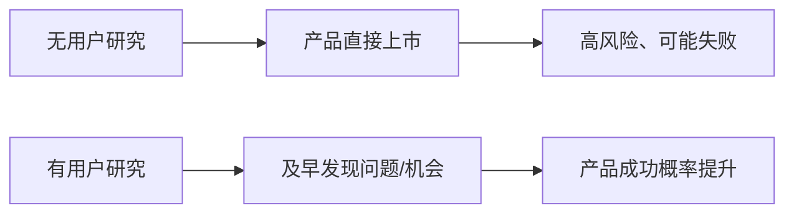

#### 图1-3 用户体验的五个层次与用户研究
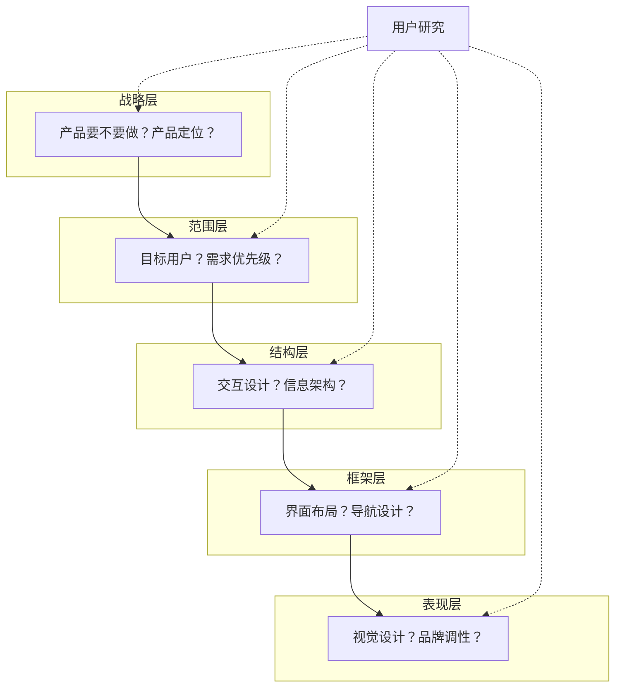

### 经典金句/数据
> “一个不存在的市场不会在乎你有多聪明。”——风险投资人
> “要更靠近你的客户，你如此靠近他们，以至于你可以在顾客意识到自己的需求之前，就可以告诉他们需要什么。”——乔布斯
> “我们视顾客为宴会的座上宾，而我们自己是主人。”——贝佐斯
> “最重要的就是产品体验能不能打动人，这就是最大的事。”——马化腾
> “我们应该从用户体验出发，再返回来看需要什么样的技术。”——乔布斯（1997年WWDC）
> Google十大信条第一条：Focus on the user and all else will follow.
> Nielsen预测2050年用户体验从业者达1亿。
> 美国作家约瑟夫·派恩《体验经济》：货物经济→商品经济→服务经济→体验经济。

---

## 第2章：用户研究流程与步骤
### 核心论点
- 问题：如何从0到1完成一个用户研究项目？
- 观点：用户研究分为5步：明确研究需求、制定方案与准备、收集数据、分析数据、呈现报告。其中第一步“定义问题”至关重要，需要批判性审视业务方需求。

### 关键概念/事件
- 定义问题的四个角度：问题的真伪、重要性、隐含假设、是否包含解决方案。
- 细化需求的五个思路：部门角度、优先级、研究范围、已有数据、现实问题（时间、预算）。
- 二手资料的价值：建立基础认知、丰富结论、帮助制定调研方案。来源包括政府文件、公司内部数据、公开报告、网络口碑、竞品情报等。
- 研究报告的六部分：背景目的、方法样本、结论摘要、启发、详细结论、附录。

### 逻辑推演/叙事脉络
本章将用户研究比作准备饭菜，提出5步流程。第一步详细讲解如何定义和细化研究问题，通过案例说明“伪问题”和“隐含假设”的危害。第二步介绍调研方案模板和前期准备工作（筛选问卷、用户招募、访谈提纲、预调研）。第三步重点阐述二手资料的重要性及主要来源（政府数据、公司内部、公开报告、网络评论等）。第四步简述定量和定性数据清洗。第五步给出研究报告的构成和“以读者为中心”的写作原则（简单直接、先总后分、善用对比）。

### 经典金句/数据
> 爱因斯坦：“如果他只有一个小时来解决某个问题，他会用55分钟思考问题，5分钟思考解决方案。”
> “垃圾进，垃圾出”（garbage in, garbage out）
> 孟子：“尽信书，则不如无书。” —— 在调研中需秉持“尽信用户不如不问用户”。

---

## 第3章：数据收集基本方法
### 核心论点
- 问题：问卷、访谈、观察、实验四种基本方法如何正确使用？有哪些常见陷阱？
- 观点：四种方法是用户研究的基石。问卷用于量化态度/行为，需注意题干设计、选项穷尽、避免诱导；访谈用于深挖动机，需保持中立、有效追问；观察能发现用户不自知的行为，创新源于观察；实验能确定因果关系，是决策的科学依据。

### 关键概念/事件
- 问卷设计陷阱：双重含义、否定词、诱导性、选项不互斥不穷尽、敏感问题直接问。
- 地雷题：用于识别不认真答题的用户（如前后矛盾、答题时间过短）。
- 抽样方法：概率抽样（简单随机、分层、整群、系统）和非概率抽样（方便、配额、滚雪球、判断）。
- 访谈技巧16条：记录要点、先总后分、重点突出、客观中立、以问题应对问题、5why追问、避免假设问题、少问是否类、谨慎问未来、避免解决方案类问题、转述确认、全身心倾听、容忍沉默、捕捉非语言信息（7-38-55规则）、听其言观其行、不纠正用户。
- 焦点小组注意事项：同质分组、平等发言、避免趋同、拉回正题。
- 观察法分类：完全观察者、完全参与者、以观察者身份不参与、以观察者身份参与。
- 实验设计：被试内设计（顺序效应）、被试间设计（随机对照实验、双重差分法、自然实验法）。

### 方法流程图

#### 图3-3 样本的构成和整体用户的构成保持一致
```mermaid
graph TD
    subgraph 整体用户
        A[男性 70%]
        B[女性 30%]
    end
    subgraph 样本A（不合格）
        C[男性 50%]
        D[女性 50%]
    end
    subgraph 样本B（合格）
        E[男性 70%]
        F[女性 30%]
    end
```

#### 图3-4 需求的Y模型
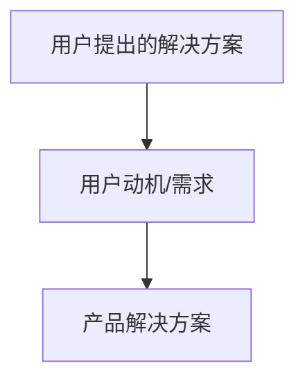

#### 图3-5 用户访谈的两种状态
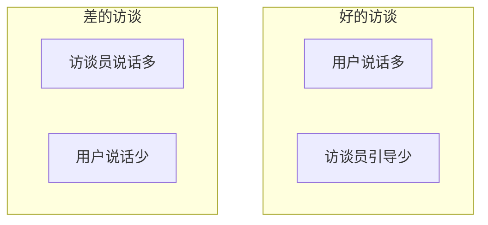

#### 图3-6 Albert Mehrabian的“7%-38%-55%规则”
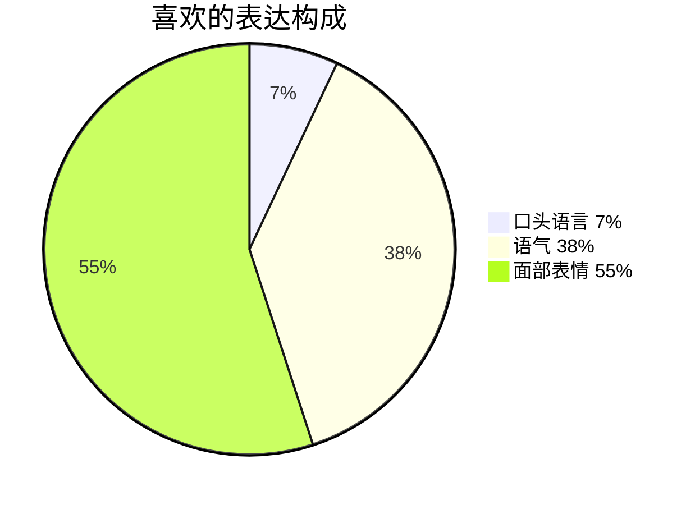

#### 图3-7 观察法的分类
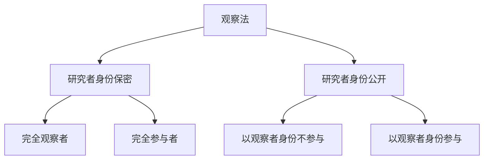

### 经典金句/数据
> “当团队对两种蓝色拿捏不定时，就选了41种蓝色看哪种表现更好……我无法在这种环境下工作。”——Google设计师Douglas Bowman辞职理由
> 用户报告使用Facebook的时长比实际多出3.2小时（图3-1）。
> 选项顺序固定会导致靠前选项更容易被选择（Zewei Zong实验，图3-2）。
> CDC关于喝漂白剂的调研：经质量控制后，实际无人真的服用。
> “7%-38%-55%规则”：人们对事物的喜欢程度，口头语言仅占7%，语气38%，面部表情55%。
> “影响大众想象力的不是事实本身，而是它扩散和传播的方式。”——《乌合之众》

---

## 第4章：数据分析基本方法
### 核心论点
- 问题：如何从数据中提炼洞察？定性分析和定量分析的基本思路是什么？
- 观点：数据分析要遵循“去粗取精、去伪存真、由此及彼、由表及里”的原则。定性分析注重挖掘动机和主题，定量分析依赖对比、分类细拆和转化思维，并需注意描述统计与推论统计的正确使用。

### 关键概念/事件
- 从数据到智慧的演化：数据 → 信息 → 知识 → 洞察 → 智慧。
- 定性分析方法：用户访谈总结（动机分析、行为分析）、词频分析、亲和图、用户分类。
- 黄金圈法则（Simon Sinek）：Why → How → What。
- 手段-目的链分析方法：产品属性 → 结果 → 核心价值。
- 福格行为模型：B=MAT（行为=动机+能力+触发）。
- Tinbergen四问法（动物行为研究迁移到用户行为）。
- 定量分析思路：对比（横向、纵向、细分、局部vs整体、转化后对比）、分类细拆、转化（流程步骤分解）。
- 描述统计：频率/比例、平均数（算术/几何）、中位数、众数、四分位数、标准差、交叉分析、相关（皮尔逊、点二列、等级相关）。
- 推论统计：置信区间、显著性检验（T检验、方差分析）、主效应与交互效应。
- 数据表达陷阱：分析单位、统计口径、平均数误区（“平均飞行员”案例）。

### 方法流程图

#### 图4-1 从数据到智慧的演化
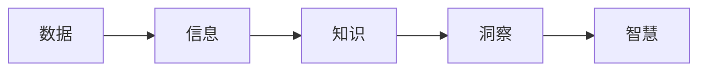

#### 图4-2 黄金圈法则
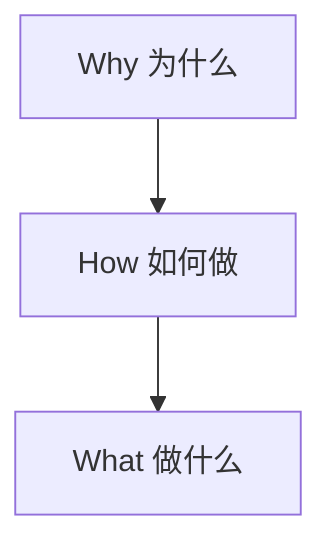

#### 图4-3 产品与用户价值
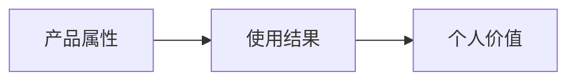

#### 图4-6 方差分析基本原理
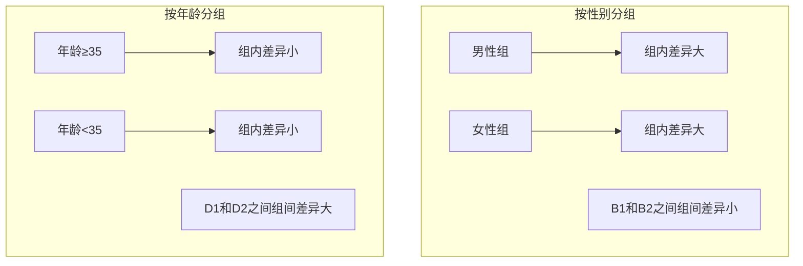

#### 图4-7 交互效应示意图
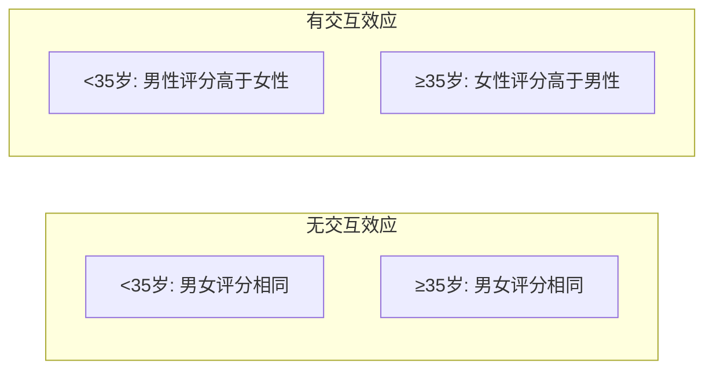

### 经典金句/数据
> “数据不是信息，信息不是知识，知识不是洞察，洞察不是智慧。”——Clifford Stoll
> “要完全地反映整个的事物……就必须经过思考作用，将丰富的感觉材料加以去粗取精、去伪存真、由此及彼、由表及里的改造制作工夫。”——《实践论》
> Facebook实际使用时长与报告时长差距可达3.2小时（图3-1）。
> “平均飞行员”案例：4000多名飞行员中无一人在10个身体指标上全部落在平均值范围内。
> 2016年美国总统大选：希拉里普选票多290万张，但特朗普赢得选举人票。
> “宁要模糊的正确，也不要精确的错误。”——凯恩斯

---

## 第5章：用户研究的常用工具
### 核心论点
- 问题：人物角色、用户旅程图、任务分析是什么？如何创建和使用？
- 观点：人物角色是团队沟通工具，帮助聚焦目标用户；用户旅程图可视化用户全流程体验，找到关键时刻；任务分析拆解用户目标与操作，优化系统设计。

### 关键概念/事件
- 人物角色（Persona）：基于调研的虚拟角色，包含命名、基本信息、需求、痛点等。示例：图5-1。
- 创建人物角色的5步：研究目标用户→提炼结果→头脑风暴→确定优先级→完善。
- 用户旅程图（Customer Journey Map）：展示用户完成目标的过程、行为、感受和机会点。包含人物角色、场景、用户行为、情感曲线、机会点。
- 峰终定律（Peak-End Rule）：人对体验的记忆主要由高峰和结束时的感受决定。
- 任务分析（Task Analysis）：拆解用户目标为具体任务，包括层次任务分析和认知任务分析。
- 认知任务分析方法：观察访谈、过程追溯（出声思维）、卡片分类。

### 方法流程图

#### 图5-1 人物角色示例
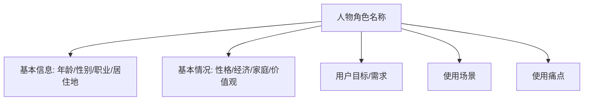

#### 图5-2 用户刷脸支付旅程图
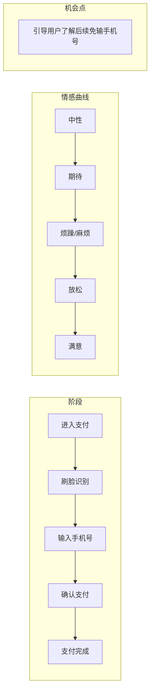

#### 图5-3 层次任务分析示例
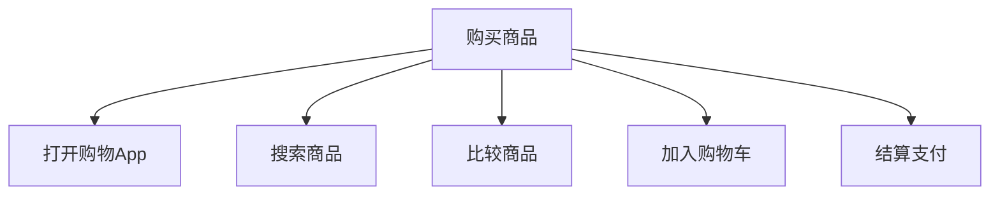

### 经典金句/数据
> “试图满足所有用户的需求是一个灾难，那会让产品变成一个臃肿不堪、谁都不满意的四不像。”——苏杰
> “如果你不知道用户是谁，就无法设计出正确的产品。”——Alan Cooper
> 北欧航空总裁卡尔森：“我们每年接触1000万个乘客，每个乘客平均会接触5个员工，每次接触大约15秒。这5000万个15秒就是我们的关键时刻。”

---

# 第二篇：用户研究赋能产品开发

## 第6章：产品开发前的用户研究
### 核心论点
- 问题：产品开发前如何定位目标人群、挖掘需求、测试概念和配置？
- 观点：通过人群细分选择目标用户，通过定性/定量洞察用户需求，通过概念测试（分类法/KANO）确定功能优先级，通过联合分析了解用户如何权衡配置，通过MVP测试验证想法。

### 关键概念/事件
- 人群细分维度：基本属性、心理、行为、需求、场景。
- 目标用户洞察内容：基本信息、购买/使用行为、痛点、创新点。
- 概念测试方法：概念分类法（接受度、吸引力、独特性、可信度）和卡诺（KANO）测试法（魅力、期望、必备、无差异、反向属性）。
- 联合分析（Conjoint Analysis）：通过多属性组合测试，计算各维度重要性和用户偏好模拟器。
- 最小可行产品（MVP）测试：通过原型、网页、众筹、预售等方式低成本验证产品想法。

### 方法流程图

#### 图6-1 两种概念测试思路
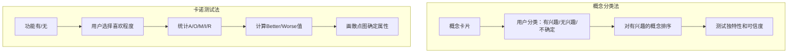

#### 图6-2 卡诺模型结果分析图（四象限）
```mermaid
graph TD
    subgraph 第二象限（必备属性）
        P[Better低，Worse高]
    end
    subgraph 第一象限（期望属性）
        E[Better高，Worse高]
    end
    subgraph 第三象限（无差异属性）
        I[Better低，Worse低]
    end
    subgraph 第四象限（魅力属性）
        A[Better高，Worse低]
    end
```

### 经典金句/数据
> “试图满足所有用户的需求是一个灾难。”——苏杰
> “人们觉得很难意识到有需求，直到他们有了需求得到满足的经历之后。”——乔克·布苏蒂尔
> “喜欢=熟悉+意外”
> 赫曼米勒椅子刚推出时不被接受，后成为主流（图6-5）。
> Pebble Watch在Kickstarter上37天融资1030万美元（图6-4）。

---

## 第7章：产品开发中的用户研究
### 核心论点
- 问题：产品开发中如何测试不同版本、评估可用性、测试内容与价格？
- 观点：A/B测试通过实验选择最优方案；可用性测试及早发现设计问题，遵循Nielsen十大原则；内容测试确保用户理解传达信息；价格测试（Gabor Granger、PSM、比照法）辅助定价决策。

### 关键概念/事件
- A/B测试步骤：确立目标→准备材料→分组→实施→数据分析。局限性：不能找到最好方案，只能比较已有方案。
- 可用性五要素（Nielsen）：可学习性、效率、可记忆性、错误、满意度。
- 启发式评估十大原则：系统状态可见性、与现实世界匹配、用户控制自由、一致性、预防错误、识别而非回忆、灵活效率、审美极简、帮助识别错误、帮助文档。
- 内容测试指标：可用性、可读性、语调、回忆率、说服力。方法：可用性测试、荧光笔测试、完形填空测试、A/B测试。
- 价格测试方法：价格点问询法（Gabor Granger）、价格敏感度测试（PSM）、比照价格测试法。

### 方法流程图

#### 图7-2 两种层次的A/B测试
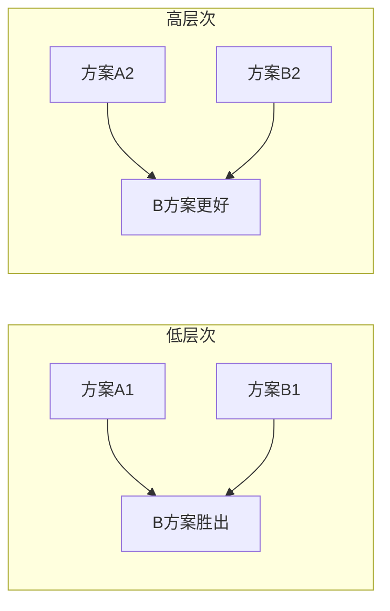

### 经典金句/数据
> “可用性经常是关乎生死的事。”——Jakob Nielsen
> 亨氏番茄酱瓶盖历经45个版本、120万美元、18.5万小时（图7-1）。
> Picatic将“免费开始”改为“免费试用”，点击率飙升376%。
> Nielsen：测试6-8个用户可发现绝大多数可用性问题。
> “荧光笔”测试（图7-4）：让用户标记理解/不理解、相信/不相信的部分。
> Netlix针对同一部电视剧使用不同封面（图7-3）。

---

## 第8章：产品上市后的用户研究
### 核心论点
- 问题：产品上市后如何了解用户反馈、测量忠诚度、复盘项目？
- 观点：用户回访需包含自身用户、竞品用户和非使用者，避免幸存者偏差。NPS是衡量用户忠诚度的关键指标，需结合推荐/贬损原因分析。项目复盘用KISS法沉淀经验。

### 关键概念/事件
- 幸存者偏差：只回访自己产品用户会遗漏重要信息（如关注处理器的用户买了竞品）。
- 回访样本应包含：自身用户、考虑过但未购买的用户、完全不考虑的用户。
- NPS（净推荐值）：0-6分贬损者，7-8分被动者，9-10分推荐者。NPS=推荐者%-贬损者%。
- NPS的局限：易被操纵（求好评），创始人提出“赢得的增长率”弥补。
- 复盘方法：KISS（Keep, Improve, Start, Stop）。

### 经典金句/数据
> 二战飞机弹孔案例：亚伯拉罕·瓦尔德建议在引擎（弹孔少）处加装装甲，因为被击中引擎的飞机没能返航。
> NPS创始人雷赫德：“终极问题”（Ultimate Question）。
> 良性和不良利润：来自推荐者的利润是良性，来自贬损者的是不良。
> KISS复盘法示例：保持好的做法（选项MECE），改善临时通知问题，开始提前检查用户条件，停止需求不清就启动调研。

---

# 第三篇：用户研究落地、沉淀与个人思考

## 第9章：用户研究成果落地与沉淀
### 核心论点
- 问题：如何让用户研究成果真正落地并形成组织沉淀？
- 观点：落地需将结论导向业务、保证可靠性、简洁有力、多角度印证。推动行动需高层支持、业务参与、量化收益。沉淀包括用户需求库、原始数据平台、经验指南和文化建设，最终目标是人人具备用户研究能力。

### 关键概念/事件
- 调研结论转化为业务需求：导向业务、可靠性、简洁、多角度印证。
- 推动落地策略：借力高层、业务参与、量化收益（如“如果我们创造XX体验，就会解决XX问题，需要XX资源，预计带来XX结果”）。
- 落地难原因：技术难题、多方平衡、优先级冲突。
- 用户需求库（如Uber格式：Who/Where/What/Why）：积累用户洞察，供后续查询。
- 微软用户体验库：可搜索“notification”查看历史反馈（图9-2）。
- 原始数据积累：标准化问题库，便于二次分析和趋势研究。
- 用户研究文化建设：终极状态是人人能做用户研究。

### 方法流程图

#### 图9-1 Uber用户体验库样式
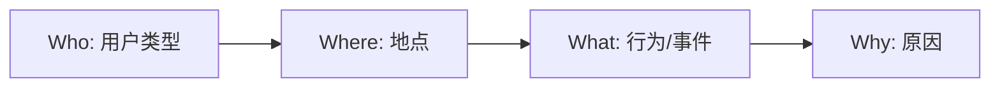

### 经典金句/数据
> “调查就像‘十月怀胎’，解决问题就像‘一朝分娩’。”
> “研究不是一个职业，而是一种态度。”——《在你身边，为你设计》
> 云鲸创始人张峻彬：“工程师除了技术能力强，还需要具备共情能力，这样才能把东西做好。”

---

## 第10章：关于用户研究的个人思考
### 核心论点
- 问题：用户研究领域有哪些好书？如何训练洞察力？如何应对工作中的痛点？如何创新？AI如何辅助研究？
- 观点：用户研究需多读书、多体验、多思考；面对“我朋友不是这样”的质疑，需解释统计结论与个案的区别；需求不变，偏好多变；创新可从用户目标达成理论（JTBD）和颠覆性假设入手；AI工具可充当助手、顾问、执行者。

### 关键概念/事件
- 推荐书单：按数据收集、思维拓展、产品设计、创新、杂书分类。
- 洞察力训练：读书、体验、持续思考（多问为什么）。
- 用户研究三个层次：①搞清楚事实；②发现规律；③制定行业标准。
- 用户需求与偏好的区别：需求恒久不变（如省力、娱乐），偏好随时代/文化变化。
- 用户目标达成理论（JTBD）：产品是帮助用户完成任务的工具。5种发掘方法：从生活中找、从未消费者中找、找出变通办法、关注不想做的事、找出产品不同寻常用法。
- 颠覆性创新五步法（frog）：提出颠覆性假设→发现颠覆性商机→形成颠覆性创意→设计市场方案→演示方案。
- AI工具（ChatGPT）在用户研究中的应用：收集材料、编制问卷、充当访谈员、生成代码、总结观点。

### 方法流程图

#### 图10-2 价值要素金字塔（贝恩咨询）
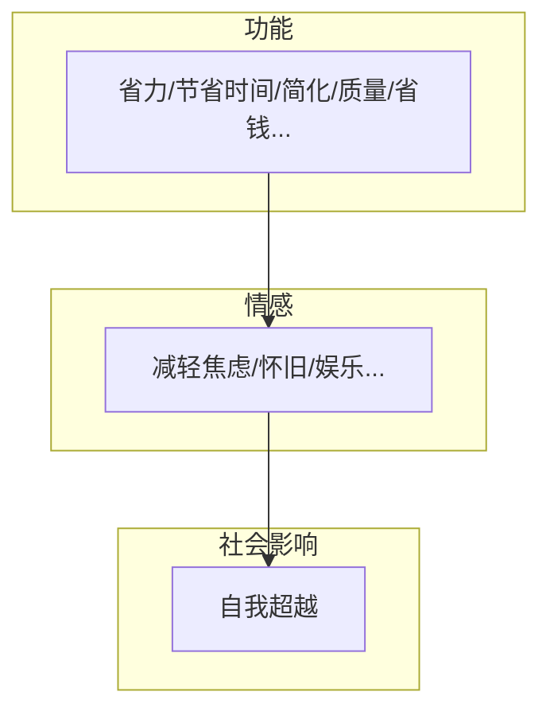

### 经典金句/数据
> “在与理性冲突中，感性从未失手。”——《乌合之众》
> “我们没办法创造需求，只能创造出用户没有见过的解决方案。”——苏杰
> “铁路行业的衰退不是因为客运和货运需求下滑，而是因为它们认为自己属于铁路业，而不是运输业。”——《创新者的任务》
> “打败诺基亚的，不是另外一家诺基亚，而是像苹果这样的智能机。”
> “我的每一堂课都让你感觉一个半小时之后的你跟一个半小时之前的你不一样。”——黄执中
> “如果你不知道一个知识什么时候失效，你就不配拥有它。”——查理·芒格

---

## 致谢（部分）
作者感谢家人、高尚仁老师、审稿朋友及机械工业出版社编辑。高尚仁老师是用户体验研究先驱，20世纪60年代研究汽车驾驶体验，成果发表于Nature。