# 《电力大数据在经营管理中的应用》章节总结

## 书籍信息

- **书名**：电力大数据在经营管理中的应用
- **作者**：谢桦；张沛
- **出版社**：电子工业出版社
- **出版时间**：2024年7月
- **ISBN**：9787121484278
- **字数**：107千字

## PDF/OCR 状态

- 文本来源：EPUB 文件，内容完整可读
- 图表：书中包含大量图表，部分已提供文字描述，部分需基于描述重建逻辑关系
- 目录：完整识别，与正文一致

## 目录说明

本书共分为8章，依次为：
1. 供电企业经营管理现状
2. 电力大数据简介
3. 电力大数据在人财物领域的应用
4. 电力大数据在规划计划领域的应用
5. 电力大数据在运维检修领域的应用
6. 电力大数据在电力营销领域的应用
7. 电力大数据在辅助决策领域的应用
8. 供电企业大数据应用趋势展望

每章末尾附有“本章参考资料”。

## 全书核心主题

本书系统阐述电力大数据在供电企业经营管理中的全方位应用。作者指出，大数据已被提升到供电企业发展战略层面，成为“重塑电力核心价值”和“转变电力发展方式”的核心主线。全书围绕人财物管理、规划计划、运维检修、电力营销、辅助决策等关键业务领域，结合大量实际案例，展示大数据技术如何提升管理效能、优化资源配置、创新服务模式。书中强调，在新型电力系统和能源互联网建设背景下，电力大数据的深度融合将驱动智能电网技术提升、决策模式变革和服务水平升级。

---

## 第1章：供电企业经营管理现状

### 1. 核心论点

本章解决供电企业经营管理的基本特征、现状和面临挑战的问题。作者认为：供电企业的经营管理具有技术一致性、社会效益优先和影响全社会资源分配三大特点；在“双碳”目标和统一电力市场体系建设背景下，供电企业必须创新经营管理模式，而大数据技术是支撑这一转型的关键工具。

### 2. 关键概念

- **供电企业**：依法取得电力业务许可证、从事供电业务的企业，主要包括国家电网、南方电网等。
- **“三集五大”战略**：国家电网2010年提出的发展战略，即人力、财力、物资集约化管理；大规划、大建设、大运行、大检修、大营销体系。
- **“三型两网”战略**：打造枢纽型、平台型和共享型企业，建设坚强智能电网和泛在电力物联网。
- **“两级法人、三/四级管理”**：国家电网的组织架构模式（总部-省公司两级法人，总部-省公司-市县公司三级/四级管理）。
- **“双碳”目标**：碳达峰、碳中和目标，推动新型能源系统构建。

### 3. 逻辑推演

作者首先界定供电企业的定义和范围，指出电能商品的特殊性（发输配售瞬时完成）。然后分析供电企业经营管理三大特点：技术一致性、社会效益优先、资源配置影响全局。接着回顾我国电力体制改革历程（从1997年国家电力公司成立到2019年“三型两网”战略），展示供电企业管理架构的演变。最后提出当前面临的挑战：新型能源系统要求创新管理模式，统一电力市场要求优化经营机制。结论是大数据技术是应对挑战、挖潜增效的重要支撑。

### 4. 经典金句/数据

> “电能关系着国计民生，供电企业资产规模庞大，产业链与众多上下游产业紧密关联，涉及全社会原材料采掘、设备制造、人才培养等方面的资源配置，甚至会改变人民生活方式。”

> 2023年《财富》世界500强中，国家电网有限公司位列前3名。

> 2023年6月，国家能源局发布《新型电力系统发展蓝皮书》，提出新型电力系统应具备“安全高效、清洁低碳、柔性灵活、智慧融合”四个重要特征。

---

## 第2章：电力大数据简介

### 1. 核心论点

本章解决电力大数据的基本概念、数据特征、数据资源和平台建设问题。作者认为：电力大数据具有3V（体量大、类型多、速度快）和3E（数据即能量、数据即交互、数据即共情）的典型特征；当前电力数据存在生产质量不高、共享渠道不畅、安全隐患大等问题，数据治理是重要基础；大数据平台建设应规划三级数据中心，采用Hadoop技术体系。

### 2. 关键概念

- **3V定义**：规模性（Volume）、多样性（Variety）、高速性（Velocity）。
- **3E特征**：数据即能量（Energy）、数据即交互（Exchange）、数据即共情（Empathy）——中国电机工程学会提出的电力大数据特征。
- **三级数据中心**：总部数据中心、区域/省级分公司数据中心、地区供电公司级数据中心。
- **Hadoop技术体系**：分布式存储（HDFS、Hbase、Hive）、分布式计算框架（MapReduce）、Spark等。
- **数据治理**：支撑电力大数据应用的重要基础，包括避免重复采集、完善共享流程、实施数据安全管理。

### 3. 逻辑推演

作者首先引用MGI对大数据的定义，对比传统数据与大数据的区别。然后详细阐述电力大数据的3V+3E特征，并说明不同行业的应用侧重。接着分析电力数据资源现状：数据量巨大（营销业务每年新增约100TB用电采集数据），但存在质量不高、共享不畅、安全隐患三大问题。进而介绍电力大数据平台建设的三级数据中心架构和典型技术栈（x86 + Hadoop）。最后通过国际案例（Enphase、AEP、Enel等）展示电力大数据的价值：系统状态监测、改善用户体验、规避损失、支撑新型电力系统。

### 4. 流程图

#### 典型的电力大数据技术架构示意图

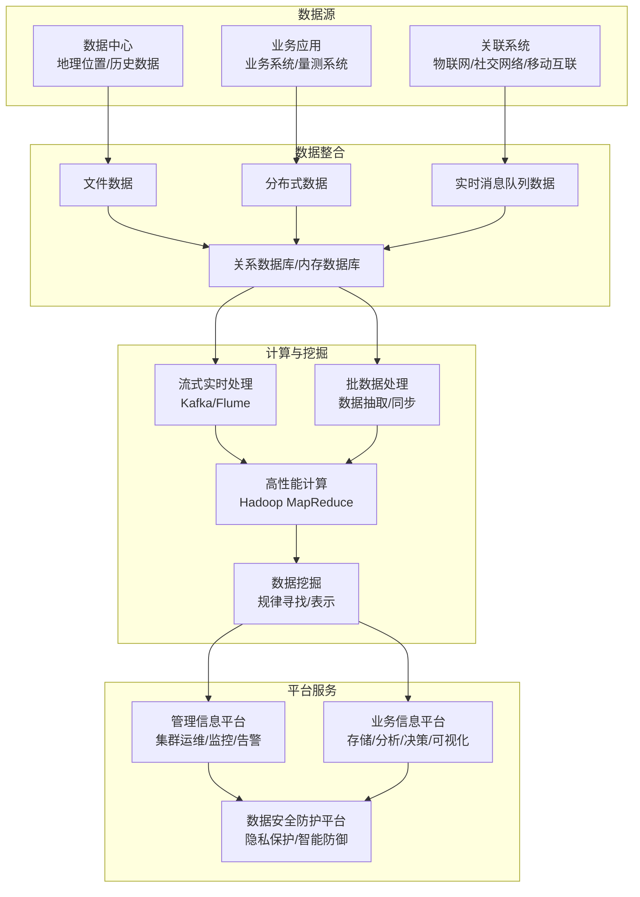

### 5. 经典金句/数据

> “麦肯锡的报告曾预测，大数据分析方案的广泛使用能够在全球范围内削减约3000亿美元/年的电费。”

> “我国电网专家分析认为，电力数据利用率每增加10％可带来20％～49％的经营利润。”

> “中国电机工程学会信息化专委会于2013年3月首次发布了《中国电力大数据发展白皮书》，将2013年定为‘中国大数据元年’。”

> 意大利Enel电力公司依赖大数据技术识别出93％的电力盗窃案，年收益超过3.5亿欧元。

---

## 第3章：电力大数据在人财物领域的应用

### 1. 核心论点

本章解决供电企业人力资源管理、财务资金管理和资产物资管理中如何应用大数据提升精益化管理水平的问题。作者通过多个实际案例证明：大数据技术可以科学预测人员配置需求、精准预测资金缺口、实现资产账卡物一致管理、构建智慧供应链，从而大幅降低管理成本、提升经营效益。

### 2. 关键概念

- **人员配置需求预测**：基于全业务数据中心，采用线性回归算法建立岗位与人员特征匹配模型。
- **资金缺口管理辅助决策平台**：整合营销、财务管控、ERP系统数据，采用ARIMA模型、聚类、回归等算法预测资金流入流出。
- **账卡物一致实时管控机制**：通过资产清单、预算归口管理、“三码对应库”等措施，实现财务资产卡片、设备台账、实物三者一致。
- **“三码对应库”**：物料编码、设备类型编码、资产编码的对应关系库（45000多条记录）。
- **物资身份码**：主网和配网关键物资的唯一身份标识，用于全程追溯。

### 3. 逻辑推演

本章分为四个子应用：

**3.1 人员配置**：从人工统计低效问题出发，介绍人力资源系统的大数据平台架构，实现统计分析、对比分析和趋势预测三类功能。

**3.2 财务资金分析**：针对传统经验预测不准确的问题，搭建资金缺口管理辅助决策平台，实现多系统数据接入、业务模型划分、图表展现。具体方法包括：售电现金流量的ARIMA预测、购电支付机器学习预测、工程支付基于报账单预测等。同时通过数据核对模型提升预算管控力度。

**3.3 资产一体化管理**：针对设备数量多、多部门协同难的问题，采取六大应对措施：创建资产清单、预算归口管理、应对系统影响、存量清查、增量源头管控（“三码对应库”）、规范流程。建设资产一体化管理平台，实现全口径、多系统交互、大数据分析。

**3.4 物资供应链**：介绍互联网+电力物资供应链系统，包括采购协同、物资辅助分析、配网统购统配、供应商服务大厅四大应用，以及智能仓储、智能配送、质量监测、智慧服务、物资身份码、指标管控预警等新增功能。实现供需双方对账工作量减少超30%，供应商成本降低超10万元/年。

### 4. 流程图

#### 资金管理分析框架图

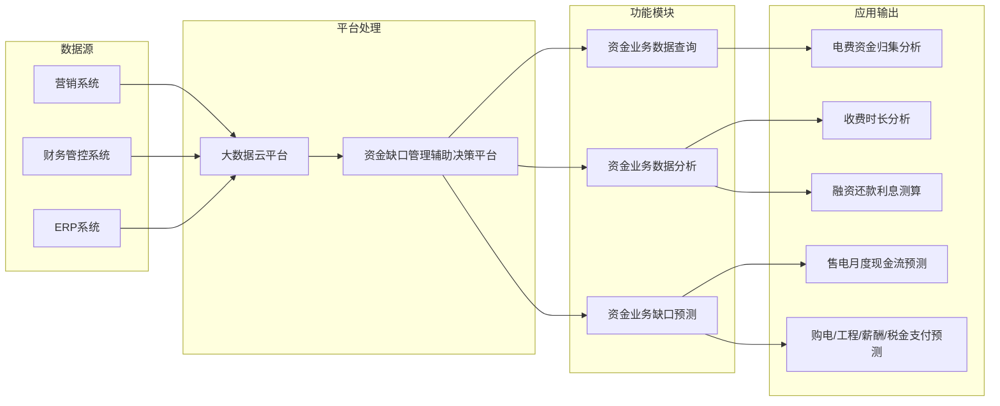

### 5. 经典金句/数据

> “电力数据利用率每增加10％可带来20％～49％的经营利润。”

> “国网浙江省电力有限公司应用大数据有力辅助了新增市场的挖掘和开拓，2018年实现新增售电量117％。”

> 资产一体化管理平台：统计全省160多万项资产，每项资产170个字段信息，用时在60秒之内。

> 物资供应链：供需双方对账工作量减少超30％，供应商成本费用降低超10万元/年。

---

## 第4章：电力大数据在规划计划领域的应用

### 1. 核心论点

本章解决供电企业规划计划中可再生能源发电规模预测、线路状态预测、电网线损监测、配电网规划设计以及综合计划与预算监测等关键问题。作者认为：大数据技术通过融合气象、地理、运行等多源数据，可以显著提升预测精度和规划效率，为资源配置和经营管理提供科学依据。

### 2. 关键概念

- **可再生能源并网准入功率**：以线路潮流不过载、节点电压不越限为约束，最大化并网功率。
- **隐马尔可夫模型（HMM）**：用于光伏发电功率预测，基于相似日理论和灰色关联度法选取训练样本。
- **SMOTE-SVM算法**：合成少数过采样技术（SMOTE）结合支持向量机（SVM），用于配电线路时变状态预测，解决样本非平衡问题。
- **线损监测分析系统**：实现综合线损率、分压线损、台区线损的实时监测与分析。
- **配电网规划智能辅助平台**：整合生产管理、SCADA、用电信息采集等系统数据，提供诊断分析、电力电量预测、目标网架设计、项目评价等功能。

### 3. 逻辑推演

本章分为五个子应用：

**4.1 可再生能源发电规模预测**：从“双碳”目标背景出发，介绍并网点准入功率计算模型（目标函数最大化分布式电源功率，约束包括潮流、电压、电流）。短期功率预测采用HMM，结合相似日选取和灰色关联度分析，在不同天气类型下验证模型误差。

**4.2 线路状态预测**：针对配电线路状态评估的主观性和样本不平衡问题，提出基于福克-普朗克方程的时变状态转移模型，采用SMOTE算法改善样本平衡性，用SVM分类运行工况（正常/恶劣）。算例表明该方法在小样本条件下优于PHM法。

**4.3 电网线损监测**：介绍某企业研发的线损监测分析系统，实现整体线损、地区线损、分压线损、台区线损的监测。系统实现低压台区数据全覆盖采集，同期线损下降4%，综合线损累计下降18%。

**4.4 配电网规划设计**：构建智能辅助平台，整合三大系统（生产管理、SCADA、用电信息）共94类数据，提供数据中心、诊断分析、电力电量预测、目标网架设计、项目评价五大模块。

**4.5 综合计划与预算监测**：建立常态化监测系统，涵盖投资建设、生产运行、电力供需、经营业绩、资源状况、营销服务六大监测功能，共56项二级功能。

### 4. 流程图

#### HMM预测实现过程

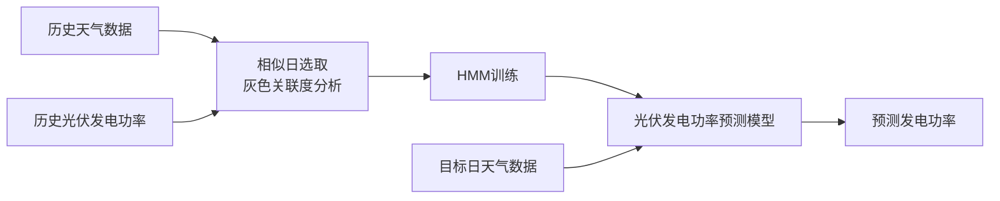

### 5. 经典金句/数据

> Vestas公司利用大数据进行风机选址，数据包括天气数据、全球森林砍伐追踪图、卫星图像、地理数据和月相与潮汐数据。

> 表4-1：四种天气类型下气象因素与光伏发电功率的相关性系数，最高为多云天气下太阳辐射度0.936。

> SVM法对恶劣工况下的故障概率预测，最大相对误差出现在线路L3（约15%），而PHM法最大相对误差出现在线路L4（约28%）。

> 线损监测系统实现低压台区数据全覆盖采集，同期线损下降4％，综合线损累计下降18％。

---

## 第5章：电力大数据在运维检修领域的应用

### 1. 核心论点

本章解决供电企业运维检修中设备状态评估、特高压管控、主动运维、故障抢修和保电应急等关键问题。作者认为：大数据技术结合人工智能算法（决策树、随机森林、SMOTE等）可以高效、客观地评估设备状态，实现运维态势全面感知，变被动检修为主动运维，大幅提升运检效率和供电可靠性。

### 2. 关键概念

- **决策树（C4.5算法）**：用于变压器状态评估信息获取，以if-then规则形式输出关键状态量和评估规则，实现白箱模型。
- **SMOTE算法**：合成少数过采样技术，解决变压器样本集中正常状态（659条）与非正常状态（110条）的不平衡问题。
- **随机森林算法**：组合多棵决策树，用于架空输电线路状态评价，参数优化（m=30, R=1）后Kappa系数达0.9235。
- **特高压可视化管控**：包括检修管控可视化、巡视管理（机器人+PDA）、重要输电通道可视化、护线体系标准化、GIS基础沉降监测。
- **配电网故障抢修管理系统**：基于K-means聚类算法预估抢修用时，实现故障智能感知、抢修态势实时监控。

### 3. 逻辑推演

本章分为五个子应用：

**5.1 设备状态评估**：以变压器为例，传统《导则》扣分法存在主观性。提出基于SMOTE+C4.5决策树的方法：先对769条样本（正常659、注意59、异常9、严重42）用SMOTE过采样至1319条，再用C4.5构建决策树，分类正确率99.318%，Kappa系数0.9893。提取的关键状态量包括套管电容量偏差、绕组直流电阻、绝缘电阻等，并形成区域定制化评估规则。

**5.2 特高压管控**：以±800kV换流站为例，展示检修工作票统计、机器人巡检痕迹、重要输电通道视频监控、护线人员实时定位、GIS基础沉降预警等功能。

**5.3 主动运维**：针对架空输电线路，构建包含8个单元共59个状态量+20个特殊情况状态量的体系，采用随机森林算法（m=30, R=1）建模，分类正确率95.35%，Kappa系数0.9235，优于C4.5算法（正确率87.4%，Kappa 0.7881）。

**5.4 故障抢修**：介绍配电网故障抢修管理系统，基于K-means聚类预估抢修用时，实现故障告警实时监控、抢修人员位置动态展示、网架薄弱点分析等功能。

**5.5 保电应急**：智能保电指挥系统构建一体化监控网络（站-线-变-户），实现台风、雷电、覆冰、山火等多元化灾害的事前监控预警。

### 4. 流程图

#### 变压器状态评估信息决策树（简化示意）

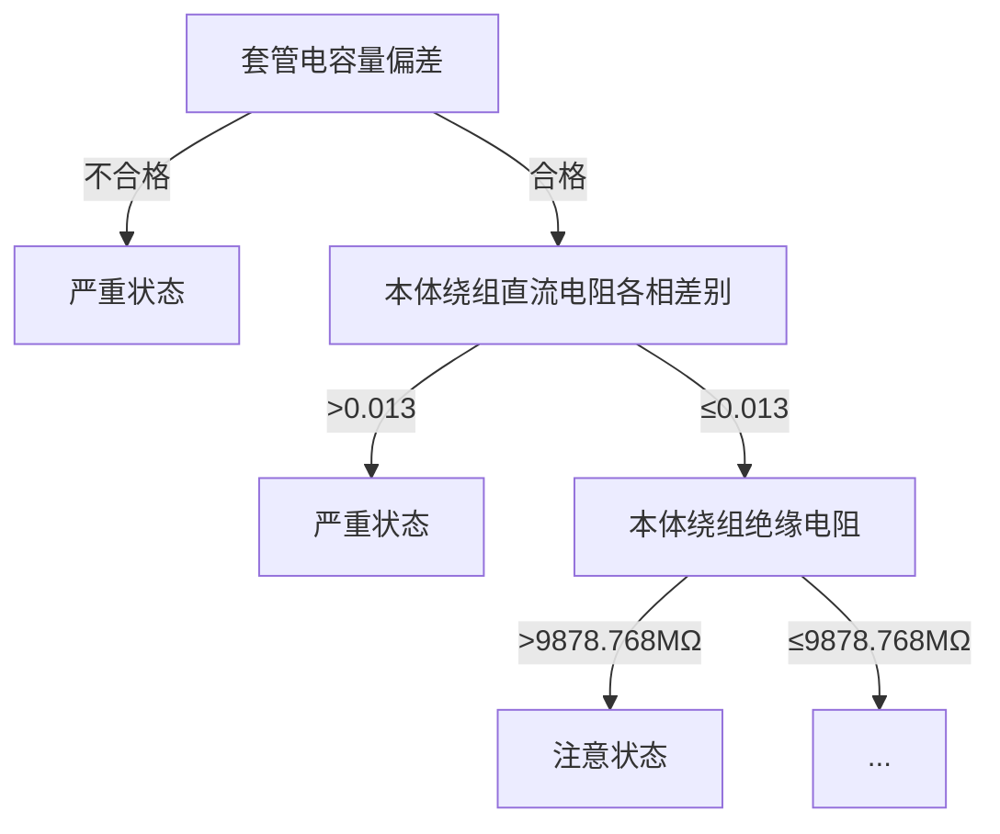

#### 随机森林子决策树构建原理示意图

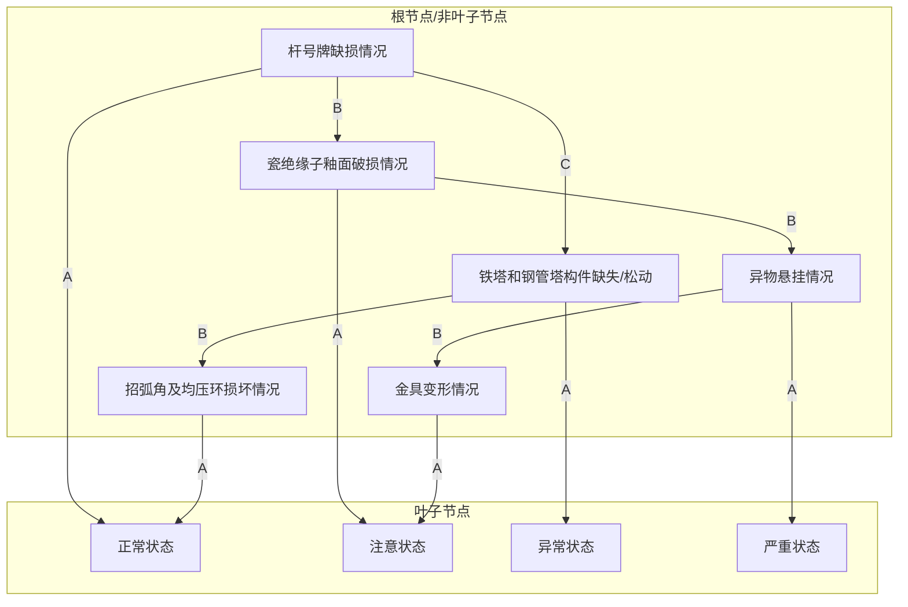

### 5. 经典金句/数据

> “Kappa系数0.9893，说明该方法分类精度属于‘非常好’等级。”

> “随机森林算法相比C4.5算法，Kappa系数高0.1354，分类正确率算法高7.95个百分点。”

> 架空输电线路状态量体系：8个单元共59个状态量+20个特殊情况状态量=79个状态量。

> 特高压换流站：通过智能机器人巡检、PDA巡检、视频会商等手段，实现运维巡检全过程管理。

---

## 第6章：电力大数据在电力营销领域的应用

### 1. 核心论点

本章解决电力营销中如何利用大数据实现立体化服务渠道建设、供电服务模式搭建、智能用电服务和服务触点管理的问题。作者认为：大数据技术可使营销渠道立体化、服务模式精益化、用电服务智能化、电费风险可控化，从而提升客户体验和企业竞争力。

### 2. 关键概念

- **立体化服务渠道**：本地服务渠道（营业厅、自助服务、社区服务）+ 电子服务渠道（掌上电力App、95598网站、微信公众号等）线上线下协同。
- **“三型一化”营业厅**：服务型、市场型、智能型及线上线下一体化转型升级。
- **客户标签库**：包含基础标签（个性、信用、用电、渠道特征）和高级标签（三级结构：6大类→30子类→177个标签），用于客户细分和精准营销。
- **CSC精益运营管理模式**：客户（Customer）-策略（Strategy）-渠道（Channel）三者适配，实现精准推送。
- **电费回收风险预测**：基于逻辑回归算法，融合客户档案、用电行为、缴费行为、行业特征等多维度数据，建立风险预测模型。

### 3. 逻辑推演

本章分为四个子应用：

**6.1 立体化服务渠道建设**：从客户对在线服务的需求出发，介绍线上线下双门店模式。实现渠道接入、账户管理、服务调度、监测业务五方面一体化协同。案例包括停电影响分析（话务预测、客户行为分析、电网质量分析）和计量装置监测（智能电表故障统计，时钟异常和电池欠压为主）。

**6.2 供电服务模式搭建**：建立省地两级营销服务运营架构（省客服中心+地市公司），形成“小前端、大后台”模式。以低压居民新装业务和业扩报装为例，流程从11步精简至5步。实现提质增效、智能互动、全程管控、高效服务四大目标。

**6.3 智能用电服务**：设计用户侧终端层、信息通信层、电网侧应用层三层双向互动体系。用户侧终端包括电力大用户、家庭居民、电动汽车充电终端；信息通信层采用公网通信+低压电力线载波；电网侧包括配电自动化、用电信息采集、能效综合管理、电动汽车充电管理、并网接入、营销服务六大系统。

**6.4 服务触点管理**：聚焦电费回收风险。建立客户标签库（基础标签126个，高级标签177个），构建高低压客户信用评价模型，将客户分为事实风险和潜在风险。基于逻辑回归建立电费风险预测模型，实现差异化催费策略。同时开展各行业用电量监测、非居客户缴费逾期监测、专变客户监测、用电行为异常监测、电话呼入监测等七大分析。

### 4. 流程图

#### 供电服务组织新模式（省地两级）

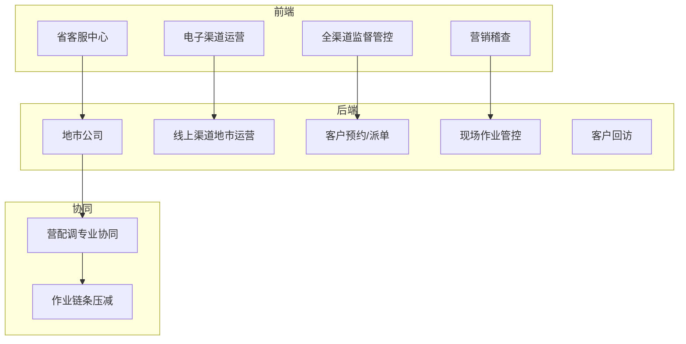

#### 双向互动体系架构

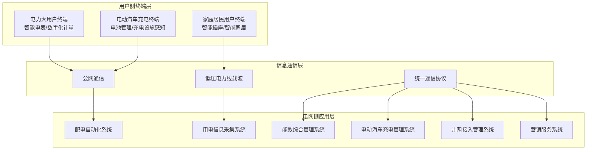

### 5. 经典金句/数据

> 某市供电企业：移动作业终端总体应用规模已超过10000台，电子渠道注册用户超过1000万户，电子渠道交费金额达29.2亿元。

> 智能电表故障统计：居民所使用的2级单相远程费控智能表故障占统计期故障总数的76.51%，主要集中在时钟异常、电池欠压及表计烧坏三类。

> 客户标签体系：基础标签126个，高级标签三级结构（6大类→30子类→177个标签）。

> 电费回收风险分类：事实风险（已存在欠费）、潜在风险（信用评级低）；风险趋势分为突增、稳定、增大、下降、波动。

---

## 第7章：电力大数据在辅助决策领域的应用

### 1. 核心论点

本章解决供电企业如何利用大数据进行营配调贯通、用电量预测与负荷特性分析、配电网故障恢复策略设计、综合能源系统运行风险评估等辅助决策问题。作者认为：大数据技术与外部数据（气象、经济）深度融合，可以辅助企业正确决策、支撑政府科学政策制定，是实现智慧能源和韧性电网的关键技术。

### 2. 关键概念

- **营配调贯通一体化**：基于GIS平台，贯通调度自动化、配网自动化、生产管理、用电采集、营销等系统，建立统一数据库（四层架构：BUF、ODS、DW、DM），实现数据同源管理。
- **X12季节调整法**：分解时间序列数据中的趋势分量、季节周期分量和随机分量，用于用电量预测。
- **高斯混合模型（GMM）**：用于可再生能源出力预测误差的不确定性建模，结合最大后验估计（MAP）在线更新参数。
- **滚动优化负荷恢复策略**：基于GMM描述风光预测误差，建立多时段负荷恢复滚动计划，每1小时更新一次，以置信度α控制风险。
- **半不变量法**：用于电-气互联综合能源系统（EGIES）运行风险快速评估，结合改进K-means聚类（引入灵敏度修正系数）提升精度。

### 3. 逻辑推演

本章分为四个子应用：

**7.1 营配调贯通一体化**：从跨业务融合需求出发，设计统一数据库（四层架构），采用CDP、OGG、E文件等多种数据复制技术接入多系统。实现营配调数据同源管理，全业务在线运营可视化。试运行后效率提升85%，发现和整改95万条记录。

**7.2 用电量预测与负荷特性分析**：采用四分量模型（基本负荷+敏感因素+特殊事件+随机因素），结合深度学习（CNN、RNN、GAN）提高精度。X12季节调整法分解趋势、季节、随机分量。大客户用电特性采用K-means聚类，以平均轮廓系数（ASC）和误差平方和（SSE）确定最佳聚类数。以公交充电站为例，展示季节差异和日负荷特性。

**7.3 配电网故障恢复策略设计**：针对极端天气下可再生能源出力不确定性，建立基于GMM的预测误差模型，采用最大后验估计（MAP）在线更新参数。设计多时段滚动负荷恢复策略（每1小时更新），构建以负荷恢复量最大和投切次数最小为目标的机会约束优化模型，转化为MILP求解。算例表明，α=95%时失电风险仅4.9%，远低于传统方法的85.3%。

**7.4 综合能源系统运行风险评估**：以电-气互联系统（EGIES）为例，定义支路功率越限、节点电压越限、系统频率越限、节点气压越限四项风险指标。建立能流方程，采用半不变量法快速计算输出变量概率分布。改进K-means聚类引入灵敏度修正系数，降低线性误差。算例表明，改进算法计算精度接近蒙特卡罗（ARMS最大1.04×10-4），计算时间92.4s vs 487.31s（蒙特卡罗），效率提升显著。

### 4. 流程图

#### 统一数据库整体设计方案（四层架构）

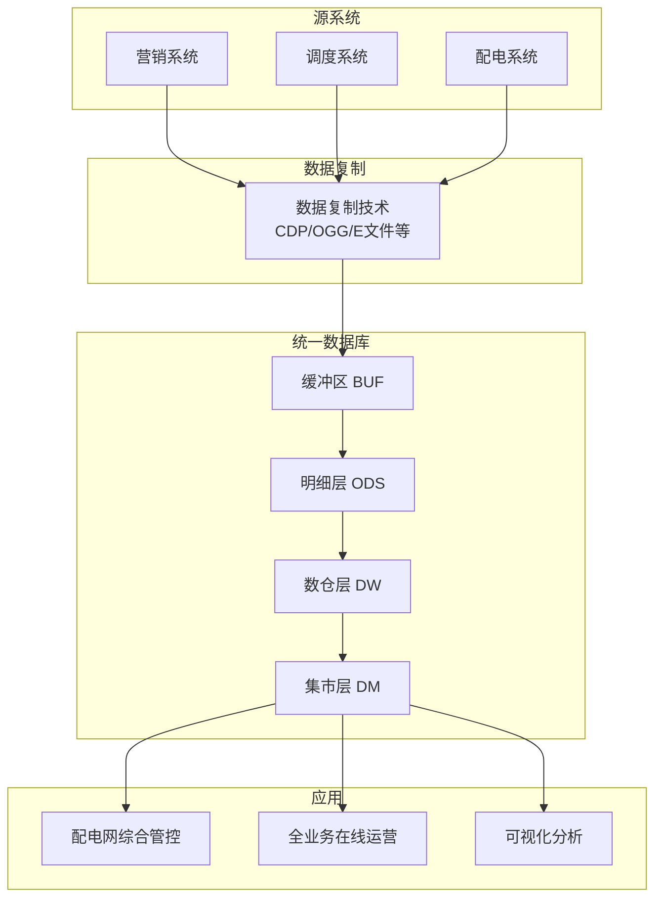

#### 多时段负荷恢复滚动计划示意图

```mermaid
gantt
    title 多时段负荷恢复滚动计划（总时长10小时）
    dateFormat HH:mm
    axisFormat %H:%M
    
    section 时段1 (0-1h)
    初始先验分布 :a1, 00:00, 1h
    第1次优化(9h) :a2, after a1, 1h
    执行第1h策略 :a3, after a2, 1h
    
    section 时段2 (1-2h)
    更新概率分布 :b1, 01:00, 1h
    第2次优化(8h) :b2, after b1, 1h
    执行第2h策略 :b3, after b2, 1h
    
    section 时段3 (2-3h)
    更新概率分布 :c1, 02:00, 1h
    第3次优化(7h) :c2, after c1, 1h
    执行第3h策略 :c3, after c2, 1h
    
    section ... 直至第10小时
    第9次更新 :d1, 09:00, 1h
    第9次优化(1h) :d2, after d1, 1h
    执行第10h策略 :d3, after d2, 1h
```

#### 电-气互联综合能源系统风险评估计算流程

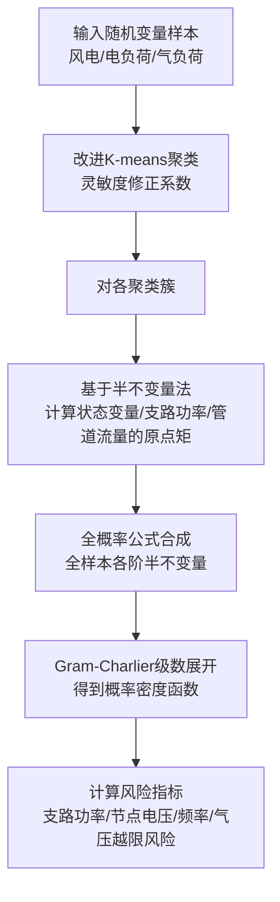

### 5. 经典金句/数据

> “自试运行以来，通过对超容用电、暂估款异常、购电支付异常等28项问题的管控，工作效率提升85％，发现和整改了95万条记录。”

> 多时段滚动优化：α=95%时失电风险4.9%，传统方法85.3%；但二级负荷恢复量传统方法高56.6%（保守策略付出弃风弃光代价）。

> EGIES风险评估：改进算法计算时间92.4s，蒙特卡罗487.31s，ARMS最大1.04×10-4，精度接近。

> 南方电网2024年组织机构新设共享平台单位，定位为网级共享运营中心、信息共享中心和决策支持中心。

---

## 第8章：供电企业大数据应用趋势展望

### 1. 核心论点

本章展望电力大数据未来发展趋势。作者认为：电力大数据将驱动智能电网技术水平提升（精准预测、全局优化）、供电企业决策模式变革（从被动问题解决到主动预判，从经验决策到数据驱动）、供电企业服务水平提升（源荷互动、虚拟电厂、商业模式创新）。电力大数据将推动供电企业实现技术效益、经济效益和社会效益最大化。

### 2. 关键概念

- **数据驱动决策**：由过去的被动问题解决变成主动预判，由业务驱动变成数据与业务联合驱动。
- **虚拟电厂**：用户由能源消费者转化为能源生产者，通过需求响应或组合成为虚拟电厂。
- **用能数据商业价值**：阿里云等企业收集新能源发电和家电用能数据，数据公司利用电表信息做商业信誉评估和针对性广告。
- **南方电网新架构**（2024年1月8日发布）：新成立共享平台单位，定位为网级共享运营中心、信息共享中心和决策支持中心。

### 3. 逻辑推演

作者从三个维度展开展望：

**第一，驱动智能电网技术提升**：多源多维数据融合使可再生能源出力预测、设备状态辨识、系统安全性精准化成为可能；感知复杂负荷动态，实现资源调配时空优化和柔性接纳；分析配用电和社会经济数据，完善主动运维、应急保障和经营管理流程。

**第二，驱动决策模式变革**：由被动问题解决变为主动预判，由业务驱动变为数据与业务联合驱动。挖掘业务流程中间数据和结果数据，发现瓶颈因素，辅助经营管理决策。

**第三，驱动服务水平提升**：将电源端、电网端、用户端所有元素融为一体。用户可转化为能源生产者（虚拟电厂），双向不确定性增加，只有大数据支撑的资源集成共享才能保证电网柔性。营销中可通过大数据进行需求与用能行为监测分析，产生有价值信息。用能数据可反映经济结构动态特征，为政策制定提供依据。

最后引用南方电网2024年1月8日发布的新组织机构图，显示数据共享、数据融合的迫切需求，电力大数据在经营管理战略中的地位持续深化。

### 4. 流程图

#### 南方电网公司组织机构图（简图，基于原文描述）

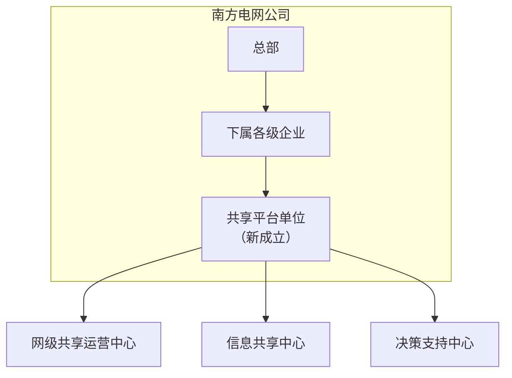

> 说明：原文仅提供图8-1南方电网公司的组织机构图，但未给出详细的分支结构。以上为基于文字描述的简化示意。

### 5. 经典金句/数据

> “电力大数据将助力电力信息开放与共享、控制自动与优化、源荷互动与协调、运营精益与增效，推动供电企业经营管理追求技术效益、经济效益和社会效益最大化。”

> “南方电网公司于2024年1月8日发布的组织机构设置，新成立了共享平台单位，定位为网级共享运营中心、信息共享中心和决策支持中心。”

> “用能数据也可以反映和预测经济运行状态和发展趋势，通过用能数据的分析，可反映经济结构的动态特征和趋势。”

---

## 全书总结

《电力大数据在经营管理中的应用》系统性地展示了电力大数据从技术基础到业务应用的全景图。作者通过大量来自国家电网和南方电网的真实案例，证明了大数据技术在人力资源、财务、资产、规划、运维、营销、辅助决策等领域的显著成效。书中强调，电力大数据不仅提升企业内部管理效率和经济效益，更能通过数据共享与外部数据融合，支撑政府决策、服务社会民生。在“双碳”目标和新型电力系统建设背景下，电力大数据将成为驱动能源转型和供电企业创新的核心引擎。