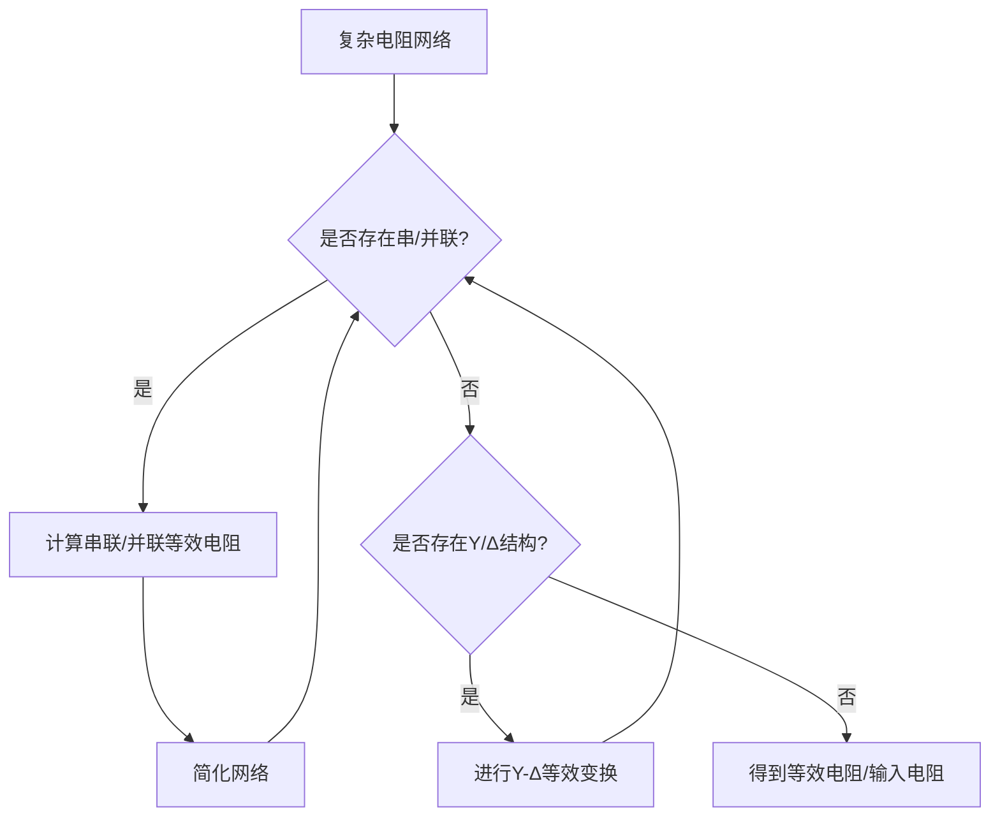
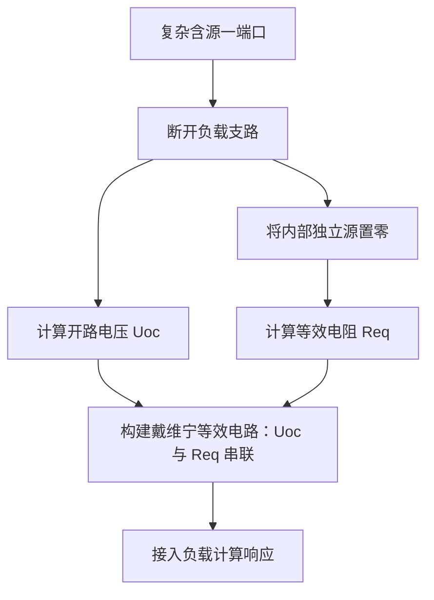
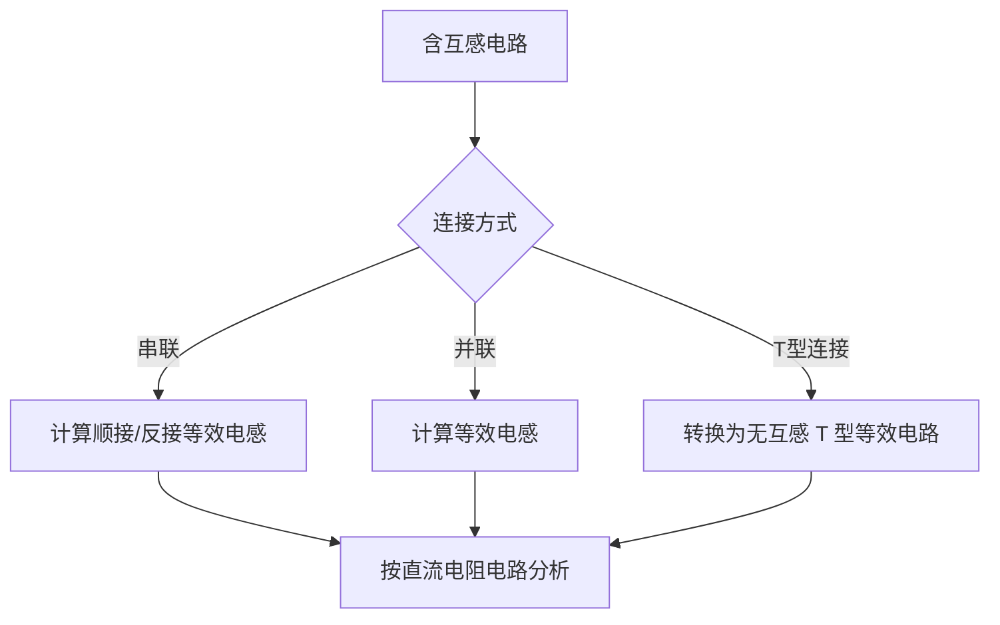

# 《电路》邱关源 第五版 章节总结

## 书籍信息
- 书名：电路（第5版）
- 原著：邱关源
- 修订：罗先觉
- PDF 状态：完整，含图文与公式
- OCR 状态：较高识别度，可准确提取内容

## 目录说明
- 目录识别情况：完整，共18章及附录
- 章节对应依据：按PDF目录页与实际正文顺序
- OCR 修复说明：无

## 全书核心主题
本书是普通高等教育“十五”国家级规划教材，是电气、电子与信息类专业电路课程的核心教材。全书共18章，系统介绍了电路模型与定律、电阻电路、动态电路（时域分析）、正弦稳态电路、三相电路、非正弦周期电路、拉普拉斯变换、网络图论、二端口网络、非线性电路、均匀传输线等核心内容。本书强调基本概念和基本方法，兼顾强电与弱电专业的需要，从简单的欧姆定律与基尔霍夫定律出发，逐步深入到复频域分析和网络综合，构建了完整的电路理论教学体系。

---

## 第1章：电路模型和电路定律

### 1. 核心论点
本章解决“电路分析的基本语言和规则是什么”的问题。作者认为：电路分析的基础在于建立“电路模型”，并定义电压、电流的参考方向；同时，基尔霍夫定律（KCL/KVL）是集总参数电路中所有元件都必须遵守的拓扑约束，与元件特性无关。

### 2. 关键概念

- **电路模型**：由理想电路元件（电阻、电容、电感、电源等）相互连接而成，用于模拟实际电路电气特性。
- **参考方向**：电压和电流均为代数量，需指定参考方向（关联或非关联）。关联参考方向下，元件吸收功率 p = ui。
- **电阻元件**：线性电阻满足欧姆定律 u = Ri，吸收功率 p = i²R（恒为非负）。
- **独立电源**：电压源的端电压与电流无关；电流源的输出电流与端电压无关。
- **受控电源**：包括 VCVS、VCCS、CCVS、CCCS，用于模拟晶体管等器件的控制关系。
- **基尔霍夫电流定律（KCL）**：对任一结点，∑i = 0。
- **基尔霍夫电压定律（KVL）**：对任一回路，∑u = 0。

### 3. 逻辑推演

本章从实际电路抽象出电路模型，定义理想元件。欧姆定律建立了电阻的 VCR，而电压源、电流源及受控源定义了有源元件的特性。KCL（电荷守恒）和 KVL（能量守恒）构成了集总电路的两大拓扑约束，与元件具体特性无关。三者结合（VCR + KCL + KVL）形成了分析任何电路所需的完整方程组。示例中通过 KCL、KVL 和 VCR 联立求解简单电路，展示了解题流程。

### 4. 经典公式与金句

> “基尔霍夫定律是集总电路的基本定律。”
> KCL：∑i = 0
> KVL：∑u = 0
> 关联参考方向下：p = ui（吸收功率）

---

## 第2章：电阻电路的等效变换

### 1. 核心论点
本章回答：“如何简化仅由电阻和电源组成的电路？”作者认为：通过等效变换（串/并联、Y-Δ变换、电源变换）可以将复杂电阻电路简化为单回路或单结点对电路，从而简化分析。等效的意义是“对外部电路特性一致”。

### 2. 关键概念

- **串联等效**：\(R_{eq} = \sum R_k\)，分压公式 \(u_k = \frac{R_k}{R_{eq}} u\)。
- **并联等效**：\(G_{eq} = \sum G_k\) 或 \(R_{eq} = \frac{1}{\sum (1/R_k)}\)，分流公式 \(i_k = \frac{G_k}{G_{eq}} i\)。
- **Y-Δ 变换**：用于桥形电路等非串非并结构。

### 3. 逻辑推演

本章通过分析串联、并联的伏安关系推导出等效电阻公式。对于桥形结构，引入 Y-Δ 变换将复杂网络转换为串并联组合。对于含源网络，将实际电源（电压源串联电阻）与（电流源并联电阻）视为等效，利用变换将电路化简为单回路或单节点对形式，最后引入输入电阻的概念。

### 4. 流程图：电阻等效变换流程



### 5. 经典公式与金句

> “对外等效：等效电路代替后，未被代替部分的电压和电流保持不变。”
> \(R_{eq} = R_1 + R_2 + \dots + R_n\)（串联）
> \(G_{eq} = G_1 + G_2 + \dots + G_n\)（并联）
> \(u_s = R i_s\)（电源等效变换条件）

---

## 第3章：电阻电路的一般分析

### 1. 核心论点
本章解决“如何系统化地求解复杂电阻电路”的问题。作者提出：通过选取独立变量（支路电流、网孔电流、结点电压），利用 KCL、KVL 和 VCR 建立方程组，可以机械地求解任何线性电阻网络。

### 2. 关键概念

- **支路电流法**：以 b 个支路电流为变量，列写 (n-1) 个 KCL 方程和 (b-n+1) 个 KVL 方程。
- **网孔电流法**（仅限平面电路）：以网孔电流为变量，自动满足 KCL，只列 KVL 方程。
- **回路电流法**：选择一组基本回路（通常对应树支），列写 KVL 方程，适用于非平面电路。
- **结点电压法**：选参考结点，以 (n-1) 个结点电压为变量，列写 KCL 方程，自动满足 KVL。

### 3. 逻辑推演

本章首先引入图论基础（支路、结点、回路、树），确定独立 KCL 和 KVL 方程的数量。对于支路电流法，直接联立 b 个方程。网孔/回路电流法将 KVL 重写为“自阻×电流 ± 互阻×电流 = 电压源代数和”的形式。结点电压法将 KCL 重写为“自导×电压 ± 互导×电压 = 电流源代数和”的形式。通过处理无伴电源和受控源的特殊情况，完善了方法的通用性。

### 4. 方法对比表

| 方法 | 变量数 | 方程依据 | 适用范围 | 特点 |
| :--- | :--- | :--- | :--- | :--- |
| 支路电流法 | b | KCL + KVL | 一般电路 | 变量多，适合计算机 |
| 网孔电流法 | b-n+1 | KVL | 平面电路 | 直观，自动满足 KCL |
| 回路电流法 | b-n+1 | KVL | 平面/非平面 | 灵活，需选独立回路 |
| 结点电压法 | n-1 | KCL | 一般电路 | 方程少，适合手算 |

---

## 第4章：电路定理

### 1. 核心论点
本章提出一系列用于分析和简化线性电路的经典定理。核心思想是：利用叠加、等效、替代等手法，将复杂线性网络的求解问题转化为简单电路的计算。

### 2. 关键概念

- **叠加定理**：多个独立源共同作用的总响应 = 各独立源单独作用响应的代数和（受控源保留）。
- **替代定理**：若某支路电压/电流已知，可用电压源/电流源替代该支路而不影响其他部分。
- **戴维宁定理**：含源一端口可等效为一个电压源 \(U_{oc}\) 与电阻 \(R_{eq}\) 串联。
- **诺顿定理**：含源一端口可等效为一个电流源 \(I_{sc}\) 与电导 \(G_{eq}\) 并联。
- **最大功率传输定理**：当负载电阻 \(R_L = R_{eq}\) 时，负载获得最大功率 \(P_{max} = U_{oc}^2 / (4R_{eq})\)。
- **特勒根定理**：功率守恒，即所有支路吸收功率代数和为零。

### 3. 逻辑推演

本章从叠加性出发（线性电路），证明叠加定理并用于简化多源电路。替代定理从“唯一解”角度确保支路替换的合法性。戴维宁/诺顿定理基于叠加原理和等效概念，将复杂网络简化为电源-电阻组合。最大功率传输定理通过对功率函数的极值分析导出匹配条件。互易定理（线性无源网络）提供了另一种端口关系。

### 4. 流程图：戴维宁定理求解步骤



---

## 第5章：含有运算放大器的电阻电路

### 1. 核心论点
本章讨论如何将理想运算放大器（运放）引入电路分析。作者认为：在满足“虚短”和“虚断”的条件下，含有运放的电阻电路可以简化为线性方程，从而进行比例、求和、积分等运算。

### 2. 关键概念

- **运放模型**：高增益（A→∞）、高输入电阻（R_i→∞）、低输出电阻（R_o→0）。
- **理想运放规则**：
  - 虚断：i⁺ = i⁻ = 0
  - 虚短：u⁺ = u⁻
- **反相比例器**：\(u_o = -\frac{R_f}{R_1} u_i\)
- **同相比例器**：\(u_o = (1 + \frac{R_f}{R_1}) u_i\)

### 3. 逻辑推演

本章从运放的外部特性出发，引入理想模型。通过结点电压法分析反相放大电路，忽略偏置电流和输出电阻，导出简洁的增益公式（仅取决于外接电阻）。同理分析同相放大器、加法器、电压跟随器等。强调了负反馈对稳定增益的作用，并提及实际运放的饱和现象。

### 4. 经典公式与金句

> 虚短：\(u^+ = u^-\)
> 虚断：\(i^+ = i^- = 0\)
> 反相放大器：\(u_o = -\frac{R_f}{R_1} u_i\)
> 同相放大器：\(u_o = (1 + \frac{R_f}{R_1}) u_i\)

---

## 第6章：储能元件

### 1. 核心论点
本章引入电容和电感两种动态元件，它们能够储存能量（电场/磁场），其 VCR 涉及微分与积分，是后续分析动态电路的基础。

### 2. 关键概念

- **电容**：\(i = C \frac{du}{dt}\)，能量 \(W_C = \frac{1}{2} C u^2\)。
- **电感**：\(u = L \frac{di}{dt}\)，能量 \(W_L = \frac{1}{2} L i^2\)。
- **记忆特性**：电容电压/电感电流取决于历史状态（积分），不能突变（换路定则）。
- **串并联等效**：
  - 电容串联：\(1/C_{eq} = \sum 1/C_k\)；并联：\(C_{eq} = \sum C_k\)。
  - 电感串联：\(L_{eq} = \sum L_k\)；并联：\(1/L_{eq} = \sum 1/L_k\)。

### 3. 逻辑推演

本章从电容器和电感器的物理现象出发，抽象出理想模型。利用 \(i = dq/dt\) 和法拉第电磁感应定律分别导出电容和电感的 VCR。通过积分推导出电压/电流的表达式，强调初始条件 \(u(0)\) 和 \(i(0)\) 的重要性。从功率积分导出储能公式，说明电容和电感不消耗能量（无损元件）。最后推导了串并联等效公式。

---

## 第7章：一阶电路和二阶电路的时域分析

### 1. 核心论点
本章讨论动态电路的过渡过程。作者认为：对于一阶电路，全响应 = 零输入响应 + 零状态响应 = 稳态分量 + 瞬态分量，可通过三要素法快速求解；二阶电路则根据特征根性质分为过阻尼、欠阻尼、临界阻尼三种情况。

### 2. 关键概念

- **换路定则**：\(u_C(0^+) = u_C(0^-)\)，\(i_L(0^+) = i_L(0^-)\)（能量不能突变）。
- **零输入响应**：无外源，仅由初始储能引起（RC/RL 指数衰减）。
- **零状态响应**：初始储能为零，仅由外源引起。
- **三要素法**：\(f(t) = f(\infty) + [f(0^+) - f(\infty)] e^{-t/\tau}\)。
- **二阶电路**：RLC 串联/并联，特征根 \(p = -\alpha \pm \sqrt{\alpha^2 - \omega_0^2}\)：
  - \(R > 2\sqrt{L/C}\)：过阻尼（非振荡）
  - \(R < 2\sqrt{L/C}\)：欠阻尼（振荡衰减）
  - \(R = 2\sqrt{L/C}\)：临界阻尼
- **冲激响应**：\(\delta(t)\) 的响应，相当于在 \(t=0\) 瞬间注入能量。

### 3. 逻辑推演

本章首先建立含储能元件电路的微分方程。对于一阶电路，通过求解齐次/非齐次方程得到解的形式，进而总结出三要素法。对于二阶电路，通过特征方程分析根的性质，分类讨论波形。单位阶跃响应与冲激响应通过导数关系联系。最后通过卷积积分将冲激响应推广到任意激励。

### 4. 经典金句与公式

> 三要素法：\(f(t) = f(\infty) + [f(0^+) - f(\infty)] e^{-t/\tau}\)
> 一阶 RC 时间常数：\(\tau = RC\)
> 一阶 RL 时间常数：\(\tau = L/R\)

### 5. 流程图：一阶电路三要素法

```mermaid
graph TD
    A[一阶电路] --> B[求初始值 f(0+)]
    B --> C[求稳态值 f(∞)]
    C --> D[求时间常数 τ]
    D --> E[代入公式 f(t) = f(∞) + [f(0+)-f(∞)]*e^{-t/τ}]
    E --> F[写出响应表达式]
```

---

## 第8章：相量法

### 1. 核心论点
本章解决“如何简化正弦稳态电路的分析”的问题。作者认为：利用复数（相量）表示正弦量，可以将时域的微分方程转化为频域的代数方程，从而将正弦电路分析简化为类似直流电阻电路的分析。

### 2. 关键概念

- **正弦量**：\(u(t) = U_m \cos(\omega t + \phi)\)，三要素：幅值、角频率、初相。
- **相量**：\(\dot{U} = U e^{j\phi} = U \angle \phi\)，用复数表示正弦量（频率隐含）。
- **元件 VCR 的相量形式**：
  - 电阻：\(\dot{U} = R \dot{I}\)
  - 电感：\(\dot{U} = j\omega L \dot{I}\)（电压超前电流 90°）
  - 电容：\(\dot{U} = \frac{1}{j\omega C} \dot{I}\)（电压滞后电流 90°）
- **KCL/KVL 的相量形式**：\(\sum \dot{I} = 0\)，\(\sum \dot{U} = 0\)。

### 3. 逻辑推演

本章从正弦量的旋转矢量表示引入复数概念。利用欧拉公式将正弦量映射为复平面的旋转相量，将求导运算转化为乘以 \(j\omega\)。代入 KVL 得到代数方程，从而证明相量法能够将时域微积分方程简化为复代数方程。最后给出了 R、L、C 在频域下的阻抗定义。

---

## 第9章：正弦稳态电路的分析

### 1. 核心论点
本章将电阻电路的分析方法（串并联、节点法、戴维宁等）推广到正弦稳态的相量模型中。作者认为：引入阻抗和导纳后，所有直流电路的分析定理均可直接应用于交流电路。

### 2. 关键概念

- **阻抗（Z）**：\(Z = R + jX = |Z| \angle \phi\)。
- **导纳（Y）**：\(Y = 1/Z = G + jB\)。
- **正弦稳态功率**：
  - 有功功率（平均功率）：\(P = UI \cos \phi\)
  - 无功功率：\(Q = UI \sin \phi\)
  - 视在功率：\(S = UI\)
  - 复功率：\(\tilde{S} = P + jQ = \dot{U} \dot{I}^*\)
- **最大功率传输**：共轭匹配 \(Z_L = Z_S^*\)。

### 3. 逻辑推演

本章首先定义阻抗和导纳，并给出串联/并联组合公式。然后将相量模型视为“电阻电路”，直接应用结点电压法、网孔电流法、戴维宁定理等。分析功率时，从瞬时功率出发，推导出有功功率、无功功率和复功率的概念，强调功率因数的重要性。最后讨论交流电路中的最大功率传输条件（共轭匹配）。

---

## 第10章：含有耦合电感的电路

### 1. 核心论点
本章讨论具有磁耦合的电路元件——互感。作者认为：互感的存在使得线圈两端的电压不仅包括自感电压，还包括互感电压，可以通过同名端判定互感电压的极性，并通过去耦等效（T型等效）简化计算。

### 2. 关键概念

- **互感**：一个线圈的电流变化在相邻线圈中感应电压。
- **同名端**：电流流入同名端时，互感电压与该端自感电压极性相同。
- **耦合系数**：\(k = M / \sqrt{L_1 L_2}\)。
- **去耦等效**：互感电路可等效为 T 型或 Π 型无互感电路。
- **理想变压器**：\(u_1 / u_2 = N_1 / N_2\)，\(i_1 / i_2 = -N_2 / N_1\)（无损耗）。

### 3. 逻辑推演

本章从法拉第电磁感应定律出发，定义互感 M。通过同名端规则解决互感电压的正负号问题。对于串联、并联互感电路，推导等效电感公式。将含互感电路通过受控源或 T 型等效转换为无互感电路，然后进行常规分析。最后讨论理想变压器的特性及阻抗变换功能。

### 4. 流程图：互感去耦等效流程



---

## 第11章：电路的频率响应

### 1. 核心论点
本章研究电路响应随频率变化的情况。作者认为：网络函数（传递函数）的极点和零点决定了电路的频率特性。谐振电路（RLC）在谐振频率处表现出电压/电流放大，而滤波电路则能选择性地通过特定频段的信号。

### 2. 关键概念

- **网络函数**：\(H(j\omega) = \dot{U}_o / \dot{U}_i\)（或电流比）。
- **谐振**：\(\omega_0 = 1/\sqrt{LC}\)，串联谐振时阻抗最小，并联谐振时阻抗最大。
- **品质因数**：\(Q = \omega_0 / (R/L)\)（串联）或 \(Q = \omega_0 RC\)（并联），反映选频特性。
- **带宽**：\(BW = \omega_0 / Q\)。
- **波特图**：半对数坐标下绘制幅频/相频特性渐近线。

### 3. 逻辑推演

本章定义网络函数并引出极点/零点的概念。分析 RLC 串联/并联电路的阻抗和电压传递函数，推导谐振条件。通过品质因数说明谐振曲线的尖锐程度。将频率响应与滤波器设计（低通、高通、带通、带阻）联系起来。最后介绍波特图的绘制方法。

---

## 第12章：三相电路

### 1. 核心论点
本章讨论电力系统中广泛使用的三相电路。作者认为：对称三相电路可以简化为单相电路进行分析，而中线在不对称负载中起到稳定相电压的作用；三相功率是单相功率的三倍。

### 2. 关键概念

- **Y 形接法与 Δ 形接法**：线电压与相电压的关系（\(U_L = \sqrt{3} U_P\)，线电流与相电流的关系（Y 形：\(I_L = I_P\)，Δ 形：\(I_L = \sqrt{3} I_P\)）。
- **对称三相电路**：电源和负载对称，中性点等电位，可抽单相分析。
- **三相功率**：\(P = \sqrt{3} U_L I_L \cos \phi\)。
- **二瓦特计法**：测量三相功率（不管对称与否）。

### 3. 逻辑推演

本章通过相量图推导 Y/Δ 接法下的电压电流关系。对于对称电路，证明中点电压为零，从而将三相系统简化为单相。分析不对称 Y 接负载时，讨论中点位移及中线的重要性。最后推导三相总功率公式并介绍测量方法。

---

## 第13章：非正弦周期电流电路和信号的频谱

### 1. 核心论点
本章解决非正弦周期信号激励下的电路分析问题。作者认为：通过傅里叶级数将非正弦周期信号分解为直流分量与各次谐波之和，然后利用叠加定理分别计算，最后合成总响应。

### 2. 关键概念

- **傅里叶级数**：\(f(t) = a_0 + \sum (a_n \cos n\omega t + b_n \sin n\omega t)\)。
- **频谱**：各次谐波幅值与频率的关系图（线谱）。
- **有效值**：\(F = \sqrt{F_0^2 + F_1^2 + F_2^2 + \dots}\)。
- **平均功率**：\(P = U_0 I_0 + \sum U_k I_k \cos \phi_k\)（只有同次谐波产生功率）。

### 3. 逻辑推演

本章利用数学工具（傅里叶级数）将非正弦周期波分解。指出对于线性电路，各次谐波单独作用时仍为正弦稳态，可使用相量法。总响应为各次谐波响应的叠加。最后定义非正弦量的有效值和平均功率公式。

---

## 第14章：线性动态电路的复频域分析

### 1. 核心论点
本章引入拉普拉斯变换（复频域）作为分析高阶动态电路的强有力工具。作者认为：通过拉普拉斯变换，可以将时域的微分/积分方程转化为 s 域的代数方程，从而避免复杂的时域求解。

### 2. 关键概念

- **拉普拉斯变换**：\(F(s) = \int_0^\infty f(t) e^{-st} dt\)。
- **运算电路**：将 R、L、C 元件映射为 s 域模型（含初始条件的附加电源）。
- **网络函数**：\(H(s) = U_o(s) / U_i(s)\)，极点决定系统稳定性。
- **卷积积分**：时域响应 = 激励 * 冲激响应。

### 3. 逻辑推演

本章介绍拉普拉斯变换的定义和性质（微分定理、积分定理）。重点是将时域电路转换为 s 域运算电路，其中电容和电感需包含初始条件等效源。建立 s 域代数方程并求解，通过部分分式展开求拉普拉斯反变换，得到时域响应。网络函数的极点分析用于判断系统是否稳定。

---

## 后续章节概要

- **第15章：电路方程的矩阵形式**：引入图论（关联矩阵、回路矩阵、割集矩阵），建立结点电压方程的矩阵形式，为计算机辅助分析奠定基础。
- **第16章：二端口网络**：讨论二端口（双口）网络的描述方法（Z、Y、H、T参数），以及等效电路、转移函数和级联。
- **第17章：非线性电路**：介绍非线性电阻、电容、电感，采用小信号分析法、分段线性化法处理简单非线性电路。
- **第18章：均匀传输线**：介绍分布参数电路，讨论行波、反射、驻波等概念。
## 第15章：电路方程的矩阵形式

### 1. 核心论点
本章解决“如何用矩阵形式描述电路拓扑并建立计算机可求解的方程”的问题。作者认为：通过图论中的关联矩阵、回路矩阵、割集矩阵，可以系统化地写出KCL和KVL方程，进而导出结点电压方程、回路电流方程等的矩阵形式，为计算机辅助分析奠定数学基础。

### 2. 关键概念

- **图、有向图**：支路与结点的集合，支路赋予方向。
- **关联矩阵 (A)**：n×b 矩阵，描述结点与支路的关联关系（每行对应一结点，每列对应一支路，元素为 +1、-1、0）。
- **回路矩阵 (B)**：l×b 矩阵，描述基本回路与支路的关系（每行对应一回路，元素为 +1、-1、0）。
- **割集矩阵 (Q)**：割集与支路的关系。
- **矩阵形式的KCL**：\(A i = 0\)。
- **矩阵形式的KVL**：\(B u = 0\) 或 \(u = A^T u_n\)。
- **结点电压方程的矩阵形式**：\(A G A^T u_n = A i_s\)。
- **列表法**：混合变量法，适合计算机自动生成方程。

### 3. 逻辑推演

本章首先定义图的拓扑结构，然后引入关联矩阵、基本回路矩阵和基本割集矩阵。利用这些矩阵，KCL和KVL可以写成简洁的矩阵方程形式。通过将支路VCR用矩阵表示（\(i = G u + i_s\)），代入KCL矩阵方程，导出结点电压方程的矩阵形式。同样可导出回路电流方程。最后介绍列表法，它同时将结点电压和支路电流作为变量，方程数量较多但形式统一，适合计算机处理。

### 4. 关键公式

> 结点电压方程矩阵形式：\(A G A^T u_n = A i_s\)
> 其中：A 为关联矩阵，G 为支路电导矩阵，\(u_n\) 为结点电压向量，\(i_s\) 为支路电流源向量。

---

## 第16章：二端口网络

### 1. 核心论点
本章研究具有两个端口（四个端子）的网络。作者认为：二端口网络的外部特性可用一组参数（Z、Y、H、T）描述，参数之间可以相互转换；通过等效电路和级联，可以简化复杂网络的分析。

### 2. 关键概念

- **Z参数（阻抗参数）**：\(U_1 = Z_{11} I_1 + Z_{12} I_2\)，\(U_2 = Z_{21} I_1 + Z_{22} I_2\)。
- **Y参数（导纳参数）**：\(I_1 = Y_{11} U_1 + Y_{12} U_2\)，\(I_2 = Y_{21} U_1 + Y_{22} U_2\)。
- **H参数（混合参数）**：用于晶体管模型，\(U_1 = H_{11} I_1 + H_{12} U_2\)，\(I_2 = H_{21} I_1 + H_{22} U_2\)。
- **T参数（传输参数）**：用于级联，\(U_1 = A U_2 - B I_2\)，\(I_1 = C U_2 - D I_2\)。
- **等效电路**：任何二端口网络可以用T型或Π型等效电路代替（含受控源）。
- **级联**：多个二端口级联时，整体T参数等于各T参数矩阵相乘。

### 3. 逻辑推演

本章从二端口的端口电压电流关系出发，根据自变量选择不同定义四组参数。参数可通过开路/短路测量获得。参数之间的转换公式通过线性代数推导。对于互易网络（不含受控源），参数满足 \(Z_{12}=Z_{21}\)、\(Y_{12}=Y_{21}\) 等。给出了T型和Π型等效电路。级联分析表明T参数最方便。

### 4. 关键公式

> 互易条件：\(Z_{12} = Z_{21}\)，\(Y_{12} = Y_{21}\)，\(AD - BC = 1\)。
> T参数级联：\([T] = [T_1][T_2] \dots [T_n]\)

---

## 第17章：非线性电路

### 1. 核心论点
本章讨论含有非线性元件（如非线性电阻）的电路。作者认为：非线性电路的分析比线性电路复杂，通常采用小信号分析法（在静态工作点附近线性化）或分段线性化法（将非线性特性折线化）。

### 2. 关键概念

- **非线性电阻**：\(u = f(i)\) 或 \(i = g(u)\)，不是直线，不具有齐次性和可加性。
- **静态电阻**：\(R = U/I\)，动态电阻：\(r = du/di\)。
- **小信号分析法**：在直流工作点附近，将非线性元件用动态电阻代替，建立小信号等效电路，叠加得到总响应。
- **分段线性化**：将非线性曲线近似为若干直线段，每段内按线性电路处理。
- **非线性振荡电路**：如张弛振荡器，利用非线性元件的负阻特性产生振荡。
- **混沌电路**：非线性系统对初值极度敏感，输出看似随机。

### 3. 逻辑推演

本章先定义非线性电阻的伏安特性，指出其“非线性”的含义（不满足叠加定理）。对于含一个非线性电阻的电路，可用“负载线法”图解求解。对于微弱信号，采用小信号分析法：先求直流工作点，再求动态电阻，最后建立小信号等效电路。分段线性化法将整个非线性曲线用多段直线逼近，每一段对应一个线性电路。最后简介混沌现象和人工神经元电路。

### 4. 流程图：小信号分析法

```mermaid
graph TD
    A[含非线性电阻电路] --> B[令独立信号源为零，求直流工作点 Q (U0, I0)]
    B --> C[在工作点处求动态电阻 rd = du/di]
    C --> D[将非线性电阻替换为 rd，建立小信号等效电路（保留小信号源）]
    D --> E[求解小信号响应]
    E --> F[全响应 = 直流分量 + 小信号分量]
```

---

## 第18章：均匀传输线

### 1. 核心论点
本章讨论分布参数电路（当线路长度与信号波长可比时）。作者认为：均匀传输线的电压和电流不仅是时间的函数，也是空间的函数，满足电报方程（偏微分方程）。通过行波解可分析波的传播、反射和匹配。

### 2. 关键概念

- **分布参数**：电阻、电感、电容、电导沿线路均匀分布，不能集中。
- **电报方程**：\(\frac{\partial u}{\partial x} = -R i - L \frac{\partial i}{\partial t}\)，\(\frac{\partial i}{\partial x} = -G u - C \frac{\partial u}{\partial t}\)。
- **特性阻抗**：\(Z_c = \sqrt{(R+j\omega L)/(G+j\omega C)}\)，无损耗线 \(Z_c = \sqrt{L/C}\)。
- **传播常数**：\(\gamma = \alpha + j\beta\)，\(\alpha\) 为衰减常数，\(\beta\) 为相位常数。
- **行波**：电压和电流以波的形式沿线路传播。
- **无损耗线**：\(R=0, G=0\)，波形无衰减，\(\gamma = j\beta\)。
- **反射系数**：\(\Gamma = (Z_L - Z_c)/(Z_L + Z_c)\)。终端匹配时无反射。
- **驻波**：反射波与入射波叠加形成不移动的波形。

### 3. 逻辑推演

本章从分布参数模型出发，导出电报方程（偏微分方程组）。在正弦稳态下，方程变为常微分方程，解为入射波与反射波的叠加。定义了特性阻抗和传播常数。对于无损耗线，波形无衰减，但仍有相位变化。终端阻抗等于特性阻抗时无反射，否则产生反射波，形成驻波。最后讨论波过程（阶跃电压下的行波反射）。

### 4. 关键公式

> 特性阻抗：\(Z_c = \sqrt{\frac{R+j\omega L}{G+j\omega C}}\)
> 无损耗线：\(Z_c = \sqrt{L/C}\)
> 反射系数：\(\Gamma = \frac{Z_L - Z_c}{Z_L + Z_c}\)

---

## 附录A：磁路和铁心线圈

### 1. 核心论点
附录A介绍磁路的基本概念和计算方法。作者认为：磁路与电路具有对偶性（磁动势对应电动势，磁阻对应电阻），可用类似电路的方法分析恒定磁通磁路。铁心线圈则涉及非线性（磁饱和）和损耗（磁滞、涡流）。

### 2. 关键概念

- **磁路基本定律**：
  - 磁动势 \(F = N i\)
  - 磁阻 \(R_m = l/(\mu S)\)
  - 欧姆定律：\(\Phi = F / R_m\)
  - 基尔霍夫第一定律：\(\sum \Phi = 0\)（节点）
  - 基尔霍夫第二定律：\(\sum F = \sum \Phi R_m\)（回路）
- **铁磁材料的磁化曲线**：非线性（B-H曲线），有磁滞回线。
- **铁心线圈**：交流激励下，电压与磁通变化率成正比；考虑磁滞和涡流损耗。

---

## 附录B：PSpice 简介

### 1. 核心论点
附录B介绍电路仿真软件 PSpice 的基本使用方法。作者认为：计算机辅助分析是验证电路设计、进行参数扫描和灵敏度分析的有效工具。

### 2. 关键内容

- PSpice 的电路描述语言（输入文件格式）。
- 常用分析类型：
  - 直流分析（.DC）
  - 交流分析（.AC）
  - 瞬态分析（.TRAN）
- 元件模型与库。
- 输出波形显示（Probe）。

---

## 附录C：MATLAB 简介（第5版新增）

### 1. 核心论点
附录C介绍 MATLAB 在电路分析中的应用。作者认为：MATLAB 强大的矩阵计算和图形功能可以辅助进行电路方程的求解、频率响应绘制等。

### 2. 关键内容

- MATLAB 基本操作（矩阵运算、复数运算）。
- 电路方程的矩阵求解（例如 \(A x = b\)）。
- 绘制频率响应曲线（Bode图）。
- 拉普拉斯变换与反变换的符号计算。

---

> 说明：以上总结基于《电路》第5版（邱关源原著，罗先觉修订）可识别正文内容。部分章节（如第15章后的详细矩阵推导、附录B/C的详细操作）因篇幅原因进行了精炼概括，保留了核心概念与逻辑。

