# 《知识图谱从0到1：原理与Python实战》章节总结

## 书籍信息
- **书名：** 知识图谱从0到1：原理与Python实战
- **作者：** 刘威 编著
- **出版社：** 清华大学出版社
- **出版时间：** 2024年5月
- **ISBN：** 9787302662341
- **字数：** 153千字
- **PDF/OCR状态：** 文本型PDF，内容可完整提取，图表部分需重建。

## 目录说明
- **目录识别情况：** 完整识别，全书分为两篇（基础篇、代码实践篇），共8章。
- **章节对应依据：** 严格依据原书目录层级。
- **OCR修复说明：** 无明显OCR错误，图片引用已清理，图表结构将基于逻辑重建。

## 全书核心主题
本书旨在帮助读者全面理解知识图谱的基本原理和概念，并通过代码实战构建知识图谱。全书分为理论篇（第1-4章）和实践篇（第5-7章），最后探讨了大语言模型与知识图谱的结合（第8章）。内容涵盖知识图谱的构建、表示、推理等关键知识点，以及数据采集、知识抽取、知识存储、知识融合等核心技术。通过一个完整的项目示例（基于百度百科的名人知识图谱），引导读者亲自动手实践。本书还提供了关于大语言模型与知识图谱相结合的内容，让读者进一步探索这两个领域的交叉点。

---

## 第一篇 基础篇

## 第1章：知识图谱概述

### 1. 核心论点
**问题 → 观点：** 本章主要解决“什么是知识图谱”以及“它从何而来”的问题。作者认为，知识图谱是一种用图结构（节点和边）来描述客观世界概念、实体、事件及其之间关系的语义网络知识库，其核心目的是让机器像人一样理解事物（“things, not strings”），而不仅仅是字符串。

### 2. 关键概念 / 关键事件
- **知识图谱 (KG)：** 本质是语义网络知识库，由节点（实体/概念）和边（属性/关系）构成。基本表达方式是资源描述框架（RDF），即三元组（主语，谓语，宾语）。
- **DIKW体系：** 展示了从数据（Data）到信息（Information），再到知识（Knowledge），最后到智慧（Wisdom）的层级关系和流程。
- **专家系统：** 知识图谱的早期先驱，是符号主义学派的重要成就。它是一个具备大量专业知识与经验的计算机程序系统，通过知识表示和推理来解决复杂问题（如MYCIN医疗系统、XCON配置系统）。
- **语义网：** 知识图谱的前身，由万维网发明人蒂姆·伯纳斯·李提出。其目标是使计算机能更好地解读万维网，通过RDF、OWL和SPARQL等技术，让数据具备机器可理解的语义。
- **通用知识图谱 vs. 领域知识图谱：** 前者强调广度（如Google KG、DBpedia），面向普通用户；后者强调深度（如医疗、金融KG），面向专业人员。

### 3. 逻辑推演 / 叙事脉络
本章从谷歌2012年提出知识图谱的概念入手，通过搜索“鲁迅”的例子引出知识图谱的精髓“things, not strings”。接着，作者从“知识”和“图”两个基本概念出发，定义了知识图谱的组成部分（节点、边、三元组）。然后，追溯了知识图谱的发展历程，从人工智能的三大流派（符号主义、连接主义、行为主义）到专家系统，再到语义网，最后过渡到现代知识图谱（如谷歌的Knowledge Graph）。最后，作者将知识图谱分为通用型和领域型，并分别列举了英文（DBpedia, YAGO, Freebase等）和中文（XLORE, OpenKG, CN-DBpedia等）的典型示例，概述了其在电商、金融、医疗等领域的应用现状。

### 4. 经典金句 / 数据
> “谷歌搜索‘鲁迅’的结果右边knowledge graph card更直观地展示了人物实体的具体信息。”
> “Freebase是一个巨大的，合作编辑的交联（cross-linked）数据知识库，由大量三元组组成。”
> “截至2012年发布时间，其语义网络包含超过5亿个对象，超过35亿个关于这些不同对象的事实和关系。”

---

## 第2章：知识图谱构建技术

### 1. 核心论点
**问题 → 观点：** 本章系统性地回答了“如何从零开始构建一个知识图谱”这个核心问题。作者将构建过程拆解为六个关键技术环节：知识表示与建模、知识抽取、知识存储、知识融合和知识推理，为后续的实践操作奠定了理论基础。

### 2. 关键概念 / 关键事件
- **知识表示与建模：** 将现实世界抽象为计算机可处理的形式。包括经典方法（谓词逻辑、产生式规则、框架、语义网络）和现代方法（本体建模、实体关系建模）。
- **知识抽取：** 从不同来源（结构化、半结构化、非结构化）数据中提取知识。核心子任务包括：实体抽取（命名实体识别）、关系抽取、事件抽取。
- **知识存储：** 将知识图谱数据存储在数据库中。主要有三种选择：基于表结构的关系型数据库、RDF存储系统（如gStore, RDF4J, Virtuoso）、原生图数据库（如Neo4j, JanusGraph）。
- **知识融合：** 将不同来源的知识进行整合，解决数据重复和不一致问题。主要由本体匹配和实体对齐（实体消解）组成，用于处理语义层和模型层的异构问题。
- **知识推理：** 在已有知识基础上发现隐藏知识。主要方法有基于规则的推理、基于表示学习的推理（如TransE模型）和基于图结构的推理（如路径排序算法PRA）。

### 3. 逻辑推演 / 叙事脉络
本章按照知识图谱的构建流水线进行组织。首先，讲解如何对知识进行表示和建模（2.1节）；接着，详细介绍了知识抽取的三个主要任务（2.2节），重点剖析了命名实体识别（NER）的发展历程，从基于规则的方法到基于统计学习（HMM, CRF），再到基于深度学习（BiLSTM-CRF, BERT-BiLSTM-CRF）的方法，并介绍了关系抽取和事件抽取的主流模型。在知识存储部分（2.3节），对比了关系型数据库、RDF存储系统和原生图数据库的优劣，并举例说明了Neo4j和Virtuoso的特点。之后，探讨了知识融合（2.4节）中如何解决异构问题，以及本体匹配和实体对齐的具体算法（如Anchor-PROMPT, SiGMa）。最后，总结了知识推理（2.5节）的几种实现路径，包括基于规则、基于表示学习（TransE）和基于图结构的方法。

### 4. 流程图（重建）

#### 命名实体识别（NER）发展历程

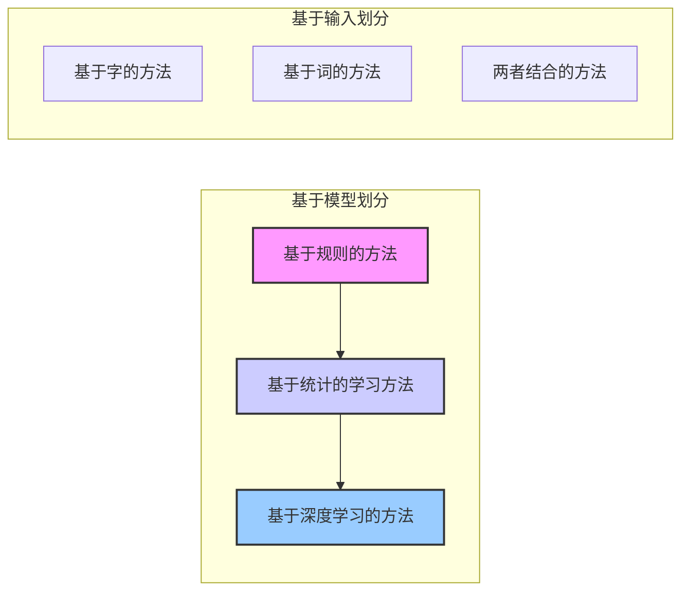

#### BiLSTM-CRF模型结构

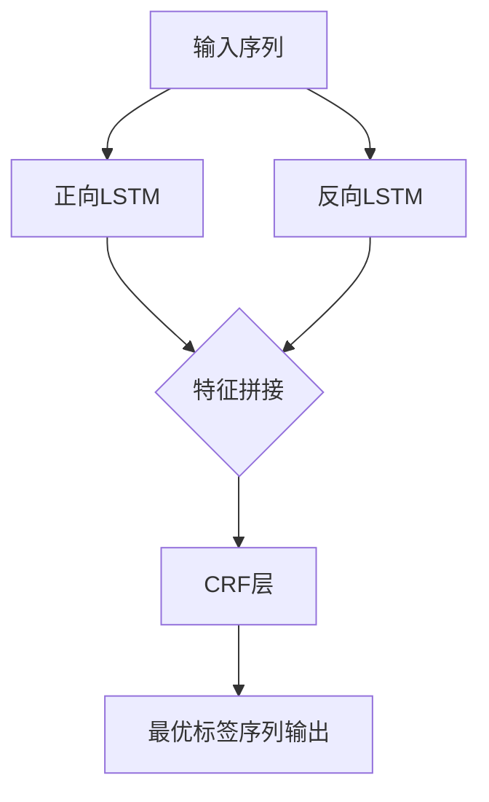

#### 语义网体系结构

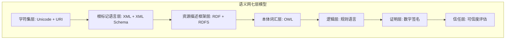

### 5. 经典金句 / 数据
> “知识表示与知识建模是构建知识图谱的基础和准备工作。”
> “BiLSTM-CRF模型在序列标注任务中具有广泛的应用，特别适用于命名实体识别。”
> “Neo4j是世界上目前最流行的图数据库之一。”
> “知识融合是指将不同来源的知识进行整合和合并，以形成更全面、一致和准确的知识表示。”
> “TransE作者提出了一种将实体和关系嵌入到低维向量空间中进行计算的建模方法，是基于距离建模的开山之作。”

---

## 第3章：知识图谱的应用

### 1. 核心论点
**问题 → 观点：** 本章旨在展示知识图谱“有什么用”。作者认为，知识图谱的核心应用主要集中在知识库问答（KBQA）和基于图谱的推荐系统两大领域，通过提供精准答案和个性化推荐，显著提升用户体验和系统性能。

### 2. 关键概念 / 关键事件
- **知识库问答 (KBQA)：** 基于知识库的问答系统，通过对自然语言问题的理解和解析，利用知识库进行查询和推理，返回准确的答案。
- **KBQA构建方法：** 主要包括三种：基于模板匹配（如TBSL）、基于语义解析（如SEMPRE）、基于向量建模（如Subgraph Embeddings）。
- **推荐系统：** 旨在帮助用户找到感兴趣的内容，解决信息过载问题。主流的推荐算法包括基于内容的推荐、基于协同过滤的推荐（User-based, Item-based, Model-based）及混合推荐。
- **基于知识图谱的推荐：** 利用知识图谱作为辅助信息源，解决传统推荐系统的数据稀疏性和冷启动问题。主要方法分为基于嵌入的推荐（如DKN模型）和基于路径的推荐（如PathSim算法）。

### 3. 逻辑推演 / 叙事脉络
本章分为两大块。第一块（3.1节）聚焦于知识库问答，介绍了KBQA的三种主流构建方法：模板匹配、语义解析和向量建模。通过引用TBSL、QUINT、SEMPRE等经典模型，详细阐述了每种方法的流程、优缺点和适用场景。特别详细拆解了Jonathan Berant等人的语义解析论文中的词汇映射、桥接和建模过程。第二块（3.2节）聚焦于推荐系统，首先回顾了传统推荐算法（基于内容、协同过滤），指出其数据稀疏和冷启动问题。然后，引出知识图谱作为辅助信息的优势（精确性、多样性、可解释性），并详细介绍了基于嵌入的推荐（TransE, TransH, TransR, TransD模型）和基于路径的推荐（PathSim算法）。最后，通过DKN新闻推荐模型等案例，展示了知识图谱在实际推荐场景中的应用效果。

### 4. 流程图（重建）

#### 基于知识图谱的语义解析流程

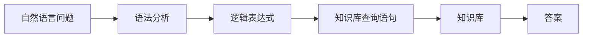

#### DKN模型框架

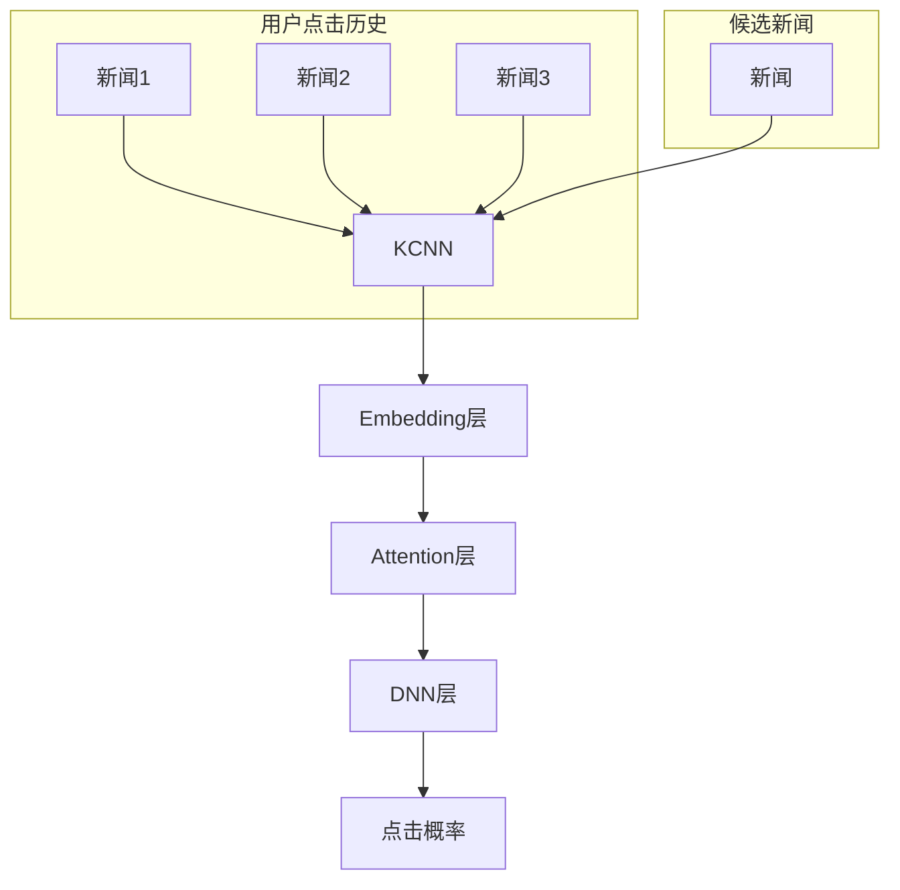

### 5. 经典金句 / 数据
> “基于知识图谱的问答系统成为各行各业的焦点。”
> “在知识图谱中，实体表示节点，关系表示边。从节点出发，具有精确性；从边出发，具有多样性。”
> “DKN将知识图谱实体嵌入与神经网络融合起来，旨在解决已知用户新闻标题的点击历史，预测接下来要点击哪一条新闻。”

---

## 第4章：数据采集与数据处理

### 1. 核心论点
**问题 → 观点：** 本章解决“构建知识图谱的数据从哪里来，以及如何准备”的问题。作者认为，数据是知识图谱的燃料，需要通过爬虫等技术采集，并根据数据类型（结构化、半结构化、非结构化）进行相应的处理，为知识抽取打下基础。

### 2. 关键概念 / 关键事件
- **网络爬虫：** 模拟用户在浏览器或应用上的操作，自动抓取互联网信息的程序。分为通用爬虫（搜索引擎）和聚焦爬虫（定向采集）。
- **静态/动态网页采集：** 静态网页直接请求HTML解析；动态网页（Ajax）需通过抓包分析接口或使用无头浏览器（Selenium, Pyppeteer）渲染。
- **反爬虫技术：** 网站用来阻止爬虫的策略，包括：请求频率限制（封IP）、请求头校验、Cookie验证、验证码（图形/行为/短信）、字体反爬、JS逆向、App逆向等。
- **结构化/半结构化/非结构化数据：** 结构化数据（如关系型数据库中的表），半结构化数据（如JSON, XML），非结构化数据（如纯文本、PDF、图片）。
- **Scrapy框架：** 一个使用Python开发的快速、高层次、轻量级的爬虫框架，包含引擎、调度器、下载器、爬虫、管道等核心模块。

### 3. 逻辑推演 / 叙事脉络
本章分为数据采集和数据处理两大部分。在数据采集部分（4.1节），首先介绍了爬虫的基本原理和流程。接着，分别讲解了网页爬虫（静态和动态，并提供了网易新闻和Selenium的代码示例）和App爬虫（以MuMu模拟器和Charles抓包为例）。然后，深入探讨了反爬虫技术及其应对策略，包括IP封锁、验证码识别、字体反爬和JS/App逆向。最后，介绍了Scrapy框架的结构和使用方法。在数据处理部分（4.2节），作者分类讲解了如何处理结构化数据（如MySQL）、半结构化数据（如JSON）和非结构化数据（如PDF），并提供了相应的Python代码示例。

### 4. 流程图（重建）

#### Scrapy数据流

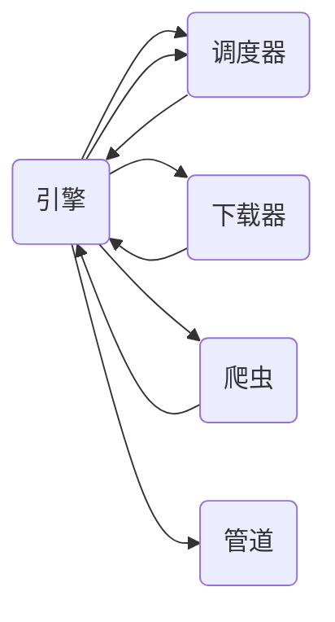

#### 字体反爬解决思路

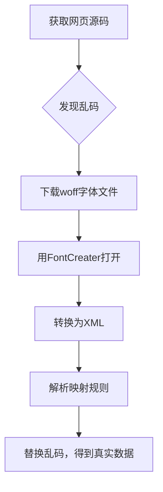

### 5. 经典金句 / 数据
> “爬虫与反爬虫技术的策略不断升级。”
> “验证码通常有图形验证码、行为验证码、短信验证码这3种。”
> “Scrapy是目前较流行的爬虫框架之一。”

---

## 第二篇 代码实践篇

## 第5章：知识抽取

### 1. 核心论点
**问题 → 观点：** 本章聚焦于如何通过代码实现知识抽取中的核心任务——实体抽取和关系抽取。作者强调，基于深度学习的模型（特别是BERT及其变体）是目前命名实体识别（NER）和关系抽取的主流方法，并提供了使用Hugging Face Transformers和PaddleNLP等工具库进行实战的详细指南。

### 2. 关键概念 / 关键事件
- **命名实体识别 (NER)：** 从文本中识别和分类实体（人名、地名、组织名等）。模型经历了从RNN、LSTM到BiLSTM-CRF，再到BERT-BiLSTM-CRF的演进。
- **BiLSTM-CRF：** 经典序列标注模型。BiLSTM利用上下文信息，CRF层通过状态转移矩阵对标签序列进行全局优化，确保标签预测的合法性。
- **BERT (Bidirectional Encoder Representations from Transformers)：** 谷歌2018年发布的深度双向预训练Transformer模型。通过Masked LM和Next Sentence Prediction两个任务预训练，可在下游任务中微调，开启NLP新时代。
- **关系抽取：** 从文本中识别实体之间的语义关系。主流方法包括流水线（Pipeline）和联合学习（Joint Learning），后者能有效避免错误传递。
- **CasRel模型：** 一种新颖的级联二进制标记框架，通过先抽取头实体，再为每个关系标记尾实体，有效解决一个句子中包含多个关系三元组（尤其是重叠问题）的情况。

### 3. 逻辑推演 / 叙事脉络
本章详细展开知识抽取的代码实战。5.1节深入NER任务，从RNN、LSTM的原理讲起，过渡到BiLSTM-CRF，最后聚焦于BERT模型。作者不仅解释了Transformer的Encoder-Decoder结构、Self-Attention机制，还通过Hugging Face平台的完整代码示例，演示了如何使用BERT进行NER任务的微调训练和预测。5.2节转向关系抽取，首先对比了流水线和联合学习两种模式，然后重点介绍了CasRel模型，展示了其在处理重叠三元组问题上的优势。最后，提供了基于百度PaddleNLP工具库的关系抽取实战代码，涵盖了从数据加载、模型构建（ERNIE）、训练到预测的全流程。

### 4. 流程图（重建）

#### BI-LSTM-CRF模型结构

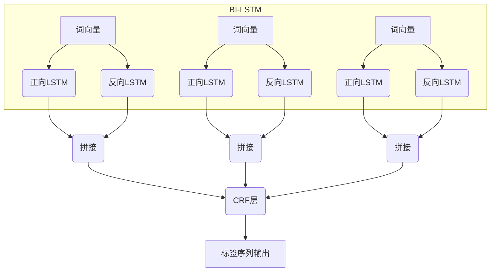

#### Transformer模型整体结构

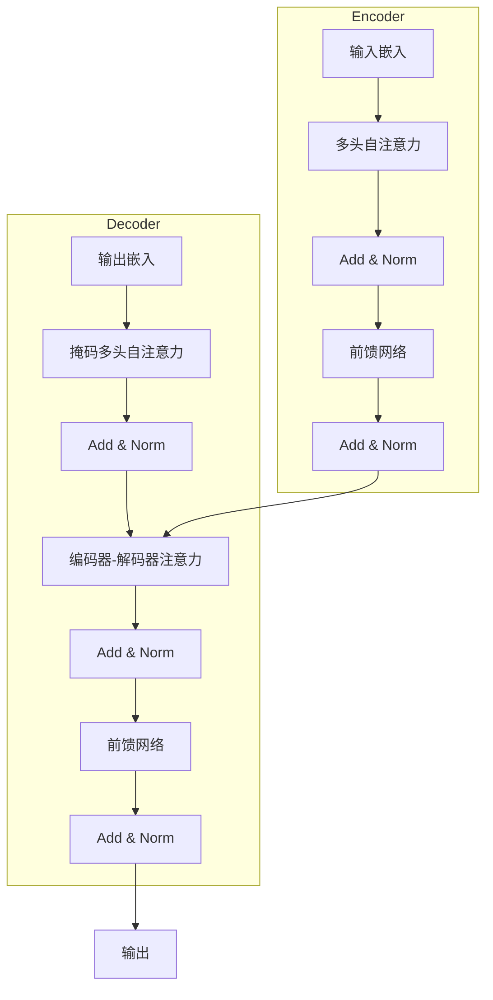

### 5. 经典金句 / 数据
> “BiLSTM-CRF模型在NER标注任务上的效果好于其他几种模型。”
> “Bert从谷歌2018年发表至今，由于在自然语言处理任务中表现出的杰出效果，因此在NLP领域被广泛应用。”
> “BERT是一种基于语义理解的深度双向预训练Transformer模型。”
> “CasRel以一种新的视角来重新审视经典的关系三元组抽取问题，从而实现了不受重叠三元组问题的困扰（如两个实体多种关系）。”

---

## 第6章：知识存储

### 1. 核心论点
**问题 → 观点：** 本章旨在解决“知识构建好后存在哪里”的问题。作者认为，图数据库（特别是Neo4j）是存储知识图谱的最佳选择，并提供了从安装部署、查询语言（Cypher/SPARQL）到Python代码操作（Py2neo/pyodbc）的完整实践指南。

### 2. 关键概念 / 关键事件
- **Neo4j：** 最流行的原生图数据库，采用属性图模型，使用专用的Cypher查询语言。提供社区版（单机）和企业版（分布式）。
- **Cypher：** Neo4j的图查询语言，声明式、受SQL启发，使用ASCII艺术语法描述图中的视觉模式（如`(p:Person)-[:WIFE]->(q:Person)`）。
- **Virtuoso：** 一个高性能的对象关系SQL数据库，同时也是一款商业RDF三元组存储系统，支持SPARQL查询语言。为DBpedia等大规模知识图谱提供支持。
- **SPARQL：** 由W3C推荐的RDF查询语言，用于检索和操作RDF格式的数据。支持SELECT, CONSTRUCT, ASK, DESCRIBE等查询形式。
- **Py2neo：** 一个用于Python的Neo4j图数据库驱动程序，提供了面向对象的API来操作图数据。

### 3. 逻辑推演 / 叙事脉络
本章对比了两种主流的知识存储工具。6.1节重点介绍Neo4j，包括其安装、Cypher语言的增删改查操作（CREATE, MATCH, DELETE, SET），以及如何使用Python的Py2neo库进行交互。6.2节转向Virtuoso，介绍了其安装配置、SPARQL查询语言的使用方法（通过DBpedia在线示例），以及如何通过Python的pyodbc和SPARQLWrapper库进行访问。最后，通过两个案例展示了知识存储的实际应用：使用Neo4j存储和查询OpenKG中的红楼梦人物图谱，以及使用Virtuoso存储和查询旅游景点知识图谱。

### 4. 流程图（重建）

#### Neo4j属性图模型

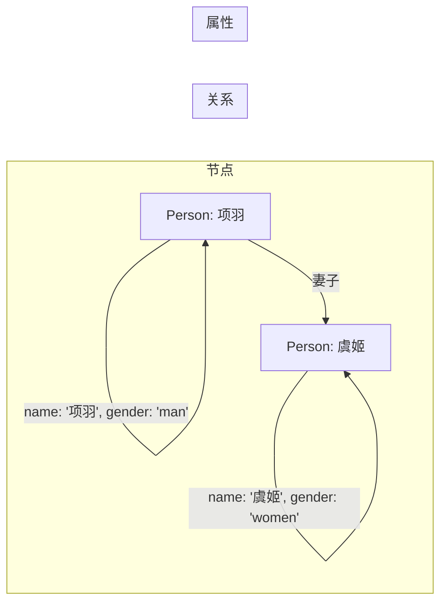

### 5. 经典金句 / 数据
> “相较于关系型数据库复杂的join等操作，在图数据库中，关系以更加灵活的方式与节点（数据元素）一起存储在本地，且针对快速遍历数据进行了优化。”
> “Cypher的设计易于所有人学习、理解和使用，同时也融合了其他标准数据访问语言的强大功能。”
> “SPARQL语言已被万维网联盟（W3C）正式推荐，并广泛认可为语义网的核心技术之一。”

---

## 第7章：知识图谱构建

### 1. 核心论点
**问题 → 观点：** 本章是全书实践的顶峰，通过一个完整项目（基于百度百科的名人知识图谱）来串联所有知识点。作者展示了从数据采集（爬虫）、数据存储（Neo4j）、后端接口（Flask）到前端可视化（Vue.js + relation-graph）的全流程开发，构建了一个功能完备的知识图谱应用。

### 2. 关键概念 / 关键事件
- **项目流程：** 完整的知识图谱构建项目包括：1) 数据采集，2) 数据入图数据库，3) 数据接口提供，4) 前端可视化。
- **数据采集：** 本项目使用Selenium采集百度百科的名人词条，包括人物简介、基本信息（basicinfo）和人物关系（peoplerelations）。
- **数据入库：** 使用Cypher的MERGE语句结合Py2neo将实体（Celebrity标签）和关系导入Neo4j。
- **后端接口：** 使用Flask和Flask-RESTful构建RESTful API，提供实体属性查询（`/star/attribute`）和关系查询（`/star/relationship`）接口。
- **前端可视化：** 基于Vue.js框架，使用vue-d3-graph和relation-graph组件库，实现知识图谱的2D可视化展示和交互式搜索。

### 3. 逻辑推演 / 叙事脉络
本章按照实际项目开发流程组织。首先（7.1.1节），详细描述了如何使用抓包工具分析百度百科接口，并编写爬虫采集名人数据（包括列表页和详情页）。接着（7.1.2节），展示了如何清洗和转换采集到的JSON数据，并使用Cypher语言和Py2neo库将实体和关系存入Neo4j图数据库。然后（7.1.3节），介绍了如何使用Flask框架开发后端服务，为前端提供JSON格式的数据接口。最后（7.2节），讲解了基于Vue.js和relation-graph的前端可视化项目的搭建、配置和运行，实现了在网页中搜索、展示和探索名人知识图谱的功能。

### 4. 流程图（重建）

#### 名人知识图谱构建流程

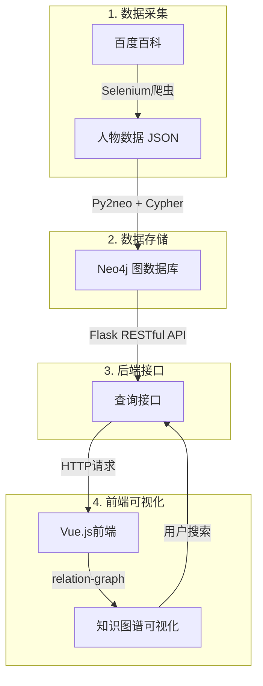

### 5. 经典金句 / 数据
> “数据采集是知识图谱构建流程中非常重要的一步，它通常属于知识图谱构建流程的第一步，即知识获取阶段。”
> “实体节点查询数量为5139。关系查询数量为11870。”（基于采集的名人数据）
> “Flask是一种Python Web框架，它提供了一系列工具和库，用于快速创建Web应用程序。在知识图谱可视化项目中，Flask可以用于搭建数据接口，为前端提供数据访问服务。”

---

## 第8章：知识图谱与大语言模型

### 1. 核心论点
**问题 → 观点：** 本章前瞻性地探讨了知识图谱（KG）与大语言模型（LLM）的关系。作者认为，两者并非替代关系，而是互补和协同的。KG增强LLM的知识和可解释性，LLM增强KG的构建和推理能力，二者的统一是未来人工智能发展的重要方向。

### 2. 关键概念 / 关键事件
- **大语言模型 (LLM)：** 基于深度学习、参数规模庞大（数十亿到数千亿）的神经网络模型，通过在海量文本上预训练，具备强大的语言理解和生成能力。代表模型有ChatGPT (GPT-4)、GLM系列等。
- **KG增强的LLM：** 利用KG的结构化知识来提升LLM的性能。包括：在预训练阶段注入KG知识（如ERNIE）、在推理阶段动态融合KG（如GreaseLM）、使用KG增强LLM的可解释性（如LAMA, 知识神经元）。
- **LLM增强的KG：** 利用LLM的强大能力来处理与KG相关的任务。包括：LLM增强KG嵌入（如Pretrain-KGE）、KG补全（如KG-S2S, AutoKG）、KG构建、KG到文本生成、KG问答等。
- **协同的LLM+KG：** 构建统一框架，使LLM和KG相互协同。LLM利用KG进行推理和语义理解，KG利用LLM来丰富和解释知识。
- **ChatGLM-6B：** 清华大学和智谱AI研发的开源中英双语对话模型，基于GLM架构，支持在消费级显卡上本地部署（6GB显存）。

### 3. 逻辑推演 / 叙事脉络
本章分为两大块。8.1节主要介绍大语言模型，以ChatGPT为例展示了其在文本生成、问答、代码编写等方面的强大能力，并通过对比GPT系列和BERT的架构，解释了双向语言模型的优势。随后，以GLM系列为例，详细演示了如何本地部署开源大模型（ChatGLM-6B, VisualGLM-6B），包括环境配置、CUDA安装、模型下载和API调用。8.2节是核心，系统论述了KG与LLM的融合。作者通过“KG增强的LLM”和“LLM增强的KG”两个角度，引用了大量前沿研究论文，展示了如何用KG解决LLM的“幻觉”和可解释性问题，如何用LLM解决KG的稀疏和构建难题。最后，提出了一个协同的LLM+KG统一框架，并展望了未来，认为LLM将重塑知识工程的研究范式。

### 4. 流程图（重建）

#### 统一KG和LLM的路线图

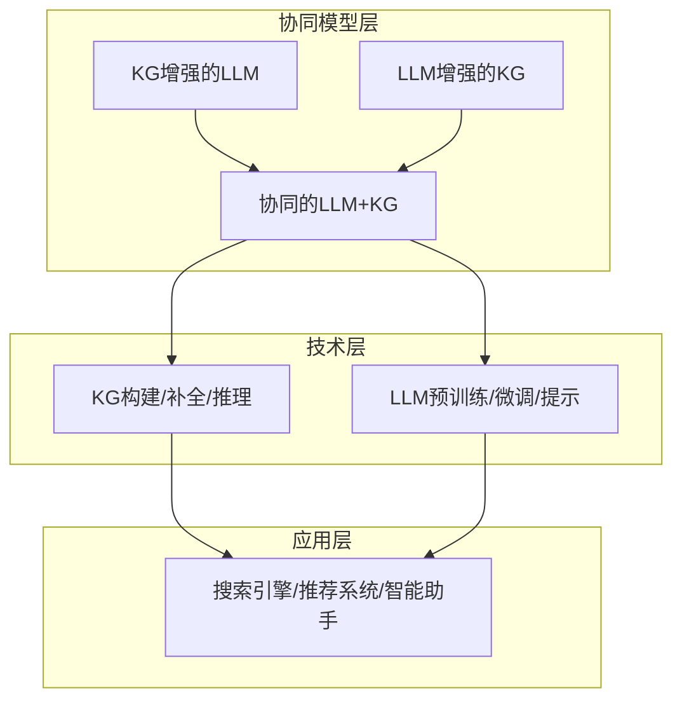

#### 从LLM中提取KG的总体框架

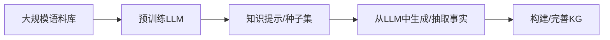

### 5. 经典金句 / 数据
> “大语言模型是当前人工智能和自然语言处理领域中最重要的研究和产业方向之一。”
> “截至2023年6月，国内已有接近百家大模型发布，且大多数都已开源。”
> “尽管当前知识图谱在解释性和知识扩展性等方面相对于大语言模型仍具有优势，但与生成式人工智能技术的快速发展相比，以知识图谱为代表的大数据时代的知识工程研究范式必将被重新塑造。”
> “LLM和KG是两种本质上互补的技术，它们应该被统一到一个通用的框架中，相互协同，以提高整体性能。”