# 《知识图谱实战：构建方法与行业应用》章节总结

## 书籍信息
- **书名**：知识图谱实战：构建方法与行业应用
- **作者**：于俊；李雅洁；彭加琪；程知远
- **出版社**：机械工业出版社
- **出版时间**：2023年1月
- **ISBN**：9787111721642
- **字数**：157千字
- **PDF/OCR状态**：基于EPUB提取文本，内容完整，图表以文本描述形式存在，部分图片引用无法还原视觉样式，但逻辑关系可提炼。
- **目录识别情况**：完整识别，包含基础篇（第1章）、构建篇（第2-8章）、实践篇（第9-16章），以及前言、致谢等。

## 全书核心主题
本书系统讲解知识图谱的构建方法、核心技术及行业应用。全书分为基础篇、构建篇、实践篇三大部分。基础篇介绍知识图谱的定义、分类、发展阶段及架构；构建篇详细展开知识抽取、知识表示、知识融合、知识存储、知识建模、知识推理、知识评估与运维等全流程技术；实践篇则通过智能搜索、图书推荐、开放领域问答、交通/汽车/金融领域问答与决策等具体案例，展示知识图谱在真实场景中的落地方法。作者强调“临渊羡鱼，不如退而结网”，倡导读者从实践中掌握知识图谱的构建与应用。

---

## 前言

### 核心论点
知识图谱是人工智能的底层支撑技术，能够帮助机器理解现实世界中复杂、相互联结的数据，成功应用于智能搜索、推荐、问答、推理决策等领域。作者希望通过本书帮助读者系统学习知识图谱构建技术，降低学习成本，推动行业应用。

### 关键概念
- **知识图谱**：基于现实世界的概念、实体、关系、属性构建的结构化知识网络。
- **构建技术**：包括知识抽取、表示、融合、存储、建模、推理、评估等。
- **行业应用**：智能搜索、推荐系统、知识问答、推理决策等。

### 逻辑推演
作者从2019年大数据赋能业务的实践出发，发现业务需求集中在数据治理与知识图谱。在编辑建议下编写本书，秉持“大道至简”原则，统筹概念并给出应用案例。本书结构安排为基础篇、构建篇、实践篇，层层推进，便于读者学习与落地。

### 经典金句
> “临渊羡鱼，不如退而结网。” ——《汉书·董仲舒传》

> “本书只是一个开始，如何基于海量数据使用知识图谱技术解决更多业务问题，还需要无数的知识图谱从业人员前赴后继。”

---

## 基础篇

## 第1章：理解知识图谱

### 1. 核心论点
本章解决“什么是知识图谱”以及“知识图谱能做什么”的问题。作者认为知识图谱是一种基于图的、结构化的知识表示方法，能够帮助人工智能理解现实世界中的复杂数据，是智能搜索、推荐、问答、推理决策等应用的核心驱动力。

### 2. 关键概念
- **知识**：人类通过观察、学习获得的事实、概念、规则集合，需满足合理性、真实性、被相信三个条件。
- **知识图谱**：以结构化形式描述现实世界中的实体及其关系，形成有向图，节点表示概念/实体，边表示语义关系。
- **通用知识图谱 vs 领域知识图谱**：前者面向通用领域（如DBpedia、Wikidata），强调广度；后者面向特定行业（如金融、医疗），强调准确性和深度。
- **自顶向下 vs 自底向上构建**：自顶向下先定义本体模式再添加实体；自底向上从实体归纳出概念层次。
- **概念层 vs 数据层**：概念层通过本体库管理，定义知识类别、关系、属性；数据层存储具体事实（三元组）。

### 3. 逻辑推演
本章从知识定义出发，引出知识图谱的定义与分类。回顾知识图谱的三个发展阶段（20世纪50年代起源、2006年语义Web繁荣、2012年谷歌提出并广泛应用）。然后阐述知识图谱的逻辑架构（概念层+数据层）和技术架构（数据获取→知识抽取→知识表示→知识融合→知识建模→知识推理→知识存储/计算/评估/运维）。最后介绍学术界与工业界现状，以及智能搜索、推荐系统、知识问答、推理决策四大应用场景。

### 4. 方法流程图

#### 知识图谱构建过程

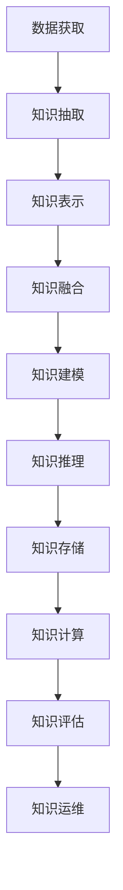

### 5. 经典金句/数据
> “知识图谱就是一张网，一张基于现实世界的概念、实体、关系、属性构建起来的结构化知识网络。”

> “据艾瑞咨询估算，预计到2024年知识图谱市场规模将突破1000亿元。”

---

## 构建篇

## 第2章：知识抽取

### 1. 核心论点
本章解决“如何从不同结构的数据源中提取出实体、关系、属性等知识要素”的问题。作者认为知识抽取是知识图谱构建的第一步，通过自动化或半自动化技术从非结构化、半结构化、结构化数据中提取结构化知识，为后续构建奠定基础。

### 2. 关键概念
- **实体抽取（命名实体识别）**：从文本中识别出专有名词（人名、地名、机构名等）和时间、数量等实体指称。
- **实体链接**：将文本中的实体指称映射到知识库中正确的实体对象，包括实体消歧（同名不同实体）和共指消解（不同指称指向同一实体）。
- **关系抽取**：从文本中抽取出两个或多个实体之间的语义关系，形成三元组。
- **属性抽取**：抽取实体的属性-属性值对，可转化为关系抽取任务。
- **事件抽取**：抽取发生在特定时间、地点、由多个角色参与的动作或状态变化，包括触发词识别、事件类型分类、论元识别、角色分类。

### 3. 逻辑推演
本章先定义知识抽取及其任务（实体、链接、关系、属性、事件抽取）。然后按数据结构类型分类讲解抽取方法：面向结构化数据（关系型数据库映射为RDF，如D2R、R2RML），面向半结构化数据（使用包装器、XPath等），面向非结构化数据（采用机器学习、深度学习模型，如CRF、LSTM+CRF、BERT等）。最后以Deepdive工具为例，给出抽取公司股权交易关系的完整实例。

### 4. 方法流程图

#### 知识抽取架构

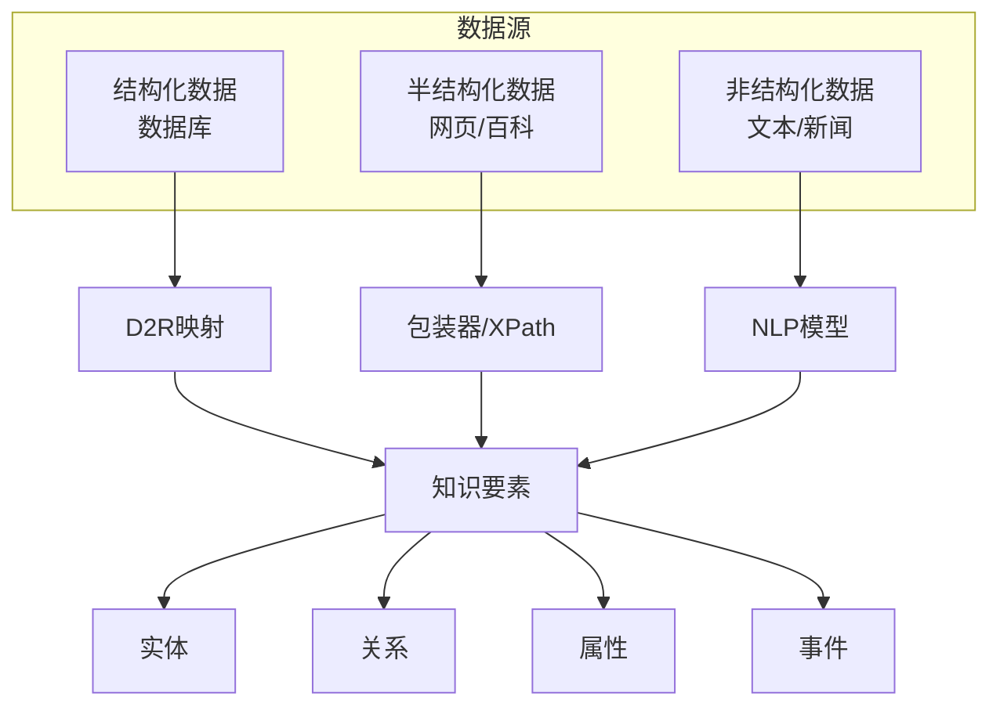

### 5. 经典金句/数据
> “博学之，审问之，慎思之，明辨之，笃行之。” ——《礼记·中庸》

> “Deepdive是由斯坦福大学InfoLab实验室开发的一个开源知识抽取系统，通过弱监督学习从非结构化文本中抽取结构化的关系数据。”

---

## 第3章：知识表示

### 1. 核心论点
本章解决“如何将抽取到的知识转换成机器可识别和处理的形式”的问题。作者认为知识表示是知识工程的关键，分为基于符号的表示（如RDF、RDFS、OWL）和基于向量的分布式表示（如TransE、TransH、DistMult等），后者能解决大规模知识图谱的稀疏性和语义计算问题。

### 2. 关键概念
- **RDF（资源描述框架）**：以三元组（主语、谓语、宾语）形式描述资源和关系。
- **RDFS/OWL**：RDF Schema定义类和属性；OWL扩展更多约束（传递性、对称性、逆关系等），支持复杂本体建模。
- **分布式表示（知识图谱嵌入）**：将实体和关系映射到低维连续向量空间，便于数值计算和深度学习集成。
- **平移模型（Trans系列）**：将关系看作头实体到尾实体的平移，如TransE: h + r ≈ t。
- **组合模型**：如RESCAL、DistMult，使用张量分解或矩阵运算。
- **神经网络模型**：如NTN、SME，使用神经网络拟合三元组得分。

### 3. 逻辑推演
先回顾早期知识表示方法（一阶谓词逻辑、产生式规则、语义网络、框架表示法），然后重点介绍语义网标准（RDF、RDFS、OWL）及其序列化格式。接着指出符号表示在规模大、稀疏性、语义计算方面的不足，引出基于向量的分布式表示。详细讲解平移模型（TransE、TransH、TransR等）、组合模型（RESCAL、LFM、DistMult、HOLE）和神经网络模型（SE、SME、NTN等）。最后通过D2RQ工具演示将MySQL数据转为RDF三元组。

### 4. 流程图

#### RDF三元组结构

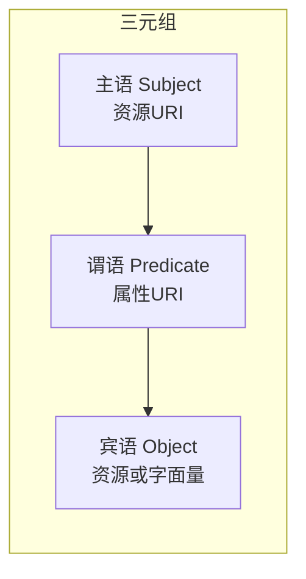

### 5. 经典金句/数据
> “合抱之木，生于毫末；九层之台，起于累土；千里之行，始于足下。” ——《老子》

> “知识图谱的分布式表示旨在将知识图谱中的实体和关系表示到连续的向量空间中。”

---

## 第4章：知识融合

### 1. 核心论点
本章解决“如何将来自多个数据源的知识整合成统一、一致的知识图谱”的问题。作者认为知识融合包括概念层的本体对齐和数据层的实体对齐，通过相似度计算、冲突检测、真值发现等技术消除异构、重复和歧义。

### 2. 关键概念
- **本体对齐**：发现不同本体中等价或相似的类、属性、关系，常用方法有字符串比较（Jaro-Winkler）、路径结构（锚点提示）、实例方法（GLUE）等。
- **实体对齐**：发现现实世界中同一对象的不同实例，包括属性相似度计算（编辑距离、Jaccard、TF-IDF）和实体相似度计算（加权平均、聚类、嵌入式表示学习）。
- **分块索引**：在大规模实体对齐中减少比较对数的技术。
- **冲突检测与真值发现**：后处理阶段消除矛盾，保留置信度高的知识。

### 3. 逻辑推演
先定义知识融合的概念和必要性（多源异构、质量参差、重复歧义）。然后分别介绍本体对齐和实体对齐的方法及流程。本体对齐重点讲解基于字符串（Jaro-Winkler）、基于路径（锚点提示）、基于实例（GLUE）的方法。实体对齐则从属性相似度（编辑距离、Jaccard、向量余弦）和实体相似度（聚合、聚类、嵌入式表示学习）展开。最后以Python工具Dedupe为例，演示从多个CSV文件中识别重复实体的完整流程。

### 4. 流程图

#### 知识融合任务执行流程

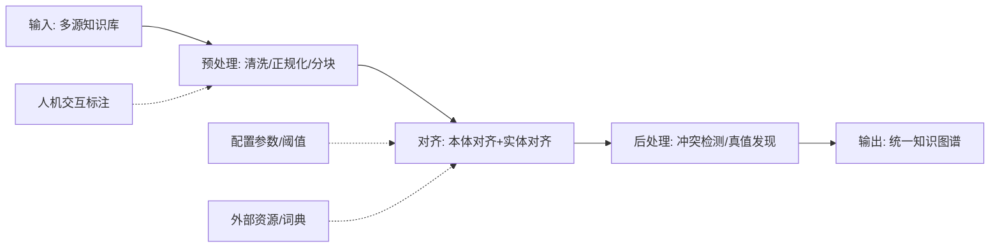

### 5. 经典金句/数据
> “操千曲而后晓声，观千剑而后识器。” ——《文心雕龙》

> “Dedupe是一个Python库，用于对结构化数据进行重复记录检测和实体融合。”

---

## 第5章：知识存储

### 1. 核心论点
本章解决“如何高效存储大规模、关系复杂的知识图谱数据”的问题。作者认为没有统一的存储方式，需根据数据特点选择关系型数据库、NoSQL（列式、文档、图数据库）或分布式存储，其中图数据库（如Neo4j）对关系查询和推理最为高效。

### 2. 关键概念
- **RDBMS存储方案**：三列表、水平表、属性表、全索引表，各有优缺点（自连接、稀疏性、扩展性）。
- **NoSQL存储**：列式存储（HBase）、文档存储（MongoDB+JSON-LD）、图存储（Neo4j属性图、gStore的RDF图、超图）。
- **属性图**：由顶点、边、属性、标签组成，Neo4j为代表。
- **RDF图**：实体与属性值都是节点，便于属性值查询。
- **分布式存储**：如RDFPeers（P2P）、YARS2（集群）、4Store（分段），以及基于Hadoop/HBase/Spark的云方案。

### 3. 逻辑推演
从知识存储的定义和任务出发，分析关系型数据库存储RDF的多种方案及其问题（自连接、稀疏性）。然后介绍NoSQL的三大分支：列式（HBase解决列数限制和稀疏问题）、文档（JSON-LD序列化后存MongoDB）、图存储（属性图、RDF图、超图）。对比各方案优缺点，并提及分布式和云端方案。最后给出实践：使用Apache Jena（TDB+Fuseki）存储RDF，以及用Neo4j的py2neo和import命令批量导入电影数据。

### 4. 流程图

#### 知识存储方案分类

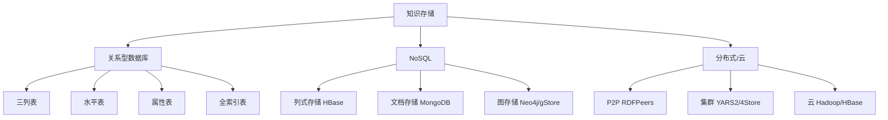

### 5. 经典金句/数据
> “且夫水之积也不厚，则其负大舟也无力。” ——《庄子·逍遥游》

> “Neo4j是一个高性能的NoSQL图形数据库，采用的是属性图结构。”

---

## 第6章：知识建模

### 1. 核心论点
本章解决“如何设计知识图谱的数据模式（Schema），即定义概念、属性、关系以及层次结构”的问题。作者认为高质量的数据模式（本体）能有效组织数据、降低融合成本，是知识图谱构建的基础。建模方式有自顶向下（专家定义）、自底向上（从数据归纳）以及手工/半自动/自动方法。

### 2. 关键概念
- **本体（Ontology）**：概念模型，明确、形式化、共享的规范，用于描述领域知识的类、属性、关系。
- **自顶向下建模**：先由专家定义顶层概念，再细化到子类和实例。
- **自底向上建模**：从实体数据中归纳出概念层次，再抽象出本体。
- **七步法**：手工建模的标准流程（明确领域→复用→列出元素→分类体系→定义属性→约束条件→创建实例）。
- **自动建模**：利用实体并列关系相似度计算、上下位关系抽取、聚类生成本体，如Microsoft Probase。

### 3. 逻辑推演
先定义知识建模及其任务（本体建模+知识表示建模）。比较自顶向下和自底向上两种构建方式。然后详细讲解手工建模的七步法（以神经网络知识图谱为例）。介绍半自动和自动建模方法（实体相似度、上下位抽取、LDA聚类）。最后用Protégé/WebProtégé工具演示创建神经网络知识图谱的本体和实例。

### 4. 流程图

#### 本体构建总流程

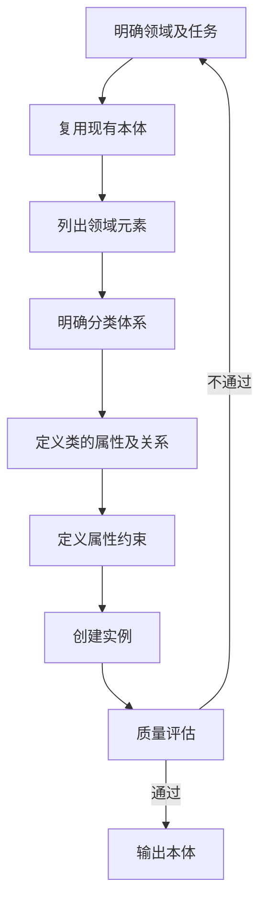

### 5. 经典金句/数据
> “不以规矩，不成方圆。” ——《孟子·离娄章句上》

> “Probase是Microsoft推出的本体库，包含千万级概念，准确率高达92.8%。”

---

## 第7章：知识推理

### 1. 核心论点
本章解决“如何从已有知识中挖掘隐含知识，补全和纠错知识图谱”的问题。作者认为知识推理可通过逻辑规则、表示学习、神经网络或混合方法实现，能够预测缺失的实体、关系、属性，并验证三元组正确性。

### 2. 关键概念
- **基于逻辑规则的推理**：一阶谓词逻辑、描述逻辑（TBox+ABox）、马尔可夫逻辑网（概率图）、路径排序算法（PRA）。
- **基于知识表示学习的推理**：张量分解（RESCAL）、转移模型（TransE）等，通过向量计算预测新事实。
- **基于神经网络的推理**：NTN（神经张量网络）、IRN（隐式推理网络）等。
- **混合推理**：结合逻辑规则的可解释性和表示学习的计算效率，如RNN+PRA、强化学习+路径发现。
- **知识图谱补全与去噪**：推理的核心任务，包括实体预测、关系预测、属性预测和事实正确性判断。

### 3. 逻辑推演
先定义推理的任务（补全和去噪），指出知识图谱的不完备性（如Freebase中96%的人物缺少兄弟姐妹信息）。然后分类讲解四种推理方法：基于逻辑规则（一阶谓词、描述逻辑的一致性检测、马尔可夫逻辑网、PRA路径排序）；基于表示学习（张量分解PRESCAL、转移模型TransE）；基于神经网络（NTN、IRN）；混合推理（规则+表示学习、深度学习+路径）。最后通过Jena规则推理机实例，演示电影知识图谱中“喜剧演员”的推理。

### 4. 流程图

#### 马尔可夫逻辑网推理示例

```mermaid
graph LR
    A[Friends(A,B)=1] --> B[Smokes(A)=1]
    A --> C[Smokes(B)=1]
    B --> D[Cancer(A)=1]
    C --> E[Cancer(B)=1]
    
    style A fill:#f9f,stroke:#333
```

### 5. 经典金句/数据
> “察己则可以知人，察今则可以知古。” ——《吕氏春秋》

> “在Freebase知识库中，将近96%的人物对象缺少‘兄弟’或‘姐妹’信息。”

---

## 第8章：知识评估与运维

### 1. 核心论点
本章解决“如何评估知识图谱质量并持续维护”的问题。作者认为知识图谱构建的每一步都可能引入错误，需要在概念层（本体结构、语义、重用）和数据层（实体填充率、准确率）进行评估，并通过增量更新、版本管理、安全备份等运维手段保证知识图谱的可靠性和可用性。

### 2. 关键概念
- **概念层质量评估**：评估本体内聚度、层次深度、语法规范、冗余、应用性能等。
- **数据层质量评估**：评估实体、关系、属性的填充率和准确率，常用工具Flemming、Sieve。
- **知识运维**：包括增量数据更新（消息队列、工作流）、内容统计监控、知识审核与修正、版本管理、安全管理、容灾备份。

### 3. 逻辑推演
从“千里之堤溃于蚁穴”的比喻出发，强调质量评估的重要性。介绍概念层评估的方法（用户、任务、应用、原则、黄金标准、语料库、数据驱动、多指标）和工具（OntoManage、ODEVal、OntoQA、CORE、OOPS！）。数据层评估转化为知识图谱精炼（补全+错误检测），工具Flemming（权重打分）和Sieve（整合+评分）。最后讲解运维流程：增量更新（消息队列/工作流）、统计监控、审核修正、版本控制、安全权限、容灾备份。

### 4. 流程图

#### 知识质量评估流程

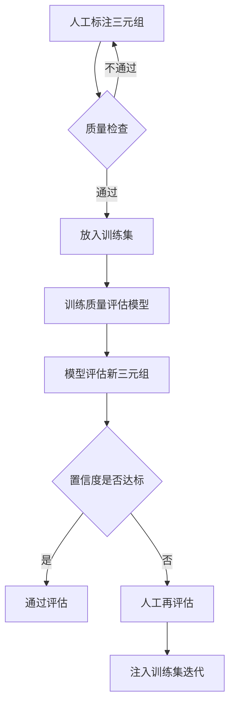

### 5. 经典金句/数据
> “千里之堤，溃于蚁穴。” ——《韩非子·喻老》

> “Flemming质量评估工具得分范围0-100分，分数越高说明数据质量越好。”

---

## 实践篇

## 第9章：知识问答评测

### 1. 核心论点
本章解决“如何评测知识图谱问答系统的效果”的问题。作者通过分析CCKS近三年（2020-2022）的问答评测任务（自然语言、生活服务、开放知识），总结出基于端到端、语义解析、信息检索三种技术方案，并给出了实体识别、链接、路径召回、排序等关键步骤的优化方法。

### 2. 关键概念
- **问答系统**：输入自然语言问句，基于知识图谱检索并返回答案。
- **问题分类**：按跳数（一跳/多跳）、查询类型（夹式/链式）分为6类。
- **技术方案**：端到端（直接匹配问题与三元组）、语义解析（转为逻辑图再转SPARQL）、信息检索（实体识别→链接→路径召回→排序）。
- **BERT+CRF**：实体识别常用模型。
- **对比学习**：用于路径排序，使用InfoNCE损失函数。

### 3. 逻辑推演
先定义问答系统及问题分类（一跳、夹式、多跳等）。然后介绍三类技术方案及其适用场景。接着详细分析CCKS 2020（百分点认知实验室方案，使用BERT+LSTM+CRF识别实体，孪生网络排序），2021（中科大+讯飞方案，加入LAC分词、MRC阅读理解、模板填充），2022（认知智能重点实验室方案，采用集束检索、对比学习、Roformer）。最后给出各年度评测结果（F1值0.901、实体识别率92%、冠军分数0.8413等）。

### 4. 流程图

#### 信息检索式问答流程

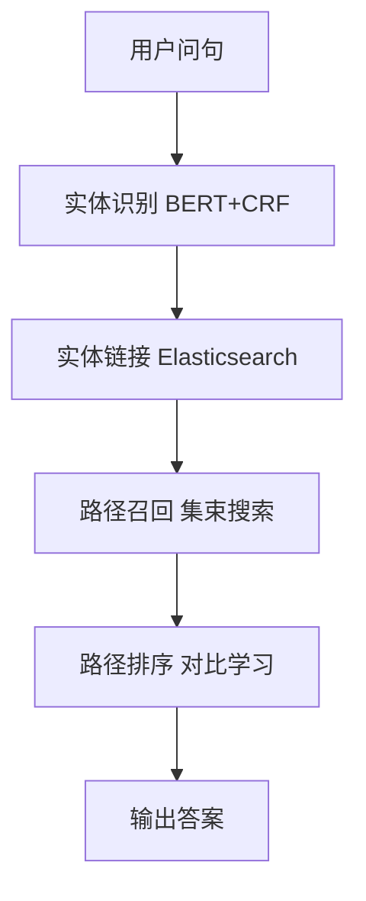

### 5. 经典金句/数据
> “失之毫厘，谬以千里。” ——《礼记·经解》

> “2022年开放知识图谱问答评测冠军方案获得了0.8413的分数。”

---

## 第10章：知识图谱平台

### 1. 核心论点
本章解决“如何通过平台化工具降低知识图谱构建和应用的门槛”的问题。作者认为一个好的知识图谱平台应提供一站式服务、集成基础能力、覆盖行业场景。以科大讯飞AiMind平台为例，展示数据管理、知识建模、知识抽取、知识融合、知识管理、知识应用等全生命周期功能。

### 2. 关键概念
- **知识图谱平台**：覆盖从数据接入到应用的全生命周期管理工具。
- **数字基础设施**：知识获取、建模、存储、推理等工具。
- **AiMind**：科大讯飞知识图谱平台，支持可视化建模、工作流抽取、规则/智能融合、表单/可视化管理、智能搜索/问答等。

### 3. 逻辑推演
先分析知识图谱平台建设背景（产业链、标准化白皮书）。提出好平台的三大功能：一站式服务、集成基础能力、行业场景解决方案。然后以AiMind为例，详细介绍各模块：数据管理（自建/爬虫/数据库/文件）、知识建模（表单+可视化概念树）、知识抽取（结构化D2R/工作流、半结构化解析、非结构化模型服务）、知识融合（手动合并、规则融合、智能融合）、知识管理（实体增删改查、可视化）、知识应用（智能搜索、智能问答、知识查询、路径发现）。

### 4. 流程图

#### 知识图谱平台功能架构（AiMind）

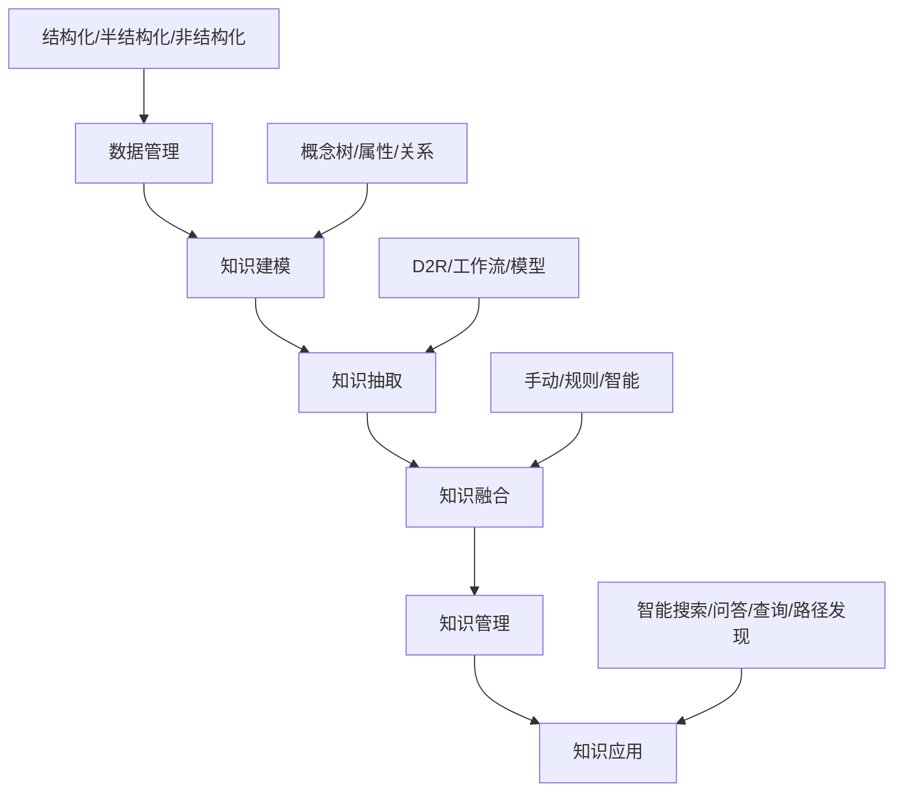

### 5. 经典金句/数据
> “知彼知己，百战不殆。” ——《孙子兵法·谋攻》

> “AiMind平台提供知识图谱的全生命周期管理，覆盖数据管理、知识建模、知识抽取、知识融合、知识管理、知识应用等模块。”

---

## 第11章：智能搜索实践

### 1. 核心论点
本章解决“如何基于知识图谱构建垂直领域的智能搜索引擎”的问题。作者以电影搜索为例，通过知识图谱实现语义理解和推理，并利用Elasticsearch进行全文检索，Jena进行知识推理，展示从数据获取到搜索和推理的完整流程。

### 2. 关键概念
- **垂直搜索引擎**：针对特定领域（如电影、汽车、医疗）的搜索引擎。
- **知识推理**：在Jena中使用OWL或自定义规则推理新事实（如“喜剧演员”）。
- **Elasticsearch**：全文搜索引擎，用于存储电影JSON数据并提供快速检索。
- **D2RQ**：将MySQL结构化数据转为RDF三元组。
- **TDB**：Jena的三元组数据库，用于存储RDF。

### 3. 逻辑推演
从智能搜索背景（谷歌Knowledge Graph）引入，设计电影搜索场景（查询电影介绍、演职人员、类型）。知识图谱设计包括电影、演员、类型三类实体及主演、属于等关系。模块设计分为问题处理（自然语言转SPARQL）和知识图谱模块（Jena推理+Elasticsearch搜索）。数据获取使用IBDM公开数据集（MySQL），通过D2RQ转为RDF，通过TDB存储。最后实现基于Jena的OWL推理和规则推理，以及基于Elasticsearch的索引和检索。

### 4. 流程图

#### 智能搜索技术架构

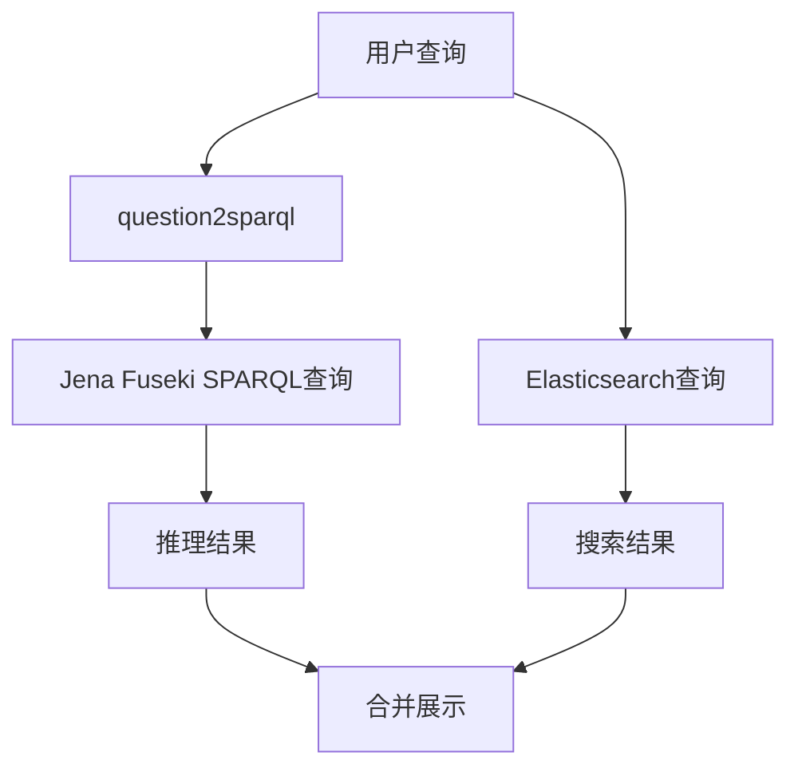

### 5. 经典金句/数据
> “褚小者不可以怀大，绠短者不可以汲深。” ——《庄子·至乐》

> “案例使用IBDM电影数据集，通过D2RQ将MySQL数据转为RDF，使用Jena TDB存储。”

---

## 第12章：图书推荐系统实践

### 1. 核心论点
本章解决“如何利用知识图谱作为辅助信息提升推荐系统的精确性、多样性和可解释性”的问题。作者以图书推荐为例，使用MKR（Multi-Task Feature Learning for Knowledge Graph Enhanced Recommendation）算法，将用户-图书交互矩阵与图书知识图谱联合训练，缓解冷启动和过拟合问题。

### 2. 关键概念
- **MKR算法**：多任务学习框架，同时训练推荐模型（用户-图书评分预测）和知识图谱嵌入模型（三元组预测），通过交叉压缩单元共享特征。
- **知识图谱嵌入**：将图书实体和关系映射到低维向量，用于计算相似度。
- **交叉压缩单元**：桥接推荐模型和KGE模型，使两个任务的图书向量互相增强。
- **冷启动**：新用户或新图书无历史交互时，知识图谱提供辅助信息。

### 3. 逻辑推演
先分析推荐系统面临的过拟合和冷启动问题，指出知识图谱作为辅助信息可以引入语义关联，提升效果。设计图书推荐场景：使用公开图书知识图谱数据（book_data.csv）和用户评分数据（ratings.dat）。知识图谱设计为（图书-关系-目标实体）三元组，关系包括语言、作者、出版社、风格等。数据预处理生成kg_final.txt和ratings_final.txt。然后介绍MKR算法原理（推荐模型+KGE模型+交叉压缩），并给出训练代码（train.py）和评估结果（AUC值）。最后呈现推荐系统交互界面，为用户推荐Top-N图书。

### 4. 流程图

#### MKR算法框架

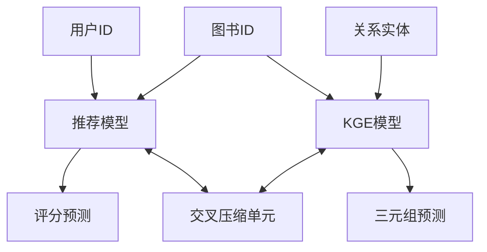

### 5. 经典金句/数据
> “大知闲闲，小知间间；大言炎炎，小言詹詹。” ——《庄子·齐物论》

> “MKR算法在图书数据集上取得了较高的AUC值，有效缓解了冷启动问题。”

---

## 第13章：开放领域知识问答实践

### 1. 核心论点
本章解决“如何构建一个能够回答开放领域问题的知识问答系统”的问题。作者采用基于信息检索的方法，通过实体识别与链接、候选答案生成、向量建模、余弦相似度排序，实现从自然语言问句到知识图谱答案的自动问答。

### 2. 关键概念
- **开放领域知识库**：包含百科类知识（如NLPCC数据集），以三元组形式存储。
- **实体识别与链接**：调用知识工厂API或使用Bi-LSTM+CRF模型识别问句中实体，并链接到知识库实体。
- **词向量**：使用中文维基百科预训练的SGNS词向量（300维），表示问句和答案。
- **向量建模**：将问句和候选答案映射到同一向量空间，通过余弦距离计算相似度。

### 3. 逻辑推演
先介绍问答系统发展历史（模板→IR→社区→知识图谱）。设计开放领域问答场景：使用NLPCC 2016数据集（16808个三元组，2228条指称）。知识图谱设计为（实体，属性，属性值）和（实体1，关系，实体2）。模块包括知识库存储（SQLite）、实体识别与链接（知识工厂API）、向量建模（Word2vec）、相似度计算。数据预处理将三元组和指称集存入数据库。问答实现：输入问句→实体识别→候选实体生成→候选答案生成→问句向量化（加权平均）→答案向量化→余弦排序→返回Top-5答案。最后展示问答结果（如“科大讯飞总部在哪里？”返回“中国合肥”）。

### 4. 流程图

#### 开放领域知识问答流程

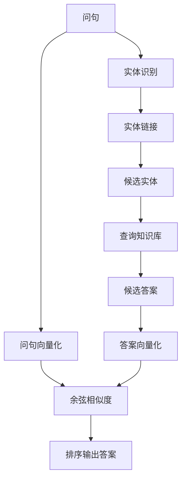

### 5. 经典金句/数据
> “大寒既至，霜雪既降，吾是以知松柏之茂也。” ——《庄子·让王》

> “使用中文维基百科预训练的300维词向量，问句通过词向量平均（加词性权重）得到句向量。”

---

## 第14章：交通领域知识问答实践

### 1. 核心论点
本章解决“如何将开放领域问答系统迁移到特定垂直领域（交通）”的问题。作者通过构建交通知识图谱（包含路口、通道、POI、症状、方案等概念），模拟真实交通数据，并调整实体识别和相似度计算模块，实现交通领域知识问答。

### 2. 关键概念
- **交通知识图谱**：包含路口、通道、标志建筑、交通症状（拥堵、失衡等）、解决方案等实体和关系。
- **本体建模**：使用Protégé软件定义概念树（如路口→症状→方案）。
- **自定义词典**：加载交通领域实体名到Jieba分词，提高实体识别准确率。
- **知识存储**：使用Neo4j存储三元组，供可视化查询。

### 3. 逻辑推演
从智慧交通背景（智能语音指挥调度平台）引入，设计交通问答场景（询问线路所在地、交叉口连接、标志建筑、交通问题及建议）。知识图谱设计包括channel、intersection、poi、symptom、scheme等6类实体，关系有has_symptom、intersection_channel、should_adapt等。数据预处理：模拟生成JSON数据，抽取三元组存入tuple.txt，并通过py2neo导入Neo4j。问答实现：沿用开放领域问答框架，但实体识别改用Jieba+自定义词典，相似度计算简化（去掉词性权重）。最后展示问答结果（如“铜陵路有什么问题？”返回“南方向失衡”）。

### 4. 流程图

#### 交通领域问答适配流程

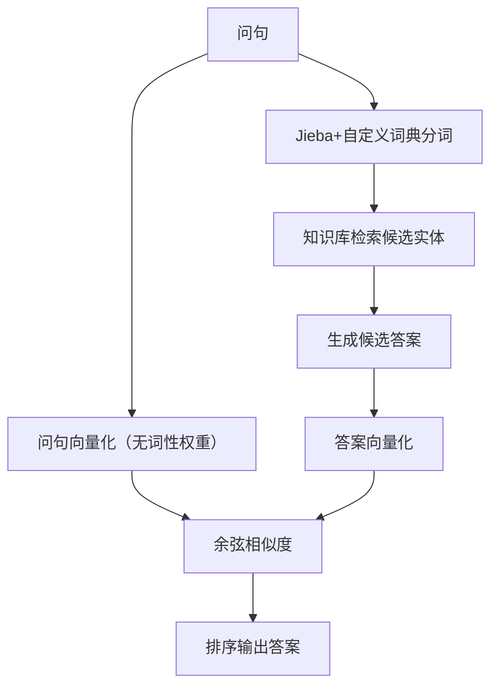

### 5. 经典金句/数据
> “流水不腐，户枢不蠹。” ——《吕氏春秋·尽数》

> “交通知识图谱包含6类节点：channel, intersection, name, poi, scheme, symptom，关系包括has_symptom等。”

---

## 第15章：汽车领域知识问答实践

### 1. 核心论点
本章解决“如何构建面向汽车领域的专业化知识问答系统”的问题。作者通过实体-属性概念树、实体类别数据集、知识库三元组三层结构，并采用最小生成树进行实体链接、LinearSVC进行属性分类，实现汽车功能、故障、保养等问题的精准问答。

### 2. 关键概念
- **概念树**：定义实体（如车款）的属性（如油耗）及子属性（夏天油耗、冬天油耗）。
- **实体别名**：同一实体可能有多个别名（如“空调制冷”和“吹冷风”）。
- **最小生成树实体链接**：将问句中词语切分，构建节点和边（权值为词数），通过最小生成树找到最匹配实体。
- **属性分类**：使用TF-IDF+LinearSVC对问句属性进行分类（如“油耗”类）。

### 3. 逻辑推演
从汽车行业痛点（功能不会用、故障求助难、营销缺乏精准）引入。设计问答场景：功能使用、故障求助、保养咨询、车型参数。知识图谱设计三层：概念树（实体-属性-子属性）、实体类别数据集（alias-class-entity）、知识库三元组（实体-属性-答案）。数据预处理：生成nodes.txt和edges.txt（用于最小生成树），训练属性分类模型（LinearSVC）。问答实现：问句分词→最小生成树实体链接→属性分类→概念树验证→知识库查询→返回答案。最后展示问答结果（如“空调怎么制热？”）。

### 4. 流程图

#### 汽车领域问答流程

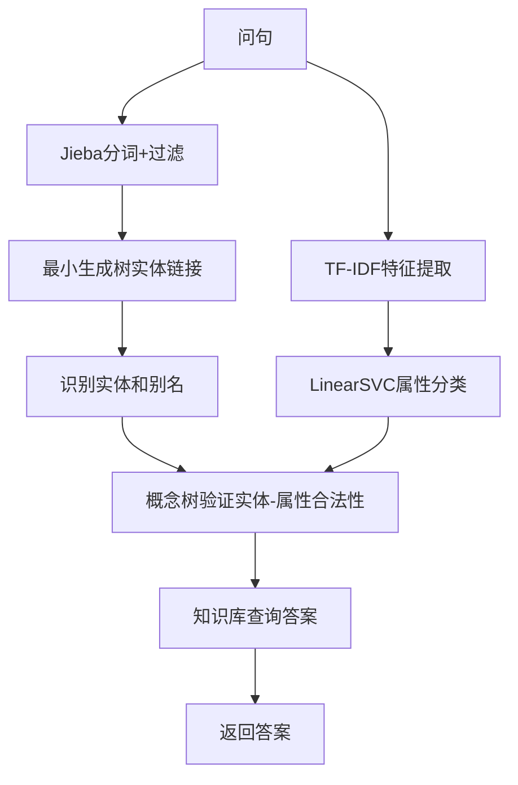

### 5. 经典金句/数据
> “前事不忘，后事之师。” ——《战国策·赵策一》

> “属性分类模型使用LinearSVC，训练准确率达到99%。”

---

## 第16章：金融领域推理决策实践

### 1. 核心论点
本章解决“如何利用知识图谱的推理能力进行信贷反欺诈风险识别”的问题。作者通过构建个人信贷知识图谱，设定多条风险规则（共用手机号/银行账户、自担保、担保人信用不足、超额贷款、关联黑名单），并使用Jena规则推理、SPARQL查询、本体模型遍历三种方式实现风险检测。

### 2. 关键概念
- **信贷反欺诈**：通过信息不一致性验证和关联分析发现欺诈风险。
- **风险规则**：共用账号、自担保、信用评级倒挂、超额度担保、黑名单关联。
- **Jena规则推理**：自定义规则（如“(?p1 :HasBankAccount ?b) (?p2 :HasBankAccount ?b) -> (?p1 :SameBankAccount ?p2)”）生成新三元组。
- **SPARQL查询**：直接编写查询语句获取违规记录。
- **本体模型遍历**：对新用户，通过节点访问周围子图进行深度限制的推理。

### 3. 逻辑推演
从信贷反欺诈背景（网络贷款欺诈风险）引入。设计场景：个人信贷申请，通过知识图谱检测风险。知识图谱设计：用户（借款人和担保人）、电话号码、银行账户为实体，关系有被担保、拥有账号/账号所属人。数据预处理：生成120个借款人+82个担保人，共202个用户，195个电话号码，196个银行账户，并通过Java写入JSON，再通过Jena转为RDF三元组存入TDB。推理实现三种方式：①Jena自定义规则推理（共用账号、自担保、信用倒挂）；②SPARQL查询（相同账号、信用倒挂、超额担保）；③本体模型遍历（对新用户检测关联黑名单、超额担保链）。最后输出风险结果（如45位借款人担保人信用低于自己，7对共用电话号码等）。

### 4. 流程图

#### 信贷反欺诈推理流程

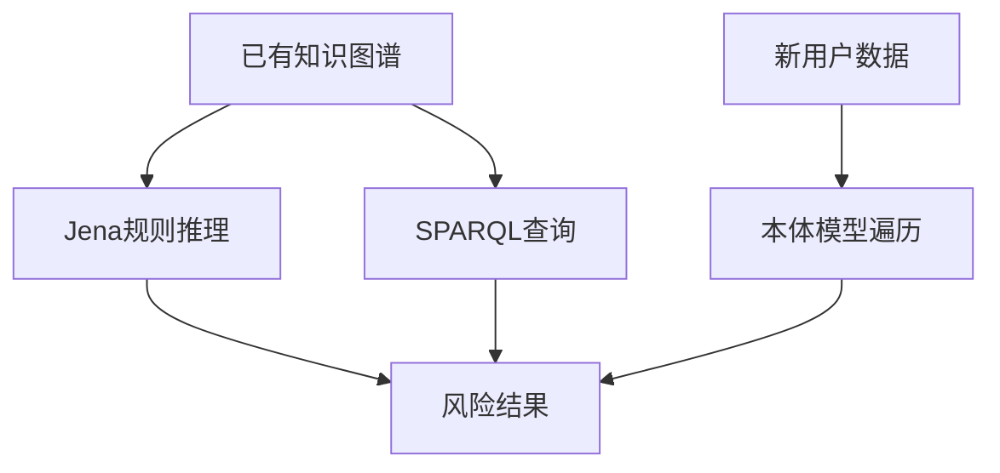

### 5. 经典金句/数据
> “避其锐气，击其惰归。” ——《孙子·军争》

> “生成数据包含202个用户节点、195个电话号码节点、196个银行账户节点，通过三种推理方式检测到共用账户、自担保、信用倒挂等风险。”

---

## 致谢

### 核心内容
作者感谢合作者李雅洁、彭加琪、程知远以及多位技术专家；感谢机械工业出版社编辑的鼓励与引导；感谢提供数据的互联网公开资源（IBDM、NLPCC、国泰安等）；特别感谢爱人和两个孩子（大宝和二宝于宜杨）的支持。谨以此书献给努力奋斗的小伙伴和热爱知识图谱技术的朋友。