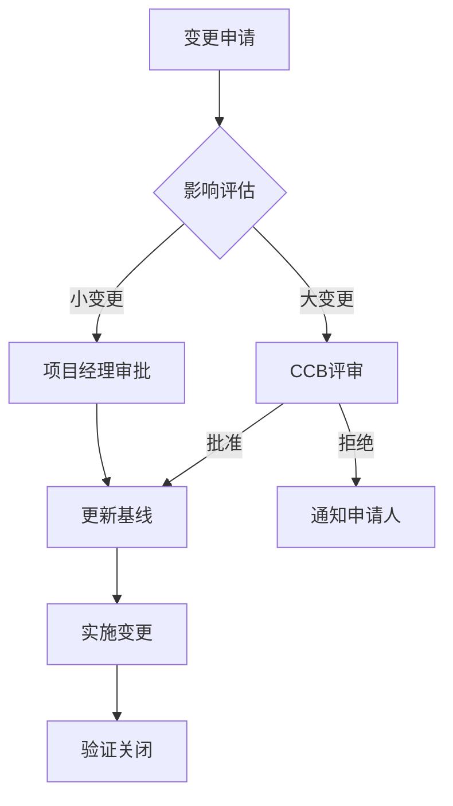
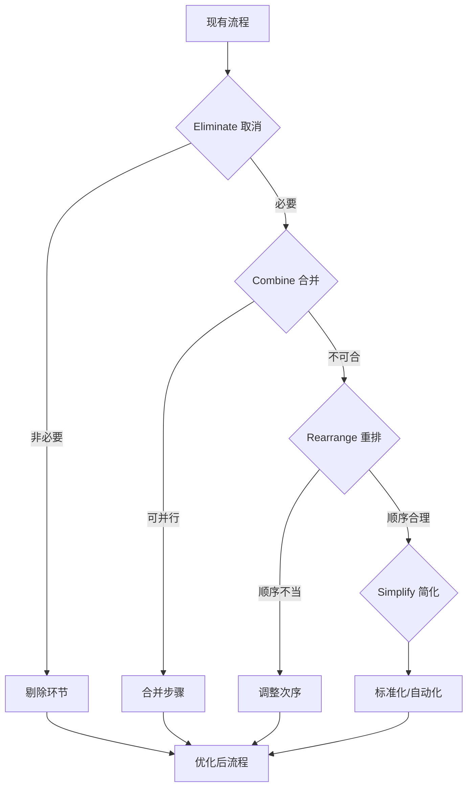

# 《研发企业管理——思想、方法、流程和工具》章节总结

## 书籍信息
- **书名：** 研发企业管理——思想、方法、流程和工具
- **作者：** 林锐、彭韧
- **文件格式：** EPUB
- **内容状态：** 文本完整，结构清晰

## 目录说明
- **目录识别情况：** 已完整识别全书四大篇章及附录结构。
- **章节对应依据：** 严格遵循原书“思想篇→方法篇→流程篇→工具篇”的逻辑递进顺序。
- **内容完整性：** 涵盖前言、正文四篇共12章及附录，无缺失。

## 全书核心主题
本书构建了一套适用于中国软件与互联网企业的研发管理体系。作者林锐基于多年一线管理与咨询经验，提出研发管理不能仅靠单一维度，而必须是“思想、方法、流程、工具”四位一体的系统工程。**思想篇**解决“为什么做”和“做什么”的价值观与战略问题；**方法篇**提供项目管理、质量管理、配置管理等具体战术；**流程篇**将方法固化为可执行的标准化作业程序（SOP）；**工具篇**则强调通过IT平台实现管理的自动化与数据化。全书核心主张是：优秀的研发管理是将个人能力转化为组织能力，通过规范化与人性化的平衡，实现研发效能与质量的双重提升。

---

## 前言：研发管理的困境与出路

### 核心论点
本章探讨了中国研发企业普遍存在的管理混乱与效率低下问题。
作者认为：研发管理的失败往往不是因为缺乏技术，而是因为缺乏系统的管理思维，必须从“人治”走向“法治+心治”的结合。

### 关键概念/事件
-   **研发管理四维模型：** 思想（灵魂）、方法（肌肉）、流程（骨骼）、工具（神经系统）缺一不可。
-   **中国式研发困境：** 盲目照搬西方理论导致水土不服，或完全依赖个人英雄主义导致不可持续。
-   **管理成熟度：** 企业应从无序级向可重复级、定义级、量化级和优化级演进。

### 逻辑推演/叙事脉络
作者首先列举了国内研发企业常见的“加班多产出少、人员流动大、质量不稳定”等痛点，指出其根源在于管理体系的缺失。接着引出本书的写作初衷：提供一套既符合国际规范又适应中国国情的实操指南。最后阐述了全书的结构安排，强调四个篇章之间的逻辑依赖关系，即思想指导方法，方法固化于流程，流程承载于工具。

### 经典金句/数据
> “没有思想的流程是僵化的，没有流程的思想是空洞的。”
> “研发管理的本质不是管控人，而是赋能人，让平凡的人做出不平凡的事。”

---

## 第一篇：思想篇

## 第1章：研发管理的基本理念

### 核心论点
本章解决研发管理中“价值观错位”的问题。
作者认为：正确的研发管理理念是所有方法论生效的前提，核心理念包括以客户为中心、以结果为导向、以人为本。

### 关键概念/事件
-   **客户价值导向：** 研发的起点和终点都是客户价值，而非技术自嗨。
-   **系统思维：** 将研发视为一个输入输出的黑盒系统，关注整体最优而非局部最优。
-   **人性假设：** 管理者需基于“Y理论”激发知识型员工的内在动机，而非单纯依靠KPI压迫。

### 逻辑推演/叙事脉络
从研发活动的特殊性（创造性、不确定性）出发，论证传统制造业管理模式的局限性。随后逐一拆解三大基本理念，结合正反案例说明理念偏差如何导致项目失败。最后强调理念落地需要通过制度和文化双重保障，避免沦为口号。

### 经典金句/数据
> “技术人员最容易犯的错误是把手段当成了目的，代码写得再漂亮，如果不解决问题就是垃圾。”
> “管理者的首要任务是消除障碍，而不是制造麻烦。”

## 第2章：研发战略与组织文化

### 核心论点
本章讨论研发如何与企业战略对齐以及文化如何支撑研发。
作者认为：研发战略必须服务于商业战略，而优秀的研发文化是“宽容失败、追求卓越、开放协作”。

### 关键概念/事件
-   **IPD（集成产品开发）思想：** 市场驱动研发，跨部门协同，异步开发模式。
-   **研发文化三要素：** 工程师文化（尊重专业）、绩效文化（结果说话）、学习文化（持续改进）。
-   **战略解码：** 将公司级战略目标逐层分解为产品线、项目组和个人目标。

### 逻辑推演/叙事脉络
首先阐述战略与研发的脱节现象，引入IPD作为对齐工具。接着分析文化对研发行为的隐性约束力，指出文化建设比制度建设更难但更持久。最后给出文化落地的具体抓手，如技术分享会、复盘机制、荣誉体系等。

### 流程图：IPD核心决策评审点

### 经典金句/数据
> “文化就是把制度内化为习惯，把外在约束变为内在自觉。”
> “战略不是挂在墙上的标语，而是每天资源分配的优先级。”

---

## 第二篇：方法篇

## 第3章：研发项目管理

### 核心论点
本章解决研发项目“进度失控、范围蔓延”的问题。
作者认为：研发项目管理需要在不确定中寻找确定性，核心是WBS分解、里程碑管控与风险前置。

### 关键概念/事件
-   **WBS（工作分解结构）：** 将复杂项目分解为可管理、可估算的工作包，粒度建议不超过40小时。
-   **里程碑评审：** 设置关键检查点，不通过不放行，避免错误累积到后期。
-   **铁三角平衡：** 范围、时间、成本三者动态平衡，质量是约束条件而非变量。

### 逻辑推演/叙事脉络
从项目启动、规划、执行、监控到收尾的全生命周期展开。重点讲解了需求变更控制流程，强调“拥抱变化但要管理变化”。通过对比瀑布式与敏捷式的适用场景，提出混合管理模式更适合大多数中国企业。

### 流程图：项目变更控制流程

### 经典金句/数据
> “没有WBS的项目计划只是愿望清单。”
> “延期通常不是发生在最后一天，而是发生在每一个被忽视的小任务里。”

## 第4章：研发质量管理

### 核心论点
本章纠正“质量是测试出来的”错误认知。
作者认为：质量是设计和构建出来的，预防优于检查，全员对质量负责。

### 关键概念/事件
-   **质量左移：** 在需求和设计阶段投入更多质量活动，降低修复成本。
-   **同行评审（Peer Review）：** 最有效的缺陷发现手段，包括代码走查、设计评审。
-   **缺陷收敛曲线：** 衡量测试充分性和版本稳定性的关键指标。

### 逻辑推演/叙事脉络
引用Boehm曲线说明缺陷修复成本随阶段指数级增长，论证质量左移的经济性。详细介绍评审的操作规范，避免评审流于形式。最后讲解度量体系建设，强调数据用于改进而非考核。

### 经典金句/数据
> “测试只能证明缺陷存在，不能证明缺陷不存在。”
> “高质量的代码不是写出来的，是改出来的，更是评出来的。”

## 第5章：配置管理与版本控制

### 核心论点
本章解决研发资产“丢失、混乱、不可追溯”的问题。
作者认为：配置管理是研发管理的基石，没有受控的基线就没有可靠的交付。

### 关键概念/事件
-   **基线（Baseline）：** 经过正式评审批准的阶段性成果，作为后续工作的基准。
-   **分支策略：** Git Flow或Trunk Based Development的选择取决于发布频率与团队规模。
-   **变更可追溯性：** 任何修改都必须关联需求或缺陷ID，禁止裸提交。

### 逻辑推演/叙事脉络
从配置管理的四大功能（标识、控制、审计、报告）入手，结合实际场景讲解分支管理规范。强调自动化构建与持续集成是配置管理的延伸。最后指出配置管理员（CMO）的角色定位与能力建设。

### 经典金句/数据
> “无法重现的Bug不是Bug，是无法管理的配置。”
> “基线是团队协作的共同语言，打破基线就是打破契约。”

---

## 第三篇：流程篇

## 第6章：流程设计与优化

### 核心论点
本章解决“流程繁琐无效”与“无流程混乱”的两极分化问题。
作者认为：好流程是“刚好够用”的，应以业务价值流为主线，定期裁剪与优化。

### 关键概念/事件
-   **价值流映射（VSM）：** 识别流程中的增值与非增值环节，消除浪费。
-   **流程分级：** L1-L4级流程体系，高层定原则，底层定操作。
-   **ECRS原则：** 取消、合并、重排、简化，流程优化的四把手术刀。

### 逻辑推演/叙事脉络
分析流程僵化的成因，提出“流程服务于业务”的原则。演示如何从端到端视角梳理主流程，再填充子流程。强调流程发布后的培训与宣贯比编写更重要，并建立流程Owner责任制。

### 流程图：流程优化ECRS模型

### 经典金句/数据
> “流程不是为了让人忙碌，而是为了让价值流动。”
> “最好的流程是你感觉不到它的存在，但它一直在保护你。”

## 第7章：流程落地与执行

### 核心论点
本章解决“有流程不执行”的执行力的难题。
作者认为：流程落地需要“培训+检查+激励”三位一体，且管理者必须以身作则。

### 关键概念/事件
-   **流程遵从度检查：** 定期审计，区分“不知道”、“不会做”和“不愿做”。
-   **例外管理：** 允许合理偏离，但必须记录原因并事后复盘。
-   **流程绩效：** 将流程执行情况纳入绩效考核，但避免唯流程论。

### 逻辑推演/叙事脉络
剖析执行力差的深层原因：流程本身不合理、缺乏培训、缺乏监督、缺乏正向反馈。提出分阶段推行策略：先僵化、后优化、再固化。强调QA（质量保证）人员在流程推行中的教练与警察双重角色。

### 经典金句/数据
> “破窗效应是流程崩溃的开始，第一次违规不被制止，就会有第一百次。”
> “流程执行的最高境界是肌肉记忆，而非大脑记忆。”

---

## 第四篇：工具篇

## 第8章：研发管理工具选型

### 核心论点
本章解决“工具与管理两张皮”的问题。
作者认为：工具是管理思想的载体，选型应匹配当前管理水平，切忌贪大求全。

### 关键概念/事件
-   **工具链整合：** 打通需求、开发、测试、运维数据孤岛，实现端到端可视化。
-   **SaaS vs 自建：** 中小企业优先SaaS，大型企业考虑私有化定制。
-   **工具适配度矩阵：** 从功能、易用性、扩展性、成本四维度评估。

### 逻辑推演/叙事脉络
梳理主流研发工具分类（ALM、DevOps、协作等）。指出常见误区：以为买了Jira就有了敏捷，装了Sonar就有了质量。强调工具导入前的流程梳理是关键，工具只能加速已有流程，不能创造新流程。

### 经典金句/数据
> “给混乱的流程配上先进的工具，只会得到自动化的混乱。”
> “工具的价值不在于功能多少，而在于数据流转的效率。”

## 第9章：工具实施与推广

### 核心论点
本章解决工具“上线即废弃”的推广难题。
作者认为：工具推广是变革管理，需关注用户体验，采用试点先行、逐步推广策略。

### 关键概念/事件
-   **种子用户：** 选拔意见领袖参与工具配置与内测，形成口碑效应。
-   **数据迁移策略：** 历史数据处理要谨慎，宁可少迁不可错迁。
-   **反馈闭环：** 建立快速响应渠道，及时解决用户使用痛点。

### 逻辑推演/叙事脉络
按准备、试点、推广、运营四阶段展开。重点讲解如何编写用户手册与FAQ，如何设计培训课程。强调运营期的数据分析，通过使用率、活跃度等指标评估工具成效，持续迭代配置。

### 经典金句/数据
> “用户不会因为工具先进而喜欢它，只会因为好用才离不开它。”
> “工具推广的成功标志不是安装量，而是日均活跃度和数据沉淀量。”

---

## 附录与后记

### 核心论点
补充正文未尽的实操模板与作者反思。
作者认为：管理是一门实践的艺术，书本知识需在实战中反复打磨才能内化。

### 关键概念/事件
-   **常用模板库：** 项目章程、周报、评审检查单、缺陷报告等标准模板。
-   **推荐阅读书单：** 软件工程、项目管理、领导力等领域经典著作。
-   **作者寄语：** 鼓励管理者保持谦卑与好奇，在实践中形成自己的管理哲学。

### 逻辑推演/叙事脉络
附录提供了大量可直接复用的表格与清单，增强书籍的工具属性。后记回顾了本书创作历程，坦诚书中方法的局限性，呼吁读者结合企业实际灵活应用，切勿生搬硬套。

### 经典金句/数据
> “尽信书则不如无书，管理没有银弹，只有适合的鞋子。”
> “愿这本书成为你案头的参考，而非书架上的装饰。”