# 《第一性原理：21堂科学通识课》章节总结

## 书籍信息
- 书名：第一性原理：21堂科学通识课
- 作者：[英] 马库斯·乔恩 (Marcus Chown)
- 译者：周自恒
- 出版社：中国科学技术出版社
- 出版时间：2024年6月
- ISBN：9787523605103
- PDF 状态：基于文字识别文本，页码基本连续
- OCR 状态：可识别内容完整，图表描述清晰但原始图像缺失

## 目录说明
- 目录识别情况：完整识别前言及第1章至第21章，以及术语表
- 章节对应依据：按原书页码顺序提取正文标题和内容
- OCR 修复说明：部分图表文字说明完整，可用于逻辑重建；无严重错漏

## 全书核心主题
本书以“第一性原理”为方法，为21个重要科学话题提供入门级的核心洞察。每个话题从一条最基本的事实或原理出发，逐层推导出该领域的核心知识和前沿问题。作者强调：理解一个复杂概念，只需要抓住那个“唯一需要知道的事”。全书覆盖引力、电、全球变暖、太阳能源、热力学第二定律、板块构造、量子理论、原子、演化、狭义相对论、脑科学、广义相对论、人类演化、黑洞、粒子物理标准模型、量子计算机、引力波、希格斯场、反物质、中微子和宇宙大爆炸。通过这种极简而深刻的讲述，读者能快速建立对现代科学图景的整体理解。

---

## 前言

### 核心论点
问题：如何用最少的时间让非专业听众理解量子计算机等复杂话题？作者观点：每个科学话题都可以提炼出一条“第一性原理”——最基础的事实，从它出发可以逻辑推导出其他相关知识。

### 关键概念
- 第一性原理：能够引出其他所有相关知识的基本事实或原理。
- 书中将用这种方法介绍21个话题：从全球变暖到希格斯粒子，从黑洞到人类演化。

### 逻辑推演
作者受邀为律师事务所讲解量子计算机，需要假设听众没有科学知识。他思考“要理解量子计算机，需要知道的第一性原理是什么？”进而扩展到其他科学概念。本书即采用这一框架：先给出第一性原理，再展示如何沿着逻辑链条推导出更复杂的结论。

### 经典金句
> “我唯一知道的就是自己一无所知。” ——苏格拉底
> “我生来一无所知，只有一点儿时间四处奔波试图改变这一点。” ——理查德·费曼

---

## 第1章：引力

### 核心论点
问题：引力为什么是“万有”的？它如何塑造天体？作者观点：每一个物体与其他物体之间都存在着相互吸引的力，该力的大小与质量乘积成正比、与距离平方成反比。

### 关键概念
- 引力：任意两个物体之间存在的吸引力，很弱但可积累，在宏观天体尺度占主导。
- 潮汐力：由引力差产生，导致海洋和固体潮汐，也驱动木卫一的火山活动。
- 圆锥曲线：物体在平方反比引力下的可能轨道（椭圆、抛物线、双曲线）。

### 逻辑推演
从引力弱但可积累出发：当物体直径超过400-600千米，引力压倒电磁力，天体成为球形。历史脉络：吉尔伯特认为引力像磁力；胡克注意到太阳高温会消磁；开普勒行星运动定律（第二定律给出角动量守恒线索，第一定律指出椭圆轨道）。牛顿发现行星运动源于惯性+向心力，证明平方反比引力导致椭圆轨道。潮汐解释、月球远离速度测量。最后引出广义相对论对牛顿理论的修正（水星近日点进动）及弦理论的猜想（引力泄漏到额外维度）。

### 流程图

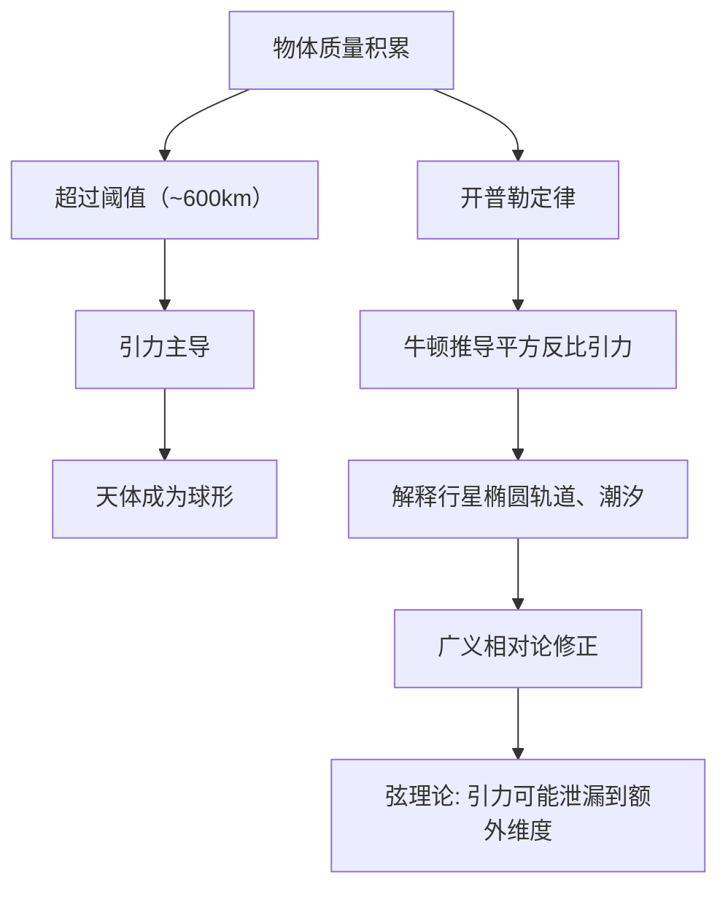
```mermaid
graph TD
    A[物体质量积累] --> B[超过阈值（~600km）]
    B --> C[引力主导]
    C --> D[天体成为球形]
    A --> E[开普勒定律]
    E --> F[牛顿推导平方反比引力]
    F --> G[解释行星椭圆轨道、潮汐]
    G --> H[广义相对论修正]
    H --> I[弦理论: 引力可能泄漏到额外维度]
```

### 经典金句/数据
> “引力是一种‘万有’的吸引力，即任意两个物体之间都存在这种力。” (p.5)
> 月球远离地球的速度：每年约4厘米。
> 月球引发的潮汐强度是太阳的两倍，因此月球密度是太阳的两倍。

---

## 第2章：电

### 核心论点
问题：电为什么能驱动现代世界？作者观点：电代表了大自然极其强大的力（电磁力），是引力的10^40倍；通过制造电荷不平衡可以释放这种能量。

### 关键概念
- 电磁力：比引力强10^40倍，但在日常物质中正负电荷平衡而抵消。
- 电场与磁场：变化的电场产生磁场，变化的磁场产生电场；电磁波（光、无线电波）正是这种自我维持的波动。
- 交流电与变压器：特斯拉用交流电实现长距离输电，通过变压器改变电压。

### 逻辑推演
从“蚊子失去电子会释放堪比小行星撞击的能量”说明电磁力之强。历史：奥斯特发现电流产生磁场；法拉第提出场概念并发现电磁感应（发电机原理）；麦克斯韦统一电磁学，预言电磁波；赫兹、马可尼实现无线电通信。特斯拉的交流电系统比爱迪生的直流电更高效传输，点亮世界。最后指出电磁力维持原子、分子、人体结构，甚至驱动生命（神经元电信号）。

### 流程图

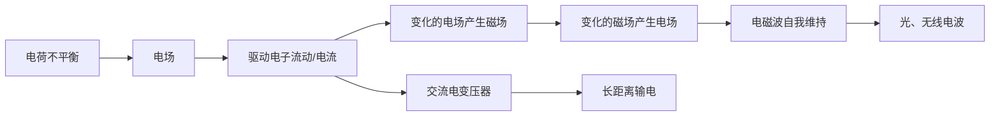
```mermaid
graph LR
    A[电荷不平衡] --> B[电场]
    B --> C[驱动电子流动/电流]
    C --> D[变化的电场产生磁场]
    D --> E[变化的磁场产生电场]
    E --> F[电磁波自我维持]
    F --> G[光、无线电波]
    C --> H[交流电变压器]
    H --> I[长距离输电]
```

### 经典金句/数据
> “利用这种是引力10^40倍的力，我们为全世界提供能量。” (p.15)
> “在人类历史的长远观点来看……最有意义的事件将是麦克斯韦对电磁学定律的发现。” ——费曼 (p.18)
> “你是电能生物……电子在你大脑中的神经元之间流动，才使得你能够阅读和思考。” (p.22)

---

## 第3章：全球变暖

### 核心论点
问题：地球为什么会变暖？作者观点：二氧化碳等温室气体吸收地表辐射的红外线，将热量积蓄在大气层中；人类燃烧化石燃料导致二氧化碳浓度上升，引发全球变暖。

### 关键概念
- 温室效应：太阳可见光加热地表，地表辐射红外线被水蒸气、CO₂等吸收，阻止热量散失。
- 米兰科维奇周期：地球轨道变化导致冰期循环。
- 正反馈循环：海冰减少反射太阳光减少→进一步升温；永久冻土融化释放甲烷→进一步升温。

### 逻辑推演
尤妮斯·富特(1856)首次发现水蒸气和CO₂升温最快；丁达尔证明气体吸收的是地表红外线而非太阳光。阿伦尼乌斯(1896)提出化石燃料燃烧会导致“热室效应”。现代观测：CO₂浓度从0.0315%升至0.042%，全球升温约1.18°C。碳循环（岩石风化、板块俯冲）在长期调节CO₂，但无法应对人类排放速率。金星失控温室效应是警示。“黯淡太阳悖论”用早期月球潮汐热解释。

### 流程图

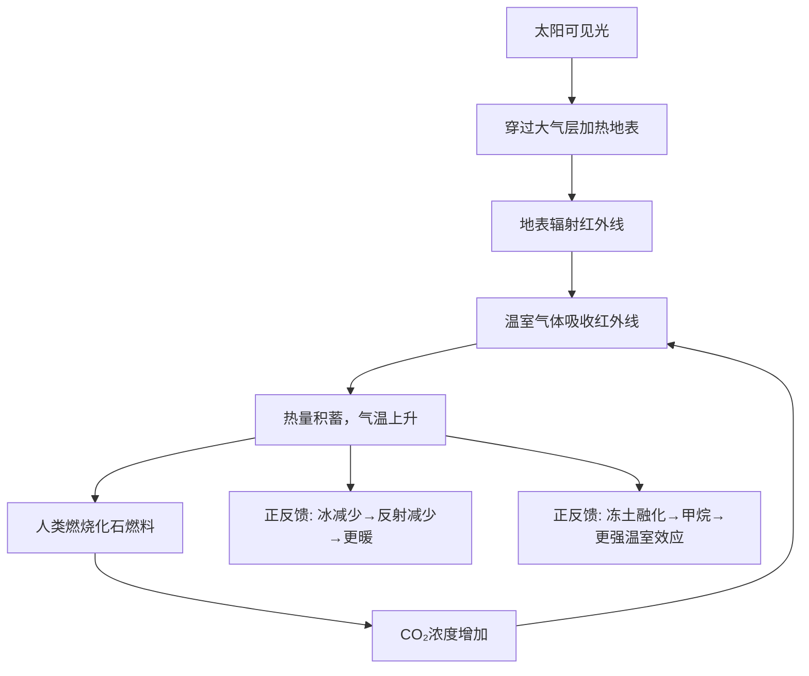
```mermaid
graph TD
    A[太阳可见光] --> B[穿过大气层加热地表]
    B --> C[地表辐射红外线]
    C --> D[温室气体吸收红外线]
    D --> E[热量积蓄，气温上升]
    E --> F[人类燃烧化石燃料]
    F --> G[CO₂浓度增加]
    G --> D
    E --> H[正反馈: 冰减少→反射减少→更暖]
    E --> I[正反馈: 冻土融化→甲烷→更强温室效应]
```

### 经典金句/数据
> “地球可能很快就会变得像金星一样。” ——史蒂芬·霍金 (p.23)
> 地球如果没有温室效应，平均气温为零下18°C。
> 金星大气CO₂浓度96.5%，表面温度超过铅的熔点。

---

## 第4章：太阳为什么是热的

### 核心论点
问题：太阳的巨大能量从何而来？作者观点：因为它的质量非常大，引力压缩使核心温度高达1500万摄氏度，触发氢核聚变；弱力使聚变第一步极其缓慢，太阳可稳定燃烧100亿年。

### 关键概念
- 引力压缩：巨大质量挤压内核产生高温。
- 核聚变：氢聚变成氦，副产物为光。第一步两个质子结合，需要弱力将一个质子变成中子，这一步非常罕见（平均每个质子需100亿年）。
- 量子隧穿：尽管所需温度理论值100亿度，但量子隧穿效应使质子能在1500万度下克服电磁排斥力发生聚变。
- 光子随机行走：太阳核心产生的光子在内部随机行走约3万年才能到达表面。

### 逻辑推演
爱丁顿(1920)通过引力平衡推断太阳内部结构。19世纪物理学家困惑：煤炭只能烧5000年，但地球年龄45.5亿年。核能是唯一解。氢聚变第一步的缓慢保证了太阳长寿命。量子隧穿解决了温度不足的矛盾。光子的漫长旅程：今天看到的阳光是上一个冰期产生的。磁场使太阳活动复杂（黑子、耀斑、日冕物质抛射）。卡林顿事件(1859)警示太阳活动对地球科技的影响。

### 流程图

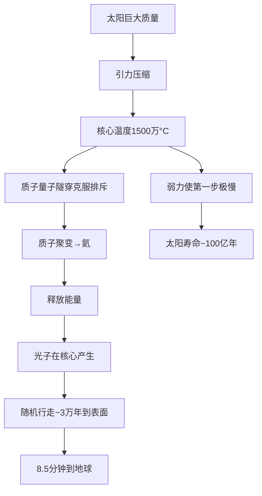
```mermaid
graph TD
    A[太阳巨大质量] --> B[引力压缩]
    B --> C[核心温度1500万°C]
    C --> D[质子量子隧穿克服排斥]
    D --> E[质子聚变→氦]
    E --> F[释放能量]
    F --> G[光子在核心产生]
    G --> H[随机行走~3万年到表面]
    H --> I[8.5分钟到地球]
    C --> J[弱力使第一步极慢]
    J --> K[太阳寿命~100亿年]
```

### 经典金句/数据
> “太阳之所以是热的，原因非常简单：因为它的质量非常大。” (p.30)
> 太阳核心温度1500万°C；所需聚变温度理论值100亿°C。
> 光子从核心到表面平均需3万年。
> 卡林顿事件(1859)：全球电报系统触电，低纬度出现极光。

---

## 第5章：热力学第二定律

### 核心论点
问题：为什么时间有方向？为什么花瓶只能摔碎不能复原？作者观点：让东西无序的方式总比让东西有序的方式多得多，因此世界必然从有序走向无序（熵增）。宇宙整体熵增，但局部（如生命）可以以排放无序为代价实现有序。

### 关键概念
- 熵：无序程度的度量，与一个宏观状态对应的微观状态数量总和。
- 热力学第二定律：熵永远不会减少（或更精确地说，孤立系统的熵永不减少）。
- 宇宙蒸汽机：一切活动由高温恒星和低温宇宙空间之间的温差驱动。

### 逻辑推演
物理基本定律时间对称（如行星轨道可逆向），但日常现象不可逆。原因是：破碎的方式远多于完整的方式。玻尔兹曼墓碑上刻有熵公式。爱丁顿称熵增原理在自然法则中具有至高无上的地位。生命看似逆熵，实则通过消耗能量、向环境排放热量（增加宇宙总熵）来维持自身有序。宇宙始于低熵（大爆炸），逐渐走向热寂。有趣推论：如果宇宙未来收缩（大坍缩），时间方向可能逆转。

### 流程图

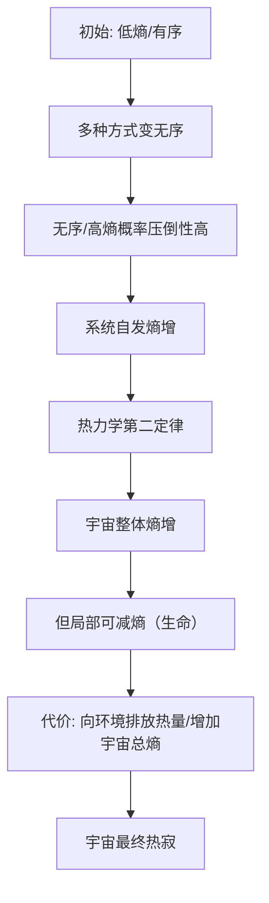
```mermaid
graph TD
    A[初始: 低熵/有序] --> B[多种方式变无序]
    B --> C[无序/高熵概率压倒性高]
    C --> D[系统自发熵增]
    D --> E[热力学第二定律]
    E --> F[宇宙整体熵增]
    F --> G[但局部可减熵（生命）]
    G --> H[代价: 向环境排放热量/增加宇宙总熵]
    H --> I[宇宙最终热寂]
```

### 经典金句/数据
> “不知道热力学第二定律如同从未读过莎士比亚的作品。” ——C.P.斯诺 (p.38)
> “热力学是个有趣的东西。你第一次看过之后，会觉得完全不懂。第二次看过之后，会觉得基本懂了……第三次看过之后，你知道你确实不懂，但那时你已经习惯了。” ——阿诺德·索末菲 (p.44)
> 地球每从太阳接收1个光子，就要辐射出约20个光子（因光子温度从6000°C降至300°C）。

---

## 第6章：板块构造

### 核心论点
问题：大陆为什么会漂移？地震和海啸为何发生？作者观点：地壳由破碎的板块构成，升腾的岩浆推动板块相互挤压碰撞；板块运动是地球调节内部温度的机制，也是生命存在的前提。

### 关键概念
- 板块构造：地壳分为若干板块，漂浮在地幔上，在大洋中脊生成新地壳，在俯冲带销毁旧地壳。
- 磁条带：洋壳中对称的磁化条带证明海底扩张和地磁反转。
- 板块运动驱动：地球内部热量（原始余热+放射性衰变）引起地幔对流。

### 逻辑推演
魏格纳(1912)根据非洲和南美洲海岸线吻合、岩石和化石相同提出大陆漂移，但被嘲笑。直到1960年代发现大洋中脊和对称磁条带，证实海底扩张。板块运动导致地震、火山、山脉形成。板块构造通过将CO₂封存到地幔，调节地球气候（防止像金星那样失控温室效应）。地震层析成像显示板块下沉到地核边界，形成地幔柱（如夏威夷）。板块构造始于至少32亿年前，可能对生命演化至关重要。

### 流程图

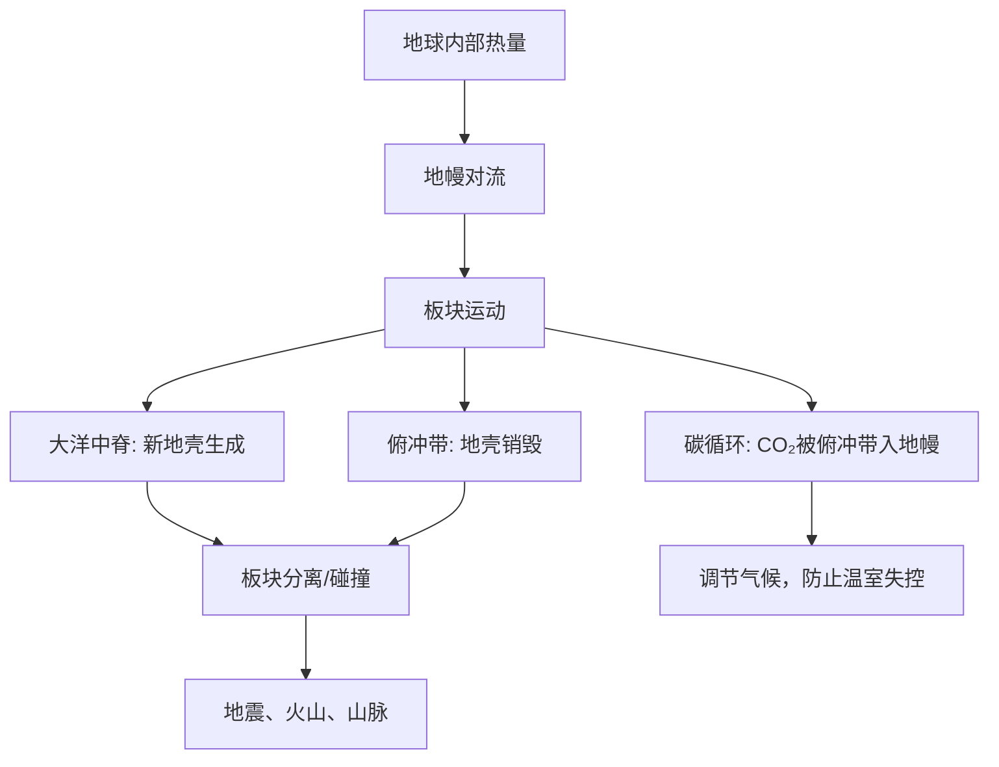
```mermaid
graph TD
    A[地球内部热量] --> B[地幔对流]
    B --> C[板块运动]
    C --> D[大洋中脊: 新地壳生成]
    C --> E[俯冲带: 地壳销毁]
    D --> F[板块分离/碰撞]
    E --> F
    F --> G[地震、火山、山脉]
    C --> H[碳循环: CO₂被俯冲带入地幔]
    H --> I[调节气候，防止温室失控]
```

### 经典金句/数据
> “为什么日本频发地震和海啸？……那是地壳的板块构造运动和碰撞的结果。” ——亚当·汉密尔顿 (p.45)
> 大洋中脊每年制造约30立方千米新地壳。
> 地核温度高达5000°C，与太阳表面相当。
> 没有板块构造的行星（如金星、火星）几乎都不适合生存。

---

## 第7章：量子理论

### 核心论点
问题：为什么原子不会坍缩？为什么我们能理解“粒子可以同时处于多个位置”？作者观点：粒子可以表现出波的性质，波也可以表现出粒子的性质；这种波粒二象性及量子叠加、干涉、不确定性原理构成了量子理论的核心。

### 关键概念
- 波粒二象性：基本单位既不是粒子也不是波，而是无法用日常语言类比的存在；但可表现为其中一种。
- 双缝实验与干涉：相长干涉和相消干涉是量子诡异之源。
- 海森堡不确定性原理：无法同时精确知道位置和动量。
- 纠缠与非局域性：两个粒子可以瞬时相互影响，违背光速限制（实验证实）。

### 逻辑推演
经典物理预言电子绕核旋转会辐射能量并在亿分之一秒内坠入原子核——但原子稳定存在。量子理论通过概率波干涉解释：所有可能轨道的波叠加后在原子核附近抵消，电子撞入核的概率为零。不确定性原理说明真空不空，充满虚粒子。纠缠现象让爱因斯坦认为“上帝不掷骰子”，但阿斯佩实验证明非局域性是真实的。量子场论将所有粒子视为场的涟漪。

### 流程图

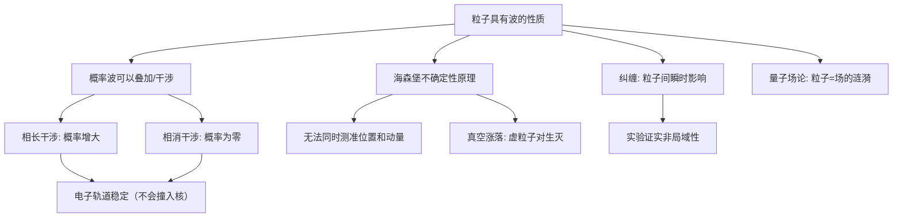
```mermaid
graph TD
    A[粒子具有波的性质] --> B[概率波可以叠加/干涉]
    B --> C[相长干涉: 概率增大]
    B --> D[相消干涉: 概率为零]
    C --> E[电子轨道稳定（不会撞入核）]
    D --> E
    A --> F[海森堡不确定性原理]
    F --> G[无法同时测准位置和动量]
    F --> H[真空涨落: 虚粒子对生灭]
    A --> I[纠缠: 粒子间瞬时影响]
    I --> J[实验证实非局域性]
    A --> K[量子场论: 粒子=场的涟漪]
```

### 经典金句/数据
> “从经典物理学的视角来看，原子根本不可能存在。” ——费曼 (p.57)
> “上帝不掷骰子。” ——爱因斯坦；“你别指挥上帝该怎么做。” ——玻尔 (p.54)
> 双缝实验：单个光子也能产生干涉图案，证明同时走两条路。

---

## 第8章：原子

### 核心论点
问题：世界是由什么构成的？为什么元素种类如此丰富？作者观点：所有物体由原子构成；原子由原子核和电子构成；原子的化学性质由核外电子排布决定，泡利不相容原理解释了元素的多样性和世界的丰富性。

### 关键概念
- 原子：德谟克利特提出的不可分微粒；实际由原子核和电子构成。
- 电子、质子、中子：电子带负电；质子带正电；中子不带电。
- 泡利不相容原理：两个费米子不能占据相同量子态，迫使电子分层排布，从而产生不同元素。
- 扫描隧道显微镜(1981)：直接“看到”原子。

### 逻辑推演
从古希腊哲学到伯努利的气体原子论，爱因斯坦解释布朗运动，佩兰测量原子大小。卢瑟福发现原子核（大小只有原子的十万分之一）。汤姆逊发现电子。查德威克发现中子。经典物理无法解释原子稳定，量子理论解决。泡利不相容原理使电子按层填充：第一层2个，第二层8个，第三层18个……因此不同原子最外层电子数不同，化学性质不同。门捷列夫周期表根源在此。最终发现上夸克、下夸克和电子三种基本粒子构成一切。

### 流程图

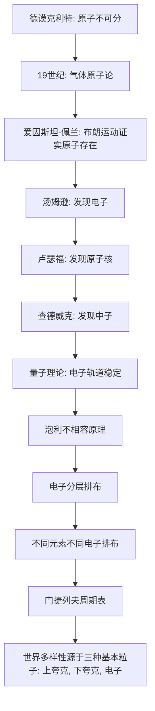
```mermaid
graph TD
    A[德谟克利特: 原子不可分] --> B[19世纪: 气体原子论]
    B --> C[爱因斯坦-佩兰: 布朗运动证实原子存在]
    C --> D[汤姆逊: 发现电子]
    D --> E[卢瑟福: 发现原子核]
    E --> F[查德威克: 发现中子]
    F --> G[量子理论: 电子轨道稳定]
    G --> H[泡利不相容原理]
    H --> I[电子分层排布]
    I --> J[不同元素不同电子排布]
    J --> K[门捷列夫周期表]
    K --> L[世界多样性源于三种基本粒子: 上夸克, 下夸克, 电子]
```

### 经典金句/数据
> “所有的物体都是由原子构成的。” ——费曼 (p.62)
> 1000万个原子排起来只有一个句号那么宽。
> 原子核大小只有原子的十万分之一，却占99.9%的质量。
> 自然界共有92种天然元素。

---

## 第9章：演化

### 核心论点
问题：为什么生物如此适应环境？作者观点：自然选择——生物产生过多后代，食物有限，那些带有能提高生存和繁殖优势性状的个体存活并遗传，不利性状逐渐消失。

### 关键概念
- 自然选择：达尔文的核心思想，无需设计者即可产生“设计错觉”。
- 变异与遗传：变异来自DNA复制错误（突变）；遗传由基因（DNA片段）实现。
- DNA双螺旋：碱基A、T、C、G组成遗传密码，每三个碱基编码一个氨基酸。

### 逻辑推演
达尔文随小猎犬号航行，加拉帕戈斯群岛雀鸟喙形与食物完美匹配。他领悟到：过度繁殖+食物有限→生存竞争→有利性状积累。华莱士独立提出相同理论，促使达尔文发表《物种起源》。桦尺蛾工业黑化是可见证据。抗生素耐药性、新冠病毒变异均是当代例子。达尔文缺少遗传机制：孟德尔通过豌豆实验发现离散遗传因子（基因）。后来发现DNA双螺旋结构，解释突变来源（复制错误）。所有生命共享最后共同祖先（LUCA）。

### 流程图

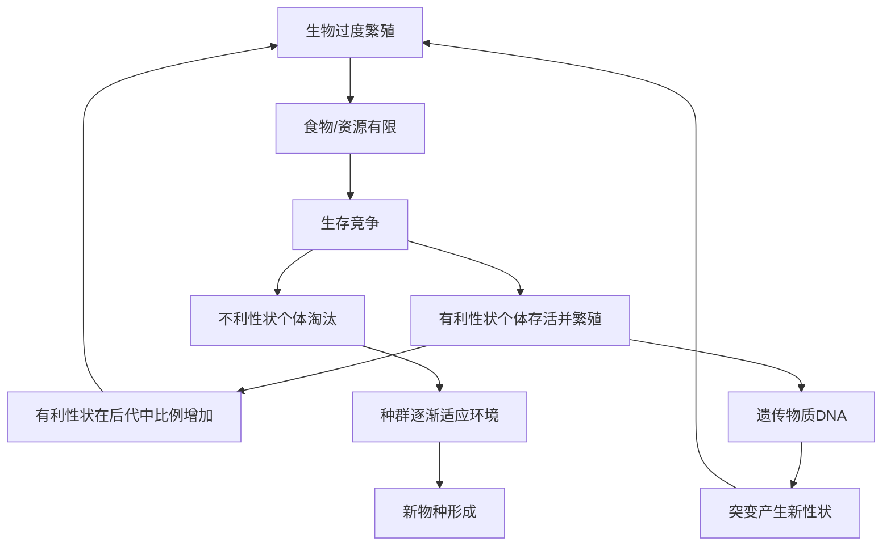
```mermaid
graph TD
    A[生物过度繁殖] --> B[食物/资源有限]
    B --> C[生存竞争]
    C --> D[有利性状个体存活并繁殖]
    D --> E[有利性状在后代中比例增加]
    E --> A
    C --> F[不利性状个体淘汰]
    F --> G[种群逐渐适应环境]
    G --> H[新物种形成]
    D --> I[遗传物质DNA]
    I --> J[突变产生新性状]
    J --> A
```

### 经典金句/数据
> “设计错觉是如此成功，以至于到现在大多数美国人依然顽固地拒绝承认这只是一种错觉。” ——理查德·道金斯 (p.71)
> 深色桦尺蛾从1811年发现到1895年占种群的98%。
> 你的DNA中有约2%来自尼安德特人（如果你有欧洲血统）。

---

## 第10章：狭义相对论

### 核心论点
问题：光速为什么不可超越？时间会变慢吗？作者观点：光是追不上的，光速对所有观察者恒定；因此空间和时间是相对的，它们统一为“时空”。

### 关键概念
- 光速不变原理：无论光源和观察者运动速度如何，测出的光速相同。
- 时间膨胀：运动的时钟变慢。
- 洛伦兹收缩：运动方向上的长度收缩。
- 质能等价：E=mc²，质量是能量最紧凑的形式。

### 逻辑推演
16岁爱因斯坦想象追光：若追上，光看起来静止，但麦克斯韦理论不允许静止电磁波，因此光不可能被追上。思想实验：列车上的光钟，地面观察者看到光走更长路径，因此时间更长（时间膨胀）。μ子穿过大气层：寿命因时间膨胀而延长25倍，或从μ子视角看空间收缩。闵可夫斯基统一时空。质能等价：加速物体质量增加，因为动能具有质量。

### 流程图

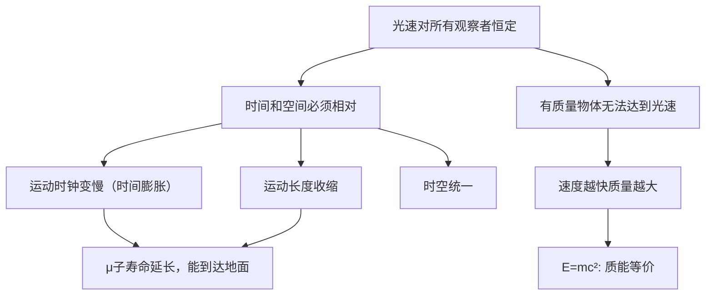
```mermaid
graph TD
    A[光速对所有观察者恒定] --> B[时间和空间必须相对]
    B --> C[运动时钟变慢（时间膨胀）]
    B --> D[运动长度收缩]
    C --> E[μ子寿命延长，能到达地面]
    D --> E
    B --> F[时空统一]
    A --> G[有质量物体无法达到光速]
    G --> H[速度越快质量越大]
    H --> I[E=mc²: 质能等价]
```

### 经典金句/数据
> “光速在我们的物理理论中扮演着无限大速度的角色。” ——爱因斯坦 (p.78)
> 苏联礼炮号航天员绕地球1年，回到未来百分之一秒。
> μ子以99.92%光速飞行，寿命从1.5微秒延长到37.5微秒，可飞行12.5千米。

---

## 第11章：脑

### 核心论点
问题：脑如何产生思想、记忆和学习？作者观点：脑的主要活动就是改变自身——通过神经可塑性，根据经历不断重构神经元之间的连接。

### 关键概念
- 神经元：约1000亿个，通过轴突和树突连接，突触间隙用神经递质传递信号。
- 神经可塑性：根据经历强化或削弱连接，产生新连接，修剪旧连接。这是学习和记忆的物理基础。
- 三层脑结构：爬行动物脑（生命维持）→边缘系统（情绪、记忆）→新皮质（语言、抽象思维、意识）。

### 逻辑推演
脑的复杂性不在于细胞数量，而在于连接（每个神经元连接约1万个其他神经元，总连接数千万亿）。神经元通过化学突触实现丰富响应（兴奋/抑制）。学习：重复刺激强化突触，长出树突棘；记忆：建立与已有知识的连接。遗忘：断开无用连接。脑是自编程计算机，由感官信息编程，能耗仅20瓦，但占全身耗氧20%。海鞘找到岩石后吃掉自己的脑。皮尤悖论：如果人脑简单到能被理解，那么拥有这样脑的人也无法理解它。

### 流程图

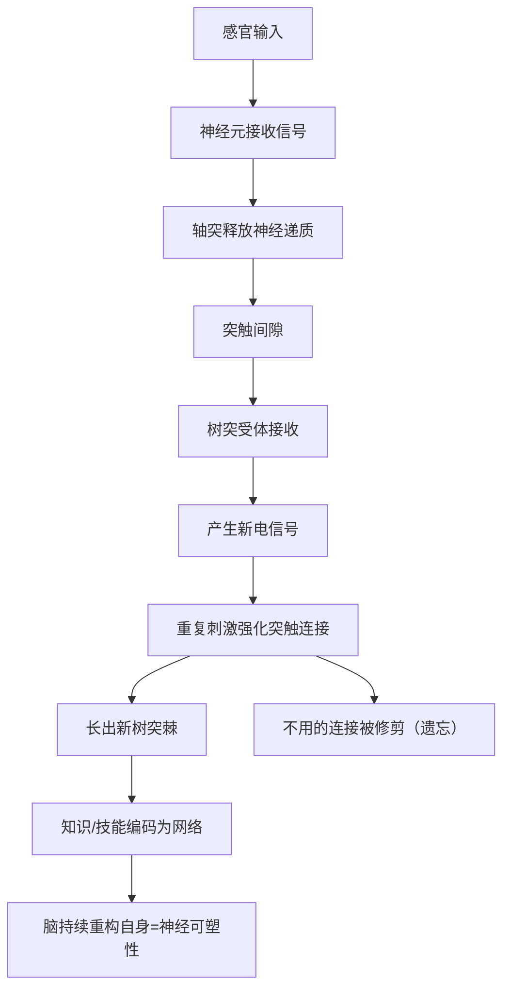
```mermaid
graph TD
    A[感官输入] --> B[神经元接收信号]
    B --> C[轴突释放神经递质]
    C --> D[突触间隙]
    D --> E[树突受体接收]
    E --> F[产生新电信号]
    F --> G[重复刺激强化突触连接]
    G --> H[长出新树突棘]
    H --> I[知识/技能编码为网络]
    G --> J[不用的连接被修剪（遗忘）]
    I --> K[脑持续重构自身=神经可塑性]
```

### 经典金句/数据
> “肝脏大约包含1亿个细胞，但是把1000个肝脏连起来并不能创造出丰富的内心世界。” ——杰拉德·费施巴赫 (p.85)
> 人脑能耗约20瓦；类似计算能力的超级计算机需20万瓦。
> 脑占体重2-3%，消耗20%的氧气。

---

## 第12章：广义相对论

### 核心论点
问题：引力是什么？作者观点：引力就是加速度；质量（能量）弯曲时空，弯曲的时空告诉物体如何运动。

### 关键概念
- 等效原理：在加速的飞船中无法区分自己是在加速还是受引力作用。
- 时空弯曲：引力不是力，而是时空几何；物体沿测地线（弯曲空间中最短路径）运动。
- 引力时间膨胀：引力越强，时间越慢。
- 引力波：时空的涟漪，2015年首次探测到。

### 逻辑推演
伽利略比萨斜塔实验：不同质量物体同时落地，暗示引力能自动调整以产生相同加速度。爱因斯坦的思想实验：封闭飞船以1g加速，内部现象与地面引力无法区分。如果船舱中水平发射激光，由于加速，光斑会下移；从引力观点看，光是弯曲的。光走最短路径，所以空间弯曲。太阳弯曲周围时空，行星沿测地线运动。引力使时间变慢，已被原子钟在楼梯上下测量证实。广义相对论预言水星近日点进动、引力波等。

### 流程图

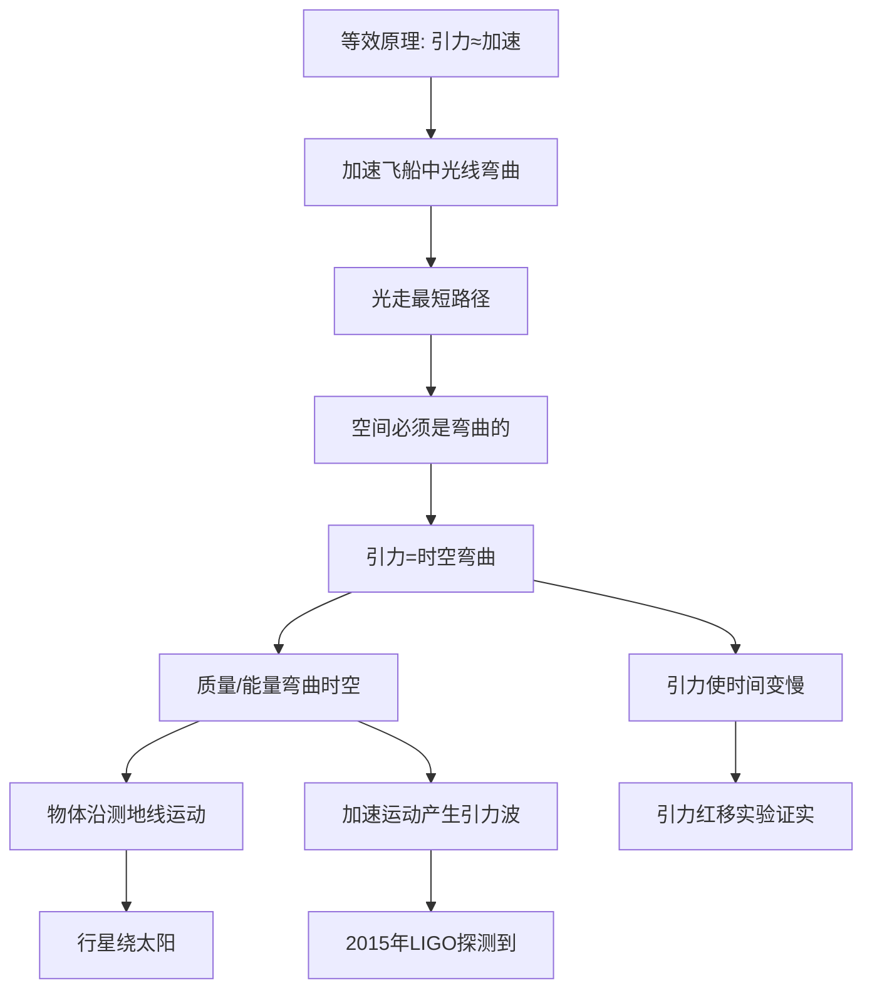
```mermaid
graph TD
    A[等效原理: 引力≈加速] --> B[加速飞船中光线弯曲]
    B --> C[光走最短路径]
    C --> D[空间必须是弯曲的]
    D --> E[引力=时空弯曲]
    E --> F[质量/能量弯曲时空]
    F --> G[物体沿测地线运动]
    G --> H[行星绕太阳]
    E --> I[引力使时间变慢]
    I --> J[引力红移实验证实]
    F --> K[加速运动产生引力波]
    K --> L[2015年LIGO探测到]
```

### 经典金句/数据
> “物质告诉时空如何弯曲，而弯曲的时空告诉物质如何运动。” ——约翰·惠勒 (p.96)
> 1971年阿波罗15号月球上锤子和羽毛同时落地。
> 2010年NIST实验：楼梯上下两级台阶的时间差可测量。

---

## 第13章：人类演化

### 核心论点
问题：为什么智人是唯一幸存的人类物种？作者观点：迁徙、迁徙、迁徙；更大的脑、更长的童年、文化创新使智人胜出，尼安德特人、丹尼索瓦人等灭绝或被混血。

### 关键概念
- 直立行走：解放双手，但需改造骨盆和臀肌；可能先在树上练习。
- 脑容量增大：烹饪（体外消化）和肉食提供了更多能量。
- 更长的童年：双足直立使产道变窄，人类被迫提前出生，大脑在子宫外继续发育，延长了可塑性时期。
- 混血：现代欧洲人有约2%尼安德特人DNA；东亚人有丹尼索瓦人DNA。

### 逻辑推演
约700万年前与黑猩猩分离。南方古猿直立行走（足迹证据360万年前）。脑从葡萄大小逐渐增大。火和烹饪出现于至少40万年前，减少消化能耗，支持大脑。工具发展缓慢（“无聊的140万年”）。直立人是第一个走出非洲的，裸猿、长跑优势。智人30万年前出现，先后两次走出非洲，与尼安德特人、丹尼索瓦人、佛罗里斯人共存。更长的童年使智人适应快速气候变化，最终胜出。

### 流程图

```mermaid
graph TD
    A[约700万年前: 人-黑猩猩分离] --> B[南方古猿: 直立行走]
    B --> C[脑容量增大]
    C --> D[火和烹饪]
    D --> E[减少消化能耗，支持大脑]
    C --> F[更大的新皮质]
    F --> G[工具、语言、文化]
    G --> H[智人出现(~30万年前)]
    H --> I[走出非洲]
    I --> J[与尼安德特人、丹尼索瓦人等混血/竞争]
    J --> K[更长的童年优势]
    K --> L[智人成为唯一幸存物种]
```

### 经典金句/数据
> “用三个词来总结人类及其祖先的特点：迁徙、迁徙，还是迁徙。” (p.100)
> 现代欧洲人DNA中约2%来自尼安德特人。
> 人类与黑猩猩有98-99%的DNA相同，但能力天差地别。

---

## 第14章：黑洞

### 核心论点
问题：黑洞是什么？它真的存在吗？作者观点：一团极度致密的物质在时空中制造了一个无底洞，任何东西（包括光）都无法逃脱。黑洞中心存在奇点，暗示广义相对论需要量子引力来完善。

### 关键概念
- 史瓦西解：第一个精确的广义相对论解，预言黑洞。
- 事件视界：有去无回的边界。
- 恒星级黑洞：大质量恒星超新星爆发后坍缩形成。
- 超大质量黑洞：位于星系中心，质量达数十亿倍太阳。
- 霍金辐射：量子效应使黑洞发出辐射，最终可能蒸发。

### 逻辑推演
米歇尔(1783)猜测“暗星”。史瓦西在一战战壕中解出爱因斯坦方程，发现若质量压缩到足够小，时空曲率变成无底洞。钱德拉塞卡证明大于1.4倍太阳质量的恒星无法抵抗坍缩。克尔解出旋转黑洞。彭罗斯-霍金奇点定理表明奇点不可避免。1971年天鹅座X-1被确认为首个黑洞。类星体由超大质量黑洞驱动。2019年EHT发布M87黑洞照片。霍金辐射结合量子理论与黑洞热力学，引出信息悖论。

### 流程图

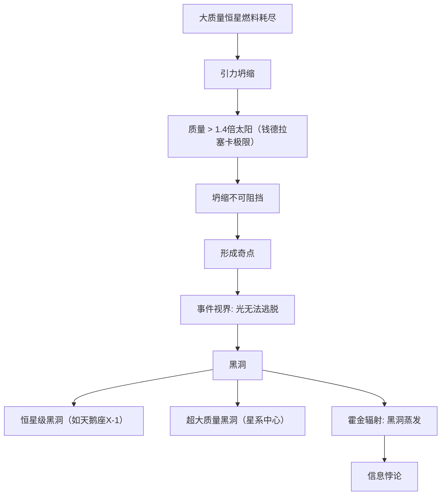
```mermaid
graph TD
    A[大质量恒星燃料耗尽] --> B[引力坍缩]
    B --> C[质量 > 1.4倍太阳（钱德拉塞卡极限）]
    C --> D[坍缩不可阻挡]
    D --> E[形成奇点]
    E --> F[事件视界: 光无法逃脱]
    F --> G[黑洞]
    G --> H[恒星级黑洞（如天鹅座X-1）]
    G --> I[超大质量黑洞（星系中心）]
    G --> J[霍金辐射: 黑洞蒸发]
    J --> K[信息悖论]
```

### 经典金句/数据
> “黑洞是宇宙中最完美的宏观物体。” ——苏布拉马尼扬·钱德拉塞卡 (p.107)
> 2019年4月事件视界望远镜发布首张黑洞照片（M87*，65亿倍太阳质量）。
> 霍金辐射：黑洞并非完全黑，具有温度。

---

## 第15章：标准模型

### 核心论点
问题：世界的基本构件是什么？四种基本力如何统一？作者观点：万物由12种物质粒子（费米子）和3种非引力作用力（电磁力、强力、弱力）的载力玻色子构成，再加上希格斯玻色子赋予质量。但标准模型只描述宇宙5%的质能，暗物质和暗能量是巨大谜团。

### 关键概念
- 费米子：物质粒子（电子、上夸克、下夸克、中微子及三代复制品），服从泡利不相容原理。
- 玻色子：力载体（光子、胶子、W⁺/W⁻/Z⁰玻色子）。
- 希格斯玻色子：为费米子和弱力载体赋予质量。
- 暗物质、暗能量：占宇宙95%的未知成分。

### 逻辑推演
标准模型是400年来物理学巅峰，精度达10位小数。但构成日常物质的只有三种粒子：电子、上夸克、下夸克。另外两代（μ子、τ子等）是不稳定副本。电磁力由光子传递；强力由胶子传递（夸克无法孤立）；弱力由W和Z玻色子传递（改变夸克味）。希格斯场对称性自发破缺产生希格斯玻色子，赋予质量。标准模型不包含引力，也不解释暗物质（25%）和暗能量（70%）。

### 流程图

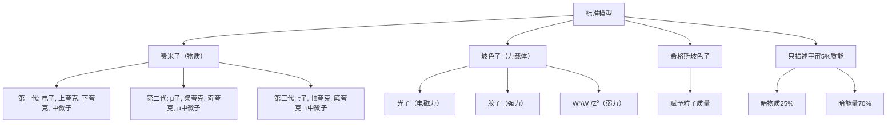
```mermaid
graph TD
    A[标准模型] --> B[费米子（物质）]
    A --> C[玻色子（力载体）]
    A --> D[希格斯玻色子]
    B --> E[第一代: 电子, 上夸克, 下夸克, 中微子]
    B --> F[第二代: μ子, 粲夸克, 奇夸克, μ中微子]
    B --> G[第三代: τ子, 顶夸克, 底夸克, τ中微子]
    C --> H[光子（电磁力）]
    C --> I[胶子（强力）]
    C --> J[W⁺/W⁻/Z⁰（弱力）]
    D --> K[赋予粒子质量]
    A --> L[只描述宇宙5%质能]
    L --> M[暗物质25%]
    L --> N[暗能量70%]
```

### 经典金句/数据
> “可能我们现代宇宙学中最尴尬的一点就在于那些占大部分却看不见的成分。” ——史塔西·麦高 (p.121)
> 标准模型精度高达10位小数。
> 宇宙中可见物质只占约5%，暗物质约25%，暗能量约70%。

---

## 第16章：量子计算机

### 核心论点
问题：量子计算机为什么比传统计算机强大得多？作者观点：量子比特可以同时处于0和1的叠加态，每增加一个量子比特，算力翻倍；量子计算机能模拟量子系统，彻底改变药物设计、材料科学和加密。

### 关键概念
- 量子比特：同时表示0和1（叠加），指数级并行计算。
- 并行宇宙解释：多伊奇认为量子计算机利用平行宇宙的计算资源。
- 退相干：量子比特脆弱，需要隔离和纠错。
- 秀尔算法：破解RSA加密。
- 模拟量子系统：费曼最初动机，可解决N体问题。

### 逻辑推演
费曼(1983)提出量子计算机概念。普通计算机比特每次只能0或1；量子比特叠加态可同时代表0和1。n个量子比特可同时表示2^n种状态。但量子比特极易被环境干扰（退相干），需要纠错（额外10-100个量子比特纠正1个）。秀尔算法证明量子计算机可快速分解大质数，威胁现代加密。更有前景的应用是模拟分子行为：开发新药、更高效电池、替代哈伯法制氨（占全球能耗航空业总量）。

### 流程图

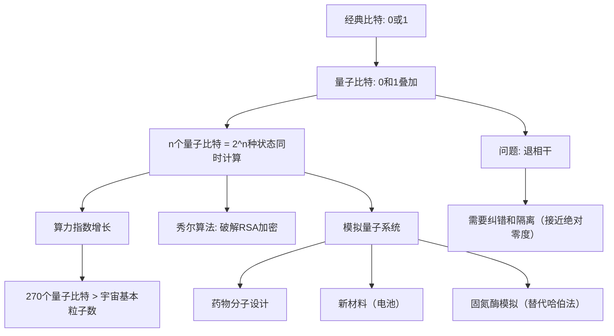
```mermaid
graph TD
    A[经典比特: 0或1] --> B[量子比特: 0和1叠加]
    B --> C[n个量子比特 = 2^n种状态同时计算]
    C --> D[算力指数增长]
    D --> E[270个量子比特 > 宇宙基本粒子数]
    C --> F[秀尔算法: 破解RSA加密]
    C --> G[模拟量子系统]
    G --> H[药物分子设计]
    G --> I[新材料（电池）]
    G --> J[固氮酶模拟（替代哈伯法）]
    B --> K[问题: 退相干]
    K --> L[需要纠错和隔离（接近绝对零度）]
```

### 经典金句/数据
> “即便你能想象出算盘和世界上最快的超级计算机之间的差距，你也依然丝毫无法想象出相比我们现在的计算机来说，量子计算机有多么强大。” ——朱利安·布朗 (p.122)
> 每增加一个量子比特，算力翻倍（指数的指数增长）。
> 一块方形面包的碳足迹中40%来自哈伯法制氨。

---

## 第17章：引力波

### 核心论点
问题：引力波是什么？如何探测？作者观点：引力波是时空结构中的波动，由加速的质量产生；2015年LIGO首次直接探测到双黑洞合并的引力波，开启了引力波天文学新时代。

### 关键概念
- 引力波：爱因斯坦1916年预言，时空的涟漪，以光速传播。
- LIGO：4千米激光干涉仪，可探测原子直径亿分之一的变化。
- 双黑洞合并：2015年9月14日首个事件（14亿光年外，3倍太阳质量转化为引力波）。
- 中子星合并：2017年8月17日事件，产生黄金等重元素。

### 逻辑推演
时空比钢铁坚硬1000亿亿亿倍，只有最剧烈的宇宙事件才能产生可探测引力波。LIGO在华盛顿和路易斯安那各有一个4千米臂，2015年探测到14亿光年外双黑洞合并，能量相当于宇宙中所有恒星总亮度的50倍。此后探测到90多个事件。2017年中子星合并被LIGO和Virgo探测到，同时传统望远镜观测到γ射线、光学对应体，证实了中子星合并是金、铂等重元素的来源。未来LISA空间探测器将探测低频引力波。

### 流程图

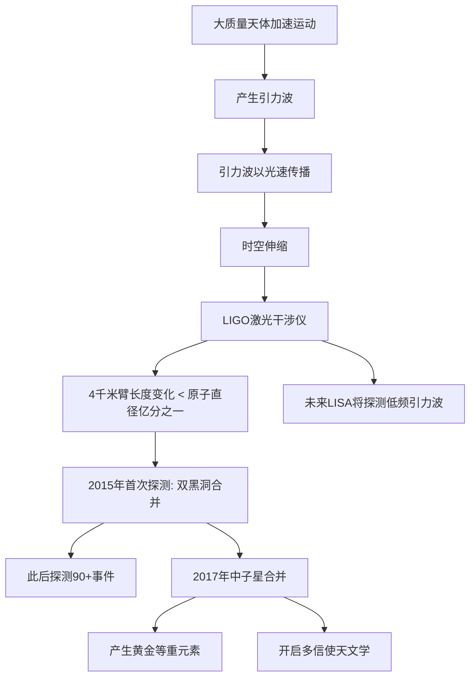
```mermaid
graph TD
    A[大质量天体加速运动] --> B[产生引力波]
    B --> C[引力波以光速传播]
    C --> D[时空伸缩]
    D --> E[LIGO激光干涉仪]
    E --> F[4千米臂长度变化 < 原子直径亿分之一]
    F --> G[2015年首次探测: 双黑洞合并]
    G --> H[此后探测90+事件]
    G --> I[2017年中子星合并]
    I --> J[产生黄金等重元素]
    I --> K[开启多信使天文学]
    E --> L[未来LISA将探测低频引力波]
```

### 经典金句/数据
> “女士们、先生们……我们探测到了引力波。我们成功了！” ——大卫·雷茨 (p.128)
> 双黑洞合并释放的引力波能量相当于宇宙中所有恒星总能量的50倍。
> 2017年中子星合并产生相当于地球质量10倍的金。

---

## 第18章：希格斯场

### 核心论点
问题：物质的质量从何而来？作者观点：物质的基本构件没有固有质量，它们通过与充满空间的希格斯场相互作用获得质量。希格斯玻色子是希格斯场的涟漪。

### 关键概念
- 希格斯场：充满整个空间的无形液体，对称性自发破缺后为基本粒子赋予质量。
- 对称性自发破缺：铅笔直立对称，倒下打破对称；希格斯场从对称转为不对称。
- 规范玻色子“吃掉”戈德斯通玻色子：W⁺、W⁻、Z⁰获得质量。
- 希格斯玻色子：2012年LHC发现，证明希格斯场存在。

### 逻辑推演
量子场论成功描述电磁力（局域规范不变性产生电磁力），但弱力载体必须有质量，这与规范理论矛盾。希格斯提出：弱力载体本无质量，通过与一个新场（希格斯场）的相互作用获得有效质量。对称性自发破缺产生无质量戈德斯通玻色子，被规范玻色子“吃掉”后赋予后者质量。剩余一个有质量的戈德斯通玻色子就是希格斯玻色子。2012年7月4日CERN宣布发现，彼得·希格斯流泪。希格斯场贡献人体质量的0.5%（其余来自夸克动能），但没有它，原子无法形成。

### 流程图

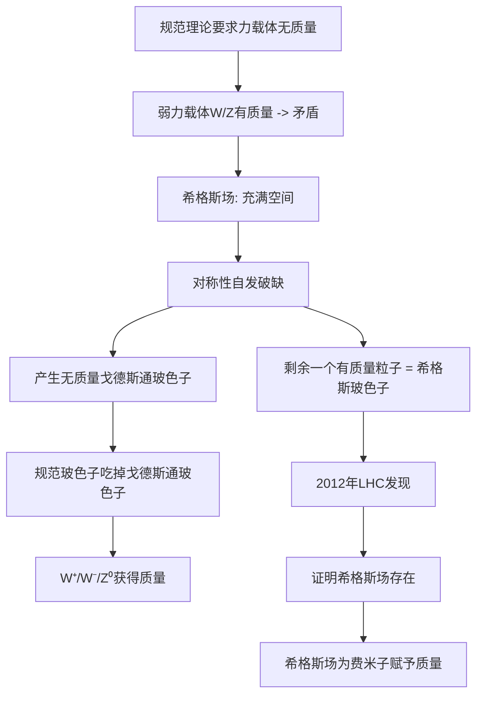
```mermaid
graph TD
    A[规范理论要求力载体无质量] --> B[弱力载体W/Z有质量 -> 矛盾]
    B --> C[希格斯场: 充满空间]
    C --> D[对称性自发破缺]
    D --> E[产生无质量戈德斯通玻色子]
    E --> F[规范玻色子吃掉戈德斯通玻色子]
    F --> G[W⁺/W⁻/Z⁰获得质量]
    D --> H[剩余一个有质量粒子 = 希格斯玻色子]
    H --> I[2012年LHC发现]
    I --> J[证明希格斯场存在]
    J --> K[希格斯场为费米子赋予质量]
```

### 经典金句/数据
> “这个夏天我发现了一些完全没用的东西。” ——彼得·希格斯 (p.135)
> 希格斯场只贡献你0.5%的质量，但这0.5%至关重要。
> LHC耗资50亿欧元，是世界上最大的科学仪器。

---

## 第19章：反物质

### 核心论点
问题：为什么存在反物质？为什么宇宙几乎由正物质构成？作者观点：每种亚原子粒子都有对应的反粒子（电荷相反等）。狄拉克方程预言了正电子。宇宙大爆炸应产生等量正反物质，但观测显示正物质占绝对主导，这是未解之谜。

### 关键概念
- 狄拉克方程：相对论量子力学方程，自动预言正电子（电子的反粒子）。
- 正电子：带正电的电子，1932年安德森在宇宙射线中发现。
- 湮灭：物质与反物质相遇时100%转化为能量（光子）。
- 正电子发射断层扫描(PET)：医学成像利用正电子湮灭。

### 逻辑推演
狄拉克追求方程之美，写下相对论电子方程，意外得出电子有双胞胎（带正电）。当时认为荒谬，但安德森在云室中拍到正电子轨迹。反物质存在是因为电荷守恒：光子（不带电）转化为电子时，必须同时产生正电子以保持总电荷为零。问题：大爆炸应等量产生正反物质，但它们会全部湮灭，宇宙只剩光子。实际每100亿个反物质粒子对应100亿零一个物质粒子，湮灭后剩一个物质粒子和100亿个光子。为何存在这种不对称？未知。

### 流程图

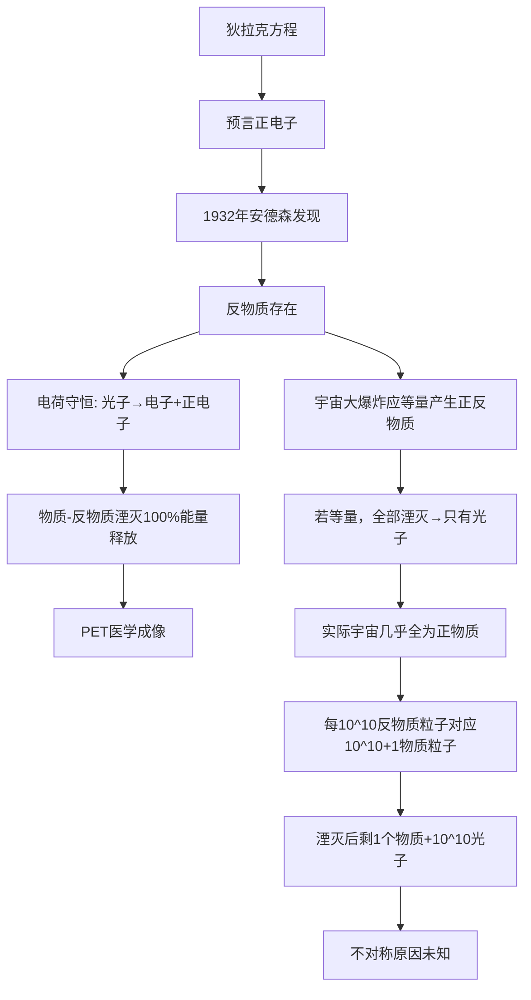
```mermaid
graph TD
    A[狄拉克方程] --> B[预言正电子]
    B --> C[1932年安德森发现]
    C --> D[反物质存在]
    D --> E[电荷守恒: 光子→电子+正电子]
    E --> F[物质-反物质湮灭100%能量释放]
    F --> G[PET医学成像]
    D --> H[宇宙大爆炸应等量产生正反物质]
    H --> I[若等量，全部湮灭→只有光子]
    I --> J[实际宇宙几乎全为正物质]
    J --> K[每10^10反物质粒子对应10^10+1物质粒子]
    K --> L[湮灭后剩1个物质+10^10光子]
    L --> M[不对称原因未知]
```

### 经典金句/数据
> “想一想二进制吧。当物质与反物质相遇时，两种东西同时化为乌有，转换成纯粹的能量。” ——约翰·厄普代克 (p.147)
> 宇宙中每个物质粒子对应约100亿个光子。
> PET扫描利用正电子湮灭产生γ射线成像。

---

## 第20章：中微子

### 核心论点
问题：中微子是什么？为什么它们难以探测但数量巨大？作者观点：中微子是一种几乎不与物质相互作用的幽灵粒子，由核反应产生，宇宙中数量仅次于光子。它们有三种“味道”，可以在飞行中振荡，证明具有微小质量。

### 关键概念
- 中微子：泡利1930年为挽救β衰变能量守恒而提出，电中性，质量极小（约电子百万分之一）。
- 中微子振荡：三种味道（电中微子、μ中微子、τ中微子）之间相互转换，证明有质量。
- 中微子天文学：探测太阳中微子（戴维斯实验）、超新星中微子。

### 逻辑推演
β衰变中电子能量连续变化，似乎违反能量守恒。泡利提出存在不可见粒子带走部分能量（中微子）。莱因斯和科温1956年首次探测到核反应堆中微子。戴维斯用干洗剂探测太阳中微子，发现只有理论预测的三分之一（太阳中微子之谜）。加拿大萨德伯里观测站发现中微子振荡，三种味道总和符合理论。振荡证明中微子有质量（否则不会变化）。中微子在超新星爆发中带走99%能量，并帮助重元素扩散到宇宙。

### 流程图

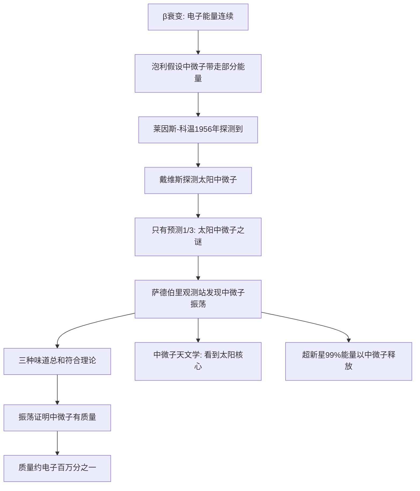
```mermaid
graph TD
    A[β衰变: 电子能量连续] --> B[泡利假设中微子带走部分能量]
    B --> C[莱因斯-科温1956年探测到]
    C --> D[戴维斯探测太阳中微子]
    D --> E[只有预测1/3: 太阳中微子之谜]
    E --> F[萨德伯里观测站发现中微子振荡]
    F --> G[三种味道总和符合理论]
    G --> H[振荡证明中微子有质量]
    H --> I[质量约电子百万分之一]
    F --> J[中微子天文学: 看到太阳核心]
    F --> K[超新星99%能量以中微子释放]
```

### 经典金句/数据
> “整整8光年厚的铅……你需要用这么厚的金属把自己包起来才能避免被中微子撞到。” ——迈克尔·夏邦 (p.150)
> 每秒钟有1000亿个中微子穿过你的指甲。
> 中微子从太阳核心到地球只需2秒（光子需3万年）。

---

## 第21章：宇宙大爆炸

### 核心论点
问题：宇宙如何开始？为什么宇宙在膨胀？作者观点：宇宙诞生于138.2亿年前一个炽热、致密的状态，随后膨胀、冷却，形成星系。大爆炸模型由膨胀、宇宙微波背景辐射、轻元素丰度三大支柱支持，但需要暗物质、暗能量和暴胀来补充。

### 关键概念
- 宇宙膨胀：哈勃1929年发现星系退行。
- 宇宙微波背景辐射：大爆炸余晖，1965年彭齐亚斯和威尔逊发现，温度约-270°C。
- 暴胀：极早期宇宙的超快速膨胀（10⁻³⁶秒内膨胀至少10²⁶倍），解决视界问题和平坦性问题。
- 暗能量：加速宇宙膨胀，占70%质能。

### 逻辑推演
爱因斯坦静态宇宙引入宇宙学常数，弗里德曼和勒梅特发现宇宙必须膨胀或收缩。哈勃观测证实膨胀。伽莫夫预言大爆炸余晖，1965年意外发现。霍伊尔讽刺性命名“大爆炸”。暴胀理论解决视界问题（均匀性）和磁单极子问题。暗物质加速星系形成，暗能量驱动加速膨胀。大爆炸只制造了氢、氦等轻元素；重元素在恒星中合成。

### 流程图

```mermaid
graph TD
    A[爱因斯坦广义相对论] --> B[弗里德曼/勒梅特: 宇宙必须膨胀]
    B --> C[哈勃1929观测到膨胀]
    C --> D[伽莫夫: 早期宇宙炽热致密]
    D --> E[预言宇宙微波背景辐射]
    E --> F[1965年彭齐亚斯/威尔逊发现]
    F --> G[三大支柱: 膨胀+背景辐射+轻元素丰度]
    C --> H[暗物质: 加速星系形成]
    C --> I[1998年发现宇宙加速膨胀 → 暗能量]
    D --> J[暴胀: 解决视界问题]
    J --> K[宇宙起源于量子涨落]
```

### 经典金句/数据
> “氢是一种很轻的，无色无味的气体，但只要给它足够的时间，它就能变成人。” ——爱德华·哈里森 (p.159)
> 宇宙微波背景辐射占宇宙中99.9%的光子。
> 暗能量使宇宙加速膨胀，理论预测与观测相差10^120倍（史上最大误差）。

---

## 术语表（精选）

### 核心论点
术语表对书中关键科学概念提供简洁定义，帮助读者快速查阅。

### 关键概念（部分）
- **反物质**：由反粒子构成的物质；当与正物质相遇时湮灭。
- **玻色子**：整数自旋的粒子，可无限堆积（如光子）。
- **费米子**：半整数自旋的粒子，服从泡利不相容原理（如电子）。
- **熵**：无序程度的度量；热力学第二定律规定熵永不减少。
- **希格斯玻色子**：希格斯场的涟漪，赋予粒子质量。
- **量子纠缠**：粒子间瞬时的相互影响，违背经典局域性。
- **暗能量**：具有负引力，驱动宇宙加速膨胀。
- **暗物质**：不可见但有引力，占宇宙质能25%。

### 经典金句/数据
> “泡利曾用一箱香槟打赌没有人能够探测到中微子。” (p.151)
> “我们从未真正观察世界，我们观察的是自己。” (p.61)

---