# 《策略产品经理实践指南》章节总结

## 书籍信息
- **书名**：策略产品经理实践指南：AI时代的用户增长与智慧运营
- **作者**：张秀军（昵称“小意”）
- **出版社**：人民邮电出版社
- **出版时间**：2024-07-01
- **ISBN**：9787115631329
- **PDF/OCR状态**：基于EPUB文本提取，内容完整可识别。

## 目录说明
- 目录识别情况：完整识别，包括版权信息、内容提要、推荐语、致读者、前言、第一部分（第1-5章）、第二部分（第6-18章）。
- 章节对应依据：按照原书目录顺序输出。
- OCR修复说明：无。

## 全书核心主题
本书系统介绍策略产品经理所需的知识体系，聚焦如何将业务诉求转化为产品策略模型，以数据驱动决策，实现用户增长和智慧运营。内容涵盖推荐系统、智能营销、用户画像、AB实验等核心领域，并通过大量B2B电商平台案例（社区团购、商品详情页推荐、过滤策略、价格带挖掘、用户分层、优惠券营销等）展示策略设计、公式推导和落地方法。作者强调策略产品经理需融合算法能力与业务能力，输出可复用的策略模型，最终提升业务指标（GMV、转化率、用户黏性等）。

---

## 版权信息
- 书名、作者、出版社、出版时间、ISBN。

## 内容提要
- 本书面向策略产品经理及搜索、推荐、广告、营销、用户增长等领域从业者，提供策略理念、思维和方法论，通过案例帮助读者提升业务实践能力。

## 推荐语
- 多位业内专家（金山办公、B站、爱空间、字节跳动等）推荐，肯定本书的实践性和对AI时代策略产品经理的指导价值。

## 致读者
- 作者鼓励读者坚持学习，指出策略产品经理是“天花板中的天花板”，尤其在不成熟团队中需要懂算法和业务。书中逻辑和公式来自真实业务场景，难度较高，但希望读者拆解学习，最终能自己设计策略。

## 前言
- 阐述策略产品经理产生的背景：信息爆炸、大数据发展，需要从噪声中提取信号。策略是“基于大数据的决策链”，要求产品经理懂数据挖掘、统计学、算法、用户体验等。
- 本书面向对象：传统产品经理、搜索/推荐/广告/营销/增长领域产品经理、市场运营人员、数据分析师、算法工程师、理工科学生等。
- 如何阅读：第一部分基础知识（推荐系统、AB实验、智能营销），第二部分案例实践（推荐策略、智能营销策略、企业经营分析解决方案）。书中公式为作者独创，部分方法已授权专利。

---

## 第一部分 基础知识篇

### 第1章：策略的价值与分类

#### 1. 核心论点
本章解决“策略的价值是什么以及如何分类”的问题。作者认为策略通过个性化调节流量结构，提升用户访问深度和转化率，既带来非商业价值（促活、留存、获客），也带来商业价值（广告、电商、增值服务的增量收益）。

#### 2. 关键概念/事件
- **ECPM/CPM/CPC/CPA/CPS/CPT**：不同广告计费模式。
- **ROI**：投入产出比。
- **GMV**：商品交易总额。
- **用户生命周期**：认知期、吸引期、引入期、成长期、成熟期、衰退期、沉睡期。
- **“20∶30∶50”销售原则**：20%忠诚用户、30%一般购买力用户、50%新用户/潜在用户。
- **策略分类**：推荐策略、搜索策略、广告策略、智能营销策略。

#### 3. 逻辑推演/叙事脉络
从互联网存量用户价值切入，提出策略的价值在于科学管理用户、挖掘诉求。非商业价值体现为促活和留存；商业价值体现为广告（如OCPM）和电商（如品牌C2M定制）。策略分类中，推荐系统是基础能力，广告与智能营销类似（时间、地点、人物、事件）。最后通过一个品牌增长案例（将用户分层为忠诚用户、一般购买力用户、新用户，分别推荐新品、优惠券、低价促销）展示简单策略设计。

#### 4. 经典金句/数据
> “策略的决策过程中必须有大数据的‘参与’，是基于大数据的决策链，摒弃了‘拍脑袋’决策。”
> “策略产品经理要解决的是业务效果提升的问题，需要把业务诉求作为输入，把策略模型作为输出。”

---

### 第2章：推荐系统基础知识

#### 1. 核心论点
本章解决“推荐系统是什么以及如何演进”的问题。作者认为推荐系统是一个信息过滤工具，通过召回、排序、重排逻辑，从海量物料中筛选用户可能感兴趣的物品，提升用户体验和平台收益。

#### 2. 关键概念/事件
- **CTR/CVR**：点击率/转化率。
- **U2I / I2I / U2U2I / U2I2I**：不同协同过滤路径。
- **推荐系统演进**：从时间序排序到未读池前置，再到个性化兴趣预估。
- **推荐位分类**：购前（首页、我的页面）、购中（商品详情页、购物车页）、购后（支付成功页、订单详情页）。
- **过滤/穿插/打散**：重排三大策略。
- **推荐与搜索的区别**：推荐是用户被动接受，搜索是用户主动意图。

#### 3. 逻辑推演/叙事脉络
首先解释推荐系统解决信息过载问题，对比搜索和广告。随后按历史演进介绍电商和内容平台的推荐发展路径（V1.0至V5.0）。然后详细说明推荐结果获取流程：用户请求→召回→排序→重排，并分别解释过滤、穿插、打散的含义。再按购前、购中、购后场景介绍不同推荐位的定位和策略（如首页“为你推荐”侧重发现兴趣，商品详情页侧重相关购买）。最后对比推荐系统与搜索系统、计算广告的本质区别。

#### 4. 流程图

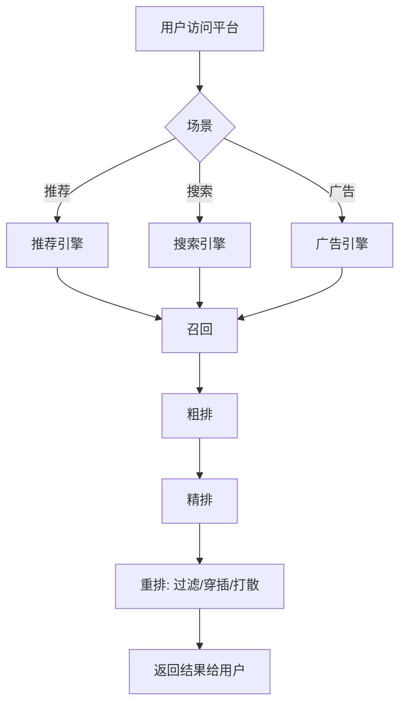

#### 5. 经典金句/数据
> “推荐系统是一个信息过滤工具，解决的是如何让数据流通更高效。”
> “购物车推荐策略比较复杂，包括购物车内有商品、购物车内无商品两类情况。”

---

### 第3章：推荐系统的架构及算法

#### 1. 核心论点
本章解决“推荐系统的整体架构和核心算法模块如何设计”的问题。作者强调理解架构才能保证底层与业务层解耦，实现高复用性。架构包括业务场景接入、数据基础建设（用户模型、商品模型）、召回模型、排序模型（粗排、精排、重排）。

#### 2. 关键概念/事件
- **召回策略**：热度召回、热销召回、用户行为召回、品牌/品类偏好召回、行为序列召回、U2I/I2I等。
- **排序模型**：LR、GBDT、DeepFM、Wide&Deep、DCN等。
- **长短期兴趣偏好**：长期兴趣标签（如美食）和短期兴趣标签（如户外旅游），使用牛顿冷却定律计算衰减。
- **无量纲化算法**：线性函数归一化（Min-Max Scaling），用于消除量纲影响。
- **策略PRD结构**：需求背景→解决方案（选人、选品、召回、排序、重排）→应用场景→效果指标。

#### 3. 逻辑推演/叙事脉络
先介绍专业名词（召回、排序相关）。然后给出推荐系统架构图（复杂版和简化版），从下至上说明：业务诉求输入→用户模型（画像、行为序列、长短期兴趣）和商品模型（品类、价格、品牌等）→召回层（多路召回）→排序层（粗排、精排、重排，涉及质量分、实时反馈、CTR/CVR预估等）→重排策略。接着解释推荐策略的三种粒度（千人一面、千人十面、千人千面）和基础算法。强调线性函数归一化的重要性并给出公式。最后给出策略PRD的标准结构和一个实时排序的案例。

#### 4. 流程图（简化架构）

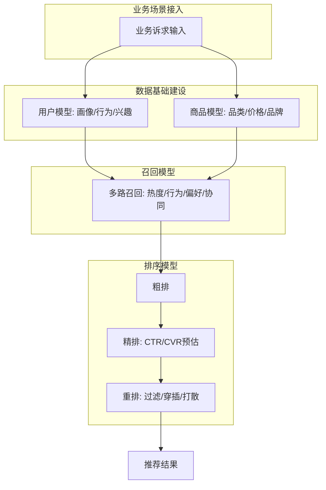

#### 5. 经典金句/数据
> “线性函数归一化很重要，大多数的计算逻辑都需要进行归一处理后方可使用，归一化可保证数据参与计算的公平性。”
> “B2B和B2C场景的推荐策略有很大差异，B2B因行为数据不直接代表用户诉求使制定推荐策略变得更难。”

---

### 第4章：用AB实验量化策略效果

#### 1. 核心论点
本章解决“如何科学评估策略效果”的问题。作者认为AB实验是检验策略改进是否有效的核心方法，通过分流、分桶、置信区间和P值计算，对比实验组与对照组的数据指标，判断策略是否显著提升业务指标。

#### 2. 关键概念/事件
- **分流/分桶**：从总体中随机抽样部分流量，再分为实验组和对照组。
- **中心极限定理、大数定理**：统计学基础。
- **置信区间、显著性P值**：判断实验是否统计显著。
- **记忆口诀**：置信区间“先算标准误，查出Z分数，相乘再相加，区间自然显”；P值“先算标准误，再算Z分数，根据Z值算P值”。
- **AA实验**：验证分桶是否均衡。
- **小流量高波动场景**：B2B平台大订单导致波动，需AA实验和置信区间判断。

#### 3. 逻辑推演/叙事脉络
先介绍AB实验的基础统计知识（中心极限定理、大数定理、置信区间、P值），给出计算口诀和Python代码示例。然后说明实验注意事项（时间一致性、数据分布一致性、置信水平、分流分桶）。对比AB实验与离线评估的适用场景。接着给出AB实验系统架构（实验配置、分桶埋点、数据存储、T+1离线计算、数据统计分析、数据看板）。列出电商平台通用数据口径（曝光量、点击量、转化率等）。最后针对小流量高波动B2B平台，提出先做AA实验、再计算置信区间和P值的解决方案，并强调只有当置信区间上下限同号且P值<0.05时策略才可上线。

#### 4. 流程图（AB实验系统架构）


#### 5. 经典金句/数据
> “AB实验能帮助我们在现有流量中获取更多的收益，在现有流量中提升ROI。”
> “只有统计显著的结果才可以引导决策。”
> 代码示例：使用Python计算P值，判断是否显著。

---

### 第5章：智能营销

#### 1. 核心论点
本章解决“智能营销是什么以及与传统营销的区别”的问题。作者认为智能营销（精准营销）是在合适的时间和场景，对合适的人说合适的话，通过“时间、地点、人物、事件”四个因子，实现用户转化率提升和客单价增长。

#### 2. 关键概念/事件
- **智能营销因子**：时间、地点、人物、资源（事件）。
- **与推荐系统的差异**：推荐系统是被动等待用户查看，智能营销是主动触发（弹窗、推送等）。
- **GMV拆解**：GMV = 客单价 × UV × 转化率。
- **用户分层**：RFM模型或用户生命周期模型。
- **利益点**：低价商品、优惠券、红包等刺激转化的元素。

#### 3. 逻辑推演/叙事脉络
从互联网流量红利触顶、存量用户管理重要性出发，指出常规营销方法遇到瓶颈。然后对比推荐系统和智能营销系统的不同（触发方式、触点、时效性）。通过一个店铺“双十一”策略案例，说明如何通过优惠券、促销、搭配购等提升客单价和转化率。最后提出智能营销策略的本质：通过用户分层和精准分发，让不同人群所见物料符合其偏好，实现用户从认知到忠诚的成长。

#### 4. 流程图

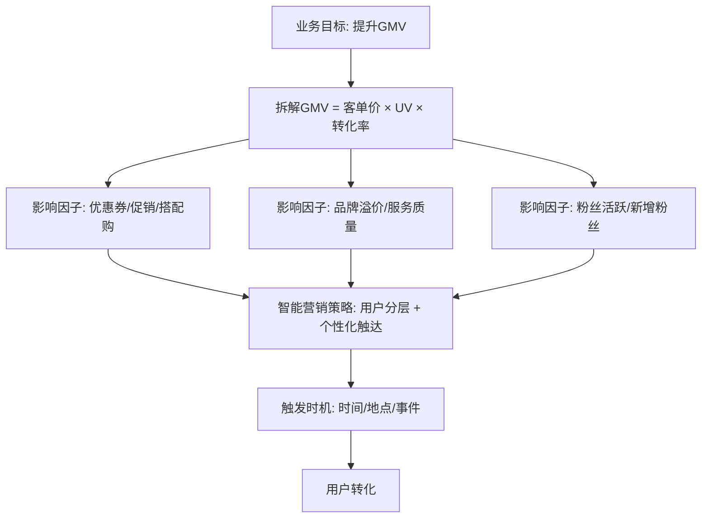

#### 5. 经典金句/数据
> “智能营销就是挖掘用户的潜在诉求，让原本当下没消费计划的用户能够提前消费，让有购买诉求的用户在个人能力承受范围内将消费金额提升。”
> “智能营销是在合适的时间和场景主动和用户说他想听的话，而推荐系统是把对用户说的话摆在那里，等着用户自己去看。”

---

## 第二部分 案例实践篇

### 第6章：从0到1搭建社区团购推荐系统

#### 1. 核心论点
本章解决“冷启动阶段如何搭建社区团购推荐系统”的问题。作者基于促销力度和促销时效性因子，设计多路召回（生鲜品、区域流通品、日百商品）和穿插排序策略，实现无历史数据沉淀下的商品推荐。

#### 2. 关键概念/事件
- **社区团购模式**：基于LBS的社区居民下单，次日到店自提。
- **冷启动**：无用户行为数据，依赖统计规则模型。
- **促销综合得分**：Score1 = 促销力度 × 促销活动时效性，其中促销力度=（原价-一口价）/原价，时效性=ln(10+30/促销时长)。
- **热销得分**：Score2 = 下单用户数×0.5 + 订单数×0.4 + 订单金额×0.1（经取对数+归一化）。
- **穿插排序**：生鲜:区域流通品:日百 = 3:1:1 的绝对顺序。

#### 3. 逻辑推演/叙事脉络
先说明从产品经理角度搭建推荐系统需要多个团队支持，产品经理重点是策略输出。以社区团购为例，分析用户（下沉市场、价格敏感）、商品（生鲜非标品、标品日百、区域流通品）。提出冷启动阶段无法使用算法模型，故采用统计规则。生鲜品关注促销力度和时效性；日百商品借助其他渠道历史数据计算热销分；区域流通品类似生鲜。最后多路召回池按3:1:1穿插排序，并设置热销商品托底。

#### 4. 流程图

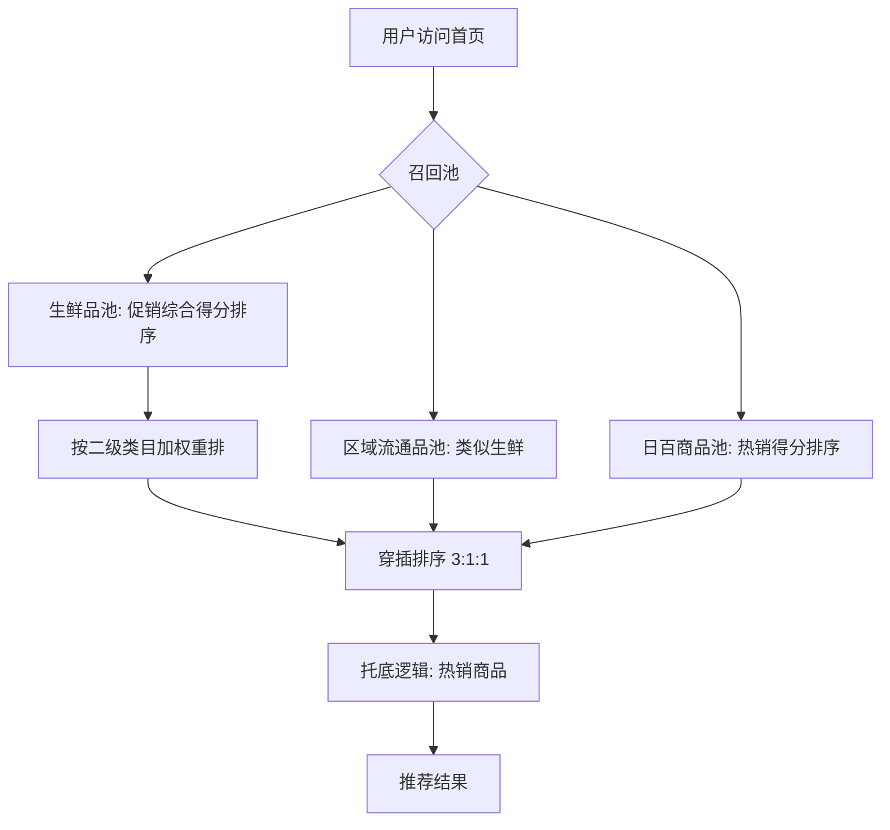

#### 5. 经典金句/数据
> “社区团购项目处于冷启动阶段，商品量级有限，因此在召回池没做截断处理，全部商品均被召回。”
> “线性函数归一化很重要，大多数的计算逻辑都需要进行归一处理后方可使用。”

---

### 第7章：用户画像挖掘及应用——品牌品类偏好

#### 1. 核心论点
本章解决“如何从用户行为数据中挖掘品牌和品类偏好标签”的问题。作者提供三套方案：基于累计行为次数的统计算法、基于行为归一并融合衰减因子的统计算法、算法模型预测，并说明标签的应用场景。

#### 2. 关键概念/事件
- **长期兴趣 vs 短期兴趣**：长期兴趣代表稳定偏好，短期兴趣随时间衰减。
- **行为强弱权重**：下单(8) > 加购(5) > 搜索点击(3) > 浏览(1)。
- **K_n 计分**：同一用户对同一商品一天内多次操作，得分累加规则为1+1/2+1/4+…。
- **衰减因子**：使用牛顿冷却定律或类似逻辑计算行为衰减。
- **标签格式**：用户ID，标签名：标签分。

#### 3. 逻辑推演/叙事脉络
先说明用户画像挖掘的必要性（提升推荐准确性）。然后分析长短期兴趣差异，强调短期随机行为不能代表长期标签。接着给出方案1：统计最近90天行为，按强弱权重和K_n计分，累加得到品牌/品类偏好得分。方案2：用订单金额、订单数、行为占比，结合线性归一化和衰减系数。方案3：依赖算法模型。最后说明标签可应用于算法特征、精准营销、分类页排序等。

#### 4. 经典金句/数据
> “用户标签能代表用户具有某类特征，由此可见，用户兴趣标签应该是长期兴趣标签，而短期兴趣仅作短期行为偏好应用。”
> 方案1公式：Score(每天) = ∑(下单×K_n×8 + 加购×K_n×5 + 搜索点击×K_n×3 + 浏览×K_n×1)

---

### 第8章：用户画像挖掘及应用——价格带

#### 1. 核心论点
本章解决“如何挖掘用户对不同品类的价格带偏好”的问题。作者提出三种方案：聚类模型划分价格带、人工标注高中低档、基于商品单位购买力计算价格带，并给出详细的计算逻辑和应用方法。

#### 2. 关键概念/事件
- **价格带**：商品销售价格的上限与下限之间的范围。
- **箱规**：商品的规格（重量、体积、包装等）。
- **K-Means聚类**：用于划分价格区间。
- **单位购买力**：商品价格/商品重量（最小粒度价格）。
- **分位数区间**：将单位价格划分为10个分位数，确定商品所在区间。

#### 3. 逻辑推演/叙事脉络
先提出用户对价格的偏好是区间而非绝对值，且需分品类计算。通过数据分析发现商品价格分布右偏态，需要剔除离群点。方案1：用K-means聚类划分价格带，并给用户打上“品类+价格带”标签。方案2：人工标注商品高中低档，根据用户购买分布打标签。方案3（最复杂）：计算商品单位购买力，先提取商品标题中的重量信息，结合地域到手价，计算单位价格，再按分位数划分10个区间，最终得到商品和用户的单位购买力标签（0-1之间）。最后以店铺页排序为例，展示如何用价格带标签调整商品排序（差值匹配、加权系数）。

#### 4. 流程图（单位购买力计算）

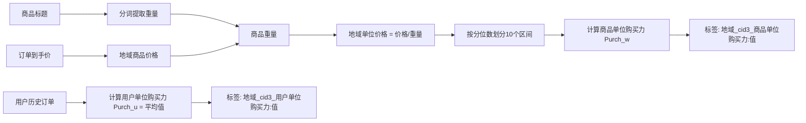

#### 5. 经典金句/数据
> “通过消费者行为反馈得知，部分用户常购商品的价格比推荐商品的价格更低，若要提升推荐商品精准度，就要尽量推荐‘价格处于可承担范围’的商品。”
> “商品单位购买力 Purch_w = (Q - Q_m) / (Q_n - Q_m) × (q_n - q_m) + q_m”

---

### 第9章：过滤策略——让更多商品曝光

#### 1. 核心论点
本章解决“B2B电商平台中如何设计过滤策略以增加商品曝光机会”的问题。作者针对B端用户高复购、多次比价的特点，提出对加入购物车商品、已下单商品、曝光多次未点击商品分别设计过滤和再召回逻辑。

#### 2. 关键概念/事件
- **B2B vs B2C 行为差异**：B端用户需要多次浏览比价，不应立即过滤浏览过的商品。
- **过滤池**：满足过滤条件的商品进入池子，定期移出。
- **复购周期**：全量用户复购周期和个人复购周期，用于决定再召回时间。
- **曝光阈值**：统计用户首次点击商品时的曝光时长中位数，作为判断是否无效曝光的标准。
- **降权次数**：曝光大于阈值但仍未点击，则降权（×0.85），最多降权5次，3天后召回。

#### 3. 逻辑推演/叙事脉络
先分析B2B平台用户行为（比价、复购高），提出不能简单过滤浏览过的商品。针对加入购物车商品：动态计算加购时长与复购周期的关系，决定何时再召回。针对下单商品：类似逻辑，使用复购周期。针对曝光多次未点击商品：统计曝光阈值（中位数），超过阈值则降权，仍无点击则过滤，3天后召回。所有再召回时间点都参考个人复购周期与全量用户复购周期，取较小值。

#### 4. 流程图（过滤再召回流程）

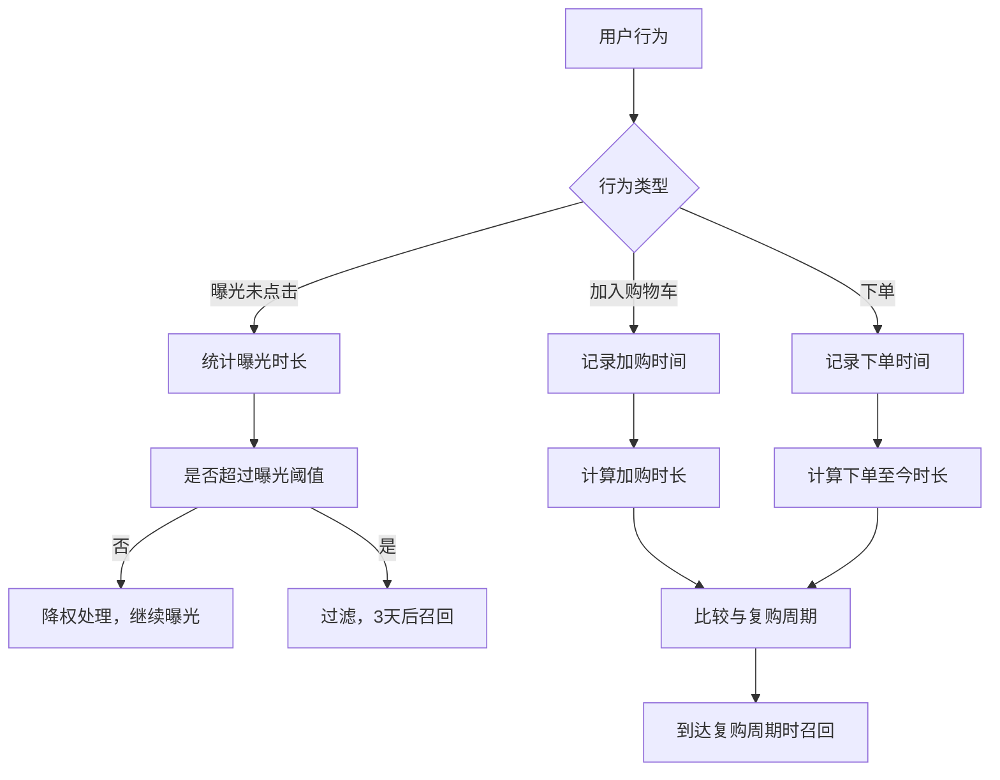

#### 5. 经典金句/数据
> “B2B平台用户的行为特征是多次访问商品详情页进行商品比对，对刚刚浏览过的商品进行过滤是不符合业务场景的。”
> “过滤策略起到调节App整体流量结构的作用，通过过滤策略增加用户感兴趣物料的曝光机会。”

---

### 第10章：商品详情页“看了又看”策略——提升下单转化率

#### 1. 核心论点
本章解决“如何设计商品详情页‘看了又看’推荐栏位以提升转化率”的问题。作者针对B2B平台高复购特点，融合关联性购买和关联性浏览两个指标，给出统计规则和算法模型两种方案。

#### 2. 关键概念/事件
- **关联购买**：购买A商品后又购买B商品的人数比例（置信度）。
- **关联浏览**：同一访问周期内浏览A后又浏览B的人数比例。
- **置信度（Score_SKU1）**：购买A和B的人数 / 购买A的人数。
- **支持度（Score_user1）**：购买A和B的人数 / 总购买人数。
- **综合得分**：Score = Score_SKU1 × α + Score_SKU2 × (1-α)

#### 3. 逻辑推演/叙事脉络
先指出商品详情页推荐的目标是让用户买更多。B2C场景下通常只用关联浏览，但B2B高复购场景需要加入关联购买因子。方案1（统计规则）：从近180天订单中计算关联购买的支持度和置信度，过滤支持度<0.2的组合；同样计算关联浏览。然后按权重α融合，得到综合得分排序。方案2：使用FP Growth或Apriori算法模型实现。

#### 4. 流程图

```mermaid
graph TD
    A[主商品SKU] --> B[关联购买计算]
    A --> C[关联浏览计算]
    B --> D[Score_SKU1 = 购买A&B人数/购买A人数]
    C --> E[Score_SKU2 = 浏览A&B人数/浏览A人数]
    D --> F[综合得分 = α*Score_SKU1 + (1-α)*Score_SKU2]
    E --> F
    F --> G[排序推荐]
```

#### 5. 经典金句/数据
> “在B端场景下，仅仅通过与主品的关联浏览来推荐，很难在短暂的补货周期内吸引用户下单，因此需要额外增加关联性购买的因子。”
> 过滤阈值：Score_user1 < 0.2 的组合被过滤掉。

---

### 第11章：品类角色管理及应用——通过高毛利单品效用提升转化率

#### 1. 核心论点
本章解决“如何通过品类角色管理动态调权高毛利商品以提升平台收益”的问题。作者使用GMV贡献率和边际贡献利润率两个维度划分四象限（明星、利润、引流、补充），并基于用户行为的加权平均和与毛利值重新定义SKU等级（0-4级），实现动态加权重排。

#### 2. 关键概念/事件
- **品类角色**：明星品类、利润品类、引流品类、补充品类。
- **四象限模型**：横坐标GMV贡献率，纵坐标边际贡献利润率。
- **新原点**：通过计算所有SKU的毛利均值和用户行为加权得分均值，找到新坐标系原点。
- **SKU等级**：0（毛利为负）、1（低GMV低行为）、2（低毛利高行为）、3（高毛利低行为）、4（高毛利高行为）。
- **权重系数**：等级4系数1.2，等级3系数1.1，等级2系数0.9，等级1系数0.8，等级0系数0.5。

#### 3. 逻辑推演/叙事脉络
先说明品类角色管理的目标：实现单品效益最大化。通过分析各品类的GMV和净利数据，划分四象限。但直接使用(0,0)原点不合适，需要找到新原点。计算每个SKU的毛利和基于用户行为的加权平均和（含下单用户数、订单数、金额、加购、搜索、浏览），取两者的均值作为新原点。然后将每个SKU映射到新象限，得到1-4等级。最后在粗排后按等级赋予不同权重进行重排。

#### 4. 流程图

```mermaid
graph TD
    A[SKU毛利数据] --> B[计算毛利均值 S1]
    C[用户行为数据] --> D[计算加权平均和 Score]
    D --> E[计算 Score 均值 S2]
    B --> F[新原点 (S1, S2)]
    E --> F
    F --> G[每个SKU与原点比较，确定象限]
    G --> H[映射为等级1-4 (0为负毛利)]
    H --> I[赋予权重系数]
    I --> J[重排推荐]
```

#### 5. 经典金句/数据
> “引流品类和利润品类在策略上要逐渐向明星品类转化。”
> “如果一个商品被划分到哪个角色象限内，则会接受哪种品类营销的运营策略。”

---

### 第12章：商品扶持流量调配系统——提升营销商品曝光率及转化率

#### 1. 核心论点
本章解决“如何在不损害整体转化率的前提下，强制扶持特定商品（如高毛利、母婴、名酒等）增加曝光”的问题。作者提出两步策略：第一步在首页推荐栏位固定坑位（第7、14、21…位）进行强曝光；第二步将商品移入独立召回池，基于DeepFM算法和SKU等级动态调权。

#### 2. 关键概念/事件
- **马太效应**：头部商品越卖越好，长尾商品难曝光。
- **固定资源位**：根据用户流失曲线，选择第7、14、21等坑位强曝光营销商品。
- **CMS配置**：活动类型、人群包、商品包、曝光生效时间、曝光处理（如曝光3次降权）。
- **U2I偏好分**：基于用户和商品特征向量的距离。
- **商品质量分**：基于下单用户数、订单量、GMV，经归一化加权。
- **DeepFM算法**：用于排序。
- **动态权重**：结合SKU等级（0-4）对DeepFM得分调权。

#### 3. 逻辑推演/叙事脉络
先分析传统做法（增加独立召回池、强制加权）的弊端——挤压用户感兴趣商品曝光，导致转化下降。然后提出分两步：第一步在首页固定坑位（用户流失拐点）强曝光营销商品，通过CMS配置人群和商品，按U2I和商品质量分排序，且连续曝光3次后降权。第二步活动结束后，商品进入独立离线召回池，用DeepFM计算初始分，再结合SKU等级（见第11章）进行动态调权，实现可持续的扶持。

#### 4. 流程图

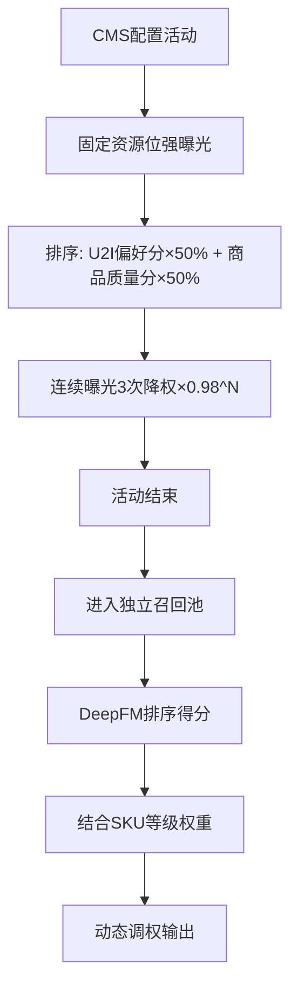

#### 5. 经典金句/数据
> “强制曝光一批商品给用户，多少会对整个推荐栏位的数据效果产生一定的影响。”
> “用户出现明显流失状态时已曝光的SKU个数为7，故每隔7个SKU增加一个资源位。”

---

### 第13章：内容电商平台推荐系统冷启动策略

#### 1. 核心论点
本章解决“在已有电商平台上新引入内容生态（短视频、直播、图文）时，如何实现冷启动推荐”的问题。作者通过建立内容标签体系和内容质量分，在首页推荐栏位穿插短视频，并设计短视频频道页的排序逻辑。

#### 2. 关键概念/事件
- **内容标签分层**：一级（图文/短视频/直播）、二级（带货/非带货）、三级（具体标签如宝妈、母婴）。
- **标签相关性**：基于词频（P1 * P2）计算，得分>0.8为强相关，0.4-0.8为一般，<0.4为不相关。
- **内容质量分**：score = W×10% + C×20% + T×70%（博主质量、内容质量、时效性）。
- **穿插位置**：根据用户流失拐点，在首页推荐流第11、29、49位穿插短视频。
- **频道页排序**：关注池与未关注池按内容类型1:1:1穿插，再按关注:未关注=3:1穿插。

#### 3. 逻辑推演/叙事脉络
先说明内容电商的背景和挑战（无法做到千人千面）。然后初步建立标签体系：定义一级、二级、三级标签，通过词频计算标签相关性，仅保留强相关标签。内容质量分考虑博主粉丝数、视频有效播放、发布时效。冷启动阶段在首页“为你推荐”栏位按用户流失拐点位置穿插短视频，匹配绑定商品与用户偏好。短视频频道页则按关注关系、内容类型和内容质量分进行多级穿插排序。

#### 4. 流程图

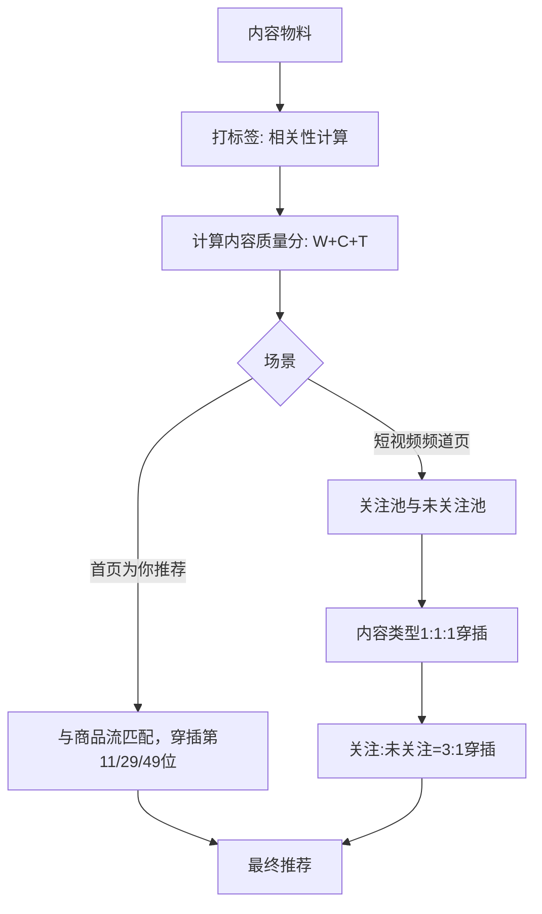

#### 5. 经典金句/数据
> “内容电商需根据内容绑定的商品与商品标签进行关联。”
> “播放时长大于或等于10秒即为有效播放。”

---

### 第14章：智能营销解决方案——通过用户分层管理激活沉睡用户和流失用户

#### 1. 核心论点
本章解决“如何通过智能优惠券和个性化消息触达激活沉睡用户和流失用户”的问题。作者提出基于复购周期识别用户状态，建立用户券偏好标签和优惠券标签，通过召回排序算法匹配人与券，并在合适时机（预警节点、活跃节点）以控制频次的方式触达用户。

#### 2. 关键概念/事件
- **沉睡用户/流失用户判断**：基于全量用户复购周期(T1)、沉睡周期(T2)、流失周期(T3)和个人复购周期(T)。
- **用户券偏好标签**：一级（品牌券/品类券/平台券）、二级（具体品牌/品类）、三级（门槛-让利）。
- **优惠券标签**：同样三级，人工打标+智能打标（基于使用券下单的品牌/品类分布）。
- **券等级**：基于ROI和用户行为加权得分的四象限模型，分为1-4级。
- **触达频次**：通过历史数据计算N=3次触达可激活用户，间隔4天。

#### 3. 逻辑推演/叙事脉络
先分析人工运营的痛点（滞后、一刀切、资源浪费）。然后搭建智能营销产品架构。第一步：智能选人，通过概率分布曲线定义T1、T2、T3，结合个人复购周期判断用户是否进入激活池。同时给用户打券偏好标签（有用券历史和无用券历史分别处理）。第二步：智能选券，给优惠券打三级标签（人工+智能）。第三步：召回排序，将用户与券通过标签匹配，并按券等级和匹配度排序。第四步：个性化触达，确定发券时间点（基于复购周期），控制触达频次（最多3次，间隔4天），前两次发品牌/品类券，第三次发平台券。最后通过消息推送或弹窗露出利益点。

#### 4. 流程图

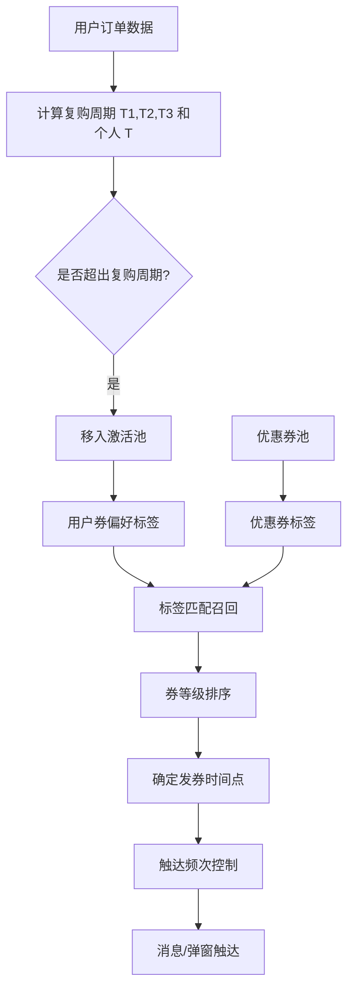

#### 5. 经典金句/数据
> “优惠券分为平台券、品牌券、品类券。平台券成本由平台承担，品牌券和品类券成本由品牌商承担。”
> “触达频次计算逻辑需覆盖80%的用户下单分布情况，最终获得N=3。”

---

### 第15章：个性化文案及个性化推送策略——提升下单转化率

#### 1. 核心论点
本章解决“如何通过个性化文案和推送策略提升消息点击转化率”的问题。作者提出由系统代替人工，根据用户利益点（常购品类、品牌、复购商品、优惠券偏好）生成个性化文案，并通过CTR预估模型选择最优推送内容。

#### 2. 关键概念/事件
- **消息推送漏斗**：送达率→展现率→点击率，Android平台触达率仅25.15%。
- **个性化文案**：短标题、增强文案、走心文案、亮点文案。
- **用户利益点**：客单价门槛、常购品牌/品类、复购商品。
- **个性化推送触达**：对有历史行为的用户，使用GBDT模型预测CTR；对无历史行为的用户，使用地域热销、地域热度、协同过滤融合得分。
- **商品复购周期P_t**：单位商品复购周期 = (T_{t+1} - T_t) / (N_t × V_t)。

#### 3. 逻辑推演/叙事脉络
先分析消息推送现状：送达率50.7%，展现率0.33%，打开率0.17%，主要原因是文案不吸引人。然后提出基础服务优化（打通Android通道）和功能唤回（引导开启推送）。核心是个性化文案：将商品标题处理为短标题，结合用户利益点（如“满130减5元优惠券”+“乐事黄瓜味薯片”），使用模板拼接。个性化推送触达：对有历史行为的用户，从品类偏好、品牌偏好、复购周期商品中选取候选，用GBDT模型预测点击率，选最高者推送；对无历史行为的用户，用商品地域热销、地域热度、协同过滤的融合得分排序推送。最后给出商品复购周期计算公式。

#### 4. 流程图

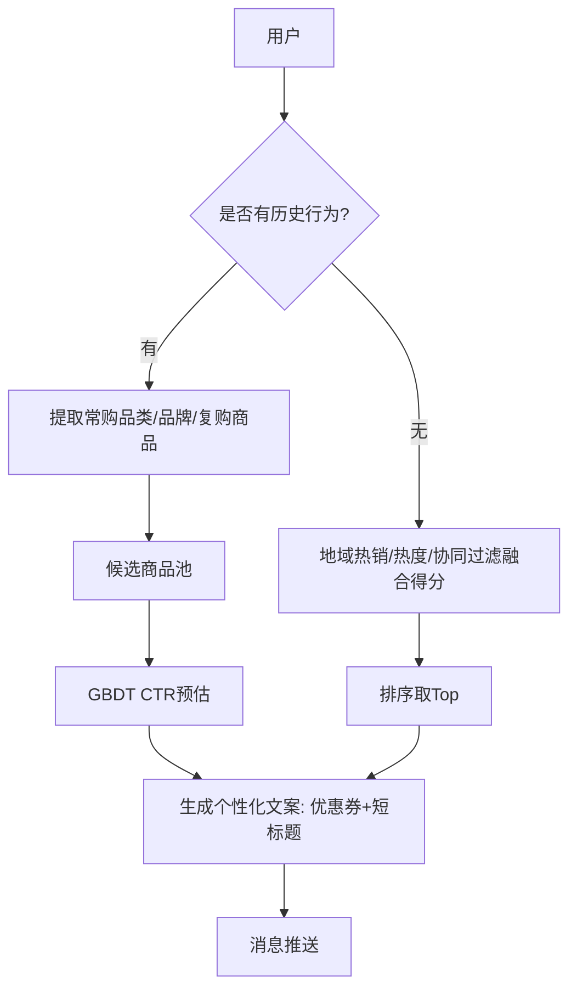

#### 5. 经典金句/数据
> “千篇一律的消息内容容易给用户造成打扰，甚至导致用户卸载App。”
> “商品复购周期 P_t = (T_{t+1} - T_t) / (N_t × V_t)”

---

### 第16章：用户智能增长策略——基于活跃和交易双目标实现用户分层管理

#### 1. 核心论点
本章解决“如何基于活跃（登录）和交易（下单）双目标对用户进行分层管理”的问题。作者使用K-Means聚类，剔除KA大客户后，以登录次数、交易订单量、交易活跃比（订单量/登录次数）为特征，确定最优聚类数K=5，将用户分为5层，并针对每层制定不同运营策略。

#### 2. 关键概念/事件
- **活跃 vs 交易**：浏览为流量，下单才是用户。
- **K-Means聚类**：用于用户分层。
- **SSE（误差平方和）**：确定肘部拐点找到最优K值。
- **轮廓系数S**：评估聚类模型质量，取接近1的模型。
- **用户分层5层**：从L1（高活跃高交易）到L5（低活跃低交易）。

#### 3. 逻辑推演/叙事脉络
先提出用户增长策略应区分活跃和交易双目标。剔除KA客户后，取30天登录次数、交易订单量、交易活跃比三个指标。将指标进行不同组合（是否归一化）得到8个候选模型。使用K-Means聚类，计算每个模型在不同K值下的SSE，找到肘部拐点（K=3或5），再计算轮廓系数选择最优模型。最终确定K=5，将用户分为5层，并定义每层的特征（如L1：高登录高交易；L5：低登录低交易）。最后给出分层运营策略，如对L1用户推高毛利商品，对L5用户推低价商品和优惠券。

#### 4. 流程图

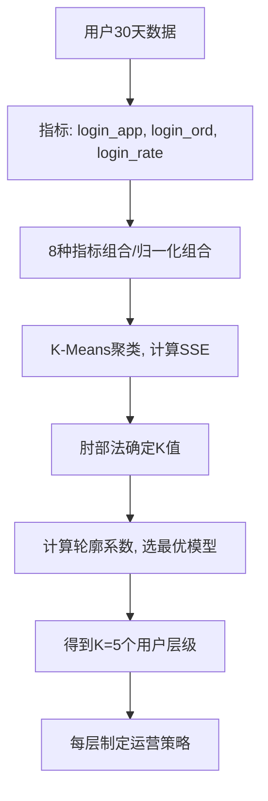

#### 5. 经典金句/数据
> “用户只浏览不下单，代表用户对平台和商品还未认可。而下单/浏览比值高，则代表用户已对平台建立了心智。”
> “SSE和K的关系图是一个手肘的形状，当SSE骤减时便得到真实的K值。”

---

### 第17章：用户智能增长策略——实现品牌用户1单到N单的转化

#### 1. 核心论点
本章解决“如何通过品牌复购券实现用户从1单到N单的复购转化”的问题。作者针对搜索场景和首页场景，基于用户复购周期、品牌客单价、行为强弱，设计券推荐、排序和触发策略，实现精准发券。

#### 2. 关键概念/事件
- **品牌复购标签**：0单转1单（拉新）、1单转2单、1单转N单（复购）。
- **用户品牌客单价**：取用户某品牌订单到手价的中位数。
- **地域品牌客单价**：地域内所有用户某品牌到手价的中位数。
- **拔高客单价**：Price_User_new = Price_User + |Price_User - Q_mid| × |q - 0.5|。
- **券排序**：搜索场景下优先推门槛=Price_User_new的券，否则按分位数区间优先级排序；首页场景下先按用户行为分（加购5分、搜索点击3分、浏览1分）对品牌排序，再按券力度排序。

#### 3. 逻辑推演/叙事脉络
先指出现有营销一刀切的问题。针对搜索场景：用户输入品牌词时，判断用户是品牌复购用户，从券池中召回对应品牌券。计算用户品牌拔高客单价（结合地域品牌客单价和分位数），优先推荐门槛等于拔高客单价的券，否则按分位数区间优先级（先左右邻域，再其他）排序。针对首页场景：将超出品牌复购周期未下单的用户移入促活池，按30天内用户对品牌的行为强弱（加购>搜索点击>浏览）计算品牌分，品牌内券按力度排序。最后对拉新券和复购券按1:1穿插排序。

#### 4. 流程图（搜索场景券排序）

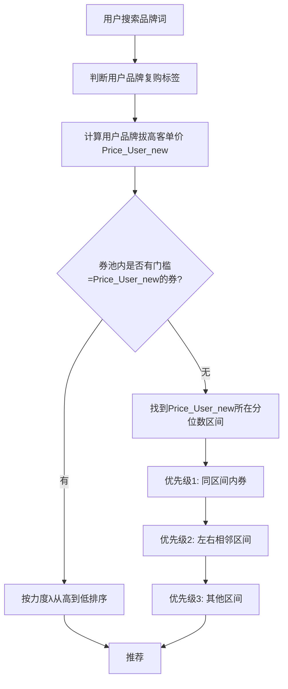

#### 5. 经典金句/数据
> “用户是有损失厌恶心理的，当用户同时面对有收益和有损失的时候，用户通常会认为损失是更难接受的。”
> “加入购物车权重为5，搜索并点击进入商品详情页权重为3，点击浏览商品权重为1。”

---

### 第18章：数字化转型产品赋能线下商超

#### 1. 核心论点
本章解决“如何通过大数据和数字化手段帮助线下商超提升经营效率与盈利能力”的问题。作者提出基于“人、货、场”的数字化经营分析框架，包括发现风险与机遇、市场定位、智能营销方案（用户营销和商品营销），并给出智能选品的两种方案（品类覆盖面全 vs 主打核心品类）。

#### 2. 关键概念/事件
- **门店生命周期**：导入期、成长期、成熟期、衰退期。
- **人货场**：人（LBS周边C端用户画像）、货（门店商品销售结构）、场（周边竞对门店分布）。
- **智能选品**：根据周边用户品类/品牌偏好，结合门店面积和货架面积，计算各品类/品牌的商品配比。
- **方案1（覆盖面全）**：取Top M品类和Top N品牌，覆盖80%用户需求，货架面积80%给头部品类。
- **方案2（主打核心）**：只取Top N品牌，同样遵循80%货架原则。
- **用户营销**：线上线下会员打通、用户裂变、目标市场覆盖。
- **商品营销**：进货建议、货架管理、压货提醒、补货提醒、产品组合策略。

#### 3. 逻辑推演/叙事脉络
先指出线下商超经营痛点（缺乏数据指导、坪效低、压货风险）。然后提出基于“人、货、场”的数据发现风险和机遇：通过LBS获取周边C端用户画像（品类/品牌偏好），结合门店动销数据和周边竞对分布，发现商品结构问题。根据门店生命周期进行市场定位，明确阶段性目标（拓展、维持、放弃）。最后给出智能营销方案：用户营销（会员打通、裂变）、商品营销（进货建议、货架管理、压货/补货提醒、组合策略）。其中智能选品给出两套方案，分别适用于不同面积和阶段的门店。

#### 4. 流程图

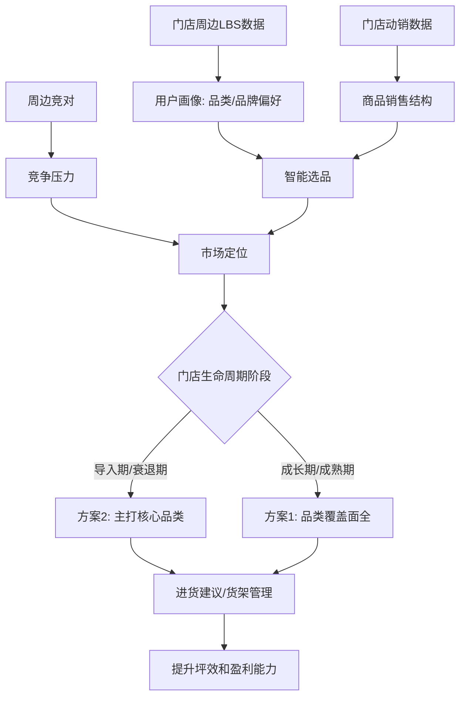

#### 5. 经典金句/数据
> “全国约有580万家中小型便利店，每年约20%的店铺因经营不善而关闭。”
> “门店经营面积 ≈ 货架面积，总销售额 = Σ(单个商品面积 × 商品个数) 对应的销售额。”
> “补货提醒：商品售罄前4天进行提醒（物流成本2.3天+安全天数）。”

---

## 配套资源验证码
验证码：220697