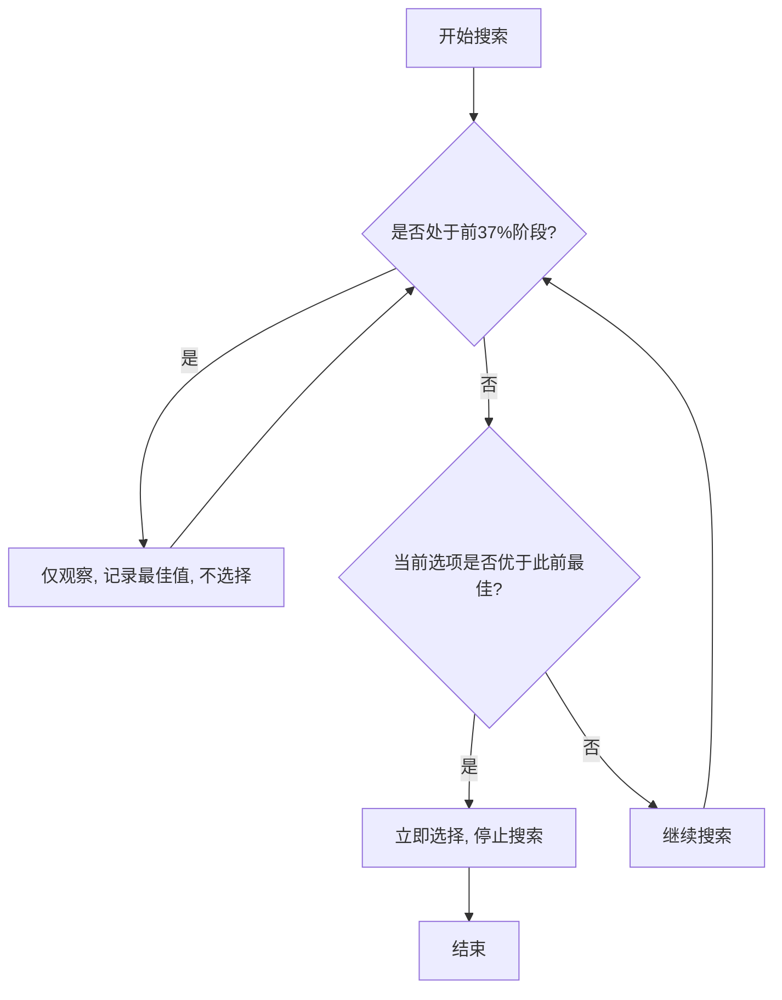
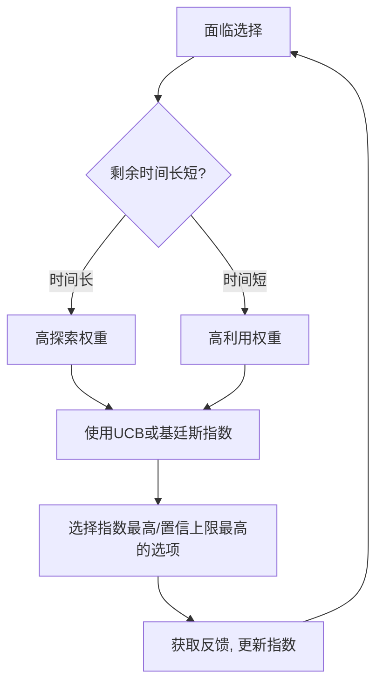
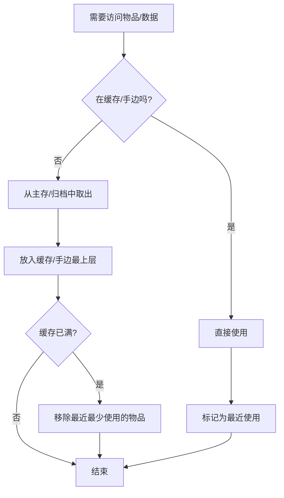
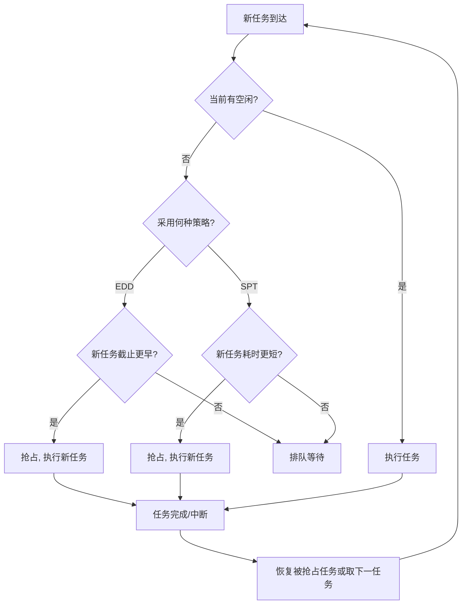
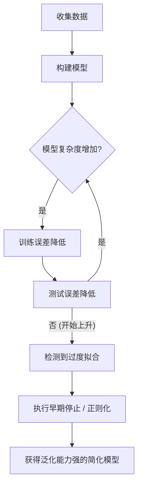
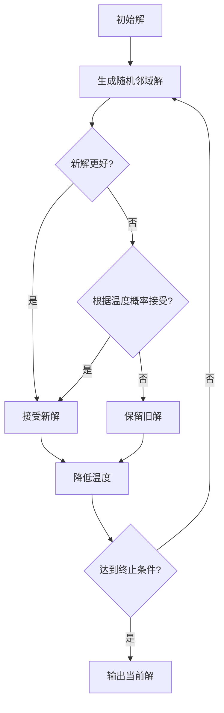

# 《算法之美：指导工作与生活》章节总结

## 书籍信息

- **书名**：算法之美：指导工作与生活 (Algorithms to Live By: The Computer Science of Human Decisions)
- **作者**：[美] 布莱恩·克里斯汀 (Brian Christian) / 汤姆·格里菲思 (Tom Griffiths)
- **译者**：万慧 / 胡小锐
- **出版**：中信出版集团
- **PDF 状态**：完整文本可识别
- **OCR 状态**：良好，无需特殊修复说明

## 目录说明

- **目录识别情况**：目录结构清晰，包含序言、11个核心章节及结语。
- **章节对应依据**：严格遵循原书目录顺序，从最优停止理论到博弈论，最后以计算善意结语。
- **OCR 修复说明**：部分数学公式和图表描述已转化为文字或 Mermaid 流程图，确保逻辑完整。

## 全书核心主题

本书将计算机科学中的经典算法应用于人类日常生活决策，旨在解决我们在有限时间、空间和注意力下面临的复杂问题。作者认为，人生中的许多难题（如找房子、择偶、整理物品、安排日程、预测未来等）在本质上与计算机处理数据的问题相同。通过借鉴计算机科学的智慧，我们可以获得一套理性的思维框架和具体的行动指南。

核心观点包括：
1. **理性并非完美**：在信息不全和时间有限的情况下，追求完美往往导致低效，近似解和启发式策略更为实用。
2. **过程优于结果**：遵循最优算法并不能保证每次成功，但能保证长期概率上的最优，应关注决策过程而非单一结果。
3. **计算善意**：在设计社会规则、产品或与他人互动时，应考虑到对方的认知负担，降低交互的计算复杂度。

---

## 第0章：序言

### 核心论点

本章提出核心隐喻：计算机科学与人类生活面临相同的约束（有限资源、不确定性）。算法不仅是代码，更是解决问题的一系列步骤，可为人类决策提供理性指导。

### 关键概念/事件

- **算法的定义**：解决问题的一系列步骤，历史悠久，不仅限于计算机。
- **有限性与权衡**：人类必须在有限的时间、空间、注意力中做决定，这与计算机处理资源类似。
- **理性新解**：计算机科学揭示，理性并不意味着穷举所有选项，而是在时间与精确度之间妥协。

### 逻辑推演/叙事脉络

作者从旧金山租房难的现实困境引入，指出人们在面对连续选择时的两难：收集更多信息有助于判断，但可能错失良机。引出“最优停止”问题。随后阐述算法的历史渊源（花拉子密），并对比传统观念中计算机的“机械确定性”与现代计算机处理现实问题的“概率性与近似性”。最后提出本书目标：利用计算机科学的见解来理解人类理性，提供具体建议和新语汇。

### 经典金句/数据

> “算法告诉他们这个平衡点就是37%。”
> “计算机科学告诉我们：不要总是考虑所有的可选方案；不必每次都追求最佳结果；偶尔犯点儿错误；放下包袱，轻装前进。”

---

## 第1章：最优停止理论——如何选择停止观望的时机？

### 核心论点

在面对一系列连续出现且不可回头的选择时（如租房、招聘、约会），存在一个数学上证明的最优策略：**37%法则**。即在前37%的时间里只观察不选择，之后一旦遇到比之前所有都好的选项，立即选择。

### 关键概念/事件

- **秘书问题**：最优停止理论的经典模型。面试N个秘书，不能回头，目标是选到最好的。
- **37%法则 (1/e)**：观察前37%的候选人作为样本，建立标准；之后选择第一个优于样本中最佳者的候选人。成功率约为37%。
- **全信息博弈**：如果拥有客观评分标准（如打字速度分数），可采用阈值准则，成功率可达58%。
- **卖房子/停车问题**：引入等待成本。若等待成本高，应降低阈值；若停车位占用率高，应提前停止搜索。

### 逻辑推演/叙事脉络

从租房困境引出“观察”与“行动”的平衡。通过数学推导得出37%法则。接着讨论现实变体：若可能被拒绝或可回头（开普勒案例），策略需调整（推迟表态，保留备选）。若拥有全信息（客观分数），则无需观察期，直接设定动态阈值。最后应用于卖房子（考虑持有成本）和停车（考虑距离与占用率），指出时间流逝使所有决策变为最优停止问题。

### 方法流程图



### 经典金句/数据

> “如果你希望选中最合适公寓的可能性达到最大，那么在看前37%的房子时不要做出任何决定……一旦你对某套房子的满意程度超过之前看过的所有房子，就立刻下手。”
> “采用最理想的方案也会有63%的失败率……在大多数情况下，大海捞针都会无功而返，但是，无论‘海洋’多么辽阔，最优停止理论都是最理想的工具。”

---

## 第2章：探索与利用——要最新的还是要最好的？

### 核心论点

在“尝试新事物”（探索）与“享受已知最佳”（利用）之间存在权衡。**剩余时间**是决定策略的关键：时间越多越应探索，时间越少越应利用。基廷斯指数和上限置信区间算法提供了量化指导。

### 关键概念/事件

- **多臂老虎机问题**：在多个回报概率未知的选项中分配资源，以最大化总收益。
- **赢留输变**：简单策略，但不含剩余时间概念，非最优。
- **基廷斯指数**：为每个选项计算一个动态分配指数，考虑了未来贴现。选择指数最高的选项。解决了无限 horizon 下的探索利用问题。
- **上限置信区间 (UCB)**：选择置信区间上限最高的选项。体现“面对不确定性时的乐观主义”，鼓励探索未知。
- **A/B测试**：互联网时代的探索利用应用，实时优化用户体验。

### 逻辑推演/叙事脉络

从餐厅选择引入探索与利用的矛盾。指出剩余时间的重要性：年轻人多探索，老年人多利用（卡斯滕森研究）。介绍多臂老虎机模型，回顾罗宾斯的“赢留输变”。重点介绍基廷斯指数（几何贴现下的最优解）和UCB算法（遗憾最小化，计算简便）。讨论“不安分的老虎机”（环境变化），指出世界变化时需持续探索。最后联系到童年（纯探索）和老年（纯利用）的人生阶段特征。

### 方法流程图



### 经典金句/数据

> “抓住一天与抓住一辈子的时光是完全不同的两个概念。”
> “上限置信区间算法所采用的原理有一个绰号——‘面对不确定性时的乐观主义’……在没有相反证据的时候，我们都应该假定可以取得最好的结果。”
> “遗憾以对数速率增加……在10年时间里，第一年留下的遗憾数量等于其余9年留下的遗憾总和。”

---

## 第3章：排序——建立秩序

### 核心论点

排序的目的是为了搜索，但排序本身有成本。**混乱无序在某些情况下更优**，特别是当搜索成本低或不需要完全排序时。体育赛制反映了不同排序算法的效率与健壮性权衡。

### 关键概念/事件

- **大O符号**：衡量算法复杂度。O(1)常数，O(n)线性，O(n^2)平方，O(n log n)线性对数。
- **冒泡/插入排序**：O(n^2)，效率低，但简单。
- **合并排序**：O(n log n)，分治法，高效。
- **桶排序**：O(n)，利用分布知识，打破比较排序下限。
- **搜索与排序的权衡**：若不常搜索，无需排序。电子邮件搜索优于人工归档。
- **体育赛制**：单淘汰（线性时间，只决第一）、循环赛（平方时间，完全排序）、排位赛（冒泡排序）。噪声环境下，比较计数排序（循环赛）最健壮。

### 逻辑推演/叙事脉络

从袜子配对引入排序的规模不经济。介绍大O符号衡量最坏情况。对比冒泡、插入、合并排序的效率。指出桶排序利用先验知识可达成线性时间。核心转折：排序是为了搜索。若搜索成本低（如人眼浏览书架、电子邮件搜索），则排序是浪费。进而讨论体育排名，指出单淘汰赛虽快但不公，循环赛虽慢但稳健（抗噪声）。最后引申到社会地位排序，指出基数指标（如金钱）比序数比较（争斗）更高效，降低了社会计算成本。

### 经典金句/数据

> “混乱无序也无伤大雅！如果你从来不在某些物品中搜索某个目标，那么为这些物品排序就纯粹是一种浪费。”
> “冠军戒指也许不是那么可信，但是分区的排名货真价实。换句话说，如果一支球队在季后赛早早出局，那是运气太差。但是如果一支球队不能进入季后赛，那这就是一个严酷的事实。”

---

## 第4章：缓存——忘了它吧

### 核心论点

在存储空间有限时，**最近最少使用 (LRU)** 是接近最优的缓存清理策略。物理空间的整理应借鉴缓存机制：常用物品放在易取处，不常用的归档或丢弃。堆存（自组织列表）是高效的文件管理方式。

### 关键概念/事件

- **分级存储器体系**：高速小容量缓存 + 低速大容量主存。
- **缓存清理策略**：
    - **随机清理**：效果意外地好。
    - **先进先出 (FIFO)**：基于拥有时间。
    - **最近最少使用 (LRU)**：基于最后使用时间，符合时间局部性，最优近似。
- **自组织列表/堆存**：将最近使用的物品移到最前面（或堆顶）。搜索效率不低于预知未来的最优算法的两倍。
- **遗忘曲线与经验暴政**：记忆衰退部分原因是数据量增加导致的检索变慢，而非能力下降。

### 逻辑推演/叙事脉络

从衣橱整理引入缓存概念。介绍计算机分级存储和缓存清理问题。对比FIFO和LRU，指出LRU因时间局部性而更优。应用于图书馆藏书（应展示最近归还的书）和家庭整理（常用物品就近存放）。重点介绍野口由纪夫的“左侧插入”文件法，论证其等价于LRU，且数学证明其高效。进一步引申到“堆存”（自组织列表），指出杂乱的文件堆可能是最高效的组织形式。最后讨论人类记忆，指出遗忘是适应性的，认知衰退部分源于信息过载。

### 方法流程图



### 经典金句/数据

> “你根本没有必要因为案头文件成堆而自责，因为这不是杂乱无序的标志，而是最精心设计和最有效的组织形式之一。”
> “现在被称为衰退的很多过程其实就是学习过程。”

---

## 第5章：时间调度理论——要事先行

### 核心论点

单机调度中，**明确目标函数**是关键。不同目标对应不同最优策略：最小化最大延迟用**最早到期日 (EDD)**，最小化完成时间总和用**最短加工时间 (SPT)**。面对不确定性和抢占，SPT的加权版本通用性强。避免**颠簸**需限制任务数量或合并中断。

### 关键概念/事件

- **最早到期日 (EDD)**：优先处理截止日期最近的任务，最小化最大延迟。
- **穆尔算法**：在EDD基础上，若发现无法按时完成，丢弃耗时最长的任务，最小化逾期任务数。
- **最短加工时间 (SPT)**：优先处理最快完成的任务，最小化完成时间总和（减少待办事项长度）。
- **加权SPT**：按“密度”（重要性/时长）排序，最小化加权完成时间。
- **优先级反转**：低优先级任务占用资源阻塞高优先级任务。解决：优先级继承。
- **颠簸 (Thrashing)**：上下文切换开销超过执行开销，系统停滞。解决：拒绝新任务、批处理、中断合并。

### 逻辑推演/叙事脉络

从日常待办事项引入调度问题。指出单机调度总时长固定，关键在于指标。介绍EDD（防延迟）和SPT（防积压）。讨论带权重的SPT（债务雪崩vs雪球）。分析优先级反转案例（火星探路者）。指出带约束调度多为NP难问题。引入抢占和不确定性，指出加权SPT在在线算法中表现优异。讨论上下文切换成本，引出“颠簸”现象。提出避免颠簸策略：说“不”、批处理、中断合并（如固定时间查邮件）。

### 方法流程图



### 经典金句/数据

> “拖延症者也在努力行动，以尽快地减少他们头脑中悬而未决的任务数量。这并不是说他们在完成任务时使用了糟糕的策略，而是他们用一个伟大的策略选择了错误的指标。”
> “在颠簸的状态中，你基本上没有任何进展，所以即使以错误顺序做工作也比什么都不做要强。”

---

## 第6章：贝叶斯法则——预测未来

### 核心论点

在小数据情况下，**贝叶斯法则**结合**先验分布**可进行有效预测。根据现象背后的分布类型（幂律、正态、厄兰），分别适用**相乘法则**、**平均法则**和**相加法则**。

### 关键概念/事件

- **拉普拉斯定律**：(w+1)/(n+2)，用于无先验时的概率估计。
- **哥白尼原则**：在无先验信息时，预测事物剩余寿命等于已存寿命（相乘法则，隐含幂律先验）。
- **三种分布与预测法则**：
    - **幂律分布**（财富、票房）：相乘法则。越久越可能久。
    - **正态分布**（身高、寿命）：平均法则。回归均值。
    - **厄兰分布**（电话通话、放射性衰变）：相加法则。无记忆性，恒定预期。
- **先验的重要性**：预测准确性取决于对底层分布的了解。媒体扭曲先验（可得性启发）。

### 逻辑推演/叙事脉络

从柏林墙寿命预测引入小数据问题。介绍贝叶斯逆向推理和拉普拉斯定律。引出哥白尼原则（无信息先验下的贝叶斯推断）。深入探讨先验分布的类型：正态（钟形）、幂律（长尾）、厄兰（指数）。分别导出平均、相乘、相加三种预测法则。通过棉花糖实验说明先验经验对行为的影响。最后指出媒体和信息环境会扭曲我们的先验，导致预测偏差，需保护先验的准确性。

### 经典金句/数据

> “如果我们要预测某个事物还将持续存在多久（在对它没有其他任何了解时），我们可以做出的最好的猜测就是，它将再持续已经存在的时间。”
> “我们的判断背叛了我们的预期，我们的期望又背叛了我们的经验。”

---

## 第7章：过度拟合——不要想太多

### 核心论点

在噪声数据和不确定性面前，**复杂模型往往导致过度拟合**，降低预测能力。**正则化**（惩罚复杂性）和**早期停止**是应对策略。简单启发式在复杂环境中常优于复杂计算。

### 关键概念/事件

- **过度拟合**：模型过于贴合训练数据噪声，泛化能力差。
- **交叉验证**：保留部分数据测试模型泛化能力，检测过度拟合。
- **正则化**：奥卡姆剃刀，套索算法 (Lasso)。惩罚复杂模型，保留关键因素。
- **早期停止**：在模型变得过于复杂前停止训练/思考。
- **启发式**：少即是多。在数据嘈杂、不确定性高时，简单规则（如1/N投资）更稳健。

### 逻辑推演/叙事脉络

从达尔文求婚利弊表引入“道德代数”的局限。指出复杂模型虽拟合现有数据好，但预测未来差（过度拟合）。解释噪声和代理指标导致的偏差。介绍交叉验证作为检测手段。提出解决方案：正则化（惩罚复杂性）和早期停止（限制思考深度/时间）。举例马科维茨投资自己账户用1/N策略，说明简单启发式在现实不确定性下的优势。最后联系进化，指出生物体的保守性是对过度拟合的防御。

### 方法流程图



### 经典金句/数据

> “更好地拟合现有数据并不一定意味着会得出更好的预测结果。”
> “不确定性越大，你所能衡量的东西和真正重要的东西之间的差距就越大，你就越应该注意过度拟合的风险，也就是说，你越喜欢简单，就应该越早停下来。”

---

## 第8章：松弛——顺其自然

### 核心论点

面对NP难等无法求得最优解的问题，可通过**松弛约束**求得近似解。**约束松弛**、**连续松弛**和**拉格朗日松弛**是将不可解问题转化为可解问题的有效技术。接受“足够好”的解是务实的智慧。

### 关键概念/事件

- **约束松弛**：暂时移除部分约束（如允许重复访问），求解后再调整。如下界估计。
- **连续松弛**：将离散变量（0或1）转化为连续变量（0到1之间），求解后取整或概率化。
- **拉格朗日松弛**：将硬约束转化为软惩罚项加入目标函数。将“不可能”变为“昂贵”。
- **旅行推销员问题 (TSP)**：典型NP难问题，松弛法可找到接近最优解。

### 逻辑推演/叙事脉络

从婚礼座位安排引入组合优化难题。指出许多现实问题（如TSP）是NP难的，无高效精确解。介绍松弛技术：首先是最简单的约束松弛（移除限制求下界）；其次是连续松弛（离散变连续，如半张邀请）；最后是拉格朗日松弛（违规受罚，如体育赛程安排）。强调松弛不是放弃，而是通过解决简化问题来获得高质量近似解的指导。接受近似解是应对复杂世界的必要策略。

### 经典金句/数据

> “如果我们愿意接受足够接近的解决方案，那么即使是一些最严重的问题也可以用正确的技术来解决。”
> “当问题很困难时，并不意味着你就可以忘记它，这意味着它只是处于不同的状态。即使这是一个很厉害的敌人，你还是要打这场仗。”

---

## 第9章：随机性——何时应用随机？

### 核心论点

**随机性**是解决复杂计算问题和避免局部最优的有力工具。**蒙特卡罗方法**、**随机算法**（如素数测试）和**模拟退火**展示了随机性在提高效率、保证安全和激发创造力方面的价值。

### 关键概念/事件

- **蒙特卡罗方法**：通过随机抽样估算复杂系统的属性（如π值、核反应）。
- **米勒-拉宾素数测试**：随机算法，以极高概率快速判断大数是否为素数，支撑现代加密。
- **爬山算法与局部最大值**：贪婪策略易陷入局部最优。
- **模拟退火**：引入随机“抖动”，允许暂时恶化解，以跳出局部最大值，寻找全局最优。随时间降低随机性（冷却）。
- **随机性与创造力**：盲变与选择性保留。随机输入打破思维定势。

### 逻辑推演/叙事脉络

从布冯投针实验引入随机抽样。介绍蒙特卡罗方法在物理和计算中的应用。重点讲述随机算法在密码学（素数测试）中的决定性作用，指出“概率性正确”在实际中足够安全。讨论优化问题中的局部最大值陷阱，介绍抖动、随机重启和模拟退火算法。模拟退火类比物理退火，通过控制随机性（温度）平衡探索与开发。最后联系生物进化和人类创造力，指出随机突变和偶然联想是创新的源泉。

### 方法流程图



### 经典金句/数据

> “有时候，解决问题的最好办法是依靠运气，而不是试图完全地分析出答案。”
> “随机地抖动，从框架中跳出来，专注于一个更大的范围，这提供了一种可以离开可能的局部较好的方法，然后回到追求可能的全球最优的方法。”

---

## 第10章：网络——我们如何联系？

### 核心论点

互联网协议揭示了可靠通信的本质：**包交换**、**确认机制**和**拥塞控制**。**指数退避**是处理冲突和故障的宽容策略。**缓冲膨胀**警示我们延迟比吞吐量更重要，尾部丢弃（拒绝）有时优于无限缓冲。

### 关键概念/事件

- **包交换 vs 电路交换**：包交换更灵活、鲁棒，适合突发数据。
- **三次握手与确认**：解决拜占庭将军问题，确保连接建立和数据送达。
- **指数退避**：冲突后等待时间指数增长，平衡重试与网络负载。应用于网络重传、密码锁定、人际关系修复。
- **AIMD (和式增加积式减少)**：TCP拥塞控制核心。缓慢增加发送速率，丢包时减半。形成锯齿状带宽使用。
- **缓冲膨胀 (Bufferbloat)**：过大缓冲区导致高延迟。尾部丢弃（丢包）是必要的反馈机制。
- **迟到不如永远不到**：实时交互中，低延迟优于高吞吐。适时拒绝（丢包）比无限排队更人道。

### 逻辑推演/叙事脉络

从通信历史引入协议概念。对比电路交换与包交换，指出包交换的鲁棒性。讨论可靠性问题：确认机制和三次握手。重点介绍指数退避算法，从网络冲突扩展到人际交往（宽恕策略）。讨论拥塞控制：AIMD算法及其在交通、管理中的映射。深入分析缓冲膨胀问题，指出过大缓冲区掩盖拥塞信号，导致高延迟。主张“尾部丢弃”和显式拥塞通知，强调低延迟对交互体验的重要性。

### 经典金句/数据

> “指数退避算法……提供了一种能够拥有有限的耐心和无限仁慈的方法。”
> “迟到不如永远不到……对于人际间的应用来说，一个快速的周转时间往往更重要，我们真正需要的是更多的协和式飞机。”

---

## 第11章：博弈论——别人的想法

### 核心论点

在多主体互动中，**纳什均衡**预测稳定状态，但未必最优。**机制设计**通过改变规则引导良性结果。**信息瀑布**揭示群体非理性。**维克瑞拍卖**等机制可实现“诚实即最优”，减少递归计算负担。

### 关键概念/事件

- **递归与停机问题**：推测他人想法导致无限递归。
- **纳什均衡**：无人愿单方面改变策略的状态。可能存在多个或难以计算。
- **囚徒困境与公地悲剧**：个体理性导致集体非理性。调和率衡量效率损失。
- **机制设计**：逆向博弈论。设计规则使均衡符合期望（如教父威胁、强制休假）。
- **信息瀑布**：忽视私人信息，盲目跟随公众行为，导致泡沫和崩溃。
- **维克瑞拍卖 (第二价格密封拍卖)**：诚实出价是占优策略。显示原则：可设计机制使诚实成为最优。

### 逻辑推演/叙事脉络

从扑克和心理递归引入博弈论。介绍纳什均衡及其计算复杂性。分析囚徒困境，指出均衡未必帕累托最优。引入公地悲剧和调和率。重点讲述机制设计：通过改变收益结构（如法律、宗教、合同）改变均衡，解决合作难题。讨论信息瀑布，解释泡沫形成的理性基础。最后介绍维克瑞拍卖和显示原则，指出通过巧妙设计规则，可使“诚实”成为占优策略，从而消除递归猜测的计算负担，实现计算善意。

### 方法流程图

```mermaid
graph TD
    A[参与者] --> B[评估私人信息]
    B --> C[观察他人行为]
    C --> D{他人行为是否强烈暗示?}
    D -- 是 --> E[忽略私人信息, 跟随大众 (信息瀑布)]
    D -- 否 --> F[依据私人信息行动]
    E --> G[群体极化/泡沫]
    F --> H[市场发现真实价值]
```

### 经典金句/数据

> “不要憎恨玩家，应憎恨游戏。”
> “爱情就像有组织的犯罪。它改变了婚姻游戏的结构，使均衡成为最适合每个人的结果。”
> “如果你想你代理人的行为纳入游戏规则本身的话……最基本的是，如果你不希望你的客户对你进行优化，你最好对他们进行优化。”

---

## 结语：计算善意

### 核心论点

**计算善意**是指在设计互动、规则或产品时，尽量降低他人的认知负担和计算复杂度。明确表达偏好、提供有限选项、减少递归猜测，是对他人的善意，也是高效协作的基础。

### 关键概念/事件

- **计算善意原则**：通过构造简单问题，降低交互的计算成本。
- **验证易於搜索**：给出具体选项比开放性问题更易处理。
- **设计责任**：建筑师、规划者、设计师应考虑用户面临的算法难度。
- **过程与结果**：遵循最优过程即为理性，接受结果的随机性。

### 逻辑推演/叙事脉络

总结全书三个智慧：直接应用算法、接受过程最优、利用启发式处理难题。引出“计算善意”概念：人类互动本质是计算问题。举例说明开放式问题（如“吃什么”）给他人带来巨大计算负担，而具体选项或明确偏好则降低负担。批评“旋转”式等待（如餐厅排队）对顾客心智的消耗，提倡“阻塞”式通知。呼吁在社会设计和日常互动中，通过简化规则和明确信息，体现对他人的计算善意，从而构建更和谐高效的社会。

### 经典金句/数据

> “礼貌地克制你的喜好会将推测性计算问题推给组内的其他人来解决。相反，礼貌地表达你的喜好……有助于承担将团队带到问题解决办法上的认知负荷。”
> “设计的主要目标之一应该是保护人们避免不必要的紧张、摩擦和精神劳动。”