# 《算法基础入门班》课程总结

## 书籍信息
- 书名：算法基础入门班
- 作者：左程云（牛客网讲师，华科本科，芝加哥大学硕士，曾就职于IBM、百度、GrowingIO、亚马逊）
- 课程平台：牛客网 (https://www.nowcoder.com/)
- PDF 状态：共8个PDF文件
- OCR 状态：良好，文本可正常识别

## 目录说明
本课程共8节课，按以下顺序组织：
- 第一课：时间复杂度、排序算法基础、二分法、异或运算
- 第二课：归并排序、堆排序、快速排序、荷兰国旗问题
- 第三课：比较器、桶排序、排序稳定性、工程优化
- 第四课：哈希表、有序表、链表问题
- 第五课：二叉树遍历、二叉树判断、序列化、折纸问题
- 第六课：图的表示、图的遍历、拓扑排序、最小生成树、最短路径
- 第七课：前缀树、贪心算法
- 第八课：暴力递归、动态规划基础

---

## 全书核心主题

本课程是一门面向零基础算法学习者的入门课程，由左程云老师主讲。课程系统讲解了算法学习中的核心基础内容，包括：

1. **时间复杂度分析**：如何评估算法效率，理解常数操作、Big O表示法
2. **经典排序算法**：选择排序、冒泡排序、插入排序、归并排序、堆排序、快速排序、桶排序
3. **基础数据结构**：堆、哈希表、有序表、链表、二叉树、图、前缀树
4. **核心算法思想**：二分法、异或运算、递归、贪心算法、暴力递归

课程强调通过典型例题讲解解题思路，并提供最优解和代码。每节课都配有实战题目，帮助学员将理论知识转化为解题能力。

---

## 第一课：算法入门基础

### 1. 核心论点

本章主要解决**如何评估算法效率**和**掌握基础算法思想**的问题。

作者认为：评价算法好坏先看时间复杂度指标，再分析常数项时间；基础算法如选择排序、冒泡排序、插入排序的时间复杂度为O(N²)，而二分法可以达到O(log N)。

---

### 2. 关键概念

- **常数时间的操作**：一个操作如果和样本数据量没有关系，每次都是固定时间内完成的操作
- **时间复杂度**：算法流程中常数操作数量的指标，用O(f(N))表示，只保留高阶项，去掉低阶项和系数
- **二分法**：在有序数组中高效查找的方法，时间复杂度O(log N)
- **异或运算**：满足交换律和结合律，性质为0^N=N，N^N=0
- **对数器**：通过对比方法a和方法b在大量随机样本下的结果，验证算法正确性的方法
- **Master公式**：T(N) = a * T(N/b) + O(N^d)，用于估算递归行为时间复杂度

---

### 3. 逻辑推演

**时间复杂度分析逻辑**：
1. 理解算法流程中发生的所有常数操作
2. 写出常数操作数量的表达式
3. 保留最高阶项，去掉低阶项和系数
4. 得到O(f(N))

**二分法扩展应用**：
- 在有序数组中找某个数是否存在
- 在有序数组中找>=某个数最左侧的位置
- 局部最小值问题

**异或运算应用**：
- 不用额外变量交换两个数
- 找出出现奇数次的数（一个或两个）

**对数器使用流程**：
1. 实现待测方法a
2. 实现复杂度低但正确的方法b
3. 实现随机样本产生器
4. 对比a和b在相同样本下的结果
5. 发现不一致时打印样本并修正
6. 大量样本测试通过后确认a正确

---

### 4. 经典金句

> “评价一个算法流程的好坏，先看时间复杂度的指标，然后再分析不同数据样本下的实际运行时间，也就是‘常数项时间’。”

> “算法流程按照最差情况来估计时间复杂度。”

> “0^N == N，N^N == 0，异或运算满足交换律和结合率。”

---

## 第二课：归并排序、堆排序、快速排序

### 1. 核心论点

本章主要解决**高效排序算法**的实现与优化问题。

作者认为：归并排序时间复杂度O(N*log N)但需要O(N)额外空间；堆排序可以在O(N)时间内建堆；快速排序通过随机选择划分值可以将最差情况O(N²)改进为O(N*log N)。

---

### 2. 关键概念

- **归并排序**：左边排好序、右边排好序，再用外排序方法使其整体有序，时间复杂度O(N*log N)
- **小和问题**：数组中每个数左边比当前数小的数累加起来
- **逆序对问题**：左边的数比右边大构成逆序对
- **堆结构**：用数组实现的完全二叉树结构，每棵子树的最大值在顶部为大根堆，最小值为小根堆
- **heapInsert**：堆结构中插入新元素的操作
- **heapify**：堆化调整操作
- **荷兰国旗问题**：将数组分成小于、等于、大于目标数的三个部分
- **随机快速排序**：等概率随机选划分值，时间复杂度O(N*log N)

---

### 3. 逻辑推演

**归并排序时间复杂度推导**：
- 利用Master公式：T(N) = 2*T(N/2) + O(N)
- a=2, b=2, d=1，log(b,a)=1=d
- 复杂度为O(N^d * log N) = O(N*log N)

**堆排序过程**：
1. 建堆：从上到下O(N*log N)或从下到上O(N)
2. 将堆最大值与末尾交换，堆大小减1
3. 调整堆，重复直到排序完成

**堆排序扩展**：
几乎有序数组（每个元素移动距离不超过k），可用大小为k的小根堆进行排序

**快速排序不改进的问题**：
- 划分值靠近两侧时复杂度高
- 最差情况时间复杂度O(N²)

**随机快速排序改进**：
- 等概率随机选划分值
- 时间复杂度稳定在O(N*log N)

---

### 4. 方法流程图

#### 归并排序流程

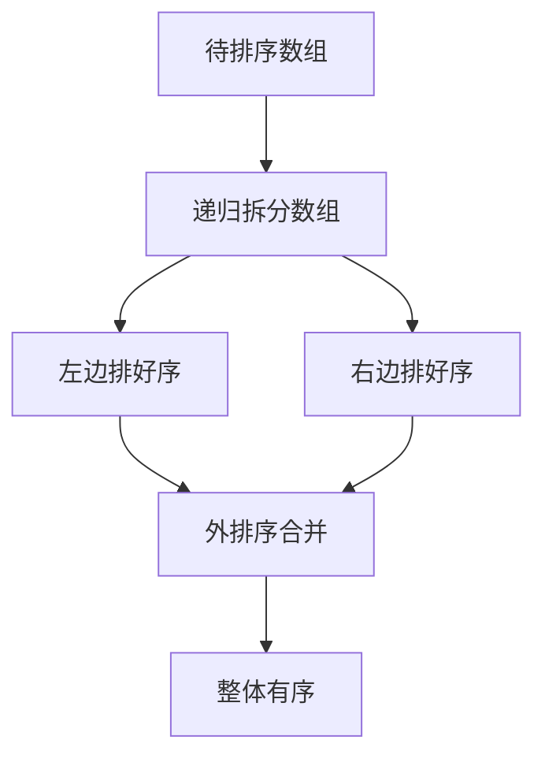

#### 荷兰国旗问题流程

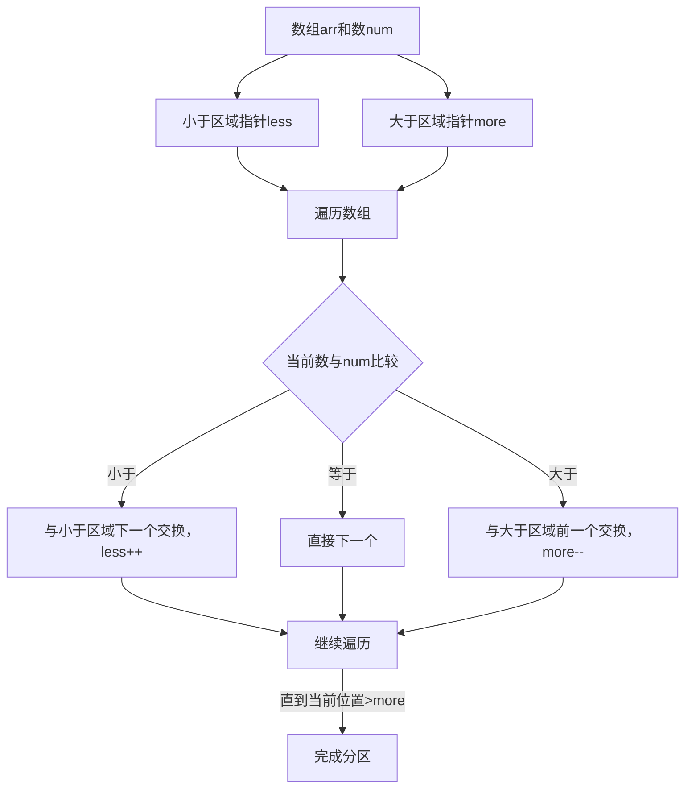

---

### 5. 经典金句

> “划分值越靠近两侧，复杂度越高；划分值越靠近中间，复杂度越低。”

> “可以轻而易举的举出最差的例子，所以不改进的快速排序时间复杂度为O(N^2)。”

> “堆结构就是用数组实现的完全二叉树结构。”

---

## 第三课：排序算法进阶与工程优化

### 1. 核心论点

本章主要解决**排序算法的比较、稳定性分析及工程应用**问题。

作者认为：不基于比较的排序（桶排序、计数排序、基数排序）可以达到O(N)时间复杂度，但应用范围有限；排序算法的稳定性是重要考量因素；工程上应充分利用不同排序算法的优势。

---

### 2. 关键概念

- **比较器**：重载比较运算符，可应用在特殊标准的排序和数据结构上
- **计数排序**：桶排序思想，统计每个值出现的次数，时间复杂度O(N)
- **基数排序**：按位排序，时间复杂度O(N)
- **稳定性**：同样值的个体不因排序改变相对次序
- **不稳定排序**：选择排序、快速排序、堆排序
- **稳定排序**：冒泡排序、插入排序、归并排序、桶排序

---

### 3. 逻辑推演

**稳定性分析**：
- 稳定排序可以保证相等元素的原始相对顺序
- 目前没有找到时间复杂度O(N*log N)、额外空间O(1)、又稳定的排序

**工程优化策略**：
- 充分利用O(N*log N)和O(N²)排序各自的优势
- 考虑稳定性需求

**常见坑点**：
- 归并排序额外空间可变为O(1)但非常难（内部缓存法）
- 原地归并排序会让时间复杂度变成O(N²)
- 快速排序可做到稳定性但非常难（01 stable sort）
- 奇数放在左边、偶数放在右边并保持相对次序的问题，可以直接怼面试官

---

### 4. 经典金句

> “桶排序思想下的排序都是不基于比较的排序。”

> “目前没有找到时间复杂度O(N*log N)，额外空间复杂度O(1)，又稳定的排序。”

> “所有的改进都不重要，因为目前没有找到时间复杂度O(N*log N)，额外空间复杂度O(1)，又稳定的排序。”

---

## 第四课：哈希表、有序表与链表问题

### 1. 核心论点

本章主要解决**哈希表、有序表的使用**以及**链表相关算法题**的解题方法。

作者认为：哈希表增删改查时间复杂度O(1)；有序表将key按顺序组织，操作时间复杂度O(log N)；链表解题需区分笔试和面试场景，常用技巧包括哈希表和快慢指针。

---

### 2. 关键概念

- **哈希表**：HashSet（只有key）和HashMap（有key和value），增删改查时间复杂度O(1)
- **有序表**：TreeSet/TreeMap，红黑树、AVL树、跳表等实现，操作时间复杂度O(log N)
- **有序表固定操作**：put、get、remove、containsKey、firstKey、lastKey、floorKey、ceilingKey
- **单链表**：节点包含value和next指针
- **双链表**：节点包含value、next和last指针
- **快慢指针**：一个指针走两步，一个指针走一步，用于找中点等操作
- **回文结构**：正读反读相同的链表结构

---

### 3. 逻辑推演

**哈希表使用规则**：
- 基础类型：按值传递，内存占用为值的大小
- 非基础类型：按引用传递，内存占用为地址大小

**有序表使用规则**：
- 非基础类型必须提供比较器
- 支持有序的查找和范围查询

**链表解题方法论**：
- 笔试：不用太在乎空间复杂度，一切为了时间复杂度
- 面试：时间复杂度第一，但需找到空间最省的方法

**核心链表题目**：
1. 反转单向和双向链表
2. 打印两个有序链表的公共部分
3. 判断链表是否为回文结构
4. 将单向链表按值划分成左小、中相等、右大
5. 复制含有随机指针节点的链表
6. 两个单链表相交问题（可能有环也可能无环）

---

### 4. 方法流程图

#### 判断链表是否为回文结构（O(N)时间，O(1)空间）

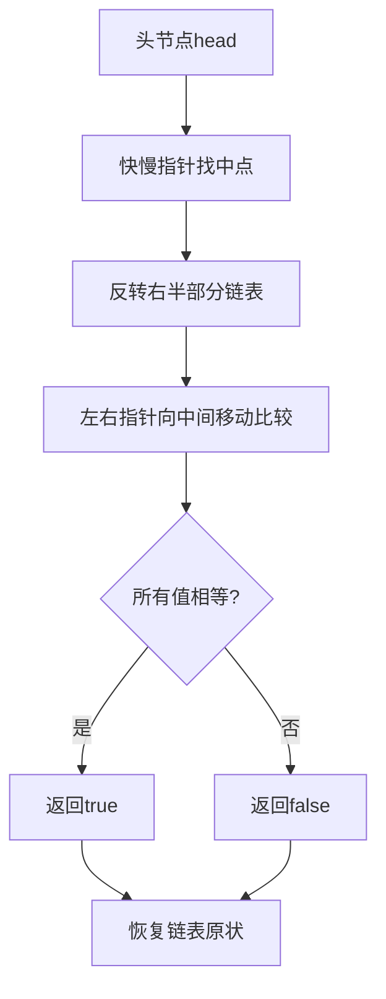

#### 复制含随机指针的链表（O(N)时间，O(1)空间）

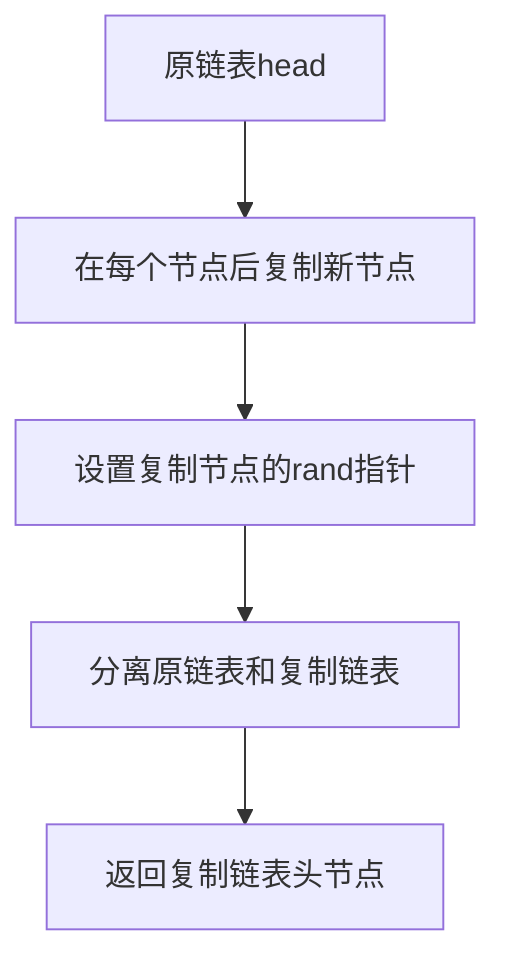

---

### 5. 经典金句

> “放入哈希表的东西，如果是基础类型，内部按值传递，内存占用就是这个东西的大小。”

> “笔试，不用太在乎空间复杂度，一切为了时间复杂度；面试，时间复杂度依然放在第一位，但是一定要找到空间最省的方法。”

> “有序表和哈希表的区别是，有序表把key按照顺序组织起来，而哈希表完全不组织。”

---

## 第五课：二叉树

### 1. 核心论点

本章主要解决**二叉树的遍历、判断、查找及序列化**问题。

作者认为：二叉树遍历可用递归和非递归两种方式实现；判断二叉树类型（搜索二叉树、完全二叉树、满二叉树、平衡二叉树）有固定套路；二叉树问题常用递归解法。

---

### 2. 关键概念

- **二叉树节点结构**：包含value、left、right
- **先序遍历**：头→左→右
- **中序遍历**：左→头→右
- **后序遍历**：左→右→头
- **宽度优先遍历**：层序遍历，用队列实现
- **搜索二叉树**：左子树<头节点<右子树
- **完全二叉树**：除最后一层外都满，最后一层节点靠左
- **满二叉树**：每层都满
- **平衡二叉树**：左右子树高度差不超过1
- **最低公共祖先**：两个节点向上找到的第一个公共节点
- **后继节点**：中序遍历中该节点的下一个节点
- **序列化**：内存中的树变成字符串形式
- **反序列化**：字符串变回内存中的树

---

### 3. 逻辑推演

**二叉树递归遍历实质**：
- 每个节点会到达三次
- 先序：第一次到达时打印
- 中序：第二次到达时打印
- 后序：第三次到达时打印

**平衡二叉树判断**：
- 左子树平衡
- 右子树平衡
- |左高-右高| ≤ 1

**后继节点查找**：
- 有右子树：右子树最左节点
- 无右子树：向上找，直到当前节点是父节点的左孩子

**折纸问题规律**：
- 对折N次产生2^N - 1条折痕
- 折痕分布是二叉树中序遍历的结果
- 根节点为凹，每个左子节点为凹，每个右子节点为凸

---

### 4. 方法流程图

#### 二叉树三种遍历（递归版）

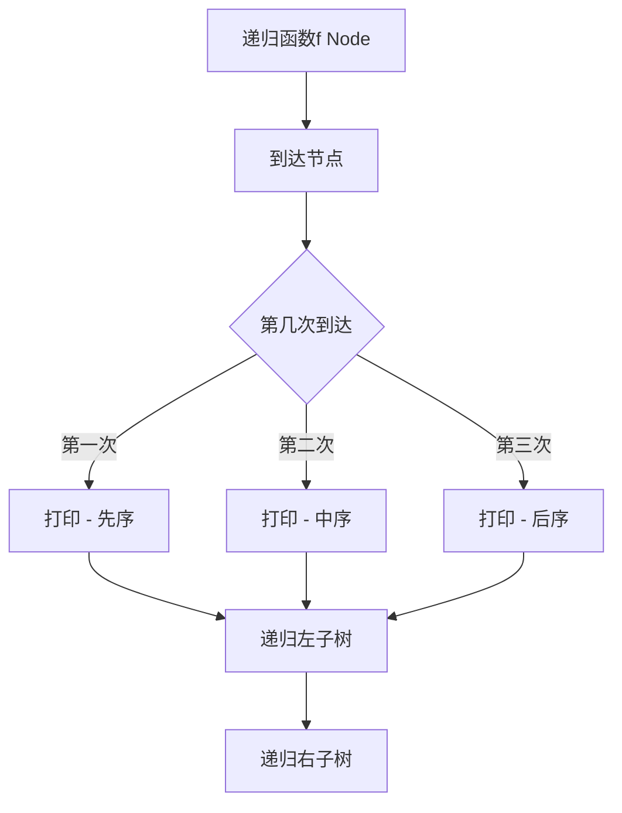

#### 判断二叉树是否为搜索二叉树

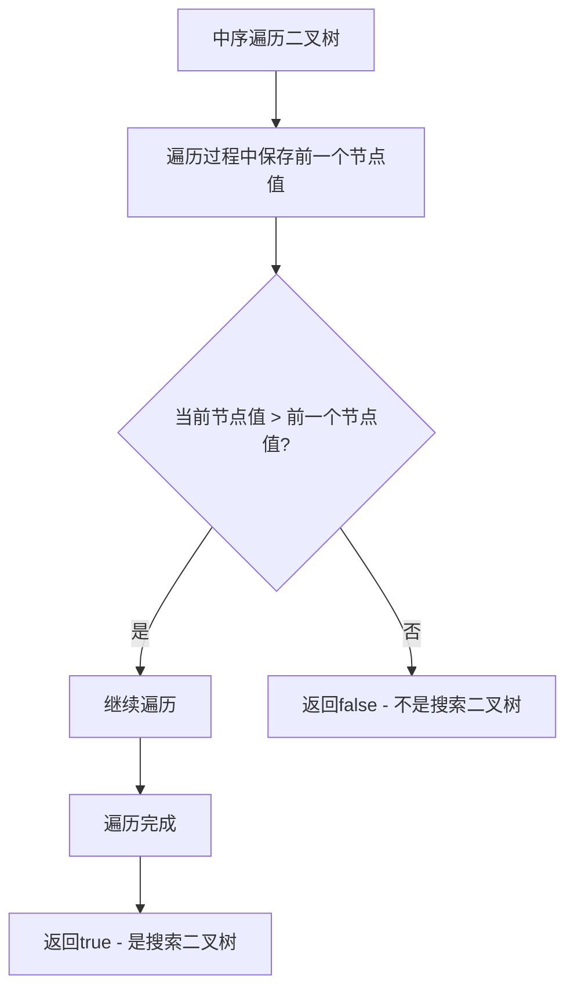

#### 折纸问题（N=2时）

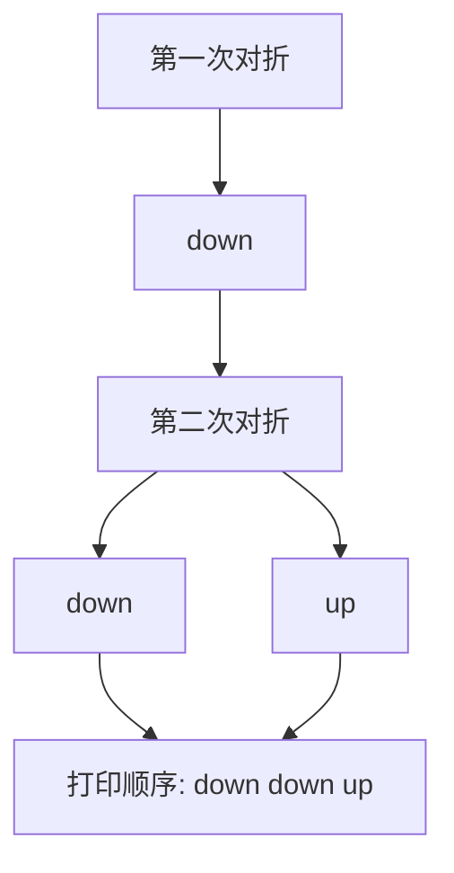

---

### 5. 经典金句

> “用递归和非递归两种方式实现二叉树的先序、中序、后序遍历。”

> “如果链表长度为N，时间复杂度达到O(N)，额外空间复杂度达到O(1)。”

---

## 第六课：图

### 1. 核心论点

本章主要解决**图的存储、遍历及经典算法**问题。

作者认为：图的存储方式有邻接表和邻接矩阵；遍历方式有宽度优先（BFS）和深度优先（DFS）；图论经典算法包括拓扑排序、Kruskal、Prim、Dijkstra等。

---

### 2. 关键概念

- **邻接表**：每个节点记录其相邻节点列表
- **邻接矩阵**：二维矩阵记录节点间连接关系
- **宽度优先遍历(BFS)**：用队列实现，按层遍历
- **深度优先遍历(DFS)**：用栈实现，一条路走到黑
- **拓扑排序**：适用范围是有向无环图，从入度为0的节点开始
- **Kruskal算法**：最小生成树算法，适用范围是无向图，按边权值从小到大加入
- **Prim算法**：最小生成树算法，适用范围是无向图，从点开始扩展
- **Dijkstra算法**：最短路径算法，适用范围是无负权边的图

---

### 3. 逻辑推演

**BFS流程**：
1. 利用队列实现
2. 从源节点开始按宽度进队列
3. 每弹出一个点，把该节点所有没进过队列的邻接点放入队列
4. 直到队列变空

**DFS流程**：
1. 利用栈实现
2. 从源节点开始按深度放入栈
3. 每弹出一个点，把该节点下一个没进过栈的邻接点放入栈
4. 直到栈变空

**拓扑排序适用范围**：
- 要求有向图
- 有入度为0的节点
- 没有环

---

### 4. 方法流程图

#### 图的宽度优先遍历(BFS)

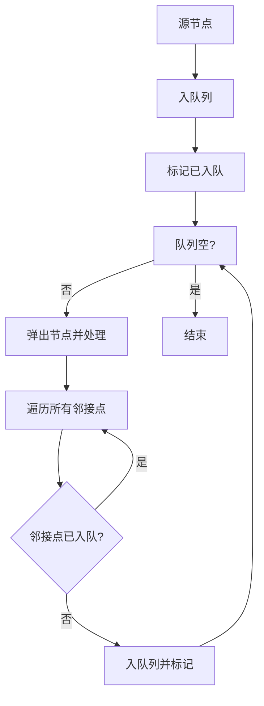

#### 拓扑排序

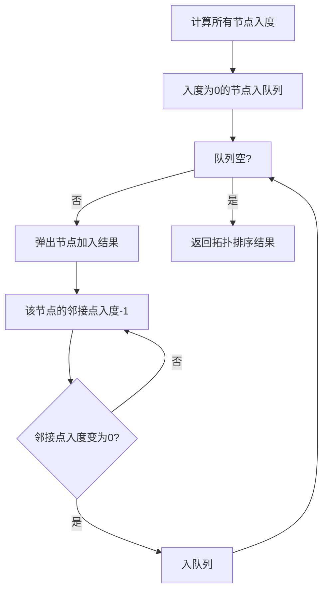

#### Kruskal算法（最小生成树）

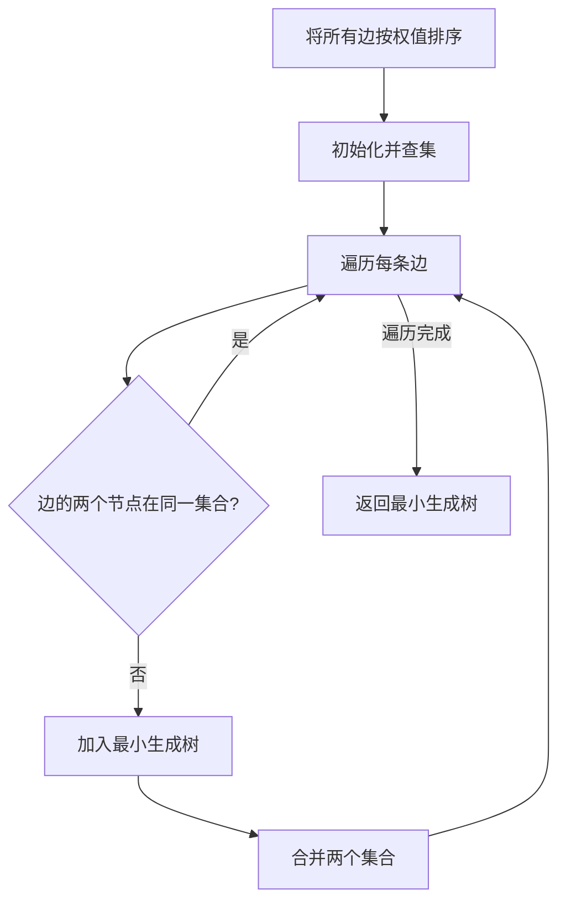

#### Dijkstra算法（最短路径）

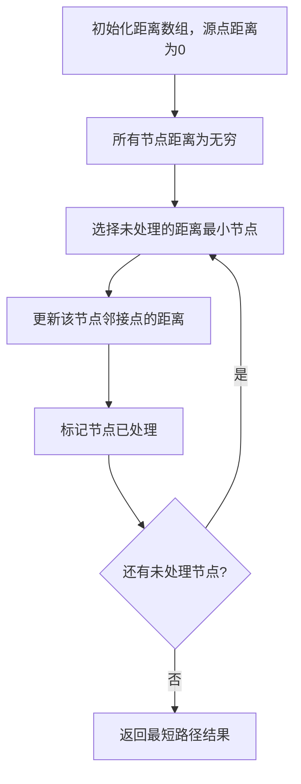

---

### 5. 经典金句

> “图的宽度优先遍历：利用队列实现；图的深度优先遍历：利用栈实现。”

> “拓扑排序适用范围：要求有向图，且有入度为0的节点，且没有环。”

> “Dijkstra算法适用范围：没有权值为负数的边。”

---

## 第七课：前缀树与贪心算法

### 1. 核心论点

本章主要解决**前缀树的数据结构实现**和**贪心算法的应用**问题。

作者认为：前缀树是处理字符串前缀问题的有效结构；贪心算法通过局部最优解得到整体最优解，在笔试中可通过对数器验证贪心策略的正确性。

---

### 2. 关键概念

- **前缀树**：多叉树结构，每个节点记录经过次数和结束次数，用于高效处理字符串前缀查询
- **贪心算法**：在某个标准下，优先考虑最满足标准的样本，最后考虑最不满足标准的样本
- **贪心策略验证**：用暴力解法作为对数器，通过实验验证贪心策略的正确性

---

### 3. 逻辑推演

**前缀树应用**：
- 判断arr2中有哪些字符在arr1中出现
- 判断arr2中有哪些字符是arr1中某个字符串的前缀
- 找出arr2中出现次数最大的前缀

**贪心算法解题套路**：
1. 实现不依靠贪心策略的解法X（最暴力尝试）
2. 脑补贪心策略A、B、C...
3. 用解法X和对数器验证每个贪心策略
4. 用实验确认正确贪心策略

**贪心策略常用技巧**：
1. 根据某标准建立比较器来排序
2. 根据某标准建立比较器来组成堆

---

### 4. 方法流程图

#### 前缀树结构

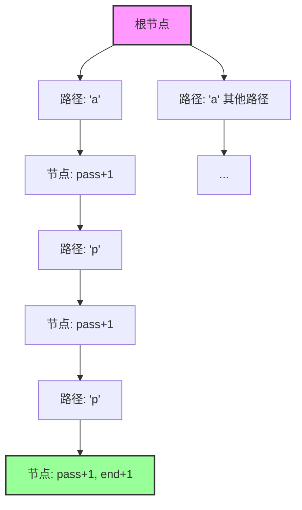

#### 金条分割问题贪心策略

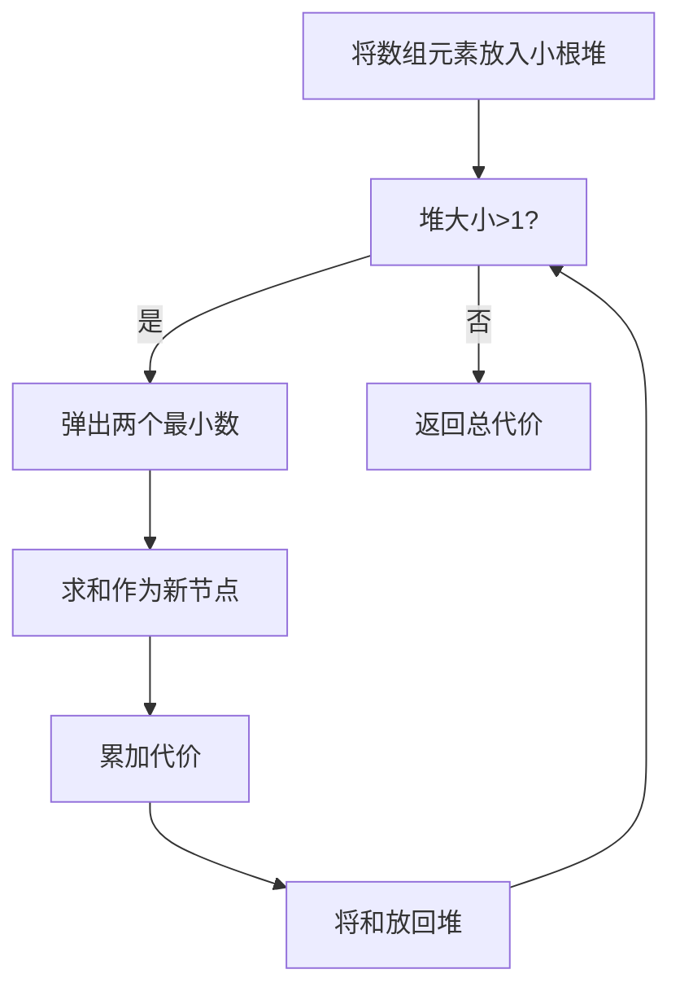

#### 项目收益问题贪心策略

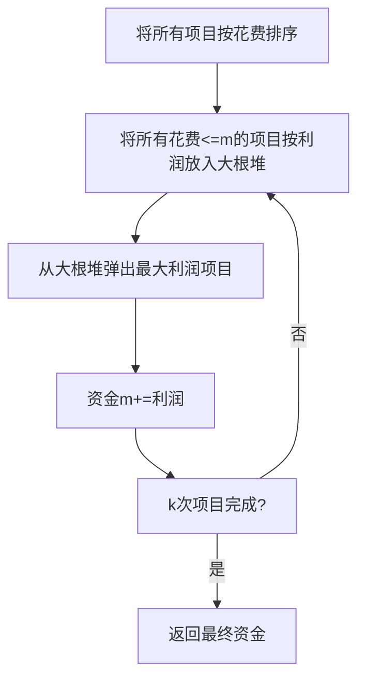

#### 数据流中位数获取

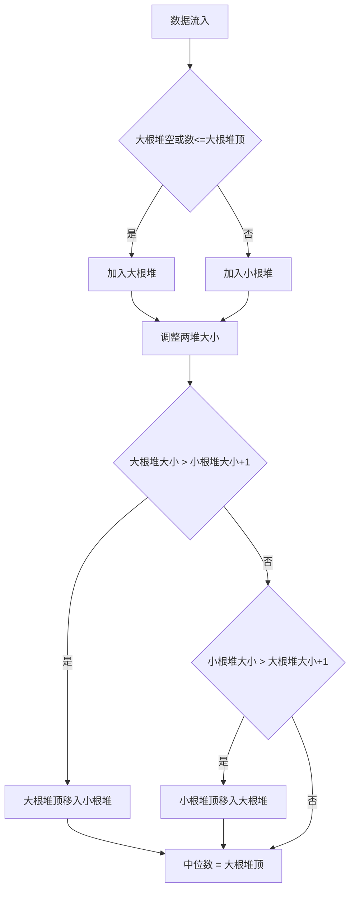

---

### 5. 经典金句

> “贪心算法：在某个标准下，优先考虑最满足标准的样本，最后考虑最不满足标准的样本，最终得到一个答案的算法。”

> “局部最优 - ?-> 整体最优”

> “不要纠结贪心策略的证明，用实验的方式得知哪个贪心策略正确。”

> “贪心策略在实现时，经常使用到的技巧：根据某标准建立一个比较器来排序；根据某标准建立一个比较器来组成堆。”

---

## 第八课：暴力递归

### 1. 核心论点

本章主要解决**暴力递归（尝试）** 的思维方法和应用问题。

作者认为：暴力递归是动态规划的基础，核心是把问题转化为规模缩小了的同类问题子问题，有明确的base case，不记录子问题解。掌握“尝试”的思维方法比掌握具体题目更重要。

---

### 2. 关键概念

- **暴力递归**：把问题转化为规模缩小的同类子问题，有明确base case，得到子问题结果后做决策
- **汉诺塔问题**：打印n层汉诺塔从最左移动到最右的全部过程
- **子序列**：字符串的全部子序列（包括空字符串）
- **全排列**：字符串的全部排列，要求无重复
- **栈逆序**：不使用额外数据结构逆序栈，仅用递归函数
- **数字转字符串**：将数字字符串按A=1,B=2...规则转化，统计转化方法数
- **背包问题**：给定重量数组和价值数组，求不超过载重bag的最大价值
- **纸牌游戏**：两名玩家轮流从左右两端拿牌，都绝顶聪明，求获胜者分数
- **N皇后问题**：N*N棋盘摆N个皇后，要求不同行、不同列、不同斜线

---

### 3. 逻辑推演

**暴力递归的四要素**：
1. 把问题转化为规模缩小了的同类问题的子问题
2. 有明确的不需要继续进行递归的条件(base case)
3. 有当得到了子问题的结果之后的决策过程
4. 不记录每一个子问题的解

**数字转字符串问题**：
- 从头开始递归处理
- 当前位置为'0'时无法转化
- 当前位置为'1'时可单独转化或与下一位组合
- 当前位置为'2'时，下一位≤'6'可组合

**背包问题**：
- 递归尝试：当前来到i号物品，剩余容量为rest
- base case：rest<0返回-1（无效），i==N返回0
- 决策：不要当前物品 vs 要当前物品（需检查容量）

**纸牌游戏**：
- 先手函数f(arr, L, R)：返回先手在arr[L..R]上的最大分数
- 后手函数g(arr, L, R)：返回后手在arr[L..R]上的最大分数
- 后手实际上是在先手拿完后，在剩余部分作为先手

**N皇后问题**：
- 逐行放置皇后
- 记录每行皇后所在的列位置
- 检查是否与已有皇后冲突（同列、同斜线）
- 可用位运算优化（常数时间优化）

---

### 4. 方法流程图

#### 汉诺塔递归流程

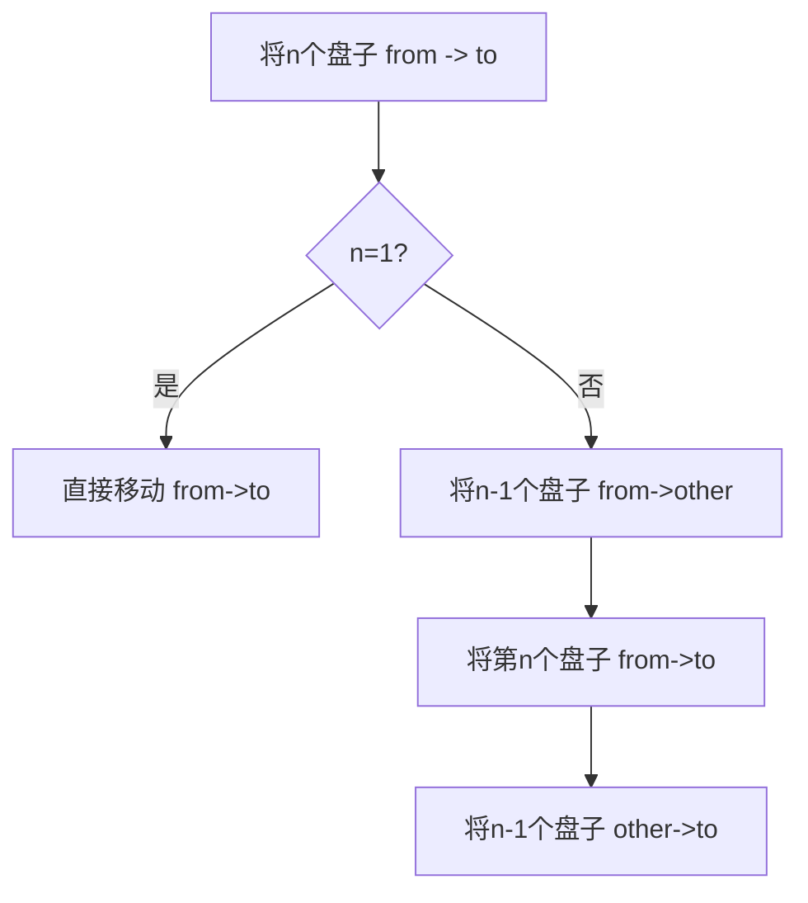

#### 打印字符串全部子序列

```mermaid
graph TD
    A[递归函数 f i, path] --> B{i == N?}
    B -->|是| C[打印path并返回]
    B -->|否| D[不选当前字符: f i+1, path]
    D --> E[选当前字符: f i+1, path+str[i]]
```

#### 背包问题递归树

```mermaid
graph TD
    A["f(0, bag)"] --> B["不要0号: f(1, bag)"]
    A --> C["要0号: f(1, bag-w[0]) + v[0]"]
    B --> D[不要1号: f(2, bag)]
    B --> E[要1号: f(2, bag-w[1]) + v[1]]
    C --> F[不要1号: f(2, bag-w[0])]
    C --> G[要1号: f(2, bag-w[0]-w[1]) + v[1]]
    D --> H[...]
    E --> I[...]
    F --> J[...]
    G --> K[...]
```

#### 纸牌游戏递归

```mermaid
graph TD
    A["先手f(L,R)"] --> B{L==R?}
    B -->|是| C[返回arr[L]]
    B -->|否| D["拿左边: arr[L] + 后手g(L+1,R)"]
    B -->|否| E["拿右边: arr[R] + 后手g(L,R-1)"]
    D --> F[返回max]
    E --> F
    
    G["后手g(L,R)"] --> H{L==R?}
    H -->|是| I[返回0]
    H -->|否| J["对手拿左边后: f(L+1,R)"]
    H -->|否| K["对手拿右边后: f(L,R-1)"]
    J --> L[返回min]
    K --> L
```

---

### 5. 经典金句

> “暴力递归就是尝试。”

> “一定要学会怎么去尝试，因为这是动态规划的基础。”

> “把问题转化为规模缩小了的同类问题的子问题，有明确的不需要继续进行递归的条件(base case)，有当得到了子问题的结果之后的决策过程，不记录每一个子问题的解。”

---

## 课程总结

本课程《算法基础入门班》系统涵盖了算法学习中的核心内容：

| 课程 | 核心内容 | 时间复杂度要点 |
|------|----------|----------------|
| 第一课 | 时间复杂度、排序基础、二分法、异或运算 | O(1), O(N), O(N²), O(log N) |
| 第二课 | 归并排序、堆排序、快速排序 | O(N*log N) |
| 第三课 | 桶排序、排序稳定性 | O(N) |
| 第四课 | 哈希表、有序表、链表 | O(1), O(log N) |
| 第五课 | 二叉树遍历与判断 | O(N) |
| 第六课 | 图的遍历与算法 | O(N+E), O(E*log E) |
| 第七课 | 前缀树、贪心算法 | 视具体实现 |
| 第八课 | 暴力递归 | 视具体实现 |

**推荐资源**：
- 进阶课程：《牛客高级项目课》https://www.nowcoder.com/courses/semester/senior
- 优惠券码：DRMscjy
- 面试书籍：《程序员代码面试指南—IT名企算法与数据结构题目最优解》（左程云 著）