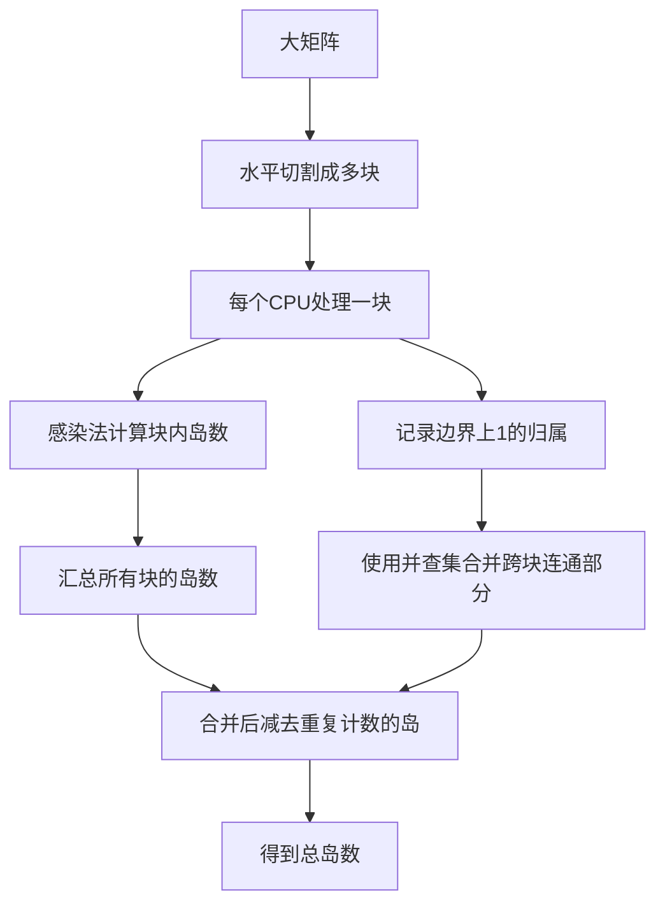
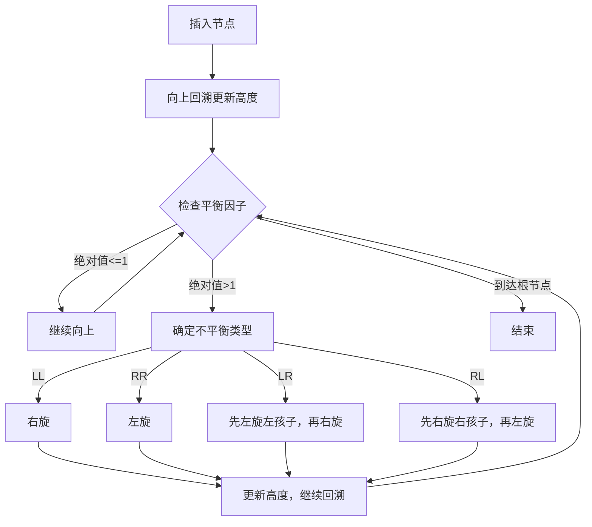
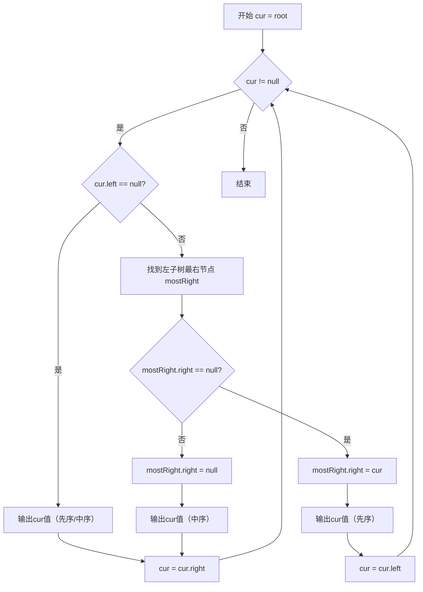
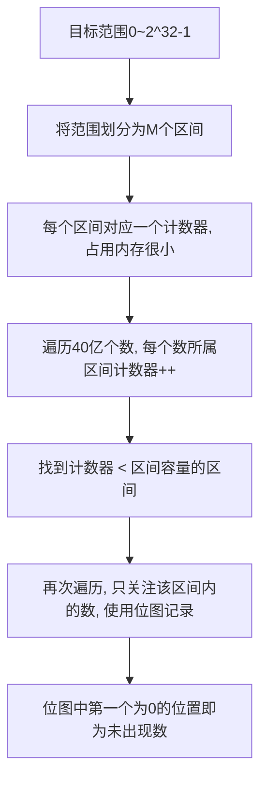
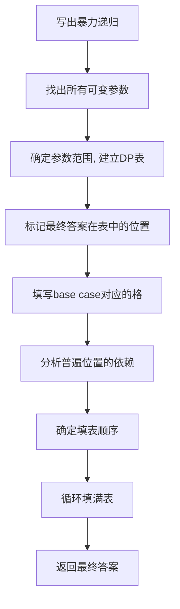

# 《牛客网算法基础提升班》章节总结

## 书籍信息
- **书名**：牛客网算法基础提升班
- **作者**：左程云（主讲老师）
- **PDF 状态**：共8个PDF文件，对应8次课程，内容清晰可识别。
- **OCR 状态**：良好，无明显错漏。

## 目录说明
- **目录识别情况**：原课程为系列讲座，无传统书籍目录。本总结以“课”作为主章节（第1课～第8课），严格按文件顺序排列。每课内部按页面自然顺序组织小节，保留原题目标题和知识点标题。
- **章节对应依据**：文件名为“基础提升班第X课.pdf”，内容页标题与页面顺序一致。
- **OCR 修复说明**：无需修复。

## 全书核心主题
本课程是面向有一定算法入门基础、但尚未达到校招水平同学的提升课程。左程云老师系统讲解了高级数据结构（哈希表、布隆过滤器、一致性哈希、并查集、平衡树、跳表等）、经典字符串算法（KMP、Manacher）、数据结构与算法技巧（滑动窗口、单调栈、Morris遍历、树形DP）、大数据处理技巧（位图、分段统计、堆外排序）、位运算以及暴力递归到动态规划的完整套路。课程以“题目驱动”的方式，先抛出典型面试题，再深入讲解原理、实现细节和最优解，最后提供项目经验和面试指导。核心目标是让学员掌握高复杂度问题的优化思路，具备应对校招算法面试的能力。

---

## 第1课：认识哈希函数和哈希表的实现；布隆过滤器；一致性哈希；岛问题与并查集

### 1. 核心论点
本章解决以下问题：
1. 哈希函数与哈希表的底层原理及如何实现高效增删改查。
2. 如何设计一个插入、删除、随机获取都是O(1)的结构（RandomPool）。
3. 布隆过滤器的原理、用途及空间节省优势。
4. 一致性哈希如何解决分布式缓存系统中的服务器负载管理问题。
5. “岛问题”的求解方法及如何通过并查集实现并行计算。

作者观点：哈希函数是数据均匀分流的基石；布隆过滤器以一定失误率换取巨大空间节省；一致性哈希通过虚拟节点实现负载均衡；并查集能高效处理连通性问题并支持并行。

### 2. 关键概念
- **哈希函数**：输入任意域，输出固定范围，具有确定性、均匀性、不可逆性。可将数据按种类均匀分流。
- **RandomPool结构**：使用两个哈希表 + 一个size变量，实现insert、delete、getRandom均为O(1)。delete时通过“用最后一个替换被删位置”来保持下标连续。
- **布隆过滤器**：一个很长的二进制向量和一系列哈希函数。用于判断一个元素“一定不在集合中”或“可能在集合中”。可节省大量空间，但存在假阳性。
- **一致性哈希**：将哈希值空间组织成环，服务器节点映射到环上，数据按顺时针找最近节点。新增/删除节点只影响局部数据。引入虚拟节点可解决负载不均。
- **并查集**：支持集合的快速合并（union）和查询（find）。常用于解决动态连通性问题，如岛问题中并行统计子矩阵的岛再合并。

### 3. 逻辑推演
作者首先从哈希函数的基本性质入手，指出其“均匀分流”特性是后续多个结构的基础。然后提出RandomPool题目，要求同时满足三种操作O(1)，引出双哈希表+交换删除的技巧。接着介绍布隆过滤器，分析其空间优势与失误率之间的权衡。之后转向分布式系统场景，讲解一致性哈希如何解决传统取模方式的扩展性问题，并给出虚拟节点的实现。最后以“岛问题”为例，演示如何用感染（DFS）方法求解，并引出并行计算场景下并查集的应用：将大矩阵分割成子矩阵分别统计岛数量，再合并边界上的连通关系。

### 4. 流程图：岛问题的并行算法思路



### 5. 经典金句/数据
> “哈希函数可以把数据按照种类均匀分流。”（第6课补充，但原理在第1课）
> “布隆过滤器用于集合的建立与查询，并可以节省大量空间。”
> “一致性哈希解决数据服务器的负载管理问题。”
> “利用并查集结构做岛问题的并行计算。”

---

## 第2课：平衡树（AVL、SB树、SkipList、红黑树）

### 1. 核心论点
本章解决：如何实现自平衡的二叉搜索树，以保证查找、插入、删除的O(logN)性能。作者介绍了四种具有平衡性的数据结构：AVL树（严格平衡）、SB树（大小平衡）、跳表（概率平衡）、红黑树（近似平衡）。每种结构有不同的平衡定义和调整策略。

作者观点：平衡性是打破输入规律、避免退化链表的关键。跳表利用随机函数实现平衡，实现相对简单。红黑树应用最广，但调整细节复杂。

### 2. 关键概念
- **左旋/右旋**：树的局部调整操作，用于恢复平衡。左旋：将节点X变为其右孩子的左子树；右旋：将节点X变为其左孩子的右子树。
- **AVL树**：任一节点左右子树高度差绝对值不超过1。插入/删除后从受影响节点向上检查平衡因子，执行LL、RR、LR、RL四种旋转。
- **SB树（Size Balanced Tree）**：每棵子树的大小不小于其兄弟的子树大小，即每棵叔叔树的大小不小于任何侄子树的大小。通过maintain操作调整。
- **SkipList（跳表）**：多层级链表，每个节点以概率1/2决定是否向上层提拔。查找时从上到下、从左到右跳跃。用随机函数保证平衡。
- **红黑树**：每个节点红或黑，根黑、叶黑、红节点的孩子必黑、从任一节点到叶子的所有路径包含相同数量的黑节点。满足近似平衡。

### 3. 逻辑推演
作者首先提出“平衡树解决什么问题” – 防止二叉搜索树退化成链表。然后介绍最基本的局部调整操作：左旋和右旋。接着分别讲解四种平衡树：
- AVL树：以高度为指标，插入后回溯调整，分为LL、RR、LR、RL四种情况，每种有标准旋转手法。
- SB树：以size为指标，平衡条件更“宽松”，maintain过程包括左旋、右旋和递归调整。
- SkipList：完全不同的思路，利用随机层数实现概率平衡，查找复杂度O(logN)期望。实现简单，不需要旋转。
- 红黑树：只做简要介绍，指出其应用最广（如Java TreeMap、C++ std::map），但具体实现较复杂，可由其它平衡树代替。

### 4. 流程图：AVL树插入后调整流程



### 5. 经典金句/数据
> “平衡性：利用随机函数打破输入规律。”（SkipList）
> “当插入或者删除一个节点时，可能会让整棵AVL不平衡。此时，只需要把最小不平衡子树调整即可恢复整体的平衡性。”
> “SkipList的具体实现与调整细节。”

---

## 第3课：KMP算法 与 Manacher算法

### 1. 核心论点
本章解决两个经典字符串问题：
1. 判断str1是否包含str2，若包含返回开始位置，要求O(N)时间复杂度。
2. 求解字符串中最长回文子串的长度，要求O(N)时间复杂度。

作者观点：KMP利用最长前缀后缀匹配信息（next数组）避免重复比对；Manacher利用回文半径和对称性，通过最右回文边界加速。

### 2. 关键概念
- **KMP算法**：当匹配失败时，利用已匹配部分的前缀后缀最长公共长度，将模式串向右滑动尽可能远的距离，避免从头开始。
- **next数组**：对于模式串，next[i]表示以i-1结尾的子串中，最长的相等前缀和后缀的长度（不包含整个串）。
- **Manacher算法**：通过在字符间插入特殊字符（如#）统一奇偶回文，维护最右回文边界R和对应中心C，利用对称点回文半径进行加速。
- **回文半径数组**：记录以每个位置为中心的最长回文半径。

### 3. 逻辑推演
作者先给出题目，提出暴力法的O(N*M)不可接受。然后引入KMP：
- 推导next数组的递推计算过程。
- 演示匹配过程：i指针不回溯，j根据next值回退。
- 证明时间复杂度O(N)。

接着讲解Manacher：
- 先做字符串预处理（插入#）。
- 遍历每个位置，利用R和C快速初始化当前回文半径。
- 扩展并更新R和C。
- 最后取最大半径得到原串最长回文长度。

### 4. 流程图：KMP匹配过程

```mermaid
graph TD
    A[初始化 i=0, j=0] --> B{i < len1 && j < len2}
    B -->|是| C{str1[i] == str2[j]?}
    C -->|相等| D[i++; j++]
    C -->|不等| E{j == 0 ? i++ : j = next[j]}
    D --> B
    E --> B
    B -->|否| F{j == len2 ? 返回 i-j : 返回 -1}
```

### 5. 经典金句/数据
> “KMP算法解决的问题：字符串str1和str2，str1是否包含str2，如果包含返回str2在str1中开始的位置。如何做到时间复杂度O(N)完成？”
> “Manacher算法解决的问题：字符串str中，最长回文子串的长度如何求解？如何做到时间复杂度O(N)完成？”

---

## 第4课：滑动窗口与单调栈

### 1. 核心论点
本章解决两类问题：
1. 滑动窗口内最大值（或最小值）的快速更新结构，支持窗口左右边界向右滑动。
2. 对于数组中每个数，找到左边和右边比它小（或大）且离它最近的位置，整体O(N)解决。

作者观点：使用双端队列维护窗口内可能成为最大值的候选，实现均摊O(1)的窗口最大值更新。单调栈通过严格的栈规则，在入栈和出栈时记录每个数两侧最近的大/小值。

### 2. 关键概念
- **窗口内最大值更新结构**：使用双端队列（deque），队列中存储数组下标。队头始终是当前窗口最大值。当窗口右边界向右移动时，从队尾弹出小于新值的下标；当窗口左边界向右移动时，检查队头下标是否过期，若过期则弹出。
- **单调栈**：栈内元素保持单调递增（或递减）。遍历数组，当待入栈元素破坏单调性时，依次弹出栈顶，并记录弹出元素右侧最近比它小（或大）的位置为当前元素，左侧最近为栈中的下一个元素。

### 3. 逻辑推演
作者先举例题目：给定数组和固定窗口大小，输出每个窗口的最大值。暴力O(N*w)不可取。于是设计双端队列结构，演示窗口滑动过程，证明每个元素最多入队出队一次，总复杂度O(N)。

接着引出单调栈：需要每个元素左右两侧第一个比它小的位置。暴力法O(N^2)。单调栈的核心思想是保持栈内递增，当遇到更小的元素时，栈顶元素的右侧小值就是当前元素，左侧小值就是栈内下一个元素。遍历完成后，剩余栈内元素右侧小值为null。该方法可处理无重复值和有重复值两种情况。

### 4. 流程图：滑动窗口最大值更新结构

```mermaid
graph TD
    A[初始化空双端队列] --> B[遍历数组 i 0..n-1]
    B --> C{队列非空 && arr[i] >= arr[队尾]}
    C -->|是| D[弹出队尾]
    D --> C
    C -->|否| E[将 i 压入队尾]
    E --> F{队头下标 <= i - w}
    F -->|是| G[弹出队头]
    F -->|否| H[当前窗口最大值为 arr[队头]]
    G --> H
    H --> B
```

### 5. 经典金句/数据
> “窗口只能右边界或左边界向右滑的情况下，维持窗口内部最大值或者最小值快速更新的结构。”
> “在数组中想找到一个数，左边和右边比这个数小、且离这个数最近的位置。如果对每一个数都想求这样的信息，能不能整体代价达到O(N)？需要使用到单调栈结构。”
> “定义：数组中累积和与最小值的乘积，假设叫做指标A。给定一个数组，请返回子数组中，指标A最大的值。”（此题目使用单调栈求解）

---

## 第5课：Morris遍历 与 树形DP

### 1. 核心论点
本章解决两个问题：
1. 如何以O(1)额外空间复杂度遍历二叉树（Morris遍历），实现先序、中序、后序。
2. 如何利用树形DP套路解决二叉树上的路径、距离、最大快乐值等最优解问题。

作者观点：Morris遍历利用空闲右指针回到前驱节点，在不使用栈或递归的情况下实现遍历。树形DP是一种自底向上的信息整合方法，适合求解子树相关的最优值。

### 2. 关键概念
- **Morris遍历**：设定当前节点cur，开始时cur为根。
  1. 如果cur无左孩子，cur = cur.right。
  2. 如果cur有左孩子，找到左子树的最右节点mostRight。
     - 如果mostRight.right == null，则将其指向cur，然后cur = cur.left。
     - 如果mostRight.right == cur，则将其置为null，然后cur = cur.right。
  3. 重复直到cur为空。
- **树形DP套路**：
  1. 分析以X为头的子树中答案的可能性。
  2. 列出所有需要的信息（如左树的最大距离、高度等）。
  3. 定义信息结构体。
  4. 设计递归函数，basecase，整合左右信息，返回本树的信息。
- **二叉树节点间最大距离**：每个节点可能的最大距离 = max(左树最大距离, 右树最大距离, 左树高度+右树高度+1)。
- **派对最大快乐值**：每个员工来或不来的两种状态下的快乐值，通过多叉树递归计算。

### 3. 逻辑推演
作者先讲解Morris遍历的实质：每个节点如果有左子树则会被访问两次，否则一次。利用空闲指针建立临时链接，从而达到空间O(1)。然后说明如何在前两次访问时机加工出先序、中序和后序（后序需特殊处理）。

随后切换到树形DP：以“最大距离”问题为例，演示套路四步。再以“派对快乐值”为例，展示多叉树的DP解法，定义两个返回值（来时的快乐值、不来时的快乐值），最后取max。

### 4. 流程图：Morris遍历流程



### 5. 经典金句/数据
> “Morris遍历的实质：建立一种机制，对于没有左子树的节点只到达一次，对于有左子树的节点会到达两次。”
> “树形dp套路：如果题目求解目标是S规则，则求解流程可以定成以每一个节点为头节点的子树在S规则下的每一个答案，并且最终答案一定在其中。”
> “从二叉树的节点a出发，可以向上或者向下走，但沿途的节点只能经过一次，到达节点b时路径上的节点个数叫作a到b的距离。”
> “派对的最大快乐值：如果某个员工来了，那么这个员工的所有直接下级都不能来。”

---

## 第6课：大数据处理技巧 与 位运算

### 1. 核心论点
本章解决：
1. 海量数据场景下，如何利用有限内存找到未出现过的数、重复的URL、Top100热门词汇、出现两次的数、中位数等。
2. 位运算的进阶题目：不用比较判断求两数较大者；判断2的幂、4的幂；不用算术运算实现加减乘除。

作者观点：位图、分段统计、堆+外排序是处理大数据的三大利器。位运算技巧可以替代算术运算和比较，提升效率。

### 2. 关键概念
- **位图（BitMap）**：用每个bit表示一个数字是否出现，极大节省内存。40亿个数需约512MB。
- **分段统计**：将范围分成若干段，先统计每个段内的数量，找到缺失的段，再在该段内细查。适用于内存极小时找到未出现数。
- **堆+外排序**：处理Top100问题时，先分文件，每个文件内用堆求Top100，再合并所有文件的Top100进行最终排序。
- **不用比较求最大**：利用符号位和溢出特点，构造函数。
- **判断2的幂**：x & (x-1) == 0 且 x > 0。
- **判断4的幂**：先判断2的幂，再判断 (x & 0x55555555) != 0。
- **位运算实现加减乘除**：加法 = 异或 + 与运算左移（进位）；减法 = 加法+补码；乘法 = 类似竖式计算；除法 = 用移位逼近。

### 3. 逻辑推演
作者先列举大数据题目的常用技巧，然后逐个案例讲解：
- 40亿个数找未出现数（1GB内存）：使用位图。
- 进阶10MB内存：将范围划分成若干区间，先统计每个区间有多少个数，必然有区间不满，再详细处理该区间。
- 重复URL：使用哈希分流到多个文件，再逐个文件内用哈希表找重复。
- 热门Top100：先分小文件，每个文件内用堆求Top100，然后多路归并。
- 出现两次的数：使用2-bit位图，00没出现，01一次，10两次，11多次。
- 中位数：分区间统计，找到中位数所在的区间，再二次遍历。

位运算部分，作者提供具体代码实现思路，强调边界情况和溢出处理。

### 4. 流程图：大数据找未出现数的分段统计法（10MB内存）



### 5. 经典金句/数据
> “32位无符号整数的范围是0~4,294,967,295，现在有一个正好包含40亿个无符号整数的文件，所以在整个范围中必然存在没出现过的数。”
> “位图解决某一范围上数字的出现情况，并可以节省大量空间。”
> “利用分段统计思想、并进一步节省大量空间。”
> “利用堆、外排序来做多个处理单元的结果合并。”
> “给定两个有符号32位整数a和b，返回a和b中较大的。要求：不用做任何比较判断。”
> “给定两个有符号32位整数a和b，不能使用算术运算符，分别实现a和b的加、减、乘、除运算。”

---

## 第7课：暴力递归到动态规划（上）

### 1. 核心论点
本章解决：如何将暴力递归的尝试优化为动态规划，以减少重复计算。通过几个经典题目（机器人走步、换钱最少货币数、纸牌博弈、马跳棋盘、Bob生存概率）演示从递归到DP的完整套路。

作者观点：动态规划本质上就是暴力尝试加缓存（记忆化搜索），进一步可以整理出严格表依赖。核心在于找到可变参数及其变化范围，按照依赖顺序填表。

### 2. 关键概念
- **暴力递归**：直接按照问题定义写出递归函数，不关心性能，只保证正确性。
- **记忆化搜索**：在递归过程中，将已经计算过的状态存入缓存，下次直接使用。
- **动态规划（严格表结构）**：
  1. 找出可变参数（状态变量）。
  2. 确定参数范围，建立多维数组（DP表）。
  3. 确定base case填初始值。
  4. 分析普遍位置依赖关系，确定填表顺序。
  5. 返回最终状态的值。
- **机器人到达指定位置方法数**：参数为位置cur和剩余步数rest，DP表[cur][rest]依赖左、右位置的rest-1。
- **换钱最少货币数**：参数为当前面值索引和剩余目标，完全背包问题。
- **纸牌博弈**：两个递归函数（先手和后手），DP为二维表。
- **马踏棋盘**：三维DP（x, y, step），步数依赖上一步8个方向。
- **Bob生存概率**：区域边界限制，概率 = 存活方法数 / 4^K。

### 3. 逻辑推演
作者强调：动态规划不是凭空想出来的，而是先写出递归尝试，再通过观察重复子问题优化。以机器人走步为例：
- 递归版本：f(rest, cur) = f(rest-1, cur-1) + f(rest-1, cur+1)，边界处理。
- 发现cur和rest重复出现，建二维表。
- 初始：rest=0时，只有cur=P的位置为1。
- 依赖关系：rest行依赖rest-1行，从左到右可算。
- 最终返回f(K, M)。

其他题目类似展开。作者还介绍了空间压缩技巧（滚动数组）以及最优解不一定需严格按表顺序（记忆化搜索即可）。

### 4. 流程图：动态规划套路



### 5. 经典金句/数据
> “动态规划就是暴力尝试减少重复计算的技巧，而已。”
> “先写出用尝试的思路解决问题的递归函数，而不用操心时间复杂度。这个过程是无可替代的，没有套路的，只能依靠个人智慧，或者足够多的经验。”
> “但是怎么把尝试的版本，优化成动态规划，是有固定套路的。”
> “机器人达到指定位置方法数：N=5, M=2, K=3, P=3，返回3。”
> “换钱的最少货币数：arr=[5,2,3], aim=20，返回4。”
> “排成一条线的纸牌博弈问题：玩家A和B都绝顶聪明，返回获胜者分数。”
> “象棋中马的跳法：从(0,0)走k步到(x,y)的方法数。”
> “Bob的生存概率：给定n,m,i,j,k，返回生存概率分数。”

---

## 第8课：暴力递归到动态规划（下）与面试指导

### 1. 核心论点
本章继续动态规划题目：矩阵的最小路径和。然后总结更高级的动态规划优化技巧（四边形不等式、状态化简、位信息代替、业务反推初始状态），但指出这些内容留给高级班。最后给出面试准备的整体指导：简历、不同公司考察内容、如何准备、面试心态。

作者观点：矩阵最小路径和是二维DP的典型，依赖左、上两个方向。面试指导强调：算法只是面试的一部分，还需要重视基础、系统设计以及沟通态度。

### 2. 关键概念
- **矩阵最小路径和**：dp[i][j] = min(dp[i-1][j], dp[i][j-1]) + m[i][j]，第一行和第一列累加。
- **四边形不等式**：用于优化某些区间DP的决策单调性，可将O(N^3)降至O(N^2)。
- **枚举过程的状态化简**：通过数学变换减少内层循环。
- **复杂状态用位信息代替**：如用整数位表示集合状态。
- **用业务反推动态规划表的初始状态**：根据实际问题直接推导出边界值，而非从递归base case得到。
- **面试指导**：
  - 简历准备：突出项目、技术栈、成果。
  - 公司考察：非算法基础（语言、网络、OS）、算法数据结构、系统设计。
  - 准备方式：背（基础知识）、练（算法）、看（面经）。
  - 心态：让对方喜欢你，同时你也在面试公司。

### 3. 逻辑推演
作者先给出矩阵最小路径和题目，展示DP解法，并指出此题也可用空间压缩（一维数组）。然后简要提及四种高级优化技巧，但说明本课程不展开。最后花费一定篇幅讲解实际面试的软技能，强调算法只是敲门砖，综合素质同样重要。这部分内容对即将求职的学员具有实用指导意义。

### 4. 流程图：矩阵最小路径和DP填表

```mermaid
graph TD
    A[初始化 dp[0][0] = m[0][0]] --> B[填充第一行: dp[0][j] = dp[0][j-1] + m[0][j]]
    B --> C[填充第一列: dp[i][0] = dp[i-1][0] + m[i][0]]
    C --> D[对于 i=1..n-1, j=1..m-1]
    D --> E[dp[i][j] = min(dp[i-1][j], dp[i][j-1]) + m[i][j]]
    E --> F[返回 dp[n-1][m-1]]
```

### 5. 经典金句/数据
> “矩阵的最小路径和：从左上角开始每次只能向右或者向下走，最后到达右下角，返回最小的路径和。”
> “四边形不等式、枚举过程的状态化简、复杂状态用位信息代替、用业务反推动态规划表的初始状态 – 这些内容留给高级班的课程来讲述。”
> “简历怎么准备？不同的公司面试考什么？该怎么准备？面试过程的心态。”
> “让别人喜欢你，你也在面试公司。”

---

## 课程总结与推荐资源

本课程覆盖了算法面试中高级数据结构和常见题型的核心解法。每课末尾均附有以下推荐资源：

- **提升项目经验**：《牛客高级项目课—（牛客网）》，课程地址：https://www.nowcoder.com/courses/semester/senior ，独家内部100元优惠券：DRMscjy
- **面试算法书籍**：《程序员代码面试指南—IT名企算法与数据结构题目最优解》，作者：左程云

以上为《牛客网算法基础提升班》全部8次课程的完整结构化总结。