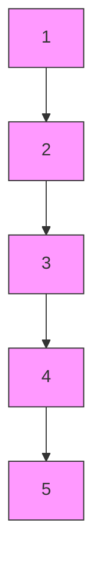
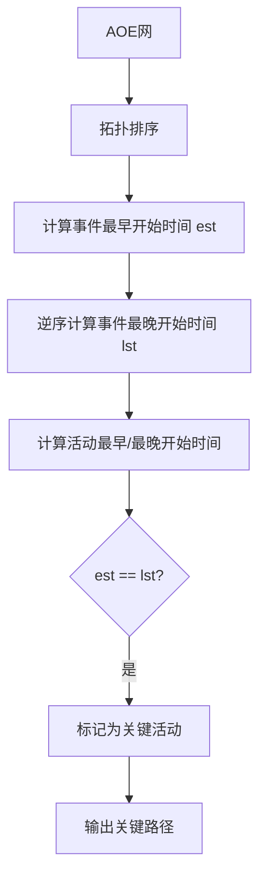
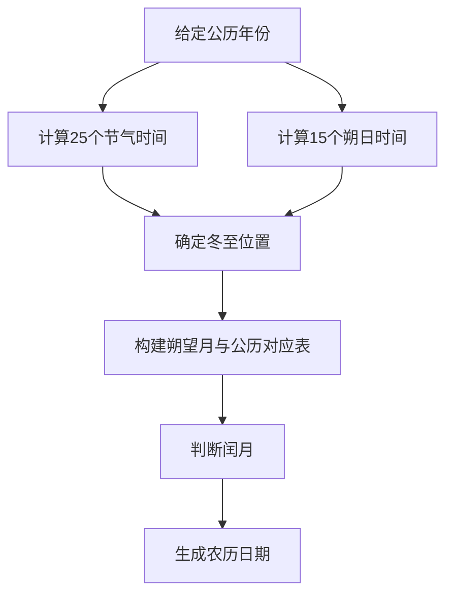
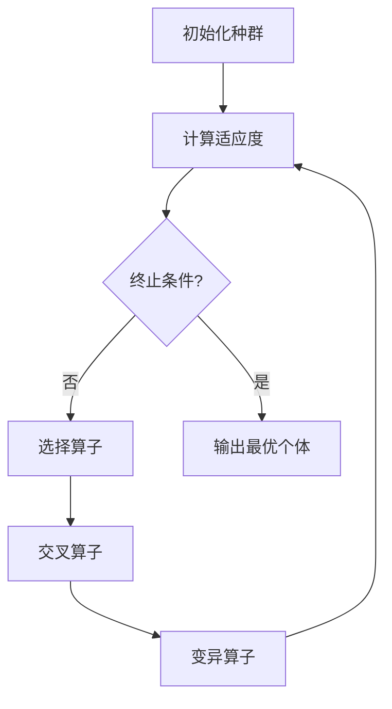
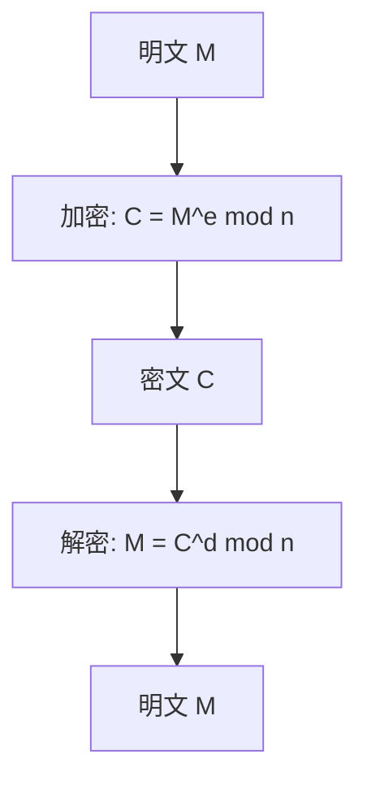
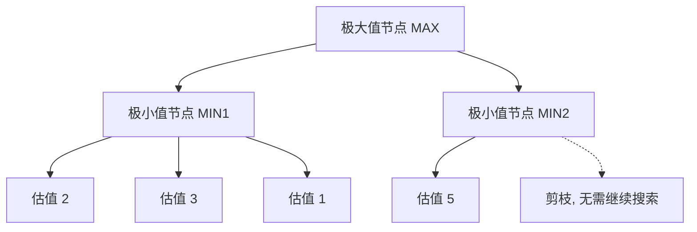
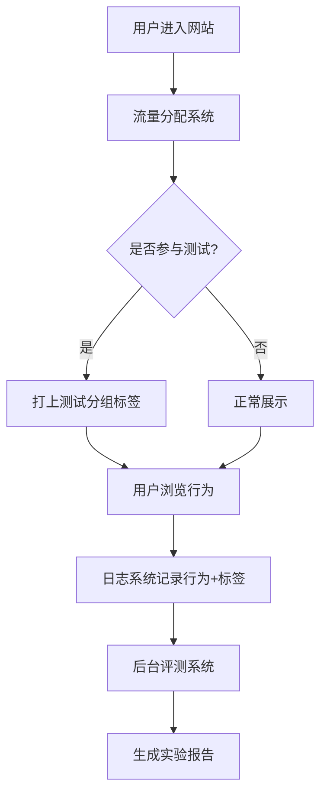
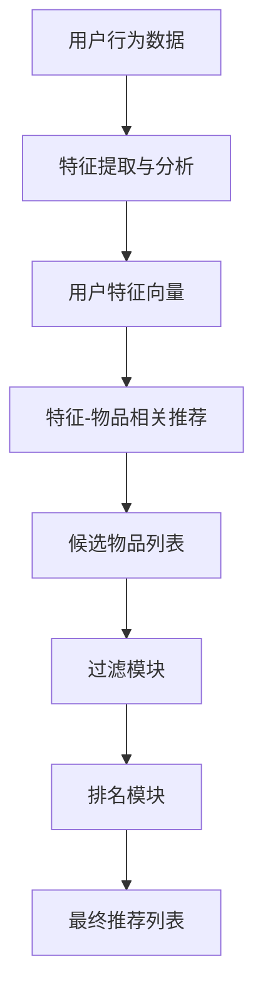

# 《算法的乐趣》章节总结

## 书籍信息

- 书名：《算法的乐趣》
- 作者：王晓华
- PDF 状态：文字版
- OCR 状态：良好

## 目录说明

- 目录识别情况：完整
- 章节对应依据：原书目录结构（第1章至第23章 + 附录）

## 全书核心主题

本书通过一系列有趣的生活实例，全面介绍构造算法的基础方法及其广泛应用。全书分为两部分：第一部分介绍算法的概念、常用算法结构（贪婪法、分治法、动态规划、穷举搜索）及实现方法；第二部分介绍算法在各个领域的应用，包括历法计算、曲线拟合、傅里叶变换、遗传算法、RSA加密、数独、华容道、A*寻径、俄罗斯方块、棋类博弈等。作者旨在让读者“爱上算法，乐在其中”。

---

## 第1章：程序员与算法

### 核心论点

本章解决“程序员是否必须会算法”的争议问题。作者认为：算法的本质是解决问题，只要是能解决问题的代码就是算法。程序员需要具备设计算法解决问题的能力，而非仅掌握高大上的算法名词。

### 关键概念

- **算法的定义**：为解决特定问题而设计的数学模型及操作步骤，具有确定性、有穷性、可行性、输入输出四大特征。
- **环形队列**：固定长度缓冲区的读写标准模式，避免每次移动全部数据，通过取模运算实现一致性处理。
- **污点消除算法**：根据“有意义图形至少由5个点连成”的观察，通过连通性搜索识别并清除污点。
- **算法乐趣三层次**：初级（解决具体问题的成就感）、中级（理解算法原理为工作带来便利）、高级（自己设计算法让别人使用）。

### 逻辑推演/叙事脉络

1. 提出争议：程序员是否需要会算法
2. 两个亲身经历说明算法的重要性：环形队列（性能优化）、污点消除（图像预处理）
3. 探讨算法乐趣的来源：从解决问题到创造算法
4. 强调代码质量：漂亮的代码有助于改善软件质量

### 经典金句/数据

> “算法的本质是解决问题，只要是能解决问题的代码就是算法。” (p.1)

> “计算机是一种很傻的工具，傻到几乎没有智商。最有创造性的活动是由一种被称为‘程序员’的人做的。” (p.2)

> “说数据结构和算法没用的人是因为他们用不到，用不到的原因是他们想不到，而想不到的原因是他们不会。” (p.3)

---

## 第2章：算法设计的基础

### 核心论点

本章解决“算法设计需要哪些基础知识”的问题。作者认为：顺序执行、循环、分支跳转是程序的三大基本结构；数据结构是建立数学模型的基础；掌握的数据结构越多，解决问题的思路就越宽。

### 关键概念

- **程序基本结构**：顺序执行（确定性、封闭性）、循环结构（初始化+循环体+循环条件）、分支和跳转结构（单分支、双分支、多分支、switch-case、函数表）。
- **数据结构**：数组、链表、栈、队列、树（二叉树、B树、区间树、线段树、堆、字典树）、集合、哈希表与映射、图。
- **数学模型**：建立问题域的高度抽象，用计算机能理解的方式描述问题。例如倒水问题转化为状态穷举搜索，矩形包含关系转化为区间树查询。

### 逻辑推演/叙事脉络

1. 程序三大基本结构及其在算法中的体现
2. 数据结构在算法设计中的应用：基本数据结构（数组、链表、栈、队列）→ 复杂数据结构（树、集合、哈希表、图）
3. 数据结构和数学模型与算法的关系：数据结构是承载数学模型的基础
4. 通过“矩形包含关系”问题说明数据结构和数学模型选择的重要性

### 流程图

**二叉查找树退化情况**



### 经典金句/数据

> “数据结构是算法的基本工具，采用什么数据结构由算法的数学模型决定。” (p.25)

> “西方有句谚语：手里拿三年锤子，看什么都是钉子。如果一个人的本事就只会抢大锤，那他解决问题的方法就是拿锤子砸。有时候，工具可以决定思维。” (p.24)

---

## 第3章：算法设计的常用思想

### 核心论点

本章介绍四种常用算法设计模式：贪婪法、分治法、动态规划、穷举搜索。作者认为：模式作为算法演进的固定思路，提供构造算法的常用思想，但不是构造算法的全部方法。

### 关键概念

- **贪婪法（Greedy）**：在每个步骤选取当前状态下最好的选择，不进行回溯。适合最短路径、最小生成树；不适合大部分最优解问题（如0-1背包问题）。
- **分治法（Divide and Conquer）**：将大问题分解为规模较小的相同问题，逐个解决后合并。如快速排序、Karatsuba乘法算法。
- **动态规划（Dynamic Programming）**：解决多阶段决策最优化问题，需要定义最优子问题、状态、决策和状态转换方程、边界条件。如编辑距离问题。
- **穷举搜索（Exhaustive Search）**：在有限解空间内按一定策略查找，适合无其他更好方法的问题。解空间定义和搜索策略是难点。

### 流程图

**动态规划解决编辑距离的状态转移**

```mermaid
graph TD
    A[字符串 source 和 target] --> B[定义状态 d[i][j]]
    B --> C{source[i] == target[j]?}
    C -->|是| D[d[i][j] = d[i-1][j-1]]
    C -->|否| E[d[i][j] = min(插入,删除,替换) + 1]
    D --> F[最终 d[n][m] 为编辑距离]
    E --> F
```

### 经典金句/数据

> “贪婪法简单高效，省去了为找最优解可能需要的穷举操作，可以得到与最优解比较接近的近似最优解。” (p.27)

> “分治法产生的子问题与原始问题相同，只是规模减小，反复使用分治法，可以使得子问题的规模不断减小，直到能够被直接求解为止。” (p.30)

> “动态规划比穷举高效，但并不是任何情况下使用动态规划法都有最高的效率。很多NP问题使用动态规划法仍然是指数时间复杂度。” (p.34)

> “穷举法是‘不是办法的办法’或‘最后的办法’，但绝对不能轻视它，它是很多问题的唯一解决方法。” (p.41)

---

## 第4章：阿拉伯数字与中文数字

### 核心论点

本章解决“阿拉伯数字与中文数字相互转换”的问题。作者根据国家标准和行业规定设计转换算法，核心难点在于中文数字“零”的使用规则（以万为小节、连续零只用一个零、节尾零不转换）。

### 关键概念

- **中文数字特点**：十进制，用“数字+权位”组成（如“一百”）；以“万”为小节；零的使用有三条规则。
- **阿拉伯数字转中文数字**：以万为单位分节 → 确定节权位 → 每节内确定权位 → 按规则处理零。
- **中文数字转阿拉伯数字**：识别数字和权位组合 → 权位转换为10的倍数 → 节权位作为小节倍数 → 求和。
- **中文大写数字**：用“壹贰叁肆伍陆柒捌玖”和“拾佰仟”防止篡改。

### 经典金句/数据

> “中文计数方式中每个数字的权位都直接跟在数字后面，因此可以用一个‘零’代表连续出现的若干个0。” (p.48)

> “零的使用规则1：以10000为小节，小节的结尾即使是0，也不使用‘零’。规则2：小节内两个非0数字之间要使用‘零’。规则3：当小节的‘千’位是0时，若本小节的前一小节无其他数字，则不用‘零’，否则就要用‘零’。” (p.48)

---

## 第5章：三个水桶等分8升水的问题

### 核心论点

本章解决“用三个水桶（8升、5升、3升）等分8升水”的求解问题。作者通过建立状态数学模型和动作模型，使用深度优先搜索穷举所有可能的倒水方法。

### 关键概念

- **状态模型**：用[8,0,0]表示三个桶中的水量，状态空间构成一棵状态树。
- **动作模型**：从from桶向to桶倒水，需要判断倒出桶有水、倒入桶有空余。
- **搜索算法**：深度优先搜索（DFS），使用双端队列记录已处理状态，避免状态环路。
- **剪枝**：重复状态判断，避免无限循环。

### 流程图

**状态树搜索与剪枝**

```mermaid
graph TD
    A[初始状态 [8,0,0]] --> B[动作：倒5升到5升桶]
    A --> C[动作：倒3升到3升桶]
    B --> D[状态 [3,5,0]]
    D --> E[动作：从5升倒3升]
    E --> F[状态 [3,2,3]]
    F --> G[动作：从3升倒回8升]
    G --> H[状态 [6,2,0]]
    H --> I{是否重复状态?}
    I -->|是| J[剪枝，回溯]
    I -->|否| K[继续搜索]
```

### 经典金句/数据

> “计算机不会进行理性分析，不知道每次如何选择最佳的过河方式，但是计算机擅长快速计算且不知疲劳。既然不知道如何选择，那就干脆把所有的过河方式都尝试一遍。” (p.66)

> “用本章的算法穷举之后，一共找到了16种倒水的方法，最快的方法需要7个步骤。” (p.64)

---

## 第6章：妖怪与和尚过河问题

### 核心论点

本章解决“三个和尚和三个妖怪安全过河”的经典智力题。作者通过五元组状态模型（本地和尚数、本地妖怪数、对岸和尚数、对岸妖怪数、船的位置）和有限动作集（10种过河动作），使用深度优先搜索穷举所有过河方案。

### 关键概念

- **状态模型**：[local_monster, local_monk, remote_monster, remote_monk, boat] 五元组。
- **动作模型**：10种过河动作，包括一个/两个妖怪过河、一个/两个和尚过河、一个和尚一个妖怪过河等。
- **动作表驱动**：使用ACTION_EFFECTION数组存储动作效果（move_monster, move_monk, boat_to），避免长if-else语句。
- **剪枝**：合法性判断（船的位置、移动数量是否超出当前状态）+ 重复状态判断。

### 经典金句/数据

> “这个问题一共有四种解决方案，并且只有四种。” (p.72)

---

## 第7章：稳定匹配与舞伴问题

### 核心论点

本章解决“如何找到稳定匹配”的问题。作者介绍Gale-Shapley算法（求婚-拒绝算法），并应用于舞伴匹配问题。该算法保证得到稳定完美匹配，并且主动求婚的一方获得最佳可能结果。

### 关键概念

- **稳定匹配**：完美匹配中不存在不稳定对（两人互相更喜欢对方胜过当前伴侣）。
- **Gale-Shapley算法**：主动方（求婚者）按偏好列表依次求婚，被动方可选择接受或毁约。最终得到稳定匹配。
- **空间换时间**：预计算priority二维表存储偏好位置，将判断从O(n)降为O(1)。
- **匈牙利算法**：求二部图最大匹配。
- **Kuhn-Munkres算法**：求二部图带权最大匹配（最佳匹配）。

### 流程图

**Gale-Shapley 算法流程**

```mermaid
graph TD
    A[初始化所有男女为自由状态] --> B{存在自由男人且还有未求婚对象?}
    B -->|是| C[选择自由男人 m]
    C --> D[m 向偏好列表中下一个女人 w 求婚]
    D --> E{w 是否自由?}
    E -->|是| F[(m,w) 变为约会状态]
    E -->|否| G[w 已有约会对象 m']
    G --> H{w 更喜欢 m 还是 m'?}
    H -->|更喜爱 m'| I[m 保持单身]
    H -->|更喜爱 m| J[解除 (m',w), 建立 (m,w)]
    F --> B
    I --> B
    J --> B
    B -->|否| K[输出匹配结果]
```

### 经典金句/数据

> “稳定匹配满足两个条件：首先，它是一个完美匹配；其次，它不含有任何不稳定因素。” (p.75)

> “盖尔和沙普利在1962年提出的Gale-Shapley算法，2012年获得了诺贝尔经济学奖。” (p.94)

> “婚姻中男人如果不主动争取，条件好的女孩就会投入别人的怀抱，留给自己的机会就越来越差。” (p.94)

---

## 第8章：爱因斯坦的思考题

### 核心论点

本章解决“谁养鱼”的经典逻辑推理题。作者通过五维属性（房子颜色、国籍、饮料、宠物、香烟）建立基本模型，将15条线索分为绑定关系、相邻关系和特殊条件三类，采用多维度穷举搜索求解。最终证明答案唯一。

### 关键概念

- **基本模型**：5种颜色、5种国籍、5种饮料、5种宠物、5种香烟，共25个属性。用GROUP结构存储每个推理组。
- **线索分类**：绑定关系（如“英国人住红房子”）、相邻关系（如“抽Blends牌香烟的人和养猫的人相邻”）、特殊条件（如“绿房子在白房子左边”）。
- **多维度穷举**：按组内元素顺序依次穷举：房子颜色 → 国籍 → 饮料 → 宠物 → 香烟，配合线索剪枝。
- **解空间规模**：理论上近2亿种组合，但只有一组能通过所有线索检查。

### 经典金句/数据

> “虽然有将近2亿个组合结果，但是令人惊讶的是，竟然只有一组结果能通过所有的线索检查。” (p.103)

---

## 第9章：项目管理与图的拓扑排序

### 核心论点

本章解决“工程活动中如何排序和找出关键路径”的问题。作者通过AOV网（顶点表示活动）实现拓扑排序，通过AOE网（边表示活动）实现关键路径查找。

### 关键概念

- **AOV网**：顶点表示活动，有向边表示活动前后关系。拓扑排序得到活动序列。
- **AOE网**：边表示活动，权表示时间，顶点表示事件。关键路径是工程最短时间。
- **拓扑排序**：从入度为0的顶点开始输出，删除该顶点及其出边，重复过程。使用优先级队列可按开始时间排序。
- **关键路径算法**：计算事件最早开始时间(est)和最晚开始时间(lst) → 找出est=lst的活动 → 输出关键活动序列。

### 流程图

**关键路径计算流程**



### 经典金句/数据

> “生活中有很多看似神奇但是原理却很简单的东西，工程管理软件中最实用的两个功能，原来就是两个简单的算法在背后支撑其实现。” (p.116)

---

## 第10章：RLE压缩算法与PCX图像文件格式

### 核心论点

本章介绍RLE（游程长度）压缩算法的原理、优化变种及其在PCX图像文件格式中的应用。RLE通过将连续重复数据用“块数+数据”表示，对连续非重复数据用长度属性字节最高位区分，实现无损压缩。

### 关键概念

- **RLE原理**：连续重复数据用两字节表示（块数+数据）；连续非重复数据用长度属性字节最高位区分（1表示重复，0表示非重复）。
- **PCX_RLE算法**：长度属性字节最高两位为1表示重复数据，低6位表示长度；非重复数据如果最高两位为1则插入0xC1标识。
- **256色PCX文件结构**：128字节文件头 + RLE压缩图像数据 + 768字节调色板数据。

### 经典金句/数据

> “RLE算法对于黑白图像和基于调色板的单调图像有很高的压缩效率。” (p.117)

> “DOS时代的很多软件都使用PCX文件作为UI界面的点缀，没有别的原因，就是简单。” (p.124)

---

## 第11章：算法与历法

### 核心论点

本章解决“公历和农历的生成算法”问题。公历部分包含闰年判断、星期计算（蔡勒公式、儒略日）、日历生成；农历部分包含二十四节气的天文学计算（VSOP82/87行星理论）、日月合朔计算（ELP-2000/82月球理论）、以及基于节气和朔日的农历推算。

### 关键概念

- **格里历规则**：四年一闰，百年不闰，四百年再闰。
- **星期计算**：蔡勒公式、儒略日（JD）、直接差值法。
- **二十四节气**：太阳沿黄经每运行15度为一节气，通过VSOP87理论计算太阳地心视黄经，用牛顿迭代法反推节气时间。
- **日月合朔**：月亮地心视黄经与太阳地心视黄经相等，用ELP-2000/82计算月球位置，牛顿迭代法求解。
- **农历规则**：以朔日为月首，通过中气置闰（无中气的月份为闰月），冬至所在为十一月。

### 流程图

**农历推算流程**



### 经典金句/数据

> “格里历的置闰规则简单总结就是一句话：四年一闰，百年不闰，四百年再闰。” (p.127)

> “以1900年小寒时刻为基准，推算其他年份节气的误差：到2000年时误差超过130分钟。” (p.160)

---

## 第12章：实验数据与曲线拟合

### 核心论点

本章解决“如何通过离散数据点拟合连续曲线”的问题。介绍两种方法：最小二乘法（多项式拟合）和三次样条曲线拟合（插值方法）。最小二乘法适合线性或多项式规律数据，三次样条曲线拟合精度高、平滑性好。

### 关键概念

- **最小二乘法**：通过最小化误差平方和寻找最佳函数匹配，求解正规方程组得到多项式系数，使用高斯消元法。
- **三次样条曲线**：分段三次多项式，具有二阶连续导数。使用“三弯矩法”推导方程组，用追赶法求解。
- **边界条件**：第一类（已知端点一阶导数）、第二类（已知端点二阶导数，自然边界条件为0）。

### 经典金句/数据

> “从图12-2可以看到，三次样条曲线拟合的效果非常好。增加插值点的个数，将获得更好的拟合效果。” (p.184)

---

## 第13章：非线性方程与牛顿迭代法

### 核心论点

本章解决“一元非线性方程如何求解”的问题。介绍二分逼近法（线性收敛）和牛顿迭代法（平方收敛）。牛顿迭代法通过切线逼近零点，收敛速度快，适合在历法计算等场景中使用。

### 关键概念

- **二分逼近法**：区间缩小一半，线性收敛。
- **牛顿迭代法**：公式 \(x_{n+1} = x_n - f(x_n)/f'(x_n)\)，平方收敛。
- **导数近似**：用 \(f'(x_0) \approx (f(x_0+0.000005) - f(x_0-0.000005))/0.00001\) 近似计算。

### 经典金句/数据

> “牛顿迭代法原理简单，求根收敛速度快，编制算法简单。” (p.188)

---

## 第14章：计算几何与计算机图形学

### 核心论点

本章介绍计算机图形学中常用的计算几何算法：点与图形关系（点与矩形、圆、直线、多边形）、直线生成算法（DDA、Bresenham）、圆和椭圆生成算法、多边形区域填充算法（种子填充、扫描线填充、边界标志填充）。

### 关键概念

- **矢量运算**：叉积判断方向（正→逆时针，负→顺时针），点积判断夹角（>0钝角，<0锐角）。
- **点与多边形判断**：射线法，交点为奇数则在多边形内。需处理顶点、水平边等特殊情况。
- **Bresenham直线算法**：整数运算，效率高。
- **扫描线填充算法**：维护活动边表(AET)和新边表(NET)，通过交点排序成对填充。

### 流程图

**扫描线填充算法流程**

```mermaid
graph TD
    A[计算多边形 ymin, ymax] --> B[初始化新边表 NET]
    B --> C[扫描线 y = ymin to ymax]
    C --> D[将 NET[y] 插入活动边表 AET]
    D --> E[对 AET 按 x 排序]
    E --> F[成对取交点填充水平线段]
    F --> G[删除 y == ymax 的边]
    G --> H[更新 x = x + dx, y++]
    H --> C
```

### 经典金句/数据

> “在学习《计算机图形学》之前，总觉得很多东西高深莫测，但实际掌握了之后，却发现其中并无神秘可言。” (p.190)

---

## 第15章：音频频谱和均衡器与傅里叶变换算法

### 核心论点

本章解决“音频实时频谱显示和均衡器”的实现原理。核心是离散傅里叶变换（DFT）及其快速算法（FFT），通过将时域信号转换为频域信号，计算功率频谱，并根据增益/衰减调整频域信号后逆变换回时域。

### 关键概念

- **傅里叶变换**：将时域信号转换为频域信号，频谱显示每个频率上的相对功率强度。
- **FFT原理**：利用周期性和对称性，将N点DFT分解为N/2点DFT，蝶形运算，时间复杂度O(N log N)。
- **窗函数**：减少频谱能量泄露，常用汉宁窗。
- **频域均衡器**：将时域音频转换到频域，对特定频率增益/衰减，再逆变换回时域。
- **DTMF拨号音破解**：每个按键对应一个高频+低频正弦信号，通过FFT找到两个能量峰值即可反推号码。

### 流程图

**FFT 蝶形运算**

```mermaid
graph TD
    A[输入 x(0..N-1)] --> B[码位倒序重排]
    B --> C[第1级蝶形运算]
    C --> D[第2级蝶形运算]
    D --> E[...]
    E --> F[第M级蝶形运算]
    F --> G[输出 X(0..N-1)]
```

### 经典金句/数据

> “J. W. 库利和T. W. 图基在1965年提出的快速傅里叶变换算法（FFT），将傅里叶变换的速度提高了千万倍。” (p.238)

> “用本章的算法，只需3次迭代就可以得到满足精度的节气时间结果。” (p.145)

---

## 第16章：全局最优解与遗传算法

### 核心论点

本章介绍遗传算法的原理及其在0-1背包问题中的应用。遗传算法借鉴生物进化中的“物竞天择，适者生存”原理，通过选择、交叉、变异三个遗传算子，在种群中逐步进化出近似最优解。

### 关键概念

- **遗传算法三要素**：基因编码（二进制、格雷码、符号编码）、适应度函数（评估个体优良程度）、遗传算子（选择、交叉、变异）。
- **选择算子**：轮盘赌算法（比例选择），适应度高的个体被选中的概率大。
- **交叉算子**：单点、两点、多点、均匀交叉。
- **变异算子**：单点、均匀、边界、高斯变异。
- **参数**：种群大小M、交叉概率Pc、变异概率Pm、进化代数T。

### 流程图

**遗传算法流程**



### 经典金句/数据

> “遗传算法其实是一种非常简单的算法，核心代码只有60多行。” (p.267)

> “对于100个背包问题，进化代数T取500时，能得到最优解的次数平均超过495次。” (p.273)

---

## 第17章：计算器程序与大整数计算

### 核心论点

本章解决“大整数精确计算”的问题。通过将大整数表示为2³²进制的数组，实现大整数的加法、减法、乘法、除法、乘方运算，以及最大公约数、最小公倍数、扩展欧几里得等算法。

### 关键概念

- **大整数表示**：2³²进制，每个数组元素为unsigned long，独立符号位。
- **Karatsuba乘法**：分治法，将n位大整数分解为两部分，只需3次乘法，时间复杂度O(n^1.585)。
- **大数除法**：试商法，利用系统64位整数运算提高效率。
- **乘方**：平方-乘降幂法（二进制平方和乘法），将O(n)次乘法降为O(log n)次。
- **扩展欧几里得**：求解ax+by=gcd(a,b)，用于求模逆元。

### 经典金句/数据

> “Windows自带的计算器程序整数计算最大只能支持到18446744073709551615，真是太弱了。” (p.283)

---

## 第18章：RSA算法——加密与签名

### 核心论点

本章介绍RSA公钥加密算法的数学原理和实现。RSA基于大素数分解难题，核心是大整数的模幂运算。通过蒙哥马利模乘优化、米勒-拉宾素数检验等算法，实现安全的加密、解密、数字签名和身份验证。

### 关键概念

- **RSA密钥生成**：选大素数p,q → n=pq → φ(n)=(p-1)(q-1) → 选e与φ(n)互质 → 求d使ed≡1 mod φ(n)。
- **模幂优化**：平方-乘降幂法 + 蒙哥马利模乘（将模n运算转换为模R=2^k运算，避免除法）。
- **素数检验**：米勒-拉宾算法，通过多次检验降低合数概率。
- **填充模式**：PKCS#1 v1.5和OAEP，增加随机性对抗小指数攻击。
- **签名**：RSASSA-PKCS和RSASSA-PSS。

### 流程图

**RSA 加密解密流程**



### 经典金句/数据

> “RSA算法是一种非常简洁的加密算法，远没有人们想象的那么复杂和神秘。” (p.289)

> “用米勒-拉宾算法进行5次检验，n是素数的可能性就达到99.9%。” (p.293)

---

## 第19章：数独游戏

### 核心论点

本章解决“数独游戏自动求解”的问题。通过候选数法和相关20格动态维护，结合深度优先搜索，可以高效求解数独。算法通过动态维护候选数列表，在一次试数过程中可确定多个单元格，大幅减少回溯深度。

### 关键概念

- **候选数法**：为每个未确定单元格维护候选数列表，根据数独规则动态排除。
- **相关20格**：单元格所在行、列、小九宫格中的20个单元格。
- **回溯深度对比**：传统穷举深度55级，本章算法平均深度9级以内，世界最难数独也只回溯16级。

### 经典金句/数据

> “全世界60亿人，每个人都可以分得一万亿个数独终盘。你一辈子玩过的数独也只是皮毛而已。” (p.313)

---

## 第20章：华容道游戏

### 核心论点

本章解决“华容道游戏自动求解”的问题。通过定义棋盘状态（7×6哨兵位）和武将棋子，使用广度优先搜索穷举所有可能棋局，配合Zobrist哈希算法去重和左右镜像处理，可以找到任意开局的最少步数解法。

### 关键概念

- **棋盘模型**：5×4棋盘 + 四周哨兵位，避免边界判断。
- **Zobrist哈希**：为每个格子每种状态分配随机数，通过异或计算棋局哈希，支持增量更新，冲突率极低。
- **左右镜像处理**：镜像棋局视为相同，通过交换列坐标编码实现。
- **广搜+去重**：使用set存储已处理棋局的哈希值，避免重复搜索。

### 经典金句/数据

> “横刀立马开局的最快解法是81步。” (p.316)

> “二十世纪六七十年代，中日学者将解法提高到82步，后来美国人用计算机穷举得到了81步解法。” (p.316)

---

## 第21章：A*寻径算法

### 核心论点

本章介绍A*寻径算法的原理和实现。A*算法结合Dijkstra（实际代价G）和Best-First Search（启发估计H），通过F=G+H评估节点优先级，既能保证最短路径（启发函数可采纳时），又能高效搜索。

### 关键概念

- **Dijkstra算法**：只考虑起点到当前点的距离，广度优先搜索，时间复杂度O(n²)。
- **A*算法**：F(n)=G(n)+H(n)，其中H(n)为启发函数（曼哈顿距离、欧氏距离、切比雪夫距离）。
- **启发函数性质**：H(n)越小，搜索范围越大，越有希望得到最短路径；H(n)越大，速度越快，可能得不到最短路径。
- **OPEN表和CLOSE表**：OPEN存放待搜索节点，CLOSE存放已搜索节点。

### 流程图

**A* 算法流程**

```mermaid
graph TD
    A[起点加入 OPEN] --> B{OPEN 非空?}
    B -->|是| C[取出 F 最小的节点 U]
    C --> D{U 是终点?}
    D -->|是| E[回溯路径]
    D -->|否| F[将 U 加入 CLOSE]
    F --> G[遍历 U 的邻接点 V]
    G --> H{V 在 CLOSE?}
    H -->|是| G
    H -->|否| I{V 在 OPEN?}
    I -->|否| J[计算 F(V), 加入 OPEN]
    I -->|是| K{新 G 更小?}
    K -->|是| L[更新 G 和前驱]
    K -->|否| G
    J --> G
    L --> G
    G --> B
    B -->|否| M[无路径]
```

### 经典金句/数据

> “A*算法兼有Dijkstra算法和BFS算法的特点，在速度和准确性之间具有很大的灵活性。” (p.342)

---

## 第22章：俄罗斯方块游戏

### 核心论点

本章解决“如何让计算机自动玩俄罗斯方块”的问题。通过Pierre Dellacherie评估算法，对当前板块的每种摆放位置评估6个属性（着陆高度、消除行积分、行变换、列变换、空洞数、井深），选择评估值最高的位置摆放。

### 关键概念

- **评估函数**：value = -landingHeight + erodedPieceCellsMetric - boardRowTransitions - boardColTransitions - 4*boardBuriedHoles - boardWells。
- **优先度**：当评估值相同时，根据板块需要平移次数和旋转次数决定优先度。
- **one-piece算法**：只评估当前板块，不考虑下一块。

### 经典金句/数据

> “Pierre Dellacherie算法最好的结果是能消除200多万行，平均也能达到65万行。” (p.347)

---

## 第23章：博弈树与棋类游戏

### 核心论点

本章介绍棋类游戏AI的核心算法：博弈树搜索。包括极大极小值算法、负极大值算法、α-β剪枝、估值函数、置换表、开局库等。并通过井字棋、黑白棋、五子棋三个实例展示实现方法。

### 关键概念

- **博弈树**：MAX和MIN轮流决策，叶子节点为胜负平局。
- **α-β剪枝**：维护搜索窗口[α,β]，当α≥β时剪枝。极大值节点更新α，极小值节点更新β。
- **估值函数**：将棋局量化为数字。井字棋考虑空行数和双连子；黑白棋考虑位置价值、行动力、稳定子；五子棋识别“冲”“活”棋型。
- **置换表**：存储已搜索棋局的哈希值（Zobrist），避免重复搜索。
- **开局库/终局库**：存储经典开局和残局走法，度过搜索困难期。

### 流程图

**α-β 剪枝示意**



### 经典金句/数据

> “1997年5月11日，国际象棋世界冠军卡斯帕罗夫以2.5:3.5输给了‘深蓝’，最后一局只走了19步就投子认输。” (p.359)

> “井字棋游戏，设定搜索深度为6时，极大极小值算法需要搜索65000多次，应用α-β剪枝后只需要6500多次。” (p.372)

---

## 附录A：算法设计的常用技巧

### 核心论点

总结算法设计中的常见技巧：数组下标处理、一重循环实现两重循环、棋盘类方向遍历、代码一致性处理、链表和数组配合使用、以空间换时间、表驱动避免switch-case。

### 关键技巧

- **数组下标处理**：利用下标直接映射中文数字、状态类型等。
- **方向数组**：使用dir_offset数组统一处理4/8方向遍历。
- **一致性处理**：通过取模、空字符串、哨兵位避免边界特殊判断。
- **表驱动**：用函数表或数据表代替长长的if-else/switch-case。

---

## 附录B：棋类游戏的设计框架

### 核心论点

提供一个通用的棋类游戏代码框架，包含游戏控制器(GameControl)、玩家(Player)、搜索算法(Searcher)、评估算子(Evaluator)、棋盘状态(GameState)五个部分，支持人机对战和机器对战。

### 框架结构

- **GameControl**：维护棋盘状态，循环驱动双方落子。
- **Player**：人类玩家（输入）或计算机玩家（调用Searcher）。
- **Searcher**：博弈树搜索算法（极大极小、α-β、负极大值）。
- **Evaluator**：估值函数接口。
- **GameState**：棋盘状态，包含落子、胜负判断、打印等方法。# 《推荐系统实践》章节总结

## 书籍信息

- 书名：《推荐系统实践》
- 作者：项亮
- PDF 状态：文字版
- OCR 状态：良好

## 目录说明

- 目录识别情况：完整
- 章节对应依据：原书目录结构（第1章至第8章）

## 全书核心主题

本书全面系统地阐述推荐系统的理论基础、评测方法、算法设计和工程实践。涵盖基于用户行为数据的协同过滤（UserCF、ItemCF）、隐语义模型（LFM）、基于图的模型、冷启动问题、标签数据、上下文信息（时间、地点）、社交网络数据、推荐系统架构以及评分预测问题。作者强调：好的推荐系统不仅要有高预测准确度，还要具备高覆盖率、多样性、新颖性、惊喜度等特性。

---

## 第1章：好的推荐系统

### 核心论点

本章回答“什么是好的推荐系统”这个问题。作者认为：推荐系统是联系用户和物品的工具，解决信息过载问题。好的推荐系统需要满足用户、物品提供者和网站三方的利益，评测指标包括准确度、覆盖率、多样性、新颖性、惊喜度、信任度、实时性、健壮性和商业目标。

### 关键概念

- **推荐系统 vs 搜索引擎**：搜索引擎需要用户提供明确关键词，推荐系统在用户无明确需求时主动发现感兴趣内容。
- **长尾理论**：互联网条件下，长尾商品的总销售额可能超过热门商品，推荐系统是发掘长尾的关键工具。
- **评测方法**：离线实验（快速、低成本）、用户调查（获得主观感受）、在线AB测试（真实商业指标）。
- **预测准确度指标**：RMSE（均方根误差，对误差惩罚更大）和MAE（平均绝对误差）。
- **覆盖率**：推荐系统能够推荐出来的物品占全部物品的比例，用信息熵或基尼系数度量。
- **马太效应**：热门物品更热门，冷门物品更冷门。推荐系统应避免马太效应。

### 流程图

**AB测试系统架构**



### 经典金句/数据

> “亚马逊至少有20%~35%的销售来自于推荐算法。” (p.8)

> “Netflix有60%的用户是通过其推荐系统找到自己感兴趣的电影和视频的。” (p.9)

> “好的推荐系统是能够令三方共赢的系统。” (p.19)

---

## 第2章：利用用户行为数据

### 核心论点

本章解决“如何利用用户历史行为数据设计推荐算法”的问题。介绍协同过滤的两种主流算法：基于用户的协同过滤（UserCF）和基于物品的协同过滤（ItemCF），以及隐语义模型（LFM）和基于图的模型。

### 关键概念

- **用户行为分类**：显性反馈（评分、喜欢/不喜欢）和隐性反馈（浏览、购买、观看时长）。
- **UserCF**：找到与目标用户兴趣相似的其他用户，推荐他们喜欢的物品。通过Jaccard或余弦相似度计算，时间复杂度O(|U|²)，可用物品-用户倒排表优化。
- **ItemCF**：推荐与用户历史喜欢物品相似的物品。相似度计算为 \(|N(i)∩N(j)|/√(|N(i)||N(j)|)\)，需解决“哈利波特问题”（热门物品与所有物品相似）。
- **LFM（隐语义模型）**：将用户和物品映射到F个隐类空间，通过矩阵分解学习参数。在隐性反馈中需采样负样本（热门且用户无行为的物品）。
- **PersonalRank**：基于二分图的随机游走算法，从用户节点开始以概率α继续游走，最终物品节点访问概率即为推荐权重。

### 流程图

**UserCF 用户相似度计算（倒排表优化）**

```mermaid
graph TD
    A[用户行为记录] --> B[构建物品-用户倒排表]
    B --> C[遍历每个物品的用户列表]
    C --> D[两两用户共现计数]
    D --> E[得到 C[u][v] 矩阵]
    E --> F[除以 √(|N(u)||N(v)|) 得相似度]
```

### 经典金句/数据

> “基于用户行为分析的推荐算法称为协同过滤算法，顾名思义，用户可以齐心协力，通过不断地和网站互动，使自己的推荐列表能够不断过滤掉自己不感兴趣的物品。” (p.36)

> “哈利波特问题：任何书都和《哈利波特》相关，因为太热门了。解决办法是在分母上加大对热门物品的惩罚。” (p.63)

> “YouTube统计发现，用户最常用的评分是5分，其次是1分，其他分数很少有人打，于是把评分系统改成了喜欢/不喜欢两档。” (p.37)

---

## 第3章：推荐系统冷启动问题

### 核心论点

本章解决“在没有用户行为数据时如何做个性化推荐”的问题。冷启动分为用户冷启动、物品冷启动和系统冷启动。解决方案包括：利用用户注册信息（人口统计学）、选择合适的物品让用户反馈、利用物品内容信息、发挥专家作用。

### 关键概念

- **人口统计学特征**：年龄、性别、职业、国籍等。通过统计具有某特征的用户最喜欢的物品进行推荐。
- **启动物品选择**：需要热门（用户知道）、有区分性（非老少咸宜）、多样性（覆盖主流兴趣）。可用决策树方法根据用户对物品的反馈递归分类。
- **内容过滤**：利用物品的内容属性（标题、作者、标签等）构建关键词向量，计算内容相似度。用TF-IDF或LDA主题模型提取特征。
- **专家标注**：Pandora的音乐基因工程、Jinni的电影基因系统，由专家对物品进行多维度标注。

### 经典金句/数据

> “利用用户人口统计学特征，Krulwich的AB测试显示点击率从27%提升到89%。” (p.82)

> “GitHub数据集上内容过滤算法优于协同过滤，因为开源项目的作者是一个强内容特征。” (p.91)

---

## 第4章：利用用户标签数据

### 核心论点

本章解决“如何利用UGC标签数据进行推荐”的问题。标签是联系用户和物品的第三种媒介。通过统计用户常用标签和物品常用标签，可以设计基于标签的推荐算法，并可利用标签作为推荐解释。

### 关键概念

- **标签系统的作用**：表达、组织、学习、发现、决策。
- **SimpleTagBased算法**：\(p(u,i)=\sum_{b}n_{u,b}n_{b,i}\)，其中\(n_{u,b}\)是用户u使用标签b的次数，\(n_{b,i}\)是物品i被打标签b的次数。
- **改进**：借鉴TF-IDF思想，惩罚热门标签和热门物品（TagBasedTFIDF++）。
- **标签扩展**：通过标签共现计算标签相似度，扩展用户标签集合。
- **标签推荐**：给用户推荐标签，算法包括PopularTags、UserPopularTags、ItemPopularTags、HybridPopularTags。

### 经典金句/数据

> “标签系统帮助我表达对物品的看法（30%的用户同意），帮助我组织喜欢的电影（23%），帮助我增加对电影的了解（27%）。” (p.100)

> “用户认为客观事实类标签优于主观感受类标签。” (p.114)

---

## 第5章：利用上下文信息

### 核心论点

本章解决“如何利用时间和地点等上下文信息改进推荐”的问题。时间效应包括用户兴趣变化、物品生命周期、季节效应。时间上下文推荐算法包括：时间衰减的ItemCF、UserCF，以及时间段图模型。

### 关键概念

- **时间效应**：用户兴趣变化（近期行为更重要）、物品生命周期（新闻短、电影长）、季节效应（夏天冰淇淋、冬天火锅）。
- **时间衰减**：在相似度计算和预测公式中加入衰减因子 \(1/(1+α|t_{ui}-t_{uj}|)\)。
- **时间段图模型**：在用户物品二分图中增加用户时间段节点和物品时间段节点，用路径融合算法计算相关性。
- **位置上下文**：用户兴趣本地化（不同地区用户兴趣不同）、活动本地化（用户活动半径小）。LARS算法通过金字塔模型利用用户位置信息。

### 经典金句/数据

> “时间多样性高的推荐系统中用户会经常看到不同的推荐结果。实验证明，没有时间多样性的推荐算法用户满意度会随时间逐渐下降。” (p.129)

---

## 第6章：利用社交网络数据

### 核心论点

本章解决“如何利用社交网络数据进行推荐”的问题。社交网络数据来源包括电子邮件、注册信息、位置数据、论坛、即时聊天工具、社交网站（Facebook、Twitter）。社会化推荐可以提高用户信任度，解决冷启动问题。

### 关键概念

- **社会图谱 vs 兴趣图谱**：Facebook代表社会图谱（现实好友关系），Twitter代表兴趣图谱（基于共同兴趣的关注关系）。
- **社会化推荐算法**：\(p_{ui}=\sum_{v\in out(u)}w_{uv}r_{vi}\)，其中\(w_{uv}\)结合熟悉度（共同好友比例）和兴趣相似度。
- **信息流推荐**：Facebook的EdgeRank算法，综合考虑会话的时效性、用户熟悉度、行为权重。
- **好友推荐**：基于共同好友（w_out、w_in、w_out,in）、基于共同兴趣、基于内容匹配。

### 经典金句/数据

> “90%的用户相信朋友对他们的推荐，70%的用户相信网上其他用户对广告商品的评论。” (p.144)

> “尼尔森实验证明，基于好友的广告点击率明显高于普通图片广告。” (p.144)

---

## 第7章：推荐系统实例

### 核心论点

本章介绍推荐系统的工程架构。推荐系统需要与UI系统、日志系统协同工作。推荐引擎的架构包含：用户特征向量生成、特征-物品相关推荐、过滤模块、排名模块。

### 关键概念

- **特征生成**：考虑行为种类（购买>浏览）、行为时间（近期更重要）、行为次数、物品热门程度（冷门物品权重更高）。
- **特征-物品相关表**：离线计算，存储在MySQL或内存中。可配置多个相关表按权重相加。
- **过滤模块**：过滤用户已产生行为的物品、候选物品外的物品、质量差的物品。
- **排名模块**：新颖性排名（对热门物品降权）、多样性排名（控制推荐理由出现次数）、时间多样性（避免每天结果相同）、用户反馈（点击率预测）。

### 流程图

**推荐引擎架构**



### 经典金句/数据

> “用户付出的代价越大，行为权重越高。购买物品需要用户掏钱，所以购买行为最为重要。” (p.172)

---

## 第8章：评分预测问题

### 核心论点

本章解决“预测用户对物品的评分”的问题。评分预测是推荐系统的经典问题，通过平均值方法、基于邻域的方法、隐语义模型（矩阵分解）等算法最小化RMSE。Netflix Prize比赛极大地推动了该领域的发展。

### 关键概念

- **平均值方法**：全局平均、用户平均、物品平均、用户分类对物品分类平均。
- **基于邻域的方法**：用户邻域（皮尔逊系数）和物品邻域（余弦相似度、修正余弦相似度）。
- **矩阵分解（SVD）**：将评分矩阵R分解为P×Q。Simon Funk的SVD使用随机梯度下降优化，加入偏置项（BiasSVD）可提升精度。
- **SVD++**：加入用户历史评分物品的影响，\( \hat{r}_{ui}=μ+b_u+b_i+q_i^T(p_u+|N(u)|^{-1/2}\sum_{j\in N(u)}y_j)\)。
- **时间信息融合**：TSVD模型，将时间作为一维分解。
- **模型融合**：级联融合（逐步叠加简单预测器）和加权融合（线性加权多个模型）。

### 经典金句/数据

> “Netflix Prize悬赏100万美元，希望将推荐算法的预测准确度提升10%。” (p.8)

> “最终获胜队伍通过融合上百个模型的结果才取得了最终的成功。” (p.193)

> “Netflix Prize上SVD++的RMSE为0.8952，TimeSVD++为0.8824。” (p.195)

---

## 后记

### 核心论点

总结推荐系统设计的10条经验和教训：确定真的需要推荐系统、平衡商业目标和用户满意度、忘记冷启动、平衡数据和算法、找到相关物品容易但何时以何种方式展现困难等。

### 经典金句

> “忘记冷启动的问题。不断地创新，互联网上有任何你想要的数据。只要用户喜欢你的产品，他们就会不断贡献新的数据。” (p.196)

> “找到相关的物品很容易，但是何时以何种方式将它们展现给用户是很困难的。不要为了推荐而推荐。” (p.196)

# 