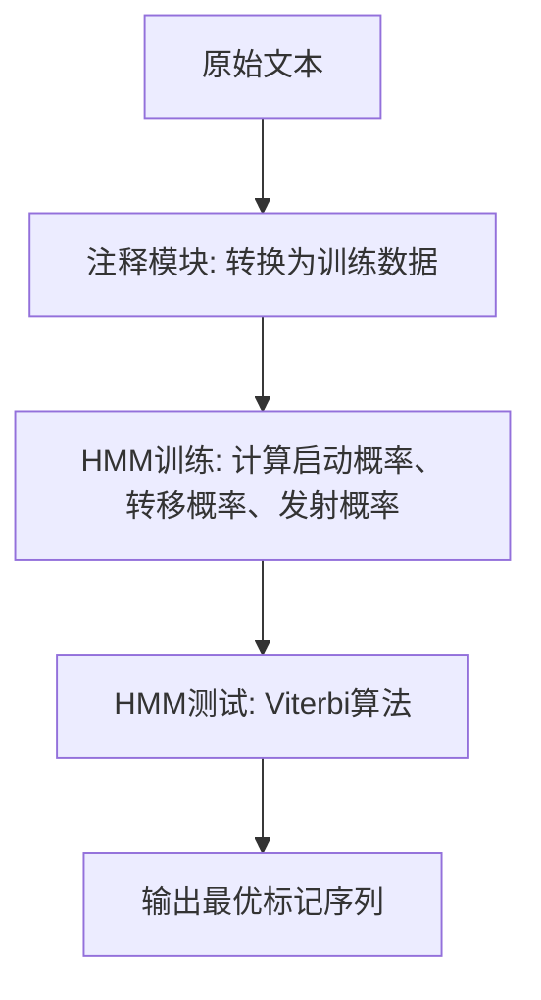
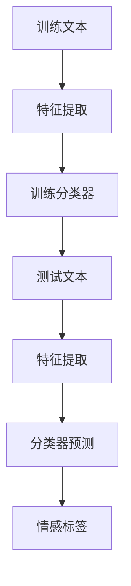
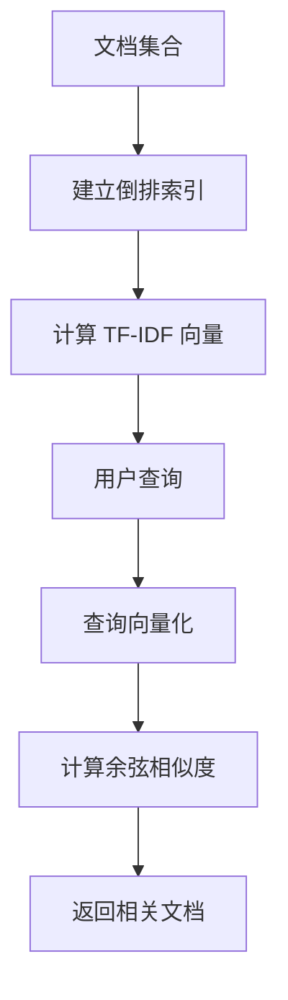
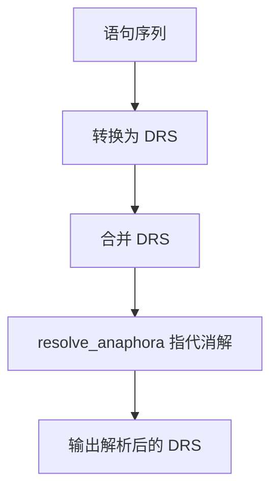
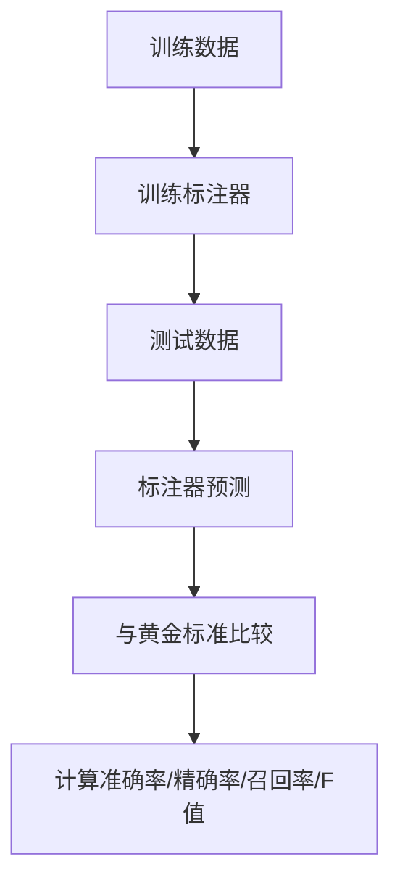

# 《精通Python自然语言处理》章节总结

## 书籍信息

- 书名：《精通Python自然语言处理》
- 作者：[印度] Deepti Chopra, Nisheeth Joshi, Iti Mathur
- 译者：王威
- PDF 状态：文字版
- OCR 状态：良好

## 目录说明

- 目录识别情况：完整
- 章节对应依据：原书目录结构（第1章至第10章）

## 全书核心主题

本书是一本综合的NLP进阶指南，涵盖字符串操作、统计语言建模、形态学、词性标注、语法解析、语义分析、情感分析、信息检索、语篇分析和NLP系统评估等主题。旨在帮助读者创建基于真实生活应用的NLP项目，理解从预处理到高级NLP任务的完整流程。

---

## 第1章：字符串操作

### 核心论点

本章解决“如何对文本字符串进行预处理”的问题。包括切分（语句切分、单词切分、正则表达式切分）、标准化（标点消除、大小写转换、停止词处理）、替换与校正（正则替换、重复字符处理、同义词替换）、Zipf定律应用、相似性度量（编辑距离、Jaccard系数、Smith-Waterman算法）。

### 关键概念

- **切分方法**：sent_tokenize（语句）、word_tokenize（单词）、RegexpTokenizer（正则）、WhitespaceTokenizer（空格）、WordPunctTokenizer（标点分离）。
- **标准化**：lower()/upper()转换大小写、删除标点、停止词移除（NLTK支持22种语言）。
- **重复字符处理**：正则表达式`(.)\1{1,}`匹配重复字符，替换为单个字符。
- **Zipf定律**：单词频率与排名成反比，双对数图呈线性关系。
- **编辑距离**：插入、删除、替换的最小操作次数。
- **Jaccard系数**：集合交集与并集之比。
- **Smith-Waterman算法**：用于生物序列比对的局部对齐算法。

### 经典金句/数据

> “Zipf定律指出，文本中标识符出现的频率与其在排序列表中的排名或位置成反比。” (p.15)

---

## 第2章：统计语言建模

### 核心论点

本章解决“如何对语言进行统计建模”的问题。介绍n-gram（unigram、bigram、trigram）的生成与频率计算、最大似然估计（MLE）、平滑技术（加法平滑、Good-Turing、Kneser-Ney、Witten-Bell）、回退机制、插值模型、复杂度评估、Metropolis-Hastings算法和Gibbs采样法。

### 关键概念

- **n-gram**：连续的n个标识符序列。ngrams()函数生成，BigramCollocationFinder查找搭配。
- **MLE**：基于频率分布计算概率，MLEProbDist类。
- **平滑技术**：解决零概率问题。加法平滑（LaplaceProbDist）、Good-Turing平滑、Kneser-Ney平滑（与trigram配合）、Witten-Bell平滑。
- **Katz回退**：如果n-gram出现次数足够多，使用MLE；否则回退到(n-1)-gram。
- **插值模型**：结合unigram和bigram概率，加权平均。
- **复杂度（Perplexity）**：2^{交叉熵}，衡量语言模型预测文本的能力。
- **Metropolis-Hastings & Gibbs采样**：MCMC方法，用于后验概率估计。

### 经典金句/数据

> “HMM是一个随机有限状态自动机，由状态集、输出字符表、转移概率、发射概率和初始状态概率组成。” (p.32)

> “Good-Turing平滑通过线性回归对频率进行平滑，SimpleGoodTuringProbDist在测试集上准确率约5.17%。” (p.40)

---

## 第3章：形态学：在实践中学习

### 核心论点

本章解决“如何对单词进行形态学分析”的问题。包括词干提取（Porter、Lancaster、Snowball、RegexpStemmer）、词形还原（WordNetLemmatizer）、非英文语言词干提取（Polyglot的morfessor模型）、形态分析器、形态生成器、搜索引擎中的形态学应用。

### 关键概念

- **形态学**：研究语素（词根+词缀）如何构成单词。语言分为孤立语（汉语）、粘着语（土耳其语）、屈折语（拉丁语）。
- **词干提取器**：PorterStemmer（最常用）、LancasterStemmer（更激进）、SnowballStemmer（支持13种语言）、RegexpStemmer（自定义模式）。
- **词形还原**：WordNetLemmatizer，利用Wordnet语义词典，考虑词性(pos参数)。
- **Polyglot形态分析**：使用morfessor模型，支持多种语言的语素分割。
- **形态分析器**：分析单词获取语法信息（性别、数、词类）。可使用pyEnchant字典实现单词切分。
- **形态生成器**：给定词干和语法描述，生成表层形式（如go+动词+现在时+第三人称单数→goes）。
- **搜索引擎**：使用词干提取构建倒排索引，向量空间模型计算相似度。

### 经典金句/数据

> “Porter词干提取算法基本上用于替换和消除英文单词中的一些众所周知的后缀。” (p.48)

> “SnowballStemmer支持的语言包括丹麦语、荷兰语、英语、芬兰语、法语、德语、匈牙利语、意大利语、挪威语、葡萄牙语、罗马尼亚语、俄语、西班牙语、瑞典语。” (p.50)

---

## 第4章：词性标注：单词识别

### 核心论点

本章解决“如何为句子中的每个单词分配词性标记”的问题。介绍Penn Treebank标记集、默认标注器、创建标注语料库、机器学习算法（最大熵分类器）、n-gram统计建模（Unigram、Bigram、Trigram、AffixTagger、TnT标注器），以及使用词性标注语料库开发分块器。

### 关键概念

- **Penn Treebank标记集**：CC（并列连词）、CD（基数词）、DT（限定词）、JJ（形容词）、NN（名词）、VB（动词）等。
- **默认标注器**：DefaultTagger为所有单词分配相同标记，作为回退标注器。
- **创建语料库**：使用nltk.data模块加载自定义文本文件。
- **n-gram标注器**：UnigramTagger（基于单个单词）、BigramTagger（基于前一个标记）、TrigramTagger（基于前两个标记）。可组合Backoff链。
- **AffixTagger**：基于单词前缀或后缀进行标注，affix_length参数控制。
- **TnT标注器**：基于二阶马尔科夫模型的统计标注器，准确率高。
- **分块器（Chunker）**：基于词性标注执行名词短语分块，通过正则表达式定义分块规则（如NP: {<DT>?<JJ>*<NN>}）。

### 流程图

**分块器示例（名词短语识别）**

```mermaid
graph TD
    A[词性标注序列] --> B[应用分块规则]
    B --> C[规则: NP: {<DT><JJ>*<NN>}]
    C --> D[匹配限定词+形容词+名词]
    D --> E[生成NP语块]
```

### 经典金句/数据

> “UnigramTagger在Treebank语料库上的准确率为96%。” (p.73)

> “TnT标注器准确率可达98.8%。” (p.77)

---

## 第5章：语法解析：分析训练资料

### 核心论点

本章解决“如何对句子进行语法解析”的问题。介绍Treebank语料库的访问、上下文无关文法（CFG）的提取、概率上下文无关文法（PCFG）、CYK线图解析算法、Earley线图解析算法。

### 关键概念

- **语法解析类型**：自顶向下（递归下降、LL、Earley）和自底向上（CYK、移位-归约、LR等）。
- **CFG组成**：非终结符(N)、终结符(T)、开始符号(S)、产生式(P)。形式为A→α。
- **Treebank语料库**：Penn Treebank、Sinica Treebank等，包含已标注的解析树。
- **CFG构建**：从Treebank中提取产生式，使用CFG.fromstring()定义规则。
- **PCFG**：为每个产生式附加概率，概率之和为1。解析树的概率为所用产生式概率的乘积。
- **CYK算法**：自底向上，要求CNF（乔姆斯基范式），时间复杂度O(n³)。通过动态规划填充线图。
- **Earley算法**：从左到右填充线图，可处理左递归，不需要CNF转化。

### 流程图

**CYK 线图解析算法**

```mermaid
graph TD
    A[输入句子 tokens] --> B[初始化对角线: 终结符匹配]
    B --> C[遍历 span = 2 to n]
    C --> D[遍历 start = 0 to n-span]
    D --> E[遍历 mid = start+1 to end-1]
    E --> F{有规则 A → B C 且 B 在 [start,mid], C 在 [mid,end]?}
    F -->|是| G[添加 A 到 [start,end]]
    F -->|否| E
    E --> D
    D --> C
    C --> H[输出解析树]
```

### 经典金句/数据

> “CYK线图解析使用动态规划方法，是最简单的线图解析算法之一，时间复杂度O(n³)。” (p.95)

---

## 第6章：语义分析：意义很重要

### 核心论点

本章解决“如何理解和表示文本的语义”的问题。介绍一阶谓词逻辑（FOPL）、语篇表述理论（DRT）、命名实体识别（NER）的各种方法（HMM、机器学习工具包、词性标注）、Wordnet同义词集（synset）生成、词义消歧（WSD）算法（Lesk算法、路径相似度、Wu-Palmer相似度等）。

### 关键概念

- **一阶谓词逻辑**：包含常量、变量、函数、谓词、量词（∀存在量词、∃全称量词）。nltk.sem.logic模块实现。
- **语篇表述理论（DRT）**：用DRS（语篇表述结构）表示语篇含义，包含指称对象和条件。nltk.sem.drt模块实现。
- **NER方法**：基于规则（列表查找）、基于机器学习（HMM、MEMM、CRF、SVM、决策树）。NLTK中ne_chunk()使用预训练分类器。
- **NER评估指标**：精确率(P)=Correct/(Correct+Incorrect+Missing)，召回率(R)=Correct/(Correct+Incorrect+Spurious)，F值=2PR/(P+R)。
- **Wordnet同义词集**：wn.synsets('word')获取，可指定词性。可获取定义、示例、上位词、下位词、反义词等。
- **WSD算法**：Lesk算法（计算上下文与定义的重叠度）、路径相似度、Wu-Palmer相似度、Resnik相似度、Lin相似度、Jiang-Conrath相似度。

### 流程图

**HMM 执行 NER 流程**



### 经典金句/数据

> “WordNet是一个英语词汇数据库，通过同义词集可以找到单词之间的概念依存，例如上位词、同义词、反义词和下位词。” (p.119)

> “NER标注器结果评估：Precision = Correct/(Correct+Incorrect+Missing)” (p.141)

---

## 第7章：情感分析：我很快乐

### 核心论点

本章解决“如何确定文本的情感倾向（积极、消极、中性）”的问题。介绍情感分析的概念、使用的情感词典（ANEW、AFINN、Hu-Liu等）、使用NER执行情感分析、使用机器学习执行情感分析、NER系统的评估方法。

### 关键概念

- **情感词典**：AFINN（2477个单词，评分-5~+5）、Hu-Liu（6800个单词）、ANEW（1034个单词，三维度：愉悦度、激活度、优势度）。
- **NER辅助情感分析**：识别并过滤命名实体，对剩余单词进行情感分析。
- **机器学习情感分析**：使用朴素贝叶斯、最大熵、SVM等分类器。流程：特征提取（n-gram、词性、情感词典匹配）→ 训练 → 预测。
- **情感分析评估**：同样使用精确率、召回率、F值。

### 流程图

**机器学习情感分析流程**



### 经典金句/数据

> “AFINN单词列表由2477个单词组成，评价值范围从-5到+5。” (p.129)

> “使用朴素贝叶斯分类器对电影评论进行情感分析，准确率为81%。” (p.203)

---

## 第8章：信息检索：访问信息

### 核心论点

本章解决“如何从文档集合中检索相关信息”的问题。介绍信息检索的基本概念、停止词删除、向量空间模型（TF-IDF）、相似度度量（欧几里得、余弦、Jaccard等）、加权方案（TF-IDF、Okapi BM25等）、隐性语义索引（LSI）、文本摘要、问答系统。

### 关键概念

- **IR评估指标**：精确率、召回率、F值。
- **向量空间模型**：文档表示为向量，通过TF-IDF计算权重。TF=词频，IDF=log(N/df)。
- **相似度度量**：余弦相似度最常用，\(sim(d1,d2)=d1·d2/(|d1||d2|)\)。
- **加权方案**：TF-IDF、Okapi BM25、ATC等。
- **隐性语义索引（LSI）**：使用奇异值分解（SVD）将文档-词矩阵降维，发现隐含概念。
- **文本摘要**：NaiveSumm方法，基于词频选择重要句子。
- **问答系统**：三个阶段：事实提取（NER+关系提取）、问题理解（解析树）、答案生成。

### 流程图

**向量空间模型信息检索**



### 经典金句/数据

> “布尔检索在倒排索引上执行布尔操作（交、并、非）。” (p.160)

---

## 第9章：语篇分析：理解才是可信的

### 核心论点

本章解决“如何分析语篇的结构和指代关系”的问题。介绍语篇表述理论（DRT）、一阶谓词逻辑、中心理论、指代消解（AR）的类型和方法（代名词、有定名词短语、量词/序数）、NLTK中的DRT实现。

### 关键概念

- **语篇表述理论**：用DRS表示语篇含义。drt.DrtExpression.fromstring()创建DRS，simplify()简化，resolve_anaphora()执行指代消解。
- **一阶谓词逻辑**：nltk.sem.logic模块，支持命题逻辑、谓词逻辑、量词。
- **指代消解类型**：代名词（he指代John）、有定名词短语（the relationship指代the love）、量词/序数（one指代relationship）。
- **预指（Cataphora）**：指称对象在先行语之前（After his class, Sam will go home）。
- **中心理论**：用于语篇分析和指代消解，关注参与者关注点和语篇结构。

### 流程图

**DRS 创建与指代消解**



### 经典金句/数据

> “John went to a club. He met Sam. 这里He指的是John。” (p.178)

---

## 第10章：NLP系统评估：性能分析

### 核心论点

本章解决“如何评估NLP系统的性能”的问题。介绍黄金标准测试数据、NLP工具评估（词性标注器、词干提取器、形态分析器、分块器）、解析器评估（LAS、LEM）、IR系统评估、错误识别指标（TP、TN、FP、FN）、基于词汇搭配的指标（编辑距离、Jaccard、MASI）、基于句法匹配的指标、基于浅层语义匹配的指标（WordNet相似度）。

### 关键概念

- **黄金标准（Gold Standard）**：手工标注的测试数据，作为评估基准。
- **标注器评估**：evaluate()函数计算准确率。可组合Backoff链提升性能。
- **分块器评估**：ChunkScore计算IOB准确率、精确率、召回率、F值。
- **解析器评估指标**：LAS（标记的依恋评分）、LEM（标记的精确匹配）。
- **错误识别**：TP（真正）、TN（真负）、FP（假正）、FN（假负）。
- **相似度指标**：edit_distance、binary_distance、jaccard_distance、masi_distance。
- **WordNet相似度**：path_similarity、lch_similarity、wup_similarity、res_similarity、jcn_similarity、lin_similarity。

### 流程图

**NLP工具评估流程**



### 经典金句/数据

> “组合标注器（DefaultTagger + UnigramTagger + BigramTagger）在Treebank上的准确率为81.2%。” (p.192)

> “基于分类的chunker，通过添加特征（词、前后词性、复杂上下文），最终IOB准确率96.0%，F值89.8%。” (p.200)