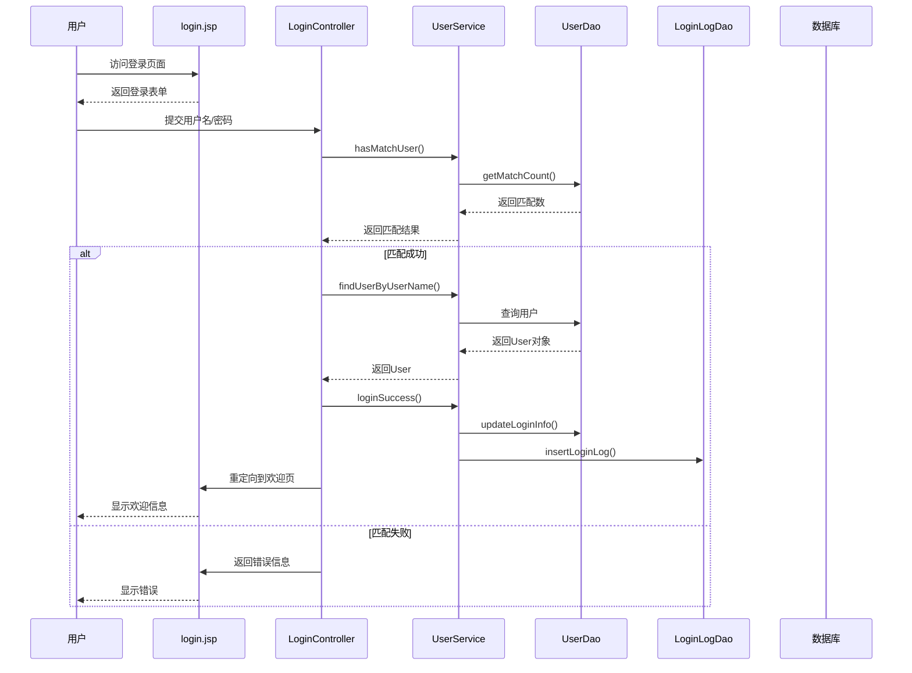
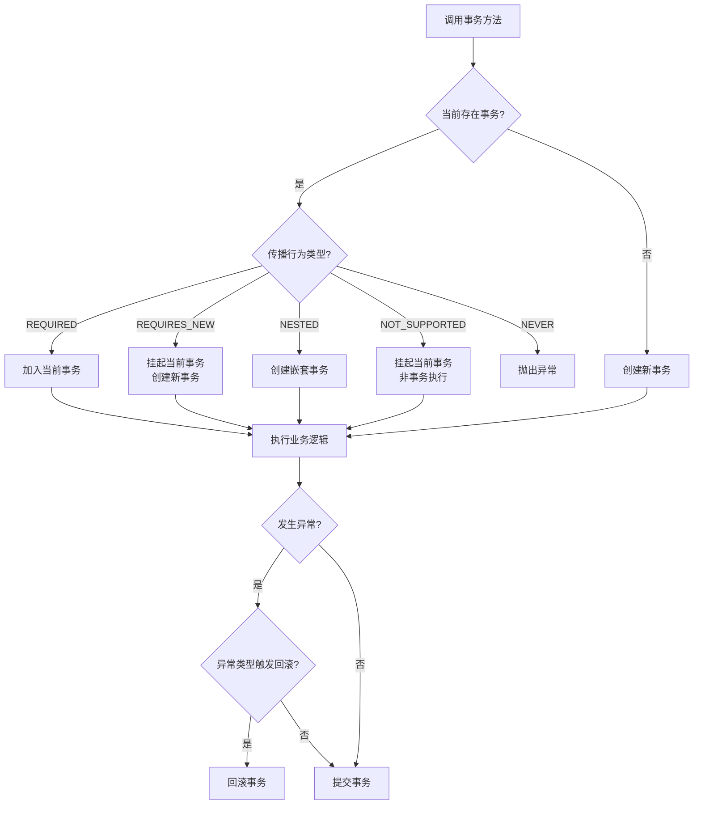
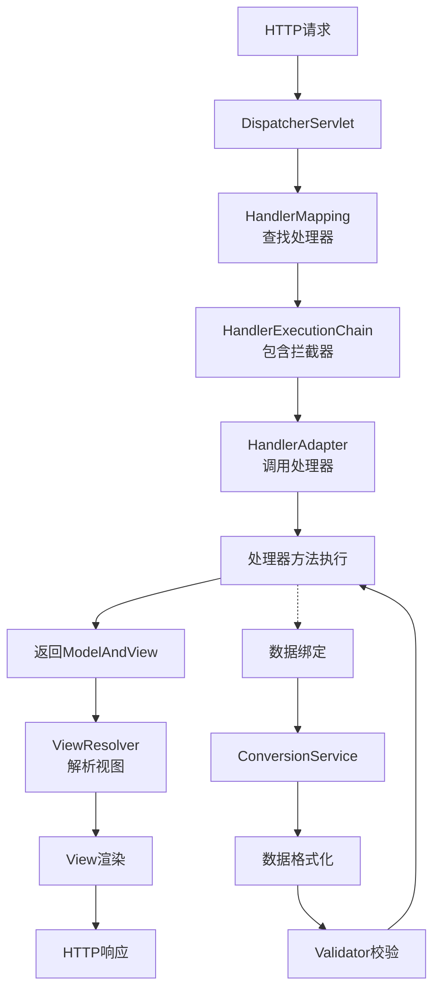

# 《精通Spring 4.x 企业应用开发实战》章节总结

## 书籍信息
- 书名：精通Spring 4.x 企业应用开发实战
- 作者：陈雄华、林开雄、文建国
- PDF 状态：完整（共3部分，220+页）
- OCR 状态：可识别，内容清晰

## 目录说明
- 目录识别情况：完整识别，包含5篇20章
- 章节对应依据：基于PDF原始目录和正文结构
- OCR 修复说明：部分页码标注可能存在偏差，但内容完整

## 全书核心主题
本书系统讲解Spring 4.x框架的企业级应用开发，涵盖从基础入门到高级特性的完整知识体系。核心围绕Spring的两大支柱——IoC（控制反转）和AOP（面向切面编程）展开，详细阐述了Spring在数据访问、事务管理、Web开发、缓存、任务调度等领域的应用。书中融合了大量实战经验和源码分析，旨在帮助读者不仅掌握Spring的使用方法，更能理解其内部实现原理。全书分为基础篇、核心篇、数据篇、应用篇和提高篇，共20章，循序渐进地引导读者从入门到精通。

---

## 第1篇：基础篇

## 第1章：Spring概述

### 1. 核心论点
本章解决“Spring是什么、为什么需要Spring”的问题。作者认为：Spring是分层的Java SE/EE应用一站式轻量级开源框架，以IoC和AOP为内核，提供了从展现层到持久层的完整企业级应用解决方案，其核心价值在于简化Java开发、降低耦合、便于测试。

### 2. 关键概念/事件

- **IoC（控制反转）**：将对象间的依赖关系从代码中移除，转由Spring容器管理，实现解耦。
- **AOP（面向切面编程）**：将横切逻辑（如事务、日志）从业务逻辑中分离，提高模块化程度。
- **Rod Johnson**：Spring的缔造者，著有《Expert One-on-One J2EE Development without EJB》，改变了Java开发方式。
- **SpringSource**：Rod Johnson成立的公司，后被VMware以4.2亿美元收购。
- **Spring体系结构**：分为IoC、AOP、数据访问与集成、Web及远程操作、WebSocket等五大模块。

### 3. 逻辑推演/叙事脉络

本章从Spring的历史渊源讲起，介绍Rod Johnson如何通过两本著作颠覆传统EJB开发方式。随后阐述Spring带来的核心价值：解耦、AOP支持、声明式事务、便于测试、集成优秀框架等。接着详细剖析Spring的五大模块体系结构，说明各模块的功能定位。最后介绍Spring 4.0的新特性（Java 8支持、Groovy配置、WebSocket等）及Spring家族子项目，并说明如何获取Spring。

### 4. 经典金句/数据

> “Spring 以海纳百川的胸怀整合了开源世界里众多著名的第三方框架和类库，逐渐成为使用最多的轻量级 Java EE 企业应用开源框架。”(p.24)

> “2009年8月11日，商业软件生产商VMware宣布，斥资4.2亿美元收购SpringSource公司。”(p.26)

---

## 第2章：快速入门

### 1. 核心论点
本章通过一个论坛登录模块的完整开发过程，展示如何从头构建一个基于Spring的Web应用。作者认为：通过一个涵盖持久层、业务层、展现层的实际案例，能够让读者快速建立对Spring的整体认识，掌握Spring Web开发的基本流程。

### 2. 关键概念/事件

- **Maven**：项目构建工具，用于管理依赖和构建流程。
- **Spring JDBC**：Spring提供的持久层技术，通过JdbcTemplate简化JDBC操作。
- **声明式事务**：通过配置而非编程方式管理事务，是Spring的核心功能之一。
- **Spring MVC**：Spring自带的Web MVC框架，用于处理HTTP请求。
- **三层架构**：持久层（DAO）、业务层（Service）、展现层（Controller）的分层设计模式。

### 3. 逻辑推演/叙事脉络

本章按实际开发流程组织：首先介绍实例功能（用户登录），然后进行环境准备（安装Maven、创建数据库表、建立工程）。接着依次开发持久层（UserDao、LoginLogDao）、业务层（UserService）、展现层（LoginController和JSP页面）。最后配置Spring MVC、运行Web应用，完成从零到可运行应用的完整过程。单元测试贯穿其中，验证各层功能的正确性。

### 4. 流程图



### 5. 经典金句/数据

> “麻雀虽小，五脏俱全，登录模块涵盖了持久层数据访问操作、业务层事务管理及展现层MVC等企业应用常见的功能。”(p.18)

---

## 第3章：Spring Boot

### 1. 核心论点
本章解决“如何简化Spring应用开发”的问题。作者认为：Spring Boot通过自动配置、启动器依赖、内嵌容器等机制，能够大幅降低Spring项目的搭建和开发难度，让开发者专注于业务逻辑而非配置。

### 2. 关键概念/事件

- **Spring Boot启动器**：一组预配置的依赖模块，如spring-boot-starter-web包含Spring MVC、Tomcat等依赖。
- **@SpringBootApplication**：组合了@Configuration、@ComponentScan、@EnableAutoConfiguration的注解。
- **内嵌容器**：Spring Boot可直接内嵌Tomcat、Jetty等Servlet容器，无需部署WAR文件。
- **Actuator**：Spring Boot的生产就绪功能，提供健康检查、性能指标、应用信息等监控端点。
- **自动配置**：Spring Boot根据类路径中的依赖自动配置Spring功能。

### 3. 逻辑推演/叙事脉络

本章先介绍Spring Boot的背景和特点，说明其解决Spring配置复杂问题的定位。然后通过一个快速入门示例展示如何使用Spring Boot创建Web应用。接着详细讲解Maven、Gradle、CLI三种安装配置方式。随后用Spring Boot重新开发第2章的论坛登录示例，展示持久层、业务层、展现层的简化配置过程。最后介绍Actuator提供的生产环境运维支持功能。

### 4. 经典金句/数据

> “Spring Boot的设计目的是用来简化新Spring应用的搭建和开发过程，本章通过实例向读者讲述了Spring Boot的使用技巧。”(p.7)

> “Spring Boot 1.3.3需要运行在Java 7.0+及Spring 4.1.5+版本中。”(p.54)

---

## 第2篇：核心篇

## 第4章：IoC容器

### 1. 核心论点
本章深入讲解Spring IoC容器的概念、原理和实现。作者认为：IoC（控制反转）是指将接口实现类的选择控制权从调用类转移到第三方容器，DI（依赖注入）是这一概念的具体实现形式。Spring通过Java反射机制实现依赖注入，BeanFactory和ApplicationContext是容器的核心接口。

### 2. 关键概念/事件

- **IoC（控制反转）**：控制权从应用程序转移到容器，容器负责创建和管理对象。
- **DI（依赖注入）**：三种注入方式——构造函数注入、属性注入、接口注入。
- **BeanFactory**：Spring的基础IoC容器，提供Bean的创建和管理功能。
- **ApplicationContext**：BeanFactory的子接口，提供国际化、事件传播等企业级功能。
- **Bean生命周期**：从实例化到销毁的完整过程，包括Aware接口、后处理器、初始化/销毁方法等阶段。

### 3. 逻辑推演/叙事脉络

本章从《墨攻》电影的比喻入手，生动解释IoC的概念。然后讲解Java反射技术（ClassLoader、反射API），这是Spring实现依赖注入的底层基础。接着介绍Resource资源访问接口，说明Spring如何统一各种资源的访问方式。随后深入剖析BeanFactory和ApplicationContext的类体系、初始化和使用方法。最后详细阐述Bean在BeanFactory和ApplicationContext中的完整生命周期，包括InstantiationAwareBeanPostProcessor、BeanPostProcessor等后处理器的作用。

### 4. 方法流程图

```mermaid
graph TD
    A[调用getBean()] --> B{容器注册了<br>InstantiationAwareBeanPostProcessor?}
    B -->|是| C[postProcessBeforeInstantiation]
    B -->|否| D[实例化Bean]
    C --> D
    D --> E{容器注册了<br>InstantiationAwareBeanPostProcessor?}
    E -->|是| F[postProcessAfterInstantiation]
    E -->|否| G[设置属性值]
    F --> G
    G --> H[调用BeanNameAware.setBeanName]
    H --> I[调用BeanFactoryAware.setBeanFactory]
    I --> J[调用BeanPostProcessor<br>.postProcessBeforeInitialization]
    J --> K[调用InitializingBean.afterPropertiesSet]
    K --> L[调用init-method指定方法]
    L --> M[调用BeanPostProcessor<br>.postProcessAfterInitialization]
    M --> N{scope == prototype?}
    N -->|是| O[返回Bean给调用者<br>Spring不再管理]
    N -->|否| P[放入缓存池<br>返回Bean]
    P --> Q{容器关闭?}
    Q -->|是| R[调用DisposableBean.destroy]
    R --> S[调用destroy-method指定方法]
```

### 5. 经典金句/数据

> “IoC（Inverse of Control）的字面意思是控制反转...Martin Fowler提出了DI（Dependency Injection，依赖注入）的概念用来代替IoC。”(p.74-75)

> “BeanFactory是Spring框架的基础设施，面向Spring本身；ApplicationContext面向使用Spring框架的开发者。”(p.91)

---

## 第5章：在IoC容器中装配Bean

### 1. 核心论点
本章解决“如何在Spring容器中定义和装配Bean”的问题。作者认为：Spring提供了XML、注解、Java类、Groovy DSL四种Bean配置方式，每种方式各有适用场景，可混合使用。基于注解的配置是目前最主流、最简洁的方式。

### 2. 关键概念/事件

- **依赖注入类型**：属性注入（最常用）、构造函数注入、工厂方法注入。
- **自动装配**：byName、byType、constructor、autodetect四种模式。
- **Bean作用域**：singleton（默认）、prototype、request、session、globalSession。
- **FactoryBean**：用于创建复杂Bean的工厂接口，Spring自身提供了70多个实现类。
- **@Autowired**：Spring的自动注入注解，支持按类型、按名称、集合注入。

### 3. 逻辑推演/叙事脉络

本章先介绍Spring配置的基本概念和基于Schema的XML配置格式。然后详细讲解Bean的基本配置、依赖注入的三种方式及其选择考量。接着深入各种注入参数（字面值、引用、内部Bean、null、级联属性、集合）的配置方法。之后介绍方法注入、Bean之间的关系（继承、依赖、引用）、配置文件整合、Bean作用域。最后分别讲解基于注解、基于Java类、基于Groovy DSL三种配置方式，并进行对比总结。

### 4. 经典金句/数据

> “基于XML的配置方式是最基础、最传统的，我们主要以基于XML的配置方式讲解Spring的配置。”(p.119)

> “@Repository、@Service及@Controller这三个特殊的注解...完全可以用@Component替代...但我们推荐使用特定的注解标注特定的Bean。”(p.155-156)

---

## 第6章：Spring容器高级主题

### 1. 核心论点
本章深入剖析Spring容器的内部工作机制和高级功能。作者认为：理解Spring容器的内部工作机制（如refresh()流程）、属性编辑器、国际化、容器事件等高级主题，是掌握Spring框架精髓的关键。

### 2. 关键概念/事件

- **refresh()方法**：ApplicationContext的核心方法，定义了容器启动的9个步骤。
- **BeanDefinition**：Bean在Spring容器中的内部表示，包含配置元数据。
- **属性编辑器（PropertyEditor）**：用于字符串到Java对象的转换，可通过CustomEditorConfigurer注册。
- **MessageSource**：Spring国际化（i18n）支持的核心接口。
- **ApplicationEvent**：Spring容器事件体系，支持事件发布和监听。

### 3. 逻辑推演/叙事脉络

本章首先通过分析AbstractApplicationContext.refresh()方法的9个步骤，解构Spring容器的内部启动流程。然后介绍BeanDefinition、InstantiationStrategy、BeanWrapper等核心内部组件。接着讲解JavaBean属性编辑器及Spring的自定义属性编辑器。之后介绍如何使用外部属性文件（PropertyPlaceholderConfigurer）、引用Bean的属性值、国际化消息（MessageSource）。最后介绍Spring容器事件体系的类结构和具体实现。

### 4. 方法流程图

```mermaid
graph TD
    A[refresh()启动容器] --> B[初始化BeanFactory]
    B --> C[调用工厂后处理器]
    C --> D[注册Bean后处理器]
    D --> E[初始化消息源]
    E --> F[初始化应用上下文事件广播器]
    F --> G[初始化其他特殊Bean]
    G --> H[注册事件监听器]
    H --> I[初始化所有单实例Bean]
    I --> J[完成刷新并发布容器刷新事件]
```

### 5. 经典金句/数据

> “Spring的AbstractApplicationContext是ApplicationContext的抽象实现类，该抽象类的refresh()方法定义了Spring容器在加载配置文件后的各项处理过程。”(p.179)

> “Spring自身就提供了70多个FactoryBean的实现类。”(p.153)

---

## 第7章：Spring AOP基础

### 1. 核心论点
本章解决“什么是AOP以及Spring如何实现AOP”的问题。作者认为：AOP（面向切面编程）通过将横切逻辑从业务逻辑中分离，实现关注点分离。Spring AOP基于动态代理技术（JDK动态代理和CGLib），通过增强（Advice）、切点（Pointcut）、切面（Aspect）等概念实现AOP功能。

### 2. 关键概念/事件

- **AOP术语**：Joinpoint（连接点）、Pointcut（切点）、Advice（增强）、Aspect（切面）、Weaving（织入）。
- **增强类型**：前置增强（Before）、后置增强（AfterReturning）、环绕增强（Around）、异常抛出增强（AfterThrowing）、引介增强（Introduction）。
- **JDK动态代理**：基于接口的代理实现，要求目标类实现接口。
- **CGLib动态代理**：基于子类的代理实现，通过字节码技术生成目标类的子类。
- **Advisor**：Spring中的切面概念，包含一个切点和一个增强。

### 3. 逻辑推演/叙事脉络

本章先通过实例解释AOP的概念和术语，然后介绍AOP的主要实现者。接着讲解JDK动态代理和CGLib动态代理的实现原理和代码示例。之后详细介绍5种增强类型的实现方式，以及多种切面类型（静态普通方法名切面、正则表达式切面、动态切面、流程切面等）的配置方法。最后介绍自动创建代理的机制，并剖析AOP无法增强的疑难问题。

### 4. 经典金句/数据

> “AOP是继OOP之后，对编程设计思想影响极大的技术之一。AOP是进行横切逻辑编程的思想，它开拓了考虑问题的思路。”(p.27)

> “Java语言只能对接口提供自动代理，所以，如果需要对类提供代理，则需要在类路径中加入CGLib的类库。”(p.151)

---

## 第8章：基于@AspectJ和Schema的AOP

### 1. 核心论点
本章解决“如何使用注解和XML配置方式定义AOP切面”的问题。作者认为：@AspectJ注解提供了最简洁、最直观的切面定义方式，配合AspectJ切点表达式语言，可以精确描述目标连接点。对于无法使用Java 5.0的项目，基于Schema的XML配置是替代方案。

### 2. 关键概念/事件

- **@AspectJ**：使用Java注解定义切面的方式，是Spring推荐的切面定义方法。
- **切点函数**：execution()、within()、args()、@annotation()等9个核心函数。
- **切点表达式通配符**：`*`（任意字符）、`..`（任意参数/子包）、`+`（子类）。
- **命名切点**：通过@Pointcut注解定义可重用的切点。
- **LTW（Load Time Weaving）**：类加载期的切面织入方式，通过字节码转换实现。

### 3. 逻辑推演/叙事脉络

本章先介绍Java 5.0注解知识，为@AspectJ学习打基础。然后通过简单例子展示@AspectJ的使用方法。接着详细讲解9个切点函数的语法和用法，以及逻辑运算符的复合运算。随后介绍命名切点、增强织入顺序、访问连接点信息、绑定参数等进阶内容。之后讲解基于Schema的XML配置方式，包括命名切点、各种增强类型、绑定连接点信息。最后介绍LTW技术及其在Spring中的配置。

### 4. 经典金句/数据

> “掌握切点表达式语法和切点函数是学习@AspectJ的重心，我们分别对9个切点函数进行了详细的讲述。”(p.284)

> “Spring提供了4种定义切面的方式：基于@AspectJ注解、基于<aop:aspect>、基于<aop:advisor>、基于Advisor类。”(p.286)

---

## 第9章：Spring SpEL

### 1. 核心论点
本章解决“如何在Spring中使用表达式语言进行动态配置”的问题。作者认为：SpEL（Spring表达式语言）是一个支持运行时查询和操作对象图的强大动态语言，它可以在Bean配置中实现动态属性注入，是Spring配置灵活性的重要支撑。

### 2. 关键概念/事件

- **SpEL核心接口**：ExpressionParser（解析器）、Expression（表达式）、EvaluationContext（求值上下文）。
- **SpEL编译器**：可将表达式编译为字节码，提高重复调用的执行效率。
- **安全导航操作符**：`?.`，避免空指针异常。
- **Elvis操作符**：`?:`，三元操作符的简化写法。
- **集合过滤与转换**：`?[selectExpression]`和`![projectionExpression]`。

### 3. 逻辑推演/叙事脉络

本章先介绍JVM动态语言背景和JSR-223规范，引出SpEL的必要性。然后通过简单示例展示SpEL的基本用法。接着讲解SpEL的核心接口（ExpressionParser、EvaluationContext、Compiler）。随后详细讲解各种表达式类型：文本解析、对象属性、数组集合、方法调用、操作符、安全导航、三元/Elvis操作符、赋值/类型/构造器/变量、集合过滤与转换。最后介绍在Spring中基于XML和注解使用SpEL的方法。

### 4. 经典金句/数据

> “SpEL表达式已深入整合到Spring框架的Bean配置中，使用SpEL可以完成众多高级的Bean配置问题。”(p.317)

> “SpEL编译器可以将表达式直接编译成字节码，从而避免每次调用时进行语法解析所产生的时间消耗。”(p.321)

---

## 第3篇：数据篇

## 第10章：Spring对DAO的支持

### 1. 核心论点
本章解决“Spring如何统一各种持久化技术的访问”的问题。作者认为：Spring通过统一的异常体系、数据访问模板、数据源配置三大机制，实现了对JDBC、Hibernate、MyBatis等多种持久化技术的整合支持。

### 2. 关键概念/事件

- **Spring DAO异常体系**：统一继承自DataAccessException，屏蔽具体持久化技术的异常差异。
- **数据访问模板**：JdbcTemplate、HibernateTemplate等，封装样板式代码。
- **回调机制**：通过回调接口分离固定流程和变化逻辑。
- **数据源配置**：DBCP、C3P0、JNDI等多种数据源配置方式。
- **异常转换器**：SQLExceptionTranslator将JDBC异常转换为Spring DAO异常。

### 3. 逻辑推演/叙事脉络

本章先阐述Spring的DAO理念——通过DAO接口屏蔽具体持久化技术。然后详细介绍Spring统一的DAO异常体系，包括异常分类和JDBC异常转换器。接着讲解数据访问模板和回调机制，说明如何将固定流程封装在模板中。最后介绍多种数据源的配置方式（DBCP、C3P0、JNDI）及其参数说明。

### 4. 经典金句/数据

> “Spring的DAO异常体系都是建立在运行期异常的基础上，开发者可以根据需要捕捉感兴趣的异常。”(p.341)

> “Spring为每种持久化技术都提供了支持类，通过扩展支持类定义自己的数据访问类是最简单的数据访问方式。”(p.347)

---

## 第11章：Spring的事务管理

### 1. 核心论点
本章解决“如何在Spring中实现声明式事务管理”的问题。作者认为：Spring提供了与底层事务源无关的事务抽象，通过声明式事务配置，可以让业务代码完全从事务管理代码中解放出来，享受比EJB CMT更便捷、更强大的事务管理能力。

### 2. 关键概念/事件

- **ACID**：原子性、一致性、隔离性、持久性。
- **事务隔离级别**：READ_UNCOMMITTED、READ_COMMITTED、REPEATABLE_READ、SERIALIZABLE。
- **事务传播行为**：7种传播行为，如PROPAGATION_REQUIRED、PROPAGATION_REQUIRES_NEW。
- **ThreadLocal**：Spring用于解决线程安全问题的重要工具。
- **PlatformTransactionManager**：Spring事务管理的核心接口。

### 3. 逻辑推演/叙事脉络

本章先介绍数据库事务基础知识（ACID、并发问题、锁机制、隔离级别、JDBC事务支持）。然后讲解ThreadLocal的工作原理和Spring如何使用它解决线程安全问题。接着介绍Spring事务管理的三大SPI接口（PlatformTransactionManager、TransactionDefinition、TransactionStatus）及各种事务管理器实现类。之后分别讲解编程式事务和声明式事务的配置方式，包括基于XML的aop/tx命名空间配置和基于@Transactional注解的配置。

### 4. 方法流程图



### 5. 经典金句/数据

> “Spring声明式事务管理是Spring中的亮点，也是被使用最多的功能之一。Spring使声明式事务平民化。”(p.390)

> “事务传播行为是Spring提供给开发者最珍贵的礼物。”(p.379)

---

## 第12章：Spring的事务管理难点剖析

### 1. 核心论点
本章解决“实际应用中Spring事务管理的各种疑难问题”的问题。作者认为：理解Spring事务管理的内部运作机制（如DAO与事务的关系、事务方法嵌套调用、多线程事务、混合持久化技术、AOP增强限制、连接泄露等），是正确使用声明式事务的关键。

### 2. 关键概念/事件

- **事务传播机制**：嵌套调用的服务方法默认工作在同一个事务中。
- **多线程事务**：不同线程中的事务方法工作在独立的事务中。
- **混合持久化**：Hibernate+JDBC组合时需注意缓存同步问题。
- **AOP增强限制**：private、static、final方法无法被Spring AOP事务增强。
- **连接泄露**：直接获取Connection而不释放是常见问题，应使用DataSourceUtils。

### 3. 逻辑推演/叙事脉络

本章按问题类型组织：先分析DAO和事务管理的关系，说明无事务管理器时各持久化技术的表现。然后剖析应用分层与事务的关系，指出并非必须有严格分层才能使用事务。接着通过实例分析事务方法嵌套调用的传播行为，说明默认在同一事务中执行。之后分析多线程环境下的事务行为。再分析混合使用多种数据访问技术（如Hibernate+JDBC）时的事务管理策略。最后分析AOP增强的限制和数据连接泄露的成因及解决方案。

### 4. 经典金句/数据

> “Spring事务的一个被讹传很广的说法是：一个事务方法不应该调用另一个事务方法，否则将产生两个事务。其实这是未正确认识Spring事务传播机制而造成的误解。”(p.379)

> “如果使用Spring DAO模板进行数据操作，则无须关注数据连接（Connection）及其衍生品（如Hibernate的Session等）的获取和释放操作，模板类已经通过其内部流程替代我们完成了。”(p.416)

---

## 第13章：使用Spring JDBC访问数据库

### 1. 核心论点
本章解决“如何使用Spring JDBC简化数据库访问”的问题。作者认为：JdbcTemplate通过模板和回调机制，将数据访问中的固定流程和业务逻辑分离，仅需编写“必不可少”的代码即可完成数据库操作。

### 2. 关键概念/事件

- **JdbcTemplate**：Spring JDBC的核心模板类，线程安全。
- **RowCallbackHandler**：结果集处理回调接口，适合大结果集流式处理。
- **RowMapper<T>**：结果集映射接口，适合小结果集对象转换。
- **LOB处理**：BLOB/CLOB大对象数据的操作，需使用LobHandler。
- **NamedParameterJdbcTemplate**：支持命名参数绑定的模板类，提高可读性。

### 3. 逻辑推演/叙事脉络

本章先通过简单示例展示JdbcTemplate的使用。然后讲解在DAO中使用JdbcTemplate的方式。接着详细讲解CRUD操作：更新数据、返回自增主键、批量操作、查询数据（RowCallbackHandler和RowMapper的比较）。之后讲解LOB类型数据的操作，包括获取本地数据连接、使用LobHandler、插入/读取LOB数据。最后讲解自增键的使用和NamedParameterJdbcTemplate模板类。

### 4. 经典金句/数据

> “Spring JDBC通过模板和回调机制大大降低了使用JDBC的复杂度，借由JdbcTemplate的帮助，仅需要编写那些‘必不可少’的代码就可以进行数据库操作。”(p.429)

> “在实际开发中，我们并不太建议使用表自增键，因为这种方式会让开发更加复杂且降低程序移植性，在应用层中创建主键才是主流的方式。”(p.435)

---

## 第14章：整合其他ORM框架

### 1. 核心论点
本章解决“如何在Spring中整合Hibernate和MyBatis等ORM框架”的问题。作者认为：Spring通过LocalSessionFactoryBean、HibernateTemplate、事务管理器等组件，实现了对Hibernate的无缝整合；通过SqlSessionFactoryBean、SqlSessionTemplate实现了对MyBatis的整合。

### 2. 关键概念/事件

- **LocalSessionFactoryBean**：Spring创建Hibernate SessionFactory的工厂Bean。
- **HibernateTemplate**：Spring对Hibernate的模板封装。
- **AnnotationSessionFactoryBean**：支持JPA注解的SessionFactory。
- **OpenSessionInViewFilter**：解决延迟加载问题的Web过滤器。
- **SqlSessionFactoryBean**：MyBatis整合Spring的核心工厂Bean。

### 3. 逻辑推演/叙事脉络

本章先说明Spring整合ORM技术的总体思路和好处。然后分别讲解Hibernate的整合：配置SessionFactory（两种方式）、使用HibernateTemplate、处理LOB数据、添加事件监听器、使用原生API、使用注解配置、事务处理、延迟加载问题。之后讲解MyBatis的整合：配置SqlSessionFactory、在Spring中配置、编写DAO（使用SqlSessionTemplate和MapperFactoryBean）。最后讨论DAO层的设计（基类、查询接口、分页查询接口）。

### 4. 经典金句/数据

> “对于小型应用来说，使用OpenSessionInViewFilter确实可以降低延迟加载所引发的各种问题...但对于大型且高并发的应用来说，笔者强烈建议不要使用OpenSessionInViewFilter。”(p.475)

> “ORM框架 + JDBC框架的最佳组合是一个ORM技术框架（如Hibernate或JPA等）+ 一个JDBC技术框架（如Spring JDBC或MyBatis）。”(p.408)

---

## 第4篇：应用篇

## 第15章：Spring Cache

### 1. 核心论点
本章解决“如何在Spring中实现透明化数据缓存”的问题。作者认为：Spring Cache通过注解方式（@Cacheable、@CacheEvict、@CachePut）对方法返回值进行缓存，屏蔽了底层缓存实现的差异，是一种声明式的缓存解决方案。

### 2. 关键概念/事件

- **@Cacheable**：将方法返回值缓存，下次调用时直接从缓存获取。
- **@CacheEvict**：清空缓存，常用于更新/删除操作。
- **@CachePut**：更新缓存，方法始终执行。
- **CacheManager**：缓存管理器，管理底层缓存实现（EhCache、Guava等）。
- **SpEL表达式**：用于动态生成缓存Key。

### 3. 逻辑推演/叙事脉络

本章先介绍缓存的基本概念和Spring Cache的定位。然后讲解Spring Cache抽象的三大核心：缓存注解、缓存管理器、SpEL表达式。接着介绍配置Cache存储的多种方式（EhCache、Guava、HazelCast、GemFire、JSR-107）。最后分享实战经验，说明缓存的适用场景和注意事项。

### 4. 经典金句/数据

> “Spring Cache通过注解方式进行透明化数据缓存。”(p.8)

> “数据缓存已经成为提高系统运行性能的一个重要方法。”(p.8)

---

## 第16章：任务调度和异步执行器

### 1. 核心论点
本章解决“如何在Spring中进行任务调度”的问题。作者认为：Spring通过整合Quartz、JDK Timer、Java 5.0 Executor等调度框架，提供了统一的任务调度抽象，满足从简单定时任务到复杂Cron表达式的各种调度需求。

### 2. 关键概念/事件

- **Quartz**：功能强大的企业级任务调度框架，支持Cron表达式。
- **Trigger**：触发器的两种类型——SimpleTrigger（简单间隔）和CronTrigger（Cron表达式）。
- **JobDetail**：描述任务执行的详细信息。
- **Scheduler**：调度器，管理Trigger和JobDetail的生命周期。
- **任务调度云**：分布式任务调度的解决方案。

### 3. 逻辑推演/叙事脉络

本章先介绍任务调度的基本概念和场景。然后详细讲解Quartz框架的基础结构和两种Trigger的使用。接着讲解如何在Spring中使用Quartz（创建JobDetail、Trigger、Scheduler）。之后介绍Spring对JDK Timer和Java 5.0 Executor的支持。最后分享实际应用中的经验：如何产生任务、集群环境下的影响、任务调度云、Web应用中调度器的启动和关闭问题。

### 4. 经典金句/数据

> “对于企业应用开发来说，数据缓存及任务调度是两个无法回避的问题，需要重点学习和掌握。”(p.7)

> “Quartz是一款开源的Java作业调度框架，它提供了强大的调度机制，支持集群环境下的任务调度。”(p.517)

---

## 第17章：Spring MVC

### 1. 核心论点
本章解决“如何使用Spring MVC构建Web应用”的问题。作者认为：Spring MVC 4.0通过注解驱动、REST风格支持、HttpMessageConverter、数据绑定与校验、视图解析等机制，提供了一个功能完备、易于使用的Web MVC框架。

### 2. 关键概念/事件

- **DispatcherServlet**：Spring MVC的前端控制器，负责请求分发。
- **@RequestMapping**：将HTTP请求映射到控制器处理方法。
- **@RestController**：@Controller和@ResponseBody的组合，用于REST服务。
- **数据绑定**：将请求参数自动绑定到方法入参对象。
- **HttpMessageConverter**：处理请求/响应消息的转换（XML、JSON等）。

### 3. 逻辑推演/叙事脉络

本章先介绍Spring MVC的体系结构，包括DispatcherServlet配置和简单示例。然后详细讲解注解驱动的控制器：@RequestMapping映射、请求处理方法签名、@RequestBody/@ResponseBody、HttpMessageConverter、@RestController。接着讲解数据绑定流程：数据转换（ConversionService）、数据格式化（@DateTimeFormat、@NumberFormat）、数据校验（JSR-303）。之后介绍视图和视图解析器（JSP、FreeMarker、Excel、PDF、XML、JSON等）。最后介绍本地化解析、文件上传、WebSocket支持、静态资源处理、拦截器、异常处理等杂项功能。

### 4. 方法流程图



### 5. 经典金句/数据

> “Spring MVC 4.0和早期版本相比有了一个质的飞跃，如更全面和方便地支持REST风格的Web编程、注解驱动、处理方法签名非常灵活。”(p.646)

> “Spring MVC最重要的一个新功能就是对REST编程风格的支持。”(p.628)

---

## 第18章：实战案例开发

### 1. 核心论点
本章通过一个完整的论坛应用案例，展示使用Spring+Hibernate框架开发实际项目的全过程。作者认为：从需求分析、系统设计、持久层开发、服务层开发、Web层开发到单元测试和部署，遵循规范的开发流程是成功交付项目的保障。

### 2. 关键概念/事件

- **论坛功能模块**：用户管理、论坛管理、版块管理、论坛基础功能。
- **系统角色**：游客、普通用户、论坛版块管理员、论坛管理员。
- **DAO基类设计**：使用泛型封装通用CRUD操作。
- **分页查询**：Page类封装分页数据和分页信息。
- **Hibernate二级缓存**：使用EhCache提高性能。

### 3. 逻辑推演/叙事脉络

本章按实际项目开发流程组织：先进行功能需求分析（用例描述、活动图），然后进行系统设计（技术框架、Maven结构、架构图、PO类设计、持久层/服务层/Web层设计、数据库设计）。接着开发持久层（PO类、DAO基类、具体DAO、配置装配、二级缓存）。然后对持久层进行测试（Unitils配置、测试数据、测试用例）。接着开发服务层（UserService、ForumService）。然后对服务层进行测试。接着开发Web层（BaseController、ForumFilter、各Controller、JSP页面）。最后部署运行并进行项目配置实战经验分享。

### 4. 经典金句/数据

> “本章带领大家开发一个完整的论坛应用案例，体会实际应用开发所需的各项技术及关注要点。”(p.648)

> “在实际开发中，尽量采用UUID的主键，或使用一个服务在应用层中获取领域对象的主键，省却这种因数据库产生主键而造成的麻烦。”(p.683)

---

## 第5篇：提高篇

## 第19章：Spring OXM

### 1. 核心论点
本章解决“如何在Java对象和XML之间进行转换”的问题。作者认为：Spring OXM通过统一封装XStream、JAXB、Castor、JiBX等主流O/X Mapping组件，提供了Marshaller和Unmarshaller两个核心接口，实现了对象与XML转换的一致编程模型。

### 2. 关键概念/事件

- **XML解析技术**：DOM（树模型）、SAX（事件推模型）、StAX（事件拉模型）。
- **数据绑定**：将XML数据绑定到Java对象，或反之。
- **XStream**：最简洁易用的O/X Mapping工具，同时支持XML和JSON。
- **JAXB**：Java官方标准的XML绑定技术，是Web Services常用框架。
- **Marshaller/Unmarshaller**：Spring OXM的核心接口，分别负责编组和反编组。

### 3. 逻辑推演/叙事脉络

本章先介绍XML及其解析技术的发展历程（DOM、SAX、StAX）。然后详细讲解XStream的使用：快速入门、别名机制、转换器、注解、流化对象、持久化API、JSON处理。接着介绍其他O/X Mapping组件：JAXB、Castor、JiBX，并进行总结比较。最后讲解Spring OXM框架：核心接口、异常体系、各组件包装器的配置、与Spring的整合实例。

### 4. 经典金句/数据

> “Spring OXM是Spring 3.0的一个新特性，为主流O/X Mapping组件提供了统一层抽象和封装。”(p.742)

> “XStream是一套简洁易用的开源类库，用于将Java对象序列化为XML或者将XML反序列化为Java对象。”(p.717)

---

## 第20章：实战型单元测试

### 1. 核心论点
本章解决“如何进行高效的单元测试”的问题。作者认为：单元测试是保障代码质量最有效的手段，应结合TestNG、Mockito、Unitils、DbUnit等框架，实现对持久层、服务层、Web层的全面测试。其中Unitils整合DbUnit用Excel准备测试数据，能极大简化DAO层测试。

### 2. 关键概念/事件

- **TestNG**：比JUnit更强大的测试框架，支持注解、分组、参数化、依赖测试等。
- **Mockito**：Mock框架，用于模拟依赖对象，隔离测试目标。
- **Unitils**：测试整合框架，集成了Spring、Hibernate、DbUnit等。
- **DbUnit**：数据库测试框架，管理测试数据。
- **反射断言**：Unitils提供的对象属性比较断言，可忽略顺序和默认值。

### 3. 逻辑推演/叙事脉络

本章先阐述单元测试的重要性和常见误解。然后介绍TestNG的基本用法：测试方法、@BeforeClass/@AfterClass、异常测试、超时测试、参数化测试、分组测试、依赖测试。接着介绍Mockito：创建Mock对象、设定期望行为、验证交互行为。之后介绍Unitils框架：模块组件、配置文件、断言方法、集成Spring/Hibernate/DbUnit、自定义扩展。最后实战演示使用Unitils测试DAO层、服务层和Web层。

### 4. 经典金句/数据

> “单元测试是开发者编写的一小段代码，用于检验目标代码的一个很小的、很明确的功能是否正确。”(p.751)

> “Unitils框架的出现改变了难测试DAO的局面，它将SpringModule、DatabaseModule、DbUnitModule等整合在一起，使得DAO的单元测试变得非常容易。”(p.776)

---