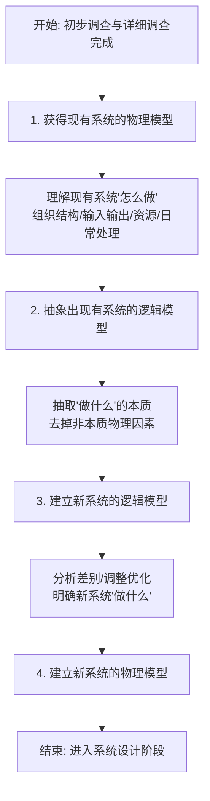
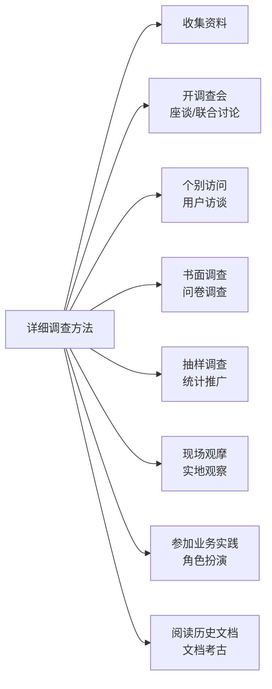
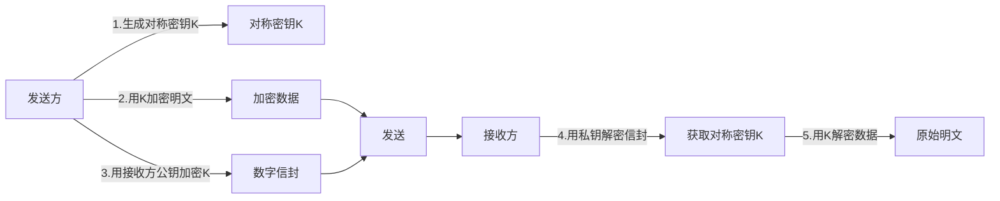
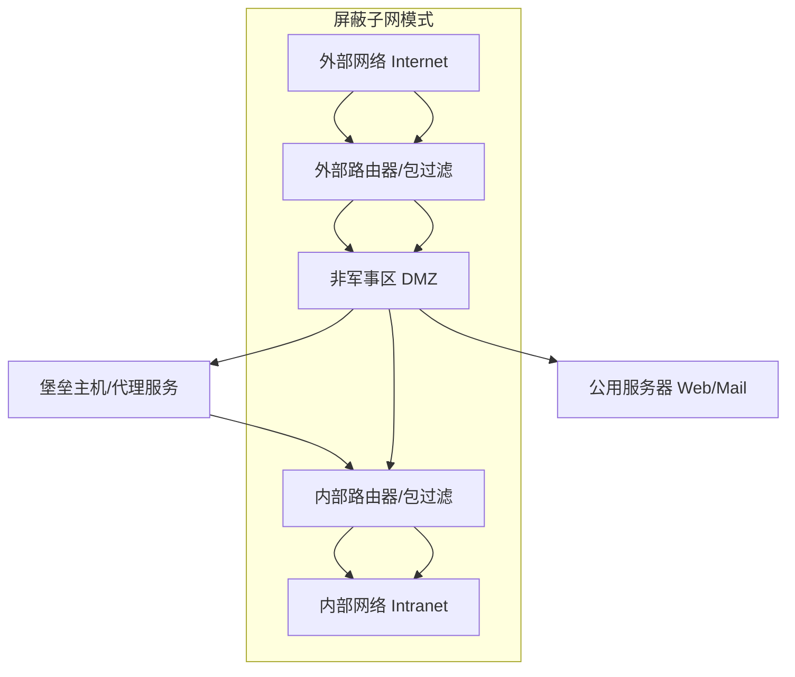
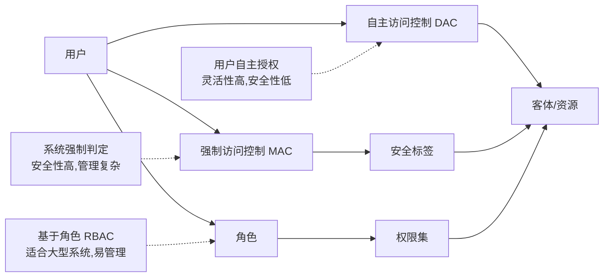

# 《系统分析与安全性设计》章节总结

## 书籍信息

- **书名**：系统分析与安全性设计（基于上传文件内容整合）
- **作者/讲师**：邹月平（51CTO学院微职位讲师，软考辅导用书编委会委员）
- **PDF 状态**：文本清晰，结构完整
- **OCR 状态**：良好，无明显识别错误

## 目录说明

本总结基于两份上传文档的内容进行结构化重组。由于原始文件为讲义或教材片段，未提供统一的标准目录，以下目录根据内容逻辑划分为两大核心模块：
1. **系统分析**：涵盖系统分析阶段的任务、详细调查方法、现有系统分析、业务流程建模及需求规格说明书。
2. **系统安全性分析与设计**：涵盖安全体系结构、加密技术、认证技术、密钥管理、防火墙、安全协议、入侵检测及访问控制。

## 全书核心主题

本书主要面向信息系统项目管理师、系统分析师等软考考生及从业人员，深入解析了系统开发生命周期中两个至关重要的阶段：**系统分析**与**安全性设计**。

在**系统分析**部分，重点阐述了如何从物理模型抽象出逻辑模型，通过详细调查（如访谈、问卷、现场观摩等）明确用户需求，并利用价值链、供应链等方法进行业务流程分析与优化。最终成果体现为《系统需求规格说明书》，它是系统设计与验收的依据。

在**安全性设计**部分，构建了从物理层到管理层的多层次安全体系。详细讲解了对称与非对称加密算法（DES, RSA）、数字签名、Hash算法、PKI/PMI基础设施、防火墙技术（包过滤、代理、状态检测）、安全协议（SSL, IPSec）以及多种访问控制模型（DAC, MAC, RBAC）。旨在帮助读者建立全方位的信息安全防护意识与技术能力。

---

## 第一部分：系统分析

### 1. 核心论点

本章解决“如何准确界定新系统‘做什么’”的问题。
作者认为：系统分析是逻辑设计阶段，核心任务是通过详细调查现有系统的物理模型，抽象出其逻辑本质，去除非本质因素，从而建立新系统的逻辑模型。这一过程必须与用户紧密协作，最终形成具有法律效力的《系统需求规格说明书》。

### 2. 关键概念

- **系统分析（逻辑设计）**：根据任务书范围，调查现有系统，指出局限性，确定新系统目标和逻辑功能，提出新系统逻辑模型。
- **详细调查**：比初步调查更细微、工作量更大，旨在深入了解信息处理的具体情况和问题。方法包括收集资料、开调查会、个别访问、书面调查、抽样调查、现场观摩、参加业务实践、阅读历史文档。
- **物理模型 vs 逻辑模型**：物理模型描述系统“怎么做”（涉及具体技术、设备、人员）；逻辑模型描述系统“做什么”（涉及业务本质、数据流、功能），是抽象后的结果。
- **业务流程分析**：目的是了解业务过程，明确部门关系，为流程合理化改造提供建议。方法包括价值链分析、客户关系分析、供应链分析、ERP分析法、业务流程重组（BPR）。
- **系统需求规格说明书（SRS）**：系统分析阶段的最终成果，是系统设计依据和系统验收标准。包含引言、需求、合格性规定、可追踪性等九大部分。

### 3. 逻辑推演 / 叙事脉络

系统分析遵循“调查 -> 分析 -> 建模 -> 文档化”的逻辑链条：
1.  **准备阶段**：在初步调查基础上，进行**详细调查**。采用多种方法（如访谈、观察）收集静态（组织结构）和动态（业务流程）信息。
2.  **现有系统分析**：
    *   首先获得现有系统的**物理模型**（客观反映现状）。
    *   其次抽象出**逻辑模型**（去伪存真，提取本质）。
    *   然后建立**新系统的逻辑模型**（优化和调整，明确新目标）。
    *   最后构建**新系统的物理模型**（属于系统设计阶段任务）。
3.  **专项分析**：
    *   **组织结构分析**：理清行政隶属、信息/物质/资金流动关系。
    *   **系统功能分析**：绘制功能体系图和功能流程图。
    *   **业务流程分析**：利用价值链等工具优化流程。
    *   **数据与数据流程分析**：汇总数据，分析属性（静态/动态），绘制数据流程图（DFD）。
4.  **成果固化**：编写《系统需求规格说明书》，并通过正式评审，作为后续开发的权威依据。

### 4. 经典金句 / 数据

> “系统分析阶段也称为逻辑设计阶段……系统分析是整个系统建设的关键阶段，也是信息系统建设与一般工程项目的重要区别之所在。”

> “在研究现有系统时千万不要‘闭门造车’，应该多与用户进行沟通，了解他们对现有系统的认识和评价。”

> “一旦通过评审，系统需求规格说明书将成为系统开发中的权威性文件，是系统设计阶段的主要依据。同时……也是将来对系统进行验收的标准之一。”

### 5. 流程图重建

#### 现有系统分析过程

#### 详细调查方法体系

---

## 第二部分：系统安全性分析与设计

### 1. 核心论点

本章解决“如何构建全方位、多层次的信息系统安全防护体系”的问题。
作者认为：安全不仅仅是技术问题，更是管理问题。必须从物理层、系统层、网络层、应用层和管理层五个维度构建防御体系。通过加密、认证、访问控制、防火墙及入侵检测等技术手段，结合严格的管理制度，实现数据的保密性、完整性、可用性及不可否认性。

### 2. 关键概念

- **安全体系层次**：物理层（环境/设备）、系统层（OS安全）、网络层（传输/路由）、应用层（软件/数据）、管理层（制度/人员）。
- **对称加密 vs 非对称加密**：
    - **对称加密**（私钥）：加解密密钥相同，速度快，如DES（56位密钥）、3DES（112/168位等效强度）、IDEA（128位密钥）。适合大量数据加密。
    - **非对称加密**（公钥）：公私钥不同，不可互推，速度慢，如RSA。适合数字签名和密钥交换。
- **数字签名**：基于非对称加密和Hash算法，保证完整性、身份认证和不可否认性。
- **Hash算法**：单向散列函数，生成消息摘要（MD5为128位，SHA-1为160位），用于验证数据完整性。
- **防火墙类型**：包过滤型（网络层，快但不安全）、电路级网关（会话层）、应用网关（应用层，安全但慢）、代理服务型（完全隔离，最安全但性能低）、状态检测型（兼顾效率与安全）。
- **访问控制模型**：
    - **DAC**（自主访问控制）：用户自主决定权限，灵活但存在传递性风险。
    - **MAC**（强制访问控制）：基于安全标签，严格但管理复杂。
    - **RBAC**（基于角色的访问控制）：用户-角色-权限，适合大型系统，管理方便。
    - **TBAC**（基于任务的访问控制）：动态权限，随任务生命周期分配与回收。

### 3. 逻辑推演 / 叙事脉络

安全性设计遵循“体系架构 -> 核心技术 -> 防护设备 -> 访问策略”的逻辑：
1.  **体系构建**：首先确立五层安全体系（物理、系统、网络、应用、管理），强调管理的重要性。
2.  **密码学基础**：
    *   介绍**加密技术**：对称（DES/3DES/IDEA）与非对称（RSA）的优缺点及应用场景。
    *   介绍**认证技术**：数字签名（防抵赖、防篡改）、Hash算法（完整性校验）、数字证书（CA/PKI体系）。
3.  **网络边界防护**：
    *   **防火墙**：从包过滤到状态检测再到自适应代理，演变历程体现了对安全性与性能平衡的追求。介绍了DMZ（非军事区）架构。
    *   **安全协议**：SSL/HTTPS（Web安全）、IPSec（IP层安全）、PGP（邮件安全）。
4.  **主动防御**：
    *   **入侵检测（IDS）与防护（IPS）**：作为防火墙的补充，分为基于主机/网络，异常/误用检测。IPS具备阻断能力。
5.  **内部访问控制**：
    *   从传统的DAC/MAC发展到更灵活的RBAC和动态的TBAC，解决大规模系统中的权限管理难题。

### 4. 经典金句 / 数据

> “加密用于确保数据的保密性，阻止对手的被动攻击……而认证用于确保数据发送者和接收者的真实性和报文的完整性，阻止对手的主动攻击。”

> “管理的制度化极大程度地影响着整个计算机网络的安全，严格的安全管理制度、明确的部门安全职责划分与合理的人员角色配置，都可以在很大程度上降低其他层次的安全漏洞。”

> “RBAC基于策略无关的特性，使它几乎可以描述任何安全策略，甚至DAC和MAC也可以用RBAC来描述。”

### 5. 流程图重建

#### 数字信封（PGP原理）流程

#### 防火墙体系结构模式

#### 访问控制模型对比

